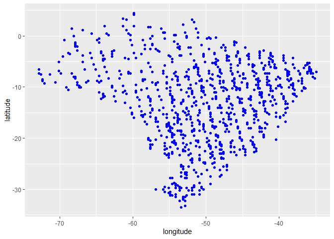
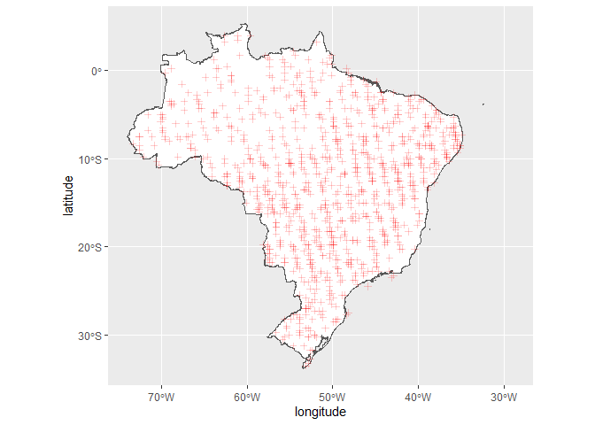
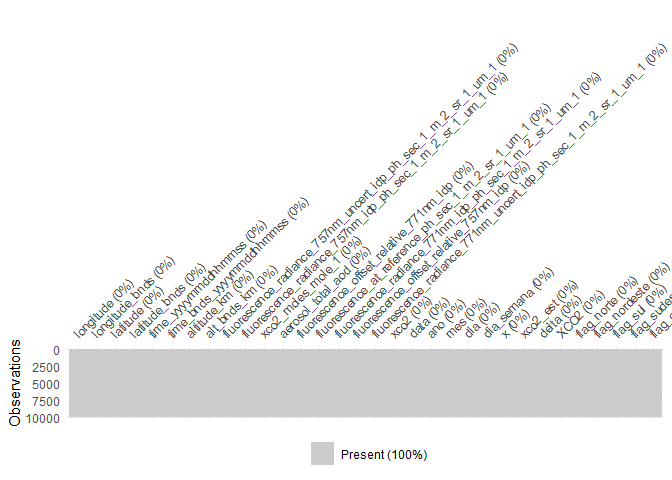
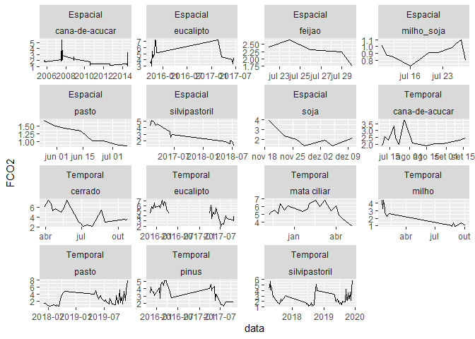
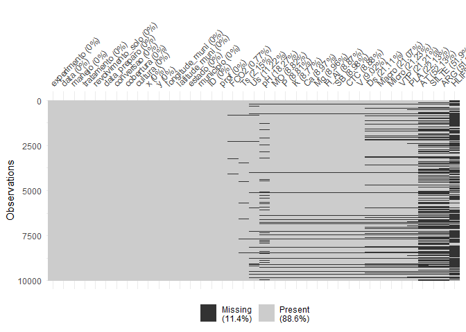
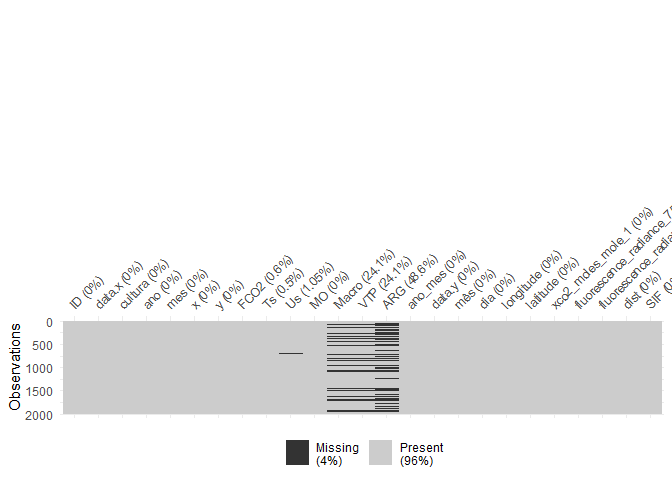
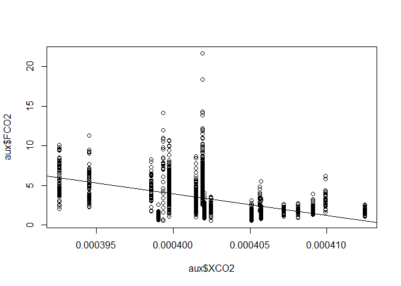
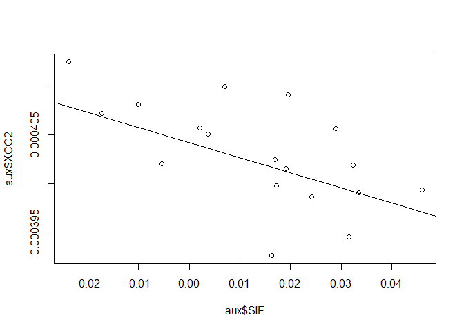

Aprendizado de Máquina: Emissão de CO<sub>2</sub> e CO<sub>2</sub>
Atmosférico
================

<!-- README.md is generated from README.Rmd. Please edit that file -->

##### *Panosso AR; Costa LM; Lima LR; Crispim, VS*

##### Financiamento: Fapesp (202102487-0); CNPq-PIBIC (Nº 2517 - EDITAL 4/2021)

# Resumo do Projeto

## Aquisição dos dados de CO<sub>2</sub> atmosférico (xCO2)

A aquisição de dados e o processamento inicial destes pode ser
encontrada no link:

#### <https://arpanosso.github.io/oco2/>

Para facilitar o acesso, os dodos foram adquiridos por meio do pacote
`{fco2}`.

``` r
## Instalando pacotes (se necessário)
# install.packages("devtools")
# Sys.getenv("GITHUB_PAT")
# Sys.unsetenv("GITHUB_PAT")
# Sys.getenv("GITHUB_PAT")
# devtools::install_github("arpanosso/fco2r")

library(tidyverse)
library(geobr)
library(fco2r)
library(skimr)
source("R/my_fun.R")
```

### Conhecendo a base de dados de CO<sub>2</sub> atmosférico

``` r
help(oco2_br)
#> starting httpd help server ... done
glimpse(oco2_br)
#> Rows: 37,387
#> Columns: 32
#> $ longitude                                                     <dbl> -70.5, -~
#> $ longitude_bnds                                                <chr> "-71.0:-~
#> $ latitude                                                      <dbl> -5.5, -4~
#> $ latitude_bnds                                                 <chr> "-6.0:-5~
#> $ time_yyyymmddhhmmss                                           <dbl> 2.014091~
#> $ time_bnds_yyyymmddhhmmss                                      <chr> "2014090~
#> $ altitude_km                                                   <dbl> 3307.8, ~
#> $ alt_bnds_km                                                   <chr> "0.0:661~
#> $ fluorescence_radiance_757nm_uncert_idp_ph_sec_1_m_2_sr_1_um_1 <dbl> 7.272876~
#> $ fluorescence_radiance_757nm_idp_ph_sec_1_m_2_sr_1_um_1        <dbl> 2.537127~
#> $ xco2_moles_mole_1                                             <dbl> 0.000394~
#> $ aerosol_total_aod                                             <dbl> 0.148579~
#> $ fluorescence_offset_relative_771nm_idp                        <dbl> 0.016753~
#> $ fluorescence_at_reference_ph_sec_1_m_2_sr_1_um_1              <dbl> 2.615319~
#> $ fluorescence_radiance_771nm_idp_ph_sec_1_m_2_sr_1_um_1        <dbl> 3.088582~
#> $ fluorescence_offset_relative_757nm_idp                        <dbl> 0.013969~
#> $ fluorescence_radiance_771nm_uncert_idp_ph_sec_1_m_2_sr_1_um_1 <dbl> 5.577878~
#> $ xco2                                                          <dbl> 394.3686~
#> $ data                                                          <dttm> 2014-09~
#> $ ano                                                           <dbl> 2014, 20~
#> $ mes                                                           <dbl> 9, 9, 9,~
#> $ dia                                                           <int> 6, 6, 6,~
#> $ dia_semana                                                    <dbl> 7, 7, 7,~
#> $ x                                                             <int> 7, 8, 11~
#> $ xco2_est                                                      <dbl> 392.7080~
#> $ delta                                                         <dbl> -1.66062~
#> $ XCO2                                                          <dbl> 387.2781~
#> $ flag_norte                                                    <lgl> TRUE, TR~
#> $ flag_nordeste                                                 <lgl> FALSE, F~
#> $ flag_sul                                                      <lgl> FALSE, F~
#> $ flag_sudeste                                                  <lgl> FALSE, F~
#> $ flag_centroeste                                               <lgl> FALSE, F~
```

### Alguns gráficos

``` r
oco2_br %>% 
  sample_n(1000) %>% 
  ggplot(aes(x = longitude, y = latitude)) + 
  geom_point(color = "blue")
```

<!-- -->

### Carregando o contorno do território

``` r
br <- geobr::read_country(showProgress = FALSE)
#> Using year 2010
```

### Construindo o mapa com os pontos

``` r
br %>% 
  ggplot() +
  geom_sf(fill = "white") +
    geom_point(data=oco2_br %>% 
                 sample_n(2000),
             aes(x=longitude,y=latitude),
             shape=3,
             col="red",
             alpha=0.2)
```

<!-- -->

Observe que utilizamos `dplyr::sample_n()` para retirar apenas

amostras do total do banco de dados
.

#### Estatísticas descritivas

``` r
skim(oco2_br)
```

|                                                  |         |
|:-------------------------------------------------|:--------|
| Name                                             | oco2_br |
| Number of rows                                   | 37387   |
| Number of columns                                | 32      |
| \_\_\_\_\_\_\_\_\_\_\_\_\_\_\_\_\_\_\_\_\_\_\_   |         |
| Column type frequency:                           |         |
| character                                        | 4       |
| logical                                          | 5       |
| numeric                                          | 22      |
| POSIXct                                          | 1       |
| \_\_\_\_\_\_\_\_\_\_\_\_\_\_\_\_\_\_\_\_\_\_\_\_ |         |
| Group variables                                  | None    |

Data summary

**Variable type: character**

| skim_variable            | n_missing | complete_rate | min | max | empty | n_unique | whitespace |
|:-------------------------|----------:|--------------:|----:|----:|------:|---------:|-----------:|
| longitude_bnds           |         0 |             1 |  11 |  11 |     0 |       39 |          0 |
| latitude_bnds            |         0 |             1 |   7 |  11 |     0 |       38 |          0 |
| time_bnds_yyyymmddhhmmss |         0 |             1 |  29 |  29 |     0 |     1765 |          0 |
| alt_bnds_km              |         0 |             1 |  11 |  20 |     0 |       64 |          0 |

**Variable type: logical**

| skim_variable   | n_missing | complete_rate | mean | count                  |
|:----------------|----------:|--------------:|-----:|:-----------------------|
| flag_norte      |         0 |             1 | 0.34 | FAL: 24511, TRU: 12876 |
| flag_nordeste   |         0 |             1 | 0.23 | FAL: 28765, TRU: 8622  |
| flag_sul        |         0 |             1 | 0.08 | FAL: 34531, TRU: 2856  |
| flag_sudeste    |         0 |             1 | 0.12 | FAL: 32834, TRU: 4553  |
| flag_centroeste |         0 |             1 | 0.21 | FAL: 29612, TRU: 7775  |

**Variable type: numeric**

| skim_variable                                                    | n_missing | complete_rate |          mean |           sd |            p0 |           p25 |           p50 |           p75 |          p100 | hist  |
|:-----------------------------------------------------------------|----------:|--------------:|--------------:|-------------:|--------------:|--------------:|--------------:|--------------:|--------------:|:------|
| longitude                                                        |         0 |             1 | -5.120000e+01 | 8.280000e+00 | -7.350000e+01 | -5.650000e+01 | -5.050000e+01 | -4.450000e+01 | -3.550000e+01 | ▂▃▇▇▅ |
| latitude                                                         |         0 |             1 | -1.179000e+01 | 7.850000e+00 | -3.250000e+01 | -1.750000e+01 | -1.050000e+01 | -5.500000e+00 |  4.500000e+00 | ▂▃▇▇▃ |
| time_yyyymmddhhmmss                                              |         0 |             1 |  2.016952e+13 | 1.564571e+10 |  2.014091e+13 |  2.016020e+13 |  2.017052e+13 |  2.018092e+13 |  2.020012e+13 | ▇▇▅▆▇ |
| altitude_km                                                      |         0 |             1 |  3.123200e+03 | 1.108800e+02 |  2.555700e+03 |  3.056350e+03 |  3.126310e+03 |  3.196250e+03 |  3.307800e+03 | ▁▁▂▇▇ |
| fluorescence_radiance_757nm_uncert_idp_ph_sec_1\_m_2\_sr_1\_um_1 |         0 |             1 |  8.520719e+17 | 5.599367e+18 | -9.999990e+05 |  6.323256e+17 |  6.951592e+17 |  7.671609e+17 |  9.365539e+20 | ▇▁▁▁▁ |
| fluorescence_radiance_757nm_idp_ph_sec_1\_m_2\_sr_1\_um_1        |         0 |             1 | -1.358150e+18 | 1.946775e+20 | -3.400736e+22 |  7.735159e+17 |  1.676353e+18 |  2.566089e+18 |  2.316112e+20 | ▁▁▁▁▇ |
| xco2_moles_mole_1                                                |         0 |             1 |  0.000000e+00 | 0.000000e+00 |  0.000000e+00 |  0.000000e+00 |  0.000000e+00 |  0.000000e+00 |  0.000000e+00 | ▁▁▇▁▁ |
| aerosol_total_aod                                                |         0 |             1 |  4.828100e+02 | 7.848572e+04 |  2.000000e-02 |  1.100000e-01 |  1.700000e-01 |  2.600000e-01 |  1.487623e+07 | ▇▁▁▁▁ |
| fluorescence_offset_relative_771nm_idp                           |         0 |             1 | -4.814400e+02 | 2.193698e+04 | -9.999990e+05 |  1.000000e-02 |  1.000000e-02 |  2.000000e-02 |  1.230000e+00 | ▁▁▁▁▇ |
| fluorescence_at_reference_ph_sec_1\_m_2\_sr_1\_um_1              |         0 |             1 |  1.296932e+18 | 2.245185e+18 | -8.394901e+19 |  2.014560e+17 |  1.268715e+18 |  2.395217e+18 |  8.610756e+19 | ▁▁▇▁▁ |
| fluorescence_radiance_771nm_idp_ph_sec_1\_m_2\_sr_1\_um_1        |         0 |             1 |  1.904438e+18 | 2.236381e+18 | -8.453983e+19 |  9.694709e+17 |  1.987682e+18 |  2.918792e+18 |  4.338306e+19 | ▁▁▁▇▁ |
| fluorescence_offset_relative_757nm_idp                           |         0 |             1 | -3.744400e+02 | 1.934763e+04 | -9.999990e+05 |  1.000000e-02 |  1.000000e-02 |  2.000000e-02 |  2.086000e+01 | ▁▁▁▁▇ |
| fluorescence_radiance_771nm_uncert_idp_ph_sec_1\_m_2\_sr_1\_um_1 |         0 |             1 |  5.235574e+17 | 7.580471e+16 | -9.999990e+05 |  4.695467e+17 |  5.216793e+17 |  5.736367e+17 |  1.143215e+18 | ▁▂▇▁▁ |
| xco2                                                             |         0 |             1 |  4.000400e+02 | 5.090000e+00 |  3.573800e+02 |  3.966000e+02 |  4.003200e+02 |  4.037000e+02 |  4.386500e+02 | ▁▁▇▁▁ |
| ano                                                              |         0 |             1 |  2.016880e+03 | 1.570000e+00 |  2.014000e+03 |  2.016000e+03 |  2.017000e+03 |  2.018000e+03 |  2.020000e+03 | ▇▇▅▆▇ |
| mes                                                              |         0 |             1 |  6.820000e+00 | 3.170000e+00 |  1.000000e+00 |  4.000000e+00 |  7.000000e+00 |  9.000000e+00 |  1.200000e+01 | ▆▆▇▆▇ |
| dia                                                              |         0 |             1 |  1.572000e+01 | 8.680000e+00 |  1.000000e+00 |  8.000000e+00 |  1.600000e+01 |  2.300000e+01 |  3.100000e+01 | ▇▇▇▇▆ |
| dia_semana                                                       |         0 |             1 |  3.980000e+00 | 2.020000e+00 |  1.000000e+00 |  2.000000e+00 |  4.000000e+00 |  6.000000e+00 |  7.000000e+00 | ▇▃▃▃▇ |
| x                                                                |         0 |             1 |  5.566068e+04 | 3.223617e+04 |  7.000000e+00 |  2.811250e+04 |  5.606800e+04 |  8.290750e+04 |  1.117280e+05 | ▇▇▇▇▇ |
| xco2_est                                                         |         0 |             1 |  3.997700e+02 | 4.090000e+00 |  3.927100e+02 |  3.962700e+02 |  3.998200e+02 |  4.032300e+02 |  4.068800e+02 | ▇▇▇▇▇ |
| delta                                                            |         0 |             1 | -2.700000e-01 | 3.120000e+00 | -4.452000e+01 | -2.190000e+00 | -6.800000e-01 |  1.210000e+00 |  4.728000e+01 | ▁▁▇▁▁ |
| XCO2                                                             |         0 |             1 |  3.858900e+02 | 3.120000e+00 |  3.383400e+02 |  3.844100e+02 |  3.862900e+02 |  3.878000e+02 |  4.301400e+02 | ▁▁▇▁▁ |

**Variable type: POSIXct**

| skim_variable | n_missing | complete_rate | min                 | max                 | median              | n_unique |
|:--------------|----------:|--------------:|:--------------------|:--------------------|:--------------------|---------:|
| data          |         0 |             1 | 2014-09-06 12:00:00 | 2020-01-20 12:00:00 | 2017-05-18 12:00:00 |     1765 |

``` r
visdat::vis_miss(oco2_br %>% 
                   sample_n(10000))
#> Warning: `gather_()` was deprecated in tidyr 1.2.0.
#> Please use `gather()` instead.
#> This warning is displayed once every 8 hours.
#> Call `lifecycle::last_lifecycle_warnings()` to see where this warning was generated.
```

<!-- -->

``` r
oco2 <- oco2_br
```

### Conhecendo a base de dados de emissão de CO<sub>2</sub> do solo

``` r
help(data_fco2)
glimpse(data_fco2)
#> Rows: 15,397
#> Columns: 39
#> $ experimento       <chr> "Espacial", "Espacial", "Espacial", "Espacial", "Esp~
#> $ data              <date> 2001-07-10, 2001-07-10, 2001-07-10, 2001-07-10, 200~
#> $ manejo            <chr> "convencional", "convencional", "convencional", "con~
#> $ tratamento        <chr> "AD_GN", "AD_GN", "AD_GN", "AD_GN", "AD_GN", "AD_GN"~
#> $ revolvimento_solo <lgl> FALSE, FALSE, FALSE, FALSE, FALSE, FALSE, FALSE, FAL~
#> $ data_preparo      <date> 2001-07-01, 2001-07-01, 2001-07-01, 2001-07-01, 200~
#> $ conversao         <date> 1970-01-01, 1970-01-01, 1970-01-01, 1970-01-01, 197~
#> $ cobertura         <lgl> TRUE, TRUE, TRUE, TRUE, TRUE, TRUE, TRUE, TRUE, TRUE~
#> $ cultura           <chr> "milho_soja", "milho_soja", "milho_soja", "milho_soj~
#> $ x                 <dbl> 0, 40, 80, 10, 25, 40, 55, 70, 20, 40, 60, 10, 70, 3~
#> $ y                 <dbl> 0, 0, 0, 10, 10, 10, 10, 10, 20, 20, 20, 25, 25, 30,~
#> $ longitude_muni    <dbl> 782062.7, 782062.7, 782062.7, 782062.7, 782062.7, 78~
#> $ latitude_muni     <dbl> 7647674, 7647674, 7647674, 7647674, 7647674, 7647674~
#> $ estado            <chr> "SP", "SP", "SP", "SP", "SP", "SP", "SP", "SP", "SP"~
#> $ municipio         <chr> "Jaboticabal", "Jaboticabal", "Jaboticabal", "Jaboti~
#> $ ID                <int> 1, 2, 3, 4, 5, 6, 7, 8, 9, 10, 11, 12, 13, 14, 15, 1~
#> $ prof              <chr> "0-0.1", "0-0.1", "0-0.1", "0-0.1", "0-0.1", "0-0.1"~
#> $ FCO2              <dbl> 1.080, 0.825, 1.950, 0.534, 0.893, 0.840, 1.110, 1.8~
#> $ Ts                <dbl> 18.73, 18.40, 19.20, 18.28, 18.35, 18.47, 19.10, 18.~
#> $ Us                <dbl> NA, NA, NA, NA, NA, NA, NA, NA, NA, NA, NA, NA, NA, ~
#> $ pH                <dbl> 5.1, 5.1, 5.8, 5.3, 5.5, 5.7, 5.6, 6.4, 5.3, 5.8, 5.~
#> $ MO                <dbl> 20, 24, 25, 23, 23, 21, 26, 23, 25, 24, 26, 20, 25, ~
#> $ P                 <dbl> 46, 26, 46, 78, 60, 46, 55, 92, 55, 60, 48, 71, 125,~
#> $ K                 <dbl> 2.4, 2.2, 5.3, 3.6, 3.4, 2.9, 4.0, 2.3, 3.3, 3.6, 4.~
#> $ Ca                <dbl> 25, 30, 41, 27, 33, 38, 35, 94, 29, 36, 37, 29, 50, ~
#> $ Mg                <dbl> 11, 11, 25, 11, 15, 20, 16, 65, 11, 17, 15, 11, 30, ~
#> $ H_Al              <dbl> 31, 31, 22, 28, 27, 22, 22, 12, 31, 28, 28, 31, 18, ~
#> $ SB                <dbl> 38.4, 43.2, 71.3, 41.6, 50.6, 60.9, 55.0, 161.3, 43.~
#> $ CTC               <dbl> 69.4, 74.2, 93.3, 69.6, 77.9, 82.9, 77.0, 173.3, 74.~
#> $ V                 <dbl> 55, 58, 76, 60, 65, 73, 71, 93, 58, 67, 67, 58, 82, ~
#> $ Ds                <dbl> NA, NA, NA, NA, NA, NA, NA, NA, NA, NA, NA, NA, NA, ~
#> $ Macro             <dbl> NA, NA, NA, NA, NA, NA, NA, NA, NA, NA, NA, NA, NA, ~
#> $ Micro             <dbl> NA, NA, NA, NA, NA, NA, NA, NA, NA, NA, NA, NA, NA, ~
#> $ VTP               <dbl> NA, NA, NA, NA, NA, NA, NA, NA, NA, NA, NA, NA, NA, ~
#> $ PLA               <dbl> NA, NA, NA, NA, NA, NA, NA, NA, NA, NA, NA, NA, NA, ~
#> $ AT                <dbl> NA, NA, NA, NA, NA, NA, NA, NA, NA, NA, NA, NA, NA, ~
#> $ SILTE             <dbl> NA, NA, NA, NA, NA, NA, NA, NA, NA, NA, NA, NA, NA, ~
#> $ ARG               <dbl> NA, NA, NA, NA, NA, NA, NA, NA, NA, NA, NA, NA, NA, ~
#> $ HLIFS             <dbl> NA, NA, NA, NA, NA, NA, NA, NA, NA, NA, NA, NA, NA, ~
```

### Visualização de dados

``` r
data_fco2 %>% 
  group_by(experimento, cultura, data) %>% 
  summarise(FCO2 = mean(FCO2, na.rm=TRUE)) %>% 
  ggplot(aes(y=FCO2, x=data)) +
  geom_line() +
   facet_wrap(~experimento+ cultura, scale="free")
#> `summarise()` has grouped output by 'experimento', 'cultura'. You can override
#> using the `.groups` argument.
```

<!-- -->

### Construindo o mapa com os pontos

``` r
br %>% 
  ggplot() +
  geom_sf(fill = "white") +
    geom_point(data=oco2 %>% sample_n(1000),
             aes(x=longitude,y=latitude),
             shape=3,
             col="red",
             alpha=0.2)
```

<!-- -->

Observe que utilizamos `dplyr::sample_n()` para retirar apenas

amostras do total do banco de dados
.

#### Estatísticas descritivas

``` r
skim(data_fco2)
```

|                                                  |           |
|:-------------------------------------------------|:----------|
| Name                                             | data_fco2 |
| Number of rows                                   | 15397     |
| Number of columns                                | 39        |
| \_\_\_\_\_\_\_\_\_\_\_\_\_\_\_\_\_\_\_\_\_\_\_   |           |
| Column type frequency:                           |           |
| character                                        | 7         |
| Date                                             | 3         |
| logical                                          | 2         |
| numeric                                          | 27        |
| \_\_\_\_\_\_\_\_\_\_\_\_\_\_\_\_\_\_\_\_\_\_\_\_ |           |
| Group variables                                  | None      |

Data summary

**Variable type: character**

| skim_variable | n_missing | complete_rate | min | max | empty | n_unique | whitespace |
|:--------------|----------:|--------------:|----:|----:|------:|---------:|-----------:|
| experimento   |         0 |             1 |   8 |   8 |     0 |        2 |          0 |
| manejo        |         0 |             1 |   6 |  15 |     0 |       10 |          0 |
| tratamento    |         0 |             1 |   2 |  10 |     0 |       21 |          0 |
| cultura       |         0 |             1 |   4 |  14 |     0 |       11 |          0 |
| estado        |         0 |             1 |   2 |   2 |     0 |        2 |          0 |
| municipio     |         0 |             1 |   7 |  20 |     0 |        6 |          0 |
| prof          |         0 |             1 |   5 |   7 |     0 |        2 |          0 |

**Variable type: Date**

| skim_variable | n_missing | complete_rate | min        | max        | median     | n_unique |
|:--------------|----------:|--------------:|:-----------|:-----------|:-----------|---------:|
| data          |         0 |             1 | 2001-07-10 | 2019-12-01 | 2014-07-12 |      205 |
| data_preparo  |         0 |             1 | 1986-03-01 | 2019-04-01 | 2002-01-01 |       14 |
| conversao     |         0 |             1 | 1970-01-01 | 2009-07-03 | 1986-03-01 |       11 |

**Variable type: logical**

| skim_variable     | n_missing | complete_rate | mean | count      |
|:------------------|----------:|--------------:|-----:|:-----------|
| revolvimento_solo |         0 |             1 |    0 | FAL: 15397 |
| cobertura         |         0 |             1 |    1 | TRU: 15397 |

**Variable type: numeric**

| skim_variable  | n_missing | complete_rate |       mean |         sd |        p0 |        p25 |        p50 |        p75 |       p100 | hist  |
|:---------------|----------:|--------------:|-----------:|-----------:|----------:|-----------:|-----------:|-----------:|-----------:|:------|
| x              |         0 |          1.00 | 1392083.56 | 2923710.70 |      0.00 |       0.00 |      30.00 |     100.00 | 7749472.16 | ▇▁▁▁▂ |
| y              |         0 |          1.00 |  495854.97 | 1722529.75 |      0.00 |       0.00 |      27.00 |      80.00 | 7630525.47 | ▇▁▁▁▁ |
| longitude_muni |         0 |          1.00 | 1067926.05 | 1796771.47 | 456798.63 |  458447.46 |  458447.46 |  792043.56 | 7638196.06 | ▇▁▁▁▁ |
| latitude_muni  |         0 |          1.00 | 7231328.21 | 1754220.76 | 795907.06 | 7635356.70 | 7749398.84 | 7749821.85 | 7758831.37 | ▁▁▁▁▇ |
| ID             |         0 |          1.00 |      40.52 |      31.52 |      1.00 |      13.00 |      35.00 |      60.00 |     141.00 | ▇▅▃▁▁ |
| FCO2           |       110 |          0.99 |       2.78 |       2.08 |     -3.42 |       1.30 |       2.16 |       3.75 |      46.93 | ▇▁▁▁▁ |
| Ts             |       317 |          0.98 |      21.84 |       6.76 |      1.00 |      19.33 |      22.50 |      26.15 |     195.63 | ▇▁▁▁▁ |
| Us             |      1754 |          0.89 |      16.31 |       8.93 |      0.00 |      10.00 |      14.06 |      22.00 |      89.00 | ▇▅▁▁▁ |
| pH             |      2802 |          0.82 |       4.64 |       1.13 |      3.50 |       4.00 |       4.50 |       5.15 |      52.00 | ▇▁▁▁▁ |
| MO             |      1355 |          0.91 |      21.59 |      12.60 |      1.35 |      12.00 |      23.00 |      29.00 |      61.26 | ▆▇▇▂▁ |
| P              |      1355 |          0.91 |      20.95 |      24.74 |      1.00 |       6.00 |      15.48 |      27.36 |     253.00 | ▇▁▁▁▁ |
| K              |      1348 |          0.91 |       2.40 |       2.21 |      0.03 |       0.90 |       1.70 |       3.40 |      34.00 | ▇▁▁▁▁ |
| Ca             |      1376 |          0.91 |      17.20 |      14.57 |      1.10 |       6.00 |      11.00 |      26.00 |      94.00 | ▇▃▁▁▁ |
| Mg             |      1376 |          0.91 |      10.13 |       5.65 |      0.32 |       7.00 |      10.00 |      13.00 |      65.00 | ▇▂▁▁▁ |
| H_Al           |      1362 |          0.91 |      46.89 |      29.38 |      0.00 |      26.00 |      42.29 |      72.00 |     121.00 | ▅▇▆▂▂ |
| SB             |      1376 |          0.91 |      29.69 |      20.10 |      1.54 |      15.60 |      23.80 |      42.00 |     161.30 | ▇▃▁▁▁ |
| CTC            |      1369 |          0.91 |      77.10 |      32.99 |      4.62 |      59.23 |      83.40 |     103.20 |     173.30 | ▂▃▇▃▁ |
| V              |      1383 |          0.91 |      41.68 |      20.05 |      4.96 |      22.00 |      43.00 |      58.00 |     100.00 | ▆▆▇▅▁ |
| Ds             |      3284 |          0.79 |       1.38 |       0.17 |      0.88 |       1.24 |       1.38 |       1.52 |       1.86 | ▁▆▇▇▁ |
| Macro          |      3277 |          0.79 |       8.55 |       7.85 |    -45.30 |       0.15 |       8.13 |      13.64 |      49.77 | ▁▁▇▃▁ |
| Micro          |      3298 |          0.79 |      25.30 |      17.13 |      0.07 |       0.37 |      33.86 |      38.30 |      52.42 | ▅▁▂▇▁ |
| VTP            |      3298 |          0.79 |      42.34 |      15.65 |     -4.68 |      40.81 |      46.25 |      51.32 |      87.80 | ▂▁▇▃▁ |
| PLA            |      3438 |          0.78 |      29.57 |      11.80 |    -47.30 |      21.27 |      32.41 |      38.15 |      79.80 | ▁▁▅▇▁ |
| AT             |      8083 |          0.48 |    1013.33 |    1358.81 |     11.72 |     236.00 |     593.62 |     816.00 |    4542.73 | ▇▁▁▁▂ |
| SILTE          |      8048 |          0.48 |     229.26 |     336.37 |      1.26 |      50.87 |      73.65 |     188.00 |    1395.00 | ▇▁▁▁▁ |
| ARG            |      8055 |          0.48 |     995.41 |    1560.32 |     27.19 |     173.27 |     403.69 |     609.50 |    5244.76 | ▇▁▁▁▂ |
| HLIFS          |     10872 |          0.29 |   14590.11 |   17253.55 |    158.39 |    1110.15 |    2409.80 |   29707.78 |   84692.90 | ▇▃▁▁▁ |

``` r
visdat::vis_miss(data_fco2 %>% 
                   sample_n(15000))
```

<!-- -->

``` r
atributos <- data_fco2
```

``` r
# Lista do xCO2
# 01 passar as datas que estão em ano-mes-dia-horas-min-segundos
# para uma outra coluna denominada 'data' como ano-mes-dia
# Fazer em pipeline, usar o mutate do pacote dplyr e provavelmente
# a funçoes do pacote lubridate

oco2 <- oco2 |>
  dplyr::mutate (
    ano = time_yyyymmddhhmmss%/%1e10,
    mês = time_yyyymmddhhmmss%/%1e8 %%100,
    dia = time_yyyymmddhhmmss%/%1e6 %%100,
    data = as.Date(stringr::str_c(ano,mês,dia,sep="-"))
    )|>
  dplyr::glimpse()
#> Rows: 37,387
#> Columns: 33
#> $ longitude                                                     <dbl> -70.5, -~
#> $ longitude_bnds                                                <chr> "-71.0:-~
#> $ latitude                                                      <dbl> -5.5, -4~
#> $ latitude_bnds                                                 <chr> "-6.0:-5~
#> $ time_yyyymmddhhmmss                                           <dbl> 2.014091~
#> $ time_bnds_yyyymmddhhmmss                                      <chr> "2014090~
#> $ altitude_km                                                   <dbl> 3307.8, ~
#> $ alt_bnds_km                                                   <chr> "0.0:661~
#> $ fluorescence_radiance_757nm_uncert_idp_ph_sec_1_m_2_sr_1_um_1 <dbl> 7.272876~
#> $ fluorescence_radiance_757nm_idp_ph_sec_1_m_2_sr_1_um_1        <dbl> 2.537127~
#> $ xco2_moles_mole_1                                             <dbl> 0.000394~
#> $ aerosol_total_aod                                             <dbl> 0.148579~
#> $ fluorescence_offset_relative_771nm_idp                        <dbl> 0.016753~
#> $ fluorescence_at_reference_ph_sec_1_m_2_sr_1_um_1              <dbl> 2.615319~
#> $ fluorescence_radiance_771nm_idp_ph_sec_1_m_2_sr_1_um_1        <dbl> 3.088582~
#> $ fluorescence_offset_relative_757nm_idp                        <dbl> 0.013969~
#> $ fluorescence_radiance_771nm_uncert_idp_ph_sec_1_m_2_sr_1_um_1 <dbl> 5.577878~
#> $ xco2                                                          <dbl> 394.3686~
#> $ data                                                          <date> 2014-09~
#> $ ano                                                           <dbl> 2014, 20~
#> $ mes                                                           <dbl> 9, 9, 9,~
#> $ dia                                                           <dbl> 6, 6, 6,~
#> $ dia_semana                                                    <dbl> 7, 7, 7,~
#> $ x                                                             <int> 7, 8, 11~
#> $ xco2_est                                                      <dbl> 392.7080~
#> $ delta                                                         <dbl> -1.66062~
#> $ XCO2                                                          <dbl> 387.2781~
#> $ flag_norte                                                    <lgl> TRUE, TR~
#> $ flag_nordeste                                                 <lgl> FALSE, F~
#> $ flag_sul                                                      <lgl> FALSE, F~
#> $ flag_sudeste                                                  <lgl> FALSE, F~
#> $ flag_centroeste                                               <lgl> FALSE, F~
#> $ mês                                                           <dbl> 9, 9, 9,~
```

Listando as datas em ambos os bancos de dados

``` r
# Lista das datas de FCO2 
lista_data_fco2 <- unique(atributos$data)
lista_data_oco2 <- unique(oco2$data)
datas_fco2 <- paste0(lubridate::year(lista_data_fco2),"-",lubridate::month(lista_data_fco2)) %>% unique()

datas_oco2 <- paste0(lubridate::year(lista_data_oco2),"-",lubridate::month(lista_data_oco2)) %>% unique()
datas <- datas_fco2[datas_fco2 %in% datas_oco2]
```

Criação as listas de datas, que é chave para a mesclagem dos arquivos.

``` r
fco2 <- atributos %>% 
  mutate(ano_mes = paste0(lubridate::year(data),"-",lubridate::month(data))) %>% 
  dplyr::filter(ano_mes %in% datas)

xco2 <- oco2 %>%   
  mutate(ano_mes=paste0(ano,"-",mês)) %>% 
  dplyr::filter(ano_mes %in% datas)
```

Coordenadas das cidades

``` r
unique(xco2$ano_mes) == 
unique(fco2$ano_mes)
#>  [1]  TRUE  TRUE  TRUE  TRUE  TRUE  TRUE  TRUE  TRUE  TRUE  TRUE FALSE FALSE
#> [13] FALSE  TRUE  TRUE  TRUE  TRUE  TRUE  TRUE  TRUE  TRUE  TRUE  TRUE  TRUE
#> [25]  TRUE  TRUE  TRUE  TRUE  TRUE
```

Abordagem usando o join do `{dplyr}`

``` r
memory.limit(size=10001)
#> [1] 10001
data_set <- left_join(fco2 %>% 
            mutate(ano = lubridate::year(data),
                   mes = lubridate::month(data)
                   ) %>% 
            select(ID, data, cultura, ano, mes, x,y, FCO2, Ts,
                   Us, MO, Macro, VTP, ARG, ano_mes), 
          xco2 %>% 
            select(data,mês,dia,longitude,latitude,xco2_moles_mole_1,fluorescence_radiance_757nm_idp_ph_sec_1_m_2_sr_1_um_1,fluorescence_radiance_771nm_idp_ph_sec_1_m_2_sr_1_um_1, ano_mes), by = "ano_mes") %>% 
  mutate(dist = sqrt((longitude-(-51.423519))^2+(latitude-(-20.362911))^2),
         SIF = (fluorescence_radiance_757nm_idp_ph_sec_1_m_2_sr_1_um_1  + 1.5*fluorescence_radiance_771nm_idp_ph_sec_1_m_2_sr_1_um_1)/2) #

data_set<-data_set %>%
  filter(dist <= .159) 
visdat::vis_miss(data_set %>% sample_n(2000))
```

<!-- -->

``` r
# head(data_set)
# fco2$ano_mes %>% unique()
# xco2$ano_mes %>% unique()
# data_set$ano_mes %>% unique()
```

``` r
aux <- data_set %>% 
  mutate(SIF = ifelse(SIF <=0, mean(data_set$SIF, na.rm=TRUE),SIF)) %>% 
  group_by(ano_mes, cultura) %>% 
  summarise(FCO2 = mean(FCO2, na.rm=TRUE),
            XCO2 = mean(xco2_moles_mole_1, na.rm=TRUE),
            SIF = mean(SIF, na.rm=TRUE))
#> `summarise()` has grouped output by 'ano_mes'. You can override using the
#> `.groups` argument.

plot(aux$SIF, aux$FCO2)
abline(lm((aux$FCO2~aux$SIF)))
```

<!-- -->

``` r
summary.lm(lm((aux$FCO2~aux$SIF)))
#> 
#> Call:
#> lm(formula = (aux$FCO2 ~ aux$SIF))
#> 
#> Residuals:
#>     Min      1Q  Median      3Q     Max 
#> -2.5601 -0.7685 -0.2498  0.7287  3.2973 
#> 
#> Coefficients:
#>              Estimate Std. Error t value Pr(>|t|)    
#> (Intercept) 1.697e+00  3.140e-01   5.404 1.58e-06 ***
#> aux$SIF     7.805e-19  1.121e-19   6.960 5.22e-09 ***
#> ---
#> Signif. codes:  0 '***' 0.001 '**' 0.01 '*' 0.05 '.' 0.1 ' ' 1
#> 
#> Residual standard error: 1.3 on 53 degrees of freedom
#>   (1 observation deleted due to missingness)
#> Multiple R-squared:  0.4776, Adjusted R-squared:  0.4677 
#> F-statistic: 48.45 on 1 and 53 DF,  p-value: 5.223e-09

plot(aux$XCO2, aux$FCO2)
abline(lm((aux$FCO2~aux$XCO2)))
```

<!-- -->

``` r
summary.lm(lm((aux$FCO2~aux$XCO2)))
#> 
#> Call:
#> lm(formula = (aux$FCO2 ~ aux$XCO2))
#> 
#> Residuals:
#>     Min      1Q  Median      3Q     Max 
#> -2.5967 -1.1203  0.0094  1.0345  5.0067 
#> 
#> Coefficients:
#>               Estimate Std. Error t value Pr(>|t|)    
#> (Intercept)      96.43      17.18   5.612 7.46e-07 ***
#> aux$XCO2    -231337.00   42779.92  -5.408 1.56e-06 ***
#> ---
#> Signif. codes:  0 '***' 0.001 '**' 0.01 '*' 0.05 '.' 0.1 ' ' 1
#> 
#> Residual standard error: 1.443 on 53 degrees of freedom
#>   (1 observation deleted due to missingness)
#> Multiple R-squared:  0.3556, Adjusted R-squared:  0.3434 
#> F-statistic: 29.24 on 1 and 53 DF,  p-value: 1.557e-06


plot(aux$SIF, aux$XCO2)
abline(lm((aux$XCO2~aux$SIF)))
```

<!-- -->

``` r
summary.lm(lm((aux$XCO2~aux$SIF)))
#> 
#> Call:
#> lm(formula = (aux$XCO2 ~ aux$SIF))
#> 
#> Residuals:
#>        Min         1Q     Median         3Q        Max 
#> -7.048e-06 -2.944e-06 -9.258e-07  3.147e-06  8.491e-06 
#> 
#> Coefficients:
#>               Estimate Std. Error t value Pr(>|t|)    
#> (Intercept)  4.044e-04  1.008e-06 401.183  < 2e-16 ***
#> aux$SIF     -1.164e-24  3.622e-25  -3.214  0.00221 ** 
#> ---
#> Signif. codes:  0 '***' 0.001 '**' 0.01 '*' 0.05 '.' 0.1 ' ' 1
#> 
#> Residual standard error: 4.207e-06 on 54 degrees of freedom
#> Multiple R-squared:  0.1606, Adjusted R-squared:  0.145 
#> F-statistic: 10.33 on 1 and 54 DF,  p-value: 0.002209
```

## Estatística Descritiva

``` r
aux <- data_set %>% 
  mutate(SIF = ifelse(SIF <=0, mean(aux$SIF, na.rm=TRUE),SIF)) %>% 
 # group_by(ano_mes, cultura) %>% 
  summarise(FCO2 = mean(FCO2, na.rm=TRUE),
            XCO2 = mean(xco2_moles_mole_1, na.rm=TRUE),
            SIF = mean(SIF, na.rm=TRUE))
```
