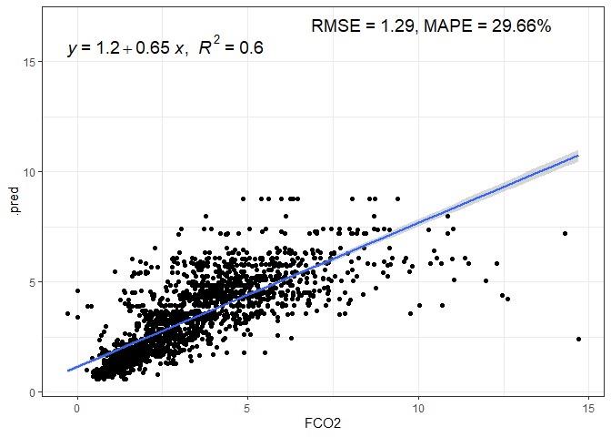
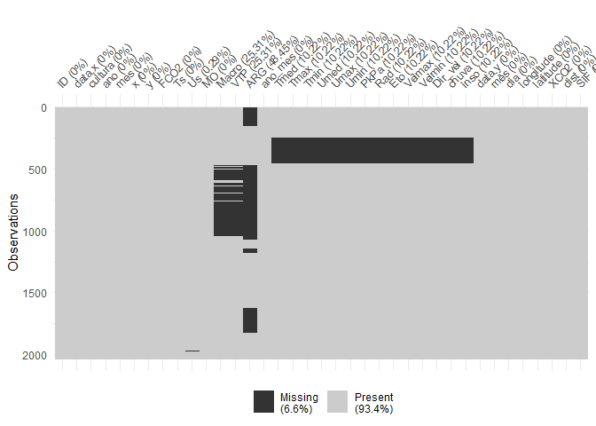
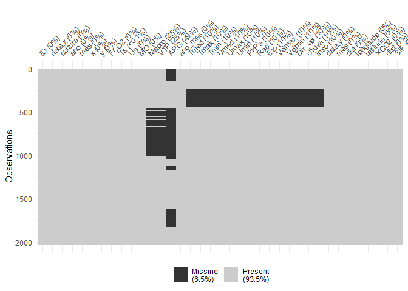
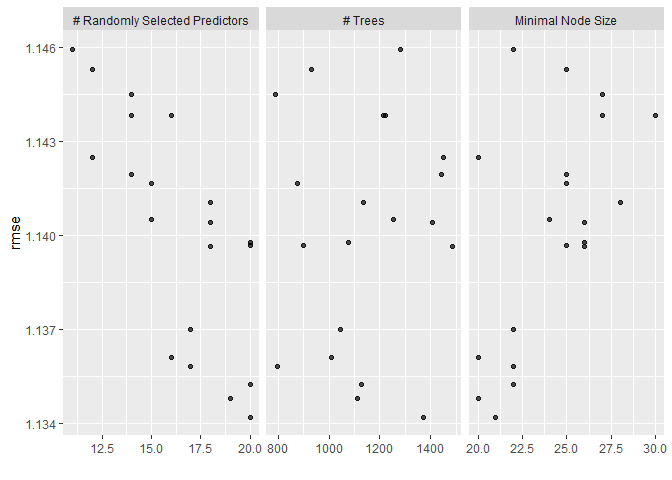
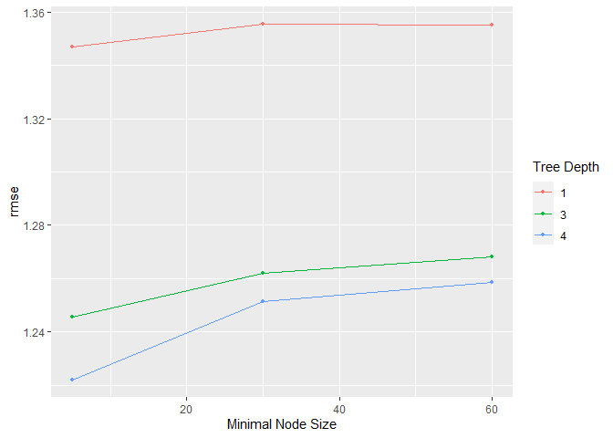
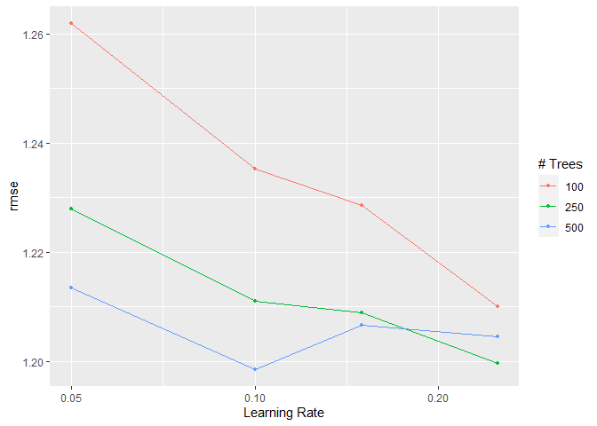

Aprendizado de Máquina: Emissão de CO<sub>2</sub> e CO<sub>2</sub>
Atmosférico e SIF
================

<!-- README.md is generated from README.Rmd. Please edit that file -->

##### *Panosso AR; Costa LM; Lima LR; Crispim, VS*

##### Financiamento: Fapesp (202102487-0); CNPq-PIBIC (Nº 2517 - EDITAL 4/2021)

# Resumo do Projeto

## Aquisição dos dados de CO<sub>2</sub> atmosférico (xCO2)

A aquisição de dados e o processamento inicial destes pode ser
encontrada no link:

#### <https://arpanosso.github.io/oco2/>

Para facilitar o acesso, os dodos foram adquiridos por meio do pacote
`{fco2}`.

``` r
## Instalando pacotes (se necessário)
# install.packages("devtools")
# Sys.getenv("GITHUB_PAT")
# Sys.unsetenv("GITHUB_PAT")
# Sys.getenv("GITHUB_PAT")
# devtools::install_github("arpanosso/fco2r")
library(readxl)
library(tidyverse)
library(geobr)
library(fco2r)
library(skimr)
library(tidymodels)
library(ISLR)
library(modeldata)
library(vip)
library(ggpubr)
source("R/my_fun.R")
```

### Carregando os dados meteorológicos

``` r
dados_estacao <- read_excel("data-raw/xlsx/estacao_meteorologia_ilha_solteira.xlsx", na = "NA") 
  # dplyr::mutate_if(is.character, as.numeric)
dplyr::glimpse(dados_estacao)
#> Rows: 1,826
#> Columns: 16
#> $ data    <dttm> 2015-01-01, 2015-01-02, 2015-01-03, 2015-01-04, 2015-01-05, 2~
#> $ Tmed    <dbl> 30.5, 30.0, 26.8, 27.1, 27.0, 27.6, 30.2, 28.2, 28.5, 29.9, 30~
#> $ Tmax    <dbl> 36.5, 36.7, 35.7, 34.3, 33.2, 36.4, 37.2, 32.4, 37.1, 38.1, 38~
#> $ Tmin    <dbl> 24.6, 24.5, 22.9, 22.7, 22.3, 22.8, 22.7, 24.0, 23.0, 23.3, 24~
#> $ Umed    <dbl> 66.6, 70.4, 82.7, 76.8, 81.6, 75.5, 65.8, 70.0, 72.9, 67.6, 66~
#> $ Umax    <dbl> 89.6, 93.6, 99.7, 95.0, 98.3, 96.1, 99.2, 83.4, 90.7, 97.4, 90~
#> $ Umin    <dbl> 42.0, 44.2, 52.9, 43.8, 57.1, 47.5, 34.1, 57.4, 42.7, 38.3, 37~
#> $ PkPa    <dbl> 97.2, 97.3, 97.4, 97.5, 97.4, 97.5, 97.4, 97.4, 97.4, 97.4, 97~
#> $ Rad     <dbl> 23.6, 24.6, 20.2, 21.4, 17.8, 19.2, 27.0, 15.2, 21.6, 24.3, 24~
#> $ PAR     <dbl> 496.6, 513.3, 430.5, 454.0, 378.2, 405.4, 565.7, 317.2, 467.5,~
#> $ Eto     <dbl> 5.7, 5.8, 4.9, 5.1, 4.1, 4.8, 6.2, 4.1, 5.5, 5.7, 5.9, 6.1, 6.~
#> $ Velmax  <dbl> 6.1, 4.8, 12.1, 6.2, 5.1, 4.5, 4.6, 5.7, 5.8, 5.2, 5.2, 4.7, 6~
#> $ Velmin  <dbl> 1.0, 1.0, 1.2, 1.0, 0.8, 0.9, 0.9, 1.5, 1.2, 0.8, 0.8, 1.2, 1.~
#> $ Dir_vel <dbl> 17.4, 261.9, 222.0, 25.0, 56.9, 74.9, 53.4, 89.0, 144.8, 303.9~
#> $ chuva   <dbl> 0.0, 0.0, 3.3, 0.0, 0.0, 0.0, 0.0, 0.0, 0.0, 0.0, 0.0, 0.0, 0.~
#> $ inso    <dbl> 7.9, 8.7, 5.2, 6.2, 3.4, 4.5, 10.5, 1.3, 6.3, 8.4, 8.6, 7.9, 1~
```

### Conhecendo a base de dados de CO<sub>2</sub> atmosférico

``` r
# help(oco2_br)
# glimpse(oco2_br)
```

### Alguns gráficos

``` r
oco2_br %>% 
  sample_n(1000) %>% 
  ggplot(aes(x = longitude, y = latitude)) + 
  geom_point(color = "blue")
```

<!-- -->

### Carregando o contorno do território

``` r
br <- geobr::read_country(showProgress = FALSE)
```

### Construindo o mapa com os pontos

``` r
br %>% 
  ggplot() +
  geom_sf(fill = "white") +
    geom_point(data=oco2_br %>% 
                 sample_n(1000),
             aes(x=longitude,y=latitude),
             shape=3,
             col="red",
             alpha=0.2)
```

<!-- -->

Observe que utilizamos `dplyr::sample_n()` para retirar apenas

amostras do total do banco de dados
.

#### Estatísticas descritivas

``` r
# skim(oco2_br)
```

``` r
oco2 <- oco2_br
```

### Conhecendo a base de dados de emissão de CO<sub>2</sub> do solo

``` r
# help(data_fco2)
glimpse(data_fco2)
#> Rows: 15,397
#> Columns: 39
#> $ experimento       <chr> "Espacial", "Espacial", "Espacial", "Espacial", "Esp~
#> $ data              <date> 2001-07-10, 2001-07-10, 2001-07-10, 2001-07-10, 200~
#> $ manejo            <chr> "convencional", "convencional", "convencional", "con~
#> $ tratamento        <chr> "AD_GN", "AD_GN", "AD_GN", "AD_GN", "AD_GN", "AD_GN"~
#> $ revolvimento_solo <lgl> FALSE, FALSE, FALSE, FALSE, FALSE, FALSE, FALSE, FAL~
#> $ data_preparo      <date> 2001-07-01, 2001-07-01, 2001-07-01, 2001-07-01, 200~
#> $ conversao         <date> 1970-01-01, 1970-01-01, 1970-01-01, 1970-01-01, 197~
#> $ cobertura         <lgl> TRUE, TRUE, TRUE, TRUE, TRUE, TRUE, TRUE, TRUE, TRUE~
#> $ cultura           <chr> "milho_soja", "milho_soja", "milho_soja", "milho_soj~
#> $ x                 <dbl> 0, 40, 80, 10, 25, 40, 55, 70, 20, 40, 60, 10, 70, 3~
#> $ y                 <dbl> 0, 0, 0, 10, 10, 10, 10, 10, 20, 20, 20, 25, 25, 30,~
#> $ longitude_muni    <dbl> 782062.7, 782062.7, 782062.7, 782062.7, 782062.7, 78~
#> $ latitude_muni     <dbl> 7647674, 7647674, 7647674, 7647674, 7647674, 7647674~
#> $ estado            <chr> "SP", "SP", "SP", "SP", "SP", "SP", "SP", "SP", "SP"~
#> $ municipio         <chr> "Jaboticabal", "Jaboticabal", "Jaboticabal", "Jaboti~
#> $ ID                <int> 1, 2, 3, 4, 5, 6, 7, 8, 9, 10, 11, 12, 13, 14, 15, 1~
#> $ prof              <chr> "0-0.1", "0-0.1", "0-0.1", "0-0.1", "0-0.1", "0-0.1"~
#> $ FCO2              <dbl> 1.080, 0.825, 1.950, 0.534, 0.893, 0.840, 1.110, 1.8~
#> $ Ts                <dbl> 18.73, 18.40, 19.20, 18.28, 18.35, 18.47, 19.10, 18.~
#> $ Us                <dbl> NA, NA, NA, NA, NA, NA, NA, NA, NA, NA, NA, NA, NA, ~
#> $ pH                <dbl> 5.1, 5.1, 5.8, 5.3, 5.5, 5.7, 5.6, 6.4, 5.3, 5.8, 5.~
#> $ MO                <dbl> 20, 24, 25, 23, 23, 21, 26, 23, 25, 24, 26, 20, 25, ~
#> $ P                 <dbl> 46, 26, 46, 78, 60, 46, 55, 92, 55, 60, 48, 71, 125,~
#> $ K                 <dbl> 2.4, 2.2, 5.3, 3.6, 3.4, 2.9, 4.0, 2.3, 3.3, 3.6, 4.~
#> $ Ca                <dbl> 25, 30, 41, 27, 33, 38, 35, 94, 29, 36, 37, 29, 50, ~
#> $ Mg                <dbl> 11, 11, 25, 11, 15, 20, 16, 65, 11, 17, 15, 11, 30, ~
#> $ H_Al              <dbl> 31, 31, 22, 28, 27, 22, 22, 12, 31, 28, 28, 31, 18, ~
#> $ SB                <dbl> 38.4, 43.2, 71.3, 41.6, 50.6, 60.9, 55.0, 161.3, 43.~
#> $ CTC               <dbl> 69.4, 74.2, 93.3, 69.6, 77.9, 82.9, 77.0, 173.3, 74.~
#> $ V                 <dbl> 55, 58, 76, 60, 65, 73, 71, 93, 58, 67, 67, 58, 82, ~
#> $ Ds                <dbl> NA, NA, NA, NA, NA, NA, NA, NA, NA, NA, NA, NA, NA, ~
#> $ Macro             <dbl> NA, NA, NA, NA, NA, NA, NA, NA, NA, NA, NA, NA, NA, ~
#> $ Micro             <dbl> NA, NA, NA, NA, NA, NA, NA, NA, NA, NA, NA, NA, NA, ~
#> $ VTP               <dbl> NA, NA, NA, NA, NA, NA, NA, NA, NA, NA, NA, NA, NA, ~
#> $ PLA               <dbl> NA, NA, NA, NA, NA, NA, NA, NA, NA, NA, NA, NA, NA, ~
#> $ AT                <dbl> NA, NA, NA, NA, NA, NA, NA, NA, NA, NA, NA, NA, NA, ~
#> $ SILTE             <dbl> NA, NA, NA, NA, NA, NA, NA, NA, NA, NA, NA, NA, NA, ~
#> $ ARG               <dbl> NA, NA, NA, NA, NA, NA, NA, NA, NA, NA, NA, NA, NA, ~
#> $ HLIFS             <dbl> NA, NA, NA, NA, NA, NA, NA, NA, NA, NA, NA, NA, NA, ~
```

### Visualização de dados

``` r
data_fco2 %>% 
  group_by(experimento, cultura, data) %>% 
  summarise(FCO2 = mean(FCO2, na.rm=TRUE)) %>% 
  ggplot(aes(y=FCO2, x=data)) +
  geom_line() +
   facet_wrap(~experimento + cultura, scale="free")
```

<!-- -->

### Construindo o mapa com os pontos

``` r
br %>% 
  ggplot() +
  geom_sf(fill = "white") +
    geom_point(data=oco2 %>% sample_n(1000),
             aes(x=longitude,y=latitude),
             shape=3,
             col="red",
             alpha=0.2)
```

<!-- -->

Observe que utilizamos `dplyr::sample_n()` para retirar apenas

amostras do total do banco de dados
.

#### Estatísticas descritivas

``` r
# skim(data_fco2)
```

``` r
visdat::vis_miss(data_fco2 %>% 
                   sample_n(15000))
```

<!-- -->

#### Estatísticas descritivas

``` r
# skim(dados_estacao)
```

``` r
dados_estacao <- dados_estacao %>% 
                   drop_na()
visdat::vis_miss(dados_estacao)
```

<!-- -->

``` r
# Lista do xCO2
# 01 passar as datas que estão em ano-mes-dia-horas-min-segundos
# para uma outra coluna denominada 'data' como ano-mes-dia
# Fazer em pipeline, usar o mutate do pacote dplyr e provavelmente
# a funçoes do pacote lubridate
oco2 <- oco2  %>% 
  mutate (
    ano = time_yyyymmddhhmmss%/%1e10,
    mês = time_yyyymmddhhmmss%/%1e8 %%100,
    dia = time_yyyymmddhhmmss%/%1e6 %%100,
    data = as.Date(stringr::str_c(ano,mês,dia,sep="-"))
  ) %>% 
  glimpse()
#> Rows: 37,387
#> Columns: 22
#> $ longitude                                                     <dbl> -70.5, -~
#> $ longitude_bnds                                                <chr> "-71.0:-~
#> $ latitude                                                      <dbl> -5.5, -4~
#> $ latitude_bnds                                                 <chr> "-6.0:-5~
#> $ time_yyyymmddhhmmss                                           <dbl> 2.014091~
#> $ time_bnds_yyyymmddhhmmss                                      <chr> "2014090~
#> $ altitude_km                                                   <dbl> 3307.8, ~
#> $ alt_bnds_km                                                   <chr> "0.0:661~
#> $ fluorescence_radiance_757nm_uncert_idp_ph_sec_1_m_2_sr_1_um_1 <dbl> 7.272876~
#> $ fluorescence_radiance_757nm_idp_ph_sec_1_m_2_sr_1_um_1        <dbl> 2.537127~
#> $ xco2_moles_mole_1                                             <dbl> 0.000394~
#> $ aerosol_total_aod                                             <dbl> 0.148579~
#> $ fluorescence_offset_relative_771nm_idp                        <dbl> 0.016753~
#> $ fluorescence_at_reference_ph_sec_1_m_2_sr_1_um_1              <dbl> 2.615319~
#> $ fluorescence_radiance_771nm_idp_ph_sec_1_m_2_sr_1_um_1        <dbl> 3.088582~
#> $ fluorescence_offset_relative_757nm_idp                        <dbl> 0.013969~
#> $ fluorescence_radiance_771nm_uncert_idp_ph_sec_1_m_2_sr_1_um_1 <dbl> 5.577878~
#> $ XCO2                                                          <dbl> 387.2781~
#> $ ano                                                           <dbl> 2014, 20~
#> $ mês                                                           <dbl> 9, 9, 9,~
#> $ dia                                                           <dbl> 6, 6, 6,~
#> $ data                                                          <date> 2014-09~
```

``` r
dados_estacao <- dados_estacao %>% 
  mutate(
    ano = lubridate::year(data),
    mês = lubridate::month(data),
    dia = lubridate::day(data),
    data = as.Date(stringr::str_c(ano,mês,dia,sep="-"))
)
```

## Manipulação dos bancos de dados Fco2 e de estação.

``` r
# atributos <- data_fco2
atributos <- left_join(data_fco2, dados_estacao, by = "data")
```

#### Listando as datas em ambos os bancos de dados

``` r
# Lista das datas de FCO2 
lista_data_fco2 <- unique(atributos$data)
lista_data_oco2 <- unique(oco2$data)
lista_data_estacao <- unique(dados_estacao$data)
datas_fco2 <- paste0(lubridate::year(lista_data_fco2),"-",lubridate::month(lista_data_fco2)) %>% unique()

datas_oco2 <- paste0(lubridate::year(lista_data_oco2),"-",lubridate::month(lista_data_oco2)) %>% unique()
datas <- datas_fco2[datas_fco2 %in% datas_oco2]
```

Criação as listas de datas, que é chave para a mesclagem dos arquivos.

``` r
fco2 <- atributos %>% 
  mutate(ano_mes = paste0(lubridate::year(data),"-",lubridate::month(data))) %>% 
  dplyr::filter(ano_mes %in% datas)

xco2 <- oco2 %>%   
  mutate(ano_mes=paste0(ano,"-",mês)) %>% 
  dplyr::filter(ano_mes %in% datas)
```

Coordenadas das cidades

``` r
unique(xco2$ano_mes)[unique(xco2$ano_mes) %>% order()] == 
unique(fco2$ano_mes)[unique(fco2$ano_mes) %>% order()]
#>  [1] TRUE TRUE TRUE TRUE TRUE TRUE TRUE TRUE TRUE TRUE TRUE TRUE TRUE TRUE TRUE
#> [16] TRUE TRUE TRUE TRUE TRUE TRUE TRUE TRUE TRUE TRUE TRUE TRUE TRUE TRUE
```

Abordagem usando o join do `{dplyr}`

``` r
memory.limit(size=10001)
#> [1] 10001
data_set <- left_join(fco2 %>% 
            mutate(ano = lubridate::year(data),
                   mes = lubridate::month(data)
                   ) %>% 
            select(ID, data, cultura, ano, mes, x,y, FCO2, Ts,
                   Us, MO, Macro, VTP, ARG, ano_mes,Tmed,Tmax, Tmin, Umed,
                   Umax, Umin, PkPa, Rad, Eto, Velmax, Velmin, Dir_vel,
                   chuva, inso), 
          xco2 %>% 
            select(data,mês,dia,longitude,latitude,XCO2,fluorescence_radiance_757nm_idp_ph_sec_1_m_2_sr_1_um_1,fluorescence_radiance_771nm_idp_ph_sec_1_m_2_sr_1_um_1, ano_mes), by = "ano_mes") %>% 
  mutate(dist = sqrt((longitude-(-51.423519))^2+(latitude-(-20.362911))^2),
         SIF = (fluorescence_radiance_757nm_idp_ph_sec_1_m_2_sr_1_um_1*2.6250912*10^(-19)  + 1.5*fluorescence_radiance_771nm_idp_ph_sec_1_m_2_sr_1_um_1* 2.57743*10^(-19))/2)

data_set<-data_set %>%
  select(-fluorescence_radiance_757nm_idp_ph_sec_1_m_2_sr_1_um_1, -fluorescence_radiance_771nm_idp_ph_sec_1_m_2_sr_1_um_1 )  %>% 
  filter(dist <= .16, FCO2 <= 20 ) 

visdat::vis_miss(data_set %>% 
                   sample_n(2000)
                 )
```

<!-- -->

``` r
# head(data_set)
# fco2$ano_mes %>% unique()
# xco2$ano_mes %>% unique()
# data_set$ano_mes %>% unique()
```

``` r
tab_medias <- data_set %>% 
  mutate(SIF = ifelse(SIF <=0, mean(data_set$SIF, na.rm=TRUE),SIF)) %>% 
  group_by(ano_mes, cultura) %>% 
  summarise(FCO2 = mean(FCO2, na.rm=TRUE),
            XCO2 = mean(XCO2, na.rm=TRUE),
            SIF = mean(SIF, na.rm=TRUE))

tab_medias %>% 
  ggplot(aes(x=XCO2, y=SIF)) +
  geom_point()+
  geom_smooth(method = "lm")+
  theme_bw()
```

<!-- -->

``` r

tab_medias %>% 
  ggplot(aes(x=XCO2, y=FCO2)) +
  geom_point()+
  geom_smooth(method = "lm")+
  theme_bw()
```

<!-- -->

``` r

tab_medias %>% 
  ggplot(aes(x=FCO2, y=SIF)) +
  geom_point()+
  geom_smooth(method = "lm") +
  theme_bw()
```

<!-- -->

## Estatística Descritiva

Completar posteriormente.

# Abordagem de Parendizado de Máquina

## Definindo a base de treino e a base de teste

Definindo a semente aleatória mais o conjunto de dados para teste e
treino dos modelos

``` r
data_set_ml <- data_set #%>%
#   select(cultura, FCO2, Ts,
#                    Us, MO, Tmed,Tmax, Tmin, Umed,
#                    Umax, Umin, PkPa, Rad, Eto, Velmax, Velmin, Dir_vel,
#                    chuva, inso, SIF, xco2) %>% 
#   drop_na(FCO2, Ts,Us,Tmed:inso)
# visdat::vis_miss(data_set_ml)
# set.seed(1235)
fco2_initial_split <- initial_split(data_set_ml, prop = 0.75)
```

``` r
fco2_train <- training(fco2_initial_split)
# fco2_test <- testing(fco2_initial_split)
# visdat::vis_miss(fco2_test)
fco2_train  %>% 
  ggplot(aes(x=FCO2, y=..density..))+
  geom_histogram(bins = 30, color="black",  fill="lightgray")+
  geom_density(alpha=.05,fill="red")+
  theme_bw() +
  labs(x="FCO2", y = "Densidade")
```

<!-- -->

``` r
fco2_train  %>% 
  ggplot(aes(x=SIF, y=..density..))+
  geom_histogram(bins = 11, color="black",  fill="lightgray")+
  geom_density(alpha=.05,fill="green")+
  theme_bw() +
  labs(x="SIF", y = "Densidade")
```

<!-- -->

``` r
fco2_train  %>% 
  ggplot(aes(x=XCO2, y=..density..))+
  geom_histogram(bins = 15, color="black",  fill="lightgray")+
  geom_density(alpha=.05,fill="blue")+
  theme_bw() +
  labs(x="XCO2", y = "Densidade")
```

<!-- -->

## Correlação

``` r
glimpse(fco2_train)
#> Rows: 6,103
#> Columns: 37
#> $ ID        <int> 64, 51, 76, 101, 3, 16, 66, 14, 65, 45, 59, 10, 25, 45, 62, ~
#> $ data.x    <date> 2019-09-21, 2019-08-03, 2017-03-15, 2017-06-03, 2017-07-28,~
#> $ cultura   <chr> "pasto", "silvipastoril", "eucalipto", "eucalipto", "cerrado~
#> $ ano       <dbl> 2019, 2019, 2017, 2017, 2017, 2018, 2015, 2018, 2018, 2018, ~
#> $ mes       <dbl> 9, 8, 3, 6, 7, 7, 10, 7, 7, 6, 4, 9, 4, 6, 7, 10, 7, 6, 6, 3~
#> $ x         <dbl> 7747952, 7749399, 20, 80, 0, 7747998, 35, 7748006, 7747897, ~
#> $ y         <dbl> 456878.7, 457163.2, 80.0, 100.0, 0.0, 456881.0, 70.0, 456856~
#> $ FCO2      <dbl> 3.77, 1.51, 5.25, 3.37, 2.34, 0.82, 3.45, 0.79, 0.87, 1.27, ~
#> $ Ts        <dbl> 25.40000, 28.50000, 28.00000, 21.80000, 4.00000, 21.30000, 2~
#> $ Us        <dbl> 5.200000, 15.300000, 9.633034, 12.042492, 22.100000, 14.8127~
#> $ MO        <dbl> 23, 5, 40, 30, 10, 19, 32, 23, 18, 21, 32, 14, 19, 29, 31, 4~
#> $ Macro     <dbl> 0.10000000, 10.84000000, NA, NA, 16.21000000, 0.12000000, 0.~
#> $ VTP       <dbl> 0.42000, 51.82000, NA, NA, 45.49000, 0.33000, 40.37482, 0.35~
#> $ ARG       <dbl> 137.0000, NA, NA, NA, NA, 133.7300, NA, 114.1100, 150.8000, ~
#> $ ano_mes   <chr> "2019-9", "2019-8", "2017-3", "2017-6", "2017-7", "2018-7", ~
#> $ Tmed      <dbl> 28.5, 15.7, 28.4, 22.0, 22.8, 17.7, 29.7, 17.7, 23.9, 25.4, ~
#> $ Tmax      <dbl> 37.1, 21.3, 34.1, 30.0, 30.1, 21.1, 38.2, 21.1, 33.4, 34.6, ~
#> $ Tmin      <dbl> 22.1, 10.6, 22.6, 15.4, 16.3, 14.8, 22.8, 14.8, 16.0, 17.4, ~
#> $ Umed      <dbl> 73.1, 66.9, 73.3, 74.7, 52.0, 82.8, 62.8, 82.8, 60.1, 54.6, ~
#> $ Umax      <dbl> 96.1, 84.7, 95.3, 90.8, 71.6, 96.7, 92.3, 96.7, 98.6, 91.8, ~
#> $ Umin      <dbl> 42.9, 53.5, 52.0, 54.7, 33.9, 63.7, 33.1, 63.7, 27.7, 27.2, ~
#> $ PkPa      <dbl> 97.4, 98.2, 97.3, 97.8, 98.1, 98.1, 97.1, 98.1, 97.6, 97.5, ~
#> $ Rad       <dbl> 15.5, 7.0, 20.5, 13.8, 14.6, 3.9, 19.7, 3.9, 12.5, 12.4, NA,~
#> $ Eto       <dbl> 4.4, 2.3, 4.7, 2.8, 3.8, 1.6, 5.3, 1.6, 2.8, 3.0, NA, 3.3, N~
#> $ Velmax    <dbl> 5.3, 6.4, 5.2, 4.6, 6.4, 6.1, 5.1, 6.1, 4.3, 4.2, NA, 6.5, N~
#> $ Velmin    <dbl> 1.4, 2.3, 1.2, 1.2, 1.7, 2.1, 1.3, 2.1, 0.8, 0.9, NA, 1.7, N~
#> $ Dir_vel   <dbl> 138.9, 241.4, 78.4, 93.0, 85.9, 237.1, 95.6, 237.1, 85.2, 50~
#> $ chuva     <dbl> 0.0, 0.0, 0.0, 0.0, 0.0, 0.0, 0.0, 0.0, 0.0, 0.0, NA, 0.0, N~
#> $ inso      <dbl> 5.5, 0.0, 7.5, 8.2, 7.7, 0.0, 6.4, 0.0, 5.5, 6.8, NA, 4.0, N~
#> $ data.y    <date> 2019-09-30, 2019-08-29, 2017-03-25, 2017-06-20, 2017-07-22,~
#> $ mês       <dbl> 9, 8, 3, 6, 7, 7, 10, 7, 7, 6, 4, 9, 4, 6, 7, 10, 7, 6, 6, 3~
#> $ dia       <dbl> 30, 29, 25, 20, 22, 9, 21, 9, 18, 16, 7, 11, 30, 16, 9, 21, ~
#> $ longitude <dbl> -51.5, -51.5, -51.5, -51.5, -51.5, -51.5, -51.5, -51.5, -51.~
#> $ latitude  <dbl> -20.5, -20.5, -20.5, -20.5, -20.5, -20.5, -20.5, -20.5, -20.~
#> $ XCO2      <dbl> 387.0282, 390.1713, 383.5677, 386.2278, 387.4659, 381.6135, ~
#> $ dist      <dbl> 0.1569801, 0.1569801, 0.1569801, 0.1569801, 0.1569801, 0.156~
#> $ SIF       <dbl> 0.44584525, 0.19841400, 0.22238866, 0.46547278, 0.26792742, ~
fco2_train   %>%    select(-c(ID,ano,mes,x,y,latitude,longitude,dist,mês,dia)) %>% 
  select(where(is.numeric)) %>%
  drop_na() %>% 
  cor()  %>%  
  corrplot::corrplot()
```

<!-- -->

## Data-prep

``` r
fco2_recipe <- recipe(FCO2 ~ ., data = fco2_train %>% 
                        select(-c(data.x,data.y,ID,ano,mes,x,y,latitude,longitude,dist,mês,dia,ano_mes))
) %>%  
  step_normalize(all_numeric_predictors())  %>% 
  step_novel(all_nominal_predictors()) %>% 
  step_zv(all_predictors()) %>%
  #step_naomit(c(Ts, Us)) %>% 
  #step_poly(c(Ts, Us), degree = 3)  %>%  
  step_dummy(all_nominal_predictors())
bake(prep(fco2_recipe), new_data = NULL)
#> # A tibble: 6,103 x 29
#>         Ts      Us      MO  Macro    VTP    ARG     Tmed   Tmax   Tmin   Umed
#>      <dbl>   <dbl>   <dbl>  <dbl>  <dbl>  <dbl>    <dbl>  <dbl>  <dbl>  <dbl>
#>  1  0.465  -1.22    0.0796 -0.751 -1.56  -0.966  1.04     1.22   0.928  0.297
#>  2  0.994   0.172  -1.71    1.04   0.807 NA     -1.85    -2.11  -1.63  -0.342
#>  3  0.909  -0.608   1.77   NA     NA     NA      1.02     0.584  1.04   0.318
#>  4 -0.150  -0.277   0.777  NA     NA     NA     -0.428   -0.280 -0.563  0.462
#>  5 -3.19    1.11   -1.22    1.94   0.515 NA     -0.247   -0.259 -0.362 -1.88 
#>  6 -0.235   0.105  -0.319  -0.748 -1.56  -0.983 -1.40    -2.15  -0.696  1.30 
#>  7  0.757  -0.971   0.976  -0.758  0.280 NA      1.31     1.45   1.08  -0.764
#>  8 -0.184   0.0562  0.0796 -0.741 -1.56  -1.09  -1.40    -2.15  -0.696  1.30 
#>  9  0.0378 -0.154  -0.418  -0.748 -1.56  -0.894  0.00142  0.436 -0.429 -1.04 
#> 10  0.328  -0.429  -0.120  -0.755 -1.57  -0.939  0.341    0.689 -0.117 -1.61 
#> # ... with 6,093 more rows, and 19 more variables: Umax <dbl>, Umin <dbl>,
#> #   PkPa <dbl>, Rad <dbl>, Eto <dbl>, Velmax <dbl>, Velmin <dbl>,
#> #   Dir_vel <dbl>, chuva <dbl>, inso <dbl>, XCO2 <dbl>, SIF <dbl>, FCO2 <dbl>,
#> #   cultura_eucalipto <dbl>, cultura_mata.ciliar <dbl>, cultura_pasto <dbl>,
#> #   cultura_pinus <dbl>, cultura_silvipastoril <dbl>, cultura_new <dbl>
#> # i Use `print(n = ...)` to see more rows, and `colnames()` to see all variable names
```

``` r
visdat::vis_miss(bake(prep(fco2_recipe), new_data = NULL))
```

<!-- --> \## TUNAGEM

``` r
fco2_resamples <- vfold_cv(fco2_train, v = 5)
grid <- grid_regular(
  penalty(range = c(-8, 0)),
  levels = 20
)
```

## ÁRVORE DE DECISÃO (decision tree - dt)

``` r
fco2_dt_model <- decision_tree(
  cost_complexity = tune(),
  tree_depth = tune(),
  min_n = tune()
)  %>%  
  set_mode("regression")  %>%  
  set_engine("rpart")
```

### Workflow

``` r
fco2_dt_wf <- workflow()   %>%  
  add_model(fco2_dt_model) %>% 
  add_recipe(fco2_recipe)
```

### Criando a matriz (grid) com os valores de hiperparâmetros a serem testados

``` r
grid_dt <- grid_random(
  cost_complexity(c(-10, -1)),
  tree_depth(range = c(4, 20)),
  min_n(range = c(20, 10)),
  size = 80
)
glimpse(grid_dt)
#> Rows: 80
#> Columns: 3
#> $ cost_complexity <dbl> 8.316592e-08, 9.688503e-02, 1.022271e-08, 4.667095e-04~
#> $ tree_depth      <int> 9, 8, 10, 17, 6, 20, 17, 16, 20, 18, 17, 13, 5, 14, 11~
#> $ min_n           <int> 17, 11, 20, 17, 16, 15, 13, 15, 15, 15, 17, 20, 13, 16~
```

``` r
fco2_dt_tune_grid <- tune_grid(
  fco2_dt_wf,
  resamples = fco2_resamples,
  grid = grid_dt,
  metrics = metric_set(rmse)
)
```

``` r
autoplot(fco2_dt_tune_grid)
```

<!-- -->

``` r
collect_metrics(fco2_dt_tune_grid)
#> # A tibble: 80 x 9
#>    cost_complexity tree_depth min_n .metric .estim~1  mean     n std_err .config
#>              <dbl>      <int> <int> <chr>   <chr>    <dbl> <int>   <dbl> <chr>  
#>  1        8.32e- 8          9    17 rmse    standard  1.32     5  0.0205 Prepro~
#>  2        9.69e- 2          8    11 rmse    standard  1.73     5  0.0556 Prepro~
#>  3        1.02e- 8         10    20 rmse    standard  1.31     5  0.0239 Prepro~
#>  4        4.67e- 4         17    17 rmse    standard  1.31     5  0.0222 Prepro~
#>  5        1.21e- 9          6    16 rmse    standard  1.38     5  0.0259 Prepro~
#>  6        3.26e- 9         20    15 rmse    standard  1.33     5  0.0150 Prepro~
#>  7        2.59e- 2         17    13 rmse    standard  1.53     5  0.0402 Prepro~
#>  8        2.81e- 8         16    15 rmse    standard  1.32     5  0.0164 Prepro~
#>  9        1.20e-10         20    15 rmse    standard  1.33     5  0.0150 Prepro~
#> 10        1.28e- 4         18    15 rmse    standard  1.32     5  0.0163 Prepro~
#> # ... with 70 more rows, and abbreviated variable name 1: .estimator
#> # i Use `print(n = ...)` to see more rows
```

## Desempenho dos modelos finais

``` r
fco2_dt_best_params <- select_best(fco2_dt_tune_grid, "rmse")
fco2_dt_wf <- fco2_dt_wf %>% finalize_workflow(fco2_dt_best_params)
fco2_dt_last_fit <- last_fit(fco2_dt_wf, fco2_initial_split)
```

## Criar os preditos

``` r
fco2_test_preds <- bind_rows(
  collect_predictions(fco2_dt_last_fit)  %>%   mutate(modelo = "dt")
)

fco2_test <- testing(fco2_initial_split)
visdat::vis_miss(fco2_test)
```

<!-- -->

``` r
fco2_test_preds %>% 
  ggplot(aes(x=.pred, y=FCO2)) +
  geom_point()+
  theme_bw() +
  geom_smooth(method = "lm") +
  stat_regline_equation(ggplot2::aes(
  label =  paste(..eq.label.., ..rr.label.., sep = "*plain(\",\")~~"))) 
```

<!-- -->

## Variáveis importantes

``` r
fco2_dt_last_fit_model <-fco2_dt_last_fit$.workflow[[1]]$fit$fit
vip(fco2_dt_last_fit_model)
```

<!-- -->

# Random Forest (rf)

Corrigindo os NAs no teste

``` r
visdat::vis_miss(fco2_test)
```

<!-- -->

``` r
data_set_ml <- data_set_ml %>%
  select(cultura, FCO2, Ts, XCO2, SIF, 
                   Us, MO, Tmed,Tmax, Tmin, Umed,
                   Umax, Umin, PkPa, Rad, Eto, Velmax, Velmin, Dir_vel,
                   chuva, inso) %>%
  drop_na(FCO2, Ts,Us,Tmed:inso)
visdat::vis_miss(data_set_ml)
```

<!-- -->

``` r
fco2_initial_split <- initial_split(data_set_ml, prop = 0.75)
fco2_test <- testing(fco2_initial_split)
visdat::vis_miss(fco2_test)
```

<!-- -->

``` r
fco2_train <- training(fco2_initial_split)
visdat::vis_miss(fco2_train)
```

<!-- -->

``` r

fco2_resamples_rf <- vfold_cv(fco2_train, v = 5)
```

## Data prep

``` r
fco2_rf_recipe <- recipe(FCO2 ~ ., data = fco2_train) %>% 
  step_string2factor(all_nominal(), skip = TRUE) %>% 
  step_normalize(all_numeric_predictors())  %>% 
  step_novel(all_nominal_predictors()) %>% 
  step_zv(all_predictors()) %>%
  # step_naomit(all_predictors()) #%>% 
  step_poly(c(Ts, Us), degree = 3)  %>%  
  step_dummy(all_nominal_predictors())
bake(prep(fco2_rf_recipe), new_data = NULL)
#> # A tibble: 5,459 x 30
#>      XCO2     SIF     MO   Tmed    Tmax    Tmin   Umed    Umax   Umin    PkPa
#>     <dbl>   <dbl>  <dbl>  <dbl>   <dbl>   <dbl>  <dbl>   <dbl>  <dbl>   <dbl>
#>  1  1.26  -1.26    0.394 -0.721 -0.677  -0.403   1.21   1.03    1.16   1.23  
#>  2  1.88  -0.382   0.108  0.437  0.569   0.0694 -2.09  -2.49   -1.32  -0.0784
#>  3  0.464  0.0892 -1.71   1.05   1.22    0.946   0.311  0.476  -0.145 -0.604 
#>  4  1.26  -1.26   -0.561 -0.176 -0.0435 -0.313  -0.932 -0.771  -1.58   1.23  
#>  5  0.464  0.0892 -1.13   0.301  0.358  -0.0654 -1.17  -1.34   -0.610 -0.0784
#>  6  1.26  -1.26    0.490  0.324  0.548  -0.0205 -1.35   0.0745 -1.61  -0.0784
#>  7 -0.844  0.498   0.872  0.437  0.484   0.968   1.70   1.02    0.544 -0.866 
#>  8  0.103  0.127   1.25  -0.426 -0.276  -0.560   0.477 -0.284   0.953  0.447 
#>  9  0.173 -0.0983 -1.61  -0.721 -0.571  -1.10   -0.311 -0.528  -0.126  0.184 
#> 10  1.26  -1.26    0.394 -0.540 -0.255  -0.740   0.632  1.03    0.432  1.76  
#> # ... with 5,449 more rows, and 20 more variables: Rad <dbl>, Eto <dbl>,
#> #   Velmax <dbl>, Velmin <dbl>, Dir_vel <dbl>, chuva <dbl>, inso <dbl>,
#> #   FCO2 <dbl>, Ts_poly_1 <dbl>, Ts_poly_2 <dbl>, Ts_poly_3 <dbl>,
#> #   Us_poly_1 <dbl>, Us_poly_2 <dbl>, Us_poly_3 <dbl>, cultura_eucalipto <dbl>,
#> #   cultura_mata.ciliar <dbl>, cultura_pasto <dbl>, cultura_pinus <dbl>,
#> #   cultura_silvipastoril <dbl>, cultura_new <dbl>
#> # i Use `print(n = ...)` to see more rows, and `colnames()` to see all variable names
visdat::vis_miss(bake(prep(fco2_rf_recipe), new_data = NULL))
```

<!-- -->

## Modelo

``` r
fco2_rf_model <- rand_forest(
  min_n = tune(),
  mtry = tune(),
  trees = tune()
)   %>%  
  set_mode("regression")  %>% 
  set_engine("randomForest")
```

## Workflow

``` r
fco2_rf_wf <- workflow()   %>%  
  add_model(fco2_rf_model) %>%  
  add_recipe(fco2_rf_recipe)
```

## Tune

mtry trees min_n .config 10 769 21 Preprocessor1_Model39

``` r
grid_rf <- grid_random(
  min_n(range = c(20, 30)),
  mtry(range = c(10,20)),
  trees(range = c(769,1500) ),
  size = 20
)
```

``` r
fco2_rf_tune_grid <- tune_grid(
 fco2_rf_wf,
  resamples = fco2_resamples_rf,
  grid = grid_rf,
  metrics = metric_set(rmse)
) 
autoplot(fco2_rf_tune_grid)
```

<!-- -->

``` r
collect_metrics(fco2_rf_tune_grid)
#> # A tibble: 20 x 9
#>     mtry trees min_n .metric .estimator  mean     n std_err .config             
#>    <int> <int> <int> <chr>   <chr>      <dbl> <int>   <dbl> <chr>               
#>  1    15   929    29 rmse    standard    1.11     5  0.0526 Preprocessor1_Model~
#>  2    20  1252    29 rmse    standard    1.10     5  0.0521 Preprocessor1_Model~
#>  3    20  1247    21 rmse    standard    1.10     5  0.0508 Preprocessor1_Model~
#>  4    15  1468    29 rmse    standard    1.11     5  0.0522 Preprocessor1_Model~
#>  5    11   770    20 rmse    standard    1.10     5  0.0509 Preprocessor1_Model~
#>  6    17  1298    27 rmse    standard    1.10     5  0.0518 Preprocessor1_Model~
#>  7    14  1312    30 rmse    standard    1.11     5  0.0524 Preprocessor1_Model~
#>  8    19  1395    27 rmse    standard    1.10     5  0.0520 Preprocessor1_Model~
#>  9    20  1294    20 rmse    standard    1.10     5  0.0506 Preprocessor1_Model~
#> 10    12   903    25 rmse    standard    1.11     5  0.0523 Preprocessor1_Model~
#> 11    10  1095    21 rmse    standard    1.11     5  0.0515 Preprocessor1_Model~
#> 12    17   977    27 rmse    standard    1.10     5  0.0515 Preprocessor1_Model~
#> 13    16   908    25 rmse    standard    1.10     5  0.0521 Preprocessor1_Model~
#> 14    11  1352    29 rmse    standard    1.11     5  0.0527 Preprocessor1_Model~
#> 15    12  1424    28 rmse    standard    1.11     5  0.0523 Preprocessor1_Model~
#> 16    10  1465    27 rmse    standard    1.11     5  0.0527 Preprocessor1_Model~
#> 17    17  1269    29 rmse    standard    1.10     5  0.0525 Preprocessor1_Model~
#> 18    20  1364    25 rmse    standard    1.10     5  0.0520 Preprocessor1_Model~
#> 19    20  1165    29 rmse    standard    1.10     5  0.0519 Preprocessor1_Model~
#> 20    19   874    28 rmse    standard    1.10     5  0.0522 Preprocessor1_Model~
```

## Desempenho dos modelos finais

``` r
fco2_rf_best_params <- select_best(fco2_rf_tune_grid, "rmse")
fco2_rf_wf <- fco2_rf_wf %>% finalize_workflow(fco2_rf_best_params)
fco2_rf_last_fit <- last_fit(fco2_rf_wf, fco2_initial_split)
```

## Criar os preditos

``` r
fco2_test_preds <- bind_rows(
  collect_predictions(fco2_rf_last_fit)  %>%   mutate(modelo = "rf")
)
```

``` r
fco2_test_preds %>% 
  ggplot(aes(x=.pred, y=FCO2)) +
  geom_point()+
  theme_bw() +
  geom_smooth(method = "lm") +
  stat_regline_equation(ggplot2::aes(
  label =  paste(..eq.label.., ..rr.label.., sep = "*plain(\",\")~~"))) 
```

<!-- -->

## Variáveis importantes

``` r
fco2_rf_last_fit_model <-fco2_rf_last_fit$.workflow[[1]]$fit$fit
vip(fco2_rf_last_fit_model)
```

<!-- -->

# Boosting gradient tree (xgb)

## Data prep

``` r
fco2_xgb_recipe <- recipe(FCO2 ~ ., data = fco2_train) %>% 
  step_string2factor(all_nominal(), skip = TRUE) %>% 
  step_normalize(all_numeric_predictors())  %>% 
  step_novel(all_nominal_predictors()) %>% 
  # step_zv(all_predictors()) %>%
  # step_naomit(all_predictors()) #%>% 
  #step_poly(c(Ts, Us), degree = 3)  %>%  
  step_dummy(all_nominal_predictors())
bake(prep(fco2_xgb_recipe), new_data = NULL)
#> # A tibble: 5,459 x 26
#>          Ts   XCO2     SIF     Us     MO   Tmed    Tmax    Tmin   Umed    Umax
#>       <dbl>  <dbl>   <dbl>  <dbl>  <dbl>  <dbl>   <dbl>   <dbl>  <dbl>   <dbl>
#>  1  0.120    1.26  -1.26   -0.178  0.394 -0.721 -0.677  -0.403   1.21   1.03  
#>  2 -0.361    1.88  -0.382  -0.726  0.108  0.437  0.569   0.0694 -2.09  -2.49  
#>  3  0.617    0.464  0.0892 -0.536 -1.71   1.05   1.22    0.946   0.311  0.476 
#>  4  0.120    1.26  -1.26   -0.178 -0.561 -0.176 -0.0435 -0.313  -0.932 -0.771 
#>  5  0.00396  0.464  0.0892 -1.46  -1.13   0.301  0.358  -0.0654 -1.17  -1.34  
#>  6 -0.394    1.26  -1.26    0.316  0.490  0.324  0.548  -0.0205 -1.35   0.0745
#>  7  0.208   -0.844  0.498   2.18   0.872  0.437  0.484   0.968   1.70   1.02  
#>  8  0.0371   0.103  0.127  -0.188  1.25  -0.426 -0.276  -0.560   0.477 -0.284 
#>  9 -1.27     0.173 -0.0983 -0.767 -1.61  -0.721 -0.571  -1.10   -0.311 -0.528 
#> 10 -0.476    1.26  -1.26    0.396  0.394 -0.540 -0.255  -0.740   0.632  1.03  
#> # ... with 5,449 more rows, and 16 more variables: Umin <dbl>, PkPa <dbl>,
#> #   Rad <dbl>, Eto <dbl>, Velmax <dbl>, Velmin <dbl>, Dir_vel <dbl>,
#> #   chuva <dbl>, inso <dbl>, FCO2 <dbl>, cultura_eucalipto <dbl>,
#> #   cultura_mata.ciliar <dbl>, cultura_pasto <dbl>, cultura_pinus <dbl>,
#> #   cultura_silvipastoril <dbl>, cultura_new <dbl>
#> # i Use `print(n = ...)` to see more rows, and `colnames()` to see all variable names
visdat::vis_miss(bake(prep(fco2_xgb_recipe), new_data = NULL))
```

<!-- -->

### Estratégia de Tunagem de Hiperparâmetros

#### Passo 1:

Achar uma combinação `learning_rate` e `trees` que funciona
relativamente bem.

-   learn_rate - 0.05, 0.1, 0.3

-   trees - 100, 500, 1000, 1500

## Modelo

``` r
cores = 4
fco2_xgb_model <- boost_tree(
  mtry = 0.8, 
  trees = tune(), # <---------------
  min_n = 5, 
  tree_depth = 4,
  loss_reduction = 0, # lambda
  learn_rate = tune(), # epsilon
  sample_size = 0.8
)  %>%   
  set_mode("regression")  %>% 
  set_engine("xgboost", nthread = cores, counts = FALSE)
```

## Workflow

``` r
fco2_xgb_wf <- workflow()  %>%  
  add_model(fco2_xgb_model) %>%  
  add_recipe(fco2_xgb_recipe)
```

## Tune

``` r
grid_xgb <- expand.grid(
  learn_rate =  c(0.05, 0.3),
  trees = c(2, 250, 500)
)
```

``` r
fco2_xgb_tune_grid <- tune_grid(
 fco2_xgb_wf,
  resamples = fco2_resamples,
  grid = grid_xgb,
  metrics = metric_set(rmse)
)
#> [14:34:46] WARNING: amalgamation/../src/c_api/c_api.cc:785: `ntree_limit` is deprecated, use `iteration_range` instead.
#> [14:34:46] WARNING: amalgamation/../src/c_api/c_api.cc:785: `ntree_limit` is deprecated, use `iteration_range` instead.
#> [14:34:49] WARNING: amalgamation/../src/c_api/c_api.cc:785: `ntree_limit` is deprecated, use `iteration_range` instead.
#> [14:34:49] WARNING: amalgamation/../src/c_api/c_api.cc:785: `ntree_limit` is deprecated, use `iteration_range` instead.
#> [14:34:52] WARNING: amalgamation/../src/c_api/c_api.cc:785: `ntree_limit` is deprecated, use `iteration_range` instead.
#> [14:34:52] WARNING: amalgamation/../src/c_api/c_api.cc:785: `ntree_limit` is deprecated, use `iteration_range` instead.
#> [14:34:55] WARNING: amalgamation/../src/c_api/c_api.cc:785: `ntree_limit` is deprecated, use `iteration_range` instead.
#> [14:34:55] WARNING: amalgamation/../src/c_api/c_api.cc:785: `ntree_limit` is deprecated, use `iteration_range` instead.
#> [14:34:58] WARNING: amalgamation/../src/c_api/c_api.cc:785: `ntree_limit` is deprecated, use `iteration_range` instead.
#> [14:34:58] WARNING: amalgamation/../src/c_api/c_api.cc:785: `ntree_limit` is deprecated, use `iteration_range` instead.
#> [14:35:01] WARNING: amalgamation/../src/c_api/c_api.cc:785: `ntree_limit` is deprecated, use `iteration_range` instead.
#> [14:35:01] WARNING: amalgamation/../src/c_api/c_api.cc:785: `ntree_limit` is deprecated, use `iteration_range` instead.
#> [14:35:05] WARNING: amalgamation/../src/c_api/c_api.cc:785: `ntree_limit` is deprecated, use `iteration_range` instead.
#> [14:35:05] WARNING: amalgamation/../src/c_api/c_api.cc:785: `ntree_limit` is deprecated, use `iteration_range` instead.
#> [14:35:08] WARNING: amalgamation/../src/c_api/c_api.cc:785: `ntree_limit` is deprecated, use `iteration_range` instead.
#> [14:35:08] WARNING: amalgamation/../src/c_api/c_api.cc:785: `ntree_limit` is deprecated, use `iteration_range` instead.
#> [14:35:11] WARNING: amalgamation/../src/c_api/c_api.cc:785: `ntree_limit` is deprecated, use `iteration_range` instead.
#> [14:35:11] WARNING: amalgamation/../src/c_api/c_api.cc:785: `ntree_limit` is deprecated, use `iteration_range` instead.
#> [14:35:14] WARNING: amalgamation/../src/c_api/c_api.cc:785: `ntree_limit` is deprecated, use `iteration_range` instead.
#> [14:35:14] WARNING: amalgamation/../src/c_api/c_api.cc:785: `ntree_limit` is deprecated, use `iteration_range` instead.
```

``` r
autoplot(fco2_xgb_tune_grid)
```

<!-- -->

``` r
fco2_xgb_tune_grid   %>%   show_best(metric = "rmse", n = 6)
#> # A tibble: 6 x 8
#>   trees learn_rate .metric .estimator  mean     n std_err .config             
#>   <dbl>      <dbl> <chr>   <chr>      <dbl> <int>   <dbl> <chr>               
#> 1   500       0.05 rmse    standard    1.22     5  0.0247 Preprocessor1_Model3
#> 2   250       0.05 rmse    standard    1.24     5  0.0231 Preprocessor1_Model2
#> 3   250       0.3  rmse    standard    1.24     5  0.0267 Preprocessor1_Model5
#> 4   500       0.3  rmse    standard    1.26     5  0.0253 Preprocessor1_Model6
#> 5     2       0.3  rmse    standard    2.08     5  0.0359 Preprocessor1_Model4
#> 6     2       0.05 rmse    standard    3.16     5  0.0408 Preprocessor1_Model1
```

``` r
fco2_xgb_select_best_passo1 <- fco2_xgb_tune_grid %>% 
  select_best(metric = "rmse")
fco2_xgb_select_best_passo1
#> # A tibble: 1 x 3
#>   trees learn_rate .config             
#>   <dbl>      <dbl> <chr>               
#> 1   500       0.05 Preprocessor1_Model3
```

#### Passo 2:

São bons valores inciais. Agora, podemos tunar os parâmetros
relacionados à árvore.

-   tree_depth: vamos deixar ele variar entre 3 e 10.
-   min_n: vamos deixar variar entre 5 e 90.

``` r
fco2_xgb_model <- boost_tree(
  mtry = 0.8,
  trees = fco2_xgb_select_best_passo1$trees,
  min_n = tune(),
  tree_depth = tune(), 
  loss_reduction = 0, 
  learn_rate = fco2_xgb_select_best_passo1$learn_rate, 
  sample_size = 0.8
) %>% 
  set_mode("regression")  %>% 
  set_engine("xgboost", nthread = cores, counts = FALSE)

#### Workflow
fco2_xgb_wf <- workflow() %>%  
    add_model(fco2_xgb_model)   %>%   
    add_recipe(fco2_xgb_recipe)

#### Grid
fco2_xgb_grid <- expand.grid(
  tree_depth = c(1, 3, 4), 
  min_n = c(5, 30, 60)
)

fco2_xgb_tune_grid <- fco2_xgb_wf   %>%   
  tune_grid(
    resamples =fco2_resamples,
    grid = fco2_xgb_grid,
    control = control_grid(save_pred = TRUE, verbose = FALSE, allow_par = TRUE),
    metrics = metric_set(rmse)
  )

#### Melhores hiperparâmetros
autoplot(fco2_xgb_tune_grid)
```

<!-- -->

``` r
fco2_xgb_tune_grid  %>%   show_best(metric = "rmse", n = 5)
#> # A tibble: 5 x 8
#>   min_n tree_depth .metric .estimator  mean     n std_err .config             
#>   <dbl>      <dbl> <chr>   <chr>      <dbl> <int>   <dbl> <chr>               
#> 1     5          4 rmse    standard    1.22     5  0.0232 Preprocessor1_Model3
#> 2     5          3 rmse    standard    1.25     5  0.0219 Preprocessor1_Model2
#> 3    30          4 rmse    standard    1.25     5  0.0238 Preprocessor1_Model6
#> 4    60          4 rmse    standard    1.26     5  0.0209 Preprocessor1_Model9
#> 5    30          3 rmse    standard    1.26     5  0.0222 Preprocessor1_Model5
fco2_xgb_select_best_passo2 <- fco2_xgb_tune_grid  %>%   select_best(metric = "rmse")
fco2_xgb_select_best_passo2
#> # A tibble: 1 x 3
#>   min_n tree_depth .config             
#>   <dbl>      <dbl> <chr>               
#> 1     5          4 Preprocessor1_Model3
```

#### Passo 3

Vamos tunar o `loss_reduction`

``` r
fco2_xgb_model <- boost_tree(
  mtry = 0.8,
  trees = fco2_xgb_select_best_passo1$trees,
  min_n = fco2_xgb_select_best_passo2$min_n,
  tree_depth = fco2_xgb_select_best_passo2$tree_depth, 
  loss_reduction =tune(), 
  learn_rate = fco2_xgb_select_best_passo1$learn_rate, 
  sample_size = 0.8
)  %>%  
  set_mode("regression")  %>%  
  set_engine("xgboost", nthread = cores, counts = FALSE)

#### Workflow
fco2_xgb_wf <- workflow()  %>%   
    add_model(fco2_xgb_model)  %>%   
    add_recipe(fco2_xgb_recipe)

#### Grid
fco2_xgb_grid <- expand.grid(
  loss_reduction = c(0.01, 0.05, 1, 2, 4, 8)
)

fco2_xgb_tune_grid <- fco2_xgb_wf   %>%   
  tune_grid(
    resamples = fco2_resamples,
    grid = fco2_xgb_grid,
    control = control_grid(save_pred = TRUE, verbose = FALSE, allow_par = TRUE),
    metrics = metric_set(rmse)
  )

#### Melhores hiperparâmetros
autoplot(fco2_xgb_tune_grid)
```

<!-- -->

``` r
fco2_xgb_tune_grid   %>%   show_best(metric = "rmse", n = 5)
#> # A tibble: 5 x 7
#>   loss_reduction .metric .estimator  mean     n std_err .config             
#>            <dbl> <chr>   <chr>      <dbl> <int>   <dbl> <chr>               
#> 1           1    rmse    standard    1.22     5  0.0221 Preprocessor1_Model3
#> 2           0.05 rmse    standard    1.22     5  0.0248 Preprocessor1_Model2
#> 3           4    rmse    standard    1.23     5  0.0237 Preprocessor1_Model5
#> 4           2    rmse    standard    1.23     5  0.0222 Preprocessor1_Model4
#> 5           0.01 rmse    standard    1.23     5  0.0244 Preprocessor1_Model1
fco2_xgb_select_best_passo3 <- fco2_xgb_tune_grid %>% select_best(metric = "rmse")
fco2_xgb_select_best_passo3
#> # A tibble: 1 x 2
#>   loss_reduction .config             
#>            <dbl> <chr>               
#> 1              1 Preprocessor1_Model3
```

#### Passo 4:

Vamos então tunar o `mtry` e o `sample_size`:

``` r
fco2_xgb_model <- boost_tree(
  mtry = tune(),
  trees = fco2_xgb_select_best_passo1$trees,
  min_n = fco2_xgb_select_best_passo2$min_n,
  tree_depth = fco2_xgb_select_best_passo2$tree_depth, 
  loss_reduction = fco2_xgb_select_best_passo3$loss_reduction, 
  learn_rate = fco2_xgb_select_best_passo1$learn_rate, 
  sample_size = tune()
)%>%  
  set_mode("regression")  |> 
  set_engine("xgboost", nthread = cores, counts = FALSE)

#### Workflow
fco2_xgb_wf <- workflow()  %>%   
    add_model(fco2_xgb_model)  %>%   
    add_recipe(fco2_xgb_recipe)

#### Grid
fco2_xgb_grid <- expand.grid(
    sample_size = seq(0.5, 1.0, length.out = 10),
    mtry = seq(0.1, 1.0, length.out = 10)
)

fco2_xgb_tune_grid <- fco2_xgb_wf   %>%   
  tune_grid(
    resamples = fco2_resamples,
    grid = fco2_xgb_grid,
    control = control_grid(save_pred = TRUE, verbose = FALSE, allow_par = TRUE),
    metrics = metric_set(rmse)
  )

#### Melhores hiperparâmetros
autoplot(fco2_xgb_tune_grid)
```

<!-- -->

``` r
fco2_xgb_tune_grid  |>  show_best(metric = "rmse", n = 5)
#> # A tibble: 5 x 8
#>    mtry sample_size .metric .estimator  mean     n std_err .config              
#>   <dbl>       <dbl> <chr>   <chr>      <dbl> <int>   <dbl> <chr>                
#> 1   1         0.944 rmse    standard    1.22     5  0.0247 Preprocessor1_Model0~
#> 2   1         0.889 rmse    standard    1.22     5  0.0247 Preprocessor1_Model0~
#> 3   0.8       0.944 rmse    standard    1.22     5  0.0250 Preprocessor1_Model0~
#> 4   0.9       0.944 rmse    standard    1.22     5  0.0245 Preprocessor1_Model0~
#> 5   0.9       0.833 rmse    standard    1.22     5  0.0271 Preprocessor1_Model0~
fco2_xgb_select_best_passo4 <- fco2_xgb_tune_grid   %>%   select_best(metric = "rmse")
fco2_xgb_select_best_passo4
#> # A tibble: 1 x 3
#>    mtry sample_size .config               
#>   <dbl>       <dbl> <chr>                 
#> 1     1       0.944 Preprocessor1_Model099
```

#### Passo 5

Agora vamos tunar o `learn_rate` e o trees de novo, mas deixando o
`learn_rate` assumir valores menores.

``` r
fco2_xgb_model <- boost_tree(
  mtry = fco2_xgb_select_best_passo4$mtry,
  trees = tune(),
  min_n = fco2_xgb_select_best_passo2$min_n,
  tree_depth = fco2_xgb_select_best_passo2$tree_depth, 
  loss_reduction = fco2_xgb_select_best_passo3$loss_reduction, 
  learn_rate = tune(), 
  sample_size = fco2_xgb_select_best_passo4$sample_size
) |> 
  set_mode("regression")  %>%  
  set_engine("xgboost", nthread = cores, counts = FALSE)

#### Workflow
fco2_xgb_wf <- workflow() %>%   
    add_model(fco2_xgb_model)  %>%   
    add_recipe(fco2_xgb_recipe)

#### Grid
fco2_xgb_grid <- expand.grid(
    learn_rate = c(0.05, 0.10, 0.15, 0.25),
    trees = c(100, 250, 500)
)

fco2_xgb_tune_grid <- fco2_xgb_wf   %>%   
  tune_grid(
    resamples = fco2_resamples,
    grid = fco2_xgb_grid,
    control = control_grid(save_pred = TRUE, verbose = FALSE, allow_par = TRUE),
    metrics = metric_set(rmse)
  )
#> [15:00:57] WARNING: amalgamation/../src/c_api/c_api.cc:785: `ntree_limit` is deprecated, use `iteration_range` instead.
#> [15:00:57] WARNING: amalgamation/../src/c_api/c_api.cc:785: `ntree_limit` is deprecated, use `iteration_range` instead.
#> [15:01:00] WARNING: amalgamation/../src/c_api/c_api.cc:785: `ntree_limit` is deprecated, use `iteration_range` instead.
#> [15:01:00] WARNING: amalgamation/../src/c_api/c_api.cc:785: `ntree_limit` is deprecated, use `iteration_range` instead.
#> [15:01:04] WARNING: amalgamation/../src/c_api/c_api.cc:785: `ntree_limit` is deprecated, use `iteration_range` instead.
#> [15:01:04] WARNING: amalgamation/../src/c_api/c_api.cc:785: `ntree_limit` is deprecated, use `iteration_range` instead.
#> [15:01:07] WARNING: amalgamation/../src/c_api/c_api.cc:785: `ntree_limit` is deprecated, use `iteration_range` instead.
#> [15:01:07] WARNING: amalgamation/../src/c_api/c_api.cc:785: `ntree_limit` is deprecated, use `iteration_range` instead.
#> [15:01:11] WARNING: amalgamation/../src/c_api/c_api.cc:785: `ntree_limit` is deprecated, use `iteration_range` instead.
#> [15:01:11] WARNING: amalgamation/../src/c_api/c_api.cc:785: `ntree_limit` is deprecated, use `iteration_range` instead.
#> [15:01:14] WARNING: amalgamation/../src/c_api/c_api.cc:785: `ntree_limit` is deprecated, use `iteration_range` instead.
#> [15:01:14] WARNING: amalgamation/../src/c_api/c_api.cc:785: `ntree_limit` is deprecated, use `iteration_range` instead.
#> [15:01:18] WARNING: amalgamation/../src/c_api/c_api.cc:785: `ntree_limit` is deprecated, use `iteration_range` instead.
#> [15:01:18] WARNING: amalgamation/../src/c_api/c_api.cc:785: `ntree_limit` is deprecated, use `iteration_range` instead.
#> [15:01:21] WARNING: amalgamation/../src/c_api/c_api.cc:785: `ntree_limit` is deprecated, use `iteration_range` instead.
#> [15:01:21] WARNING: amalgamation/../src/c_api/c_api.cc:785: `ntree_limit` is deprecated, use `iteration_range` instead.
#> [15:01:25] WARNING: amalgamation/../src/c_api/c_api.cc:785: `ntree_limit` is deprecated, use `iteration_range` instead.
#> [15:01:25] WARNING: amalgamation/../src/c_api/c_api.cc:785: `ntree_limit` is deprecated, use `iteration_range` instead.
#> [15:01:28] WARNING: amalgamation/../src/c_api/c_api.cc:785: `ntree_limit` is deprecated, use `iteration_range` instead.
#> [15:01:28] WARNING: amalgamation/../src/c_api/c_api.cc:785: `ntree_limit` is deprecated, use `iteration_range` instead.
#> [15:01:31] WARNING: amalgamation/../src/c_api/c_api.cc:785: `ntree_limit` is deprecated, use `iteration_range` instead.
#> [15:01:31] WARNING: amalgamation/../src/c_api/c_api.cc:785: `ntree_limit` is deprecated, use `iteration_range` instead.
#> [15:01:35] WARNING: amalgamation/../src/c_api/c_api.cc:785: `ntree_limit` is deprecated, use `iteration_range` instead.
#> [15:01:35] WARNING: amalgamation/../src/c_api/c_api.cc:785: `ntree_limit` is deprecated, use `iteration_range` instead.
#> [15:01:38] WARNING: amalgamation/../src/c_api/c_api.cc:785: `ntree_limit` is deprecated, use `iteration_range` instead.
#> [15:01:38] WARNING: amalgamation/../src/c_api/c_api.cc:785: `ntree_limit` is deprecated, use `iteration_range` instead.
#> [15:01:42] WARNING: amalgamation/../src/c_api/c_api.cc:785: `ntree_limit` is deprecated, use `iteration_range` instead.
#> [15:01:42] WARNING: amalgamation/../src/c_api/c_api.cc:785: `ntree_limit` is deprecated, use `iteration_range` instead.
#> [15:01:45] WARNING: amalgamation/../src/c_api/c_api.cc:785: `ntree_limit` is deprecated, use `iteration_range` instead.
#> [15:01:45] WARNING: amalgamation/../src/c_api/c_api.cc:785: `ntree_limit` is deprecated, use `iteration_range` instead.
#> [15:01:49] WARNING: amalgamation/../src/c_api/c_api.cc:785: `ntree_limit` is deprecated, use `iteration_range` instead.
#> [15:01:49] WARNING: amalgamation/../src/c_api/c_api.cc:785: `ntree_limit` is deprecated, use `iteration_range` instead.
#> [15:01:52] WARNING: amalgamation/../src/c_api/c_api.cc:785: `ntree_limit` is deprecated, use `iteration_range` instead.
#> [15:01:52] WARNING: amalgamation/../src/c_api/c_api.cc:785: `ntree_limit` is deprecated, use `iteration_range` instead.
#> [15:01:56] WARNING: amalgamation/../src/c_api/c_api.cc:785: `ntree_limit` is deprecated, use `iteration_range` instead.
#> [15:01:56] WARNING: amalgamation/../src/c_api/c_api.cc:785: `ntree_limit` is deprecated, use `iteration_range` instead.
#> [15:01:59] WARNING: amalgamation/../src/c_api/c_api.cc:785: `ntree_limit` is deprecated, use `iteration_range` instead.
#> [15:01:59] WARNING: amalgamation/../src/c_api/c_api.cc:785: `ntree_limit` is deprecated, use `iteration_range` instead.
#> [15:02:02] WARNING: amalgamation/../src/c_api/c_api.cc:785: `ntree_limit` is deprecated, use `iteration_range` instead.
#> [15:02:02] WARNING: amalgamation/../src/c_api/c_api.cc:785: `ntree_limit` is deprecated, use `iteration_range` instead.

#### Melhores hiperparâmetros
autoplot(fco2_xgb_tune_grid)
```

<!-- -->

``` r
fco2_xgb_tune_grid  %>%   show_best(metric = "rmse", n = 5)
#> # A tibble: 5 x 8
#>   trees learn_rate .metric .estimator  mean     n std_err .config              
#>   <dbl>      <dbl> <chr>   <chr>      <dbl> <int>   <dbl> <chr>                
#> 1   500       0.1  rmse    standard    1.21     5  0.0262 Preprocessor1_Model06
#> 2   500       0.15 rmse    standard    1.22     5  0.0235 Preprocessor1_Model09
#> 3   250       0.15 rmse    standard    1.22     5  0.0238 Preprocessor1_Model08
#> 4   100       0.25 rmse    standard    1.22     5  0.0235 Preprocessor1_Model10
#> 5   250       0.25 rmse    standard    1.22     5  0.0243 Preprocessor1_Model11
fco2_xgb_select_best_passo5 <- fco2_xgb_tune_grid   %>%   select_best(metric = "rmse")
fco2_xgb_select_best_passo5
#> # A tibble: 1 x 3
#>   trees learn_rate .config              
#>   <dbl>      <dbl> <chr>                
#> 1   500        0.1 Preprocessor1_Model06
```

### Desempenho dos modelos finais

``` r
fco2_xgb_model <- boost_tree(
  mtry = fco2_xgb_select_best_passo4$mtry,
  trees = fco2_xgb_select_best_passo5$trees,
  min_n = fco2_xgb_select_best_passo2$min_n,
  tree_depth = fco2_xgb_select_best_passo2$tree_depth, 
  loss_reduction = fco2_xgb_select_best_passo3$loss_reduction, 
  learn_rate = fco2_xgb_select_best_passo5$learn_rate, 
  sample_size = fco2_xgb_select_best_passo4$sample_size
) %>%  
  set_mode("regression")  %>%  
  set_engine("xgboost", nthread = cores, counts = FALSE)
```

## Desempenho dos modelos finais

``` r
# fco2_xgb_best_params <- select_best(fco2_xgb_tune_grid, "rmse")
df <- data.frame(
  mtry = fco2_xgb_select_best_passo4$mtry,
  trees = fco2_xgb_select_best_passo5$trees,
  min_n = fco2_xgb_select_best_passo2$min_n,
  tree_depth = fco2_xgb_select_best_passo2$tree_depth, 
  loss_reduction = fco2_xgb_select_best_passo3$loss_reduction, 
  learn_rate = fco2_xgb_select_best_passo5$learn_rate, 
  sample_size = fco2_xgb_select_best_passo4$sample_size
)
fco2_xgb_wf <- fco2_xgb_wf %>% finalize_workflow(df) # <------
fco2_xgb_last_fit <- last_fit(fco2_xgb_wf, fco2_initial_split) # <--------
```

## Criar os preditos

``` r
fco2_test_preds <- bind_rows(
  collect_predictions(fco2_xgb_last_fit)  %>%   mutate(modelo = "xgb")
)
```

``` r
fco2_test_preds %>% 
  ggplot(aes(x=.pred, y=FCO2)) +
  geom_point()+
  theme_bw() +
  geom_smooth(method = "lm") +
  stat_regline_equation(ggplot2::aes(
  label =  paste(..eq.label.., ..rr.label.., sep = "*plain(\",\")~~"))) 
```

<!-- -->

## Variáveis importantes

``` r
fco2_xgb_last_fit_model <-fco2_xgb_last_fit$.workflow[[1]]$fit$fit
vip(fco2_xgb_last_fit_model)
```

<!-- -->
