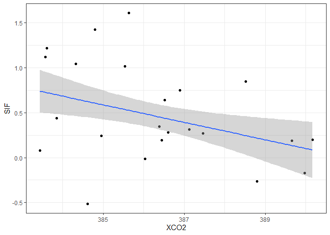
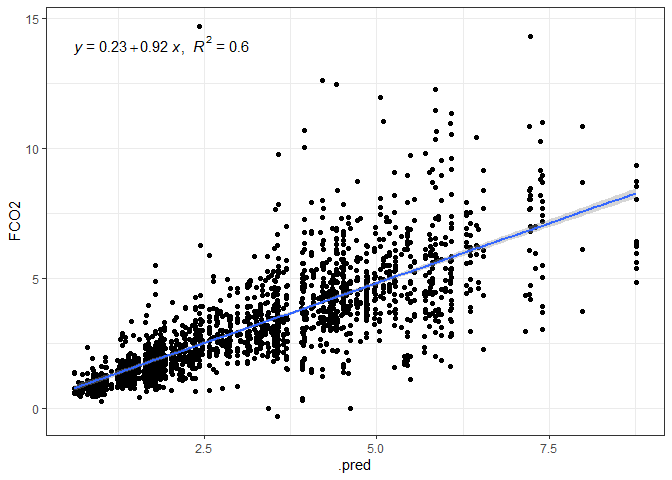

Aprendizado de Máquina: Emissão de CO<sub>2</sub> e CO<sub>2</sub>
Atmosférico e SIF
================

<!-- README.md is generated from README.Rmd. Please edit that file -->

##### *Panosso AR; Costa LM; Lima LR; Crispim, VS*

##### Financiamento: Fapesp (202102487-0); CNPq-PIBIC (Nº 2517 - EDITAL 4/2021)

# Resumo do Projeto

## Aquisição dos dados de CO<sub>2</sub> atmosférico (xCO2)

A aquisição de dados e o processamento inicial destes pode ser
encontrada no link:

#### <https://arpanosso.github.io/oco2/>

Para facilitar o acesso, os dodos foram adquiridos por meio do pacote
`{fco2}`.

``` r
## Instalando pacotes (se necessário)
# install.packages("devtools")
# Sys.getenv("GITHUB_PAT")
# Sys.unsetenv("GITHUB_PAT")
# Sys.getenv("GITHUB_PAT")
# devtools::install_github("arpanosso/fco2r")
library(readxl)
library(tidyverse)
library(geobr)
library(fco2r)
library(skimr)
library(tidymodels)
library(ISLR)
library(modeldata)
library(vip)
library(ggpubr)
source("R/my_fun.R")
```

### Carregando os dados meteorológicos

``` r
dados_estacao <- read_excel("data-raw/xlsx/estacao_meteorologia_ilha_solteira.xlsx", na = "NA") 
  # dplyr::mutate_if(is.character, as.numeric)
dplyr::glimpse(dados_estacao)
#> Rows: 1,826
#> Columns: 16
#> $ data    <dttm> 2015-01-01, 2015-01-02, 2015-01-03, 2015-01-04, 2015-01-05, 2~
#> $ Tmed    <dbl> 30.5, 30.0, 26.8, 27.1, 27.0, 27.6, 30.2, 28.2, 28.5, 29.9, 30~
#> $ Tmax    <dbl> 36.5, 36.7, 35.7, 34.3, 33.2, 36.4, 37.2, 32.4, 37.1, 38.1, 38~
#> $ Tmin    <dbl> 24.6, 24.5, 22.9, 22.7, 22.3, 22.8, 22.7, 24.0, 23.0, 23.3, 24~
#> $ Umed    <dbl> 66.6, 70.4, 82.7, 76.8, 81.6, 75.5, 65.8, 70.0, 72.9, 67.6, 66~
#> $ Umax    <dbl> 89.6, 93.6, 99.7, 95.0, 98.3, 96.1, 99.2, 83.4, 90.7, 97.4, 90~
#> $ Umin    <dbl> 42.0, 44.2, 52.9, 43.8, 57.1, 47.5, 34.1, 57.4, 42.7, 38.3, 37~
#> $ PkPa    <dbl> 97.2, 97.3, 97.4, 97.5, 97.4, 97.5, 97.4, 97.4, 97.4, 97.4, 97~
#> $ Rad     <dbl> 23.6, 24.6, 20.2, 21.4, 17.8, 19.2, 27.0, 15.2, 21.6, 24.3, 24~
#> $ PAR     <dbl> 496.6, 513.3, 430.5, 454.0, 378.2, 405.4, 565.7, 317.2, 467.5,~
#> $ Eto     <dbl> 5.7, 5.8, 4.9, 5.1, 4.1, 4.8, 6.2, 4.1, 5.5, 5.7, 5.9, 6.1, 6.~
#> $ Velmax  <dbl> 6.1, 4.8, 12.1, 6.2, 5.1, 4.5, 4.6, 5.7, 5.8, 5.2, 5.2, 4.7, 6~
#> $ Velmin  <dbl> 1.0, 1.0, 1.2, 1.0, 0.8, 0.9, 0.9, 1.5, 1.2, 0.8, 0.8, 1.2, 1.~
#> $ Dir_vel <dbl> 17.4, 261.9, 222.0, 25.0, 56.9, 74.9, 53.4, 89.0, 144.8, 303.9~
#> $ chuva   <dbl> 0.0, 0.0, 3.3, 0.0, 0.0, 0.0, 0.0, 0.0, 0.0, 0.0, 0.0, 0.0, 0.~
#> $ inso    <dbl> 7.9, 8.7, 5.2, 6.2, 3.4, 4.5, 10.5, 1.3, 6.3, 8.4, 8.6, 7.9, 1~
```

### Conhecendo a base de dados de CO<sub>2</sub> atmosférico

``` r
# help(oco2_br)
# glimpse(oco2_br)
```

### Alguns gráficos

``` r
oco2_br %>% 
  sample_n(1000) %>% 
  ggplot(aes(x = longitude, y = latitude)) + 
  geom_point(color = "blue")
```

<!-- -->

### Carregando o contorno do território

``` r
br <- geobr::read_country(showProgress = FALSE)
```

### Construindo o mapa com os pontos

``` r
br %>% 
  ggplot() +
  geom_sf(fill = "white") +
    geom_point(data=oco2_br %>% 
                 sample_n(1000),
             aes(x=longitude,y=latitude),
             shape=3,
             col="red",
             alpha=0.2)
```

<!-- -->

Observe que utilizamos `dplyr::sample_n()` para retirar apenas

amostras do total do banco de dados
.

#### Estatísticas descritivas

``` r
# skim(oco2_br)
```

``` r
oco2 <- oco2_br
```

### Conhecendo a base de dados de emissão de CO<sub>2</sub> do solo

``` r
# help(data_fco2)
glimpse(data_fco2)
#> Rows: 15,397
#> Columns: 39
#> $ experimento       <chr> "Espacial", "Espacial", "Espacial", "Espacial", "Esp~
#> $ data              <date> 2001-07-10, 2001-07-10, 2001-07-10, 2001-07-10, 200~
#> $ manejo            <chr> "convencional", "convencional", "convencional", "con~
#> $ tratamento        <chr> "AD_GN", "AD_GN", "AD_GN", "AD_GN", "AD_GN", "AD_GN"~
#> $ revolvimento_solo <lgl> FALSE, FALSE, FALSE, FALSE, FALSE, FALSE, FALSE, FAL~
#> $ data_preparo      <date> 2001-07-01, 2001-07-01, 2001-07-01, 2001-07-01, 200~
#> $ conversao         <date> 1970-01-01, 1970-01-01, 1970-01-01, 1970-01-01, 197~
#> $ cobertura         <lgl> TRUE, TRUE, TRUE, TRUE, TRUE, TRUE, TRUE, TRUE, TRUE~
#> $ cultura           <chr> "milho_soja", "milho_soja", "milho_soja", "milho_soj~
#> $ x                 <dbl> 0, 40, 80, 10, 25, 40, 55, 70, 20, 40, 60, 10, 70, 3~
#> $ y                 <dbl> 0, 0, 0, 10, 10, 10, 10, 10, 20, 20, 20, 25, 25, 30,~
#> $ longitude_muni    <dbl> 782062.7, 782062.7, 782062.7, 782062.7, 782062.7, 78~
#> $ latitude_muni     <dbl> 7647674, 7647674, 7647674, 7647674, 7647674, 7647674~
#> $ estado            <chr> "SP", "SP", "SP", "SP", "SP", "SP", "SP", "SP", "SP"~
#> $ municipio         <chr> "Jaboticabal", "Jaboticabal", "Jaboticabal", "Jaboti~
#> $ ID                <int> 1, 2, 3, 4, 5, 6, 7, 8, 9, 10, 11, 12, 13, 14, 15, 1~
#> $ prof              <chr> "0-0.1", "0-0.1", "0-0.1", "0-0.1", "0-0.1", "0-0.1"~
#> $ FCO2              <dbl> 1.080, 0.825, 1.950, 0.534, 0.893, 0.840, 1.110, 1.8~
#> $ Ts                <dbl> 18.73, 18.40, 19.20, 18.28, 18.35, 18.47, 19.10, 18.~
#> $ Us                <dbl> NA, NA, NA, NA, NA, NA, NA, NA, NA, NA, NA, NA, NA, ~
#> $ pH                <dbl> 5.1, 5.1, 5.8, 5.3, 5.5, 5.7, 5.6, 6.4, 5.3, 5.8, 5.~
#> $ MO                <dbl> 20, 24, 25, 23, 23, 21, 26, 23, 25, 24, 26, 20, 25, ~
#> $ P                 <dbl> 46, 26, 46, 78, 60, 46, 55, 92, 55, 60, 48, 71, 125,~
#> $ K                 <dbl> 2.4, 2.2, 5.3, 3.6, 3.4, 2.9, 4.0, 2.3, 3.3, 3.6, 4.~
#> $ Ca                <dbl> 25, 30, 41, 27, 33, 38, 35, 94, 29, 36, 37, 29, 50, ~
#> $ Mg                <dbl> 11, 11, 25, 11, 15, 20, 16, 65, 11, 17, 15, 11, 30, ~
#> $ H_Al              <dbl> 31, 31, 22, 28, 27, 22, 22, 12, 31, 28, 28, 31, 18, ~
#> $ SB                <dbl> 38.4, 43.2, 71.3, 41.6, 50.6, 60.9, 55.0, 161.3, 43.~
#> $ CTC               <dbl> 69.4, 74.2, 93.3, 69.6, 77.9, 82.9, 77.0, 173.3, 74.~
#> $ V                 <dbl> 55, 58, 76, 60, 65, 73, 71, 93, 58, 67, 67, 58, 82, ~
#> $ Ds                <dbl> NA, NA, NA, NA, NA, NA, NA, NA, NA, NA, NA, NA, NA, ~
#> $ Macro             <dbl> NA, NA, NA, NA, NA, NA, NA, NA, NA, NA, NA, NA, NA, ~
#> $ Micro             <dbl> NA, NA, NA, NA, NA, NA, NA, NA, NA, NA, NA, NA, NA, ~
#> $ VTP               <dbl> NA, NA, NA, NA, NA, NA, NA, NA, NA, NA, NA, NA, NA, ~
#> $ PLA               <dbl> NA, NA, NA, NA, NA, NA, NA, NA, NA, NA, NA, NA, NA, ~
#> $ AT                <dbl> NA, NA, NA, NA, NA, NA, NA, NA, NA, NA, NA, NA, NA, ~
#> $ SILTE             <dbl> NA, NA, NA, NA, NA, NA, NA, NA, NA, NA, NA, NA, NA, ~
#> $ ARG               <dbl> NA, NA, NA, NA, NA, NA, NA, NA, NA, NA, NA, NA, NA, ~
#> $ HLIFS             <dbl> NA, NA, NA, NA, NA, NA, NA, NA, NA, NA, NA, NA, NA, ~
```

### Visualização de dados

``` r
data_fco2 %>% 
  group_by(experimento, cultura, data) %>% 
  summarise(FCO2 = mean(FCO2, na.rm=TRUE)) %>% 
  ggplot(aes(y=FCO2, x=data)) +
  geom_line() +
   facet_wrap(~experimento + cultura, scale="free")
```

<!-- -->

### Construindo o mapa com os pontos

``` r
br %>% 
  ggplot() +
  geom_sf(fill = "white") +
    geom_point(data=oco2 %>% sample_n(1000),
             aes(x=longitude,y=latitude),
             shape=3,
             col="red",
             alpha=0.2)
```

<!-- -->

Observe que utilizamos `dplyr::sample_n()` para retirar apenas

amostras do total do banco de dados
.

#### Estatísticas descritivas

``` r
# skim(data_fco2)
```

``` r
visdat::vis_miss(data_fco2 %>% 
                   sample_n(15000))
```

<!-- -->

#### Estatísticas descritivas

``` r
# skim(dados_estacao)
```

``` r
dados_estacao <- dados_estacao %>% 
                   drop_na()
visdat::vis_miss(dados_estacao)
```

<!-- -->

``` r
# Lista do xCO2
# 01 passar as datas que estão em ano-mes-dia-horas-min-segundos
# para uma outra coluna denominada 'data' como ano-mes-dia
# Fazer em pipeline, usar o mutate do pacote dplyr e provavelmente
# a funçoes do pacote lubridate
oco2 <- oco2  %>% 
  mutate (
    ano = time_yyyymmddhhmmss%/%1e10,
    mês = time_yyyymmddhhmmss%/%1e8 %%100,
    dia = time_yyyymmddhhmmss%/%1e6 %%100,
    data = as.Date(stringr::str_c(ano,mês,dia,sep="-"))
  ) %>% 
  glimpse()
#> Rows: 37,387
#> Columns: 33
#> $ longitude                                                     <dbl> -70.5, -~
#> $ longitude_bnds                                                <chr> "-71.0:-~
#> $ latitude                                                      <dbl> -5.5, -4~
#> $ latitude_bnds                                                 <chr> "-6.0:-5~
#> $ time_yyyymmddhhmmss                                           <dbl> 2.014091~
#> $ time_bnds_yyyymmddhhmmss                                      <chr> "2014090~
#> $ altitude_km                                                   <dbl> 3307.8, ~
#> $ alt_bnds_km                                                   <chr> "0.0:661~
#> $ fluorescence_radiance_757nm_uncert_idp_ph_sec_1_m_2_sr_1_um_1 <dbl> 7.272876~
#> $ fluorescence_radiance_757nm_idp_ph_sec_1_m_2_sr_1_um_1        <dbl> 2.537127~
#> $ xco2_moles_mole_1                                             <dbl> 0.000394~
#> $ aerosol_total_aod                                             <dbl> 0.148579~
#> $ fluorescence_offset_relative_771nm_idp                        <dbl> 0.016753~
#> $ fluorescence_at_reference_ph_sec_1_m_2_sr_1_um_1              <dbl> 2.615319~
#> $ fluorescence_radiance_771nm_idp_ph_sec_1_m_2_sr_1_um_1        <dbl> 3.088582~
#> $ fluorescence_offset_relative_757nm_idp                        <dbl> 0.013969~
#> $ fluorescence_radiance_771nm_uncert_idp_ph_sec_1_m_2_sr_1_um_1 <dbl> 5.577878~
#> $ xco2                                                          <dbl> 394.3686~
#> $ data                                                          <date> 2014-09~
#> $ ano                                                           <dbl> 2014, 20~
#> $ mes                                                           <dbl> 9, 9, 9,~
#> $ dia                                                           <dbl> 6, 6, 6,~
#> $ dia_semana                                                    <dbl> 7, 7, 7,~
#> $ x                                                             <int> 7, 8, 11~
#> $ xco2_est                                                      <dbl> 392.7080~
#> $ delta                                                         <dbl> -1.66062~
#> $ XCO2                                                          <dbl> 387.2781~
#> $ flag_norte                                                    <lgl> TRUE, TR~
#> $ flag_nordeste                                                 <lgl> FALSE, F~
#> $ flag_sul                                                      <lgl> FALSE, F~
#> $ flag_sudeste                                                  <lgl> FALSE, F~
#> $ flag_centroeste                                               <lgl> FALSE, F~
#> $ mês                                                           <dbl> 9, 9, 9,~
```

``` r
dados_estacao <- dados_estacao %>% 
  mutate(
    ano = lubridate::year(data),
    mês = lubridate::month(data),
    dia = lubridate::day(data),
    data = as.Date(stringr::str_c(ano,mês,dia,sep="-"))
)
```

## Manipulação dos bancos de dados Fco2 e de estação.

``` r
# atributos <- data_fco2
atributos <- left_join(data_fco2, dados_estacao, by = "data")
```

#### Listando as datas em ambos os bancos de dados

``` r
# Lista das datas de FCO2 
lista_data_fco2 <- unique(atributos$data)
lista_data_oco2 <- unique(oco2$data)
lista_data_estacao <- unique(dados_estacao$data)
datas_fco2 <- paste0(lubridate::year(lista_data_fco2),"-",lubridate::month(lista_data_fco2)) %>% unique()

datas_oco2 <- paste0(lubridate::year(lista_data_oco2),"-",lubridate::month(lista_data_oco2)) %>% unique()
datas <- datas_fco2[datas_fco2 %in% datas_oco2]
```

Criação as listas de datas, que é chave para a mesclagem dos arquivos.

``` r
fco2 <- atributos %>% 
  mutate(ano_mes = paste0(lubridate::year(data),"-",lubridate::month(data))) %>% 
  dplyr::filter(ano_mes %in% datas)

xco2 <- oco2 %>%   
  mutate(ano_mes=paste0(ano,"-",mês)) %>% 
  dplyr::filter(ano_mes %in% datas)
```

Coordenadas das cidades

``` r
unique(xco2$ano_mes)[unique(xco2$ano_mes) %>% order()] == 
unique(fco2$ano_mes)[unique(fco2$ano_mes) %>% order()]
#>  [1] TRUE TRUE TRUE TRUE TRUE TRUE TRUE TRUE TRUE TRUE TRUE TRUE TRUE TRUE TRUE
#> [16] TRUE TRUE TRUE TRUE TRUE TRUE TRUE TRUE TRUE TRUE TRUE TRUE TRUE TRUE
```

Abordagem usando o join do `{dplyr}`

``` r
memory.limit(size=10001)
#> [1] 10001
data_set <- left_join(fco2 %>% 
            mutate(ano = lubridate::year(data),
                   mes = lubridate::month(data)
                   ) %>% 
            select(ID, data, cultura, ano, mes, x,y, FCO2, Ts,
                   Us, MO, Macro, VTP, ARG, ano_mes,Tmed,Tmax, Tmin, Umed,
                   Umax, Umin, PkPa, Rad, Eto, Velmax, Velmin, Dir_vel,
                   chuva, inso), 
          xco2 %>% 
            select(data,mês,dia,longitude,latitude,xco2,fluorescence_radiance_757nm_idp_ph_sec_1_m_2_sr_1_um_1,fluorescence_radiance_771nm_idp_ph_sec_1_m_2_sr_1_um_1, ano_mes), by = "ano_mes") %>% 
  mutate(dist = sqrt((longitude-(-51.423519))^2+(latitude-(-20.362911))^2),
         SIF = (fluorescence_radiance_757nm_idp_ph_sec_1_m_2_sr_1_um_1*2.6250912*10^(-19)  + 1.5*fluorescence_radiance_771nm_idp_ph_sec_1_m_2_sr_1_um_1* 2.57743*10^(-19))/2)

data_set<-data_set %>%
  select(-fluorescence_radiance_757nm_idp_ph_sec_1_m_2_sr_1_um_1, -fluorescence_radiance_771nm_idp_ph_sec_1_m_2_sr_1_um_1 )  %>% 
  filter(dist <= .16, FCO2 <= 20 ) 

visdat::vis_miss(data_set %>% 
                   sample_n(2000)
                 )
```

<!-- -->

``` r
# head(data_set)
# fco2$ano_mes %>% unique()
# xco2$ano_mes %>% unique()
# data_set$ano_mes %>% unique()
```

``` r
tab_medias <- data_set %>% 
  mutate(SIF = ifelse(SIF <=0, mean(data_set$SIF, na.rm=TRUE),SIF)) %>% 
  group_by(ano_mes, cultura) %>% 
  summarise(FCO2 = mean(FCO2, na.rm=TRUE),
            XCO2 = mean(xco2, na.rm=TRUE),
            SIF = mean(SIF, na.rm=TRUE))

tab_medias %>% 
  ggplot(aes(x=XCO2, y=SIF)) +
  geom_point()+
  geom_smooth(method = "lm")+
  theme_bw()
```

<!-- -->

``` r

tab_medias %>% 
  ggplot(aes(x=XCO2, y=FCO2)) +
  geom_point()+
  geom_smooth(method = "lm")+
  theme_bw()
```

<!-- -->

``` r

tab_medias %>% 
  ggplot(aes(x=FCO2, y=SIF)) +
  geom_point()+
  geom_smooth(method = "lm") +
  theme_bw()
```

<!-- -->

## Estatística Descritiva

Completar posteriormente.

# Abordagem de Parendizado de Máquina

## Definindo a base de treino e a base de teste

Definindo a semente aleatória mais o conjunto de dados para teste e
treino dos modelos

``` r
data_set_ml <- data_set #%>%
#   select(cultura, FCO2, Ts,
#                    Us, MO, Tmed,Tmax, Tmin, Umed,
#                    Umax, Umin, PkPa, Rad, Eto, Velmax, Velmin, Dir_vel,
#                    chuva, inso, SIF, xco2) %>% 
#   drop_na(FCO2, Ts,Us,Tmed:inso)
# visdat::vis_miss(data_set_ml)
# set.seed(1235)
fco2_initial_split <- initial_split(data_set_ml, prop = 0.75)
```

``` r
fco2_train <- training(fco2_initial_split)
# fco2_test <- testing(fco2_initial_split)
# visdat::vis_miss(fco2_test)
fco2_train  %>% 
  ggplot(aes(x=FCO2, y=..density..))+
  geom_histogram(bins = 30, color="black",  fill="lightgray")+
  geom_density(alpha=.05,fill="red")+
  theme_bw() +
  labs(x="FCO2", y = "Densidade")
```

<!-- -->

``` r
fco2_train  %>% 
  ggplot(aes(x=SIF, y=..density..))+
  geom_histogram(bins = 11, color="black",  fill="lightgray")+
  geom_density(alpha=.05,fill="green")+
  theme_bw() +
  labs(x="SIF", y = "Densidade")
```

<!-- -->

``` r
fco2_train  %>% 
  ggplot(aes(x=xco2, y=..density..))+
  geom_histogram(bins = 15, color="black",  fill="lightgray")+
  geom_density(alpha=.05,fill="blue")+
  theme_bw() +
  labs(x="XCO2", y = "Densidade")
```

<!-- -->

## Correlação

``` r
glimpse(fco2_train)
#> Rows: 6,103
#> Columns: 37
#> $ ID        <int> 20, 49, 19, 8, 50, 52, 3, 21, 3, 39, 66, 19, 28, 79, 13, 31,~
#> $ data.x    <date> 2018-06-18, 2019-09-28, 2019-07-20, 2017-06-28, 2017-03-03,~
#> $ cultura   <chr> "silvipastoril", "silvipastoril", "silvipastoril", "pinus", ~
#> $ ano       <dbl> 2018, 2019, 2019, 2017, 2017, 2018, 2016, 2017, 2018, 2018, ~
#> $ mes       <dbl> 6, 9, 7, 6, 3, 7, 1, 6, 6, 10, 6, 6, 2, 10, 6, 8, 3, 1, 5, 6~
#> $ x         <dbl> 7749446, 7749399, 7749399, 0, 40, 7749432, 0, 0, 7747952, 77~
#> $ y         <dbl> 457193.9, 457163.2, 457163.2, 0.0, 30.0, 457221.9, 0.0, 0.0,~
#> $ FCO2      <dbl> 2.63, 1.82, 2.33, 2.87, 4.87, 1.86, 10.54, 2.89, 1.29, 3.23,~
#> $ Ts        <dbl> 17.30, 22.00, 17.30, 4.00, 28.10, 18.60, 26.00, 11.00, 22.09~
#> $ Us        <dbl> 19.510766, 18.000000, 19.100000, 21.100000, 18.000000, 17.98~
#> $ MO        <dbl> 25, 2, 7, 6, 32, 32, 26, 9, 15, 7, 32, 7, 25, 35, 31, 4, 21,~
#> $ Macro     <dbl> 9.31000000, 8.13000000, 14.09000000, 3.49000000, NA, 6.93000~
#> $ VTP       <dbl> 53.96000, 46.25000, 54.36000, 45.65000, NA, 54.34000, 42.555~
#> $ ARG       <dbl> 636.0100, NA, NA, 351.1700, NA, 663.0100, 374.2344, NA, 173.~
#> $ ano_mes   <chr> "2018-6", "2019-9", "2019-7", "2017-6", "2017-3", "2018-7", ~
#> $ Tmed      <dbl> 21.5, 25.2, 23.0, 22.6, 25.8, 23.4, 27.3, 22.6, 21.1, 29.4, ~
#> $ Tmax      <dbl> 30.1, 33.0, 30.3, 30.8, 32.7, 33.1, 32.8, 29.6, 27.9, 37.6, ~
#> $ Tmin      <dbl> 14.6, 17.6, 17.1, 15.6, 22.6, 15.9, 24.3, 17.1, 15.9, 23.5, ~
#> $ Umed      <dbl> 76.2, 58.8, 56.5, 59.8, 91.4, 67.5, 84.6, 64.5, 80.8, 76.0, ~
#> $ Umax      <dbl> 100.0, 83.4, 79.3, 84.4, 100.0, 98.0, 99.7, 85.2, 97.2, 98.0~
#> $ Umin      <dbl> 49.1, 37.9, 36.5, 33.2, 64.8, 34.1, 60.3, 46.3, 58.3, 44.0, ~
#> $ PkPa      <dbl> 98.3, 97.6, 97.9, 98.1, 97.4, 97.6, 97.3, 98.1, 97.7, 97.0, ~
#> $ Rad       <dbl> 10.4, 18.0, 11.0, 13.4, 13.0, 12.7, 18.9, 13.7, 11.3, 16.5, ~
#> $ Eto       <dbl> 2.0, 4.9, 3.5, 3.0, 2.9, 2.6, 4.7, 3.2, 2.2, 4.1, 2.8, 2.3, ~
#> $ Velmax    <dbl> 3.7, 7.2, 5.8, 4.8, 4.7, 4.3, 10.5, 5.9, 5.8, 4.8, 4.6, 3.9,~
#> $ Velmin    <dbl> 0.5, 1.9, 1.9, 1.1, 0.2, 0.6, 2.2, 1.6, 0.7, 0.7, 1.2, 1.1, ~
#> $ Dir_vel   <dbl> 158.4, 130.7, 93.0, 101.5, 267.9, 312.6, 54.7, 101.2, 251.5,~
#> $ chuva     <dbl> 0.0, 0.0, 0.0, 0.0, 12.2, 0.0, 0.0, 0.0, 0.0, 4.3, 0.0, 0.0,~
#> $ inso      <dbl> 4.8, 7.3, 3.9, 7.7, 2.3, 5.6, 4.2, 8.0, 5.7, 4.5, 8.2, 4.7, ~
#> $ data.y    <date> 2018-06-16, 2019-09-30, 2019-07-28, 2017-06-29, 2017-03-16,~
#> $ mês       <dbl> 6, 9, 7, 6, 3, 7, 1, 6, 6, 10, 6, 6, 2, 10, 6, 8, 3, 1, 5, 6~
#> $ dia       <dbl> 16, 30, 28, 29, 16, 9, 2, 29, 16, 22, 20, 16, 12, 21, 20, 19~
#> $ longitude <dbl> -51.5, -51.5, -51.5, -51.5, -51.5, -51.5, -51.5, -51.5, -51.~
#> $ latitude  <dbl> -20.5, -20.5, -20.5, -20.5, -20.5, -20.5, -20.5, -20.5, -20.~
#> $ xco2      <dbl> 405.5445, 407.4837, 406.9887, 401.2215, 397.8522, 398.5709, ~
#> $ dist      <dbl> 0.1569801, 0.1569801, 0.1569801, 0.1569801, 0.1569801, 0.156~
#> $ SIF       <dbl> -0.26169899, 0.44584525, 0.30243534, -0.08236333, 0.66028494~
fco2_train   %>%    select(-c(ID,ano,mes,x,y,latitude,longitude,dist,mês,dia)) %>% 
  select(where(is.numeric)) %>%
  drop_na() %>% 
  cor()  %>%  
  corrplot::corrplot()
```

<!-- -->

## Data-prep

``` r
fco2_recipe <- recipe(FCO2 ~ ., data = fco2_train %>% 
                        select(-c(data.x,data.y,ID,ano,mes,x,y,latitude,longitude,dist,mês,dia,ano_mes))
) %>%  
  step_normalize(all_numeric_predictors())  %>% 
  step_novel(all_nominal_predictors()) %>% 
  step_zv(all_predictors()) %>%
  #step_naomit(c(Ts, Us)) %>% 
  #step_poly(c(Ts, Us), degree = 3)  %>%  
  step_dummy(all_nominal_predictors())
bake(prep(fco2_recipe), new_data = NULL)
#> # A tibble: 6,103 x 29
#>        Ts     Us     MO  Macro    VTP    ARG   Tmed   Tmax    Tmin   Umed   Umax
#>     <dbl>  <dbl>  <dbl>  <dbl>  <dbl>  <dbl>  <dbl>  <dbl>   <dbl>  <dbl>  <dbl>
#>  1 -0.929  0.746  0.272  0.784  0.892  1.61  -0.555 -0.273 -0.753   0.632  1.03 
#>  2 -0.120  0.539 -2.01   0.587  0.536 NA      0.288  0.340 -0.0787 -1.16  -1.36 
#>  3 -0.929  0.689 -1.51   1.58   0.911 NA     -0.213 -0.231 -0.191  -1.40  -1.95 
#>  4 -3.22   0.963 -1.61  -0.189  0.508  0.133 -0.304 -0.125 -0.528  -1.06  -1.22 
#>  5  0.930  0.539  0.967 NA     NA     NA      0.425  0.277  1.05    2.20   1.03 
#>  6 -0.706  0.537  0.967  0.386  0.910  1.75  -0.122  0.361 -0.461  -0.265  0.739
#>  7  0.569  0.950  0.371 -0.762  0.365  0.253  0.766  0.298  1.43    1.50   0.984
#>  8 -2.01   1.07  -1.31   1.06   0.699 NA     -0.304 -0.379 -0.191  -0.575 -1.10 
#>  9 -0.105 -1.34  -0.720 -0.736 -1.59  -0.792 -0.646 -0.738 -0.461   1.11   0.624
#> 10  1.12  -0.297 -1.51   0.799  0.770 NA      1.24   1.31   1.25    0.611  0.739
#> # ... with 6,093 more rows, and 18 more variables: Umin <dbl>, PkPa <dbl>,
#> #   Rad <dbl>, Eto <dbl>, Velmax <dbl>, Velmin <dbl>, Dir_vel <dbl>,
#> #   chuva <dbl>, inso <dbl>, xco2 <dbl>, SIF <dbl>, FCO2 <dbl>,
#> #   cultura_eucalipto <dbl>, cultura_mata.ciliar <dbl>, cultura_pasto <dbl>,
#> #   cultura_pinus <dbl>, cultura_silvipastoril <dbl>, cultura_new <dbl>
```

``` r
visdat::vis_miss(bake(prep(fco2_recipe), new_data = NULL))
```

<!-- --> \## TUNAGEM

``` r
fco2_resamples <- vfold_cv(fco2_train, v = 5)
grid <- grid_regular(
  penalty(range = c(-4, -2)),
  levels = 20
)
```

## ÁRVORE DE DECISÃO (decision tree - dt)

``` r
fco2_dt_model <- decision_tree(
  cost_complexity = tune(),
  tree_depth = tune(),
  min_n = tune()
)  %>%  
  set_mode("regression")  %>%  
  set_engine("rpart")
```

### Workflow

``` r
fco2_dt_wf <- workflow()   %>%  
  add_model(fco2_dt_model) %>% 
  add_recipe(fco2_recipe)
```

### Criando a matriz (grid) com os valores de hiperparâmetros a serem testados

``` r
grid_dt <- grid_random(
  cost_complexity(c(-6, -4)),
  tree_depth(range = c(8, 18)),
  min_n(range = c(42, 52)),
  size = 5 #20
)
glimpse(grid_dt)
#> Rows: 5
#> Columns: 3
#> $ cost_complexity <dbl> 1.353519e-06, 1.421074e-05, 3.956152e-05, 7.624621e-06~
#> $ tree_depth      <int> 16, 13, 10, 9, 15
#> $ min_n           <int> 42, 49, 50, 47, 50
```

``` r
fco2_dt_tune_grid <- tune_grid(
  fco2_dt_wf,
  resamples = fco2_resamples,
  grid = grid_dt,
  metrics = metric_set(rmse)
)
```

``` r
autoplot(fco2_dt_tune_grid)
```

<!-- -->

``` r
collect_metrics(fco2_dt_tune_grid)
#> # A tibble: 5 x 9
#>   cost_complexity tree_depth min_n .metric .estimator  mean     n std_err
#>             <dbl>      <int> <int> <chr>   <chr>      <dbl> <int>   <dbl>
#> 1      0.00000135         16    42 rmse    standard    1.29     5  0.0168
#> 2      0.0000142          13    49 rmse    standard    1.30     5  0.0194
#> 3      0.0000396          10    50 rmse    standard    1.30     5  0.0182
#> 4      0.00000762          9    47 rmse    standard    1.30     5  0.0174
#> 5      0.00000527         15    50 rmse    standard    1.30     5  0.0187
#> # ... with 1 more variable: .config <chr>
```

## Desempenho dos modelos finais

``` r
fco2_dt_best_params <- select_best(fco2_dt_tune_grid, "rmse")
fco2_dt_wf <- fco2_dt_wf %>% finalize_workflow(fco2_dt_best_params)
fco2_dt_last_fit <- last_fit(fco2_dt_wf, fco2_initial_split)
```

## Criar os preditos

``` r
fco2_test_preds <- bind_rows(
  collect_predictions(fco2_dt_last_fit)  %>%   mutate(modelo = "dt")
)

fco2_test <- testing(fco2_initial_split)
visdat::vis_miss(fco2_test)
```

<!-- -->

``` r
fco2_test_preds %>% 
  ggplot(aes(x=.pred, y=FCO2)) +
  geom_point()+
  theme_bw() +
  geom_smooth(method = "lm") +
  stat_regline_equation(ggplot2::aes(
  label =  paste(..eq.label.., ..rr.label.., sep = "*plain(\",\")~~"))) 
```

<!-- -->

## Variáveis importantes

``` r
fco2_dt_last_fit_model <-fco2_dt_last_fit$.workflow[[1]]$fit$fit
vip(fco2_dt_last_fit_model)
```

<!-- -->

# Random Forest (rf)

Corrigindo os NAs no teste

``` r
visdat::vis_miss(fco2_test)
```

<!-- -->

``` r
data_set_ml <- data_set_ml %>%
  select(cultura, FCO2, Ts, xco2, SIF, 
                   Us, MO, Tmed,Tmax, Tmin, Umed,
                   Umax, Umin, PkPa, Rad, Eto, Velmax, Velmin, Dir_vel,
                   chuva, inso) %>%
  drop_na(FCO2, Ts,Us,Tmed:inso)
visdat::vis_miss(data_set_ml)
```

<!-- -->

``` r
fco2_initial_split <- initial_split(data_set_ml, prop = 0.75)
fco2_test <- testing(fco2_initial_split)
visdat::vis_miss(fco2_test)
```

<!-- -->

``` r
fco2_train <- training(fco2_initial_split)
visdat::vis_miss(fco2_train)
```

<!-- -->

``` r


fco2_resamples_rf <- vfold_cv(fco2_train, v = 5)
```

## Data prep

``` r
fco2_rf_recipe <- recipe(FCO2 ~ ., data = fco2_train) %>% 
  step_string2factor(all_nominal(), skip = TRUE) %>% 
  step_normalize(all_numeric_predictors())  %>% 
  step_novel(all_nominal_predictors()) %>% 
  # step_zv(all_predictors()) %>%
  # step_naomit(all_predictors()) #%>% 
  #step_poly(c(Ts, Us), degree = 3)  %>%  
  step_dummy(all_nominal_predictors())
bake(prep(fco2_rf_recipe), new_data = NULL)
#> # A tibble: 5,459 x 26
#>        Ts    xco2    SIF     Us       MO    Tmed    Tmax   Tmin     Umed    Umax
#>     <dbl>   <dbl>  <dbl>  <dbl>    <dbl>   <dbl>   <dbl>  <dbl>    <dbl>   <dbl>
#>  1  0.943 -1.69    1.20  -1.52   1.34e+0  0.791   0.812   0.531 -0.814   -0.789 
#>  2  0.178 -0.950  -0.353  2.17   4.79e-1  0.427   0.471   0.957  1.70     1.01  
#>  3 -0.274  1.34   -0.202 -0.237 -1.72e+0 -0.302   0.237  -0.566  0.216    1.03  
#>  4  0.947 -0.950  -0.353 -1.16   4.00e-5  1.02    0.578   1.05   0.330    0.349 
#>  5  0.730 -1.69    1.20  -0.305  9.57e-1  0.950   0.663   1.09  -0.00265  0.0897
#>  6  0.931 -0.832   0.473 -0.349  8.61e-1  1.02    0.578   1.05   0.330    0.349 
#>  7  0.964 -0.950  -0.353  0.101  2.87e-1  0.427   0.280   1.05   2.21     1.03  
#>  8 -2.38  -0.153   0.106  1.18  -1.72e+0 -0.302  -0.380  -0.185 -0.585   -1.11  
#>  9 -1.04  -0.0311 -0.927  0.981  7.66e-1 -0.0519  0.0245 -0.140 -0.252    0.277 
#> 10  0.715 -1.69    1.20  -1.25   5.74e-1  1.31    1.45    1.09  -0.762   -0.0832
#> # ... with 5,449 more rows, and 16 more variables: Umin <dbl>, PkPa <dbl>,
#> #   Rad <dbl>, Eto <dbl>, Velmax <dbl>, Velmin <dbl>, Dir_vel <dbl>,
#> #   chuva <dbl>, inso <dbl>, FCO2 <dbl>, cultura_eucalipto <dbl>,
#> #   cultura_mata.ciliar <dbl>, cultura_pasto <dbl>, cultura_pinus <dbl>,
#> #   cultura_silvipastoril <dbl>, cultura_new <dbl>
visdat::vis_miss(bake(prep(fco2_rf_recipe), new_data = NULL))
```

<!-- -->

## Modelo

``` r
fco2_rf_model <- rand_forest(
  min_n = tune(),
  mtry = tune(),
  trees = tune()
)   %>%  
  set_mode("regression")  %>% 
  set_engine("randomForest")
```

## Workflow

``` r
fco2_rf_wf <- workflow()   %>%  
  add_model(fco2_rf_model) %>%  
  add_recipe(fco2_rf_recipe)
```

## Tune

mtry trees min_n .config 10 769 21 Preprocessor1_Model39

``` r
grid_rf <- grid_random(
  min_n(range = c(20, 22)),
  mtry(range = c(10,12)),
  trees(range = c(769,1000) ),
  size = 1
)
```

``` r
fco2_rf_tune_grid <- tune_grid(
 fco2_rf_wf,
  resamples = fco2_resamples_rf,
  grid = grid_rf,
  metrics = metric_set(rmse)
) 

autoplot(fco2_rf_tune_grid)
```

<!-- -->

``` r
collect_metrics(fco2_rf_tune_grid)
#> # A tibble: 1 x 9
#>    mtry trees min_n .metric .estimator  mean     n std_err .config             
#>   <int> <int> <int> <chr>   <chr>      <dbl> <int>   <dbl> <chr>               
#> 1    11   986    20 rmse    standard    1.15     5  0.0246 Preprocessor1_Model1
```

## Desempenho dos modelos finais

``` r
fco2_rf_best_params <- select_best(fco2_rf_tune_grid, "rmse")
fco2_rf_wf <- fco2_rf_wf %>% finalize_workflow(fco2_rf_best_params)
fco2_rf_last_fit <- last_fit(fco2_rf_wf, fco2_initial_split)
```

## Criar os preditos

``` r
fco2_test_preds <- bind_rows(
  collect_predictions(fco2_rf_last_fit)  %>%   mutate(modelo = "rf")
)
```

``` r
fco2_test_preds %>% 
  ggplot(aes(x=.pred, y=FCO2)) +
  geom_point()+
  theme_bw() +
  geom_smooth(method = "lm") +
  stat_regline_equation(ggplot2::aes(
  label =  paste(..eq.label.., ..rr.label.., sep = "*plain(\",\")~~"))) 
```

<!-- -->

## Variáveis importantes

``` r
fco2_rf_last_fit_model <-fco2_dt_last_fit$.workflow[[1]]$fit$fit
vip(fco2_rf_last_fit_model)
```

<!-- -->
