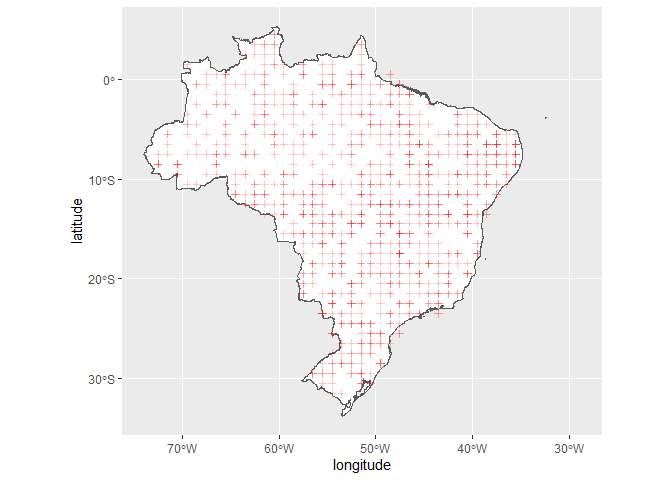
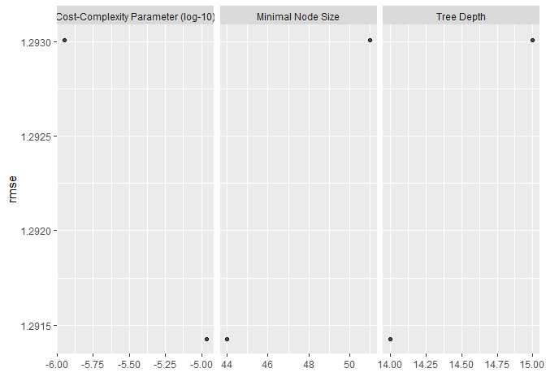
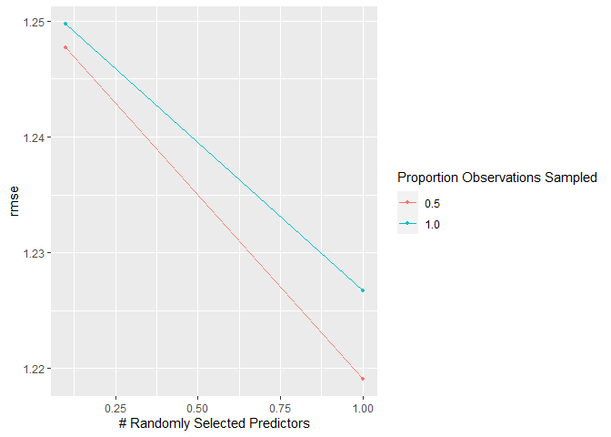
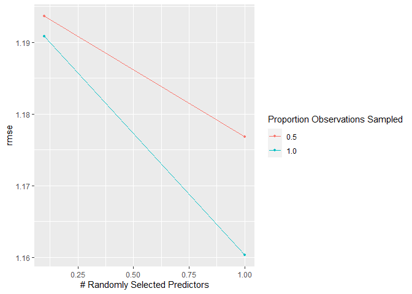

Aprendizado de Máquina: Emissão de CO<sub>2</sub> e CO<sub>2</sub>
Atmosférico e SIF
================

<!-- README.md is generated from README.Rmd. Please edit that file -->

##### *Panosso AR; Costa LM; Lima LR; Crispim, VS*

##### Financiamento: Fapesp (202102487-0); CNPq-PIBIC (Nº 2517 - EDITAL 4/2021)

# Resumo do Projeto

## Aquisição dos dados de CO<sub>2</sub> atmosférico (xCO2)

A aquisição de dados e o processamento inicial destes pode ser
encontrada no link:

#### <https://arpanosso.github.io/oco2/>

Para facilitar o acesso, os dodos foram adquiridos por meio do pacote
`{fco2}`.

``` r
## Instalando pacotes (se necessário)
# install.packages("devtools")
# Sys.getenv("GITHUB_PAT")
# Sys.unsetenv("GITHUB_PAT")
# Sys.getenv("GITHUB_PAT")
# devtools::install_github("arpanosso/fco2r")
library(readxl)
library(tidyverse)
library(geobr)
library(fco2r)
library(skimr)
library(tidymodels)
library(ISLR)
library(modeldata)
library(vip)
library(ggpubr)
source("R/my_fun.R")
```

### Carregando os dados meteorológicos

``` r
dados_estacao <- read_excel("data-raw/xlsx/estacao_meteorologia_ilha_solteira.xlsx", na = "NA") 
  # dplyr::mutate_if(is.character, as.numeric)
dplyr::glimpse(dados_estacao)
#> Rows: 1,826
#> Columns: 16
#> $ data    <dttm> 2015-01-01, 2015-01-02, 2015-01-03, 2015-01-04, 2015-01-05, 2~
#> $ Tmed    <dbl> 30.5, 30.0, 26.8, 27.1, 27.0, 27.6, 30.2, 28.2, 28.5, 29.9, 30~
#> $ Tmax    <dbl> 36.5, 36.7, 35.7, 34.3, 33.2, 36.4, 37.2, 32.4, 37.1, 38.1, 38~
#> $ Tmin    <dbl> 24.6, 24.5, 22.9, 22.7, 22.3, 22.8, 22.7, 24.0, 23.0, 23.3, 24~
#> $ Umed    <dbl> 66.6, 70.4, 82.7, 76.8, 81.6, 75.5, 65.8, 70.0, 72.9, 67.6, 66~
#> $ Umax    <dbl> 89.6, 93.6, 99.7, 95.0, 98.3, 96.1, 99.2, 83.4, 90.7, 97.4, 90~
#> $ Umin    <dbl> 42.0, 44.2, 52.9, 43.8, 57.1, 47.5, 34.1, 57.4, 42.7, 38.3, 37~
#> $ PkPa    <dbl> 97.2, 97.3, 97.4, 97.5, 97.4, 97.5, 97.4, 97.4, 97.4, 97.4, 97~
#> $ Rad     <dbl> 23.6, 24.6, 20.2, 21.4, 17.8, 19.2, 27.0, 15.2, 21.6, 24.3, 24~
#> $ PAR     <dbl> 496.6, 513.3, 430.5, 454.0, 378.2, 405.4, 565.7, 317.2, 467.5,~
#> $ Eto     <dbl> 5.7, 5.8, 4.9, 5.1, 4.1, 4.8, 6.2, 4.1, 5.5, 5.7, 5.9, 6.1, 6.~
#> $ Velmax  <dbl> 6.1, 4.8, 12.1, 6.2, 5.1, 4.5, 4.6, 5.7, 5.8, 5.2, 5.2, 4.7, 6~
#> $ Velmin  <dbl> 1.0, 1.0, 1.2, 1.0, 0.8, 0.9, 0.9, 1.5, 1.2, 0.8, 0.8, 1.2, 1.~
#> $ Dir_vel <dbl> 17.4, 261.9, 222.0, 25.0, 56.9, 74.9, 53.4, 89.0, 144.8, 303.9~
#> $ chuva   <dbl> 0.0, 0.0, 3.3, 0.0, 0.0, 0.0, 0.0, 0.0, 0.0, 0.0, 0.0, 0.0, 0.~
#> $ inso    <dbl> 7.9, 8.7, 5.2, 6.2, 3.4, 4.5, 10.5, 1.3, 6.3, 8.4, 8.6, 7.9, 1~
```

### Conhecendo a base de dados de CO<sub>2</sub> atmosférico

``` r
# help(oco2_br)
# glimpse(oco2_br)
```

### Alguns gráficos

``` r
oco2_br %>% 
  sample_n(1000) %>% 
  ggplot(aes(x = longitude, y = latitude)) + 
  geom_point(color = "blue")
```

<!-- -->

### Carregando o contorno do território

``` r
br <- geobr::read_country(showProgress = FALSE)
```

### Construindo o mapa com os pontos

``` r
br %>% 
  ggplot() +
  geom_sf(fill = "white") +
    geom_point(data=oco2_br %>% 
                 sample_n(1000),
             aes(x=longitude,y=latitude),
             shape=3,
             col="red",
             alpha=0.2)
```

<!-- -->

Observe que utilizamos `dplyr::sample_n()` para retirar apenas

amostras do total do banco de dados
.

#### Estatísticas descritivas

``` r
# skim(oco2_br)
```

``` r
oco2 <- oco2_br
```

### Conhecendo a base de dados de emissão de CO<sub>2</sub> do solo

``` r
# help(data_fco2)
glimpse(data_fco2)
#> Rows: 15,397
#> Columns: 39
#> $ experimento       <chr> "Espacial", "Espacial", "Espacial", "Espacial", "Esp~
#> $ data              <date> 2001-07-10, 2001-07-10, 2001-07-10, 2001-07-10, 200~
#> $ manejo            <chr> "convencional", "convencional", "convencional", "con~
#> $ tratamento        <chr> "AD_GN", "AD_GN", "AD_GN", "AD_GN", "AD_GN", "AD_GN"~
#> $ revolvimento_solo <lgl> FALSE, FALSE, FALSE, FALSE, FALSE, FALSE, FALSE, FAL~
#> $ data_preparo      <date> 2001-07-01, 2001-07-01, 2001-07-01, 2001-07-01, 200~
#> $ conversao         <date> 1970-01-01, 1970-01-01, 1970-01-01, 1970-01-01, 197~
#> $ cobertura         <lgl> TRUE, TRUE, TRUE, TRUE, TRUE, TRUE, TRUE, TRUE, TRUE~
#> $ cultura           <chr> "milho_soja", "milho_soja", "milho_soja", "milho_soj~
#> $ x                 <dbl> 0, 40, 80, 10, 25, 40, 55, 70, 20, 40, 60, 10, 70, 3~
#> $ y                 <dbl> 0, 0, 0, 10, 10, 10, 10, 10, 20, 20, 20, 25, 25, 30,~
#> $ longitude_muni    <dbl> 782062.7, 782062.7, 782062.7, 782062.7, 782062.7, 78~
#> $ latitude_muni     <dbl> 7647674, 7647674, 7647674, 7647674, 7647674, 7647674~
#> $ estado            <chr> "SP", "SP", "SP", "SP", "SP", "SP", "SP", "SP", "SP"~
#> $ municipio         <chr> "Jaboticabal", "Jaboticabal", "Jaboticabal", "Jaboti~
#> $ ID                <int> 1, 2, 3, 4, 5, 6, 7, 8, 9, 10, 11, 12, 13, 14, 15, 1~
#> $ prof              <chr> "0-0.1", "0-0.1", "0-0.1", "0-0.1", "0-0.1", "0-0.1"~
#> $ FCO2              <dbl> 1.080, 0.825, 1.950, 0.534, 0.893, 0.840, 1.110, 1.8~
#> $ Ts                <dbl> 18.73, 18.40, 19.20, 18.28, 18.35, 18.47, 19.10, 18.~
#> $ Us                <dbl> NA, NA, NA, NA, NA, NA, NA, NA, NA, NA, NA, NA, NA, ~
#> $ pH                <dbl> 5.1, 5.1, 5.8, 5.3, 5.5, 5.7, 5.6, 6.4, 5.3, 5.8, 5.~
#> $ MO                <dbl> 20, 24, 25, 23, 23, 21, 26, 23, 25, 24, 26, 20, 25, ~
#> $ P                 <dbl> 46, 26, 46, 78, 60, 46, 55, 92, 55, 60, 48, 71, 125,~
#> $ K                 <dbl> 2.4, 2.2, 5.3, 3.6, 3.4, 2.9, 4.0, 2.3, 3.3, 3.6, 4.~
#> $ Ca                <dbl> 25, 30, 41, 27, 33, 38, 35, 94, 29, 36, 37, 29, 50, ~
#> $ Mg                <dbl> 11, 11, 25, 11, 15, 20, 16, 65, 11, 17, 15, 11, 30, ~
#> $ H_Al              <dbl> 31, 31, 22, 28, 27, 22, 22, 12, 31, 28, 28, 31, 18, ~
#> $ SB                <dbl> 38.4, 43.2, 71.3, 41.6, 50.6, 60.9, 55.0, 161.3, 43.~
#> $ CTC               <dbl> 69.4, 74.2, 93.3, 69.6, 77.9, 82.9, 77.0, 173.3, 74.~
#> $ V                 <dbl> 55, 58, 76, 60, 65, 73, 71, 93, 58, 67, 67, 58, 82, ~
#> $ Ds                <dbl> NA, NA, NA, NA, NA, NA, NA, NA, NA, NA, NA, NA, NA, ~
#> $ Macro             <dbl> NA, NA, NA, NA, NA, NA, NA, NA, NA, NA, NA, NA, NA, ~
#> $ Micro             <dbl> NA, NA, NA, NA, NA, NA, NA, NA, NA, NA, NA, NA, NA, ~
#> $ VTP               <dbl> NA, NA, NA, NA, NA, NA, NA, NA, NA, NA, NA, NA, NA, ~
#> $ PLA               <dbl> NA, NA, NA, NA, NA, NA, NA, NA, NA, NA, NA, NA, NA, ~
#> $ AT                <dbl> NA, NA, NA, NA, NA, NA, NA, NA, NA, NA, NA, NA, NA, ~
#> $ SILTE             <dbl> NA, NA, NA, NA, NA, NA, NA, NA, NA, NA, NA, NA, NA, ~
#> $ ARG               <dbl> NA, NA, NA, NA, NA, NA, NA, NA, NA, NA, NA, NA, NA, ~
#> $ HLIFS             <dbl> NA, NA, NA, NA, NA, NA, NA, NA, NA, NA, NA, NA, NA, ~
```

### Visualização de dados

``` r
data_fco2 %>% 
  group_by(experimento, cultura, data) %>% 
  summarise(FCO2 = mean(FCO2, na.rm=TRUE)) %>% 
  ggplot(aes(y=FCO2, x=data)) +
  geom_line() +
   facet_wrap(~experimento + cultura, scale="free")
```

<!-- -->

### Construindo o mapa com os pontos

``` r
br %>% 
  ggplot() +
  geom_sf(fill = "white") +
    geom_point(data=oco2 %>% sample_n(1000),
             aes(x=longitude,y=latitude),
             shape=3,
             col="red",
             alpha=0.2)
```

<!-- -->

Observe que utilizamos `dplyr::sample_n()` para retirar apenas

amostras do total do banco de dados
.

#### Estatísticas descritivas

``` r
# skim(data_fco2)
```

``` r
visdat::vis_miss(data_fco2 %>% 
                   sample_n(15000))
```

<!-- -->

#### Estatísticas descritivas

``` r
# skim(dados_estacao)
```

``` r
dados_estacao <- dados_estacao %>% 
                   drop_na()
visdat::vis_miss(dados_estacao)
```

<!-- -->

``` r
# Lista do xCO2
# 01 passar as datas que estão em ano-mes-dia-horas-min-segundos
# para uma outra coluna denominada 'data' como ano-mes-dia
# Fazer em pipeline, usar o mutate do pacote dplyr e provavelmente
# a funçoes do pacote lubridate
oco2 <- oco2  %>% 
  mutate (
    ano = time_yyyymmddhhmmss%/%1e10,
    mês = time_yyyymmddhhmmss%/%1e8 %%100,
    dia = time_yyyymmddhhmmss%/%1e6 %%100,
    data = as.Date(stringr::str_c(ano,mês,dia,sep="-"))
  ) %>% 
  glimpse()
#> Rows: 37,387
#> Columns: 33
#> $ longitude                                                     <dbl> -70.5, -~
#> $ longitude_bnds                                                <chr> "-71.0:-~
#> $ latitude                                                      <dbl> -5.5, -4~
#> $ latitude_bnds                                                 <chr> "-6.0:-5~
#> $ time_yyyymmddhhmmss                                           <dbl> 2.014091~
#> $ time_bnds_yyyymmddhhmmss                                      <chr> "2014090~
#> $ altitude_km                                                   <dbl> 3307.8, ~
#> $ alt_bnds_km                                                   <chr> "0.0:661~
#> $ fluorescence_radiance_757nm_uncert_idp_ph_sec_1_m_2_sr_1_um_1 <dbl> 7.272876~
#> $ fluorescence_radiance_757nm_idp_ph_sec_1_m_2_sr_1_um_1        <dbl> 2.537127~
#> $ xco2_moles_mole_1                                             <dbl> 0.000394~
#> $ aerosol_total_aod                                             <dbl> 0.148579~
#> $ fluorescence_offset_relative_771nm_idp                        <dbl> 0.016753~
#> $ fluorescence_at_reference_ph_sec_1_m_2_sr_1_um_1              <dbl> 2.615319~
#> $ fluorescence_radiance_771nm_idp_ph_sec_1_m_2_sr_1_um_1        <dbl> 3.088582~
#> $ fluorescence_offset_relative_757nm_idp                        <dbl> 0.013969~
#> $ fluorescence_radiance_771nm_uncert_idp_ph_sec_1_m_2_sr_1_um_1 <dbl> 5.577878~
#> $ xco2                                                          <dbl> 394.3686~
#> $ data                                                          <date> 2014-09~
#> $ ano                                                           <dbl> 2014, 20~
#> $ mes                                                           <dbl> 9, 9, 9,~
#> $ dia                                                           <dbl> 6, 6, 6,~
#> $ dia_semana                                                    <dbl> 7, 7, 7,~
#> $ x                                                             <int> 7, 8, 11~
#> $ xco2_est                                                      <dbl> 392.7080~
#> $ delta                                                         <dbl> -1.66062~
#> $ XCO2                                                          <dbl> 387.2781~
#> $ flag_norte                                                    <lgl> TRUE, TR~
#> $ flag_nordeste                                                 <lgl> FALSE, F~
#> $ flag_sul                                                      <lgl> FALSE, F~
#> $ flag_sudeste                                                  <lgl> FALSE, F~
#> $ flag_centroeste                                               <lgl> FALSE, F~
#> $ mês                                                           <dbl> 9, 9, 9,~
```

``` r
dados_estacao <- dados_estacao %>% 
  mutate(
    ano = lubridate::year(data),
    mês = lubridate::month(data),
    dia = lubridate::day(data),
    data = as.Date(stringr::str_c(ano,mês,dia,sep="-"))
)
```

## Manipulação dos bancos de dados Fco2 e de estação.

``` r
# atributos <- data_fco2
atributos <- left_join(data_fco2, dados_estacao, by = "data")
```

#### Listando as datas em ambos os bancos de dados

``` r
# Lista das datas de FCO2 
lista_data_fco2 <- unique(atributos$data)
lista_data_oco2 <- unique(oco2$data)
lista_data_estacao <- unique(dados_estacao$data)
datas_fco2 <- paste0(lubridate::year(lista_data_fco2),"-",lubridate::month(lista_data_fco2)) %>% unique()

datas_oco2 <- paste0(lubridate::year(lista_data_oco2),"-",lubridate::month(lista_data_oco2)) %>% unique()
datas <- datas_fco2[datas_fco2 %in% datas_oco2]
```

Criação as listas de datas, que é chave para a mesclagem dos arquivos.

``` r
fco2 <- atributos %>% 
  mutate(ano_mes = paste0(lubridate::year(data),"-",lubridate::month(data))) %>% 
  dplyr::filter(ano_mes %in% datas)

xco2 <- oco2 %>%   
  mutate(ano_mes=paste0(ano,"-",mês)) %>% 
  dplyr::filter(ano_mes %in% datas)
```

Coordenadas das cidades

``` r
unique(xco2$ano_mes)[unique(xco2$ano_mes) %>% order()] == 
unique(fco2$ano_mes)[unique(fco2$ano_mes) %>% order()]
#>  [1] TRUE TRUE TRUE TRUE TRUE TRUE TRUE TRUE TRUE TRUE TRUE TRUE TRUE TRUE TRUE
#> [16] TRUE TRUE TRUE TRUE TRUE TRUE TRUE TRUE TRUE TRUE TRUE TRUE TRUE TRUE
```

Abordagem usando o join do `{dplyr}`

``` r
memory.limit(size=10001)
#> [1] 10001
data_set <- left_join(fco2 %>% 
            mutate(ano = lubridate::year(data),
                   mes = lubridate::month(data)
                   ) %>% 
            select(ID, data, cultura, ano, mes, x,y, FCO2, Ts,
                   Us, MO, Macro, VTP, ARG, ano_mes,Tmed,Tmax, Tmin, Umed,
                   Umax, Umin, PkPa, Rad, Eto, Velmax, Velmin, Dir_vel,
                   chuva, inso), 
          xco2 %>% 
            select(data,mês,dia,longitude,latitude,XCO2,fluorescence_radiance_757nm_idp_ph_sec_1_m_2_sr_1_um_1,fluorescence_radiance_771nm_idp_ph_sec_1_m_2_sr_1_um_1, ano_mes), by = "ano_mes") %>% 
  mutate(dist = sqrt((longitude-(-51.423519))^2+(latitude-(-20.362911))^2),
         SIF = (fluorescence_radiance_757nm_idp_ph_sec_1_m_2_sr_1_um_1*2.6250912*10^(-19)  + 1.5*fluorescence_radiance_771nm_idp_ph_sec_1_m_2_sr_1_um_1* 2.57743*10^(-19))/2)

data_set<-data_set %>%
  select(-fluorescence_radiance_757nm_idp_ph_sec_1_m_2_sr_1_um_1, -fluorescence_radiance_771nm_idp_ph_sec_1_m_2_sr_1_um_1 )  %>% 
  filter(dist <= .16, FCO2 <= 20 ) 

visdat::vis_miss(data_set %>% 
                   sample_n(2000)
                 )
```

<!-- -->

``` r
# head(data_set)
# fco2$ano_mes %>% unique()
# xco2$ano_mes %>% unique()
# data_set$ano_mes %>% unique()
```

``` r
tab_medias <- data_set %>% 
  mutate(SIF = ifelse(SIF <=0, mean(data_set$SIF, na.rm=TRUE),SIF)) %>% 
  group_by(ano_mes, cultura) %>% 
  summarise(FCO2 = mean(FCO2, na.rm=TRUE),
            XCO2 = mean(XCO2, na.rm=TRUE),
            SIF = mean(SIF, na.rm=TRUE))

tab_medias %>% 
  ggplot(aes(x=XCO2, y=SIF)) +
  geom_point()+
  geom_smooth(method = "lm")+
  theme_bw()
```

<!-- -->

``` r

tab_medias %>% 
  ggplot(aes(x=XCO2, y=FCO2)) +
  geom_point()+
  geom_smooth(method = "lm")+
  theme_bw()
```

<!-- -->

``` r

tab_medias %>% 
  ggplot(aes(x=FCO2, y=SIF)) +
  geom_point()+
  geom_smooth(method = "lm") +
  theme_bw()
```

<!-- -->

## Estatística Descritiva

Completar posteriormente.

# Abordagem de Parendizado de Máquina

## Definindo a base de treino e a base de teste

Definindo a semente aleatória mais o conjunto de dados para teste e
treino dos modelos

``` r
data_set_ml <- data_set #%>%
#   select(cultura, FCO2, Ts,
#                    Us, MO, Tmed,Tmax, Tmin, Umed,
#                    Umax, Umin, PkPa, Rad, Eto, Velmax, Velmin, Dir_vel,
#                    chuva, inso, SIF, xco2) %>% 
#   drop_na(FCO2, Ts,Us,Tmed:inso)
# visdat::vis_miss(data_set_ml)
# set.seed(1235)
fco2_initial_split <- initial_split(data_set_ml, prop = 0.75)
```

``` r
fco2_train <- training(fco2_initial_split)
# fco2_test <- testing(fco2_initial_split)
# visdat::vis_miss(fco2_test)
fco2_train  %>% 
  ggplot(aes(x=FCO2, y=..density..))+
  geom_histogram(bins = 30, color="black",  fill="lightgray")+
  geom_density(alpha=.05,fill="red")+
  theme_bw() +
  labs(x="FCO2", y = "Densidade")
```

<!-- -->

``` r
fco2_train  %>% 
  ggplot(aes(x=SIF, y=..density..))+
  geom_histogram(bins = 11, color="black",  fill="lightgray")+
  geom_density(alpha=.05,fill="green")+
  theme_bw() +
  labs(x="SIF", y = "Densidade")
```

<!-- -->

``` r
fco2_train  %>% 
  ggplot(aes(x=XCO2, y=..density..))+
  geom_histogram(bins = 15, color="black",  fill="lightgray")+
  geom_density(alpha=.05,fill="blue")+
  theme_bw() +
  labs(x="XCO2", y = "Densidade")
```

<!-- -->

## Correlação

``` r
glimpse(fco2_train)
#> Rows: 6,103
#> Columns: 37
#> $ ID        <int> 32, 30, 43, 28, 66, 72, 23, 15, 3, 50, 71, 24, 26, 15, 45, 4~
#> $ data.x    <date> 2018-07-09, 2017-06-17, 2016-04-07, 2017-06-10, 2018-05-22,~
#> $ cultura   <chr> "pasto", "eucalipto", "eucalipto", "eucalipto", "silvipastor~
#> $ ano       <dbl> 2018, 2017, 2016, 2017, 2018, 2017, 2018, 2019, 2016, 2016, ~
#> $ mes       <dbl> 7, 6, 4, 6, 5, 6, 7, 10, 2, 4, 7, 2, 6, 10, 10, 2, 10, 7, 10~
#> $ x         <dbl> 7747954, 80, 0, 65, 7749428, 80, 7747966, 7749399, 0, 0, 774~
#> $ y         <dbl> 456868.1, 20.0, 0.0, 20.0, 457254.1, 70.0, 456889.7, 457163.~
#> $ FCO2      <dbl> 0.34, 2.91, 6.12, 2.60, 2.11, 4.15, 0.72, 3.44, 2.75, 2.50, ~
#> $ Ts        <dbl> 22.30000, 22.20000, 26.30000, 22.20000, 15.55556, 23.10000, ~
#> $ Us        <dbl> 13.638276, 4.780430, 8.000000, 10.383962, 21.559612, 6.00631~
#> $ MO        <dbl> 17, 22, 34, 26, 30, 40, 15, 5, 24, 19, 24, 31, 31, 5, 36, 23~
#> $ Macro     <dbl> 0.13000000, NA, 0.06753939, NA, 12.82000000, NA, 0.17000000,~
#> $ VTP       <dbl> 0.31000, NA, 38.99053, NA, 51.28000, NA, 0.35000, 52.20000, ~
#> $ ARG       <dbl> 101.1000, NA, 301.7294, NA, 667.9900, NA, 98.2400, NA, 334.2~
#> $ ano_mes   <chr> "2018-7", "2017-6", "2016-4", "2017-6", "2018-5", "2017-6", ~
#> $ Tmed      <dbl> 17.7, 23.7, NA, 13.7, 17.8, 23.7, 17.7, 31.0, 28.6, NA, 23.4~
#> $ Tmax      <dbl> 21.1, 31.5, NA, 20.7, 26.8, 31.5, 21.1, 38.2, 36.2, NA, 33.1~
#> $ Tmin      <dbl> 14.8, 17.3, NA, 8.0, 9.7, 17.3, 14.8, 25.9, 22.5, NA, 15.9, ~
#> $ Umed      <dbl> 82.8, 67.7, NA, 72.6, 62.7, 67.7, 82.8, 55.5, 73.1, NA, 67.5~
#> $ Umax      <dbl> 96.7, 94.8, NA, 95.7, 98.0, 94.8, 96.7, 76.1, 97.3, NA, 98.0~
#> $ Umin      <dbl> 63.7, 38.8, NA, 40.8, 32.5, 38.8, 63.7, 36.1, 45.4, NA, 34.1~
#> $ PkPa      <dbl> 98.1, 97.6, NA, 98.1, 97.9, 97.6, 98.1, 97.1, 97.3, NA, 97.6~
#> $ Rad       <dbl> 3.9, 13.7, NA, 14.8, 14.6, 13.7, 3.9, 17.5, 22.7, NA, 12.7, ~
#> $ Eto       <dbl> 1.6, 3.1, NA, 2.2, 2.4, 3.1, 1.6, 5.3, 5.4, NA, 2.6, 5.4, 2.~
#> $ Velmax    <dbl> 6.1, 5.2, NA, 4.6, 4.1, 5.2, 6.1, 6.1, 6.2, NA, 4.3, 6.2, 3.~
#> $ Velmin    <dbl> 2.1, 1.2, NA, 1.0, 0.6, 1.2, 2.1, 1.4, 1.1, NA, 0.6, 1.1, 0.~
#> $ Dir_vel   <dbl> 237.1, 72.5, NA, 213.8, 267.8, 72.5, 237.1, 42.7, 358.3, NA,~
#> $ chuva     <dbl> 0.0, 0.0, NA, 0.3, 0.0, 0.0, 0.0, 0.0, 0.0, NA, 0.0, 0.0, 0.~
#> $ inso      <dbl> 0.0, 8.0, NA, 9.0, 6.8, 8.0, 0.0, 5.2, 7.6, NA, 5.6, 7.6, 4.~
#> $ data.y    <date> 2018-07-09, 2017-06-20, 2016-04-07, 2017-06-20, 2018-05-06,~
#> $ mês       <dbl> 7, 6, 4, 6, 5, 6, 7, 10, 2, 4, 7, 2, 6, 10, 10, 2, 10, 7, 10~
#> $ dia       <dbl> 9, 20, 7, 20, 6, 29, 18, 9, 26, 30, 9, 26, 16, 22, 21, 26, 1~
#> $ longitude <dbl> -51.5, -51.5, -51.5, -51.5, -51.5, -51.5, -51.5, -51.5, -51.~
#> $ latitude  <dbl> -20.5, -20.5, -20.5, -20.5, -20.5, -20.5, -20.5, -20.5, -20.~
#> $ XCO2      <dbl> 381.6135, 386.2278, 385.7844, 386.2278, 385.5825, 386.6562, ~
#> $ dist      <dbl> 0.1569801, 0.1569801, 0.1569801, 0.1569801, 0.1569801, 0.156~
#> $ SIF       <dbl> 0.31308794, 0.46547278, 0.69274301, 0.46547278, 0.12510317, ~
fco2_train   %>%    select(-c(ID,ano,mes,x,y,latitude,longitude,dist,mês,dia)) %>% 
  select(where(is.numeric)) %>%
  drop_na() %>% 
  cor()  %>%  
  corrplot::corrplot()
```

<!-- -->

## Data-prep

``` r
fco2_recipe <- recipe(FCO2 ~ ., data = fco2_train %>% 
                        select(-c(data.x,data.y,ID,ano,mes,x,y,latitude,longitude,dist,mês,dia,ano_mes))
) %>%  
  step_normalize(all_numeric_predictors())  %>% 
  step_novel(all_nominal_predictors()) %>% 
  step_zv(all_predictors()) %>%
  #step_naomit(c(Ts, Us)) %>% 
  #step_impute_mean(c(Us,Ts)) %>% 
  #step_poly(c(Us,Ts), degree = 2)  %>%  
  step_dummy(all_nominal_predictors())
bake(prep(fco2_recipe), new_data = NULL)
#> # A tibble: 6,103 x 29
#>         Ts      Us      MO  Macro    VTP     ARG    Tmed    Tmax   Tmin   Umed
#>      <dbl>   <dbl>   <dbl>  <dbl>  <dbl>   <dbl>   <dbl>   <dbl>  <dbl>  <dbl>
#>  1 -0.0788 -0.0249 -0.531  -0.739 -1.54  -1.13   -1.42   -2.18   -0.709  1.33 
#>  2 -0.0964 -1.25   -0.0313 NA     NA     NA      -0.0564  0.0203 -0.145 -0.246
#>  3  0.622  -0.803   1.17   -0.750  0.227 -0.0969 NA      NA      NA     NA    
#>  4 -0.0964 -0.474   0.369  NA     NA     NA      -2.34   -2.27   -2.24   0.265
#>  5 -1.26    1.07    0.769   1.38   0.787  1.79   -1.40   -0.975  -1.86  -0.767
#>  6  0.0614 -1.08    1.77   NA     NA     NA      -0.0564  0.0203 -0.145 -0.246
#>  7 -0.167   0.0562 -0.731  -0.733 -1.54  -1.15   -1.42   -2.18   -0.709  1.33 
#>  8  1.20   -0.541  -1.73    1.25   0.829 NA       1.61    1.44    1.79  -1.52 
#>  9  0.570  -0.113   0.169  -0.751  0.408  0.0705  1.06    1.02    1.03   0.317
#> 10  0.658  -0.803  -0.331  -0.749  0.273 -0.0274 NA      NA      NA     NA    
#> # ... with 6,093 more rows, and 19 more variables: Umax <dbl>, Umin <dbl>,
#> #   PkPa <dbl>, Rad <dbl>, Eto <dbl>, Velmax <dbl>, Velmin <dbl>,
#> #   Dir_vel <dbl>, chuva <dbl>, inso <dbl>, XCO2 <dbl>, SIF <dbl>, FCO2 <dbl>,
#> #   cultura_eucalipto <dbl>, cultura_mata.ciliar <dbl>, cultura_pasto <dbl>,
#> #   cultura_pinus <dbl>, cultura_silvipastoril <dbl>, cultura_new <dbl>
```

``` r
visdat::vis_miss(bake(prep(fco2_recipe), new_data = NULL))
```

<!-- --> \## TUNAGEM

``` r
fco2_resamples <- vfold_cv(fco2_train, v = 5)
grid <- grid_regular(
  penalty(range = c(-4, -2)),
  levels = 20
)
```

## ÁRVORE DE DECISÃO (decision tree - dt)

``` r
fco2_dt_model <- decision_tree(
  cost_complexity = tune(),
  tree_depth = tune(),
  min_n = tune()
)  %>%  
  set_mode("regression")  %>%  
  set_engine("rpart")
```

### Workflow

``` r
fco2_dt_wf <- workflow()   %>%  
  add_model(fco2_dt_model) %>% 
  add_recipe(fco2_recipe)
```

### Criando a matriz (grid) com os valores de hiperparâmetros a serem testados

``` r
grid_dt <- grid_random(
  cost_complexity(c(-6, -4)),
  tree_depth(range = c(8, 18)),
  min_n(range = c(42, 52)),
  size = 2
)
glimpse(grid_dt)
#> Rows: 2
#> Columns: 3
#> $ cost_complexity <dbl> 1.087269e-05, 1.257707e-06
#> $ tree_depth      <int> 12, 16
#> $ min_n           <int> 49, 42
```

``` r
fco2_dt_tune_grid <- tune_grid(
  fco2_dt_wf,
  resamples = fco2_resamples,
  grid = grid_dt,
  metrics = metric_set(rmse)
)
```

``` r
autoplot(fco2_dt_tune_grid)
```

<!-- -->

``` r
collect_metrics(fco2_dt_tune_grid)
#> # A tibble: 2 x 9
#>   cost_complexity tree_depth min_n .metric .estimator  mean     n std_err
#>             <dbl>      <int> <int> <chr>   <chr>      <dbl> <int>   <dbl>
#> 1      0.0000109          12    49 rmse    standard    1.29     5 0.0111 
#> 2      0.00000126         16    42 rmse    standard    1.29     5 0.00973
#> # ... with 1 more variable: .config <chr>
```

## Desempenho dos modelos finais

``` r
fco2_dt_best_params <- select_best(fco2_dt_tune_grid, "rmse")
fco2_dt_wf <- fco2_dt_wf %>% finalize_workflow(fco2_dt_best_params)
fco2_dt_last_fit <- last_fit(fco2_dt_wf, fco2_initial_split)
```

## Criar os preditos

``` r
fco2_test_preds <- bind_rows(
  collect_predictions(fco2_dt_last_fit)  %>%   mutate(modelo = "dt")
)

fco2_test <- testing(fco2_initial_split)
visdat::vis_miss(fco2_test)
```

<!-- -->

``` r
fco2_test_preds %>% 
  ggplot(aes(x=.pred, y=FCO2)) +
  geom_point()+
  theme_bw() +
  geom_smooth(method = "lm") +
  stat_regline_equation(ggplot2::aes(
  label =  paste(..eq.label.., ..rr.label.., sep = "*plain(\",\")~~"))) 
```

<!-- -->

## Variáveis importantes

``` r
fco2_dt_last_fit_model <-fco2_dt_last_fit$.workflow[[1]]$fit$fit
vip(fco2_dt_last_fit_model)
```

<!-- -->

## Métricas

``` r
da <- fco2_test_preds %>% 
  filter(FCO2 >= 0, .pred>=0 )

my_rmse <- Metrics::rmse(da$FCO2,
                         da$.pred)
my_mape <- Metrics::mape(da$FCO2,da$.pred)*100

fco2_test_preds %>% 
  ggplot(aes(x=FCO2,y=.pred))+
  geom_point()+
  geom_smooth(method = "lm")+
  stat_regline_equation(ggplot2::aes(
    label =  paste(..eq.label.., ..rr.label.., sep = "*plain(\",\")~~")),size=5)+
  ggplot2::annotate('text',x=10.4,y=16.7,label=paste0('RMSE = ',round(my_rmse,2),', MAPE = '
                                                      ,round(my_mape,2),'%'),size=5)+
  theme_bw()
```

<!-- -->

# Random Forest (rf)

Corrigindo os `NAs` no teste.

``` r
visdat::vis_miss(fco2_test)
```

<!-- -->

``` r
data_set_ml <- data_set_ml %>%
  select(cultura, FCO2, Ts, XCO2, SIF, 
                   Us, MO, Tmed,Tmax, Tmin, Umed,
                   Umax, Umin, PkPa, Rad, Eto, Velmax, Velmin, Dir_vel,
                   chuva, inso) %>%
  drop_na(FCO2, Ts,Us,Tmed:inso)
visdat::vis_miss(data_set_ml)
```

<!-- -->

``` r
fco2_initial_split <- initial_split(data_set_ml, prop = 0.75)
fco2_test <- testing(fco2_initial_split)
visdat::vis_miss(fco2_test)
```

<!-- -->

``` r
fco2_train <- training(fco2_initial_split)
visdat::vis_miss(fco2_train)
```

<!-- -->

``` r

fco2_resamples_rf <- vfold_cv(fco2_train, v = 5)
```

## Data prep

``` r
fco2_rf_recipe <- recipe(FCO2 ~ ., data = fco2_train) %>% 
  step_string2factor(all_nominal(), skip = TRUE) %>% 
  step_normalize(all_numeric_predictors())  %>% 
  step_novel(all_nominal_predictors()) %>% 
  # step_zv(all_predictors()) %>%
  # step_naomit(all_predictors()) #%>% 
  # step_impute_mean(c(Ts,Us)) %>% 
  # step_poly(c(Ts, Us), degree = 2)  %>%  
  step_dummy(all_nominal_predictors())
bake(prep(fco2_rf_recipe), new_data = NULL)
#> # A tibble: 5,459 x 26
#>         Ts   XCO2    SIF      Us     MO     Tmed    Tmax   Tmin   Umed   Umax
#>      <dbl>  <dbl>  <dbl>   <dbl>  <dbl>    <dbl>   <dbl>  <dbl>  <dbl>  <dbl>
#>  1 -0.190   1.91  -0.404 -0.219  -1.71  -0.279   -0.102  -0.475 -1.28  -0.174
#>  2 -2.87    0.672 -0.272  0.861  -1.91  -0.256   -0.273  -0.363 -1.88  -3.08 
#>  3  0.709  -0.623  2.01  -0.300   0.583  0.562   -0.0599  0.639  0.876  0.245
#>  4  0.942  -0.855  0.472  0.780   0.488  0.426    0.280   1.04   2.20   1.03 
#>  5 -3.04    0.301 -0.936  0.955  -1.43  -0.301   -0.124  -0.519 -1.07  -1.23 
#>  6 -1.12    1.05  -0.454  0.999   1.35  -1.85    -2.04   -1.34  -0.388 -1.09 
#>  7 -0.673   1.05  -0.454  0.571   0.679 -0.120    0.365  -0.453 -0.274  0.737
#>  8  0.0264  1.28  -1.28  -0.0949  0.775 -0.0288  -0.187   0.238 -0.285 -0.478
#>  9 -0.539   0.105  0.103  0.793   0.871 -2.32    -2.27   -2.21   0.254  0.404
#> 10  0.110   1.05  -0.454 -0.174  -0.661 -0.00608  0.429  -0.430 -1.04   0.824
#> # ... with 5,449 more rows, and 16 more variables: Umin <dbl>, PkPa <dbl>,
#> #   Rad <dbl>, Eto <dbl>, Velmax <dbl>, Velmin <dbl>, Dir_vel <dbl>,
#> #   chuva <dbl>, inso <dbl>, FCO2 <dbl>, cultura_eucalipto <dbl>,
#> #   cultura_mata.ciliar <dbl>, cultura_pasto <dbl>, cultura_pinus <dbl>,
#> #   cultura_silvipastoril <dbl>, cultura_new <dbl>
visdat::vis_miss(bake(prep(fco2_rf_recipe), new_data = NULL))
```

<!-- -->

## Modelo

``` r
fco2_rf_model <- rand_forest(
  min_n = tune(),
  mtry = tune(),
  trees = tune()
)   %>%  
  set_mode("regression")  %>% 
  set_engine("randomForest")
```

## Workflow

``` r
fco2_rf_wf <- workflow()   %>%  
  add_model(fco2_rf_model) %>%  
  add_recipe(fco2_rf_recipe)
```

## Tune

mtry trees min_n .config 10 769 21 Preprocessor1_Model39

``` r
grid_rf <- grid_random(
  min_n(range = c(20, 30)),
  mtry(range = c(10,20)),
  trees(range = c(769,1500) ),
  size = 1
)
```

``` r
fco2_rf_tune_grid <- tune_grid(
 fco2_rf_wf,
  resamples = fco2_resamples_rf,
  grid = grid_rf,
  metrics = metric_set(rmse)
) 
autoplot(fco2_rf_tune_grid)
```

<!-- -->

``` r
collect_metrics(fco2_rf_tune_grid)
#> # A tibble: 1 x 9
#>    mtry trees min_n .metric .estimator  mean     n std_err .config             
#>   <int> <int> <int> <chr>   <chr>      <dbl> <int>   <dbl> <chr>               
#> 1    18   892    23 rmse    standard    1.16     5  0.0318 Preprocessor1_Model1
```

## Desempenho dos modelos finais

``` r
fco2_rf_best_params <- select_best(fco2_rf_tune_grid, "rmse")
fco2_rf_wf <- fco2_rf_wf %>% finalize_workflow(fco2_rf_best_params)
fco2_rf_last_fit <- last_fit(fco2_rf_wf, fco2_initial_split)
```

## Criar os preditos

``` r
fco2_test_preds <- bind_rows(
  collect_predictions(fco2_rf_last_fit)  %>%   mutate(modelo = "rf")
)
```

``` r
fco2_test_preds %>% 
  ggplot(aes(x=.pred, y=FCO2)) +
  geom_point()+
  theme_bw() +
  geom_smooth(method = "lm") +
  stat_regline_equation(ggplot2::aes(
  label =  paste(..eq.label.., ..rr.label.., sep = "*plain(\",\")~~"))) 
```

<!-- -->

## Variáveis importantes

``` r
fco2_rf_last_fit_model <-fco2_rf_last_fit$.workflow[[1]]$fit$fit
vip(fco2_rf_last_fit_model)
```

<!-- -->

## Métricas

``` r
da <- fco2_test_preds %>% 
  filter(FCO2 >= 0, .pred>=0 )

my_rmse <- Metrics::rmse(da$FCO2,
                         da$.pred)
my_mape <- Metrics::mape(da$FCO2,da$.pred)*100

fco2_test_preds %>% 
  ggplot(aes(x=FCO2,y=.pred))+
  geom_point()+
  geom_smooth(method = "lm")+
  stat_regline_equation(ggplot2::aes(
    label =  paste(..eq.label.., ..rr.label.., sep = "*plain(\",\")~~")),size=5)+
  ggplot2::annotate('text',x=10.4,y=16.7,label=paste0('RMSE = ',round(my_rmse,2),', MAPE = '
                                                      ,round(my_mape,2),'%'),size=5)+
  theme_bw()
```

<!-- -->

# Boosting gradient tree (xgb)

## Data prep

``` r
fco2_xgb_recipe <- recipe(FCO2 ~ ., data = fco2_train) %>% 
  step_string2factor(all_nominal(), skip = TRUE) %>% 
  step_normalize(all_numeric_predictors())  %>% 
  step_novel(all_nominal_predictors()) %>% 
  # step_zv(all_predictors()) %>%
  # step_naomit(all_predictors()) #%>% 
  #step_poly(c(Ts, Us), degree = 3)  %>%  
  step_dummy(all_nominal_predictors())
bake(prep(fco2_xgb_recipe), new_data = NULL)
#> # A tibble: 5,459 x 26
#>         Ts   XCO2    SIF      Us     MO     Tmed    Tmax   Tmin   Umed   Umax
#>      <dbl>  <dbl>  <dbl>   <dbl>  <dbl>    <dbl>   <dbl>  <dbl>  <dbl>  <dbl>
#>  1 -0.190   1.91  -0.404 -0.219  -1.71  -0.279   -0.102  -0.475 -1.28  -0.174
#>  2 -2.87    0.672 -0.272  0.861  -1.91  -0.256   -0.273  -0.363 -1.88  -3.08 
#>  3  0.709  -0.623  2.01  -0.300   0.583  0.562   -0.0599  0.639  0.876  0.245
#>  4  0.942  -0.855  0.472  0.780   0.488  0.426    0.280   1.04   2.20   1.03 
#>  5 -3.04    0.301 -0.936  0.955  -1.43  -0.301   -0.124  -0.519 -1.07  -1.23 
#>  6 -1.12    1.05  -0.454  0.999   1.35  -1.85    -2.04   -1.34  -0.388 -1.09 
#>  7 -0.673   1.05  -0.454  0.571   0.679 -0.120    0.365  -0.453 -0.274  0.737
#>  8  0.0264  1.28  -1.28  -0.0949  0.775 -0.0288  -0.187   0.238 -0.285 -0.478
#>  9 -0.539   0.105  0.103  0.793   0.871 -2.32    -2.27   -2.21   0.254  0.404
#> 10  0.110   1.05  -0.454 -0.174  -0.661 -0.00608  0.429  -0.430 -1.04   0.824
#> # ... with 5,449 more rows, and 16 more variables: Umin <dbl>, PkPa <dbl>,
#> #   Rad <dbl>, Eto <dbl>, Velmax <dbl>, Velmin <dbl>, Dir_vel <dbl>,
#> #   chuva <dbl>, inso <dbl>, FCO2 <dbl>, cultura_eucalipto <dbl>,
#> #   cultura_mata.ciliar <dbl>, cultura_pasto <dbl>, cultura_pinus <dbl>,
#> #   cultura_silvipastoril <dbl>, cultura_new <dbl>
visdat::vis_miss(bake(prep(fco2_xgb_recipe), new_data = NULL))
```

<!-- -->

### Estratégia de Tunagem de Hiperparâmetros

#### Passo 1:

Achar uma combinação `learning_rate` e `trees` que funciona
relativamente bem.

-   learn_rate - 0.05, 0.1, 0.3

-   trees - 100, 500, 1000, 1500

## Modelo

``` r
cores = 4
fco2_xgb_model <- boost_tree(
  mtry = 0.8, 
  trees = tune(), # <---------------
  min_n = 5, 
  tree_depth = 4,
  loss_reduction = 0, # lambda
  learn_rate = tune(), # epsilon
  sample_size = 0.8
)  %>%   
  set_mode("regression")  %>% 
  set_engine("xgboost", nthread = cores, counts = FALSE)
```

## Workflow

``` r
fco2_xgb_wf <- workflow()  |> 
  add_model(fco2_xgb_model) |> 
  add_recipe(fco2_xgb_recipe)
```

## Tune

``` r
grid_xgb <- expand.grid(
  learn_rate =  c(0.05, 0.3), #c(0.05, 0.3, .8, 1.2),
  trees = c(2, 250) #c(2, 250, 500, 1000)
)
```

``` r
fco2_xgb_tune_grid <- tune_grid(
 fco2_xgb_wf,
  resamples = fco2_resamples,
  grid = grid_xgb,
  metrics = metric_set(rmse)
)
```

``` r
autoplot(fco2_xgb_tune_grid)
```

<!-- -->

``` r
fco2_xgb_tune_grid   %>%   show_best(metric = "rmse", n = 6)
#> # A tibble: 4 x 8
#>   trees learn_rate .metric .estimator  mean     n std_err .config             
#>   <dbl>      <dbl> <chr>   <chr>      <dbl> <int>   <dbl> <chr>               
#> 1   250       0.05 rmse    standard    1.20     5  0.0155 Preprocessor1_Model2
#> 2   250       0.3  rmse    standard    1.21     5  0.0151 Preprocessor1_Model4
#> 3     2       0.3  rmse    standard    2.05     5  0.0278 Preprocessor1_Model3
#> 4     2       0.05 rmse    standard    3.15     5  0.0270 Preprocessor1_Model1
```

``` r
fco2_xgb_select_best_passo1 <- fco2_xgb_tune_grid %>% 
  select_best(metric = "rmse")
fco2_xgb_select_best_passo1
#> # A tibble: 1 x 3
#>   trees learn_rate .config             
#>   <dbl>      <dbl> <chr>               
#> 1   250       0.05 Preprocessor1_Model2
```

#### Passo 2:

São bons valores inciais. Agora, podemos tunar os parâmetros
relacionados à árvore.

-   tree_depth: vamos deixar ele variar entre 3 e 10.
-   min_n: vamos deixar variar entre 5 e 90.

``` r
fco2_xgb_model <- boost_tree(
  mtry = 0.8,
  trees = fco2_xgb_select_best_passo1$trees,
  min_n = tune(),
  tree_depth = tune(), 
  loss_reduction = 0, 
  learn_rate = fco2_xgb_select_best_passo1$learn_rate, 
  sample_size = 0.8
) %>% 
  set_mode("regression")  %>% 
  set_engine("xgboost", nthread = cores, counts = FALSE)

#### Workflow
fco2_xgb_wf <- workflow() %>%  
    add_model(fco2_xgb_model)   %>%   
    add_recipe(fco2_xgb_recipe)

#### Grid
fco2_xgb_grid <- expand.grid(
  tree_depth = c(1, 3),#c(1, 3, 4, 6, 10), 
  min_n = c(5, 30) #c(5, 30, 60, 90, 100, 200)
)

fco2_xgb_tune_grid <- fco2_xgb_wf   %>%   
  tune_grid(
    resamples =fco2_resamples,
    grid = fco2_xgb_grid,
    control = control_grid(save_pred = TRUE, verbose = FALSE, allow_par = TRUE),
    metrics = metric_set(rmse)
  )

#### Melhores hiperparâmetros
autoplot(fco2_xgb_tune_grid)
```

<!-- -->

``` r
fco2_xgb_tune_grid  %>%   show_best(metric = "rmse", n = 5)
#> # A tibble: 4 x 8
#>   min_n tree_depth .metric .estimator  mean     n std_err .config             
#>   <dbl>      <dbl> <chr>   <chr>      <dbl> <int>   <dbl> <chr>               
#> 1     5          3 rmse    standard    1.22     5  0.0184 Preprocessor1_Model2
#> 2    30          3 rmse    standard    1.24     5  0.0181 Preprocessor1_Model4
#> 3     5          1 rmse    standard    1.35     5  0.0159 Preprocessor1_Model1
#> 4    30          1 rmse    standard    1.36     5  0.0137 Preprocessor1_Model3
fco2_xgb_select_best_passo2 <- fco2_xgb_tune_grid  %>%   select_best(metric = "rmse")
fco2_xgb_select_best_passo2
#> # A tibble: 1 x 3
#>   min_n tree_depth .config             
#>   <dbl>      <dbl> <chr>               
#> 1     5          3 Preprocessor1_Model2
```

#### Passo 3

Vamos tunar o `loss_reduction`

``` r
fco2_xgb_model <- boost_tree(
  mtry = 0.8,
  trees = fco2_xgb_select_best_passo1$trees,
  min_n = fco2_xgb_select_best_passo2$min_n,
  tree_depth = fco2_xgb_select_best_passo2$tree_depth, 
  loss_reduction =tune(), 
  learn_rate = fco2_xgb_select_best_passo1$learn_rate, 
  sample_size = 0.8
)  %>%  
  set_mode("regression")  %>%  
  set_engine("xgboost", nthread = cores, counts = FALSE)

#### Workflow
fco2_xgb_wf <- workflow()  %>%   
    add_model(fco2_xgb_model)  %>%   
    add_recipe(fco2_xgb_recipe)

#### Grid
fco2_xgb_grid <- expand.grid(
  loss_reduction = c(0.01)#c(0.01, 0.05, 1, 2, 4)
)

fco2_xgb_tune_grid <- fco2_xgb_wf   %>%   
  tune_grid(
    resamples = fco2_resamples,
    grid = fco2_xgb_grid,
    control = control_grid(save_pred = TRUE, verbose = FALSE, allow_par = TRUE),
    metrics = metric_set(rmse)
  )

#### Melhores hiperparâmetros
autoplot(fco2_xgb_tune_grid)
```

<!-- -->

``` r
fco2_xgb_tune_grid   %>%   show_best(metric = "rmse", n = 5)
#> # A tibble: 1 x 7
#>   loss_reduction .metric .estimator  mean     n std_err .config             
#>            <dbl> <chr>   <chr>      <dbl> <int>   <dbl> <chr>               
#> 1           0.01 rmse    standard    1.22     5  0.0176 Preprocessor1_Model1
fco2_xgb_select_best_passo3 <- fco2_xgb_tune_grid %>% select_best(metric = "rmse")
fco2_xgb_select_best_passo3
#> # A tibble: 1 x 2
#>   loss_reduction .config             
#>            <dbl> <chr>               
#> 1           0.01 Preprocessor1_Model1
```

#### Passo 4:

Vamos então tunar o `mtry` e o `sample_size`:

``` r
fco2_xgb_model <- boost_tree(
  mtry = tune(),
  trees = fco2_xgb_select_best_passo1$trees,
  min_n = fco2_xgb_select_best_passo2$min_n,
  tree_depth = fco2_xgb_select_best_passo2$tree_depth, 
  loss_reduction = fco2_xgb_select_best_passo3$loss_reduction, 
  learn_rate = fco2_xgb_select_best_passo1$learn_rate, 
  sample_size = tune()
)%>%  
  set_mode("regression")  |> 
  set_engine("xgboost", nthread = cores, counts = FALSE)

#### Workflow
fco2_xgb_wf <- workflow()  %>%   
    add_model(fco2_xgb_model)  %>%   
    add_recipe(fco2_xgb_recipe)

#### Grid
fco2_xgb_grid <- expand.grid(
    sample_size = seq(0.5, 1.0, length.out = 2),
    mtry = seq(0.1, 1.0, length.out = 2)
)

fco2_xgb_tune_grid <- fco2_xgb_wf   %>%   
  tune_grid(
    resamples = fco2_resamples,
    grid = fco2_xgb_grid,
    control = control_grid(save_pred = TRUE, verbose = FALSE, allow_par = TRUE),
    metrics = metric_set(rmse)
  )

#### Melhores hiperparâmetros
autoplot(fco2_xgb_tune_grid)
```

<!-- -->

``` r
fco2_xgb_tune_grid  |>  show_best(metric = "rmse", n = 5)
#> # A tibble: 4 x 8
#>    mtry sample_size .metric .estimator  mean     n std_err .config             
#>   <dbl>       <dbl> <chr>   <chr>      <dbl> <int>   <dbl> <chr>               
#> 1   1           0.5 rmse    standard    1.22     5  0.0186 Preprocessor1_Model3
#> 2   1           1   rmse    standard    1.23     5  0.0156 Preprocessor1_Model4
#> 3   0.1         0.5 rmse    standard    1.25     5  0.0213 Preprocessor1_Model1
#> 4   0.1         1   rmse    standard    1.25     5  0.0177 Preprocessor1_Model2
fco2_xgb_select_best_passo4 <- fco2_xgb_tune_grid   %>%   select_best(metric = "rmse")
fco2_xgb_select_best_passo4
#> # A tibble: 1 x 3
#>    mtry sample_size .config             
#>   <dbl>       <dbl> <chr>               
#> 1     1         0.5 Preprocessor1_Model3
```

#### Passo 5

Agora vamos tunar o `learn_rate` e o trees de novo, mas deixando o
`learn_rate` assumir valores menores.

``` r
fco2_xgb_model <- boost_tree(
  mtry = fco2_xgb_select_best_passo4$mtry,
  trees = tune(),
  min_n = fco2_xgb_select_best_passo2$min_n,
  tree_depth = fco2_xgb_select_best_passo2$tree_depth, 
  loss_reduction = fco2_xgb_select_best_passo3$loss_reduction, 
  learn_rate = tune(), 
  sample_size = fco2_xgb_select_best_passo4$sample_size
) |> 
  set_mode("regression")  %>%  
  set_engine("xgboost", nthread = cores, counts = FALSE)

#### Workflow
fco2_xgb_wf <- workflow() %>%   
    add_model(fco2_xgb_model)  %>%   
    add_recipe(fco2_xgb_recipe)

#### Grid
fco2_xgb_grid <- expand.grid(
    learn_rate = c(0.05),#c(0.05, 0.10, 0.15, 0.25),
    trees = c(100, 250)
)

fco2_xgb_tune_grid <- fco2_xgb_wf   %>%   
  tune_grid(
    resamples = fco2_resamples,
    grid = fco2_xgb_grid,
    control = control_grid(save_pred = TRUE, verbose = FALSE, allow_par = TRUE),
    metrics = metric_set(rmse)
  )

#### Melhores hiperparâmetros
autoplot(fco2_xgb_tune_grid)
```

<!-- -->

``` r
fco2_xgb_tune_grid  %>%   show_best(metric = "rmse", n = 5)
#> # A tibble: 2 x 8
#>   trees learn_rate .metric .estimator  mean     n std_err .config             
#>   <dbl>      <dbl> <chr>   <chr>      <dbl> <int>   <dbl> <chr>               
#> 1   250       0.05 rmse    standard    1.22     5  0.0200 Preprocessor1_Model2
#> 2   100       0.05 rmse    standard    1.26     5  0.0195 Preprocessor1_Model1
fco2_xgb_select_best_passo5 <- fco2_xgb_tune_grid   %>%   select_best(metric = "rmse")
fco2_xgb_select_best_passo5
#> # A tibble: 1 x 3
#>   trees learn_rate .config             
#>   <dbl>      <dbl> <chr>               
#> 1   250       0.05 Preprocessor1_Model2
```

### Desempenho dos modelos finais

``` r
fco2_xgb_model <- boost_tree(
  mtry = fco2_xgb_select_best_passo4$mtry,
  trees = fco2_xgb_select_best_passo5$trees,
  min_n = fco2_xgb_select_best_passo2$min_n,
  tree_depth = fco2_xgb_select_best_passo2$tree_depth, 
  loss_reduction = fco2_xgb_select_best_passo3$loss_reduction, 
  learn_rate = fco2_xgb_select_best_passo5$learn_rate, 
  sample_size = fco2_xgb_select_best_passo4$sample_size
) %>%  
  set_mode("regression")  %>%  
  set_engine("xgboost", nthread = cores, counts = FALSE)
```

## Desempenho dos modelos finais

``` r
# fco2_xgb_best_params <- select_best(fco2_xgb_tune_grid, "rmse")
df <- data.frame(
  mtry = fco2_xgb_select_best_passo4$mtry,
  trees = fco2_xgb_select_best_passo5$trees,
  min_n = fco2_xgb_select_best_passo2$min_n,
  tree_depth = fco2_xgb_select_best_passo2$tree_depth, 
  loss_reduction = fco2_xgb_select_best_passo3$loss_reduction, 
  learn_rate = fco2_xgb_select_best_passo5$learn_rate, 
  sample_size = fco2_xgb_select_best_passo4$sample_size
)
fco2_xgb_wf <- fco2_xgb_wf %>% finalize_workflow(df) # <------
fco2_xgb_last_fit <- last_fit(fco2_xgb_wf, fco2_initial_split) # <--------
```

## Criar os preditos

``` r
fco2_test_preds <- bind_rows(
  collect_predictions(fco2_xgb_last_fit)  %>%   mutate(modelo = "xgb")
)
```

``` r
fco2_test_preds %>% 
  ggplot(aes(x=.pred, y=FCO2)) +
  geom_point()+
  theme_bw() +
  geom_smooth(method = "lm") +
  stat_regline_equation(ggplot2::aes(
  label =  paste(..eq.label.., ..rr.label.., sep = "*plain(\",\")~~"))) 
```

<!-- -->

## Variáveis importantes

``` r
fco2_xgb_last_fit_model <-fco2_xgb_last_fit$.workflow[[1]]$fit$fit
vip(fco2_xgb_last_fit_model)
```

<!-- -->

## Métricas

``` r
da <- fco2_test_preds %>% 
  filter(FCO2 >= 0, .pred>=0 )

my_rmse <- Metrics::rmse(da$FCO2,
                         da$.pred)
my_mape <- Metrics::mape(da$FCO2,da$.pred)*100

fco2_test_preds %>% 
  ggplot(aes(x=FCO2,y=.pred))+
  geom_point()+
  geom_smooth(method = "lm")+
  stat_regline_equation(ggplot2::aes(
    label =  paste(..eq.label.., ..rr.label.., sep = "*plain(\",\")~~")),size=5)+
  ggplot2::annotate('text',x=10.4,y=16.7,label=paste0('RMSE = ',round(my_rmse,2),', MAPE = '
                                                      ,round(my_mape,2),'%'),size=5)+
  theme_bw()
```

<!-- -->
