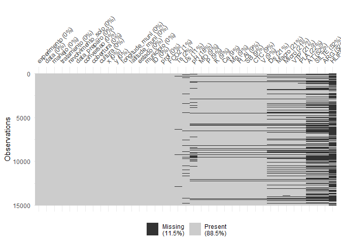

Aprendizado de Máquina: Emissão de CO<sub>2</sub> e CO<sub>2</sub>
Atmosférico
================

<!-- README.md is generated from README.Rmd. Please edit that file -->

##### *Panosso AR; Costa LM; Lima LR; Crispim, VS*

##### Financiamento: Fapesp (202102487-0); CNPq-PIBIC (Nº 2517 - EDITAL 4/2021)

# Resumo do Projeto

## Aquisição dos dados de CO<sub>2</sub> atmosférico (xCO2)

A aquisição de dados e o processamento inicial destes pode ser
encontrada no link:

#### <https://arpanosso.github.io/oco2/>

Para facilitar o acesso, os dodos foram adquiridos por meio do pacote
`{fco2}`.

``` r
## Instalando pacotes (se necessário)
# install.packages("devtools")
# Sys.getenv("GITHUB_PAT")
# Sys.unsetenv("GITHUB_PAT")
# Sys.getenv("GITHUB_PAT")
# devtools::install_github("arpanosso/fco2r")

library(tidyverse)
library(geobr)
library(fco2r)
library(skimr)
source("R/my_fun.R")
```

### Conhecendo a base de dados de CO<sub>2</sub> atmosférico

``` r
help(oco2_br)
#> starting httpd help server ... done
glimpse(oco2_br)
#> Rows: 146,646
#> Columns: 11
#> $ longitude                              <dbl> -70.33963, -70.33963, -70.33963~
#> $ longitude_bnds                         <chr> "-70.4644097222:-70.21484375", ~
#> $ latitude                               <dbl> -5.806417, -5.557240, -5.058887~
#> $ latitude_bnds                          <chr> "-5.93100534001:-5.68182872924"~
#> $ time_yyyymmddhhmmss                    <dbl> 2.014092e+13, 2.014092e+13, 2.0~
#> $ time_bnds_yyyymmddhhmmss               <chr> "20140915000000:20140916000000"~
#> $ altitude_km                            <dbl> 3307.8, 3307.8, 3307.8, 3307.8,~
#> $ alt_bnds_km                            <chr> "0.0:6615.59960938", "0.0:6615.~
#> $ fluorescence_offset_relative_771nm_idp <dbl> 0.0167236, 0.0187703, 0.0167454~
#> $ fluorescence_offset_relative_757nm_idp <dbl> 0.01495360, 0.01348060, 0.01151~
#> $ xco2_moles_mole_1                      <dbl> 0.000391583, 0.000394184, 0.000~
```

### Alguns gráficos

``` r
oco2_br %>% 
  sample_n(1000) %>% 
  ggplot(aes(x = longitude, y = latitude)) + 
  geom_point(color = "blue")
```

<!-- -->

### Carregando o contorno do território

``` r
br <- geobr::read_country(showProgress = FALSE)
#> Using year 2010
```

### Construindo o mapa com os pontos

``` r
br %>% 
  ggplot() +
  geom_sf(fill = "white") +
    geom_point(data=oco2_br %>% 
                 sample_n(2000),
             aes(x=longitude,y=latitude),
             shape=3,
             col="red",
             alpha=0.2)
```

<!-- -->

Observe que utilizamos `dplyr::sample_n()` para retirar apenas

amostras do total do banco de dados
.

#### Estatísticas descritivas

``` r
skim(oco2_br)
```

|                                                  |         |
|:-------------------------------------------------|:--------|
| Name                                             | oco2_br |
| Number of rows                                   | 146646  |
| Number of columns                                | 11      |
| \_\_\_\_\_\_\_\_\_\_\_\_\_\_\_\_\_\_\_\_\_\_\_   |         |
| Column type frequency:                           |         |
| character                                        | 4       |
| numeric                                          | 7       |
| \_\_\_\_\_\_\_\_\_\_\_\_\_\_\_\_\_\_\_\_\_\_\_\_ |         |
| Group variables                                  | None    |

Data summary

**Variable type: character**

| skim_variable            | n_missing | complete_rate | min | max | empty | n_unique | whitespace |
|:-------------------------|----------:|--------------:|----:|----:|------:|---------:|-----------:|
| longitude_bnds           |         0 |             1 |  20 |  29 |     0 |      157 |          0 |
| latitude_bnds            |         0 |             1 |  27 |  31 |     0 |      157 |          0 |
| time_bnds_yyyymmddhhmmss |         0 |             1 |  29 |  29 |     0 |     2033 |          0 |
| alt_bnds_km              |         0 |             1 |  11 |  17 |     0 |       73 |          0 |

**Variable type: numeric**

| skim_variable                          | n_missing | complete_rate |          mean |           sd |            p0 |           p25 |           p50 |           p75 |          p100 | hist  |
|:---------------------------------------|----------:|--------------:|--------------:|-------------:|--------------:|--------------:|--------------:|--------------:|--------------:|:------|
| longitude                              |         0 |             1 | -5.062000e+01 | 7.950000e+00 | -7.383000e+01 | -5.562000e+01 | -5.037000e+01 | -4.463000e+01 | -3.490000e+01 | ▁▃▇▇▅ |
| latitude                               |         0 |             1 | -1.243000e+01 | 7.780000e+00 | -3.371000e+01 | -1.777000e+01 | -1.154000e+01 | -6.800000e+00 |  5.160000e+00 | ▂▅▇▇▂ |
| time_yyyymmddhhmmss                    |         0 |             1 |  2.017376e+13 | 1.785733e+10 |  2.014091e+13 |  2.016051e+13 |  2.017111e+13 |  2.019061e+13 |  2.020103e+13 | ▅▅▃▅▇ |
| altitude_km                            |         0 |             1 |  3.103830e+03 | 1.164900e+02 |  2.555700e+03 |  3.026300e+03 |  3.118260e+03 |  3.180210e+03 |  3.307800e+03 | ▁▁▃▇▆ |
| fluorescence_offset_relative_771nm_idp |         0 |             1 | -1.077410e+03 | 3.280654e+04 | -9.999990e+05 |  1.000000e-02 |  1.000000e-02 |  2.000000e-02 |  3.070000e+00 | ▁▁▁▁▇ |
| fluorescence_offset_relative_757nm_idp |         0 |             1 | -5.796100e+02 | 2.406853e+04 | -9.999990e+05 |  0.000000e+00 |  1.000000e-02 |  2.000000e-02 |  2.380000e+01 | ▁▁▁▁▇ |
| xco2_moles_mole_1                      |         0 |             1 |  0.000000e+00 | 0.000000e+00 |  0.000000e+00 |  0.000000e+00 |  0.000000e+00 |  0.000000e+00 |  0.000000e+00 | ▁▁▇▁▁ |

``` r
visdat::vis_miss(oco2_br %>% 
                   sample_n(10000))
#> Warning: `gather_()` was deprecated in tidyr 1.2.0.
#> Please use `gather()` instead.
#> This warning is displayed once every 8 hours.
#> Call `lifecycle::last_lifecycle_warnings()` to see where this warning was generated.
```

<!-- -->

``` r
oco2 <- oco2_br
```

### Conhecendo a base de dados de emissão de CO<sub>2</sub> do solo

``` r
help(data_fco2)
glimpse(data_fco2)
#> Rows: 15,397
#> Columns: 39
#> $ experimento       <chr> "Espacial", "Espacial", "Espacial", "Espacial", "Esp~
#> $ data              <date> 2001-07-10, 2001-07-10, 2001-07-10, 2001-07-10, 200~
#> $ manejo            <chr> "convencional", "convencional", "convencional", "con~
#> $ tratamento        <chr> "AD_GN", "AD_GN", "AD_GN", "AD_GN", "AD_GN", "AD_GN"~
#> $ revolvimento_solo <lgl> FALSE, FALSE, FALSE, FALSE, FALSE, FALSE, FALSE, FAL~
#> $ data_preparo      <date> 2001-07-01, 2001-07-01, 2001-07-01, 2001-07-01, 200~
#> $ conversao         <date> 1970-01-01, 1970-01-01, 1970-01-01, 1970-01-01, 197~
#> $ cobertura         <lgl> TRUE, TRUE, TRUE, TRUE, TRUE, TRUE, TRUE, TRUE, TRUE~
#> $ cultura           <chr> "milho_soja", "milho_soja", "milho_soja", "milho_soj~
#> $ x                 <dbl> 0, 40, 80, 10, 25, 40, 55, 70, 20, 40, 60, 10, 70, 3~
#> $ y                 <dbl> 0, 0, 0, 10, 10, 10, 10, 10, 20, 20, 20, 25, 25, 30,~
#> $ longitude_muni    <dbl> 782062.7, 782062.7, 782062.7, 782062.7, 782062.7, 78~
#> $ latitude_muni     <dbl> 7647674, 7647674, 7647674, 7647674, 7647674, 7647674~
#> $ estado            <chr> "SP", "SP", "SP", "SP", "SP", "SP", "SP", "SP", "SP"~
#> $ municipio         <chr> "Jaboticabal", "Jaboticabal", "Jaboticabal", "Jaboti~
#> $ ID                <int> 1, 2, 3, 4, 5, 6, 7, 8, 9, 10, 11, 12, 13, 14, 15, 1~
#> $ prof              <chr> "0-0.1", "0-0.1", "0-0.1", "0-0.1", "0-0.1", "0-0.1"~
#> $ FCO2              <dbl> 1.080, 0.825, 1.950, 0.534, 0.893, 0.840, 1.110, 1.8~
#> $ Ts                <dbl> 18.73, 18.40, 19.20, 18.28, 18.35, 18.47, 19.10, 18.~
#> $ Us                <dbl> NA, NA, NA, NA, NA, NA, NA, NA, NA, NA, NA, NA, NA, ~
#> $ pH                <dbl> 5.1, 5.1, 5.8, 5.3, 5.5, 5.7, 5.6, 6.4, 5.3, 5.8, 5.~
#> $ MO                <dbl> 20, 24, 25, 23, 23, 21, 26, 23, 25, 24, 26, 20, 25, ~
#> $ P                 <dbl> 46, 26, 46, 78, 60, 46, 55, 92, 55, 60, 48, 71, 125,~
#> $ K                 <dbl> 2.4, 2.2, 5.3, 3.6, 3.4, 2.9, 4.0, 2.3, 3.3, 3.6, 4.~
#> $ Ca                <dbl> 25, 30, 41, 27, 33, 38, 35, 94, 29, 36, 37, 29, 50, ~
#> $ Mg                <dbl> 11, 11, 25, 11, 15, 20, 16, 65, 11, 17, 15, 11, 30, ~
#> $ H_Al              <dbl> 31, 31, 22, 28, 27, 22, 22, 12, 31, 28, 28, 31, 18, ~
#> $ SB                <dbl> 38.4, 43.2, 71.3, 41.6, 50.6, 60.9, 55.0, 161.3, 43.~
#> $ CTC               <dbl> 69.4, 74.2, 93.3, 69.6, 77.9, 82.9, 77.0, 173.3, 74.~
#> $ V                 <dbl> 55, 58, 76, 60, 65, 73, 71, 93, 58, 67, 67, 58, 82, ~
#> $ Ds                <dbl> NA, NA, NA, NA, NA, NA, NA, NA, NA, NA, NA, NA, NA, ~
#> $ Macro             <dbl> NA, NA, NA, NA, NA, NA, NA, NA, NA, NA, NA, NA, NA, ~
#> $ Micro             <dbl> NA, NA, NA, NA, NA, NA, NA, NA, NA, NA, NA, NA, NA, ~
#> $ VTP               <dbl> NA, NA, NA, NA, NA, NA, NA, NA, NA, NA, NA, NA, NA, ~
#> $ PLA               <dbl> NA, NA, NA, NA, NA, NA, NA, NA, NA, NA, NA, NA, NA, ~
#> $ AT                <dbl> NA, NA, NA, NA, NA, NA, NA, NA, NA, NA, NA, NA, NA, ~
#> $ SILTE             <dbl> NA, NA, NA, NA, NA, NA, NA, NA, NA, NA, NA, NA, NA, ~
#> $ ARG               <dbl> NA, NA, NA, NA, NA, NA, NA, NA, NA, NA, NA, NA, NA, ~
#> $ HLIFS             <dbl> NA, NA, NA, NA, NA, NA, NA, NA, NA, NA, NA, NA, NA, ~
```

### Visualização de dados

``` r
data_fco2 %>% 
  group_by(experimento, cultura, data) %>% 
  summarise(FCO2 = mean(FCO2, na.rm=TRUE)) %>% 
  ggplot(aes(y=FCO2, x=data)) +
  geom_line() +
   facet_wrap(~experimento+ cultura, scale="free")
#> `summarise()` has grouped output by 'experimento', 'cultura'. You can override
#> using the `.groups` argument.
```

<!-- -->

### Construindo o mapa com os pontos

``` r
br %>% 
  ggplot() +
  geom_sf(fill = "white") +
    geom_point(data=oco2 %>% sample_n(1000),
             aes(x=longitude,y=latitude),
             shape=3,
             col="red",
             alpha=0.2)
```

<!-- -->

Observe que utilizamos `dplyr::sample_n()` para retirar apenas

amostras do total do banco de dados
.

#### Estatísticas descritivas

``` r
skim(data_fco2)
```

|                                                  |           |
|:-------------------------------------------------|:----------|
| Name                                             | data_fco2 |
| Number of rows                                   | 15397     |
| Number of columns                                | 39        |
| \_\_\_\_\_\_\_\_\_\_\_\_\_\_\_\_\_\_\_\_\_\_\_   |           |
| Column type frequency:                           |           |
| character                                        | 7         |
| Date                                             | 3         |
| logical                                          | 2         |
| numeric                                          | 27        |
| \_\_\_\_\_\_\_\_\_\_\_\_\_\_\_\_\_\_\_\_\_\_\_\_ |           |
| Group variables                                  | None      |

Data summary

**Variable type: character**

| skim_variable | n_missing | complete_rate | min | max | empty | n_unique | whitespace |
|:--------------|----------:|--------------:|----:|----:|------:|---------:|-----------:|
| experimento   |         0 |             1 |   8 |   8 |     0 |        2 |          0 |
| manejo        |         0 |             1 |   6 |  15 |     0 |       10 |          0 |
| tratamento    |         0 |             1 |   2 |  10 |     0 |       21 |          0 |
| cultura       |         0 |             1 |   4 |  14 |     0 |       11 |          0 |
| estado        |         0 |             1 |   2 |   2 |     0 |        2 |          0 |
| municipio     |         0 |             1 |   7 |  20 |     0 |        6 |          0 |
| prof          |         0 |             1 |   5 |   7 |     0 |        2 |          0 |

**Variable type: Date**

| skim_variable | n_missing | complete_rate | min        | max        | median     | n_unique |
|:--------------|----------:|--------------:|:-----------|:-----------|:-----------|---------:|
| data          |         0 |             1 | 2001-07-10 | 2019-12-01 | 2014-07-12 |      205 |
| data_preparo  |         0 |             1 | 1986-03-01 | 2019-04-01 | 2002-01-01 |       14 |
| conversao     |         0 |             1 | 1970-01-01 | 2009-07-03 | 1986-03-01 |       11 |

**Variable type: logical**

| skim_variable     | n_missing | complete_rate | mean | count      |
|:------------------|----------:|--------------:|-----:|:-----------|
| revolvimento_solo |         0 |             1 |    0 | FAL: 15397 |
| cobertura         |         0 |             1 |    1 | TRU: 15397 |

**Variable type: numeric**

| skim_variable  | n_missing | complete_rate |       mean |         sd |        p0 |        p25 |        p50 |        p75 |       p100 | hist  |
|:---------------|----------:|--------------:|-----------:|-----------:|----------:|-----------:|-----------:|-----------:|-----------:|:------|
| x              |         0 |          1.00 | 1392083.56 | 2923710.70 |      0.00 |       0.00 |      30.00 |     100.00 | 7749472.16 | ▇▁▁▁▂ |
| y              |         0 |          1.00 |  495854.97 | 1722529.75 |      0.00 |       0.00 |      27.00 |      80.00 | 7630525.47 | ▇▁▁▁▁ |
| longitude_muni |         0 |          1.00 | 1067926.05 | 1796771.47 | 456798.63 |  458447.46 |  458447.46 |  792043.56 | 7638196.06 | ▇▁▁▁▁ |
| latitude_muni  |         0 |          1.00 | 7231328.21 | 1754220.76 | 795907.06 | 7635356.70 | 7749398.84 | 7749821.85 | 7758831.37 | ▁▁▁▁▇ |
| ID             |         0 |          1.00 |      40.52 |      31.52 |      1.00 |      13.00 |      35.00 |      60.00 |     141.00 | ▇▅▃▁▁ |
| FCO2           |       110 |          0.99 |       2.78 |       2.08 |     -3.42 |       1.30 |       2.16 |       3.75 |      46.93 | ▇▁▁▁▁ |
| Ts             |       317 |          0.98 |      21.84 |       6.76 |      1.00 |      19.33 |      22.50 |      26.15 |     195.63 | ▇▁▁▁▁ |
| Us             |      1754 |          0.89 |      16.31 |       8.93 |      0.00 |      10.00 |      14.06 |      22.00 |      89.00 | ▇▅▁▁▁ |
| pH             |      2802 |          0.82 |       4.64 |       1.13 |      3.50 |       4.00 |       4.50 |       5.15 |      52.00 | ▇▁▁▁▁ |
| MO             |      1355 |          0.91 |      21.59 |      12.60 |      1.35 |      12.00 |      23.00 |      29.00 |      61.26 | ▆▇▇▂▁ |
| P              |      1355 |          0.91 |      20.95 |      24.74 |      1.00 |       6.00 |      15.48 |      27.36 |     253.00 | ▇▁▁▁▁ |
| K              |      1348 |          0.91 |       2.40 |       2.21 |      0.03 |       0.90 |       1.70 |       3.40 |      34.00 | ▇▁▁▁▁ |
| Ca             |      1376 |          0.91 |      17.20 |      14.57 |      1.10 |       6.00 |      11.00 |      26.00 |      94.00 | ▇▃▁▁▁ |
| Mg             |      1376 |          0.91 |      10.13 |       5.65 |      0.32 |       7.00 |      10.00 |      13.00 |      65.00 | ▇▂▁▁▁ |
| H_Al           |      1362 |          0.91 |      46.89 |      29.38 |      0.00 |      26.00 |      42.29 |      72.00 |     121.00 | ▅▇▆▂▂ |
| SB             |      1376 |          0.91 |      29.69 |      20.10 |      1.54 |      15.60 |      23.80 |      42.00 |     161.30 | ▇▃▁▁▁ |
| CTC            |      1369 |          0.91 |      77.10 |      32.99 |      4.62 |      59.23 |      83.40 |     103.20 |     173.30 | ▂▃▇▃▁ |
| V              |      1383 |          0.91 |      41.68 |      20.05 |      4.96 |      22.00 |      43.00 |      58.00 |     100.00 | ▆▆▇▅▁ |
| Ds             |      3284 |          0.79 |       1.38 |       0.17 |      0.88 |       1.24 |       1.38 |       1.52 |       1.86 | ▁▆▇▇▁ |
| Macro          |      3277 |          0.79 |       8.55 |       7.85 |    -45.30 |       0.15 |       8.13 |      13.64 |      49.77 | ▁▁▇▃▁ |
| Micro          |      3298 |          0.79 |      25.30 |      17.13 |      0.07 |       0.37 |      33.86 |      38.30 |      52.42 | ▅▁▂▇▁ |
| VTP            |      3298 |          0.79 |      42.34 |      15.65 |     -4.68 |      40.81 |      46.25 |      51.32 |      87.80 | ▂▁▇▃▁ |
| PLA            |      3438 |          0.78 |      29.57 |      11.80 |    -47.30 |      21.27 |      32.41 |      38.15 |      79.80 | ▁▁▅▇▁ |
| AT             |      8083 |          0.48 |    1013.33 |    1358.81 |     11.72 |     236.00 |     593.62 |     816.00 |    4542.73 | ▇▁▁▁▂ |
| SILTE          |      8048 |          0.48 |     229.26 |     336.37 |      1.26 |      50.87 |      73.65 |     188.00 |    1395.00 | ▇▁▁▁▁ |
| ARG            |      8055 |          0.48 |     995.41 |    1560.32 |     27.19 |     173.27 |     403.69 |     609.50 |    5244.76 | ▇▁▁▁▂ |
| HLIFS          |     10872 |          0.29 |   14590.11 |   17253.55 |    158.39 |    1110.15 |    2409.80 |   29707.78 |   84692.90 | ▇▃▁▁▁ |

``` r
visdat::vis_miss(data_fco2 %>% 
                   sample_n(10000))
```

<!-- -->

``` r
atributos <- data_fco2
```

``` r
# Lista do xCO2
# 01 passar as datas que estão em ano-mes-dia-horas-min-segundos
# para uma outra coluna denominada 'data' como ano-mes-dia
# Fazer em pipeline, usar o mutate do pacote dplyr e provavelmente
# a funçoes do pacote lubridate

oco2 <- oco2 |>
  dplyr::mutate (
    ano = time_yyyymmddhhmmss%/%1e10,
    mês = time_yyyymmddhhmmss%/%1e8 %%100,
    dia = time_yyyymmddhhmmss%/%1e6 %%100,
    data = as.Date(stringr::str_c(ano,mês,dia,sep="-"))
    )|>
  dplyr::glimpse()
#> Rows: 146,646
#> Columns: 15
#> $ longitude                              <dbl> -70.33963, -70.33963, -70.33963~
#> $ longitude_bnds                         <chr> "-70.4644097222:-70.21484375", ~
#> $ latitude                               <dbl> -5.806417, -5.557240, -5.058887~
#> $ latitude_bnds                          <chr> "-5.93100534001:-5.68182872924"~
#> $ time_yyyymmddhhmmss                    <dbl> 2.014092e+13, 2.014092e+13, 2.0~
#> $ time_bnds_yyyymmddhhmmss               <chr> "20140915000000:20140916000000"~
#> $ altitude_km                            <dbl> 3307.8, 3307.8, 3307.8, 3307.8,~
#> $ alt_bnds_km                            <chr> "0.0:6615.59960938", "0.0:6615.~
#> $ fluorescence_offset_relative_771nm_idp <dbl> 0.0167236, 0.0187703, 0.0167454~
#> $ fluorescence_offset_relative_757nm_idp <dbl> 0.01495360, 0.01348060, 0.01151~
#> $ xco2_moles_mole_1                      <dbl> 0.000391583, 0.000394184, 0.000~
#> $ ano                                    <dbl> 2014, 2014, 2014, 2014, 2014, 2~
#> $ mês                                    <dbl> 9, 9, 9, 9, 9, 9, 9, 9, 9, 9, 9~
#> $ dia                                    <dbl> 15, 15, 6, 6, 6, 6, 15, 6, 6, 6~
#> $ data                                   <date> 2014-09-15, 2014-09-15, 2014-0~
```

Listando as datas em ambos os bancos de dados

``` r
# Lista das datas de FCO2 
lista_data_fco2 <- unique(atributos$data)
lista_data_oco2 <- unique(oco2$data)
datas_fco2 <- paste0(lubridate::year(lista_data_fco2),"-",lubridate::month(lista_data_fco2)) %>% unique()

datas_oco2 <- paste0(lubridate::year(lista_data_oco2),"-",lubridate::month(lista_data_oco2)) %>% unique()
datas <- datas_fco2[datas_fco2 %in% datas_oco2]
```

Criação as listas de datas, que é chave para a mesclagem dos arquivos.

``` r
fco2 <- atributos %>% 
  mutate(ano_mes = paste0(lubridate::year(data),"-",lubridate::month(data))) %>% 
  dplyr::filter(ano_mes %in% datas)

xco2 <- oco2 %>%   
  mutate(ano_mes=paste0(ano,"-",mês)) %>% 
  dplyr::filter(ano_mes %in% datas)
```

Coordenadas das cidades

``` r
unique(xco2$ano_mes) == 
unique(fco2$ano_mes)
#>  [1]  TRUE  TRUE  TRUE  TRUE  TRUE  TRUE  TRUE  TRUE  TRUE  TRUE FALSE FALSE
#> [13] FALSE  TRUE  TRUE  TRUE  TRUE  TRUE  TRUE  TRUE  TRUE  TRUE  TRUE  TRUE
#> [25]  TRUE  TRUE  TRUE  TRUE  TRUE
```

Abordagem usando o join do `{dplyr}`

``` r
memory.limit(size=10001)
#> [1] 10001
data_set <- left_join(fco2 %>% 
            mutate(ano = lubridate::year(data),
                   mes = lubridate::month(data)
                   ) %>% 
            select(ID, data, cultura, ano, mes, x,y, FCO2, Ts,
                   Us, MO, Macro, VTP, ARG, ano_mes), 
          xco2 %>% 
            select(data,mês,dia,longitude,latitude,xco2_moles_mole_1,fluorescence_offset_relative_757nm_idp,fluorescence_offset_relative_771nm_idp,ano_mes), by = "ano_mes") %>% 
  mutate(dist = sqrt((longitude-(-51.423519))^2+(latitude-(-20.362911))^2),
         SIF = (fluorescence_offset_relative_757nm_idp + 1.5*fluorescence_offset_relative_771nm_idp)/2) %>%
  filter(dist <= .75) 
(data_set)
#>       ID     data.x     cultura  ano mes   x   y  FCO2       Ts Us MO
#> 1      1 2015-10-02   eucalipto 2015  10   0   0  1.81 26.76753  7 31
#> 2      1 2015-10-02   eucalipto 2015  10   0   0  1.81 26.76753  7 31
#> 3      1 2015-10-02   eucalipto 2015  10   0   0  1.81 26.76753  7 31
#> 4      1 2015-10-02   eucalipto 2015  10   0   0  1.81 26.76753  7 31
#> 5      2 2015-10-02   eucalipto 2015  10  20   0  2.92 27.15065  5 32
#> 6      2 2015-10-02   eucalipto 2015  10  20   0  2.92 27.15065  5 32
#> 7      2 2015-10-02   eucalipto 2015  10  20   0  2.92 27.15065  5 32
#> 8      2 2015-10-02   eucalipto 2015  10  20   0  2.92 27.15065  5 32
#> 9      3 2015-10-02   eucalipto 2015  10  40   0  2.93 25.92684  6 39
#> 10     3 2015-10-02   eucalipto 2015  10  40   0  2.93 25.92684  6 39
#> 11     3 2015-10-02   eucalipto 2015  10  40   0  2.93 25.92684  6 39
#> 12     3 2015-10-02   eucalipto 2015  10  40   0  2.93 25.92684  6 39
#> 13     4 2015-10-02   eucalipto 2015  10  60   0  3.12 27.28634  3 38
#> 14     4 2015-10-02   eucalipto 2015  10  60   0  3.12 27.28634  3 38
#> 15     4 2015-10-02   eucalipto 2015  10  60   0  3.12 27.28634  3 38
#> 16     4 2015-10-02   eucalipto 2015  10  60   0  3.12 27.28634  3 38
#> 17     5 2015-10-02   eucalipto 2015  10  80   0  7.44 26.59642  3 29
#> 18     5 2015-10-02   eucalipto 2015  10  80   0  7.44 26.59642  3 29
#> 19     5 2015-10-02   eucalipto 2015  10  80   0  7.44 26.59642  3 29
#> 20     5 2015-10-02   eucalipto 2015  10  80   0  7.44 26.59642  3 29
#> 21     6 2015-10-02   eucalipto 2015  10 100   0  2.77 26.15459  6 31
#> 22     6 2015-10-02   eucalipto 2015  10 100   0  2.77 26.15459  6 31
#> 23     6 2015-10-02   eucalipto 2015  10 100   0  2.77 26.15459  6 31
#> 24     6 2015-10-02   eucalipto 2015  10 100   0  2.77 26.15459  6 31
#> 25    17 2015-10-02   eucalipto 2015  10  90  10  3.29 26.57800  8 29
#> 26    17 2015-10-02   eucalipto 2015  10  90  10  3.29 26.57800  8 29
#> 27    17 2015-10-02   eucalipto 2015  10  90  10  3.29 26.57800  8 29
#> 28    17 2015-10-02   eucalipto 2015  10  90  10  3.29 26.57800  8 29
#> 29    16 2015-10-02   eucalipto 2015  10  70  10  3.96 26.00376  6 37
#> 30    16 2015-10-02   eucalipto 2015  10  70  10  3.96 26.00376  6 37
#> 31    16 2015-10-02   eucalipto 2015  10  70  10  3.96 26.00376  6 37
#> 32    16 2015-10-02   eucalipto 2015  10  70  10  3.96 26.00376  6 37
#> 33    15 2015-10-02   eucalipto 2015  10  65  10  8.25 27.13630  5 43
#> 34    15 2015-10-02   eucalipto 2015  10  65  10  8.25 27.13630  5 43
#> 35    15 2015-10-02   eucalipto 2015  10  65  10  8.25 27.13630  5 43
#> 36    15 2015-10-02   eucalipto 2015  10  65  10  8.25 27.13630  5 43
#> 37    14 2015-10-02   eucalipto 2015  10  60  10  3.20 26.36790  7 28
#> 38    14 2015-10-02   eucalipto 2015  10  60  10  3.20 26.36790  7 28
#> 39    14 2015-10-02   eucalipto 2015  10  60  10  3.20 26.36790  7 28
#> 40    14 2015-10-02   eucalipto 2015  10  60  10  3.20 26.36790  7 28
#> 41    13 2015-10-02   eucalipto 2015  10  55  10  4.11 26.28610  6 35
#> 42    13 2015-10-02   eucalipto 2015  10  55  10  4.11 26.28610  6 35
#> 43    13 2015-10-02   eucalipto 2015  10  55  10  4.11 26.28610  6 35
#> 44    13 2015-10-02   eucalipto 2015  10  55  10  4.11 26.28610  6 35
#> 45    12 2015-10-02   eucalipto 2015  10  50  10  3.19 26.15821  7 24
#> 46    12 2015-10-02   eucalipto 2015  10  50  10  3.19 26.15821  7 24
#> 47    12 2015-10-02   eucalipto 2015  10  50  10  3.19 26.15821  7 24
#> 48    12 2015-10-02   eucalipto 2015  10  50  10  3.19 26.15821  7 24
#> 49    11 2015-10-02   eucalipto 2015  10  30  10  3.75 26.47198  6 29
#> 50    11 2015-10-02   eucalipto 2015  10  30  10  3.75 26.47198  6 29
#> 51    11 2015-10-02   eucalipto 2015  10  30  10  3.75 26.47198  6 29
#> 52    11 2015-10-02   eucalipto 2015  10  30  10  3.75 26.47198  6 29
#> 53    10 2015-10-02   eucalipto 2015  10  25  10  5.06 26.68674  7 24
#> 54    10 2015-10-02   eucalipto 2015  10  25  10  5.06 26.68674  7 24
#> 55    10 2015-10-02   eucalipto 2015  10  25  10  5.06 26.68674  7 24
#> 56    10 2015-10-02   eucalipto 2015  10  25  10  5.06 26.68674  7 24
#> 57     9 2015-10-02   eucalipto 2015  10  20  10  4.36 26.97689  6 22
#> 58     9 2015-10-02   eucalipto 2015  10  20  10  4.36 26.97689  6 22
#> 59     9 2015-10-02   eucalipto 2015  10  20  10  4.36 26.97689  6 22
#> 60     9 2015-10-02   eucalipto 2015  10  20  10  4.36 26.97689  6 22
#> 61     8 2015-10-02   eucalipto 2015  10  15  10  2.88 25.94849  6 29
#> 62     8 2015-10-02   eucalipto 2015  10  15  10  2.88 25.94849  6 29
#> 63     8 2015-10-02   eucalipto 2015  10  15  10  2.88 25.94849  6 29
#> 64     8 2015-10-02   eucalipto 2015  10  15  10  2.88 25.94849  6 29
#> 65     7 2015-10-02   eucalipto 2015  10  10  10  4.65 26.00388  6 27
#> 66     7 2015-10-02   eucalipto 2015  10  10  10  4.65 26.00388  6 27
#> 67     7 2015-10-02   eucalipto 2015  10  10  10  4.65 26.00388  6 27
#> 68     7 2015-10-02   eucalipto 2015  10  10  10  4.65 26.00388  6 27
#> 69    43 2015-10-02   eucalipto 2015  10   0  40  2.28 25.76855  7 34
#> 70    43 2015-10-02   eucalipto 2015  10   0  40  2.28 25.76855  7 34
#> 71    43 2015-10-02   eucalipto 2015  10   0  40  2.28 25.76855  7 34
#> 72    43 2015-10-02   eucalipto 2015  10   0  40  2.28 25.76855  7 34
#> 73    44 2015-10-02   eucalipto 2015  10  20  40  2.67 27.12686  6 28
#> 74    44 2015-10-02   eucalipto 2015  10  20  40  2.67 27.12686  6 28
#> 75    44 2015-10-02   eucalipto 2015  10  20  40  2.67 27.12686  6 28
#> 76    44 2015-10-02   eucalipto 2015  10  20  40  2.67 27.12686  6 28
#> 77    45 2015-10-02   eucalipto 2015  10  40  40  2.45 26.53991  6 36
#> 78    45 2015-10-02   eucalipto 2015  10  40  40  2.45 26.53991  6 36
#> 79    45 2015-10-02   eucalipto 2015  10  40  40  2.45 26.53991  6 36
#> 80    45 2015-10-02   eucalipto 2015  10  40  40  2.45 26.53991  6 36
#> 81    46 2015-10-02   eucalipto 2015  10  60  40  3.15 27.18637  6 31
#> 82    46 2015-10-02   eucalipto 2015  10  60  40  3.15 27.18637  6 31
#> 83    46 2015-10-02   eucalipto 2015  10  60  40  3.15 27.18637  6 31
#> 84    46 2015-10-02   eucalipto 2015  10  60  40  3.15 27.18637  6 31
#> 85    47 2015-10-02   eucalipto 2015  10  80  40  4.39 27.06083  6 33
#> 86    47 2015-10-02   eucalipto 2015  10  80  40  4.39 27.06083  6 33
#> 87    47 2015-10-02   eucalipto 2015  10  80  40  4.39 27.06083  6 33
#> 88    47 2015-10-02   eucalipto 2015  10  80  40  4.39 27.06083  6 33
#> 89    48 2015-10-02   eucalipto 2015  10 100  40  5.23 26.99429  6 30
#> 90    48 2015-10-02   eucalipto 2015  10 100  40  5.23 26.99429  6 30
#> 91    48 2015-10-02   eucalipto 2015  10 100  40  5.23 26.99429  6 30
#> 92    48 2015-10-02   eucalipto 2015  10 100  40  5.23 26.99429  6 30
#> 93    53 2015-10-02   eucalipto 2015  10  90  50  1.90 26.59499  6 20
#> 94    53 2015-10-02   eucalipto 2015  10  90  50  1.90 26.59499  6 20
#> 95    53 2015-10-02   eucalipto 2015  10  90  50  1.90 26.59499  6 20
#> 96    53 2015-10-02   eucalipto 2015  10  90  50  1.90 26.59499  6 20
#> 97    52 2015-10-02   eucalipto 2015  10  70  50  2.48 25.59283  7 19
#> 98    52 2015-10-02   eucalipto 2015  10  70  50  2.48 25.59283  7 19
#> 99    52 2015-10-02   eucalipto 2015  10  70  50  2.48 25.59283  7 19
#> 100   52 2015-10-02   eucalipto 2015  10  70  50  2.48 25.59283  7 19
#> 101   51 2015-10-02   eucalipto 2015  10  50  50  2.54 26.79425  6 25
#> 102   51 2015-10-02   eucalipto 2015  10  50  50  2.54 26.79425  6 25
#> 103   51 2015-10-02   eucalipto 2015  10  50  50  2.54 26.79425  6 25
#> 104   51 2015-10-02   eucalipto 2015  10  50  50  2.54 26.79425  6 25
#> 105   50 2015-10-02   eucalipto 2015  10  30  50 -3.42 27.00592  6 23
#> 106   50 2015-10-02   eucalipto 2015  10  30  50 -3.42 27.00592  6 23
#> 107   50 2015-10-02   eucalipto 2015  10  30  50 -3.42 27.00592  6 23
#> 108   50 2015-10-02   eucalipto 2015  10  30  50 -3.42 27.00592  6 23
#> 109   49 2015-10-02   eucalipto 2015  10  10  50  1.71 26.33002  7 18
#> 110   49 2015-10-02   eucalipto 2015  10  10  50  1.71 26.33002  7 18
#> 111   49 2015-10-02   eucalipto 2015  10  10  50  1.71 26.33002  7 18
#> 112   49 2015-10-02   eucalipto 2015  10  10  50  1.71 26.33002  7 18
#> 113   54 2015-10-02   eucalipto 2015  10   0  60  4.76 26.51007  5 28
#> 114   54 2015-10-02   eucalipto 2015  10   0  60  4.76 26.51007  5 28
#> 115   54 2015-10-02   eucalipto 2015  10   0  60  4.76 26.51007  5 28
#> 116   54 2015-10-02   eucalipto 2015  10   0  60  4.76 26.51007  5 28
#> 117   55 2015-10-02   eucalipto 2015  10  20  60  3.67 25.99048  6 37
#> 118   55 2015-10-02   eucalipto 2015  10  20  60  3.67 25.99048  6 37
#> 119   55 2015-10-02   eucalipto 2015  10  20  60  3.67 25.99048  6 37
#> 120   55 2015-10-02   eucalipto 2015  10  20  60  3.67 25.99048  6 37
#> 121   56 2015-10-02   eucalipto 2015  10  40  60  2.81 27.50600  7 28
#> 122   56 2015-10-02   eucalipto 2015  10  40  60  2.81 27.50600  7 28
#> 123   56 2015-10-02   eucalipto 2015  10  40  60  2.81 27.50600  7 28
#> 124   56 2015-10-02   eucalipto 2015  10  40  60  2.81 27.50600  7 28
#> 125   57 2015-10-02   eucalipto 2015  10  60  60 -0.28 26.99879  7 29
#> 126   57 2015-10-02   eucalipto 2015  10  60  60 -0.28 26.99879  7 29
#> 127   57 2015-10-02   eucalipto 2015  10  60  60 -0.28 26.99879  7 29
#> 128   57 2015-10-02   eucalipto 2015  10  60  60 -0.28 26.99879  7 29
#> 129   58 2015-10-02   eucalipto 2015  10  70  60  2.66 26.91970  8 41
#> 130   58 2015-10-02   eucalipto 2015  10  70  60  2.66 26.91970  8 41
#> 131   58 2015-10-02   eucalipto 2015  10  70  60  2.66 26.91970  8 41
#> 132   58 2015-10-02   eucalipto 2015  10  70  60  2.66 26.91970  8 41
#> 133   59 2015-10-02   eucalipto 2015  10  75  60  2.88 26.63401  8 32
#> 134   59 2015-10-02   eucalipto 2015  10  75  60  2.88 26.63401  8 32
#> 135   59 2015-10-02   eucalipto 2015  10  75  60  2.88 26.63401  8 32
#> 136   59 2015-10-02   eucalipto 2015  10  75  60  2.88 26.63401  8 32
#> 137   60 2015-10-02   eucalipto 2015  10  80  60  6.28 27.34467  8 37
#> 138   60 2015-10-02   eucalipto 2015  10  80  60  6.28 27.34467  8 37
#> 139   60 2015-10-02   eucalipto 2015  10  80  60  6.28 27.34467  8 37
#> 140   60 2015-10-02   eucalipto 2015  10  80  60  6.28 27.34467  8 37
#> 141   61 2015-10-02   eucalipto 2015  10  85  60  4.42 26.19769  7 34
#> 142   61 2015-10-02   eucalipto 2015  10  85  60  4.42 26.19769  7 34
#> 143   61 2015-10-02   eucalipto 2015  10  85  60  4.42 26.19769  7 34
#> 144   61 2015-10-02   eucalipto 2015  10  85  60  4.42 26.19769  7 34
#> 145   62 2015-10-02   eucalipto 2015  10  90  60  4.25 26.42251  7 38
#> 146   62 2015-10-02   eucalipto 2015  10  90  60  4.25 26.42251  7 38
#> 147   62 2015-10-02   eucalipto 2015  10  90  60  4.25 26.42251  7 38
#> 148   62 2015-10-02   eucalipto 2015  10  90  60  4.25 26.42251  7 38
#> 149   63 2015-10-02   eucalipto 2015  10 100  60  4.20 27.02965  6 28
#> 150   63 2015-10-02   eucalipto 2015  10 100  60  4.20 27.02965  6 28
#> 151   63 2015-10-02   eucalipto 2015  10 100  60  4.20 27.02965  6 28
#> 152   63 2015-10-02   eucalipto 2015  10 100  60  4.20 27.02965  6 28
#> 153   74 2015-10-02   eucalipto 2015  10  90  70  9.44 27.39375  9 31
#> 154   74 2015-10-02   eucalipto 2015  10  90  70  9.44 27.39375  9 31
#> 155   74 2015-10-02   eucalipto 2015  10  90  70  9.44 27.39375  9 31
#> 156   74 2015-10-02   eucalipto 2015  10  90  70  9.44 27.39375  9 31
#> 157   73 2015-10-02   eucalipto 2015  10  85  70  4.10 26.97595  7 36
#> 158   73 2015-10-02   eucalipto 2015  10  85  70  4.10 26.97595  7 36
#> 159   73 2015-10-02   eucalipto 2015  10  85  70  4.10 26.97595  7 36
#> 160   73 2015-10-02   eucalipto 2015  10  85  70  4.10 26.97595  7 36
#> 161   72 2015-10-02   eucalipto 2015  10  80  70  4.23 26.94361  7 40
#> 162   72 2015-10-02   eucalipto 2015  10  80  70  4.23 26.94361  7 40
#> 163   72 2015-10-02   eucalipto 2015  10  80  70  4.23 26.94361  7 40
#> 164   72 2015-10-02   eucalipto 2015  10  80  70  4.23 26.94361  7 40
#> 165   71 2015-10-02   eucalipto 2015  10  75  70  3.58 27.32830  8 41
#> 166   71 2015-10-02   eucalipto 2015  10  75  70  3.58 27.32830  8 41
#> 167   71 2015-10-02   eucalipto 2015  10  75  70  3.58 27.32830  8 41
#> 168   71 2015-10-02   eucalipto 2015  10  75  70  3.58 27.32830  8 41
#> 169   70 2015-10-02   eucalipto 2015  10  70  70  3.52 26.66062  5 26
#> 170   70 2015-10-02   eucalipto 2015  10  70  70  3.52 26.66062  5 26
#> 171   70 2015-10-02   eucalipto 2015  10  70  70  3.52 26.66062  5 26
#> 172   70 2015-10-02   eucalipto 2015  10  70  70  3.52 26.66062  5 26
#> 173   69 2015-10-02   eucalipto 2015  10  50  70  4.50 25.38627  7 31
#> 174   69 2015-10-02   eucalipto 2015  10  50  70  4.50 25.38627  7 31
#> 175   69 2015-10-02   eucalipto 2015  10  50  70  4.50 25.38627  7 31
#> 176   69 2015-10-02   eucalipto 2015  10  50  70  4.50 25.38627  7 31
#> 177   68 2015-10-02   eucalipto 2015  10  45  70  3.06 26.43455 10 41
#> 178   68 2015-10-02   eucalipto 2015  10  45  70  3.06 26.43455 10 41
#> 179   68 2015-10-02   eucalipto 2015  10  45  70  3.06 26.43455 10 41
#> 180   68 2015-10-02   eucalipto 2015  10  45  70  3.06 26.43455 10 41
#> 181   67 2015-10-02   eucalipto 2015  10  40  70  3.51 26.59736  7 33
#> 182   67 2015-10-02   eucalipto 2015  10  40  70  3.51 26.59736  7 33
#> 183   67 2015-10-02   eucalipto 2015  10  40  70  3.51 26.59736  7 33
#> 184   67 2015-10-02   eucalipto 2015  10  40  70  3.51 26.59736  7 33
#> 185   66 2015-10-02   eucalipto 2015  10  35  70  3.45 27.11043  7 32
#> 186   66 2015-10-02   eucalipto 2015  10  35  70  3.45 27.11043  7 32
#> 187   66 2015-10-02   eucalipto 2015  10  35  70  3.45 27.11043  7 32
#> 188   66 2015-10-02   eucalipto 2015  10  35  70  3.45 27.11043  7 32
#> 189   65 2015-10-02   eucalipto 2015  10  30  70  2.88 26.89792  6 34
#> 190   65 2015-10-02   eucalipto 2015  10  30  70  2.88 26.89792  6 34
#> 191   65 2015-10-02   eucalipto 2015  10  30  70  2.88 26.89792  6 34
#> 192   65 2015-10-02   eucalipto 2015  10  30  70  2.88 26.89792  6 34
#> 193   64 2015-10-02   eucalipto 2015  10  10  70  2.89 27.40046  8 36
#> 194   64 2015-10-02   eucalipto 2015  10  10  70  2.89 27.40046  8 36
#> 195   64 2015-10-02   eucalipto 2015  10  10  70  2.89 27.40046  8 36
#> 196   64 2015-10-02   eucalipto 2015  10  10  70  2.89 27.40046  8 36
#> 197   18 2015-10-02   eucalipto 2015  10   0  20  2.54 25.93752  5 25
#> 198   18 2015-10-02   eucalipto 2015  10   0  20  2.54 25.93752  5 25
#> 199   18 2015-10-02   eucalipto 2015  10   0  20  2.54 25.93752  5 25
#> 200   18 2015-10-02   eucalipto 2015  10   0  20  2.54 25.93752  5 25
#> 201   19 2015-10-02   eucalipto 2015  10  10  20  2.49 27.66776  6 31
#> 202   19 2015-10-02   eucalipto 2015  10  10  20  2.49 27.66776  6 31
#> 203   19 2015-10-02   eucalipto 2015  10  10  20  2.49 27.66776  6 31
#> 204   19 2015-10-02   eucalipto 2015  10  10  20  2.49 27.66776  6 31
#> 205   20 2015-10-02   eucalipto 2015  10  15  20  4.34 26.84055  6 24
#> 206   20 2015-10-02   eucalipto 2015  10  15  20  4.34 26.84055  6 24
#> 207   20 2015-10-02   eucalipto 2015  10  15  20  4.34 26.84055  6 24
#> 208   20 2015-10-02   eucalipto 2015  10  15  20  4.34 26.84055  6 24
#> 209   21 2015-10-02   eucalipto 2015  10  20  20  2.93 26.31937  6 29
#> 210   21 2015-10-02   eucalipto 2015  10  20  20  2.93 26.31937  6 29
#> 211   21 2015-10-02   eucalipto 2015  10  20  20  2.93 26.31937  6 29
#> 212   21 2015-10-02   eucalipto 2015  10  20  20  2.93 26.31937  6 29
#> 213   22 2015-10-02   eucalipto 2015  10  25  20  3.73 26.80689  7 26
#> 214   22 2015-10-02   eucalipto 2015  10  25  20  3.73 26.80689  7 26
#> 215   22 2015-10-02   eucalipto 2015  10  25  20  3.73 26.80689  7 26
#> 216   22 2015-10-02   eucalipto 2015  10  25  20  3.73 26.80689  7 26
#> 217   23 2015-10-02   eucalipto 2015  10  30  20  2.56 27.32739  7 35
#> 218   23 2015-10-02   eucalipto 2015  10  30  20  2.56 27.32739  7 35
#> 219   23 2015-10-02   eucalipto 2015  10  30  20  2.56 27.32739  7 35
#> 220   23 2015-10-02   eucalipto 2015  10  30  20  2.56 27.32739  7 35
#> 221   24 2015-10-02   eucalipto 2015  10  40  20  4.38 27.10476  6 34
#> 222   24 2015-10-02   eucalipto 2015  10  40  20  4.38 27.10476  6 34
#> 223   24 2015-10-02   eucalipto 2015  10  40  20  4.38 27.10476  6 34
#> 224   24 2015-10-02   eucalipto 2015  10  40  20  4.38 27.10476  6 34
#> 225   25 2015-10-02   eucalipto 2015  10  50  20  5.74 27.39640  4 28
#> 226   25 2015-10-02   eucalipto 2015  10  50  20  5.74 27.39640  4 28
#> 227   25 2015-10-02   eucalipto 2015  10  50  20  5.74 27.39640  4 28
#> 228   25 2015-10-02   eucalipto 2015  10  50  20  5.74 27.39640  4 28
#> 229   26 2015-10-02   eucalipto 2015  10  55  20  4.18 26.58400  5 28
#> 230   26 2015-10-02   eucalipto 2015  10  55  20  4.18 26.58400  5 28
#> 231   26 2015-10-02   eucalipto 2015  10  55  20  4.18 26.58400  5 28
#> 232   26 2015-10-02   eucalipto 2015  10  55  20  4.18 26.58400  5 28
#> 233   27 2015-10-02   eucalipto 2015  10  60  20  3.57 27.09739  3 31
#> 234   27 2015-10-02   eucalipto 2015  10  60  20  3.57 27.09739  3 31
#> 235   27 2015-10-02   eucalipto 2015  10  60  20  3.57 27.09739  3 31
#> 236   27 2015-10-02   eucalipto 2015  10  60  20  3.57 27.09739  3 31
#> 237   28 2015-10-02   eucalipto 2015  10  65  20  3.63 27.53483  6 26
#> 238   28 2015-10-02   eucalipto 2015  10  65  20  3.63 27.53483  6 26
#> 239   28 2015-10-02   eucalipto 2015  10  65  20  3.63 27.53483  6 26
#> 240   28 2015-10-02   eucalipto 2015  10  65  20  3.63 27.53483  6 26
#> 241   29 2015-10-02   eucalipto 2015  10  70  20  2.48 26.48276  6 29
#> 242   29 2015-10-02   eucalipto 2015  10  70  20  2.48 26.48276  6 29
#> 243   29 2015-10-02   eucalipto 2015  10  70  20  2.48 26.48276  6 29
#> 244   29 2015-10-02   eucalipto 2015  10  70  20  2.48 26.48276  6 29
#> 245   30 2015-10-02   eucalipto 2015  10  80  20  2.68 25.81187  7 22
#> 246   30 2015-10-02   eucalipto 2015  10  80  20  2.68 25.81187  7 22
#> 247   30 2015-10-02   eucalipto 2015  10  80  20  2.68 25.81187  7 22
#> 248   30 2015-10-02   eucalipto 2015  10  80  20  2.68 25.81187  7 22
#> 249   31 2015-10-02   eucalipto 2015  10 100  20  3.05 26.26865  7 29
#> 250   31 2015-10-02   eucalipto 2015  10 100  20  3.05 26.26865  7 29
#> 251   31 2015-10-02   eucalipto 2015  10 100  20  3.05 26.26865  7 29
#> 252   31 2015-10-02   eucalipto 2015  10 100  20  3.05 26.26865  7 29
#> 253   42 2015-10-02   eucalipto 2015  10  90  30  3.10 27.02834  7 34
#> 254   42 2015-10-02   eucalipto 2015  10  90  30  3.10 27.02834  7 34
#> 255   42 2015-10-02   eucalipto 2015  10  90  30  3.10 27.02834  7 34
#> 256   42 2015-10-02   eucalipto 2015  10  90  30  3.10 27.02834  7 34
#> 257   41 2015-10-02   eucalipto 2015  10  70  30  3.10 26.11270  7 29
#> 258   41 2015-10-02   eucalipto 2015  10  70  30  3.10 26.11270  7 29
#> 259   41 2015-10-02   eucalipto 2015  10  70  30  3.10 26.11270  7 29
#> 260   41 2015-10-02   eucalipto 2015  10  70  30  3.10 26.11270  7 29
#> 261   40 2015-10-02   eucalipto 2015  10  65  30  3.50 25.59546  7 30
#> 262   40 2015-10-02   eucalipto 2015  10  65  30  3.50 25.59546  7 30
#> 263   40 2015-10-02   eucalipto 2015  10  65  30  3.50 25.59546  7 30
#> 264   40 2015-10-02   eucalipto 2015  10  65  30  3.50 25.59546  7 30
#> 265   39 2015-10-02   eucalipto 2015  10  60  30  2.50 26.56848  7 30
#> 266   39 2015-10-02   eucalipto 2015  10  60  30  2.50 26.56848  7 30
#> 267   39 2015-10-02   eucalipto 2015  10  60  30  2.50 26.56848  7 30
#> 268   39 2015-10-02   eucalipto 2015  10  60  30  2.50 26.56848  7 30
#> 269   38 2015-10-02   eucalipto 2015  10  55  30  2.86 26.40616  6 33
#> 270   38 2015-10-02   eucalipto 2015  10  55  30  2.86 26.40616  6 33
#> 271   38 2015-10-02   eucalipto 2015  10  55  30  2.86 26.40616  6 33
#> 272   38 2015-10-02   eucalipto 2015  10  55  30  2.86 26.40616  6 33
#> 273   37 2015-10-02   eucalipto 2015  10  50  30  3.69 26.02711  8 28
#> 274   37 2015-10-02   eucalipto 2015  10  50  30  3.69 26.02711  8 28
#> 275   37 2015-10-02   eucalipto 2015  10  50  30  3.69 26.02711  8 28
#> 276   37 2015-10-02   eucalipto 2015  10  50  30  3.69 26.02711  8 28
#> 277   36 2015-10-02   eucalipto 2015  10  30  30  2.88 25.41328  6 35
#> 278   36 2015-10-02   eucalipto 2015  10  30  30  2.88 25.41328  6 35
#> 279   36 2015-10-02   eucalipto 2015  10  30  30  2.88 25.41328  6 35
#> 280   36 2015-10-02   eucalipto 2015  10  30  30  2.88 25.41328  6 35
#> 281   35 2015-10-02   eucalipto 2015  10  25  30  3.55 26.46908  6 29
#> 282   35 2015-10-02   eucalipto 2015  10  25  30  3.55 26.46908  6 29
#> 283   35 2015-10-02   eucalipto 2015  10  25  30  3.55 26.46908  6 29
#> 284   35 2015-10-02   eucalipto 2015  10  25  30  3.55 26.46908  6 29
#> 285   34 2015-10-02   eucalipto 2015  10  20  30  2.41 27.24723  6 27
#> 286   34 2015-10-02   eucalipto 2015  10  20  30  2.41 27.24723  6 27
#> 287   34 2015-10-02   eucalipto 2015  10  20  30  2.41 27.24723  6 27
#> 288   34 2015-10-02   eucalipto 2015  10  20  30  2.41 27.24723  6 27
#> 289   33 2015-10-02   eucalipto 2015  10  15  30  2.81 26.92658  6 29
#> 290   33 2015-10-02   eucalipto 2015  10  15  30  2.81 26.92658  6 29
#> 291   33 2015-10-02   eucalipto 2015  10  15  30  2.81 26.92658  6 29
#> 292   33 2015-10-02   eucalipto 2015  10  15  30  2.81 26.92658  6 29
#> 293   32 2015-10-02   eucalipto 2015  10  10  30  2.56 27.26417  6 22
#> 294   32 2015-10-02   eucalipto 2015  10  10  30  2.56 27.26417  6 22
#> 295   32 2015-10-02   eucalipto 2015  10  10  30  2.56 27.26417  6 22
#> 296   32 2015-10-02   eucalipto 2015  10  10  30  2.56 27.26417  6 22
#> 297   75 2015-10-02   eucalipto 2015  10   0  80  3.35 26.39371  9 35
#> 298   75 2015-10-02   eucalipto 2015  10   0  80  3.35 26.39371  9 35
#> 299   75 2015-10-02   eucalipto 2015  10   0  80  3.35 26.39371  9 35
#> 300   75 2015-10-02   eucalipto 2015  10   0  80  3.35 26.39371  9 35
#> 301   76 2015-10-02   eucalipto 2015  10  20  80  3.36 26.27775 10 40
#> 302   76 2015-10-02   eucalipto 2015  10  20  80  3.36 26.27775 10 40
#> 303   76 2015-10-02   eucalipto 2015  10  20  80  3.36 26.27775 10 40
#> 304   76 2015-10-02   eucalipto 2015  10  20  80  3.36 26.27775 10 40
#> 305   77 2015-10-02   eucalipto 2015  10  30  80  3.79 27.15449  9 30
#> 306   77 2015-10-02   eucalipto 2015  10  30  80  3.79 27.15449  9 30
#> 307   77 2015-10-02   eucalipto 2015  10  30  80  3.79 27.15449  9 30
#> 308   77 2015-10-02   eucalipto 2015  10  30  80  3.79 27.15449  9 30
#> 309   78 2015-10-02   eucalipto 2015  10  35  80  3.08 26.97762  9 26
#> 310   78 2015-10-02   eucalipto 2015  10  35  80  3.08 26.97762  9 26
#> 311   78 2015-10-02   eucalipto 2015  10  35  80  3.08 26.97762  9 26
#> 312   78 2015-10-02   eucalipto 2015  10  35  80  3.08 26.97762  9 26
#> 313   79 2015-10-02   eucalipto 2015  10  40  80  3.70 26.43849  8 35
#> 314   79 2015-10-02   eucalipto 2015  10  40  80  3.70 26.43849  8 35
#> 315   79 2015-10-02   eucalipto 2015  10  40  80  3.70 26.43849  8 35
#> 316   79 2015-10-02   eucalipto 2015  10  40  80  3.70 26.43849  8 35
#> 317   80 2015-10-02   eucalipto 2015  10  45  80  3.10 26.04698  8 30
#> 318   80 2015-10-02   eucalipto 2015  10  45  80  3.10 26.04698  8 30
#> 319   80 2015-10-02   eucalipto 2015  10  45  80  3.10 26.04698  8 30
#> 320   80 2015-10-02   eucalipto 2015  10  45  80  3.10 26.04698  8 30
#> 321   81 2015-10-02   eucalipto 2015  10  50  80  3.01 27.39123  9 28
#> 322   81 2015-10-02   eucalipto 2015  10  50  80  3.01 27.39123  9 28
#> 323   81 2015-10-02   eucalipto 2015  10  50  80  3.01 27.39123  9 28
#> 324   81 2015-10-02   eucalipto 2015  10  50  80  3.01 27.39123  9 28
#> 325   82 2015-10-02   eucalipto 2015  10  60  80  2.82 25.99715  9 30
#> 326   82 2015-10-02   eucalipto 2015  10  60  80  2.82 25.99715  9 30
#> 327   82 2015-10-02   eucalipto 2015  10  60  80  2.82 25.99715  9 30
#> 328   82 2015-10-02   eucalipto 2015  10  60  80  2.82 25.99715  9 30
#> 329   83 2015-10-02   eucalipto 2015  10  70  80  3.91 27.07763  5 34
#> 330   83 2015-10-02   eucalipto 2015  10  70  80  3.91 27.07763  5 34
#> 331   83 2015-10-02   eucalipto 2015  10  70  80  3.91 27.07763  5 34
#> 332   83 2015-10-02   eucalipto 2015  10  70  80  3.91 27.07763  5 34
#> 333   84 2015-10-02   eucalipto 2015  10  75  80  2.15 27.22151  6 24
#> 334   84 2015-10-02   eucalipto 2015  10  75  80  2.15 27.22151  6 24
#> 335   84 2015-10-02   eucalipto 2015  10  75  80  2.15 27.22151  6 24
#> 336   84 2015-10-02   eucalipto 2015  10  75  80  2.15 27.22151  6 24
#> 337   85 2015-10-02   eucalipto 2015  10  80  80  3.91 25.80451  7 23
#> 338   85 2015-10-02   eucalipto 2015  10  80  80  3.91 25.80451  7 23
#> 339   85 2015-10-02   eucalipto 2015  10  80  80  3.91 25.80451  7 23
#> 340   85 2015-10-02   eucalipto 2015  10  80  80  3.91 25.80451  7 23
#> 341   86 2015-10-02   eucalipto 2015  10  85  80  7.66 27.04774  7 29
#> 342   86 2015-10-02   eucalipto 2015  10  85  80  7.66 27.04774  7 29
#> 343   86 2015-10-02   eucalipto 2015  10  85  80  7.66 27.04774  7 29
#> 344   86 2015-10-02   eucalipto 2015  10  85  80  7.66 27.04774  7 29
#> 345   87 2015-10-02   eucalipto 2015  10  90  80  5.14 27.59694  7 37
#> 346   87 2015-10-02   eucalipto 2015  10  90  80  5.14 27.59694  7 37
#> 347   87 2015-10-02   eucalipto 2015  10  90  80  5.14 27.59694  7 37
#> 348   87 2015-10-02   eucalipto 2015  10  90  80  5.14 27.59694  7 37
#> 349   88 2015-10-02   eucalipto 2015  10 100  80  3.61 25.59762  7 38
#> 350   88 2015-10-02   eucalipto 2015  10 100  80  3.61 25.59762  7 38
#> 351   88 2015-10-02   eucalipto 2015  10 100  80  3.61 25.59762  7 38
#> 352   88 2015-10-02   eucalipto 2015  10 100  80  3.61 25.59762  7 38
#> 353   96 2015-10-02   eucalipto 2015  10  90  90  6.25 27.13096  6 39
#> 354   96 2015-10-02   eucalipto 2015  10  90  90  6.25 27.13096  6 39
#> 355   96 2015-10-02   eucalipto 2015  10  90  90  6.25 27.13096  6 39
#> 356   96 2015-10-02   eucalipto 2015  10  90  90  6.25 27.13096  6 39
#> 357   95 2015-10-02   eucalipto 2015  10  70  90  2.86 26.91301  7 39
#> 358   95 2015-10-02   eucalipto 2015  10  70  90  2.86 26.91301  7 39
#> 359   95 2015-10-02   eucalipto 2015  10  70  90  2.86 26.91301  7 39
#> 360   95 2015-10-02   eucalipto 2015  10  70  90  2.86 26.91301  7 39
#> 361   94 2015-10-02   eucalipto 2015  10  50  90  1.47 26.75273  8 32
#> 362   94 2015-10-02   eucalipto 2015  10  50  90  1.47 26.75273  8 32
#> 363   94 2015-10-02   eucalipto 2015  10  50  90  1.47 26.75273  8 32
#> 364   94 2015-10-02   eucalipto 2015  10  50  90  1.47 26.75273  8 32
#> 365   93 2015-10-02   eucalipto 2015  10  45  90  1.75 26.86067  9 37
#> 366   93 2015-10-02   eucalipto 2015  10  45  90  1.75 26.86067  9 37
#> 367   93 2015-10-02   eucalipto 2015  10  45  90  1.75 26.86067  9 37
#> 368   93 2015-10-02   eucalipto 2015  10  45  90  1.75 26.86067  9 37
#> 369   92 2015-10-02   eucalipto 2015  10  40  90  2.16 25.68951  9 40
#> 370   92 2015-10-02   eucalipto 2015  10  40  90  2.16 25.68951  9 40
#> 371   92 2015-10-02   eucalipto 2015  10  40  90  2.16 25.68951  9 40
#> 372   92 2015-10-02   eucalipto 2015  10  40  90  2.16 25.68951  9 40
#> 373   91 2015-10-02   eucalipto 2015  10  35  90  3.03 25.79427  7 35
#> 374   91 2015-10-02   eucalipto 2015  10  35  90  3.03 25.79427  7 35
#> 375   91 2015-10-02   eucalipto 2015  10  35  90  3.03 25.79427  7 35
#> 376   91 2015-10-02   eucalipto 2015  10  35  90  3.03 25.79427  7 35
#> 377   90 2015-10-02   eucalipto 2015  10  30  90  4.42 26.79859  8 39
#> 378   90 2015-10-02   eucalipto 2015  10  30  90  4.42 26.79859  8 39
#> 379   90 2015-10-02   eucalipto 2015  10  30  90  4.42 26.79859  8 39
#> 380   90 2015-10-02   eucalipto 2015  10  30  90  4.42 26.79859  8 39
#> 381   89 2015-10-02   eucalipto 2015  10  10  90  5.15 25.70425  7 45
#> 382   89 2015-10-02   eucalipto 2015  10  10  90  5.15 25.70425  7 45
#> 383   89 2015-10-02   eucalipto 2015  10  10  90  5.15 25.70425  7 45
#> 384   89 2015-10-02   eucalipto 2015  10  10  90  5.15 25.70425  7 45
#> 385   97 2015-10-02   eucalipto 2015  10   0 100  3.26 26.55661  8 32
#> 386   97 2015-10-02   eucalipto 2015  10   0 100  3.26 26.55661  8 32
#> 387   97 2015-10-02   eucalipto 2015  10   0 100  3.26 26.55661  8 32
#> 388   97 2015-10-02   eucalipto 2015  10   0 100  3.26 26.55661  8 32
#> 389   98 2015-10-02   eucalipto 2015  10  20 100  4.81 25.01553  5 15
#> 390   98 2015-10-02   eucalipto 2015  10  20 100  4.81 25.01553  5 15
#> 391   98 2015-10-02   eucalipto 2015  10  20 100  4.81 25.01553  5 15
#> 392   98 2015-10-02   eucalipto 2015  10  20 100  4.81 25.01553  5 15
#> 393   99 2015-10-02   eucalipto 2015  10  40 100  4.46 26.18216  5 35
#> 394   99 2015-10-02   eucalipto 2015  10  40 100  4.46 26.18216  5 35
#> 395   99 2015-10-02   eucalipto 2015  10  40 100  4.46 26.18216  5 35
#> 396   99 2015-10-02   eucalipto 2015  10  40 100  4.46 26.18216  5 35
#> 397  100 2015-10-02   eucalipto 2015  10  60 100  4.92 26.89520  8 45
#> 398  100 2015-10-02   eucalipto 2015  10  60 100  4.92 26.89520  8 45
#> 399  100 2015-10-02   eucalipto 2015  10  60 100  4.92 26.89520  8 45
#> 400  100 2015-10-02   eucalipto 2015  10  60 100  4.92 26.89520  8 45
#> 401  101 2015-10-02   eucalipto 2015  10  80 100  3.86 25.99351  6 30
#> 402  101 2015-10-02   eucalipto 2015  10  80 100  3.86 25.99351  6 30
#> 403  101 2015-10-02   eucalipto 2015  10  80 100  3.86 25.99351  6 30
#> 404  101 2015-10-02   eucalipto 2015  10  80 100  3.86 25.99351  6 30
#> 405  102 2015-10-02   eucalipto 2015  10 100 100  3.78 26.79688  8 32
#> 406  102 2015-10-02   eucalipto 2015  10 100 100  3.78 26.79688  8 32
#> 407  102 2015-10-02   eucalipto 2015  10 100 100  3.78 26.79688  8 32
#> 408  102 2015-10-02   eucalipto 2015  10 100 100  3.78 26.79688  8 32
#> 409    1 2015-10-06   eucalipto 2015  10   0   0  1.95 25.43194  6 31
#> 410    1 2015-10-06   eucalipto 2015  10   0   0  1.95 25.43194  6 31
#> 411    1 2015-10-06   eucalipto 2015  10   0   0  1.95 25.43194  6 31
#> 412    1 2015-10-06   eucalipto 2015  10   0   0  1.95 25.43194  6 31
#> 413    2 2015-10-06   eucalipto 2015  10  20   0  2.98 27.20117  6 32
#> 414    2 2015-10-06   eucalipto 2015  10  20   0  2.98 27.20117  6 32
#> 415    2 2015-10-06   eucalipto 2015  10  20   0  2.98 27.20117  6 32
#> 416    2 2015-10-06   eucalipto 2015  10  20   0  2.98 27.20117  6 32
#> 417    3 2015-10-06   eucalipto 2015  10  40   0  3.69 25.47387  6 39
#> 418    3 2015-10-06   eucalipto 2015  10  40   0  3.69 25.47387  6 39
#> 419    3 2015-10-06   eucalipto 2015  10  40   0  3.69 25.47387  6 39
#> 420    3 2015-10-06   eucalipto 2015  10  40   0  3.69 25.47387  6 39
#> 421    4 2015-10-06   eucalipto 2015  10  60   0  4.65 27.29124  5 38
#> 422    4 2015-10-06   eucalipto 2015  10  60   0  4.65 27.29124  5 38
#> 423    4 2015-10-06   eucalipto 2015  10  60   0  4.65 27.29124  5 38
#> 424    4 2015-10-06   eucalipto 2015  10  60   0  4.65 27.29124  5 38
#> 425    5 2015-10-06   eucalipto 2015  10  80   0  9.18 26.01609  3 29
#> 426    5 2015-10-06   eucalipto 2015  10  80   0  9.18 26.01609  3 29
#> 427    5 2015-10-06   eucalipto 2015  10  80   0  9.18 26.01609  3 29
#> 428    5 2015-10-06   eucalipto 2015  10  80   0  9.18 26.01609  3 29
#> 429    6 2015-10-06   eucalipto 2015  10 100   0  2.88 25.34022  7 31
#> 430    6 2015-10-06   eucalipto 2015  10 100   0  2.88 25.34022  7 31
#> 431    6 2015-10-06   eucalipto 2015  10 100   0  2.88 25.34022  7 31
#> 432    6 2015-10-06   eucalipto 2015  10 100   0  2.88 25.34022  7 31
#> 433   17 2015-10-06   eucalipto 2015  10  90  10  3.31 26.28721  7 29
#> 434   17 2015-10-06   eucalipto 2015  10  90  10  3.31 26.28721  7 29
#> 435   17 2015-10-06   eucalipto 2015  10  90  10  3.31 26.28721  7 29
#> 436   17 2015-10-06   eucalipto 2015  10  90  10  3.31 26.28721  7 29
#> 437   16 2015-10-06   eucalipto 2015  10  70  10  6.31 26.08750  4 37
#> 438   16 2015-10-06   eucalipto 2015  10  70  10  6.31 26.08750  4 37
#> 439   16 2015-10-06   eucalipto 2015  10  70  10  6.31 26.08750  4 37
#> 440   16 2015-10-06   eucalipto 2015  10  70  10  6.31 26.08750  4 37
#> 441   15 2015-10-06   eucalipto 2015  10  65  10  6.83 26.97084  6 43
#> 442   15 2015-10-06   eucalipto 2015  10  65  10  6.83 26.97084  6 43
#> 443   15 2015-10-06   eucalipto 2015  10  65  10  6.83 26.97084  6 43
#> 444   15 2015-10-06   eucalipto 2015  10  65  10  6.83 26.97084  6 43
#> 445   14 2015-10-06   eucalipto 2015  10  60  10  4.14 26.37430  4 28
#> 446   14 2015-10-06   eucalipto 2015  10  60  10  4.14 26.37430  4 28
#> 447   14 2015-10-06   eucalipto 2015  10  60  10  4.14 26.37430  4 28
#> 448   14 2015-10-06   eucalipto 2015  10  60  10  4.14 26.37430  4 28
#> 449   13 2015-10-06   eucalipto 2015  10  55  10  4.62 25.77793  3 35
#> 450   13 2015-10-06   eucalipto 2015  10  55  10  4.62 25.77793  3 35
#> 451   13 2015-10-06   eucalipto 2015  10  55  10  4.62 25.77793  3 35
#> 452   13 2015-10-06   eucalipto 2015  10  55  10  4.62 25.77793  3 35
#> 453   12 2015-10-06   eucalipto 2015  10  50  10  4.77 25.75063  3 24
#> 454   12 2015-10-06   eucalipto 2015  10  50  10  4.77 25.75063  3 24
#> 455   12 2015-10-06   eucalipto 2015  10  50  10  4.77 25.75063  3 24
#> 456   12 2015-10-06   eucalipto 2015  10  50  10  4.77 25.75063  3 24
#> 457   11 2015-10-06   eucalipto 2015  10  30  10  4.75 26.46016  6 29
#> 458   11 2015-10-06   eucalipto 2015  10  30  10  4.75 26.46016  6 29
#> 459   11 2015-10-06   eucalipto 2015  10  30  10  4.75 26.46016  6 29
#> 460   11 2015-10-06   eucalipto 2015  10  30  10  4.75 26.46016  6 29
#> 461   10 2015-10-06   eucalipto 2015  10  25  10  4.18 26.39335  7 24
#> 462   10 2015-10-06   eucalipto 2015  10  25  10  4.18 26.39335  7 24
#> 463   10 2015-10-06   eucalipto 2015  10  25  10  4.18 26.39335  7 24
#> 464   10 2015-10-06   eucalipto 2015  10  25  10  4.18 26.39335  7 24
#> 465    9 2015-10-06   eucalipto 2015  10  20  10  4.39 26.31642  6 22
#> 466    9 2015-10-06   eucalipto 2015  10  20  10  4.39 26.31642  6 22
#> 467    9 2015-10-06   eucalipto 2015  10  20  10  4.39 26.31642  6 22
#> 468    9 2015-10-06   eucalipto 2015  10  20  10  4.39 26.31642  6 22
#> 469    8 2015-10-06   eucalipto 2015  10  15  10  2.98 25.99809  6 29
#> 470    8 2015-10-06   eucalipto 2015  10  15  10  2.98 25.99809  6 29
#> 471    8 2015-10-06   eucalipto 2015  10  15  10  2.98 25.99809  6 29
#> 472    8 2015-10-06   eucalipto 2015  10  15  10  2.98 25.99809  6 29
#> 473    7 2015-10-06   eucalipto 2015  10  10  10  4.48 26.02670  7 27
#> 474    7 2015-10-06   eucalipto 2015  10  10  10  4.48 26.02670  7 27
#> 475    7 2015-10-06   eucalipto 2015  10  10  10  4.48 26.02670  7 27
#> 476    7 2015-10-06   eucalipto 2015  10  10  10  4.48 26.02670  7 27
#> 477   43 2015-10-06   eucalipto 2015  10   0  40  2.17 24.52159  4 34
#> 478   43 2015-10-06   eucalipto 2015  10   0  40  2.17 24.52159  4 34
#> 479   43 2015-10-06   eucalipto 2015  10   0  40  2.17 24.52159  4 34
#> 480   43 2015-10-06   eucalipto 2015  10   0  40  2.17 24.52159  4 34
#> 481   44 2015-10-06   eucalipto 2015  10  20  40  2.27 26.46598  3 28
#> 482   44 2015-10-06   eucalipto 2015  10  20  40  2.27 26.46598  3 28
#> 483   44 2015-10-06   eucalipto 2015  10  20  40  2.27 26.46598  3 28
#> 484   44 2015-10-06   eucalipto 2015  10  20  40  2.27 26.46598  3 28
#> 485   45 2015-10-06   eucalipto 2015  10  40  40  2.73 26.41263  4 36
#> 486   45 2015-10-06   eucalipto 2015  10  40  40  2.73 26.41263  4 36
#> 487   45 2015-10-06   eucalipto 2015  10  40  40  2.73 26.41263  4 36
#> 488   45 2015-10-06   eucalipto 2015  10  40  40  2.73 26.41263  4 36
#> 489   46 2015-10-06   eucalipto 2015  10  60  40  3.55 26.89896  4 31
#> 490   46 2015-10-06   eucalipto 2015  10  60  40  3.55 26.89896  4 31
#> 491   46 2015-10-06   eucalipto 2015  10  60  40  3.55 26.89896  4 31
#> 492   46 2015-10-06   eucalipto 2015  10  60  40  3.55 26.89896  4 31
#> 493   47 2015-10-06   eucalipto 2015  10  80  40  2.92 26.60329  6 33
#> 494   47 2015-10-06   eucalipto 2015  10  80  40  2.92 26.60329  6 33
#> 495   47 2015-10-06   eucalipto 2015  10  80  40  2.92 26.60329  6 33
#> 496   47 2015-10-06   eucalipto 2015  10  80  40  2.92 26.60329  6 33
#> 497   48 2015-10-06   eucalipto 2015  10 100  40  3.68 26.54555  8 30
#> 498   48 2015-10-06   eucalipto 2015  10 100  40  3.68 26.54555  8 30
#> 499   48 2015-10-06   eucalipto 2015  10 100  40  3.68 26.54555  8 30
#> 500   48 2015-10-06   eucalipto 2015  10 100  40  3.68 26.54555  8 30
#> 501   53 2015-10-06   eucalipto 2015  10  90  50  1.27 26.09609  6 20
#> 502   53 2015-10-06   eucalipto 2015  10  90  50  1.27 26.09609  6 20
#> 503   53 2015-10-06   eucalipto 2015  10  90  50  1.27 26.09609  6 20
#> 504   53 2015-10-06   eucalipto 2015  10  90  50  1.27 26.09609  6 20
#> 505   52 2015-10-06   eucalipto 2015  10  70  50  3.33 25.73290  6 19
#> 506   52 2015-10-06   eucalipto 2015  10  70  50  3.33 25.73290  6 19
#> 507   52 2015-10-06   eucalipto 2015  10  70  50  3.33 25.73290  6 19
#> 508   52 2015-10-06   eucalipto 2015  10  70  50  3.33 25.73290  6 19
#> 509   51 2015-10-06   eucalipto 2015  10  50  50  3.36 26.47993  6 25
#> 510   51 2015-10-06   eucalipto 2015  10  50  50  3.36 26.47993  6 25
#> 511   51 2015-10-06   eucalipto 2015  10  50  50  3.36 26.47993  6 25
#> 512   51 2015-10-06   eucalipto 2015  10  50  50  3.36 26.47993  6 25
#> 513   50 2015-10-06   eucalipto 2015  10  30  50  1.55 27.11410  5 23
#> 514   50 2015-10-06   eucalipto 2015  10  30  50  1.55 27.11410  5 23
#> 515   50 2015-10-06   eucalipto 2015  10  30  50  1.55 27.11410  5 23
#> 516   50 2015-10-06   eucalipto 2015  10  30  50  1.55 27.11410  5 23
#> 517   49 2015-10-06   eucalipto 2015  10  10  50  1.90 26.17919  6 18
#> 518   49 2015-10-06   eucalipto 2015  10  10  50  1.90 26.17919  6 18
#> 519   49 2015-10-06   eucalipto 2015  10  10  50  1.90 26.17919  6 18
#> 520   49 2015-10-06   eucalipto 2015  10  10  50  1.90 26.17919  6 18
#> 521   54 2015-10-06   eucalipto 2015  10   0  60  5.04 26.42717  6 28
#> 522   54 2015-10-06   eucalipto 2015  10   0  60  5.04 26.42717  6 28
#> 523   54 2015-10-06   eucalipto 2015  10   0  60  5.04 26.42717  6 28
#> 524   54 2015-10-06   eucalipto 2015  10   0  60  5.04 26.42717  6 28
#> 525   55 2015-10-06   eucalipto 2015  10  20  60  3.34 24.66884  7 37
#> 526   55 2015-10-06   eucalipto 2015  10  20  60  3.34 24.66884  7 37
#> 527   55 2015-10-06   eucalipto 2015  10  20  60  3.34 24.66884  7 37
#> 528   55 2015-10-06   eucalipto 2015  10  20  60  3.34 24.66884  7 37
#> 529   56 2015-10-06   eucalipto 2015  10  40  60  2.93 27.56728  5 28
#> 530   56 2015-10-06   eucalipto 2015  10  40  60  2.93 27.56728  5 28
#> 531   56 2015-10-06   eucalipto 2015  10  40  60  2.93 27.56728  5 28
#> 532   56 2015-10-06   eucalipto 2015  10  40  60  2.93 27.56728  5 28
#> 533   57 2015-10-06   eucalipto 2015  10  60  60  3.36 26.56881  7 29
#> 534   57 2015-10-06   eucalipto 2015  10  60  60  3.36 26.56881  7 29
#> 535   57 2015-10-06   eucalipto 2015  10  60  60  3.36 26.56881  7 29
#> 536   57 2015-10-06   eucalipto 2015  10  60  60  3.36 26.56881  7 29
#> 537   58 2015-10-06   eucalipto 2015  10  70  60  2.59 26.38553  7 41
#> 538   58 2015-10-06   eucalipto 2015  10  70  60  2.59 26.38553  7 41
#> 539   58 2015-10-06   eucalipto 2015  10  70  60  2.59 26.38553  7 41
#> 540   58 2015-10-06   eucalipto 2015  10  70  60  2.59 26.38553  7 41
#> 541   59 2015-10-06   eucalipto 2015  10  75  60  3.50 25.69709  7 32
#> 542   59 2015-10-06   eucalipto 2015  10  75  60  3.50 25.69709  7 32
#> 543   59 2015-10-06   eucalipto 2015  10  75  60  3.50 25.69709  7 32
#> 544   59 2015-10-06   eucalipto 2015  10  75  60  3.50 25.69709  7 32
#> 545   60 2015-10-06   eucalipto 2015  10  80  60  5.36 27.08561  4 37
#> 546   60 2015-10-06   eucalipto 2015  10  80  60  5.36 27.08561  4 37
#> 547   60 2015-10-06   eucalipto 2015  10  80  60  5.36 27.08561  4 37
#> 548   60 2015-10-06   eucalipto 2015  10  80  60  5.36 27.08561  4 37
#> 549   61 2015-10-06   eucalipto 2015  10  85  60  5.07 25.99511  5 34
#> 550   61 2015-10-06   eucalipto 2015  10  85  60  5.07 25.99511  5 34
#> 551   61 2015-10-06   eucalipto 2015  10  85  60  5.07 25.99511  5 34
#> 552   61 2015-10-06   eucalipto 2015  10  85  60  5.07 25.99511  5 34
#> 553   62 2015-10-06   eucalipto 2015  10  90  60  3.69 26.44485  6 38
#> 554   62 2015-10-06   eucalipto 2015  10  90  60  3.69 26.44485  6 38
#> 555   62 2015-10-06   eucalipto 2015  10  90  60  3.69 26.44485  6 38
#> 556   62 2015-10-06   eucalipto 2015  10  90  60  3.69 26.44485  6 38
#> 557   63 2015-10-06   eucalipto 2015  10 100  60  4.04 26.61723  6 28
#> 558   63 2015-10-06   eucalipto 2015  10 100  60  4.04 26.61723  6 28
#> 559   63 2015-10-06   eucalipto 2015  10 100  60  4.04 26.61723  6 28
#> 560   63 2015-10-06   eucalipto 2015  10 100  60  4.04 26.61723  6 28
#> 561   74 2015-10-06   eucalipto 2015  10  90  70  7.27 27.36672  7 31
#> 562   74 2015-10-06   eucalipto 2015  10  90  70  7.27 27.36672  7 31
#> 563   74 2015-10-06   eucalipto 2015  10  90  70  7.27 27.36672  7 31
#> 564   74 2015-10-06   eucalipto 2015  10  90  70  7.27 27.36672  7 31
#> 565   73 2015-10-06   eucalipto 2015  10  85  70  4.01 26.56018  4 36
#> 566   73 2015-10-06   eucalipto 2015  10  85  70  4.01 26.56018  4 36
#> 567   73 2015-10-06   eucalipto 2015  10  85  70  4.01 26.56018  4 36
#> 568   73 2015-10-06   eucalipto 2015  10  85  70  4.01 26.56018  4 36
#> 569   72 2015-10-06   eucalipto 2015  10  80  70  4.74 26.21266  5 40
#> 570   72 2015-10-06   eucalipto 2015  10  80  70  4.74 26.21266  5 40
#> 571   72 2015-10-06   eucalipto 2015  10  80  70  4.74 26.21266  5 40
#> 572   72 2015-10-06   eucalipto 2015  10  80  70  4.74 26.21266  5 40
#> 573   71 2015-10-06   eucalipto 2015  10  75  70  3.65 26.94849  4 41
#> 574   71 2015-10-06   eucalipto 2015  10  75  70  3.65 26.94849  4 41
#> 575   71 2015-10-06   eucalipto 2015  10  75  70  3.65 26.94849  4 41
#> 576   71 2015-10-06   eucalipto 2015  10  75  70  3.65 26.94849  4 41
#> 577   70 2015-10-06   eucalipto 2015  10  70  70  3.12 25.96565  4 26
#> 578   70 2015-10-06   eucalipto 2015  10  70  70  3.12 25.96565  4 26
#> 579   70 2015-10-06   eucalipto 2015  10  70  70  3.12 25.96565  4 26
#> 580   70 2015-10-06   eucalipto 2015  10  70  70  3.12 25.96565  4 26
#> 581   69 2015-10-06   eucalipto 2015  10  50  70  3.38 22.26610  5 31
#> 582   69 2015-10-06   eucalipto 2015  10  50  70  3.38 22.26610  5 31
#> 583   69 2015-10-06   eucalipto 2015  10  50  70  3.38 22.26610  5 31
#> 584   69 2015-10-06   eucalipto 2015  10  50  70  3.38 22.26610  5 31
#> 585   68 2015-10-06   eucalipto 2015  10  45  70  2.85 25.61708  5 41
#> 586   68 2015-10-06   eucalipto 2015  10  45  70  2.85 25.61708  5 41
#> 587   68 2015-10-06   eucalipto 2015  10  45  70  2.85 25.61708  5 41
#> 588   68 2015-10-06   eucalipto 2015  10  45  70  2.85 25.61708  5 41
#> 589   67 2015-10-06   eucalipto 2015  10  40  70  4.31 26.06974  5 33
#> 590   67 2015-10-06   eucalipto 2015  10  40  70  4.31 26.06974  5 33
#> 591   67 2015-10-06   eucalipto 2015  10  40  70  4.31 26.06974  5 33
#> 592   67 2015-10-06   eucalipto 2015  10  40  70  4.31 26.06974  5 33
#> 593   66 2015-10-06   eucalipto 2015  10  35  70  3.93 27.21811  5 32
#> 594   66 2015-10-06   eucalipto 2015  10  35  70  3.93 27.21811  5 32
#> 595   66 2015-10-06   eucalipto 2015  10  35  70  3.93 27.21811  5 32
#> 596   66 2015-10-06   eucalipto 2015  10  35  70  3.93 27.21811  5 32
#> 597   65 2015-10-06   eucalipto 2015  10  30  70  3.50 25.41354  5 34
#> 598   65 2015-10-06   eucalipto 2015  10  30  70  3.50 25.41354  5 34
#> 599   65 2015-10-06   eucalipto 2015  10  30  70  3.50 25.41354  5 34
#> 600   65 2015-10-06   eucalipto 2015  10  30  70  3.50 25.41354  5 34
#> 601   64 2015-10-06   eucalipto 2015  10  10  70  0.59 27.87282  3 36
#> 602   64 2015-10-06   eucalipto 2015  10  10  70  0.59 27.87282  3 36
#> 603   64 2015-10-06   eucalipto 2015  10  10  70  0.59 27.87282  3 36
#> 604   64 2015-10-06   eucalipto 2015  10  10  70  0.59 27.87282  3 36
#> 605   18 2015-10-06   eucalipto 2015  10   0  20  2.32 24.99748  7 25
#> 606   18 2015-10-06   eucalipto 2015  10   0  20  2.32 24.99748  7 25
#> 607   18 2015-10-06   eucalipto 2015  10   0  20  2.32 24.99748  7 25
#> 608   18 2015-10-06   eucalipto 2015  10   0  20  2.32 24.99748  7 25
#> 609   19 2015-10-06   eucalipto 2015  10  10  20  2.14 28.06890  5 31
#> 610   19 2015-10-06   eucalipto 2015  10  10  20  2.14 28.06890  5 31
#> 611   19 2015-10-06   eucalipto 2015  10  10  20  2.14 28.06890  5 31
#> 612   19 2015-10-06   eucalipto 2015  10  10  20  2.14 28.06890  5 31
#> 613   20 2015-10-06   eucalipto 2015  10  15  20  2.59 26.54561  5 24
#> 614   20 2015-10-06   eucalipto 2015  10  15  20  2.59 26.54561  5 24
#> 615   20 2015-10-06   eucalipto 2015  10  15  20  2.59 26.54561  5 24
#> 616   20 2015-10-06   eucalipto 2015  10  15  20  2.59 26.54561  5 24
#> 617   21 2015-10-06   eucalipto 2015  10  20  20  3.43 25.27656  7 29
#> 618   21 2015-10-06   eucalipto 2015  10  20  20  3.43 25.27656  7 29
#> 619   21 2015-10-06   eucalipto 2015  10  20  20  3.43 25.27656  7 29
#> 620   21 2015-10-06   eucalipto 2015  10  20  20  3.43 25.27656  7 29
#> 621   22 2015-10-06   eucalipto 2015  10  25  20  2.87 25.53450  7 26
#> 622   22 2015-10-06   eucalipto 2015  10  25  20  2.87 25.53450  7 26
#> 623   22 2015-10-06   eucalipto 2015  10  25  20  2.87 25.53450  7 26
#> 624   22 2015-10-06   eucalipto 2015  10  25  20  2.87 25.53450  7 26
#> 625   23 2015-10-06   eucalipto 2015  10  30  20  2.72 26.99614  5 35
#> 626   23 2015-10-06   eucalipto 2015  10  30  20  2.72 26.99614  5 35
#> 627   23 2015-10-06   eucalipto 2015  10  30  20  2.72 26.99614  5 35
#> 628   23 2015-10-06   eucalipto 2015  10  30  20  2.72 26.99614  5 35
#> 629   24 2015-10-06   eucalipto 2015  10  40  20  3.98 26.56446  6 34
#> 630   24 2015-10-06   eucalipto 2015  10  40  20  3.98 26.56446  6 34
#> 631   24 2015-10-06   eucalipto 2015  10  40  20  3.98 26.56446  6 34
#> 632   24 2015-10-06   eucalipto 2015  10  40  20  3.98 26.56446  6 34
#> 633   25 2015-10-06   eucalipto 2015  10  50  20  3.48 27.25172  3 28
#> 634   25 2015-10-06   eucalipto 2015  10  50  20  3.48 27.25172  3 28
#> 635   25 2015-10-06   eucalipto 2015  10  50  20  3.48 27.25172  3 28
#> 636   25 2015-10-06   eucalipto 2015  10  50  20  3.48 27.25172  3 28
#> 637   26 2015-10-06   eucalipto 2015  10  55  20  4.56 25.54574  7 28
#> 638   26 2015-10-06   eucalipto 2015  10  55  20  4.56 25.54574  7 28
#> 639   26 2015-10-06   eucalipto 2015  10  55  20  4.56 25.54574  7 28
#> 640   26 2015-10-06   eucalipto 2015  10  55  20  4.56 25.54574  7 28
#> 641   27 2015-10-06   eucalipto 2015  10  60  20  3.74 26.45461  6 31
#> 642   27 2015-10-06   eucalipto 2015  10  60  20  3.74 26.45461  6 31
#> 643   27 2015-10-06   eucalipto 2015  10  60  20  3.74 26.45461  6 31
#> 644   27 2015-10-06   eucalipto 2015  10  60  20  3.74 26.45461  6 31
#> 645   28 2015-10-06   eucalipto 2015  10  65  20  3.47 27.52473  4 26
#> 646   28 2015-10-06   eucalipto 2015  10  65  20  3.47 27.52473  4 26
#> 647   28 2015-10-06   eucalipto 2015  10  65  20  3.47 27.52473  4 26
#> 648   28 2015-10-06   eucalipto 2015  10  65  20  3.47 27.52473  4 26
#> 649   29 2015-10-06   eucalipto 2015  10  70  20  3.22 25.47161  6 29
#> 650   29 2015-10-06   eucalipto 2015  10  70  20  3.22 25.47161  6 29
#> 651   29 2015-10-06   eucalipto 2015  10  70  20  3.22 25.47161  6 29
#> 652   29 2015-10-06   eucalipto 2015  10  70  20  3.22 25.47161  6 29
#> 653   30 2015-10-06   eucalipto 2015  10  80  20  3.14 24.19031  5 22
#> 654   30 2015-10-06   eucalipto 2015  10  80  20  3.14 24.19031  5 22
#> 655   30 2015-10-06   eucalipto 2015  10  80  20  3.14 24.19031  5 22
#> 656   30 2015-10-06   eucalipto 2015  10  80  20  3.14 24.19031  5 22
#> 657   31 2015-10-06   eucalipto 2015  10 100  20  2.33 25.43792  4 29
#> 658   31 2015-10-06   eucalipto 2015  10 100  20  2.33 25.43792  4 29
#> 659   31 2015-10-06   eucalipto 2015  10 100  20  2.33 25.43792  4 29
#> 660   31 2015-10-06   eucalipto 2015  10 100  20  2.33 25.43792  4 29
#> 661   42 2015-10-06   eucalipto 2015  10  90  30  6.36 26.84425  6 34
#> 662   42 2015-10-06   eucalipto 2015  10  90  30  6.36 26.84425  6 34
#> 663   42 2015-10-06   eucalipto 2015  10  90  30  6.36 26.84425  6 34
#> 664   42 2015-10-06   eucalipto 2015  10  90  30  6.36 26.84425  6 34
#> 665   41 2015-10-06   eucalipto 2015  10  70  30  3.08 25.68375  5 29
#> 666   41 2015-10-06   eucalipto 2015  10  70  30  3.08 25.68375  5 29
#> 667   41 2015-10-06   eucalipto 2015  10  70  30  3.08 25.68375  5 29
#> 668   41 2015-10-06   eucalipto 2015  10  70  30  3.08 25.68375  5 29
#> 669   40 2015-10-06   eucalipto 2015  10  65  30  4.25 24.67219  4 30
#> 670   40 2015-10-06   eucalipto 2015  10  65  30  4.25 24.67219  4 30
#> 671   40 2015-10-06   eucalipto 2015  10  65  30  4.25 24.67219  4 30
#> 672   40 2015-10-06   eucalipto 2015  10  65  30  4.25 24.67219  4 30
#> 673   39 2015-10-06   eucalipto 2015  10  60  30  3.34 26.49435  4 30
#> 674   39 2015-10-06   eucalipto 2015  10  60  30  3.34 26.49435  4 30
#> 675   39 2015-10-06   eucalipto 2015  10  60  30  3.34 26.49435  4 30
#> 676   39 2015-10-06   eucalipto 2015  10  60  30  3.34 26.49435  4 30
#> 677   38 2015-10-06   eucalipto 2015  10  55  30  3.55 25.74625  7 33
#> 678   38 2015-10-06   eucalipto 2015  10  55  30  3.55 25.74625  7 33
#> 679   38 2015-10-06   eucalipto 2015  10  55  30  3.55 25.74625  7 33
#> 680   38 2015-10-06   eucalipto 2015  10  55  30  3.55 25.74625  7 33
#> 681   37 2015-10-06   eucalipto 2015  10  50  30  3.94 23.97927  7 28
#> 682   37 2015-10-06   eucalipto 2015  10  50  30  3.94 23.97927  7 28
#> 683   37 2015-10-06   eucalipto 2015  10  50  30  3.94 23.97927  7 28
#> 684   37 2015-10-06   eucalipto 2015  10  50  30  3.94 23.97927  7 28
#> 685   36 2015-10-06   eucalipto 2015  10  30  30  2.93 22.77332  5 35
#> 686   36 2015-10-06   eucalipto 2015  10  30  30  2.93 22.77332  5 35
#> 687   36 2015-10-06   eucalipto 2015  10  30  30  2.93 22.77332  5 35
#> 688   36 2015-10-06   eucalipto 2015  10  30  30  2.93 22.77332  5 35
#> 689   35 2015-10-06   eucalipto 2015  10  25  30  4.54 24.95752  4 29
#> 690   35 2015-10-06   eucalipto 2015  10  25  30  4.54 24.95752  4 29
#> 691   35 2015-10-06   eucalipto 2015  10  25  30  4.54 24.95752  4 29
#> 692   35 2015-10-06   eucalipto 2015  10  25  30  4.54 24.95752  4 29
#> 693   34 2015-10-06   eucalipto 2015  10  20  30  3.20 26.99599  5 27
#> 694   34 2015-10-06   eucalipto 2015  10  20  30  3.20 26.99599  5 27
#> 695   34 2015-10-06   eucalipto 2015  10  20  30  3.20 26.99599  5 27
#> 696   34 2015-10-06   eucalipto 2015  10  20  30  3.20 26.99599  5 27
#> 697   33 2015-10-06   eucalipto 2015  10  15  30  3.13 26.57379  5 29
#> 698   33 2015-10-06   eucalipto 2015  10  15  30  3.13 26.57379  5 29
#> 699   33 2015-10-06   eucalipto 2015  10  15  30  3.13 26.57379  5 29
#> 700   33 2015-10-06   eucalipto 2015  10  15  30  3.13 26.57379  5 29
#> 701   32 2015-10-06   eucalipto 2015  10  10  30  3.19 27.59444  6 22
#> 702   32 2015-10-06   eucalipto 2015  10  10  30  3.19 27.59444  6 22
#> 703   32 2015-10-06   eucalipto 2015  10  10  30  3.19 27.59444  6 22
#> 704   32 2015-10-06   eucalipto 2015  10  10  30  3.19 27.59444  6 22
#> 705   75 2015-10-06   eucalipto 2015  10   0  80  4.68 24.56323  5 35
#> 706   75 2015-10-06   eucalipto 2015  10   0  80  4.68 24.56323  5 35
#> 707   75 2015-10-06   eucalipto 2015  10   0  80  4.68 24.56323  5 35
#> 708   75 2015-10-06   eucalipto 2015  10   0  80  4.68 24.56323  5 35
#> 709   76 2015-10-06   eucalipto 2015  10  20  80  3.74 25.53859  3 40
#> 710   76 2015-10-06   eucalipto 2015  10  20  80  3.74 25.53859  3 40
#> 711   76 2015-10-06   eucalipto 2015  10  20  80  3.74 25.53859  3 40
#> 712   76 2015-10-06   eucalipto 2015  10  20  80  3.74 25.53859  3 40
#> 713   77 2015-10-06   eucalipto 2015  10  30  80  4.38 26.97883  8 30
#> 714   77 2015-10-06   eucalipto 2015  10  30  80  4.38 26.97883  8 30
#> 715   77 2015-10-06   eucalipto 2015  10  30  80  4.38 26.97883  8 30
#> 716   77 2015-10-06   eucalipto 2015  10  30  80  4.38 26.97883  8 30
#> 717   78 2015-10-06   eucalipto 2015  10  35  80  3.76 26.37491  7 26
#> 718   78 2015-10-06   eucalipto 2015  10  35  80  3.76 26.37491  7 26
#> 719   78 2015-10-06   eucalipto 2015  10  35  80  3.76 26.37491  7 26
#> 720   78 2015-10-06   eucalipto 2015  10  35  80  3.76 26.37491  7 26
#> 721   79 2015-10-06   eucalipto 2015  10  40  80  3.05 26.57482  6 35
#> 722   79 2015-10-06   eucalipto 2015  10  40  80  3.05 26.57482  6 35
#> 723   79 2015-10-06   eucalipto 2015  10  40  80  3.05 26.57482  6 35
#> 724   79 2015-10-06   eucalipto 2015  10  40  80  3.05 26.57482  6 35
#> 725   80 2015-10-06   eucalipto 2015  10  45  80  3.36 25.82176  4 30
#> 726   80 2015-10-06   eucalipto 2015  10  45  80  3.36 25.82176  4 30
#> 727   80 2015-10-06   eucalipto 2015  10  45  80  3.36 25.82176  4 30
#> 728   80 2015-10-06   eucalipto 2015  10  45  80  3.36 25.82176  4 30
#> 729   81 2015-10-06   eucalipto 2015  10  50  80  3.03 27.74596  7 28
#> 730   81 2015-10-06   eucalipto 2015  10  50  80  3.03 27.74596  7 28
#> 731   81 2015-10-06   eucalipto 2015  10  50  80  3.03 27.74596  7 28
#> 732   81 2015-10-06   eucalipto 2015  10  50  80  3.03 27.74596  7 28
#> 733   82 2015-10-06   eucalipto 2015  10  60  80  3.36 24.60927  7 30
#> 734   82 2015-10-06   eucalipto 2015  10  60  80  3.36 24.60927  7 30
#> 735   82 2015-10-06   eucalipto 2015  10  60  80  3.36 24.60927  7 30
#> 736   82 2015-10-06   eucalipto 2015  10  60  80  3.36 24.60927  7 30
#> 737   83 2015-10-06   eucalipto 2015  10  70  80  3.76 26.42767  8 34
#> 738   83 2015-10-06   eucalipto 2015  10  70  80  3.76 26.42767  8 34
#> 739   83 2015-10-06   eucalipto 2015  10  70  80  3.76 26.42767  8 34
#> 740   83 2015-10-06   eucalipto 2015  10  70  80  3.76 26.42767  8 34
#> 741   84 2015-10-06   eucalipto 2015  10  75  80  2.81 27.56397  7 24
#> 742   84 2015-10-06   eucalipto 2015  10  75  80  2.81 27.56397  7 24
#> 743   84 2015-10-06   eucalipto 2015  10  75  80  2.81 27.56397  7 24
#> 744   84 2015-10-06   eucalipto 2015  10  75  80  2.81 27.56397  7 24
#> 745   85 2015-10-06   eucalipto 2015  10  80  80  4.54 26.01585  3 23
#> 746   85 2015-10-06   eucalipto 2015  10  80  80  4.54 26.01585  3 23
#> 747   85 2015-10-06   eucalipto 2015  10  80  80  4.54 26.01585  3 23
#> 748   85 2015-10-06   eucalipto 2015  10  80  80  4.54 26.01585  3 23
#> 749   86 2015-10-06   eucalipto 2015  10  85  80  6.29 26.82340  3 29
#> 750   86 2015-10-06   eucalipto 2015  10  85  80  6.29 26.82340  3 29
#> 751   86 2015-10-06   eucalipto 2015  10  85  80  6.29 26.82340  3 29
#> 752   86 2015-10-06   eucalipto 2015  10  85  80  6.29 26.82340  3 29
#> 753   87 2015-10-06   eucalipto 2015  10  90  80  5.48 27.57171  4 37
#> 754   87 2015-10-06   eucalipto 2015  10  90  80  5.48 27.57171  4 37
#> 755   87 2015-10-06   eucalipto 2015  10  90  80  5.48 27.57171  4 37
#> 756   87 2015-10-06   eucalipto 2015  10  90  80  5.48 27.57171  4 37
#> 757   88 2015-10-06   eucalipto 2015  10 100  80  3.70 24.49907  5 38
#> 758   88 2015-10-06   eucalipto 2015  10 100  80  3.70 24.49907  5 38
#> 759   88 2015-10-06   eucalipto 2015  10 100  80  3.70 24.49907  5 38
#> 760   88 2015-10-06   eucalipto 2015  10 100  80  3.70 24.49907  5 38
#> 761   96 2015-10-06   eucalipto 2015  10  90  90  5.59 27.15540  6 39
#> 762   96 2015-10-06   eucalipto 2015  10  90  90  5.59 27.15540  6 39
#> 763   96 2015-10-06   eucalipto 2015  10  90  90  5.59 27.15540  6 39
#> 764   96 2015-10-06   eucalipto 2015  10  90  90  5.59 27.15540  6 39
#> 765   95 2015-10-06   eucalipto 2015  10  70  90  3.22 26.49346  7 39
#> 766   95 2015-10-06   eucalipto 2015  10  70  90  3.22 26.49346  7 39
#> 767   95 2015-10-06   eucalipto 2015  10  70  90  3.22 26.49346  7 39
#> 768   95 2015-10-06   eucalipto 2015  10  70  90  3.22 26.49346  7 39
#> 769   94 2015-10-06   eucalipto 2015  10  50  90  2.13 26.00290  6 32
#> 770   94 2015-10-06   eucalipto 2015  10  50  90  2.13 26.00290  6 32
#> 771   94 2015-10-06   eucalipto 2015  10  50  90  2.13 26.00290  6 32
#> 772   94 2015-10-06   eucalipto 2015  10  50  90  2.13 26.00290  6 32
#> 773   93 2015-10-06   eucalipto 2015  10  45  90  3.64 26.41208  6 37
#> 774   93 2015-10-06   eucalipto 2015  10  45  90  3.64 26.41208  6 37
#> 775   93 2015-10-06   eucalipto 2015  10  45  90  3.64 26.41208  6 37
#> 776   93 2015-10-06   eucalipto 2015  10  45  90  3.64 26.41208  6 37
#> 777   92 2015-10-06   eucalipto 2015  10  40  90  2.43 24.95820  7 40
#> 778   92 2015-10-06   eucalipto 2015  10  40  90  2.43 24.95820  7 40
#> 779   92 2015-10-06   eucalipto 2015  10  40  90  2.43 24.95820  7 40
#> 780   92 2015-10-06   eucalipto 2015  10  40  90  2.43 24.95820  7 40
#> 781   91 2015-10-06   eucalipto 2015  10  35  90  5.51 24.64026  7 35
#> 782   91 2015-10-06   eucalipto 2015  10  35  90  5.51 24.64026  7 35
#> 783   91 2015-10-06   eucalipto 2015  10  35  90  5.51 24.64026  7 35
#> 784   91 2015-10-06   eucalipto 2015  10  35  90  5.51 24.64026  7 35
#> 785   90 2015-10-06   eucalipto 2015  10  30  90 12.63 26.51197  7 39
#> 786   90 2015-10-06   eucalipto 2015  10  30  90 12.63 26.51197  7 39
#> 787   90 2015-10-06   eucalipto 2015  10  30  90 12.63 26.51197  7 39
#> 788   90 2015-10-06   eucalipto 2015  10  30  90 12.63 26.51197  7 39
#> 789   89 2015-10-06   eucalipto 2015  10  10  90  4.49 25.21947  7 45
#> 790   89 2015-10-06   eucalipto 2015  10  10  90  4.49 25.21947  7 45
#> 791   89 2015-10-06   eucalipto 2015  10  10  90  4.49 25.21947  7 45
#> 792   89 2015-10-06   eucalipto 2015  10  10  90  4.49 25.21947  7 45
#> 793   97 2015-10-06   eucalipto 2015  10   0 100  4.24 25.75298  5 32
#> 794   97 2015-10-06   eucalipto 2015  10   0 100  4.24 25.75298  5 32
#> 795   97 2015-10-06   eucalipto 2015  10   0 100  4.24 25.75298  5 32
#> 796   97 2015-10-06   eucalipto 2015  10   0 100  4.24 25.75298  5 32
#> 797   98 2015-10-06   eucalipto 2015  10  20 100  5.03 21.71594  5 15
#> 798   98 2015-10-06   eucalipto 2015  10  20 100  5.03 21.71594  5 15
#> 799   98 2015-10-06   eucalipto 2015  10  20 100  5.03 21.71594  5 15
#> 800   98 2015-10-06   eucalipto 2015  10  20 100  5.03 21.71594  5 15
#> 801   99 2015-10-06   eucalipto 2015  10  40 100  5.18 24.55102  6 35
#> 802   99 2015-10-06   eucalipto 2015  10  40 100  5.18 24.55102  6 35
#> 803   99 2015-10-06   eucalipto 2015  10  40 100  5.18 24.55102  6 35
#> 804   99 2015-10-06   eucalipto 2015  10  40 100  5.18 24.55102  6 35
#> 805  100 2015-10-06   eucalipto 2015  10  60 100  4.72 27.18929  7 45
#> 806  100 2015-10-06   eucalipto 2015  10  60 100  4.72 27.18929  7 45
#> 807  100 2015-10-06   eucalipto 2015  10  60 100  4.72 27.18929  7 45
#> 808  100 2015-10-06   eucalipto 2015  10  60 100  4.72 27.18929  7 45
#> 809  101 2015-10-06   eucalipto 2015  10  80 100  3.89 24.97894  7 30
#> 810  101 2015-10-06   eucalipto 2015  10  80 100  3.89 24.97894  7 30
#> 811  101 2015-10-06   eucalipto 2015  10  80 100  3.89 24.97894  7 30
#> 812  101 2015-10-06   eucalipto 2015  10  80 100  3.89 24.97894  7 30
#> 813  102 2015-10-06   eucalipto 2015  10 100 100  4.20 26.58174  7 32
#> 814  102 2015-10-06   eucalipto 2015  10 100 100  4.20 26.58174  7 32
#> 815  102 2015-10-06   eucalipto 2015  10 100 100  4.20 26.58174  7 32
#> 816  102 2015-10-06   eucalipto 2015  10 100 100  4.20 26.58174  7 32
#> 817    1 2015-10-08   eucalipto 2015  10   0   0  1.84 27.00176  5 31
#> 818    1 2015-10-08   eucalipto 2015  10   0   0  1.84 27.00176  5 31
#> 819    1 2015-10-08   eucalipto 2015  10   0   0  1.84 27.00176  5 31
#> 820    1 2015-10-08   eucalipto 2015  10   0   0  1.84 27.00176  5 31
#> 821    2 2015-10-08   eucalipto 2015  10  20   0  2.51 26.65416  5 32
#> 822    2 2015-10-08   eucalipto 2015  10  20   0  2.51 26.65416  5 32
#> 823    2 2015-10-08   eucalipto 2015  10  20   0  2.51 26.65416  5 32
#> 824    2 2015-10-08   eucalipto 2015  10  20   0  2.51 26.65416  5 32
#> 825    3 2015-10-08   eucalipto 2015  10  40   0  2.69 26.23133  4 39
#> 826    3 2015-10-08   eucalipto 2015  10  40   0  2.69 26.23133  4 39
#> 827    3 2015-10-08   eucalipto 2015  10  40   0  2.69 26.23133  4 39
#> 828    3 2015-10-08   eucalipto 2015  10  40   0  2.69 26.23133  4 39
#> 829    4 2015-10-08   eucalipto 2015  10  60   0  2.76 26.71434  6 38
#> 830    4 2015-10-08   eucalipto 2015  10  60   0  2.76 26.71434  6 38
#> 831    4 2015-10-08   eucalipto 2015  10  60   0  2.76 26.71434  6 38
#> 832    4 2015-10-08   eucalipto 2015  10  60   0  2.76 26.71434  6 38
#> 833    5 2015-10-08   eucalipto 2015  10  80   0  4.94 26.99425  5 29
#> 834    5 2015-10-08   eucalipto 2015  10  80   0  4.94 26.99425  5 29
#> 835    5 2015-10-08   eucalipto 2015  10  80   0  4.94 26.99425  5 29
#> 836    5 2015-10-08   eucalipto 2015  10  80   0  4.94 26.99425  5 29
#> 837    6 2015-10-08   eucalipto 2015  10 100   0  2.12 26.44221  6 31
#> 838    6 2015-10-08   eucalipto 2015  10 100   0  2.12 26.44221  6 31
#> 839    6 2015-10-08   eucalipto 2015  10 100   0  2.12 26.44221  6 31
#> 840    6 2015-10-08   eucalipto 2015  10 100   0  2.12 26.44221  6 31
#> 841   17 2015-10-08   eucalipto 2015  10  90  10  2.70 26.86595  5 29
#> 842   17 2015-10-08   eucalipto 2015  10  90  10  2.70 26.86595  5 29
#> 843   17 2015-10-08   eucalipto 2015  10  90  10  2.70 26.86595  5 29
#> 844   17 2015-10-08   eucalipto 2015  10  90  10  2.70 26.86595  5 29
#> 845   16 2015-10-08   eucalipto 2015  10  70  10  4.55 26.34819  4 37
#> 846   16 2015-10-08   eucalipto 2015  10  70  10  4.55 26.34819  4 37
#> 847   16 2015-10-08   eucalipto 2015  10  70  10  4.55 26.34819  4 37
#> 848   16 2015-10-08   eucalipto 2015  10  70  10  4.55 26.34819  4 37
#> 849   15 2015-10-08   eucalipto 2015  10  65  10  5.94 27.18848  6 43
#> 850   15 2015-10-08   eucalipto 2015  10  65  10  5.94 27.18848  6 43
#> 851   15 2015-10-08   eucalipto 2015  10  65  10  5.94 27.18848  6 43
#> 852   15 2015-10-08   eucalipto 2015  10  65  10  5.94 27.18848  6 43
#> 853   14 2015-10-08   eucalipto 2015  10  60  10  3.89 26.46610  7 28
#> 854   14 2015-10-08   eucalipto 2015  10  60  10  3.89 26.46610  7 28
#> 855   14 2015-10-08   eucalipto 2015  10  60  10  3.89 26.46610  7 28
#> 856   14 2015-10-08   eucalipto 2015  10  60  10  3.89 26.46610  7 28
#> 857   13 2015-10-08   eucalipto 2015  10  55  10  3.59 26.58811  5 35
#> 858   13 2015-10-08   eucalipto 2015  10  55  10  3.59 26.58811  5 35
#> 859   13 2015-10-08   eucalipto 2015  10  55  10  3.59 26.58811  5 35
#> 860   13 2015-10-08   eucalipto 2015  10  55  10  3.59 26.58811  5 35
#> 861   12 2015-10-08   eucalipto 2015  10  50  10  4.11 26.62914  7 24
#> 862   12 2015-10-08   eucalipto 2015  10  50  10  4.11 26.62914  7 24
#> 863   12 2015-10-08   eucalipto 2015  10  50  10  4.11 26.62914  7 24
#> 864   12 2015-10-08   eucalipto 2015  10  50  10  4.11 26.62914  7 24
#> 865   11 2015-10-08   eucalipto 2015  10  30  10  3.45 26.49779  6 29
#> 866   11 2015-10-08   eucalipto 2015  10  30  10  3.45 26.49779  6 29
#> 867   11 2015-10-08   eucalipto 2015  10  30  10  3.45 26.49779  6 29
#> 868   11 2015-10-08   eucalipto 2015  10  30  10  3.45 26.49779  6 29
#> 869   10 2015-10-08   eucalipto 2015  10  25  10  3.25 26.96453  5 24
#> 870   10 2015-10-08   eucalipto 2015  10  25  10  3.25 26.96453  5 24
#> 871   10 2015-10-08   eucalipto 2015  10  25  10  3.25 26.96453  5 24
#> 872   10 2015-10-08   eucalipto 2015  10  25  10  3.25 26.96453  5 24
#> 873    9 2015-10-08   eucalipto 2015  10  20  10  3.25 27.30278  5 22
#> 874    9 2015-10-08   eucalipto 2015  10  20  10  3.25 27.30278  5 22
#> 875    9 2015-10-08   eucalipto 2015  10  20  10  3.25 27.30278  5 22
#> 876    9 2015-10-08   eucalipto 2015  10  20  10  3.25 27.30278  5 22
#> 877    8 2015-10-08   eucalipto 2015  10  15  10  2.97 26.41252  5 29
#> 878    8 2015-10-08   eucalipto 2015  10  15  10  2.97 26.41252  5 29
#> 879    8 2015-10-08   eucalipto 2015  10  15  10  2.97 26.41252  5 29
#> 880    8 2015-10-08   eucalipto 2015  10  15  10  2.97 26.41252  5 29
#> 881    7 2015-10-08   eucalipto 2015  10  10  10  3.68 26.17632  7 27
#> 882    7 2015-10-08   eucalipto 2015  10  10  10  3.68 26.17632  7 27
#> 883    7 2015-10-08   eucalipto 2015  10  10  10  3.68 26.17632  7 27
#> 884    7 2015-10-08   eucalipto 2015  10  10  10  3.68 26.17632  7 27
#> 885   43 2015-10-08   eucalipto 2015  10   0  40  1.51 26.51632  6 34
#> 886   43 2015-10-08   eucalipto 2015  10   0  40  1.51 26.51632  6 34
#> 887   43 2015-10-08   eucalipto 2015  10   0  40  1.51 26.51632  6 34
#> 888   43 2015-10-08   eucalipto 2015  10   0  40  1.51 26.51632  6 34
#> 889   44 2015-10-08   eucalipto 2015  10  20  40  2.11 26.92933  6 28
#> 890   44 2015-10-08   eucalipto 2015  10  20  40  2.11 26.92933  6 28
#> 891   44 2015-10-08   eucalipto 2015  10  20  40  2.11 26.92933  6 28
#> 892   44 2015-10-08   eucalipto 2015  10  20  40  2.11 26.92933  6 28
#> 893   45 2015-10-08   eucalipto 2015  10  40  40  2.43 26.69628  7 36
#> 894   45 2015-10-08   eucalipto 2015  10  40  40  2.43 26.69628  7 36
#> 895   45 2015-10-08   eucalipto 2015  10  40  40  2.43 26.69628  7 36
#> 896   45 2015-10-08   eucalipto 2015  10  40  40  2.43 26.69628  7 36
#> 897   46 2015-10-08   eucalipto 2015  10  60  40  2.73 26.84872  7 31
#> 898   46 2015-10-08   eucalipto 2015  10  60  40  2.73 26.84872  7 31
#> 899   46 2015-10-08   eucalipto 2015  10  60  40  2.73 26.84872  7 31
#> 900   46 2015-10-08   eucalipto 2015  10  60  40  2.73 26.84872  7 31
#> 901   47 2015-10-08   eucalipto 2015  10  80  40  3.26 26.86275  7 33
#> 902   47 2015-10-08   eucalipto 2015  10  80  40  3.26 26.86275  7 33
#> 903   47 2015-10-08   eucalipto 2015  10  80  40  3.26 26.86275  7 33
#> 904   47 2015-10-08   eucalipto 2015  10  80  40  3.26 26.86275  7 33
#> 905   48 2015-10-08   eucalipto 2015  10 100  40  2.58 26.73165  3 30
#> 906   48 2015-10-08   eucalipto 2015  10 100  40  2.58 26.73165  3 30
#> 907   48 2015-10-08   eucalipto 2015  10 100  40  2.58 26.73165  3 30
#> 908   48 2015-10-08   eucalipto 2015  10 100  40  2.58 26.73165  3 30
#> 909   53 2015-10-08   eucalipto 2015  10  90  50  1.63 26.76663  3 20
#> 910   53 2015-10-08   eucalipto 2015  10  90  50  1.63 26.76663  3 20
#> 911   53 2015-10-08   eucalipto 2015  10  90  50  1.63 26.76663  3 20
#> 912   53 2015-10-08   eucalipto 2015  10  90  50  1.63 26.76663  3 20
#> 913   52 2015-10-08   eucalipto 2015  10  70  50  2.32 25.55644  4 19
#> 914   52 2015-10-08   eucalipto 2015  10  70  50  2.32 25.55644  4 19
#> 915   52 2015-10-08   eucalipto 2015  10  70  50  2.32 25.55644  4 19
#> 916   52 2015-10-08   eucalipto 2015  10  70  50  2.32 25.55644  4 19
#> 917   51 2015-10-08   eucalipto 2015  10  50  50  2.04 26.62910  3 25
#> 918   51 2015-10-08   eucalipto 2015  10  50  50  2.04 26.62910  3 25
#> 919   51 2015-10-08   eucalipto 2015  10  50  50  2.04 26.62910  3 25
#> 920   51 2015-10-08   eucalipto 2015  10  50  50  2.04 26.62910  3 25
#> 921   50 2015-10-08   eucalipto 2015  10  30  50  1.07 26.49091  2 23
#> 922   50 2015-10-08   eucalipto 2015  10  30  50  1.07 26.49091  2 23
#> 923   50 2015-10-08   eucalipto 2015  10  30  50  1.07 26.49091  2 23
#> 924   50 2015-10-08   eucalipto 2015  10  30  50  1.07 26.49091  2 23
#> 925   49 2015-10-08   eucalipto 2015  10  10  50  1.58 26.42471  3 18
#> 926   49 2015-10-08   eucalipto 2015  10  10  50  1.58 26.42471  3 18
#> 927   49 2015-10-08   eucalipto 2015  10  10  50  1.58 26.42471  3 18
#> 928   49 2015-10-08   eucalipto 2015  10  10  50  1.58 26.42471  3 18
#> 929   54 2015-10-08   eucalipto 2015  10   0  60  4.99 26.47220  6 28
#> 930   54 2015-10-08   eucalipto 2015  10   0  60  4.99 26.47220  6 28
#> 931   54 2015-10-08   eucalipto 2015  10   0  60  4.99 26.47220  6 28
#> 932   54 2015-10-08   eucalipto 2015  10   0  60  4.99 26.47220  6 28
#> 933   55 2015-10-08   eucalipto 2015  10  20  60  3.19 26.66317  7 37
#> 934   55 2015-10-08   eucalipto 2015  10  20  60  3.19 26.66317  7 37
#> 935   55 2015-10-08   eucalipto 2015  10  20  60  3.19 26.66317  7 37
#> 936   55 2015-10-08   eucalipto 2015  10  20  60  3.19 26.66317  7 37
#> 937   56 2015-10-08   eucalipto 2015  10  40  60  2.32 26.79411  5 28
#> 938   56 2015-10-08   eucalipto 2015  10  40  60  2.32 26.79411  5 28
#> 939   56 2015-10-08   eucalipto 2015  10  40  60  2.32 26.79411  5 28
#> 940   56 2015-10-08   eucalipto 2015  10  40  60  2.32 26.79411  5 28
#> 941   57 2015-10-08   eucalipto 2015  10  60  60  1.92 26.60640  6 29
#> 942   57 2015-10-08   eucalipto 2015  10  60  60  1.92 26.60640  6 29
#> 943   57 2015-10-08   eucalipto 2015  10  60  60  1.92 26.60640  6 29
#> 944   57 2015-10-08   eucalipto 2015  10  60  60  1.92 26.60640  6 29
#> 945   58 2015-10-08   eucalipto 2015  10  70  60  2.44 26.91950  8 41
#> 946   58 2015-10-08   eucalipto 2015  10  70  60  2.44 26.91950  8 41
#> 947   58 2015-10-08   eucalipto 2015  10  70  60  2.44 26.91950  8 41
#> 948   58 2015-10-08   eucalipto 2015  10  70  60  2.44 26.91950  8 41
#> 949   59 2015-10-08   eucalipto 2015  10  75  60  2.69 26.92549  7 32
#> 950   59 2015-10-08   eucalipto 2015  10  75  60  2.69 26.92549  7 32
#> 951   59 2015-10-08   eucalipto 2015  10  75  60  2.69 26.92549  7 32
#> 952   59 2015-10-08   eucalipto 2015  10  75  60  2.69 26.92549  7 32
#> 953   60 2015-10-08   eucalipto 2015  10  80  60  4.27 26.92555  8 37
#> 954   60 2015-10-08   eucalipto 2015  10  80  60  4.27 26.92555  8 37
#> 955   60 2015-10-08   eucalipto 2015  10  80  60  4.27 26.92555  8 37
#> 956   60 2015-10-08   eucalipto 2015  10  80  60  4.27 26.92555  8 37
#> 957   61 2015-10-08   eucalipto 2015  10  85  60  4.41 26.27198  9 34
#> 958   61 2015-10-08   eucalipto 2015  10  85  60  4.41 26.27198  9 34
#> 959   61 2015-10-08   eucalipto 2015  10  85  60  4.41 26.27198  9 34
#> 960   61 2015-10-08   eucalipto 2015  10  85  60  4.41 26.27198  9 34
#> 961   62 2015-10-08   eucalipto 2015  10  90  60  3.53 26.67186  7 38
#> 962   62 2015-10-08   eucalipto 2015  10  90  60  3.53 26.67186  7 38
#> 963   62 2015-10-08   eucalipto 2015  10  90  60  3.53 26.67186  7 38
#> 964   62 2015-10-08   eucalipto 2015  10  90  60  3.53 26.67186  7 38
#> 965   63 2015-10-08   eucalipto 2015  10 100  60  3.45 26.90688  8 28
#> 966   63 2015-10-08   eucalipto 2015  10 100  60  3.45 26.90688  8 28
#> 967   63 2015-10-08   eucalipto 2015  10 100  60  3.45 26.90688  8 28
#> 968   63 2015-10-08   eucalipto 2015  10 100  60  3.45 26.90688  8 28
#> 969   74 2015-10-08   eucalipto 2015  10  90  70  6.29 26.79577  7 31
#> 970   74 2015-10-08   eucalipto 2015  10  90  70  6.29 26.79577  7 31
#> 971   74 2015-10-08   eucalipto 2015  10  90  70  6.29 26.79577  7 31
#> 972   74 2015-10-08   eucalipto 2015  10  90  70  6.29 26.79577  7 31
#> 973   73 2015-10-08   eucalipto 2015  10  85  70  4.48 26.90854  7 36
#> 974   73 2015-10-08   eucalipto 2015  10  85  70  4.48 26.90854  7 36
#> 975   73 2015-10-08   eucalipto 2015  10  85  70  4.48 26.90854  7 36
#> 976   73 2015-10-08   eucalipto 2015  10  85  70  4.48 26.90854  7 36
#> 977   72 2015-10-08   eucalipto 2015  10  80  70  4.36 26.96381  8 40
#> 978   72 2015-10-08   eucalipto 2015  10  80  70  4.36 26.96381  8 40
#> 979   72 2015-10-08   eucalipto 2015  10  80  70  4.36 26.96381  8 40
#> 980   72 2015-10-08   eucalipto 2015  10  80  70  4.36 26.96381  8 40
#> 981   71 2015-10-08   eucalipto 2015  10  75  70  2.92 26.96762 10 41
#> 982   71 2015-10-08   eucalipto 2015  10  75  70  2.92 26.96762 10 41
#> 983   71 2015-10-08   eucalipto 2015  10  75  70  2.92 26.96762 10 41
#> 984   71 2015-10-08   eucalipto 2015  10  75  70  2.92 26.96762 10 41
#> 985   70 2015-10-08   eucalipto 2015  10  70  70  2.72 26.91822  7 26
#> 986   70 2015-10-08   eucalipto 2015  10  70  70  2.72 26.91822  7 26
#> 987   70 2015-10-08   eucalipto 2015  10  70  70  2.72 26.91822  7 26
#> 988   70 2015-10-08   eucalipto 2015  10  70  70  2.72 26.91822  7 26
#> 989   69 2015-10-08   eucalipto 2015  10  50  70  3.76 27.28953  7 31
#> 990   69 2015-10-08   eucalipto 2015  10  50  70  3.76 27.28953  7 31
#> 991   69 2015-10-08   eucalipto 2015  10  50  70  3.76 27.28953  7 31
#> 992   69 2015-10-08   eucalipto 2015  10  50  70  3.76 27.28953  7 31
#> 993   68 2015-10-08   eucalipto 2015  10  45  70  2.46 26.55454  8 41
#> 994   68 2015-10-08   eucalipto 2015  10  45  70  2.46 26.55454  8 41
#> 995   68 2015-10-08   eucalipto 2015  10  45  70  2.46 26.55454  8 41
#> 996   68 2015-10-08   eucalipto 2015  10  45  70  2.46 26.55454  8 41
#> 997   67 2015-10-08   eucalipto 2015  10  40  70  3.04 26.62533  8 33
#> 998   67 2015-10-08   eucalipto 2015  10  40  70  3.04 26.62533  8 33
#> 999   67 2015-10-08   eucalipto 2015  10  40  70  3.04 26.62533  8 33
#> 1000  67 2015-10-08   eucalipto 2015  10  40  70  3.04 26.62533  8 33
#> 1001  66 2015-10-08   eucalipto 2015  10  35  70  1.90 26.59521  8 32
#> 1002  66 2015-10-08   eucalipto 2015  10  35  70  1.90 26.59521  8 32
#> 1003  66 2015-10-08   eucalipto 2015  10  35  70  1.90 26.59521  8 32
#> 1004  66 2015-10-08   eucalipto 2015  10  35  70  1.90 26.59521  8 32
#> 1005  65 2015-10-08   eucalipto 2015  10  30  70  1.86 27.37639  7 34
#> 1006  65 2015-10-08   eucalipto 2015  10  30  70  1.86 27.37639  7 34
#> 1007  65 2015-10-08   eucalipto 2015  10  30  70  1.86 27.37639  7 34
#> 1008  65 2015-10-08   eucalipto 2015  10  30  70  1.86 27.37639  7 34
#> 1009  64 2015-10-08   eucalipto 2015  10  10  70  2.60 26.54661  9 36
#> 1010  64 2015-10-08   eucalipto 2015  10  10  70  2.60 26.54661  9 36
#> 1011  64 2015-10-08   eucalipto 2015  10  10  70  2.60 26.54661  9 36
#> 1012  64 2015-10-08   eucalipto 2015  10  10  70  2.60 26.54661  9 36
#> 1013  18 2015-10-08   eucalipto 2015  10   0  20  2.14 26.61393  5 25
#> 1014  18 2015-10-08   eucalipto 2015  10   0  20  2.14 26.61393  5 25
#> 1015  18 2015-10-08   eucalipto 2015  10   0  20  2.14 26.61393  5 25
#> 1016  18 2015-10-08   eucalipto 2015  10   0  20  2.14 26.61393  5 25
#> 1017  19 2015-10-08   eucalipto 2015  10  10  20  2.82 26.92588  5 31
#> 1018  19 2015-10-08   eucalipto 2015  10  10  20  2.82 26.92588  5 31
#> 1019  19 2015-10-08   eucalipto 2015  10  10  20  2.82 26.92588  5 31
#> 1020  19 2015-10-08   eucalipto 2015  10  10  20  2.82 26.92588  5 31
#> 1021  20 2015-10-08   eucalipto 2015  10  15  20  2.03 26.74239  6 24
#> 1022  20 2015-10-08   eucalipto 2015  10  15  20  2.03 26.74239  6 24
#> 1023  20 2015-10-08   eucalipto 2015  10  15  20  2.03 26.74239  6 24
#> 1024  20 2015-10-08   eucalipto 2015  10  15  20  2.03 26.74239  6 24
#> 1025  21 2015-10-08   eucalipto 2015  10  20  20  2.46 26.88240  6 29
#> 1026  21 2015-10-08   eucalipto 2015  10  20  20  2.46 26.88240  6 29
#> 1027  21 2015-10-08   eucalipto 2015  10  20  20  2.46 26.88240  6 29
#> 1028  21 2015-10-08   eucalipto 2015  10  20  20  2.46 26.88240  6 29
#> 1029  22 2015-10-08   eucalipto 2015  10  25  20  1.73 27.11488  5 26
#> 1030  22 2015-10-08   eucalipto 2015  10  25  20  1.73 27.11488  5 26
#> 1031  22 2015-10-08   eucalipto 2015  10  25  20  1.73 27.11488  5 26
#> 1032  22 2015-10-08   eucalipto 2015  10  25  20  1.73 27.11488  5 26
#> 1033  23 2015-10-08   eucalipto 2015  10  30  20  3.03 27.39519  5 35
#> 1034  23 2015-10-08   eucalipto 2015  10  30  20  3.03 27.39519  5 35
#> 1035  23 2015-10-08   eucalipto 2015  10  30  20  3.03 27.39519  5 35
#> 1036  23 2015-10-08   eucalipto 2015  10  30  20  3.03 27.39519  5 35
#> 1037  24 2015-10-08   eucalipto 2015  10  40  20  6.28 26.97720  6 34
#> 1038  24 2015-10-08   eucalipto 2015  10  40  20  6.28 26.97720  6 34
#> 1039  24 2015-10-08   eucalipto 2015  10  40  20  6.28 26.97720  6 34
#> 1040  24 2015-10-08   eucalipto 2015  10  40  20  6.28 26.97720  6 34
#> 1041  25 2015-10-08   eucalipto 2015  10  50  20  2.80 26.95579  3 28
#> 1042  25 2015-10-08   eucalipto 2015  10  50  20  2.80 26.95579  3 28
#> 1043  25 2015-10-08   eucalipto 2015  10  50  20  2.80 26.95579  3 28
#> 1044  25 2015-10-08   eucalipto 2015  10  50  20  2.80 26.95579  3 28
#> 1045  26 2015-10-08   eucalipto 2015  10  55  20  2.22 26.81166  5 28
#> 1046  26 2015-10-08   eucalipto 2015  10  55  20  2.22 26.81166  5 28
#> 1047  26 2015-10-08   eucalipto 2015  10  55  20  2.22 26.81166  5 28
#> 1048  26 2015-10-08   eucalipto 2015  10  55  20  2.22 26.81166  5 28
#> 1049  27 2015-10-08   eucalipto 2015  10  60  20  1.75 26.89832  6 31
#> 1050  27 2015-10-08   eucalipto 2015  10  60  20  1.75 26.89832  6 31
#> 1051  27 2015-10-08   eucalipto 2015  10  60  20  1.75 26.89832  6 31
#> 1052  27 2015-10-08   eucalipto 2015  10  60  20  1.75 26.89832  6 31
#> 1053  28 2015-10-08   eucalipto 2015  10  65  20  2.18 27.06330  6 26
#> 1054  28 2015-10-08   eucalipto 2015  10  65  20  2.18 27.06330  6 26
#> 1055  28 2015-10-08   eucalipto 2015  10  65  20  2.18 27.06330  6 26
#> 1056  28 2015-10-08   eucalipto 2015  10  65  20  2.18 27.06330  6 26
#> 1057  29 2015-10-08   eucalipto 2015  10  70  20  2.30 26.94210  6 29
#> 1058  29 2015-10-08   eucalipto 2015  10  70  20  2.30 26.94210  6 29
#> 1059  29 2015-10-08   eucalipto 2015  10  70  20  2.30 26.94210  6 29
#> 1060  29 2015-10-08   eucalipto 2015  10  70  20  2.30 26.94210  6 29
#> 1061  30 2015-10-08   eucalipto 2015  10  80  20  1.95 26.59839  3 22
#> 1062  30 2015-10-08   eucalipto 2015  10  80  20  1.95 26.59839  3 22
#> 1063  30 2015-10-08   eucalipto 2015  10  80  20  1.95 26.59839  3 22
#> 1064  30 2015-10-08   eucalipto 2015  10  80  20  1.95 26.59839  3 22
#> 1065  31 2015-10-08   eucalipto 2015  10 100  20  2.98 26.75321  5 29
#> 1066  31 2015-10-08   eucalipto 2015  10 100  20  2.98 26.75321  5 29
#> 1067  31 2015-10-08   eucalipto 2015  10 100  20  2.98 26.75321  5 29
#> 1068  31 2015-10-08   eucalipto 2015  10 100  20  2.98 26.75321  5 29
#> 1069  42 2015-10-08   eucalipto 2015  10  90  30  2.35 26.96249  6 34
#> 1070  42 2015-10-08   eucalipto 2015  10  90  30  2.35 26.96249  6 34
#> 1071  42 2015-10-08   eucalipto 2015  10  90  30  2.35 26.96249  6 34
#> 1072  42 2015-10-08   eucalipto 2015  10  90  30  2.35 26.96249  6 34
#> 1073  41 2015-10-08   eucalipto 2015  10  70  30  2.22 26.41365  5 29
#> 1074  41 2015-10-08   eucalipto 2015  10  70  30  2.22 26.41365  5 29
#> 1075  41 2015-10-08   eucalipto 2015  10  70  30  2.22 26.41365  5 29
#> 1076  41 2015-10-08   eucalipto 2015  10  70  30  2.22 26.41365  5 29
#> 1077  40 2015-10-08   eucalipto 2015  10  65  30  2.15 26.24200  4 30
#> 1078  40 2015-10-08   eucalipto 2015  10  65  30  2.15 26.24200  4 30
#> 1079  40 2015-10-08   eucalipto 2015  10  65  30  2.15 26.24200  4 30
#> 1080  40 2015-10-08   eucalipto 2015  10  65  30  2.15 26.24200  4 30
#> 1081  39 2015-10-08   eucalipto 2015  10  60  30  2.61 26.59459  5 30
#> 1082  39 2015-10-08   eucalipto 2015  10  60  30  2.61 26.59459  5 30
#> 1083  39 2015-10-08   eucalipto 2015  10  60  30  2.61 26.59459  5 30
#> 1084  39 2015-10-08   eucalipto 2015  10  60  30  2.61 26.59459  5 30
#> 1085  38 2015-10-08   eucalipto 2015  10  55  30  3.13 26.36016  5 33
#> 1086  38 2015-10-08   eucalipto 2015  10  55  30  3.13 26.36016  5 33
#> 1087  38 2015-10-08   eucalipto 2015  10  55  30  3.13 26.36016  5 33
#> 1088  38 2015-10-08   eucalipto 2015  10  55  30  3.13 26.36016  5 33
#> 1089  37 2015-10-08   eucalipto 2015  10  50  30  2.30 27.08829  5 28
#> 1090  37 2015-10-08   eucalipto 2015  10  50  30  2.30 27.08829  5 28
#> 1091  37 2015-10-08   eucalipto 2015  10  50  30  2.30 27.08829  5 28
#> 1092  37 2015-10-08   eucalipto 2015  10  50  30  2.30 27.08829  5 28
#> 1093  36 2015-10-08   eucalipto 2015  10  30  30  3.30 27.09981  4 35
#> 1094  36 2015-10-08   eucalipto 2015  10  30  30  3.30 27.09981  4 35
#> 1095  36 2015-10-08   eucalipto 2015  10  30  30  3.30 27.09981  4 35
#> 1096  36 2015-10-08   eucalipto 2015  10  30  30  3.30 27.09981  4 35
#> 1097  35 2015-10-08   eucalipto 2015  10  25  30  2.72 26.90101  5 29
#> 1098  35 2015-10-08   eucalipto 2015  10  25  30  2.72 26.90101  5 29
#> 1099  35 2015-10-08   eucalipto 2015  10  25  30  2.72 26.90101  5 29
#> 1100  35 2015-10-08   eucalipto 2015  10  25  30  2.72 26.90101  5 29
#> 1101  34 2015-10-08   eucalipto 2015  10  20  30  2.03 26.91480  6 27
#> 1102  34 2015-10-08   eucalipto 2015  10  20  30  2.03 26.91480  6 27
#> 1103  34 2015-10-08   eucalipto 2015  10  20  30  2.03 26.91480  6 27
#> 1104  34 2015-10-08   eucalipto 2015  10  20  30  2.03 26.91480  6 27
#> 1105  33 2015-10-08   eucalipto 2015  10  15  30  2.35 26.64277  7 29
#> 1106  33 2015-10-08   eucalipto 2015  10  15  30  2.35 26.64277  7 29
#> 1107  33 2015-10-08   eucalipto 2015  10  15  30  2.35 26.64277  7 29
#> 1108  33 2015-10-08   eucalipto 2015  10  15  30  2.35 26.64277  7 29
#> 1109  32 2015-10-08   eucalipto 2015  10  10  30  3.00 26.62717  6 22
#> 1110  32 2015-10-08   eucalipto 2015  10  10  30  3.00 26.62717  6 22
#> 1111  32 2015-10-08   eucalipto 2015  10  10  30  3.00 26.62717  6 22
#> 1112  32 2015-10-08   eucalipto 2015  10  10  30  3.00 26.62717  6 22
#> 1113  75 2015-10-08   eucalipto 2015  10   0  80  3.81 27.21777  6 35
#> 1114  75 2015-10-08   eucalipto 2015  10   0  80  3.81 27.21777  6 35
#> 1115  75 2015-10-08   eucalipto 2015  10   0  80  3.81 27.21777  6 35
#> 1116  75 2015-10-08   eucalipto 2015  10   0  80  3.81 27.21777  6 35
#> 1117  76 2015-10-08   eucalipto 2015  10  20  80  2.91 26.72623  5 40
#> 1118  76 2015-10-08   eucalipto 2015  10  20  80  2.91 26.72623  5 40
#> 1119  76 2015-10-08   eucalipto 2015  10  20  80  2.91 26.72623  5 40
#> 1120  76 2015-10-08   eucalipto 2015  10  20  80  2.91 26.72623  5 40
#> 1121  77 2015-10-08   eucalipto 2015  10  30  80  2.42 26.54497  7 30
#> 1122  77 2015-10-08   eucalipto 2015  10  30  80  2.42 26.54497  7 30
#> 1123  77 2015-10-08   eucalipto 2015  10  30  80  2.42 26.54497  7 30
#> 1124  77 2015-10-08   eucalipto 2015  10  30  80  2.42 26.54497  7 30
#> 1125  78 2015-10-08   eucalipto 2015  10  35  80  3.03 26.76176  7 26
#> 1126  78 2015-10-08   eucalipto 2015  10  35  80  3.03 26.76176  7 26
#> 1127  78 2015-10-08   eucalipto 2015  10  35  80  3.03 26.76176  7 26
#> 1128  78 2015-10-08   eucalipto 2015  10  35  80  3.03 26.76176  7 26
#> 1129  79 2015-10-08   eucalipto 2015  10  40  80  3.56 26.71916  6 35
#> 1130  79 2015-10-08   eucalipto 2015  10  40  80  3.56 26.71916  6 35
#> 1131  79 2015-10-08   eucalipto 2015  10  40  80  3.56 26.71916  6 35
#> 1132  79 2015-10-08   eucalipto 2015  10  40  80  3.56 26.71916  6 35
#> 1133  80 2015-10-08   eucalipto 2015  10  45  80  2.24 26.45537  6 30
#> 1134  80 2015-10-08   eucalipto 2015  10  45  80  2.24 26.45537  6 30
#> 1135  80 2015-10-08   eucalipto 2015  10  45  80  2.24 26.45537  6 30
#> 1136  80 2015-10-08   eucalipto 2015  10  45  80  2.24 26.45537  6 30
#> 1137  81 2015-10-08   eucalipto 2015  10  50  80  2.38 26.58836  7 28
#> 1138  81 2015-10-08   eucalipto 2015  10  50  80  2.38 26.58836  7 28
#> 1139  81 2015-10-08   eucalipto 2015  10  50  80  2.38 26.58836  7 28
#> 1140  81 2015-10-08   eucalipto 2015  10  50  80  2.38 26.58836  7 28
#> 1141  82 2015-10-08   eucalipto 2015  10  60  80  2.74 26.65916  7 30
#> 1142  82 2015-10-08   eucalipto 2015  10  60  80  2.74 26.65916  7 30
#> 1143  82 2015-10-08   eucalipto 2015  10  60  80  2.74 26.65916  7 30
#> 1144  82 2015-10-08   eucalipto 2015  10  60  80  2.74 26.65916  7 30
#> 1145  83 2015-10-08   eucalipto 2015  10  70  80  3.94 26.78965  8 34
#> 1146  83 2015-10-08   eucalipto 2015  10  70  80  3.94 26.78965  8 34
#> 1147  83 2015-10-08   eucalipto 2015  10  70  80  3.94 26.78965  8 34
#> 1148  83 2015-10-08   eucalipto 2015  10  70  80  3.94 26.78965  8 34
#> 1149  84 2015-10-08   eucalipto 2015  10  75  80  3.94 26.49775  6 24
#> 1150  84 2015-10-08   eucalipto 2015  10  75  80  3.94 26.49775  6 24
#> 1151  84 2015-10-08   eucalipto 2015  10  75  80  3.94 26.49775  6 24
#> 1152  84 2015-10-08   eucalipto 2015  10  75  80  3.94 26.49775  6 24
#> 1153  85 2015-10-08   eucalipto 2015  10  80  80  3.44 26.04570  3 23
#> 1154  85 2015-10-08   eucalipto 2015  10  80  80  3.44 26.04570  3 23
#> 1155  85 2015-10-08   eucalipto 2015  10  80  80  3.44 26.04570  3 23
#> 1156  85 2015-10-08   eucalipto 2015  10  80  80  3.44 26.04570  3 23
#> 1157  86 2015-10-08   eucalipto 2015  10  85  80  4.34 27.05850  3 29
#> 1158  86 2015-10-08   eucalipto 2015  10  85  80  4.34 27.05850  3 29
#> 1159  86 2015-10-08   eucalipto 2015  10  85  80  4.34 27.05850  3 29
#> 1160  86 2015-10-08   eucalipto 2015  10  85  80  4.34 27.05850  3 29
#> 1161  87 2015-10-08   eucalipto 2015  10  90  80  3.96 26.98484  8 37
#> 1162  87 2015-10-08   eucalipto 2015  10  90  80  3.96 26.98484  8 37
#> 1163  87 2015-10-08   eucalipto 2015  10  90  80  3.96 26.98484  8 37
#> 1164  87 2015-10-08   eucalipto 2015  10  90  80  3.96 26.98484  8 37
#> 1165  88 2015-10-08   eucalipto 2015  10 100  80  2.64 26.38520  7 38
#> 1166  88 2015-10-08   eucalipto 2015  10 100  80  2.64 26.38520  7 38
#> 1167  88 2015-10-08   eucalipto 2015  10 100  80  2.64 26.38520  7 38
#> 1168  88 2015-10-08   eucalipto 2015  10 100  80  2.64 26.38520  7 38
#> 1169  96 2015-10-08   eucalipto 2015  10  90  90  4.17 26.55037  7 39
#> 1170  96 2015-10-08   eucalipto 2015  10  90  90  4.17 26.55037  7 39
#> 1171  96 2015-10-08   eucalipto 2015  10  90  90  4.17 26.55037  7 39
#> 1172  96 2015-10-08   eucalipto 2015  10  90  90  4.17 26.55037  7 39
#> 1173  95 2015-10-08   eucalipto 2015  10  70  90  2.94 26.59963  7 39
#> 1174  95 2015-10-08   eucalipto 2015  10  70  90  2.94 26.59963  7 39
#> 1175  95 2015-10-08   eucalipto 2015  10  70  90  2.94 26.59963  7 39
#> 1176  95 2015-10-08   eucalipto 2015  10  70  90  2.94 26.59963  7 39
#> 1177  94 2015-10-08   eucalipto 2015  10  50  90  2.24 26.66164  6 32
#> 1178  94 2015-10-08   eucalipto 2015  10  50  90  2.24 26.66164  6 32
#> 1179  94 2015-10-08   eucalipto 2015  10  50  90  2.24 26.66164  6 32
#> 1180  94 2015-10-08   eucalipto 2015  10  50  90  2.24 26.66164  6 32
#> 1181  93 2015-10-08   eucalipto 2015  10  45  90  4.45 26.60531  8 37
#> 1182  93 2015-10-08   eucalipto 2015  10  45  90  4.45 26.60531  8 37
#> 1183  93 2015-10-08   eucalipto 2015  10  45  90  4.45 26.60531  8 37
#> 1184  93 2015-10-08   eucalipto 2015  10  45  90  4.45 26.60531  8 37
#> 1185  92 2015-10-08   eucalipto 2015  10  40  90  3.00 26.35330  7 40
#> 1186  92 2015-10-08   eucalipto 2015  10  40  90  3.00 26.35330  7 40
#> 1187  92 2015-10-08   eucalipto 2015  10  40  90  3.00 26.35330  7 40
#> 1188  92 2015-10-08   eucalipto 2015  10  40  90  3.00 26.35330  7 40
#> 1189  91 2015-10-08   eucalipto 2015  10  35  90  3.69 26.35369  8 35
#> 1190  91 2015-10-08   eucalipto 2015  10  35  90  3.69 26.35369  8 35
#> 1191  91 2015-10-08   eucalipto 2015  10  35  90  3.69 26.35369  8 35
#> 1192  91 2015-10-08   eucalipto 2015  10  35  90  3.69 26.35369  8 35
#> 1193  90 2015-10-08   eucalipto 2015  10  30  90  3.43 26.44641  7 39
#> 1194  90 2015-10-08   eucalipto 2015  10  30  90  3.43 26.44641  7 39
#> 1195  90 2015-10-08   eucalipto 2015  10  30  90  3.43 26.44641  7 39
#> 1196  90 2015-10-08   eucalipto 2015  10  30  90  3.43 26.44641  7 39
#> 1197  89 2015-10-08   eucalipto 2015  10  10  90  5.23 26.33879  7 45
#> 1198  89 2015-10-08   eucalipto 2015  10  10  90  5.23 26.33879  7 45
#> 1199  89 2015-10-08   eucalipto 2015  10  10  90  5.23 26.33879  7 45
#> 1200  89 2015-10-08   eucalipto 2015  10  10  90  5.23 26.33879  7 45
#> 1201  97 2015-10-08   eucalipto 2015  10   0 100  2.47 26.70413  6 32
#> 1202  97 2015-10-08   eucalipto 2015  10   0 100  2.47 26.70413  6 32
#> 1203  97 2015-10-08   eucalipto 2015  10   0 100  2.47 26.70413  6 32
#> 1204  97 2015-10-08   eucalipto 2015  10   0 100  2.47 26.70413  6 32
#> 1205  98 2015-10-08   eucalipto 2015  10  20 100  4.31 26.86798  5 15
#> 1206  98 2015-10-08   eucalipto 2015  10  20 100  4.31 26.86798  5 15
#> 1207  98 2015-10-08   eucalipto 2015  10  20 100  4.31 26.86798  5 15
#> 1208  98 2015-10-08   eucalipto 2015  10  20 100  4.31 26.86798  5 15
#> 1209  99 2015-10-08   eucalipto 2015  10  40 100  4.14 26.54453  7 35
#> 1210  99 2015-10-08   eucalipto 2015  10  40 100  4.14 26.54453  7 35
#> 1211  99 2015-10-08   eucalipto 2015  10  40 100  4.14 26.54453  7 35
#> 1212  99 2015-10-08   eucalipto 2015  10  40 100  4.14 26.54453  7 35
#> 1213 100 2015-10-08   eucalipto 2015  10  60 100  6.17 26.12560  8 45
#> 1214 100 2015-10-08   eucalipto 2015  10  60 100  6.17 26.12560  8 45
#> 1215 100 2015-10-08   eucalipto 2015  10  60 100  6.17 26.12560  8 45
#> 1216 100 2015-10-08   eucalipto 2015  10  60 100  6.17 26.12560  8 45
#> 1217 101 2015-10-08   eucalipto 2015  10  80 100  2.76 26.44256  7 30
#> 1218 101 2015-10-08   eucalipto 2015  10  80 100  2.76 26.44256  7 30
#> 1219 101 2015-10-08   eucalipto 2015  10  80 100  2.76 26.44256  7 30
#> 1220 101 2015-10-08   eucalipto 2015  10  80 100  2.76 26.44256  7 30
#> 1221 102 2015-10-08   eucalipto 2015  10 100 100  3.02 26.77704  3 32
#> 1222 102 2015-10-08   eucalipto 2015  10 100 100  3.02 26.77704  3 32
#> 1223 102 2015-10-08   eucalipto 2015  10 100 100  3.02 26.77704  3 32
#> 1224 102 2015-10-08   eucalipto 2015  10 100 100  3.02 26.77704  3 32
#> 1225   1 2015-10-14   eucalipto 2015  10   0   0  5.80 26.34813 10 31
#> 1226   1 2015-10-14   eucalipto 2015  10   0   0  5.80 26.34813 10 31
#> 1227   1 2015-10-14   eucalipto 2015  10   0   0  5.80 26.34813 10 31
#> 1228   1 2015-10-14   eucalipto 2015  10   0   0  5.80 26.34813 10 31
#> 1229   2 2015-10-14   eucalipto 2015  10  20   0  5.18 27.50774  8 32
#> 1230   2 2015-10-14   eucalipto 2015  10  20   0  5.18 27.50774  8 32
#> 1231   2 2015-10-14   eucalipto 2015  10  20   0  5.18 27.50774  8 32
#> 1232   2 2015-10-14   eucalipto 2015  10  20   0  5.18 27.50774  8 32
#> 1233   3 2015-10-14   eucalipto 2015  10  40   0 11.46 25.76206  4 39
#> 1234   3 2015-10-14   eucalipto 2015  10  40   0 11.46 25.76206  4 39
#> 1235   3 2015-10-14   eucalipto 2015  10  40   0 11.46 25.76206  4 39
#> 1236   3 2015-10-14   eucalipto 2015  10  40   0 11.46 25.76206  4 39
#> 1237   4 2015-10-14   eucalipto 2015  10  60   0  8.40 27.66311  9 38
#> 1238   4 2015-10-14   eucalipto 2015  10  60   0  8.40 27.66311  9 38
#> 1239   4 2015-10-14   eucalipto 2015  10  60   0  8.40 27.66311  9 38
#> 1240   4 2015-10-14   eucalipto 2015  10  60   0  8.40 27.66311  9 38
#> 1241   5 2015-10-14   eucalipto 2015  10  80   0 11.05 25.87545  8 29
#> 1242   5 2015-10-14   eucalipto 2015  10  80   0 11.05 25.87545  8 29
#> 1243   5 2015-10-14   eucalipto 2015  10  80   0 11.05 25.87545  8 29
#> 1244   5 2015-10-14   eucalipto 2015  10  80   0 11.05 25.87545  8 29
#> 1245   6 2015-10-14   eucalipto 2015  10 100   0  4.18 25.77970  9 31
#> 1246   6 2015-10-14   eucalipto 2015  10 100   0  4.18 25.77970  9 31
#> 1247   6 2015-10-14   eucalipto 2015  10 100   0  4.18 25.77970  9 31
#> 1248   6 2015-10-14   eucalipto 2015  10 100   0  4.18 25.77970  9 31
#> 1249  17 2015-10-14   eucalipto 2015  10  90  10  5.78 26.80667 10 29
#> 1250  17 2015-10-14   eucalipto 2015  10  90  10  5.78 26.80667 10 29
#> 1251  17 2015-10-14   eucalipto 2015  10  90  10  5.78 26.80667 10 29
#> 1252  17 2015-10-14   eucalipto 2015  10  90  10  5.78 26.80667 10 29
#> 1253  16 2015-10-14   eucalipto 2015  10  70  10  7.89 25.97049  8 37
#> 1254  16 2015-10-14   eucalipto 2015  10  70  10  7.89 25.97049  8 37
#> 1255  16 2015-10-14   eucalipto 2015  10  70  10  7.89 25.97049  8 37
#> 1256  16 2015-10-14   eucalipto 2015  10  70  10  7.89 25.97049  8 37
#> 1257  15 2015-10-14   eucalipto 2015  10  65  10  9.15 27.14815  6 43
#> 1258  15 2015-10-14   eucalipto 2015  10  65  10  9.15 27.14815  6 43
#> 1259  15 2015-10-14   eucalipto 2015  10  65  10  9.15 27.14815  6 43
#> 1260  15 2015-10-14   eucalipto 2015  10  65  10  9.15 27.14815  6 43
#> 1261  14 2015-10-14   eucalipto 2015  10  60  10  6.46 26.45270  9 28
#> 1262  14 2015-10-14   eucalipto 2015  10  60  10  6.46 26.45270  9 28
#> 1263  14 2015-10-14   eucalipto 2015  10  60  10  6.46 26.45270  9 28
#> 1264  14 2015-10-14   eucalipto 2015  10  60  10  6.46 26.45270  9 28
#> 1265  13 2015-10-14   eucalipto 2015  10  55  10  5.49 26.04810  7 35
#> 1266  13 2015-10-14   eucalipto 2015  10  55  10  5.49 26.04810  7 35
#> 1267  13 2015-10-14   eucalipto 2015  10  55  10  5.49 26.04810  7 35
#> 1268  13 2015-10-14   eucalipto 2015  10  55  10  5.49 26.04810  7 35
#> 1269  12 2015-10-14   eucalipto 2015  10  50  10  6.52 25.95471  8 24
#> 1270  12 2015-10-14   eucalipto 2015  10  50  10  6.52 25.95471  8 24
#> 1271  12 2015-10-14   eucalipto 2015  10  50  10  6.52 25.95471  8 24
#> 1272  12 2015-10-14   eucalipto 2015  10  50  10  6.52 25.95471  8 24
#> 1273  11 2015-10-14   eucalipto 2015  10  30  10  5.68 26.59901  8 29
#> 1274  11 2015-10-14   eucalipto 2015  10  30  10  5.68 26.59901  8 29
#> 1275  11 2015-10-14   eucalipto 2015  10  30  10  5.68 26.59901  8 29
#> 1276  11 2015-10-14   eucalipto 2015  10  30  10  5.68 26.59901  8 29
#> 1277  10 2015-10-14   eucalipto 2015  10  25  10  6.69 26.73296  6 24
#> 1278  10 2015-10-14   eucalipto 2015  10  25  10  6.69 26.73296  6 24
#> 1279  10 2015-10-14   eucalipto 2015  10  25  10  6.69 26.73296  6 24
#> 1280  10 2015-10-14   eucalipto 2015  10  25  10  6.69 26.73296  6 24
#> 1281   9 2015-10-14   eucalipto 2015  10  20  10  7.05 26.95951  7 22
#> 1282   9 2015-10-14   eucalipto 2015  10  20  10  7.05 26.95951  7 22
#> 1283   9 2015-10-14   eucalipto 2015  10  20  10  7.05 26.95951  7 22
#> 1284   9 2015-10-14   eucalipto 2015  10  20  10  7.05 26.95951  7 22
#> 1285   8 2015-10-14   eucalipto 2015  10  15  10  4.39 25.99066  9 29
#> 1286   8 2015-10-14   eucalipto 2015  10  15  10  4.39 25.99066  9 29
#> 1287   8 2015-10-14   eucalipto 2015  10  15  10  4.39 25.99066  9 29
#> 1288   8 2015-10-14   eucalipto 2015  10  15  10  4.39 25.99066  9 29
#> 1289   7 2015-10-14   eucalipto 2015  10  10  10  7.01 26.08245  7 27
#> 1290   7 2015-10-14   eucalipto 2015  10  10  10  7.01 26.08245  7 27
#> 1291   7 2015-10-14   eucalipto 2015  10  10  10  7.01 26.08245  7 27
#> 1292   7 2015-10-14   eucalipto 2015  10  10  10  7.01 26.08245  7 27
#> 1293  43 2015-10-14   eucalipto 2015  10   0  40  4.00 24.90645 10 34
#> 1294  43 2015-10-14   eucalipto 2015  10   0  40  4.00 24.90645 10 34
#> 1295  43 2015-10-14   eucalipto 2015  10   0  40  4.00 24.90645 10 34
#> 1296  43 2015-10-14   eucalipto 2015  10   0  40  4.00 24.90645 10 34
#> 1297  44 2015-10-14   eucalipto 2015  10  20  40  3.50 27.23618  9 28
#> 1298  44 2015-10-14   eucalipto 2015  10  20  40  3.50 27.23618  9 28
#> 1299  44 2015-10-14   eucalipto 2015  10  20  40  3.50 27.23618  9 28
#> 1300  44 2015-10-14   eucalipto 2015  10  20  40  3.50 27.23618  9 28
#> 1301  45 2015-10-14   eucalipto 2015  10  40  40  5.13 26.57361  9 36
#> 1302  45 2015-10-14   eucalipto 2015  10  40  40  5.13 26.57361  9 36
#> 1303  45 2015-10-14   eucalipto 2015  10  40  40  5.13 26.57361  9 36
#> 1304  45 2015-10-14   eucalipto 2015  10  40  40  5.13 26.57361  9 36
#> 1305  46 2015-10-14   eucalipto 2015  10  60  40  5.71 27.29644  8 31
#> 1306  46 2015-10-14   eucalipto 2015  10  60  40  5.71 27.29644  8 31
#> 1307  46 2015-10-14   eucalipto 2015  10  60  40  5.71 27.29644  8 31
#> 1308  46 2015-10-14   eucalipto 2015  10  60  40  5.71 27.29644  8 31
#> 1309  47 2015-10-14   eucalipto 2015  10  80  40  6.11 27.08603  8 33
#> 1310  47 2015-10-14   eucalipto 2015  10  80  40  6.11 27.08603  8 33
#> 1311  47 2015-10-14   eucalipto 2015  10  80  40  6.11 27.08603  8 33
#> 1312  47 2015-10-14   eucalipto 2015  10  80  40  6.11 27.08603  8 33
#> 1313  48 2015-10-14   eucalipto 2015  10 100  40  4.47 27.16147  9 30
#> 1314  48 2015-10-14   eucalipto 2015  10 100  40  4.47 27.16147  9 30
#> 1315  48 2015-10-14   eucalipto 2015  10 100  40  4.47 27.16147  9 30
#> 1316  48 2015-10-14   eucalipto 2015  10 100  40  4.47 27.16147  9 30
#> 1317  53 2015-10-14   eucalipto 2015  10  90  50  2.19 26.37050 12 20
#> 1318  53 2015-10-14   eucalipto 2015  10  90  50  2.19 26.37050 12 20
#> 1319  53 2015-10-14   eucalipto 2015  10  90  50  2.19 26.37050 12 20
#> 1320  53 2015-10-14   eucalipto 2015  10  90  50  2.19 26.37050 12 20
#> 1321  52 2015-10-14   eucalipto 2015  10  70  50  6.09 25.15186 11 19
#> 1322  52 2015-10-14   eucalipto 2015  10  70  50  6.09 25.15186 11 19
#> 1323  52 2015-10-14   eucalipto 2015  10  70  50  6.09 25.15186 11 19
#> 1324  52 2015-10-14   eucalipto 2015  10  70  50  6.09 25.15186 11 19
#> 1325  51 2015-10-14   eucalipto 2015  10  50  50  3.38 26.86513 10 25
#> 1326  51 2015-10-14   eucalipto 2015  10  50  50  3.38 26.86513 10 25
#> 1327  51 2015-10-14   eucalipto 2015  10  50  50  3.38 26.86513 10 25
#> 1328  51 2015-10-14   eucalipto 2015  10  50  50  3.38 26.86513 10 25
#> 1329  50 2015-10-14   eucalipto 2015  10  30  50  2.76 27.45193  7 23
#> 1330  50 2015-10-14   eucalipto 2015  10  30  50  2.76 27.45193  7 23
#> 1331  50 2015-10-14   eucalipto 2015  10  30  50  2.76 27.45193  7 23
#> 1332  50 2015-10-14   eucalipto 2015  10  30  50  2.76 27.45193  7 23
#> 1333  49 2015-10-14   eucalipto 2015  10  10  50  3.14 26.40248  8 18
#> 1334  49 2015-10-14   eucalipto 2015  10  10  50  3.14 26.40248  8 18
#> 1335  49 2015-10-14   eucalipto 2015  10  10  50  3.14 26.40248  8 18
#> 1336  49 2015-10-14   eucalipto 2015  10  10  50  3.14 26.40248  8 18
#> 1337  54 2015-10-14   eucalipto 2015  10   0  60  7.75 26.57599 10 28
#> 1338  54 2015-10-14   eucalipto 2015  10   0  60  7.75 26.57599 10 28
#> 1339  54 2015-10-14   eucalipto 2015  10   0  60  7.75 26.57599 10 28
#> 1340  54 2015-10-14   eucalipto 2015  10   0  60  7.75 26.57599 10 28
#> 1341  55 2015-10-14   eucalipto 2015  10  20  60  4.94 25.21150  9 37
#> 1342  55 2015-10-14   eucalipto 2015  10  20  60  4.94 25.21150  9 37
#> 1343  55 2015-10-14   eucalipto 2015  10  20  60  4.94 25.21150  9 37
#> 1344  55 2015-10-14   eucalipto 2015  10  20  60  4.94 25.21150  9 37
#> 1345  56 2015-10-14   eucalipto 2015  10  40  60  4.85 27.88707  9 28
#> 1346  56 2015-10-14   eucalipto 2015  10  40  60  4.85 27.88707  9 28
#> 1347  56 2015-10-14   eucalipto 2015  10  40  60  4.85 27.88707  9 28
#> 1348  56 2015-10-14   eucalipto 2015  10  40  60  4.85 27.88707  9 28
#> 1349  57 2015-10-14   eucalipto 2015  10  60  60  6.09 27.12921  9 29
#> 1350  57 2015-10-14   eucalipto 2015  10  60  60  6.09 27.12921  9 29
#> 1351  57 2015-10-14   eucalipto 2015  10  60  60  6.09 27.12921  9 29
#> 1352  57 2015-10-14   eucalipto 2015  10  60  60  6.09 27.12921  9 29
#> 1353  58 2015-10-14   eucalipto 2015  10  70  60  3.74 27.00791 11 41
#> 1354  58 2015-10-14   eucalipto 2015  10  70  60  3.74 27.00791 11 41
#> 1355  58 2015-10-14   eucalipto 2015  10  70  60  3.74 27.00791 11 41
#> 1356  58 2015-10-14   eucalipto 2015  10  70  60  3.74 27.00791 11 41
#> 1357  59 2015-10-14   eucalipto 2015  10  75  60  5.00 26.36310 10 32
#> 1358  59 2015-10-14   eucalipto 2015  10  75  60  5.00 26.36310 10 32
#> 1359  59 2015-10-14   eucalipto 2015  10  75  60  5.00 26.36310 10 32
#> 1360  59 2015-10-14   eucalipto 2015  10  75  60  5.00 26.36310 10 32
#> 1361  60 2015-10-14   eucalipto 2015  10  80  60  6.55 27.45453 10 37
#> 1362  60 2015-10-14   eucalipto 2015  10  80  60  6.55 27.45453 10 37
#> 1363  60 2015-10-14   eucalipto 2015  10  80  60  6.55 27.45453 10 37
#> 1364  60 2015-10-14   eucalipto 2015  10  80  60  6.55 27.45453 10 37
#> 1365  61 2015-10-14   eucalipto 2015  10  85  60  6.84 26.35742  9 34
#> 1366  61 2015-10-14   eucalipto 2015  10  85  60  6.84 26.35742  9 34
#> 1367  61 2015-10-14   eucalipto 2015  10  85  60  6.84 26.35742  9 34
#> 1368  61 2015-10-14   eucalipto 2015  10  85  60  6.84 26.35742  9 34
#> 1369  62 2015-10-14   eucalipto 2015  10  90  60  4.83 26.65498  9 38
#> 1370  62 2015-10-14   eucalipto 2015  10  90  60  4.83 26.65498  9 38
#> 1371  62 2015-10-14   eucalipto 2015  10  90  60  4.83 26.65498  9 38
#> 1372  62 2015-10-14   eucalipto 2015  10  90  60  4.83 26.65498  9 38
#> 1373  63 2015-10-14   eucalipto 2015  10 100  60  5.59 27.11850  6 28
#> 1374  63 2015-10-14   eucalipto 2015  10 100  60  5.59 27.11850  6 28
#> 1375  63 2015-10-14   eucalipto 2015  10 100  60  5.59 27.11850  6 28
#> 1376  63 2015-10-14   eucalipto 2015  10 100  60  5.59 27.11850  6 28
#> 1377  74 2015-10-14   eucalipto 2015  10  90  70  9.04 27.75074 11 31
#> 1378  74 2015-10-14   eucalipto 2015  10  90  70  9.04 27.75074 11 31
#> 1379  74 2015-10-14   eucalipto 2015  10  90  70  9.04 27.75074 11 31
#> 1380  74 2015-10-14   eucalipto 2015  10  90  70  9.04 27.75074 11 31
#> 1381  73 2015-10-14   eucalipto 2015  10  85  70  6.17 27.03962 11 36
#> 1382  73 2015-10-14   eucalipto 2015  10  85  70  6.17 27.03962 11 36
#> 1383  73 2015-10-14   eucalipto 2015  10  85  70  6.17 27.03962 11 36
#> 1384  73 2015-10-14   eucalipto 2015  10  85  70  6.17 27.03962 11 36
#> 1385  72 2015-10-14   eucalipto 2015  10  80  70  7.20 26.79732 11 40
#> 1386  72 2015-10-14   eucalipto 2015  10  80  70  7.20 26.79732 11 40
#> 1387  72 2015-10-14   eucalipto 2015  10  80  70  7.20 26.79732 11 40
#> 1388  72 2015-10-14   eucalipto 2015  10  80  70  7.20 26.79732 11 40
#> 1389  71 2015-10-14   eucalipto 2015  10  75  70  4.37 27.50768 10 41
#> 1390  71 2015-10-14   eucalipto 2015  10  75  70  4.37 27.50768 10 41
#> 1391  71 2015-10-14   eucalipto 2015  10  75  70  4.37 27.50768 10 41
#> 1392  71 2015-10-14   eucalipto 2015  10  75  70  4.37 27.50768 10 41
#> 1393  70 2015-10-14   eucalipto 2015  10  70  70  4.93 26.37926  9 26
#> 1394  70 2015-10-14   eucalipto 2015  10  70  70  4.93 26.37926  9 26
#> 1395  70 2015-10-14   eucalipto 2015  10  70  70  4.93 26.37926  9 26
#> 1396  70 2015-10-14   eucalipto 2015  10  70  70  4.93 26.37926  9 26
#> 1397  69 2015-10-14   eucalipto 2015  10  50  70  6.07 23.68481  9 31
#> 1398  69 2015-10-14   eucalipto 2015  10  50  70  6.07 23.68481  9 31
#> 1399  69 2015-10-14   eucalipto 2015  10  50  70  6.07 23.68481  9 31
#> 1400  69 2015-10-14   eucalipto 2015  10  50  70  6.07 23.68481  9 31
#> 1401  68 2015-10-14   eucalipto 2015  10  45  70    NA 26.28287 13 41
#> 1402  68 2015-10-14   eucalipto 2015  10  45  70    NA 26.28287 13 41
#> 1403  68 2015-10-14   eucalipto 2015  10  45  70    NA 26.28287 13 41
#> 1404  68 2015-10-14   eucalipto 2015  10  45  70    NA 26.28287 13 41
#> 1405  67 2015-10-14   eucalipto 2015  10  40  70    NA 26.64033  7 33
#> 1406  67 2015-10-14   eucalipto 2015  10  40  70    NA 26.64033  7 33
#> 1407  67 2015-10-14   eucalipto 2015  10  40  70    NA 26.64033  7 33
#> 1408  67 2015-10-14   eucalipto 2015  10  40  70    NA 26.64033  7 33
#> 1409  66 2015-10-14   eucalipto 2015  10  35  70    NA 27.63977 11 32
#> 1410  66 2015-10-14   eucalipto 2015  10  35  70    NA 27.63977 11 32
#> 1411  66 2015-10-14   eucalipto 2015  10  35  70    NA 27.63977 11 32
#> 1412  66 2015-10-14   eucalipto 2015  10  35  70    NA 27.63977 11 32
#> 1413  65 2015-10-14   eucalipto 2015  10  30  70    NA 26.25278  8 34
#> 1414  65 2015-10-14   eucalipto 2015  10  30  70    NA 26.25278  8 34
#> 1415  65 2015-10-14   eucalipto 2015  10  30  70    NA 26.25278  8 34
#> 1416  65 2015-10-14   eucalipto 2015  10  30  70    NA 26.25278  8 34
#> 1417  64 2015-10-14   eucalipto 2015  10  10  70    NA 28.09670 11 36
#> 1418  64 2015-10-14   eucalipto 2015  10  10  70    NA 28.09670 11 36
#> 1419  64 2015-10-14   eucalipto 2015  10  10  70    NA 28.09670 11 36
#> 1420  64 2015-10-14   eucalipto 2015  10  10  70    NA 28.09670 11 36
#> 1421  18 2015-10-14   eucalipto 2015  10   0  20  5.44 25.22059  8 25
#> 1422  18 2015-10-14   eucalipto 2015  10   0  20  5.44 25.22059  8 25
#> 1423  18 2015-10-14   eucalipto 2015  10   0  20  5.44 25.22059  8 25
#> 1424  18 2015-10-14   eucalipto 2015  10   0  20  5.44 25.22059  8 25
#> 1425  19 2015-10-14   eucalipto 2015  10  10  20  4.51 28.41645 10 31
#> 1426  19 2015-10-14   eucalipto 2015  10  10  20  4.51 28.41645 10 31
#> 1427  19 2015-10-14   eucalipto 2015  10  10  20  4.51 28.41645 10 31
#> 1428  19 2015-10-14   eucalipto 2015  10  10  20  4.51 28.41645 10 31
#> 1429  20 2015-10-14   eucalipto 2015  10  15  20  5.73 26.95736  8 24
#> 1430  20 2015-10-14   eucalipto 2015  10  15  20  5.73 26.95736  8 24
#> 1431  20 2015-10-14   eucalipto 2015  10  15  20  5.73 26.95736  8 24
#> 1432  20 2015-10-14   eucalipto 2015  10  15  20  5.73 26.95736  8 24
#> 1433  21 2015-10-14   eucalipto 2015  10  20  20  4.70 25.85535  9 29
#> 1434  21 2015-10-14   eucalipto 2015  10  20  20  4.70 25.85535  9 29
#> 1435  21 2015-10-14   eucalipto 2015  10  20  20  4.70 25.85535  9 29
#> 1436  21 2015-10-14   eucalipto 2015  10  20  20  4.70 25.85535  9 29
#> 1437  22 2015-10-14   eucalipto 2015  10  25  20  5.46 26.36101  8 26
#> 1438  22 2015-10-14   eucalipto 2015  10  25  20  5.46 26.36101  8 26
#> 1439  22 2015-10-14   eucalipto 2015  10  25  20  5.46 26.36101  8 26
#> 1440  22 2015-10-14   eucalipto 2015  10  25  20  5.46 26.36101  8 26
#> 1441  23 2015-10-14   eucalipto 2015  10  30  20  4.09 27.35660 10 35
#> 1442  23 2015-10-14   eucalipto 2015  10  30  20  4.09 27.35660 10 35
#> 1443  23 2015-10-14   eucalipto 2015  10  30  20  4.09 27.35660 10 35
#> 1444  23 2015-10-14   eucalipto 2015  10  30  20  4.09 27.35660 10 35
#> 1445  24 2015-10-14   eucalipto 2015  10  40  20  6.05 27.00787  8 34
#> 1446  24 2015-10-14   eucalipto 2015  10  40  20  6.05 27.00787  8 34
#> 1447  24 2015-10-14   eucalipto 2015  10  40  20  6.05 27.00787  8 34
#> 1448  24 2015-10-14   eucalipto 2015  10  40  20  6.05 27.00787  8 34
#> 1449  25 2015-10-14   eucalipto 2015  10  50  20  6.53 27.65284  5 28
#> 1450  25 2015-10-14   eucalipto 2015  10  50  20  6.53 27.65284  5 28
#> 1451  25 2015-10-14   eucalipto 2015  10  50  20  6.53 27.65284  5 28
#> 1452  25 2015-10-14   eucalipto 2015  10  50  20  6.53 27.65284  5 28
#> 1453  26 2015-10-14   eucalipto 2015  10  55  20  6.54 26.38184  9 28
#> 1454  26 2015-10-14   eucalipto 2015  10  55  20  6.54 26.38184  9 28
#> 1455  26 2015-10-14   eucalipto 2015  10  55  20  6.54 26.38184  9 28
#> 1456  26 2015-10-14   eucalipto 2015  10  55  20  6.54 26.38184  9 28
#> 1457  27 2015-10-14   eucalipto 2015  10  60  20  5.70 27.11659 11 31
#> 1458  27 2015-10-14   eucalipto 2015  10  60  20  5.70 27.11659 11 31
#> 1459  27 2015-10-14   eucalipto 2015  10  60  20  5.70 27.11659 11 31
#> 1460  27 2015-10-14   eucalipto 2015  10  60  20  5.70 27.11659 11 31
#> 1461  28 2015-10-14   eucalipto 2015  10  65  20  8.03 27.83165  8 26
#> 1462  28 2015-10-14   eucalipto 2015  10  65  20  8.03 27.83165  8 26
#> 1463  28 2015-10-14   eucalipto 2015  10  65  20  8.03 27.83165  8 26
#> 1464  28 2015-10-14   eucalipto 2015  10  65  20  8.03 27.83165  8 26
#> 1465  29 2015-10-14   eucalipto 2015  10  70  20  4.58 26.04272  8 29
#> 1466  29 2015-10-14   eucalipto 2015  10  70  20  4.58 26.04272  8 29
#> 1467  29 2015-10-14   eucalipto 2015  10  70  20  4.58 26.04272  8 29
#> 1468  29 2015-10-14   eucalipto 2015  10  70  20  4.58 26.04272  8 29
#> 1469  30 2015-10-14   eucalipto 2015  10  80  20  4.53 24.96355 10 22
#> 1470  30 2015-10-14   eucalipto 2015  10  80  20  4.53 24.96355 10 22
#> 1471  30 2015-10-14   eucalipto 2015  10  80  20  4.53 24.96355 10 22
#> 1472  30 2015-10-14   eucalipto 2015  10  80  20  4.53 24.96355 10 22
#> 1473  31 2015-10-14   eucalipto 2015  10 100  20  4.25 25.88444  5 29
#> 1474  31 2015-10-14   eucalipto 2015  10 100  20  4.25 25.88444  5 29
#> 1475  31 2015-10-14   eucalipto 2015  10 100  20  4.25 25.88444  5 29
#> 1476  31 2015-10-14   eucalipto 2015  10 100  20  4.25 25.88444  5 29
#> 1477  42 2015-10-14   eucalipto 2015  10  90  30  4.13 27.03997 12 34
#> 1478  42 2015-10-14   eucalipto 2015  10  90  30  4.13 27.03997 12 34
#> 1479  42 2015-10-14   eucalipto 2015  10  90  30  4.13 27.03997 12 34
#> 1480  42 2015-10-14   eucalipto 2015  10  90  30  4.13 27.03997 12 34
#> 1481  41 2015-10-14   eucalipto 2015  10  70  30  5.54 25.87766  8 29
#> 1482  41 2015-10-14   eucalipto 2015  10  70  30  5.54 25.87766  8 29
#> 1483  41 2015-10-14   eucalipto 2015  10  70  30  5.54 25.87766  8 29
#> 1484  41 2015-10-14   eucalipto 2015  10  70  30  5.54 25.87766  8 29
#> 1485  40 2015-10-14   eucalipto 2015  10  65  30  5.22 25.52299  9 30
#> 1486  40 2015-10-14   eucalipto 2015  10  65  30  5.22 25.52299  9 30
#> 1487  40 2015-10-14   eucalipto 2015  10  65  30  5.22 25.52299  9 30
#> 1488  40 2015-10-14   eucalipto 2015  10  65  30  5.22 25.52299  9 30
#> 1489  39 2015-10-14   eucalipto 2015  10  60  30  4.61 26.59224  8 30
#> 1490  39 2015-10-14   eucalipto 2015  10  60  30  4.61 26.59224  8 30
#> 1491  39 2015-10-14   eucalipto 2015  10  60  30  4.61 26.59224  8 30
#> 1492  39 2015-10-14   eucalipto 2015  10  60  30  4.61 26.59224  8 30
#> 1493  38 2015-10-14   eucalipto 2015  10  55  30  6.23 26.89027  8 33
#> 1494  38 2015-10-14   eucalipto 2015  10  55  30  6.23 26.89027  8 33
#> 1495  38 2015-10-14   eucalipto 2015  10  55  30  6.23 26.89027  8 33
#> 1496  38 2015-10-14   eucalipto 2015  10  55  30  6.23 26.89027  8 33
#> 1497  37 2015-10-14   eucalipto 2015  10  50  30  5.56 25.13512 10 28
#> 1498  37 2015-10-14   eucalipto 2015  10  50  30  5.56 25.13512 10 28
#> 1499  37 2015-10-14   eucalipto 2015  10  50  30  5.56 25.13512 10 28
#> 1500  37 2015-10-14   eucalipto 2015  10  50  30  5.56 25.13512 10 28
#> 1501  36 2015-10-14   eucalipto 2015  10  30  30  4.98 23.96059 10 35
#> 1502  36 2015-10-14   eucalipto 2015  10  30  30  4.98 23.96059 10 35
#> 1503  36 2015-10-14   eucalipto 2015  10  30  30  4.98 23.96059 10 35
#> 1504  36 2015-10-14   eucalipto 2015  10  30  30  4.98 23.96059 10 35
#> 1505  35 2015-10-14   eucalipto 2015  10  25  30  5.77 25.79418  7 29
#> 1506  35 2015-10-14   eucalipto 2015  10  25  30  5.77 25.79418  7 29
#> 1507  35 2015-10-14   eucalipto 2015  10  25  30  5.77 25.79418  7 29
#> 1508  35 2015-10-14   eucalipto 2015  10  25  30  5.77 25.79418  7 29
#> 1509  34 2015-10-14   eucalipto 2015  10  20  30  4.76 27.45042  8 27
#> 1510  34 2015-10-14   eucalipto 2015  10  20  30  4.76 27.45042  8 27
#> 1511  34 2015-10-14   eucalipto 2015  10  20  30  4.76 27.45042  8 27
#> 1512  34 2015-10-14   eucalipto 2015  10  20  30  4.76 27.45042  8 27
#> 1513  33 2015-10-14   eucalipto 2015  10  15  30  4.04 27.25973  8 29
#> 1514  33 2015-10-14   eucalipto 2015  10  15  30  4.04 27.25973  8 29
#> 1515  33 2015-10-14   eucalipto 2015  10  15  30  4.04 27.25973  8 29
#> 1516  33 2015-10-14   eucalipto 2015  10  15  30  4.04 27.25973  8 29
#> 1517  32 2015-10-14   eucalipto 2015  10  10  30  4.54 27.86268  9 22
#> 1518  32 2015-10-14   eucalipto 2015  10  10  30  4.54 27.86268  9 22
#> 1519  32 2015-10-14   eucalipto 2015  10  10  30  4.54 27.86268  9 22
#> 1520  32 2015-10-14   eucalipto 2015  10  10  30  4.54 27.86268  9 22
#> 1521  75 2015-10-14   eucalipto 2015  10   0  80    NA 25.68157 10 35
#> 1522  75 2015-10-14   eucalipto 2015  10   0  80    NA 25.68157 10 35
#> 1523  75 2015-10-14   eucalipto 2015  10   0  80    NA 25.68157 10 35
#> 1524  75 2015-10-14   eucalipto 2015  10   0  80    NA 25.68157 10 35
#> 1525  76 2015-10-14   eucalipto 2015  10  20  80  8.14 25.97953 12 40
#> 1526  76 2015-10-14   eucalipto 2015  10  20  80  8.14 25.97953 12 40
#> 1527  76 2015-10-14   eucalipto 2015  10  20  80  8.14 25.97953 12 40
#> 1528  76 2015-10-14   eucalipto 2015  10  20  80  8.14 25.97953 12 40
#> 1529  77 2015-10-14   eucalipto 2015  10  30  80  2.75 27.71317 11 30
#> 1530  77 2015-10-14   eucalipto 2015  10  30  80  2.75 27.71317 11 30
#> 1531  77 2015-10-14   eucalipto 2015  10  30  80  2.75 27.71317 11 30
#> 1532  77 2015-10-14   eucalipto 2015  10  30  80  2.75 27.71317 11 30
#> 1533  78 2015-10-14   eucalipto 2015  10  35  80  2.96 27.09254 13 26
#> 1534  78 2015-10-14   eucalipto 2015  10  35  80  2.96 27.09254 13 26
#> 1535  78 2015-10-14   eucalipto 2015  10  35  80  2.96 27.09254 13 26
#> 1536  78 2015-10-14   eucalipto 2015  10  35  80  2.96 27.09254 13 26
#> 1537  79 2015-10-14   eucalipto 2015  10  40  80  3.60 26.52058 11 35
#> 1538  79 2015-10-14   eucalipto 2015  10  40  80  3.60 26.52058 11 35
#> 1539  79 2015-10-14   eucalipto 2015  10  40  80  3.60 26.52058 11 35
#> 1540  79 2015-10-14   eucalipto 2015  10  40  80  3.60 26.52058 11 35
#> 1541  80 2015-10-14   eucalipto 2015  10  45  80  1.98 25.78925 11 30
#> 1542  80 2015-10-14   eucalipto 2015  10  45  80  1.98 25.78925 11 30
#> 1543  80 2015-10-14   eucalipto 2015  10  45  80  1.98 25.78925 11 30
#> 1544  80 2015-10-14   eucalipto 2015  10  45  80  1.98 25.78925 11 30
#> 1545  81 2015-10-14   eucalipto 2015  10  50  80  1.38 27.97427 11 28
#> 1546  81 2015-10-14   eucalipto 2015  10  50  80  1.38 27.97427 11 28
#> 1547  81 2015-10-14   eucalipto 2015  10  50  80  1.38 27.97427 11 28
#> 1548  81 2015-10-14   eucalipto 2015  10  50  80  1.38 27.97427 11 28
#> 1549  82 2015-10-14   eucalipto 2015  10  60  80  2.07 25.38655  9 30
#> 1550  82 2015-10-14   eucalipto 2015  10  60  80  2.07 25.38655  9 30
#> 1551  82 2015-10-14   eucalipto 2015  10  60  80  2.07 25.38655  9 30
#> 1552  82 2015-10-14   eucalipto 2015  10  60  80  2.07 25.38655  9 30
#> 1553  83 2015-10-14   eucalipto 2015  10  70  80 12.47 27.52322  7 34
#> 1554  83 2015-10-14   eucalipto 2015  10  70  80 12.47 27.52322  7 34
#> 1555  83 2015-10-14   eucalipto 2015  10  70  80 12.47 27.52322  7 34
#> 1556  83 2015-10-14   eucalipto 2015  10  70  80 12.47 27.52322  7 34
#> 1557  84 2015-10-14   eucalipto 2015  10  75  80  6.56 28.04792  5 24
#> 1558  84 2015-10-14   eucalipto 2015  10  75  80  6.56 28.04792  5 24
#> 1559  84 2015-10-14   eucalipto 2015  10  75  80  6.56 28.04792  5 24
#> 1560  84 2015-10-14   eucalipto 2015  10  75  80  6.56 28.04792  5 24
#> 1561  85 2015-10-14   eucalipto 2015  10  80  80  3.71 25.99931 11 23
#> 1562  85 2015-10-14   eucalipto 2015  10  80  80  3.71 25.99931 11 23
#> 1563  85 2015-10-14   eucalipto 2015  10  80  80  3.71 25.99931 11 23
#> 1564  85 2015-10-14   eucalipto 2015  10  80  80  3.71 25.99931 11 23
#> 1565  86 2015-10-14   eucalipto 2015  10  85  80  6.19 27.21024 13 29
#> 1566  86 2015-10-14   eucalipto 2015  10  85  80  6.19 27.21024 13 29
#> 1567  86 2015-10-14   eucalipto 2015  10  85  80  6.19 27.21024 13 29
#> 1568  86 2015-10-14   eucalipto 2015  10  85  80  6.19 27.21024 13 29
#> 1569  87 2015-10-14   eucalipto 2015  10  90  80  1.67 27.97262  8 37
#> 1570  87 2015-10-14   eucalipto 2015  10  90  80  1.67 27.97262  8 37
#> 1571  87 2015-10-14   eucalipto 2015  10  90  80  1.67 27.97262  8 37
#> 1572  87 2015-10-14   eucalipto 2015  10  90  80  1.67 27.97262  8 37
#> 1573  88 2015-10-14   eucalipto 2015  10 100  80  6.12 24.95482  9 38
#> 1574  88 2015-10-14   eucalipto 2015  10 100  80  6.12 24.95482  9 38
#> 1575  88 2015-10-14   eucalipto 2015  10 100  80  6.12 24.95482  9 38
#> 1576  88 2015-10-14   eucalipto 2015  10 100  80  6.12 24.95482  9 38
#> 1577  96 2015-10-14   eucalipto 2015  10  90  90  6.10 27.63891 11 39
#> 1578  96 2015-10-14   eucalipto 2015  10  90  90  6.10 27.63891 11 39
#> 1579  96 2015-10-14   eucalipto 2015  10  90  90  6.10 27.63891 11 39
#> 1580  96 2015-10-14   eucalipto 2015  10  90  90  6.10 27.63891 11 39
#> 1581  95 2015-10-14   eucalipto 2015  10  70  90  3.97 27.03736  9 39
#> 1582  95 2015-10-14   eucalipto 2015  10  70  90  3.97 27.03736  9 39
#> 1583  95 2015-10-14   eucalipto 2015  10  70  90  3.97 27.03736  9 39
#> 1584  95 2015-10-14   eucalipto 2015  10  70  90  3.97 27.03736  9 39
#> 1585  94 2015-10-14   eucalipto 2015  10  50  90  3.03 26.80200  9 32
#> 1586  94 2015-10-14   eucalipto 2015  10  50  90  3.03 26.80200  9 32
#> 1587  94 2015-10-14   eucalipto 2015  10  50  90  3.03 26.80200  9 32
#> 1588  94 2015-10-14   eucalipto 2015  10  50  90  3.03 26.80200  9 32
#> 1589  93 2015-10-14   eucalipto 2015  10  45  90  2.51 27.14715 11 37
#> 1590  93 2015-10-14   eucalipto 2015  10  45  90  2.51 27.14715 11 37
#> 1591  93 2015-10-14   eucalipto 2015  10  45  90  2.51 27.14715 11 37
#> 1592  93 2015-10-14   eucalipto 2015  10  45  90  2.51 27.14715 11 37
#> 1593  92 2015-10-14   eucalipto 2015  10  40  90  0.99 25.15306 10 40
#> 1594  92 2015-10-14   eucalipto 2015  10  40  90  0.99 25.15306 10 40
#> 1595  92 2015-10-14   eucalipto 2015  10  40  90  0.99 25.15306 10 40
#> 1596  92 2015-10-14   eucalipto 2015  10  40  90  0.99 25.15306 10 40
#> 1597  91 2015-10-14   eucalipto 2015  10  35  90  0.54 25.26272  9 35
#> 1598  91 2015-10-14   eucalipto 2015  10  35  90  0.54 25.26272  9 35
#> 1599  91 2015-10-14   eucalipto 2015  10  35  90  0.54 25.26272  9 35
#> 1600  91 2015-10-14   eucalipto 2015  10  35  90  0.54 25.26272  9 35
#> 1601  90 2015-10-14   eucalipto 2015  10  30  90  2.28 27.09398 10 39
#> 1602  90 2015-10-14   eucalipto 2015  10  30  90  2.28 27.09398 10 39
#> 1603  90 2015-10-14   eucalipto 2015  10  30  90  2.28 27.09398 10 39
#> 1604  90 2015-10-14   eucalipto 2015  10  30  90  2.28 27.09398 10 39
#> 1605  89 2015-10-14   eucalipto 2015  10  10  90 16.99 25.37047  8 45
#> 1606  89 2015-10-14   eucalipto 2015  10  10  90 16.99 25.37047  8 45
#> 1607  89 2015-10-14   eucalipto 2015  10  10  90 16.99 25.37047  8 45
#> 1608  89 2015-10-14   eucalipto 2015  10  10  90 16.99 25.37047  8 45
#> 1609  97 2015-10-14   eucalipto 2015  10   0 100  5.56 26.51483 11 32
#> 1610  97 2015-10-14   eucalipto 2015  10   0 100  5.56 26.51483 11 32
#> 1611  97 2015-10-14   eucalipto 2015  10   0 100  5.56 26.51483 11 32
#> 1612  97 2015-10-14   eucalipto 2015  10   0 100  5.56 26.51483 11 32
#> 1613  98 2015-10-14   eucalipto 2015  10  20 100  2.07 23.75206  4 15
#> 1614  98 2015-10-14   eucalipto 2015  10  20 100  2.07 23.75206  4 15
#> 1615  98 2015-10-14   eucalipto 2015  10  20 100  2.07 23.75206  4 15
#> 1616  98 2015-10-14   eucalipto 2015  10  20 100  2.07 23.75206  4 15
#> 1617  99 2015-10-14   eucalipto 2015  10  40 100  3.00 25.54682  8 35
#> 1618  99 2015-10-14   eucalipto 2015  10  40 100  3.00 25.54682  8 35
#> 1619  99 2015-10-14   eucalipto 2015  10  40 100  3.00 25.54682  8 35
#> 1620  99 2015-10-14   eucalipto 2015  10  40 100  3.00 25.54682  8 35
#> 1621 100 2015-10-14   eucalipto 2015  10  60 100  7.72 27.69134  9 45
#> 1622 100 2015-10-14   eucalipto 2015  10  60 100  7.72 27.69134  9 45
#> 1623 100 2015-10-14   eucalipto 2015  10  60 100  7.72 27.69134  9 45
#> 1624 100 2015-10-14   eucalipto 2015  10  60 100  7.72 27.69134  9 45
#> 1625 101 2015-10-14   eucalipto 2015  10  80 100    NA 25.43621 10 30
#> 1626 101 2015-10-14   eucalipto 2015  10  80 100    NA 25.43621 10 30
#> 1627 101 2015-10-14   eucalipto 2015  10  80 100    NA 25.43621 10 30
#> 1628 101 2015-10-14   eucalipto 2015  10  80 100    NA 25.43621 10 30
#> 1629 102 2015-10-14   eucalipto 2015  10 100 100    NA 26.84538 12 32
#> 1630 102 2015-10-14   eucalipto 2015  10 100 100    NA 26.84538 12 32
#> 1631 102 2015-10-14   eucalipto 2015  10 100 100    NA 26.84538 12 32
#> 1632 102 2015-10-14   eucalipto 2015  10 100 100    NA 26.84538 12 32
#> 1633   1 2015-10-22   eucalipto 2015  10   0   0  3.89 27.70000  7 31
#> 1634   1 2015-10-22   eucalipto 2015  10   0   0  3.89 27.70000  7 31
#> 1635   1 2015-10-22   eucalipto 2015  10   0   0  3.89 27.70000  7 31
#> 1636   1 2015-10-22   eucalipto 2015  10   0   0  3.89 27.70000  7 31
#> 1637   2 2015-10-22   eucalipto 2015  10  20   0  3.67 27.30000  6 32
#> 1638   2 2015-10-22   eucalipto 2015  10  20   0  3.67 27.30000  6 32
#> 1639   2 2015-10-22   eucalipto 2015  10  20   0  3.67 27.30000  6 32
#> 1640   2 2015-10-22   eucalipto 2015  10  20   0  3.67 27.30000  6 32
#> 1641   3 2015-10-22   eucalipto 2015  10  40   0  4.51 27.00000  4 39
#> 1642   3 2015-10-22   eucalipto 2015  10  40   0  4.51 27.00000  4 39
#> 1643   3 2015-10-22   eucalipto 2015  10  40   0  4.51 27.00000  4 39
#> 1644   3 2015-10-22   eucalipto 2015  10  40   0  4.51 27.00000  4 39
#> 1645   4 2015-10-22   eucalipto 2015  10  60   0  5.08 27.50000  6 38
#> 1646   4 2015-10-22   eucalipto 2015  10  60   0  5.08 27.50000  6 38
#> 1647   4 2015-10-22   eucalipto 2015  10  60   0  5.08 27.50000  6 38
#> 1648   4 2015-10-22   eucalipto 2015  10  60   0  5.08 27.50000  6 38
#> 1649   5 2015-10-22   eucalipto 2015  10  80   0  7.12 27.60000  5 29
#> 1650   5 2015-10-22   eucalipto 2015  10  80   0  7.12 27.60000  5 29
#> 1651   5 2015-10-22   eucalipto 2015  10  80   0  7.12 27.60000  5 29
#> 1652   5 2015-10-22   eucalipto 2015  10  80   0  7.12 27.60000  5 29
#> 1653   6 2015-10-22   eucalipto 2015  10 100   0  3.82 27.10000  7 31
#> 1654   6 2015-10-22   eucalipto 2015  10 100   0  3.82 27.10000  7 31
#> 1655   6 2015-10-22   eucalipto 2015  10 100   0  3.82 27.10000  7 31
#> 1656   6 2015-10-22   eucalipto 2015  10 100   0  3.82 27.10000  7 31
#> 1657  17 2015-10-22   eucalipto 2015  10  90  10  5.34 26.90000  7 29
#> 1658  17 2015-10-22   eucalipto 2015  10  90  10  5.34 26.90000  7 29
#> 1659  17 2015-10-22   eucalipto 2015  10  90  10  5.34 26.90000  7 29
#> 1660  17 2015-10-22   eucalipto 2015  10  90  10  5.34 26.90000  7 29
#> 1661  16 2015-10-22   eucalipto 2015  10  70  10  5.48 27.20000  4 37
#> 1662  16 2015-10-22   eucalipto 2015  10  70  10  5.48 27.20000  4 37
#> 1663  16 2015-10-22   eucalipto 2015  10  70  10  5.48 27.20000  4 37
#> 1664  16 2015-10-22   eucalipto 2015  10  70  10  5.48 27.20000  4 37
#> 1665  15 2015-10-22   eucalipto 2015  10  65  10  7.10 27.40000  2 43
#> 1666  15 2015-10-22   eucalipto 2015  10  65  10  7.10 27.40000  2 43
#> 1667  15 2015-10-22   eucalipto 2015  10  65  10  7.10 27.40000  2 43
#> 1668  15 2015-10-22   eucalipto 2015  10  65  10  7.10 27.40000  2 43
#> 1669  14 2015-10-22   eucalipto 2015  10  60  10  6.00 27.40000  6 28
#> 1670  14 2015-10-22   eucalipto 2015  10  60  10  6.00 27.40000  6 28
#> 1671  14 2015-10-22   eucalipto 2015  10  60  10  6.00 27.40000  6 28
#> 1672  14 2015-10-22   eucalipto 2015  10  60  10  6.00 27.40000  6 28
#> 1673  13 2015-10-22   eucalipto 2015  10  55  10  4.24 27.30000  5 35
#> 1674  13 2015-10-22   eucalipto 2015  10  55  10  4.24 27.30000  5 35
#> 1675  13 2015-10-22   eucalipto 2015  10  55  10  4.24 27.30000  5 35
#> 1676  13 2015-10-22   eucalipto 2015  10  55  10  4.24 27.30000  5 35
#> 1677  12 2015-10-22   eucalipto 2015  10  50  10  4.56 27.70000  6 24
#> 1678  12 2015-10-22   eucalipto 2015  10  50  10  4.56 27.70000  6 24
#> 1679  12 2015-10-22   eucalipto 2015  10  50  10  4.56 27.70000  6 24
#> 1680  12 2015-10-22   eucalipto 2015  10  50  10  4.56 27.70000  6 24
#> 1681  11 2015-10-22   eucalipto 2015  10  30  10  5.99 27.20000  7 29
#> 1682  11 2015-10-22   eucalipto 2015  10  30  10  5.99 27.20000  7 29
#> 1683  11 2015-10-22   eucalipto 2015  10  30  10  5.99 27.20000  7 29
#> 1684  11 2015-10-22   eucalipto 2015  10  30  10  5.99 27.20000  7 29
#> 1685  10 2015-10-22   eucalipto 2015  10  25  10  5.07 27.30000  6 24
#> 1686  10 2015-10-22   eucalipto 2015  10  25  10  5.07 27.30000  6 24
#> 1687  10 2015-10-22   eucalipto 2015  10  25  10  5.07 27.30000  6 24
#> 1688  10 2015-10-22   eucalipto 2015  10  25  10  5.07 27.30000  6 24
#> 1689   9 2015-10-22   eucalipto 2015  10  20  10  5.09 27.50000  5 22
#> 1690   9 2015-10-22   eucalipto 2015  10  20  10  5.09 27.50000  5 22
#> 1691   9 2015-10-22   eucalipto 2015  10  20  10  5.09 27.50000  5 22
#> 1692   9 2015-10-22   eucalipto 2015  10  20  10  5.09 27.50000  5 22
#> 1693   8 2015-10-22   eucalipto 2015  10  15  10  4.44 27.10000  6 29
#> 1694   8 2015-10-22   eucalipto 2015  10  15  10  4.44 27.10000  6 29
#> 1695   8 2015-10-22   eucalipto 2015  10  15  10  4.44 27.10000  6 29
#> 1696   8 2015-10-22   eucalipto 2015  10  15  10  4.44 27.10000  6 29
#> 1697   7 2015-10-22   eucalipto 2015  10  10  10  5.41 27.10000  5 27
#> 1698   7 2015-10-22   eucalipto 2015  10  10  10  5.41 27.10000  5 27
#> 1699   7 2015-10-22   eucalipto 2015  10  10  10  5.41 27.10000  5 27
#> 1700   7 2015-10-22   eucalipto 2015  10  10  10  5.41 27.10000  5 27
#> 1701  43 2015-10-22   eucalipto 2015  10   0  40  2.95 27.50000  6 34
#> 1702  43 2015-10-22   eucalipto 2015  10   0  40  2.95 27.50000  6 34
#> 1703  43 2015-10-22   eucalipto 2015  10   0  40  2.95 27.50000  6 34
#> 1704  43 2015-10-22   eucalipto 2015  10   0  40  2.95 27.50000  6 34
#> 1705  44 2015-10-22   eucalipto 2015  10  20  40  2.37 26.90000  6 28
#> 1706  44 2015-10-22   eucalipto 2015  10  20  40  2.37 26.90000  6 28
#> 1707  44 2015-10-22   eucalipto 2015  10  20  40  2.37 26.90000  6 28
#> 1708  44 2015-10-22   eucalipto 2015  10  20  40  2.37 26.90000  6 28
#> 1709  45 2015-10-22   eucalipto 2015  10  40  40  3.50 27.10000  6 36
#> 1710  45 2015-10-22   eucalipto 2015  10  40  40  3.50 27.10000  6 36
#> 1711  45 2015-10-22   eucalipto 2015  10  40  40  3.50 27.10000  6 36
#> 1712  45 2015-10-22   eucalipto 2015  10  40  40  3.50 27.10000  6 36
#> 1713  46 2015-10-22   eucalipto 2015  10  60  40  3.91 27.20000  7 31
#> 1714  46 2015-10-22   eucalipto 2015  10  60  40  3.91 27.20000  7 31
#> 1715  46 2015-10-22   eucalipto 2015  10  60  40  3.91 27.20000  7 31
#> 1716  46 2015-10-22   eucalipto 2015  10  60  40  3.91 27.20000  7 31
#> 1717  47 2015-10-22   eucalipto 2015  10  80  40  4.84 27.40000  7 33
#> 1718  47 2015-10-22   eucalipto 2015  10  80  40  4.84 27.40000  7 33
#> 1719  47 2015-10-22   eucalipto 2015  10  80  40  4.84 27.40000  7 33
#> 1720  47 2015-10-22   eucalipto 2015  10  80  40  4.84 27.40000  7 33
#> 1721  48 2015-10-22   eucalipto 2015  10 100  40  3.71 27.50000  7 30
#> 1722  48 2015-10-22   eucalipto 2015  10 100  40  3.71 27.50000  7 30
#> 1723  48 2015-10-22   eucalipto 2015  10 100  40  3.71 27.50000  7 30
#> 1724  48 2015-10-22   eucalipto 2015  10 100  40  3.71 27.50000  7 30
#> 1725  53 2015-10-22   eucalipto 2015  10  90  50  3.62 27.90000  4 20
#> 1726  53 2015-10-22   eucalipto 2015  10  90  50  3.62 27.90000  4 20
#> 1727  53 2015-10-22   eucalipto 2015  10  90  50  3.62 27.90000  4 20
#> 1728  53 2015-10-22   eucalipto 2015  10  90  50  3.62 27.90000  4 20
#> 1729  52 2015-10-22   eucalipto 2015  10  70  50  3.63 27.50000  4 19
#> 1730  52 2015-10-22   eucalipto 2015  10  70  50  3.63 27.50000  4 19
#> 1731  52 2015-10-22   eucalipto 2015  10  70  50  3.63 27.50000  4 19
#> 1732  52 2015-10-22   eucalipto 2015  10  70  50  3.63 27.50000  4 19
#> 1733  51 2015-10-22   eucalipto 2015  10  50  50  3.04 27.90000  8 25
#> 1734  51 2015-10-22   eucalipto 2015  10  50  50  3.04 27.90000  8 25
#> 1735  51 2015-10-22   eucalipto 2015  10  50  50  3.04 27.90000  8 25
#> 1736  51 2015-10-22   eucalipto 2015  10  50  50  3.04 27.90000  8 25
#> 1737  50 2015-10-22   eucalipto 2015  10  30  50  1.93 27.50000  4 23
#> 1738  50 2015-10-22   eucalipto 2015  10  30  50  1.93 27.50000  4 23
#> 1739  50 2015-10-22   eucalipto 2015  10  30  50  1.93 27.50000  4 23
#> 1740  50 2015-10-22   eucalipto 2015  10  30  50  1.93 27.50000  4 23
#> 1741  49 2015-10-22   eucalipto 2015  10  10  50  2.40 27.50000  6 18
#> 1742  49 2015-10-22   eucalipto 2015  10  10  50  2.40 27.50000  6 18
#> 1743  49 2015-10-22   eucalipto 2015  10  10  50  2.40 27.50000  6 18
#> 1744  49 2015-10-22   eucalipto 2015  10  10  50  2.40 27.50000  6 18
#> 1745  54 2015-10-22   eucalipto 2015  10   0  60  6.73 27.60000  3 28
#> 1746  54 2015-10-22   eucalipto 2015  10   0  60  6.73 27.60000  3 28
#> 1747  54 2015-10-22   eucalipto 2015  10   0  60  6.73 27.60000  3 28
#> 1748  54 2015-10-22   eucalipto 2015  10   0  60  6.73 27.60000  3 28
#> 1749  55 2015-10-22   eucalipto 2015  10  20  60  5.04 27.80000  6 37
#> 1750  55 2015-10-22   eucalipto 2015  10  20  60  5.04 27.80000  6 37
#> 1751  55 2015-10-22   eucalipto 2015  10  20  60  5.04 27.80000  6 37
#> 1752  55 2015-10-22   eucalipto 2015  10  20  60  5.04 27.80000  6 37
#> 1753  56 2015-10-22   eucalipto 2015  10  40  60  3.87 27.30000  7 28
#> 1754  56 2015-10-22   eucalipto 2015  10  40  60  3.87 27.30000  7 28
#> 1755  56 2015-10-22   eucalipto 2015  10  40  60  3.87 27.30000  7 28
#> 1756  56 2015-10-22   eucalipto 2015  10  40  60  3.87 27.30000  7 28
#> 1757  57 2015-10-22   eucalipto 2015  10  60  60  5.31 27.70000  7 29
#> 1758  57 2015-10-22   eucalipto 2015  10  60  60  5.31 27.70000  7 29
#> 1759  57 2015-10-22   eucalipto 2015  10  60  60  5.31 27.70000  7 29
#> 1760  57 2015-10-22   eucalipto 2015  10  60  60  5.31 27.70000  7 29
#> 1761  58 2015-10-22   eucalipto 2015  10  70  60  3.11 27.50000  7 41
#> 1762  58 2015-10-22   eucalipto 2015  10  70  60  3.11 27.50000  7 41
#> 1763  58 2015-10-22   eucalipto 2015  10  70  60  3.11 27.50000  7 41
#> 1764  58 2015-10-22   eucalipto 2015  10  70  60  3.11 27.50000  7 41
#> 1765  59 2015-10-22   eucalipto 2015  10  75  60  3.77 27.70000  9 32
#> 1766  59 2015-10-22   eucalipto 2015  10  75  60  3.77 27.70000  9 32
#> 1767  59 2015-10-22   eucalipto 2015  10  75  60  3.77 27.70000  9 32
#> 1768  59 2015-10-22   eucalipto 2015  10  75  60  3.77 27.70000  9 32
#> 1769  60 2015-10-22   eucalipto 2015  10  80  60  5.04 27.60000  8 37
#> 1770  60 2015-10-22   eucalipto 2015  10  80  60  5.04 27.60000  8 37
#> 1771  60 2015-10-22   eucalipto 2015  10  80  60  5.04 27.60000  8 37
#> 1772  60 2015-10-22   eucalipto 2015  10  80  60  5.04 27.60000  8 37
#> 1773  61 2015-10-22   eucalipto 2015  10  85  60  5.22 27.70000  7 34
#> 1774  61 2015-10-22   eucalipto 2015  10  85  60  5.22 27.70000  7 34
#> 1775  61 2015-10-22   eucalipto 2015  10  85  60  5.22 27.70000  7 34
#> 1776  61 2015-10-22   eucalipto 2015  10  85  60  5.22 27.70000  7 34
#> 1777  62 2015-10-22   eucalipto 2015  10  90  60  5.10 27.80000  6 38
#> 1778  62 2015-10-22   eucalipto 2015  10  90  60  5.10 27.80000  6 38
#> 1779  62 2015-10-22   eucalipto 2015  10  90  60  5.10 27.80000  6 38
#> 1780  62 2015-10-22   eucalipto 2015  10  90  60  5.10 27.80000  6 38
#> 1781  63 2015-10-22   eucalipto 2015  10 100  60  4.49 27.60000  8 28
#> 1782  63 2015-10-22   eucalipto 2015  10 100  60  4.49 27.60000  8 28
#> 1783  63 2015-10-22   eucalipto 2015  10 100  60  4.49 27.60000  8 28
#> 1784  63 2015-10-22   eucalipto 2015  10 100  60  4.49 27.60000  8 28
#> 1785  74 2015-10-22   eucalipto 2015  10  90  70  8.26 27.50000  7 31
#> 1786  74 2015-10-22   eucalipto 2015  10  90  70  8.26 27.50000  7 31
#> 1787  74 2015-10-22   eucalipto 2015  10  90  70  8.26 27.50000  7 31
#> 1788  74 2015-10-22   eucalipto 2015  10  90  70  8.26 27.50000  7 31
#> 1789  73 2015-10-22   eucalipto 2015  10  85  70  4.27 27.50000  8 36
#> 1790  73 2015-10-22   eucalipto 2015  10  85  70  4.27 27.50000  8 36
#> 1791  73 2015-10-22   eucalipto 2015  10  85  70  4.27 27.50000  8 36
#> 1792  73 2015-10-22   eucalipto 2015  10  85  70  4.27 27.50000  8 36
#> 1793  72 2015-10-22   eucalipto 2015  10  80  70  5.28 27.80000  8 40
#> 1794  72 2015-10-22   eucalipto 2015  10  80  70  5.28 27.80000  8 40
#> 1795  72 2015-10-22   eucalipto 2015  10  80  70  5.28 27.80000  8 40
#> 1796  72 2015-10-22   eucalipto 2015  10  80  70  5.28 27.80000  8 40
#> 1797  71 2015-10-22   eucalipto 2015  10  75  70  3.95 27.20000  8 41
#> 1798  71 2015-10-22   eucalipto 2015  10  75  70  3.95 27.20000  8 41
#> 1799  71 2015-10-22   eucalipto 2015  10  75  70  3.95 27.20000  8 41
#> 1800  71 2015-10-22   eucalipto 2015  10  75  70  3.95 27.20000  8 41
#> 1801  70 2015-10-22   eucalipto 2015  10  70  70  3.67 27.00000  7 26
#> 1802  70 2015-10-22   eucalipto 2015  10  70  70  3.67 27.00000  7 26
#> 1803  70 2015-10-22   eucalipto 2015  10  70  70  3.67 27.00000  7 26
#> 1804  70 2015-10-22   eucalipto 2015  10  70  70  3.67 27.00000  7 26
#> 1805  69 2015-10-22   eucalipto 2015  10  50  70  4.83 27.50000  7 31
#> 1806  69 2015-10-22   eucalipto 2015  10  50  70  4.83 27.50000  7 31
#> 1807  69 2015-10-22   eucalipto 2015  10  50  70  4.83 27.50000  7 31
#> 1808  69 2015-10-22   eucalipto 2015  10  50  70  4.83 27.50000  7 31
#> 1809  68 2015-10-22   eucalipto 2015  10  45  70  3.75 27.70000  8 41
#> 1810  68 2015-10-22   eucalipto 2015  10  45  70  3.75 27.70000  8 41
#> 1811  68 2015-10-22   eucalipto 2015  10  45  70  3.75 27.70000  8 41
#> 1812  68 2015-10-22   eucalipto 2015  10  45  70  3.75 27.70000  8 41
#> 1813  67 2015-10-22   eucalipto 2015  10  40  70  3.75 27.20000  6 33
#> 1814  67 2015-10-22   eucalipto 2015  10  40  70  3.75 27.20000  6 33
#> 1815  67 2015-10-22   eucalipto 2015  10  40  70  3.75 27.20000  6 33
#> 1816  67 2015-10-22   eucalipto 2015  10  40  70  3.75 27.20000  6 33
#> 1817  66 2015-10-22   eucalipto 2015  10  35  70  3.83 27.00000  6 32
#> 1818  66 2015-10-22   eucalipto 2015  10  35  70  3.83 27.00000  6 32
#> 1819  66 2015-10-22   eucalipto 2015  10  35  70  3.83 27.00000  6 32
#> 1820  66 2015-10-22   eucalipto 2015  10  35  70  3.83 27.00000  6 32
#> 1821  65 2015-10-22   eucalipto 2015  10  30  70  3.89 27.10000  6 34
#> 1822  65 2015-10-22   eucalipto 2015  10  30  70  3.89 27.10000  6 34
#> 1823  65 2015-10-22   eucalipto 2015  10  30  70  3.89 27.10000  6 34
#> 1824  65 2015-10-22   eucalipto 2015  10  30  70  3.89 27.10000  6 34
#> 1825  64 2015-10-22   eucalipto 2015  10  10  70  3.81 27.20000  6 36
#> 1826  64 2015-10-22   eucalipto 2015  10  10  70  3.81 27.20000  6 36
#> 1827  64 2015-10-22   eucalipto 2015  10  10  70  3.81 27.20000  6 36
#> 1828  64 2015-10-22   eucalipto 2015  10  10  70  3.81 27.20000  6 36
#> 1829  18 2015-10-22   eucalipto 2015  10   0  20  4.87 27.50000  5 25
#> 1830  18 2015-10-22   eucalipto 2015  10   0  20  4.87 27.50000  5 25
#> 1831  18 2015-10-22   eucalipto 2015  10   0  20  4.87 27.50000  5 25
#> 1832  18 2015-10-22   eucalipto 2015  10   0  20  4.87 27.50000  5 25
#> 1833  19 2015-10-22   eucalipto 2015  10  10  20  5.07 27.90000  3 31
#> 1834  19 2015-10-22   eucalipto 2015  10  10  20  5.07 27.90000  3 31
#> 1835  19 2015-10-22   eucalipto 2015  10  10  20  5.07 27.90000  3 31
#> 1836  19 2015-10-22   eucalipto 2015  10  10  20  5.07 27.90000  3 31
#> 1837  20 2015-10-22   eucalipto 2015  10  15  20  4.22 27.50000  6 24
#> 1838  20 2015-10-22   eucalipto 2015  10  15  20  4.22 27.50000  6 24
#> 1839  20 2015-10-22   eucalipto 2015  10  15  20  4.22 27.50000  6 24
#> 1840  20 2015-10-22   eucalipto 2015  10  15  20  4.22 27.50000  6 24
#> 1841  21 2015-10-22   eucalipto 2015  10  20  20  4.27 27.30000  7 29
#> 1842  21 2015-10-22   eucalipto 2015  10  20  20  4.27 27.30000  7 29
#> 1843  21 2015-10-22   eucalipto 2015  10  20  20  4.27 27.30000  7 29
#> 1844  21 2015-10-22   eucalipto 2015  10  20  20  4.27 27.30000  7 29
#> 1845  22 2015-10-22   eucalipto 2015  10  25  20  4.88 27.30000  6 26
#> 1846  22 2015-10-22   eucalipto 2015  10  25  20  4.88 27.30000  6 26
#> 1847  22 2015-10-22   eucalipto 2015  10  25  20  4.88 27.30000  6 26
#> 1848  22 2015-10-22   eucalipto 2015  10  25  20  4.88 27.30000  6 26
#> 1849  23 2015-10-22   eucalipto 2015  10  30  20  3.16 27.60000  7 35
#> 1850  23 2015-10-22   eucalipto 2015  10  30  20  3.16 27.60000  7 35
#> 1851  23 2015-10-22   eucalipto 2015  10  30  20  3.16 27.60000  7 35
#> 1852  23 2015-10-22   eucalipto 2015  10  30  20  3.16 27.60000  7 35
#> 1853  24 2015-10-22   eucalipto 2015  10  40  20  4.63 27.30000  6 34
#> 1854  24 2015-10-22   eucalipto 2015  10  40  20  4.63 27.30000  6 34
#> 1855  24 2015-10-22   eucalipto 2015  10  40  20  4.63 27.30000  6 34
#> 1856  24 2015-10-22   eucalipto 2015  10  40  20  4.63 27.30000  6 34
#> 1857  25 2015-10-22   eucalipto 2015  10  50  20  6.10 26.40000  4 28
#> 1858  25 2015-10-22   eucalipto 2015  10  50  20  6.10 26.40000  4 28
#> 1859  25 2015-10-22   eucalipto 2015  10  50  20  6.10 26.40000  4 28
#> 1860  25 2015-10-22   eucalipto 2015  10  50  20  6.10 26.40000  4 28
#> 1861  26 2015-10-22   eucalipto 2015  10  55  20  5.81 27.10000  5 28
#> 1862  26 2015-10-22   eucalipto 2015  10  55  20  5.81 27.10000  5 28
#> 1863  26 2015-10-22   eucalipto 2015  10  55  20  5.81 27.10000  5 28
#> 1864  26 2015-10-22   eucalipto 2015  10  55  20  5.81 27.10000  5 28
#> 1865  27 2015-10-22   eucalipto 2015  10  60  20  2.96 27.20000  6 31
#> 1866  27 2015-10-22   eucalipto 2015  10  60  20  2.96 27.20000  6 31
#> 1867  27 2015-10-22   eucalipto 2015  10  60  20  2.96 27.20000  6 31
#> 1868  27 2015-10-22   eucalipto 2015  10  60  20  2.96 27.20000  6 31
#> 1869  28 2015-10-22   eucalipto 2015  10  65  20  3.55 27.10000  5 26
#> 1870  28 2015-10-22   eucalipto 2015  10  65  20  3.55 27.10000  5 26
#> 1871  28 2015-10-22   eucalipto 2015  10  65  20  3.55 27.10000  5 26
#> 1872  28 2015-10-22   eucalipto 2015  10  65  20  3.55 27.10000  5 26
#> 1873  29 2015-10-22   eucalipto 2015  10  70  20  4.61 27.10000  5 29
#> 1874  29 2015-10-22   eucalipto 2015  10  70  20  4.61 27.10000  5 29
#> 1875  29 2015-10-22   eucalipto 2015  10  70  20  4.61 27.10000  5 29
#> 1876  29 2015-10-22   eucalipto 2015  10  70  20  4.61 27.10000  5 29
#> 1877  30 2015-10-22   eucalipto 2015  10  80  20  3.44 27.50000  6 22
#> 1878  30 2015-10-22   eucalipto 2015  10  80  20  3.44 27.50000  6 22
#> 1879  30 2015-10-22   eucalipto 2015  10  80  20  3.44 27.50000  6 22
#> 1880  30 2015-10-22   eucalipto 2015  10  80  20  3.44 27.50000  6 22
#> 1881  31 2015-10-22   eucalipto 2015  10 100  20  3.67 27.50000  7 29
#> 1882  31 2015-10-22   eucalipto 2015  10 100  20  3.67 27.50000  7 29
#> 1883  31 2015-10-22   eucalipto 2015  10 100  20  3.67 27.50000  7 29
#> 1884  31 2015-10-22   eucalipto 2015  10 100  20  3.67 27.50000  7 29
#> 1885  42 2015-10-22   eucalipto 2015  10  90  30  3.78 27.70000  7 34
#> 1886  42 2015-10-22   eucalipto 2015  10  90  30  3.78 27.70000  7 34
#> 1887  42 2015-10-22   eucalipto 2015  10  90  30  3.78 27.70000  7 34
#> 1888  42 2015-10-22   eucalipto 2015  10  90  30  3.78 27.70000  7 34
#> 1889  41 2015-10-22   eucalipto 2015  10  70  30  5.72 27.30000  7 29
#> 1890  41 2015-10-22   eucalipto 2015  10  70  30  5.72 27.30000  7 29
#> 1891  41 2015-10-22   eucalipto 2015  10  70  30  5.72 27.30000  7 29
#> 1892  41 2015-10-22   eucalipto 2015  10  70  30  5.72 27.30000  7 29
#> 1893  40 2015-10-22   eucalipto 2015  10  65  30  3.75 27.40000  7 30
#> 1894  40 2015-10-22   eucalipto 2015  10  65  30  3.75 27.40000  7 30
#> 1895  40 2015-10-22   eucalipto 2015  10  65  30  3.75 27.40000  7 30
#> 1896  40 2015-10-22   eucalipto 2015  10  65  30  3.75 27.40000  7 30
#> 1897  39 2015-10-22   eucalipto 2015  10  60  30  4.00 27.50000  6 30
#> 1898  39 2015-10-22   eucalipto 2015  10  60  30  4.00 27.50000  6 30
#> 1899  39 2015-10-22   eucalipto 2015  10  60  30  4.00 27.50000  6 30
#> 1900  39 2015-10-22   eucalipto 2015  10  60  30  4.00 27.50000  6 30
#> 1901  38 2015-10-22   eucalipto 2015  10  55  30  4.29 27.30000  6 33
#> 1902  38 2015-10-22   eucalipto 2015  10  55  30  4.29 27.30000  6 33
#> 1903  38 2015-10-22   eucalipto 2015  10  55  30  4.29 27.30000  6 33
#> 1904  38 2015-10-22   eucalipto 2015  10  55  30  4.29 27.30000  6 33
#> 1905  37 2015-10-22   eucalipto 2015  10  50  30  4.02 27.10000  8 28
#> 1906  37 2015-10-22   eucalipto 2015  10  50  30  4.02 27.10000  8 28
#> 1907  37 2015-10-22   eucalipto 2015  10  50  30  4.02 27.10000  8 28
#> 1908  37 2015-10-22   eucalipto 2015  10  50  30  4.02 27.10000  8 28
#> 1909  36 2015-10-22   eucalipto 2015  10  30  30  2.80 27.10000  7 35
#> 1910  36 2015-10-22   eucalipto 2015  10  30  30  2.80 27.10000  7 35
#> 1911  36 2015-10-22   eucalipto 2015  10  30  30  2.80 27.10000  7 35
#> 1912  36 2015-10-22   eucalipto 2015  10  30  30  2.80 27.10000  7 35
#> 1913  35 2015-10-22   eucalipto 2015  10  25  30  3.96 27.20000  6 29
#> 1914  35 2015-10-22   eucalipto 2015  10  25  30  3.96 27.20000  6 29
#> 1915  35 2015-10-22   eucalipto 2015  10  25  30  3.96 27.20000  6 29
#> 1916  35 2015-10-22   eucalipto 2015  10  25  30  3.96 27.20000  6 29
#> 1917  34 2015-10-22   eucalipto 2015  10  20  30  3.36 27.30000  6 27
#> 1918  34 2015-10-22   eucalipto 2015  10  20  30  3.36 27.30000  6 27
#> 1919  34 2015-10-22   eucalipto 2015  10  20  30  3.36 27.30000  6 27
#> 1920  34 2015-10-22   eucalipto 2015  10  20  30  3.36 27.30000  6 27
#> 1921  33 2015-10-22   eucalipto 2015  10  15  30  3.22 27.50000  5 29
#> 1922  33 2015-10-22   eucalipto 2015  10  15  30  3.22 27.50000  5 29
#> 1923  33 2015-10-22   eucalipto 2015  10  15  30  3.22 27.50000  5 29
#> 1924  33 2015-10-22   eucalipto 2015  10  15  30  3.22 27.50000  5 29
#> 1925  32 2015-10-22   eucalipto 2015  10  10  30  3.60 27.40000  6 22
#> 1926  32 2015-10-22   eucalipto 2015  10  10  30  3.60 27.40000  6 22
#> 1927  32 2015-10-22   eucalipto 2015  10  10  30  3.60 27.40000  6 22
#> 1928  32 2015-10-22   eucalipto 2015  10  10  30  3.60 27.40000  6 22
#> 1929  75 2015-10-22   eucalipto 2015  10   0  80  6.41 27.70000  8 35
#> 1930  75 2015-10-22   eucalipto 2015  10   0  80  6.41 27.70000  8 35
#> 1931  75 2015-10-22   eucalipto 2015  10   0  80  6.41 27.70000  8 35
#> 1932  75 2015-10-22   eucalipto 2015  10   0  80  6.41 27.70000  8 35
#> 1933  76 2015-10-22   eucalipto 2015  10  20  80  2.85 27.60000  7 40
#> 1934  76 2015-10-22   eucalipto 2015  10  20  80  2.85 27.60000  7 40
#> 1935  76 2015-10-22   eucalipto 2015  10  20  80  2.85 27.60000  7 40
#> 1936  76 2015-10-22   eucalipto 2015  10  20  80  2.85 27.60000  7 40
#> 1937  77 2015-10-22   eucalipto 2015  10  30  80  4.62 27.80000  6 30
#> 1938  77 2015-10-22   eucalipto 2015  10  30  80  4.62 27.80000  6 30
#> 1939  77 2015-10-22   eucalipto 2015  10  30  80  4.62 27.80000  6 30
#> 1940  77 2015-10-22   eucalipto 2015  10  30  80  4.62 27.80000  6 30
#> 1941  78 2015-10-22   eucalipto 2015  10  35  80  3.72 27.70000  5 26
#> 1942  78 2015-10-22   eucalipto 2015  10  35  80  3.72 27.70000  5 26
#> 1943  78 2015-10-22   eucalipto 2015  10  35  80  3.72 27.70000  5 26
#> 1944  78 2015-10-22   eucalipto 2015  10  35  80  3.72 27.70000  5 26
#> 1945  79 2015-10-22   eucalipto 2015  10  40  80  5.05 27.70000  7 35
#> 1946  79 2015-10-22   eucalipto 2015  10  40  80  5.05 27.70000  7 35
#> 1947  79 2015-10-22   eucalipto 2015  10  40  80  5.05 27.70000  7 35
#> 1948  79 2015-10-22   eucalipto 2015  10  40  80  5.05 27.70000  7 35
#> 1949  80 2015-10-22   eucalipto 2015  10  45  80  3.05 27.20000  6 30
#> 1950  80 2015-10-22   eucalipto 2015  10  45  80  3.05 27.20000  6 30
#> 1951  80 2015-10-22   eucalipto 2015  10  45  80  3.05 27.20000  6 30
#> 1952  80 2015-10-22   eucalipto 2015  10  45  80  3.05 27.20000  6 30
#> 1953  81 2015-10-22   eucalipto 2015  10  50  80  3.65 27.30000  8 28
#> 1954  81 2015-10-22   eucalipto 2015  10  50  80  3.65 27.30000  8 28
#> 1955  81 2015-10-22   eucalipto 2015  10  50  80  3.65 27.30000  8 28
#> 1956  81 2015-10-22   eucalipto 2015  10  50  80  3.65 27.30000  8 28
#> 1957  82 2015-10-22   eucalipto 2015  10  60  80  4.60 27.70000  7 30
#> 1958  82 2015-10-22   eucalipto 2015  10  60  80  4.60 27.70000  7 30
#> 1959  82 2015-10-22   eucalipto 2015  10  60  80  4.60 27.70000  7 30
#> 1960  82 2015-10-22   eucalipto 2015  10  60  80  4.60 27.70000  7 30
#> 1961  83 2015-10-22   eucalipto 2015  10  70  80  4.34 27.50000  5 34
#> 1962  83 2015-10-22   eucalipto 2015  10  70  80  4.34 27.50000  5 34
#> 1963  83 2015-10-22   eucalipto 2015  10  70  80  4.34 27.50000  5 34
#> 1964  83 2015-10-22   eucalipto 2015  10  70  80  4.34 27.50000  5 34
#> 1965  84 2015-10-22   eucalipto 2015  10  75  80  4.26 27.60000  5 24
#> 1966  84 2015-10-22   eucalipto 2015  10  75  80  4.26 27.60000  5 24
#> 1967  84 2015-10-22   eucalipto 2015  10  75  80  4.26 27.60000  5 24
#> 1968  84 2015-10-22   eucalipto 2015  10  75  80  4.26 27.60000  5 24
#> 1969  85 2015-10-22   eucalipto 2015  10  80  80  3.85 27.50000  3 23
#> 1970  85 2015-10-22   eucalipto 2015  10  80  80  3.85 27.50000  3 23
#> 1971  85 2015-10-22   eucalipto 2015  10  80  80  3.85 27.50000  3 23
#> 1972  85 2015-10-22   eucalipto 2015  10  80  80  3.85 27.50000  3 23
#> 1973  86 2015-10-22   eucalipto 2015  10  85  80  4.85 27.90000  8 29
#> 1974  86 2015-10-22   eucalipto 2015  10  85  80  4.85 27.90000  8 29
#> 1975  86 2015-10-22   eucalipto 2015  10  85  80  4.85 27.90000  8 29
#> 1976  86 2015-10-22   eucalipto 2015  10  85  80  4.85 27.90000  8 29
#> 1977  87 2015-10-22   eucalipto 2015  10  90  80  5.27 27.90000  8 37
#> 1978  87 2015-10-22   eucalipto 2015  10  90  80  5.27 27.90000  8 37
#> 1979  87 2015-10-22   eucalipto 2015  10  90  80  5.27 27.90000  8 37
#> 1980  87 2015-10-22   eucalipto 2015  10  90  80  5.27 27.90000  8 37
#> 1981  88 2015-10-22   eucalipto 2015  10 100  80  3.25 27.50000  7 38
#> 1982  88 2015-10-22   eucalipto 2015  10 100  80  3.25 27.50000  7 38
#> 1983  88 2015-10-22   eucalipto 2015  10 100  80  3.25 27.50000  7 38
#> 1984  88 2015-10-22   eucalipto 2015  10 100  80  3.25 27.50000  7 38
#> 1985  96 2015-10-22   eucalipto 2015  10  90  90  4.95 27.50000  6 39
#> 1986  96 2015-10-22   eucalipto 2015  10  90  90  4.95 27.50000  6 39
#> 1987  96 2015-10-22   eucalipto 2015  10  90  90  4.95 27.50000  6 39
#> 1988  96 2015-10-22   eucalipto 2015  10  90  90  4.95 27.50000  6 39
#> 1989  95 2015-10-22   eucalipto 2015  10  70  90  4.03 27.30000  6 39
#> 1990  95 2015-10-22   eucalipto 2015  10  70  90  4.03 27.30000  6 39
#> 1991  95 2015-10-22   eucalipto 2015  10  70  90  4.03 27.30000  6 39
#> 1992  95 2015-10-22   eucalipto 2015  10  70  90  4.03 27.30000  6 39
#> 1993  94 2015-10-22   eucalipto 2015  10  50  90  4.03 27.30000  7 32
#> 1994  94 2015-10-22   eucalipto 2015  10  50  90  4.03 27.30000  7 32
#> 1995  94 2015-10-22   eucalipto 2015  10  50  90  4.03 27.30000  7 32
#> 1996  94 2015-10-22   eucalipto 2015  10  50  90  4.03 27.30000  7 32
#> 1997  93 2015-10-22   eucalipto 2015  10  45  90  5.17 27.40000  7 37
#> 1998  93 2015-10-22   eucalipto 2015  10  45  90  5.17 27.40000  7 37
#> 1999  93 2015-10-22   eucalipto 2015  10  45  90  5.17 27.40000  7 37
#> 2000  93 2015-10-22   eucalipto 2015  10  45  90  5.17 27.40000  7 37
#> 2001  92 2015-10-22   eucalipto 2015  10  40  90  4.75 27.50000  8 40
#> 2002  92 2015-10-22   eucalipto 2015  10  40  90  4.75 27.50000  8 40
#> 2003  92 2015-10-22   eucalipto 2015  10  40  90  4.75 27.50000  8 40
#> 2004  92 2015-10-22   eucalipto 2015  10  40  90  4.75 27.50000  8 40
#> 2005  91 2015-10-22   eucalipto 2015  10  35  90  4.01 27.70000  7 35
#> 2006  91 2015-10-22   eucalipto 2015  10  35  90  4.01 27.70000  7 35
#> 2007  91 2015-10-22   eucalipto 2015  10  35  90  4.01 27.70000  7 35
#> 2008  91 2015-10-22   eucalipto 2015  10  35  90  4.01 27.70000  7 35
#> 2009  90 2015-10-22   eucalipto 2015  10  30  90  4.38 27.40000  8 39
#> 2010  90 2015-10-22   eucalipto 2015  10  30  90  4.38 27.40000  8 39
#> 2011  90 2015-10-22   eucalipto 2015  10  30  90  4.38 27.40000  8 39
#> 2012  90 2015-10-22   eucalipto 2015  10  30  90  4.38 27.40000  8 39
#> 2013  89 2015-10-22   eucalipto 2015  10  10  90  4.30 27.50000  6 45
#> 2014  89 2015-10-22   eucalipto 2015  10  10  90  4.30 27.50000  6 45
#> 2015  89 2015-10-22   eucalipto 2015  10  10  90  4.30 27.50000  6 45
#> 2016  89 2015-10-22   eucalipto 2015  10  10  90  4.30 27.50000  6 45
#> 2017  97 2015-10-22   eucalipto 2015  10   0 100  4.33 27.50000  7 32
#> 2018  97 2015-10-22   eucalipto 2015  10   0 100  4.33 27.50000  7 32
#> 2019  97 2015-10-22   eucalipto 2015  10   0 100  4.33 27.50000  7 32
#> 2020  97 2015-10-22   eucalipto 2015  10   0 100  4.33 27.50000  7 32
#> 2021  98 2015-10-22   eucalipto 2015  10  20 100  4.37 28.00000  4 15
#> 2022  98 2015-10-22   eucalipto 2015  10  20 100  4.37 28.00000  4 15
#> 2023  98 2015-10-22   eucalipto 2015  10  20 100  4.37 28.00000  4 15
#> 2024  98 2015-10-22   eucalipto 2015  10  20 100  4.37 28.00000  4 15
#> 2025  99 2015-10-22   eucalipto 2015  10  40 100  5.43 27.30000  7 35
#> 2026  99 2015-10-22   eucalipto 2015  10  40 100  5.43 27.30000  7 35
#> 2027  99 2015-10-22   eucalipto 2015  10  40 100  5.43 27.30000  7 35
#> 2028  99 2015-10-22   eucalipto 2015  10  40 100  5.43 27.30000  7 35
#> 2029 100 2015-10-22   eucalipto 2015  10  60 100  5.11 27.50000  8 45
#> 2030 100 2015-10-22   eucalipto 2015  10  60 100  5.11 27.50000  8 45
#> 2031 100 2015-10-22   eucalipto 2015  10  60 100  5.11 27.50000  8 45
#> 2032 100 2015-10-22   eucalipto 2015  10  60 100  5.11 27.50000  8 45
#> 2033 101 2015-10-22   eucalipto 2015  10  80 100  3.65 27.10000  7 30
#> 2034 101 2015-10-22   eucalipto 2015  10  80 100  3.65 27.10000  7 30
#> 2035 101 2015-10-22   eucalipto 2015  10  80 100  3.65 27.10000  7 30
#> 2036 101 2015-10-22   eucalipto 2015  10  80 100  3.65 27.10000  7 30
#> 2037 102 2015-10-22   eucalipto 2015  10 100 100  3.59 27.50000  9 32
#> 2038 102 2015-10-22   eucalipto 2015  10 100 100  3.59 27.50000  9 32
#> 2039 102 2015-10-22   eucalipto 2015  10 100 100  3.59 27.50000  9 32
#> 2040 102 2015-10-22   eucalipto 2015  10 100 100  3.59 27.50000  9 32
#> 2041   1 2015-10-29   eucalipto 2015  10   0   0  4.29 26.50000 11 31
#> 2042   1 2015-10-29   eucalipto 2015  10   0   0  4.29 26.50000 11 31
#> 2043   1 2015-10-29   eucalipto 2015  10   0   0  4.29 26.50000 11 31
#> 2044   1 2015-10-29   eucalipto 2015  10   0   0  4.29 26.50000 11 31
#> 2045   2 2015-10-29   eucalipto 2015  10  20   0  3.99 26.50000  8 32
#> 2046   2 2015-10-29   eucalipto 2015  10  20   0  3.99 26.50000  8 32
#> 2047   2 2015-10-29   eucalipto 2015  10  20   0  3.99 26.50000  8 32
#> 2048   2 2015-10-29   eucalipto 2015  10  20   0  3.99 26.50000  8 32
#> 2049   3 2015-10-29   eucalipto 2015  10  40   0  4.20 26.20000  7 39
#> 2050   3 2015-10-29   eucalipto 2015  10  40   0  4.20 26.20000  7 39
#> 2051   3 2015-10-29   eucalipto 2015  10  40   0  4.20 26.20000  7 39
#> 2052   3 2015-10-29   eucalipto 2015  10  40   0  4.20 26.20000  7 39
#> 2053   4 2015-10-29   eucalipto 2015  10  60   0  4.81 26.60000  8 38
#> 2054   4 2015-10-29   eucalipto 2015  10  60   0  4.81 26.60000  8 38
#> 2055   4 2015-10-29   eucalipto 2015  10  60   0  4.81 26.60000  8 38
#> 2056   4 2015-10-29   eucalipto 2015  10  60   0  4.81 26.60000  8 38
#> 2057   5 2015-10-29   eucalipto 2015  10  80   0 11.62 26.70000  5 29
#> 2058   5 2015-10-29   eucalipto 2015  10  80   0 11.62 26.70000  5 29
#> 2059   5 2015-10-29   eucalipto 2015  10  80   0 11.62 26.70000  5 29
#> 2060   5 2015-10-29   eucalipto 2015  10  80   0 11.62 26.70000  5 29
#> 2061   6 2015-10-29   eucalipto 2015  10 100   0  4.17 26.40000  6 31
#> 2062   6 2015-10-29   eucalipto 2015  10 100   0  4.17 26.40000  6 31
#> 2063   6 2015-10-29   eucalipto 2015  10 100   0  4.17 26.40000  6 31
#> 2064   6 2015-10-29   eucalipto 2015  10 100   0  4.17 26.40000  6 31
#> 2065  17 2015-10-29   eucalipto 2015  10  90  10  5.32 26.30000 11 29
#> 2066  17 2015-10-29   eucalipto 2015  10  90  10  5.32 26.30000 11 29
#> 2067  17 2015-10-29   eucalipto 2015  10  90  10  5.32 26.30000 11 29
#> 2068  17 2015-10-29   eucalipto 2015  10  90  10  5.32 26.30000 11 29
#> 2069  16 2015-10-29   eucalipto 2015  10  70  10  6.59 26.50000  7 37
#> 2070  16 2015-10-29   eucalipto 2015  10  70  10  6.59 26.50000  7 37
#> 2071  16 2015-10-29   eucalipto 2015  10  70  10  6.59 26.50000  7 37
#> 2072  16 2015-10-29   eucalipto 2015  10  70  10  6.59 26.50000  7 37
#> 2073  15 2015-10-29   eucalipto 2015  10  65  10  9.10 26.70000  8 43
#> 2074  15 2015-10-29   eucalipto 2015  10  65  10  9.10 26.70000  8 43
#> 2075  15 2015-10-29   eucalipto 2015  10  65  10  9.10 26.70000  8 43
#> 2076  15 2015-10-29   eucalipto 2015  10  65  10  9.10 26.70000  8 43
#> 2077  14 2015-10-29   eucalipto 2015  10  60  10  7.29 26.60000  8 28
#> 2078  14 2015-10-29   eucalipto 2015  10  60  10  7.29 26.60000  8 28
#> 2079  14 2015-10-29   eucalipto 2015  10  60  10  7.29 26.60000  8 28
#> 2080  14 2015-10-29   eucalipto 2015  10  60  10  7.29 26.60000  8 28
#> 2081  13 2015-10-29   eucalipto 2015  10  55  10  5.70 26.40000  9 35
#> 2082  13 2015-10-29   eucalipto 2015  10  55  10  5.70 26.40000  9 35
#> 2083  13 2015-10-29   eucalipto 2015  10  55  10  5.70 26.40000  9 35
#> 2084  13 2015-10-29   eucalipto 2015  10  55  10  5.70 26.40000  9 35
#> 2085  12 2015-10-29   eucalipto 2015  10  50  10  5.36 26.80000  5 24
#> 2086  12 2015-10-29   eucalipto 2015  10  50  10  5.36 26.80000  5 24
#> 2087  12 2015-10-29   eucalipto 2015  10  50  10  5.36 26.80000  5 24
#> 2088  12 2015-10-29   eucalipto 2015  10  50  10  5.36 26.80000  5 24
#> 2089  11 2015-10-29   eucalipto 2015  10  30  10  5.15 26.50000  8 29
#> 2090  11 2015-10-29   eucalipto 2015  10  30  10  5.15 26.50000  8 29
#> 2091  11 2015-10-29   eucalipto 2015  10  30  10  5.15 26.50000  8 29
#> 2092  11 2015-10-29   eucalipto 2015  10  30  10  5.15 26.50000  8 29
#> 2093  10 2015-10-29   eucalipto 2015  10  25  10  6.30 26.60000  6 24
#> 2094  10 2015-10-29   eucalipto 2015  10  25  10  6.30 26.60000  6 24
#> 2095  10 2015-10-29   eucalipto 2015  10  25  10  6.30 26.60000  6 24
#> 2096  10 2015-10-29   eucalipto 2015  10  25  10  6.30 26.60000  6 24
#> 2097   9 2015-10-29   eucalipto 2015  10  20  10  6.29 26.60000  7 22
#> 2098   9 2015-10-29   eucalipto 2015  10  20  10  6.29 26.60000  7 22
#> 2099   9 2015-10-29   eucalipto 2015  10  20  10  6.29 26.60000  7 22
#> 2100   9 2015-10-29   eucalipto 2015  10  20  10  6.29 26.60000  7 22
#> 2101   8 2015-10-29   eucalipto 2015  10  15  10  4.88 26.50000  6 29
#> 2102   8 2015-10-29   eucalipto 2015  10  15  10  4.88 26.50000  6 29
#> 2103   8 2015-10-29   eucalipto 2015  10  15  10  4.88 26.50000  6 29
#> 2104   8 2015-10-29   eucalipto 2015  10  15  10  4.88 26.50000  6 29
#> 2105   7 2015-10-29   eucalipto 2015  10  10  10  7.03 26.40000 11 27
#> 2106   7 2015-10-29   eucalipto 2015  10  10  10  7.03 26.40000 11 27
#> 2107   7 2015-10-29   eucalipto 2015  10  10  10  7.03 26.40000 11 27
#> 2108   7 2015-10-29   eucalipto 2015  10  10  10  7.03 26.40000 11 27
#> 2109  43 2015-10-29   eucalipto 2015  10   0  40  3.39 26.60000 11 34
#> 2110  43 2015-10-29   eucalipto 2015  10   0  40  3.39 26.60000 11 34
#> 2111  43 2015-10-29   eucalipto 2015  10   0  40  3.39 26.60000 11 34
#> 2112  43 2015-10-29   eucalipto 2015  10   0  40  3.39 26.60000 11 34
#> 2113  44 2015-10-29   eucalipto 2015  10  20  40  2.29 26.10000  9 28
#> 2114  44 2015-10-29   eucalipto 2015  10  20  40  2.29 26.10000  9 28
#> 2115  44 2015-10-29   eucalipto 2015  10  20  40  2.29 26.10000  9 28
#> 2116  44 2015-10-29   eucalipto 2015  10  20  40  2.29 26.10000  9 28
#> 2117  45 2015-10-29   eucalipto 2015  10  40  40  4.00 26.10000  8 36
#> 2118  45 2015-10-29   eucalipto 2015  10  40  40  4.00 26.10000  8 36
#> 2119  45 2015-10-29   eucalipto 2015  10  40  40  4.00 26.10000  8 36
#> 2120  45 2015-10-29   eucalipto 2015  10  40  40  4.00 26.10000  8 36
#> 2121  46 2015-10-29   eucalipto 2015  10  60  40  4.21 26.30000 10 31
#> 2122  46 2015-10-29   eucalipto 2015  10  60  40  4.21 26.30000 10 31
#> 2123  46 2015-10-29   eucalipto 2015  10  60  40  4.21 26.30000 10 31
#> 2124  46 2015-10-29   eucalipto 2015  10  60  40  4.21 26.30000 10 31
#> 2125  47 2015-10-29   eucalipto 2015  10  80  40  3.76 26.30000  9 33
#> 2126  47 2015-10-29   eucalipto 2015  10  80  40  3.76 26.30000  9 33
#> 2127  47 2015-10-29   eucalipto 2015  10  80  40  3.76 26.30000  9 33
#> 2128  47 2015-10-29   eucalipto 2015  10  80  40  3.76 26.30000  9 33
#> 2129  48 2015-10-29   eucalipto 2015  10 100  40  4.42 26.70000  9 30
#> 2130  48 2015-10-29   eucalipto 2015  10 100  40  4.42 26.70000  9 30
#> 2131  48 2015-10-29   eucalipto 2015  10 100  40  4.42 26.70000  9 30
#> 2132  48 2015-10-29   eucalipto 2015  10 100  40  4.42 26.70000  9 30
#> 2133  53 2015-10-29   eucalipto 2015  10  90  50  2.48 26.70000 11 20
#> 2134  53 2015-10-29   eucalipto 2015  10  90  50  2.48 26.70000 11 20
#> 2135  53 2015-10-29   eucalipto 2015  10  90  50  2.48 26.70000 11 20
#> 2136  53 2015-10-29   eucalipto 2015  10  90  50  2.48 26.70000 11 20
#> 2137  52 2015-10-29   eucalipto 2015  10  70  50  5.01 26.40000 10 19
#> 2138  52 2015-10-29   eucalipto 2015  10  70  50  5.01 26.40000 10 19
#> 2139  52 2015-10-29   eucalipto 2015  10  70  50  5.01 26.40000 10 19
#> 2140  52 2015-10-29   eucalipto 2015  10  70  50  5.01 26.40000 10 19
#> 2141  51 2015-10-29   eucalipto 2015  10  50  50  3.70 26.70000 10 25
#> 2142  51 2015-10-29   eucalipto 2015  10  50  50  3.70 26.70000 10 25
#> 2143  51 2015-10-29   eucalipto 2015  10  50  50  3.70 26.70000 10 25
#> 2144  51 2015-10-29   eucalipto 2015  10  50  50  3.70 26.70000 10 25
#> 2145  50 2015-10-29   eucalipto 2015  10  30  50  2.35 26.70000 10 23
#> 2146  50 2015-10-29   eucalipto 2015  10  30  50  2.35 26.70000 10 23
#> 2147  50 2015-10-29   eucalipto 2015  10  30  50  2.35 26.70000 10 23
#> 2148  50 2015-10-29   eucalipto 2015  10  30  50  2.35 26.70000 10 23
#> 2149  49 2015-10-29   eucalipto 2015  10  10  50  2.51 26.60000  9 18
#> 2150  49 2015-10-29   eucalipto 2015  10  10  50  2.51 26.60000  9 18
#> 2151  49 2015-10-29   eucalipto 2015  10  10  50  2.51 26.60000  9 18
#> 2152  49 2015-10-29   eucalipto 2015  10  10  50  2.51 26.60000  9 18
#> 2153  54 2015-10-29   eucalipto 2015  10   0  60  7.33 26.60000  9 28
#> 2154  54 2015-10-29   eucalipto 2015  10   0  60  7.33 26.60000  9 28
#> 2155  54 2015-10-29   eucalipto 2015  10   0  60  7.33 26.60000  9 28
#> 2156  54 2015-10-29   eucalipto 2015  10   0  60  7.33 26.60000  9 28
#> 2157  55 2015-10-29   eucalipto 2015  10  20  60  4.01 27.10000 10 37
#> 2158  55 2015-10-29   eucalipto 2015  10  20  60  4.01 27.10000 10 37
#> 2159  55 2015-10-29   eucalipto 2015  10  20  60  4.01 27.10000 10 37
#> 2160  55 2015-10-29   eucalipto 2015  10  20  60  4.01 27.10000 10 37
#> 2161  56 2015-10-29   eucalipto 2015  10  40  60  3.86 26.60000  7 28
#> 2162  56 2015-10-29   eucalipto 2015  10  40  60  3.86 26.60000  7 28
#> 2163  56 2015-10-29   eucalipto 2015  10  40  60  3.86 26.60000  7 28
#> 2164  56 2015-10-29   eucalipto 2015  10  40  60  3.86 26.60000  7 28
#> 2165  57 2015-10-29   eucalipto 2015  10  60  60  3.62 26.90000 10 29
#> 2166  57 2015-10-29   eucalipto 2015  10  60  60  3.62 26.90000 10 29
#> 2167  57 2015-10-29   eucalipto 2015  10  60  60  3.62 26.90000 10 29
#> 2168  57 2015-10-29   eucalipto 2015  10  60  60  3.62 26.90000 10 29
#> 2169  58 2015-10-29   eucalipto 2015  10  70  60  3.54 26.30000 11 41
#> 2170  58 2015-10-29   eucalipto 2015  10  70  60  3.54 26.30000 11 41
#> 2171  58 2015-10-29   eucalipto 2015  10  70  60  3.54 26.30000 11 41
#> 2172  58 2015-10-29   eucalipto 2015  10  70  60  3.54 26.30000 11 41
#> 2173  59 2015-10-29   eucalipto 2015  10  75  60  5.24 26.60000 12 32
#> 2174  59 2015-10-29   eucalipto 2015  10  75  60  5.24 26.60000 12 32
#> 2175  59 2015-10-29   eucalipto 2015  10  75  60  5.24 26.60000 12 32
#> 2176  59 2015-10-29   eucalipto 2015  10  75  60  5.24 26.60000 12 32
#> 2177  60 2015-10-29   eucalipto 2015  10  80  60  7.22 26.90000 10 37
#> 2178  60 2015-10-29   eucalipto 2015  10  80  60  7.22 26.90000 10 37
#> 2179  60 2015-10-29   eucalipto 2015  10  80  60  7.22 26.90000 10 37
#> 2180  60 2015-10-29   eucalipto 2015  10  80  60  7.22 26.90000 10 37
#> 2181  61 2015-10-29   eucalipto 2015  10  85  60  6.31 26.70000  9 34
#> 2182  61 2015-10-29   eucalipto 2015  10  85  60  6.31 26.70000  9 34
#> 2183  61 2015-10-29   eucalipto 2015  10  85  60  6.31 26.70000  9 34
#> 2184  61 2015-10-29   eucalipto 2015  10  85  60  6.31 26.70000  9 34
#> 2185  62 2015-10-29   eucalipto 2015  10  90  60  4.93 26.70000 10 38
#> 2186  62 2015-10-29   eucalipto 2015  10  90  60  4.93 26.70000 10 38
#> 2187  62 2015-10-29   eucalipto 2015  10  90  60  4.93 26.70000 10 38
#> 2188  62 2015-10-29   eucalipto 2015  10  90  60  4.93 26.70000 10 38
#> 2189  63 2015-10-29   eucalipto 2015  10 100  60  5.98 26.60000 10 28
#> 2190  63 2015-10-29   eucalipto 2015  10 100  60  5.98 26.60000 10 28
#> 2191  63 2015-10-29   eucalipto 2015  10 100  60  5.98 26.60000 10 28
#> 2192  63 2015-10-29   eucalipto 2015  10 100  60  5.98 26.60000 10 28
#> 2193  74 2015-10-29   eucalipto 2015  10  90  70  8.23 26.60000 11 31
#> 2194  74 2015-10-29   eucalipto 2015  10  90  70  8.23 26.60000 11 31
#> 2195  74 2015-10-29   eucalipto 2015  10  90  70  8.23 26.60000 11 31
#> 2196  74 2015-10-29   eucalipto 2015  10  90  70  8.23 26.60000 11 31
#> 2197  73 2015-10-29   eucalipto 2015  10  85  70  5.40 26.10000 10 36
#> 2198  73 2015-10-29   eucalipto 2015  10  85  70  5.40 26.10000 10 36
#> 2199  73 2015-10-29   eucalipto 2015  10  85  70  5.40 26.10000 10 36
#> 2200  73 2015-10-29   eucalipto 2015  10  85  70  5.40 26.10000 10 36
#> 2201  72 2015-10-29   eucalipto 2015  10  80  70  6.03 26.90000  8 40
#> 2202  72 2015-10-29   eucalipto 2015  10  80  70  6.03 26.90000  8 40
#> 2203  72 2015-10-29   eucalipto 2015  10  80  70  6.03 26.90000  8 40
#> 2204  72 2015-10-29   eucalipto 2015  10  80  70  6.03 26.90000  8 40
#> 2205  71 2015-10-29   eucalipto 2015  10  75  70  3.81 26.30000 11 41
#> 2206  71 2015-10-29   eucalipto 2015  10  75  70  3.81 26.30000 11 41
#> 2207  71 2015-10-29   eucalipto 2015  10  75  70  3.81 26.30000 11 41
#> 2208  71 2015-10-29   eucalipto 2015  10  75  70  3.81 26.30000 11 41
#> 2209  70 2015-10-29   eucalipto 2015  10  70  70  4.13 26.30000 10 26
#> 2210  70 2015-10-29   eucalipto 2015  10  70  70  4.13 26.30000 10 26
#> 2211  70 2015-10-29   eucalipto 2015  10  70  70  4.13 26.30000 10 26
#> 2212  70 2015-10-29   eucalipto 2015  10  70  70  4.13 26.30000 10 26
#> 2213  69 2015-10-29   eucalipto 2015  10  50  70  6.47 26.30000  9 31
#> 2214  69 2015-10-29   eucalipto 2015  10  50  70  6.47 26.30000  9 31
#> 2215  69 2015-10-29   eucalipto 2015  10  50  70  6.47 26.30000  9 31
#> 2216  69 2015-10-29   eucalipto 2015  10  50  70  6.47 26.30000  9 31
#> 2217  68 2015-10-29   eucalipto 2015  10  45  70  3.45 25.90000 12 41
#> 2218  68 2015-10-29   eucalipto 2015  10  45  70  3.45 25.90000 12 41
#> 2219  68 2015-10-29   eucalipto 2015  10  45  70  3.45 25.90000 12 41
#> 2220  68 2015-10-29   eucalipto 2015  10  45  70  3.45 25.90000 12 41
#> 2221  67 2015-10-29   eucalipto 2015  10  40  70  5.22 26.60000  9 33
#> 2222  67 2015-10-29   eucalipto 2015  10  40  70  5.22 26.60000  9 33
#> 2223  67 2015-10-29   eucalipto 2015  10  40  70  5.22 26.60000  9 33
#> 2224  67 2015-10-29   eucalipto 2015  10  40  70  5.22 26.60000  9 33
#> 2225  66 2015-10-29   eucalipto 2015  10  35  70  4.58 26.10000  8 32
#> 2226  66 2015-10-29   eucalipto 2015  10  35  70  4.58 26.10000  8 32
#> 2227  66 2015-10-29   eucalipto 2015  10  35  70  4.58 26.10000  8 32
#> 2228  66 2015-10-29   eucalipto 2015  10  35  70  4.58 26.10000  8 32
#> 2229  65 2015-10-29   eucalipto 2015  10  30  70  4.21 26.40000  9 34
#> 2230  65 2015-10-29   eucalipto 2015  10  30  70  4.21 26.40000  9 34
#> 2231  65 2015-10-29   eucalipto 2015  10  30  70  4.21 26.40000  9 34
#> 2232  65 2015-10-29   eucalipto 2015  10  30  70  4.21 26.40000  9 34
#> 2233  64 2015-10-29   eucalipto 2015  10  10  70  4.09 26.60000  9 36
#> 2234  64 2015-10-29   eucalipto 2015  10  10  70  4.09 26.60000  9 36
#> 2235  64 2015-10-29   eucalipto 2015  10  10  70  4.09 26.60000  9 36
#> 2236  64 2015-10-29   eucalipto 2015  10  10  70  4.09 26.60000  9 36
#> 2237  18 2015-10-29   eucalipto 2015  10   0  20  3.72 26.70000  8 25
#> 2238  18 2015-10-29   eucalipto 2015  10   0  20  3.72 26.70000  8 25
#> 2239  18 2015-10-29   eucalipto 2015  10   0  20  3.72 26.70000  8 25
#> 2240  18 2015-10-29   eucalipto 2015  10   0  20  3.72 26.70000  8 25
#> 2241  19 2015-10-29   eucalipto 2015  10  10  20  4.34 26.50000 10 31
#> 2242  19 2015-10-29   eucalipto 2015  10  10  20  4.34 26.50000 10 31
#> 2243  19 2015-10-29   eucalipto 2015  10  10  20  4.34 26.50000 10 31
#> 2244  19 2015-10-29   eucalipto 2015  10  10  20  4.34 26.50000 10 31
#> 2245  20 2015-10-29   eucalipto 2015  10  15  20  4.20 26.70000  8 24
#> 2246  20 2015-10-29   eucalipto 2015  10  15  20  4.20 26.70000  8 24
#> 2247  20 2015-10-29   eucalipto 2015  10  15  20  4.20 26.70000  8 24
#> 2248  20 2015-10-29   eucalipto 2015  10  15  20  4.20 26.70000  8 24
#> 2249  21 2015-10-29   eucalipto 2015  10  20  20  4.83 26.50000 12 29
#> 2250  21 2015-10-29   eucalipto 2015  10  20  20  4.83 26.50000 12 29
#> 2251  21 2015-10-29   eucalipto 2015  10  20  20  4.83 26.50000 12 29
#> 2252  21 2015-10-29   eucalipto 2015  10  20  20  4.83 26.50000 12 29
#> 2253  22 2015-10-29   eucalipto 2015  10  25  20  4.96 26.50000  9 26
#> 2254  22 2015-10-29   eucalipto 2015  10  25  20  4.96 26.50000  9 26
#> 2255  22 2015-10-29   eucalipto 2015  10  25  20  4.96 26.50000  9 26
#> 2256  22 2015-10-29   eucalipto 2015  10  25  20  4.96 26.50000  9 26
#> 2257  23 2015-10-29   eucalipto 2015  10  30  20  3.57 26.50000  8 35
#> 2258  23 2015-10-29   eucalipto 2015  10  30  20  3.57 26.50000  8 35
#> 2259  23 2015-10-29   eucalipto 2015  10  30  20  3.57 26.50000  8 35
#> 2260  23 2015-10-29   eucalipto 2015  10  30  20  3.57 26.50000  8 35
#> 2261  24 2015-10-29   eucalipto 2015  10  40  20  6.73 26.70000  9 34
#> 2262  24 2015-10-29   eucalipto 2015  10  40  20  6.73 26.70000  9 34
#> 2263  24 2015-10-29   eucalipto 2015  10  40  20  6.73 26.70000  9 34
#> 2264  24 2015-10-29   eucalipto 2015  10  40  20  6.73 26.70000  9 34
#> 2265  25 2015-10-29   eucalipto 2015  10  50  20  6.13 26.10000  7 28
#> 2266  25 2015-10-29   eucalipto 2015  10  50  20  6.13 26.10000  7 28
#> 2267  25 2015-10-29   eucalipto 2015  10  50  20  6.13 26.10000  7 28
#> 2268  25 2015-10-29   eucalipto 2015  10  50  20  6.13 26.10000  7 28
#> 2269  26 2015-10-29   eucalipto 2015  10  55  20  5.98 26.50000 11 28
#> 2270  26 2015-10-29   eucalipto 2015  10  55  20  5.98 26.50000 11 28
#> 2271  26 2015-10-29   eucalipto 2015  10  55  20  5.98 26.50000 11 28
#> 2272  26 2015-10-29   eucalipto 2015  10  55  20  5.98 26.50000 11 28
#> 2273  27 2015-10-29   eucalipto 2015  10  60  20  4.92 26.30000  7 31
#> 2274  27 2015-10-29   eucalipto 2015  10  60  20  4.92 26.30000  7 31
#> 2275  27 2015-10-29   eucalipto 2015  10  60  20  4.92 26.30000  7 31
#> 2276  27 2015-10-29   eucalipto 2015  10  60  20  4.92 26.30000  7 31
#> 2277  28 2015-10-29   eucalipto 2015  10  65  20  5.22 26.30000  8 26
#> 2278  28 2015-10-29   eucalipto 2015  10  65  20  5.22 26.30000  8 26
#> 2279  28 2015-10-29   eucalipto 2015  10  65  20  5.22 26.30000  8 26
#> 2280  28 2015-10-29   eucalipto 2015  10  65  20  5.22 26.30000  8 26
#> 2281  29 2015-10-29   eucalipto 2015  10  70  20  4.04 26.50000 11 29
#> 2282  29 2015-10-29   eucalipto 2015  10  70  20  4.04 26.50000 11 29
#> 2283  29 2015-10-29   eucalipto 2015  10  70  20  4.04 26.50000 11 29
#> 2284  29 2015-10-29   eucalipto 2015  10  70  20  4.04 26.50000 11 29
#> 2285  30 2015-10-29   eucalipto 2015  10  80  20  3.80 26.50000  9 22
#> 2286  30 2015-10-29   eucalipto 2015  10  80  20  3.80 26.50000  9 22
#> 2287  30 2015-10-29   eucalipto 2015  10  80  20  3.80 26.50000  9 22
#> 2288  30 2015-10-29   eucalipto 2015  10  80  20  3.80 26.50000  9 22
#> 2289  31 2015-10-29   eucalipto 2015  10 100  20  4.61 26.70000  5 29
#> 2290  31 2015-10-29   eucalipto 2015  10 100  20  4.61 26.70000  5 29
#> 2291  31 2015-10-29   eucalipto 2015  10 100  20  4.61 26.70000  5 29
#> 2292  31 2015-10-29   eucalipto 2015  10 100  20  4.61 26.70000  5 29
#> 2293  42 2015-10-29   eucalipto 2015  10  90  30  4.52 26.70000  9 34
#> 2294  42 2015-10-29   eucalipto 2015  10  90  30  4.52 26.70000  9 34
#> 2295  42 2015-10-29   eucalipto 2015  10  90  30  4.52 26.70000  9 34
#> 2296  42 2015-10-29   eucalipto 2015  10  90  30  4.52 26.70000  9 34
#> 2297  41 2015-10-29   eucalipto 2015  10  70  30  5.52 26.50000 10 29
#> 2298  41 2015-10-29   eucalipto 2015  10  70  30  5.52 26.50000 10 29
#> 2299  41 2015-10-29   eucalipto 2015  10  70  30  5.52 26.50000 10 29
#> 2300  41 2015-10-29   eucalipto 2015  10  70  30  5.52 26.50000 10 29
#> 2301  40 2015-10-29   eucalipto 2015  10  65  30  5.06 26.50000 12 30
#> 2302  40 2015-10-29   eucalipto 2015  10  65  30  5.06 26.50000 12 30
#> 2303  40 2015-10-29   eucalipto 2015  10  65  30  5.06 26.50000 12 30
#> 2304  40 2015-10-29   eucalipto 2015  10  65  30  5.06 26.50000 12 30
#> 2305  39 2015-10-29   eucalipto 2015  10  60  30  3.76 26.50000  8 30
#> 2306  39 2015-10-29   eucalipto 2015  10  60  30  3.76 26.50000  8 30
#> 2307  39 2015-10-29   eucalipto 2015  10  60  30  3.76 26.50000  8 30
#> 2308  39 2015-10-29   eucalipto 2015  10  60  30  3.76 26.50000  8 30
#> 2309  38 2015-10-29   eucalipto 2015  10  55  30  4.21 26.40000  9 33
#> 2310  38 2015-10-29   eucalipto 2015  10  55  30  4.21 26.40000  9 33
#> 2311  38 2015-10-29   eucalipto 2015  10  55  30  4.21 26.40000  9 33
#> 2312  38 2015-10-29   eucalipto 2015  10  55  30  4.21 26.40000  9 33
#> 2313  37 2015-10-29   eucalipto 2015  10  50  30  5.83 26.60000  9 28
#> 2314  37 2015-10-29   eucalipto 2015  10  50  30  5.83 26.60000  9 28
#> 2315  37 2015-10-29   eucalipto 2015  10  50  30  5.83 26.60000  9 28
#> 2316  37 2015-10-29   eucalipto 2015  10  50  30  5.83 26.60000  9 28
#> 2317  36 2015-10-29   eucalipto 2015  10  30  30  4.10 25.90000  7 35
#> 2318  36 2015-10-29   eucalipto 2015  10  30  30  4.10 25.90000  7 35
#> 2319  36 2015-10-29   eucalipto 2015  10  30  30  4.10 25.90000  7 35
#> 2320  36 2015-10-29   eucalipto 2015  10  30  30  4.10 25.90000  7 35
#> 2321  35 2015-10-29   eucalipto 2015  10  25  30  4.65 26.50000  8 29
#> 2322  35 2015-10-29   eucalipto 2015  10  25  30  4.65 26.50000  8 29
#> 2323  35 2015-10-29   eucalipto 2015  10  25  30  4.65 26.50000  8 29
#> 2324  35 2015-10-29   eucalipto 2015  10  25  30  4.65 26.50000  8 29
#> 2325  34 2015-10-29   eucalipto 2015  10  20  30  4.17 26.50000  7 27
#> 2326  34 2015-10-29   eucalipto 2015  10  20  30  4.17 26.50000  7 27
#> 2327  34 2015-10-29   eucalipto 2015  10  20  30  4.17 26.50000  7 27
#> 2328  34 2015-10-29   eucalipto 2015  10  20  30  4.17 26.50000  7 27
#> 2329  33 2015-10-29   eucalipto 2015  10  15  30  4.20 26.40000  7 29
#> 2330  33 2015-10-29   eucalipto 2015  10  15  30  4.20 26.40000  7 29
#> 2331  33 2015-10-29   eucalipto 2015  10  15  30  4.20 26.40000  7 29
#> 2332  33 2015-10-29   eucalipto 2015  10  15  30  4.20 26.40000  7 29
#> 2333  32 2015-10-29   eucalipto 2015  10  10  30  3.30 26.40000 11 22
#> 2334  32 2015-10-29   eucalipto 2015  10  10  30  3.30 26.40000 11 22
#> 2335  32 2015-10-29   eucalipto 2015  10  10  30  3.30 26.40000 11 22
#> 2336  32 2015-10-29   eucalipto 2015  10  10  30  3.30 26.40000 11 22
#> 2337  75 2015-10-29   eucalipto 2015  10   0  80  5.26 26.50000 12 35
#> 2338  75 2015-10-29   eucalipto 2015  10   0  80  5.26 26.50000 12 35
#> 2339  75 2015-10-29   eucalipto 2015  10   0  80  5.26 26.50000 12 35
#> 2340  75 2015-10-29   eucalipto 2015  10   0  80  5.26 26.50000 12 35
#> 2341  76 2015-10-29   eucalipto 2015  10  20  80  5.12 26.50000 13 40
#> 2342  76 2015-10-29   eucalipto 2015  10  20  80  5.12 26.50000 13 40
#> 2343  76 2015-10-29   eucalipto 2015  10  20  80  5.12 26.50000 13 40
#> 2344  76 2015-10-29   eucalipto 2015  10  20  80  5.12 26.50000 13 40
#> 2345  77 2015-10-29   eucalipto 2015  10  30  80  4.67 26.10000  9 30
#> 2346  77 2015-10-29   eucalipto 2015  10  30  80  4.67 26.10000  9 30
#> 2347  77 2015-10-29   eucalipto 2015  10  30  80  4.67 26.10000  9 30
#> 2348  77 2015-10-29   eucalipto 2015  10  30  80  4.67 26.10000  9 30
#> 2349  78 2015-10-29   eucalipto 2015  10  35  80  4.40 26.40000 12 26
#> 2350  78 2015-10-29   eucalipto 2015  10  35  80  4.40 26.40000 12 26
#> 2351  78 2015-10-29   eucalipto 2015  10  35  80  4.40 26.40000 12 26
#> 2352  78 2015-10-29   eucalipto 2015  10  35  80  4.40 26.40000 12 26
#> 2353  79 2015-10-29   eucalipto 2015  10  40  80  4.69 26.80000  8 35
#> 2354  79 2015-10-29   eucalipto 2015  10  40  80  4.69 26.80000  8 35
#> 2355  79 2015-10-29   eucalipto 2015  10  40  80  4.69 26.80000  8 35
#> 2356  79 2015-10-29   eucalipto 2015  10  40  80  4.69 26.80000  8 35
#> 2357  80 2015-10-29   eucalipto 2015  10  45  80  3.20 26.60000 11 30
#> 2358  80 2015-10-29   eucalipto 2015  10  45  80  3.20 26.60000 11 30
#> 2359  80 2015-10-29   eucalipto 2015  10  45  80  3.20 26.60000 11 30
#> 2360  80 2015-10-29   eucalipto 2015  10  45  80  3.20 26.60000 11 30
#> 2361  81 2015-10-29   eucalipto 2015  10  50  80  3.58 26.40000  9 28
#> 2362  81 2015-10-29   eucalipto 2015  10  50  80  3.58 26.40000  9 28
#> 2363  81 2015-10-29   eucalipto 2015  10  50  80  3.58 26.40000  9 28
#> 2364  81 2015-10-29   eucalipto 2015  10  50  80  3.58 26.40000  9 28
#> 2365  82 2015-10-29   eucalipto 2015  10  60  80  4.57 26.30000  7 30
#> 2366  82 2015-10-29   eucalipto 2015  10  60  80  4.57 26.30000  7 30
#> 2367  82 2015-10-29   eucalipto 2015  10  60  80  4.57 26.30000  7 30
#> 2368  82 2015-10-29   eucalipto 2015  10  60  80  4.57 26.30000  7 30
#> 2369  83 2015-10-29   eucalipto 2015  10  70  80  5.71 25.70000  8 34
#> 2370  83 2015-10-29   eucalipto 2015  10  70  80  5.71 25.70000  8 34
#> 2371  83 2015-10-29   eucalipto 2015  10  70  80  5.71 25.70000  8 34
#> 2372  83 2015-10-29   eucalipto 2015  10  70  80  5.71 25.70000  8 34
#> 2373  84 2015-10-29   eucalipto 2015  10  75  80  6.08 26.10000  8 24
#> 2374  84 2015-10-29   eucalipto 2015  10  75  80  6.08 26.10000  8 24
#> 2375  84 2015-10-29   eucalipto 2015  10  75  80  6.08 26.10000  8 24
#> 2376  84 2015-10-29   eucalipto 2015  10  75  80  6.08 26.10000  8 24
#> 2377  85 2015-10-29   eucalipto 2015  10  80  80  4.84 26.30000 12 23
#> 2378  85 2015-10-29   eucalipto 2015  10  80  80  4.84 26.30000 12 23
#> 2379  85 2015-10-29   eucalipto 2015  10  80  80  4.84 26.30000 12 23
#> 2380  85 2015-10-29   eucalipto 2015  10  80  80  4.84 26.30000 12 23
#> 2381  86 2015-10-29   eucalipto 2015  10  85  80  5.90 26.80000 13 29
#> 2382  86 2015-10-29   eucalipto 2015  10  85  80  5.90 26.80000 13 29
#> 2383  86 2015-10-29   eucalipto 2015  10  85  80  5.90 26.80000 13 29
#> 2384  86 2015-10-29   eucalipto 2015  10  85  80  5.90 26.80000 13 29
#> 2385  87 2015-10-29   eucalipto 2015  10  90  80  7.29 26.90000 12 37
#> 2386  87 2015-10-29   eucalipto 2015  10  90  80  7.29 26.90000 12 37
#> 2387  87 2015-10-29   eucalipto 2015  10  90  80  7.29 26.90000 12 37
#> 2388  87 2015-10-29   eucalipto 2015  10  90  80  7.29 26.90000 12 37
#> 2389  88 2015-10-29   eucalipto 2015  10 100  80  4.70 26.40000  8 38
#> 2390  88 2015-10-29   eucalipto 2015  10 100  80  4.70 26.40000  8 38
#> 2391  88 2015-10-29   eucalipto 2015  10 100  80  4.70 26.40000  8 38
#> 2392  88 2015-10-29   eucalipto 2015  10 100  80  4.70 26.40000  8 38
#> 2393  96 2015-10-29   eucalipto 2015  10  90  90  6.60 26.60000 12 39
#> 2394  96 2015-10-29   eucalipto 2015  10  90  90  6.60 26.60000 12 39
#> 2395  96 2015-10-29   eucalipto 2015  10  90  90  6.60 26.60000 12 39
#> 2396  96 2015-10-29   eucalipto 2015  10  90  90  6.60 26.60000 12 39
#> 2397  95 2015-10-29   eucalipto 2015  10  70  90  5.14 26.10000  8 39
#> 2398  95 2015-10-29   eucalipto 2015  10  70  90  5.14 26.10000  8 39
#> 2399  95 2015-10-29   eucalipto 2015  10  70  90  5.14 26.10000  8 39
#> 2400  95 2015-10-29   eucalipto 2015  10  70  90  5.14 26.10000  8 39
#> 2401  94 2015-10-29   eucalipto 2015  10  50  90  3.66 26.10000  9 32
#> 2402  94 2015-10-29   eucalipto 2015  10  50  90  3.66 26.10000  9 32
#> 2403  94 2015-10-29   eucalipto 2015  10  50  90  3.66 26.10000  9 32
#> 2404  94 2015-10-29   eucalipto 2015  10  50  90  3.66 26.10000  9 32
#> 2405  93 2015-10-29   eucalipto 2015  10  45  90  5.41 26.60000  9 37
#> 2406  93 2015-10-29   eucalipto 2015  10  45  90  5.41 26.60000  9 37
#> 2407  93 2015-10-29   eucalipto 2015  10  45  90  5.41 26.60000  9 37
#> 2408  93 2015-10-29   eucalipto 2015  10  45  90  5.41 26.60000  9 37
#> 2409  92 2015-10-29   eucalipto 2015  10  40  90  4.17 26.00000 10 40
#> 2410  92 2015-10-29   eucalipto 2015  10  40  90  4.17 26.00000 10 40
#> 2411  92 2015-10-29   eucalipto 2015  10  40  90  4.17 26.00000 10 40
#> 2412  92 2015-10-29   eucalipto 2015  10  40  90  4.17 26.00000 10 40
#> 2413  91 2015-10-29   eucalipto 2015  10  35  90  3.32 26.30000 10 35
#> 2414  91 2015-10-29   eucalipto 2015  10  35  90  3.32 26.30000 10 35
#> 2415  91 2015-10-29   eucalipto 2015  10  35  90  3.32 26.30000 10 35
#> 2416  91 2015-10-29   eucalipto 2015  10  35  90  3.32 26.30000 10 35
#> 2417  90 2015-10-29   eucalipto 2015  10  30  90  4.78 26.30000 11 39
#> 2418  90 2015-10-29   eucalipto 2015  10  30  90  4.78 26.30000 11 39
#> 2419  90 2015-10-29   eucalipto 2015  10  30  90  4.78 26.30000 11 39
#> 2420  90 2015-10-29   eucalipto 2015  10  30  90  4.78 26.30000 11 39
#> 2421  89 2015-10-29   eucalipto 2015  10  10  90  4.68 26.30000  8 45
#> 2422  89 2015-10-29   eucalipto 2015  10  10  90  4.68 26.30000  8 45
#> 2423  89 2015-10-29   eucalipto 2015  10  10  90  4.68 26.30000  8 45
#> 2424  89 2015-10-29   eucalipto 2015  10  10  90  4.68 26.30000  8 45
#> 2425  97 2015-10-29   eucalipto 2015  10   0 100  4.17 26.30000 11 32
#> 2426  97 2015-10-29   eucalipto 2015  10   0 100  4.17 26.30000 11 32
#> 2427  97 2015-10-29   eucalipto 2015  10   0 100  4.17 26.30000 11 32
#> 2428  97 2015-10-29   eucalipto 2015  10   0 100  4.17 26.30000 11 32
#> 2429  98 2015-10-29   eucalipto 2015  10  20 100  6.19 25.90000  7 15
#> 2430  98 2015-10-29   eucalipto 2015  10  20 100  6.19 25.90000  7 15
#> 2431  98 2015-10-29   eucalipto 2015  10  20 100  6.19 25.90000  7 15
#> 2432  98 2015-10-29   eucalipto 2015  10  20 100  6.19 25.90000  7 15
#> 2433  99 2015-10-29   eucalipto 2015  10  40 100  7.77 26.10000  9 35
#> 2434  99 2015-10-29   eucalipto 2015  10  40 100  7.77 26.10000  9 35
#> 2435  99 2015-10-29   eucalipto 2015  10  40 100  7.77 26.10000  9 35
#> 2436  99 2015-10-29   eucalipto 2015  10  40 100  7.77 26.10000  9 35
#> 2437 100 2015-10-29   eucalipto 2015  10  60 100  5.92 26.00000 10 45
#> 2438 100 2015-10-29   eucalipto 2015  10  60 100  5.92 26.00000 10 45
#> 2439 100 2015-10-29   eucalipto 2015  10  60 100  5.92 26.00000 10 45
#> 2440 100 2015-10-29   eucalipto 2015  10  60 100  5.92 26.00000 10 45
#> 2441 101 2015-10-29   eucalipto 2015  10  80 100  5.93 26.40000  9 30
#> 2442 101 2015-10-29   eucalipto 2015  10  80 100  5.93 26.40000  9 30
#> 2443 101 2015-10-29   eucalipto 2015  10  80 100  5.93 26.40000  9 30
#> 2444 101 2015-10-29   eucalipto 2015  10  80 100  5.93 26.40000  9 30
#> 2445 102 2015-10-29   eucalipto 2015  10 100 100  5.54 26.70000 12 32
#> 2446 102 2015-10-29   eucalipto 2015  10 100 100  5.54 26.70000 12 32
#> 2447 102 2015-10-29   eucalipto 2015  10 100 100  5.54 26.70000 12 32
#> 2448 102 2015-10-29   eucalipto 2015  10 100 100  5.54 26.70000 12 32
#> 2449  43 2016-01-20   eucalipto 2016   1   0   0  3.54 26.90000  7 34
#> 2450  43 2016-01-20   eucalipto 2016   1   0   0  3.54 26.90000  7 34
#> 2451  43 2016-01-20   eucalipto 2016   1   0   0  3.54 26.90000  7 34
#> 2452  43 2016-01-20   eucalipto 2016   1   0   0  3.54 26.90000  7 34
#> 2453  43 2016-01-20   eucalipto 2016   1   0   0  3.54 26.90000  7 34
#> 2454  43 2016-01-20   eucalipto 2016   1   0   0  3.54 26.90000  7 34
#> 2455  43 2016-01-20   eucalipto 2016   1   0   0  3.54 26.90000  7 34
#> 2456  43 2016-01-20   eucalipto 2016   1   0   0  3.54 26.90000  7 34
#> 2457  43 2016-01-20   eucalipto 2016   1   0   0  3.54 26.90000  7 34
#> 2458  43 2016-01-20   eucalipto 2016   1   0   0  3.54 26.90000  7 34
#> 2459  44 2016-01-20   eucalipto 2016   1   0   0  4.48 25.50000  7 28
#> 2460  44 2016-01-20   eucalipto 2016   1   0   0  4.48 25.50000  7 28
#> 2461  44 2016-01-20   eucalipto 2016   1   0   0  4.48 25.50000  7 28
#> 2462  44 2016-01-20   eucalipto 2016   1   0   0  4.48 25.50000  7 28
#> 2463  44 2016-01-20   eucalipto 2016   1   0   0  4.48 25.50000  7 28
#> 2464  44 2016-01-20   eucalipto 2016   1   0   0  4.48 25.50000  7 28
#> 2465  44 2016-01-20   eucalipto 2016   1   0   0  4.48 25.50000  7 28
#> 2466  44 2016-01-20   eucalipto 2016   1   0   0  4.48 25.50000  7 28
#> 2467  44 2016-01-20   eucalipto 2016   1   0   0  4.48 25.50000  7 28
#> 2468  44 2016-01-20   eucalipto 2016   1   0   0  4.48 25.50000  7 28
#> 2469  45 2016-01-20   eucalipto 2016   1   0   0  5.85 25.80000 11 36
#> 2470  45 2016-01-20   eucalipto 2016   1   0   0  5.85 25.80000 11 36
#> 2471  45 2016-01-20   eucalipto 2016   1   0   0  5.85 25.80000 11 36
#> 2472  45 2016-01-20   eucalipto 2016   1   0   0  5.85 25.80000 11 36
#> 2473  45 2016-01-20   eucalipto 2016   1   0   0  5.85 25.80000 11 36
#> 2474  45 2016-01-20   eucalipto 2016   1   0   0  5.85 25.80000 11 36
#> 2475  45 2016-01-20   eucalipto 2016   1   0   0  5.85 25.80000 11 36
#> 2476  45 2016-01-20   eucalipto 2016   1   0   0  5.85 25.80000 11 36
#> 2477  45 2016-01-20   eucalipto 2016   1   0   0  5.85 25.80000 11 36
#> 2478  45 2016-01-20   eucalipto 2016   1   0   0  5.85 25.80000 11 36
#> 2479  46 2016-01-20   eucalipto 2016   1   0   0  5.36 25.90000 11 31
#> 2480  46 2016-01-20   eucalipto 2016   1   0   0  5.36 25.90000 11 31
#> 2481  46 2016-01-20   eucalipto 2016   1   0   0  5.36 25.90000 11 31
#> 2482  46 2016-01-20   eucalipto 2016   1   0   0  5.36 25.90000 11 31
#> 2483  46 2016-01-20   eucalipto 2016   1   0   0  5.36 25.90000 11 31
#> 2484  46 2016-01-20   eucalipto 2016   1   0   0  5.36 25.90000 11 31
#> 2485  46 2016-01-20   eucalipto 2016   1   0   0  5.36 25.90000 11 31
#> 2486  46 2016-01-20   eucalipto 2016   1   0   0  5.36 25.90000 11 31
#> 2487  46 2016-01-20   eucalipto 2016   1   0   0  5.36 25.90000 11 31
#> 2488  46 2016-01-20   eucalipto 2016   1   0   0  5.36 25.90000 11 31
#> 2489  47 2016-01-20   eucalipto 2016   1   0   0  5.92 25.90000 11 33
#> 2490  47 2016-01-20   eucalipto 2016   1   0   0  5.92 25.90000 11 33
#> 2491  47 2016-01-20   eucalipto 2016   1   0   0  5.92 25.90000 11 33
#> 2492  47 2016-01-20   eucalipto 2016   1   0   0  5.92 25.90000 11 33
#> 2493  47 2016-01-20   eucalipto 2016   1   0   0  5.92 25.90000 11 33
#> 2494  47 2016-01-20   eucalipto 2016   1   0   0  5.92 25.90000 11 33
#> 2495  47 2016-01-20   eucalipto 2016   1   0   0  5.92 25.90000 11 33
#> 2496  47 2016-01-20   eucalipto 2016   1   0   0  5.92 25.90000 11 33
#> 2497  47 2016-01-20   eucalipto 2016   1   0   0  5.92 25.90000 11 33
#> 2498  47 2016-01-20   eucalipto 2016   1   0   0  5.92 25.90000 11 33
#> 2499  48 2016-01-20   eucalipto 2016   1   0   0  6.33 25.90000 13 30
#> 2500  48 2016-01-20   eucalipto 2016   1   0   0  6.33 25.90000 13 30
#> 2501  48 2016-01-20   eucalipto 2016   1   0   0  6.33 25.90000 13 30
#> 2502  48 2016-01-20   eucalipto 2016   1   0   0  6.33 25.90000 13 30
#> 2503  48 2016-01-20   eucalipto 2016   1   0   0  6.33 25.90000 13 30
#> 2504  48 2016-01-20   eucalipto 2016   1   0   0  6.33 25.90000 13 30
#> 2505  48 2016-01-20   eucalipto 2016   1   0   0  6.33 25.90000 13 30
#> 2506  48 2016-01-20   eucalipto 2016   1   0   0  6.33 25.90000 13 30
#> 2507  48 2016-01-20   eucalipto 2016   1   0   0  6.33 25.90000 13 30
#> 2508  48 2016-01-20   eucalipto 2016   1   0   0  6.33 25.90000 13 30
#> 2509  53 2016-01-20   eucalipto 2016   1   0   0  3.38 26.70000 13 18
#> 2510  53 2016-01-20   eucalipto 2016   1   0   0  3.38 26.70000 13 18
#> 2511  53 2016-01-20   eucalipto 2016   1   0   0  3.38 26.70000 13 18
#> 2512  53 2016-01-20   eucalipto 2016   1   0   0  3.38 26.70000 13 18
#> 2513  53 2016-01-20   eucalipto 2016   1   0   0  3.38 26.70000 13 18
#> 2514  53 2016-01-20   eucalipto 2016   1   0   0  3.38 26.70000 13 18
#> 2515  53 2016-01-20   eucalipto 2016   1   0   0  3.38 26.70000 13 18
#> 2516  53 2016-01-20   eucalipto 2016   1   0   0  3.38 26.70000 13 18
#> 2517  53 2016-01-20   eucalipto 2016   1   0   0  3.38 26.70000 13 18
#> 2518  53 2016-01-20   eucalipto 2016   1   0   0  3.38 26.70000 13 18
#> 2519  52 2016-01-20   eucalipto 2016   1   0   0  3.79 26.30000 13 23
#> 2520  52 2016-01-20   eucalipto 2016   1   0   0  3.79 26.30000 13 23
#> 2521  52 2016-01-20   eucalipto 2016   1   0   0  3.79 26.30000 13 23
#> 2522  52 2016-01-20   eucalipto 2016   1   0   0  3.79 26.30000 13 23
#> 2523  52 2016-01-20   eucalipto 2016   1   0   0  3.79 26.30000 13 23
#> 2524  52 2016-01-20   eucalipto 2016   1   0   0  3.79 26.30000 13 23
#> 2525  52 2016-01-20   eucalipto 2016   1   0   0  3.79 26.30000 13 23
#> 2526  52 2016-01-20   eucalipto 2016   1   0   0  3.79 26.30000 13 23
#> 2527  52 2016-01-20   eucalipto 2016   1   0   0  3.79 26.30000 13 23
#> 2528  52 2016-01-20   eucalipto 2016   1   0   0  3.79 26.30000 13 23
#> 2529  51 2016-01-20   eucalipto 2016   1   0   0  3.09 26.90000 12 25
#> 2530  51 2016-01-20   eucalipto 2016   1   0   0  3.09 26.90000 12 25
#> 2531  51 2016-01-20   eucalipto 2016   1   0   0  3.09 26.90000 12 25
#> 2532  51 2016-01-20   eucalipto 2016   1   0   0  3.09 26.90000 12 25
#> 2533  51 2016-01-20   eucalipto 2016   1   0   0  3.09 26.90000 12 25
#> 2534  51 2016-01-20   eucalipto 2016   1   0   0  3.09 26.90000 12 25
#> 2535  51 2016-01-20   eucalipto 2016   1   0   0  3.09 26.90000 12 25
#> 2536  51 2016-01-20   eucalipto 2016   1   0   0  3.09 26.90000 12 25
#> 2537  51 2016-01-20   eucalipto 2016   1   0   0  3.09 26.90000 12 25
#> 2538  51 2016-01-20   eucalipto 2016   1   0   0  3.09 26.90000 12 25
#> 2539  50 2016-01-20   eucalipto 2016   1   0   0  2.01 26.30000  9 19
#> 2540  50 2016-01-20   eucalipto 2016   1   0   0  2.01 26.30000  9 19
#> 2541  50 2016-01-20   eucalipto 2016   1   0   0  2.01 26.30000  9 19
#> 2542  50 2016-01-20   eucalipto 2016   1   0   0  2.01 26.30000  9 19
#> 2543  50 2016-01-20   eucalipto 2016   1   0   0  2.01 26.30000  9 19
#> 2544  50 2016-01-20   eucalipto 2016   1   0   0  2.01 26.30000  9 19
#> 2545  50 2016-01-20   eucalipto 2016   1   0   0  2.01 26.30000  9 19
#> 2546  50 2016-01-20   eucalipto 2016   1   0   0  2.01 26.30000  9 19
#> 2547  50 2016-01-20   eucalipto 2016   1   0   0  2.01 26.30000  9 19
#> 2548  50 2016-01-20   eucalipto 2016   1   0   0  2.01 26.30000  9 19
#> 2549  49 2016-01-20   eucalipto 2016   1   0   0  3.40 25.90000  9 20
#> 2550  49 2016-01-20   eucalipto 2016   1   0   0  3.40 25.90000  9 20
#> 2551  49 2016-01-20   eucalipto 2016   1   0   0  3.40 25.90000  9 20
#> 2552  49 2016-01-20   eucalipto 2016   1   0   0  3.40 25.90000  9 20
#> 2553  49 2016-01-20   eucalipto 2016   1   0   0  3.40 25.90000  9 20
#> 2554  49 2016-01-20   eucalipto 2016   1   0   0  3.40 25.90000  9 20
#> 2555  49 2016-01-20   eucalipto 2016   1   0   0  3.40 25.90000  9 20
#> 2556  49 2016-01-20   eucalipto 2016   1   0   0  3.40 25.90000  9 20
#> 2557  49 2016-01-20   eucalipto 2016   1   0   0  3.40 25.90000  9 20
#> 2558  49 2016-01-20   eucalipto 2016   1   0   0  3.40 25.90000  9 20
#> 2559  54 2016-01-20   eucalipto 2016   1   0   0 11.47 26.50000 12 28
#> 2560  54 2016-01-20   eucalipto 2016   1   0   0 11.47 26.50000 12 28
#> 2561  54 2016-01-20   eucalipto 2016   1   0   0 11.47 26.50000 12 28
#> 2562  54 2016-01-20   eucalipto 2016   1   0   0 11.47 26.50000 12 28
#> 2563  54 2016-01-20   eucalipto 2016   1   0   0 11.47 26.50000 12 28
#> 2564  54 2016-01-20   eucalipto 2016   1   0   0 11.47 26.50000 12 28
#> 2565  54 2016-01-20   eucalipto 2016   1   0   0 11.47 26.50000 12 28
#> 2566  54 2016-01-20   eucalipto 2016   1   0   0 11.47 26.50000 12 28
#> 2567  54 2016-01-20   eucalipto 2016   1   0   0 11.47 26.50000 12 28
#> 2568  54 2016-01-20   eucalipto 2016   1   0   0 11.47 26.50000 12 28
#> 2569  55 2016-01-20   eucalipto 2016   1   0   0  5.84 27.20000  9 37
#> 2570  55 2016-01-20   eucalipto 2016   1   0   0  5.84 27.20000  9 37
#> 2571  55 2016-01-20   eucalipto 2016   1   0   0  5.84 27.20000  9 37
#> 2572  55 2016-01-20   eucalipto 2016   1   0   0  5.84 27.20000  9 37
#> 2573  55 2016-01-20   eucalipto 2016   1   0   0  5.84 27.20000  9 37
#> 2574  55 2016-01-20   eucalipto 2016   1   0   0  5.84 27.20000  9 37
#> 2575  55 2016-01-20   eucalipto 2016   1   0   0  5.84 27.20000  9 37
#> 2576  55 2016-01-20   eucalipto 2016   1   0   0  5.84 27.20000  9 37
#> 2577  55 2016-01-20   eucalipto 2016   1   0   0  5.84 27.20000  9 37
#> 2578  55 2016-01-20   eucalipto 2016   1   0   0  5.84 27.20000  9 37
#> 2579  56 2016-01-20   eucalipto 2016   1   0   0  4.82 26.10000  9 28
#> 2580  56 2016-01-20   eucalipto 2016   1   0   0  4.82 26.10000  9 28
#> 2581  56 2016-01-20   eucalipto 2016   1   0   0  4.82 26.10000  9 28
#> 2582  56 2016-01-20   eucalipto 2016   1   0   0  4.82 26.10000  9 28
#> 2583  56 2016-01-20   eucalipto 2016   1   0   0  4.82 26.10000  9 28
#> 2584  56 2016-01-20   eucalipto 2016   1   0   0  4.82 26.10000  9 28
#> 2585  56 2016-01-20   eucalipto 2016   1   0   0  4.82 26.10000  9 28
#> 2586  56 2016-01-20   eucalipto 2016   1   0   0  4.82 26.10000  9 28
#> 2587  56 2016-01-20   eucalipto 2016   1   0   0  4.82 26.10000  9 28
#> 2588  56 2016-01-20   eucalipto 2016   1   0   0  4.82 26.10000  9 28
#> 2589  57 2016-01-20   eucalipto 2016   1   0   0  6.55 26.50000  9 29
#> 2590  57 2016-01-20   eucalipto 2016   1   0   0  6.55 26.50000  9 29
#> 2591  57 2016-01-20   eucalipto 2016   1   0   0  6.55 26.50000  9 29
#> 2592  57 2016-01-20   eucalipto 2016   1   0   0  6.55 26.50000  9 29
#> 2593  57 2016-01-20   eucalipto 2016   1   0   0  6.55 26.50000  9 29
#> 2594  57 2016-01-20   eucalipto 2016   1   0   0  6.55 26.50000  9 29
#> 2595  57 2016-01-20   eucalipto 2016   1   0   0  6.55 26.50000  9 29
#> 2596  57 2016-01-20   eucalipto 2016   1   0   0  6.55 26.50000  9 29
#> 2597  57 2016-01-20   eucalipto 2016   1   0   0  6.55 26.50000  9 29
#> 2598  57 2016-01-20   eucalipto 2016   1   0   0  6.55 26.50000  9 29
#> 2599  59 2016-01-20   eucalipto 2016   1   0   0  3.82 25.90000 14 32
#> 2600  59 2016-01-20   eucalipto 2016   1   0   0  3.82 25.90000 14 32
#> 2601  59 2016-01-20   eucalipto 2016   1   0   0  3.82 25.90000 14 32
#> 2602  59 2016-01-20   eucalipto 2016   1   0   0  3.82 25.90000 14 32
#> 2603  59 2016-01-20   eucalipto 2016   1   0   0  3.82 25.90000 14 32
#> 2604  59 2016-01-20   eucalipto 2016   1   0   0  3.82 25.90000 14 32
#> 2605  59 2016-01-20   eucalipto 2016   1   0   0  3.82 25.90000 14 32
#> 2606  59 2016-01-20   eucalipto 2016   1   0   0  3.82 25.90000 14 32
#> 2607  59 2016-01-20   eucalipto 2016   1   0   0  3.82 25.90000 14 32
#> 2608  59 2016-01-20   eucalipto 2016   1   0   0  3.82 25.90000 14 32
#> 2609  61 2016-01-20   eucalipto 2016   1   0   0  6.56 26.30000  7 34
#> 2610  61 2016-01-20   eucalipto 2016   1   0   0  6.56 26.30000  7 34
#> 2611  61 2016-01-20   eucalipto 2016   1   0   0  6.56 26.30000  7 34
#> 2612  61 2016-01-20   eucalipto 2016   1   0   0  6.56 26.30000  7 34
#> 2613  61 2016-01-20   eucalipto 2016   1   0   0  6.56 26.30000  7 34
#> 2614  61 2016-01-20   eucalipto 2016   1   0   0  6.56 26.30000  7 34
#> 2615  61 2016-01-20   eucalipto 2016   1   0   0  6.56 26.30000  7 34
#> 2616  61 2016-01-20   eucalipto 2016   1   0   0  6.56 26.30000  7 34
#> 2617  61 2016-01-20   eucalipto 2016   1   0   0  6.56 26.30000  7 34
#> 2618  61 2016-01-20   eucalipto 2016   1   0   0  6.56 26.30000  7 34
#> 2619  63 2016-01-20   eucalipto 2016   1   0   0  5.87 26.10000  7 28
#> 2620  63 2016-01-20   eucalipto 2016   1   0   0  5.87 26.10000  7 28
#> 2621  63 2016-01-20   eucalipto 2016   1   0   0  5.87 26.10000  7 28
#> 2622  63 2016-01-20   eucalipto 2016   1   0   0  5.87 26.10000  7 28
#> 2623  63 2016-01-20   eucalipto 2016   1   0   0  5.87 26.10000  7 28
#> 2624  63 2016-01-20   eucalipto 2016   1   0   0  5.87 26.10000  7 28
#> 2625  63 2016-01-20   eucalipto 2016   1   0   0  5.87 26.10000  7 28
#> 2626  63 2016-01-20   eucalipto 2016   1   0   0  5.87 26.10000  7 28
#> 2627  63 2016-01-20   eucalipto 2016   1   0   0  5.87 26.10000  7 28
#> 2628  63 2016-01-20   eucalipto 2016   1   0   0  5.87 26.10000  7 28
#> 2629  74 2016-01-20   eucalipto 2016   1   0   0 11.22 25.90000 11 36
#> 2630  74 2016-01-20   eucalipto 2016   1   0   0 11.22 25.90000 11 36
#> 2631  74 2016-01-20   eucalipto 2016   1   0   0 11.22 25.90000 11 36
#> 2632  74 2016-01-20   eucalipto 2016   1   0   0 11.22 25.90000 11 36
#> 2633  74 2016-01-20   eucalipto 2016   1   0   0 11.22 25.90000 11 36
#> 2634  74 2016-01-20   eucalipto 2016   1   0   0 11.22 25.90000 11 36
#> 2635  74 2016-01-20   eucalipto 2016   1   0   0 11.22 25.90000 11 36
#> 2636  74 2016-01-20   eucalipto 2016   1   0   0 11.22 25.90000 11 36
#> 2637  74 2016-01-20   eucalipto 2016   1   0   0 11.22 25.90000 11 36
#> 2638  74 2016-01-20   eucalipto 2016   1   0   0 11.22 25.90000 11 36
#> 2639  72 2016-01-20   eucalipto 2016   1   0   0 10.36 26.30000 11 34
#> 2640  72 2016-01-20   eucalipto 2016   1   0   0 10.36 26.30000 11 34
#> 2641  72 2016-01-20   eucalipto 2016   1   0   0 10.36 26.30000 11 34
#> 2642  72 2016-01-20   eucalipto 2016   1   0   0 10.36 26.30000 11 34
#> 2643  72 2016-01-20   eucalipto 2016   1   0   0 10.36 26.30000 11 34
#> 2644  72 2016-01-20   eucalipto 2016   1   0   0 10.36 26.30000 11 34
#> 2645  72 2016-01-20   eucalipto 2016   1   0   0 10.36 26.30000 11 34
#> 2646  72 2016-01-20   eucalipto 2016   1   0   0 10.36 26.30000 11 34
#> 2647  72 2016-01-20   eucalipto 2016   1   0   0 10.36 26.30000 11 34
#> 2648  72 2016-01-20   eucalipto 2016   1   0   0 10.36 26.30000 11 34
#> 2649  70 2016-01-20   eucalipto 2016   1   0   0  6.70 25.20000 11 33
#> 2650  70 2016-01-20   eucalipto 2016   1   0   0  6.70 25.20000 11 33
#> 2651  70 2016-01-20   eucalipto 2016   1   0   0  6.70 25.20000 11 33
#> 2652  70 2016-01-20   eucalipto 2016   1   0   0  6.70 25.20000 11 33
#> 2653  70 2016-01-20   eucalipto 2016   1   0   0  6.70 25.20000 11 33
#> 2654  70 2016-01-20   eucalipto 2016   1   0   0  6.70 25.20000 11 33
#> 2655  70 2016-01-20   eucalipto 2016   1   0   0  6.70 25.20000 11 33
#> 2656  70 2016-01-20   eucalipto 2016   1   0   0  6.70 25.20000 11 33
#> 2657  70 2016-01-20   eucalipto 2016   1   0   0  6.70 25.20000 11 33
#> 2658  70 2016-01-20   eucalipto 2016   1   0   0  6.70 25.20000 11 33
#> 2659  69 2016-01-20   eucalipto 2016   1   0   0 12.29 26.70000 12 31
#> 2660  69 2016-01-20   eucalipto 2016   1   0   0 12.29 26.70000 12 31
#> 2661  69 2016-01-20   eucalipto 2016   1   0   0 12.29 26.70000 12 31
#> 2662  69 2016-01-20   eucalipto 2016   1   0   0 12.29 26.70000 12 31
#> 2663  69 2016-01-20   eucalipto 2016   1   0   0 12.29 26.70000 12 31
#> 2664  69 2016-01-20   eucalipto 2016   1   0   0 12.29 26.70000 12 31
#> 2665  69 2016-01-20   eucalipto 2016   1   0   0 12.29 26.70000 12 31
#> 2666  69 2016-01-20   eucalipto 2016   1   0   0 12.29 26.70000 12 31
#> 2667  69 2016-01-20   eucalipto 2016   1   0   0 12.29 26.70000 12 31
#> 2668  69 2016-01-20   eucalipto 2016   1   0   0 12.29 26.70000 12 31
#> 2669  67 2016-01-20   eucalipto 2016   1   0   0  5.41 26.20000 12 26
#> 2670  67 2016-01-20   eucalipto 2016   1   0   0  5.41 26.20000 12 26
#> 2671  67 2016-01-20   eucalipto 2016   1   0   0  5.41 26.20000 12 26
#> 2672  67 2016-01-20   eucalipto 2016   1   0   0  5.41 26.20000 12 26
#> 2673  67 2016-01-20   eucalipto 2016   1   0   0  5.41 26.20000 12 26
#> 2674  67 2016-01-20   eucalipto 2016   1   0   0  5.41 26.20000 12 26
#> 2675  67 2016-01-20   eucalipto 2016   1   0   0  5.41 26.20000 12 26
#> 2676  67 2016-01-20   eucalipto 2016   1   0   0  5.41 26.20000 12 26
#> 2677  67 2016-01-20   eucalipto 2016   1   0   0  5.41 26.20000 12 26
#> 2678  67 2016-01-20   eucalipto 2016   1   0   0  5.41 26.20000 12 26
#> 2679  65 2016-01-20   eucalipto 2016   1   0   0  6.09 25.80000  9 40
#> 2680  65 2016-01-20   eucalipto 2016   1   0   0  6.09 25.80000  9 40
#> 2681  65 2016-01-20   eucalipto 2016   1   0   0  6.09 25.80000  9 40
#> 2682  65 2016-01-20   eucalipto 2016   1   0   0  6.09 25.80000  9 40
#> 2683  65 2016-01-20   eucalipto 2016   1   0   0  6.09 25.80000  9 40
#> 2684  65 2016-01-20   eucalipto 2016   1   0   0  6.09 25.80000  9 40
#> 2685  65 2016-01-20   eucalipto 2016   1   0   0  6.09 25.80000  9 40
#> 2686  65 2016-01-20   eucalipto 2016   1   0   0  6.09 25.80000  9 40
#> 2687  65 2016-01-20   eucalipto 2016   1   0   0  6.09 25.80000  9 40
#> 2688  65 2016-01-20   eucalipto 2016   1   0   0  6.09 25.80000  9 40
#> 2689  64 2016-01-20   eucalipto 2016   1   0   0  5.28 25.70000  9 31
#> 2690  64 2016-01-20   eucalipto 2016   1   0   0  5.28 25.70000  9 31
#> 2691  64 2016-01-20   eucalipto 2016   1   0   0  5.28 25.70000  9 31
#> 2692  64 2016-01-20   eucalipto 2016   1   0   0  5.28 25.70000  9 31
#> 2693  64 2016-01-20   eucalipto 2016   1   0   0  5.28 25.70000  9 31
#> 2694  64 2016-01-20   eucalipto 2016   1   0   0  5.28 25.70000  9 31
#> 2695  64 2016-01-20   eucalipto 2016   1   0   0  5.28 25.70000  9 31
#> 2696  64 2016-01-20   eucalipto 2016   1   0   0  5.28 25.70000  9 31
#> 2697  64 2016-01-20   eucalipto 2016   1   0   0  5.28 25.70000  9 31
#> 2698  64 2016-01-20   eucalipto 2016   1   0   0  5.28 25.70000  9 31
#> 2699   1 2016-01-20 mata ciliar 2016   1   0   0  5.20 25.90000 20 25
#> 2700   1 2016-01-20 mata ciliar 2016   1   0   0  5.20 25.90000 20 25
#> 2701   1 2016-01-20 mata ciliar 2016   1   0   0  5.20 25.90000 20 25
#> 2702   1 2016-01-20 mata ciliar 2016   1   0   0  5.20 25.90000 20 25
#> 2703   1 2016-01-20 mata ciliar 2016   1   0   0  5.20 25.90000 20 25
#> 2704   1 2016-01-20 mata ciliar 2016   1   0   0  5.20 25.90000 20 25
#> 2705   1 2016-01-20 mata ciliar 2016   1   0   0  5.20 25.90000 20 25
#> 2706   1 2016-01-20 mata ciliar 2016   1   0   0  5.20 25.90000 20 25
#> 2707   1 2016-01-20 mata ciliar 2016   1   0   0  5.20 25.90000 20 25
#> 2708   1 2016-01-20 mata ciliar 2016   1   0   0  5.20 25.90000 20 25
#> 2709   2 2016-01-20 mata ciliar 2016   1   0   0  6.20 25.10000 20 29
#> 2710   2 2016-01-20 mata ciliar 2016   1   0   0  6.20 25.10000 20 29
#> 2711   2 2016-01-20 mata ciliar 2016   1   0   0  6.20 25.10000 20 29
#> 2712   2 2016-01-20 mata ciliar 2016   1   0   0  6.20 25.10000 20 29
#> 2713   2 2016-01-20 mata ciliar 2016   1   0   0  6.20 25.10000 20 29
#> 2714   2 2016-01-20 mata ciliar 2016   1   0   0  6.20 25.10000 20 29
#> 2715   2 2016-01-20 mata ciliar 2016   1   0   0  6.20 25.10000 20 29
#> 2716   2 2016-01-20 mata ciliar 2016   1   0   0  6.20 25.10000 20 29
#> 2717   2 2016-01-20 mata ciliar 2016   1   0   0  6.20 25.10000 20 29
#> 2718   2 2016-01-20 mata ciliar 2016   1   0   0  6.20 25.10000 20 29
#> 2719   3 2016-01-20 mata ciliar 2016   1   0   0  8.51 25.10000 10 26
#> 2720   3 2016-01-20 mata ciliar 2016   1   0   0  8.51 25.10000 10 26
#> 2721   3 2016-01-20 mata ciliar 2016   1   0   0  8.51 25.10000 10 26
#> 2722   3 2016-01-20 mata ciliar 2016   1   0   0  8.51 25.10000 10 26
#> 2723   3 2016-01-20 mata ciliar 2016   1   0   0  8.51 25.10000 10 26
#> 2724   3 2016-01-20 mata ciliar 2016   1   0   0  8.51 25.10000 10 26
#> 2725   3 2016-01-20 mata ciliar 2016   1   0   0  8.51 25.10000 10 26
#> 2726   3 2016-01-20 mata ciliar 2016   1   0   0  8.51 25.10000 10 26
#> 2727   3 2016-01-20 mata ciliar 2016   1   0   0  8.51 25.10000 10 26
#> 2728   3 2016-01-20 mata ciliar 2016   1   0   0  8.51 25.10000 10 26
#> 2729   4 2016-01-20 mata ciliar 2016   1   0   0  2.93 25.10000 10 26
#> 2730   4 2016-01-20 mata ciliar 2016   1   0   0  2.93 25.10000 10 26
#> 2731   4 2016-01-20 mata ciliar 2016   1   0   0  2.93 25.10000 10 26
#> 2732   4 2016-01-20 mata ciliar 2016   1   0   0  2.93 25.10000 10 26
#> 2733   4 2016-01-20 mata ciliar 2016   1   0   0  2.93 25.10000 10 26
#> 2734   4 2016-01-20 mata ciliar 2016   1   0   0  2.93 25.10000 10 26
#> 2735   4 2016-01-20 mata ciliar 2016   1   0   0  2.93 25.10000 10 26
#> 2736   4 2016-01-20 mata ciliar 2016   1   0   0  2.93 25.10000 10 26
#> 2737   4 2016-01-20 mata ciliar 2016   1   0   0  2.93 25.10000 10 26
#> 2738   4 2016-01-20 mata ciliar 2016   1   0   0  2.93 25.10000 10 26
#> 2739   5 2016-01-20 mata ciliar 2016   1   0   0  4.15 25.30000 13 24
#> 2740   5 2016-01-20 mata ciliar 2016   1   0   0  4.15 25.30000 13 24
#> 2741   5 2016-01-20 mata ciliar 2016   1   0   0  4.15 25.30000 13 24
#> 2742   5 2016-01-20 mata ciliar 2016   1   0   0  4.15 25.30000 13 24
#> 2743   5 2016-01-20 mata ciliar 2016   1   0   0  4.15 25.30000 13 24
#> 2744   5 2016-01-20 mata ciliar 2016   1   0   0  4.15 25.30000 13 24
#> 2745   5 2016-01-20 mata ciliar 2016   1   0   0  4.15 25.30000 13 24
#> 2746   5 2016-01-20 mata ciliar 2016   1   0   0  4.15 25.30000 13 24
#> 2747   5 2016-01-20 mata ciliar 2016   1   0   0  4.15 25.30000 13 24
#> 2748   5 2016-01-20 mata ciliar 2016   1   0   0  4.15 25.30000 13 24
#> 2749   6 2016-01-20 mata ciliar 2016   1   0   0  5.03 25.50000 15 27
#> 2750   6 2016-01-20 mata ciliar 2016   1   0   0  5.03 25.50000 15 27
#> 2751   6 2016-01-20 mata ciliar 2016   1   0   0  5.03 25.50000 15 27
#> 2752   6 2016-01-20 mata ciliar 2016   1   0   0  5.03 25.50000 15 27
#> 2753   6 2016-01-20 mata ciliar 2016   1   0   0  5.03 25.50000 15 27
#> 2754   6 2016-01-20 mata ciliar 2016   1   0   0  5.03 25.50000 15 27
#> 2755   6 2016-01-20 mata ciliar 2016   1   0   0  5.03 25.50000 15 27
#> 2756   6 2016-01-20 mata ciliar 2016   1   0   0  5.03 25.50000 15 27
#> 2757   6 2016-01-20 mata ciliar 2016   1   0   0  5.03 25.50000 15 27
#> 2758   6 2016-01-20 mata ciliar 2016   1   0   0  5.03 25.50000 15 27
#> 2759   7 2016-01-20 mata ciliar 2016   1   0   0  7.32 25.60000 15 26
#> 2760   7 2016-01-20 mata ciliar 2016   1   0   0  7.32 25.60000 15 26
#> 2761   7 2016-01-20 mata ciliar 2016   1   0   0  7.32 25.60000 15 26
#> 2762   7 2016-01-20 mata ciliar 2016   1   0   0  7.32 25.60000 15 26
#> 2763   7 2016-01-20 mata ciliar 2016   1   0   0  7.32 25.60000 15 26
#> 2764   7 2016-01-20 mata ciliar 2016   1   0   0  7.32 25.60000 15 26
#> 2765   7 2016-01-20 mata ciliar 2016   1   0   0  7.32 25.60000 15 26
#> 2766   7 2016-01-20 mata ciliar 2016   1   0   0  7.32 25.60000 15 26
#> 2767   7 2016-01-20 mata ciliar 2016   1   0   0  7.32 25.60000 15 26
#> 2768   7 2016-01-20 mata ciliar 2016   1   0   0  7.32 25.60000 15 26
#> 2769   8 2016-01-20 mata ciliar 2016   1   0   0  4.66 25.60000 12 25
#> 2770   8 2016-01-20 mata ciliar 2016   1   0   0  4.66 25.60000 12 25
#> 2771   8 2016-01-20 mata ciliar 2016   1   0   0  4.66 25.60000 12 25
#> 2772   8 2016-01-20 mata ciliar 2016   1   0   0  4.66 25.60000 12 25
#> 2773   8 2016-01-20 mata ciliar 2016   1   0   0  4.66 25.60000 12 25
#> 2774   8 2016-01-20 mata ciliar 2016   1   0   0  4.66 25.60000 12 25
#> 2775   8 2016-01-20 mata ciliar 2016   1   0   0  4.66 25.60000 12 25
#> 2776   8 2016-01-20 mata ciliar 2016   1   0   0  4.66 25.60000 12 25
#> 2777   8 2016-01-20 mata ciliar 2016   1   0   0  4.66 25.60000 12 25
#> 2778   8 2016-01-20 mata ciliar 2016   1   0   0  4.66 25.60000 12 25
#> 2779   9 2016-01-20 mata ciliar 2016   1   0   0  7.16 25.70000 12 26
#> 2780   9 2016-01-20 mata ciliar 2016   1   0   0  7.16 25.70000 12 26
#> 2781   9 2016-01-20 mata ciliar 2016   1   0   0  7.16 25.70000 12 26
#> 2782   9 2016-01-20 mata ciliar 2016   1   0   0  7.16 25.70000 12 26
#> 2783   9 2016-01-20 mata ciliar 2016   1   0   0  7.16 25.70000 12 26
#> 2784   9 2016-01-20 mata ciliar 2016   1   0   0  7.16 25.70000 12 26
#> 2785   9 2016-01-20 mata ciliar 2016   1   0   0  7.16 25.70000 12 26
#> 2786   9 2016-01-20 mata ciliar 2016   1   0   0  7.16 25.70000 12 26
#> 2787   9 2016-01-20 mata ciliar 2016   1   0   0  7.16 25.70000 12 26
#> 2788   9 2016-01-20 mata ciliar 2016   1   0   0  7.16 25.70000 12 26
#> 2789  10 2016-01-20 mata ciliar 2016   1   0   0  6.63 25.30000 17 25
#> 2790  10 2016-01-20 mata ciliar 2016   1   0   0  6.63 25.30000 17 25
#> 2791  10 2016-01-20 mata ciliar 2016   1   0   0  6.63 25.30000 17 25
#> 2792  10 2016-01-20 mata ciliar 2016   1   0   0  6.63 25.30000 17 25
#> 2793  10 2016-01-20 mata ciliar 2016   1   0   0  6.63 25.30000 17 25
#> 2794  10 2016-01-20 mata ciliar 2016   1   0   0  6.63 25.30000 17 25
#> 2795  10 2016-01-20 mata ciliar 2016   1   0   0  6.63 25.30000 17 25
#> 2796  10 2016-01-20 mata ciliar 2016   1   0   0  6.63 25.30000 17 25
#> 2797  10 2016-01-20 mata ciliar 2016   1   0   0  6.63 25.30000 17 25
#> 2798  10 2016-01-20 mata ciliar 2016   1   0   0  6.63 25.30000 17 25
#> 2799  11 2016-01-20 mata ciliar 2016   1   0   0  4.41 25.30000 17 25
#> 2800  11 2016-01-20 mata ciliar 2016   1   0   0  4.41 25.30000 17 25
#> 2801  11 2016-01-20 mata ciliar 2016   1   0   0  4.41 25.30000 17 25
#> 2802  11 2016-01-20 mata ciliar 2016   1   0   0  4.41 25.30000 17 25
#> 2803  11 2016-01-20 mata ciliar 2016   1   0   0  4.41 25.30000 17 25
#> 2804  11 2016-01-20 mata ciliar 2016   1   0   0  4.41 25.30000 17 25
#> 2805  11 2016-01-20 mata ciliar 2016   1   0   0  4.41 25.30000 17 25
#> 2806  11 2016-01-20 mata ciliar 2016   1   0   0  4.41 25.30000 17 25
#> 2807  11 2016-01-20 mata ciliar 2016   1   0   0  4.41 25.30000 17 25
#> 2808  11 2016-01-20 mata ciliar 2016   1   0   0  4.41 25.30000 17 25
#> 2809  12 2016-01-20 mata ciliar 2016   1   0   0  5.64 25.40000 17 21
#> 2810  12 2016-01-20 mata ciliar 2016   1   0   0  5.64 25.40000 17 21
#> 2811  12 2016-01-20 mata ciliar 2016   1   0   0  5.64 25.40000 17 21
#> 2812  12 2016-01-20 mata ciliar 2016   1   0   0  5.64 25.40000 17 21
#> 2813  12 2016-01-20 mata ciliar 2016   1   0   0  5.64 25.40000 17 21
#> 2814  12 2016-01-20 mata ciliar 2016   1   0   0  5.64 25.40000 17 21
#> 2815  12 2016-01-20 mata ciliar 2016   1   0   0  5.64 25.40000 17 21
#> 2816  12 2016-01-20 mata ciliar 2016   1   0   0  5.64 25.40000 17 21
#> 2817  12 2016-01-20 mata ciliar 2016   1   0   0  5.64 25.40000 17 21
#> 2818  12 2016-01-20 mata ciliar 2016   1   0   0  5.64 25.40000 17 21
#> 2819  13 2016-01-20 mata ciliar 2016   1   0   0  4.52 25.30000 17 26
#> 2820  13 2016-01-20 mata ciliar 2016   1   0   0  4.52 25.30000 17 26
#> 2821  13 2016-01-20 mata ciliar 2016   1   0   0  4.52 25.30000 17 26
#> 2822  13 2016-01-20 mata ciliar 2016   1   0   0  4.52 25.30000 17 26
#> 2823  13 2016-01-20 mata ciliar 2016   1   0   0  4.52 25.30000 17 26
#> 2824  13 2016-01-20 mata ciliar 2016   1   0   0  4.52 25.30000 17 26
#> 2825  13 2016-01-20 mata ciliar 2016   1   0   0  4.52 25.30000 17 26
#> 2826  13 2016-01-20 mata ciliar 2016   1   0   0  4.52 25.30000 17 26
#> 2827  13 2016-01-20 mata ciliar 2016   1   0   0  4.52 25.30000 17 26
#> 2828  13 2016-01-20 mata ciliar 2016   1   0   0  4.52 25.30000 17 26
#> 2829  14 2016-01-20 mata ciliar 2016   1   0   0  6.99 25.80000 19 23
#> 2830  14 2016-01-20 mata ciliar 2016   1   0   0  6.99 25.80000 19 23
#> 2831  14 2016-01-20 mata ciliar 2016   1   0   0  6.99 25.80000 19 23
#> 2832  14 2016-01-20 mata ciliar 2016   1   0   0  6.99 25.80000 19 23
#> 2833  14 2016-01-20 mata ciliar 2016   1   0   0  6.99 25.80000 19 23
#> 2834  14 2016-01-20 mata ciliar 2016   1   0   0  6.99 25.80000 19 23
#> 2835  14 2016-01-20 mata ciliar 2016   1   0   0  6.99 25.80000 19 23
#> 2836  14 2016-01-20 mata ciliar 2016   1   0   0  6.99 25.80000 19 23
#> 2837  14 2016-01-20 mata ciliar 2016   1   0   0  6.99 25.80000 19 23
#> 2838  14 2016-01-20 mata ciliar 2016   1   0   0  6.99 25.80000 19 23
#> 2839  15 2016-01-20 mata ciliar 2016   1   0   0  5.64 25.70000 11 23
#> 2840  15 2016-01-20 mata ciliar 2016   1   0   0  5.64 25.70000 11 23
#> 2841  15 2016-01-20 mata ciliar 2016   1   0   0  5.64 25.70000 11 23
#> 2842  15 2016-01-20 mata ciliar 2016   1   0   0  5.64 25.70000 11 23
#> 2843  15 2016-01-20 mata ciliar 2016   1   0   0  5.64 25.70000 11 23
#> 2844  15 2016-01-20 mata ciliar 2016   1   0   0  5.64 25.70000 11 23
#> 2845  15 2016-01-20 mata ciliar 2016   1   0   0  5.64 25.70000 11 23
#> 2846  15 2016-01-20 mata ciliar 2016   1   0   0  5.64 25.70000 11 23
#> 2847  15 2016-01-20 mata ciliar 2016   1   0   0  5.64 25.70000 11 23
#> 2848  15 2016-01-20 mata ciliar 2016   1   0   0  5.64 25.70000 11 23
#> 2849  16 2016-01-20 mata ciliar 2016   1   0   0  4.46 25.40000 11 29
#> 2850  16 2016-01-20 mata ciliar 2016   1   0   0  4.46 25.40000 11 29
#> 2851  16 2016-01-20 mata ciliar 2016   1   0   0  4.46 25.40000 11 29
#> 2852  16 2016-01-20 mata ciliar 2016   1   0   0  4.46 25.40000 11 29
#> 2853  16 2016-01-20 mata ciliar 2016   1   0   0  4.46 25.40000 11 29
#> 2854  16 2016-01-20 mata ciliar 2016   1   0   0  4.46 25.40000 11 29
#> 2855  16 2016-01-20 mata ciliar 2016   1   0   0  4.46 25.40000 11 29
#> 2856  16 2016-01-20 mata ciliar 2016   1   0   0  4.46 25.40000 11 29
#> 2857  16 2016-01-20 mata ciliar 2016   1   0   0  4.46 25.40000 11 29
#> 2858  16 2016-01-20 mata ciliar 2016   1   0   0  4.46 25.40000 11 29
#> 2859  17 2016-01-20 mata ciliar 2016   1   0   0  6.06 25.80000 18 20
#> 2860  17 2016-01-20 mata ciliar 2016   1   0   0  6.06 25.80000 18 20
#> 2861  17 2016-01-20 mata ciliar 2016   1   0   0  6.06 25.80000 18 20
#> 2862  17 2016-01-20 mata ciliar 2016   1   0   0  6.06 25.80000 18 20
#> 2863  17 2016-01-20 mata ciliar 2016   1   0   0  6.06 25.80000 18 20
#> 2864  17 2016-01-20 mata ciliar 2016   1   0   0  6.06 25.80000 18 20
#> 2865  17 2016-01-20 mata ciliar 2016   1   0   0  6.06 25.80000 18 20
#> 2866  17 2016-01-20 mata ciliar 2016   1   0   0  6.06 25.80000 18 20
#> 2867  17 2016-01-20 mata ciliar 2016   1   0   0  6.06 25.80000 18 20
#> 2868  17 2016-01-20 mata ciliar 2016   1   0   0  6.06 25.80000 18 20
#> 2869  18 2016-01-20 mata ciliar 2016   1   0   0  4.23 25.80000 15 21
#> 2870  18 2016-01-20 mata ciliar 2016   1   0   0  4.23 25.80000 15 21
#> 2871  18 2016-01-20 mata ciliar 2016   1   0   0  4.23 25.80000 15 21
#> 2872  18 2016-01-20 mata ciliar 2016   1   0   0  4.23 25.80000 15 21
#> 2873  18 2016-01-20 mata ciliar 2016   1   0   0  4.23 25.80000 15 21
#> 2874  18 2016-01-20 mata ciliar 2016   1   0   0  4.23 25.80000 15 21
#> 2875  18 2016-01-20 mata ciliar 2016   1   0   0  4.23 25.80000 15 21
#> 2876  18 2016-01-20 mata ciliar 2016   1   0   0  4.23 25.80000 15 21
#> 2877  18 2016-01-20 mata ciliar 2016   1   0   0  4.23 25.80000 15 21
#> 2878  18 2016-01-20 mata ciliar 2016   1   0   0  4.23 25.80000 15 21
#> 2879  19 2016-01-20 mata ciliar 2016   1   0   0  3.26 25.70000 15 29
#> 2880  19 2016-01-20 mata ciliar 2016   1   0   0  3.26 25.70000 15 29
#> 2881  19 2016-01-20 mata ciliar 2016   1   0   0  3.26 25.70000 15 29
#> 2882  19 2016-01-20 mata ciliar 2016   1   0   0  3.26 25.70000 15 29
#> 2883  19 2016-01-20 mata ciliar 2016   1   0   0  3.26 25.70000 15 29
#> 2884  19 2016-01-20 mata ciliar 2016   1   0   0  3.26 25.70000 15 29
#> 2885  19 2016-01-20 mata ciliar 2016   1   0   0  3.26 25.70000 15 29
#> 2886  19 2016-01-20 mata ciliar 2016   1   0   0  3.26 25.70000 15 29
#> 2887  19 2016-01-20 mata ciliar 2016   1   0   0  3.26 25.70000 15 29
#> 2888  19 2016-01-20 mata ciliar 2016   1   0   0  3.26 25.70000 15 29
#> 2889  20 2016-01-20 mata ciliar 2016   1   0   0  5.21 25.10000 13 24
#> 2890  20 2016-01-20 mata ciliar 2016   1   0   0  5.21 25.10000 13 24
#> 2891  20 2016-01-20 mata ciliar 2016   1   0   0  5.21 25.10000 13 24
#> 2892  20 2016-01-20 mata ciliar 2016   1   0   0  5.21 25.10000 13 24
#> 2893  20 2016-01-20 mata ciliar 2016   1   0   0  5.21 25.10000 13 24
#> 2894  20 2016-01-20 mata ciliar 2016   1   0   0  5.21 25.10000 13 24
#> 2895  20 2016-01-20 mata ciliar 2016   1   0   0  5.21 25.10000 13 24
#> 2896  20 2016-01-20 mata ciliar 2016   1   0   0  5.21 25.10000 13 24
#> 2897  20 2016-01-20 mata ciliar 2016   1   0   0  5.21 25.10000 13 24
#> 2898  20 2016-01-20 mata ciliar 2016   1   0   0  5.21 25.10000 13 24
#> 2899  21 2016-01-20 mata ciliar 2016   1   0   0  6.18 25.10000 18 20
#> 2900  21 2016-01-20 mata ciliar 2016   1   0   0  6.18 25.10000 18 20
#> 2901  21 2016-01-20 mata ciliar 2016   1   0   0  6.18 25.10000 18 20
#> 2902  21 2016-01-20 mata ciliar 2016   1   0   0  6.18 25.10000 18 20
#> 2903  21 2016-01-20 mata ciliar 2016   1   0   0  6.18 25.10000 18 20
#> 2904  21 2016-01-20 mata ciliar 2016   1   0   0  6.18 25.10000 18 20
#> 2905  21 2016-01-20 mata ciliar 2016   1   0   0  6.18 25.10000 18 20
#> 2906  21 2016-01-20 mata ciliar 2016   1   0   0  6.18 25.10000 18 20
#> 2907  21 2016-01-20 mata ciliar 2016   1   0   0  6.18 25.10000 18 20
#> 2908  21 2016-01-20 mata ciliar 2016   1   0   0  6.18 25.10000 18 20
#> 2909  22 2016-01-20 mata ciliar 2016   1   0   0  4.42 25.30000 20 30
#> 2910  22 2016-01-20 mata ciliar 2016   1   0   0  4.42 25.30000 20 30
#> 2911  22 2016-01-20 mata ciliar 2016   1   0   0  4.42 25.30000 20 30
#> 2912  22 2016-01-20 mata ciliar 2016   1   0   0  4.42 25.30000 20 30
#> 2913  22 2016-01-20 mata ciliar 2016   1   0   0  4.42 25.30000 20 30
#> 2914  22 2016-01-20 mata ciliar 2016   1   0   0  4.42 25.30000 20 30
#> 2915  22 2016-01-20 mata ciliar 2016   1   0   0  4.42 25.30000 20 30
#> 2916  22 2016-01-20 mata ciliar 2016   1   0   0  4.42 25.30000 20 30
#> 2917  22 2016-01-20 mata ciliar 2016   1   0   0  4.42 25.30000 20 30
#> 2918  22 2016-01-20 mata ciliar 2016   1   0   0  4.42 25.30000 20 30
#> 2919  23 2016-01-20 mata ciliar 2016   1   0   0  5.14 25.30000 16 24
#> 2920  23 2016-01-20 mata ciliar 2016   1   0   0  5.14 25.30000 16 24
#> 2921  23 2016-01-20 mata ciliar 2016   1   0   0  5.14 25.30000 16 24
#> 2922  23 2016-01-20 mata ciliar 2016   1   0   0  5.14 25.30000 16 24
#> 2923  23 2016-01-20 mata ciliar 2016   1   0   0  5.14 25.30000 16 24
#> 2924  23 2016-01-20 mata ciliar 2016   1   0   0  5.14 25.30000 16 24
#> 2925  23 2016-01-20 mata ciliar 2016   1   0   0  5.14 25.30000 16 24
#> 2926  23 2016-01-20 mata ciliar 2016   1   0   0  5.14 25.30000 16 24
#> 2927  23 2016-01-20 mata ciliar 2016   1   0   0  5.14 25.30000 16 24
#> 2928  23 2016-01-20 mata ciliar 2016   1   0   0  5.14 25.30000 16 24
#> 2929  24 2016-01-20 mata ciliar 2016   1   0   0  6.39 25.10000 16 31
#> 2930  24 2016-01-20 mata ciliar 2016   1   0   0  6.39 25.10000 16 31
#> 2931  24 2016-01-20 mata ciliar 2016   1   0   0  6.39 25.10000 16 31
#> 2932  24 2016-01-20 mata ciliar 2016   1   0   0  6.39 25.10000 16 31
#> 2933  24 2016-01-20 mata ciliar 2016   1   0   0  6.39 25.10000 16 31
#> 2934  24 2016-01-20 mata ciliar 2016   1   0   0  6.39 25.10000 16 31
#> 2935  24 2016-01-20 mata ciliar 2016   1   0   0  6.39 25.10000 16 31
#> 2936  24 2016-01-20 mata ciliar 2016   1   0   0  6.39 25.10000 16 31
#> 2937  24 2016-01-20 mata ciliar 2016   1   0   0  6.39 25.10000 16 31
#> 2938  24 2016-01-20 mata ciliar 2016   1   0   0  6.39 25.10000 16 31
#> 2939  25 2016-01-20 mata ciliar 2016   1   0   0  4.77 25.70000 15 25
#> 2940  25 2016-01-20 mata ciliar 2016   1   0   0  4.77 25.70000 15 25
#> 2941  25 2016-01-20 mata ciliar 2016   1   0   0  4.77 25.70000 15 25
#> 2942  25 2016-01-20 mata ciliar 2016   1   0   0  4.77 25.70000 15 25
#> 2943  25 2016-01-20 mata ciliar 2016   1   0   0  4.77 25.70000 15 25
#> 2944  25 2016-01-20 mata ciliar 2016   1   0   0  4.77 25.70000 15 25
#> 2945  25 2016-01-20 mata ciliar 2016   1   0   0  4.77 25.70000 15 25
#> 2946  25 2016-01-20 mata ciliar 2016   1   0   0  4.77 25.70000 15 25
#> 2947  25 2016-01-20 mata ciliar 2016   1   0   0  4.77 25.70000 15 25
#> 2948  25 2016-01-20 mata ciliar 2016   1   0   0  4.77 25.70000 15 25
#> 2949   1 2016-01-20       pinus 2016   1   0   0  3.83 25.50000 10 19
#> 2950   1 2016-01-20       pinus 2016   1   0   0  3.83 25.50000 10 19
#> 2951   1 2016-01-20       pinus 2016   1   0   0  3.83 25.50000 10 19
#> 2952   1 2016-01-20       pinus 2016   1   0   0  3.83 25.50000 10 19
#> 2953   1 2016-01-20       pinus 2016   1   0   0  3.83 25.50000 10 19
#> 2954   1 2016-01-20       pinus 2016   1   0   0  3.83 25.50000 10 19
#> 2955   1 2016-01-20       pinus 2016   1   0   0  3.83 25.50000 10 19
#> 2956   1 2016-01-20       pinus 2016   1   0   0  3.83 25.50000 10 19
#> 2957   1 2016-01-20       pinus 2016   1   0   0  3.83 25.50000 10 19
#> 2958   1 2016-01-20       pinus 2016   1   0   0  3.83 25.50000 10 19
#> 2959   6 2016-01-20       pinus 2016   1   0   0  4.07 25.30000 12 19
#> 2960   6 2016-01-20       pinus 2016   1   0   0  4.07 25.30000 12 19
#> 2961   6 2016-01-20       pinus 2016   1   0   0  4.07 25.30000 12 19
#> 2962   6 2016-01-20       pinus 2016   1   0   0  4.07 25.30000 12 19
#> 2963   6 2016-01-20       pinus 2016   1   0   0  4.07 25.30000 12 19
#> 2964   6 2016-01-20       pinus 2016   1   0   0  4.07 25.30000 12 19
#> 2965   6 2016-01-20       pinus 2016   1   0   0  4.07 25.30000 12 19
#> 2966   6 2016-01-20       pinus 2016   1   0   0  4.07 25.30000 12 19
#> 2967   6 2016-01-20       pinus 2016   1   0   0  4.07 25.30000 12 19
#> 2968   6 2016-01-20       pinus 2016   1   0   0  4.07 25.30000 12 19
#> 2969   7 2016-01-20       pinus 2016   1   0   0  3.41 25.60000 12 27
#> 2970   7 2016-01-20       pinus 2016   1   0   0  3.41 25.60000 12 27
#> 2971   7 2016-01-20       pinus 2016   1   0   0  3.41 25.60000 12 27
#> 2972   7 2016-01-20       pinus 2016   1   0   0  3.41 25.60000 12 27
#> 2973   7 2016-01-20       pinus 2016   1   0   0  3.41 25.60000 12 27
#> 2974   7 2016-01-20       pinus 2016   1   0   0  3.41 25.60000 12 27
#> 2975   7 2016-01-20       pinus 2016   1   0   0  3.41 25.60000 12 27
#> 2976   7 2016-01-20       pinus 2016   1   0   0  3.41 25.60000 12 27
#> 2977   7 2016-01-20       pinus 2016   1   0   0  3.41 25.60000 12 27
#> 2978   7 2016-01-20       pinus 2016   1   0   0  3.41 25.60000 12 27
#> 2979   8 2016-01-20       pinus 2016   1   0   0  5.26 25.10000 12 22
#> 2980   8 2016-01-20       pinus 2016   1   0   0  5.26 25.10000 12 22
#> 2981   8 2016-01-20       pinus 2016   1   0   0  5.26 25.10000 12 22
#> 2982   8 2016-01-20       pinus 2016   1   0   0  5.26 25.10000 12 22
#> 2983   8 2016-01-20       pinus 2016   1   0   0  5.26 25.10000 12 22
#> 2984   8 2016-01-20       pinus 2016   1   0   0  5.26 25.10000 12 22
#> 2985   8 2016-01-20       pinus 2016   1   0   0  5.26 25.10000 12 22
#> 2986   8 2016-01-20       pinus 2016   1   0   0  5.26 25.10000 12 22
#> 2987   8 2016-01-20       pinus 2016   1   0   0  5.26 25.10000 12 22
#> 2988   8 2016-01-20       pinus 2016   1   0   0  5.26 25.10000 12 22
#> 2989   9 2016-01-20       pinus 2016   1   0   0  5.48 24.80000 11 16
#> 2990   9 2016-01-20       pinus 2016   1   0   0  5.48 24.80000 11 16
#> 2991   9 2016-01-20       pinus 2016   1   0   0  5.48 24.80000 11 16
#> 2992   9 2016-01-20       pinus 2016   1   0   0  5.48 24.80000 11 16
#> 2993   9 2016-01-20       pinus 2016   1   0   0  5.48 24.80000 11 16
#> 2994   9 2016-01-20       pinus 2016   1   0   0  5.48 24.80000 11 16
#> 2995   9 2016-01-20       pinus 2016   1   0   0  5.48 24.80000 11 16
#> 2996   9 2016-01-20       pinus 2016   1   0   0  5.48 24.80000 11 16
#> 2997   9 2016-01-20       pinus 2016   1   0   0  5.48 24.80000 11 16
#> 2998   9 2016-01-20       pinus 2016   1   0   0  5.48 24.80000 11 16
#> 2999  13 2016-01-20       pinus 2016   1   0   0  3.45 25.50000 10 19
#> 3000  13 2016-01-20       pinus 2016   1   0   0  3.45 25.50000 10 19
#> 3001  13 2016-01-20       pinus 2016   1   0   0  3.45 25.50000 10 19
#> 3002  13 2016-01-20       pinus 2016   1   0   0  3.45 25.50000 10 19
#> 3003  13 2016-01-20       pinus 2016   1   0   0  3.45 25.50000 10 19
#> 3004  13 2016-01-20       pinus 2016   1   0   0  3.45 25.50000 10 19
#> 3005  13 2016-01-20       pinus 2016   1   0   0  3.45 25.50000 10 19
#> 3006  13 2016-01-20       pinus 2016   1   0   0  3.45 25.50000 10 19
#> 3007  13 2016-01-20       pinus 2016   1   0   0  3.45 25.50000 10 19
#> 3008  13 2016-01-20       pinus 2016   1   0   0  3.45 25.50000 10 19
#> 3009  12 2016-01-20       pinus 2016   1   0   0  2.10 25.10000 11 17
#> 3010  12 2016-01-20       pinus 2016   1   0   0  2.10 25.10000 11 17
#> 3011  12 2016-01-20       pinus 2016   1   0   0  2.10 25.10000 11 17
#> 3012  12 2016-01-20       pinus 2016   1   0   0  2.10 25.10000 11 17
#> 3013  12 2016-01-20       pinus 2016   1   0   0  2.10 25.10000 11 17
#> 3014  12 2016-01-20       pinus 2016   1   0   0  2.10 25.10000 11 17
#> 3015  12 2016-01-20       pinus 2016   1   0   0  2.10 25.10000 11 17
#> 3016  12 2016-01-20       pinus 2016   1   0   0  2.10 25.10000 11 17
#> 3017  12 2016-01-20       pinus 2016   1   0   0  2.10 25.10000 11 17
#> 3018  12 2016-01-20       pinus 2016   1   0   0  2.10 25.10000 11 17
#> 3019  11 2016-01-20       pinus 2016   1   0   0  3.91 24.90000 11 21
#> 3020  11 2016-01-20       pinus 2016   1   0   0  3.91 24.90000 11 21
#> 3021  11 2016-01-20       pinus 2016   1   0   0  3.91 24.90000 11 21
#> 3022  11 2016-01-20       pinus 2016   1   0   0  3.91 24.90000 11 21
#> 3023  11 2016-01-20       pinus 2016   1   0   0  3.91 24.90000 11 21
#> 3024  11 2016-01-20       pinus 2016   1   0   0  3.91 24.90000 11 21
#> 3025  11 2016-01-20       pinus 2016   1   0   0  3.91 24.90000 11 21
#> 3026  11 2016-01-20       pinus 2016   1   0   0  3.91 24.90000 11 21
#> 3027  11 2016-01-20       pinus 2016   1   0   0  3.91 24.90000 11 21
#> 3028  11 2016-01-20       pinus 2016   1   0   0  3.91 24.90000 11 21
#> 3029  10 2016-01-20       pinus 2016   1   0   0  4.13 25.30000 11 17
#> 3030  10 2016-01-20       pinus 2016   1   0   0  4.13 25.30000 11 17
#> 3031  10 2016-01-20       pinus 2016   1   0   0  4.13 25.30000 11 17
#> 3032  10 2016-01-20       pinus 2016   1   0   0  4.13 25.30000 11 17
#> 3033  10 2016-01-20       pinus 2016   1   0   0  4.13 25.30000 11 17
#> 3034  10 2016-01-20       pinus 2016   1   0   0  4.13 25.30000 11 17
#> 3035  10 2016-01-20       pinus 2016   1   0   0  4.13 25.30000 11 17
#> 3036  10 2016-01-20       pinus 2016   1   0   0  4.13 25.30000 11 17
#> 3037  10 2016-01-20       pinus 2016   1   0   0  4.13 25.30000 11 17
#> 3038  10 2016-01-20       pinus 2016   1   0   0  4.13 25.30000 11 17
#> 3039   2 2016-01-20       pinus 2016   1   0   0  4.83 26.00000 10 14
#> 3040   2 2016-01-20       pinus 2016   1   0   0  4.83 26.00000 10 14
#> 3041   2 2016-01-20       pinus 2016   1   0   0  4.83 26.00000 10 14
#> 3042   2 2016-01-20       pinus 2016   1   0   0  4.83 26.00000 10 14
#> 3043   2 2016-01-20       pinus 2016   1   0   0  4.83 26.00000 10 14
#> 3044   2 2016-01-20       pinus 2016   1   0   0  4.83 26.00000 10 14
#> 3045   2 2016-01-20       pinus 2016   1   0   0  4.83 26.00000 10 14
#> 3046   2 2016-01-20       pinus 2016   1   0   0  4.83 26.00000 10 14
#> 3047   2 2016-01-20       pinus 2016   1   0   0  4.83 26.00000 10 14
#> 3048   2 2016-01-20       pinus 2016   1   0   0  4.83 26.00000 10 14
#> 3049   3 2016-01-20       pinus 2016   1   0   0  3.65 25.30000  9 24
#> 3050   3 2016-01-20       pinus 2016   1   0   0  3.65 25.30000  9 24
#> 3051   3 2016-01-20       pinus 2016   1   0   0  3.65 25.30000  9 24
#> 3052   3 2016-01-20       pinus 2016   1   0   0  3.65 25.30000  9 24
#> 3053   3 2016-01-20       pinus 2016   1   0   0  3.65 25.30000  9 24
#> 3054   3 2016-01-20       pinus 2016   1   0   0  3.65 25.30000  9 24
#> 3055   3 2016-01-20       pinus 2016   1   0   0  3.65 25.30000  9 24
#> 3056   3 2016-01-20       pinus 2016   1   0   0  3.65 25.30000  9 24
#> 3057   3 2016-01-20       pinus 2016   1   0   0  3.65 25.30000  9 24
#> 3058   3 2016-01-20       pinus 2016   1   0   0  3.65 25.30000  9 24
#> 3059  14 2016-01-20       pinus 2016   1   0   0  7.36 24.60000 10 18
#> 3060  14 2016-01-20       pinus 2016   1   0   0  7.36 24.60000 10 18
#> 3061  14 2016-01-20       pinus 2016   1   0   0  7.36 24.60000 10 18
#> 3062  14 2016-01-20       pinus 2016   1   0   0  7.36 24.60000 10 18
#> 3063  14 2016-01-20       pinus 2016   1   0   0  7.36 24.60000 10 18
#> 3064  14 2016-01-20       pinus 2016   1   0   0  7.36 24.60000 10 18
#> 3065  14 2016-01-20       pinus 2016   1   0   0  7.36 24.60000 10 18
#> 3066  14 2016-01-20       pinus 2016   1   0   0  7.36 24.60000 10 18
#> 3067  14 2016-01-20       pinus 2016   1   0   0  7.36 24.60000 10 18
#> 3068  14 2016-01-20       pinus 2016   1   0   0  7.36 24.60000 10 18
#> 3069  15 2016-01-20       pinus 2016   1   0   0  2.17 25.30000  9 20
#> 3070  15 2016-01-20       pinus 2016   1   0   0  2.17 25.30000  9 20
#> 3071  15 2016-01-20       pinus 2016   1   0   0  2.17 25.30000  9 20
#> 3072  15 2016-01-20       pinus 2016   1   0   0  2.17 25.30000  9 20
#> 3073  15 2016-01-20       pinus 2016   1   0   0  2.17 25.30000  9 20
#> 3074  15 2016-01-20       pinus 2016   1   0   0  2.17 25.30000  9 20
#> 3075  15 2016-01-20       pinus 2016   1   0   0  2.17 25.30000  9 20
#> 3076  15 2016-01-20       pinus 2016   1   0   0  2.17 25.30000  9 20
#> 3077  15 2016-01-20       pinus 2016   1   0   0  2.17 25.30000  9 20
#> 3078  15 2016-01-20       pinus 2016   1   0   0  2.17 25.30000  9 20
#> 3079  16 2016-01-20       pinus 2016   1   0   0  3.89 25.50000  7 20
#> 3080  16 2016-01-20       pinus 2016   1   0   0  3.89 25.50000  7 20
#> 3081  16 2016-01-20       pinus 2016   1   0   0  3.89 25.50000  7 20
#> 3082  16 2016-01-20       pinus 2016   1   0   0  3.89 25.50000  7 20
#> 3083  16 2016-01-20       pinus 2016   1   0   0  3.89 25.50000  7 20
#> 3084  16 2016-01-20       pinus 2016   1   0   0  3.89 25.50000  7 20
#> 3085  16 2016-01-20       pinus 2016   1   0   0  3.89 25.50000  7 20
#> 3086  16 2016-01-20       pinus 2016   1   0   0  3.89 25.50000  7 20
#> 3087  16 2016-01-20       pinus 2016   1   0   0  3.89 25.50000  7 20
#> 3088  16 2016-01-20       pinus 2016   1   0   0  3.89 25.50000  7 20
#> 3089  17 2016-01-20       pinus 2016   1   0   0  3.65 25.50000  8 19
#> 3090  17 2016-01-20       pinus 2016   1   0   0  3.65 25.50000  8 19
#> 3091  17 2016-01-20       pinus 2016   1   0   0  3.65 25.50000  8 19
#> 3092  17 2016-01-20       pinus 2016   1   0   0  3.65 25.50000  8 19
#> 3093  17 2016-01-20       pinus 2016   1   0   0  3.65 25.50000  8 19
#> 3094  17 2016-01-20       pinus 2016   1   0   0  3.65 25.50000  8 19
#> 3095  17 2016-01-20       pinus 2016   1   0   0  3.65 25.50000  8 19
#> 3096  17 2016-01-20       pinus 2016   1   0   0  3.65 25.50000  8 19
#> 3097  17 2016-01-20       pinus 2016   1   0   0  3.65 25.50000  8 19
#> 3098  17 2016-01-20       pinus 2016   1   0   0  3.65 25.50000  8 19
#> 3099  21 2016-01-20       pinus 2016   1   0   0  3.79 24.90000  5 22
#> 3100  21 2016-01-20       pinus 2016   1   0   0  3.79 24.90000  5 22
#> 3101  21 2016-01-20       pinus 2016   1   0   0  3.79 24.90000  5 22
#> 3102  21 2016-01-20       pinus 2016   1   0   0  3.79 24.90000  5 22
#> 3103  21 2016-01-20       pinus 2016   1   0   0  3.79 24.90000  5 22
#> 3104  21 2016-01-20       pinus 2016   1   0   0  3.79 24.90000  5 22
#> 3105  21 2016-01-20       pinus 2016   1   0   0  3.79 24.90000  5 22
#> 3106  21 2016-01-20       pinus 2016   1   0   0  3.79 24.90000  5 22
#> 3107  21 2016-01-20       pinus 2016   1   0   0  3.79 24.90000  5 22
#> 3108  21 2016-01-20       pinus 2016   1   0   0  3.79 24.90000  5 22
#> 3109  20 2016-01-20       pinus 2016   1   0   0  2.95 25.50000  5 19
#> 3110  20 2016-01-20       pinus 2016   1   0   0  2.95 25.50000  5 19
#> 3111  20 2016-01-20       pinus 2016   1   0   0  2.95 25.50000  5 19
#> 3112  20 2016-01-20       pinus 2016   1   0   0  2.95 25.50000  5 19
#> 3113  20 2016-01-20       pinus 2016   1   0   0  2.95 25.50000  5 19
#> 3114  20 2016-01-20       pinus 2016   1   0   0  2.95 25.50000  5 19
#> 3115  20 2016-01-20       pinus 2016   1   0   0  2.95 25.50000  5 19
#> 3116  20 2016-01-20       pinus 2016   1   0   0  2.95 25.50000  5 19
#> 3117  20 2016-01-20       pinus 2016   1   0   0  2.95 25.50000  5 19
#> 3118  20 2016-01-20       pinus 2016   1   0   0  2.95 25.50000  5 19
#> 3119  19 2016-01-20       pinus 2016   1   0   0  4.49 25.80000  6 21
#> 3120  19 2016-01-20       pinus 2016   1   0   0  4.49 25.80000  6 21
#> 3121  19 2016-01-20       pinus 2016   1   0   0  4.49 25.80000  6 21
#> 3122  19 2016-01-20       pinus 2016   1   0   0  4.49 25.80000  6 21
#> 3123  19 2016-01-20       pinus 2016   1   0   0  4.49 25.80000  6 21
#> 3124  19 2016-01-20       pinus 2016   1   0   0  4.49 25.80000  6 21
#> 3125  19 2016-01-20       pinus 2016   1   0   0  4.49 25.80000  6 21
#> 3126  19 2016-01-20       pinus 2016   1   0   0  4.49 25.80000  6 21
#> 3127  19 2016-01-20       pinus 2016   1   0   0  4.49 25.80000  6 21
#> 3128  19 2016-01-20       pinus 2016   1   0   0  4.49 25.80000  6 21
#> 3129  18 2016-01-20       pinus 2016   1   0   0  3.36 25.90000  8 17
#> 3130  18 2016-01-20       pinus 2016   1   0   0  3.36 25.90000  8 17
#> 3131  18 2016-01-20       pinus 2016   1   0   0  3.36 25.90000  8 17
#> 3132  18 2016-01-20       pinus 2016   1   0   0  3.36 25.90000  8 17
#> 3133  18 2016-01-20       pinus 2016   1   0   0  3.36 25.90000  8 17
#> 3134  18 2016-01-20       pinus 2016   1   0   0  3.36 25.90000  8 17
#> 3135  18 2016-01-20       pinus 2016   1   0   0  3.36 25.90000  8 17
#> 3136  18 2016-01-20       pinus 2016   1   0   0  3.36 25.90000  8 17
#> 3137  18 2016-01-20       pinus 2016   1   0   0  3.36 25.90000  8 17
#> 3138  18 2016-01-20       pinus 2016   1   0   0  3.36 25.90000  8 17
#> 3139   4 2016-01-20       pinus 2016   1   0   0  3.49 25.60000  9 23
#> 3140   4 2016-01-20       pinus 2016   1   0   0  3.49 25.60000  9 23
#> 3141   4 2016-01-20       pinus 2016   1   0   0  3.49 25.60000  9 23
#> 3142   4 2016-01-20       pinus 2016   1   0   0  3.49 25.60000  9 23
#> 3143   4 2016-01-20       pinus 2016   1   0   0  3.49 25.60000  9 23
#> 3144   4 2016-01-20       pinus 2016   1   0   0  3.49 25.60000  9 23
#> 3145   4 2016-01-20       pinus 2016   1   0   0  3.49 25.60000  9 23
#> 3146   4 2016-01-20       pinus 2016   1   0   0  3.49 25.60000  9 23
#> 3147   4 2016-01-20       pinus 2016   1   0   0  3.49 25.60000  9 23
#> 3148   4 2016-01-20       pinus 2016   1   0   0  3.49 25.60000  9 23
#> 3149   5 2016-01-20       pinus 2016   1   0   0  5.20 25.10000  9 21
#> 3150   5 2016-01-20       pinus 2016   1   0   0  5.20 25.10000  9 21
#> 3151   5 2016-01-20       pinus 2016   1   0   0  5.20 25.10000  9 21
#> 3152   5 2016-01-20       pinus 2016   1   0   0  5.20 25.10000  9 21
#> 3153   5 2016-01-20       pinus 2016   1   0   0  5.20 25.10000  9 21
#> 3154   5 2016-01-20       pinus 2016   1   0   0  5.20 25.10000  9 21
#> 3155   5 2016-01-20       pinus 2016   1   0   0  5.20 25.10000  9 21
#> 3156   5 2016-01-20       pinus 2016   1   0   0  5.20 25.10000  9 21
#> 3157   5 2016-01-20       pinus 2016   1   0   0  5.20 25.10000  9 21
#> 3158   5 2016-01-20       pinus 2016   1   0   0  5.20 25.10000  9 21
#> 3159  22 2016-01-20       pinus 2016   1   0   0  3.98 25.90000  8 23
#> 3160  22 2016-01-20       pinus 2016   1   0   0  3.98 25.90000  8 23
#> 3161  22 2016-01-20       pinus 2016   1   0   0  3.98 25.90000  8 23
#> 3162  22 2016-01-20       pinus 2016   1   0   0  3.98 25.90000  8 23
#> 3163  22 2016-01-20       pinus 2016   1   0   0  3.98 25.90000  8 23
#> 3164  22 2016-01-20       pinus 2016   1   0   0  3.98 25.90000  8 23
#> 3165  22 2016-01-20       pinus 2016   1   0   0  3.98 25.90000  8 23
#> 3166  22 2016-01-20       pinus 2016   1   0   0  3.98 25.90000  8 23
#> 3167  22 2016-01-20       pinus 2016   1   0   0  3.98 25.90000  8 23
#> 3168  22 2016-01-20       pinus 2016   1   0   0  3.98 25.90000  8 23
#> 3169  23 2016-01-20       pinus 2016   1   0   0  5.06 26.10000  9 23
#> 3170  23 2016-01-20       pinus 2016   1   0   0  5.06 26.10000  9 23
#> 3171  23 2016-01-20       pinus 2016   1   0   0  5.06 26.10000  9 23
#> 3172  23 2016-01-20       pinus 2016   1   0   0  5.06 26.10000  9 23
#> 3173  23 2016-01-20       pinus 2016   1   0   0  5.06 26.10000  9 23
#> 3174  23 2016-01-20       pinus 2016   1   0   0  5.06 26.10000  9 23
#> 3175  23 2016-01-20       pinus 2016   1   0   0  5.06 26.10000  9 23
#> 3176  23 2016-01-20       pinus 2016   1   0   0  5.06 26.10000  9 23
#> 3177  23 2016-01-20       pinus 2016   1   0   0  5.06 26.10000  9 23
#> 3178  23 2016-01-20       pinus 2016   1   0   0  5.06 26.10000  9 23
#> 3179  24 2016-01-20       pinus 2016   1   0   0  5.51 24.50000  8 21
#> 3180  24 2016-01-20       pinus 2016   1   0   0  5.51 24.50000  8 21
#> 3181  24 2016-01-20       pinus 2016   1   0   0  5.51 24.50000  8 21
#> 3182  24 2016-01-20       pinus 2016   1   0   0  5.51 24.50000  8 21
#> 3183  24 2016-01-20       pinus 2016   1   0   0  5.51 24.50000  8 21
#> 3184  24 2016-01-20       pinus 2016   1   0   0  5.51 24.50000  8 21
#> 3185  24 2016-01-20       pinus 2016   1   0   0  5.51 24.50000  8 21
#> 3186  24 2016-01-20       pinus 2016   1   0   0  5.51 24.50000  8 21
#> 3187  24 2016-01-20       pinus 2016   1   0   0  5.51 24.50000  8 21
#> 3188  24 2016-01-20       pinus 2016   1   0   0  5.51 24.50000  8 21
#> 3189  25 2016-01-20       pinus 2016   1   0   0  4.85 25.20000  4 19
#> 3190  25 2016-01-20       pinus 2016   1   0   0  4.85 25.20000  4 19
#> 3191  25 2016-01-20       pinus 2016   1   0   0  4.85 25.20000  4 19
#> 3192  25 2016-01-20       pinus 2016   1   0   0  4.85 25.20000  4 19
#> 3193  25 2016-01-20       pinus 2016   1   0   0  4.85 25.20000  4 19
#> 3194  25 2016-01-20       pinus 2016   1   0   0  4.85 25.20000  4 19
#> 3195  25 2016-01-20       pinus 2016   1   0   0  4.85 25.20000  4 19
#> 3196  25 2016-01-20       pinus 2016   1   0   0  4.85 25.20000  4 19
#> 3197  25 2016-01-20       pinus 2016   1   0   0  4.85 25.20000  4 19
#> 3198  25 2016-01-20       pinus 2016   1   0   0  4.85 25.20000  4 19
#> 3199  43 2016-01-30   eucalipto 2016   1   0   0  3.89 26.00000 18 34
#> 3200  43 2016-01-30   eucalipto 2016   1   0   0  3.89 26.00000 18 34
#> 3201  43 2016-01-30   eucalipto 2016   1   0   0  3.89 26.00000 18 34
#> 3202  43 2016-01-30   eucalipto 2016   1   0   0  3.89 26.00000 18 34
#> 3203  43 2016-01-30   eucalipto 2016   1   0   0  3.89 26.00000 18 34
#> 3204  43 2016-01-30   eucalipto 2016   1   0   0  3.89 26.00000 18 34
#> 3205  43 2016-01-30   eucalipto 2016   1   0   0  3.89 26.00000 18 34
#> 3206  43 2016-01-30   eucalipto 2016   1   0   0  3.89 26.00000 18 34
#> 3207  43 2016-01-30   eucalipto 2016   1   0   0  3.89 26.00000 18 34
#> 3208  43 2016-01-30   eucalipto 2016   1   0   0  3.89 26.00000 18 34
#> 3209  44 2016-01-30   eucalipto 2016   1   0   0  1.87 25.70000 14 28
#> 3210  44 2016-01-30   eucalipto 2016   1   0   0  1.87 25.70000 14 28
#> 3211  44 2016-01-30   eucalipto 2016   1   0   0  1.87 25.70000 14 28
#> 3212  44 2016-01-30   eucalipto 2016   1   0   0  1.87 25.70000 14 28
#> 3213  44 2016-01-30   eucalipto 2016   1   0   0  1.87 25.70000 14 28
#> 3214  44 2016-01-30   eucalipto 2016   1   0   0  1.87 25.70000 14 28
#> 3215  44 2016-01-30   eucalipto 2016   1   0   0  1.87 25.70000 14 28
#> 3216  44 2016-01-30   eucalipto 2016   1   0   0  1.87 25.70000 14 28
#> 3217  44 2016-01-30   eucalipto 2016   1   0   0  1.87 25.70000 14 28
#> 3218  44 2016-01-30   eucalipto 2016   1   0   0  1.87 25.70000 14 28
#> 3219  45 2016-01-30   eucalipto 2016   1   0   0  6.70 25.90000 13 36
#> 3220  45 2016-01-30   eucalipto 2016   1   0   0  6.70 25.90000 13 36
#> 3221  45 2016-01-30   eucalipto 2016   1   0   0  6.70 25.90000 13 36
#> 3222  45 2016-01-30   eucalipto 2016   1   0   0  6.70 25.90000 13 36
#> 3223  45 2016-01-30   eucalipto 2016   1   0   0  6.70 25.90000 13 36
#> 3224  45 2016-01-30   eucalipto 2016   1   0   0  6.70 25.90000 13 36
#> 3225  45 2016-01-30   eucalipto 2016   1   0   0  6.70 25.90000 13 36
#> 3226  45 2016-01-30   eucalipto 2016   1   0   0  6.70 25.90000 13 36
#> 3227  45 2016-01-30   eucalipto 2016   1   0   0  6.70 25.90000 13 36
#> 3228  45 2016-01-30   eucalipto 2016   1   0   0  6.70 25.90000 13 36
#> 3229  46 2016-01-30   eucalipto 2016   1   0   0  5.40 26.10000 18 31
#> 3230  46 2016-01-30   eucalipto 2016   1   0   0  5.40 26.10000 18 31
#> 3231  46 2016-01-30   eucalipto 2016   1   0   0  5.40 26.10000 18 31
#> 3232  46 2016-01-30   eucalipto 2016   1   0   0  5.40 26.10000 18 31
#> 3233  46 2016-01-30   eucalipto 2016   1   0   0  5.40 26.10000 18 31
#> 3234  46 2016-01-30   eucalipto 2016   1   0   0  5.40 26.10000 18 31
#> 3235  46 2016-01-30   eucalipto 2016   1   0   0  5.40 26.10000 18 31
#> 3236  46 2016-01-30   eucalipto 2016   1   0   0  5.40 26.10000 18 31
#> 3237  46 2016-01-30   eucalipto 2016   1   0   0  5.40 26.10000 18 31
#> 3238  46 2016-01-30   eucalipto 2016   1   0   0  5.40 26.10000 18 31
#> 3239  47 2016-01-30   eucalipto 2016   1   0   0  5.41 26.10000 16 33
#> 3240  47 2016-01-30   eucalipto 2016   1   0   0  5.41 26.10000 16 33
#> 3241  47 2016-01-30   eucalipto 2016   1   0   0  5.41 26.10000 16 33
#> 3242  47 2016-01-30   eucalipto 2016   1   0   0  5.41 26.10000 16 33
#> 3243  47 2016-01-30   eucalipto 2016   1   0   0  5.41 26.10000 16 33
#> 3244  47 2016-01-30   eucalipto 2016   1   0   0  5.41 26.10000 16 33
#> 3245  47 2016-01-30   eucalipto 2016   1   0   0  5.41 26.10000 16 33
#> 3246  47 2016-01-30   eucalipto 2016   1   0   0  5.41 26.10000 16 33
#> 3247  47 2016-01-30   eucalipto 2016   1   0   0  5.41 26.10000 16 33
#> 3248  47 2016-01-30   eucalipto 2016   1   0   0  5.41 26.10000 16 33
#> 3249  48 2016-01-30   eucalipto 2016   1   0   0  3.86 25.90000 13 30
#> 3250  48 2016-01-30   eucalipto 2016   1   0   0  3.86 25.90000 13 30
#> 3251  48 2016-01-30   eucalipto 2016   1   0   0  3.86 25.90000 13 30
#> 3252  48 2016-01-30   eucalipto 2016   1   0   0  3.86 25.90000 13 30
#> 3253  48 2016-01-30   eucalipto 2016   1   0   0  3.86 25.90000 13 30
#> 3254  48 2016-01-30   eucalipto 2016   1   0   0  3.86 25.90000 13 30
#> 3255  48 2016-01-30   eucalipto 2016   1   0   0  3.86 25.90000 13 30
#> 3256  48 2016-01-30   eucalipto 2016   1   0   0  3.86 25.90000 13 30
#> 3257  48 2016-01-30   eucalipto 2016   1   0   0  3.86 25.90000 13 30
#> 3258  48 2016-01-30   eucalipto 2016   1   0   0  3.86 25.90000 13 30
#> 3259  53 2016-01-30   eucalipto 2016   1   0   0  3.10 26.30000 22 18
#> 3260  53 2016-01-30   eucalipto 2016   1   0   0  3.10 26.30000 22 18
#> 3261  53 2016-01-30   eucalipto 2016   1   0   0  3.10 26.30000 22 18
#> 3262  53 2016-01-30   eucalipto 2016   1   0   0  3.10 26.30000 22 18
#> 3263  53 2016-01-30   eucalipto 2016   1   0   0  3.10 26.30000 22 18
#> 3264  53 2016-01-30   eucalipto 2016   1   0   0  3.10 26.30000 22 18
#> 3265  53 2016-01-30   eucalipto 2016   1   0   0  3.10 26.30000 22 18
#> 3266  53 2016-01-30   eucalipto 2016   1   0   0  3.10 26.30000 22 18
#> 3267  53 2016-01-30   eucalipto 2016   1   0   0  3.10 26.30000 22 18
#> 3268  53 2016-01-30   eucalipto 2016   1   0   0  3.10 26.30000 22 18
#> 3269  52 2016-01-30   eucalipto 2016   1   0   0  4.41 26.00000 21 23
#> 3270  52 2016-01-30   eucalipto 2016   1   0   0  4.41 26.00000 21 23
#> 3271  52 2016-01-30   eucalipto 2016   1   0   0  4.41 26.00000 21 23
#> 3272  52 2016-01-30   eucalipto 2016   1   0   0  4.41 26.00000 21 23
#> 3273  52 2016-01-30   eucalipto 2016   1   0   0  4.41 26.00000 21 23
#> 3274  52 2016-01-30   eucalipto 2016   1   0   0  4.41 26.00000 21 23
#> 3275  52 2016-01-30   eucalipto 2016   1   0   0  4.41 26.00000 21 23
#> 3276  52 2016-01-30   eucalipto 2016   1   0   0  4.41 26.00000 21 23
#> 3277  52 2016-01-30   eucalipto 2016   1   0   0  4.41 26.00000 21 23
#> 3278  52 2016-01-30   eucalipto 2016   1   0   0  4.41 26.00000 21 23
#> 3279  51 2016-01-30   eucalipto 2016   1   0   0  4.08 26.90000 17 25
#> 3280  51 2016-01-30   eucalipto 2016   1   0   0  4.08 26.90000 17 25
#> 3281  51 2016-01-30   eucalipto 2016   1   0   0  4.08 26.90000 17 25
#> 3282  51 2016-01-30   eucalipto 2016   1   0   0  4.08 26.90000 17 25
#> 3283  51 2016-01-30   eucalipto 2016   1   0   0  4.08 26.90000 17 25
#> 3284  51 2016-01-30   eucalipto 2016   1   0   0  4.08 26.90000 17 25
#> 3285  51 2016-01-30   eucalipto 2016   1   0   0  4.08 26.90000 17 25
#> 3286  51 2016-01-30   eucalipto 2016   1   0   0  4.08 26.90000 17 25
#> 3287  51 2016-01-30   eucalipto 2016   1   0   0  4.08 26.90000 17 25
#> 3288  51 2016-01-30   eucalipto 2016   1   0   0  4.08 26.90000 17 25
#> 3289  50 2016-01-30   eucalipto 2016   1   0   0  3.81 26.60000 16 19
#> 3290  50 2016-01-30   eucalipto 2016   1   0   0  3.81 26.60000 16 19
#> 3291  50 2016-01-30   eucalipto 2016   1   0   0  3.81 26.60000 16 19
#> 3292  50 2016-01-30   eucalipto 2016   1   0   0  3.81 26.60000 16 19
#> 3293  50 2016-01-30   eucalipto 2016   1   0   0  3.81 26.60000 16 19
#> 3294  50 2016-01-30   eucalipto 2016   1   0   0  3.81 26.60000 16 19
#> 3295  50 2016-01-30   eucalipto 2016   1   0   0  3.81 26.60000 16 19
#> 3296  50 2016-01-30   eucalipto 2016   1   0   0  3.81 26.60000 16 19
#> 3297  50 2016-01-30   eucalipto 2016   1   0   0  3.81 26.60000 16 19
#> 3298  50 2016-01-30   eucalipto 2016   1   0   0  3.81 26.60000 16 19
#> 3299  49 2016-01-30   eucalipto 2016   1   0   0  3.66 26.30000 16 20
#> 3300  49 2016-01-30   eucalipto 2016   1   0   0  3.66 26.30000 16 20
#> 3301  49 2016-01-30   eucalipto 2016   1   0   0  3.66 26.30000 16 20
#> 3302  49 2016-01-30   eucalipto 2016   1   0   0  3.66 26.30000 16 20
#> 3303  49 2016-01-30   eucalipto 2016   1   0   0  3.66 26.30000 16 20
#> 3304  49 2016-01-30   eucalipto 2016   1   0   0  3.66 26.30000 16 20
#> 3305  49 2016-01-30   eucalipto 2016   1   0   0  3.66 26.30000 16 20
#> 3306  49 2016-01-30   eucalipto 2016   1   0   0  3.66 26.30000 16 20
#> 3307  49 2016-01-30   eucalipto 2016   1   0   0  3.66 26.30000 16 20
#> 3308  49 2016-01-30   eucalipto 2016   1   0   0  3.66 26.30000 16 20
#> 3309  54 2016-01-30   eucalipto 2016   1   0   0  7.12 26.50000 12 28
#> 3310  54 2016-01-30   eucalipto 2016   1   0   0  7.12 26.50000 12 28
#> 3311  54 2016-01-30   eucalipto 2016   1   0   0  7.12 26.50000 12 28
#> 3312  54 2016-01-30   eucalipto 2016   1   0   0  7.12 26.50000 12 28
#> 3313  54 2016-01-30   eucalipto 2016   1   0   0  7.12 26.50000 12 28
#> 3314  54 2016-01-30   eucalipto 2016   1   0   0  7.12 26.50000 12 28
#> 3315  54 2016-01-30   eucalipto 2016   1   0   0  7.12 26.50000 12 28
#> 3316  54 2016-01-30   eucalipto 2016   1   0   0  7.12 26.50000 12 28
#> 3317  54 2016-01-30   eucalipto 2016   1   0   0  7.12 26.50000 12 28
#> 3318  54 2016-01-30   eucalipto 2016   1   0   0  7.12 26.50000 12 28
#> 3319  55 2016-01-30   eucalipto 2016   1   0   0  8.34 26.90000 17 37
#> 3320  55 2016-01-30   eucalipto 2016   1   0   0  8.34 26.90000 17 37
#> 3321  55 2016-01-30   eucalipto 2016   1   0   0  8.34 26.90000 17 37
#> 3322  55 2016-01-30   eucalipto 2016   1   0   0  8.34 26.90000 17 37
#> 3323  55 2016-01-30   eucalipto 2016   1   0   0  8.34 26.90000 17 37
#> 3324  55 2016-01-30   eucalipto 2016   1   0   0  8.34 26.90000 17 37
#> 3325  55 2016-01-30   eucalipto 2016   1   0   0  8.34 26.90000 17 37
#> 3326  55 2016-01-30   eucalipto 2016   1   0   0  8.34 26.90000 17 37
#> 3327  55 2016-01-30   eucalipto 2016   1   0   0  8.34 26.90000 17 37
#> 3328  55 2016-01-30   eucalipto 2016   1   0   0  8.34 26.90000 17 37
#> 3329  56 2016-01-30   eucalipto 2016   1   0   0  4.98 26.00000 16 28
#> 3330  56 2016-01-30   eucalipto 2016   1   0   0  4.98 26.00000 16 28
#> 3331  56 2016-01-30   eucalipto 2016   1   0   0  4.98 26.00000 16 28
#> 3332  56 2016-01-30   eucalipto 2016   1   0   0  4.98 26.00000 16 28
#> 3333  56 2016-01-30   eucalipto 2016   1   0   0  4.98 26.00000 16 28
#> 3334  56 2016-01-30   eucalipto 2016   1   0   0  4.98 26.00000 16 28
#> 3335  56 2016-01-30   eucalipto 2016   1   0   0  4.98 26.00000 16 28
#> 3336  56 2016-01-30   eucalipto 2016   1   0   0  4.98 26.00000 16 28
#> 3337  56 2016-01-30   eucalipto 2016   1   0   0  4.98 26.00000 16 28
#> 3338  56 2016-01-30   eucalipto 2016   1   0   0  4.98 26.00000 16 28
#> 3339  57 2016-01-30   eucalipto 2016   1   0   0  6.45 26.40000 18 29
#> 3340  57 2016-01-30   eucalipto 2016   1   0   0  6.45 26.40000 18 29
#> 3341  57 2016-01-30   eucalipto 2016   1   0   0  6.45 26.40000 18 29
#> 3342  57 2016-01-30   eucalipto 2016   1   0   0  6.45 26.40000 18 29
#> 3343  57 2016-01-30   eucalipto 2016   1   0   0  6.45 26.40000 18 29
#> 3344  57 2016-01-30   eucalipto 2016   1   0   0  6.45 26.40000 18 29
#> 3345  57 2016-01-30   eucalipto 2016   1   0   0  6.45 26.40000 18 29
#> 3346  57 2016-01-30   eucalipto 2016   1   0   0  6.45 26.40000 18 29
#> 3347  57 2016-01-30   eucalipto 2016   1   0   0  6.45 26.40000 18 29
#> 3348  57 2016-01-30   eucalipto 2016   1   0   0  6.45 26.40000 18 29
#> 3349  59 2016-01-30   eucalipto 2016   1   0   0  2.81 26.30000 23 32
#> 3350  59 2016-01-30   eucalipto 2016   1   0   0  2.81 26.30000 23 32
#> 3351  59 2016-01-30   eucalipto 2016   1   0   0  2.81 26.30000 23 32
#> 3352  59 2016-01-30   eucalipto 2016   1   0   0  2.81 26.30000 23 32
#> 3353  59 2016-01-30   eucalipto 2016   1   0   0  2.81 26.30000 23 32
#> 3354  59 2016-01-30   eucalipto 2016   1   0   0  2.81 26.30000 23 32
#> 3355  59 2016-01-30   eucalipto 2016   1   0   0  2.81 26.30000 23 32
#> 3356  59 2016-01-30   eucalipto 2016   1   0   0  2.81 26.30000 23 32
#> 3357  59 2016-01-30   eucalipto 2016   1   0   0  2.81 26.30000 23 32
#> 3358  59 2016-01-30   eucalipto 2016   1   0   0  2.81 26.30000 23 32
#> 3359  61 2016-01-30   eucalipto 2016   1   0   0  3.37 26.60000 21 34
#> 3360  61 2016-01-30   eucalipto 2016   1   0   0  3.37 26.60000 21 34
#> 3361  61 2016-01-30   eucalipto 2016   1   0   0  3.37 26.60000 21 34
#> 3362  61 2016-01-30   eucalipto 2016   1   0   0  3.37 26.60000 21 34
#> 3363  61 2016-01-30   eucalipto 2016   1   0   0  3.37 26.60000 21 34
#> 3364  61 2016-01-30   eucalipto 2016   1   0   0  3.37 26.60000 21 34
#> 3365  61 2016-01-30   eucalipto 2016   1   0   0  3.37 26.60000 21 34
#> 3366  61 2016-01-30   eucalipto 2016   1   0   0  3.37 26.60000 21 34
#> 3367  61 2016-01-30   eucalipto 2016   1   0   0  3.37 26.60000 21 34
#> 3368  61 2016-01-30   eucalipto 2016   1   0   0  3.37 26.60000 21 34
#> 3369  63 2016-01-30   eucalipto 2016   1   0   0  6.82 26.70000 12 28
#> 3370  63 2016-01-30   eucalipto 2016   1   0   0  6.82 26.70000 12 28
#> 3371  63 2016-01-30   eucalipto 2016   1   0   0  6.82 26.70000 12 28
#> 3372  63 2016-01-30   eucalipto 2016   1   0   0  6.82 26.70000 12 28
#> 3373  63 2016-01-30   eucalipto 2016   1   0   0  6.82 26.70000 12 28
#> 3374  63 2016-01-30   eucalipto 2016   1   0   0  6.82 26.70000 12 28
#> 3375  63 2016-01-30   eucalipto 2016   1   0   0  6.82 26.70000 12 28
#> 3376  63 2016-01-30   eucalipto 2016   1   0   0  6.82 26.70000 12 28
#> 3377  63 2016-01-30   eucalipto 2016   1   0   0  6.82 26.70000 12 28
#> 3378  63 2016-01-30   eucalipto 2016   1   0   0  6.82 26.70000 12 28
#> 3379  74 2016-01-30   eucalipto 2016   1   0   0 11.36 26.00000 16 36
#> 3380  74 2016-01-30   eucalipto 2016   1   0   0 11.36 26.00000 16 36
#> 3381  74 2016-01-30   eucalipto 2016   1   0   0 11.36 26.00000 16 36
#> 3382  74 2016-01-30   eucalipto 2016   1   0   0 11.36 26.00000 16 36
#> 3383  74 2016-01-30   eucalipto 2016   1   0   0 11.36 26.00000 16 36
#> 3384  74 2016-01-30   eucalipto 2016   1   0   0 11.36 26.00000 16 36
#> 3385  74 2016-01-30   eucalipto 2016   1   0   0 11.36 26.00000 16 36
#> 3386  74 2016-01-30   eucalipto 2016   1   0   0 11.36 26.00000 16 36
#> 3387  74 2016-01-30   eucalipto 2016   1   0   0 11.36 26.00000 16 36
#> 3388  74 2016-01-30   eucalipto 2016   1   0   0 11.36 26.00000 16 36
#> 3389  72 2016-01-30   eucalipto 2016   1   0   0  8.05 26.50000 21 34
#> 3390  72 2016-01-30   eucalipto 2016   1   0   0  8.05 26.50000 21 34
#> 3391  72 2016-01-30   eucalipto 2016   1   0   0  8.05 26.50000 21 34
#> 3392  72 2016-01-30   eucalipto 2016   1   0   0  8.05 26.50000 21 34
#> 3393  72 2016-01-30   eucalipto 2016   1   0   0  8.05 26.50000 21 34
#> 3394  72 2016-01-30   eucalipto 2016   1   0   0  8.05 26.50000 21 34
#> 3395  72 2016-01-30   eucalipto 2016   1   0   0  8.05 26.50000 21 34
#> 3396  72 2016-01-30   eucalipto 2016   1   0   0  8.05 26.50000 21 34
#> 3397  72 2016-01-30   eucalipto 2016   1   0   0  8.05 26.50000 21 34
#> 3398  72 2016-01-30   eucalipto 2016   1   0   0  8.05 26.50000 21 34
#> 3399  70 2016-01-30   eucalipto 2016   1   0   0  6.38 25.90000 19 33
#> 3400  70 2016-01-30   eucalipto 2016   1   0   0  6.38 25.90000 19 33
#> 3401  70 2016-01-30   eucalipto 2016   1   0   0  6.38 25.90000 19 33
#> 3402  70 2016-01-30   eucalipto 2016   1   0   0  6.38 25.90000 19 33
#> 3403  70 2016-01-30   eucalipto 2016   1   0   0  6.38 25.90000 19 33
#> 3404  70 2016-01-30   eucalipto 2016   1   0   0  6.38 25.90000 19 33
#> 3405  70 2016-01-30   eucalipto 2016   1   0   0  6.38 25.90000 19 33
#> 3406  70 2016-01-30   eucalipto 2016   1   0   0  6.38 25.90000 19 33
#> 3407  70 2016-01-30   eucalipto 2016   1   0   0  6.38 25.90000 19 33
#> 3408  70 2016-01-30   eucalipto 2016   1   0   0  6.38 25.90000 19 33
#> 3409  69 2016-01-30   eucalipto 2016   1   0   0  5.84 26.30000 21 31
#> 3410  69 2016-01-30   eucalipto 2016   1   0   0  5.84 26.30000 21 31
#> 3411  69 2016-01-30   eucalipto 2016   1   0   0  5.84 26.30000 21 31
#> 3412  69 2016-01-30   eucalipto 2016   1   0   0  5.84 26.30000 21 31
#> 3413  69 2016-01-30   eucalipto 2016   1   0   0  5.84 26.30000 21 31
#> 3414  69 2016-01-30   eucalipto 2016   1   0   0  5.84 26.30000 21 31
#> 3415  69 2016-01-30   eucalipto 2016   1   0   0  5.84 26.30000 21 31
#> 3416  69 2016-01-30   eucalipto 2016   1   0   0  5.84 26.30000 21 31
#> 3417  69 2016-01-30   eucalipto 2016   1   0   0  5.84 26.30000 21 31
#> 3418  69 2016-01-30   eucalipto 2016   1   0   0  5.84 26.30000 21 31
#> 3419  67 2016-01-30   eucalipto 2016   1   0   0  7.89 26.30000 21 26
#> 3420  67 2016-01-30   eucalipto 2016   1   0   0  7.89 26.30000 21 26
#> 3421  67 2016-01-30   eucalipto 2016   1   0   0  7.89 26.30000 21 26
#> 3422  67 2016-01-30   eucalipto 2016   1   0   0  7.89 26.30000 21 26
#> 3423  67 2016-01-30   eucalipto 2016   1   0   0  7.89 26.30000 21 26
#> 3424  67 2016-01-30   eucalipto 2016   1   0   0  7.89 26.30000 21 26
#> 3425  67 2016-01-30   eucalipto 2016   1   0   0  7.89 26.30000 21 26
#> 3426  67 2016-01-30   eucalipto 2016   1   0   0  7.89 26.30000 21 26
#> 3427  67 2016-01-30   eucalipto 2016   1   0   0  7.89 26.30000 21 26
#> 3428  67 2016-01-30   eucalipto 2016   1   0   0  7.89 26.30000 21 26
#> 3429  65 2016-01-30   eucalipto 2016   1   0   0  4.61 26.10000 13 40
#> 3430  65 2016-01-30   eucalipto 2016   1   0   0  4.61 26.10000 13 40
#> 3431  65 2016-01-30   eucalipto 2016   1   0   0  4.61 26.10000 13 40
#> 3432  65 2016-01-30   eucalipto 2016   1   0   0  4.61 26.10000 13 40
#> 3433  65 2016-01-30   eucalipto 2016   1   0   0  4.61 26.10000 13 40
#> 3434  65 2016-01-30   eucalipto 2016   1   0   0  4.61 26.10000 13 40
#> 3435  65 2016-01-30   eucalipto 2016   1   0   0  4.61 26.10000 13 40
#> 3436  65 2016-01-30   eucalipto 2016   1   0   0  4.61 26.10000 13 40
#> 3437  65 2016-01-30   eucalipto 2016   1   0   0  4.61 26.10000 13 40
#> 3438  65 2016-01-30   eucalipto 2016   1   0   0  4.61 26.10000 13 40
#> 3439  64 2016-01-30   eucalipto 2016   1   0   0  7.68 26.50000 16 31
#> 3440  64 2016-01-30   eucalipto 2016   1   0   0  7.68 26.50000 16 31
#> 3441  64 2016-01-30   eucalipto 2016   1   0   0  7.68 26.50000 16 31
#> 3442  64 2016-01-30   eucalipto 2016   1   0   0  7.68 26.50000 16 31
#> 3443  64 2016-01-30   eucalipto 2016   1   0   0  7.68 26.50000 16 31
#> 3444  64 2016-01-30   eucalipto 2016   1   0   0  7.68 26.50000 16 31
#> 3445  64 2016-01-30   eucalipto 2016   1   0   0  7.68 26.50000 16 31
#> 3446  64 2016-01-30   eucalipto 2016   1   0   0  7.68 26.50000 16 31
#> 3447  64 2016-01-30   eucalipto 2016   1   0   0  7.68 26.50000 16 31
#> 3448  64 2016-01-30   eucalipto 2016   1   0   0  7.68 26.50000 16 31
#> 3449   1 2016-01-30 mata ciliar 2016   1   0   0  5.71 25.80000 26 25
#> 3450   1 2016-01-30 mata ciliar 2016   1   0   0  5.71 25.80000 26 25
#> 3451   1 2016-01-30 mata ciliar 2016   1   0   0  5.71 25.80000 26 25
#> 3452   1 2016-01-30 mata ciliar 2016   1   0   0  5.71 25.80000 26 25
#> 3453   1 2016-01-30 mata ciliar 2016   1   0   0  5.71 25.80000 26 25
#> 3454   1 2016-01-30 mata ciliar 2016   1   0   0  5.71 25.80000 26 25
#> 3455   1 2016-01-30 mata ciliar 2016   1   0   0  5.71 25.80000 26 25
#> 3456   1 2016-01-30 mata ciliar 2016   1   0   0  5.71 25.80000 26 25
#> 3457   1 2016-01-30 mata ciliar 2016   1   0   0  5.71 25.80000 26 25
#> 3458   1 2016-01-30 mata ciliar 2016   1   0   0  5.71 25.80000 26 25
#> 3459   2 2016-01-30 mata ciliar 2016   1   0   0  6.94 26.10000 17 29
#> 3460   2 2016-01-30 mata ciliar 2016   1   0   0  6.94 26.10000 17 29
#> 3461   2 2016-01-30 mata ciliar 2016   1   0   0  6.94 26.10000 17 29
#> 3462   2 2016-01-30 mata ciliar 2016   1   0   0  6.94 26.10000 17 29
#> 3463   2 2016-01-30 mata ciliar 2016   1   0   0  6.94 26.10000 17 29
#> 3464   2 2016-01-30 mata ciliar 2016   1   0   0  6.94 26.10000 17 29
#> 3465   2 2016-01-30 mata ciliar 2016   1   0   0  6.94 26.10000 17 29
#> 3466   2 2016-01-30 mata ciliar 2016   1   0   0  6.94 26.10000 17 29
#> 3467   2 2016-01-30 mata ciliar 2016   1   0   0  6.94 26.10000 17 29
#> 3468   2 2016-01-30 mata ciliar 2016   1   0   0  6.94 26.10000 17 29
#> 3469   3 2016-01-30 mata ciliar 2016   1   0   0 10.54 26.00000 21 26
#> 3470   3 2016-01-30 mata ciliar 2016   1   0   0 10.54 26.00000 21 26
#> 3471   3 2016-01-30 mata ciliar 2016   1   0   0 10.54 26.00000 21 26
#> 3472   3 2016-01-30 mata ciliar 2016   1   0   0 10.54 26.00000 21 26
#> 3473   3 2016-01-30 mata ciliar 2016   1   0   0 10.54 26.00000 21 26
#> 3474   3 2016-01-30 mata ciliar 2016   1   0   0 10.54 26.00000 21 26
#> 3475   3 2016-01-30 mata ciliar 2016   1   0   0 10.54 26.00000 21 26
#> 3476   3 2016-01-30 mata ciliar 2016   1   0   0 10.54 26.00000 21 26
#> 3477   3 2016-01-30 mata ciliar 2016   1   0   0 10.54 26.00000 21 26
#> 3478   3 2016-01-30 mata ciliar 2016   1   0   0 10.54 26.00000 21 26
#> 3479   4 2016-01-30 mata ciliar 2016   1   0   0  8.30 25.90000 29 26
#> 3480   4 2016-01-30 mata ciliar 2016   1   0   0  8.30 25.90000 29 26
#> 3481   4 2016-01-30 mata ciliar 2016   1   0   0  8.30 25.90000 29 26
#> 3482   4 2016-01-30 mata ciliar 2016   1   0   0  8.30 25.90000 29 26
#> 3483   4 2016-01-30 mata ciliar 2016   1   0   0  8.30 25.90000 29 26
#> 3484   4 2016-01-30 mata ciliar 2016   1   0   0  8.30 25.90000 29 26
#> 3485   4 2016-01-30 mata ciliar 2016   1   0   0  8.30 25.90000 29 26
#> 3486   4 2016-01-30 mata ciliar 2016   1   0   0  8.30 25.90000 29 26
#> 3487   4 2016-01-30 mata ciliar 2016   1   0   0  8.30 25.90000 29 26
#> 3488   4 2016-01-30 mata ciliar 2016   1   0   0  8.30 25.90000 29 26
#> 3489   5 2016-01-30 mata ciliar 2016   1   0   0  4.93 25.90000 17 24
#> 3490   5 2016-01-30 mata ciliar 2016   1   0   0  4.93 25.90000 17 24
#> 3491   5 2016-01-30 mata ciliar 2016   1   0   0  4.93 25.90000 17 24
#> 3492   5 2016-01-30 mata ciliar 2016   1   0   0  4.93 25.90000 17 24
#> 3493   5 2016-01-30 mata ciliar 2016   1   0   0  4.93 25.90000 17 24
#> 3494   5 2016-01-30 mata ciliar 2016   1   0   0  4.93 25.90000 17 24
#> 3495   5 2016-01-30 mata ciliar 2016   1   0   0  4.93 25.90000 17 24
#> 3496   5 2016-01-30 mata ciliar 2016   1   0   0  4.93 25.90000 17 24
#> 3497   5 2016-01-30 mata ciliar 2016   1   0   0  4.93 25.90000 17 24
#> 3498   5 2016-01-30 mata ciliar 2016   1   0   0  4.93 25.90000 17 24
#> 3499   6 2016-01-30 mata ciliar 2016   1   0   0  7.11 26.10000 25 27
#> 3500   6 2016-01-30 mata ciliar 2016   1   0   0  7.11 26.10000 25 27
#> 3501   6 2016-01-30 mata ciliar 2016   1   0   0  7.11 26.10000 25 27
#> 3502   6 2016-01-30 mata ciliar 2016   1   0   0  7.11 26.10000 25 27
#> 3503   6 2016-01-30 mata ciliar 2016   1   0   0  7.11 26.10000 25 27
#> 3504   6 2016-01-30 mata ciliar 2016   1   0   0  7.11 26.10000 25 27
#> 3505   6 2016-01-30 mata ciliar 2016   1   0   0  7.11 26.10000 25 27
#> 3506   6 2016-01-30 mata ciliar 2016   1   0   0  7.11 26.10000 25 27
#> 3507   6 2016-01-30 mata ciliar 2016   1   0   0  7.11 26.10000 25 27
#> 3508   6 2016-01-30 mata ciliar 2016   1   0   0  7.11 26.10000 25 27
#> 3509   7 2016-01-30 mata ciliar 2016   1   0   0  6.18 26.10000 23 26
#> 3510   7 2016-01-30 mata ciliar 2016   1   0   0  6.18 26.10000 23 26
#> 3511   7 2016-01-30 mata ciliar 2016   1   0   0  6.18 26.10000 23 26
#> 3512   7 2016-01-30 mata ciliar 2016   1   0   0  6.18 26.10000 23 26
#> 3513   7 2016-01-30 mata ciliar 2016   1   0   0  6.18 26.10000 23 26
#> 3514   7 2016-01-30 mata ciliar 2016   1   0   0  6.18 26.10000 23 26
#> 3515   7 2016-01-30 mata ciliar 2016   1   0   0  6.18 26.10000 23 26
#> 3516   7 2016-01-30 mata ciliar 2016   1   0   0  6.18 26.10000 23 26
#> 3517   7 2016-01-30 mata ciliar 2016   1   0   0  6.18 26.10000 23 26
#> 3518   7 2016-01-30 mata ciliar 2016   1   0   0  6.18 26.10000 23 26
#> 3519   8 2016-01-30 mata ciliar 2016   1   0   0  7.17 26.10000 17 25
#> 3520   8 2016-01-30 mata ciliar 2016   1   0   0  7.17 26.10000 17 25
#> 3521   8 2016-01-30 mata ciliar 2016   1   0   0  7.17 26.10000 17 25
#> 3522   8 2016-01-30 mata ciliar 2016   1   0   0  7.17 26.10000 17 25
#> 3523   8 2016-01-30 mata ciliar 2016   1   0   0  7.17 26.10000 17 25
#> 3524   8 2016-01-30 mata ciliar 2016   1   0   0  7.17 26.10000 17 25
#> 3525   8 2016-01-30 mata ciliar 2016   1   0   0  7.17 26.10000 17 25
#> 3526   8 2016-01-30 mata ciliar 2016   1   0   0  7.17 26.10000 17 25
#> 3527   8 2016-01-30 mata ciliar 2016   1   0   0  7.17 26.10000 17 25
#> 3528   8 2016-01-30 mata ciliar 2016   1   0   0  7.17 26.10000 17 25
#> 3529   9 2016-01-30 mata ciliar 2016   1   0   0  2.89 26.30000 17 26
#> 3530   9 2016-01-30 mata ciliar 2016   1   0   0  2.89 26.30000 17 26
#> 3531   9 2016-01-30 mata ciliar 2016   1   0   0  2.89 26.30000 17 26
#> 3532   9 2016-01-30 mata ciliar 2016   1   0   0  2.89 26.30000 17 26
#> 3533   9 2016-01-30 mata ciliar 2016   1   0   0  2.89 26.30000 17 26
#> 3534   9 2016-01-30 mata ciliar 2016   1   0   0  2.89 26.30000 17 26
#> 3535   9 2016-01-30 mata ciliar 2016   1   0   0  2.89 26.30000 17 26
#> 3536   9 2016-01-30 mata ciliar 2016   1   0   0  2.89 26.30000 17 26
#> 3537   9 2016-01-30 mata ciliar 2016   1   0   0  2.89 26.30000 17 26
#> 3538   9 2016-01-30 mata ciliar 2016   1   0   0  2.89 26.30000 17 26
#> 3539  10 2016-01-30 mata ciliar 2016   1   0   0  5.54 25.90000 13 25
#> 3540  10 2016-01-30 mata ciliar 2016   1   0   0  5.54 25.90000 13 25
#> 3541  10 2016-01-30 mata ciliar 2016   1   0   0  5.54 25.90000 13 25
#> 3542  10 2016-01-30 mata ciliar 2016   1   0   0  5.54 25.90000 13 25
#> 3543  10 2016-01-30 mata ciliar 2016   1   0   0  5.54 25.90000 13 25
#> 3544  10 2016-01-30 mata ciliar 2016   1   0   0  5.54 25.90000 13 25
#> 3545  10 2016-01-30 mata ciliar 2016   1   0   0  5.54 25.90000 13 25
#> 3546  10 2016-01-30 mata ciliar 2016   1   0   0  5.54 25.90000 13 25
#> 3547  10 2016-01-30 mata ciliar 2016   1   0   0  5.54 25.90000 13 25
#> 3548  10 2016-01-30 mata ciliar 2016   1   0   0  5.54 25.90000 13 25
#> 3549  11 2016-01-30 mata ciliar 2016   1   0   0  3.59 25.80000 25 25
#> 3550  11 2016-01-30 mata ciliar 2016   1   0   0  3.59 25.80000 25 25
#> 3551  11 2016-01-30 mata ciliar 2016   1   0   0  3.59 25.80000 25 25
#> 3552  11 2016-01-30 mata ciliar 2016   1   0   0  3.59 25.80000 25 25
#> 3553  11 2016-01-30 mata ciliar 2016   1   0   0  3.59 25.80000 25 25
#> 3554  11 2016-01-30 mata ciliar 2016   1   0   0  3.59 25.80000 25 25
#> 3555  11 2016-01-30 mata ciliar 2016   1   0   0  3.59 25.80000 25 25
#> 3556  11 2016-01-30 mata ciliar 2016   1   0   0  3.59 25.80000 25 25
#> 3557  11 2016-01-30 mata ciliar 2016   1   0   0  3.59 25.80000 25 25
#> 3558  11 2016-01-30 mata ciliar 2016   1   0   0  3.59 25.80000 25 25
#> 3559  12 2016-01-30 mata ciliar 2016   1   0   0  3.80 25.90000 24 21
#> 3560  12 2016-01-30 mata ciliar 2016   1   0   0  3.80 25.90000 24 21
#> 3561  12 2016-01-30 mata ciliar 2016   1   0   0  3.80 25.90000 24 21
#> 3562  12 2016-01-30 mata ciliar 2016   1   0   0  3.80 25.90000 24 21
#> 3563  12 2016-01-30 mata ciliar 2016   1   0   0  3.80 25.90000 24 21
#> 3564  12 2016-01-30 mata ciliar 2016   1   0   0  3.80 25.90000 24 21
#> 3565  12 2016-01-30 mata ciliar 2016   1   0   0  3.80 25.90000 24 21
#> 3566  12 2016-01-30 mata ciliar 2016   1   0   0  3.80 25.90000 24 21
#> 3567  12 2016-01-30 mata ciliar 2016   1   0   0  3.80 25.90000 24 21
#> 3568  12 2016-01-30 mata ciliar 2016   1   0   0  3.80 25.90000 24 21
#> 3569  13 2016-01-30 mata ciliar 2016   1   0   0  2.91 25.70000 10 26
#> 3570  13 2016-01-30 mata ciliar 2016   1   0   0  2.91 25.70000 10 26
#> 3571  13 2016-01-30 mata ciliar 2016   1   0   0  2.91 25.70000 10 26
#> 3572  13 2016-01-30 mata ciliar 2016   1   0   0  2.91 25.70000 10 26
#> 3573  13 2016-01-30 mata ciliar 2016   1   0   0  2.91 25.70000 10 26
#> 3574  13 2016-01-30 mata ciliar 2016   1   0   0  2.91 25.70000 10 26
#> 3575  13 2016-01-30 mata ciliar 2016   1   0   0  2.91 25.70000 10 26
#> 3576  13 2016-01-30 mata ciliar 2016   1   0   0  2.91 25.70000 10 26
#> 3577  13 2016-01-30 mata ciliar 2016   1   0   0  2.91 25.70000 10 26
#> 3578  13 2016-01-30 mata ciliar 2016   1   0   0  2.91 25.70000 10 26
#> 3579  14 2016-01-30 mata ciliar 2016   1   0   0  5.93 26.70000 25 23
#> 3580  14 2016-01-30 mata ciliar 2016   1   0   0  5.93 26.70000 25 23
#> 3581  14 2016-01-30 mata ciliar 2016   1   0   0  5.93 26.70000 25 23
#> 3582  14 2016-01-30 mata ciliar 2016   1   0   0  5.93 26.70000 25 23
#> 3583  14 2016-01-30 mata ciliar 2016   1   0   0  5.93 26.70000 25 23
#> 3584  14 2016-01-30 mata ciliar 2016   1   0   0  5.93 26.70000 25 23
#> 3585  14 2016-01-30 mata ciliar 2016   1   0   0  5.93 26.70000 25 23
#> 3586  14 2016-01-30 mata ciliar 2016   1   0   0  5.93 26.70000 25 23
#> 3587  14 2016-01-30 mata ciliar 2016   1   0   0  5.93 26.70000 25 23
#> 3588  14 2016-01-30 mata ciliar 2016   1   0   0  5.93 26.70000 25 23
#> 3589  15 2016-01-30 mata ciliar 2016   1   0   0  8.25 26.20000 21 23
#> 3590  15 2016-01-30 mata ciliar 2016   1   0   0  8.25 26.20000 21 23
#> 3591  15 2016-01-30 mata ciliar 2016   1   0   0  8.25 26.20000 21 23
#> 3592  15 2016-01-30 mata ciliar 2016   1   0   0  8.25 26.20000 21 23
#> 3593  15 2016-01-30 mata ciliar 2016   1   0   0  8.25 26.20000 21 23
#> 3594  15 2016-01-30 mata ciliar 2016   1   0   0  8.25 26.20000 21 23
#> 3595  15 2016-01-30 mata ciliar 2016   1   0   0  8.25 26.20000 21 23
#> 3596  15 2016-01-30 mata ciliar 2016   1   0   0  8.25 26.20000 21 23
#> 3597  15 2016-01-30 mata ciliar 2016   1   0   0  8.25 26.20000 21 23
#> 3598  15 2016-01-30 mata ciliar 2016   1   0   0  8.25 26.20000 21 23
#> 3599  16 2016-01-30 mata ciliar 2016   1   0   0  4.81 26.50000 10 29
#> 3600  16 2016-01-30 mata ciliar 2016   1   0   0  4.81 26.50000 10 29
#> 3601  16 2016-01-30 mata ciliar 2016   1   0   0  4.81 26.50000 10 29
#> 3602  16 2016-01-30 mata ciliar 2016   1   0   0  4.81 26.50000 10 29
#> 3603  16 2016-01-30 mata ciliar 2016   1   0   0  4.81 26.50000 10 29
#> 3604  16 2016-01-30 mata ciliar 2016   1   0   0  4.81 26.50000 10 29
#> 3605  16 2016-01-30 mata ciliar 2016   1   0   0  4.81 26.50000 10 29
#> 3606  16 2016-01-30 mata ciliar 2016   1   0   0  4.81 26.50000 10 29
#> 3607  16 2016-01-30 mata ciliar 2016   1   0   0  4.81 26.50000 10 29
#> 3608  16 2016-01-30 mata ciliar 2016   1   0   0  4.81 26.50000 10 29
#> 3609  17 2016-01-30 mata ciliar 2016   1   0   0  5.98 26.20000 13 20
#> 3610  17 2016-01-30 mata ciliar 2016   1   0   0  5.98 26.20000 13 20
#> 3611  17 2016-01-30 mata ciliar 2016   1   0   0  5.98 26.20000 13 20
#> 3612  17 2016-01-30 mata ciliar 2016   1   0   0  5.98 26.20000 13 20
#> 3613  17 2016-01-30 mata ciliar 2016   1   0   0  5.98 26.20000 13 20
#> 3614  17 2016-01-30 mata ciliar 2016   1   0   0  5.98 26.20000 13 20
#> 3615  17 2016-01-30 mata ciliar 2016   1   0   0  5.98 26.20000 13 20
#> 3616  17 2016-01-30 mata ciliar 2016   1   0   0  5.98 26.20000 13 20
#> 3617  17 2016-01-30 mata ciliar 2016   1   0   0  5.98 26.20000 13 20
#> 3618  17 2016-01-30 mata ciliar 2016   1   0   0  5.98 26.20000 13 20
#> 3619  18 2016-01-30 mata ciliar 2016   1   0   0  2.22 25.70000 25 21
#> 3620  18 2016-01-30 mata ciliar 2016   1   0   0  2.22 25.70000 25 21
#> 3621  18 2016-01-30 mata ciliar 2016   1   0   0  2.22 25.70000 25 21
#> 3622  18 2016-01-30 mata ciliar 2016   1   0   0  2.22 25.70000 25 21
#> 3623  18 2016-01-30 mata ciliar 2016   1   0   0  2.22 25.70000 25 21
#> 3624  18 2016-01-30 mata ciliar 2016   1   0   0  2.22 25.70000 25 21
#> 3625  18 2016-01-30 mata ciliar 2016   1   0   0  2.22 25.70000 25 21
#> 3626  18 2016-01-30 mata ciliar 2016   1   0   0  2.22 25.70000 25 21
#> 3627  18 2016-01-30 mata ciliar 2016   1   0   0  2.22 25.70000 25 21
#> 3628  18 2016-01-30 mata ciliar 2016   1   0   0  2.22 25.70000 25 21
#> 3629  19 2016-01-30 mata ciliar 2016   1   0   0  1.37 26.20000 13 29
#> 3630  19 2016-01-30 mata ciliar 2016   1   0   0  1.37 26.20000 13 29
#> 3631  19 2016-01-30 mata ciliar 2016   1   0   0  1.37 26.20000 13 29
#> 3632  19 2016-01-30 mata ciliar 2016   1   0   0  1.37 26.20000 13 29
#> 3633  19 2016-01-30 mata ciliar 2016   1   0   0  1.37 26.20000 13 29
#> 3634  19 2016-01-30 mata ciliar 2016   1   0   0  1.37 26.20000 13 29
#> 3635  19 2016-01-30 mata ciliar 2016   1   0   0  1.37 26.20000 13 29
#> 3636  19 2016-01-30 mata ciliar 2016   1   0   0  1.37 26.20000 13 29
#> 3637  19 2016-01-30 mata ciliar 2016   1   0   0  1.37 26.20000 13 29
#> 3638  19 2016-01-30 mata ciliar 2016   1   0   0  1.37 26.20000 13 29
#> 3639  20 2016-01-30 mata ciliar 2016   1   0   0  5.10 26.50000 25 24
#> 3640  20 2016-01-30 mata ciliar 2016   1   0   0  5.10 26.50000 25 24
#> 3641  20 2016-01-30 mata ciliar 2016   1   0   0  5.10 26.50000 25 24
#> 3642  20 2016-01-30 mata ciliar 2016   1   0   0  5.10 26.50000 25 24
#> 3643  20 2016-01-30 mata ciliar 2016   1   0   0  5.10 26.50000 25 24
#> 3644  20 2016-01-30 mata ciliar 2016   1   0   0  5.10 26.50000 25 24
#> 3645  20 2016-01-30 mata ciliar 2016   1   0   0  5.10 26.50000 25 24
#> 3646  20 2016-01-30 mata ciliar 2016   1   0   0  5.10 26.50000 25 24
#> 3647  20 2016-01-30 mata ciliar 2016   1   0   0  5.10 26.50000 25 24
#> 3648  20 2016-01-30 mata ciliar 2016   1   0   0  5.10 26.50000 25 24
#> 3649  21 2016-01-30 mata ciliar 2016   1   0   0  9.22 26.10000 26 20
#> 3650  21 2016-01-30 mata ciliar 2016   1   0   0  9.22 26.10000 26 20
#> 3651  21 2016-01-30 mata ciliar 2016   1   0   0  9.22 26.10000 26 20
#> 3652  21 2016-01-30 mata ciliar 2016   1   0   0  9.22 26.10000 26 20
#> 3653  21 2016-01-30 mata ciliar 2016   1   0   0  9.22 26.10000 26 20
#> 3654  21 2016-01-30 mata ciliar 2016   1   0   0  9.22 26.10000 26 20
#> 3655  21 2016-01-30 mata ciliar 2016   1   0   0  9.22 26.10000 26 20
#> 3656  21 2016-01-30 mata ciliar 2016   1   0   0  9.22 26.10000 26 20
#> 3657  21 2016-01-30 mata ciliar 2016   1   0   0  9.22 26.10000 26 20
#> 3658  21 2016-01-30 mata ciliar 2016   1   0   0  9.22 26.10000 26 20
#> 3659  22 2016-01-30 mata ciliar 2016   1   0   0  3.81 26.20000 26 30
#> 3660  22 2016-01-30 mata ciliar 2016   1   0   0  3.81 26.20000 26 30
#> 3661  22 2016-01-30 mata ciliar 2016   1   0   0  3.81 26.20000 26 30
#> 3662  22 2016-01-30 mata ciliar 2016   1   0   0  3.81 26.20000 26 30
#> 3663  22 2016-01-30 mata ciliar 2016   1   0   0  3.81 26.20000 26 30
#> 3664  22 2016-01-30 mata ciliar 2016   1   0   0  3.81 26.20000 26 30
#> 3665  22 2016-01-30 mata ciliar 2016   1   0   0  3.81 26.20000 26 30
#> 3666  22 2016-01-30 mata ciliar 2016   1   0   0  3.81 26.20000 26 30
#> 3667  22 2016-01-30 mata ciliar 2016   1   0   0  3.81 26.20000 26 30
#> 3668  22 2016-01-30 mata ciliar 2016   1   0   0  3.81 26.20000 26 30
#> 3669  23 2016-01-30 mata ciliar 2016   1   0   0  4.03 26.00000 12 24
#> 3670  23 2016-01-30 mata ciliar 2016   1   0   0  4.03 26.00000 12 24
#> 3671  23 2016-01-30 mata ciliar 2016   1   0   0  4.03 26.00000 12 24
#> 3672  23 2016-01-30 mata ciliar 2016   1   0   0  4.03 26.00000 12 24
#> 3673  23 2016-01-30 mata ciliar 2016   1   0   0  4.03 26.00000 12 24
#> 3674  23 2016-01-30 mata ciliar 2016   1   0   0  4.03 26.00000 12 24
#> 3675  23 2016-01-30 mata ciliar 2016   1   0   0  4.03 26.00000 12 24
#> 3676  23 2016-01-30 mata ciliar 2016   1   0   0  4.03 26.00000 12 24
#> 3677  23 2016-01-30 mata ciliar 2016   1   0   0  4.03 26.00000 12 24
#> 3678  23 2016-01-30 mata ciliar 2016   1   0   0  4.03 26.00000 12 24
#> 3679  24 2016-01-30 mata ciliar 2016   1   0   0  7.37 26.10000 23 31
#> 3680  24 2016-01-30 mata ciliar 2016   1   0   0  7.37 26.10000 23 31
#> 3681  24 2016-01-30 mata ciliar 2016   1   0   0  7.37 26.10000 23 31
#> 3682  24 2016-01-30 mata ciliar 2016   1   0   0  7.37 26.10000 23 31
#> 3683  24 2016-01-30 mata ciliar 2016   1   0   0  7.37 26.10000 23 31
#> 3684  24 2016-01-30 mata ciliar 2016   1   0   0  7.37 26.10000 23 31
#> 3685  24 2016-01-30 mata ciliar 2016   1   0   0  7.37 26.10000 23 31
#> 3686  24 2016-01-30 mata ciliar 2016   1   0   0  7.37 26.10000 23 31
#> 3687  24 2016-01-30 mata ciliar 2016   1   0   0  7.37 26.10000 23 31
#> 3688  24 2016-01-30 mata ciliar 2016   1   0   0  7.37 26.10000 23 31
#> 3689  25 2016-01-30 mata ciliar 2016   1   0   0  9.63 25.80000 26 25
#> 3690  25 2016-01-30 mata ciliar 2016   1   0   0  9.63 25.80000 26 25
#> 3691  25 2016-01-30 mata ciliar 2016   1   0   0  9.63 25.80000 26 25
#> 3692  25 2016-01-30 mata ciliar 2016   1   0   0  9.63 25.80000 26 25
#> 3693  25 2016-01-30 mata ciliar 2016   1   0   0  9.63 25.80000 26 25
#> 3694  25 2016-01-30 mata ciliar 2016   1   0   0  9.63 25.80000 26 25
#> 3695  25 2016-01-30 mata ciliar 2016   1   0   0  9.63 25.80000 26 25
#> 3696  25 2016-01-30 mata ciliar 2016   1   0   0  9.63 25.80000 26 25
#> 3697  25 2016-01-30 mata ciliar 2016   1   0   0  9.63 25.80000 26 25
#> 3698  25 2016-01-30 mata ciliar 2016   1   0   0  9.63 25.80000 26 25
#> 3699   1 2016-01-30       pinus 2016   1   0   0  3.54 25.70000 14 19
#> 3700   1 2016-01-30       pinus 2016   1   0   0  3.54 25.70000 14 19
#> 3701   1 2016-01-30       pinus 2016   1   0   0  3.54 25.70000 14 19
#> 3702   1 2016-01-30       pinus 2016   1   0   0  3.54 25.70000 14 19
#> 3703   1 2016-01-30       pinus 2016   1   0   0  3.54 25.70000 14 19
#> 3704   1 2016-01-30       pinus 2016   1   0   0  3.54 25.70000 14 19
#> 3705   1 2016-01-30       pinus 2016   1   0   0  3.54 25.70000 14 19
#> 3706   1 2016-01-30       pinus 2016   1   0   0  3.54 25.70000 14 19
#> 3707   1 2016-01-30       pinus 2016   1   0   0  3.54 25.70000 14 19
#> 3708   1 2016-01-30       pinus 2016   1   0   0  3.54 25.70000 14 19
#> 3709   6 2016-01-30       pinus 2016   1   0   0  2.32 26.10000 12 19
#> 3710   6 2016-01-30       pinus 2016   1   0   0  2.32 26.10000 12 19
#> 3711   6 2016-01-30       pinus 2016   1   0   0  2.32 26.10000 12 19
#> 3712   6 2016-01-30       pinus 2016   1   0   0  2.32 26.10000 12 19
#> 3713   6 2016-01-30       pinus 2016   1   0   0  2.32 26.10000 12 19
#> 3714   6 2016-01-30       pinus 2016   1   0   0  2.32 26.10000 12 19
#> 3715   6 2016-01-30       pinus 2016   1   0   0  2.32 26.10000 12 19
#> 3716   6 2016-01-30       pinus 2016   1   0   0  2.32 26.10000 12 19
#> 3717   6 2016-01-30       pinus 2016   1   0   0  2.32 26.10000 12 19
#> 3718   6 2016-01-30       pinus 2016   1   0   0  2.32 26.10000 12 19
#> 3719   7 2016-01-30       pinus 2016   1   0   0  3.89 25.90000 14 27
#> 3720   7 2016-01-30       pinus 2016   1   0   0  3.89 25.90000 14 27
#> 3721   7 2016-01-30       pinus 2016   1   0   0  3.89 25.90000 14 27
#> 3722   7 2016-01-30       pinus 2016   1   0   0  3.89 25.90000 14 27
#> 3723   7 2016-01-30       pinus 2016   1   0   0  3.89 25.90000 14 27
#> 3724   7 2016-01-30       pinus 2016   1   0   0  3.89 25.90000 14 27
#> 3725   7 2016-01-30       pinus 2016   1   0   0  3.89 25.90000 14 27
#> 3726   7 2016-01-30       pinus 2016   1   0   0  3.89 25.90000 14 27
#> 3727   7 2016-01-30       pinus 2016   1   0   0  3.89 25.90000 14 27
#> 3728   7 2016-01-30       pinus 2016   1   0   0  3.89 25.90000 14 27
#> 3729   8 2016-01-30       pinus 2016   1   0   0  2.77 25.80000 11 22
#> 3730   8 2016-01-30       pinus 2016   1   0   0  2.77 25.80000 11 22
#> 3731   8 2016-01-30       pinus 2016   1   0   0  2.77 25.80000 11 22
#> 3732   8 2016-01-30       pinus 2016   1   0   0  2.77 25.80000 11 22
#> 3733   8 2016-01-30       pinus 2016   1   0   0  2.77 25.80000 11 22
#> 3734   8 2016-01-30       pinus 2016   1   0   0  2.77 25.80000 11 22
#> 3735   8 2016-01-30       pinus 2016   1   0   0  2.77 25.80000 11 22
#> 3736   8 2016-01-30       pinus 2016   1   0   0  2.77 25.80000 11 22
#> 3737   8 2016-01-30       pinus 2016   1   0   0  2.77 25.80000 11 22
#> 3738   8 2016-01-30       pinus 2016   1   0   0  2.77 25.80000 11 22
#> 3739   9 2016-01-30       pinus 2016   1   0   0  3.80 22.70000  9 16
#> 3740   9 2016-01-30       pinus 2016   1   0   0  3.80 22.70000  9 16
#> 3741   9 2016-01-30       pinus 2016   1   0   0  3.80 22.70000  9 16
#> 3742   9 2016-01-30       pinus 2016   1   0   0  3.80 22.70000  9 16
#> 3743   9 2016-01-30       pinus 2016   1   0   0  3.80 22.70000  9 16
#> 3744   9 2016-01-30       pinus 2016   1   0   0  3.80 22.70000  9 16
#> 3745   9 2016-01-30       pinus 2016   1   0   0  3.80 22.70000  9 16
#> 3746   9 2016-01-30       pinus 2016   1   0   0  3.80 22.70000  9 16
#> 3747   9 2016-01-30       pinus 2016   1   0   0  3.80 22.70000  9 16
#> 3748   9 2016-01-30       pinus 2016   1   0   0  3.80 22.70000  9 16
#> 3749  13 2016-01-30       pinus 2016   1   0   0  1.12 25.50000 20 19
#> 3750  13 2016-01-30       pinus 2016   1   0   0  1.12 25.50000 20 19
#> 3751  13 2016-01-30       pinus 2016   1   0   0  1.12 25.50000 20 19
#> 3752  13 2016-01-30       pinus 2016   1   0   0  1.12 25.50000 20 19
#> 3753  13 2016-01-30       pinus 2016   1   0   0  1.12 25.50000 20 19
#> 3754  13 2016-01-30       pinus 2016   1   0   0  1.12 25.50000 20 19
#> 3755  13 2016-01-30       pinus 2016   1   0   0  1.12 25.50000 20 19
#> 3756  13 2016-01-30       pinus 2016   1   0   0  1.12 25.50000 20 19
#> 3757  13 2016-01-30       pinus 2016   1   0   0  1.12 25.50000 20 19
#> 3758  13 2016-01-30       pinus 2016   1   0   0  1.12 25.50000 20 19
#> 3759  12 2016-01-30       pinus 2016   1   0   0  2.41 25.90000 15 17
#> 3760  12 2016-01-30       pinus 2016   1   0   0  2.41 25.90000 15 17
#> 3761  12 2016-01-30       pinus 2016   1   0   0  2.41 25.90000 15 17
#> 3762  12 2016-01-30       pinus 2016   1   0   0  2.41 25.90000 15 17
#> 3763  12 2016-01-30       pinus 2016   1   0   0  2.41 25.90000 15 17
#> 3764  12 2016-01-30       pinus 2016   1   0   0  2.41 25.90000 15 17
#> 3765  12 2016-01-30       pinus 2016   1   0   0  2.41 25.90000 15 17
#> 3766  12 2016-01-30       pinus 2016   1   0   0  2.41 25.90000 15 17
#> 3767  12 2016-01-30       pinus 2016   1   0   0  2.41 25.90000 15 17
#> 3768  12 2016-01-30       pinus 2016   1   0   0  2.41 25.90000 15 17
#> 3769  11 2016-01-30       pinus 2016   1   0   0  2.04 25.90000 11 21
#> 3770  11 2016-01-30       pinus 2016   1   0   0  2.04 25.90000 11 21
#> 3771  11 2016-01-30       pinus 2016   1   0   0  2.04 25.90000 11 21
#> 3772  11 2016-01-30       pinus 2016   1   0   0  2.04 25.90000 11 21
#> 3773  11 2016-01-30       pinus 2016   1   0   0  2.04 25.90000 11 21
#> 3774  11 2016-01-30       pinus 2016   1   0   0  2.04 25.90000 11 21
#> 3775  11 2016-01-30       pinus 2016   1   0   0  2.04 25.90000 11 21
#> 3776  11 2016-01-30       pinus 2016   1   0   0  2.04 25.90000 11 21
#> 3777  11 2016-01-30       pinus 2016   1   0   0  2.04 25.90000 11 21
#> 3778  11 2016-01-30       pinus 2016   1   0   0  2.04 25.90000 11 21
#> 3779  10 2016-01-30       pinus 2016   1   0   0  3.45 25.50000 18 17
#> 3780  10 2016-01-30       pinus 2016   1   0   0  3.45 25.50000 18 17
#> 3781  10 2016-01-30       pinus 2016   1   0   0  3.45 25.50000 18 17
#> 3782  10 2016-01-30       pinus 2016   1   0   0  3.45 25.50000 18 17
#> 3783  10 2016-01-30       pinus 2016   1   0   0  3.45 25.50000 18 17
#> 3784  10 2016-01-30       pinus 2016   1   0   0  3.45 25.50000 18 17
#> 3785  10 2016-01-30       pinus 2016   1   0   0  3.45 25.50000 18 17
#> 3786  10 2016-01-30       pinus 2016   1   0   0  3.45 25.50000 18 17
#> 3787  10 2016-01-30       pinus 2016   1   0   0  3.45 25.50000 18 17
#> 3788  10 2016-01-30       pinus 2016   1   0   0  3.45 25.50000 18 17
#> 3789   2 2016-01-30       pinus 2016   1   0   0  2.31 25.70000 18 14
#> 3790   2 2016-01-30       pinus 2016   1   0   0  2.31 25.70000 18 14
#> 3791   2 2016-01-30       pinus 2016   1   0   0  2.31 25.70000 18 14
#> 3792   2 2016-01-30       pinus 2016   1   0   0  2.31 25.70000 18 14
#> 3793   2 2016-01-30       pinus 2016   1   0   0  2.31 25.70000 18 14
#> 3794   2 2016-01-30       pinus 2016   1   0   0  2.31 25.70000 18 14
#> 3795   2 2016-01-30       pinus 2016   1   0   0  2.31 25.70000 18 14
#> 3796   2 2016-01-30       pinus 2016   1   0   0  2.31 25.70000 18 14
#> 3797   2 2016-01-30       pinus 2016   1   0   0  2.31 25.70000 18 14
#> 3798   2 2016-01-30       pinus 2016   1   0   0  2.31 25.70000 18 14
#> 3799   3 2016-01-30       pinus 2016   1   0   0  2.16 25.70000 21 24
#> 3800   3 2016-01-30       pinus 2016   1   0   0  2.16 25.70000 21 24
#> 3801   3 2016-01-30       pinus 2016   1   0   0  2.16 25.70000 21 24
#> 3802   3 2016-01-30       pinus 2016   1   0   0  2.16 25.70000 21 24
#> 3803   3 2016-01-30       pinus 2016   1   0   0  2.16 25.70000 21 24
#> 3804   3 2016-01-30       pinus 2016   1   0   0  2.16 25.70000 21 24
#> 3805   3 2016-01-30       pinus 2016   1   0   0  2.16 25.70000 21 24
#> 3806   3 2016-01-30       pinus 2016   1   0   0  2.16 25.70000 21 24
#> 3807   3 2016-01-30       pinus 2016   1   0   0  2.16 25.70000 21 24
#> 3808   3 2016-01-30       pinus 2016   1   0   0  2.16 25.70000 21 24
#> 3809  14 2016-01-30       pinus 2016   1   0   0  3.31 25.40000 20 18
#> 3810  14 2016-01-30       pinus 2016   1   0   0  3.31 25.40000 20 18
#> 3811  14 2016-01-30       pinus 2016   1   0   0  3.31 25.40000 20 18
#> 3812  14 2016-01-30       pinus 2016   1   0   0  3.31 25.40000 20 18
#> 3813  14 2016-01-30       pinus 2016   1   0   0  3.31 25.40000 20 18
#> 3814  14 2016-01-30       pinus 2016   1   0   0  3.31 25.40000 20 18
#> 3815  14 2016-01-30       pinus 2016   1   0   0  3.31 25.40000 20 18
#> 3816  14 2016-01-30       pinus 2016   1   0   0  3.31 25.40000 20 18
#> 3817  14 2016-01-30       pinus 2016   1   0   0  3.31 25.40000 20 18
#> 3818  14 2016-01-30       pinus 2016   1   0   0  3.31 25.40000 20 18
#> 3819  15 2016-01-30       pinus 2016   1   0   0  4.31 25.90000 21 20
#> 3820  15 2016-01-30       pinus 2016   1   0   0  4.31 25.90000 21 20
#> 3821  15 2016-01-30       pinus 2016   1   0   0  4.31 25.90000 21 20
#> 3822  15 2016-01-30       pinus 2016   1   0   0  4.31 25.90000 21 20
#> 3823  15 2016-01-30       pinus 2016   1   0   0  4.31 25.90000 21 20
#> 3824  15 2016-01-30       pinus 2016   1   0   0  4.31 25.90000 21 20
#> 3825  15 2016-01-30       pinus 2016   1   0   0  4.31 25.90000 21 20
#> 3826  15 2016-01-30       pinus 2016   1   0   0  4.31 25.90000 21 20
#> 3827  15 2016-01-30       pinus 2016   1   0   0  4.31 25.90000 21 20
#> 3828  15 2016-01-30       pinus 2016   1   0   0  4.31 25.90000 21 20
#> 3829  16 2016-01-30       pinus 2016   1   0   0  3.55 26.70000 13 20
#> 3830  16 2016-01-30       pinus 2016   1   0   0  3.55 26.70000 13 20
#> 3831  16 2016-01-30       pinus 2016   1   0   0  3.55 26.70000 13 20
#> 3832  16 2016-01-30       pinus 2016   1   0   0  3.55 26.70000 13 20
#> 3833  16 2016-01-30       pinus 2016   1   0   0  3.55 26.70000 13 20
#> 3834  16 2016-01-30       pinus 2016   1   0   0  3.55 26.70000 13 20
#> 3835  16 2016-01-30       pinus 2016   1   0   0  3.55 26.70000 13 20
#> 3836  16 2016-01-30       pinus 2016   1   0   0  3.55 26.70000 13 20
#> 3837  16 2016-01-30       pinus 2016   1   0   0  3.55 26.70000 13 20
#> 3838  16 2016-01-30       pinus 2016   1   0   0  3.55 26.70000 13 20
#> 3839  17 2016-01-30       pinus 2016   1   0   0  1.93 25.90000 16 19
#> 3840  17 2016-01-30       pinus 2016   1   0   0  1.93 25.90000 16 19
#> 3841  17 2016-01-30       pinus 2016   1   0   0  1.93 25.90000 16 19
#> 3842  17 2016-01-30       pinus 2016   1   0   0  1.93 25.90000 16 19
#> 3843  17 2016-01-30       pinus 2016   1   0   0  1.93 25.90000 16 19
#> 3844  17 2016-01-30       pinus 2016   1   0   0  1.93 25.90000 16 19
#> 3845  17 2016-01-30       pinus 2016   1   0   0  1.93 25.90000 16 19
#> 3846  17 2016-01-30       pinus 2016   1   0   0  1.93 25.90000 16 19
#> 3847  17 2016-01-30       pinus 2016   1   0   0  1.93 25.90000 16 19
#> 3848  17 2016-01-30       pinus 2016   1   0   0  1.93 25.90000 16 19
#> 3849  21 2016-01-30       pinus 2016   1   0   0  0.86 25.70000 11 22
#> 3850  21 2016-01-30       pinus 2016   1   0   0  0.86 25.70000 11 22
#> 3851  21 2016-01-30       pinus 2016   1   0   0  0.86 25.70000 11 22
#> 3852  21 2016-01-30       pinus 2016   1   0   0  0.86 25.70000 11 22
#> 3853  21 2016-01-30       pinus 2016   1   0   0  0.86 25.70000 11 22
#> 3854  21 2016-01-30       pinus 2016   1   0   0  0.86 25.70000 11 22
#> 3855  21 2016-01-30       pinus 2016   1   0   0  0.86 25.70000 11 22
#> 3856  21 2016-01-30       pinus 2016   1   0   0  0.86 25.70000 11 22
#> 3857  21 2016-01-30       pinus 2016   1   0   0  0.86 25.70000 11 22
#> 3858  21 2016-01-30       pinus 2016   1   0   0  0.86 25.70000 11 22
#> 3859  20 2016-01-30       pinus 2016   1   0   0  2.15 25.90000 11 19
#> 3860  20 2016-01-30       pinus 2016   1   0   0  2.15 25.90000 11 19
#> 3861  20 2016-01-30       pinus 2016   1   0   0  2.15 25.90000 11 19
#> 3862  20 2016-01-30       pinus 2016   1   0   0  2.15 25.90000 11 19
#> 3863  20 2016-01-30       pinus 2016   1   0   0  2.15 25.90000 11 19
#> 3864  20 2016-01-30       pinus 2016   1   0   0  2.15 25.90000 11 19
#> 3865  20 2016-01-30       pinus 2016   1   0   0  2.15 25.90000 11 19
#> 3866  20 2016-01-30       pinus 2016   1   0   0  2.15 25.90000 11 19
#> 3867  20 2016-01-30       pinus 2016   1   0   0  2.15 25.90000 11 19
#> 3868  20 2016-01-30       pinus 2016   1   0   0  2.15 25.90000 11 19
#> 3869  19 2016-01-30       pinus 2016   1   0   0  3.22 26.10000 21 21
#> 3870  19 2016-01-30       pinus 2016   1   0   0  3.22 26.10000 21 21
#> 3871  19 2016-01-30       pinus 2016   1   0   0  3.22 26.10000 21 21
#> 3872  19 2016-01-30       pinus 2016   1   0   0  3.22 26.10000 21 21
#> 3873  19 2016-01-30       pinus 2016   1   0   0  3.22 26.10000 21 21
#> 3874  19 2016-01-30       pinus 2016   1   0   0  3.22 26.10000 21 21
#> 3875  19 2016-01-30       pinus 2016   1   0   0  3.22 26.10000 21 21
#> 3876  19 2016-01-30       pinus 2016   1   0   0  3.22 26.10000 21 21
#> 3877  19 2016-01-30       pinus 2016   1   0   0  3.22 26.10000 21 21
#> 3878  19 2016-01-30       pinus 2016   1   0   0  3.22 26.10000 21 21
#> 3879  18 2016-01-30       pinus 2016   1   0   0  2.83 25.90000 16 17
#> 3880  18 2016-01-30       pinus 2016   1   0   0  2.83 25.90000 16 17
#> 3881  18 2016-01-30       pinus 2016   1   0   0  2.83 25.90000 16 17
#> 3882  18 2016-01-30       pinus 2016   1   0   0  2.83 25.90000 16 17
#> 3883  18 2016-01-30       pinus 2016   1   0   0  2.83 25.90000 16 17
#> 3884  18 2016-01-30       pinus 2016   1   0   0  2.83 25.90000 16 17
#> 3885  18 2016-01-30       pinus 2016   1   0   0  2.83 25.90000 16 17
#> 3886  18 2016-01-30       pinus 2016   1   0   0  2.83 25.90000 16 17
#> 3887  18 2016-01-30       pinus 2016   1   0   0  2.83 25.90000 16 17
#> 3888  18 2016-01-30       pinus 2016   1   0   0  2.83 25.90000 16 17
#> 3889   4 2016-01-30       pinus 2016   1   0   0  3.42 25.70000 20 23
#> 3890   4 2016-01-30       pinus 2016   1   0   0  3.42 25.70000 20 23
#> 3891   4 2016-01-30       pinus 2016   1   0   0  3.42 25.70000 20 23
#> 3892   4 2016-01-30       pinus 2016   1   0   0  3.42 25.70000 20 23
#> 3893   4 2016-01-30       pinus 2016   1   0   0  3.42 25.70000 20 23
#> 3894   4 2016-01-30       pinus 2016   1   0   0  3.42 25.70000 20 23
#> 3895   4 2016-01-30       pinus 2016   1   0   0  3.42 25.70000 20 23
#> 3896   4 2016-01-30       pinus 2016   1   0   0  3.42 25.70000 20 23
#> 3897   4 2016-01-30       pinus 2016   1   0   0  3.42 25.70000 20 23
#> 3898   4 2016-01-30       pinus 2016   1   0   0  3.42 25.70000 20 23
#> 3899   5 2016-01-30       pinus 2016   1   0   0  2.48 25.90000 16 21
#> 3900   5 2016-01-30       pinus 2016   1   0   0  2.48 25.90000 16 21
#> 3901   5 2016-01-30       pinus 2016   1   0   0  2.48 25.90000 16 21
#> 3902   5 2016-01-30       pinus 2016   1   0   0  2.48 25.90000 16 21
#> 3903   5 2016-01-30       pinus 2016   1   0   0  2.48 25.90000 16 21
#> 3904   5 2016-01-30       pinus 2016   1   0   0  2.48 25.90000 16 21
#> 3905   5 2016-01-30       pinus 2016   1   0   0  2.48 25.90000 16 21
#> 3906   5 2016-01-30       pinus 2016   1   0   0  2.48 25.90000 16 21
#> 3907   5 2016-01-30       pinus 2016   1   0   0  2.48 25.90000 16 21
#> 3908   5 2016-01-30       pinus 2016   1   0   0  2.48 25.90000 16 21
#> 3909  22 2016-01-30       pinus 2016   1   0   0  2.20 25.90000 18 23
#> 3910  22 2016-01-30       pinus 2016   1   0   0  2.20 25.90000 18 23
#> 3911  22 2016-01-30       pinus 2016   1   0   0  2.20 25.90000 18 23
#> 3912  22 2016-01-30       pinus 2016   1   0   0  2.20 25.90000 18 23
#> 3913  22 2016-01-30       pinus 2016   1   0   0  2.20 25.90000 18 23
#> 3914  22 2016-01-30       pinus 2016   1   0   0  2.20 25.90000 18 23
#> 3915  22 2016-01-30       pinus 2016   1   0   0  2.20 25.90000 18 23
#> 3916  22 2016-01-30       pinus 2016   1   0   0  2.20 25.90000 18 23
#> 3917  22 2016-01-30       pinus 2016   1   0   0  2.20 25.90000 18 23
#> 3918  22 2016-01-30       pinus 2016   1   0   0  2.20 25.90000 18 23
#> 3919  23 2016-01-30       pinus 2016   1   0   0  2.24 26.10000 15 23
#> 3920  23 2016-01-30       pinus 2016   1   0   0  2.24 26.10000 15 23
#> 3921  23 2016-01-30       pinus 2016   1   0   0  2.24 26.10000 15 23
#> 3922  23 2016-01-30       pinus 2016   1   0   0  2.24 26.10000 15 23
#> 3923  23 2016-01-30       pinus 2016   1   0   0  2.24 26.10000 15 23
#> 3924  23 2016-01-30       pinus 2016   1   0   0  2.24 26.10000 15 23
#> 3925  23 2016-01-30       pinus 2016   1   0   0  2.24 26.10000 15 23
#> 3926  23 2016-01-30       pinus 2016   1   0   0  2.24 26.10000 15 23
#> 3927  23 2016-01-30       pinus 2016   1   0   0  2.24 26.10000 15 23
#> 3928  23 2016-01-30       pinus 2016   1   0   0  2.24 26.10000 15 23
#> 3929  24 2016-01-30       pinus 2016   1   0   0  1.40 25.80000 20 21
#> 3930  24 2016-01-30       pinus 2016   1   0   0  1.40 25.80000 20 21
#> 3931  24 2016-01-30       pinus 2016   1   0   0  1.40 25.80000 20 21
#> 3932  24 2016-01-30       pinus 2016   1   0   0  1.40 25.80000 20 21
#> 3933  24 2016-01-30       pinus 2016   1   0   0  1.40 25.80000 20 21
#> 3934  24 2016-01-30       pinus 2016   1   0   0  1.40 25.80000 20 21
#> 3935  24 2016-01-30       pinus 2016   1   0   0  1.40 25.80000 20 21
#> 3936  24 2016-01-30       pinus 2016   1   0   0  1.40 25.80000 20 21
#> 3937  24 2016-01-30       pinus 2016   1   0   0  1.40 25.80000 20 21
#> 3938  24 2016-01-30       pinus 2016   1   0   0  1.40 25.80000 20 21
#> 3939  25 2016-01-30       pinus 2016   1   0   0    NA 25.60000 14 19
#> 3940  25 2016-01-30       pinus 2016   1   0   0    NA 25.60000 14 19
#> 3941  25 2016-01-30       pinus 2016   1   0   0    NA 25.60000 14 19
#> 3942  25 2016-01-30       pinus 2016   1   0   0    NA 25.60000 14 19
#> 3943  25 2016-01-30       pinus 2016   1   0   0    NA 25.60000 14 19
#> 3944  25 2016-01-30       pinus 2016   1   0   0    NA 25.60000 14 19
#> 3945  25 2016-01-30       pinus 2016   1   0   0    NA 25.60000 14 19
#> 3946  25 2016-01-30       pinus 2016   1   0   0    NA 25.60000 14 19
#> 3947  25 2016-01-30       pinus 2016   1   0   0    NA 25.60000 14 19
#> 3948  25 2016-01-30       pinus 2016   1   0   0    NA 25.60000 14 19
#> 3949  43 2016-02-03   eucalipto 2016   2   0   0  5.94 26.80000  5 34
#> 3950  43 2016-02-03   eucalipto 2016   2   0   0  5.94 26.80000  5 34
#> 3951  43 2016-02-03   eucalipto 2016   2   0   0  5.94 26.80000  5 34
#> 3952  43 2016-02-03   eucalipto 2016   2   0   0  5.94 26.80000  5 34
#> 3953  43 2016-02-03   eucalipto 2016   2   0   0  5.94 26.80000  5 34
#> 3954  43 2016-02-03   eucalipto 2016   2   0   0  5.94 26.80000  5 34
#> 3955  43 2016-02-03   eucalipto 2016   2   0   0  5.94 26.80000  5 34
#> 3956  44 2016-02-03   eucalipto 2016   2   0   0  4.45 25.90000 10 28
#> 3957  44 2016-02-03   eucalipto 2016   2   0   0  4.45 25.90000 10 28
#> 3958  44 2016-02-03   eucalipto 2016   2   0   0  4.45 25.90000 10 28
#> 3959  44 2016-02-03   eucalipto 2016   2   0   0  4.45 25.90000 10 28
#> 3960  44 2016-02-03   eucalipto 2016   2   0   0  4.45 25.90000 10 28
#> 3961  44 2016-02-03   eucalipto 2016   2   0   0  4.45 25.90000 10 28
#> 3962  44 2016-02-03   eucalipto 2016   2   0   0  4.45 25.90000 10 28
#> 3963  45 2016-02-03   eucalipto 2016   2   0   0  5.56 26.00000  4 36
#> 3964  45 2016-02-03   eucalipto 2016   2   0   0  5.56 26.00000  4 36
#> 3965  45 2016-02-03   eucalipto 2016   2   0   0  5.56 26.00000  4 36
#> 3966  45 2016-02-03   eucalipto 2016   2   0   0  5.56 26.00000  4 36
#> 3967  45 2016-02-03   eucalipto 2016   2   0   0  5.56 26.00000  4 36
#> 3968  45 2016-02-03   eucalipto 2016   2   0   0  5.56 26.00000  4 36
#> 3969  45 2016-02-03   eucalipto 2016   2   0   0  5.56 26.00000  4 36
#> 3970  46 2016-02-03   eucalipto 2016   2   0   0  5.73 26.30000  4 31
#> 3971  46 2016-02-03   eucalipto 2016   2   0   0  5.73 26.30000  4 31
#> 3972  46 2016-02-03   eucalipto 2016   2   0   0  5.73 26.30000  4 31
#> 3973  46 2016-02-03   eucalipto 2016   2   0   0  5.73 26.30000  4 31
#> 3974  46 2016-02-03   eucalipto 2016   2   0   0  5.73 26.30000  4 31
#> 3975  46 2016-02-03   eucalipto 2016   2   0   0  5.73 26.30000  4 31
#> 3976  46 2016-02-03   eucalipto 2016   2   0   0  5.73 26.30000  4 31
#> 3977  47 2016-02-03   eucalipto 2016   2   0   0  6.88 27.10000  8 33
#> 3978  47 2016-02-03   eucalipto 2016   2   0   0  6.88 27.10000  8 33
#> 3979  47 2016-02-03   eucalipto 2016   2   0   0  6.88 27.10000  8 33
#> 3980  47 2016-02-03   eucalipto 2016   2   0   0  6.88 27.10000  8 33
#> 3981  47 2016-02-03   eucalipto 2016   2   0   0  6.88 27.10000  8 33
#> 3982  47 2016-02-03   eucalipto 2016   2   0   0  6.88 27.10000  8 33
#> 3983  47 2016-02-03   eucalipto 2016   2   0   0  6.88 27.10000  8 33
#> 3984  48 2016-02-03   eucalipto 2016   2   0   0  8.82 26.20000  8 30
#> 3985  48 2016-02-03   eucalipto 2016   2   0   0  8.82 26.20000  8 30
#> 3986  48 2016-02-03   eucalipto 2016   2   0   0  8.82 26.20000  8 30
#> 3987  48 2016-02-03   eucalipto 2016   2   0   0  8.82 26.20000  8 30
#> 3988  48 2016-02-03   eucalipto 2016   2   0   0  8.82 26.20000  8 30
#> 3989  48 2016-02-03   eucalipto 2016   2   0   0  8.82 26.20000  8 30
#> 3990  48 2016-02-03   eucalipto 2016   2   0   0  8.82 26.20000  8 30
#> 3991  53 2016-02-03   eucalipto 2016   2   0   0  4.09 27.50000  9 18
#> 3992  53 2016-02-03   eucalipto 2016   2   0   0  4.09 27.50000  9 18
#> 3993  53 2016-02-03   eucalipto 2016   2   0   0  4.09 27.50000  9 18
#> 3994  53 2016-02-03   eucalipto 2016   2   0   0  4.09 27.50000  9 18
#> 3995  53 2016-02-03   eucalipto 2016   2   0   0  4.09 27.50000  9 18
#> 3996  53 2016-02-03   eucalipto 2016   2   0   0  4.09 27.50000  9 18
#> 3997  53 2016-02-03   eucalipto 2016   2   0   0  4.09 27.50000  9 18
#> 3998  52 2016-02-03   eucalipto 2016   2   0   0  4.03 26.20000  8 23
#> 3999  52 2016-02-03   eucalipto 2016   2   0   0  4.03 26.20000  8 23
#>            Macro      VTP      ARG ano_mes     data.y mês dia longitude
#> 1    0.122000000 53.29926       NA 2015-10 2015-10-21  10  21 -51.37261
#> 2    0.122000000 53.29926       NA 2015-10 2015-10-21  10  21 -51.12305
#> 3    0.122000000 53.29926       NA 2015-10 2015-10-21  10  21 -51.12305
#> 4    0.122000000 53.29926       NA 2015-10 2015-10-21  10  21 -51.12305
#> 5    0.109000000 41.59857       NA 2015-10 2015-10-21  10  21 -51.37261
#> 6    0.109000000 41.59857       NA 2015-10 2015-10-21  10  21 -51.12305
#> 7    0.109000000 41.59857       NA 2015-10 2015-10-21  10  21 -51.12305
#> 8    0.109000000 41.59857       NA 2015-10 2015-10-21  10  21 -51.12305
#> 9    0.081000000 45.04028       NA 2015-10 2015-10-21  10  21 -51.37261
#> 10   0.081000000 45.04028       NA 2015-10 2015-10-21  10  21 -51.12305
#> 11   0.081000000 45.04028       NA 2015-10 2015-10-21  10  21 -51.12305
#> 12   0.081000000 45.04028       NA 2015-10 2015-10-21  10  21 -51.12305
#> 13   0.086000000 31.09433       NA 2015-10 2015-10-21  10  21 -51.37261
#> 14   0.086000000 31.09433       NA 2015-10 2015-10-21  10  21 -51.12305
#> 15   0.086000000 31.09433       NA 2015-10 2015-10-21  10  21 -51.12305
#> 16   0.086000000 31.09433       NA 2015-10 2015-10-21  10  21 -51.12305
#> 17   0.061000000 38.67983       NA 2015-10 2015-10-21  10  21 -51.37261
#> 18   0.061000000 38.67983       NA 2015-10 2015-10-21  10  21 -51.12305
#> 19   0.061000000 38.67983       NA 2015-10 2015-10-21  10  21 -51.12305
#> 20   0.061000000 38.67983       NA 2015-10 2015-10-21  10  21 -51.12305
#> 21   0.089000000 43.95010       NA 2015-10 2015-10-21  10  21 -51.37261
#> 22   0.089000000 43.95010       NA 2015-10 2015-10-21  10  21 -51.12305
#> 23   0.089000000 43.95010       NA 2015-10 2015-10-21  10  21 -51.12305
#> 24   0.089000000 43.95010       NA 2015-10 2015-10-21  10  21 -51.12305
#> 25   0.131000000 44.86235       NA 2015-10 2015-10-21  10  21 -51.37261
#> 26   0.131000000 44.86235       NA 2015-10 2015-10-21  10  21 -51.12305
#> 27   0.131000000 44.86235       NA 2015-10 2015-10-21  10  21 -51.12305
#> 28   0.131000000 44.86235       NA 2015-10 2015-10-21  10  21 -51.12305
#> 29   0.167000000 57.57806       NA 2015-10 2015-10-21  10  21 -51.37261
#> 30   0.167000000 57.57806       NA 2015-10 2015-10-21  10  21 -51.12305
#> 31   0.167000000 57.57806       NA 2015-10 2015-10-21  10  21 -51.12305
#> 32   0.167000000 57.57806       NA 2015-10 2015-10-21  10  21 -51.12305
#> 33   0.066000000 39.01032       NA 2015-10 2015-10-21  10  21 -51.37261
#> 34   0.066000000 39.01032       NA 2015-10 2015-10-21  10  21 -51.12305
#> 35   0.066000000 39.01032       NA 2015-10 2015-10-21  10  21 -51.12305
#> 36   0.066000000 39.01032       NA 2015-10 2015-10-21  10  21 -51.12305
#> 37   0.102000000 45.63874       NA 2015-10 2015-10-21  10  21 -51.37261
#> 38   0.102000000 45.63874       NA 2015-10 2015-10-21  10  21 -51.12305
#> 39   0.102000000 45.63874       NA 2015-10 2015-10-21  10  21 -51.12305
#> 40   0.102000000 45.63874       NA 2015-10 2015-10-21  10  21 -51.12305
#> 41   0.132000000 45.49147       NA 2015-10 2015-10-21  10  21 -51.37261
#> 42   0.132000000 45.49147       NA 2015-10 2015-10-21  10  21 -51.12305
#> 43   0.132000000 45.49147       NA 2015-10 2015-10-21  10  21 -51.12305
#> 44   0.132000000 45.49147       NA 2015-10 2015-10-21  10  21 -51.12305
#> 45   0.100000000 43.55296       NA 2015-10 2015-10-21  10  21 -51.37261
#> 46   0.100000000 43.55296       NA 2015-10 2015-10-21  10  21 -51.12305
#> 47   0.100000000 43.55296       NA 2015-10 2015-10-21  10  21 -51.12305
#> 48   0.100000000 43.55296       NA 2015-10 2015-10-21  10  21 -51.12305
#> 49   0.109000000 48.07472       NA 2015-10 2015-10-21  10  21 -51.37261
#> 50   0.109000000 48.07472       NA 2015-10 2015-10-21  10  21 -51.12305
#> 51   0.109000000 48.07472       NA 2015-10 2015-10-21  10  21 -51.12305
#> 52   0.109000000 48.07472       NA 2015-10 2015-10-21  10  21 -51.12305
#> 53   0.125000000 41.92730       NA 2015-10 2015-10-21  10  21 -51.37261
#> 54   0.125000000 41.92730       NA 2015-10 2015-10-21  10  21 -51.12305
#> 55   0.125000000 41.92730       NA 2015-10 2015-10-21  10  21 -51.12305
#> 56   0.125000000 41.92730       NA 2015-10 2015-10-21  10  21 -51.12305
#> 57   0.097000000 38.01808       NA 2015-10 2015-10-21  10  21 -51.37261
#> 58   0.097000000 38.01808       NA 2015-10 2015-10-21  10  21 -51.12305
#> 59   0.097000000 38.01808       NA 2015-10 2015-10-21  10  21 -51.12305
#> 60   0.097000000 38.01808       NA 2015-10 2015-10-21  10  21 -51.12305
#> 61   0.073000000 39.95693       NA 2015-10 2015-10-21  10  21 -51.37261
#> 62   0.073000000 39.95693       NA 2015-10 2015-10-21  10  21 -51.12305
#> 63   0.073000000 39.95693       NA 2015-10 2015-10-21  10  21 -51.12305
#> 64   0.073000000 39.95693       NA 2015-10 2015-10-21  10  21 -51.12305
#> 65   0.076000000 41.67134       NA 2015-10 2015-10-21  10  21 -51.37261
#> 66   0.076000000 41.67134       NA 2015-10 2015-10-21  10  21 -51.12305
#> 67   0.076000000 41.67134       NA 2015-10 2015-10-21  10  21 -51.12305
#> 68   0.076000000 41.67134       NA 2015-10 2015-10-21  10  21 -51.12305
#> 69   0.072000000 43.77893       NA 2015-10 2015-10-21  10  21 -51.37261
#> 70   0.072000000 43.77893       NA 2015-10 2015-10-21  10  21 -51.12305
#> 71   0.072000000 43.77893       NA 2015-10 2015-10-21  10  21 -51.12305
#> 72   0.072000000 43.77893       NA 2015-10 2015-10-21  10  21 -51.12305
#> 73   0.084000000 40.69482       NA 2015-10 2015-10-21  10  21 -51.37261
#> 74   0.084000000 40.69482       NA 2015-10 2015-10-21  10  21 -51.12305
#> 75   0.084000000 40.69482       NA 2015-10 2015-10-21  10  21 -51.12305
#> 76   0.084000000 40.69482       NA 2015-10 2015-10-21  10  21 -51.12305
#> 77   0.070000000 41.58966       NA 2015-10 2015-10-21  10  21 -51.37261
#> 78   0.070000000 41.58966       NA 2015-10 2015-10-21  10  21 -51.12305
#> 79   0.070000000 41.58966       NA 2015-10 2015-10-21  10  21 -51.12305
#> 80   0.070000000 41.58966       NA 2015-10 2015-10-21  10  21 -51.12305
#> 81   0.089000000 41.24137       NA 2015-10 2015-10-21  10  21 -51.37261
#> 82   0.089000000 41.24137       NA 2015-10 2015-10-21  10  21 -51.12305
#> 83   0.089000000 41.24137       NA 2015-10 2015-10-21  10  21 -51.12305
#> 84   0.089000000 41.24137       NA 2015-10 2015-10-21  10  21 -51.12305
#> 85   0.089000000 42.80904       NA 2015-10 2015-10-21  10  21 -51.37261
#> 86   0.089000000 42.80904       NA 2015-10 2015-10-21  10  21 -51.12305
#> 87   0.089000000 42.80904       NA 2015-10 2015-10-21  10  21 -51.12305
#> 88   0.089000000 42.80904       NA 2015-10 2015-10-21  10  21 -51.12305
#> 89   0.080000000 39.01787       NA 2015-10 2015-10-21  10  21 -51.37261
#> 90   0.080000000 39.01787       NA 2015-10 2015-10-21  10  21 -51.12305
#> 91   0.080000000 39.01787       NA 2015-10 2015-10-21  10  21 -51.12305
#> 92   0.080000000 39.01787       NA 2015-10 2015-10-21  10  21 -51.12305
#> 93   0.155000000 47.50893       NA 2015-10 2015-10-21  10  21 -51.37261
#> 94   0.155000000 47.50893       NA 2015-10 2015-10-21  10  21 -51.12305
#> 95   0.155000000 47.50893       NA 2015-10 2015-10-21  10  21 -51.12305
#> 96   0.155000000 47.50893       NA 2015-10 2015-10-21  10  21 -51.12305
#> 97   0.071000000 51.39043       NA 2015-10 2015-10-21  10  21 -51.37261
#> 98   0.071000000 51.39043       NA 2015-10 2015-10-21  10  21 -51.12305
#> 99   0.071000000 51.39043       NA 2015-10 2015-10-21  10  21 -51.12305
#> 100  0.071000000 51.39043       NA 2015-10 2015-10-21  10  21 -51.12305
#> 101  0.081000000 42.93877       NA 2015-10 2015-10-21  10  21 -51.37261
#> 102  0.081000000 42.93877       NA 2015-10 2015-10-21  10  21 -51.12305
#> 103  0.081000000 42.93877       NA 2015-10 2015-10-21  10  21 -51.12305
#> 104  0.081000000 42.93877       NA 2015-10 2015-10-21  10  21 -51.12305
#> 105  0.099000000 41.07675       NA 2015-10 2015-10-21  10  21 -51.37261
#> 106  0.099000000 41.07675       NA 2015-10 2015-10-21  10  21 -51.12305
#> 107  0.099000000 41.07675       NA 2015-10 2015-10-21  10  21 -51.12305
#> 108  0.099000000 41.07675       NA 2015-10 2015-10-21  10  21 -51.12305
#> 109  0.075000000 44.02212       NA 2015-10 2015-10-21  10  21 -51.37261
#> 110  0.075000000 44.02212       NA 2015-10 2015-10-21  10  21 -51.12305
#> 111  0.075000000 44.02212       NA 2015-10 2015-10-21  10  21 -51.12305
#> 112  0.075000000 44.02212       NA 2015-10 2015-10-21  10  21 -51.12305
#> 113  0.075000000 34.96874       NA 2015-10 2015-10-21  10  21 -51.37261
#> 114  0.075000000 34.96874       NA 2015-10 2015-10-21  10  21 -51.12305
#> 115  0.075000000 34.96874       NA 2015-10 2015-10-21  10  21 -51.12305
#> 116  0.075000000 34.96874       NA 2015-10 2015-10-21  10  21 -51.12305
#> 117  0.094000000 53.07557       NA 2015-10 2015-10-21  10  21 -51.37261
#> 118  0.094000000 53.07557       NA 2015-10 2015-10-21  10  21 -51.12305
#> 119  0.094000000 53.07557       NA 2015-10 2015-10-21  10  21 -51.12305
#> 120  0.094000000 53.07557       NA 2015-10 2015-10-21  10  21 -51.12305
#> 121  0.081000000 45.43067       NA 2015-10 2015-10-21  10  21 -51.37261
#> 122  0.081000000 45.43067       NA 2015-10 2015-10-21  10  21 -51.12305
#> 123  0.081000000 45.43067       NA 2015-10 2015-10-21  10  21 -51.12305
#> 124  0.081000000 45.43067       NA 2015-10 2015-10-21  10  21 -51.12305
#> 125  0.105000000 47.45641       NA 2015-10 2015-10-21  10  21 -51.37261
#> 126  0.105000000 47.45641       NA 2015-10 2015-10-21  10  21 -51.12305
#> 127  0.105000000 47.45641       NA 2015-10 2015-10-21  10  21 -51.12305
#> 128  0.105000000 47.45641       NA 2015-10 2015-10-21  10  21 -51.12305
#> 129  0.087000000 44.21315       NA 2015-10 2015-10-21  10  21 -51.37261
#> 130  0.087000000 44.21315       NA 2015-10 2015-10-21  10  21 -51.12305
#> 131  0.087000000 44.21315       NA 2015-10 2015-10-21  10  21 -51.12305
#> 132  0.087000000 44.21315       NA 2015-10 2015-10-21  10  21 -51.12305
#> 133  0.149000000 45.97008       NA 2015-10 2015-10-21  10  21 -51.37261
#> 134  0.149000000 45.97008       NA 2015-10 2015-10-21  10  21 -51.12305
#> 135  0.149000000 45.97008       NA 2015-10 2015-10-21  10  21 -51.12305
#> 136  0.149000000 45.97008       NA 2015-10 2015-10-21  10  21 -51.12305
#> 137  0.098000000 41.20258       NA 2015-10 2015-10-21  10  21 -51.37261
#> 138  0.098000000 41.20258       NA 2015-10 2015-10-21  10  21 -51.12305
#> 139  0.098000000 41.20258       NA 2015-10 2015-10-21  10  21 -51.12305
#> 140  0.098000000 41.20258       NA 2015-10 2015-10-21  10  21 -51.12305
#> 141  0.117000000 49.53799       NA 2015-10 2015-10-21  10  21 -51.37261
#> 142  0.117000000 49.53799       NA 2015-10 2015-10-21  10  21 -51.12305
#> 143  0.117000000 49.53799       NA 2015-10 2015-10-21  10  21 -51.12305
#> 144  0.117000000 49.53799       NA 2015-10 2015-10-21  10  21 -51.12305
#> 145  0.099000000 38.79328       NA 2015-10 2015-10-21  10  21 -51.37261
#> 146  0.099000000 38.79328       NA 2015-10 2015-10-21  10  21 -51.12305
#> 147  0.099000000 38.79328       NA 2015-10 2015-10-21  10  21 -51.12305
#> 148  0.099000000 38.79328       NA 2015-10 2015-10-21  10  21 -51.12305
#> 149  0.114000000 43.09429       NA 2015-10 2015-10-21  10  21 -51.37261
#> 150  0.114000000 43.09429       NA 2015-10 2015-10-21  10  21 -51.12305
#> 151  0.114000000 43.09429       NA 2015-10 2015-10-21  10  21 -51.12305
#> 152  0.114000000 43.09429       NA 2015-10 2015-10-21  10  21 -51.12305
#> 153  0.067000000 39.50615       NA 2015-10 2015-10-21  10  21 -51.37261
#> 154  0.067000000 39.50615       NA 2015-10 2015-10-21  10  21 -51.12305
#> 155  0.067000000 39.50615       NA 2015-10 2015-10-21  10  21 -51.12305
#> 156  0.067000000 39.50615       NA 2015-10 2015-10-21  10  21 -51.12305
#> 157  0.115000000 47.29797       NA 2015-10 2015-10-21  10  21 -51.37261
#> 158  0.115000000 47.29797       NA 2015-10 2015-10-21  10  21 -51.12305
#> 159  0.115000000 47.29797       NA 2015-10 2015-10-21  10  21 -51.12305
#> 160  0.115000000 47.29797       NA 2015-10 2015-10-21  10  21 -51.12305
#> 161  0.094000000 47.84221       NA 2015-10 2015-10-21  10  21 -51.37261
#> 162  0.094000000 47.84221       NA 2015-10 2015-10-21  10  21 -51.12305
#> 163  0.094000000 47.84221       NA 2015-10 2015-10-21  10  21 -51.12305
#> 164  0.094000000 47.84221       NA 2015-10 2015-10-21  10  21 -51.12305
#> 165  0.102000000 46.59826       NA 2015-10 2015-10-21  10  21 -51.37261
#> 166  0.102000000 46.59826       NA 2015-10 2015-10-21  10  21 -51.12305
#> 167  0.102000000 46.59826       NA 2015-10 2015-10-21  10  21 -51.12305
#> 168  0.102000000 46.59826       NA 2015-10 2015-10-21  10  21 -51.12305
#> 169  0.068000000 38.99053       NA 2015-10 2015-10-21  10  21 -51.37261
#> 170  0.068000000 38.99053       NA 2015-10 2015-10-21  10  21 -51.12305
#> 171  0.068000000 38.99053       NA 2015-10 2015-10-21  10  21 -51.12305
#> 172  0.068000000 38.99053       NA 2015-10 2015-10-21  10  21 -51.12305
#> 173  0.032000000 31.61935       NA 2015-10 2015-10-21  10  21 -51.37261
#> 174  0.032000000 31.61935       NA 2015-10 2015-10-21  10  21 -51.12305
#> 175  0.032000000 31.61935       NA 2015-10 2015-10-21  10  21 -51.12305
#> 176  0.032000000 31.61935       NA 2015-10 2015-10-21  10  21 -51.12305
#> 177  0.084000000 42.28709       NA 2015-10 2015-10-21  10  21 -51.37261
#> 178  0.084000000 42.28709       NA 2015-10 2015-10-21  10  21 -51.12305
#> 179  0.084000000 42.28709       NA 2015-10 2015-10-21  10  21 -51.12305
#> 180  0.084000000 42.28709       NA 2015-10 2015-10-21  10  21 -51.12305
#> 181  0.040000000 38.54338       NA 2015-10 2015-10-21  10  21 -51.37261
#> 182  0.040000000 38.54338       NA 2015-10 2015-10-21  10  21 -51.12305
#> 183  0.040000000 38.54338       NA 2015-10 2015-10-21  10  21 -51.12305
#> 184  0.040000000 38.54338       NA 2015-10 2015-10-21  10  21 -51.12305
#> 185  0.060000000 40.37482       NA 2015-10 2015-10-21  10  21 -51.37261
#> 186  0.060000000 40.37482       NA 2015-10 2015-10-21  10  21 -51.12305
#> 187  0.060000000 40.37482       NA 2015-10 2015-10-21  10  21 -51.12305
#> 188  0.060000000 40.37482       NA 2015-10 2015-10-21  10  21 -51.12305
#> 189  0.082000000 39.18752       NA 2015-10 2015-10-21  10  21 -51.37261
#> 190  0.082000000 39.18752       NA 2015-10 2015-10-21  10  21 -51.12305
#> 191  0.082000000 39.18752       NA 2015-10 2015-10-21  10  21 -51.12305
#> 192  0.082000000 39.18752       NA 2015-10 2015-10-21  10  21 -51.12305
#> 193  0.046000000 38.31423       NA 2015-10 2015-10-21  10  21 -51.37261
#> 194  0.046000000 38.31423       NA 2015-10 2015-10-21  10  21 -51.12305
#> 195  0.046000000 38.31423       NA 2015-10 2015-10-21  10  21 -51.12305
#> 196  0.046000000 38.31423       NA 2015-10 2015-10-21  10  21 -51.12305
#> 197  0.070000000 39.99878       NA 2015-10 2015-10-21  10  21 -51.37261
#> 198  0.070000000 39.99878       NA 2015-10 2015-10-21  10  21 -51.12305
#> 199  0.070000000 39.99878       NA 2015-10 2015-10-21  10  21 -51.12305
#> 200  0.070000000 39.99878       NA 2015-10 2015-10-21  10  21 -51.12305
#> 201  0.127000000 44.96883       NA 2015-10 2015-10-21  10  21 -51.37261
#> 202  0.127000000 44.96883       NA 2015-10 2015-10-21  10  21 -51.12305
#> 203  0.127000000 44.96883       NA 2015-10 2015-10-21  10  21 -51.12305
#> 204  0.127000000 44.96883       NA 2015-10 2015-10-21  10  21 -51.12305
#> 205  0.071000000 40.00237       NA 2015-10 2015-10-21  10  21 -51.37261
#> 206  0.071000000 40.00237       NA 2015-10 2015-10-21  10  21 -51.12305
#> 207  0.071000000 40.00237       NA 2015-10 2015-10-21  10  21 -51.12305
#> 208  0.071000000 40.00237       NA 2015-10 2015-10-21  10  21 -51.12305
#> 209  0.043000000 36.98661       NA 2015-10 2015-10-21  10  21 -51.37261
#> 210  0.043000000 36.98661       NA 2015-10 2015-10-21  10  21 -51.12305
#> 211  0.043000000 36.98661       NA 2015-10 2015-10-21  10  21 -51.12305
#> 212  0.043000000 36.98661       NA 2015-10 2015-10-21  10  21 -51.12305
#> 213  0.089000000 40.35333       NA 2015-10 2015-10-21  10  21 -51.37261
#> 214  0.089000000 40.35333       NA 2015-10 2015-10-21  10  21 -51.12305
#> 215  0.089000000 40.35333       NA 2015-10 2015-10-21  10  21 -51.12305
#> 216  0.089000000 40.35333       NA 2015-10 2015-10-21  10  21 -51.12305
#> 217  0.065000000 38.43413       NA 2015-10 2015-10-21  10  21 -51.37261
#> 218  0.065000000 38.43413       NA 2015-10 2015-10-21  10  21 -51.12305
#> 219  0.065000000 38.43413       NA 2015-10 2015-10-21  10  21 -51.12305
#> 220  0.065000000 38.43413       NA 2015-10 2015-10-21  10  21 -51.12305
#> 221  0.076000000 42.74492       NA 2015-10 2015-10-21  10  21 -51.37261
#> 222  0.076000000 42.74492       NA 2015-10 2015-10-21  10  21 -51.12305
#> 223  0.076000000 42.74492       NA 2015-10 2015-10-21  10  21 -51.12305
#> 224  0.076000000 42.74492       NA 2015-10 2015-10-21  10  21 -51.12305
#> 225  0.095000000 41.00479       NA 2015-10 2015-10-21  10  21 -51.37261
#> 226  0.095000000 41.00479       NA 2015-10 2015-10-21  10  21 -51.12305
#> 227  0.095000000 41.00479       NA 2015-10 2015-10-21  10  21 -51.12305
#> 228  0.095000000 41.00479       NA 2015-10 2015-10-21  10  21 -51.12305
#> 229  0.102000000 41.24367       NA 2015-10 2015-10-21  10  21 -51.37261
#> 230  0.102000000 41.24367       NA 2015-10 2015-10-21  10  21 -51.12305
#> 231  0.102000000 41.24367       NA 2015-10 2015-10-21  10  21 -51.12305
#> 232  0.102000000 41.24367       NA 2015-10 2015-10-21  10  21 -51.12305
#> 233  0.109000000 41.48255       NA 2015-10 2015-10-21  10  21 -51.37261
#> 234  0.109000000 41.48255       NA 2015-10 2015-10-21  10  21 -51.12305
#> 235  0.109000000 41.48255       NA 2015-10 2015-10-21  10  21 -51.12305
#> 236  0.109000000 41.48255       NA 2015-10 2015-10-21  10  21 -51.12305
#> 237  0.134000000 43.47913       NA 2015-10 2015-10-21  10  21 -51.37261
#> 238  0.134000000 43.47913       NA 2015-10 2015-10-21  10  21 -51.12305
#> 239  0.134000000 43.47913       NA 2015-10 2015-10-21  10  21 -51.12305
#> 240  0.134000000 43.47913       NA 2015-10 2015-10-21  10  21 -51.12305
#> 241  0.159000000 45.47572       NA 2015-10 2015-10-21  10  21 -51.37261
#> 242  0.159000000 45.47572       NA 2015-10 2015-10-21  10  21 -51.12305
#> 243  0.159000000 45.47572       NA 2015-10 2015-10-21  10  21 -51.12305
#> 244  0.159000000 45.47572       NA 2015-10 2015-10-21  10  21 -51.12305
#> 245  0.146000000 43.48264       NA 2015-10 2015-10-21  10  21 -51.37261
#> 246  0.146000000 43.48264       NA 2015-10 2015-10-21  10  21 -51.12305
#> 247  0.146000000 43.48264       NA 2015-10 2015-10-21  10  21 -51.12305
#> 248  0.146000000 43.48264       NA 2015-10 2015-10-21  10  21 -51.12305
#> 249  0.132000000 41.48955       NA 2015-10 2015-10-21  10  21 -51.37261
#> 250  0.132000000 41.48955       NA 2015-10 2015-10-21  10  21 -51.12305
#> 251  0.132000000 41.48955       NA 2015-10 2015-10-21  10  21 -51.12305
#> 252  0.132000000 41.48955       NA 2015-10 2015-10-21  10  21 -51.12305
#> 253  0.097000000 40.74743       NA 2015-10 2015-10-21  10  21 -51.37261
#> 254  0.097000000 40.74743       NA 2015-10 2015-10-21  10  21 -51.12305
#> 255  0.097000000 40.74743       NA 2015-10 2015-10-21  10  21 -51.12305
#> 256  0.097000000 40.74743       NA 2015-10 2015-10-21  10  21 -51.12305
#> 257  0.076000000 37.24987       NA 2015-10 2015-10-21  10  21 -51.37261
#> 258  0.076000000 37.24987       NA 2015-10 2015-10-21  10  21 -51.12305
#> 259  0.076000000 37.24987       NA 2015-10 2015-10-21  10  21 -51.12305
#> 260  0.076000000 37.24987       NA 2015-10 2015-10-21  10  21 -51.12305
#> 261  0.064000000 37.21421       NA 2015-10 2015-10-21  10  21 -51.37261
#> 262  0.064000000 37.21421       NA 2015-10 2015-10-21  10  21 -51.12305
#> 263  0.064000000 37.21421       NA 2015-10 2015-10-21  10  21 -51.12305
#> 264  0.064000000 37.21421       NA 2015-10 2015-10-21  10  21 -51.12305
#> 265  0.052000000 37.17854       NA 2015-10 2015-10-21  10  21 -51.37261
#> 266  0.052000000 37.17854       NA 2015-10 2015-10-21  10  21 -51.12305
#> 267  0.052000000 37.17854       NA 2015-10 2015-10-21  10  21 -51.12305
#> 268  0.052000000 37.17854       NA 2015-10 2015-10-21  10  21 -51.12305
#> 269  0.058000000 37.86996       NA 2015-10 2015-10-21  10  21 -51.37261
#> 270  0.058000000 37.86996       NA 2015-10 2015-10-21  10  21 -51.12305
#> 271  0.058000000 37.86996       NA 2015-10 2015-10-21  10  21 -51.12305
#> 272  0.058000000 37.86996       NA 2015-10 2015-10-21  10  21 -51.12305
#> 273  0.064000000 38.56137       NA 2015-10 2015-10-21  10  21 -51.37261
#> 274  0.064000000 38.56137       NA 2015-10 2015-10-21  10  21 -51.12305
#> 275  0.064000000 38.56137       NA 2015-10 2015-10-21  10  21 -51.12305
#> 276  0.064000000 38.56137       NA 2015-10 2015-10-21  10  21 -51.12305
#> 277  0.055000000 23.91760       NA 2015-10 2015-10-21  10  21 -51.37261
#> 278  0.055000000 23.91760       NA 2015-10 2015-10-21  10  21 -51.12305
#> 279  0.055000000 23.91760       NA 2015-10 2015-10-21  10  21 -51.12305
#> 280  0.055000000 23.91760       NA 2015-10 2015-10-21  10  21 -51.12305
#> 281  0.084000000 31.44463       NA 2015-10 2015-10-21  10  21 -51.37261
#> 282  0.084000000 31.44463       NA 2015-10 2015-10-21  10  21 -51.12305
#> 283  0.084000000 31.44463       NA 2015-10 2015-10-21  10  21 -51.12305
#> 284  0.084000000 31.44463       NA 2015-10 2015-10-21  10  21 -51.12305
#> 285  0.112000000 38.97165       NA 2015-10 2015-10-21  10  21 -51.37261
#> 286  0.112000000 38.97165       NA 2015-10 2015-10-21  10  21 -51.12305
#> 287  0.112000000 38.97165       NA 2015-10 2015-10-21  10  21 -51.12305
#> 288  0.112000000 38.97165       NA 2015-10 2015-10-21  10  21 -51.12305
#> 289  0.126000000 39.88733       NA 2015-10 2015-10-21  10  21 -51.37261
#> 290  0.126000000 39.88733       NA 2015-10 2015-10-21  10  21 -51.12305
#> 291  0.126000000 39.88733       NA 2015-10 2015-10-21  10  21 -51.12305
#> 292  0.126000000 39.88733       NA 2015-10 2015-10-21  10  21 -51.12305
#> 293  0.140000000 40.80301       NA 2015-10 2015-10-21  10  21 -51.37261
#> 294  0.140000000 40.80301       NA 2015-10 2015-10-21  10  21 -51.12305
#> 295  0.140000000 40.80301       NA 2015-10 2015-10-21  10  21 -51.12305
#> 296  0.140000000 40.80301       NA 2015-10 2015-10-21  10  21 -51.12305
#> 297  0.057000000 38.64708       NA 2015-10 2015-10-21  10  21 -51.37261
#> 298  0.057000000 38.64708       NA 2015-10 2015-10-21  10  21 -51.12305
#> 299  0.057000000 38.64708       NA 2015-10 2015-10-21  10  21 -51.12305
#> 300  0.057000000 38.64708       NA 2015-10 2015-10-21  10  21 -51.12305
#> 301  0.084000000 44.08970       NA 2015-10 2015-10-21  10  21 -51.37261
#> 302  0.084000000 44.08970       NA 2015-10 2015-10-21  10  21 -51.12305
#> 303  0.084000000 44.08970       NA 2015-10 2015-10-21  10  21 -51.12305
#> 304  0.084000000 44.08970       NA 2015-10 2015-10-21  10  21 -51.12305
#> 305  0.125000000 47.95023       NA 2015-10 2015-10-21  10  21 -51.37261
#> 306  0.125000000 47.95023       NA 2015-10 2015-10-21  10  21 -51.12305
#> 307  0.125000000 47.95023       NA 2015-10 2015-10-21  10  21 -51.12305
#> 308  0.125000000 47.95023       NA 2015-10 2015-10-21  10  21 -51.12305
#> 309  0.096000000 46.06583       NA 2015-10 2015-10-21  10  21 -51.37261
#> 310  0.096000000 46.06583       NA 2015-10 2015-10-21  10  21 -51.12305
#> 311  0.096000000 46.06583       NA 2015-10 2015-10-21  10  21 -51.12305
#> 312  0.096000000 46.06583       NA 2015-10 2015-10-21  10  21 -51.12305
#> 313  0.087000000 37.61854       NA 2015-10 2015-10-21  10  21 -51.37261
#> 314  0.087000000 37.61854       NA 2015-10 2015-10-21  10  21 -51.12305
#> 315  0.087000000 37.61854       NA 2015-10 2015-10-21  10  21 -51.12305
#> 316  0.087000000 37.61854       NA 2015-10 2015-10-21  10  21 -51.12305
#> 317  0.062000000 43.00315       NA 2015-10 2015-10-21  10  21 -51.37261
#> 318  0.062000000 43.00315       NA 2015-10 2015-10-21  10  21 -51.12305
#> 319  0.062000000 43.00315       NA 2015-10 2015-10-21  10  21 -51.12305
#> 320  0.062000000 43.00315       NA 2015-10 2015-10-21  10  21 -51.12305
#> 321  0.064000000 38.17191       NA 2015-10 2015-10-21  10  21 -51.37261
#> 322  0.064000000 38.17191       NA 2015-10 2015-10-21  10  21 -51.12305
#> 323  0.064000000 38.17191       NA 2015-10 2015-10-21  10  21 -51.12305
#> 324  0.064000000 38.17191       NA 2015-10 2015-10-21  10  21 -51.12305
#> 325  0.113000000 46.09927       NA 2015-10 2015-10-21  10  21 -51.37261
#> 326  0.113000000 46.09927       NA 2015-10 2015-10-21  10  21 -51.12305
#> 327  0.113000000 46.09927       NA 2015-10 2015-10-21  10  21 -51.12305
#> 328  0.113000000 46.09927       NA 2015-10 2015-10-21  10  21 -51.12305
#> 329  0.262000000 59.78573       NA 2015-10 2015-10-21  10  21 -51.37261
#> 330  0.262000000 59.78573       NA 2015-10 2015-10-21  10  21 -51.12305
#> 331  0.262000000 59.78573       NA 2015-10 2015-10-21  10  21 -51.12305
#> 332  0.262000000 59.78573       NA 2015-10 2015-10-21  10  21 -51.12305
#> 333  0.162000000 61.07621       NA 2015-10 2015-10-21  10  21 -51.37261
#> 334  0.162000000 61.07621       NA 2015-10 2015-10-21  10  21 -51.12305
#> 335  0.162000000 61.07621       NA 2015-10 2015-10-21  10  21 -51.12305
#> 336  0.162000000 61.07621       NA 2015-10 2015-10-21  10  21 -51.12305
#> 337  0.079000000 54.50442       NA 2015-10 2015-10-21  10  21 -51.37261
#> 338  0.079000000 54.50442       NA 2015-10 2015-10-21  10  21 -51.12305
#> 339  0.079000000 54.50442       NA 2015-10 2015-10-21  10  21 -51.12305
#> 340  0.079000000 54.50442       NA 2015-10 2015-10-21  10  21 -51.12305
#> 341  0.152000000 48.40885       NA 2015-10 2015-10-21  10  21 -51.37261
#> 342  0.152000000 48.40885       NA 2015-10 2015-10-21  10  21 -51.12305
#> 343  0.152000000 48.40885       NA 2015-10 2015-10-21  10  21 -51.12305
#> 344  0.152000000 48.40885       NA 2015-10 2015-10-21  10  21 -51.12305
#> 345  0.114000000 49.13705       NA 2015-10 2015-10-21  10  21 -51.37261
#> 346  0.114000000 49.13705       NA 2015-10 2015-10-21  10  21 -51.12305
#> 347  0.114000000 49.13705       NA 2015-10 2015-10-21  10  21 -51.12305
#> 348  0.114000000 49.13705       NA 2015-10 2015-10-21  10  21 -51.12305
#> 349  0.076000000 41.43071       NA 2015-10 2015-10-21  10  21 -51.37261
#> 350  0.076000000 41.43071       NA 2015-10 2015-10-21  10  21 -51.12305
#> 351  0.076000000 41.43071       NA 2015-10 2015-10-21  10  21 -51.12305
#> 352  0.076000000 41.43071       NA 2015-10 2015-10-21  10  21 -51.12305
#> 353  0.081000000 38.65100       NA 2015-10 2015-10-21  10  21 -51.37261
#> 354  0.081000000 38.65100       NA 2015-10 2015-10-21  10  21 -51.12305
#> 355  0.081000000 38.65100       NA 2015-10 2015-10-21  10  21 -51.12305
#> 356  0.081000000 38.65100       NA 2015-10 2015-10-21  10  21 -51.12305
#> 357  0.176000000 47.60198       NA 2015-10 2015-10-21  10  21 -51.37261
#> 358  0.176000000 47.60198       NA 2015-10 2015-10-21  10  21 -51.12305
#> 359  0.176000000 47.60198       NA 2015-10 2015-10-21  10  21 -51.12305
#> 360  0.176000000 47.60198       NA 2015-10 2015-10-21  10  21 -51.12305
#> 361  0.113000000 49.18441       NA 2015-10 2015-10-21  10  21 -51.37261
#> 362  0.113000000 49.18441       NA 2015-10 2015-10-21  10  21 -51.12305
#> 363  0.113000000 49.18441       NA 2015-10 2015-10-21  10  21 -51.12305
#> 364  0.113000000 49.18441       NA 2015-10 2015-10-21  10  21 -51.12305
#> 365  0.231000000 55.41794       NA 2015-10 2015-10-21  10  21 -51.37261
#> 366  0.231000000 55.41794       NA 2015-10 2015-10-21  10  21 -51.12305
#> 367  0.231000000 55.41794       NA 2015-10 2015-10-21  10  21 -51.12305
#> 368  0.231000000 55.41794       NA 2015-10 2015-10-21  10  21 -51.12305
#> 369  0.092000000 46.57314       NA 2015-10 2015-10-21  10  21 -51.37261
#> 370  0.092000000 46.57314       NA 2015-10 2015-10-21  10  21 -51.12305
#> 371  0.092000000 46.57314       NA 2015-10 2015-10-21  10  21 -51.12305
#> 372  0.092000000 46.57314       NA 2015-10 2015-10-21  10  21 -51.12305
#> 373  0.113000000 49.44296       NA 2015-10 2015-10-21  10  21 -51.37261
#> 374  0.113000000 49.44296       NA 2015-10 2015-10-21  10  21 -51.12305
#> 375  0.113000000 49.44296       NA 2015-10 2015-10-21  10  21 -51.12305
#> 376  0.113000000 49.44296       NA 2015-10 2015-10-21  10  21 -51.12305
#> 377  0.164000000 56.10190       NA 2015-10 2015-10-21  10  21 -51.37261
#> 378  0.164000000 56.10190       NA 2015-10 2015-10-21  10  21 -51.12305
#> 379  0.164000000 56.10190       NA 2015-10 2015-10-21  10  21 -51.12305
#> 380  0.164000000 56.10190       NA 2015-10 2015-10-21  10  21 -51.12305
#> 381  0.064000000 48.46522       NA 2015-10 2015-10-21  10  21 -51.37261
#> 382  0.064000000 48.46522       NA 2015-10 2015-10-21  10  21 -51.12305
#> 383  0.064000000 48.46522       NA 2015-10 2015-10-21  10  21 -51.12305
#> 384  0.064000000 48.46522       NA 2015-10 2015-10-21  10  21 -51.12305
#> 385  0.088000000 52.29007       NA 2015-10 2015-10-21  10  21 -51.37261
#> 386  0.088000000 52.29007       NA 2015-10 2015-10-21  10  21 -51.12305
#> 387  0.088000000 52.29007       NA 2015-10 2015-10-21  10  21 -51.12305
#> 388  0.088000000 52.29007       NA 2015-10 2015-10-21  10  21 -51.12305
#> 389  0.112000000 56.11492       NA 2015-10 2015-10-21  10  21 -51.37261
#> 390  0.112000000 56.11492       NA 2015-10 2015-10-21  10  21 -51.12305
#> 391  0.112000000 56.11492       NA 2015-10 2015-10-21  10  21 -51.12305
#> 392  0.112000000 56.11492       NA 2015-10 2015-10-21  10  21 -51.12305
#> 393  0.104000000 51.36184       NA 2015-10 2015-10-21  10  21 -51.37261
#> 394  0.104000000 51.36184       NA 2015-10 2015-10-21  10  21 -51.12305
#> 395  0.104000000 51.36184       NA 2015-10 2015-10-21  10  21 -51.12305
#> 396  0.104000000 51.36184       NA 2015-10 2015-10-21  10  21 -51.12305
#> 397  0.222000000 63.69255       NA 2015-10 2015-10-21  10  21 -51.37261
#> 398  0.222000000 63.69255       NA 2015-10 2015-10-21  10  21 -51.12305
#> 399  0.222000000 63.69255       NA 2015-10 2015-10-21  10  21 -51.12305
#> 400  0.222000000 63.69255       NA 2015-10 2015-10-21  10  21 -51.12305
#> 401  0.132000000 47.80969       NA 2015-10 2015-10-21  10  21 -51.37261
#> 402  0.132000000 47.80969       NA 2015-10 2015-10-21  10  21 -51.12305
#> 403  0.132000000 47.80969       NA 2015-10 2015-10-21  10  21 -51.12305
#> 404  0.132000000 47.80969       NA 2015-10 2015-10-21  10  21 -51.12305
#> 405  0.109000000 48.18986       NA 2015-10 2015-10-21  10  21 -51.37261
#> 406  0.109000000 48.18986       NA 2015-10 2015-10-21  10  21 -51.12305
#> 407  0.109000000 48.18986       NA 2015-10 2015-10-21  10  21 -51.12305
#> 408  0.109000000 48.18986       NA 2015-10 2015-10-21  10  21 -51.12305
#> 409  0.122000000 53.29926       NA 2015-10 2015-10-21  10  21 -51.37261
#> 410  0.122000000 53.29926       NA 2015-10 2015-10-21  10  21 -51.12305
#> 411  0.122000000 53.29926       NA 2015-10 2015-10-21  10  21 -51.12305
#> 412  0.122000000 53.29926       NA 2015-10 2015-10-21  10  21 -51.12305
#> 413  0.109000000 41.59857       NA 2015-10 2015-10-21  10  21 -51.37261
#> 414  0.109000000 41.59857       NA 2015-10 2015-10-21  10  21 -51.12305
#> 415  0.109000000 41.59857       NA 2015-10 2015-10-21  10  21 -51.12305
#> 416  0.109000000 41.59857       NA 2015-10 2015-10-21  10  21 -51.12305
#> 417  0.081000000 45.04028       NA 2015-10 2015-10-21  10  21 -51.37261
#> 418  0.081000000 45.04028       NA 2015-10 2015-10-21  10  21 -51.12305
#> 419  0.081000000 45.04028       NA 2015-10 2015-10-21  10  21 -51.12305
#> 420  0.081000000 45.04028       NA 2015-10 2015-10-21  10  21 -51.12305
#> 421  0.086000000 31.09433       NA 2015-10 2015-10-21  10  21 -51.37261
#> 422  0.086000000 31.09433       NA 2015-10 2015-10-21  10  21 -51.12305
#> 423  0.086000000 31.09433       NA 2015-10 2015-10-21  10  21 -51.12305
#> 424  0.086000000 31.09433       NA 2015-10 2015-10-21  10  21 -51.12305
#> 425  0.061000000 38.67983       NA 2015-10 2015-10-21  10  21 -51.37261
#> 426  0.061000000 38.67983       NA 2015-10 2015-10-21  10  21 -51.12305
#> 427  0.061000000 38.67983       NA 2015-10 2015-10-21  10  21 -51.12305
#> 428  0.061000000 38.67983       NA 2015-10 2015-10-21  10  21 -51.12305
#> 429  0.089000000 43.95010       NA 2015-10 2015-10-21  10  21 -51.37261
#> 430  0.089000000 43.95010       NA 2015-10 2015-10-21  10  21 -51.12305
#> 431  0.089000000 43.95010       NA 2015-10 2015-10-21  10  21 -51.12305
#> 432  0.089000000 43.95010       NA 2015-10 2015-10-21  10  21 -51.12305
#> 433  0.131000000 44.86235       NA 2015-10 2015-10-21  10  21 -51.37261
#> 434  0.131000000 44.86235       NA 2015-10 2015-10-21  10  21 -51.12305
#> 435  0.131000000 44.86235       NA 2015-10 2015-10-21  10  21 -51.12305
#> 436  0.131000000 44.86235       NA 2015-10 2015-10-21  10  21 -51.12305
#> 437  0.167000000 57.57806       NA 2015-10 2015-10-21  10  21 -51.37261
#> 438  0.167000000 57.57806       NA 2015-10 2015-10-21  10  21 -51.12305
#> 439  0.167000000 57.57806       NA 2015-10 2015-10-21  10  21 -51.12305
#> 440  0.167000000 57.57806       NA 2015-10 2015-10-21  10  21 -51.12305
#> 441  0.066000000 39.01032       NA 2015-10 2015-10-21  10  21 -51.37261
#> 442  0.066000000 39.01032       NA 2015-10 2015-10-21  10  21 -51.12305
#> 443  0.066000000 39.01032       NA 2015-10 2015-10-21  10  21 -51.12305
#> 444  0.066000000 39.01032       NA 2015-10 2015-10-21  10  21 -51.12305
#> 445  0.102000000 45.63874       NA 2015-10 2015-10-21  10  21 -51.37261
#> 446  0.102000000 45.63874       NA 2015-10 2015-10-21  10  21 -51.12305
#> 447  0.102000000 45.63874       NA 2015-10 2015-10-21  10  21 -51.12305
#> 448  0.102000000 45.63874       NA 2015-10 2015-10-21  10  21 -51.12305
#> 449  0.132000000 45.49147       NA 2015-10 2015-10-21  10  21 -51.37261
#> 450  0.132000000 45.49147       NA 2015-10 2015-10-21  10  21 -51.12305
#> 451  0.132000000 45.49147       NA 2015-10 2015-10-21  10  21 -51.12305
#> 452  0.132000000 45.49147       NA 2015-10 2015-10-21  10  21 -51.12305
#> 453  0.100000000 43.55296       NA 2015-10 2015-10-21  10  21 -51.37261
#> 454  0.100000000 43.55296       NA 2015-10 2015-10-21  10  21 -51.12305
#> 455  0.100000000 43.55296       NA 2015-10 2015-10-21  10  21 -51.12305
#> 456  0.100000000 43.55296       NA 2015-10 2015-10-21  10  21 -51.12305
#> 457  0.109000000 48.07472       NA 2015-10 2015-10-21  10  21 -51.37261
#> 458  0.109000000 48.07472       NA 2015-10 2015-10-21  10  21 -51.12305
#> 459  0.109000000 48.07472       NA 2015-10 2015-10-21  10  21 -51.12305
#> 460  0.109000000 48.07472       NA 2015-10 2015-10-21  10  21 -51.12305
#> 461  0.125000000 41.92730       NA 2015-10 2015-10-21  10  21 -51.37261
#> 462  0.125000000 41.92730       NA 2015-10 2015-10-21  10  21 -51.12305
#> 463  0.125000000 41.92730       NA 2015-10 2015-10-21  10  21 -51.12305
#> 464  0.125000000 41.92730       NA 2015-10 2015-10-21  10  21 -51.12305
#> 465  0.097000000 38.01808       NA 2015-10 2015-10-21  10  21 -51.37261
#> 466  0.097000000 38.01808       NA 2015-10 2015-10-21  10  21 -51.12305
#> 467  0.097000000 38.01808       NA 2015-10 2015-10-21  10  21 -51.12305
#> 468  0.097000000 38.01808       NA 2015-10 2015-10-21  10  21 -51.12305
#> 469  0.073000000 39.95693       NA 2015-10 2015-10-21  10  21 -51.37261
#> 470  0.073000000 39.95693       NA 2015-10 2015-10-21  10  21 -51.12305
#> 471  0.073000000 39.95693       NA 2015-10 2015-10-21  10  21 -51.12305
#> 472  0.073000000 39.95693       NA 2015-10 2015-10-21  10  21 -51.12305
#> 473  0.076000000 41.67134       NA 2015-10 2015-10-21  10  21 -51.37261
#> 474  0.076000000 41.67134       NA 2015-10 2015-10-21  10  21 -51.12305
#> 475  0.076000000 41.67134       NA 2015-10 2015-10-21  10  21 -51.12305
#> 476  0.076000000 41.67134       NA 2015-10 2015-10-21  10  21 -51.12305
#> 477  0.072000000 43.77893       NA 2015-10 2015-10-21  10  21 -51.37261
#> 478  0.072000000 43.77893       NA 2015-10 2015-10-21  10  21 -51.12305
#> 479  0.072000000 43.77893       NA 2015-10 2015-10-21  10  21 -51.12305
#> 480  0.072000000 43.77893       NA 2015-10 2015-10-21  10  21 -51.12305
#> 481  0.084000000 40.69482       NA 2015-10 2015-10-21  10  21 -51.37261
#> 482  0.084000000 40.69482       NA 2015-10 2015-10-21  10  21 -51.12305
#> 483  0.084000000 40.69482       NA 2015-10 2015-10-21  10  21 -51.12305
#> 484  0.084000000 40.69482       NA 2015-10 2015-10-21  10  21 -51.12305
#> 485  0.070000000 41.58966       NA 2015-10 2015-10-21  10  21 -51.37261
#> 486  0.070000000 41.58966       NA 2015-10 2015-10-21  10  21 -51.12305
#> 487  0.070000000 41.58966       NA 2015-10 2015-10-21  10  21 -51.12305
#> 488  0.070000000 41.58966       NA 2015-10 2015-10-21  10  21 -51.12305
#> 489  0.089000000 41.24137       NA 2015-10 2015-10-21  10  21 -51.37261
#> 490  0.089000000 41.24137       NA 2015-10 2015-10-21  10  21 -51.12305
#> 491  0.089000000 41.24137       NA 2015-10 2015-10-21  10  21 -51.12305
#> 492  0.089000000 41.24137       NA 2015-10 2015-10-21  10  21 -51.12305
#> 493  0.089000000 42.80904       NA 2015-10 2015-10-21  10  21 -51.37261
#> 494  0.089000000 42.80904       NA 2015-10 2015-10-21  10  21 -51.12305
#> 495  0.089000000 42.80904       NA 2015-10 2015-10-21  10  21 -51.12305
#> 496  0.089000000 42.80904       NA 2015-10 2015-10-21  10  21 -51.12305
#> 497  0.080000000 39.01787       NA 2015-10 2015-10-21  10  21 -51.37261
#> 498  0.080000000 39.01787       NA 2015-10 2015-10-21  10  21 -51.12305
#> 499  0.080000000 39.01787       NA 2015-10 2015-10-21  10  21 -51.12305
#> 500  0.080000000 39.01787       NA 2015-10 2015-10-21  10  21 -51.12305
#> 501  0.155000000 47.50893       NA 2015-10 2015-10-21  10  21 -51.37261
#> 502  0.155000000 47.50893       NA 2015-10 2015-10-21  10  21 -51.12305
#> 503  0.155000000 47.50893       NA 2015-10 2015-10-21  10  21 -51.12305
#> 504  0.155000000 47.50893       NA 2015-10 2015-10-21  10  21 -51.12305
#> 505  0.071000000 51.39043       NA 2015-10 2015-10-21  10  21 -51.37261
#> 506  0.071000000 51.39043       NA 2015-10 2015-10-21  10  21 -51.12305
#> 507  0.071000000 51.39043       NA 2015-10 2015-10-21  10  21 -51.12305
#> 508  0.071000000 51.39043       NA 2015-10 2015-10-21  10  21 -51.12305
#> 509  0.081000000 42.93877       NA 2015-10 2015-10-21  10  21 -51.37261
#> 510  0.081000000 42.93877       NA 2015-10 2015-10-21  10  21 -51.12305
#> 511  0.081000000 42.93877       NA 2015-10 2015-10-21  10  21 -51.12305
#> 512  0.081000000 42.93877       NA 2015-10 2015-10-21  10  21 -51.12305
#> 513  0.099000000 41.07675       NA 2015-10 2015-10-21  10  21 -51.37261
#> 514  0.099000000 41.07675       NA 2015-10 2015-10-21  10  21 -51.12305
#> 515  0.099000000 41.07675       NA 2015-10 2015-10-21  10  21 -51.12305
#> 516  0.099000000 41.07675       NA 2015-10 2015-10-21  10  21 -51.12305
#> 517  0.075000000 44.02212       NA 2015-10 2015-10-21  10  21 -51.37261
#> 518  0.075000000 44.02212       NA 2015-10 2015-10-21  10  21 -51.12305
#> 519  0.075000000 44.02212       NA 2015-10 2015-10-21  10  21 -51.12305
#> 520  0.075000000 44.02212       NA 2015-10 2015-10-21  10  21 -51.12305
#> 521  0.075000000 34.96874       NA 2015-10 2015-10-21  10  21 -51.37261
#> 522  0.075000000 34.96874       NA 2015-10 2015-10-21  10  21 -51.12305
#> 523  0.075000000 34.96874       NA 2015-10 2015-10-21  10  21 -51.12305
#> 524  0.075000000 34.96874       NA 2015-10 2015-10-21  10  21 -51.12305
#> 525  0.094000000 53.07557       NA 2015-10 2015-10-21  10  21 -51.37261
#> 526  0.094000000 53.07557       NA 2015-10 2015-10-21  10  21 -51.12305
#> 527  0.094000000 53.07557       NA 2015-10 2015-10-21  10  21 -51.12305
#> 528  0.094000000 53.07557       NA 2015-10 2015-10-21  10  21 -51.12305
#> 529  0.081000000 45.43067       NA 2015-10 2015-10-21  10  21 -51.37261
#> 530  0.081000000 45.43067       NA 2015-10 2015-10-21  10  21 -51.12305
#> 531  0.081000000 45.43067       NA 2015-10 2015-10-21  10  21 -51.12305
#> 532  0.081000000 45.43067       NA 2015-10 2015-10-21  10  21 -51.12305
#> 533  0.105000000 47.45641       NA 2015-10 2015-10-21  10  21 -51.37261
#> 534  0.105000000 47.45641       NA 2015-10 2015-10-21  10  21 -51.12305
#> 535  0.105000000 47.45641       NA 2015-10 2015-10-21  10  21 -51.12305
#> 536  0.105000000 47.45641       NA 2015-10 2015-10-21  10  21 -51.12305
#> 537  0.087000000 44.21315       NA 2015-10 2015-10-21  10  21 -51.37261
#> 538  0.087000000 44.21315       NA 2015-10 2015-10-21  10  21 -51.12305
#> 539  0.087000000 44.21315       NA 2015-10 2015-10-21  10  21 -51.12305
#> 540  0.087000000 44.21315       NA 2015-10 2015-10-21  10  21 -51.12305
#> 541  0.149000000 45.97008       NA 2015-10 2015-10-21  10  21 -51.37261
#> 542  0.149000000 45.97008       NA 2015-10 2015-10-21  10  21 -51.12305
#> 543  0.149000000 45.97008       NA 2015-10 2015-10-21  10  21 -51.12305
#> 544  0.149000000 45.97008       NA 2015-10 2015-10-21  10  21 -51.12305
#> 545  0.098000000 41.20258       NA 2015-10 2015-10-21  10  21 -51.37261
#> 546  0.098000000 41.20258       NA 2015-10 2015-10-21  10  21 -51.12305
#> 547  0.098000000 41.20258       NA 2015-10 2015-10-21  10  21 -51.12305
#> 548  0.098000000 41.20258       NA 2015-10 2015-10-21  10  21 -51.12305
#> 549  0.117000000 49.53799       NA 2015-10 2015-10-21  10  21 -51.37261
#> 550  0.117000000 49.53799       NA 2015-10 2015-10-21  10  21 -51.12305
#> 551  0.117000000 49.53799       NA 2015-10 2015-10-21  10  21 -51.12305
#> 552  0.117000000 49.53799       NA 2015-10 2015-10-21  10  21 -51.12305
#> 553  0.099000000 38.79328       NA 2015-10 2015-10-21  10  21 -51.37261
#> 554  0.099000000 38.79328       NA 2015-10 2015-10-21  10  21 -51.12305
#> 555  0.099000000 38.79328       NA 2015-10 2015-10-21  10  21 -51.12305
#> 556  0.099000000 38.79328       NA 2015-10 2015-10-21  10  21 -51.12305
#> 557  0.114000000 43.09429       NA 2015-10 2015-10-21  10  21 -51.37261
#> 558  0.114000000 43.09429       NA 2015-10 2015-10-21  10  21 -51.12305
#> 559  0.114000000 43.09429       NA 2015-10 2015-10-21  10  21 -51.12305
#> 560  0.114000000 43.09429       NA 2015-10 2015-10-21  10  21 -51.12305
#> 561  0.067000000 39.50615       NA 2015-10 2015-10-21  10  21 -51.37261
#> 562  0.067000000 39.50615       NA 2015-10 2015-10-21  10  21 -51.12305
#> 563  0.067000000 39.50615       NA 2015-10 2015-10-21  10  21 -51.12305
#> 564  0.067000000 39.50615       NA 2015-10 2015-10-21  10  21 -51.12305
#> 565  0.115000000 47.29797       NA 2015-10 2015-10-21  10  21 -51.37261
#> 566  0.115000000 47.29797       NA 2015-10 2015-10-21  10  21 -51.12305
#> 567  0.115000000 47.29797       NA 2015-10 2015-10-21  10  21 -51.12305
#> 568  0.115000000 47.29797       NA 2015-10 2015-10-21  10  21 -51.12305
#> 569  0.094000000 47.84221       NA 2015-10 2015-10-21  10  21 -51.37261
#> 570  0.094000000 47.84221       NA 2015-10 2015-10-21  10  21 -51.12305
#> 571  0.094000000 47.84221       NA 2015-10 2015-10-21  10  21 -51.12305
#> 572  0.094000000 47.84221       NA 2015-10 2015-10-21  10  21 -51.12305
#> 573  0.102000000 46.59826       NA 2015-10 2015-10-21  10  21 -51.37261
#> 574  0.102000000 46.59826       NA 2015-10 2015-10-21  10  21 -51.12305
#> 575  0.102000000 46.59826       NA 2015-10 2015-10-21  10  21 -51.12305
#> 576  0.102000000 46.59826       NA 2015-10 2015-10-21  10  21 -51.12305
#> 577  0.068000000 38.99053       NA 2015-10 2015-10-21  10  21 -51.37261
#> 578  0.068000000 38.99053       NA 2015-10 2015-10-21  10  21 -51.12305
#> 579  0.068000000 38.99053       NA 2015-10 2015-10-21  10  21 -51.12305
#> 580  0.068000000 38.99053       NA 2015-10 2015-10-21  10  21 -51.12305
#> 581  0.032000000 31.61935       NA 2015-10 2015-10-21  10  21 -51.37261
#> 582  0.032000000 31.61935       NA 2015-10 2015-10-21  10  21 -51.12305
#> 583  0.032000000 31.61935       NA 2015-10 2015-10-21  10  21 -51.12305
#> 584  0.032000000 31.61935       NA 2015-10 2015-10-21  10  21 -51.12305
#> 585  0.084000000 42.28709       NA 2015-10 2015-10-21  10  21 -51.37261
#> 586  0.084000000 42.28709       NA 2015-10 2015-10-21  10  21 -51.12305
#> 587  0.084000000 42.28709       NA 2015-10 2015-10-21  10  21 -51.12305
#> 588  0.084000000 42.28709       NA 2015-10 2015-10-21  10  21 -51.12305
#> 589  0.040000000 38.54338       NA 2015-10 2015-10-21  10  21 -51.37261
#> 590  0.040000000 38.54338       NA 2015-10 2015-10-21  10  21 -51.12305
#> 591  0.040000000 38.54338       NA 2015-10 2015-10-21  10  21 -51.12305
#> 592  0.040000000 38.54338       NA 2015-10 2015-10-21  10  21 -51.12305
#> 593  0.060000000 40.37482       NA 2015-10 2015-10-21  10  21 -51.37261
#> 594  0.060000000 40.37482       NA 2015-10 2015-10-21  10  21 -51.12305
#> 595  0.060000000 40.37482       NA 2015-10 2015-10-21  10  21 -51.12305
#> 596  0.060000000 40.37482       NA 2015-10 2015-10-21  10  21 -51.12305
#> 597  0.082000000 39.18752       NA 2015-10 2015-10-21  10  21 -51.37261
#> 598  0.082000000 39.18752       NA 2015-10 2015-10-21  10  21 -51.12305
#> 599  0.082000000 39.18752       NA 2015-10 2015-10-21  10  21 -51.12305
#> 600  0.082000000 39.18752       NA 2015-10 2015-10-21  10  21 -51.12305
#> 601  0.046000000 38.31423       NA 2015-10 2015-10-21  10  21 -51.37261
#> 602  0.046000000 38.31423       NA 2015-10 2015-10-21  10  21 -51.12305
#> 603  0.046000000 38.31423       NA 2015-10 2015-10-21  10  21 -51.12305
#> 604  0.046000000 38.31423       NA 2015-10 2015-10-21  10  21 -51.12305
#> 605  0.070000000 39.99878       NA 2015-10 2015-10-21  10  21 -51.37261
#> 606  0.070000000 39.99878       NA 2015-10 2015-10-21  10  21 -51.12305
#> 607  0.070000000 39.99878       NA 2015-10 2015-10-21  10  21 -51.12305
#> 608  0.070000000 39.99878       NA 2015-10 2015-10-21  10  21 -51.12305
#> 609  0.127000000 44.96883       NA 2015-10 2015-10-21  10  21 -51.37261
#> 610  0.127000000 44.96883       NA 2015-10 2015-10-21  10  21 -51.12305
#> 611  0.127000000 44.96883       NA 2015-10 2015-10-21  10  21 -51.12305
#> 612  0.127000000 44.96883       NA 2015-10 2015-10-21  10  21 -51.12305
#> 613  0.071000000 40.00237       NA 2015-10 2015-10-21  10  21 -51.37261
#> 614  0.071000000 40.00237       NA 2015-10 2015-10-21  10  21 -51.12305
#> 615  0.071000000 40.00237       NA 2015-10 2015-10-21  10  21 -51.12305
#> 616  0.071000000 40.00237       NA 2015-10 2015-10-21  10  21 -51.12305
#> 617  0.043000000 36.98661       NA 2015-10 2015-10-21  10  21 -51.37261
#> 618  0.043000000 36.98661       NA 2015-10 2015-10-21  10  21 -51.12305
#> 619  0.043000000 36.98661       NA 2015-10 2015-10-21  10  21 -51.12305
#> 620  0.043000000 36.98661       NA 2015-10 2015-10-21  10  21 -51.12305
#> 621  0.089000000 40.35333       NA 2015-10 2015-10-21  10  21 -51.37261
#> 622  0.089000000 40.35333       NA 2015-10 2015-10-21  10  21 -51.12305
#> 623  0.089000000 40.35333       NA 2015-10 2015-10-21  10  21 -51.12305
#> 624  0.089000000 40.35333       NA 2015-10 2015-10-21  10  21 -51.12305
#> 625  0.065000000 38.43413       NA 2015-10 2015-10-21  10  21 -51.37261
#> 626  0.065000000 38.43413       NA 2015-10 2015-10-21  10  21 -51.12305
#> 627  0.065000000 38.43413       NA 2015-10 2015-10-21  10  21 -51.12305
#> 628  0.065000000 38.43413       NA 2015-10 2015-10-21  10  21 -51.12305
#> 629  0.076000000 42.74492       NA 2015-10 2015-10-21  10  21 -51.37261
#> 630  0.076000000 42.74492       NA 2015-10 2015-10-21  10  21 -51.12305
#> 631  0.076000000 42.74492       NA 2015-10 2015-10-21  10  21 -51.12305
#> 632  0.076000000 42.74492       NA 2015-10 2015-10-21  10  21 -51.12305
#> 633  0.095000000 41.00479       NA 2015-10 2015-10-21  10  21 -51.37261
#> 634  0.095000000 41.00479       NA 2015-10 2015-10-21  10  21 -51.12305
#> 635  0.095000000 41.00479       NA 2015-10 2015-10-21  10  21 -51.12305
#> 636  0.095000000 41.00479       NA 2015-10 2015-10-21  10  21 -51.12305
#> 637  0.102000000 41.24367       NA 2015-10 2015-10-21  10  21 -51.37261
#> 638  0.102000000 41.24367       NA 2015-10 2015-10-21  10  21 -51.12305
#> 639  0.102000000 41.24367       NA 2015-10 2015-10-21  10  21 -51.12305
#> 640  0.102000000 41.24367       NA 2015-10 2015-10-21  10  21 -51.12305
#> 641  0.109000000 41.48255       NA 2015-10 2015-10-21  10  21 -51.37261
#> 642  0.109000000 41.48255       NA 2015-10 2015-10-21  10  21 -51.12305
#> 643  0.109000000 41.48255       NA 2015-10 2015-10-21  10  21 -51.12305
#> 644  0.109000000 41.48255       NA 2015-10 2015-10-21  10  21 -51.12305
#> 645  0.134000000 43.47913       NA 2015-10 2015-10-21  10  21 -51.37261
#> 646  0.134000000 43.47913       NA 2015-10 2015-10-21  10  21 -51.12305
#> 647  0.134000000 43.47913       NA 2015-10 2015-10-21  10  21 -51.12305
#> 648  0.134000000 43.47913       NA 2015-10 2015-10-21  10  21 -51.12305
#> 649  0.159000000 45.47572       NA 2015-10 2015-10-21  10  21 -51.37261
#> 650  0.159000000 45.47572       NA 2015-10 2015-10-21  10  21 -51.12305
#> 651  0.159000000 45.47572       NA 2015-10 2015-10-21  10  21 -51.12305
#> 652  0.159000000 45.47572       NA 2015-10 2015-10-21  10  21 -51.12305
#> 653  0.146000000 43.48264       NA 2015-10 2015-10-21  10  21 -51.37261
#> 654  0.146000000 43.48264       NA 2015-10 2015-10-21  10  21 -51.12305
#> 655  0.146000000 43.48264       NA 2015-10 2015-10-21  10  21 -51.12305
#> 656  0.146000000 43.48264       NA 2015-10 2015-10-21  10  21 -51.12305
#> 657  0.132000000 41.48955       NA 2015-10 2015-10-21  10  21 -51.37261
#> 658  0.132000000 41.48955       NA 2015-10 2015-10-21  10  21 -51.12305
#> 659  0.132000000 41.48955       NA 2015-10 2015-10-21  10  21 -51.12305
#> 660  0.132000000 41.48955       NA 2015-10 2015-10-21  10  21 -51.12305
#> 661  0.097000000 40.74743       NA 2015-10 2015-10-21  10  21 -51.37261
#> 662  0.097000000 40.74743       NA 2015-10 2015-10-21  10  21 -51.12305
#> 663  0.097000000 40.74743       NA 2015-10 2015-10-21  10  21 -51.12305
#> 664  0.097000000 40.74743       NA 2015-10 2015-10-21  10  21 -51.12305
#> 665  0.076000000 37.24987       NA 2015-10 2015-10-21  10  21 -51.37261
#> 666  0.076000000 37.24987       NA 2015-10 2015-10-21  10  21 -51.12305
#> 667  0.076000000 37.24987       NA 2015-10 2015-10-21  10  21 -51.12305
#> 668  0.076000000 37.24987       NA 2015-10 2015-10-21  10  21 -51.12305
#> 669  0.064000000 37.21421       NA 2015-10 2015-10-21  10  21 -51.37261
#> 670  0.064000000 37.21421       NA 2015-10 2015-10-21  10  21 -51.12305
#> 671  0.064000000 37.21421       NA 2015-10 2015-10-21  10  21 -51.12305
#> 672  0.064000000 37.21421       NA 2015-10 2015-10-21  10  21 -51.12305
#> 673  0.052000000 37.17854       NA 2015-10 2015-10-21  10  21 -51.37261
#> 674  0.052000000 37.17854       NA 2015-10 2015-10-21  10  21 -51.12305
#> 675  0.052000000 37.17854       NA 2015-10 2015-10-21  10  21 -51.12305
#> 676  0.052000000 37.17854       NA 2015-10 2015-10-21  10  21 -51.12305
#> 677  0.058000000 37.86996       NA 2015-10 2015-10-21  10  21 -51.37261
#> 678  0.058000000 37.86996       NA 2015-10 2015-10-21  10  21 -51.12305
#> 679  0.058000000 37.86996       NA 2015-10 2015-10-21  10  21 -51.12305
#> 680  0.058000000 37.86996       NA 2015-10 2015-10-21  10  21 -51.12305
#> 681  0.064000000 38.56137       NA 2015-10 2015-10-21  10  21 -51.37261
#> 682  0.064000000 38.56137       NA 2015-10 2015-10-21  10  21 -51.12305
#> 683  0.064000000 38.56137       NA 2015-10 2015-10-21  10  21 -51.12305
#> 684  0.064000000 38.56137       NA 2015-10 2015-10-21  10  21 -51.12305
#> 685  0.055000000 23.91760       NA 2015-10 2015-10-21  10  21 -51.37261
#> 686  0.055000000 23.91760       NA 2015-10 2015-10-21  10  21 -51.12305
#> 687  0.055000000 23.91760       NA 2015-10 2015-10-21  10  21 -51.12305
#> 688  0.055000000 23.91760       NA 2015-10 2015-10-21  10  21 -51.12305
#> 689  0.084000000 31.44463       NA 2015-10 2015-10-21  10  21 -51.37261
#> 690  0.084000000 31.44463       NA 2015-10 2015-10-21  10  21 -51.12305
#> 691  0.084000000 31.44463       NA 2015-10 2015-10-21  10  21 -51.12305
#> 692  0.084000000 31.44463       NA 2015-10 2015-10-21  10  21 -51.12305
#> 693  0.112000000 38.97165       NA 2015-10 2015-10-21  10  21 -51.37261
#> 694  0.112000000 38.97165       NA 2015-10 2015-10-21  10  21 -51.12305
#> 695  0.112000000 38.97165       NA 2015-10 2015-10-21  10  21 -51.12305
#> 696  0.112000000 38.97165       NA 2015-10 2015-10-21  10  21 -51.12305
#> 697  0.126000000 39.88733       NA 2015-10 2015-10-21  10  21 -51.37261
#> 698  0.126000000 39.88733       NA 2015-10 2015-10-21  10  21 -51.12305
#> 699  0.126000000 39.88733       NA 2015-10 2015-10-21  10  21 -51.12305
#> 700  0.126000000 39.88733       NA 2015-10 2015-10-21  10  21 -51.12305
#> 701  0.140000000 40.80301       NA 2015-10 2015-10-21  10  21 -51.37261
#> 702  0.140000000 40.80301       NA 2015-10 2015-10-21  10  21 -51.12305
#> 703  0.140000000 40.80301       NA 2015-10 2015-10-21  10  21 -51.12305
#> 704  0.140000000 40.80301       NA 2015-10 2015-10-21  10  21 -51.12305
#> 705  0.057000000 38.64708       NA 2015-10 2015-10-21  10  21 -51.37261
#> 706  0.057000000 38.64708       NA 2015-10 2015-10-21  10  21 -51.12305
#> 707  0.057000000 38.64708       NA 2015-10 2015-10-21  10  21 -51.12305
#> 708  0.057000000 38.64708       NA 2015-10 2015-10-21  10  21 -51.12305
#> 709  0.084000000 44.08970       NA 2015-10 2015-10-21  10  21 -51.37261
#> 710  0.084000000 44.08970       NA 2015-10 2015-10-21  10  21 -51.12305
#> 711  0.084000000 44.08970       NA 2015-10 2015-10-21  10  21 -51.12305
#> 712  0.084000000 44.08970       NA 2015-10 2015-10-21  10  21 -51.12305
#> 713  0.125000000 47.95023       NA 2015-10 2015-10-21  10  21 -51.37261
#> 714  0.125000000 47.95023       NA 2015-10 2015-10-21  10  21 -51.12305
#> 715  0.125000000 47.95023       NA 2015-10 2015-10-21  10  21 -51.12305
#> 716  0.125000000 47.95023       NA 2015-10 2015-10-21  10  21 -51.12305
#> 717  0.096000000 46.06583       NA 2015-10 2015-10-21  10  21 -51.37261
#> 718  0.096000000 46.06583       NA 2015-10 2015-10-21  10  21 -51.12305
#> 719  0.096000000 46.06583       NA 2015-10 2015-10-21  10  21 -51.12305
#> 720  0.096000000 46.06583       NA 2015-10 2015-10-21  10  21 -51.12305
#> 721  0.087000000 37.61854       NA 2015-10 2015-10-21  10  21 -51.37261
#> 722  0.087000000 37.61854       NA 2015-10 2015-10-21  10  21 -51.12305
#> 723  0.087000000 37.61854       NA 2015-10 2015-10-21  10  21 -51.12305
#> 724  0.087000000 37.61854       NA 2015-10 2015-10-21  10  21 -51.12305
#> 725  0.062000000 43.00315       NA 2015-10 2015-10-21  10  21 -51.37261
#> 726  0.062000000 43.00315       NA 2015-10 2015-10-21  10  21 -51.12305
#> 727  0.062000000 43.00315       NA 2015-10 2015-10-21  10  21 -51.12305
#> 728  0.062000000 43.00315       NA 2015-10 2015-10-21  10  21 -51.12305
#> 729  0.064000000 38.17191       NA 2015-10 2015-10-21  10  21 -51.37261
#> 730  0.064000000 38.17191       NA 2015-10 2015-10-21  10  21 -51.12305
#> 731  0.064000000 38.17191       NA 2015-10 2015-10-21  10  21 -51.12305
#> 732  0.064000000 38.17191       NA 2015-10 2015-10-21  10  21 -51.12305
#> 733  0.113000000 46.09927       NA 2015-10 2015-10-21  10  21 -51.37261
#> 734  0.113000000 46.09927       NA 2015-10 2015-10-21  10  21 -51.12305
#> 735  0.113000000 46.09927       NA 2015-10 2015-10-21  10  21 -51.12305
#> 736  0.113000000 46.09927       NA 2015-10 2015-10-21  10  21 -51.12305
#> 737  0.262000000 59.78573       NA 2015-10 2015-10-21  10  21 -51.37261
#> 738  0.262000000 59.78573       NA 2015-10 2015-10-21  10  21 -51.12305
#> 739  0.262000000 59.78573       NA 2015-10 2015-10-21  10  21 -51.12305
#> 740  0.262000000 59.78573       NA 2015-10 2015-10-21  10  21 -51.12305
#> 741  0.162000000 61.07621       NA 2015-10 2015-10-21  10  21 -51.37261
#> 742  0.162000000 61.07621       NA 2015-10 2015-10-21  10  21 -51.12305
#> 743  0.162000000 61.07621       NA 2015-10 2015-10-21  10  21 -51.12305
#> 744  0.162000000 61.07621       NA 2015-10 2015-10-21  10  21 -51.12305
#> 745  0.079000000 54.50442       NA 2015-10 2015-10-21  10  21 -51.37261
#> 746  0.079000000 54.50442       NA 2015-10 2015-10-21  10  21 -51.12305
#> 747  0.079000000 54.50442       NA 2015-10 2015-10-21  10  21 -51.12305
#> 748  0.079000000 54.50442       NA 2015-10 2015-10-21  10  21 -51.12305
#> 749  0.152000000 48.40885       NA 2015-10 2015-10-21  10  21 -51.37261
#> 750  0.152000000 48.40885       NA 2015-10 2015-10-21  10  21 -51.12305
#> 751  0.152000000 48.40885       NA 2015-10 2015-10-21  10  21 -51.12305
#> 752  0.152000000 48.40885       NA 2015-10 2015-10-21  10  21 -51.12305
#> 753  0.114000000 49.13705       NA 2015-10 2015-10-21  10  21 -51.37261
#> 754  0.114000000 49.13705       NA 2015-10 2015-10-21  10  21 -51.12305
#> 755  0.114000000 49.13705       NA 2015-10 2015-10-21  10  21 -51.12305
#> 756  0.114000000 49.13705       NA 2015-10 2015-10-21  10  21 -51.12305
#> 757  0.076000000 41.43071       NA 2015-10 2015-10-21  10  21 -51.37261
#> 758  0.076000000 41.43071       NA 2015-10 2015-10-21  10  21 -51.12305
#> 759  0.076000000 41.43071       NA 2015-10 2015-10-21  10  21 -51.12305
#> 760  0.076000000 41.43071       NA 2015-10 2015-10-21  10  21 -51.12305
#> 761  0.081000000 38.65100       NA 2015-10 2015-10-21  10  21 -51.37261
#> 762  0.081000000 38.65100       NA 2015-10 2015-10-21  10  21 -51.12305
#> 763  0.081000000 38.65100       NA 2015-10 2015-10-21  10  21 -51.12305
#> 764  0.081000000 38.65100       NA 2015-10 2015-10-21  10  21 -51.12305
#> 765  0.176000000 47.60198       NA 2015-10 2015-10-21  10  21 -51.37261
#> 766  0.176000000 47.60198       NA 2015-10 2015-10-21  10  21 -51.12305
#> 767  0.176000000 47.60198       NA 2015-10 2015-10-21  10  21 -51.12305
#> 768  0.176000000 47.60198       NA 2015-10 2015-10-21  10  21 -51.12305
#> 769  0.113000000 49.18441       NA 2015-10 2015-10-21  10  21 -51.37261
#> 770  0.113000000 49.18441       NA 2015-10 2015-10-21  10  21 -51.12305
#> 771  0.113000000 49.18441       NA 2015-10 2015-10-21  10  21 -51.12305
#> 772  0.113000000 49.18441       NA 2015-10 2015-10-21  10  21 -51.12305
#> 773  0.231000000 55.41794       NA 2015-10 2015-10-21  10  21 -51.37261
#> 774  0.231000000 55.41794       NA 2015-10 2015-10-21  10  21 -51.12305
#> 775  0.231000000 55.41794       NA 2015-10 2015-10-21  10  21 -51.12305
#> 776  0.231000000 55.41794       NA 2015-10 2015-10-21  10  21 -51.12305
#> 777  0.092000000 46.57314       NA 2015-10 2015-10-21  10  21 -51.37261
#> 778  0.092000000 46.57314       NA 2015-10 2015-10-21  10  21 -51.12305
#> 779  0.092000000 46.57314       NA 2015-10 2015-10-21  10  21 -51.12305
#> 780  0.092000000 46.57314       NA 2015-10 2015-10-21  10  21 -51.12305
#> 781  0.113000000 49.44296       NA 2015-10 2015-10-21  10  21 -51.37261
#> 782  0.113000000 49.44296       NA 2015-10 2015-10-21  10  21 -51.12305
#> 783  0.113000000 49.44296       NA 2015-10 2015-10-21  10  21 -51.12305
#> 784  0.113000000 49.44296       NA 2015-10 2015-10-21  10  21 -51.12305
#> 785  0.164000000 56.10190       NA 2015-10 2015-10-21  10  21 -51.37261
#> 786  0.164000000 56.10190       NA 2015-10 2015-10-21  10  21 -51.12305
#> 787  0.164000000 56.10190       NA 2015-10 2015-10-21  10  21 -51.12305
#> 788  0.164000000 56.10190       NA 2015-10 2015-10-21  10  21 -51.12305
#> 789  0.064000000 48.46522       NA 2015-10 2015-10-21  10  21 -51.37261
#> 790  0.064000000 48.46522       NA 2015-10 2015-10-21  10  21 -51.12305
#> 791  0.064000000 48.46522       NA 2015-10 2015-10-21  10  21 -51.12305
#> 792  0.064000000 48.46522       NA 2015-10 2015-10-21  10  21 -51.12305
#> 793  0.088000000 52.29007       NA 2015-10 2015-10-21  10  21 -51.37261
#> 794  0.088000000 52.29007       NA 2015-10 2015-10-21  10  21 -51.12305
#> 795  0.088000000 52.29007       NA 2015-10 2015-10-21  10  21 -51.12305
#> 796  0.088000000 52.29007       NA 2015-10 2015-10-21  10  21 -51.12305
#> 797  0.112000000 56.11492       NA 2015-10 2015-10-21  10  21 -51.37261
#> 798  0.112000000 56.11492       NA 2015-10 2015-10-21  10  21 -51.12305
#> 799  0.112000000 56.11492       NA 2015-10 2015-10-21  10  21 -51.12305
#> 800  0.112000000 56.11492       NA 2015-10 2015-10-21  10  21 -51.12305
#> 801  0.104000000 51.36184       NA 2015-10 2015-10-21  10  21 -51.37261
#> 802  0.104000000 51.36184       NA 2015-10 2015-10-21  10  21 -51.12305
#> 803  0.104000000 51.36184       NA 2015-10 2015-10-21  10  21 -51.12305
#> 804  0.104000000 51.36184       NA 2015-10 2015-10-21  10  21 -51.12305
#> 805  0.222000000 63.69255       NA 2015-10 2015-10-21  10  21 -51.37261
#> 806  0.222000000 63.69255       NA 2015-10 2015-10-21  10  21 -51.12305
#> 807  0.222000000 63.69255       NA 2015-10 2015-10-21  10  21 -51.12305
#> 808  0.222000000 63.69255       NA 2015-10 2015-10-21  10  21 -51.12305
#> 809  0.132000000 47.80969       NA 2015-10 2015-10-21  10  21 -51.37261
#> 810  0.132000000 47.80969       NA 2015-10 2015-10-21  10  21 -51.12305
#> 811  0.132000000 47.80969       NA 2015-10 2015-10-21  10  21 -51.12305
#> 812  0.132000000 47.80969       NA 2015-10 2015-10-21  10  21 -51.12305
#> 813  0.109000000 48.18986       NA 2015-10 2015-10-21  10  21 -51.37261
#> 814  0.109000000 48.18986       NA 2015-10 2015-10-21  10  21 -51.12305
#> 815  0.109000000 48.18986       NA 2015-10 2015-10-21  10  21 -51.12305
#> 816  0.109000000 48.18986       NA 2015-10 2015-10-21  10  21 -51.12305
#> 817  0.122000000 53.29926       NA 2015-10 2015-10-21  10  21 -51.37261
#> 818  0.122000000 53.29926       NA 2015-10 2015-10-21  10  21 -51.12305
#> 819  0.122000000 53.29926       NA 2015-10 2015-10-21  10  21 -51.12305
#> 820  0.122000000 53.29926       NA 2015-10 2015-10-21  10  21 -51.12305
#> 821  0.109000000 41.59857       NA 2015-10 2015-10-21  10  21 -51.37261
#> 822  0.109000000 41.59857       NA 2015-10 2015-10-21  10  21 -51.12305
#> 823  0.109000000 41.59857       NA 2015-10 2015-10-21  10  21 -51.12305
#> 824  0.109000000 41.59857       NA 2015-10 2015-10-21  10  21 -51.12305
#> 825  0.081000000 45.04028       NA 2015-10 2015-10-21  10  21 -51.37261
#> 826  0.081000000 45.04028       NA 2015-10 2015-10-21  10  21 -51.12305
#> 827  0.081000000 45.04028       NA 2015-10 2015-10-21  10  21 -51.12305
#> 828  0.081000000 45.04028       NA 2015-10 2015-10-21  10  21 -51.12305
#> 829  0.086000000 31.09433       NA 2015-10 2015-10-21  10  21 -51.37261
#> 830  0.086000000 31.09433       NA 2015-10 2015-10-21  10  21 -51.12305
#> 831  0.086000000 31.09433       NA 2015-10 2015-10-21  10  21 -51.12305
#> 832  0.086000000 31.09433       NA 2015-10 2015-10-21  10  21 -51.12305
#> 833  0.061000000 38.67983       NA 2015-10 2015-10-21  10  21 -51.37261
#> 834  0.061000000 38.67983       NA 2015-10 2015-10-21  10  21 -51.12305
#> 835  0.061000000 38.67983       NA 2015-10 2015-10-21  10  21 -51.12305
#> 836  0.061000000 38.67983       NA 2015-10 2015-10-21  10  21 -51.12305
#> 837  0.089000000 43.95010       NA 2015-10 2015-10-21  10  21 -51.37261
#> 838  0.089000000 43.95010       NA 2015-10 2015-10-21  10  21 -51.12305
#> 839  0.089000000 43.95010       NA 2015-10 2015-10-21  10  21 -51.12305
#> 840  0.089000000 43.95010       NA 2015-10 2015-10-21  10  21 -51.12305
#> 841  0.131000000 44.86235       NA 2015-10 2015-10-21  10  21 -51.37261
#> 842  0.131000000 44.86235       NA 2015-10 2015-10-21  10  21 -51.12305
#> 843  0.131000000 44.86235       NA 2015-10 2015-10-21  10  21 -51.12305
#> 844  0.131000000 44.86235       NA 2015-10 2015-10-21  10  21 -51.12305
#> 845  0.167000000 57.57806       NA 2015-10 2015-10-21  10  21 -51.37261
#> 846  0.167000000 57.57806       NA 2015-10 2015-10-21  10  21 -51.12305
#> 847  0.167000000 57.57806       NA 2015-10 2015-10-21  10  21 -51.12305
#> 848  0.167000000 57.57806       NA 2015-10 2015-10-21  10  21 -51.12305
#> 849  0.066000000 39.01032       NA 2015-10 2015-10-21  10  21 -51.37261
#> 850  0.066000000 39.01032       NA 2015-10 2015-10-21  10  21 -51.12305
#> 851  0.066000000 39.01032       NA 2015-10 2015-10-21  10  21 -51.12305
#> 852  0.066000000 39.01032       NA 2015-10 2015-10-21  10  21 -51.12305
#> 853  0.102000000 45.63874       NA 2015-10 2015-10-21  10  21 -51.37261
#> 854  0.102000000 45.63874       NA 2015-10 2015-10-21  10  21 -51.12305
#> 855  0.102000000 45.63874       NA 2015-10 2015-10-21  10  21 -51.12305
#> 856  0.102000000 45.63874       NA 2015-10 2015-10-21  10  21 -51.12305
#> 857  0.132000000 45.49147       NA 2015-10 2015-10-21  10  21 -51.37261
#> 858  0.132000000 45.49147       NA 2015-10 2015-10-21  10  21 -51.12305
#> 859  0.132000000 45.49147       NA 2015-10 2015-10-21  10  21 -51.12305
#> 860  0.132000000 45.49147       NA 2015-10 2015-10-21  10  21 -51.12305
#> 861  0.100000000 43.55296       NA 2015-10 2015-10-21  10  21 -51.37261
#> 862  0.100000000 43.55296       NA 2015-10 2015-10-21  10  21 -51.12305
#> 863  0.100000000 43.55296       NA 2015-10 2015-10-21  10  21 -51.12305
#> 864  0.100000000 43.55296       NA 2015-10 2015-10-21  10  21 -51.12305
#> 865  0.109000000 48.07472       NA 2015-10 2015-10-21  10  21 -51.37261
#> 866  0.109000000 48.07472       NA 2015-10 2015-10-21  10  21 -51.12305
#> 867  0.109000000 48.07472       NA 2015-10 2015-10-21  10  21 -51.12305
#> 868  0.109000000 48.07472       NA 2015-10 2015-10-21  10  21 -51.12305
#> 869  0.125000000 41.92730       NA 2015-10 2015-10-21  10  21 -51.37261
#> 870  0.125000000 41.92730       NA 2015-10 2015-10-21  10  21 -51.12305
#> 871  0.125000000 41.92730       NA 2015-10 2015-10-21  10  21 -51.12305
#> 872  0.125000000 41.92730       NA 2015-10 2015-10-21  10  21 -51.12305
#> 873  0.097000000 38.01808       NA 2015-10 2015-10-21  10  21 -51.37261
#> 874  0.097000000 38.01808       NA 2015-10 2015-10-21  10  21 -51.12305
#> 875  0.097000000 38.01808       NA 2015-10 2015-10-21  10  21 -51.12305
#> 876  0.097000000 38.01808       NA 2015-10 2015-10-21  10  21 -51.12305
#> 877  0.073000000 39.95693       NA 2015-10 2015-10-21  10  21 -51.37261
#> 878  0.073000000 39.95693       NA 2015-10 2015-10-21  10  21 -51.12305
#> 879  0.073000000 39.95693       NA 2015-10 2015-10-21  10  21 -51.12305
#> 880  0.073000000 39.95693       NA 2015-10 2015-10-21  10  21 -51.12305
#> 881  0.076000000 41.67134       NA 2015-10 2015-10-21  10  21 -51.37261
#> 882  0.076000000 41.67134       NA 2015-10 2015-10-21  10  21 -51.12305
#> 883  0.076000000 41.67134       NA 2015-10 2015-10-21  10  21 -51.12305
#> 884  0.076000000 41.67134       NA 2015-10 2015-10-21  10  21 -51.12305
#> 885  0.072000000 43.77893       NA 2015-10 2015-10-21  10  21 -51.37261
#> 886  0.072000000 43.77893       NA 2015-10 2015-10-21  10  21 -51.12305
#> 887  0.072000000 43.77893       NA 2015-10 2015-10-21  10  21 -51.12305
#> 888  0.072000000 43.77893       NA 2015-10 2015-10-21  10  21 -51.12305
#> 889  0.084000000 40.69482       NA 2015-10 2015-10-21  10  21 -51.37261
#> 890  0.084000000 40.69482       NA 2015-10 2015-10-21  10  21 -51.12305
#> 891  0.084000000 40.69482       NA 2015-10 2015-10-21  10  21 -51.12305
#> 892  0.084000000 40.69482       NA 2015-10 2015-10-21  10  21 -51.12305
#> 893  0.070000000 41.58966       NA 2015-10 2015-10-21  10  21 -51.37261
#> 894  0.070000000 41.58966       NA 2015-10 2015-10-21  10  21 -51.12305
#> 895  0.070000000 41.58966       NA 2015-10 2015-10-21  10  21 -51.12305
#> 896  0.070000000 41.58966       NA 2015-10 2015-10-21  10  21 -51.12305
#> 897  0.089000000 41.24137       NA 2015-10 2015-10-21  10  21 -51.37261
#> 898  0.089000000 41.24137       NA 2015-10 2015-10-21  10  21 -51.12305
#> 899  0.089000000 41.24137       NA 2015-10 2015-10-21  10  21 -51.12305
#> 900  0.089000000 41.24137       NA 2015-10 2015-10-21  10  21 -51.12305
#> 901  0.089000000 42.80904       NA 2015-10 2015-10-21  10  21 -51.37261
#> 902  0.089000000 42.80904       NA 2015-10 2015-10-21  10  21 -51.12305
#> 903  0.089000000 42.80904       NA 2015-10 2015-10-21  10  21 -51.12305
#> 904  0.089000000 42.80904       NA 2015-10 2015-10-21  10  21 -51.12305
#> 905  0.080000000 39.01787       NA 2015-10 2015-10-21  10  21 -51.37261
#> 906  0.080000000 39.01787       NA 2015-10 2015-10-21  10  21 -51.12305
#> 907  0.080000000 39.01787       NA 2015-10 2015-10-21  10  21 -51.12305
#> 908  0.080000000 39.01787       NA 2015-10 2015-10-21  10  21 -51.12305
#> 909  0.155000000 47.50893       NA 2015-10 2015-10-21  10  21 -51.37261
#> 910  0.155000000 47.50893       NA 2015-10 2015-10-21  10  21 -51.12305
#> 911  0.155000000 47.50893       NA 2015-10 2015-10-21  10  21 -51.12305
#> 912  0.155000000 47.50893       NA 2015-10 2015-10-21  10  21 -51.12305
#> 913  0.071000000 51.39043       NA 2015-10 2015-10-21  10  21 -51.37261
#> 914  0.071000000 51.39043       NA 2015-10 2015-10-21  10  21 -51.12305
#> 915  0.071000000 51.39043       NA 2015-10 2015-10-21  10  21 -51.12305
#> 916  0.071000000 51.39043       NA 2015-10 2015-10-21  10  21 -51.12305
#> 917  0.081000000 42.93877       NA 2015-10 2015-10-21  10  21 -51.37261
#> 918  0.081000000 42.93877       NA 2015-10 2015-10-21  10  21 -51.12305
#> 919  0.081000000 42.93877       NA 2015-10 2015-10-21  10  21 -51.12305
#> 920  0.081000000 42.93877       NA 2015-10 2015-10-21  10  21 -51.12305
#> 921  0.099000000 41.07675       NA 2015-10 2015-10-21  10  21 -51.37261
#> 922  0.099000000 41.07675       NA 2015-10 2015-10-21  10  21 -51.12305
#> 923  0.099000000 41.07675       NA 2015-10 2015-10-21  10  21 -51.12305
#> 924  0.099000000 41.07675       NA 2015-10 2015-10-21  10  21 -51.12305
#> 925  0.075000000 44.02212       NA 2015-10 2015-10-21  10  21 -51.37261
#> 926  0.075000000 44.02212       NA 2015-10 2015-10-21  10  21 -51.12305
#> 927  0.075000000 44.02212       NA 2015-10 2015-10-21  10  21 -51.12305
#> 928  0.075000000 44.02212       NA 2015-10 2015-10-21  10  21 -51.12305
#> 929  0.075000000 34.96874       NA 2015-10 2015-10-21  10  21 -51.37261
#> 930  0.075000000 34.96874       NA 2015-10 2015-10-21  10  21 -51.12305
#> 931  0.075000000 34.96874       NA 2015-10 2015-10-21  10  21 -51.12305
#> 932  0.075000000 34.96874       NA 2015-10 2015-10-21  10  21 -51.12305
#> 933  0.094000000 53.07557       NA 2015-10 2015-10-21  10  21 -51.37261
#> 934  0.094000000 53.07557       NA 2015-10 2015-10-21  10  21 -51.12305
#> 935  0.094000000 53.07557       NA 2015-10 2015-10-21  10  21 -51.12305
#> 936  0.094000000 53.07557       NA 2015-10 2015-10-21  10  21 -51.12305
#> 937  0.081000000 45.43067       NA 2015-10 2015-10-21  10  21 -51.37261
#> 938  0.081000000 45.43067       NA 2015-10 2015-10-21  10  21 -51.12305
#> 939  0.081000000 45.43067       NA 2015-10 2015-10-21  10  21 -51.12305
#> 940  0.081000000 45.43067       NA 2015-10 2015-10-21  10  21 -51.12305
#> 941  0.105000000 47.45641       NA 2015-10 2015-10-21  10  21 -51.37261
#> 942  0.105000000 47.45641       NA 2015-10 2015-10-21  10  21 -51.12305
#> 943  0.105000000 47.45641       NA 2015-10 2015-10-21  10  21 -51.12305
#> 944  0.105000000 47.45641       NA 2015-10 2015-10-21  10  21 -51.12305
#> 945  0.087000000 44.21315       NA 2015-10 2015-10-21  10  21 -51.37261
#> 946  0.087000000 44.21315       NA 2015-10 2015-10-21  10  21 -51.12305
#> 947  0.087000000 44.21315       NA 2015-10 2015-10-21  10  21 -51.12305
#> 948  0.087000000 44.21315       NA 2015-10 2015-10-21  10  21 -51.12305
#> 949  0.149000000 45.97008       NA 2015-10 2015-10-21  10  21 -51.37261
#> 950  0.149000000 45.97008       NA 2015-10 2015-10-21  10  21 -51.12305
#> 951  0.149000000 45.97008       NA 2015-10 2015-10-21  10  21 -51.12305
#> 952  0.149000000 45.97008       NA 2015-10 2015-10-21  10  21 -51.12305
#> 953  0.098000000 41.20258       NA 2015-10 2015-10-21  10  21 -51.37261
#> 954  0.098000000 41.20258       NA 2015-10 2015-10-21  10  21 -51.12305
#> 955  0.098000000 41.20258       NA 2015-10 2015-10-21  10  21 -51.12305
#> 956  0.098000000 41.20258       NA 2015-10 2015-10-21  10  21 -51.12305
#> 957  0.117000000 49.53799       NA 2015-10 2015-10-21  10  21 -51.37261
#> 958  0.117000000 49.53799       NA 2015-10 2015-10-21  10  21 -51.12305
#> 959  0.117000000 49.53799       NA 2015-10 2015-10-21  10  21 -51.12305
#> 960  0.117000000 49.53799       NA 2015-10 2015-10-21  10  21 -51.12305
#> 961  0.099000000 38.79328       NA 2015-10 2015-10-21  10  21 -51.37261
#> 962  0.099000000 38.79328       NA 2015-10 2015-10-21  10  21 -51.12305
#> 963  0.099000000 38.79328       NA 2015-10 2015-10-21  10  21 -51.12305
#> 964  0.099000000 38.79328       NA 2015-10 2015-10-21  10  21 -51.12305
#> 965  0.114000000 43.09429       NA 2015-10 2015-10-21  10  21 -51.37261
#> 966  0.114000000 43.09429       NA 2015-10 2015-10-21  10  21 -51.12305
#> 967  0.114000000 43.09429       NA 2015-10 2015-10-21  10  21 -51.12305
#> 968  0.114000000 43.09429       NA 2015-10 2015-10-21  10  21 -51.12305
#> 969  0.067000000 39.50615       NA 2015-10 2015-10-21  10  21 -51.37261
#> 970  0.067000000 39.50615       NA 2015-10 2015-10-21  10  21 -51.12305
#> 971  0.067000000 39.50615       NA 2015-10 2015-10-21  10  21 -51.12305
#> 972  0.067000000 39.50615       NA 2015-10 2015-10-21  10  21 -51.12305
#> 973  0.115000000 47.29797       NA 2015-10 2015-10-21  10  21 -51.37261
#> 974  0.115000000 47.29797       NA 2015-10 2015-10-21  10  21 -51.12305
#> 975  0.115000000 47.29797       NA 2015-10 2015-10-21  10  21 -51.12305
#> 976  0.115000000 47.29797       NA 2015-10 2015-10-21  10  21 -51.12305
#> 977  0.094000000 47.84221       NA 2015-10 2015-10-21  10  21 -51.37261
#> 978  0.094000000 47.84221       NA 2015-10 2015-10-21  10  21 -51.12305
#> 979  0.094000000 47.84221       NA 2015-10 2015-10-21  10  21 -51.12305
#> 980  0.094000000 47.84221       NA 2015-10 2015-10-21  10  21 -51.12305
#> 981  0.102000000 46.59826       NA 2015-10 2015-10-21  10  21 -51.37261
#> 982  0.102000000 46.59826       NA 2015-10 2015-10-21  10  21 -51.12305
#> 983  0.102000000 46.59826       NA 2015-10 2015-10-21  10  21 -51.12305
#> 984  0.102000000 46.59826       NA 2015-10 2015-10-21  10  21 -51.12305
#> 985  0.068000000 38.99053       NA 2015-10 2015-10-21  10  21 -51.37261
#> 986  0.068000000 38.99053       NA 2015-10 2015-10-21  10  21 -51.12305
#> 987  0.068000000 38.99053       NA 2015-10 2015-10-21  10  21 -51.12305
#> 988  0.068000000 38.99053       NA 2015-10 2015-10-21  10  21 -51.12305
#> 989  0.032000000 31.61935       NA 2015-10 2015-10-21  10  21 -51.37261
#> 990  0.032000000 31.61935       NA 2015-10 2015-10-21  10  21 -51.12305
#> 991  0.032000000 31.61935       NA 2015-10 2015-10-21  10  21 -51.12305
#> 992  0.032000000 31.61935       NA 2015-10 2015-10-21  10  21 -51.12305
#> 993  0.084000000 42.28709       NA 2015-10 2015-10-21  10  21 -51.37261
#> 994  0.084000000 42.28709       NA 2015-10 2015-10-21  10  21 -51.12305
#> 995  0.084000000 42.28709       NA 2015-10 2015-10-21  10  21 -51.12305
#> 996  0.084000000 42.28709       NA 2015-10 2015-10-21  10  21 -51.12305
#> 997  0.040000000 38.54338       NA 2015-10 2015-10-21  10  21 -51.37261
#> 998  0.040000000 38.54338       NA 2015-10 2015-10-21  10  21 -51.12305
#> 999  0.040000000 38.54338       NA 2015-10 2015-10-21  10  21 -51.12305
#> 1000 0.040000000 38.54338       NA 2015-10 2015-10-21  10  21 -51.12305
#> 1001 0.060000000 40.37482       NA 2015-10 2015-10-21  10  21 -51.37261
#> 1002 0.060000000 40.37482       NA 2015-10 2015-10-21  10  21 -51.12305
#> 1003 0.060000000 40.37482       NA 2015-10 2015-10-21  10  21 -51.12305
#> 1004 0.060000000 40.37482       NA 2015-10 2015-10-21  10  21 -51.12305
#> 1005 0.082000000 39.18752       NA 2015-10 2015-10-21  10  21 -51.37261
#> 1006 0.082000000 39.18752       NA 2015-10 2015-10-21  10  21 -51.12305
#> 1007 0.082000000 39.18752       NA 2015-10 2015-10-21  10  21 -51.12305
#> 1008 0.082000000 39.18752       NA 2015-10 2015-10-21  10  21 -51.12305
#> 1009 0.046000000 38.31423       NA 2015-10 2015-10-21  10  21 -51.37261
#> 1010 0.046000000 38.31423       NA 2015-10 2015-10-21  10  21 -51.12305
#> 1011 0.046000000 38.31423       NA 2015-10 2015-10-21  10  21 -51.12305
#> 1012 0.046000000 38.31423       NA 2015-10 2015-10-21  10  21 -51.12305
#> 1013 0.070000000 39.99878       NA 2015-10 2015-10-21  10  21 -51.37261
#> 1014 0.070000000 39.99878       NA 2015-10 2015-10-21  10  21 -51.12305
#> 1015 0.070000000 39.99878       NA 2015-10 2015-10-21  10  21 -51.12305
#> 1016 0.070000000 39.99878       NA 2015-10 2015-10-21  10  21 -51.12305
#> 1017 0.127000000 44.96883       NA 2015-10 2015-10-21  10  21 -51.37261
#> 1018 0.127000000 44.96883       NA 2015-10 2015-10-21  10  21 -51.12305
#> 1019 0.127000000 44.96883       NA 2015-10 2015-10-21  10  21 -51.12305
#> 1020 0.127000000 44.96883       NA 2015-10 2015-10-21  10  21 -51.12305
#> 1021 0.071000000 40.00237       NA 2015-10 2015-10-21  10  21 -51.37261
#> 1022 0.071000000 40.00237       NA 2015-10 2015-10-21  10  21 -51.12305
#> 1023 0.071000000 40.00237       NA 2015-10 2015-10-21  10  21 -51.12305
#> 1024 0.071000000 40.00237       NA 2015-10 2015-10-21  10  21 -51.12305
#> 1025 0.043000000 36.98661       NA 2015-10 2015-10-21  10  21 -51.37261
#> 1026 0.043000000 36.98661       NA 2015-10 2015-10-21  10  21 -51.12305
#> 1027 0.043000000 36.98661       NA 2015-10 2015-10-21  10  21 -51.12305
#> 1028 0.043000000 36.98661       NA 2015-10 2015-10-21  10  21 -51.12305
#> 1029 0.089000000 40.35333       NA 2015-10 2015-10-21  10  21 -51.37261
#> 1030 0.089000000 40.35333       NA 2015-10 2015-10-21  10  21 -51.12305
#> 1031 0.089000000 40.35333       NA 2015-10 2015-10-21  10  21 -51.12305
#> 1032 0.089000000 40.35333       NA 2015-10 2015-10-21  10  21 -51.12305
#> 1033 0.065000000 38.43413       NA 2015-10 2015-10-21  10  21 -51.37261
#> 1034 0.065000000 38.43413       NA 2015-10 2015-10-21  10  21 -51.12305
#> 1035 0.065000000 38.43413       NA 2015-10 2015-10-21  10  21 -51.12305
#> 1036 0.065000000 38.43413       NA 2015-10 2015-10-21  10  21 -51.12305
#> 1037 0.076000000 42.74492       NA 2015-10 2015-10-21  10  21 -51.37261
#> 1038 0.076000000 42.74492       NA 2015-10 2015-10-21  10  21 -51.12305
#> 1039 0.076000000 42.74492       NA 2015-10 2015-10-21  10  21 -51.12305
#> 1040 0.076000000 42.74492       NA 2015-10 2015-10-21  10  21 -51.12305
#> 1041 0.095000000 41.00479       NA 2015-10 2015-10-21  10  21 -51.37261
#> 1042 0.095000000 41.00479       NA 2015-10 2015-10-21  10  21 -51.12305
#> 1043 0.095000000 41.00479       NA 2015-10 2015-10-21  10  21 -51.12305
#> 1044 0.095000000 41.00479       NA 2015-10 2015-10-21  10  21 -51.12305
#> 1045 0.102000000 41.24367       NA 2015-10 2015-10-21  10  21 -51.37261
#> 1046 0.102000000 41.24367       NA 2015-10 2015-10-21  10  21 -51.12305
#> 1047 0.102000000 41.24367       NA 2015-10 2015-10-21  10  21 -51.12305
#> 1048 0.102000000 41.24367       NA 2015-10 2015-10-21  10  21 -51.12305
#> 1049 0.109000000 41.48255       NA 2015-10 2015-10-21  10  21 -51.37261
#> 1050 0.109000000 41.48255       NA 2015-10 2015-10-21  10  21 -51.12305
#> 1051 0.109000000 41.48255       NA 2015-10 2015-10-21  10  21 -51.12305
#> 1052 0.109000000 41.48255       NA 2015-10 2015-10-21  10  21 -51.12305
#> 1053 0.134000000 43.47913       NA 2015-10 2015-10-21  10  21 -51.37261
#> 1054 0.134000000 43.47913       NA 2015-10 2015-10-21  10  21 -51.12305
#> 1055 0.134000000 43.47913       NA 2015-10 2015-10-21  10  21 -51.12305
#> 1056 0.134000000 43.47913       NA 2015-10 2015-10-21  10  21 -51.12305
#> 1057 0.159000000 45.47572       NA 2015-10 2015-10-21  10  21 -51.37261
#> 1058 0.159000000 45.47572       NA 2015-10 2015-10-21  10  21 -51.12305
#> 1059 0.159000000 45.47572       NA 2015-10 2015-10-21  10  21 -51.12305
#> 1060 0.159000000 45.47572       NA 2015-10 2015-10-21  10  21 -51.12305
#> 1061 0.146000000 43.48264       NA 2015-10 2015-10-21  10  21 -51.37261
#> 1062 0.146000000 43.48264       NA 2015-10 2015-10-21  10  21 -51.12305
#> 1063 0.146000000 43.48264       NA 2015-10 2015-10-21  10  21 -51.12305
#> 1064 0.146000000 43.48264       NA 2015-10 2015-10-21  10  21 -51.12305
#> 1065 0.132000000 41.48955       NA 2015-10 2015-10-21  10  21 -51.37261
#> 1066 0.132000000 41.48955       NA 2015-10 2015-10-21  10  21 -51.12305
#> 1067 0.132000000 41.48955       NA 2015-10 2015-10-21  10  21 -51.12305
#> 1068 0.132000000 41.48955       NA 2015-10 2015-10-21  10  21 -51.12305
#> 1069 0.097000000 40.74743       NA 2015-10 2015-10-21  10  21 -51.37261
#> 1070 0.097000000 40.74743       NA 2015-10 2015-10-21  10  21 -51.12305
#> 1071 0.097000000 40.74743       NA 2015-10 2015-10-21  10  21 -51.12305
#> 1072 0.097000000 40.74743       NA 2015-10 2015-10-21  10  21 -51.12305
#> 1073 0.076000000 37.24987       NA 2015-10 2015-10-21  10  21 -51.37261
#> 1074 0.076000000 37.24987       NA 2015-10 2015-10-21  10  21 -51.12305
#> 1075 0.076000000 37.24987       NA 2015-10 2015-10-21  10  21 -51.12305
#> 1076 0.076000000 37.24987       NA 2015-10 2015-10-21  10  21 -51.12305
#> 1077 0.064000000 37.21421       NA 2015-10 2015-10-21  10  21 -51.37261
#> 1078 0.064000000 37.21421       NA 2015-10 2015-10-21  10  21 -51.12305
#> 1079 0.064000000 37.21421       NA 2015-10 2015-10-21  10  21 -51.12305
#> 1080 0.064000000 37.21421       NA 2015-10 2015-10-21  10  21 -51.12305
#> 1081 0.052000000 37.17854       NA 2015-10 2015-10-21  10  21 -51.37261
#> 1082 0.052000000 37.17854       NA 2015-10 2015-10-21  10  21 -51.12305
#> 1083 0.052000000 37.17854       NA 2015-10 2015-10-21  10  21 -51.12305
#> 1084 0.052000000 37.17854       NA 2015-10 2015-10-21  10  21 -51.12305
#> 1085 0.058000000 37.86996       NA 2015-10 2015-10-21  10  21 -51.37261
#> 1086 0.058000000 37.86996       NA 2015-10 2015-10-21  10  21 -51.12305
#> 1087 0.058000000 37.86996       NA 2015-10 2015-10-21  10  21 -51.12305
#> 1088 0.058000000 37.86996       NA 2015-10 2015-10-21  10  21 -51.12305
#> 1089 0.064000000 38.56137       NA 2015-10 2015-10-21  10  21 -51.37261
#> 1090 0.064000000 38.56137       NA 2015-10 2015-10-21  10  21 -51.12305
#> 1091 0.064000000 38.56137       NA 2015-10 2015-10-21  10  21 -51.12305
#> 1092 0.064000000 38.56137       NA 2015-10 2015-10-21  10  21 -51.12305
#> 1093 0.055000000 23.91760       NA 2015-10 2015-10-21  10  21 -51.37261
#> 1094 0.055000000 23.91760       NA 2015-10 2015-10-21  10  21 -51.12305
#> 1095 0.055000000 23.91760       NA 2015-10 2015-10-21  10  21 -51.12305
#> 1096 0.055000000 23.91760       NA 2015-10 2015-10-21  10  21 -51.12305
#> 1097 0.084000000 31.44463       NA 2015-10 2015-10-21  10  21 -51.37261
#> 1098 0.084000000 31.44463       NA 2015-10 2015-10-21  10  21 -51.12305
#> 1099 0.084000000 31.44463       NA 2015-10 2015-10-21  10  21 -51.12305
#> 1100 0.084000000 31.44463       NA 2015-10 2015-10-21  10  21 -51.12305
#> 1101 0.112000000 38.97165       NA 2015-10 2015-10-21  10  21 -51.37261
#> 1102 0.112000000 38.97165       NA 2015-10 2015-10-21  10  21 -51.12305
#> 1103 0.112000000 38.97165       NA 2015-10 2015-10-21  10  21 -51.12305
#> 1104 0.112000000 38.97165       NA 2015-10 2015-10-21  10  21 -51.12305
#> 1105 0.126000000 39.88733       NA 2015-10 2015-10-21  10  21 -51.37261
#> 1106 0.126000000 39.88733       NA 2015-10 2015-10-21  10  21 -51.12305
#> 1107 0.126000000 39.88733       NA 2015-10 2015-10-21  10  21 -51.12305
#> 1108 0.126000000 39.88733       NA 2015-10 2015-10-21  10  21 -51.12305
#> 1109 0.140000000 40.80301       NA 2015-10 2015-10-21  10  21 -51.37261
#> 1110 0.140000000 40.80301       NA 2015-10 2015-10-21  10  21 -51.12305
#> 1111 0.140000000 40.80301       NA 2015-10 2015-10-21  10  21 -51.12305
#> 1112 0.140000000 40.80301       NA 2015-10 2015-10-21  10  21 -51.12305
#> 1113 0.057000000 38.64708       NA 2015-10 2015-10-21  10  21 -51.37261
#> 1114 0.057000000 38.64708       NA 2015-10 2015-10-21  10  21 -51.12305
#> 1115 0.057000000 38.64708       NA 2015-10 2015-10-21  10  21 -51.12305
#> 1116 0.057000000 38.64708       NA 2015-10 2015-10-21  10  21 -51.12305
#> 1117 0.084000000 44.08970       NA 2015-10 2015-10-21  10  21 -51.37261
#> 1118 0.084000000 44.08970       NA 2015-10 2015-10-21  10  21 -51.12305
#> 1119 0.084000000 44.08970       NA 2015-10 2015-10-21  10  21 -51.12305
#> 1120 0.084000000 44.08970       NA 2015-10 2015-10-21  10  21 -51.12305
#> 1121 0.125000000 47.95023       NA 2015-10 2015-10-21  10  21 -51.37261
#> 1122 0.125000000 47.95023       NA 2015-10 2015-10-21  10  21 -51.12305
#> 1123 0.125000000 47.95023       NA 2015-10 2015-10-21  10  21 -51.12305
#> 1124 0.125000000 47.95023       NA 2015-10 2015-10-21  10  21 -51.12305
#> 1125 0.096000000 46.06583       NA 2015-10 2015-10-21  10  21 -51.37261
#> 1126 0.096000000 46.06583       NA 2015-10 2015-10-21  10  21 -51.12305
#> 1127 0.096000000 46.06583       NA 2015-10 2015-10-21  10  21 -51.12305
#> 1128 0.096000000 46.06583       NA 2015-10 2015-10-21  10  21 -51.12305
#> 1129 0.087000000 37.61854       NA 2015-10 2015-10-21  10  21 -51.37261
#> 1130 0.087000000 37.61854       NA 2015-10 2015-10-21  10  21 -51.12305
#> 1131 0.087000000 37.61854       NA 2015-10 2015-10-21  10  21 -51.12305
#> 1132 0.087000000 37.61854       NA 2015-10 2015-10-21  10  21 -51.12305
#> 1133 0.062000000 43.00315       NA 2015-10 2015-10-21  10  21 -51.37261
#> 1134 0.062000000 43.00315       NA 2015-10 2015-10-21  10  21 -51.12305
#> 1135 0.062000000 43.00315       NA 2015-10 2015-10-21  10  21 -51.12305
#> 1136 0.062000000 43.00315       NA 2015-10 2015-10-21  10  21 -51.12305
#> 1137 0.064000000 38.17191       NA 2015-10 2015-10-21  10  21 -51.37261
#> 1138 0.064000000 38.17191       NA 2015-10 2015-10-21  10  21 -51.12305
#> 1139 0.064000000 38.17191       NA 2015-10 2015-10-21  10  21 -51.12305
#> 1140 0.064000000 38.17191       NA 2015-10 2015-10-21  10  21 -51.12305
#> 1141 0.113000000 46.09927       NA 2015-10 2015-10-21  10  21 -51.37261
#> 1142 0.113000000 46.09927       NA 2015-10 2015-10-21  10  21 -51.12305
#> 1143 0.113000000 46.09927       NA 2015-10 2015-10-21  10  21 -51.12305
#> 1144 0.113000000 46.09927       NA 2015-10 2015-10-21  10  21 -51.12305
#> 1145 0.262000000 59.78573       NA 2015-10 2015-10-21  10  21 -51.37261
#> 1146 0.262000000 59.78573       NA 2015-10 2015-10-21  10  21 -51.12305
#> 1147 0.262000000 59.78573       NA 2015-10 2015-10-21  10  21 -51.12305
#> 1148 0.262000000 59.78573       NA 2015-10 2015-10-21  10  21 -51.12305
#> 1149 0.162000000 61.07621       NA 2015-10 2015-10-21  10  21 -51.37261
#> 1150 0.162000000 61.07621       NA 2015-10 2015-10-21  10  21 -51.12305
#> 1151 0.162000000 61.07621       NA 2015-10 2015-10-21  10  21 -51.12305
#> 1152 0.162000000 61.07621       NA 2015-10 2015-10-21  10  21 -51.12305
#> 1153 0.079000000 54.50442       NA 2015-10 2015-10-21  10  21 -51.37261
#> 1154 0.079000000 54.50442       NA 2015-10 2015-10-21  10  21 -51.12305
#> 1155 0.079000000 54.50442       NA 2015-10 2015-10-21  10  21 -51.12305
#> 1156 0.079000000 54.50442       NA 2015-10 2015-10-21  10  21 -51.12305
#> 1157 0.152000000 48.40885       NA 2015-10 2015-10-21  10  21 -51.37261
#> 1158 0.152000000 48.40885       NA 2015-10 2015-10-21  10  21 -51.12305
#> 1159 0.152000000 48.40885       NA 2015-10 2015-10-21  10  21 -51.12305
#> 1160 0.152000000 48.40885       NA 2015-10 2015-10-21  10  21 -51.12305
#> 1161 0.114000000 49.13705       NA 2015-10 2015-10-21  10  21 -51.37261
#> 1162 0.114000000 49.13705       NA 2015-10 2015-10-21  10  21 -51.12305
#> 1163 0.114000000 49.13705       NA 2015-10 2015-10-21  10  21 -51.12305
#> 1164 0.114000000 49.13705       NA 2015-10 2015-10-21  10  21 -51.12305
#> 1165 0.076000000 41.43071       NA 2015-10 2015-10-21  10  21 -51.37261
#> 1166 0.076000000 41.43071       NA 2015-10 2015-10-21  10  21 -51.12305
#> 1167 0.076000000 41.43071       NA 2015-10 2015-10-21  10  21 -51.12305
#> 1168 0.076000000 41.43071       NA 2015-10 2015-10-21  10  21 -51.12305
#> 1169 0.081000000 38.65100       NA 2015-10 2015-10-21  10  21 -51.37261
#> 1170 0.081000000 38.65100       NA 2015-10 2015-10-21  10  21 -51.12305
#> 1171 0.081000000 38.65100       NA 2015-10 2015-10-21  10  21 -51.12305
#> 1172 0.081000000 38.65100       NA 2015-10 2015-10-21  10  21 -51.12305
#> 1173 0.176000000 47.60198       NA 2015-10 2015-10-21  10  21 -51.37261
#> 1174 0.176000000 47.60198       NA 2015-10 2015-10-21  10  21 -51.12305
#> 1175 0.176000000 47.60198       NA 2015-10 2015-10-21  10  21 -51.12305
#> 1176 0.176000000 47.60198       NA 2015-10 2015-10-21  10  21 -51.12305
#> 1177 0.113000000 49.18441       NA 2015-10 2015-10-21  10  21 -51.37261
#> 1178 0.113000000 49.18441       NA 2015-10 2015-10-21  10  21 -51.12305
#> 1179 0.113000000 49.18441       NA 2015-10 2015-10-21  10  21 -51.12305
#> 1180 0.113000000 49.18441       NA 2015-10 2015-10-21  10  21 -51.12305
#> 1181 0.231000000 55.41794       NA 2015-10 2015-10-21  10  21 -51.37261
#> 1182 0.231000000 55.41794       NA 2015-10 2015-10-21  10  21 -51.12305
#> 1183 0.231000000 55.41794       NA 2015-10 2015-10-21  10  21 -51.12305
#> 1184 0.231000000 55.41794       NA 2015-10 2015-10-21  10  21 -51.12305
#> 1185 0.092000000 46.57314       NA 2015-10 2015-10-21  10  21 -51.37261
#> 1186 0.092000000 46.57314       NA 2015-10 2015-10-21  10  21 -51.12305
#> 1187 0.092000000 46.57314       NA 2015-10 2015-10-21  10  21 -51.12305
#> 1188 0.092000000 46.57314       NA 2015-10 2015-10-21  10  21 -51.12305
#> 1189 0.113000000 49.44296       NA 2015-10 2015-10-21  10  21 -51.37261
#> 1190 0.113000000 49.44296       NA 2015-10 2015-10-21  10  21 -51.12305
#> 1191 0.113000000 49.44296       NA 2015-10 2015-10-21  10  21 -51.12305
#> 1192 0.113000000 49.44296       NA 2015-10 2015-10-21  10  21 -51.12305
#> 1193 0.164000000 56.10190       NA 2015-10 2015-10-21  10  21 -51.37261
#> 1194 0.164000000 56.10190       NA 2015-10 2015-10-21  10  21 -51.12305
#> 1195 0.164000000 56.10190       NA 2015-10 2015-10-21  10  21 -51.12305
#> 1196 0.164000000 56.10190       NA 2015-10 2015-10-21  10  21 -51.12305
#> 1197 0.064000000 48.46522       NA 2015-10 2015-10-21  10  21 -51.37261
#> 1198 0.064000000 48.46522       NA 2015-10 2015-10-21  10  21 -51.12305
#> 1199 0.064000000 48.46522       NA 2015-10 2015-10-21  10  21 -51.12305
#> 1200 0.064000000 48.46522       NA 2015-10 2015-10-21  10  21 -51.12305
#> 1201 0.088000000 52.29007       NA 2015-10 2015-10-21  10  21 -51.37261
#> 1202 0.088000000 52.29007       NA 2015-10 2015-10-21  10  21 -51.12305
#> 1203 0.088000000 52.29007       NA 2015-10 2015-10-21  10  21 -51.12305
#> 1204 0.088000000 52.29007       NA 2015-10 2015-10-21  10  21 -51.12305
#> 1205 0.112000000 56.11492       NA 2015-10 2015-10-21  10  21 -51.37261
#> 1206 0.112000000 56.11492       NA 2015-10 2015-10-21  10  21 -51.12305
#> 1207 0.112000000 56.11492       NA 2015-10 2015-10-21  10  21 -51.12305
#> 1208 0.112000000 56.11492       NA 2015-10 2015-10-21  10  21 -51.12305
#> 1209 0.104000000 51.36184       NA 2015-10 2015-10-21  10  21 -51.37261
#> 1210 0.104000000 51.36184       NA 2015-10 2015-10-21  10  21 -51.12305
#> 1211 0.104000000 51.36184       NA 2015-10 2015-10-21  10  21 -51.12305
#> 1212 0.104000000 51.36184       NA 2015-10 2015-10-21  10  21 -51.12305
#> 1213 0.222000000 63.69255       NA 2015-10 2015-10-21  10  21 -51.37261
#> 1214 0.222000000 63.69255       NA 2015-10 2015-10-21  10  21 -51.12305
#> 1215 0.222000000 63.69255       NA 2015-10 2015-10-21  10  21 -51.12305
#> 1216 0.222000000 63.69255       NA 2015-10 2015-10-21  10  21 -51.12305
#> 1217 0.132000000 47.80969       NA 2015-10 2015-10-21  10  21 -51.37261
#> 1218 0.132000000 47.80969       NA 2015-10 2015-10-21  10  21 -51.12305
#> 1219 0.132000000 47.80969       NA 2015-10 2015-10-21  10  21 -51.12305
#> 1220 0.132000000 47.80969       NA 2015-10 2015-10-21  10  21 -51.12305
#> 1221 0.109000000 48.18986       NA 2015-10 2015-10-21  10  21 -51.37261
#> 1222 0.109000000 48.18986       NA 2015-10 2015-10-21  10  21 -51.12305
#> 1223 0.109000000 48.18986       NA 2015-10 2015-10-21  10  21 -51.12305
#> 1224 0.109000000 48.18986       NA 2015-10 2015-10-21  10  21 -51.12305
#> 1225 0.122000000 53.29926       NA 2015-10 2015-10-21  10  21 -51.37261
#> 1226 0.122000000 53.29926       NA 2015-10 2015-10-21  10  21 -51.12305
#> 1227 0.122000000 53.29926       NA 2015-10 2015-10-21  10  21 -51.12305
#> 1228 0.122000000 53.29926       NA 2015-10 2015-10-21  10  21 -51.12305
#> 1229 0.109000000 41.59857       NA 2015-10 2015-10-21  10  21 -51.37261
#> 1230 0.109000000 41.59857       NA 2015-10 2015-10-21  10  21 -51.12305
#> 1231 0.109000000 41.59857       NA 2015-10 2015-10-21  10  21 -51.12305
#> 1232 0.109000000 41.59857       NA 2015-10 2015-10-21  10  21 -51.12305
#> 1233 0.081000000 45.04028       NA 2015-10 2015-10-21  10  21 -51.37261
#> 1234 0.081000000 45.04028       NA 2015-10 2015-10-21  10  21 -51.12305
#> 1235 0.081000000 45.04028       NA 2015-10 2015-10-21  10  21 -51.12305
#> 1236 0.081000000 45.04028       NA 2015-10 2015-10-21  10  21 -51.12305
#> 1237 0.086000000 31.09433       NA 2015-10 2015-10-21  10  21 -51.37261
#> 1238 0.086000000 31.09433       NA 2015-10 2015-10-21  10  21 -51.12305
#> 1239 0.086000000 31.09433       NA 2015-10 2015-10-21  10  21 -51.12305
#> 1240 0.086000000 31.09433       NA 2015-10 2015-10-21  10  21 -51.12305
#> 1241 0.061000000 38.67983       NA 2015-10 2015-10-21  10  21 -51.37261
#> 1242 0.061000000 38.67983       NA 2015-10 2015-10-21  10  21 -51.12305
#> 1243 0.061000000 38.67983       NA 2015-10 2015-10-21  10  21 -51.12305
#> 1244 0.061000000 38.67983       NA 2015-10 2015-10-21  10  21 -51.12305
#> 1245 0.089000000 43.95010       NA 2015-10 2015-10-21  10  21 -51.37261
#> 1246 0.089000000 43.95010       NA 2015-10 2015-10-21  10  21 -51.12305
#> 1247 0.089000000 43.95010       NA 2015-10 2015-10-21  10  21 -51.12305
#> 1248 0.089000000 43.95010       NA 2015-10 2015-10-21  10  21 -51.12305
#> 1249 0.131000000 44.86235       NA 2015-10 2015-10-21  10  21 -51.37261
#> 1250 0.131000000 44.86235       NA 2015-10 2015-10-21  10  21 -51.12305
#> 1251 0.131000000 44.86235       NA 2015-10 2015-10-21  10  21 -51.12305
#> 1252 0.131000000 44.86235       NA 2015-10 2015-10-21  10  21 -51.12305
#> 1253 0.167000000 57.57806       NA 2015-10 2015-10-21  10  21 -51.37261
#> 1254 0.167000000 57.57806       NA 2015-10 2015-10-21  10  21 -51.12305
#> 1255 0.167000000 57.57806       NA 2015-10 2015-10-21  10  21 -51.12305
#> 1256 0.167000000 57.57806       NA 2015-10 2015-10-21  10  21 -51.12305
#> 1257 0.066000000 39.01032       NA 2015-10 2015-10-21  10  21 -51.37261
#> 1258 0.066000000 39.01032       NA 2015-10 2015-10-21  10  21 -51.12305
#> 1259 0.066000000 39.01032       NA 2015-10 2015-10-21  10  21 -51.12305
#> 1260 0.066000000 39.01032       NA 2015-10 2015-10-21  10  21 -51.12305
#> 1261 0.102000000 45.63874       NA 2015-10 2015-10-21  10  21 -51.37261
#> 1262 0.102000000 45.63874       NA 2015-10 2015-10-21  10  21 -51.12305
#> 1263 0.102000000 45.63874       NA 2015-10 2015-10-21  10  21 -51.12305
#> 1264 0.102000000 45.63874       NA 2015-10 2015-10-21  10  21 -51.12305
#> 1265 0.132000000 45.49147       NA 2015-10 2015-10-21  10  21 -51.37261
#> 1266 0.132000000 45.49147       NA 2015-10 2015-10-21  10  21 -51.12305
#> 1267 0.132000000 45.49147       NA 2015-10 2015-10-21  10  21 -51.12305
#> 1268 0.132000000 45.49147       NA 2015-10 2015-10-21  10  21 -51.12305
#> 1269 0.100000000 43.55296       NA 2015-10 2015-10-21  10  21 -51.37261
#> 1270 0.100000000 43.55296       NA 2015-10 2015-10-21  10  21 -51.12305
#> 1271 0.100000000 43.55296       NA 2015-10 2015-10-21  10  21 -51.12305
#> 1272 0.100000000 43.55296       NA 2015-10 2015-10-21  10  21 -51.12305
#> 1273 0.109000000 48.07472       NA 2015-10 2015-10-21  10  21 -51.37261
#> 1274 0.109000000 48.07472       NA 2015-10 2015-10-21  10  21 -51.12305
#> 1275 0.109000000 48.07472       NA 2015-10 2015-10-21  10  21 -51.12305
#> 1276 0.109000000 48.07472       NA 2015-10 2015-10-21  10  21 -51.12305
#> 1277 0.125000000 41.92730       NA 2015-10 2015-10-21  10  21 -51.37261
#> 1278 0.125000000 41.92730       NA 2015-10 2015-10-21  10  21 -51.12305
#> 1279 0.125000000 41.92730       NA 2015-10 2015-10-21  10  21 -51.12305
#> 1280 0.125000000 41.92730       NA 2015-10 2015-10-21  10  21 -51.12305
#> 1281 0.097000000 38.01808       NA 2015-10 2015-10-21  10  21 -51.37261
#> 1282 0.097000000 38.01808       NA 2015-10 2015-10-21  10  21 -51.12305
#> 1283 0.097000000 38.01808       NA 2015-10 2015-10-21  10  21 -51.12305
#> 1284 0.097000000 38.01808       NA 2015-10 2015-10-21  10  21 -51.12305
#> 1285 0.073000000 39.95693       NA 2015-10 2015-10-21  10  21 -51.37261
#> 1286 0.073000000 39.95693       NA 2015-10 2015-10-21  10  21 -51.12305
#> 1287 0.073000000 39.95693       NA 2015-10 2015-10-21  10  21 -51.12305
#> 1288 0.073000000 39.95693       NA 2015-10 2015-10-21  10  21 -51.12305
#> 1289 0.076000000 41.67134       NA 2015-10 2015-10-21  10  21 -51.37261
#> 1290 0.076000000 41.67134       NA 2015-10 2015-10-21  10  21 -51.12305
#> 1291 0.076000000 41.67134       NA 2015-10 2015-10-21  10  21 -51.12305
#> 1292 0.076000000 41.67134       NA 2015-10 2015-10-21  10  21 -51.12305
#> 1293 0.072000000 43.77893       NA 2015-10 2015-10-21  10  21 -51.37261
#> 1294 0.072000000 43.77893       NA 2015-10 2015-10-21  10  21 -51.12305
#> 1295 0.072000000 43.77893       NA 2015-10 2015-10-21  10  21 -51.12305
#> 1296 0.072000000 43.77893       NA 2015-10 2015-10-21  10  21 -51.12305
#> 1297 0.084000000 40.69482       NA 2015-10 2015-10-21  10  21 -51.37261
#> 1298 0.084000000 40.69482       NA 2015-10 2015-10-21  10  21 -51.12305
#> 1299 0.084000000 40.69482       NA 2015-10 2015-10-21  10  21 -51.12305
#> 1300 0.084000000 40.69482       NA 2015-10 2015-10-21  10  21 -51.12305
#> 1301 0.070000000 41.58966       NA 2015-10 2015-10-21  10  21 -51.37261
#> 1302 0.070000000 41.58966       NA 2015-10 2015-10-21  10  21 -51.12305
#> 1303 0.070000000 41.58966       NA 2015-10 2015-10-21  10  21 -51.12305
#> 1304 0.070000000 41.58966       NA 2015-10 2015-10-21  10  21 -51.12305
#> 1305 0.089000000 41.24137       NA 2015-10 2015-10-21  10  21 -51.37261
#> 1306 0.089000000 41.24137       NA 2015-10 2015-10-21  10  21 -51.12305
#> 1307 0.089000000 41.24137       NA 2015-10 2015-10-21  10  21 -51.12305
#> 1308 0.089000000 41.24137       NA 2015-10 2015-10-21  10  21 -51.12305
#> 1309 0.089000000 42.80904       NA 2015-10 2015-10-21  10  21 -51.37261
#> 1310 0.089000000 42.80904       NA 2015-10 2015-10-21  10  21 -51.12305
#> 1311 0.089000000 42.80904       NA 2015-10 2015-10-21  10  21 -51.12305
#> 1312 0.089000000 42.80904       NA 2015-10 2015-10-21  10  21 -51.12305
#> 1313 0.080000000 39.01787       NA 2015-10 2015-10-21  10  21 -51.37261
#> 1314 0.080000000 39.01787       NA 2015-10 2015-10-21  10  21 -51.12305
#> 1315 0.080000000 39.01787       NA 2015-10 2015-10-21  10  21 -51.12305
#> 1316 0.080000000 39.01787       NA 2015-10 2015-10-21  10  21 -51.12305
#> 1317 0.155000000 47.50893       NA 2015-10 2015-10-21  10  21 -51.37261
#> 1318 0.155000000 47.50893       NA 2015-10 2015-10-21  10  21 -51.12305
#> 1319 0.155000000 47.50893       NA 2015-10 2015-10-21  10  21 -51.12305
#> 1320 0.155000000 47.50893       NA 2015-10 2015-10-21  10  21 -51.12305
#> 1321 0.071000000 51.39043       NA 2015-10 2015-10-21  10  21 -51.37261
#> 1322 0.071000000 51.39043       NA 2015-10 2015-10-21  10  21 -51.12305
#> 1323 0.071000000 51.39043       NA 2015-10 2015-10-21  10  21 -51.12305
#> 1324 0.071000000 51.39043       NA 2015-10 2015-10-21  10  21 -51.12305
#> 1325 0.081000000 42.93877       NA 2015-10 2015-10-21  10  21 -51.37261
#> 1326 0.081000000 42.93877       NA 2015-10 2015-10-21  10  21 -51.12305
#> 1327 0.081000000 42.93877       NA 2015-10 2015-10-21  10  21 -51.12305
#> 1328 0.081000000 42.93877       NA 2015-10 2015-10-21  10  21 -51.12305
#> 1329 0.099000000 41.07675       NA 2015-10 2015-10-21  10  21 -51.37261
#> 1330 0.099000000 41.07675       NA 2015-10 2015-10-21  10  21 -51.12305
#> 1331 0.099000000 41.07675       NA 2015-10 2015-10-21  10  21 -51.12305
#> 1332 0.099000000 41.07675       NA 2015-10 2015-10-21  10  21 -51.12305
#> 1333 0.075000000 44.02212       NA 2015-10 2015-10-21  10  21 -51.37261
#> 1334 0.075000000 44.02212       NA 2015-10 2015-10-21  10  21 -51.12305
#> 1335 0.075000000 44.02212       NA 2015-10 2015-10-21  10  21 -51.12305
#> 1336 0.075000000 44.02212       NA 2015-10 2015-10-21  10  21 -51.12305
#> 1337 0.075000000 34.96874       NA 2015-10 2015-10-21  10  21 -51.37261
#> 1338 0.075000000 34.96874       NA 2015-10 2015-10-21  10  21 -51.12305
#> 1339 0.075000000 34.96874       NA 2015-10 2015-10-21  10  21 -51.12305
#> 1340 0.075000000 34.96874       NA 2015-10 2015-10-21  10  21 -51.12305
#> 1341 0.094000000 53.07557       NA 2015-10 2015-10-21  10  21 -51.37261
#> 1342 0.094000000 53.07557       NA 2015-10 2015-10-21  10  21 -51.12305
#> 1343 0.094000000 53.07557       NA 2015-10 2015-10-21  10  21 -51.12305
#> 1344 0.094000000 53.07557       NA 2015-10 2015-10-21  10  21 -51.12305
#> 1345 0.081000000 45.43067       NA 2015-10 2015-10-21  10  21 -51.37261
#> 1346 0.081000000 45.43067       NA 2015-10 2015-10-21  10  21 -51.12305
#> 1347 0.081000000 45.43067       NA 2015-10 2015-10-21  10  21 -51.12305
#> 1348 0.081000000 45.43067       NA 2015-10 2015-10-21  10  21 -51.12305
#> 1349 0.105000000 47.45641       NA 2015-10 2015-10-21  10  21 -51.37261
#> 1350 0.105000000 47.45641       NA 2015-10 2015-10-21  10  21 -51.12305
#> 1351 0.105000000 47.45641       NA 2015-10 2015-10-21  10  21 -51.12305
#> 1352 0.105000000 47.45641       NA 2015-10 2015-10-21  10  21 -51.12305
#> 1353 0.087000000 44.21315       NA 2015-10 2015-10-21  10  21 -51.37261
#> 1354 0.087000000 44.21315       NA 2015-10 2015-10-21  10  21 -51.12305
#> 1355 0.087000000 44.21315       NA 2015-10 2015-10-21  10  21 -51.12305
#> 1356 0.087000000 44.21315       NA 2015-10 2015-10-21  10  21 -51.12305
#> 1357 0.149000000 45.97008       NA 2015-10 2015-10-21  10  21 -51.37261
#> 1358 0.149000000 45.97008       NA 2015-10 2015-10-21  10  21 -51.12305
#> 1359 0.149000000 45.97008       NA 2015-10 2015-10-21  10  21 -51.12305
#> 1360 0.149000000 45.97008       NA 2015-10 2015-10-21  10  21 -51.12305
#> 1361 0.098000000 41.20258       NA 2015-10 2015-10-21  10  21 -51.37261
#> 1362 0.098000000 41.20258       NA 2015-10 2015-10-21  10  21 -51.12305
#> 1363 0.098000000 41.20258       NA 2015-10 2015-10-21  10  21 -51.12305
#> 1364 0.098000000 41.20258       NA 2015-10 2015-10-21  10  21 -51.12305
#> 1365 0.117000000 49.53799       NA 2015-10 2015-10-21  10  21 -51.37261
#> 1366 0.117000000 49.53799       NA 2015-10 2015-10-21  10  21 -51.12305
#> 1367 0.117000000 49.53799       NA 2015-10 2015-10-21  10  21 -51.12305
#> 1368 0.117000000 49.53799       NA 2015-10 2015-10-21  10  21 -51.12305
#> 1369 0.099000000 38.79328       NA 2015-10 2015-10-21  10  21 -51.37261
#> 1370 0.099000000 38.79328       NA 2015-10 2015-10-21  10  21 -51.12305
#> 1371 0.099000000 38.79328       NA 2015-10 2015-10-21  10  21 -51.12305
#> 1372 0.099000000 38.79328       NA 2015-10 2015-10-21  10  21 -51.12305
#> 1373 0.114000000 43.09429       NA 2015-10 2015-10-21  10  21 -51.37261
#> 1374 0.114000000 43.09429       NA 2015-10 2015-10-21  10  21 -51.12305
#> 1375 0.114000000 43.09429       NA 2015-10 2015-10-21  10  21 -51.12305
#> 1376 0.114000000 43.09429       NA 2015-10 2015-10-21  10  21 -51.12305
#> 1377 0.067000000 39.50615       NA 2015-10 2015-10-21  10  21 -51.37261
#> 1378 0.067000000 39.50615       NA 2015-10 2015-10-21  10  21 -51.12305
#> 1379 0.067000000 39.50615       NA 2015-10 2015-10-21  10  21 -51.12305
#> 1380 0.067000000 39.50615       NA 2015-10 2015-10-21  10  21 -51.12305
#> 1381 0.115000000 47.29797       NA 2015-10 2015-10-21  10  21 -51.37261
#> 1382 0.115000000 47.29797       NA 2015-10 2015-10-21  10  21 -51.12305
#> 1383 0.115000000 47.29797       NA 2015-10 2015-10-21  10  21 -51.12305
#> 1384 0.115000000 47.29797       NA 2015-10 2015-10-21  10  21 -51.12305
#> 1385 0.094000000 47.84221       NA 2015-10 2015-10-21  10  21 -51.37261
#> 1386 0.094000000 47.84221       NA 2015-10 2015-10-21  10  21 -51.12305
#> 1387 0.094000000 47.84221       NA 2015-10 2015-10-21  10  21 -51.12305
#> 1388 0.094000000 47.84221       NA 2015-10 2015-10-21  10  21 -51.12305
#> 1389 0.102000000 46.59826       NA 2015-10 2015-10-21  10  21 -51.37261
#> 1390 0.102000000 46.59826       NA 2015-10 2015-10-21  10  21 -51.12305
#> 1391 0.102000000 46.59826       NA 2015-10 2015-10-21  10  21 -51.12305
#> 1392 0.102000000 46.59826       NA 2015-10 2015-10-21  10  21 -51.12305
#> 1393 0.068000000 38.99053       NA 2015-10 2015-10-21  10  21 -51.37261
#> 1394 0.068000000 38.99053       NA 2015-10 2015-10-21  10  21 -51.12305
#> 1395 0.068000000 38.99053       NA 2015-10 2015-10-21  10  21 -51.12305
#> 1396 0.068000000 38.99053       NA 2015-10 2015-10-21  10  21 -51.12305
#> 1397 0.032000000 31.61935       NA 2015-10 2015-10-21  10  21 -51.37261
#> 1398 0.032000000 31.61935       NA 2015-10 2015-10-21  10  21 -51.12305
#> 1399 0.032000000 31.61935       NA 2015-10 2015-10-21  10  21 -51.12305
#> 1400 0.032000000 31.61935       NA 2015-10 2015-10-21  10  21 -51.12305
#> 1401 0.084000000 42.28709       NA 2015-10 2015-10-21  10  21 -51.37261
#> 1402 0.084000000 42.28709       NA 2015-10 2015-10-21  10  21 -51.12305
#> 1403 0.084000000 42.28709       NA 2015-10 2015-10-21  10  21 -51.12305
#> 1404 0.084000000 42.28709       NA 2015-10 2015-10-21  10  21 -51.12305
#> 1405 0.040000000 38.54338       NA 2015-10 2015-10-21  10  21 -51.37261
#> 1406 0.040000000 38.54338       NA 2015-10 2015-10-21  10  21 -51.12305
#> 1407 0.040000000 38.54338       NA 2015-10 2015-10-21  10  21 -51.12305
#> 1408 0.040000000 38.54338       NA 2015-10 2015-10-21  10  21 -51.12305
#> 1409 0.060000000 40.37482       NA 2015-10 2015-10-21  10  21 -51.37261
#> 1410 0.060000000 40.37482       NA 2015-10 2015-10-21  10  21 -51.12305
#> 1411 0.060000000 40.37482       NA 2015-10 2015-10-21  10  21 -51.12305
#> 1412 0.060000000 40.37482       NA 2015-10 2015-10-21  10  21 -51.12305
#> 1413 0.082000000 39.18752       NA 2015-10 2015-10-21  10  21 -51.37261
#> 1414 0.082000000 39.18752       NA 2015-10 2015-10-21  10  21 -51.12305
#> 1415 0.082000000 39.18752       NA 2015-10 2015-10-21  10  21 -51.12305
#> 1416 0.082000000 39.18752       NA 2015-10 2015-10-21  10  21 -51.12305
#> 1417 0.046000000 38.31423       NA 2015-10 2015-10-21  10  21 -51.37261
#> 1418 0.046000000 38.31423       NA 2015-10 2015-10-21  10  21 -51.12305
#> 1419 0.046000000 38.31423       NA 2015-10 2015-10-21  10  21 -51.12305
#> 1420 0.046000000 38.31423       NA 2015-10 2015-10-21  10  21 -51.12305
#> 1421 0.070000000 39.99878       NA 2015-10 2015-10-21  10  21 -51.37261
#> 1422 0.070000000 39.99878       NA 2015-10 2015-10-21  10  21 -51.12305
#> 1423 0.070000000 39.99878       NA 2015-10 2015-10-21  10  21 -51.12305
#> 1424 0.070000000 39.99878       NA 2015-10 2015-10-21  10  21 -51.12305
#> 1425 0.127000000 44.96883       NA 2015-10 2015-10-21  10  21 -51.37261
#> 1426 0.127000000 44.96883       NA 2015-10 2015-10-21  10  21 -51.12305
#> 1427 0.127000000 44.96883       NA 2015-10 2015-10-21  10  21 -51.12305
#> 1428 0.127000000 44.96883       NA 2015-10 2015-10-21  10  21 -51.12305
#> 1429 0.071000000 40.00237       NA 2015-10 2015-10-21  10  21 -51.37261
#> 1430 0.071000000 40.00237       NA 2015-10 2015-10-21  10  21 -51.12305
#> 1431 0.071000000 40.00237       NA 2015-10 2015-10-21  10  21 -51.12305
#> 1432 0.071000000 40.00237       NA 2015-10 2015-10-21  10  21 -51.12305
#> 1433 0.043000000 36.98661       NA 2015-10 2015-10-21  10  21 -51.37261
#> 1434 0.043000000 36.98661       NA 2015-10 2015-10-21  10  21 -51.12305
#> 1435 0.043000000 36.98661       NA 2015-10 2015-10-21  10  21 -51.12305
#> 1436 0.043000000 36.98661       NA 2015-10 2015-10-21  10  21 -51.12305
#> 1437 0.089000000 40.35333       NA 2015-10 2015-10-21  10  21 -51.37261
#> 1438 0.089000000 40.35333       NA 2015-10 2015-10-21  10  21 -51.12305
#> 1439 0.089000000 40.35333       NA 2015-10 2015-10-21  10  21 -51.12305
#> 1440 0.089000000 40.35333       NA 2015-10 2015-10-21  10  21 -51.12305
#> 1441 0.065000000 38.43413       NA 2015-10 2015-10-21  10  21 -51.37261
#> 1442 0.065000000 38.43413       NA 2015-10 2015-10-21  10  21 -51.12305
#> 1443 0.065000000 38.43413       NA 2015-10 2015-10-21  10  21 -51.12305
#> 1444 0.065000000 38.43413       NA 2015-10 2015-10-21  10  21 -51.12305
#> 1445 0.076000000 42.74492       NA 2015-10 2015-10-21  10  21 -51.37261
#> 1446 0.076000000 42.74492       NA 2015-10 2015-10-21  10  21 -51.12305
#> 1447 0.076000000 42.74492       NA 2015-10 2015-10-21  10  21 -51.12305
#> 1448 0.076000000 42.74492       NA 2015-10 2015-10-21  10  21 -51.12305
#> 1449 0.095000000 41.00479       NA 2015-10 2015-10-21  10  21 -51.37261
#> 1450 0.095000000 41.00479       NA 2015-10 2015-10-21  10  21 -51.12305
#> 1451 0.095000000 41.00479       NA 2015-10 2015-10-21  10  21 -51.12305
#> 1452 0.095000000 41.00479       NA 2015-10 2015-10-21  10  21 -51.12305
#> 1453 0.102000000 41.24367       NA 2015-10 2015-10-21  10  21 -51.37261
#> 1454 0.102000000 41.24367       NA 2015-10 2015-10-21  10  21 -51.12305
#> 1455 0.102000000 41.24367       NA 2015-10 2015-10-21  10  21 -51.12305
#> 1456 0.102000000 41.24367       NA 2015-10 2015-10-21  10  21 -51.12305
#> 1457 0.109000000 41.48255       NA 2015-10 2015-10-21  10  21 -51.37261
#> 1458 0.109000000 41.48255       NA 2015-10 2015-10-21  10  21 -51.12305
#> 1459 0.109000000 41.48255       NA 2015-10 2015-10-21  10  21 -51.12305
#> 1460 0.109000000 41.48255       NA 2015-10 2015-10-21  10  21 -51.12305
#> 1461 0.134000000 43.47913       NA 2015-10 2015-10-21  10  21 -51.37261
#> 1462 0.134000000 43.47913       NA 2015-10 2015-10-21  10  21 -51.12305
#> 1463 0.134000000 43.47913       NA 2015-10 2015-10-21  10  21 -51.12305
#> 1464 0.134000000 43.47913       NA 2015-10 2015-10-21  10  21 -51.12305
#> 1465 0.159000000 45.47572       NA 2015-10 2015-10-21  10  21 -51.37261
#> 1466 0.159000000 45.47572       NA 2015-10 2015-10-21  10  21 -51.12305
#> 1467 0.159000000 45.47572       NA 2015-10 2015-10-21  10  21 -51.12305
#> 1468 0.159000000 45.47572       NA 2015-10 2015-10-21  10  21 -51.12305
#> 1469 0.146000000 43.48264       NA 2015-10 2015-10-21  10  21 -51.37261
#> 1470 0.146000000 43.48264       NA 2015-10 2015-10-21  10  21 -51.12305
#> 1471 0.146000000 43.48264       NA 2015-10 2015-10-21  10  21 -51.12305
#> 1472 0.146000000 43.48264       NA 2015-10 2015-10-21  10  21 -51.12305
#> 1473 0.132000000 41.48955       NA 2015-10 2015-10-21  10  21 -51.37261
#> 1474 0.132000000 41.48955       NA 2015-10 2015-10-21  10  21 -51.12305
#> 1475 0.132000000 41.48955       NA 2015-10 2015-10-21  10  21 -51.12305
#> 1476 0.132000000 41.48955       NA 2015-10 2015-10-21  10  21 -51.12305
#> 1477 0.097000000 40.74743       NA 2015-10 2015-10-21  10  21 -51.37261
#> 1478 0.097000000 40.74743       NA 2015-10 2015-10-21  10  21 -51.12305
#> 1479 0.097000000 40.74743       NA 2015-10 2015-10-21  10  21 -51.12305
#> 1480 0.097000000 40.74743       NA 2015-10 2015-10-21  10  21 -51.12305
#> 1481 0.076000000 37.24987       NA 2015-10 2015-10-21  10  21 -51.37261
#> 1482 0.076000000 37.24987       NA 2015-10 2015-10-21  10  21 -51.12305
#> 1483 0.076000000 37.24987       NA 2015-10 2015-10-21  10  21 -51.12305
#> 1484 0.076000000 37.24987       NA 2015-10 2015-10-21  10  21 -51.12305
#> 1485 0.064000000 37.21421       NA 2015-10 2015-10-21  10  21 -51.37261
#> 1486 0.064000000 37.21421       NA 2015-10 2015-10-21  10  21 -51.12305
#> 1487 0.064000000 37.21421       NA 2015-10 2015-10-21  10  21 -51.12305
#> 1488 0.064000000 37.21421       NA 2015-10 2015-10-21  10  21 -51.12305
#> 1489 0.052000000 37.17854       NA 2015-10 2015-10-21  10  21 -51.37261
#> 1490 0.052000000 37.17854       NA 2015-10 2015-10-21  10  21 -51.12305
#> 1491 0.052000000 37.17854       NA 2015-10 2015-10-21  10  21 -51.12305
#> 1492 0.052000000 37.17854       NA 2015-10 2015-10-21  10  21 -51.12305
#> 1493 0.058000000 37.86996       NA 2015-10 2015-10-21  10  21 -51.37261
#> 1494 0.058000000 37.86996       NA 2015-10 2015-10-21  10  21 -51.12305
#> 1495 0.058000000 37.86996       NA 2015-10 2015-10-21  10  21 -51.12305
#> 1496 0.058000000 37.86996       NA 2015-10 2015-10-21  10  21 -51.12305
#> 1497 0.064000000 38.56137       NA 2015-10 2015-10-21  10  21 -51.37261
#> 1498 0.064000000 38.56137       NA 2015-10 2015-10-21  10  21 -51.12305
#> 1499 0.064000000 38.56137       NA 2015-10 2015-10-21  10  21 -51.12305
#> 1500 0.064000000 38.56137       NA 2015-10 2015-10-21  10  21 -51.12305
#> 1501 0.055000000 23.91760       NA 2015-10 2015-10-21  10  21 -51.37261
#> 1502 0.055000000 23.91760       NA 2015-10 2015-10-21  10  21 -51.12305
#> 1503 0.055000000 23.91760       NA 2015-10 2015-10-21  10  21 -51.12305
#> 1504 0.055000000 23.91760       NA 2015-10 2015-10-21  10  21 -51.12305
#> 1505 0.084000000 31.44463       NA 2015-10 2015-10-21  10  21 -51.37261
#> 1506 0.084000000 31.44463       NA 2015-10 2015-10-21  10  21 -51.12305
#> 1507 0.084000000 31.44463       NA 2015-10 2015-10-21  10  21 -51.12305
#> 1508 0.084000000 31.44463       NA 2015-10 2015-10-21  10  21 -51.12305
#> 1509 0.112000000 38.97165       NA 2015-10 2015-10-21  10  21 -51.37261
#> 1510 0.112000000 38.97165       NA 2015-10 2015-10-21  10  21 -51.12305
#> 1511 0.112000000 38.97165       NA 2015-10 2015-10-21  10  21 -51.12305
#> 1512 0.112000000 38.97165       NA 2015-10 2015-10-21  10  21 -51.12305
#> 1513 0.126000000 39.88733       NA 2015-10 2015-10-21  10  21 -51.37261
#> 1514 0.126000000 39.88733       NA 2015-10 2015-10-21  10  21 -51.12305
#> 1515 0.126000000 39.88733       NA 2015-10 2015-10-21  10  21 -51.12305
#> 1516 0.126000000 39.88733       NA 2015-10 2015-10-21  10  21 -51.12305
#> 1517 0.140000000 40.80301       NA 2015-10 2015-10-21  10  21 -51.37261
#> 1518 0.140000000 40.80301       NA 2015-10 2015-10-21  10  21 -51.12305
#> 1519 0.140000000 40.80301       NA 2015-10 2015-10-21  10  21 -51.12305
#> 1520 0.140000000 40.80301       NA 2015-10 2015-10-21  10  21 -51.12305
#> 1521 0.057000000 38.64708       NA 2015-10 2015-10-21  10  21 -51.37261
#> 1522 0.057000000 38.64708       NA 2015-10 2015-10-21  10  21 -51.12305
#> 1523 0.057000000 38.64708       NA 2015-10 2015-10-21  10  21 -51.12305
#> 1524 0.057000000 38.64708       NA 2015-10 2015-10-21  10  21 -51.12305
#> 1525 0.084000000 44.08970       NA 2015-10 2015-10-21  10  21 -51.37261
#> 1526 0.084000000 44.08970       NA 2015-10 2015-10-21  10  21 -51.12305
#> 1527 0.084000000 44.08970       NA 2015-10 2015-10-21  10  21 -51.12305
#> 1528 0.084000000 44.08970       NA 2015-10 2015-10-21  10  21 -51.12305
#> 1529 0.125000000 47.95023       NA 2015-10 2015-10-21  10  21 -51.37261
#> 1530 0.125000000 47.95023       NA 2015-10 2015-10-21  10  21 -51.12305
#> 1531 0.125000000 47.95023       NA 2015-10 2015-10-21  10  21 -51.12305
#> 1532 0.125000000 47.95023       NA 2015-10 2015-10-21  10  21 -51.12305
#> 1533 0.096000000 46.06583       NA 2015-10 2015-10-21  10  21 -51.37261
#> 1534 0.096000000 46.06583       NA 2015-10 2015-10-21  10  21 -51.12305
#> 1535 0.096000000 46.06583       NA 2015-10 2015-10-21  10  21 -51.12305
#> 1536 0.096000000 46.06583       NA 2015-10 2015-10-21  10  21 -51.12305
#> 1537 0.087000000 37.61854       NA 2015-10 2015-10-21  10  21 -51.37261
#> 1538 0.087000000 37.61854       NA 2015-10 2015-10-21  10  21 -51.12305
#> 1539 0.087000000 37.61854       NA 2015-10 2015-10-21  10  21 -51.12305
#> 1540 0.087000000 37.61854       NA 2015-10 2015-10-21  10  21 -51.12305
#> 1541 0.062000000 43.00315       NA 2015-10 2015-10-21  10  21 -51.37261
#> 1542 0.062000000 43.00315       NA 2015-10 2015-10-21  10  21 -51.12305
#> 1543 0.062000000 43.00315       NA 2015-10 2015-10-21  10  21 -51.12305
#> 1544 0.062000000 43.00315       NA 2015-10 2015-10-21  10  21 -51.12305
#> 1545 0.064000000 38.17191       NA 2015-10 2015-10-21  10  21 -51.37261
#> 1546 0.064000000 38.17191       NA 2015-10 2015-10-21  10  21 -51.12305
#> 1547 0.064000000 38.17191       NA 2015-10 2015-10-21  10  21 -51.12305
#> 1548 0.064000000 38.17191       NA 2015-10 2015-10-21  10  21 -51.12305
#> 1549 0.113000000 46.09927       NA 2015-10 2015-10-21  10  21 -51.37261
#> 1550 0.113000000 46.09927       NA 2015-10 2015-10-21  10  21 -51.12305
#> 1551 0.113000000 46.09927       NA 2015-10 2015-10-21  10  21 -51.12305
#> 1552 0.113000000 46.09927       NA 2015-10 2015-10-21  10  21 -51.12305
#> 1553 0.262000000 59.78573       NA 2015-10 2015-10-21  10  21 -51.37261
#> 1554 0.262000000 59.78573       NA 2015-10 2015-10-21  10  21 -51.12305
#> 1555 0.262000000 59.78573       NA 2015-10 2015-10-21  10  21 -51.12305
#> 1556 0.262000000 59.78573       NA 2015-10 2015-10-21  10  21 -51.12305
#> 1557 0.162000000 61.07621       NA 2015-10 2015-10-21  10  21 -51.37261
#> 1558 0.162000000 61.07621       NA 2015-10 2015-10-21  10  21 -51.12305
#> 1559 0.162000000 61.07621       NA 2015-10 2015-10-21  10  21 -51.12305
#> 1560 0.162000000 61.07621       NA 2015-10 2015-10-21  10  21 -51.12305
#> 1561 0.079000000 54.50442       NA 2015-10 2015-10-21  10  21 -51.37261
#> 1562 0.079000000 54.50442       NA 2015-10 2015-10-21  10  21 -51.12305
#> 1563 0.079000000 54.50442       NA 2015-10 2015-10-21  10  21 -51.12305
#> 1564 0.079000000 54.50442       NA 2015-10 2015-10-21  10  21 -51.12305
#> 1565 0.152000000 48.40885       NA 2015-10 2015-10-21  10  21 -51.37261
#> 1566 0.152000000 48.40885       NA 2015-10 2015-10-21  10  21 -51.12305
#> 1567 0.152000000 48.40885       NA 2015-10 2015-10-21  10  21 -51.12305
#> 1568 0.152000000 48.40885       NA 2015-10 2015-10-21  10  21 -51.12305
#> 1569 0.114000000 49.13705       NA 2015-10 2015-10-21  10  21 -51.37261
#> 1570 0.114000000 49.13705       NA 2015-10 2015-10-21  10  21 -51.12305
#> 1571 0.114000000 49.13705       NA 2015-10 2015-10-21  10  21 -51.12305
#> 1572 0.114000000 49.13705       NA 2015-10 2015-10-21  10  21 -51.12305
#> 1573 0.076000000 41.43071       NA 2015-10 2015-10-21  10  21 -51.37261
#> 1574 0.076000000 41.43071       NA 2015-10 2015-10-21  10  21 -51.12305
#> 1575 0.076000000 41.43071       NA 2015-10 2015-10-21  10  21 -51.12305
#> 1576 0.076000000 41.43071       NA 2015-10 2015-10-21  10  21 -51.12305
#> 1577 0.081000000 38.65100       NA 2015-10 2015-10-21  10  21 -51.37261
#> 1578 0.081000000 38.65100       NA 2015-10 2015-10-21  10  21 -51.12305
#> 1579 0.081000000 38.65100       NA 2015-10 2015-10-21  10  21 -51.12305
#> 1580 0.081000000 38.65100       NA 2015-10 2015-10-21  10  21 -51.12305
#> 1581 0.176000000 47.60198       NA 2015-10 2015-10-21  10  21 -51.37261
#> 1582 0.176000000 47.60198       NA 2015-10 2015-10-21  10  21 -51.12305
#> 1583 0.176000000 47.60198       NA 2015-10 2015-10-21  10  21 -51.12305
#> 1584 0.176000000 47.60198       NA 2015-10 2015-10-21  10  21 -51.12305
#> 1585 0.113000000 49.18441       NA 2015-10 2015-10-21  10  21 -51.37261
#> 1586 0.113000000 49.18441       NA 2015-10 2015-10-21  10  21 -51.12305
#> 1587 0.113000000 49.18441       NA 2015-10 2015-10-21  10  21 -51.12305
#> 1588 0.113000000 49.18441       NA 2015-10 2015-10-21  10  21 -51.12305
#> 1589 0.231000000 55.41794       NA 2015-10 2015-10-21  10  21 -51.37261
#> 1590 0.231000000 55.41794       NA 2015-10 2015-10-21  10  21 -51.12305
#> 1591 0.231000000 55.41794       NA 2015-10 2015-10-21  10  21 -51.12305
#> 1592 0.231000000 55.41794       NA 2015-10 2015-10-21  10  21 -51.12305
#> 1593 0.092000000 46.57314       NA 2015-10 2015-10-21  10  21 -51.37261
#> 1594 0.092000000 46.57314       NA 2015-10 2015-10-21  10  21 -51.12305
#> 1595 0.092000000 46.57314       NA 2015-10 2015-10-21  10  21 -51.12305
#> 1596 0.092000000 46.57314       NA 2015-10 2015-10-21  10  21 -51.12305
#> 1597 0.113000000 49.44296       NA 2015-10 2015-10-21  10  21 -51.37261
#> 1598 0.113000000 49.44296       NA 2015-10 2015-10-21  10  21 -51.12305
#> 1599 0.113000000 49.44296       NA 2015-10 2015-10-21  10  21 -51.12305
#> 1600 0.113000000 49.44296       NA 2015-10 2015-10-21  10  21 -51.12305
#> 1601 0.164000000 56.10190       NA 2015-10 2015-10-21  10  21 -51.37261
#> 1602 0.164000000 56.10190       NA 2015-10 2015-10-21  10  21 -51.12305
#> 1603 0.164000000 56.10190       NA 2015-10 2015-10-21  10  21 -51.12305
#> 1604 0.164000000 56.10190       NA 2015-10 2015-10-21  10  21 -51.12305
#> 1605 0.064000000 48.46522       NA 2015-10 2015-10-21  10  21 -51.37261
#> 1606 0.064000000 48.46522       NA 2015-10 2015-10-21  10  21 -51.12305
#> 1607 0.064000000 48.46522       NA 2015-10 2015-10-21  10  21 -51.12305
#> 1608 0.064000000 48.46522       NA 2015-10 2015-10-21  10  21 -51.12305
#> 1609 0.088000000 52.29007       NA 2015-10 2015-10-21  10  21 -51.37261
#> 1610 0.088000000 52.29007       NA 2015-10 2015-10-21  10  21 -51.12305
#> 1611 0.088000000 52.29007       NA 2015-10 2015-10-21  10  21 -51.12305
#> 1612 0.088000000 52.29007       NA 2015-10 2015-10-21  10  21 -51.12305
#> 1613 0.112000000 56.11492       NA 2015-10 2015-10-21  10  21 -51.37261
#> 1614 0.112000000 56.11492       NA 2015-10 2015-10-21  10  21 -51.12305
#> 1615 0.112000000 56.11492       NA 2015-10 2015-10-21  10  21 -51.12305
#> 1616 0.112000000 56.11492       NA 2015-10 2015-10-21  10  21 -51.12305
#> 1617 0.104000000 51.36184       NA 2015-10 2015-10-21  10  21 -51.37261
#> 1618 0.104000000 51.36184       NA 2015-10 2015-10-21  10  21 -51.12305
#> 1619 0.104000000 51.36184       NA 2015-10 2015-10-21  10  21 -51.12305
#> 1620 0.104000000 51.36184       NA 2015-10 2015-10-21  10  21 -51.12305
#> 1621 0.222000000 63.69255       NA 2015-10 2015-10-21  10  21 -51.37261
#> 1622 0.222000000 63.69255       NA 2015-10 2015-10-21  10  21 -51.12305
#> 1623 0.222000000 63.69255       NA 2015-10 2015-10-21  10  21 -51.12305
#> 1624 0.222000000 63.69255       NA 2015-10 2015-10-21  10  21 -51.12305
#> 1625 0.132000000 47.80969       NA 2015-10 2015-10-21  10  21 -51.37261
#> 1626 0.132000000 47.80969       NA 2015-10 2015-10-21  10  21 -51.12305
#> 1627 0.132000000 47.80969       NA 2015-10 2015-10-21  10  21 -51.12305
#> 1628 0.132000000 47.80969       NA 2015-10 2015-10-21  10  21 -51.12305
#> 1629 0.109000000 48.18986       NA 2015-10 2015-10-21  10  21 -51.37261
#> 1630 0.109000000 48.18986       NA 2015-10 2015-10-21  10  21 -51.12305
#> 1631 0.109000000 48.18986       NA 2015-10 2015-10-21  10  21 -51.12305
#> 1632 0.109000000 48.18986       NA 2015-10 2015-10-21  10  21 -51.12305
#> 1633 0.122000000 53.29926       NA 2015-10 2015-10-21  10  21 -51.37261
#> 1634 0.122000000 53.29926       NA 2015-10 2015-10-21  10  21 -51.12305
#> 1635 0.122000000 53.29926       NA 2015-10 2015-10-21  10  21 -51.12305
#> 1636 0.122000000 53.29926       NA 2015-10 2015-10-21  10  21 -51.12305
#> 1637 0.109000000 41.59857       NA 2015-10 2015-10-21  10  21 -51.37261
#> 1638 0.109000000 41.59857       NA 2015-10 2015-10-21  10  21 -51.12305
#> 1639 0.109000000 41.59857       NA 2015-10 2015-10-21  10  21 -51.12305
#> 1640 0.109000000 41.59857       NA 2015-10 2015-10-21  10  21 -51.12305
#> 1641 0.081000000 45.04028       NA 2015-10 2015-10-21  10  21 -51.37261
#> 1642 0.081000000 45.04028       NA 2015-10 2015-10-21  10  21 -51.12305
#> 1643 0.081000000 45.04028       NA 2015-10 2015-10-21  10  21 -51.12305
#> 1644 0.081000000 45.04028       NA 2015-10 2015-10-21  10  21 -51.12305
#> 1645 0.086000000 31.09433       NA 2015-10 2015-10-21  10  21 -51.37261
#> 1646 0.086000000 31.09433       NA 2015-10 2015-10-21  10  21 -51.12305
#> 1647 0.086000000 31.09433       NA 2015-10 2015-10-21  10  21 -51.12305
#> 1648 0.086000000 31.09433       NA 2015-10 2015-10-21  10  21 -51.12305
#> 1649 0.061000000 38.67983       NA 2015-10 2015-10-21  10  21 -51.37261
#> 1650 0.061000000 38.67983       NA 2015-10 2015-10-21  10  21 -51.12305
#> 1651 0.061000000 38.67983       NA 2015-10 2015-10-21  10  21 -51.12305
#> 1652 0.061000000 38.67983       NA 2015-10 2015-10-21  10  21 -51.12305
#> 1653 0.089000000 43.95010       NA 2015-10 2015-10-21  10  21 -51.37261
#> 1654 0.089000000 43.95010       NA 2015-10 2015-10-21  10  21 -51.12305
#> 1655 0.089000000 43.95010       NA 2015-10 2015-10-21  10  21 -51.12305
#> 1656 0.089000000 43.95010       NA 2015-10 2015-10-21  10  21 -51.12305
#> 1657 0.131000000 44.86235       NA 2015-10 2015-10-21  10  21 -51.37261
#> 1658 0.131000000 44.86235       NA 2015-10 2015-10-21  10  21 -51.12305
#> 1659 0.131000000 44.86235       NA 2015-10 2015-10-21  10  21 -51.12305
#> 1660 0.131000000 44.86235       NA 2015-10 2015-10-21  10  21 -51.12305
#> 1661 0.167000000 57.57806       NA 2015-10 2015-10-21  10  21 -51.37261
#> 1662 0.167000000 57.57806       NA 2015-10 2015-10-21  10  21 -51.12305
#> 1663 0.167000000 57.57806       NA 2015-10 2015-10-21  10  21 -51.12305
#> 1664 0.167000000 57.57806       NA 2015-10 2015-10-21  10  21 -51.12305
#> 1665 0.066000000 39.01032       NA 2015-10 2015-10-21  10  21 -51.37261
#> 1666 0.066000000 39.01032       NA 2015-10 2015-10-21  10  21 -51.12305
#> 1667 0.066000000 39.01032       NA 2015-10 2015-10-21  10  21 -51.12305
#> 1668 0.066000000 39.01032       NA 2015-10 2015-10-21  10  21 -51.12305
#> 1669 0.102000000 45.63874       NA 2015-10 2015-10-21  10  21 -51.37261
#> 1670 0.102000000 45.63874       NA 2015-10 2015-10-21  10  21 -51.12305
#> 1671 0.102000000 45.63874       NA 2015-10 2015-10-21  10  21 -51.12305
#> 1672 0.102000000 45.63874       NA 2015-10 2015-10-21  10  21 -51.12305
#> 1673 0.132000000 45.49147       NA 2015-10 2015-10-21  10  21 -51.37261
#> 1674 0.132000000 45.49147       NA 2015-10 2015-10-21  10  21 -51.12305
#> 1675 0.132000000 45.49147       NA 2015-10 2015-10-21  10  21 -51.12305
#> 1676 0.132000000 45.49147       NA 2015-10 2015-10-21  10  21 -51.12305
#> 1677 0.100000000 43.55296       NA 2015-10 2015-10-21  10  21 -51.37261
#> 1678 0.100000000 43.55296       NA 2015-10 2015-10-21  10  21 -51.12305
#> 1679 0.100000000 43.55296       NA 2015-10 2015-10-21  10  21 -51.12305
#> 1680 0.100000000 43.55296       NA 2015-10 2015-10-21  10  21 -51.12305
#> 1681 0.109000000 48.07472       NA 2015-10 2015-10-21  10  21 -51.37261
#> 1682 0.109000000 48.07472       NA 2015-10 2015-10-21  10  21 -51.12305
#> 1683 0.109000000 48.07472       NA 2015-10 2015-10-21  10  21 -51.12305
#> 1684 0.109000000 48.07472       NA 2015-10 2015-10-21  10  21 -51.12305
#> 1685 0.125000000 41.92730       NA 2015-10 2015-10-21  10  21 -51.37261
#> 1686 0.125000000 41.92730       NA 2015-10 2015-10-21  10  21 -51.12305
#> 1687 0.125000000 41.92730       NA 2015-10 2015-10-21  10  21 -51.12305
#> 1688 0.125000000 41.92730       NA 2015-10 2015-10-21  10  21 -51.12305
#> 1689 0.097000000 38.01808       NA 2015-10 2015-10-21  10  21 -51.37261
#> 1690 0.097000000 38.01808       NA 2015-10 2015-10-21  10  21 -51.12305
#> 1691 0.097000000 38.01808       NA 2015-10 2015-10-21  10  21 -51.12305
#> 1692 0.097000000 38.01808       NA 2015-10 2015-10-21  10  21 -51.12305
#> 1693 0.073000000 39.95693       NA 2015-10 2015-10-21  10  21 -51.37261
#> 1694 0.073000000 39.95693       NA 2015-10 2015-10-21  10  21 -51.12305
#> 1695 0.073000000 39.95693       NA 2015-10 2015-10-21  10  21 -51.12305
#> 1696 0.073000000 39.95693       NA 2015-10 2015-10-21  10  21 -51.12305
#> 1697 0.076000000 41.67134       NA 2015-10 2015-10-21  10  21 -51.37261
#> 1698 0.076000000 41.67134       NA 2015-10 2015-10-21  10  21 -51.12305
#> 1699 0.076000000 41.67134       NA 2015-10 2015-10-21  10  21 -51.12305
#> 1700 0.076000000 41.67134       NA 2015-10 2015-10-21  10  21 -51.12305
#> 1701 0.072000000 43.77893       NA 2015-10 2015-10-21  10  21 -51.37261
#> 1702 0.072000000 43.77893       NA 2015-10 2015-10-21  10  21 -51.12305
#> 1703 0.072000000 43.77893       NA 2015-10 2015-10-21  10  21 -51.12305
#> 1704 0.072000000 43.77893       NA 2015-10 2015-10-21  10  21 -51.12305
#> 1705 0.084000000 40.69482       NA 2015-10 2015-10-21  10  21 -51.37261
#> 1706 0.084000000 40.69482       NA 2015-10 2015-10-21  10  21 -51.12305
#> 1707 0.084000000 40.69482       NA 2015-10 2015-10-21  10  21 -51.12305
#> 1708 0.084000000 40.69482       NA 2015-10 2015-10-21  10  21 -51.12305
#> 1709 0.070000000 41.58966       NA 2015-10 2015-10-21  10  21 -51.37261
#> 1710 0.070000000 41.58966       NA 2015-10 2015-10-21  10  21 -51.12305
#> 1711 0.070000000 41.58966       NA 2015-10 2015-10-21  10  21 -51.12305
#> 1712 0.070000000 41.58966       NA 2015-10 2015-10-21  10  21 -51.12305
#> 1713 0.089000000 41.24137       NA 2015-10 2015-10-21  10  21 -51.37261
#> 1714 0.089000000 41.24137       NA 2015-10 2015-10-21  10  21 -51.12305
#> 1715 0.089000000 41.24137       NA 2015-10 2015-10-21  10  21 -51.12305
#> 1716 0.089000000 41.24137       NA 2015-10 2015-10-21  10  21 -51.12305
#> 1717 0.089000000 42.80904       NA 2015-10 2015-10-21  10  21 -51.37261
#> 1718 0.089000000 42.80904       NA 2015-10 2015-10-21  10  21 -51.12305
#> 1719 0.089000000 42.80904       NA 2015-10 2015-10-21  10  21 -51.12305
#> 1720 0.089000000 42.80904       NA 2015-10 2015-10-21  10  21 -51.12305
#> 1721 0.080000000 39.01787       NA 2015-10 2015-10-21  10  21 -51.37261
#> 1722 0.080000000 39.01787       NA 2015-10 2015-10-21  10  21 -51.12305
#> 1723 0.080000000 39.01787       NA 2015-10 2015-10-21  10  21 -51.12305
#> 1724 0.080000000 39.01787       NA 2015-10 2015-10-21  10  21 -51.12305
#> 1725 0.155000000 47.50893       NA 2015-10 2015-10-21  10  21 -51.37261
#> 1726 0.155000000 47.50893       NA 2015-10 2015-10-21  10  21 -51.12305
#> 1727 0.155000000 47.50893       NA 2015-10 2015-10-21  10  21 -51.12305
#> 1728 0.155000000 47.50893       NA 2015-10 2015-10-21  10  21 -51.12305
#> 1729 0.071000000 51.39043       NA 2015-10 2015-10-21  10  21 -51.37261
#> 1730 0.071000000 51.39043       NA 2015-10 2015-10-21  10  21 -51.12305
#> 1731 0.071000000 51.39043       NA 2015-10 2015-10-21  10  21 -51.12305
#> 1732 0.071000000 51.39043       NA 2015-10 2015-10-21  10  21 -51.12305
#> 1733 0.081000000 42.93877       NA 2015-10 2015-10-21  10  21 -51.37261
#> 1734 0.081000000 42.93877       NA 2015-10 2015-10-21  10  21 -51.12305
#> 1735 0.081000000 42.93877       NA 2015-10 2015-10-21  10  21 -51.12305
#> 1736 0.081000000 42.93877       NA 2015-10 2015-10-21  10  21 -51.12305
#> 1737 0.099000000 41.07675       NA 2015-10 2015-10-21  10  21 -51.37261
#> 1738 0.099000000 41.07675       NA 2015-10 2015-10-21  10  21 -51.12305
#> 1739 0.099000000 41.07675       NA 2015-10 2015-10-21  10  21 -51.12305
#> 1740 0.099000000 41.07675       NA 2015-10 2015-10-21  10  21 -51.12305
#> 1741 0.075000000 44.02212       NA 2015-10 2015-10-21  10  21 -51.37261
#> 1742 0.075000000 44.02212       NA 2015-10 2015-10-21  10  21 -51.12305
#> 1743 0.075000000 44.02212       NA 2015-10 2015-10-21  10  21 -51.12305
#> 1744 0.075000000 44.02212       NA 2015-10 2015-10-21  10  21 -51.12305
#> 1745 0.075000000 34.96874       NA 2015-10 2015-10-21  10  21 -51.37261
#> 1746 0.075000000 34.96874       NA 2015-10 2015-10-21  10  21 -51.12305
#> 1747 0.075000000 34.96874       NA 2015-10 2015-10-21  10  21 -51.12305
#> 1748 0.075000000 34.96874       NA 2015-10 2015-10-21  10  21 -51.12305
#> 1749 0.094000000 53.07557       NA 2015-10 2015-10-21  10  21 -51.37261
#> 1750 0.094000000 53.07557       NA 2015-10 2015-10-21  10  21 -51.12305
#> 1751 0.094000000 53.07557       NA 2015-10 2015-10-21  10  21 -51.12305
#> 1752 0.094000000 53.07557       NA 2015-10 2015-10-21  10  21 -51.12305
#> 1753 0.081000000 45.43067       NA 2015-10 2015-10-21  10  21 -51.37261
#> 1754 0.081000000 45.43067       NA 2015-10 2015-10-21  10  21 -51.12305
#> 1755 0.081000000 45.43067       NA 2015-10 2015-10-21  10  21 -51.12305
#> 1756 0.081000000 45.43067       NA 2015-10 2015-10-21  10  21 -51.12305
#> 1757 0.105000000 47.45641       NA 2015-10 2015-10-21  10  21 -51.37261
#> 1758 0.105000000 47.45641       NA 2015-10 2015-10-21  10  21 -51.12305
#> 1759 0.105000000 47.45641       NA 2015-10 2015-10-21  10  21 -51.12305
#> 1760 0.105000000 47.45641       NA 2015-10 2015-10-21  10  21 -51.12305
#> 1761 0.087000000 44.21315       NA 2015-10 2015-10-21  10  21 -51.37261
#> 1762 0.087000000 44.21315       NA 2015-10 2015-10-21  10  21 -51.12305
#> 1763 0.087000000 44.21315       NA 2015-10 2015-10-21  10  21 -51.12305
#> 1764 0.087000000 44.21315       NA 2015-10 2015-10-21  10  21 -51.12305
#> 1765 0.149000000 45.97008       NA 2015-10 2015-10-21  10  21 -51.37261
#> 1766 0.149000000 45.97008       NA 2015-10 2015-10-21  10  21 -51.12305
#> 1767 0.149000000 45.97008       NA 2015-10 2015-10-21  10  21 -51.12305
#> 1768 0.149000000 45.97008       NA 2015-10 2015-10-21  10  21 -51.12305
#> 1769 0.098000000 41.20258       NA 2015-10 2015-10-21  10  21 -51.37261
#> 1770 0.098000000 41.20258       NA 2015-10 2015-10-21  10  21 -51.12305
#> 1771 0.098000000 41.20258       NA 2015-10 2015-10-21  10  21 -51.12305
#> 1772 0.098000000 41.20258       NA 2015-10 2015-10-21  10  21 -51.12305
#> 1773 0.117000000 49.53799       NA 2015-10 2015-10-21  10  21 -51.37261
#> 1774 0.117000000 49.53799       NA 2015-10 2015-10-21  10  21 -51.12305
#> 1775 0.117000000 49.53799       NA 2015-10 2015-10-21  10  21 -51.12305
#> 1776 0.117000000 49.53799       NA 2015-10 2015-10-21  10  21 -51.12305
#> 1777 0.099000000 38.79328       NA 2015-10 2015-10-21  10  21 -51.37261
#> 1778 0.099000000 38.79328       NA 2015-10 2015-10-21  10  21 -51.12305
#> 1779 0.099000000 38.79328       NA 2015-10 2015-10-21  10  21 -51.12305
#> 1780 0.099000000 38.79328       NA 2015-10 2015-10-21  10  21 -51.12305
#> 1781 0.114000000 43.09429       NA 2015-10 2015-10-21  10  21 -51.37261
#> 1782 0.114000000 43.09429       NA 2015-10 2015-10-21  10  21 -51.12305
#> 1783 0.114000000 43.09429       NA 2015-10 2015-10-21  10  21 -51.12305
#> 1784 0.114000000 43.09429       NA 2015-10 2015-10-21  10  21 -51.12305
#> 1785 0.067000000 39.50615       NA 2015-10 2015-10-21  10  21 -51.37261
#> 1786 0.067000000 39.50615       NA 2015-10 2015-10-21  10  21 -51.12305
#> 1787 0.067000000 39.50615       NA 2015-10 2015-10-21  10  21 -51.12305
#> 1788 0.067000000 39.50615       NA 2015-10 2015-10-21  10  21 -51.12305
#> 1789 0.115000000 47.29797       NA 2015-10 2015-10-21  10  21 -51.37261
#> 1790 0.115000000 47.29797       NA 2015-10 2015-10-21  10  21 -51.12305
#> 1791 0.115000000 47.29797       NA 2015-10 2015-10-21  10  21 -51.12305
#> 1792 0.115000000 47.29797       NA 2015-10 2015-10-21  10  21 -51.12305
#> 1793 0.094000000 47.84221       NA 2015-10 2015-10-21  10  21 -51.37261
#> 1794 0.094000000 47.84221       NA 2015-10 2015-10-21  10  21 -51.12305
#> 1795 0.094000000 47.84221       NA 2015-10 2015-10-21  10  21 -51.12305
#> 1796 0.094000000 47.84221       NA 2015-10 2015-10-21  10  21 -51.12305
#> 1797 0.102000000 46.59826       NA 2015-10 2015-10-21  10  21 -51.37261
#> 1798 0.102000000 46.59826       NA 2015-10 2015-10-21  10  21 -51.12305
#> 1799 0.102000000 46.59826       NA 2015-10 2015-10-21  10  21 -51.12305
#> 1800 0.102000000 46.59826       NA 2015-10 2015-10-21  10  21 -51.12305
#> 1801 0.068000000 38.99053       NA 2015-10 2015-10-21  10  21 -51.37261
#> 1802 0.068000000 38.99053       NA 2015-10 2015-10-21  10  21 -51.12305
#> 1803 0.068000000 38.99053       NA 2015-10 2015-10-21  10  21 -51.12305
#> 1804 0.068000000 38.99053       NA 2015-10 2015-10-21  10  21 -51.12305
#> 1805 0.032000000 31.61935       NA 2015-10 2015-10-21  10  21 -51.37261
#> 1806 0.032000000 31.61935       NA 2015-10 2015-10-21  10  21 -51.12305
#> 1807 0.032000000 31.61935       NA 2015-10 2015-10-21  10  21 -51.12305
#> 1808 0.032000000 31.61935       NA 2015-10 2015-10-21  10  21 -51.12305
#> 1809 0.084000000 42.28709       NA 2015-10 2015-10-21  10  21 -51.37261
#> 1810 0.084000000 42.28709       NA 2015-10 2015-10-21  10  21 -51.12305
#> 1811 0.084000000 42.28709       NA 2015-10 2015-10-21  10  21 -51.12305
#> 1812 0.084000000 42.28709       NA 2015-10 2015-10-21  10  21 -51.12305
#> 1813 0.040000000 38.54338       NA 2015-10 2015-10-21  10  21 -51.37261
#> 1814 0.040000000 38.54338       NA 2015-10 2015-10-21  10  21 -51.12305
#> 1815 0.040000000 38.54338       NA 2015-10 2015-10-21  10  21 -51.12305
#> 1816 0.040000000 38.54338       NA 2015-10 2015-10-21  10  21 -51.12305
#> 1817 0.060000000 40.37482       NA 2015-10 2015-10-21  10  21 -51.37261
#> 1818 0.060000000 40.37482       NA 2015-10 2015-10-21  10  21 -51.12305
#> 1819 0.060000000 40.37482       NA 2015-10 2015-10-21  10  21 -51.12305
#> 1820 0.060000000 40.37482       NA 2015-10 2015-10-21  10  21 -51.12305
#> 1821 0.082000000 39.18752       NA 2015-10 2015-10-21  10  21 -51.37261
#> 1822 0.082000000 39.18752       NA 2015-10 2015-10-21  10  21 -51.12305
#> 1823 0.082000000 39.18752       NA 2015-10 2015-10-21  10  21 -51.12305
#> 1824 0.082000000 39.18752       NA 2015-10 2015-10-21  10  21 -51.12305
#> 1825 0.046000000 38.31423       NA 2015-10 2015-10-21  10  21 -51.37261
#> 1826 0.046000000 38.31423       NA 2015-10 2015-10-21  10  21 -51.12305
#> 1827 0.046000000 38.31423       NA 2015-10 2015-10-21  10  21 -51.12305
#> 1828 0.046000000 38.31423       NA 2015-10 2015-10-21  10  21 -51.12305
#> 1829 0.070000000 39.99878       NA 2015-10 2015-10-21  10  21 -51.37261
#> 1830 0.070000000 39.99878       NA 2015-10 2015-10-21  10  21 -51.12305
#> 1831 0.070000000 39.99878       NA 2015-10 2015-10-21  10  21 -51.12305
#> 1832 0.070000000 39.99878       NA 2015-10 2015-10-21  10  21 -51.12305
#> 1833 0.127000000 44.96883       NA 2015-10 2015-10-21  10  21 -51.37261
#> 1834 0.127000000 44.96883       NA 2015-10 2015-10-21  10  21 -51.12305
#> 1835 0.127000000 44.96883       NA 2015-10 2015-10-21  10  21 -51.12305
#> 1836 0.127000000 44.96883       NA 2015-10 2015-10-21  10  21 -51.12305
#> 1837 0.071000000 40.00237       NA 2015-10 2015-10-21  10  21 -51.37261
#> 1838 0.071000000 40.00237       NA 2015-10 2015-10-21  10  21 -51.12305
#> 1839 0.071000000 40.00237       NA 2015-10 2015-10-21  10  21 -51.12305
#> 1840 0.071000000 40.00237       NA 2015-10 2015-10-21  10  21 -51.12305
#> 1841 0.043000000 36.98661       NA 2015-10 2015-10-21  10  21 -51.37261
#> 1842 0.043000000 36.98661       NA 2015-10 2015-10-21  10  21 -51.12305
#> 1843 0.043000000 36.98661       NA 2015-10 2015-10-21  10  21 -51.12305
#> 1844 0.043000000 36.98661       NA 2015-10 2015-10-21  10  21 -51.12305
#> 1845 0.089000000 40.35333       NA 2015-10 2015-10-21  10  21 -51.37261
#> 1846 0.089000000 40.35333       NA 2015-10 2015-10-21  10  21 -51.12305
#> 1847 0.089000000 40.35333       NA 2015-10 2015-10-21  10  21 -51.12305
#> 1848 0.089000000 40.35333       NA 2015-10 2015-10-21  10  21 -51.12305
#> 1849 0.065000000 38.43413       NA 2015-10 2015-10-21  10  21 -51.37261
#> 1850 0.065000000 38.43413       NA 2015-10 2015-10-21  10  21 -51.12305
#> 1851 0.065000000 38.43413       NA 2015-10 2015-10-21  10  21 -51.12305
#> 1852 0.065000000 38.43413       NA 2015-10 2015-10-21  10  21 -51.12305
#> 1853 0.076000000 42.74492       NA 2015-10 2015-10-21  10  21 -51.37261
#> 1854 0.076000000 42.74492       NA 2015-10 2015-10-21  10  21 -51.12305
#> 1855 0.076000000 42.74492       NA 2015-10 2015-10-21  10  21 -51.12305
#> 1856 0.076000000 42.74492       NA 2015-10 2015-10-21  10  21 -51.12305
#> 1857 0.095000000 41.00479       NA 2015-10 2015-10-21  10  21 -51.37261
#> 1858 0.095000000 41.00479       NA 2015-10 2015-10-21  10  21 -51.12305
#> 1859 0.095000000 41.00479       NA 2015-10 2015-10-21  10  21 -51.12305
#> 1860 0.095000000 41.00479       NA 2015-10 2015-10-21  10  21 -51.12305
#> 1861 0.102000000 41.24367       NA 2015-10 2015-10-21  10  21 -51.37261
#> 1862 0.102000000 41.24367       NA 2015-10 2015-10-21  10  21 -51.12305
#> 1863 0.102000000 41.24367       NA 2015-10 2015-10-21  10  21 -51.12305
#> 1864 0.102000000 41.24367       NA 2015-10 2015-10-21  10  21 -51.12305
#> 1865 0.109000000 41.48255       NA 2015-10 2015-10-21  10  21 -51.37261
#> 1866 0.109000000 41.48255       NA 2015-10 2015-10-21  10  21 -51.12305
#> 1867 0.109000000 41.48255       NA 2015-10 2015-10-21  10  21 -51.12305
#> 1868 0.109000000 41.48255       NA 2015-10 2015-10-21  10  21 -51.12305
#> 1869 0.134000000 43.47913       NA 2015-10 2015-10-21  10  21 -51.37261
#> 1870 0.134000000 43.47913       NA 2015-10 2015-10-21  10  21 -51.12305
#> 1871 0.134000000 43.47913       NA 2015-10 2015-10-21  10  21 -51.12305
#> 1872 0.134000000 43.47913       NA 2015-10 2015-10-21  10  21 -51.12305
#> 1873 0.159000000 45.47572       NA 2015-10 2015-10-21  10  21 -51.37261
#> 1874 0.159000000 45.47572       NA 2015-10 2015-10-21  10  21 -51.12305
#> 1875 0.159000000 45.47572       NA 2015-10 2015-10-21  10  21 -51.12305
#> 1876 0.159000000 45.47572       NA 2015-10 2015-10-21  10  21 -51.12305
#> 1877 0.146000000 43.48264       NA 2015-10 2015-10-21  10  21 -51.37261
#> 1878 0.146000000 43.48264       NA 2015-10 2015-10-21  10  21 -51.12305
#> 1879 0.146000000 43.48264       NA 2015-10 2015-10-21  10  21 -51.12305
#> 1880 0.146000000 43.48264       NA 2015-10 2015-10-21  10  21 -51.12305
#> 1881 0.132000000 41.48955       NA 2015-10 2015-10-21  10  21 -51.37261
#> 1882 0.132000000 41.48955       NA 2015-10 2015-10-21  10  21 -51.12305
#> 1883 0.132000000 41.48955       NA 2015-10 2015-10-21  10  21 -51.12305
#> 1884 0.132000000 41.48955       NA 2015-10 2015-10-21  10  21 -51.12305
#> 1885 0.097000000 40.74743       NA 2015-10 2015-10-21  10  21 -51.37261
#> 1886 0.097000000 40.74743       NA 2015-10 2015-10-21  10  21 -51.12305
#> 1887 0.097000000 40.74743       NA 2015-10 2015-10-21  10  21 -51.12305
#> 1888 0.097000000 40.74743       NA 2015-10 2015-10-21  10  21 -51.12305
#> 1889 0.076000000 37.24987       NA 2015-10 2015-10-21  10  21 -51.37261
#> 1890 0.076000000 37.24987       NA 2015-10 2015-10-21  10  21 -51.12305
#> 1891 0.076000000 37.24987       NA 2015-10 2015-10-21  10  21 -51.12305
#> 1892 0.076000000 37.24987       NA 2015-10 2015-10-21  10  21 -51.12305
#> 1893 0.064000000 37.21421       NA 2015-10 2015-10-21  10  21 -51.37261
#> 1894 0.064000000 37.21421       NA 2015-10 2015-10-21  10  21 -51.12305
#> 1895 0.064000000 37.21421       NA 2015-10 2015-10-21  10  21 -51.12305
#> 1896 0.064000000 37.21421       NA 2015-10 2015-10-21  10  21 -51.12305
#> 1897 0.052000000 37.17854       NA 2015-10 2015-10-21  10  21 -51.37261
#> 1898 0.052000000 37.17854       NA 2015-10 2015-10-21  10  21 -51.12305
#> 1899 0.052000000 37.17854       NA 2015-10 2015-10-21  10  21 -51.12305
#> 1900 0.052000000 37.17854       NA 2015-10 2015-10-21  10  21 -51.12305
#> 1901 0.058000000 37.86996       NA 2015-10 2015-10-21  10  21 -51.37261
#> 1902 0.058000000 37.86996       NA 2015-10 2015-10-21  10  21 -51.12305
#> 1903 0.058000000 37.86996       NA 2015-10 2015-10-21  10  21 -51.12305
#> 1904 0.058000000 37.86996       NA 2015-10 2015-10-21  10  21 -51.12305
#> 1905 0.064000000 38.56137       NA 2015-10 2015-10-21  10  21 -51.37261
#> 1906 0.064000000 38.56137       NA 2015-10 2015-10-21  10  21 -51.12305
#> 1907 0.064000000 38.56137       NA 2015-10 2015-10-21  10  21 -51.12305
#> 1908 0.064000000 38.56137       NA 2015-10 2015-10-21  10  21 -51.12305
#> 1909 0.055000000 23.91760       NA 2015-10 2015-10-21  10  21 -51.37261
#> 1910 0.055000000 23.91760       NA 2015-10 2015-10-21  10  21 -51.12305
#> 1911 0.055000000 23.91760       NA 2015-10 2015-10-21  10  21 -51.12305
#> 1912 0.055000000 23.91760       NA 2015-10 2015-10-21  10  21 -51.12305
#> 1913 0.084000000 31.44463       NA 2015-10 2015-10-21  10  21 -51.37261
#> 1914 0.084000000 31.44463       NA 2015-10 2015-10-21  10  21 -51.12305
#> 1915 0.084000000 31.44463       NA 2015-10 2015-10-21  10  21 -51.12305
#> 1916 0.084000000 31.44463       NA 2015-10 2015-10-21  10  21 -51.12305
#> 1917 0.112000000 38.97165       NA 2015-10 2015-10-21  10  21 -51.37261
#> 1918 0.112000000 38.97165       NA 2015-10 2015-10-21  10  21 -51.12305
#> 1919 0.112000000 38.97165       NA 2015-10 2015-10-21  10  21 -51.12305
#> 1920 0.112000000 38.97165       NA 2015-10 2015-10-21  10  21 -51.12305
#> 1921 0.126000000 39.88733       NA 2015-10 2015-10-21  10  21 -51.37261
#> 1922 0.126000000 39.88733       NA 2015-10 2015-10-21  10  21 -51.12305
#> 1923 0.126000000 39.88733       NA 2015-10 2015-10-21  10  21 -51.12305
#> 1924 0.126000000 39.88733       NA 2015-10 2015-10-21  10  21 -51.12305
#> 1925 0.140000000 40.80301       NA 2015-10 2015-10-21  10  21 -51.37261
#> 1926 0.140000000 40.80301       NA 2015-10 2015-10-21  10  21 -51.12305
#> 1927 0.140000000 40.80301       NA 2015-10 2015-10-21  10  21 -51.12305
#> 1928 0.140000000 40.80301       NA 2015-10 2015-10-21  10  21 -51.12305
#> 1929 0.057000000 38.64708       NA 2015-10 2015-10-21  10  21 -51.37261
#> 1930 0.057000000 38.64708       NA 2015-10 2015-10-21  10  21 -51.12305
#> 1931 0.057000000 38.64708       NA 2015-10 2015-10-21  10  21 -51.12305
#> 1932 0.057000000 38.64708       NA 2015-10 2015-10-21  10  21 -51.12305
#> 1933 0.084000000 44.08970       NA 2015-10 2015-10-21  10  21 -51.37261
#> 1934 0.084000000 44.08970       NA 2015-10 2015-10-21  10  21 -51.12305
#> 1935 0.084000000 44.08970       NA 2015-10 2015-10-21  10  21 -51.12305
#> 1936 0.084000000 44.08970       NA 2015-10 2015-10-21  10  21 -51.12305
#> 1937 0.125000000 47.95023       NA 2015-10 2015-10-21  10  21 -51.37261
#> 1938 0.125000000 47.95023       NA 2015-10 2015-10-21  10  21 -51.12305
#> 1939 0.125000000 47.95023       NA 2015-10 2015-10-21  10  21 -51.12305
#> 1940 0.125000000 47.95023       NA 2015-10 2015-10-21  10  21 -51.12305
#> 1941 0.096000000 46.06583       NA 2015-10 2015-10-21  10  21 -51.37261
#> 1942 0.096000000 46.06583       NA 2015-10 2015-10-21  10  21 -51.12305
#> 1943 0.096000000 46.06583       NA 2015-10 2015-10-21  10  21 -51.12305
#> 1944 0.096000000 46.06583       NA 2015-10 2015-10-21  10  21 -51.12305
#> 1945 0.087000000 37.61854       NA 2015-10 2015-10-21  10  21 -51.37261
#> 1946 0.087000000 37.61854       NA 2015-10 2015-10-21  10  21 -51.12305
#> 1947 0.087000000 37.61854       NA 2015-10 2015-10-21  10  21 -51.12305
#> 1948 0.087000000 37.61854       NA 2015-10 2015-10-21  10  21 -51.12305
#> 1949 0.062000000 43.00315       NA 2015-10 2015-10-21  10  21 -51.37261
#> 1950 0.062000000 43.00315       NA 2015-10 2015-10-21  10  21 -51.12305
#> 1951 0.062000000 43.00315       NA 2015-10 2015-10-21  10  21 -51.12305
#> 1952 0.062000000 43.00315       NA 2015-10 2015-10-21  10  21 -51.12305
#> 1953 0.064000000 38.17191       NA 2015-10 2015-10-21  10  21 -51.37261
#> 1954 0.064000000 38.17191       NA 2015-10 2015-10-21  10  21 -51.12305
#> 1955 0.064000000 38.17191       NA 2015-10 2015-10-21  10  21 -51.12305
#> 1956 0.064000000 38.17191       NA 2015-10 2015-10-21  10  21 -51.12305
#> 1957 0.113000000 46.09927       NA 2015-10 2015-10-21  10  21 -51.37261
#> 1958 0.113000000 46.09927       NA 2015-10 2015-10-21  10  21 -51.12305
#> 1959 0.113000000 46.09927       NA 2015-10 2015-10-21  10  21 -51.12305
#> 1960 0.113000000 46.09927       NA 2015-10 2015-10-21  10  21 -51.12305
#> 1961 0.262000000 59.78573       NA 2015-10 2015-10-21  10  21 -51.37261
#> 1962 0.262000000 59.78573       NA 2015-10 2015-10-21  10  21 -51.12305
#> 1963 0.262000000 59.78573       NA 2015-10 2015-10-21  10  21 -51.12305
#> 1964 0.262000000 59.78573       NA 2015-10 2015-10-21  10  21 -51.12305
#> 1965 0.162000000 61.07621       NA 2015-10 2015-10-21  10  21 -51.37261
#> 1966 0.162000000 61.07621       NA 2015-10 2015-10-21  10  21 -51.12305
#> 1967 0.162000000 61.07621       NA 2015-10 2015-10-21  10  21 -51.12305
#> 1968 0.162000000 61.07621       NA 2015-10 2015-10-21  10  21 -51.12305
#> 1969 0.079000000 54.50442       NA 2015-10 2015-10-21  10  21 -51.37261
#> 1970 0.079000000 54.50442       NA 2015-10 2015-10-21  10  21 -51.12305
#> 1971 0.079000000 54.50442       NA 2015-10 2015-10-21  10  21 -51.12305
#> 1972 0.079000000 54.50442       NA 2015-10 2015-10-21  10  21 -51.12305
#> 1973 0.152000000 48.40885       NA 2015-10 2015-10-21  10  21 -51.37261
#> 1974 0.152000000 48.40885       NA 2015-10 2015-10-21  10  21 -51.12305
#> 1975 0.152000000 48.40885       NA 2015-10 2015-10-21  10  21 -51.12305
#> 1976 0.152000000 48.40885       NA 2015-10 2015-10-21  10  21 -51.12305
#> 1977 0.114000000 49.13705       NA 2015-10 2015-10-21  10  21 -51.37261
#> 1978 0.114000000 49.13705       NA 2015-10 2015-10-21  10  21 -51.12305
#> 1979 0.114000000 49.13705       NA 2015-10 2015-10-21  10  21 -51.12305
#> 1980 0.114000000 49.13705       NA 2015-10 2015-10-21  10  21 -51.12305
#> 1981 0.076000000 41.43071       NA 2015-10 2015-10-21  10  21 -51.37261
#> 1982 0.076000000 41.43071       NA 2015-10 2015-10-21  10  21 -51.12305
#> 1983 0.076000000 41.43071       NA 2015-10 2015-10-21  10  21 -51.12305
#> 1984 0.076000000 41.43071       NA 2015-10 2015-10-21  10  21 -51.12305
#> 1985 0.081000000 38.65100       NA 2015-10 2015-10-21  10  21 -51.37261
#> 1986 0.081000000 38.65100       NA 2015-10 2015-10-21  10  21 -51.12305
#> 1987 0.081000000 38.65100       NA 2015-10 2015-10-21  10  21 -51.12305
#> 1988 0.081000000 38.65100       NA 2015-10 2015-10-21  10  21 -51.12305
#> 1989 0.176000000 47.60198       NA 2015-10 2015-10-21  10  21 -51.37261
#> 1990 0.176000000 47.60198       NA 2015-10 2015-10-21  10  21 -51.12305
#> 1991 0.176000000 47.60198       NA 2015-10 2015-10-21  10  21 -51.12305
#> 1992 0.176000000 47.60198       NA 2015-10 2015-10-21  10  21 -51.12305
#> 1993 0.113000000 49.18441       NA 2015-10 2015-10-21  10  21 -51.37261
#> 1994 0.113000000 49.18441       NA 2015-10 2015-10-21  10  21 -51.12305
#> 1995 0.113000000 49.18441       NA 2015-10 2015-10-21  10  21 -51.12305
#> 1996 0.113000000 49.18441       NA 2015-10 2015-10-21  10  21 -51.12305
#> 1997 0.231000000 55.41794       NA 2015-10 2015-10-21  10  21 -51.37261
#> 1998 0.231000000 55.41794       NA 2015-10 2015-10-21  10  21 -51.12305
#> 1999 0.231000000 55.41794       NA 2015-10 2015-10-21  10  21 -51.12305
#> 2000 0.231000000 55.41794       NA 2015-10 2015-10-21  10  21 -51.12305
#> 2001 0.092000000 46.57314       NA 2015-10 2015-10-21  10  21 -51.37261
#> 2002 0.092000000 46.57314       NA 2015-10 2015-10-21  10  21 -51.12305
#> 2003 0.092000000 46.57314       NA 2015-10 2015-10-21  10  21 -51.12305
#> 2004 0.092000000 46.57314       NA 2015-10 2015-10-21  10  21 -51.12305
#> 2005 0.113000000 49.44296       NA 2015-10 2015-10-21  10  21 -51.37261
#> 2006 0.113000000 49.44296       NA 2015-10 2015-10-21  10  21 -51.12305
#> 2007 0.113000000 49.44296       NA 2015-10 2015-10-21  10  21 -51.12305
#> 2008 0.113000000 49.44296       NA 2015-10 2015-10-21  10  21 -51.12305
#> 2009 0.164000000 56.10190       NA 2015-10 2015-10-21  10  21 -51.37261
#> 2010 0.164000000 56.10190       NA 2015-10 2015-10-21  10  21 -51.12305
#> 2011 0.164000000 56.10190       NA 2015-10 2015-10-21  10  21 -51.12305
#> 2012 0.164000000 56.10190       NA 2015-10 2015-10-21  10  21 -51.12305
#> 2013 0.064000000 48.46522       NA 2015-10 2015-10-21  10  21 -51.37261
#> 2014 0.064000000 48.46522       NA 2015-10 2015-10-21  10  21 -51.12305
#> 2015 0.064000000 48.46522       NA 2015-10 2015-10-21  10  21 -51.12305
#> 2016 0.064000000 48.46522       NA 2015-10 2015-10-21  10  21 -51.12305
#> 2017 0.088000000 52.29007       NA 2015-10 2015-10-21  10  21 -51.37261
#> 2018 0.088000000 52.29007       NA 2015-10 2015-10-21  10  21 -51.12305
#> 2019 0.088000000 52.29007       NA 2015-10 2015-10-21  10  21 -51.12305
#> 2020 0.088000000 52.29007       NA 2015-10 2015-10-21  10  21 -51.12305
#> 2021 0.112000000 56.11492       NA 2015-10 2015-10-21  10  21 -51.37261
#> 2022 0.112000000 56.11492       NA 2015-10 2015-10-21  10  21 -51.12305
#> 2023 0.112000000 56.11492       NA 2015-10 2015-10-21  10  21 -51.12305
#> 2024 0.112000000 56.11492       NA 2015-10 2015-10-21  10  21 -51.12305
#> 2025 0.104000000 51.36184       NA 2015-10 2015-10-21  10  21 -51.37261
#> 2026 0.104000000 51.36184       NA 2015-10 2015-10-21  10  21 -51.12305
#> 2027 0.104000000 51.36184       NA 2015-10 2015-10-21  10  21 -51.12305
#> 2028 0.104000000 51.36184       NA 2015-10 2015-10-21  10  21 -51.12305
#> 2029 0.222000000 63.69255       NA 2015-10 2015-10-21  10  21 -51.37261
#> 2030 0.222000000 63.69255       NA 2015-10 2015-10-21  10  21 -51.12305
#> 2031 0.222000000 63.69255       NA 2015-10 2015-10-21  10  21 -51.12305
#> 2032 0.222000000 63.69255       NA 2015-10 2015-10-21  10  21 -51.12305
#> 2033 0.132000000 47.80969       NA 2015-10 2015-10-21  10  21 -51.37261
#> 2034 0.132000000 47.80969       NA 2015-10 2015-10-21  10  21 -51.12305
#> 2035 0.132000000 47.80969       NA 2015-10 2015-10-21  10  21 -51.12305
#> 2036 0.132000000 47.80969       NA 2015-10 2015-10-21  10  21 -51.12305
#> 2037 0.109000000 48.18986       NA 2015-10 2015-10-21  10  21 -51.37261
#> 2038 0.109000000 48.18986       NA 2015-10 2015-10-21  10  21 -51.12305
#> 2039 0.109000000 48.18986       NA 2015-10 2015-10-21  10  21 -51.12305
#> 2040 0.109000000 48.18986       NA 2015-10 2015-10-21  10  21 -51.12305
#> 2041 0.122000000 53.29926       NA 2015-10 2015-10-21  10  21 -51.37261
#> 2042 0.122000000 53.29926       NA 2015-10 2015-10-21  10  21 -51.12305
#> 2043 0.122000000 53.29926       NA 2015-10 2015-10-21  10  21 -51.12305
#> 2044 0.122000000 53.29926       NA 2015-10 2015-10-21  10  21 -51.12305
#> 2045 0.109000000 41.59857       NA 2015-10 2015-10-21  10  21 -51.37261
#> 2046 0.109000000 41.59857       NA 2015-10 2015-10-21  10  21 -51.12305
#> 2047 0.109000000 41.59857       NA 2015-10 2015-10-21  10  21 -51.12305
#> 2048 0.109000000 41.59857       NA 2015-10 2015-10-21  10  21 -51.12305
#> 2049 0.081000000 45.04028       NA 2015-10 2015-10-21  10  21 -51.37261
#> 2050 0.081000000 45.04028       NA 2015-10 2015-10-21  10  21 -51.12305
#> 2051 0.081000000 45.04028       NA 2015-10 2015-10-21  10  21 -51.12305
#> 2052 0.081000000 45.04028       NA 2015-10 2015-10-21  10  21 -51.12305
#> 2053 0.086000000 31.09433       NA 2015-10 2015-10-21  10  21 -51.37261
#> 2054 0.086000000 31.09433       NA 2015-10 2015-10-21  10  21 -51.12305
#> 2055 0.086000000 31.09433       NA 2015-10 2015-10-21  10  21 -51.12305
#> 2056 0.086000000 31.09433       NA 2015-10 2015-10-21  10  21 -51.12305
#> 2057 0.061000000 38.67983       NA 2015-10 2015-10-21  10  21 -51.37261
#> 2058 0.061000000 38.67983       NA 2015-10 2015-10-21  10  21 -51.12305
#> 2059 0.061000000 38.67983       NA 2015-10 2015-10-21  10  21 -51.12305
#> 2060 0.061000000 38.67983       NA 2015-10 2015-10-21  10  21 -51.12305
#> 2061 0.089000000 43.95010       NA 2015-10 2015-10-21  10  21 -51.37261
#> 2062 0.089000000 43.95010       NA 2015-10 2015-10-21  10  21 -51.12305
#> 2063 0.089000000 43.95010       NA 2015-10 2015-10-21  10  21 -51.12305
#> 2064 0.089000000 43.95010       NA 2015-10 2015-10-21  10  21 -51.12305
#> 2065 0.131000000 44.86235       NA 2015-10 2015-10-21  10  21 -51.37261
#> 2066 0.131000000 44.86235       NA 2015-10 2015-10-21  10  21 -51.12305
#> 2067 0.131000000 44.86235       NA 2015-10 2015-10-21  10  21 -51.12305
#> 2068 0.131000000 44.86235       NA 2015-10 2015-10-21  10  21 -51.12305
#> 2069 0.167000000 57.57806       NA 2015-10 2015-10-21  10  21 -51.37261
#> 2070 0.167000000 57.57806       NA 2015-10 2015-10-21  10  21 -51.12305
#> 2071 0.167000000 57.57806       NA 2015-10 2015-10-21  10  21 -51.12305
#> 2072 0.167000000 57.57806       NA 2015-10 2015-10-21  10  21 -51.12305
#> 2073 0.066000000 39.01032       NA 2015-10 2015-10-21  10  21 -51.37261
#> 2074 0.066000000 39.01032       NA 2015-10 2015-10-21  10  21 -51.12305
#> 2075 0.066000000 39.01032       NA 2015-10 2015-10-21  10  21 -51.12305
#> 2076 0.066000000 39.01032       NA 2015-10 2015-10-21  10  21 -51.12305
#> 2077 0.102000000 45.63874       NA 2015-10 2015-10-21  10  21 -51.37261
#> 2078 0.102000000 45.63874       NA 2015-10 2015-10-21  10  21 -51.12305
#> 2079 0.102000000 45.63874       NA 2015-10 2015-10-21  10  21 -51.12305
#> 2080 0.102000000 45.63874       NA 2015-10 2015-10-21  10  21 -51.12305
#> 2081 0.132000000 45.49147       NA 2015-10 2015-10-21  10  21 -51.37261
#> 2082 0.132000000 45.49147       NA 2015-10 2015-10-21  10  21 -51.12305
#> 2083 0.132000000 45.49147       NA 2015-10 2015-10-21  10  21 -51.12305
#> 2084 0.132000000 45.49147       NA 2015-10 2015-10-21  10  21 -51.12305
#> 2085 0.100000000 43.55296       NA 2015-10 2015-10-21  10  21 -51.37261
#> 2086 0.100000000 43.55296       NA 2015-10 2015-10-21  10  21 -51.12305
#> 2087 0.100000000 43.55296       NA 2015-10 2015-10-21  10  21 -51.12305
#> 2088 0.100000000 43.55296       NA 2015-10 2015-10-21  10  21 -51.12305
#> 2089 0.109000000 48.07472       NA 2015-10 2015-10-21  10  21 -51.37261
#> 2090 0.109000000 48.07472       NA 2015-10 2015-10-21  10  21 -51.12305
#> 2091 0.109000000 48.07472       NA 2015-10 2015-10-21  10  21 -51.12305
#> 2092 0.109000000 48.07472       NA 2015-10 2015-10-21  10  21 -51.12305
#> 2093 0.125000000 41.92730       NA 2015-10 2015-10-21  10  21 -51.37261
#> 2094 0.125000000 41.92730       NA 2015-10 2015-10-21  10  21 -51.12305
#> 2095 0.125000000 41.92730       NA 2015-10 2015-10-21  10  21 -51.12305
#> 2096 0.125000000 41.92730       NA 2015-10 2015-10-21  10  21 -51.12305
#> 2097 0.097000000 38.01808       NA 2015-10 2015-10-21  10  21 -51.37261
#> 2098 0.097000000 38.01808       NA 2015-10 2015-10-21  10  21 -51.12305
#> 2099 0.097000000 38.01808       NA 2015-10 2015-10-21  10  21 -51.12305
#> 2100 0.097000000 38.01808       NA 2015-10 2015-10-21  10  21 -51.12305
#> 2101 0.073000000 39.95693       NA 2015-10 2015-10-21  10  21 -51.37261
#> 2102 0.073000000 39.95693       NA 2015-10 2015-10-21  10  21 -51.12305
#> 2103 0.073000000 39.95693       NA 2015-10 2015-10-21  10  21 -51.12305
#> 2104 0.073000000 39.95693       NA 2015-10 2015-10-21  10  21 -51.12305
#> 2105 0.076000000 41.67134       NA 2015-10 2015-10-21  10  21 -51.37261
#> 2106 0.076000000 41.67134       NA 2015-10 2015-10-21  10  21 -51.12305
#> 2107 0.076000000 41.67134       NA 2015-10 2015-10-21  10  21 -51.12305
#> 2108 0.076000000 41.67134       NA 2015-10 2015-10-21  10  21 -51.12305
#> 2109 0.072000000 43.77893       NA 2015-10 2015-10-21  10  21 -51.37261
#> 2110 0.072000000 43.77893       NA 2015-10 2015-10-21  10  21 -51.12305
#> 2111 0.072000000 43.77893       NA 2015-10 2015-10-21  10  21 -51.12305
#> 2112 0.072000000 43.77893       NA 2015-10 2015-10-21  10  21 -51.12305
#> 2113 0.084000000 40.69482       NA 2015-10 2015-10-21  10  21 -51.37261
#> 2114 0.084000000 40.69482       NA 2015-10 2015-10-21  10  21 -51.12305
#> 2115 0.084000000 40.69482       NA 2015-10 2015-10-21  10  21 -51.12305
#> 2116 0.084000000 40.69482       NA 2015-10 2015-10-21  10  21 -51.12305
#> 2117 0.070000000 41.58966       NA 2015-10 2015-10-21  10  21 -51.37261
#> 2118 0.070000000 41.58966       NA 2015-10 2015-10-21  10  21 -51.12305
#> 2119 0.070000000 41.58966       NA 2015-10 2015-10-21  10  21 -51.12305
#> 2120 0.070000000 41.58966       NA 2015-10 2015-10-21  10  21 -51.12305
#> 2121 0.089000000 41.24137       NA 2015-10 2015-10-21  10  21 -51.37261
#> 2122 0.089000000 41.24137       NA 2015-10 2015-10-21  10  21 -51.12305
#> 2123 0.089000000 41.24137       NA 2015-10 2015-10-21  10  21 -51.12305
#> 2124 0.089000000 41.24137       NA 2015-10 2015-10-21  10  21 -51.12305
#> 2125 0.089000000 42.80904       NA 2015-10 2015-10-21  10  21 -51.37261
#> 2126 0.089000000 42.80904       NA 2015-10 2015-10-21  10  21 -51.12305
#> 2127 0.089000000 42.80904       NA 2015-10 2015-10-21  10  21 -51.12305
#> 2128 0.089000000 42.80904       NA 2015-10 2015-10-21  10  21 -51.12305
#> 2129 0.080000000 39.01787       NA 2015-10 2015-10-21  10  21 -51.37261
#> 2130 0.080000000 39.01787       NA 2015-10 2015-10-21  10  21 -51.12305
#> 2131 0.080000000 39.01787       NA 2015-10 2015-10-21  10  21 -51.12305
#> 2132 0.080000000 39.01787       NA 2015-10 2015-10-21  10  21 -51.12305
#> 2133 0.155000000 47.50893       NA 2015-10 2015-10-21  10  21 -51.37261
#> 2134 0.155000000 47.50893       NA 2015-10 2015-10-21  10  21 -51.12305
#> 2135 0.155000000 47.50893       NA 2015-10 2015-10-21  10  21 -51.12305
#> 2136 0.155000000 47.50893       NA 2015-10 2015-10-21  10  21 -51.12305
#> 2137 0.071000000 51.39043       NA 2015-10 2015-10-21  10  21 -51.37261
#> 2138 0.071000000 51.39043       NA 2015-10 2015-10-21  10  21 -51.12305
#> 2139 0.071000000 51.39043       NA 2015-10 2015-10-21  10  21 -51.12305
#> 2140 0.071000000 51.39043       NA 2015-10 2015-10-21  10  21 -51.12305
#> 2141 0.081000000 42.93877       NA 2015-10 2015-10-21  10  21 -51.37261
#> 2142 0.081000000 42.93877       NA 2015-10 2015-10-21  10  21 -51.12305
#> 2143 0.081000000 42.93877       NA 2015-10 2015-10-21  10  21 -51.12305
#> 2144 0.081000000 42.93877       NA 2015-10 2015-10-21  10  21 -51.12305
#> 2145 0.099000000 41.07675       NA 2015-10 2015-10-21  10  21 -51.37261
#> 2146 0.099000000 41.07675       NA 2015-10 2015-10-21  10  21 -51.12305
#> 2147 0.099000000 41.07675       NA 2015-10 2015-10-21  10  21 -51.12305
#> 2148 0.099000000 41.07675       NA 2015-10 2015-10-21  10  21 -51.12305
#> 2149 0.075000000 44.02212       NA 2015-10 2015-10-21  10  21 -51.37261
#> 2150 0.075000000 44.02212       NA 2015-10 2015-10-21  10  21 -51.12305
#> 2151 0.075000000 44.02212       NA 2015-10 2015-10-21  10  21 -51.12305
#> 2152 0.075000000 44.02212       NA 2015-10 2015-10-21  10  21 -51.12305
#> 2153 0.075000000 34.96874       NA 2015-10 2015-10-21  10  21 -51.37261
#> 2154 0.075000000 34.96874       NA 2015-10 2015-10-21  10  21 -51.12305
#> 2155 0.075000000 34.96874       NA 2015-10 2015-10-21  10  21 -51.12305
#> 2156 0.075000000 34.96874       NA 2015-10 2015-10-21  10  21 -51.12305
#> 2157 0.094000000 53.07557       NA 2015-10 2015-10-21  10  21 -51.37261
#> 2158 0.094000000 53.07557       NA 2015-10 2015-10-21  10  21 -51.12305
#> 2159 0.094000000 53.07557       NA 2015-10 2015-10-21  10  21 -51.12305
#> 2160 0.094000000 53.07557       NA 2015-10 2015-10-21  10  21 -51.12305
#> 2161 0.081000000 45.43067       NA 2015-10 2015-10-21  10  21 -51.37261
#> 2162 0.081000000 45.43067       NA 2015-10 2015-10-21  10  21 -51.12305
#> 2163 0.081000000 45.43067       NA 2015-10 2015-10-21  10  21 -51.12305
#> 2164 0.081000000 45.43067       NA 2015-10 2015-10-21  10  21 -51.12305
#> 2165 0.105000000 47.45641       NA 2015-10 2015-10-21  10  21 -51.37261
#> 2166 0.105000000 47.45641       NA 2015-10 2015-10-21  10  21 -51.12305
#> 2167 0.105000000 47.45641       NA 2015-10 2015-10-21  10  21 -51.12305
#> 2168 0.105000000 47.45641       NA 2015-10 2015-10-21  10  21 -51.12305
#> 2169 0.087000000 44.21315       NA 2015-10 2015-10-21  10  21 -51.37261
#> 2170 0.087000000 44.21315       NA 2015-10 2015-10-21  10  21 -51.12305
#> 2171 0.087000000 44.21315       NA 2015-10 2015-10-21  10  21 -51.12305
#> 2172 0.087000000 44.21315       NA 2015-10 2015-10-21  10  21 -51.12305
#> 2173 0.149000000 45.97008       NA 2015-10 2015-10-21  10  21 -51.37261
#> 2174 0.149000000 45.97008       NA 2015-10 2015-10-21  10  21 -51.12305
#> 2175 0.149000000 45.97008       NA 2015-10 2015-10-21  10  21 -51.12305
#> 2176 0.149000000 45.97008       NA 2015-10 2015-10-21  10  21 -51.12305
#> 2177 0.098000000 41.20258       NA 2015-10 2015-10-21  10  21 -51.37261
#> 2178 0.098000000 41.20258       NA 2015-10 2015-10-21  10  21 -51.12305
#> 2179 0.098000000 41.20258       NA 2015-10 2015-10-21  10  21 -51.12305
#> 2180 0.098000000 41.20258       NA 2015-10 2015-10-21  10  21 -51.12305
#> 2181 0.117000000 49.53799       NA 2015-10 2015-10-21  10  21 -51.37261
#> 2182 0.117000000 49.53799       NA 2015-10 2015-10-21  10  21 -51.12305
#> 2183 0.117000000 49.53799       NA 2015-10 2015-10-21  10  21 -51.12305
#> 2184 0.117000000 49.53799       NA 2015-10 2015-10-21  10  21 -51.12305
#> 2185 0.099000000 38.79328       NA 2015-10 2015-10-21  10  21 -51.37261
#> 2186 0.099000000 38.79328       NA 2015-10 2015-10-21  10  21 -51.12305
#> 2187 0.099000000 38.79328       NA 2015-10 2015-10-21  10  21 -51.12305
#> 2188 0.099000000 38.79328       NA 2015-10 2015-10-21  10  21 -51.12305
#> 2189 0.114000000 43.09429       NA 2015-10 2015-10-21  10  21 -51.37261
#> 2190 0.114000000 43.09429       NA 2015-10 2015-10-21  10  21 -51.12305
#> 2191 0.114000000 43.09429       NA 2015-10 2015-10-21  10  21 -51.12305
#> 2192 0.114000000 43.09429       NA 2015-10 2015-10-21  10  21 -51.12305
#> 2193 0.067000000 39.50615       NA 2015-10 2015-10-21  10  21 -51.37261
#> 2194 0.067000000 39.50615       NA 2015-10 2015-10-21  10  21 -51.12305
#> 2195 0.067000000 39.50615       NA 2015-10 2015-10-21  10  21 -51.12305
#> 2196 0.067000000 39.50615       NA 2015-10 2015-10-21  10  21 -51.12305
#> 2197 0.115000000 47.29797       NA 2015-10 2015-10-21  10  21 -51.37261
#> 2198 0.115000000 47.29797       NA 2015-10 2015-10-21  10  21 -51.12305
#> 2199 0.115000000 47.29797       NA 2015-10 2015-10-21  10  21 -51.12305
#> 2200 0.115000000 47.29797       NA 2015-10 2015-10-21  10  21 -51.12305
#> 2201 0.094000000 47.84221       NA 2015-10 2015-10-21  10  21 -51.37261
#> 2202 0.094000000 47.84221       NA 2015-10 2015-10-21  10  21 -51.12305
#> 2203 0.094000000 47.84221       NA 2015-10 2015-10-21  10  21 -51.12305
#> 2204 0.094000000 47.84221       NA 2015-10 2015-10-21  10  21 -51.12305
#> 2205 0.102000000 46.59826       NA 2015-10 2015-10-21  10  21 -51.37261
#> 2206 0.102000000 46.59826       NA 2015-10 2015-10-21  10  21 -51.12305
#> 2207 0.102000000 46.59826       NA 2015-10 2015-10-21  10  21 -51.12305
#> 2208 0.102000000 46.59826       NA 2015-10 2015-10-21  10  21 -51.12305
#> 2209 0.068000000 38.99053       NA 2015-10 2015-10-21  10  21 -51.37261
#> 2210 0.068000000 38.99053       NA 2015-10 2015-10-21  10  21 -51.12305
#> 2211 0.068000000 38.99053       NA 2015-10 2015-10-21  10  21 -51.12305
#> 2212 0.068000000 38.99053       NA 2015-10 2015-10-21  10  21 -51.12305
#> 2213 0.032000000 31.61935       NA 2015-10 2015-10-21  10  21 -51.37261
#> 2214 0.032000000 31.61935       NA 2015-10 2015-10-21  10  21 -51.12305
#> 2215 0.032000000 31.61935       NA 2015-10 2015-10-21  10  21 -51.12305
#> 2216 0.032000000 31.61935       NA 2015-10 2015-10-21  10  21 -51.12305
#> 2217 0.084000000 42.28709       NA 2015-10 2015-10-21  10  21 -51.37261
#> 2218 0.084000000 42.28709       NA 2015-10 2015-10-21  10  21 -51.12305
#> 2219 0.084000000 42.28709       NA 2015-10 2015-10-21  10  21 -51.12305
#> 2220 0.084000000 42.28709       NA 2015-10 2015-10-21  10  21 -51.12305
#> 2221 0.040000000 38.54338       NA 2015-10 2015-10-21  10  21 -51.37261
#> 2222 0.040000000 38.54338       NA 2015-10 2015-10-21  10  21 -51.12305
#> 2223 0.040000000 38.54338       NA 2015-10 2015-10-21  10  21 -51.12305
#> 2224 0.040000000 38.54338       NA 2015-10 2015-10-21  10  21 -51.12305
#> 2225 0.060000000 40.37482       NA 2015-10 2015-10-21  10  21 -51.37261
#> 2226 0.060000000 40.37482       NA 2015-10 2015-10-21  10  21 -51.12305
#> 2227 0.060000000 40.37482       NA 2015-10 2015-10-21  10  21 -51.12305
#> 2228 0.060000000 40.37482       NA 2015-10 2015-10-21  10  21 -51.12305
#> 2229 0.082000000 39.18752       NA 2015-10 2015-10-21  10  21 -51.37261
#> 2230 0.082000000 39.18752       NA 2015-10 2015-10-21  10  21 -51.12305
#> 2231 0.082000000 39.18752       NA 2015-10 2015-10-21  10  21 -51.12305
#> 2232 0.082000000 39.18752       NA 2015-10 2015-10-21  10  21 -51.12305
#> 2233 0.046000000 38.31423       NA 2015-10 2015-10-21  10  21 -51.37261
#> 2234 0.046000000 38.31423       NA 2015-10 2015-10-21  10  21 -51.12305
#> 2235 0.046000000 38.31423       NA 2015-10 2015-10-21  10  21 -51.12305
#> 2236 0.046000000 38.31423       NA 2015-10 2015-10-21  10  21 -51.12305
#> 2237 0.070000000 39.99878       NA 2015-10 2015-10-21  10  21 -51.37261
#> 2238 0.070000000 39.99878       NA 2015-10 2015-10-21  10  21 -51.12305
#> 2239 0.070000000 39.99878       NA 2015-10 2015-10-21  10  21 -51.12305
#> 2240 0.070000000 39.99878       NA 2015-10 2015-10-21  10  21 -51.12305
#> 2241 0.127000000 44.96883       NA 2015-10 2015-10-21  10  21 -51.37261
#> 2242 0.127000000 44.96883       NA 2015-10 2015-10-21  10  21 -51.12305
#> 2243 0.127000000 44.96883       NA 2015-10 2015-10-21  10  21 -51.12305
#> 2244 0.127000000 44.96883       NA 2015-10 2015-10-21  10  21 -51.12305
#> 2245 0.071000000 40.00237       NA 2015-10 2015-10-21  10  21 -51.37261
#> 2246 0.071000000 40.00237       NA 2015-10 2015-10-21  10  21 -51.12305
#> 2247 0.071000000 40.00237       NA 2015-10 2015-10-21  10  21 -51.12305
#> 2248 0.071000000 40.00237       NA 2015-10 2015-10-21  10  21 -51.12305
#> 2249 0.043000000 36.98661       NA 2015-10 2015-10-21  10  21 -51.37261
#> 2250 0.043000000 36.98661       NA 2015-10 2015-10-21  10  21 -51.12305
#> 2251 0.043000000 36.98661       NA 2015-10 2015-10-21  10  21 -51.12305
#> 2252 0.043000000 36.98661       NA 2015-10 2015-10-21  10  21 -51.12305
#> 2253 0.089000000 40.35333       NA 2015-10 2015-10-21  10  21 -51.37261
#> 2254 0.089000000 40.35333       NA 2015-10 2015-10-21  10  21 -51.12305
#> 2255 0.089000000 40.35333       NA 2015-10 2015-10-21  10  21 -51.12305
#> 2256 0.089000000 40.35333       NA 2015-10 2015-10-21  10  21 -51.12305
#> 2257 0.065000000 38.43413       NA 2015-10 2015-10-21  10  21 -51.37261
#> 2258 0.065000000 38.43413       NA 2015-10 2015-10-21  10  21 -51.12305
#> 2259 0.065000000 38.43413       NA 2015-10 2015-10-21  10  21 -51.12305
#> 2260 0.065000000 38.43413       NA 2015-10 2015-10-21  10  21 -51.12305
#> 2261 0.076000000 42.74492       NA 2015-10 2015-10-21  10  21 -51.37261
#> 2262 0.076000000 42.74492       NA 2015-10 2015-10-21  10  21 -51.12305
#> 2263 0.076000000 42.74492       NA 2015-10 2015-10-21  10  21 -51.12305
#> 2264 0.076000000 42.74492       NA 2015-10 2015-10-21  10  21 -51.12305
#> 2265 0.095000000 41.00479       NA 2015-10 2015-10-21  10  21 -51.37261
#> 2266 0.095000000 41.00479       NA 2015-10 2015-10-21  10  21 -51.12305
#> 2267 0.095000000 41.00479       NA 2015-10 2015-10-21  10  21 -51.12305
#> 2268 0.095000000 41.00479       NA 2015-10 2015-10-21  10  21 -51.12305
#> 2269 0.102000000 41.24367       NA 2015-10 2015-10-21  10  21 -51.37261
#> 2270 0.102000000 41.24367       NA 2015-10 2015-10-21  10  21 -51.12305
#> 2271 0.102000000 41.24367       NA 2015-10 2015-10-21  10  21 -51.12305
#> 2272 0.102000000 41.24367       NA 2015-10 2015-10-21  10  21 -51.12305
#> 2273 0.109000000 41.48255       NA 2015-10 2015-10-21  10  21 -51.37261
#> 2274 0.109000000 41.48255       NA 2015-10 2015-10-21  10  21 -51.12305
#> 2275 0.109000000 41.48255       NA 2015-10 2015-10-21  10  21 -51.12305
#> 2276 0.109000000 41.48255       NA 2015-10 2015-10-21  10  21 -51.12305
#> 2277 0.134000000 43.47913       NA 2015-10 2015-10-21  10  21 -51.37261
#> 2278 0.134000000 43.47913       NA 2015-10 2015-10-21  10  21 -51.12305
#> 2279 0.134000000 43.47913       NA 2015-10 2015-10-21  10  21 -51.12305
#> 2280 0.134000000 43.47913       NA 2015-10 2015-10-21  10  21 -51.12305
#> 2281 0.159000000 45.47572       NA 2015-10 2015-10-21  10  21 -51.37261
#> 2282 0.159000000 45.47572       NA 2015-10 2015-10-21  10  21 -51.12305
#> 2283 0.159000000 45.47572       NA 2015-10 2015-10-21  10  21 -51.12305
#> 2284 0.159000000 45.47572       NA 2015-10 2015-10-21  10  21 -51.12305
#> 2285 0.146000000 43.48264       NA 2015-10 2015-10-21  10  21 -51.37261
#> 2286 0.146000000 43.48264       NA 2015-10 2015-10-21  10  21 -51.12305
#> 2287 0.146000000 43.48264       NA 2015-10 2015-10-21  10  21 -51.12305
#> 2288 0.146000000 43.48264       NA 2015-10 2015-10-21  10  21 -51.12305
#> 2289 0.132000000 41.48955       NA 2015-10 2015-10-21  10  21 -51.37261
#> 2290 0.132000000 41.48955       NA 2015-10 2015-10-21  10  21 -51.12305
#> 2291 0.132000000 41.48955       NA 2015-10 2015-10-21  10  21 -51.12305
#> 2292 0.132000000 41.48955       NA 2015-10 2015-10-21  10  21 -51.12305
#> 2293 0.097000000 40.74743       NA 2015-10 2015-10-21  10  21 -51.37261
#> 2294 0.097000000 40.74743       NA 2015-10 2015-10-21  10  21 -51.12305
#> 2295 0.097000000 40.74743       NA 2015-10 2015-10-21  10  21 -51.12305
#> 2296 0.097000000 40.74743       NA 2015-10 2015-10-21  10  21 -51.12305
#> 2297 0.076000000 37.24987       NA 2015-10 2015-10-21  10  21 -51.37261
#> 2298 0.076000000 37.24987       NA 2015-10 2015-10-21  10  21 -51.12305
#> 2299 0.076000000 37.24987       NA 2015-10 2015-10-21  10  21 -51.12305
#> 2300 0.076000000 37.24987       NA 2015-10 2015-10-21  10  21 -51.12305
#> 2301 0.064000000 37.21421       NA 2015-10 2015-10-21  10  21 -51.37261
#> 2302 0.064000000 37.21421       NA 2015-10 2015-10-21  10  21 -51.12305
#> 2303 0.064000000 37.21421       NA 2015-10 2015-10-21  10  21 -51.12305
#> 2304 0.064000000 37.21421       NA 2015-10 2015-10-21  10  21 -51.12305
#> 2305 0.052000000 37.17854       NA 2015-10 2015-10-21  10  21 -51.37261
#> 2306 0.052000000 37.17854       NA 2015-10 2015-10-21  10  21 -51.12305
#> 2307 0.052000000 37.17854       NA 2015-10 2015-10-21  10  21 -51.12305
#> 2308 0.052000000 37.17854       NA 2015-10 2015-10-21  10  21 -51.12305
#> 2309 0.058000000 37.86996       NA 2015-10 2015-10-21  10  21 -51.37261
#> 2310 0.058000000 37.86996       NA 2015-10 2015-10-21  10  21 -51.12305
#> 2311 0.058000000 37.86996       NA 2015-10 2015-10-21  10  21 -51.12305
#> 2312 0.058000000 37.86996       NA 2015-10 2015-10-21  10  21 -51.12305
#> 2313 0.064000000 38.56137       NA 2015-10 2015-10-21  10  21 -51.37261
#> 2314 0.064000000 38.56137       NA 2015-10 2015-10-21  10  21 -51.12305
#> 2315 0.064000000 38.56137       NA 2015-10 2015-10-21  10  21 -51.12305
#> 2316 0.064000000 38.56137       NA 2015-10 2015-10-21  10  21 -51.12305
#> 2317 0.055000000 23.91760       NA 2015-10 2015-10-21  10  21 -51.37261
#> 2318 0.055000000 23.91760       NA 2015-10 2015-10-21  10  21 -51.12305
#> 2319 0.055000000 23.91760       NA 2015-10 2015-10-21  10  21 -51.12305
#> 2320 0.055000000 23.91760       NA 2015-10 2015-10-21  10  21 -51.12305
#> 2321 0.084000000 31.44463       NA 2015-10 2015-10-21  10  21 -51.37261
#> 2322 0.084000000 31.44463       NA 2015-10 2015-10-21  10  21 -51.12305
#> 2323 0.084000000 31.44463       NA 2015-10 2015-10-21  10  21 -51.12305
#> 2324 0.084000000 31.44463       NA 2015-10 2015-10-21  10  21 -51.12305
#> 2325 0.112000000 38.97165       NA 2015-10 2015-10-21  10  21 -51.37261
#> 2326 0.112000000 38.97165       NA 2015-10 2015-10-21  10  21 -51.12305
#> 2327 0.112000000 38.97165       NA 2015-10 2015-10-21  10  21 -51.12305
#> 2328 0.112000000 38.97165       NA 2015-10 2015-10-21  10  21 -51.12305
#> 2329 0.126000000 39.88733       NA 2015-10 2015-10-21  10  21 -51.37261
#> 2330 0.126000000 39.88733       NA 2015-10 2015-10-21  10  21 -51.12305
#> 2331 0.126000000 39.88733       NA 2015-10 2015-10-21  10  21 -51.12305
#> 2332 0.126000000 39.88733       NA 2015-10 2015-10-21  10  21 -51.12305
#> 2333 0.140000000 40.80301       NA 2015-10 2015-10-21  10  21 -51.37261
#> 2334 0.140000000 40.80301       NA 2015-10 2015-10-21  10  21 -51.12305
#> 2335 0.140000000 40.80301       NA 2015-10 2015-10-21  10  21 -51.12305
#> 2336 0.140000000 40.80301       NA 2015-10 2015-10-21  10  21 -51.12305
#> 2337 0.057000000 38.64708       NA 2015-10 2015-10-21  10  21 -51.37261
#> 2338 0.057000000 38.64708       NA 2015-10 2015-10-21  10  21 -51.12305
#> 2339 0.057000000 38.64708       NA 2015-10 2015-10-21  10  21 -51.12305
#> 2340 0.057000000 38.64708       NA 2015-10 2015-10-21  10  21 -51.12305
#> 2341 0.084000000 44.08970       NA 2015-10 2015-10-21  10  21 -51.37261
#> 2342 0.084000000 44.08970       NA 2015-10 2015-10-21  10  21 -51.12305
#> 2343 0.084000000 44.08970       NA 2015-10 2015-10-21  10  21 -51.12305
#> 2344 0.084000000 44.08970       NA 2015-10 2015-10-21  10  21 -51.12305
#> 2345 0.125000000 47.95023       NA 2015-10 2015-10-21  10  21 -51.37261
#> 2346 0.125000000 47.95023       NA 2015-10 2015-10-21  10  21 -51.12305
#> 2347 0.125000000 47.95023       NA 2015-10 2015-10-21  10  21 -51.12305
#> 2348 0.125000000 47.95023       NA 2015-10 2015-10-21  10  21 -51.12305
#> 2349 0.096000000 46.06583       NA 2015-10 2015-10-21  10  21 -51.37261
#> 2350 0.096000000 46.06583       NA 2015-10 2015-10-21  10  21 -51.12305
#> 2351 0.096000000 46.06583       NA 2015-10 2015-10-21  10  21 -51.12305
#> 2352 0.096000000 46.06583       NA 2015-10 2015-10-21  10  21 -51.12305
#> 2353 0.087000000 37.61854       NA 2015-10 2015-10-21  10  21 -51.37261
#> 2354 0.087000000 37.61854       NA 2015-10 2015-10-21  10  21 -51.12305
#> 2355 0.087000000 37.61854       NA 2015-10 2015-10-21  10  21 -51.12305
#> 2356 0.087000000 37.61854       NA 2015-10 2015-10-21  10  21 -51.12305
#> 2357 0.062000000 43.00315       NA 2015-10 2015-10-21  10  21 -51.37261
#> 2358 0.062000000 43.00315       NA 2015-10 2015-10-21  10  21 -51.12305
#> 2359 0.062000000 43.00315       NA 2015-10 2015-10-21  10  21 -51.12305
#> 2360 0.062000000 43.00315       NA 2015-10 2015-10-21  10  21 -51.12305
#> 2361 0.064000000 38.17191       NA 2015-10 2015-10-21  10  21 -51.37261
#> 2362 0.064000000 38.17191       NA 2015-10 2015-10-21  10  21 -51.12305
#> 2363 0.064000000 38.17191       NA 2015-10 2015-10-21  10  21 -51.12305
#> 2364 0.064000000 38.17191       NA 2015-10 2015-10-21  10  21 -51.12305
#> 2365 0.113000000 46.09927       NA 2015-10 2015-10-21  10  21 -51.37261
#> 2366 0.113000000 46.09927       NA 2015-10 2015-10-21  10  21 -51.12305
#> 2367 0.113000000 46.09927       NA 2015-10 2015-10-21  10  21 -51.12305
#> 2368 0.113000000 46.09927       NA 2015-10 2015-10-21  10  21 -51.12305
#> 2369 0.262000000 59.78573       NA 2015-10 2015-10-21  10  21 -51.37261
#> 2370 0.262000000 59.78573       NA 2015-10 2015-10-21  10  21 -51.12305
#> 2371 0.262000000 59.78573       NA 2015-10 2015-10-21  10  21 -51.12305
#> 2372 0.262000000 59.78573       NA 2015-10 2015-10-21  10  21 -51.12305
#> 2373 0.162000000 61.07621       NA 2015-10 2015-10-21  10  21 -51.37261
#> 2374 0.162000000 61.07621       NA 2015-10 2015-10-21  10  21 -51.12305
#> 2375 0.162000000 61.07621       NA 2015-10 2015-10-21  10  21 -51.12305
#> 2376 0.162000000 61.07621       NA 2015-10 2015-10-21  10  21 -51.12305
#> 2377 0.079000000 54.50442       NA 2015-10 2015-10-21  10  21 -51.37261
#> 2378 0.079000000 54.50442       NA 2015-10 2015-10-21  10  21 -51.12305
#> 2379 0.079000000 54.50442       NA 2015-10 2015-10-21  10  21 -51.12305
#> 2380 0.079000000 54.50442       NA 2015-10 2015-10-21  10  21 -51.12305
#> 2381 0.152000000 48.40885       NA 2015-10 2015-10-21  10  21 -51.37261
#> 2382 0.152000000 48.40885       NA 2015-10 2015-10-21  10  21 -51.12305
#> 2383 0.152000000 48.40885       NA 2015-10 2015-10-21  10  21 -51.12305
#> 2384 0.152000000 48.40885       NA 2015-10 2015-10-21  10  21 -51.12305
#> 2385 0.114000000 49.13705       NA 2015-10 2015-10-21  10  21 -51.37261
#> 2386 0.114000000 49.13705       NA 2015-10 2015-10-21  10  21 -51.12305
#> 2387 0.114000000 49.13705       NA 2015-10 2015-10-21  10  21 -51.12305
#> 2388 0.114000000 49.13705       NA 2015-10 2015-10-21  10  21 -51.12305
#> 2389 0.076000000 41.43071       NA 2015-10 2015-10-21  10  21 -51.37261
#> 2390 0.076000000 41.43071       NA 2015-10 2015-10-21  10  21 -51.12305
#> 2391 0.076000000 41.43071       NA 2015-10 2015-10-21  10  21 -51.12305
#> 2392 0.076000000 41.43071       NA 2015-10 2015-10-21  10  21 -51.12305
#> 2393 0.081000000 38.65100       NA 2015-10 2015-10-21  10  21 -51.37261
#> 2394 0.081000000 38.65100       NA 2015-10 2015-10-21  10  21 -51.12305
#> 2395 0.081000000 38.65100       NA 2015-10 2015-10-21  10  21 -51.12305
#> 2396 0.081000000 38.65100       NA 2015-10 2015-10-21  10  21 -51.12305
#> 2397 0.176000000 47.60198       NA 2015-10 2015-10-21  10  21 -51.37261
#> 2398 0.176000000 47.60198       NA 2015-10 2015-10-21  10  21 -51.12305
#> 2399 0.176000000 47.60198       NA 2015-10 2015-10-21  10  21 -51.12305
#> 2400 0.176000000 47.60198       NA 2015-10 2015-10-21  10  21 -51.12305
#> 2401 0.113000000 49.18441       NA 2015-10 2015-10-21  10  21 -51.37261
#> 2402 0.113000000 49.18441       NA 2015-10 2015-10-21  10  21 -51.12305
#> 2403 0.113000000 49.18441       NA 2015-10 2015-10-21  10  21 -51.12305
#> 2404 0.113000000 49.18441       NA 2015-10 2015-10-21  10  21 -51.12305
#> 2405 0.231000000 55.41794       NA 2015-10 2015-10-21  10  21 -51.37261
#> 2406 0.231000000 55.41794       NA 2015-10 2015-10-21  10  21 -51.12305
#> 2407 0.231000000 55.41794       NA 2015-10 2015-10-21  10  21 -51.12305
#> 2408 0.231000000 55.41794       NA 2015-10 2015-10-21  10  21 -51.12305
#> 2409 0.092000000 46.57314       NA 2015-10 2015-10-21  10  21 -51.37261
#> 2410 0.092000000 46.57314       NA 2015-10 2015-10-21  10  21 -51.12305
#> 2411 0.092000000 46.57314       NA 2015-10 2015-10-21  10  21 -51.12305
#> 2412 0.092000000 46.57314       NA 2015-10 2015-10-21  10  21 -51.12305
#> 2413 0.113000000 49.44296       NA 2015-10 2015-10-21  10  21 -51.37261
#> 2414 0.113000000 49.44296       NA 2015-10 2015-10-21  10  21 -51.12305
#> 2415 0.113000000 49.44296       NA 2015-10 2015-10-21  10  21 -51.12305
#> 2416 0.113000000 49.44296       NA 2015-10 2015-10-21  10  21 -51.12305
#> 2417 0.164000000 56.10190       NA 2015-10 2015-10-21  10  21 -51.37261
#> 2418 0.164000000 56.10190       NA 2015-10 2015-10-21  10  21 -51.12305
#> 2419 0.164000000 56.10190       NA 2015-10 2015-10-21  10  21 -51.12305
#> 2420 0.164000000 56.10190       NA 2015-10 2015-10-21  10  21 -51.12305
#> 2421 0.064000000 48.46522       NA 2015-10 2015-10-21  10  21 -51.37261
#> 2422 0.064000000 48.46522       NA 2015-10 2015-10-21  10  21 -51.12305
#> 2423 0.064000000 48.46522       NA 2015-10 2015-10-21  10  21 -51.12305
#> 2424 0.064000000 48.46522       NA 2015-10 2015-10-21  10  21 -51.12305
#> 2425 0.088000000 52.29007       NA 2015-10 2015-10-21  10  21 -51.37261
#> 2426 0.088000000 52.29007       NA 2015-10 2015-10-21  10  21 -51.12305
#> 2427 0.088000000 52.29007       NA 2015-10 2015-10-21  10  21 -51.12305
#> 2428 0.088000000 52.29007       NA 2015-10 2015-10-21  10  21 -51.12305
#> 2429 0.112000000 56.11492       NA 2015-10 2015-10-21  10  21 -51.37261
#> 2430 0.112000000 56.11492       NA 2015-10 2015-10-21  10  21 -51.12305
#> 2431 0.112000000 56.11492       NA 2015-10 2015-10-21  10  21 -51.12305
#> 2432 0.112000000 56.11492       NA 2015-10 2015-10-21  10  21 -51.12305
#> 2433 0.104000000 51.36184       NA 2015-10 2015-10-21  10  21 -51.37261
#> 2434 0.104000000 51.36184       NA 2015-10 2015-10-21  10  21 -51.12305
#> 2435 0.104000000 51.36184       NA 2015-10 2015-10-21  10  21 -51.12305
#> 2436 0.104000000 51.36184       NA 2015-10 2015-10-21  10  21 -51.12305
#> 2437 0.222000000 63.69255       NA 2015-10 2015-10-21  10  21 -51.37261
#> 2438 0.222000000 63.69255       NA 2015-10 2015-10-21  10  21 -51.12305
#> 2439 0.222000000 63.69255       NA 2015-10 2015-10-21  10  21 -51.12305
#> 2440 0.222000000 63.69255       NA 2015-10 2015-10-21  10  21 -51.12305
#> 2441 0.132000000 47.80969       NA 2015-10 2015-10-21  10  21 -51.37261
#> 2442 0.132000000 47.80969       NA 2015-10 2015-10-21  10  21 -51.12305
#> 2443 0.132000000 47.80969       NA 2015-10 2015-10-21  10  21 -51.12305
#> 2444 0.132000000 47.80969       NA 2015-10 2015-10-21  10  21 -51.12305
#> 2445 0.109000000 48.18986       NA 2015-10 2015-10-21  10  21 -51.37261
#> 2446 0.109000000 48.18986       NA 2015-10 2015-10-21  10  21 -51.12305
#> 2447 0.109000000 48.18986       NA 2015-10 2015-10-21  10  21 -51.12305
#> 2448 0.109000000 48.18986       NA 2015-10 2015-10-21  10  21 -51.12305
#> 2449 0.067539392 38.99053 301.7294  2016-1 2016-01-02   1   2 -51.62218
#> 2450 0.067539392 38.99053 301.7294  2016-1 2016-01-02   1   2 -51.62218
#> 2451 0.067539392 38.99053 301.7294  2016-1 2016-01-25   1  25 -51.37261
#> 2452 0.067539392 38.99053 301.7294  2016-1 2016-01-25   1  25 -51.37261
#> 2453 0.067539392 38.99053 301.7294  2016-1 2016-01-25   1  25 -51.37261
#> 2454 0.067539392 38.99053 301.7294  2016-1 2016-01-25   1  25 -51.37261
#> 2455 0.067539392 38.99053 301.7294  2016-1 2016-01-25   1  25 -51.12305
#> 2456 0.067539392 38.99053 301.7294  2016-1 2016-01-25   1  25 -51.12305
#> 2457 0.067539392 38.99053 301.7294  2016-1 2016-01-25   1  25 -51.12305
#> 2458 0.067539392 38.99053 301.7294  2016-1 2016-01-25   1  25 -51.12305
#> 2459 0.032118981 31.61935 303.1536  2016-1 2016-01-02   1   2 -51.62218
#> 2460 0.032118981 31.61935 303.1536  2016-1 2016-01-02   1   2 -51.62218
#> 2461 0.032118981 31.61935 303.1536  2016-1 2016-01-25   1  25 -51.37261
#> 2462 0.032118981 31.61935 303.1536  2016-1 2016-01-25   1  25 -51.37261
#> 2463 0.032118981 31.61935 303.1536  2016-1 2016-01-25   1  25 -51.37261
#> 2464 0.032118981 31.61935 303.1536  2016-1 2016-01-25   1  25 -51.37261
#> 2465 0.032118981 31.61935 303.1536  2016-1 2016-01-25   1  25 -51.12305
#> 2466 0.032118981 31.61935 303.1536  2016-1 2016-01-25   1  25 -51.12305
#> 2467 0.032118981 31.61935 303.1536  2016-1 2016-01-25   1  25 -51.12305
#> 2468 0.032118981 31.61935 303.1536  2016-1 2016-01-25   1  25 -51.12305
#> 2469 0.083916567 42.28709 282.1974  2016-1 2016-01-02   1   2 -51.62218
#> 2470 0.083916567 42.28709 282.1974  2016-1 2016-01-02   1   2 -51.62218
#> 2471 0.083916567 42.28709 282.1974  2016-1 2016-01-25   1  25 -51.37261
#> 2472 0.083916567 42.28709 282.1974  2016-1 2016-01-25   1  25 -51.37261
#> 2473 0.083916567 42.28709 282.1974  2016-1 2016-01-25   1  25 -51.37261
#> 2474 0.083916567 42.28709 282.1974  2016-1 2016-01-25   1  25 -51.37261
#> 2475 0.083916567 42.28709 282.1974  2016-1 2016-01-25   1  25 -51.12305
#> 2476 0.083916567 42.28709 282.1974  2016-1 2016-01-25   1  25 -51.12305
#> 2477 0.083916567 42.28709 282.1974  2016-1 2016-01-25   1  25 -51.12305
#> 2478 0.083916567 42.28709 282.1974  2016-1 2016-01-25   1  25 -51.12305
#> 2479 0.040358879 38.54338 302.9562  2016-1 2016-01-02   1   2 -51.62218
#> 2480 0.040358879 38.54338 302.9562  2016-1 2016-01-02   1   2 -51.62218
#> 2481 0.040358879 38.54338 302.9562  2016-1 2016-01-25   1  25 -51.37261
#> 2482 0.040358879 38.54338 302.9562  2016-1 2016-01-25   1  25 -51.37261
#> 2483 0.040358879 38.54338 302.9562  2016-1 2016-01-25   1  25 -51.37261
#> 2484 0.040358879 38.54338 302.9562  2016-1 2016-01-25   1  25 -51.37261
#> 2485 0.040358879 38.54338 302.9562  2016-1 2016-01-25   1  25 -51.12305
#> 2486 0.040358879 38.54338 302.9562  2016-1 2016-01-25   1  25 -51.12305
#> 2487 0.040358879 38.54338 302.9562  2016-1 2016-01-25   1  25 -51.12305
#> 2488 0.040358879 38.54338 302.9562  2016-1 2016-01-25   1  25 -51.12305
#> 2489 0.059931380 40.37482 358.6420  2016-1 2016-01-02   1   2 -51.62218
#> 2490 0.059931380 40.37482 358.6420  2016-1 2016-01-02   1   2 -51.62218
#> 2491 0.059931380 40.37482 358.6420  2016-1 2016-01-25   1  25 -51.37261
#> 2492 0.059931380 40.37482 358.6420  2016-1 2016-01-25   1  25 -51.37261
#> 2493 0.059931380 40.37482 358.6420  2016-1 2016-01-25   1  25 -51.37261
#> 2494 0.059931380 40.37482 358.6420  2016-1 2016-01-25   1  25 -51.37261
#> 2495 0.059931380 40.37482 358.6420  2016-1 2016-01-25   1  25 -51.12305
#> 2496 0.059931380 40.37482 358.6420  2016-1 2016-01-25   1  25 -51.12305
#> 2497 0.059931380 40.37482 358.6420  2016-1 2016-01-25   1  25 -51.12305
#> 2498 0.059931380 40.37482 358.6420  2016-1 2016-01-25   1  25 -51.12305
#> 2499 0.081723640 39.18752 338.9002  2016-1 2016-01-02   1   2 -51.62218
#> 2500 0.081723640 39.18752 338.9002  2016-1 2016-01-02   1   2 -51.62218
#> 2501 0.081723640 39.18752 338.9002  2016-1 2016-01-25   1  25 -51.37261
#> 2502 0.081723640 39.18752 338.9002  2016-1 2016-01-25   1  25 -51.37261
#> 2503 0.081723640 39.18752 338.9002  2016-1 2016-01-25   1  25 -51.37261
#> 2504 0.081723640 39.18752 338.9002  2016-1 2016-01-25   1  25 -51.37261
#> 2505 0.081723640 39.18752 338.9002  2016-1 2016-01-25   1  25 -51.12305
#> 2506 0.081723640 39.18752 338.9002  2016-1 2016-01-25   1  25 -51.12305
#> 2507 0.081723640 39.18752 338.9002  2016-1 2016-01-25   1  25 -51.12305
#> 2508 0.081723640 39.18752 338.9002  2016-1 2016-01-25   1  25 -51.12305
#> 2509 0.045842492 38.31423 311.6751  2016-1 2016-01-02   1   2 -51.62218
#> 2510 0.045842492 38.31423 311.6751  2016-1 2016-01-02   1   2 -51.62218
#> 2511 0.045842492 38.31423 311.6751  2016-1 2016-01-25   1  25 -51.37261
#> 2512 0.045842492 38.31423 311.6751  2016-1 2016-01-25   1  25 -51.37261
#> 2513 0.045842492 38.31423 311.6751  2016-1 2016-01-25   1  25 -51.37261
#> 2514 0.045842492 38.31423 311.6751  2016-1 2016-01-25   1  25 -51.37261
#> 2515 0.045842492 38.31423 311.6751  2016-1 2016-01-25   1  25 -51.12305
#> 2516 0.045842492 38.31423 311.6751  2016-1 2016-01-25   1  25 -51.12305
#> 2517 0.045842492 38.31423 311.6751  2016-1 2016-01-25   1  25 -51.12305
#> 2518 0.045842492 38.31423 311.6751  2016-1 2016-01-25   1  25 -51.12305
#> 2519 0.070058958 39.99878 271.3701  2016-1 2016-01-02   1   2 -51.62218
#> 2520 0.070058958 39.99878 271.3701  2016-1 2016-01-02   1   2 -51.62218
#> 2521 0.070058958 39.99878 271.3701  2016-1 2016-01-25   1  25 -51.37261
#> 2522 0.070058958 39.99878 271.3701  2016-1 2016-01-25   1  25 -51.37261
#> 2523 0.070058958 39.99878 271.3701  2016-1 2016-01-25   1  25 -51.37261
#> 2524 0.070058958 39.99878 271.3701  2016-1 2016-01-25   1  25 -51.37261
#> 2525 0.070058958 39.99878 271.3701  2016-1 2016-01-25   1  25 -51.12305
#> 2526 0.070058958 39.99878 271.3701  2016-1 2016-01-25   1  25 -51.12305
#> 2527 0.070058958 39.99878 271.3701  2016-1 2016-01-25   1  25 -51.12305
#> 2528 0.070058958 39.99878 271.3701  2016-1 2016-01-25   1  25 -51.12305
#> 2529 0.126541858 44.96883 311.0885  2016-1 2016-01-02   1   2 -51.62218
#> 2530 0.126541858 44.96883 311.0885  2016-1 2016-01-02   1   2 -51.62218
#> 2531 0.126541858 44.96883 311.0885  2016-1 2016-01-25   1  25 -51.37261
#> 2532 0.126541858 44.96883 311.0885  2016-1 2016-01-25   1  25 -51.37261
#> 2533 0.126541858 44.96883 311.0885  2016-1 2016-01-25   1  25 -51.37261
#> 2534 0.126541858 44.96883 311.0885  2016-1 2016-01-25   1  25 -51.37261
#> 2535 0.126541858 44.96883 311.0885  2016-1 2016-01-25   1  25 -51.12305
#> 2536 0.126541858 44.96883 311.0885  2016-1 2016-01-25   1  25 -51.12305
#> 2537 0.126541858 44.96883 311.0885  2016-1 2016-01-25   1  25 -51.12305
#> 2538 0.126541858 44.96883 311.0885  2016-1 2016-01-25   1  25 -51.12305
#> 2539 0.070868665 40.00237 315.2130  2016-1 2016-01-02   1   2 -51.62218
#> 2540 0.070868665 40.00237 315.2130  2016-1 2016-01-02   1   2 -51.62218
#> 2541 0.070868665 40.00237 315.2130  2016-1 2016-01-25   1  25 -51.37261
#> 2542 0.070868665 40.00237 315.2130  2016-1 2016-01-25   1  25 -51.37261
#> 2543 0.070868665 40.00237 315.2130  2016-1 2016-01-25   1  25 -51.37261
#> 2544 0.070868665 40.00237 315.2130  2016-1 2016-01-25   1  25 -51.37261
#> 2545 0.070868665 40.00237 315.2130  2016-1 2016-01-25   1  25 -51.12305
#> 2546 0.070868665 40.00237 315.2130  2016-1 2016-01-25   1  25 -51.12305
#> 2547 0.070868665 40.00237 315.2130  2016-1 2016-01-25   1  25 -51.12305
#> 2548 0.070868665 40.00237 315.2130  2016-1 2016-01-25   1  25 -51.12305
#> 2549 0.043020473 36.98661 358.4600  2016-1 2016-01-02   1   2 -51.62218
#> 2550 0.043020473 36.98661 358.4600  2016-1 2016-01-02   1   2 -51.62218
#> 2551 0.043020473 36.98661 358.4600  2016-1 2016-01-25   1  25 -51.37261
#> 2552 0.043020473 36.98661 358.4600  2016-1 2016-01-25   1  25 -51.37261
#> 2553 0.043020473 36.98661 358.4600  2016-1 2016-01-25   1  25 -51.37261
#> 2554 0.043020473 36.98661 358.4600  2016-1 2016-01-25   1  25 -51.37261
#> 2555 0.043020473 36.98661 358.4600  2016-1 2016-01-25   1  25 -51.12305
#> 2556 0.043020473 36.98661 358.4600  2016-1 2016-01-25   1  25 -51.12305
#> 2557 0.043020473 36.98661 358.4600  2016-1 2016-01-25   1  25 -51.12305
#> 2558 0.043020473 36.98661 358.4600  2016-1 2016-01-25   1  25 -51.12305
#> 2559 0.088718090 40.35333 302.7579  2016-1 2016-01-02   1   2 -51.62218
#> 2560 0.088718090 40.35333 302.7579  2016-1 2016-01-02   1   2 -51.62218
#> 2561 0.088718090 40.35333 302.7579  2016-1 2016-01-25   1  25 -51.37261
#> 2562 0.088718090 40.35333 302.7579  2016-1 2016-01-25   1  25 -51.37261
#> 2563 0.088718090 40.35333 302.7579  2016-1 2016-01-25   1  25 -51.37261
#> 2564 0.088718090 40.35333 302.7579  2016-1 2016-01-25   1  25 -51.37261
#> 2565 0.088718090 40.35333 302.7579  2016-1 2016-01-25   1  25 -51.12305
#> 2566 0.088718090 40.35333 302.7579  2016-1 2016-01-25   1  25 -51.12305
#> 2567 0.088718090 40.35333 302.7579  2016-1 2016-01-25   1  25 -51.12305
#> 2568 0.088718090 40.35333 302.7579  2016-1 2016-01-25   1  25 -51.12305
#> 2569 0.065213137 38.43413 298.7705  2016-1 2016-01-02   1   2 -51.62218
#> 2570 0.065213137 38.43413 298.7705  2016-1 2016-01-02   1   2 -51.62218
#> 2571 0.065213137 38.43413 298.7705  2016-1 2016-01-25   1  25 -51.37261
#> 2572 0.065213137 38.43413 298.7705  2016-1 2016-01-25   1  25 -51.37261
#> 2573 0.065213137 38.43413 298.7705  2016-1 2016-01-25   1  25 -51.37261
#> 2574 0.065213137 38.43413 298.7705  2016-1 2016-01-25   1  25 -51.37261
#> 2575 0.065213137 38.43413 298.7705  2016-1 2016-01-25   1  25 -51.12305
#> 2576 0.065213137 38.43413 298.7705  2016-1 2016-01-25   1  25 -51.12305
#> 2577 0.065213137 38.43413 298.7705  2016-1 2016-01-25   1  25 -51.12305
#> 2578 0.065213137 38.43413 298.7705  2016-1 2016-01-25   1  25 -51.12305
#> 2579 0.076152146 42.74492 298.1670  2016-1 2016-01-02   1   2 -51.62218
#> 2580 0.076152146 42.74492 298.1670  2016-1 2016-01-02   1   2 -51.62218
#> 2581 0.076152146 42.74492 298.1670  2016-1 2016-01-25   1  25 -51.37261
#> 2582 0.076152146 42.74492 298.1670  2016-1 2016-01-25   1  25 -51.37261
#> 2583 0.076152146 42.74492 298.1670  2016-1 2016-01-25   1  25 -51.37261
#> 2584 0.076152146 42.74492 298.1670  2016-1 2016-01-25   1  25 -51.37261
#> 2585 0.076152146 42.74492 298.1670  2016-1 2016-01-25   1  25 -51.12305
#> 2586 0.076152146 42.74492 298.1670  2016-1 2016-01-25   1  25 -51.12305
#> 2587 0.076152146 42.74492 298.1670  2016-1 2016-01-25   1  25 -51.12305
#> 2588 0.076152146 42.74492 298.1670  2016-1 2016-01-25   1  25 -51.12305
#> 2589 0.095048889 41.00479 320.9397  2016-1 2016-01-02   1   2 -51.62218
#> 2590 0.095048889 41.00479 320.9397  2016-1 2016-01-02   1   2 -51.62218
#> 2591 0.095048889 41.00479 320.9397  2016-1 2016-01-25   1  25 -51.37261
#> 2592 0.095048889 41.00479 320.9397  2016-1 2016-01-25   1  25 -51.37261
#> 2593 0.095048889 41.00479 320.9397  2016-1 2016-01-25   1  25 -51.37261
#> 2594 0.095048889 41.00479 320.9397  2016-1 2016-01-25   1  25 -51.37261
#> 2595 0.095048889 41.00479 320.9397  2016-1 2016-01-25   1  25 -51.12305
#> 2596 0.095048889 41.00479 320.9397  2016-1 2016-01-25   1  25 -51.12305
#> 2597 0.095048889 41.00479 320.9397  2016-1 2016-01-25   1  25 -51.12305
#> 2598 0.095048889 41.00479 320.9397  2016-1 2016-01-25   1  25 -51.12305
#> 2599 0.108648108 41.48255 421.1716  2016-1 2016-01-02   1   2 -51.62218
#> 2600 0.108648108 41.48255 421.1716  2016-1 2016-01-02   1   2 -51.62218
#> 2601 0.108648108 41.48255 421.1716  2016-1 2016-01-25   1  25 -51.37261
#> 2602 0.108648108 41.48255 421.1716  2016-1 2016-01-25   1  25 -51.37261
#> 2603 0.108648108 41.48255 421.1716  2016-1 2016-01-25   1  25 -51.37261
#> 2604 0.108648108 41.48255 421.1716  2016-1 2016-01-25   1  25 -51.37261
#> 2605 0.108648108 41.48255 421.1716  2016-1 2016-01-25   1  25 -51.12305
#> 2606 0.108648108 41.48255 421.1716  2016-1 2016-01-25   1  25 -51.12305
#> 2607 0.108648108 41.48255 421.1716  2016-1 2016-01-25   1  25 -51.12305
#> 2608 0.108648108 41.48255 421.1716  2016-1 2016-01-25   1  25 -51.12305
#> 2609 0.159327883 45.47572 374.8466  2016-1 2016-01-02   1   2 -51.62218
#> 2610 0.159327883 45.47572 374.8466  2016-1 2016-01-02   1   2 -51.62218
#> 2611 0.159327883 45.47572 374.8466  2016-1 2016-01-25   1  25 -51.37261
#> 2612 0.159327883 45.47572 374.8466  2016-1 2016-01-25   1  25 -51.37261
#> 2613 0.159327883 45.47572 374.8466  2016-1 2016-01-25   1  25 -51.37261
#> 2614 0.159327883 45.47572 374.8466  2016-1 2016-01-25   1  25 -51.37261
#> 2615 0.159327883 45.47572 374.8466  2016-1 2016-01-25   1  25 -51.12305
#> 2616 0.159327883 45.47572 374.8466  2016-1 2016-01-25   1  25 -51.12305
#> 2617 0.159327883 45.47572 374.8466  2016-1 2016-01-25   1  25 -51.12305
#> 2618 0.159327883 45.47572 374.8466  2016-1 2016-01-25   1  25 -51.12305
#> 2619 0.132012220 41.48955 397.3361  2016-1 2016-01-02   1   2 -51.62218
#> 2620 0.132012220 41.48955 397.3361  2016-1 2016-01-02   1   2 -51.62218
#> 2621 0.132012220 41.48955 397.3361  2016-1 2016-01-25   1  25 -51.37261
#> 2622 0.132012220 41.48955 397.3361  2016-1 2016-01-25   1  25 -51.37261
#> 2623 0.132012220 41.48955 397.3361  2016-1 2016-01-25   1  25 -51.37261
#> 2624 0.132012220 41.48955 397.3361  2016-1 2016-01-25   1  25 -51.37261
#> 2625 0.132012220 41.48955 397.3361  2016-1 2016-01-25   1  25 -51.12305
#> 2626 0.132012220 41.48955 397.3361  2016-1 2016-01-25   1  25 -51.12305
#> 2627 0.132012220 41.48955 397.3361  2016-1 2016-01-25   1  25 -51.12305
#> 2628 0.132012220 41.48955 397.3361  2016-1 2016-01-25   1  25 -51.12305
#> 2629 0.097324377 40.74743 361.9442  2016-1 2016-01-02   1   2 -51.62218
#> 2630 0.097324377 40.74743 361.9442  2016-1 2016-01-02   1   2 -51.62218
#> 2631 0.097324377 40.74743 361.9442  2016-1 2016-01-25   1  25 -51.37261
#> 2632 0.097324377 40.74743 361.9442  2016-1 2016-01-25   1  25 -51.37261
#> 2633 0.097324377 40.74743 361.9442  2016-1 2016-01-25   1  25 -51.37261
#> 2634 0.097324377 40.74743 361.9442  2016-1 2016-01-25   1  25 -51.37261
#> 2635 0.097324377 40.74743 361.9442  2016-1 2016-01-25   1  25 -51.12305
#> 2636 0.097324377 40.74743 361.9442  2016-1 2016-01-25   1  25 -51.12305
#> 2637 0.097324377 40.74743 361.9442  2016-1 2016-01-25   1  25 -51.12305
#> 2638 0.097324377 40.74743 361.9442  2016-1 2016-01-25   1  25 -51.12305
#> 2639 0.075652810 37.24987 255.2497  2016-1 2016-01-02   1   2 -51.62218
#> 2640 0.075652810 37.24987 255.2497  2016-1 2016-01-02   1   2 -51.62218
#> 2641 0.075652810 37.24987 255.2497  2016-1 2016-01-25   1  25 -51.37261
#> 2642 0.075652810 37.24987 255.2497  2016-1 2016-01-25   1  25 -51.37261
#> 2643 0.075652810 37.24987 255.2497  2016-1 2016-01-25   1  25 -51.37261
#> 2644 0.075652810 37.24987 255.2497  2016-1 2016-01-25   1  25 -51.37261
#> 2645 0.075652810 37.24987 255.2497  2016-1 2016-01-25   1  25 -51.12305
#> 2646 0.075652810 37.24987 255.2497  2016-1 2016-01-25   1  25 -51.12305
#> 2647 0.075652810 37.24987 255.2497  2016-1 2016-01-25   1  25 -51.12305
#> 2648 0.075652810 37.24987 255.2497  2016-1 2016-01-25   1  25 -51.12305
#> 2649 0.051828041 37.17854 319.3878  2016-1 2016-01-02   1   2 -51.62218
#> 2650 0.051828041 37.17854 319.3878  2016-1 2016-01-02   1   2 -51.62218
#> 2651 0.051828041 37.17854 319.3878  2016-1 2016-01-25   1  25 -51.37261
#> 2652 0.051828041 37.17854 319.3878  2016-1 2016-01-25   1  25 -51.37261
#> 2653 0.051828041 37.17854 319.3878  2016-1 2016-01-25   1  25 -51.37261
#> 2654 0.051828041 37.17854 319.3878  2016-1 2016-01-25   1  25 -51.37261
#> 2655 0.051828041 37.17854 319.3878  2016-1 2016-01-25   1  25 -51.12305
#> 2656 0.051828041 37.17854 319.3878  2016-1 2016-01-25   1  25 -51.12305
#> 2657 0.051828041 37.17854 319.3878  2016-1 2016-01-25   1  25 -51.12305
#> 2658 0.051828041 37.17854 319.3878  2016-1 2016-01-25   1  25 -51.12305
#> 2659 0.063516171 38.56137 303.8855  2016-1 2016-01-02   1   2 -51.62218
#> 2660 0.063516171 38.56137 303.8855  2016-1 2016-01-02   1   2 -51.62218
#> 2661 0.063516171 38.56137 303.8855  2016-1 2016-01-25   1  25 -51.37261
#> 2662 0.063516171 38.56137 303.8855  2016-1 2016-01-25   1  25 -51.37261
#> 2663 0.063516171 38.56137 303.8855  2016-1 2016-01-25   1  25 -51.37261
#> 2664 0.063516171 38.56137 303.8855  2016-1 2016-01-25   1  25 -51.37261
#> 2665 0.063516171 38.56137 303.8855  2016-1 2016-01-25   1  25 -51.12305
#> 2666 0.063516171 38.56137 303.8855  2016-1 2016-01-25   1  25 -51.12305
#> 2667 0.063516171 38.56137 303.8855  2016-1 2016-01-25   1  25 -51.12305
#> 2668 0.063516171 38.56137 303.8855  2016-1 2016-01-25   1  25 -51.12305
#> 2669 0.055118751 23.91760 368.3996  2016-1 2016-01-02   1   2 -51.62218
#> 2670 0.055118751 23.91760 368.3996  2016-1 2016-01-02   1   2 -51.62218
#> 2671 0.055118751 23.91760 368.3996  2016-1 2016-01-25   1  25 -51.37261
#> 2672 0.055118751 23.91760 368.3996  2016-1 2016-01-25   1  25 -51.37261
#> 2673 0.055118751 23.91760 368.3996  2016-1 2016-01-25   1  25 -51.37261
#> 2674 0.055118751 23.91760 368.3996  2016-1 2016-01-25   1  25 -51.37261
#> 2675 0.055118751 23.91760 368.3996  2016-1 2016-01-25   1  25 -51.12305
#> 2676 0.055118751 23.91760 368.3996  2016-1 2016-01-25   1  25 -51.12305
#> 2677 0.055118751 23.91760 368.3996  2016-1 2016-01-25   1  25 -51.12305
#> 2678 0.055118751 23.91760 368.3996  2016-1 2016-01-25   1  25 -51.12305
#> 2679 0.112396901 38.97165 430.8478  2016-1 2016-01-02   1   2 -51.62218
#> 2680 0.112396901 38.97165 430.8478  2016-1 2016-01-02   1   2 -51.62218
#> 2681 0.112396901 38.97165 430.8478  2016-1 2016-01-25   1  25 -51.37261
#> 2682 0.112396901 38.97165 430.8478  2016-1 2016-01-25   1  25 -51.37261
#> 2683 0.112396901 38.97165 430.8478  2016-1 2016-01-25   1  25 -51.37261
#> 2684 0.112396901 38.97165 430.8478  2016-1 2016-01-25   1  25 -51.37261
#> 2685 0.112396901 38.97165 430.8478  2016-1 2016-01-25   1  25 -51.12305
#> 2686 0.112396901 38.97165 430.8478  2016-1 2016-01-25   1  25 -51.12305
#> 2687 0.112396901 38.97165 430.8478  2016-1 2016-01-25   1  25 -51.12305
#> 2688 0.112396901 38.97165 430.8478  2016-1 2016-01-25   1  25 -51.12305
#> 2689 0.140212197 40.80301 405.5328  2016-1 2016-01-02   1   2 -51.62218
#> 2690 0.140212197 40.80301 405.5328  2016-1 2016-01-02   1   2 -51.62218
#> 2691 0.140212197 40.80301 405.5328  2016-1 2016-01-25   1  25 -51.37261
#> 2692 0.140212197 40.80301 405.5328  2016-1 2016-01-25   1  25 -51.37261
#> 2693 0.140212197 40.80301 405.5328  2016-1 2016-01-25   1  25 -51.37261
#> 2694 0.140212197 40.80301 405.5328  2016-1 2016-01-25   1  25 -51.37261
#> 2695 0.140212197 40.80301 405.5328  2016-1 2016-01-25   1  25 -51.12305
#> 2696 0.140212197 40.80301 405.5328  2016-1 2016-01-25   1  25 -51.12305
#> 2697 0.140212197 40.80301 405.5328  2016-1 2016-01-25   1  25 -51.12305
#> 2698 0.140212197 40.80301 405.5328  2016-1 2016-01-25   1  25 -51.12305
#> 2699 0.077327801 48.24166 390.3153  2016-1 2016-01-02   1   2 -51.62218
#> 2700 0.077327801 48.24166 390.3153  2016-1 2016-01-02   1   2 -51.62218
#> 2701 0.077327801 48.24166 390.3153  2016-1 2016-01-25   1  25 -51.37261
#> 2702 0.077327801 48.24166 390.3153  2016-1 2016-01-25   1  25 -51.37261
#> 2703 0.077327801 48.24166 390.3153  2016-1 2016-01-25   1  25 -51.37261
#> 2704 0.077327801 48.24166 390.3153  2016-1 2016-01-25   1  25 -51.37261
#> 2705 0.077327801 48.24166 390.3153  2016-1 2016-01-25   1  25 -51.12305
#> 2706 0.077327801 48.24166 390.3153  2016-1 2016-01-25   1  25 -51.12305
#> 2707 0.077327801 48.24166 390.3153  2016-1 2016-01-25   1  25 -51.12305
#> 2708 0.077327801 48.24166 390.3153  2016-1 2016-01-25   1  25 -51.12305
#> 2709 0.082772001 50.41934 409.4828  2016-1 2016-01-02   1   2 -51.62218
#> 2710 0.082772001 50.41934 409.4828  2016-1 2016-01-02   1   2 -51.62218
#> 2711 0.082772001 50.41934 409.4828  2016-1 2016-01-25   1  25 -51.37261
#> 2712 0.082772001 50.41934 409.4828  2016-1 2016-01-25   1  25 -51.37261
#> 2713 0.082772001 50.41934 409.4828  2016-1 2016-01-25   1  25 -51.37261
#> 2714 0.082772001 50.41934 409.4828  2016-1 2016-01-25   1  25 -51.37261
#> 2715 0.082772001 50.41934 409.4828  2016-1 2016-01-25   1  25 -51.12305
#> 2716 0.082772001 50.41934 409.4828  2016-1 2016-01-25   1  25 -51.12305
#> 2717 0.082772001 50.41934 409.4828  2016-1 2016-01-25   1  25 -51.12305
#> 2718 0.082772001 50.41934 409.4828  2016-1 2016-01-25   1  25 -51.12305
#> 2719 0.068959864 42.55550 374.2344  2016-1 2016-01-02   1   2 -51.62218
#> 2720 0.068959864 42.55550 374.2344  2016-1 2016-01-02   1   2 -51.62218
#> 2721 0.068959864 42.55550 374.2344  2016-1 2016-01-25   1  25 -51.37261
#> 2722 0.068959864 42.55550 374.2344  2016-1 2016-01-25   1  25 -51.37261
#> 2723 0.068959864 42.55550 374.2344  2016-1 2016-01-25   1  25 -51.37261
#> 2724 0.068959864 42.55550 374.2344  2016-1 2016-01-25   1  25 -51.37261
#> 2725 0.068959864 42.55550 374.2344  2016-1 2016-01-25   1  25 -51.12305
#> 2726 0.068959864 42.55550 374.2344  2016-1 2016-01-25   1  25 -51.12305
#> 2727 0.068959864 42.55550 374.2344  2016-1 2016-01-25   1  25 -51.12305
#> 2728 0.068959864 42.55550 374.2344  2016-1 2016-01-25   1  25 -51.12305
#> 2729 0.026414451 40.79117 393.1034  2016-1 2016-01-02   1   2 -51.62218
#> 2730 0.026414451 40.79117 393.1034  2016-1 2016-01-02   1   2 -51.62218
#> 2731 0.026414451 40.79117 393.1034  2016-1 2016-01-25   1  25 -51.37261
#> 2732 0.026414451 40.79117 393.1034  2016-1 2016-01-25   1  25 -51.37261
#> 2733 0.026414451 40.79117 393.1034  2016-1 2016-01-25   1  25 -51.37261
#> 2734 0.026414451 40.79117 393.1034  2016-1 2016-01-25   1  25 -51.37261
#> 2735 0.026414451 40.79117 393.1034  2016-1 2016-01-25   1  25 -51.12305
#> 2736 0.026414451 40.79117 393.1034  2016-1 2016-01-25   1  25 -51.12305
#> 2737 0.026414451 40.79117 393.1034  2016-1 2016-01-25   1  25 -51.12305
#> 2738 0.026414451 40.79117 393.1034  2016-1 2016-01-25   1  25 -51.12305
#> 2739 0.049072766 43.79453 352.5532  2016-1 2016-01-02   1   2 -51.62218
#> 2740 0.049072766 43.79453 352.5532  2016-1 2016-01-02   1   2 -51.62218
#> 2741 0.049072766 43.79453 352.5532  2016-1 2016-01-25   1  25 -51.37261
#> 2742 0.049072766 43.79453 352.5532  2016-1 2016-01-25   1  25 -51.37261
#> 2743 0.049072766 43.79453 352.5532  2016-1 2016-01-25   1  25 -51.37261
#> 2744 0.049072766 43.79453 352.5532  2016-1 2016-01-25   1  25 -51.37261
#> 2745 0.049072766 43.79453 352.5532  2016-1 2016-01-25   1  25 -51.12305
#> 2746 0.049072766 43.79453 352.5532  2016-1 2016-01-25   1  25 -51.12305
#> 2747 0.049072766 43.79453 352.5532  2016-1 2016-01-25   1  25 -51.12305
#> 2748 0.049072766 43.79453 352.5532  2016-1 2016-01-25   1  25 -51.12305
#> 2749 0.027019362 42.95877 373.4759  2016-1 2016-01-02   1   2 -51.62218
#> 2750 0.027019362 42.95877 373.4759  2016-1 2016-01-02   1   2 -51.62218
#> 2751 0.027019362 42.95877 373.4759  2016-1 2016-01-25   1  25 -51.37261
#> 2752 0.027019362 42.95877 373.4759  2016-1 2016-01-25   1  25 -51.37261
#> 2753 0.027019362 42.95877 373.4759  2016-1 2016-01-25   1  25 -51.37261
#> 2754 0.027019362 42.95877 373.4759  2016-1 2016-01-25   1  25 -51.37261
#> 2755 0.027019362 42.95877 373.4759  2016-1 2016-01-25   1  25 -51.12305
#> 2756 0.027019362 42.95877 373.4759  2016-1 2016-01-25   1  25 -51.12305
#> 2757 0.027019362 42.95877 373.4759  2016-1 2016-01-25   1  25 -51.12305
#> 2758 0.027019362 42.95877 373.4759  2016-1 2016-01-25   1  25 -51.12305
#> 2759 0.028430821 41.75903 350.1080  2016-1 2016-01-02   1   2 -51.62218
#> 2760 0.028430821 41.75903 350.1080  2016-1 2016-01-02   1   2 -51.62218
#> 2761 0.028430821 41.75903 350.1080  2016-1 2016-01-25   1  25 -51.37261
#> 2762 0.028430821 41.75903 350.1080  2016-1 2016-01-25   1  25 -51.37261
#> 2763 0.028430821 41.75903 350.1080  2016-1 2016-01-25   1  25 -51.37261
#> 2764 0.028430821 41.75903 350.1080  2016-1 2016-01-25   1  25 -51.37261
#> 2765 0.028430821 41.75903 350.1080  2016-1 2016-01-25   1  25 -51.12305
#> 2766 0.028430821 41.75903 350.1080  2016-1 2016-01-25   1  25 -51.12305
#> 2767 0.028430821 41.75903 350.1080  2016-1 2016-01-25   1  25 -51.12305
#> 2768 0.028430821 41.75903 350.1080  2016-1 2016-01-25   1  25 -51.12305
#> 2769 0.051876167 44.72511 357.3106  2016-1 2016-01-02   1   2 -51.62218
#> 2770 0.051876167 44.72511 357.3106  2016-1 2016-01-02   1   2 -51.62218
#> 2771 0.051876167 44.72511 357.3106  2016-1 2016-01-25   1  25 -51.37261
#> 2772 0.051876167 44.72511 357.3106  2016-1 2016-01-25   1  25 -51.37261
#> 2773 0.051876167 44.72511 357.3106  2016-1 2016-01-25   1  25 -51.37261
#> 2774 0.051876167 44.72511 357.3106  2016-1 2016-01-25   1  25 -51.37261
#> 2775 0.051876167 44.72511 357.3106  2016-1 2016-01-25   1  25 -51.12305
#> 2776 0.051876167 44.72511 357.3106  2016-1 2016-01-25   1  25 -51.12305
#> 2777 0.051876167 44.72511 357.3106  2016-1 2016-01-25   1  25 -51.12305
#> 2778 0.051876167 44.72511 357.3106  2016-1 2016-01-25   1  25 -51.12305
#> 2779 0.015809626 41.32061 360.6349  2016-1 2016-01-02   1   2 -51.62218
#> 2780 0.015809626 41.32061 360.6349  2016-1 2016-01-02   1   2 -51.62218
#> 2781 0.015809626 41.32061 360.6349  2016-1 2016-01-25   1  25 -51.37261
#> 2782 0.015809626 41.32061 360.6349  2016-1 2016-01-25   1  25 -51.37261
#> 2783 0.015809626 41.32061 360.6349  2016-1 2016-01-25   1  25 -51.37261
#> 2784 0.015809626 41.32061 360.6349  2016-1 2016-01-25   1  25 -51.37261
#> 2785 0.015809626 41.32061 360.6349  2016-1 2016-01-25   1  25 -51.12305
#> 2786 0.015809626 41.32061 360.6349  2016-1 2016-01-25   1  25 -51.12305
#> 2787 0.015809626 41.32061 360.6349  2016-1 2016-01-25   1  25 -51.12305
#> 2788 0.015809626 41.32061 360.6349  2016-1 2016-01-25   1  25 -51.12305
#> 2789 0.052123172 45.00539 391.1017  2016-1 2016-01-02   1   2 -51.62218
#> 2790 0.052123172 45.00539 391.1017  2016-1 2016-01-02   1   2 -51.62218
#> 2791 0.052123172 45.00539 391.1017  2016-1 2016-01-25   1  25 -51.37261
#> 2792 0.052123172 45.00539 391.1017  2016-1 2016-01-25   1  25 -51.37261
#> 2793 0.052123172 45.00539 391.1017  2016-1 2016-01-25   1  25 -51.37261
#> 2794 0.052123172 45.00539 391.1017  2016-1 2016-01-25   1  25 -51.37261
#> 2795 0.052123172 45.00539 391.1017  2016-1 2016-01-25   1  25 -51.12305
#> 2796 0.052123172 45.00539 391.1017  2016-1 2016-01-25   1  25 -51.12305
#> 2797 0.052123172 45.00539 391.1017  2016-1 2016-01-25   1  25 -51.12305
#> 2798 0.052123172 45.00539 391.1017  2016-1 2016-01-25   1  25 -51.12305
#> 2799 0.033975840 47.12257 408.8889  2016-1 2016-01-02   1   2 -51.62218
#> 2800 0.033975840 47.12257 408.8889  2016-1 2016-01-02   1   2 -51.62218
#> 2801 0.033975840 47.12257 408.8889  2016-1 2016-01-25   1  25 -51.37261
#> 2802 0.033975840 47.12257 408.8889  2016-1 2016-01-25   1  25 -51.37261
#> 2803 0.033975840 47.12257 408.8889  2016-1 2016-01-25   1  25 -51.37261
#> 2804 0.033975840 47.12257 408.8889  2016-1 2016-01-25   1  25 -51.37261
#> 2805 0.033975840 47.12257 408.8889  2016-1 2016-01-25   1  25 -51.12305
#> 2806 0.033975840 47.12257 408.8889  2016-1 2016-01-25   1  25 -51.12305
#> 2807 0.033975840 47.12257 408.8889  2016-1 2016-01-25   1  25 -51.12305
#> 2808 0.033975840 47.12257 408.8889  2016-1 2016-01-25   1  25 -51.12305
#> 2809 0.018121799 44.93810 440.4372  2016-1 2016-01-02   1   2 -51.62218
#> 2810 0.018121799 44.93810 440.4372  2016-1 2016-01-02   1   2 -51.62218
#> 2811 0.018121799 44.93810 440.4372  2016-1 2016-01-25   1  25 -51.37261
#> 2812 0.018121799 44.93810 440.4372  2016-1 2016-01-25   1  25 -51.37261
#> 2813 0.018121799 44.93810 440.4372  2016-1 2016-01-25   1  25 -51.37261
#> 2814 0.018121799 44.93810 440.4372  2016-1 2016-01-25   1  25 -51.37261
#> 2815 0.018121799 44.93810 440.4372  2016-1 2016-01-25   1  25 -51.12305
#> 2816 0.018121799 44.93810 440.4372  2016-1 2016-01-25   1  25 -51.12305
#> 2817 0.018121799 44.93810 440.4372  2016-1 2016-01-25   1  25 -51.12305
#> 2818 0.018121799 44.93810 440.4372  2016-1 2016-01-25   1  25 -51.12305
#> 2819 0.089627660 47.15282 414.1458  2016-1 2016-01-02   1   2 -51.62218
#> 2820 0.089627660 47.15282 414.1458  2016-1 2016-01-02   1   2 -51.62218
#> 2821 0.089627660 47.15282 414.1458  2016-1 2016-01-25   1  25 -51.37261
#> 2822 0.089627660 47.15282 414.1458  2016-1 2016-01-25   1  25 -51.37261
#> 2823 0.089627660 47.15282 414.1458  2016-1 2016-01-25   1  25 -51.37261
#> 2824 0.089627660 47.15282 414.1458  2016-1 2016-01-25   1  25 -51.37261
#> 2825 0.089627660 47.15282 414.1458  2016-1 2016-01-25   1  25 -51.12305
#> 2826 0.089627660 47.15282 414.1458  2016-1 2016-01-25   1  25 -51.12305
#> 2827 0.089627660 47.15282 414.1458  2016-1 2016-01-25   1  25 -51.12305
#> 2828 0.089627660 47.15282 414.1458  2016-1 2016-01-25   1  25 -51.12305
#> 2829 0.046986868 42.38546 403.6876  2016-1 2016-01-02   1   2 -51.62218
#> 2830 0.046986868 42.38546 403.6876  2016-1 2016-01-02   1   2 -51.62218
#> 2831 0.046986868 42.38546 403.6876  2016-1 2016-01-25   1  25 -51.37261
#> 2832 0.046986868 42.38546 403.6876  2016-1 2016-01-25   1  25 -51.37261
#> 2833 0.046986868 42.38546 403.6876  2016-1 2016-01-25   1  25 -51.37261
#> 2834 0.046986868 42.38546 403.6876  2016-1 2016-01-25   1  25 -51.37261
#> 2835 0.046986868 42.38546 403.6876  2016-1 2016-01-25   1  25 -51.12305
#> 2836 0.046986868 42.38546 403.6876  2016-1 2016-01-25   1  25 -51.12305
#> 2837 0.046986868 42.38546 403.6876  2016-1 2016-01-25   1  25 -51.12305
#> 2838 0.046986868 42.38546 403.6876  2016-1 2016-01-25   1  25 -51.12305
#> 2839 0.074807338 49.47165 391.6926  2016-1 2016-01-02   1   2 -51.62218
#> 2840 0.074807338 49.47165 391.6926  2016-1 2016-01-02   1   2 -51.62218
#> 2841 0.074807338 49.47165 391.6926  2016-1 2016-01-25   1  25 -51.37261
#> 2842 0.074807338 49.47165 391.6926  2016-1 2016-01-25   1  25 -51.37261
#> 2843 0.074807338 49.47165 391.6926  2016-1 2016-01-25   1  25 -51.37261
#> 2844 0.074807338 49.47165 391.6926  2016-1 2016-01-25   1  25 -51.37261
#> 2845 0.074807338 49.47165 391.6926  2016-1 2016-01-25   1  25 -51.12305
#> 2846 0.074807338 49.47165 391.6926  2016-1 2016-01-25   1  25 -51.12305
#> 2847 0.074807338 49.47165 391.6926  2016-1 2016-01-25   1  25 -51.12305
#> 2848 0.074807338 49.47165 391.6926  2016-1 2016-01-25   1  25 -51.12305
#> 2849 0.028519552 46.52252 376.7635  2016-1 2016-01-02   1   2 -51.62218
#> 2850 0.028519552 46.52252 376.7635  2016-1 2016-01-02   1   2 -51.62218
#> 2851 0.028519552 46.52252 376.7635  2016-1 2016-01-25   1  25 -51.37261
#> 2852 0.028519552 46.52252 376.7635  2016-1 2016-01-25   1  25 -51.37261
#> 2853 0.028519552 46.52252 376.7635  2016-1 2016-01-25   1  25 -51.37261
#> 2854 0.028519552 46.52252 376.7635  2016-1 2016-01-25   1  25 -51.37261
#> 2855 0.028519552 46.52252 376.7635  2016-1 2016-01-25   1  25 -51.12305
#> 2856 0.028519552 46.52252 376.7635  2016-1 2016-01-25   1  25 -51.12305
#> 2857 0.028519552 46.52252 376.7635  2016-1 2016-01-25   1  25 -51.12305
#> 2858 0.028519552 46.52252 376.7635  2016-1 2016-01-25   1  25 -51.12305
#> 2859 0.000000000 44.49121 393.3972  2016-1 2016-01-02   1   2 -51.62218
#> 2860 0.000000000 44.49121 393.3972  2016-1 2016-01-02   1   2 -51.62218
#> 2861 0.000000000 44.49121 393.3972  2016-1 2016-01-25   1  25 -51.37261
#> 2862 0.000000000 44.49121 393.3972  2016-1 2016-01-25   1  25 -51.37261
#> 2863 0.000000000 44.49121 393.3972  2016-1 2016-01-25   1  25 -51.37261
#> 2864 0.000000000 44.49121 393.3972  2016-1 2016-01-25   1  25 -51.37261
#> 2865 0.000000000 44.49121 393.3972  2016-1 2016-01-25   1  25 -51.12305
#> 2866 0.000000000 44.49121 393.3972  2016-1 2016-01-25   1  25 -51.12305
#> 2867 0.000000000 44.49121 393.3972  2016-1 2016-01-25   1  25 -51.12305
#> 2868 0.000000000 44.49121 393.3972  2016-1 2016-01-25   1  25 -51.12305
#> 2869 0.030401050 44.79946 376.0939  2016-1 2016-01-02   1   2 -51.62218
#> 2870 0.030401050 44.79946 376.0939  2016-1 2016-01-02   1   2 -51.62218
#> 2871 0.030401050 44.79946 376.0939  2016-1 2016-01-25   1  25 -51.37261
#> 2872 0.030401050 44.79946 376.0939  2016-1 2016-01-25   1  25 -51.37261
#> 2873 0.030401050 44.79946 376.0939  2016-1 2016-01-25   1  25 -51.37261
#> 2874 0.030401050 44.79946 376.0939  2016-1 2016-01-25   1  25 -51.37261
#> 2875 0.030401050 44.79946 376.0939  2016-1 2016-01-25   1  25 -51.12305
#> 2876 0.030401050 44.79946 376.0939  2016-1 2016-01-25   1  25 -51.12305
#> 2877 0.030401050 44.79946 376.0939  2016-1 2016-01-25   1  25 -51.12305
#> 2878 0.030401050 44.79946 376.0939  2016-1 2016-01-25   1  25 -51.12305
#> 2879 0.022776031 45.52235 345.8244  2016-1 2016-01-02   1   2 -51.62218
#> 2880 0.022776031 45.52235 345.8244  2016-1 2016-01-02   1   2 -51.62218
#> 2881 0.022776031 45.52235 345.8244  2016-1 2016-01-25   1  25 -51.37261
#> 2882 0.022776031 45.52235 345.8244  2016-1 2016-01-25   1  25 -51.37261
#> 2883 0.022776031 45.52235 345.8244  2016-1 2016-01-25   1  25 -51.37261
#> 2884 0.022776031 45.52235 345.8244  2016-1 2016-01-25   1  25 -51.37261
#> 2885 0.022776031 45.52235 345.8244  2016-1 2016-01-25   1  25 -51.12305
#> 2886 0.022776031 45.52235 345.8244  2016-1 2016-01-25   1  25 -51.12305
#> 2887 0.022776031 45.52235 345.8244  2016-1 2016-01-25   1  25 -51.12305
#> 2888 0.022776031 45.52235 345.8244  2016-1 2016-01-25   1  25 -51.12305
#> 2889 0.005568000 40.48124 390.2591  2016-1 2016-01-02   1   2 -51.62218
#> 2890 0.005568000 40.48124 390.2591  2016-1 2016-01-02   1   2 -51.62218
#> 2891 0.005568000 40.48124 390.2591  2016-1 2016-01-25   1  25 -51.37261
#> 2892 0.005568000 40.48124 390.2591  2016-1 2016-01-25   1  25 -51.37261
#> 2893 0.005568000 40.48124 390.2591  2016-1 2016-01-25   1  25 -51.37261
#> 2894 0.005568000 40.48124 390.2591  2016-1 2016-01-25   1  25 -51.37261
#> 2895 0.005568000 40.48124 390.2591  2016-1 2016-01-25   1  25 -51.12305
#> 2896 0.005568000 40.48124 390.2591  2016-1 2016-01-25   1  25 -51.12305
#> 2897 0.005568000 40.48124 390.2591  2016-1 2016-01-25   1  25 -51.12305
#> 2898 0.005568000 40.48124 390.2591  2016-1 2016-01-25   1  25 -51.12305
#> 2899 0.122005256 48.50775 383.5920  2016-1 2016-01-02   1   2 -51.62218
#> 2900 0.122005256 48.50775 383.5920  2016-1 2016-01-02   1   2 -51.62218
#> 2901 0.122005256 48.50775 383.5920  2016-1 2016-01-25   1  25 -51.37261
#> 2902 0.122005256 48.50775 383.5920  2016-1 2016-01-25   1  25 -51.37261
#> 2903 0.122005256 48.50775 383.5920  2016-1 2016-01-25   1  25 -51.37261
#> 2904 0.122005256 48.50775 383.5920  2016-1 2016-01-25   1  25 -51.37261
#> 2905 0.122005256 48.50775 383.5920  2016-1 2016-01-25   1  25 -51.12305
#> 2906 0.122005256 48.50775 383.5920  2016-1 2016-01-25   1  25 -51.12305
#> 2907 0.122005256 48.50775 383.5920  2016-1 2016-01-25   1  25 -51.12305
#> 2908 0.122005256 48.50775 383.5920  2016-1 2016-01-25   1  25 -51.12305
#> 2909 0.144372113 48.68526 397.8564  2016-1 2016-01-02   1   2 -51.62218
#> 2910 0.144372113 48.68526 397.8564  2016-1 2016-01-02   1   2 -51.62218
#> 2911 0.144372113 48.68526 397.8564  2016-1 2016-01-25   1  25 -51.37261
#> 2912 0.144372113 48.68526 397.8564  2016-1 2016-01-25   1  25 -51.37261
#> 2913 0.144372113 48.68526 397.8564  2016-1 2016-01-25   1  25 -51.37261
#> 2914 0.144372113 48.68526 397.8564  2016-1 2016-01-25   1  25 -51.37261
#> 2915 0.144372113 48.68526 397.8564  2016-1 2016-01-25   1  25 -51.12305
#> 2916 0.144372113 48.68526 397.8564  2016-1 2016-01-25   1  25 -51.12305
#> 2917 0.144372113 48.68526 397.8564  2016-1 2016-01-25   1  25 -51.12305
#> 2918 0.144372113 48.68526 397.8564  2016-1 2016-01-25   1  25 -51.12305
#> 2919 0.082167090 41.44649 433.1573  2016-1 2016-01-02   1   2 -51.62218
#> 2920 0.082167090 41.44649 433.1573  2016-1 2016-01-02   1   2 -51.62218
#> 2921 0.082167090 41.44649 433.1573  2016-1 2016-01-25   1  25 -51.37261
#> 2922 0.082167090 41.44649 433.1573  2016-1 2016-01-25   1  25 -51.37261
#> 2923 0.082167090 41.44649 433.1573  2016-1 2016-01-25   1  25 -51.37261
#> 2924 0.082167090 41.44649 433.1573  2016-1 2016-01-25   1  25 -51.37261
#> 2925 0.082167090 41.44649 433.1573  2016-1 2016-01-25   1  25 -51.12305
#> 2926 0.082167090 41.44649 433.1573  2016-1 2016-01-25   1  25 -51.12305
#> 2927 0.082167090 41.44649 433.1573  2016-1 2016-01-25   1  25 -51.12305
#> 2928 0.082167090 41.44649 433.1573  2016-1 2016-01-25   1  25 -51.12305
#> 2929 0.043271853 38.93398 434.0741  2016-1 2016-01-02   1   2 -51.62218
#> 2930 0.043271853 38.93398 434.0741  2016-1 2016-01-02   1   2 -51.62218
#> 2931 0.043271853 38.93398 434.0741  2016-1 2016-01-25   1  25 -51.37261
#> 2932 0.043271853 38.93398 434.0741  2016-1 2016-01-25   1  25 -51.37261
#> 2933 0.043271853 38.93398 434.0741  2016-1 2016-01-25   1  25 -51.37261
#> 2934 0.043271853 38.93398 434.0741  2016-1 2016-01-25   1  25 -51.37261
#> 2935 0.043271853 38.93398 434.0741  2016-1 2016-01-25   1  25 -51.12305
#> 2936 0.043271853 38.93398 434.0741  2016-1 2016-01-25   1  25 -51.12305
#> 2937 0.043271853 38.93398 434.0741  2016-1 2016-01-25   1  25 -51.12305
#> 2938 0.043271853 38.93398 434.0741  2016-1 2016-01-25   1  25 -51.12305
#> 2939 0.100808693 44.64102 467.8038  2016-1 2016-01-02   1   2 -51.62218
#> 2940 0.100808693 44.64102 467.8038  2016-1 2016-01-02   1   2 -51.62218
#> 2941 0.100808693 44.64102 467.8038  2016-1 2016-01-25   1  25 -51.37261
#> 2942 0.100808693 44.64102 467.8038  2016-1 2016-01-25   1  25 -51.37261
#> 2943 0.100808693 44.64102 467.8038  2016-1 2016-01-25   1  25 -51.37261
#> 2944 0.100808693 44.64102 467.8038  2016-1 2016-01-25   1  25 -51.37261
#> 2945 0.100808693 44.64102 467.8038  2016-1 2016-01-25   1  25 -51.12305
#> 2946 0.100808693 44.64102 467.8038  2016-1 2016-01-25   1  25 -51.12305
#> 2947 0.100808693 44.64102 467.8038  2016-1 2016-01-25   1  25 -51.12305
#> 2948 0.100808693 44.64102 467.8038  2016-1 2016-01-25   1  25 -51.12305
#> 2949 0.034493730 39.92444 277.2036  2016-1 2016-01-02   1   2 -51.62218
#> 2950 0.034493730 39.92444 277.2036  2016-1 2016-01-02   1   2 -51.62218
#> 2951 0.034493730 39.92444 277.2036  2016-1 2016-01-25   1  25 -51.37261
#> 2952 0.034493730 39.92444 277.2036  2016-1 2016-01-25   1  25 -51.37261
#> 2953 0.034493730 39.92444 277.2036  2016-1 2016-01-25   1  25 -51.37261
#> 2954 0.034493730 39.92444 277.2036  2016-1 2016-01-25   1  25 -51.37261
#> 2955 0.034493730 39.92444 277.2036  2016-1 2016-01-25   1  25 -51.12305
#> 2956 0.034493730 39.92444 277.2036  2016-1 2016-01-25   1  25 -51.12305
#> 2957 0.034493730 39.92444 277.2036  2016-1 2016-01-25   1  25 -51.12305
#> 2958 0.034493730 39.92444 277.2036  2016-1 2016-01-25   1  25 -51.12305
#> 2959 0.022045649 36.90605 260.4082  2016-1 2016-01-02   1   2 -51.62218
#> 2960 0.022045649 36.90605 260.4082  2016-1 2016-01-02   1   2 -51.62218
#> 2961 0.022045649 36.90605 260.4082  2016-1 2016-01-25   1  25 -51.37261
#> 2962 0.022045649 36.90605 260.4082  2016-1 2016-01-25   1  25 -51.37261
#> 2963 0.022045649 36.90605 260.4082  2016-1 2016-01-25   1  25 -51.37261
#> 2964 0.022045649 36.90605 260.4082  2016-1 2016-01-25   1  25 -51.37261
#> 2965 0.022045649 36.90605 260.4082  2016-1 2016-01-25   1  25 -51.12305
#> 2966 0.022045649 36.90605 260.4082  2016-1 2016-01-25   1  25 -51.12305
#> 2967 0.022045649 36.90605 260.4082  2016-1 2016-01-25   1  25 -51.12305
#> 2968 0.022045649 36.90605 260.4082  2016-1 2016-01-25   1  25 -51.12305
#> 2969 0.023398497 36.55671 266.6667  2016-1 2016-01-02   1   2 -51.62218
#> 2970 0.023398497 36.55671 266.6667  2016-1 2016-01-02   1   2 -51.62218
#> 2971 0.023398497 36.55671 266.6667  2016-1 2016-01-25   1  25 -51.37261
#> 2972 0.023398497 36.55671 266.6667  2016-1 2016-01-25   1  25 -51.37261
#> 2973 0.023398497 36.55671 266.6667  2016-1 2016-01-25   1  25 -51.37261
#> 2974 0.023398497 36.55671 266.6667  2016-1 2016-01-25   1  25 -51.37261
#> 2975 0.023398497 36.55671 266.6667  2016-1 2016-01-25   1  25 -51.12305
#> 2976 0.023398497 36.55671 266.6667  2016-1 2016-01-25   1  25 -51.12305
#> 2977 0.023398497 36.55671 266.6667  2016-1 2016-01-25   1  25 -51.12305
#> 2978 0.023398497 36.55671 266.6667  2016-1 2016-01-25   1  25 -51.12305
#> 2979 0.050510076 40.93232 324.2148  2016-1 2016-01-02   1   2 -51.62218
#> 2980 0.050510076 40.93232 324.2148  2016-1 2016-01-02   1   2 -51.62218
#> 2981 0.050510076 40.93232 324.2148  2016-1 2016-01-25   1  25 -51.37261
#> 2982 0.050510076 40.93232 324.2148  2016-1 2016-01-25   1  25 -51.37261
#> 2983 0.050510076 40.93232 324.2148  2016-1 2016-01-25   1  25 -51.37261
#> 2984 0.050510076 40.93232 324.2148  2016-1 2016-01-25   1  25 -51.37261
#> 2985 0.050510076 40.93232 324.2148  2016-1 2016-01-25   1  25 -51.12305
#> 2986 0.050510076 40.93232 324.2148  2016-1 2016-01-25   1  25 -51.12305
#> 2987 0.050510076 40.93232 324.2148  2016-1 2016-01-25   1  25 -51.12305
#> 2988 0.050510076 40.93232 324.2148  2016-1 2016-01-25   1  25 -51.12305
#> 2989 0.026064680 40.21981 286.9927  2016-1 2016-01-02   1   2 -51.62218
#> 2990 0.026064680 40.21981 286.9927  2016-1 2016-01-02   1   2 -51.62218
#> 2991 0.026064680 40.21981 286.9927  2016-1 2016-01-25   1  25 -51.37261
#> 2992 0.026064680 40.21981 286.9927  2016-1 2016-01-25   1  25 -51.37261
#> 2993 0.026064680 40.21981 286.9927  2016-1 2016-01-25   1  25 -51.37261
#> 2994 0.026064680 40.21981 286.9927  2016-1 2016-01-25   1  25 -51.37261
#> 2995 0.026064680 40.21981 286.9927  2016-1 2016-01-25   1  25 -51.12305
#> 2996 0.026064680 40.21981 286.9927  2016-1 2016-01-25   1  25 -51.12305
#> 2997 0.026064680 40.21981 286.9927  2016-1 2016-01-25   1  25 -51.12305
#> 2998 0.026064680 40.21981 286.9927  2016-1 2016-01-25   1  25 -51.12305
#> 2999 0.038600126 40.99210 281.7444  2016-1 2016-01-02   1   2 -51.62218
#> 3000 0.038600126 40.99210 281.7444  2016-1 2016-01-02   1   2 -51.62218
#> 3001 0.038600126 40.99210 281.7444  2016-1 2016-01-25   1  25 -51.37261
#> 3002 0.038600126 40.99210 281.7444  2016-1 2016-01-25   1  25 -51.37261
#> 3003 0.038600126 40.99210 281.7444  2016-1 2016-01-25   1  25 -51.37261
#> 3004 0.038600126 40.99210 281.7444  2016-1 2016-01-25   1  25 -51.37261
#> 3005 0.038600126 40.99210 281.7444  2016-1 2016-01-25   1  25 -51.12305
#> 3006 0.038600126 40.99210 281.7444  2016-1 2016-01-25   1  25 -51.12305
#> 3007 0.038600126 40.99210 281.7444  2016-1 2016-01-25   1  25 -51.12305
#> 3008 0.038600126 40.99210 281.7444  2016-1 2016-01-25   1  25 -51.12305
#> 3009 0.039180599 45.40584 333.9564  2016-1 2016-01-02   1   2 -51.62218
#> 3010 0.039180599 45.40584 333.9564  2016-1 2016-01-02   1   2 -51.62218
#> 3011 0.039180599 45.40584 333.9564  2016-1 2016-01-25   1  25 -51.37261
#> 3012 0.039180599 45.40584 333.9564  2016-1 2016-01-25   1  25 -51.37261
#> 3013 0.039180599 45.40584 333.9564  2016-1 2016-01-25   1  25 -51.37261
#> 3014 0.039180599 45.40584 333.9564  2016-1 2016-01-25   1  25 -51.37261
#> 3015 0.039180599 45.40584 333.9564  2016-1 2016-01-25   1  25 -51.12305
#> 3016 0.039180599 45.40584 333.9564  2016-1 2016-01-25   1  25 -51.12305
#> 3017 0.039180599 45.40584 333.9564  2016-1 2016-01-25   1  25 -51.12305
#> 3018 0.039180599 45.40584 333.9564  2016-1 2016-01-25   1  25 -51.12305
#> 3019 0.034864403 45.64706 351.1699  2016-1 2016-01-02   1   2 -51.62218
#> 3020 0.034864403 45.64706 351.1699  2016-1 2016-01-02   1   2 -51.62218
#> 3021 0.034864403 45.64706 351.1699  2016-1 2016-01-25   1  25 -51.37261
#> 3022 0.034864403 45.64706 351.1699  2016-1 2016-01-25   1  25 -51.37261
#> 3023 0.034864403 45.64706 351.1699  2016-1 2016-01-25   1  25 -51.37261
#> 3024 0.034864403 45.64706 351.1699  2016-1 2016-01-25   1  25 -51.37261
#> 3025 0.034864403 45.64706 351.1699  2016-1 2016-01-25   1  25 -51.12305
#> 3026 0.034864403 45.64706 351.1699  2016-1 2016-01-25   1  25 -51.12305
#> 3027 0.034864403 45.64706 351.1699  2016-1 2016-01-25   1  25 -51.12305
#> 3028 0.034864403 45.64706 351.1699  2016-1 2016-01-25   1  25 -51.12305
#> 3029 0.008946484 36.87328 329.4964  2016-1 2016-01-02   1   2 -51.62218
#> 3030 0.008946484 36.87328 329.4964  2016-1 2016-01-02   1   2 -51.62218
#> 3031 0.008946484 36.87328 329.4964  2016-1 2016-01-25   1  25 -51.37261
#> 3032 0.008946484 36.87328 329.4964  2016-1 2016-01-25   1  25 -51.37261
#> 3033 0.008946484 36.87328 329.4964  2016-1 2016-01-25   1  25 -51.37261
#> 3034 0.008946484 36.87328 329.4964  2016-1 2016-01-25   1  25 -51.37261
#> 3035 0.008946484 36.87328 329.4964  2016-1 2016-01-25   1  25 -51.12305
#> 3036 0.008946484 36.87328 329.4964  2016-1 2016-01-25   1  25 -51.12305
#> 3037 0.008946484 36.87328 329.4964  2016-1 2016-01-25   1  25 -51.12305
#> 3038 0.008946484 36.87328 329.4964  2016-1 2016-01-25   1  25 -51.12305
#> 3039 0.049274482 42.17235 325.3086  2016-1 2016-01-02   1   2 -51.62218
#> 3040 0.049274482 42.17235 325.3086  2016-1 2016-01-02   1   2 -51.62218
#> 3041 0.049274482 42.17235 325.3086  2016-1 2016-01-25   1  25 -51.37261
#> 3042 0.049274482 42.17235 325.3086  2016-1 2016-01-25   1  25 -51.37261
#> 3043 0.049274482 42.17235 325.3086  2016-1 2016-01-25   1  25 -51.37261
#> 3044 0.049274482 42.17235 325.3086  2016-1 2016-01-25   1  25 -51.37261
#> 3045 0.049274482 42.17235 325.3086  2016-1 2016-01-25   1  25 -51.12305
#> 3046 0.049274482 42.17235 325.3086  2016-1 2016-01-25   1  25 -51.12305
#> 3047 0.049274482 42.17235 325.3086  2016-1 2016-01-25   1  25 -51.12305
#> 3048 0.049274482 42.17235 325.3086  2016-1 2016-01-25   1  25 -51.12305
#> 3049 0.059298712 42.96860 334.2132  2016-1 2016-01-02   1   2 -51.62218
#> 3050 0.059298712 42.96860 334.2132  2016-1 2016-01-02   1   2 -51.62218
#> 3051 0.059298712 42.96860 334.2132  2016-1 2016-01-25   1  25 -51.37261
#> 3052 0.059298712 42.96860 334.2132  2016-1 2016-01-25   1  25 -51.37261
#> 3053 0.059298712 42.96860 334.2132  2016-1 2016-01-25   1  25 -51.37261
#> 3054 0.059298712 42.96860 334.2132  2016-1 2016-01-25   1  25 -51.37261
#> 3055 0.059298712 42.96860 334.2132  2016-1 2016-01-25   1  25 -51.12305
#> 3056 0.059298712 42.96860 334.2132  2016-1 2016-01-25   1  25 -51.12305
#> 3057 0.059298712 42.96860 334.2132  2016-1 2016-01-25   1  25 -51.12305
#> 3058 0.059298712 42.96860 334.2132  2016-1 2016-01-25   1  25 -51.12305
#> 3059 0.030418046 39.54346 351.3292  2016-1 2016-01-02   1   2 -51.62218
#> 3060 0.030418046 39.54346 351.3292  2016-1 2016-01-02   1   2 -51.62218
#> 3061 0.030418046 39.54346 351.3292  2016-1 2016-01-25   1  25 -51.37261
#> 3062 0.030418046 39.54346 351.3292  2016-1 2016-01-25   1  25 -51.37261
#> 3063 0.030418046 39.54346 351.3292  2016-1 2016-01-25   1  25 -51.37261
#> 3064 0.030418046 39.54346 351.3292  2016-1 2016-01-25   1  25 -51.37261
#> 3065 0.030418046 39.54346 351.3292  2016-1 2016-01-25   1  25 -51.12305
#> 3066 0.030418046 39.54346 351.3292  2016-1 2016-01-25   1  25 -51.12305
#> 3067 0.030418046 39.54346 351.3292  2016-1 2016-01-25   1  25 -51.12305
#> 3068 0.030418046 39.54346 351.3292  2016-1 2016-01-25   1  25 -51.12305
#> 3069 0.018068144 41.40274 361.5135  2016-1 2016-01-02   1   2 -51.62218
#> 3070 0.018068144 41.40274 361.5135  2016-1 2016-01-02   1   2 -51.62218
#> 3071 0.018068144 41.40274 361.5135  2016-1 2016-01-25   1  25 -51.37261
#> 3072 0.018068144 41.40274 361.5135  2016-1 2016-01-25   1  25 -51.37261
#> 3073 0.018068144 41.40274 361.5135  2016-1 2016-01-25   1  25 -51.37261
#> 3074 0.018068144 41.40274 361.5135  2016-1 2016-01-25   1  25 -51.37261
#> 3075 0.018068144 41.40274 361.5135  2016-1 2016-01-25   1  25 -51.12305
#> 3076 0.018068144 41.40274 361.5135  2016-1 2016-01-25   1  25 -51.12305
#> 3077 0.018068144 41.40274 361.5135  2016-1 2016-01-25   1  25 -51.12305
#> 3078 0.018068144 41.40274 361.5135  2016-1 2016-01-25   1  25 -51.12305
#> 3079 0.048695343 40.81133 292.0732  2016-1 2016-01-02   1   2 -51.62218
#> 3080 0.048695343 40.81133 292.0732  2016-1 2016-01-02   1   2 -51.62218
#> 3081 0.048695343 40.81133 292.0732  2016-1 2016-01-25   1  25 -51.37261
#> 3082 0.048695343 40.81133 292.0732  2016-1 2016-01-25   1  25 -51.37261
#> 3083 0.048695343 40.81133 292.0732  2016-1 2016-01-25   1  25 -51.37261
#> 3084 0.048695343 40.81133 292.0732  2016-1 2016-01-25   1  25 -51.37261
#> 3085 0.048695343 40.81133 292.0732  2016-1 2016-01-25   1  25 -51.12305
#> 3086 0.048695343 40.81133 292.0732  2016-1 2016-01-25   1  25 -51.12305
#> 3087 0.048695343 40.81133 292.0732  2016-1 2016-01-25   1  25 -51.12305
#> 3088 0.048695343 40.81133 292.0732  2016-1 2016-01-25   1  25 -51.12305
#> 3089 0.071571874 41.37405 350.4644  2016-1 2016-01-02   1   2 -51.62218
#> 3090 0.071571874 41.37405 350.4644  2016-1 2016-01-02   1   2 -51.62218
#> 3091 0.071571874 41.37405 350.4644  2016-1 2016-01-25   1  25 -51.37261
#> 3092 0.071571874 41.37405 350.4644  2016-1 2016-01-25   1  25 -51.37261
#> 3093 0.071571874 41.37405 350.4644  2016-1 2016-01-25   1  25 -51.37261
#> 3094 0.071571874 41.37405 350.4644  2016-1 2016-01-25   1  25 -51.37261
#> 3095 0.071571874 41.37405 350.4644  2016-1 2016-01-25   1  25 -51.12305
#> 3096 0.071571874 41.37405 350.4644  2016-1 2016-01-25   1  25 -51.12305
#> 3097 0.071571874 41.37405 350.4644  2016-1 2016-01-25   1  25 -51.12305
#> 3098 0.071571874 41.37405 350.4644  2016-1 2016-01-25   1  25 -51.12305
#> 3099 0.024086688 38.56623 386.1780  2016-1 2016-01-02   1   2 -51.62218
#> 3100 0.024086688 38.56623 386.1780  2016-1 2016-01-02   1   2 -51.62218
#> 3101 0.024086688 38.56623 386.1780  2016-1 2016-01-25   1  25 -51.37261
#> 3102 0.024086688 38.56623 386.1780  2016-1 2016-01-25   1  25 -51.37261
#> 3103 0.024086688 38.56623 386.1780  2016-1 2016-01-25   1  25 -51.37261
#> 3104 0.024086688 38.56623 386.1780  2016-1 2016-01-25   1  25 -51.37261
#> 3105 0.024086688 38.56623 386.1780  2016-1 2016-01-25   1  25 -51.12305
#> 3106 0.024086688 38.56623 386.1780  2016-1 2016-01-25   1  25 -51.12305
#> 3107 0.024086688 38.56623 386.1780  2016-1 2016-01-25   1  25 -51.12305
#> 3108 0.024086688 38.56623 386.1780  2016-1 2016-01-25   1  25 -51.12305
#> 3109 0.031886443 42.31390 327.2152  2016-1 2016-01-02   1   2 -51.62218
#> 3110 0.031886443 42.31390 327.2152  2016-1 2016-01-02   1   2 -51.62218
#> 3111 0.031886443 42.31390 327.2152  2016-1 2016-01-25   1  25 -51.37261
#> 3112 0.031886443 42.31390 327.2152  2016-1 2016-01-25   1  25 -51.37261
#> 3113 0.031886443 42.31390 327.2152  2016-1 2016-01-25   1  25 -51.37261
#> 3114 0.031886443 42.31390 327.2152  2016-1 2016-01-25   1  25 -51.37261
#> 3115 0.031886443 42.31390 327.2152  2016-1 2016-01-25   1  25 -51.12305
#> 3116 0.031886443 42.31390 327.2152  2016-1 2016-01-25   1  25 -51.12305
#> 3117 0.031886443 42.31390 327.2152  2016-1 2016-01-25   1  25 -51.12305
#> 3118 0.031886443 42.31390 327.2152  2016-1 2016-01-25   1  25 -51.12305
#> 3119 0.034681569 36.93990 304.3299  2016-1 2016-01-02   1   2 -51.62218
#> 3120 0.034681569 36.93990 304.3299  2016-1 2016-01-02   1   2 -51.62218
#> 3121 0.034681569 36.93990 304.3299  2016-1 2016-01-25   1  25 -51.37261
#> 3122 0.034681569 36.93990 304.3299  2016-1 2016-01-25   1  25 -51.37261
#> 3123 0.034681569 36.93990 304.3299  2016-1 2016-01-25   1  25 -51.37261
#> 3124 0.034681569 36.93990 304.3299  2016-1 2016-01-25   1  25 -51.37261
#> 3125 0.034681569 36.93990 304.3299  2016-1 2016-01-25   1  25 -51.12305
#> 3126 0.034681569 36.93990 304.3299  2016-1 2016-01-25   1  25 -51.12305
#> 3127 0.034681569 36.93990 304.3299  2016-1 2016-01-25   1  25 -51.12305
#> 3128 0.034681569 36.93990 304.3299  2016-1 2016-01-25   1  25 -51.12305
#> 3129 0.045375681 40.58146 323.9959  2016-1 2016-01-02   1   2 -51.62218
#> 3130 0.045375681 40.58146 323.9959  2016-1 2016-01-02   1   2 -51.62218
#> 3131 0.045375681 40.58146 323.9959  2016-1 2016-01-25   1  25 -51.37261
#> 3132 0.045375681 40.58146 323.9959  2016-1 2016-01-25   1  25 -51.37261
#> 3133 0.045375681 40.58146 323.9959  2016-1 2016-01-25   1  25 -51.37261
#> 3134 0.045375681 40.58146 323.9959  2016-1 2016-01-25   1  25 -51.37261
#> 3135 0.045375681 40.58146 323.9959  2016-1 2016-01-25   1  25 -51.12305
#> 3136 0.045375681 40.58146 323.9959  2016-1 2016-01-25   1  25 -51.12305
#> 3137 0.045375681 40.58146 323.9959  2016-1 2016-01-25   1  25 -51.12305
#> 3138 0.045375681 40.58146 323.9959  2016-1 2016-01-25   1  25 -51.12305
#> 3139 0.094144541 43.12205 362.0042  2016-1 2016-01-02   1   2 -51.62218
#> 3140 0.094144541 43.12205 362.0042  2016-1 2016-01-02   1   2 -51.62218
#> 3141 0.094144541 43.12205 362.0042  2016-1 2016-01-25   1  25 -51.37261
#> 3142 0.094144541 43.12205 362.0042  2016-1 2016-01-25   1  25 -51.37261
#> 3143 0.094144541 43.12205 362.0042  2016-1 2016-01-25   1  25 -51.37261
#> 3144 0.094144541 43.12205 362.0042  2016-1 2016-01-25   1  25 -51.37261
#> 3145 0.094144541 43.12205 362.0042  2016-1 2016-01-25   1  25 -51.12305
#> 3146 0.094144541 43.12205 362.0042  2016-1 2016-01-25   1  25 -51.12305
#> 3147 0.094144541 43.12205 362.0042  2016-1 2016-01-25   1  25 -51.12305
#> 3148 0.094144541 43.12205 362.0042  2016-1 2016-01-25   1  25 -51.12305
#> 3149 0.038125787 39.98390 357.1578  2016-1 2016-01-02   1   2 -51.62218
#> 3150 0.038125787 39.98390 357.1578  2016-1 2016-01-02   1   2 -51.62218
#> 3151 0.038125787 39.98390 357.1578  2016-1 2016-01-25   1  25 -51.37261
#> 3152 0.038125787 39.98390 357.1578  2016-1 2016-01-25   1  25 -51.37261
#> 3153 0.038125787 39.98390 357.1578  2016-1 2016-01-25   1  25 -51.37261
#> 3154 0.038125787 39.98390 357.1578  2016-1 2016-01-25   1  25 -51.37261
#> 3155 0.038125787 39.98390 357.1578  2016-1 2016-01-25   1  25 -51.12305
#> 3156 0.038125787 39.98390 357.1578  2016-1 2016-01-25   1  25 -51.12305
#> 3157 0.038125787 39.98390 357.1578  2016-1 2016-01-25   1  25 -51.12305
#> 3158 0.038125787 39.98390 357.1578  2016-1 2016-01-25   1  25 -51.12305
#> 3159 0.042193223 41.01263 345.8967  2016-1 2016-01-02   1   2 -51.62218
#> 3160 0.042193223 41.01263 345.8967  2016-1 2016-01-02   1   2 -51.62218
#> 3161 0.042193223 41.01263 345.8967  2016-1 2016-01-25   1  25 -51.37261
#> 3162 0.042193223 41.01263 345.8967  2016-1 2016-01-25   1  25 -51.37261
#> 3163 0.042193223 41.01263 345.8967  2016-1 2016-01-25   1  25 -51.37261
#> 3164 0.042193223 41.01263 345.8967  2016-1 2016-01-25   1  25 -51.37261
#> 3165 0.042193223 41.01263 345.8967  2016-1 2016-01-25   1  25 -51.12305
#> 3166 0.042193223 41.01263 345.8967  2016-1 2016-01-25   1  25 -51.12305
#> 3167 0.042193223 41.01263 345.8967  2016-1 2016-01-25   1  25 -51.12305
#> 3168 0.042193223 41.01263 345.8967  2016-1 2016-01-25   1  25 -51.12305
#> 3169 0.058373920 45.54981 340.5573  2016-1 2016-01-02   1   2 -51.62218
#> 3170 0.058373920 45.54981 340.5573  2016-1 2016-01-02   1   2 -51.62218
#> 3171 0.058373920 45.54981 340.5573  2016-1 2016-01-25   1  25 -51.37261
#> 3172 0.058373920 45.54981 340.5573  2016-1 2016-01-25   1  25 -51.37261
#> 3173 0.058373920 45.54981 340.5573  2016-1 2016-01-25   1  25 -51.37261
#> 3174 0.058373920 45.54981 340.5573  2016-1 2016-01-25   1  25 -51.37261
#> 3175 0.058373920 45.54981 340.5573  2016-1 2016-01-25   1  25 -51.12305
#> 3176 0.058373920 45.54981 340.5573  2016-1 2016-01-25   1  25 -51.12305
#> 3177 0.058373920 45.54981 340.5573  2016-1 2016-01-25   1  25 -51.12305
#> 3178 0.058373920 45.54981 340.5573  2016-1 2016-01-25   1  25 -51.12305
#> 3179 0.072535341 42.39257 347.5076  2016-1 2016-01-02   1   2 -51.62218
#> 3180 0.072535341 42.39257 347.5076  2016-1 2016-01-02   1   2 -51.62218
#> 3181 0.072535341 42.39257 347.5076  2016-1 2016-01-25   1  25 -51.37261
#> 3182 0.072535341 42.39257 347.5076  2016-1 2016-01-25   1  25 -51.37261
#> 3183 0.072535341 42.39257 347.5076  2016-1 2016-01-25   1  25 -51.37261
#> 3184 0.072535341 42.39257 347.5076  2016-1 2016-01-25   1  25 -51.37261
#> 3185 0.072535341 42.39257 347.5076  2016-1 2016-01-25   1  25 -51.12305
#> 3186 0.072535341 42.39257 347.5076  2016-1 2016-01-25   1  25 -51.12305
#> 3187 0.072535341 42.39257 347.5076  2016-1 2016-01-25   1  25 -51.12305
#> 3188 0.072535341 42.39257 347.5076  2016-1 2016-01-25   1  25 -51.12305
#> 3189 0.070356367 45.57041 327.3101  2016-1 2016-01-02   1   2 -51.62218
#> 3190 0.070356367 45.57041 327.3101  2016-1 2016-01-02   1   2 -51.62218
#> 3191 0.070356367 45.57041 327.3101  2016-1 2016-01-25   1  25 -51.37261
#> 3192 0.070356367 45.57041 327.3101  2016-1 2016-01-25   1  25 -51.37261
#> 3193 0.070356367 45.57041 327.3101  2016-1 2016-01-25   1  25 -51.37261
#> 3194 0.070356367 45.57041 327.3101  2016-1 2016-01-25   1  25 -51.37261
#> 3195 0.070356367 45.57041 327.3101  2016-1 2016-01-25   1  25 -51.12305
#> 3196 0.070356367 45.57041 327.3101  2016-1 2016-01-25   1  25 -51.12305
#> 3197 0.070356367 45.57041 327.3101  2016-1 2016-01-25   1  25 -51.12305
#> 3198 0.070356367 45.57041 327.3101  2016-1 2016-01-25   1  25 -51.12305
#> 3199 0.067539392 38.99053 301.7294  2016-1 2016-01-02   1   2 -51.62218
#> 3200 0.067539392 38.99053 301.7294  2016-1 2016-01-02   1   2 -51.62218
#> 3201 0.067539392 38.99053 301.7294  2016-1 2016-01-25   1  25 -51.37261
#> 3202 0.067539392 38.99053 301.7294  2016-1 2016-01-25   1  25 -51.37261
#> 3203 0.067539392 38.99053 301.7294  2016-1 2016-01-25   1  25 -51.37261
#> 3204 0.067539392 38.99053 301.7294  2016-1 2016-01-25   1  25 -51.37261
#> 3205 0.067539392 38.99053 301.7294  2016-1 2016-01-25   1  25 -51.12305
#> 3206 0.067539392 38.99053 301.7294  2016-1 2016-01-25   1  25 -51.12305
#> 3207 0.067539392 38.99053 301.7294  2016-1 2016-01-25   1  25 -51.12305
#> 3208 0.067539392 38.99053 301.7294  2016-1 2016-01-25   1  25 -51.12305
#> 3209 0.032118981 31.61935 303.1536  2016-1 2016-01-02   1   2 -51.62218
#> 3210 0.032118981 31.61935 303.1536  2016-1 2016-01-02   1   2 -51.62218
#> 3211 0.032118981 31.61935 303.1536  2016-1 2016-01-25   1  25 -51.37261
#> 3212 0.032118981 31.61935 303.1536  2016-1 2016-01-25   1  25 -51.37261
#> 3213 0.032118981 31.61935 303.1536  2016-1 2016-01-25   1  25 -51.37261
#> 3214 0.032118981 31.61935 303.1536  2016-1 2016-01-25   1  25 -51.37261
#> 3215 0.032118981 31.61935 303.1536  2016-1 2016-01-25   1  25 -51.12305
#> 3216 0.032118981 31.61935 303.1536  2016-1 2016-01-25   1  25 -51.12305
#> 3217 0.032118981 31.61935 303.1536  2016-1 2016-01-25   1  25 -51.12305
#> 3218 0.032118981 31.61935 303.1536  2016-1 2016-01-25   1  25 -51.12305
#> 3219 0.083916567 42.28709 282.1974  2016-1 2016-01-02   1   2 -51.62218
#> 3220 0.083916567 42.28709 282.1974  2016-1 2016-01-02   1   2 -51.62218
#> 3221 0.083916567 42.28709 282.1974  2016-1 2016-01-25   1  25 -51.37261
#> 3222 0.083916567 42.28709 282.1974  2016-1 2016-01-25   1  25 -51.37261
#> 3223 0.083916567 42.28709 282.1974  2016-1 2016-01-25   1  25 -51.37261
#> 3224 0.083916567 42.28709 282.1974  2016-1 2016-01-25   1  25 -51.37261
#> 3225 0.083916567 42.28709 282.1974  2016-1 2016-01-25   1  25 -51.12305
#> 3226 0.083916567 42.28709 282.1974  2016-1 2016-01-25   1  25 -51.12305
#> 3227 0.083916567 42.28709 282.1974  2016-1 2016-01-25   1  25 -51.12305
#> 3228 0.083916567 42.28709 282.1974  2016-1 2016-01-25   1  25 -51.12305
#> 3229 0.040358879 38.54338 302.9562  2016-1 2016-01-02   1   2 -51.62218
#> 3230 0.040358879 38.54338 302.9562  2016-1 2016-01-02   1   2 -51.62218
#> 3231 0.040358879 38.54338 302.9562  2016-1 2016-01-25   1  25 -51.37261
#> 3232 0.040358879 38.54338 302.9562  2016-1 2016-01-25   1  25 -51.37261
#> 3233 0.040358879 38.54338 302.9562  2016-1 2016-01-25   1  25 -51.37261
#> 3234 0.040358879 38.54338 302.9562  2016-1 2016-01-25   1  25 -51.37261
#> 3235 0.040358879 38.54338 302.9562  2016-1 2016-01-25   1  25 -51.12305
#> 3236 0.040358879 38.54338 302.9562  2016-1 2016-01-25   1  25 -51.12305
#> 3237 0.040358879 38.54338 302.9562  2016-1 2016-01-25   1  25 -51.12305
#> 3238 0.040358879 38.54338 302.9562  2016-1 2016-01-25   1  25 -51.12305
#> 3239 0.059931380 40.37482 358.6420  2016-1 2016-01-02   1   2 -51.62218
#> 3240 0.059931380 40.37482 358.6420  2016-1 2016-01-02   1   2 -51.62218
#> 3241 0.059931380 40.37482 358.6420  2016-1 2016-01-25   1  25 -51.37261
#> 3242 0.059931380 40.37482 358.6420  2016-1 2016-01-25   1  25 -51.37261
#> 3243 0.059931380 40.37482 358.6420  2016-1 2016-01-25   1  25 -51.37261
#> 3244 0.059931380 40.37482 358.6420  2016-1 2016-01-25   1  25 -51.37261
#> 3245 0.059931380 40.37482 358.6420  2016-1 2016-01-25   1  25 -51.12305
#> 3246 0.059931380 40.37482 358.6420  2016-1 2016-01-25   1  25 -51.12305
#> 3247 0.059931380 40.37482 358.6420  2016-1 2016-01-25   1  25 -51.12305
#> 3248 0.059931380 40.37482 358.6420  2016-1 2016-01-25   1  25 -51.12305
#> 3249 0.081723640 39.18752 338.9002  2016-1 2016-01-02   1   2 -51.62218
#> 3250 0.081723640 39.18752 338.9002  2016-1 2016-01-02   1   2 -51.62218
#> 3251 0.081723640 39.18752 338.9002  2016-1 2016-01-25   1  25 -51.37261
#> 3252 0.081723640 39.18752 338.9002  2016-1 2016-01-25   1  25 -51.37261
#> 3253 0.081723640 39.18752 338.9002  2016-1 2016-01-25   1  25 -51.37261
#> 3254 0.081723640 39.18752 338.9002  2016-1 2016-01-25   1  25 -51.37261
#> 3255 0.081723640 39.18752 338.9002  2016-1 2016-01-25   1  25 -51.12305
#> 3256 0.081723640 39.18752 338.9002  2016-1 2016-01-25   1  25 -51.12305
#> 3257 0.081723640 39.18752 338.9002  2016-1 2016-01-25   1  25 -51.12305
#> 3258 0.081723640 39.18752 338.9002  2016-1 2016-01-25   1  25 -51.12305
#> 3259 0.045842492 38.31423 311.6751  2016-1 2016-01-02   1   2 -51.62218
#> 3260 0.045842492 38.31423 311.6751  2016-1 2016-01-02   1   2 -51.62218
#> 3261 0.045842492 38.31423 311.6751  2016-1 2016-01-25   1  25 -51.37261
#> 3262 0.045842492 38.31423 311.6751  2016-1 2016-01-25   1  25 -51.37261
#> 3263 0.045842492 38.31423 311.6751  2016-1 2016-01-25   1  25 -51.37261
#> 3264 0.045842492 38.31423 311.6751  2016-1 2016-01-25   1  25 -51.37261
#> 3265 0.045842492 38.31423 311.6751  2016-1 2016-01-25   1  25 -51.12305
#> 3266 0.045842492 38.31423 311.6751  2016-1 2016-01-25   1  25 -51.12305
#> 3267 0.045842492 38.31423 311.6751  2016-1 2016-01-25   1  25 -51.12305
#> 3268 0.045842492 38.31423 311.6751  2016-1 2016-01-25   1  25 -51.12305
#> 3269 0.070058958 39.99878 271.3701  2016-1 2016-01-02   1   2 -51.62218
#> 3270 0.070058958 39.99878 271.3701  2016-1 2016-01-02   1   2 -51.62218
#> 3271 0.070058958 39.99878 271.3701  2016-1 2016-01-25   1  25 -51.37261
#> 3272 0.070058958 39.99878 271.3701  2016-1 2016-01-25   1  25 -51.37261
#> 3273 0.070058958 39.99878 271.3701  2016-1 2016-01-25   1  25 -51.37261
#> 3274 0.070058958 39.99878 271.3701  2016-1 2016-01-25   1  25 -51.37261
#> 3275 0.070058958 39.99878 271.3701  2016-1 2016-01-25   1  25 -51.12305
#> 3276 0.070058958 39.99878 271.3701  2016-1 2016-01-25   1  25 -51.12305
#> 3277 0.070058958 39.99878 271.3701  2016-1 2016-01-25   1  25 -51.12305
#> 3278 0.070058958 39.99878 271.3701  2016-1 2016-01-25   1  25 -51.12305
#> 3279 0.126541858 44.96883 311.0885  2016-1 2016-01-02   1   2 -51.62218
#> 3280 0.126541858 44.96883 311.0885  2016-1 2016-01-02   1   2 -51.62218
#> 3281 0.126541858 44.96883 311.0885  2016-1 2016-01-25   1  25 -51.37261
#> 3282 0.126541858 44.96883 311.0885  2016-1 2016-01-25   1  25 -51.37261
#> 3283 0.126541858 44.96883 311.0885  2016-1 2016-01-25   1  25 -51.37261
#> 3284 0.126541858 44.96883 311.0885  2016-1 2016-01-25   1  25 -51.37261
#> 3285 0.126541858 44.96883 311.0885  2016-1 2016-01-25   1  25 -51.12305
#> 3286 0.126541858 44.96883 311.0885  2016-1 2016-01-25   1  25 -51.12305
#> 3287 0.126541858 44.96883 311.0885  2016-1 2016-01-25   1  25 -51.12305
#> 3288 0.126541858 44.96883 311.0885  2016-1 2016-01-25   1  25 -51.12305
#> 3289 0.070868665 40.00237 315.2130  2016-1 2016-01-02   1   2 -51.62218
#> 3290 0.070868665 40.00237 315.2130  2016-1 2016-01-02   1   2 -51.62218
#> 3291 0.070868665 40.00237 315.2130  2016-1 2016-01-25   1  25 -51.37261
#> 3292 0.070868665 40.00237 315.2130  2016-1 2016-01-25   1  25 -51.37261
#> 3293 0.070868665 40.00237 315.2130  2016-1 2016-01-25   1  25 -51.37261
#> 3294 0.070868665 40.00237 315.2130  2016-1 2016-01-25   1  25 -51.37261
#> 3295 0.070868665 40.00237 315.2130  2016-1 2016-01-25   1  25 -51.12305
#> 3296 0.070868665 40.00237 315.2130  2016-1 2016-01-25   1  25 -51.12305
#> 3297 0.070868665 40.00237 315.2130  2016-1 2016-01-25   1  25 -51.12305
#> 3298 0.070868665 40.00237 315.2130  2016-1 2016-01-25   1  25 -51.12305
#> 3299 0.043020473 36.98661 358.4600  2016-1 2016-01-02   1   2 -51.62218
#> 3300 0.043020473 36.98661 358.4600  2016-1 2016-01-02   1   2 -51.62218
#> 3301 0.043020473 36.98661 358.4600  2016-1 2016-01-25   1  25 -51.37261
#> 3302 0.043020473 36.98661 358.4600  2016-1 2016-01-25   1  25 -51.37261
#> 3303 0.043020473 36.98661 358.4600  2016-1 2016-01-25   1  25 -51.37261
#> 3304 0.043020473 36.98661 358.4600  2016-1 2016-01-25   1  25 -51.37261
#> 3305 0.043020473 36.98661 358.4600  2016-1 2016-01-25   1  25 -51.12305
#> 3306 0.043020473 36.98661 358.4600  2016-1 2016-01-25   1  25 -51.12305
#> 3307 0.043020473 36.98661 358.4600  2016-1 2016-01-25   1  25 -51.12305
#> 3308 0.043020473 36.98661 358.4600  2016-1 2016-01-25   1  25 -51.12305
#> 3309 0.088718090 40.35333 302.7579  2016-1 2016-01-02   1   2 -51.62218
#> 3310 0.088718090 40.35333 302.7579  2016-1 2016-01-02   1   2 -51.62218
#> 3311 0.088718090 40.35333 302.7579  2016-1 2016-01-25   1  25 -51.37261
#> 3312 0.088718090 40.35333 302.7579  2016-1 2016-01-25   1  25 -51.37261
#> 3313 0.088718090 40.35333 302.7579  2016-1 2016-01-25   1  25 -51.37261
#> 3314 0.088718090 40.35333 302.7579  2016-1 2016-01-25   1  25 -51.37261
#> 3315 0.088718090 40.35333 302.7579  2016-1 2016-01-25   1  25 -51.12305
#> 3316 0.088718090 40.35333 302.7579  2016-1 2016-01-25   1  25 -51.12305
#> 3317 0.088718090 40.35333 302.7579  2016-1 2016-01-25   1  25 -51.12305
#> 3318 0.088718090 40.35333 302.7579  2016-1 2016-01-25   1  25 -51.12305
#> 3319 0.065213137 38.43413 298.7705  2016-1 2016-01-02   1   2 -51.62218
#> 3320 0.065213137 38.43413 298.7705  2016-1 2016-01-02   1   2 -51.62218
#> 3321 0.065213137 38.43413 298.7705  2016-1 2016-01-25   1  25 -51.37261
#> 3322 0.065213137 38.43413 298.7705  2016-1 2016-01-25   1  25 -51.37261
#> 3323 0.065213137 38.43413 298.7705  2016-1 2016-01-25   1  25 -51.37261
#> 3324 0.065213137 38.43413 298.7705  2016-1 2016-01-25   1  25 -51.37261
#> 3325 0.065213137 38.43413 298.7705  2016-1 2016-01-25   1  25 -51.12305
#> 3326 0.065213137 38.43413 298.7705  2016-1 2016-01-25   1  25 -51.12305
#> 3327 0.065213137 38.43413 298.7705  2016-1 2016-01-25   1  25 -51.12305
#> 3328 0.065213137 38.43413 298.7705  2016-1 2016-01-25   1  25 -51.12305
#> 3329 0.076152146 42.74492 298.1670  2016-1 2016-01-02   1   2 -51.62218
#> 3330 0.076152146 42.74492 298.1670  2016-1 2016-01-02   1   2 -51.62218
#> 3331 0.076152146 42.74492 298.1670  2016-1 2016-01-25   1  25 -51.37261
#> 3332 0.076152146 42.74492 298.1670  2016-1 2016-01-25   1  25 -51.37261
#> 3333 0.076152146 42.74492 298.1670  2016-1 2016-01-25   1  25 -51.37261
#> 3334 0.076152146 42.74492 298.1670  2016-1 2016-01-25   1  25 -51.37261
#> 3335 0.076152146 42.74492 298.1670  2016-1 2016-01-25   1  25 -51.12305
#> 3336 0.076152146 42.74492 298.1670  2016-1 2016-01-25   1  25 -51.12305
#> 3337 0.076152146 42.74492 298.1670  2016-1 2016-01-25   1  25 -51.12305
#> 3338 0.076152146 42.74492 298.1670  2016-1 2016-01-25   1  25 -51.12305
#> 3339 0.095048889 41.00479 320.9397  2016-1 2016-01-02   1   2 -51.62218
#> 3340 0.095048889 41.00479 320.9397  2016-1 2016-01-02   1   2 -51.62218
#> 3341 0.095048889 41.00479 320.9397  2016-1 2016-01-25   1  25 -51.37261
#> 3342 0.095048889 41.00479 320.9397  2016-1 2016-01-25   1  25 -51.37261
#> 3343 0.095048889 41.00479 320.9397  2016-1 2016-01-25   1  25 -51.37261
#> 3344 0.095048889 41.00479 320.9397  2016-1 2016-01-25   1  25 -51.37261
#> 3345 0.095048889 41.00479 320.9397  2016-1 2016-01-25   1  25 -51.12305
#> 3346 0.095048889 41.00479 320.9397  2016-1 2016-01-25   1  25 -51.12305
#> 3347 0.095048889 41.00479 320.9397  2016-1 2016-01-25   1  25 -51.12305
#> 3348 0.095048889 41.00479 320.9397  2016-1 2016-01-25   1  25 -51.12305
#> 3349 0.108648108 41.48255 421.1716  2016-1 2016-01-02   1   2 -51.62218
#> 3350 0.108648108 41.48255 421.1716  2016-1 2016-01-02   1   2 -51.62218
#> 3351 0.108648108 41.48255 421.1716  2016-1 2016-01-25   1  25 -51.37261
#> 3352 0.108648108 41.48255 421.1716  2016-1 2016-01-25   1  25 -51.37261
#> 3353 0.108648108 41.48255 421.1716  2016-1 2016-01-25   1  25 -51.37261
#> 3354 0.108648108 41.48255 421.1716  2016-1 2016-01-25   1  25 -51.37261
#> 3355 0.108648108 41.48255 421.1716  2016-1 2016-01-25   1  25 -51.12305
#> 3356 0.108648108 41.48255 421.1716  2016-1 2016-01-25   1  25 -51.12305
#> 3357 0.108648108 41.48255 421.1716  2016-1 2016-01-25   1  25 -51.12305
#> 3358 0.108648108 41.48255 421.1716  2016-1 2016-01-25   1  25 -51.12305
#> 3359 0.159327883 45.47572 374.8466  2016-1 2016-01-02   1   2 -51.62218
#> 3360 0.159327883 45.47572 374.8466  2016-1 2016-01-02   1   2 -51.62218
#> 3361 0.159327883 45.47572 374.8466  2016-1 2016-01-25   1  25 -51.37261
#> 3362 0.159327883 45.47572 374.8466  2016-1 2016-01-25   1  25 -51.37261
#> 3363 0.159327883 45.47572 374.8466  2016-1 2016-01-25   1  25 -51.37261
#> 3364 0.159327883 45.47572 374.8466  2016-1 2016-01-25   1  25 -51.37261
#> 3365 0.159327883 45.47572 374.8466  2016-1 2016-01-25   1  25 -51.12305
#> 3366 0.159327883 45.47572 374.8466  2016-1 2016-01-25   1  25 -51.12305
#> 3367 0.159327883 45.47572 374.8466  2016-1 2016-01-25   1  25 -51.12305
#> 3368 0.159327883 45.47572 374.8466  2016-1 2016-01-25   1  25 -51.12305
#> 3369 0.132012220 41.48955 397.3361  2016-1 2016-01-02   1   2 -51.62218
#> 3370 0.132012220 41.48955 397.3361  2016-1 2016-01-02   1   2 -51.62218
#> 3371 0.132012220 41.48955 397.3361  2016-1 2016-01-25   1  25 -51.37261
#> 3372 0.132012220 41.48955 397.3361  2016-1 2016-01-25   1  25 -51.37261
#> 3373 0.132012220 41.48955 397.3361  2016-1 2016-01-25   1  25 -51.37261
#> 3374 0.132012220 41.48955 397.3361  2016-1 2016-01-25   1  25 -51.37261
#> 3375 0.132012220 41.48955 397.3361  2016-1 2016-01-25   1  25 -51.12305
#> 3376 0.132012220 41.48955 397.3361  2016-1 2016-01-25   1  25 -51.12305
#> 3377 0.132012220 41.48955 397.3361  2016-1 2016-01-25   1  25 -51.12305
#> 3378 0.132012220 41.48955 397.3361  2016-1 2016-01-25   1  25 -51.12305
#> 3379 0.097324377 40.74743 361.9442  2016-1 2016-01-02   1   2 -51.62218
#> 3380 0.097324377 40.74743 361.9442  2016-1 2016-01-02   1   2 -51.62218
#> 3381 0.097324377 40.74743 361.9442  2016-1 2016-01-25   1  25 -51.37261
#> 3382 0.097324377 40.74743 361.9442  2016-1 2016-01-25   1  25 -51.37261
#> 3383 0.097324377 40.74743 361.9442  2016-1 2016-01-25   1  25 -51.37261
#> 3384 0.097324377 40.74743 361.9442  2016-1 2016-01-25   1  25 -51.37261
#> 3385 0.097324377 40.74743 361.9442  2016-1 2016-01-25   1  25 -51.12305
#> 3386 0.097324377 40.74743 361.9442  2016-1 2016-01-25   1  25 -51.12305
#> 3387 0.097324377 40.74743 361.9442  2016-1 2016-01-25   1  25 -51.12305
#> 3388 0.097324377 40.74743 361.9442  2016-1 2016-01-25   1  25 -51.12305
#> 3389 0.075652810 37.24987 255.2497  2016-1 2016-01-02   1   2 -51.62218
#> 3390 0.075652810 37.24987 255.2497  2016-1 2016-01-02   1   2 -51.62218
#> 3391 0.075652810 37.24987 255.2497  2016-1 2016-01-25   1  25 -51.37261
#> 3392 0.075652810 37.24987 255.2497  2016-1 2016-01-25   1  25 -51.37261
#> 3393 0.075652810 37.24987 255.2497  2016-1 2016-01-25   1  25 -51.37261
#> 3394 0.075652810 37.24987 255.2497  2016-1 2016-01-25   1  25 -51.37261
#> 3395 0.075652810 37.24987 255.2497  2016-1 2016-01-25   1  25 -51.12305
#> 3396 0.075652810 37.24987 255.2497  2016-1 2016-01-25   1  25 -51.12305
#> 3397 0.075652810 37.24987 255.2497  2016-1 2016-01-25   1  25 -51.12305
#> 3398 0.075652810 37.24987 255.2497  2016-1 2016-01-25   1  25 -51.12305
#> 3399 0.051828041 37.17854 319.3878  2016-1 2016-01-02   1   2 -51.62218
#> 3400 0.051828041 37.17854 319.3878  2016-1 2016-01-02   1   2 -51.62218
#> 3401 0.051828041 37.17854 319.3878  2016-1 2016-01-25   1  25 -51.37261
#> 3402 0.051828041 37.17854 319.3878  2016-1 2016-01-25   1  25 -51.37261
#> 3403 0.051828041 37.17854 319.3878  2016-1 2016-01-25   1  25 -51.37261
#> 3404 0.051828041 37.17854 319.3878  2016-1 2016-01-25   1  25 -51.37261
#> 3405 0.051828041 37.17854 319.3878  2016-1 2016-01-25   1  25 -51.12305
#> 3406 0.051828041 37.17854 319.3878  2016-1 2016-01-25   1  25 -51.12305
#> 3407 0.051828041 37.17854 319.3878  2016-1 2016-01-25   1  25 -51.12305
#> 3408 0.051828041 37.17854 319.3878  2016-1 2016-01-25   1  25 -51.12305
#> 3409 0.063516171 38.56137 303.8855  2016-1 2016-01-02   1   2 -51.62218
#> 3410 0.063516171 38.56137 303.8855  2016-1 2016-01-02   1   2 -51.62218
#> 3411 0.063516171 38.56137 303.8855  2016-1 2016-01-25   1  25 -51.37261
#> 3412 0.063516171 38.56137 303.8855  2016-1 2016-01-25   1  25 -51.37261
#> 3413 0.063516171 38.56137 303.8855  2016-1 2016-01-25   1  25 -51.37261
#> 3414 0.063516171 38.56137 303.8855  2016-1 2016-01-25   1  25 -51.37261
#> 3415 0.063516171 38.56137 303.8855  2016-1 2016-01-25   1  25 -51.12305
#> 3416 0.063516171 38.56137 303.8855  2016-1 2016-01-25   1  25 -51.12305
#> 3417 0.063516171 38.56137 303.8855  2016-1 2016-01-25   1  25 -51.12305
#> 3418 0.063516171 38.56137 303.8855  2016-1 2016-01-25   1  25 -51.12305
#> 3419 0.055118751 23.91760 368.3996  2016-1 2016-01-02   1   2 -51.62218
#> 3420 0.055118751 23.91760 368.3996  2016-1 2016-01-02   1   2 -51.62218
#> 3421 0.055118751 23.91760 368.3996  2016-1 2016-01-25   1  25 -51.37261
#> 3422 0.055118751 23.91760 368.3996  2016-1 2016-01-25   1  25 -51.37261
#> 3423 0.055118751 23.91760 368.3996  2016-1 2016-01-25   1  25 -51.37261
#> 3424 0.055118751 23.91760 368.3996  2016-1 2016-01-25   1  25 -51.37261
#> 3425 0.055118751 23.91760 368.3996  2016-1 2016-01-25   1  25 -51.12305
#> 3426 0.055118751 23.91760 368.3996  2016-1 2016-01-25   1  25 -51.12305
#> 3427 0.055118751 23.91760 368.3996  2016-1 2016-01-25   1  25 -51.12305
#> 3428 0.055118751 23.91760 368.3996  2016-1 2016-01-25   1  25 -51.12305
#> 3429 0.112396901 38.97165 430.8478  2016-1 2016-01-02   1   2 -51.62218
#> 3430 0.112396901 38.97165 430.8478  2016-1 2016-01-02   1   2 -51.62218
#> 3431 0.112396901 38.97165 430.8478  2016-1 2016-01-25   1  25 -51.37261
#> 3432 0.112396901 38.97165 430.8478  2016-1 2016-01-25   1  25 -51.37261
#> 3433 0.112396901 38.97165 430.8478  2016-1 2016-01-25   1  25 -51.37261
#> 3434 0.112396901 38.97165 430.8478  2016-1 2016-01-25   1  25 -51.37261
#> 3435 0.112396901 38.97165 430.8478  2016-1 2016-01-25   1  25 -51.12305
#> 3436 0.112396901 38.97165 430.8478  2016-1 2016-01-25   1  25 -51.12305
#> 3437 0.112396901 38.97165 430.8478  2016-1 2016-01-25   1  25 -51.12305
#> 3438 0.112396901 38.97165 430.8478  2016-1 2016-01-25   1  25 -51.12305
#> 3439 0.140212197 40.80301 405.5328  2016-1 2016-01-02   1   2 -51.62218
#> 3440 0.140212197 40.80301 405.5328  2016-1 2016-01-02   1   2 -51.62218
#> 3441 0.140212197 40.80301 405.5328  2016-1 2016-01-25   1  25 -51.37261
#> 3442 0.140212197 40.80301 405.5328  2016-1 2016-01-25   1  25 -51.37261
#> 3443 0.140212197 40.80301 405.5328  2016-1 2016-01-25   1  25 -51.37261
#> 3444 0.140212197 40.80301 405.5328  2016-1 2016-01-25   1  25 -51.37261
#> 3445 0.140212197 40.80301 405.5328  2016-1 2016-01-25   1  25 -51.12305
#> 3446 0.140212197 40.80301 405.5328  2016-1 2016-01-25   1  25 -51.12305
#> 3447 0.140212197 40.80301 405.5328  2016-1 2016-01-25   1  25 -51.12305
#> 3448 0.140212197 40.80301 405.5328  2016-1 2016-01-25   1  25 -51.12305
#> 3449 0.077327801 48.24166 390.3153  2016-1 2016-01-02   1   2 -51.62218
#> 3450 0.077327801 48.24166 390.3153  2016-1 2016-01-02   1   2 -51.62218
#> 3451 0.077327801 48.24166 390.3153  2016-1 2016-01-25   1  25 -51.37261
#> 3452 0.077327801 48.24166 390.3153  2016-1 2016-01-25   1  25 -51.37261
#> 3453 0.077327801 48.24166 390.3153  2016-1 2016-01-25   1  25 -51.37261
#> 3454 0.077327801 48.24166 390.3153  2016-1 2016-01-25   1  25 -51.37261
#> 3455 0.077327801 48.24166 390.3153  2016-1 2016-01-25   1  25 -51.12305
#> 3456 0.077327801 48.24166 390.3153  2016-1 2016-01-25   1  25 -51.12305
#> 3457 0.077327801 48.24166 390.3153  2016-1 2016-01-25   1  25 -51.12305
#> 3458 0.077327801 48.24166 390.3153  2016-1 2016-01-25   1  25 -51.12305
#> 3459 0.082772001 50.41934 409.4828  2016-1 2016-01-02   1   2 -51.62218
#> 3460 0.082772001 50.41934 409.4828  2016-1 2016-01-02   1   2 -51.62218
#> 3461 0.082772001 50.41934 409.4828  2016-1 2016-01-25   1  25 -51.37261
#> 3462 0.082772001 50.41934 409.4828  2016-1 2016-01-25   1  25 -51.37261
#> 3463 0.082772001 50.41934 409.4828  2016-1 2016-01-25   1  25 -51.37261
#> 3464 0.082772001 50.41934 409.4828  2016-1 2016-01-25   1  25 -51.37261
#> 3465 0.082772001 50.41934 409.4828  2016-1 2016-01-25   1  25 -51.12305
#> 3466 0.082772001 50.41934 409.4828  2016-1 2016-01-25   1  25 -51.12305
#> 3467 0.082772001 50.41934 409.4828  2016-1 2016-01-25   1  25 -51.12305
#> 3468 0.082772001 50.41934 409.4828  2016-1 2016-01-25   1  25 -51.12305
#> 3469 0.068959864 42.55550 374.2344  2016-1 2016-01-02   1   2 -51.62218
#> 3470 0.068959864 42.55550 374.2344  2016-1 2016-01-02   1   2 -51.62218
#> 3471 0.068959864 42.55550 374.2344  2016-1 2016-01-25   1  25 -51.37261
#> 3472 0.068959864 42.55550 374.2344  2016-1 2016-01-25   1  25 -51.37261
#> 3473 0.068959864 42.55550 374.2344  2016-1 2016-01-25   1  25 -51.37261
#> 3474 0.068959864 42.55550 374.2344  2016-1 2016-01-25   1  25 -51.37261
#> 3475 0.068959864 42.55550 374.2344  2016-1 2016-01-25   1  25 -51.12305
#> 3476 0.068959864 42.55550 374.2344  2016-1 2016-01-25   1  25 -51.12305
#> 3477 0.068959864 42.55550 374.2344  2016-1 2016-01-25   1  25 -51.12305
#> 3478 0.068959864 42.55550 374.2344  2016-1 2016-01-25   1  25 -51.12305
#> 3479 0.026414451 40.79117 393.1034  2016-1 2016-01-02   1   2 -51.62218
#> 3480 0.026414451 40.79117 393.1034  2016-1 2016-01-02   1   2 -51.62218
#> 3481 0.026414451 40.79117 393.1034  2016-1 2016-01-25   1  25 -51.37261
#> 3482 0.026414451 40.79117 393.1034  2016-1 2016-01-25   1  25 -51.37261
#> 3483 0.026414451 40.79117 393.1034  2016-1 2016-01-25   1  25 -51.37261
#> 3484 0.026414451 40.79117 393.1034  2016-1 2016-01-25   1  25 -51.37261
#> 3485 0.026414451 40.79117 393.1034  2016-1 2016-01-25   1  25 -51.12305
#> 3486 0.026414451 40.79117 393.1034  2016-1 2016-01-25   1  25 -51.12305
#> 3487 0.026414451 40.79117 393.1034  2016-1 2016-01-25   1  25 -51.12305
#> 3488 0.026414451 40.79117 393.1034  2016-1 2016-01-25   1  25 -51.12305
#> 3489 0.049072766 43.79453 352.5532  2016-1 2016-01-02   1   2 -51.62218
#> 3490 0.049072766 43.79453 352.5532  2016-1 2016-01-02   1   2 -51.62218
#> 3491 0.049072766 43.79453 352.5532  2016-1 2016-01-25   1  25 -51.37261
#> 3492 0.049072766 43.79453 352.5532  2016-1 2016-01-25   1  25 -51.37261
#> 3493 0.049072766 43.79453 352.5532  2016-1 2016-01-25   1  25 -51.37261
#> 3494 0.049072766 43.79453 352.5532  2016-1 2016-01-25   1  25 -51.37261
#> 3495 0.049072766 43.79453 352.5532  2016-1 2016-01-25   1  25 -51.12305
#> 3496 0.049072766 43.79453 352.5532  2016-1 2016-01-25   1  25 -51.12305
#> 3497 0.049072766 43.79453 352.5532  2016-1 2016-01-25   1  25 -51.12305
#> 3498 0.049072766 43.79453 352.5532  2016-1 2016-01-25   1  25 -51.12305
#> 3499 0.027019362 42.95877 373.4759  2016-1 2016-01-02   1   2 -51.62218
#> 3500 0.027019362 42.95877 373.4759  2016-1 2016-01-02   1   2 -51.62218
#> 3501 0.027019362 42.95877 373.4759  2016-1 2016-01-25   1  25 -51.37261
#> 3502 0.027019362 42.95877 373.4759  2016-1 2016-01-25   1  25 -51.37261
#> 3503 0.027019362 42.95877 373.4759  2016-1 2016-01-25   1  25 -51.37261
#> 3504 0.027019362 42.95877 373.4759  2016-1 2016-01-25   1  25 -51.37261
#> 3505 0.027019362 42.95877 373.4759  2016-1 2016-01-25   1  25 -51.12305
#> 3506 0.027019362 42.95877 373.4759  2016-1 2016-01-25   1  25 -51.12305
#> 3507 0.027019362 42.95877 373.4759  2016-1 2016-01-25   1  25 -51.12305
#> 3508 0.027019362 42.95877 373.4759  2016-1 2016-01-25   1  25 -51.12305
#> 3509 0.028430821 41.75903 350.1080  2016-1 2016-01-02   1   2 -51.62218
#> 3510 0.028430821 41.75903 350.1080  2016-1 2016-01-02   1   2 -51.62218
#> 3511 0.028430821 41.75903 350.1080  2016-1 2016-01-25   1  25 -51.37261
#> 3512 0.028430821 41.75903 350.1080  2016-1 2016-01-25   1  25 -51.37261
#> 3513 0.028430821 41.75903 350.1080  2016-1 2016-01-25   1  25 -51.37261
#> 3514 0.028430821 41.75903 350.1080  2016-1 2016-01-25   1  25 -51.37261
#> 3515 0.028430821 41.75903 350.1080  2016-1 2016-01-25   1  25 -51.12305
#> 3516 0.028430821 41.75903 350.1080  2016-1 2016-01-25   1  25 -51.12305
#> 3517 0.028430821 41.75903 350.1080  2016-1 2016-01-25   1  25 -51.12305
#> 3518 0.028430821 41.75903 350.1080  2016-1 2016-01-25   1  25 -51.12305
#> 3519 0.051876167 44.72511 357.3106  2016-1 2016-01-02   1   2 -51.62218
#> 3520 0.051876167 44.72511 357.3106  2016-1 2016-01-02   1   2 -51.62218
#> 3521 0.051876167 44.72511 357.3106  2016-1 2016-01-25   1  25 -51.37261
#> 3522 0.051876167 44.72511 357.3106  2016-1 2016-01-25   1  25 -51.37261
#> 3523 0.051876167 44.72511 357.3106  2016-1 2016-01-25   1  25 -51.37261
#> 3524 0.051876167 44.72511 357.3106  2016-1 2016-01-25   1  25 -51.37261
#> 3525 0.051876167 44.72511 357.3106  2016-1 2016-01-25   1  25 -51.12305
#> 3526 0.051876167 44.72511 357.3106  2016-1 2016-01-25   1  25 -51.12305
#> 3527 0.051876167 44.72511 357.3106  2016-1 2016-01-25   1  25 -51.12305
#> 3528 0.051876167 44.72511 357.3106  2016-1 2016-01-25   1  25 -51.12305
#> 3529 0.015809626 41.32061 360.6349  2016-1 2016-01-02   1   2 -51.62218
#> 3530 0.015809626 41.32061 360.6349  2016-1 2016-01-02   1   2 -51.62218
#> 3531 0.015809626 41.32061 360.6349  2016-1 2016-01-25   1  25 -51.37261
#> 3532 0.015809626 41.32061 360.6349  2016-1 2016-01-25   1  25 -51.37261
#> 3533 0.015809626 41.32061 360.6349  2016-1 2016-01-25   1  25 -51.37261
#> 3534 0.015809626 41.32061 360.6349  2016-1 2016-01-25   1  25 -51.37261
#> 3535 0.015809626 41.32061 360.6349  2016-1 2016-01-25   1  25 -51.12305
#> 3536 0.015809626 41.32061 360.6349  2016-1 2016-01-25   1  25 -51.12305
#> 3537 0.015809626 41.32061 360.6349  2016-1 2016-01-25   1  25 -51.12305
#> 3538 0.015809626 41.32061 360.6349  2016-1 2016-01-25   1  25 -51.12305
#> 3539 0.052123172 45.00539 391.1017  2016-1 2016-01-02   1   2 -51.62218
#> 3540 0.052123172 45.00539 391.1017  2016-1 2016-01-02   1   2 -51.62218
#> 3541 0.052123172 45.00539 391.1017  2016-1 2016-01-25   1  25 -51.37261
#> 3542 0.052123172 45.00539 391.1017  2016-1 2016-01-25   1  25 -51.37261
#> 3543 0.052123172 45.00539 391.1017  2016-1 2016-01-25   1  25 -51.37261
#> 3544 0.052123172 45.00539 391.1017  2016-1 2016-01-25   1  25 -51.37261
#> 3545 0.052123172 45.00539 391.1017  2016-1 2016-01-25   1  25 -51.12305
#> 3546 0.052123172 45.00539 391.1017  2016-1 2016-01-25   1  25 -51.12305
#> 3547 0.052123172 45.00539 391.1017  2016-1 2016-01-25   1  25 -51.12305
#> 3548 0.052123172 45.00539 391.1017  2016-1 2016-01-25   1  25 -51.12305
#> 3549 0.033975840 47.12257 408.8889  2016-1 2016-01-02   1   2 -51.62218
#> 3550 0.033975840 47.12257 408.8889  2016-1 2016-01-02   1   2 -51.62218
#> 3551 0.033975840 47.12257 408.8889  2016-1 2016-01-25   1  25 -51.37261
#> 3552 0.033975840 47.12257 408.8889  2016-1 2016-01-25   1  25 -51.37261
#> 3553 0.033975840 47.12257 408.8889  2016-1 2016-01-25   1  25 -51.37261
#> 3554 0.033975840 47.12257 408.8889  2016-1 2016-01-25   1  25 -51.37261
#> 3555 0.033975840 47.12257 408.8889  2016-1 2016-01-25   1  25 -51.12305
#> 3556 0.033975840 47.12257 408.8889  2016-1 2016-01-25   1  25 -51.12305
#> 3557 0.033975840 47.12257 408.8889  2016-1 2016-01-25   1  25 -51.12305
#> 3558 0.033975840 47.12257 408.8889  2016-1 2016-01-25   1  25 -51.12305
#> 3559 0.018121799 44.93810 440.4372  2016-1 2016-01-02   1   2 -51.62218
#> 3560 0.018121799 44.93810 440.4372  2016-1 2016-01-02   1   2 -51.62218
#> 3561 0.018121799 44.93810 440.4372  2016-1 2016-01-25   1  25 -51.37261
#> 3562 0.018121799 44.93810 440.4372  2016-1 2016-01-25   1  25 -51.37261
#> 3563 0.018121799 44.93810 440.4372  2016-1 2016-01-25   1  25 -51.37261
#> 3564 0.018121799 44.93810 440.4372  2016-1 2016-01-25   1  25 -51.37261
#> 3565 0.018121799 44.93810 440.4372  2016-1 2016-01-25   1  25 -51.12305
#> 3566 0.018121799 44.93810 440.4372  2016-1 2016-01-25   1  25 -51.12305
#> 3567 0.018121799 44.93810 440.4372  2016-1 2016-01-25   1  25 -51.12305
#> 3568 0.018121799 44.93810 440.4372  2016-1 2016-01-25   1  25 -51.12305
#> 3569 0.089627660 47.15282 414.1458  2016-1 2016-01-02   1   2 -51.62218
#> 3570 0.089627660 47.15282 414.1458  2016-1 2016-01-02   1   2 -51.62218
#> 3571 0.089627660 47.15282 414.1458  2016-1 2016-01-25   1  25 -51.37261
#> 3572 0.089627660 47.15282 414.1458  2016-1 2016-01-25   1  25 -51.37261
#> 3573 0.089627660 47.15282 414.1458  2016-1 2016-01-25   1  25 -51.37261
#> 3574 0.089627660 47.15282 414.1458  2016-1 2016-01-25   1  25 -51.37261
#> 3575 0.089627660 47.15282 414.1458  2016-1 2016-01-25   1  25 -51.12305
#> 3576 0.089627660 47.15282 414.1458  2016-1 2016-01-25   1  25 -51.12305
#> 3577 0.089627660 47.15282 414.1458  2016-1 2016-01-25   1  25 -51.12305
#> 3578 0.089627660 47.15282 414.1458  2016-1 2016-01-25   1  25 -51.12305
#> 3579 0.046986868 42.38546 403.6876  2016-1 2016-01-02   1   2 -51.62218
#> 3580 0.046986868 42.38546 403.6876  2016-1 2016-01-02   1   2 -51.62218
#> 3581 0.046986868 42.38546 403.6876  2016-1 2016-01-25   1  25 -51.37261
#> 3582 0.046986868 42.38546 403.6876  2016-1 2016-01-25   1  25 -51.37261
#> 3583 0.046986868 42.38546 403.6876  2016-1 2016-01-25   1  25 -51.37261
#> 3584 0.046986868 42.38546 403.6876  2016-1 2016-01-25   1  25 -51.37261
#> 3585 0.046986868 42.38546 403.6876  2016-1 2016-01-25   1  25 -51.12305
#> 3586 0.046986868 42.38546 403.6876  2016-1 2016-01-25   1  25 -51.12305
#> 3587 0.046986868 42.38546 403.6876  2016-1 2016-01-25   1  25 -51.12305
#> 3588 0.046986868 42.38546 403.6876  2016-1 2016-01-25   1  25 -51.12305
#> 3589 0.074807338 49.47165 391.6926  2016-1 2016-01-02   1   2 -51.62218
#> 3590 0.074807338 49.47165 391.6926  2016-1 2016-01-02   1   2 -51.62218
#> 3591 0.074807338 49.47165 391.6926  2016-1 2016-01-25   1  25 -51.37261
#> 3592 0.074807338 49.47165 391.6926  2016-1 2016-01-25   1  25 -51.37261
#> 3593 0.074807338 49.47165 391.6926  2016-1 2016-01-25   1  25 -51.37261
#> 3594 0.074807338 49.47165 391.6926  2016-1 2016-01-25   1  25 -51.37261
#> 3595 0.074807338 49.47165 391.6926  2016-1 2016-01-25   1  25 -51.12305
#> 3596 0.074807338 49.47165 391.6926  2016-1 2016-01-25   1  25 -51.12305
#> 3597 0.074807338 49.47165 391.6926  2016-1 2016-01-25   1  25 -51.12305
#> 3598 0.074807338 49.47165 391.6926  2016-1 2016-01-25   1  25 -51.12305
#> 3599 0.028519552 46.52252 376.7635  2016-1 2016-01-02   1   2 -51.62218
#> 3600 0.028519552 46.52252 376.7635  2016-1 2016-01-02   1   2 -51.62218
#> 3601 0.028519552 46.52252 376.7635  2016-1 2016-01-25   1  25 -51.37261
#> 3602 0.028519552 46.52252 376.7635  2016-1 2016-01-25   1  25 -51.37261
#> 3603 0.028519552 46.52252 376.7635  2016-1 2016-01-25   1  25 -51.37261
#> 3604 0.028519552 46.52252 376.7635  2016-1 2016-01-25   1  25 -51.37261
#> 3605 0.028519552 46.52252 376.7635  2016-1 2016-01-25   1  25 -51.12305
#> 3606 0.028519552 46.52252 376.7635  2016-1 2016-01-25   1  25 -51.12305
#> 3607 0.028519552 46.52252 376.7635  2016-1 2016-01-25   1  25 -51.12305
#> 3608 0.028519552 46.52252 376.7635  2016-1 2016-01-25   1  25 -51.12305
#> 3609 0.000000000 44.49121 393.3972  2016-1 2016-01-02   1   2 -51.62218
#> 3610 0.000000000 44.49121 393.3972  2016-1 2016-01-02   1   2 -51.62218
#> 3611 0.000000000 44.49121 393.3972  2016-1 2016-01-25   1  25 -51.37261
#> 3612 0.000000000 44.49121 393.3972  2016-1 2016-01-25   1  25 -51.37261
#> 3613 0.000000000 44.49121 393.3972  2016-1 2016-01-25   1  25 -51.37261
#> 3614 0.000000000 44.49121 393.3972  2016-1 2016-01-25   1  25 -51.37261
#> 3615 0.000000000 44.49121 393.3972  2016-1 2016-01-25   1  25 -51.12305
#> 3616 0.000000000 44.49121 393.3972  2016-1 2016-01-25   1  25 -51.12305
#> 3617 0.000000000 44.49121 393.3972  2016-1 2016-01-25   1  25 -51.12305
#> 3618 0.000000000 44.49121 393.3972  2016-1 2016-01-25   1  25 -51.12305
#> 3619 0.030401050 44.79946 376.0939  2016-1 2016-01-02   1   2 -51.62218
#> 3620 0.030401050 44.79946 376.0939  2016-1 2016-01-02   1   2 -51.62218
#> 3621 0.030401050 44.79946 376.0939  2016-1 2016-01-25   1  25 -51.37261
#> 3622 0.030401050 44.79946 376.0939  2016-1 2016-01-25   1  25 -51.37261
#> 3623 0.030401050 44.79946 376.0939  2016-1 2016-01-25   1  25 -51.37261
#> 3624 0.030401050 44.79946 376.0939  2016-1 2016-01-25   1  25 -51.37261
#> 3625 0.030401050 44.79946 376.0939  2016-1 2016-01-25   1  25 -51.12305
#> 3626 0.030401050 44.79946 376.0939  2016-1 2016-01-25   1  25 -51.12305
#> 3627 0.030401050 44.79946 376.0939  2016-1 2016-01-25   1  25 -51.12305
#> 3628 0.030401050 44.79946 376.0939  2016-1 2016-01-25   1  25 -51.12305
#> 3629 0.022776031 45.52235 345.8244  2016-1 2016-01-02   1   2 -51.62218
#> 3630 0.022776031 45.52235 345.8244  2016-1 2016-01-02   1   2 -51.62218
#> 3631 0.022776031 45.52235 345.8244  2016-1 2016-01-25   1  25 -51.37261
#> 3632 0.022776031 45.52235 345.8244  2016-1 2016-01-25   1  25 -51.37261
#> 3633 0.022776031 45.52235 345.8244  2016-1 2016-01-25   1  25 -51.37261
#> 3634 0.022776031 45.52235 345.8244  2016-1 2016-01-25   1  25 -51.37261
#> 3635 0.022776031 45.52235 345.8244  2016-1 2016-01-25   1  25 -51.12305
#> 3636 0.022776031 45.52235 345.8244  2016-1 2016-01-25   1  25 -51.12305
#> 3637 0.022776031 45.52235 345.8244  2016-1 2016-01-25   1  25 -51.12305
#> 3638 0.022776031 45.52235 345.8244  2016-1 2016-01-25   1  25 -51.12305
#> 3639 0.005568000 40.48124 390.2591  2016-1 2016-01-02   1   2 -51.62218
#> 3640 0.005568000 40.48124 390.2591  2016-1 2016-01-02   1   2 -51.62218
#> 3641 0.005568000 40.48124 390.2591  2016-1 2016-01-25   1  25 -51.37261
#> 3642 0.005568000 40.48124 390.2591  2016-1 2016-01-25   1  25 -51.37261
#> 3643 0.005568000 40.48124 390.2591  2016-1 2016-01-25   1  25 -51.37261
#> 3644 0.005568000 40.48124 390.2591  2016-1 2016-01-25   1  25 -51.37261
#> 3645 0.005568000 40.48124 390.2591  2016-1 2016-01-25   1  25 -51.12305
#> 3646 0.005568000 40.48124 390.2591  2016-1 2016-01-25   1  25 -51.12305
#> 3647 0.005568000 40.48124 390.2591  2016-1 2016-01-25   1  25 -51.12305
#> 3648 0.005568000 40.48124 390.2591  2016-1 2016-01-25   1  25 -51.12305
#> 3649 0.122005256 48.50775 383.5920  2016-1 2016-01-02   1   2 -51.62218
#> 3650 0.122005256 48.50775 383.5920  2016-1 2016-01-02   1   2 -51.62218
#> 3651 0.122005256 48.50775 383.5920  2016-1 2016-01-25   1  25 -51.37261
#> 3652 0.122005256 48.50775 383.5920  2016-1 2016-01-25   1  25 -51.37261
#> 3653 0.122005256 48.50775 383.5920  2016-1 2016-01-25   1  25 -51.37261
#> 3654 0.122005256 48.50775 383.5920  2016-1 2016-01-25   1  25 -51.37261
#> 3655 0.122005256 48.50775 383.5920  2016-1 2016-01-25   1  25 -51.12305
#> 3656 0.122005256 48.50775 383.5920  2016-1 2016-01-25   1  25 -51.12305
#> 3657 0.122005256 48.50775 383.5920  2016-1 2016-01-25   1  25 -51.12305
#> 3658 0.122005256 48.50775 383.5920  2016-1 2016-01-25   1  25 -51.12305
#> 3659 0.144372113 48.68526 397.8564  2016-1 2016-01-02   1   2 -51.62218
#> 3660 0.144372113 48.68526 397.8564  2016-1 2016-01-02   1   2 -51.62218
#> 3661 0.144372113 48.68526 397.8564  2016-1 2016-01-25   1  25 -51.37261
#> 3662 0.144372113 48.68526 397.8564  2016-1 2016-01-25   1  25 -51.37261
#> 3663 0.144372113 48.68526 397.8564  2016-1 2016-01-25   1  25 -51.37261
#> 3664 0.144372113 48.68526 397.8564  2016-1 2016-01-25   1  25 -51.37261
#> 3665 0.144372113 48.68526 397.8564  2016-1 2016-01-25   1  25 -51.12305
#> 3666 0.144372113 48.68526 397.8564  2016-1 2016-01-25   1  25 -51.12305
#> 3667 0.144372113 48.68526 397.8564  2016-1 2016-01-25   1  25 -51.12305
#> 3668 0.144372113 48.68526 397.8564  2016-1 2016-01-25   1  25 -51.12305
#> 3669 0.082167090 41.44649 433.1573  2016-1 2016-01-02   1   2 -51.62218
#> 3670 0.082167090 41.44649 433.1573  2016-1 2016-01-02   1   2 -51.62218
#> 3671 0.082167090 41.44649 433.1573  2016-1 2016-01-25   1  25 -51.37261
#> 3672 0.082167090 41.44649 433.1573  2016-1 2016-01-25   1  25 -51.37261
#> 3673 0.082167090 41.44649 433.1573  2016-1 2016-01-25   1  25 -51.37261
#> 3674 0.082167090 41.44649 433.1573  2016-1 2016-01-25   1  25 -51.37261
#> 3675 0.082167090 41.44649 433.1573  2016-1 2016-01-25   1  25 -51.12305
#> 3676 0.082167090 41.44649 433.1573  2016-1 2016-01-25   1  25 -51.12305
#> 3677 0.082167090 41.44649 433.1573  2016-1 2016-01-25   1  25 -51.12305
#> 3678 0.082167090 41.44649 433.1573  2016-1 2016-01-25   1  25 -51.12305
#> 3679 0.043271853 38.93398 434.0741  2016-1 2016-01-02   1   2 -51.62218
#> 3680 0.043271853 38.93398 434.0741  2016-1 2016-01-02   1   2 -51.62218
#> 3681 0.043271853 38.93398 434.0741  2016-1 2016-01-25   1  25 -51.37261
#> 3682 0.043271853 38.93398 434.0741  2016-1 2016-01-25   1  25 -51.37261
#> 3683 0.043271853 38.93398 434.0741  2016-1 2016-01-25   1  25 -51.37261
#> 3684 0.043271853 38.93398 434.0741  2016-1 2016-01-25   1  25 -51.37261
#> 3685 0.043271853 38.93398 434.0741  2016-1 2016-01-25   1  25 -51.12305
#> 3686 0.043271853 38.93398 434.0741  2016-1 2016-01-25   1  25 -51.12305
#> 3687 0.043271853 38.93398 434.0741  2016-1 2016-01-25   1  25 -51.12305
#> 3688 0.043271853 38.93398 434.0741  2016-1 2016-01-25   1  25 -51.12305
#> 3689 0.100808693 44.64102 467.8038  2016-1 2016-01-02   1   2 -51.62218
#> 3690 0.100808693 44.64102 467.8038  2016-1 2016-01-02   1   2 -51.62218
#> 3691 0.100808693 44.64102 467.8038  2016-1 2016-01-25   1  25 -51.37261
#> 3692 0.100808693 44.64102 467.8038  2016-1 2016-01-25   1  25 -51.37261
#> 3693 0.100808693 44.64102 467.8038  2016-1 2016-01-25   1  25 -51.37261
#> 3694 0.100808693 44.64102 467.8038  2016-1 2016-01-25   1  25 -51.37261
#> 3695 0.100808693 44.64102 467.8038  2016-1 2016-01-25   1  25 -51.12305
#> 3696 0.100808693 44.64102 467.8038  2016-1 2016-01-25   1  25 -51.12305
#> 3697 0.100808693 44.64102 467.8038  2016-1 2016-01-25   1  25 -51.12305
#> 3698 0.100808693 44.64102 467.8038  2016-1 2016-01-25   1  25 -51.12305
#> 3699 0.034493730 39.92444 277.2036  2016-1 2016-01-02   1   2 -51.62218
#> 3700 0.034493730 39.92444 277.2036  2016-1 2016-01-02   1   2 -51.62218
#> 3701 0.034493730 39.92444 277.2036  2016-1 2016-01-25   1  25 -51.37261
#> 3702 0.034493730 39.92444 277.2036  2016-1 2016-01-25   1  25 -51.37261
#> 3703 0.034493730 39.92444 277.2036  2016-1 2016-01-25   1  25 -51.37261
#> 3704 0.034493730 39.92444 277.2036  2016-1 2016-01-25   1  25 -51.37261
#> 3705 0.034493730 39.92444 277.2036  2016-1 2016-01-25   1  25 -51.12305
#> 3706 0.034493730 39.92444 277.2036  2016-1 2016-01-25   1  25 -51.12305
#> 3707 0.034493730 39.92444 277.2036  2016-1 2016-01-25   1  25 -51.12305
#> 3708 0.034493730 39.92444 277.2036  2016-1 2016-01-25   1  25 -51.12305
#> 3709 0.022045649 36.90605 260.4082  2016-1 2016-01-02   1   2 -51.62218
#> 3710 0.022045649 36.90605 260.4082  2016-1 2016-01-02   1   2 -51.62218
#> 3711 0.022045649 36.90605 260.4082  2016-1 2016-01-25   1  25 -51.37261
#> 3712 0.022045649 36.90605 260.4082  2016-1 2016-01-25   1  25 -51.37261
#> 3713 0.022045649 36.90605 260.4082  2016-1 2016-01-25   1  25 -51.37261
#> 3714 0.022045649 36.90605 260.4082  2016-1 2016-01-25   1  25 -51.37261
#> 3715 0.022045649 36.90605 260.4082  2016-1 2016-01-25   1  25 -51.12305
#> 3716 0.022045649 36.90605 260.4082  2016-1 2016-01-25   1  25 -51.12305
#> 3717 0.022045649 36.90605 260.4082  2016-1 2016-01-25   1  25 -51.12305
#> 3718 0.022045649 36.90605 260.4082  2016-1 2016-01-25   1  25 -51.12305
#> 3719 0.023398497 36.55671 266.6667  2016-1 2016-01-02   1   2 -51.62218
#> 3720 0.023398497 36.55671 266.6667  2016-1 2016-01-02   1   2 -51.62218
#> 3721 0.023398497 36.55671 266.6667  2016-1 2016-01-25   1  25 -51.37261
#> 3722 0.023398497 36.55671 266.6667  2016-1 2016-01-25   1  25 -51.37261
#> 3723 0.023398497 36.55671 266.6667  2016-1 2016-01-25   1  25 -51.37261
#> 3724 0.023398497 36.55671 266.6667  2016-1 2016-01-25   1  25 -51.37261
#> 3725 0.023398497 36.55671 266.6667  2016-1 2016-01-25   1  25 -51.12305
#> 3726 0.023398497 36.55671 266.6667  2016-1 2016-01-25   1  25 -51.12305
#> 3727 0.023398497 36.55671 266.6667  2016-1 2016-01-25   1  25 -51.12305
#> 3728 0.023398497 36.55671 266.6667  2016-1 2016-01-25   1  25 -51.12305
#> 3729 0.050510076 40.93232 324.2148  2016-1 2016-01-02   1   2 -51.62218
#> 3730 0.050510076 40.93232 324.2148  2016-1 2016-01-02   1   2 -51.62218
#> 3731 0.050510076 40.93232 324.2148  2016-1 2016-01-25   1  25 -51.37261
#> 3732 0.050510076 40.93232 324.2148  2016-1 2016-01-25   1  25 -51.37261
#> 3733 0.050510076 40.93232 324.2148  2016-1 2016-01-25   1  25 -51.37261
#> 3734 0.050510076 40.93232 324.2148  2016-1 2016-01-25   1  25 -51.37261
#> 3735 0.050510076 40.93232 324.2148  2016-1 2016-01-25   1  25 -51.12305
#> 3736 0.050510076 40.93232 324.2148  2016-1 2016-01-25   1  25 -51.12305
#> 3737 0.050510076 40.93232 324.2148  2016-1 2016-01-25   1  25 -51.12305
#> 3738 0.050510076 40.93232 324.2148  2016-1 2016-01-25   1  25 -51.12305
#> 3739 0.026064680 40.21981 286.9927  2016-1 2016-01-02   1   2 -51.62218
#> 3740 0.026064680 40.21981 286.9927  2016-1 2016-01-02   1   2 -51.62218
#> 3741 0.026064680 40.21981 286.9927  2016-1 2016-01-25   1  25 -51.37261
#> 3742 0.026064680 40.21981 286.9927  2016-1 2016-01-25   1  25 -51.37261
#> 3743 0.026064680 40.21981 286.9927  2016-1 2016-01-25   1  25 -51.37261
#> 3744 0.026064680 40.21981 286.9927  2016-1 2016-01-25   1  25 -51.37261
#> 3745 0.026064680 40.21981 286.9927  2016-1 2016-01-25   1  25 -51.12305
#> 3746 0.026064680 40.21981 286.9927  2016-1 2016-01-25   1  25 -51.12305
#> 3747 0.026064680 40.21981 286.9927  2016-1 2016-01-25   1  25 -51.12305
#> 3748 0.026064680 40.21981 286.9927  2016-1 2016-01-25   1  25 -51.12305
#> 3749 0.038600126 40.99210 281.7444  2016-1 2016-01-02   1   2 -51.62218
#> 3750 0.038600126 40.99210 281.7444  2016-1 2016-01-02   1   2 -51.62218
#> 3751 0.038600126 40.99210 281.7444  2016-1 2016-01-25   1  25 -51.37261
#> 3752 0.038600126 40.99210 281.7444  2016-1 2016-01-25   1  25 -51.37261
#> 3753 0.038600126 40.99210 281.7444  2016-1 2016-01-25   1  25 -51.37261
#> 3754 0.038600126 40.99210 281.7444  2016-1 2016-01-25   1  25 -51.37261
#> 3755 0.038600126 40.99210 281.7444  2016-1 2016-01-25   1  25 -51.12305
#> 3756 0.038600126 40.99210 281.7444  2016-1 2016-01-25   1  25 -51.12305
#> 3757 0.038600126 40.99210 281.7444  2016-1 2016-01-25   1  25 -51.12305
#> 3758 0.038600126 40.99210 281.7444  2016-1 2016-01-25   1  25 -51.12305
#> 3759 0.039180599 45.40584 333.9564  2016-1 2016-01-02   1   2 -51.62218
#> 3760 0.039180599 45.40584 333.9564  2016-1 2016-01-02   1   2 -51.62218
#> 3761 0.039180599 45.40584 333.9564  2016-1 2016-01-25   1  25 -51.37261
#> 3762 0.039180599 45.40584 333.9564  2016-1 2016-01-25   1  25 -51.37261
#> 3763 0.039180599 45.40584 333.9564  2016-1 2016-01-25   1  25 -51.37261
#> 3764 0.039180599 45.40584 333.9564  2016-1 2016-01-25   1  25 -51.37261
#> 3765 0.039180599 45.40584 333.9564  2016-1 2016-01-25   1  25 -51.12305
#> 3766 0.039180599 45.40584 333.9564  2016-1 2016-01-25   1  25 -51.12305
#> 3767 0.039180599 45.40584 333.9564  2016-1 2016-01-25   1  25 -51.12305
#> 3768 0.039180599 45.40584 333.9564  2016-1 2016-01-25   1  25 -51.12305
#> 3769 0.034864403 45.64706 351.1699  2016-1 2016-01-02   1   2 -51.62218
#> 3770 0.034864403 45.64706 351.1699  2016-1 2016-01-02   1   2 -51.62218
#> 3771 0.034864403 45.64706 351.1699  2016-1 2016-01-25   1  25 -51.37261
#> 3772 0.034864403 45.64706 351.1699  2016-1 2016-01-25   1  25 -51.37261
#> 3773 0.034864403 45.64706 351.1699  2016-1 2016-01-25   1  25 -51.37261
#> 3774 0.034864403 45.64706 351.1699  2016-1 2016-01-25   1  25 -51.37261
#> 3775 0.034864403 45.64706 351.1699  2016-1 2016-01-25   1  25 -51.12305
#> 3776 0.034864403 45.64706 351.1699  2016-1 2016-01-25   1  25 -51.12305
#> 3777 0.034864403 45.64706 351.1699  2016-1 2016-01-25   1  25 -51.12305
#> 3778 0.034864403 45.64706 351.1699  2016-1 2016-01-25   1  25 -51.12305
#> 3779 0.008946484 36.87328 329.4964  2016-1 2016-01-02   1   2 -51.62218
#> 3780 0.008946484 36.87328 329.4964  2016-1 2016-01-02   1   2 -51.62218
#> 3781 0.008946484 36.87328 329.4964  2016-1 2016-01-25   1  25 -51.37261
#> 3782 0.008946484 36.87328 329.4964  2016-1 2016-01-25   1  25 -51.37261
#> 3783 0.008946484 36.87328 329.4964  2016-1 2016-01-25   1  25 -51.37261
#> 3784 0.008946484 36.87328 329.4964  2016-1 2016-01-25   1  25 -51.37261
#> 3785 0.008946484 36.87328 329.4964  2016-1 2016-01-25   1  25 -51.12305
#> 3786 0.008946484 36.87328 329.4964  2016-1 2016-01-25   1  25 -51.12305
#> 3787 0.008946484 36.87328 329.4964  2016-1 2016-01-25   1  25 -51.12305
#> 3788 0.008946484 36.87328 329.4964  2016-1 2016-01-25   1  25 -51.12305
#> 3789 0.049274482 42.17235 325.3086  2016-1 2016-01-02   1   2 -51.62218
#> 3790 0.049274482 42.17235 325.3086  2016-1 2016-01-02   1   2 -51.62218
#> 3791 0.049274482 42.17235 325.3086  2016-1 2016-01-25   1  25 -51.37261
#> 3792 0.049274482 42.17235 325.3086  2016-1 2016-01-25   1  25 -51.37261
#> 3793 0.049274482 42.17235 325.3086  2016-1 2016-01-25   1  25 -51.37261
#> 3794 0.049274482 42.17235 325.3086  2016-1 2016-01-25   1  25 -51.37261
#> 3795 0.049274482 42.17235 325.3086  2016-1 2016-01-25   1  25 -51.12305
#> 3796 0.049274482 42.17235 325.3086  2016-1 2016-01-25   1  25 -51.12305
#> 3797 0.049274482 42.17235 325.3086  2016-1 2016-01-25   1  25 -51.12305
#> 3798 0.049274482 42.17235 325.3086  2016-1 2016-01-25   1  25 -51.12305
#> 3799 0.059298712 42.96860 334.2132  2016-1 2016-01-02   1   2 -51.62218
#> 3800 0.059298712 42.96860 334.2132  2016-1 2016-01-02   1   2 -51.62218
#> 3801 0.059298712 42.96860 334.2132  2016-1 2016-01-25   1  25 -51.37261
#> 3802 0.059298712 42.96860 334.2132  2016-1 2016-01-25   1  25 -51.37261
#> 3803 0.059298712 42.96860 334.2132  2016-1 2016-01-25   1  25 -51.37261
#> 3804 0.059298712 42.96860 334.2132  2016-1 2016-01-25   1  25 -51.37261
#> 3805 0.059298712 42.96860 334.2132  2016-1 2016-01-25   1  25 -51.12305
#> 3806 0.059298712 42.96860 334.2132  2016-1 2016-01-25   1  25 -51.12305
#> 3807 0.059298712 42.96860 334.2132  2016-1 2016-01-25   1  25 -51.12305
#> 3808 0.059298712 42.96860 334.2132  2016-1 2016-01-25   1  25 -51.12305
#> 3809 0.030418046 39.54346 351.3292  2016-1 2016-01-02   1   2 -51.62218
#> 3810 0.030418046 39.54346 351.3292  2016-1 2016-01-02   1   2 -51.62218
#> 3811 0.030418046 39.54346 351.3292  2016-1 2016-01-25   1  25 -51.37261
#> 3812 0.030418046 39.54346 351.3292  2016-1 2016-01-25   1  25 -51.37261
#> 3813 0.030418046 39.54346 351.3292  2016-1 2016-01-25   1  25 -51.37261
#> 3814 0.030418046 39.54346 351.3292  2016-1 2016-01-25   1  25 -51.37261
#> 3815 0.030418046 39.54346 351.3292  2016-1 2016-01-25   1  25 -51.12305
#> 3816 0.030418046 39.54346 351.3292  2016-1 2016-01-25   1  25 -51.12305
#> 3817 0.030418046 39.54346 351.3292  2016-1 2016-01-25   1  25 -51.12305
#> 3818 0.030418046 39.54346 351.3292  2016-1 2016-01-25   1  25 -51.12305
#> 3819 0.018068144 41.40274 361.5135  2016-1 2016-01-02   1   2 -51.62218
#> 3820 0.018068144 41.40274 361.5135  2016-1 2016-01-02   1   2 -51.62218
#> 3821 0.018068144 41.40274 361.5135  2016-1 2016-01-25   1  25 -51.37261
#> 3822 0.018068144 41.40274 361.5135  2016-1 2016-01-25   1  25 -51.37261
#> 3823 0.018068144 41.40274 361.5135  2016-1 2016-01-25   1  25 -51.37261
#> 3824 0.018068144 41.40274 361.5135  2016-1 2016-01-25   1  25 -51.37261
#> 3825 0.018068144 41.40274 361.5135  2016-1 2016-01-25   1  25 -51.12305
#> 3826 0.018068144 41.40274 361.5135  2016-1 2016-01-25   1  25 -51.12305
#> 3827 0.018068144 41.40274 361.5135  2016-1 2016-01-25   1  25 -51.12305
#> 3828 0.018068144 41.40274 361.5135  2016-1 2016-01-25   1  25 -51.12305
#> 3829 0.048695343 40.81133 292.0732  2016-1 2016-01-02   1   2 -51.62218
#> 3830 0.048695343 40.81133 292.0732  2016-1 2016-01-02   1   2 -51.62218
#> 3831 0.048695343 40.81133 292.0732  2016-1 2016-01-25   1  25 -51.37261
#> 3832 0.048695343 40.81133 292.0732  2016-1 2016-01-25   1  25 -51.37261
#> 3833 0.048695343 40.81133 292.0732  2016-1 2016-01-25   1  25 -51.37261
#> 3834 0.048695343 40.81133 292.0732  2016-1 2016-01-25   1  25 -51.37261
#> 3835 0.048695343 40.81133 292.0732  2016-1 2016-01-25   1  25 -51.12305
#> 3836 0.048695343 40.81133 292.0732  2016-1 2016-01-25   1  25 -51.12305
#> 3837 0.048695343 40.81133 292.0732  2016-1 2016-01-25   1  25 -51.12305
#> 3838 0.048695343 40.81133 292.0732  2016-1 2016-01-25   1  25 -51.12305
#> 3839 0.071571874 41.37405 350.4644  2016-1 2016-01-02   1   2 -51.62218
#> 3840 0.071571874 41.37405 350.4644  2016-1 2016-01-02   1   2 -51.62218
#> 3841 0.071571874 41.37405 350.4644  2016-1 2016-01-25   1  25 -51.37261
#> 3842 0.071571874 41.37405 350.4644  2016-1 2016-01-25   1  25 -51.37261
#> 3843 0.071571874 41.37405 350.4644  2016-1 2016-01-25   1  25 -51.37261
#> 3844 0.071571874 41.37405 350.4644  2016-1 2016-01-25   1  25 -51.37261
#> 3845 0.071571874 41.37405 350.4644  2016-1 2016-01-25   1  25 -51.12305
#> 3846 0.071571874 41.37405 350.4644  2016-1 2016-01-25   1  25 -51.12305
#> 3847 0.071571874 41.37405 350.4644  2016-1 2016-01-25   1  25 -51.12305
#> 3848 0.071571874 41.37405 350.4644  2016-1 2016-01-25   1  25 -51.12305
#> 3849 0.024086688 38.56623 386.1780  2016-1 2016-01-02   1   2 -51.62218
#> 3850 0.024086688 38.56623 386.1780  2016-1 2016-01-02   1   2 -51.62218
#> 3851 0.024086688 38.56623 386.1780  2016-1 2016-01-25   1  25 -51.37261
#> 3852 0.024086688 38.56623 386.1780  2016-1 2016-01-25   1  25 -51.37261
#> 3853 0.024086688 38.56623 386.1780  2016-1 2016-01-25   1  25 -51.37261
#> 3854 0.024086688 38.56623 386.1780  2016-1 2016-01-25   1  25 -51.37261
#> 3855 0.024086688 38.56623 386.1780  2016-1 2016-01-25   1  25 -51.12305
#> 3856 0.024086688 38.56623 386.1780  2016-1 2016-01-25   1  25 -51.12305
#> 3857 0.024086688 38.56623 386.1780  2016-1 2016-01-25   1  25 -51.12305
#> 3858 0.024086688 38.56623 386.1780  2016-1 2016-01-25   1  25 -51.12305
#> 3859 0.031886443 42.31390 327.2152  2016-1 2016-01-02   1   2 -51.62218
#> 3860 0.031886443 42.31390 327.2152  2016-1 2016-01-02   1   2 -51.62218
#> 3861 0.031886443 42.31390 327.2152  2016-1 2016-01-25   1  25 -51.37261
#> 3862 0.031886443 42.31390 327.2152  2016-1 2016-01-25   1  25 -51.37261
#> 3863 0.031886443 42.31390 327.2152  2016-1 2016-01-25   1  25 -51.37261
#> 3864 0.031886443 42.31390 327.2152  2016-1 2016-01-25   1  25 -51.37261
#> 3865 0.031886443 42.31390 327.2152  2016-1 2016-01-25   1  25 -51.12305
#> 3866 0.031886443 42.31390 327.2152  2016-1 2016-01-25   1  25 -51.12305
#> 3867 0.031886443 42.31390 327.2152  2016-1 2016-01-25   1  25 -51.12305
#> 3868 0.031886443 42.31390 327.2152  2016-1 2016-01-25   1  25 -51.12305
#> 3869 0.034681569 36.93990 304.3299  2016-1 2016-01-02   1   2 -51.62218
#> 3870 0.034681569 36.93990 304.3299  2016-1 2016-01-02   1   2 -51.62218
#> 3871 0.034681569 36.93990 304.3299  2016-1 2016-01-25   1  25 -51.37261
#> 3872 0.034681569 36.93990 304.3299  2016-1 2016-01-25   1  25 -51.37261
#> 3873 0.034681569 36.93990 304.3299  2016-1 2016-01-25   1  25 -51.37261
#> 3874 0.034681569 36.93990 304.3299  2016-1 2016-01-25   1  25 -51.37261
#> 3875 0.034681569 36.93990 304.3299  2016-1 2016-01-25   1  25 -51.12305
#> 3876 0.034681569 36.93990 304.3299  2016-1 2016-01-25   1  25 -51.12305
#> 3877 0.034681569 36.93990 304.3299  2016-1 2016-01-25   1  25 -51.12305
#> 3878 0.034681569 36.93990 304.3299  2016-1 2016-01-25   1  25 -51.12305
#> 3879 0.045375681 40.58146 323.9959  2016-1 2016-01-02   1   2 -51.62218
#> 3880 0.045375681 40.58146 323.9959  2016-1 2016-01-02   1   2 -51.62218
#> 3881 0.045375681 40.58146 323.9959  2016-1 2016-01-25   1  25 -51.37261
#> 3882 0.045375681 40.58146 323.9959  2016-1 2016-01-25   1  25 -51.37261
#> 3883 0.045375681 40.58146 323.9959  2016-1 2016-01-25   1  25 -51.37261
#> 3884 0.045375681 40.58146 323.9959  2016-1 2016-01-25   1  25 -51.37261
#> 3885 0.045375681 40.58146 323.9959  2016-1 2016-01-25   1  25 -51.12305
#> 3886 0.045375681 40.58146 323.9959  2016-1 2016-01-25   1  25 -51.12305
#> 3887 0.045375681 40.58146 323.9959  2016-1 2016-01-25   1  25 -51.12305
#> 3888 0.045375681 40.58146 323.9959  2016-1 2016-01-25   1  25 -51.12305
#> 3889 0.094144541 43.12205 362.0042  2016-1 2016-01-02   1   2 -51.62218
#> 3890 0.094144541 43.12205 362.0042  2016-1 2016-01-02   1   2 -51.62218
#> 3891 0.094144541 43.12205 362.0042  2016-1 2016-01-25   1  25 -51.37261
#> 3892 0.094144541 43.12205 362.0042  2016-1 2016-01-25   1  25 -51.37261
#> 3893 0.094144541 43.12205 362.0042  2016-1 2016-01-25   1  25 -51.37261
#> 3894 0.094144541 43.12205 362.0042  2016-1 2016-01-25   1  25 -51.37261
#> 3895 0.094144541 43.12205 362.0042  2016-1 2016-01-25   1  25 -51.12305
#> 3896 0.094144541 43.12205 362.0042  2016-1 2016-01-25   1  25 -51.12305
#> 3897 0.094144541 43.12205 362.0042  2016-1 2016-01-25   1  25 -51.12305
#> 3898 0.094144541 43.12205 362.0042  2016-1 2016-01-25   1  25 -51.12305
#> 3899 0.038125787 39.98390 357.1578  2016-1 2016-01-02   1   2 -51.62218
#> 3900 0.038125787 39.98390 357.1578  2016-1 2016-01-02   1   2 -51.62218
#> 3901 0.038125787 39.98390 357.1578  2016-1 2016-01-25   1  25 -51.37261
#> 3902 0.038125787 39.98390 357.1578  2016-1 2016-01-25   1  25 -51.37261
#> 3903 0.038125787 39.98390 357.1578  2016-1 2016-01-25   1  25 -51.37261
#> 3904 0.038125787 39.98390 357.1578  2016-1 2016-01-25   1  25 -51.37261
#> 3905 0.038125787 39.98390 357.1578  2016-1 2016-01-25   1  25 -51.12305
#> 3906 0.038125787 39.98390 357.1578  2016-1 2016-01-25   1  25 -51.12305
#> 3907 0.038125787 39.98390 357.1578  2016-1 2016-01-25   1  25 -51.12305
#> 3908 0.038125787 39.98390 357.1578  2016-1 2016-01-25   1  25 -51.12305
#> 3909 0.042193223 41.01263 345.8967  2016-1 2016-01-02   1   2 -51.62218
#> 3910 0.042193223 41.01263 345.8967  2016-1 2016-01-02   1   2 -51.62218
#> 3911 0.042193223 41.01263 345.8967  2016-1 2016-01-25   1  25 -51.37261
#> 3912 0.042193223 41.01263 345.8967  2016-1 2016-01-25   1  25 -51.37261
#> 3913 0.042193223 41.01263 345.8967  2016-1 2016-01-25   1  25 -51.37261
#> 3914 0.042193223 41.01263 345.8967  2016-1 2016-01-25   1  25 -51.37261
#> 3915 0.042193223 41.01263 345.8967  2016-1 2016-01-25   1  25 -51.12305
#> 3916 0.042193223 41.01263 345.8967  2016-1 2016-01-25   1  25 -51.12305
#> 3917 0.042193223 41.01263 345.8967  2016-1 2016-01-25   1  25 -51.12305
#> 3918 0.042193223 41.01263 345.8967  2016-1 2016-01-25   1  25 -51.12305
#> 3919 0.058373920 45.54981 340.5573  2016-1 2016-01-02   1   2 -51.62218
#> 3920 0.058373920 45.54981 340.5573  2016-1 2016-01-02   1   2 -51.62218
#> 3921 0.058373920 45.54981 340.5573  2016-1 2016-01-25   1  25 -51.37261
#> 3922 0.058373920 45.54981 340.5573  2016-1 2016-01-25   1  25 -51.37261
#> 3923 0.058373920 45.54981 340.5573  2016-1 2016-01-25   1  25 -51.37261
#> 3924 0.058373920 45.54981 340.5573  2016-1 2016-01-25   1  25 -51.37261
#> 3925 0.058373920 45.54981 340.5573  2016-1 2016-01-25   1  25 -51.12305
#> 3926 0.058373920 45.54981 340.5573  2016-1 2016-01-25   1  25 -51.12305
#> 3927 0.058373920 45.54981 340.5573  2016-1 2016-01-25   1  25 -51.12305
#> 3928 0.058373920 45.54981 340.5573  2016-1 2016-01-25   1  25 -51.12305
#> 3929 0.072535341 42.39257 347.5076  2016-1 2016-01-02   1   2 -51.62218
#> 3930 0.072535341 42.39257 347.5076  2016-1 2016-01-02   1   2 -51.62218
#> 3931 0.072535341 42.39257 347.5076  2016-1 2016-01-25   1  25 -51.37261
#> 3932 0.072535341 42.39257 347.5076  2016-1 2016-01-25   1  25 -51.37261
#> 3933 0.072535341 42.39257 347.5076  2016-1 2016-01-25   1  25 -51.37261
#> 3934 0.072535341 42.39257 347.5076  2016-1 2016-01-25   1  25 -51.37261
#> 3935 0.072535341 42.39257 347.5076  2016-1 2016-01-25   1  25 -51.12305
#> 3936 0.072535341 42.39257 347.5076  2016-1 2016-01-25   1  25 -51.12305
#> 3937 0.072535341 42.39257 347.5076  2016-1 2016-01-25   1  25 -51.12305
#> 3938 0.072535341 42.39257 347.5076  2016-1 2016-01-25   1  25 -51.12305
#> 3939 0.070356367 45.57041 327.3101  2016-1 2016-01-02   1   2 -51.62218
#> 3940 0.070356367 45.57041 327.3101  2016-1 2016-01-02   1   2 -51.62218
#> 3941 0.070356367 45.57041 327.3101  2016-1 2016-01-25   1  25 -51.37261
#> 3942 0.070356367 45.57041 327.3101  2016-1 2016-01-25   1  25 -51.37261
#> 3943 0.070356367 45.57041 327.3101  2016-1 2016-01-25   1  25 -51.37261
#> 3944 0.070356367 45.57041 327.3101  2016-1 2016-01-25   1  25 -51.37261
#> 3945 0.070356367 45.57041 327.3101  2016-1 2016-01-25   1  25 -51.12305
#> 3946 0.070356367 45.57041 327.3101  2016-1 2016-01-25   1  25 -51.12305
#> 3947 0.070356367 45.57041 327.3101  2016-1 2016-01-25   1  25 -51.12305
#> 3948 0.070356367 45.57041 327.3101  2016-1 2016-01-25   1  25 -51.12305
#> 3949 0.067539392 38.99053 301.7294  2016-2 2016-02-26   2  26 -51.37261
#> 3950 0.067539392 38.99053 301.7294  2016-2 2016-02-26   2  26 -51.37261
#> 3951 0.067539392 38.99053 301.7294  2016-2 2016-02-26   2  26 -51.37261
#> 3952 0.067539392 38.99053 301.7294  2016-2 2016-02-26   2  26 -51.37261
#> 3953 0.067539392 38.99053 301.7294  2016-2 2016-02-26   2  26 -51.12305
#> 3954 0.067539392 38.99053 301.7294  2016-2 2016-02-26   2  26 -51.12305
#> 3955 0.067539392 38.99053 301.7294  2016-2 2016-02-26   2  26 -51.12305
#> 3956 0.032118981 31.61935 303.1536  2016-2 2016-02-26   2  26 -51.37261
#> 3957 0.032118981 31.61935 303.1536  2016-2 2016-02-26   2  26 -51.37261
#> 3958 0.032118981 31.61935 303.1536  2016-2 2016-02-26   2  26 -51.37261
#> 3959 0.032118981 31.61935 303.1536  2016-2 2016-02-26   2  26 -51.37261
#> 3960 0.032118981 31.61935 303.1536  2016-2 2016-02-26   2  26 -51.12305
#> 3961 0.032118981 31.61935 303.1536  2016-2 2016-02-26   2  26 -51.12305
#> 3962 0.032118981 31.61935 303.1536  2016-2 2016-02-26   2  26 -51.12305
#> 3963 0.083916567 42.28709 282.1974  2016-2 2016-02-26   2  26 -51.37261
#> 3964 0.083916567 42.28709 282.1974  2016-2 2016-02-26   2  26 -51.37261
#> 3965 0.083916567 42.28709 282.1974  2016-2 2016-02-26   2  26 -51.37261
#> 3966 0.083916567 42.28709 282.1974  2016-2 2016-02-26   2  26 -51.37261
#> 3967 0.083916567 42.28709 282.1974  2016-2 2016-02-26   2  26 -51.12305
#> 3968 0.083916567 42.28709 282.1974  2016-2 2016-02-26   2  26 -51.12305
#> 3969 0.083916567 42.28709 282.1974  2016-2 2016-02-26   2  26 -51.12305
#> 3970 0.040358879 38.54338 302.9562  2016-2 2016-02-26   2  26 -51.37261
#> 3971 0.040358879 38.54338 302.9562  2016-2 2016-02-26   2  26 -51.37261
#> 3972 0.040358879 38.54338 302.9562  2016-2 2016-02-26   2  26 -51.37261
#> 3973 0.040358879 38.54338 302.9562  2016-2 2016-02-26   2  26 -51.37261
#> 3974 0.040358879 38.54338 302.9562  2016-2 2016-02-26   2  26 -51.12305
#> 3975 0.040358879 38.54338 302.9562  2016-2 2016-02-26   2  26 -51.12305
#> 3976 0.040358879 38.54338 302.9562  2016-2 2016-02-26   2  26 -51.12305
#> 3977 0.059931380 40.37482 358.6420  2016-2 2016-02-26   2  26 -51.37261
#> 3978 0.059931380 40.37482 358.6420  2016-2 2016-02-26   2  26 -51.37261
#> 3979 0.059931380 40.37482 358.6420  2016-2 2016-02-26   2  26 -51.37261
#> 3980 0.059931380 40.37482 358.6420  2016-2 2016-02-26   2  26 -51.37261
#> 3981 0.059931380 40.37482 358.6420  2016-2 2016-02-26   2  26 -51.12305
#> 3982 0.059931380 40.37482 358.6420  2016-2 2016-02-26   2  26 -51.12305
#> 3983 0.059931380 40.37482 358.6420  2016-2 2016-02-26   2  26 -51.12305
#> 3984 0.081723640 39.18752 338.9002  2016-2 2016-02-26   2  26 -51.37261
#> 3985 0.081723640 39.18752 338.9002  2016-2 2016-02-26   2  26 -51.37261
#> 3986 0.081723640 39.18752 338.9002  2016-2 2016-02-26   2  26 -51.37261
#> 3987 0.081723640 39.18752 338.9002  2016-2 2016-02-26   2  26 -51.37261
#> 3988 0.081723640 39.18752 338.9002  2016-2 2016-02-26   2  26 -51.12305
#> 3989 0.081723640 39.18752 338.9002  2016-2 2016-02-26   2  26 -51.12305
#> 3990 0.081723640 39.18752 338.9002  2016-2 2016-02-26   2  26 -51.12305
#> 3991 0.045842492 38.31423 311.6751  2016-2 2016-02-26   2  26 -51.37261
#> 3992 0.045842492 38.31423 311.6751  2016-2 2016-02-26   2  26 -51.37261
#> 3993 0.045842492 38.31423 311.6751  2016-2 2016-02-26   2  26 -51.37261
#> 3994 0.045842492 38.31423 311.6751  2016-2 2016-02-26   2  26 -51.37261
#> 3995 0.045842492 38.31423 311.6751  2016-2 2016-02-26   2  26 -51.12305
#> 3996 0.045842492 38.31423 311.6751  2016-2 2016-02-26   2  26 -51.12305
#> 3997 0.045842492 38.31423 311.6751  2016-2 2016-02-26   2  26 -51.12305
#> 3998 0.070058958 39.99878 271.3701  2016-2 2016-02-26   2  26 -51.37261
#> 3999 0.070058958 39.99878 271.3701  2016-2 2016-02-26   2  26 -51.37261
#>       latitude xco2_moles_mole_1 fluorescence_offset_relative_757nm_idp
#> 1    -20.50784       0.000394460                           -0.000473022
#> 2    -21.00619       0.000395544                            0.007543950
#> 3    -20.75701       0.000393938                            0.028900100
#> 4    -20.50784       0.000394086                            0.095886200
#> 5    -20.50784       0.000394460                           -0.000473022
#> 6    -21.00619       0.000395544                            0.007543950
#> 7    -20.75701       0.000393938                            0.028900100
#> 8    -20.50784       0.000394086                            0.095886200
#> 9    -20.50784       0.000394460                           -0.000473022
#> 10   -21.00619       0.000395544                            0.007543950
#> 11   -20.75701       0.000393938                            0.028900100
#> 12   -20.50784       0.000394086                            0.095886200
#> 13   -20.50784       0.000394460                           -0.000473022
#> 14   -21.00619       0.000395544                            0.007543950
#> 15   -20.75701       0.000393938                            0.028900100
#> 16   -20.50784       0.000394086                            0.095886200
#> 17   -20.50784       0.000394460                           -0.000473022
#> 18   -21.00619       0.000395544                            0.007543950
#> 19   -20.75701       0.000393938                            0.028900100
#> 20   -20.50784       0.000394086                            0.095886200
#> 21   -20.50784       0.000394460                           -0.000473022
#> 22   -21.00619       0.000395544                            0.007543950
#> 23   -20.75701       0.000393938                            0.028900100
#> 24   -20.50784       0.000394086                            0.095886200
#> 25   -20.50784       0.000394460                           -0.000473022
#> 26   -21.00619       0.000395544                            0.007543950
#> 27   -20.75701       0.000393938                            0.028900100
#> 28   -20.50784       0.000394086                            0.095886200
#> 29   -20.50784       0.000394460                           -0.000473022
#> 30   -21.00619       0.000395544                            0.007543950
#> 31   -20.75701       0.000393938                            0.028900100
#> 32   -20.50784       0.000394086                            0.095886200
#> 33   -20.50784       0.000394460                           -0.000473022
#> 34   -21.00619       0.000395544                            0.007543950
#> 35   -20.75701       0.000393938                            0.028900100
#> 36   -20.50784       0.000394086                            0.095886200
#> 37   -20.50784       0.000394460                           -0.000473022
#> 38   -21.00619       0.000395544                            0.007543950
#> 39   -20.75701       0.000393938                            0.028900100
#> 40   -20.50784       0.000394086                            0.095886200
#> 41   -20.50784       0.000394460                           -0.000473022
#> 42   -21.00619       0.000395544                            0.007543950
#> 43   -20.75701       0.000393938                            0.028900100
#> 44   -20.50784       0.000394086                            0.095886200
#> 45   -20.50784       0.000394460                           -0.000473022
#> 46   -21.00619       0.000395544                            0.007543950
#> 47   -20.75701       0.000393938                            0.028900100
#> 48   -20.50784       0.000394086                            0.095886200
#> 49   -20.50784       0.000394460                           -0.000473022
#> 50   -21.00619       0.000395544                            0.007543950
#> 51   -20.75701       0.000393938                            0.028900100
#> 52   -20.50784       0.000394086                            0.095886200
#> 53   -20.50784       0.000394460                           -0.000473022
#> 54   -21.00619       0.000395544                            0.007543950
#> 55   -20.75701       0.000393938                            0.028900100
#> 56   -20.50784       0.000394086                            0.095886200
#> 57   -20.50784       0.000394460                           -0.000473022
#> 58   -21.00619       0.000395544                            0.007543950
#> 59   -20.75701       0.000393938                            0.028900100
#> 60   -20.50784       0.000394086                            0.095886200
#> 61   -20.50784       0.000394460                           -0.000473022
#> 62   -21.00619       0.000395544                            0.007543950
#> 63   -20.75701       0.000393938                            0.028900100
#> 64   -20.50784       0.000394086                            0.095886200
#> 65   -20.50784       0.000394460                           -0.000473022
#> 66   -21.00619       0.000395544                            0.007543950
#> 67   -20.75701       0.000393938                            0.028900100
#> 68   -20.50784       0.000394086                            0.095886200
#> 69   -20.50784       0.000394460                           -0.000473022
#> 70   -21.00619       0.000395544                            0.007543950
#> 71   -20.75701       0.000393938                            0.028900100
#> 72   -20.50784       0.000394086                            0.095886200
#> 73   -20.50784       0.000394460                           -0.000473022
#> 74   -21.00619       0.000395544                            0.007543950
#> 75   -20.75701       0.000393938                            0.028900100
#> 76   -20.50784       0.000394086                            0.095886200
#> 77   -20.50784       0.000394460                           -0.000473022
#> 78   -21.00619       0.000395544                            0.007543950
#> 79   -20.75701       0.000393938                            0.028900100
#> 80   -20.50784       0.000394086                            0.095886200
#> 81   -20.50784       0.000394460                           -0.000473022
#> 82   -21.00619       0.000395544                            0.007543950
#> 83   -20.75701       0.000393938                            0.028900100
#> 84   -20.50784       0.000394086                            0.095886200
#> 85   -20.50784       0.000394460                           -0.000473022
#> 86   -21.00619       0.000395544                            0.007543950
#> 87   -20.75701       0.000393938                            0.028900100
#> 88   -20.50784       0.000394086                            0.095886200
#> 89   -20.50784       0.000394460                           -0.000473022
#> 90   -21.00619       0.000395544                            0.007543950
#> 91   -20.75701       0.000393938                            0.028900100
#> 92   -20.50784       0.000394086                            0.095886200
#> 93   -20.50784       0.000394460                           -0.000473022
#> 94   -21.00619       0.000395544                            0.007543950
#> 95   -20.75701       0.000393938                            0.028900100
#> 96   -20.50784       0.000394086                            0.095886200
#> 97   -20.50784       0.000394460                           -0.000473022
#> 98   -21.00619       0.000395544                            0.007543950
#> 99   -20.75701       0.000393938                            0.028900100
#> 100  -20.50784       0.000394086                            0.095886200
#> 101  -20.50784       0.000394460                           -0.000473022
#> 102  -21.00619       0.000395544                            0.007543950
#> 103  -20.75701       0.000393938                            0.028900100
#> 104  -20.50784       0.000394086                            0.095886200
#> 105  -20.50784       0.000394460                           -0.000473022
#> 106  -21.00619       0.000395544                            0.007543950
#> 107  -20.75701       0.000393938                            0.028900100
#> 108  -20.50784       0.000394086                            0.095886200
#> 109  -20.50784       0.000394460                           -0.000473022
#> 110  -21.00619       0.000395544                            0.007543950
#> 111  -20.75701       0.000393938                            0.028900100
#> 112  -20.50784       0.000394086                            0.095886200
#> 113  -20.50784       0.000394460                           -0.000473022
#> 114  -21.00619       0.000395544                            0.007543950
#> 115  -20.75701       0.000393938                            0.028900100
#> 116  -20.50784       0.000394086                            0.095886200
#> 117  -20.50784       0.000394460                           -0.000473022
#> 118  -21.00619       0.000395544                            0.007543950
#> 119  -20.75701       0.000393938                            0.028900100
#> 120  -20.50784       0.000394086                            0.095886200
#> 121  -20.50784       0.000394460                           -0.000473022
#> 122  -21.00619       0.000395544                            0.007543950
#> 123  -20.75701       0.000393938                            0.028900100
#> 124  -20.50784       0.000394086                            0.095886200
#> 125  -20.50784       0.000394460                           -0.000473022
#> 126  -21.00619       0.000395544                            0.007543950
#> 127  -20.75701       0.000393938                            0.028900100
#> 128  -20.50784       0.000394086                            0.095886200
#> 129  -20.50784       0.000394460                           -0.000473022
#> 130  -21.00619       0.000395544                            0.007543950
#> 131  -20.75701       0.000393938                            0.028900100
#> 132  -20.50784       0.000394086                            0.095886200
#> 133  -20.50784       0.000394460                           -0.000473022
#> 134  -21.00619       0.000395544                            0.007543950
#> 135  -20.75701       0.000393938                            0.028900100
#> 136  -20.50784       0.000394086                            0.095886200
#> 137  -20.50784       0.000394460                           -0.000473022
#> 138  -21.00619       0.000395544                            0.007543950
#> 139  -20.75701       0.000393938                            0.028900100
#> 140  -20.50784       0.000394086                            0.095886200
#> 141  -20.50784       0.000394460                           -0.000473022
#> 142  -21.00619       0.000395544                            0.007543950
#> 143  -20.75701       0.000393938                            0.028900100
#> 144  -20.50784       0.000394086                            0.095886200
#> 145  -20.50784       0.000394460                           -0.000473022
#> 146  -21.00619       0.000395544                            0.007543950
#> 147  -20.75701       0.000393938                            0.028900100
#> 148  -20.50784       0.000394086                            0.095886200
#> 149  -20.50784       0.000394460                           -0.000473022
#> 150  -21.00619       0.000395544                            0.007543950
#> 151  -20.75701       0.000393938                            0.028900100
#> 152  -20.50784       0.000394086                            0.095886200
#> 153  -20.50784       0.000394460                           -0.000473022
#> 154  -21.00619       0.000395544                            0.007543950
#> 155  -20.75701       0.000393938                            0.028900100
#> 156  -20.50784       0.000394086                            0.095886200
#> 157  -20.50784       0.000394460                           -0.000473022
#> 158  -21.00619       0.000395544                            0.007543950
#> 159  -20.75701       0.000393938                            0.028900100
#> 160  -20.50784       0.000394086                            0.095886200
#> 161  -20.50784       0.000394460                           -0.000473022
#> 162  -21.00619       0.000395544                            0.007543950
#> 163  -20.75701       0.000393938                            0.028900100
#> 164  -20.50784       0.000394086                            0.095886200
#> 165  -20.50784       0.000394460                           -0.000473022
#> 166  -21.00619       0.000395544                            0.007543950
#> 167  -20.75701       0.000393938                            0.028900100
#> 168  -20.50784       0.000394086                            0.095886200
#> 169  -20.50784       0.000394460                           -0.000473022
#> 170  -21.00619       0.000395544                            0.007543950
#> 171  -20.75701       0.000393938                            0.028900100
#> 172  -20.50784       0.000394086                            0.095886200
#> 173  -20.50784       0.000394460                           -0.000473022
#> 174  -21.00619       0.000395544                            0.007543950
#> 175  -20.75701       0.000393938                            0.028900100
#> 176  -20.50784       0.000394086                            0.095886200
#> 177  -20.50784       0.000394460                           -0.000473022
#> 178  -21.00619       0.000395544                            0.007543950
#> 179  -20.75701       0.000393938                            0.028900100
#> 180  -20.50784       0.000394086                            0.095886200
#> 181  -20.50784       0.000394460                           -0.000473022
#> 182  -21.00619       0.000395544                            0.007543950
#> 183  -20.75701       0.000393938                            0.028900100
#> 184  -20.50784       0.000394086                            0.095886200
#> 185  -20.50784       0.000394460                           -0.000473022
#> 186  -21.00619       0.000395544                            0.007543950
#> 187  -20.75701       0.000393938                            0.028900100
#> 188  -20.50784       0.000394086                            0.095886200
#> 189  -20.50784       0.000394460                           -0.000473022
#> 190  -21.00619       0.000395544                            0.007543950
#> 191  -20.75701       0.000393938                            0.028900100
#> 192  -20.50784       0.000394086                            0.095886200
#> 193  -20.50784       0.000394460                           -0.000473022
#> 194  -21.00619       0.000395544                            0.007543950
#> 195  -20.75701       0.000393938                            0.028900100
#> 196  -20.50784       0.000394086                            0.095886200
#> 197  -20.50784       0.000394460                           -0.000473022
#> 198  -21.00619       0.000395544                            0.007543950
#> 199  -20.75701       0.000393938                            0.028900100
#> 200  -20.50784       0.000394086                            0.095886200
#> 201  -20.50784       0.000394460                           -0.000473022
#> 202  -21.00619       0.000395544                            0.007543950
#> 203  -20.75701       0.000393938                            0.028900100
#> 204  -20.50784       0.000394086                            0.095886200
#> 205  -20.50784       0.000394460                           -0.000473022
#> 206  -21.00619       0.000395544                            0.007543950
#> 207  -20.75701       0.000393938                            0.028900100
#> 208  -20.50784       0.000394086                            0.095886200
#> 209  -20.50784       0.000394460                           -0.000473022
#> 210  -21.00619       0.000395544                            0.007543950
#> 211  -20.75701       0.000393938                            0.028900100
#> 212  -20.50784       0.000394086                            0.095886200
#> 213  -20.50784       0.000394460                           -0.000473022
#> 214  -21.00619       0.000395544                            0.007543950
#> 215  -20.75701       0.000393938                            0.028900100
#> 216  -20.50784       0.000394086                            0.095886200
#> 217  -20.50784       0.000394460                           -0.000473022
#> 218  -21.00619       0.000395544                            0.007543950
#> 219  -20.75701       0.000393938                            0.028900100
#> 220  -20.50784       0.000394086                            0.095886200
#> 221  -20.50784       0.000394460                           -0.000473022
#> 222  -21.00619       0.000395544                            0.007543950
#> 223  -20.75701       0.000393938                            0.028900100
#> 224  -20.50784       0.000394086                            0.095886200
#> 225  -20.50784       0.000394460                           -0.000473022
#> 226  -21.00619       0.000395544                            0.007543950
#> 227  -20.75701       0.000393938                            0.028900100
#> 228  -20.50784       0.000394086                            0.095886200
#> 229  -20.50784       0.000394460                           -0.000473022
#> 230  -21.00619       0.000395544                            0.007543950
#> 231  -20.75701       0.000393938                            0.028900100
#> 232  -20.50784       0.000394086                            0.095886200
#> 233  -20.50784       0.000394460                           -0.000473022
#> 234  -21.00619       0.000395544                            0.007543950
#> 235  -20.75701       0.000393938                            0.028900100
#> 236  -20.50784       0.000394086                            0.095886200
#> 237  -20.50784       0.000394460                           -0.000473022
#> 238  -21.00619       0.000395544                            0.007543950
#> 239  -20.75701       0.000393938                            0.028900100
#> 240  -20.50784       0.000394086                            0.095886200
#> 241  -20.50784       0.000394460                           -0.000473022
#> 242  -21.00619       0.000395544                            0.007543950
#> 243  -20.75701       0.000393938                            0.028900100
#> 244  -20.50784       0.000394086                            0.095886200
#> 245  -20.50784       0.000394460                           -0.000473022
#> 246  -21.00619       0.000395544                            0.007543950
#> 247  -20.75701       0.000393938                            0.028900100
#> 248  -20.50784       0.000394086                            0.095886200
#> 249  -20.50784       0.000394460                           -0.000473022
#> 250  -21.00619       0.000395544                            0.007543950
#> 251  -20.75701       0.000393938                            0.028900100
#> 252  -20.50784       0.000394086                            0.095886200
#> 253  -20.50784       0.000394460                           -0.000473022
#> 254  -21.00619       0.000395544                            0.007543950
#> 255  -20.75701       0.000393938                            0.028900100
#> 256  -20.50784       0.000394086                            0.095886200
#> 257  -20.50784       0.000394460                           -0.000473022
#> 258  -21.00619       0.000395544                            0.007543950
#> 259  -20.75701       0.000393938                            0.028900100
#> 260  -20.50784       0.000394086                            0.095886200
#> 261  -20.50784       0.000394460                           -0.000473022
#> 262  -21.00619       0.000395544                            0.007543950
#> 263  -20.75701       0.000393938                            0.028900100
#> 264  -20.50784       0.000394086                            0.095886200
#> 265  -20.50784       0.000394460                           -0.000473022
#> 266  -21.00619       0.000395544                            0.007543950
#> 267  -20.75701       0.000393938                            0.028900100
#> 268  -20.50784       0.000394086                            0.095886200
#> 269  -20.50784       0.000394460                           -0.000473022
#> 270  -21.00619       0.000395544                            0.007543950
#> 271  -20.75701       0.000393938                            0.028900100
#> 272  -20.50784       0.000394086                            0.095886200
#> 273  -20.50784       0.000394460                           -0.000473022
#> 274  -21.00619       0.000395544                            0.007543950
#> 275  -20.75701       0.000393938                            0.028900100
#> 276  -20.50784       0.000394086                            0.095886200
#> 277  -20.50784       0.000394460                           -0.000473022
#> 278  -21.00619       0.000395544                            0.007543950
#> 279  -20.75701       0.000393938                            0.028900100
#> 280  -20.50784       0.000394086                            0.095886200
#> 281  -20.50784       0.000394460                           -0.000473022
#> 282  -21.00619       0.000395544                            0.007543950
#> 283  -20.75701       0.000393938                            0.028900100
#> 284  -20.50784       0.000394086                            0.095886200
#> 285  -20.50784       0.000394460                           -0.000473022
#> 286  -21.00619       0.000395544                            0.007543950
#> 287  -20.75701       0.000393938                            0.028900100
#> 288  -20.50784       0.000394086                            0.095886200
#> 289  -20.50784       0.000394460                           -0.000473022
#> 290  -21.00619       0.000395544                            0.007543950
#> 291  -20.75701       0.000393938                            0.028900100
#> 292  -20.50784       0.000394086                            0.095886200
#> 293  -20.50784       0.000394460                           -0.000473022
#> 294  -21.00619       0.000395544                            0.007543950
#> 295  -20.75701       0.000393938                            0.028900100
#> 296  -20.50784       0.000394086                            0.095886200
#> 297  -20.50784       0.000394460                           -0.000473022
#> 298  -21.00619       0.000395544                            0.007543950
#> 299  -20.75701       0.000393938                            0.028900100
#> 300  -20.50784       0.000394086                            0.095886200
#> 301  -20.50784       0.000394460                           -0.000473022
#> 302  -21.00619       0.000395544                            0.007543950
#> 303  -20.75701       0.000393938                            0.028900100
#> 304  -20.50784       0.000394086                            0.095886200
#> 305  -20.50784       0.000394460                           -0.000473022
#> 306  -21.00619       0.000395544                            0.007543950
#> 307  -20.75701       0.000393938                            0.028900100
#> 308  -20.50784       0.000394086                            0.095886200
#> 309  -20.50784       0.000394460                           -0.000473022
#> 310  -21.00619       0.000395544                            0.007543950
#> 311  -20.75701       0.000393938                            0.028900100
#> 312  -20.50784       0.000394086                            0.095886200
#> 313  -20.50784       0.000394460                           -0.000473022
#> 314  -21.00619       0.000395544                            0.007543950
#> 315  -20.75701       0.000393938                            0.028900100
#> 316  -20.50784       0.000394086                            0.095886200
#> 317  -20.50784       0.000394460                           -0.000473022
#> 318  -21.00619       0.000395544                            0.007543950
#> 319  -20.75701       0.000393938                            0.028900100
#> 320  -20.50784       0.000394086                            0.095886200
#> 321  -20.50784       0.000394460                           -0.000473022
#> 322  -21.00619       0.000395544                            0.007543950
#> 323  -20.75701       0.000393938                            0.028900100
#> 324  -20.50784       0.000394086                            0.095886200
#> 325  -20.50784       0.000394460                           -0.000473022
#> 326  -21.00619       0.000395544                            0.007543950
#> 327  -20.75701       0.000393938                            0.028900100
#> 328  -20.50784       0.000394086                            0.095886200
#> 329  -20.50784       0.000394460                           -0.000473022
#> 330  -21.00619       0.000395544                            0.007543950
#> 331  -20.75701       0.000393938                            0.028900100
#> 332  -20.50784       0.000394086                            0.095886200
#> 333  -20.50784       0.000394460                           -0.000473022
#> 334  -21.00619       0.000395544                            0.007543950
#> 335  -20.75701       0.000393938                            0.028900100
#> 336  -20.50784       0.000394086                            0.095886200
#> 337  -20.50784       0.000394460                           -0.000473022
#> 338  -21.00619       0.000395544                            0.007543950
#> 339  -20.75701       0.000393938                            0.028900100
#> 340  -20.50784       0.000394086                            0.095886200
#> 341  -20.50784       0.000394460                           -0.000473022
#> 342  -21.00619       0.000395544                            0.007543950
#> 343  -20.75701       0.000393938                            0.028900100
#> 344  -20.50784       0.000394086                            0.095886200
#> 345  -20.50784       0.000394460                           -0.000473022
#> 346  -21.00619       0.000395544                            0.007543950
#> 347  -20.75701       0.000393938                            0.028900100
#> 348  -20.50784       0.000394086                            0.095886200
#> 349  -20.50784       0.000394460                           -0.000473022
#> 350  -21.00619       0.000395544                            0.007543950
#> 351  -20.75701       0.000393938                            0.028900100
#> 352  -20.50784       0.000394086                            0.095886200
#> 353  -20.50784       0.000394460                           -0.000473022
#> 354  -21.00619       0.000395544                            0.007543950
#> 355  -20.75701       0.000393938                            0.028900100
#> 356  -20.50784       0.000394086                            0.095886200
#> 357  -20.50784       0.000394460                           -0.000473022
#> 358  -21.00619       0.000395544                            0.007543950
#> 359  -20.75701       0.000393938                            0.028900100
#> 360  -20.50784       0.000394086                            0.095886200
#> 361  -20.50784       0.000394460                           -0.000473022
#> 362  -21.00619       0.000395544                            0.007543950
#> 363  -20.75701       0.000393938                            0.028900100
#> 364  -20.50784       0.000394086                            0.095886200
#> 365  -20.50784       0.000394460                           -0.000473022
#> 366  -21.00619       0.000395544                            0.007543950
#> 367  -20.75701       0.000393938                            0.028900100
#> 368  -20.50784       0.000394086                            0.095886200
#> 369  -20.50784       0.000394460                           -0.000473022
#> 370  -21.00619       0.000395544                            0.007543950
#> 371  -20.75701       0.000393938                            0.028900100
#> 372  -20.50784       0.000394086                            0.095886200
#> 373  -20.50784       0.000394460                           -0.000473022
#> 374  -21.00619       0.000395544                            0.007543950
#> 375  -20.75701       0.000393938                            0.028900100
#> 376  -20.50784       0.000394086                            0.095886200
#> 377  -20.50784       0.000394460                           -0.000473022
#> 378  -21.00619       0.000395544                            0.007543950
#> 379  -20.75701       0.000393938                            0.028900100
#> 380  -20.50784       0.000394086                            0.095886200
#> 381  -20.50784       0.000394460                           -0.000473022
#> 382  -21.00619       0.000395544                            0.007543950
#> 383  -20.75701       0.000393938                            0.028900100
#> 384  -20.50784       0.000394086                            0.095886200
#> 385  -20.50784       0.000394460                           -0.000473022
#> 386  -21.00619       0.000395544                            0.007543950
#> 387  -20.75701       0.000393938                            0.028900100
#> 388  -20.50784       0.000394086                            0.095886200
#> 389  -20.50784       0.000394460                           -0.000473022
#> 390  -21.00619       0.000395544                            0.007543950
#> 391  -20.75701       0.000393938                            0.028900100
#> 392  -20.50784       0.000394086                            0.095886200
#> 393  -20.50784       0.000394460                           -0.000473022
#> 394  -21.00619       0.000395544                            0.007543950
#> 395  -20.75701       0.000393938                            0.028900100
#> 396  -20.50784       0.000394086                            0.095886200
#> 397  -20.50784       0.000394460                           -0.000473022
#> 398  -21.00619       0.000395544                            0.007543950
#> 399  -20.75701       0.000393938                            0.028900100
#> 400  -20.50784       0.000394086                            0.095886200
#> 401  -20.50784       0.000394460                           -0.000473022
#> 402  -21.00619       0.000395544                            0.007543950
#> 403  -20.75701       0.000393938                            0.028900100
#> 404  -20.50784       0.000394086                            0.095886200
#> 405  -20.50784       0.000394460                           -0.000473022
#> 406  -21.00619       0.000395544                            0.007543950
#> 407  -20.75701       0.000393938                            0.028900100
#> 408  -20.50784       0.000394086                            0.095886200
#> 409  -20.50784       0.000394460                           -0.000473022
#> 410  -21.00619       0.000395544                            0.007543950
#> 411  -20.75701       0.000393938                            0.028900100
#> 412  -20.50784       0.000394086                            0.095886200
#> 413  -20.50784       0.000394460                           -0.000473022
#> 414  -21.00619       0.000395544                            0.007543950
#> 415  -20.75701       0.000393938                            0.028900100
#> 416  -20.50784       0.000394086                            0.095886200
#> 417  -20.50784       0.000394460                           -0.000473022
#> 418  -21.00619       0.000395544                            0.007543950
#> 419  -20.75701       0.000393938                            0.028900100
#> 420  -20.50784       0.000394086                            0.095886200
#> 421  -20.50784       0.000394460                           -0.000473022
#> 422  -21.00619       0.000395544                            0.007543950
#> 423  -20.75701       0.000393938                            0.028900100
#> 424  -20.50784       0.000394086                            0.095886200
#> 425  -20.50784       0.000394460                           -0.000473022
#> 426  -21.00619       0.000395544                            0.007543950
#> 427  -20.75701       0.000393938                            0.028900100
#> 428  -20.50784       0.000394086                            0.095886200
#> 429  -20.50784       0.000394460                           -0.000473022
#> 430  -21.00619       0.000395544                            0.007543950
#> 431  -20.75701       0.000393938                            0.028900100
#> 432  -20.50784       0.000394086                            0.095886200
#> 433  -20.50784       0.000394460                           -0.000473022
#> 434  -21.00619       0.000395544                            0.007543950
#> 435  -20.75701       0.000393938                            0.028900100
#> 436  -20.50784       0.000394086                            0.095886200
#> 437  -20.50784       0.000394460                           -0.000473022
#> 438  -21.00619       0.000395544                            0.007543950
#> 439  -20.75701       0.000393938                            0.028900100
#> 440  -20.50784       0.000394086                            0.095886200
#> 441  -20.50784       0.000394460                           -0.000473022
#> 442  -21.00619       0.000395544                            0.007543950
#> 443  -20.75701       0.000393938                            0.028900100
#> 444  -20.50784       0.000394086                            0.095886200
#> 445  -20.50784       0.000394460                           -0.000473022
#> 446  -21.00619       0.000395544                            0.007543950
#> 447  -20.75701       0.000393938                            0.028900100
#> 448  -20.50784       0.000394086                            0.095886200
#> 449  -20.50784       0.000394460                           -0.000473022
#> 450  -21.00619       0.000395544                            0.007543950
#> 451  -20.75701       0.000393938                            0.028900100
#> 452  -20.50784       0.000394086                            0.095886200
#> 453  -20.50784       0.000394460                           -0.000473022
#> 454  -21.00619       0.000395544                            0.007543950
#> 455  -20.75701       0.000393938                            0.028900100
#> 456  -20.50784       0.000394086                            0.095886200
#> 457  -20.50784       0.000394460                           -0.000473022
#> 458  -21.00619       0.000395544                            0.007543950
#> 459  -20.75701       0.000393938                            0.028900100
#> 460  -20.50784       0.000394086                            0.095886200
#> 461  -20.50784       0.000394460                           -0.000473022
#> 462  -21.00619       0.000395544                            0.007543950
#> 463  -20.75701       0.000393938                            0.028900100
#> 464  -20.50784       0.000394086                            0.095886200
#> 465  -20.50784       0.000394460                           -0.000473022
#> 466  -21.00619       0.000395544                            0.007543950
#> 467  -20.75701       0.000393938                            0.028900100
#> 468  -20.50784       0.000394086                            0.095886200
#> 469  -20.50784       0.000394460                           -0.000473022
#> 470  -21.00619       0.000395544                            0.007543950
#> 471  -20.75701       0.000393938                            0.028900100
#> 472  -20.50784       0.000394086                            0.095886200
#> 473  -20.50784       0.000394460                           -0.000473022
#> 474  -21.00619       0.000395544                            0.007543950
#> 475  -20.75701       0.000393938                            0.028900100
#> 476  -20.50784       0.000394086                            0.095886200
#> 477  -20.50784       0.000394460                           -0.000473022
#> 478  -21.00619       0.000395544                            0.007543950
#> 479  -20.75701       0.000393938                            0.028900100
#> 480  -20.50784       0.000394086                            0.095886200
#> 481  -20.50784       0.000394460                           -0.000473022
#> 482  -21.00619       0.000395544                            0.007543950
#> 483  -20.75701       0.000393938                            0.028900100
#> 484  -20.50784       0.000394086                            0.095886200
#> 485  -20.50784       0.000394460                           -0.000473022
#> 486  -21.00619       0.000395544                            0.007543950
#> 487  -20.75701       0.000393938                            0.028900100
#> 488  -20.50784       0.000394086                            0.095886200
#> 489  -20.50784       0.000394460                           -0.000473022
#> 490  -21.00619       0.000395544                            0.007543950
#> 491  -20.75701       0.000393938                            0.028900100
#> 492  -20.50784       0.000394086                            0.095886200
#> 493  -20.50784       0.000394460                           -0.000473022
#> 494  -21.00619       0.000395544                            0.007543950
#> 495  -20.75701       0.000393938                            0.028900100
#> 496  -20.50784       0.000394086                            0.095886200
#> 497  -20.50784       0.000394460                           -0.000473022
#> 498  -21.00619       0.000395544                            0.007543950
#> 499  -20.75701       0.000393938                            0.028900100
#> 500  -20.50784       0.000394086                            0.095886200
#> 501  -20.50784       0.000394460                           -0.000473022
#> 502  -21.00619       0.000395544                            0.007543950
#> 503  -20.75701       0.000393938                            0.028900100
#> 504  -20.50784       0.000394086                            0.095886200
#> 505  -20.50784       0.000394460                           -0.000473022
#> 506  -21.00619       0.000395544                            0.007543950
#> 507  -20.75701       0.000393938                            0.028900100
#> 508  -20.50784       0.000394086                            0.095886200
#> 509  -20.50784       0.000394460                           -0.000473022
#> 510  -21.00619       0.000395544                            0.007543950
#> 511  -20.75701       0.000393938                            0.028900100
#> 512  -20.50784       0.000394086                            0.095886200
#> 513  -20.50784       0.000394460                           -0.000473022
#> 514  -21.00619       0.000395544                            0.007543950
#> 515  -20.75701       0.000393938                            0.028900100
#> 516  -20.50784       0.000394086                            0.095886200
#> 517  -20.50784       0.000394460                           -0.000473022
#> 518  -21.00619       0.000395544                            0.007543950
#> 519  -20.75701       0.000393938                            0.028900100
#> 520  -20.50784       0.000394086                            0.095886200
#> 521  -20.50784       0.000394460                           -0.000473022
#> 522  -21.00619       0.000395544                            0.007543950
#> 523  -20.75701       0.000393938                            0.028900100
#> 524  -20.50784       0.000394086                            0.095886200
#> 525  -20.50784       0.000394460                           -0.000473022
#> 526  -21.00619       0.000395544                            0.007543950
#> 527  -20.75701       0.000393938                            0.028900100
#> 528  -20.50784       0.000394086                            0.095886200
#> 529  -20.50784       0.000394460                           -0.000473022
#> 530  -21.00619       0.000395544                            0.007543950
#> 531  -20.75701       0.000393938                            0.028900100
#> 532  -20.50784       0.000394086                            0.095886200
#> 533  -20.50784       0.000394460                           -0.000473022
#> 534  -21.00619       0.000395544                            0.007543950
#> 535  -20.75701       0.000393938                            0.028900100
#> 536  -20.50784       0.000394086                            0.095886200
#> 537  -20.50784       0.000394460                           -0.000473022
#> 538  -21.00619       0.000395544                            0.007543950
#> 539  -20.75701       0.000393938                            0.028900100
#> 540  -20.50784       0.000394086                            0.095886200
#> 541  -20.50784       0.000394460                           -0.000473022
#> 542  -21.00619       0.000395544                            0.007543950
#> 543  -20.75701       0.000393938                            0.028900100
#> 544  -20.50784       0.000394086                            0.095886200
#> 545  -20.50784       0.000394460                           -0.000473022
#> 546  -21.00619       0.000395544                            0.007543950
#> 547  -20.75701       0.000393938                            0.028900100
#> 548  -20.50784       0.000394086                            0.095886200
#> 549  -20.50784       0.000394460                           -0.000473022
#> 550  -21.00619       0.000395544                            0.007543950
#> 551  -20.75701       0.000393938                            0.028900100
#> 552  -20.50784       0.000394086                            0.095886200
#> 553  -20.50784       0.000394460                           -0.000473022
#> 554  -21.00619       0.000395544                            0.007543950
#> 555  -20.75701       0.000393938                            0.028900100
#> 556  -20.50784       0.000394086                            0.095886200
#> 557  -20.50784       0.000394460                           -0.000473022
#> 558  -21.00619       0.000395544                            0.007543950
#> 559  -20.75701       0.000393938                            0.028900100
#> 560  -20.50784       0.000394086                            0.095886200
#> 561  -20.50784       0.000394460                           -0.000473022
#> 562  -21.00619       0.000395544                            0.007543950
#> 563  -20.75701       0.000393938                            0.028900100
#> 564  -20.50784       0.000394086                            0.095886200
#> 565  -20.50784       0.000394460                           -0.000473022
#> 566  -21.00619       0.000395544                            0.007543950
#> 567  -20.75701       0.000393938                            0.028900100
#> 568  -20.50784       0.000394086                            0.095886200
#> 569  -20.50784       0.000394460                           -0.000473022
#> 570  -21.00619       0.000395544                            0.007543950
#> 571  -20.75701       0.000393938                            0.028900100
#> 572  -20.50784       0.000394086                            0.095886200
#> 573  -20.50784       0.000394460                           -0.000473022
#> 574  -21.00619       0.000395544                            0.007543950
#> 575  -20.75701       0.000393938                            0.028900100
#> 576  -20.50784       0.000394086                            0.095886200
#> 577  -20.50784       0.000394460                           -0.000473022
#> 578  -21.00619       0.000395544                            0.007543950
#> 579  -20.75701       0.000393938                            0.028900100
#> 580  -20.50784       0.000394086                            0.095886200
#> 581  -20.50784       0.000394460                           -0.000473022
#> 582  -21.00619       0.000395544                            0.007543950
#> 583  -20.75701       0.000393938                            0.028900100
#> 584  -20.50784       0.000394086                            0.095886200
#> 585  -20.50784       0.000394460                           -0.000473022
#> 586  -21.00619       0.000395544                            0.007543950
#> 587  -20.75701       0.000393938                            0.028900100
#> 588  -20.50784       0.000394086                            0.095886200
#> 589  -20.50784       0.000394460                           -0.000473022
#> 590  -21.00619       0.000395544                            0.007543950
#> 591  -20.75701       0.000393938                            0.028900100
#> 592  -20.50784       0.000394086                            0.095886200
#> 593  -20.50784       0.000394460                           -0.000473022
#> 594  -21.00619       0.000395544                            0.007543950
#> 595  -20.75701       0.000393938                            0.028900100
#> 596  -20.50784       0.000394086                            0.095886200
#> 597  -20.50784       0.000394460                           -0.000473022
#> 598  -21.00619       0.000395544                            0.007543950
#> 599  -20.75701       0.000393938                            0.028900100
#> 600  -20.50784       0.000394086                            0.095886200
#> 601  -20.50784       0.000394460                           -0.000473022
#> 602  -21.00619       0.000395544                            0.007543950
#> 603  -20.75701       0.000393938                            0.028900100
#> 604  -20.50784       0.000394086                            0.095886200
#> 605  -20.50784       0.000394460                           -0.000473022
#> 606  -21.00619       0.000395544                            0.007543950
#> 607  -20.75701       0.000393938                            0.028900100
#> 608  -20.50784       0.000394086                            0.095886200
#> 609  -20.50784       0.000394460                           -0.000473022
#> 610  -21.00619       0.000395544                            0.007543950
#> 611  -20.75701       0.000393938                            0.028900100
#> 612  -20.50784       0.000394086                            0.095886200
#> 613  -20.50784       0.000394460                           -0.000473022
#> 614  -21.00619       0.000395544                            0.007543950
#> 615  -20.75701       0.000393938                            0.028900100
#> 616  -20.50784       0.000394086                            0.095886200
#> 617  -20.50784       0.000394460                           -0.000473022
#> 618  -21.00619       0.000395544                            0.007543950
#> 619  -20.75701       0.000393938                            0.028900100
#> 620  -20.50784       0.000394086                            0.095886200
#> 621  -20.50784       0.000394460                           -0.000473022
#> 622  -21.00619       0.000395544                            0.007543950
#> 623  -20.75701       0.000393938                            0.028900100
#> 624  -20.50784       0.000394086                            0.095886200
#> 625  -20.50784       0.000394460                           -0.000473022
#> 626  -21.00619       0.000395544                            0.007543950
#> 627  -20.75701       0.000393938                            0.028900100
#> 628  -20.50784       0.000394086                            0.095886200
#> 629  -20.50784       0.000394460                           -0.000473022
#> 630  -21.00619       0.000395544                            0.007543950
#> 631  -20.75701       0.000393938                            0.028900100
#> 632  -20.50784       0.000394086                            0.095886200
#> 633  -20.50784       0.000394460                           -0.000473022
#> 634  -21.00619       0.000395544                            0.007543950
#> 635  -20.75701       0.000393938                            0.028900100
#> 636  -20.50784       0.000394086                            0.095886200
#> 637  -20.50784       0.000394460                           -0.000473022
#> 638  -21.00619       0.000395544                            0.007543950
#> 639  -20.75701       0.000393938                            0.028900100
#> 640  -20.50784       0.000394086                            0.095886200
#> 641  -20.50784       0.000394460                           -0.000473022
#> 642  -21.00619       0.000395544                            0.007543950
#> 643  -20.75701       0.000393938                            0.028900100
#> 644  -20.50784       0.000394086                            0.095886200
#> 645  -20.50784       0.000394460                           -0.000473022
#> 646  -21.00619       0.000395544                            0.007543950
#> 647  -20.75701       0.000393938                            0.028900100
#> 648  -20.50784       0.000394086                            0.095886200
#> 649  -20.50784       0.000394460                           -0.000473022
#> 650  -21.00619       0.000395544                            0.007543950
#> 651  -20.75701       0.000393938                            0.028900100
#> 652  -20.50784       0.000394086                            0.095886200
#> 653  -20.50784       0.000394460                           -0.000473022
#> 654  -21.00619       0.000395544                            0.007543950
#> 655  -20.75701       0.000393938                            0.028900100
#> 656  -20.50784       0.000394086                            0.095886200
#> 657  -20.50784       0.000394460                           -0.000473022
#> 658  -21.00619       0.000395544                            0.007543950
#> 659  -20.75701       0.000393938                            0.028900100
#> 660  -20.50784       0.000394086                            0.095886200
#> 661  -20.50784       0.000394460                           -0.000473022
#> 662  -21.00619       0.000395544                            0.007543950
#> 663  -20.75701       0.000393938                            0.028900100
#> 664  -20.50784       0.000394086                            0.095886200
#> 665  -20.50784       0.000394460                           -0.000473022
#> 666  -21.00619       0.000395544                            0.007543950
#> 667  -20.75701       0.000393938                            0.028900100
#> 668  -20.50784       0.000394086                            0.095886200
#> 669  -20.50784       0.000394460                           -0.000473022
#> 670  -21.00619       0.000395544                            0.007543950
#> 671  -20.75701       0.000393938                            0.028900100
#> 672  -20.50784       0.000394086                            0.095886200
#> 673  -20.50784       0.000394460                           -0.000473022
#> 674  -21.00619       0.000395544                            0.007543950
#> 675  -20.75701       0.000393938                            0.028900100
#> 676  -20.50784       0.000394086                            0.095886200
#> 677  -20.50784       0.000394460                           -0.000473022
#> 678  -21.00619       0.000395544                            0.007543950
#> 679  -20.75701       0.000393938                            0.028900100
#> 680  -20.50784       0.000394086                            0.095886200
#> 681  -20.50784       0.000394460                           -0.000473022
#> 682  -21.00619       0.000395544                            0.007543950
#> 683  -20.75701       0.000393938                            0.028900100
#> 684  -20.50784       0.000394086                            0.095886200
#> 685  -20.50784       0.000394460                           -0.000473022
#> 686  -21.00619       0.000395544                            0.007543950
#> 687  -20.75701       0.000393938                            0.028900100
#> 688  -20.50784       0.000394086                            0.095886200
#> 689  -20.50784       0.000394460                           -0.000473022
#> 690  -21.00619       0.000395544                            0.007543950
#> 691  -20.75701       0.000393938                            0.028900100
#> 692  -20.50784       0.000394086                            0.095886200
#> 693  -20.50784       0.000394460                           -0.000473022
#> 694  -21.00619       0.000395544                            0.007543950
#> 695  -20.75701       0.000393938                            0.028900100
#> 696  -20.50784       0.000394086                            0.095886200
#> 697  -20.50784       0.000394460                           -0.000473022
#> 698  -21.00619       0.000395544                            0.007543950
#> 699  -20.75701       0.000393938                            0.028900100
#> 700  -20.50784       0.000394086                            0.095886200
#> 701  -20.50784       0.000394460                           -0.000473022
#> 702  -21.00619       0.000395544                            0.007543950
#> 703  -20.75701       0.000393938                            0.028900100
#> 704  -20.50784       0.000394086                            0.095886200
#> 705  -20.50784       0.000394460                           -0.000473022
#> 706  -21.00619       0.000395544                            0.007543950
#> 707  -20.75701       0.000393938                            0.028900100
#> 708  -20.50784       0.000394086                            0.095886200
#> 709  -20.50784       0.000394460                           -0.000473022
#> 710  -21.00619       0.000395544                            0.007543950
#> 711  -20.75701       0.000393938                            0.028900100
#> 712  -20.50784       0.000394086                            0.095886200
#> 713  -20.50784       0.000394460                           -0.000473022
#> 714  -21.00619       0.000395544                            0.007543950
#> 715  -20.75701       0.000393938                            0.028900100
#> 716  -20.50784       0.000394086                            0.095886200
#> 717  -20.50784       0.000394460                           -0.000473022
#> 718  -21.00619       0.000395544                            0.007543950
#> 719  -20.75701       0.000393938                            0.028900100
#> 720  -20.50784       0.000394086                            0.095886200
#> 721  -20.50784       0.000394460                           -0.000473022
#> 722  -21.00619       0.000395544                            0.007543950
#> 723  -20.75701       0.000393938                            0.028900100
#> 724  -20.50784       0.000394086                            0.095886200
#> 725  -20.50784       0.000394460                           -0.000473022
#> 726  -21.00619       0.000395544                            0.007543950
#> 727  -20.75701       0.000393938                            0.028900100
#> 728  -20.50784       0.000394086                            0.095886200
#> 729  -20.50784       0.000394460                           -0.000473022
#> 730  -21.00619       0.000395544                            0.007543950
#> 731  -20.75701       0.000393938                            0.028900100
#> 732  -20.50784       0.000394086                            0.095886200
#> 733  -20.50784       0.000394460                           -0.000473022
#> 734  -21.00619       0.000395544                            0.007543950
#> 735  -20.75701       0.000393938                            0.028900100
#> 736  -20.50784       0.000394086                            0.095886200
#> 737  -20.50784       0.000394460                           -0.000473022
#> 738  -21.00619       0.000395544                            0.007543950
#> 739  -20.75701       0.000393938                            0.028900100
#> 740  -20.50784       0.000394086                            0.095886200
#> 741  -20.50784       0.000394460                           -0.000473022
#> 742  -21.00619       0.000395544                            0.007543950
#> 743  -20.75701       0.000393938                            0.028900100
#> 744  -20.50784       0.000394086                            0.095886200
#> 745  -20.50784       0.000394460                           -0.000473022
#> 746  -21.00619       0.000395544                            0.007543950
#> 747  -20.75701       0.000393938                            0.028900100
#> 748  -20.50784       0.000394086                            0.095886200
#> 749  -20.50784       0.000394460                           -0.000473022
#> 750  -21.00619       0.000395544                            0.007543950
#> 751  -20.75701       0.000393938                            0.028900100
#> 752  -20.50784       0.000394086                            0.095886200
#> 753  -20.50784       0.000394460                           -0.000473022
#> 754  -21.00619       0.000395544                            0.007543950
#> 755  -20.75701       0.000393938                            0.028900100
#> 756  -20.50784       0.000394086                            0.095886200
#> 757  -20.50784       0.000394460                           -0.000473022
#> 758  -21.00619       0.000395544                            0.007543950
#> 759  -20.75701       0.000393938                            0.028900100
#> 760  -20.50784       0.000394086                            0.095886200
#> 761  -20.50784       0.000394460                           -0.000473022
#> 762  -21.00619       0.000395544                            0.007543950
#> 763  -20.75701       0.000393938                            0.028900100
#> 764  -20.50784       0.000394086                            0.095886200
#> 765  -20.50784       0.000394460                           -0.000473022
#> 766  -21.00619       0.000395544                            0.007543950
#> 767  -20.75701       0.000393938                            0.028900100
#> 768  -20.50784       0.000394086                            0.095886200
#> 769  -20.50784       0.000394460                           -0.000473022
#> 770  -21.00619       0.000395544                            0.007543950
#> 771  -20.75701       0.000393938                            0.028900100
#> 772  -20.50784       0.000394086                            0.095886200
#> 773  -20.50784       0.000394460                           -0.000473022
#> 774  -21.00619       0.000395544                            0.007543950
#> 775  -20.75701       0.000393938                            0.028900100
#> 776  -20.50784       0.000394086                            0.095886200
#> 777  -20.50784       0.000394460                           -0.000473022
#> 778  -21.00619       0.000395544                            0.007543950
#> 779  -20.75701       0.000393938                            0.028900100
#> 780  -20.50784       0.000394086                            0.095886200
#> 781  -20.50784       0.000394460                           -0.000473022
#> 782  -21.00619       0.000395544                            0.007543950
#> 783  -20.75701       0.000393938                            0.028900100
#> 784  -20.50784       0.000394086                            0.095886200
#> 785  -20.50784       0.000394460                           -0.000473022
#> 786  -21.00619       0.000395544                            0.007543950
#> 787  -20.75701       0.000393938                            0.028900100
#> 788  -20.50784       0.000394086                            0.095886200
#> 789  -20.50784       0.000394460                           -0.000473022
#> 790  -21.00619       0.000395544                            0.007543950
#> 791  -20.75701       0.000393938                            0.028900100
#> 792  -20.50784       0.000394086                            0.095886200
#> 793  -20.50784       0.000394460                           -0.000473022
#> 794  -21.00619       0.000395544                            0.007543950
#> 795  -20.75701       0.000393938                            0.028900100
#> 796  -20.50784       0.000394086                            0.095886200
#> 797  -20.50784       0.000394460                           -0.000473022
#> 798  -21.00619       0.000395544                            0.007543950
#> 799  -20.75701       0.000393938                            0.028900100
#> 800  -20.50784       0.000394086                            0.095886200
#> 801  -20.50784       0.000394460                           -0.000473022
#> 802  -21.00619       0.000395544                            0.007543950
#> 803  -20.75701       0.000393938                            0.028900100
#> 804  -20.50784       0.000394086                            0.095886200
#> 805  -20.50784       0.000394460                           -0.000473022
#> 806  -21.00619       0.000395544                            0.007543950
#> 807  -20.75701       0.000393938                            0.028900100
#> 808  -20.50784       0.000394086                            0.095886200
#> 809  -20.50784       0.000394460                           -0.000473022
#> 810  -21.00619       0.000395544                            0.007543950
#> 811  -20.75701       0.000393938                            0.028900100
#> 812  -20.50784       0.000394086                            0.095886200
#> 813  -20.50784       0.000394460                           -0.000473022
#> 814  -21.00619       0.000395544                            0.007543950
#> 815  -20.75701       0.000393938                            0.028900100
#> 816  -20.50784       0.000394086                            0.095886200
#> 817  -20.50784       0.000394460                           -0.000473022
#> 818  -21.00619       0.000395544                            0.007543950
#> 819  -20.75701       0.000393938                            0.028900100
#> 820  -20.50784       0.000394086                            0.095886200
#> 821  -20.50784       0.000394460                           -0.000473022
#> 822  -21.00619       0.000395544                            0.007543950
#> 823  -20.75701       0.000393938                            0.028900100
#> 824  -20.50784       0.000394086                            0.095886200
#> 825  -20.50784       0.000394460                           -0.000473022
#> 826  -21.00619       0.000395544                            0.007543950
#> 827  -20.75701       0.000393938                            0.028900100
#> 828  -20.50784       0.000394086                            0.095886200
#> 829  -20.50784       0.000394460                           -0.000473022
#> 830  -21.00619       0.000395544                            0.007543950
#> 831  -20.75701       0.000393938                            0.028900100
#> 832  -20.50784       0.000394086                            0.095886200
#> 833  -20.50784       0.000394460                           -0.000473022
#> 834  -21.00619       0.000395544                            0.007543950
#> 835  -20.75701       0.000393938                            0.028900100
#> 836  -20.50784       0.000394086                            0.095886200
#> 837  -20.50784       0.000394460                           -0.000473022
#> 838  -21.00619       0.000395544                            0.007543950
#> 839  -20.75701       0.000393938                            0.028900100
#> 840  -20.50784       0.000394086                            0.095886200
#> 841  -20.50784       0.000394460                           -0.000473022
#> 842  -21.00619       0.000395544                            0.007543950
#> 843  -20.75701       0.000393938                            0.028900100
#> 844  -20.50784       0.000394086                            0.095886200
#> 845  -20.50784       0.000394460                           -0.000473022
#> 846  -21.00619       0.000395544                            0.007543950
#> 847  -20.75701       0.000393938                            0.028900100
#> 848  -20.50784       0.000394086                            0.095886200
#> 849  -20.50784       0.000394460                           -0.000473022
#> 850  -21.00619       0.000395544                            0.007543950
#> 851  -20.75701       0.000393938                            0.028900100
#> 852  -20.50784       0.000394086                            0.095886200
#> 853  -20.50784       0.000394460                           -0.000473022
#> 854  -21.00619       0.000395544                            0.007543950
#> 855  -20.75701       0.000393938                            0.028900100
#> 856  -20.50784       0.000394086                            0.095886200
#> 857  -20.50784       0.000394460                           -0.000473022
#> 858  -21.00619       0.000395544                            0.007543950
#> 859  -20.75701       0.000393938                            0.028900100
#> 860  -20.50784       0.000394086                            0.095886200
#> 861  -20.50784       0.000394460                           -0.000473022
#> 862  -21.00619       0.000395544                            0.007543950
#> 863  -20.75701       0.000393938                            0.028900100
#> 864  -20.50784       0.000394086                            0.095886200
#> 865  -20.50784       0.000394460                           -0.000473022
#> 866  -21.00619       0.000395544                            0.007543950
#> 867  -20.75701       0.000393938                            0.028900100
#> 868  -20.50784       0.000394086                            0.095886200
#> 869  -20.50784       0.000394460                           -0.000473022
#> 870  -21.00619       0.000395544                            0.007543950
#> 871  -20.75701       0.000393938                            0.028900100
#> 872  -20.50784       0.000394086                            0.095886200
#> 873  -20.50784       0.000394460                           -0.000473022
#> 874  -21.00619       0.000395544                            0.007543950
#> 875  -20.75701       0.000393938                            0.028900100
#> 876  -20.50784       0.000394086                            0.095886200
#> 877  -20.50784       0.000394460                           -0.000473022
#> 878  -21.00619       0.000395544                            0.007543950
#> 879  -20.75701       0.000393938                            0.028900100
#> 880  -20.50784       0.000394086                            0.095886200
#> 881  -20.50784       0.000394460                           -0.000473022
#> 882  -21.00619       0.000395544                            0.007543950
#> 883  -20.75701       0.000393938                            0.028900100
#> 884  -20.50784       0.000394086                            0.095886200
#> 885  -20.50784       0.000394460                           -0.000473022
#> 886  -21.00619       0.000395544                            0.007543950
#> 887  -20.75701       0.000393938                            0.028900100
#> 888  -20.50784       0.000394086                            0.095886200
#> 889  -20.50784       0.000394460                           -0.000473022
#> 890  -21.00619       0.000395544                            0.007543950
#> 891  -20.75701       0.000393938                            0.028900100
#> 892  -20.50784       0.000394086                            0.095886200
#> 893  -20.50784       0.000394460                           -0.000473022
#> 894  -21.00619       0.000395544                            0.007543950
#> 895  -20.75701       0.000393938                            0.028900100
#> 896  -20.50784       0.000394086                            0.095886200
#> 897  -20.50784       0.000394460                           -0.000473022
#> 898  -21.00619       0.000395544                            0.007543950
#> 899  -20.75701       0.000393938                            0.028900100
#> 900  -20.50784       0.000394086                            0.095886200
#> 901  -20.50784       0.000394460                           -0.000473022
#> 902  -21.00619       0.000395544                            0.007543950
#> 903  -20.75701       0.000393938                            0.028900100
#> 904  -20.50784       0.000394086                            0.095886200
#> 905  -20.50784       0.000394460                           -0.000473022
#> 906  -21.00619       0.000395544                            0.007543950
#> 907  -20.75701       0.000393938                            0.028900100
#> 908  -20.50784       0.000394086                            0.095886200
#> 909  -20.50784       0.000394460                           -0.000473022
#> 910  -21.00619       0.000395544                            0.007543950
#> 911  -20.75701       0.000393938                            0.028900100
#> 912  -20.50784       0.000394086                            0.095886200
#> 913  -20.50784       0.000394460                           -0.000473022
#> 914  -21.00619       0.000395544                            0.007543950
#> 915  -20.75701       0.000393938                            0.028900100
#> 916  -20.50784       0.000394086                            0.095886200
#> 917  -20.50784       0.000394460                           -0.000473022
#> 918  -21.00619       0.000395544                            0.007543950
#> 919  -20.75701       0.000393938                            0.028900100
#> 920  -20.50784       0.000394086                            0.095886200
#> 921  -20.50784       0.000394460                           -0.000473022
#> 922  -21.00619       0.000395544                            0.007543950
#> 923  -20.75701       0.000393938                            0.028900100
#> 924  -20.50784       0.000394086                            0.095886200
#> 925  -20.50784       0.000394460                           -0.000473022
#> 926  -21.00619       0.000395544                            0.007543950
#> 927  -20.75701       0.000393938                            0.028900100
#> 928  -20.50784       0.000394086                            0.095886200
#> 929  -20.50784       0.000394460                           -0.000473022
#> 930  -21.00619       0.000395544                            0.007543950
#> 931  -20.75701       0.000393938                            0.028900100
#> 932  -20.50784       0.000394086                            0.095886200
#> 933  -20.50784       0.000394460                           -0.000473022
#> 934  -21.00619       0.000395544                            0.007543950
#> 935  -20.75701       0.000393938                            0.028900100
#> 936  -20.50784       0.000394086                            0.095886200
#> 937  -20.50784       0.000394460                           -0.000473022
#> 938  -21.00619       0.000395544                            0.007543950
#> 939  -20.75701       0.000393938                            0.028900100
#> 940  -20.50784       0.000394086                            0.095886200
#> 941  -20.50784       0.000394460                           -0.000473022
#> 942  -21.00619       0.000395544                            0.007543950
#> 943  -20.75701       0.000393938                            0.028900100
#> 944  -20.50784       0.000394086                            0.095886200
#> 945  -20.50784       0.000394460                           -0.000473022
#> 946  -21.00619       0.000395544                            0.007543950
#> 947  -20.75701       0.000393938                            0.028900100
#> 948  -20.50784       0.000394086                            0.095886200
#> 949  -20.50784       0.000394460                           -0.000473022
#> 950  -21.00619       0.000395544                            0.007543950
#> 951  -20.75701       0.000393938                            0.028900100
#> 952  -20.50784       0.000394086                            0.095886200
#> 953  -20.50784       0.000394460                           -0.000473022
#> 954  -21.00619       0.000395544                            0.007543950
#> 955  -20.75701       0.000393938                            0.028900100
#> 956  -20.50784       0.000394086                            0.095886200
#> 957  -20.50784       0.000394460                           -0.000473022
#> 958  -21.00619       0.000395544                            0.007543950
#> 959  -20.75701       0.000393938                            0.028900100
#> 960  -20.50784       0.000394086                            0.095886200
#> 961  -20.50784       0.000394460                           -0.000473022
#> 962  -21.00619       0.000395544                            0.007543950
#> 963  -20.75701       0.000393938                            0.028900100
#> 964  -20.50784       0.000394086                            0.095886200
#> 965  -20.50784       0.000394460                           -0.000473022
#> 966  -21.00619       0.000395544                            0.007543950
#> 967  -20.75701       0.000393938                            0.028900100
#> 968  -20.50784       0.000394086                            0.095886200
#> 969  -20.50784       0.000394460                           -0.000473022
#> 970  -21.00619       0.000395544                            0.007543950
#> 971  -20.75701       0.000393938                            0.028900100
#> 972  -20.50784       0.000394086                            0.095886200
#> 973  -20.50784       0.000394460                           -0.000473022
#> 974  -21.00619       0.000395544                            0.007543950
#> 975  -20.75701       0.000393938                            0.028900100
#> 976  -20.50784       0.000394086                            0.095886200
#> 977  -20.50784       0.000394460                           -0.000473022
#> 978  -21.00619       0.000395544                            0.007543950
#> 979  -20.75701       0.000393938                            0.028900100
#> 980  -20.50784       0.000394086                            0.095886200
#> 981  -20.50784       0.000394460                           -0.000473022
#> 982  -21.00619       0.000395544                            0.007543950
#> 983  -20.75701       0.000393938                            0.028900100
#> 984  -20.50784       0.000394086                            0.095886200
#> 985  -20.50784       0.000394460                           -0.000473022
#> 986  -21.00619       0.000395544                            0.007543950
#> 987  -20.75701       0.000393938                            0.028900100
#> 988  -20.50784       0.000394086                            0.095886200
#> 989  -20.50784       0.000394460                           -0.000473022
#> 990  -21.00619       0.000395544                            0.007543950
#> 991  -20.75701       0.000393938                            0.028900100
#> 992  -20.50784       0.000394086                            0.095886200
#> 993  -20.50784       0.000394460                           -0.000473022
#> 994  -21.00619       0.000395544                            0.007543950
#> 995  -20.75701       0.000393938                            0.028900100
#> 996  -20.50784       0.000394086                            0.095886200
#> 997  -20.50784       0.000394460                           -0.000473022
#> 998  -21.00619       0.000395544                            0.007543950
#> 999  -20.75701       0.000393938                            0.028900100
#> 1000 -20.50784       0.000394086                            0.095886200
#> 1001 -20.50784       0.000394460                           -0.000473022
#> 1002 -21.00619       0.000395544                            0.007543950
#> 1003 -20.75701       0.000393938                            0.028900100
#> 1004 -20.50784       0.000394086                            0.095886200
#> 1005 -20.50784       0.000394460                           -0.000473022
#> 1006 -21.00619       0.000395544                            0.007543950
#> 1007 -20.75701       0.000393938                            0.028900100
#> 1008 -20.50784       0.000394086                            0.095886200
#> 1009 -20.50784       0.000394460                           -0.000473022
#> 1010 -21.00619       0.000395544                            0.007543950
#> 1011 -20.75701       0.000393938                            0.028900100
#> 1012 -20.50784       0.000394086                            0.095886200
#> 1013 -20.50784       0.000394460                           -0.000473022
#> 1014 -21.00619       0.000395544                            0.007543950
#> 1015 -20.75701       0.000393938                            0.028900100
#> 1016 -20.50784       0.000394086                            0.095886200
#> 1017 -20.50784       0.000394460                           -0.000473022
#> 1018 -21.00619       0.000395544                            0.007543950
#> 1019 -20.75701       0.000393938                            0.028900100
#> 1020 -20.50784       0.000394086                            0.095886200
#> 1021 -20.50784       0.000394460                           -0.000473022
#> 1022 -21.00619       0.000395544                            0.007543950
#> 1023 -20.75701       0.000393938                            0.028900100
#> 1024 -20.50784       0.000394086                            0.095886200
#> 1025 -20.50784       0.000394460                           -0.000473022
#> 1026 -21.00619       0.000395544                            0.007543950
#> 1027 -20.75701       0.000393938                            0.028900100
#> 1028 -20.50784       0.000394086                            0.095886200
#> 1029 -20.50784       0.000394460                           -0.000473022
#> 1030 -21.00619       0.000395544                            0.007543950
#> 1031 -20.75701       0.000393938                            0.028900100
#> 1032 -20.50784       0.000394086                            0.095886200
#> 1033 -20.50784       0.000394460                           -0.000473022
#> 1034 -21.00619       0.000395544                            0.007543950
#> 1035 -20.75701       0.000393938                            0.028900100
#> 1036 -20.50784       0.000394086                            0.095886200
#> 1037 -20.50784       0.000394460                           -0.000473022
#> 1038 -21.00619       0.000395544                            0.007543950
#> 1039 -20.75701       0.000393938                            0.028900100
#> 1040 -20.50784       0.000394086                            0.095886200
#> 1041 -20.50784       0.000394460                           -0.000473022
#> 1042 -21.00619       0.000395544                            0.007543950
#> 1043 -20.75701       0.000393938                            0.028900100
#> 1044 -20.50784       0.000394086                            0.095886200
#> 1045 -20.50784       0.000394460                           -0.000473022
#> 1046 -21.00619       0.000395544                            0.007543950
#> 1047 -20.75701       0.000393938                            0.028900100
#> 1048 -20.50784       0.000394086                            0.095886200
#> 1049 -20.50784       0.000394460                           -0.000473022
#> 1050 -21.00619       0.000395544                            0.007543950
#> 1051 -20.75701       0.000393938                            0.028900100
#> 1052 -20.50784       0.000394086                            0.095886200
#> 1053 -20.50784       0.000394460                           -0.000473022
#> 1054 -21.00619       0.000395544                            0.007543950
#> 1055 -20.75701       0.000393938                            0.028900100
#> 1056 -20.50784       0.000394086                            0.095886200
#> 1057 -20.50784       0.000394460                           -0.000473022
#> 1058 -21.00619       0.000395544                            0.007543950
#> 1059 -20.75701       0.000393938                            0.028900100
#> 1060 -20.50784       0.000394086                            0.095886200
#> 1061 -20.50784       0.000394460                           -0.000473022
#> 1062 -21.00619       0.000395544                            0.007543950
#> 1063 -20.75701       0.000393938                            0.028900100
#> 1064 -20.50784       0.000394086                            0.095886200
#> 1065 -20.50784       0.000394460                           -0.000473022
#> 1066 -21.00619       0.000395544                            0.007543950
#> 1067 -20.75701       0.000393938                            0.028900100
#> 1068 -20.50784       0.000394086                            0.095886200
#> 1069 -20.50784       0.000394460                           -0.000473022
#> 1070 -21.00619       0.000395544                            0.007543950
#> 1071 -20.75701       0.000393938                            0.028900100
#> 1072 -20.50784       0.000394086                            0.095886200
#> 1073 -20.50784       0.000394460                           -0.000473022
#> 1074 -21.00619       0.000395544                            0.007543950
#> 1075 -20.75701       0.000393938                            0.028900100
#> 1076 -20.50784       0.000394086                            0.095886200
#> 1077 -20.50784       0.000394460                           -0.000473022
#> 1078 -21.00619       0.000395544                            0.007543950
#> 1079 -20.75701       0.000393938                            0.028900100
#> 1080 -20.50784       0.000394086                            0.095886200
#> 1081 -20.50784       0.000394460                           -0.000473022
#> 1082 -21.00619       0.000395544                            0.007543950
#> 1083 -20.75701       0.000393938                            0.028900100
#> 1084 -20.50784       0.000394086                            0.095886200
#> 1085 -20.50784       0.000394460                           -0.000473022
#> 1086 -21.00619       0.000395544                            0.007543950
#> 1087 -20.75701       0.000393938                            0.028900100
#> 1088 -20.50784       0.000394086                            0.095886200
#> 1089 -20.50784       0.000394460                           -0.000473022
#> 1090 -21.00619       0.000395544                            0.007543950
#> 1091 -20.75701       0.000393938                            0.028900100
#> 1092 -20.50784       0.000394086                            0.095886200
#> 1093 -20.50784       0.000394460                           -0.000473022
#> 1094 -21.00619       0.000395544                            0.007543950
#> 1095 -20.75701       0.000393938                            0.028900100
#> 1096 -20.50784       0.000394086                            0.095886200
#> 1097 -20.50784       0.000394460                           -0.000473022
#> 1098 -21.00619       0.000395544                            0.007543950
#> 1099 -20.75701       0.000393938                            0.028900100
#> 1100 -20.50784       0.000394086                            0.095886200
#> 1101 -20.50784       0.000394460                           -0.000473022
#> 1102 -21.00619       0.000395544                            0.007543950
#> 1103 -20.75701       0.000393938                            0.028900100
#> 1104 -20.50784       0.000394086                            0.095886200
#> 1105 -20.50784       0.000394460                           -0.000473022
#> 1106 -21.00619       0.000395544                            0.007543950
#> 1107 -20.75701       0.000393938                            0.028900100
#> 1108 -20.50784       0.000394086                            0.095886200
#> 1109 -20.50784       0.000394460                           -0.000473022
#> 1110 -21.00619       0.000395544                            0.007543950
#> 1111 -20.75701       0.000393938                            0.028900100
#> 1112 -20.50784       0.000394086                            0.095886200
#> 1113 -20.50784       0.000394460                           -0.000473022
#> 1114 -21.00619       0.000395544                            0.007543950
#> 1115 -20.75701       0.000393938                            0.028900100
#> 1116 -20.50784       0.000394086                            0.095886200
#> 1117 -20.50784       0.000394460                           -0.000473022
#> 1118 -21.00619       0.000395544                            0.007543950
#> 1119 -20.75701       0.000393938                            0.028900100
#> 1120 -20.50784       0.000394086                            0.095886200
#> 1121 -20.50784       0.000394460                           -0.000473022
#> 1122 -21.00619       0.000395544                            0.007543950
#> 1123 -20.75701       0.000393938                            0.028900100
#> 1124 -20.50784       0.000394086                            0.095886200
#> 1125 -20.50784       0.000394460                           -0.000473022
#> 1126 -21.00619       0.000395544                            0.007543950
#> 1127 -20.75701       0.000393938                            0.028900100
#> 1128 -20.50784       0.000394086                            0.095886200
#> 1129 -20.50784       0.000394460                           -0.000473022
#> 1130 -21.00619       0.000395544                            0.007543950
#> 1131 -20.75701       0.000393938                            0.028900100
#> 1132 -20.50784       0.000394086                            0.095886200
#> 1133 -20.50784       0.000394460                           -0.000473022
#> 1134 -21.00619       0.000395544                            0.007543950
#> 1135 -20.75701       0.000393938                            0.028900100
#> 1136 -20.50784       0.000394086                            0.095886200
#> 1137 -20.50784       0.000394460                           -0.000473022
#> 1138 -21.00619       0.000395544                            0.007543950
#> 1139 -20.75701       0.000393938                            0.028900100
#> 1140 -20.50784       0.000394086                            0.095886200
#> 1141 -20.50784       0.000394460                           -0.000473022
#> 1142 -21.00619       0.000395544                            0.007543950
#> 1143 -20.75701       0.000393938                            0.028900100
#> 1144 -20.50784       0.000394086                            0.095886200
#> 1145 -20.50784       0.000394460                           -0.000473022
#> 1146 -21.00619       0.000395544                            0.007543950
#> 1147 -20.75701       0.000393938                            0.028900100
#> 1148 -20.50784       0.000394086                            0.095886200
#> 1149 -20.50784       0.000394460                           -0.000473022
#> 1150 -21.00619       0.000395544                            0.007543950
#> 1151 -20.75701       0.000393938                            0.028900100
#> 1152 -20.50784       0.000394086                            0.095886200
#> 1153 -20.50784       0.000394460                           -0.000473022
#> 1154 -21.00619       0.000395544                            0.007543950
#> 1155 -20.75701       0.000393938                            0.028900100
#> 1156 -20.50784       0.000394086                            0.095886200
#> 1157 -20.50784       0.000394460                           -0.000473022
#> 1158 -21.00619       0.000395544                            0.007543950
#> 1159 -20.75701       0.000393938                            0.028900100
#> 1160 -20.50784       0.000394086                            0.095886200
#> 1161 -20.50784       0.000394460                           -0.000473022
#> 1162 -21.00619       0.000395544                            0.007543950
#> 1163 -20.75701       0.000393938                            0.028900100
#> 1164 -20.50784       0.000394086                            0.095886200
#> 1165 -20.50784       0.000394460                           -0.000473022
#> 1166 -21.00619       0.000395544                            0.007543950
#> 1167 -20.75701       0.000393938                            0.028900100
#> 1168 -20.50784       0.000394086                            0.095886200
#> 1169 -20.50784       0.000394460                           -0.000473022
#> 1170 -21.00619       0.000395544                            0.007543950
#> 1171 -20.75701       0.000393938                            0.028900100
#> 1172 -20.50784       0.000394086                            0.095886200
#> 1173 -20.50784       0.000394460                           -0.000473022
#> 1174 -21.00619       0.000395544                            0.007543950
#> 1175 -20.75701       0.000393938                            0.028900100
#> 1176 -20.50784       0.000394086                            0.095886200
#> 1177 -20.50784       0.000394460                           -0.000473022
#> 1178 -21.00619       0.000395544                            0.007543950
#> 1179 -20.75701       0.000393938                            0.028900100
#> 1180 -20.50784       0.000394086                            0.095886200
#> 1181 -20.50784       0.000394460                           -0.000473022
#> 1182 -21.00619       0.000395544                            0.007543950
#> 1183 -20.75701       0.000393938                            0.028900100
#> 1184 -20.50784       0.000394086                            0.095886200
#> 1185 -20.50784       0.000394460                           -0.000473022
#> 1186 -21.00619       0.000395544                            0.007543950
#> 1187 -20.75701       0.000393938                            0.028900100
#> 1188 -20.50784       0.000394086                            0.095886200
#> 1189 -20.50784       0.000394460                           -0.000473022
#> 1190 -21.00619       0.000395544                            0.007543950
#> 1191 -20.75701       0.000393938                            0.028900100
#> 1192 -20.50784       0.000394086                            0.095886200
#> 1193 -20.50784       0.000394460                           -0.000473022
#> 1194 -21.00619       0.000395544                            0.007543950
#> 1195 -20.75701       0.000393938                            0.028900100
#> 1196 -20.50784       0.000394086                            0.095886200
#> 1197 -20.50784       0.000394460                           -0.000473022
#> 1198 -21.00619       0.000395544                            0.007543950
#> 1199 -20.75701       0.000393938                            0.028900100
#> 1200 -20.50784       0.000394086                            0.095886200
#> 1201 -20.50784       0.000394460                           -0.000473022
#> 1202 -21.00619       0.000395544                            0.007543950
#> 1203 -20.75701       0.000393938                            0.028900100
#> 1204 -20.50784       0.000394086                            0.095886200
#> 1205 -20.50784       0.000394460                           -0.000473022
#> 1206 -21.00619       0.000395544                            0.007543950
#> 1207 -20.75701       0.000393938                            0.028900100
#> 1208 -20.50784       0.000394086                            0.095886200
#> 1209 -20.50784       0.000394460                           -0.000473022
#> 1210 -21.00619       0.000395544                            0.007543950
#> 1211 -20.75701       0.000393938                            0.028900100
#> 1212 -20.50784       0.000394086                            0.095886200
#> 1213 -20.50784       0.000394460                           -0.000473022
#> 1214 -21.00619       0.000395544                            0.007543950
#> 1215 -20.75701       0.000393938                            0.028900100
#> 1216 -20.50784       0.000394086                            0.095886200
#> 1217 -20.50784       0.000394460                           -0.000473022
#> 1218 -21.00619       0.000395544                            0.007543950
#> 1219 -20.75701       0.000393938                            0.028900100
#> 1220 -20.50784       0.000394086                            0.095886200
#> 1221 -20.50784       0.000394460                           -0.000473022
#> 1222 -21.00619       0.000395544                            0.007543950
#> 1223 -20.75701       0.000393938                            0.028900100
#> 1224 -20.50784       0.000394086                            0.095886200
#> 1225 -20.50784       0.000394460                           -0.000473022
#> 1226 -21.00619       0.000395544                            0.007543950
#> 1227 -20.75701       0.000393938                            0.028900100
#> 1228 -20.50784       0.000394086                            0.095886200
#> 1229 -20.50784       0.000394460                           -0.000473022
#> 1230 -21.00619       0.000395544                            0.007543950
#> 1231 -20.75701       0.000393938                            0.028900100
#> 1232 -20.50784       0.000394086                            0.095886200
#> 1233 -20.50784       0.000394460                           -0.000473022
#> 1234 -21.00619       0.000395544                            0.007543950
#> 1235 -20.75701       0.000393938                            0.028900100
#> 1236 -20.50784       0.000394086                            0.095886200
#> 1237 -20.50784       0.000394460                           -0.000473022
#> 1238 -21.00619       0.000395544                            0.007543950
#> 1239 -20.75701       0.000393938                            0.028900100
#> 1240 -20.50784       0.000394086                            0.095886200
#> 1241 -20.50784       0.000394460                           -0.000473022
#> 1242 -21.00619       0.000395544                            0.007543950
#> 1243 -20.75701       0.000393938                            0.028900100
#> 1244 -20.50784       0.000394086                            0.095886200
#> 1245 -20.50784       0.000394460                           -0.000473022
#> 1246 -21.00619       0.000395544                            0.007543950
#> 1247 -20.75701       0.000393938                            0.028900100
#> 1248 -20.50784       0.000394086                            0.095886200
#> 1249 -20.50784       0.000394460                           -0.000473022
#> 1250 -21.00619       0.000395544                            0.007543950
#> 1251 -20.75701       0.000393938                            0.028900100
#> 1252 -20.50784       0.000394086                            0.095886200
#> 1253 -20.50784       0.000394460                           -0.000473022
#> 1254 -21.00619       0.000395544                            0.007543950
#> 1255 -20.75701       0.000393938                            0.028900100
#> 1256 -20.50784       0.000394086                            0.095886200
#> 1257 -20.50784       0.000394460                           -0.000473022
#> 1258 -21.00619       0.000395544                            0.007543950
#> 1259 -20.75701       0.000393938                            0.028900100
#> 1260 -20.50784       0.000394086                            0.095886200
#> 1261 -20.50784       0.000394460                           -0.000473022
#> 1262 -21.00619       0.000395544                            0.007543950
#> 1263 -20.75701       0.000393938                            0.028900100
#> 1264 -20.50784       0.000394086                            0.095886200
#> 1265 -20.50784       0.000394460                           -0.000473022
#> 1266 -21.00619       0.000395544                            0.007543950
#> 1267 -20.75701       0.000393938                            0.028900100
#> 1268 -20.50784       0.000394086                            0.095886200
#> 1269 -20.50784       0.000394460                           -0.000473022
#> 1270 -21.00619       0.000395544                            0.007543950
#> 1271 -20.75701       0.000393938                            0.028900100
#> 1272 -20.50784       0.000394086                            0.095886200
#> 1273 -20.50784       0.000394460                           -0.000473022
#> 1274 -21.00619       0.000395544                            0.007543950
#> 1275 -20.75701       0.000393938                            0.028900100
#> 1276 -20.50784       0.000394086                            0.095886200
#> 1277 -20.50784       0.000394460                           -0.000473022
#> 1278 -21.00619       0.000395544                            0.007543950
#> 1279 -20.75701       0.000393938                            0.028900100
#> 1280 -20.50784       0.000394086                            0.095886200
#> 1281 -20.50784       0.000394460                           -0.000473022
#> 1282 -21.00619       0.000395544                            0.007543950
#> 1283 -20.75701       0.000393938                            0.028900100
#> 1284 -20.50784       0.000394086                            0.095886200
#> 1285 -20.50784       0.000394460                           -0.000473022
#> 1286 -21.00619       0.000395544                            0.007543950
#> 1287 -20.75701       0.000393938                            0.028900100
#> 1288 -20.50784       0.000394086                            0.095886200
#> 1289 -20.50784       0.000394460                           -0.000473022
#> 1290 -21.00619       0.000395544                            0.007543950
#> 1291 -20.75701       0.000393938                            0.028900100
#> 1292 -20.50784       0.000394086                            0.095886200
#> 1293 -20.50784       0.000394460                           -0.000473022
#> 1294 -21.00619       0.000395544                            0.007543950
#> 1295 -20.75701       0.000393938                            0.028900100
#> 1296 -20.50784       0.000394086                            0.095886200
#> 1297 -20.50784       0.000394460                           -0.000473022
#> 1298 -21.00619       0.000395544                            0.007543950
#> 1299 -20.75701       0.000393938                            0.028900100
#> 1300 -20.50784       0.000394086                            0.095886200
#> 1301 -20.50784       0.000394460                           -0.000473022
#> 1302 -21.00619       0.000395544                            0.007543950
#> 1303 -20.75701       0.000393938                            0.028900100
#> 1304 -20.50784       0.000394086                            0.095886200
#> 1305 -20.50784       0.000394460                           -0.000473022
#> 1306 -21.00619       0.000395544                            0.007543950
#> 1307 -20.75701       0.000393938                            0.028900100
#> 1308 -20.50784       0.000394086                            0.095886200
#> 1309 -20.50784       0.000394460                           -0.000473022
#> 1310 -21.00619       0.000395544                            0.007543950
#> 1311 -20.75701       0.000393938                            0.028900100
#> 1312 -20.50784       0.000394086                            0.095886200
#> 1313 -20.50784       0.000394460                           -0.000473022
#> 1314 -21.00619       0.000395544                            0.007543950
#> 1315 -20.75701       0.000393938                            0.028900100
#> 1316 -20.50784       0.000394086                            0.095886200
#> 1317 -20.50784       0.000394460                           -0.000473022
#> 1318 -21.00619       0.000395544                            0.007543950
#> 1319 -20.75701       0.000393938                            0.028900100
#> 1320 -20.50784       0.000394086                            0.095886200
#> 1321 -20.50784       0.000394460                           -0.000473022
#> 1322 -21.00619       0.000395544                            0.007543950
#> 1323 -20.75701       0.000393938                            0.028900100
#> 1324 -20.50784       0.000394086                            0.095886200
#> 1325 -20.50784       0.000394460                           -0.000473022
#> 1326 -21.00619       0.000395544                            0.007543950
#> 1327 -20.75701       0.000393938                            0.028900100
#> 1328 -20.50784       0.000394086                            0.095886200
#> 1329 -20.50784       0.000394460                           -0.000473022
#> 1330 -21.00619       0.000395544                            0.007543950
#> 1331 -20.75701       0.000393938                            0.028900100
#> 1332 -20.50784       0.000394086                            0.095886200
#> 1333 -20.50784       0.000394460                           -0.000473022
#> 1334 -21.00619       0.000395544                            0.007543950
#> 1335 -20.75701       0.000393938                            0.028900100
#> 1336 -20.50784       0.000394086                            0.095886200
#> 1337 -20.50784       0.000394460                           -0.000473022
#> 1338 -21.00619       0.000395544                            0.007543950
#> 1339 -20.75701       0.000393938                            0.028900100
#> 1340 -20.50784       0.000394086                            0.095886200
#> 1341 -20.50784       0.000394460                           -0.000473022
#> 1342 -21.00619       0.000395544                            0.007543950
#> 1343 -20.75701       0.000393938                            0.028900100
#> 1344 -20.50784       0.000394086                            0.095886200
#> 1345 -20.50784       0.000394460                           -0.000473022
#> 1346 -21.00619       0.000395544                            0.007543950
#> 1347 -20.75701       0.000393938                            0.028900100
#> 1348 -20.50784       0.000394086                            0.095886200
#> 1349 -20.50784       0.000394460                           -0.000473022
#> 1350 -21.00619       0.000395544                            0.007543950
#> 1351 -20.75701       0.000393938                            0.028900100
#> 1352 -20.50784       0.000394086                            0.095886200
#> 1353 -20.50784       0.000394460                           -0.000473022
#> 1354 -21.00619       0.000395544                            0.007543950
#> 1355 -20.75701       0.000393938                            0.028900100
#> 1356 -20.50784       0.000394086                            0.095886200
#> 1357 -20.50784       0.000394460                           -0.000473022
#> 1358 -21.00619       0.000395544                            0.007543950
#> 1359 -20.75701       0.000393938                            0.028900100
#> 1360 -20.50784       0.000394086                            0.095886200
#> 1361 -20.50784       0.000394460                           -0.000473022
#> 1362 -21.00619       0.000395544                            0.007543950
#> 1363 -20.75701       0.000393938                            0.028900100
#> 1364 -20.50784       0.000394086                            0.095886200
#> 1365 -20.50784       0.000394460                           -0.000473022
#> 1366 -21.00619       0.000395544                            0.007543950
#> 1367 -20.75701       0.000393938                            0.028900100
#> 1368 -20.50784       0.000394086                            0.095886200
#> 1369 -20.50784       0.000394460                           -0.000473022
#> 1370 -21.00619       0.000395544                            0.007543950
#> 1371 -20.75701       0.000393938                            0.028900100
#> 1372 -20.50784       0.000394086                            0.095886200
#> 1373 -20.50784       0.000394460                           -0.000473022
#> 1374 -21.00619       0.000395544                            0.007543950
#> 1375 -20.75701       0.000393938                            0.028900100
#> 1376 -20.50784       0.000394086                            0.095886200
#> 1377 -20.50784       0.000394460                           -0.000473022
#> 1378 -21.00619       0.000395544                            0.007543950
#> 1379 -20.75701       0.000393938                            0.028900100
#> 1380 -20.50784       0.000394086                            0.095886200
#> 1381 -20.50784       0.000394460                           -0.000473022
#> 1382 -21.00619       0.000395544                            0.007543950
#> 1383 -20.75701       0.000393938                            0.028900100
#> 1384 -20.50784       0.000394086                            0.095886200
#> 1385 -20.50784       0.000394460                           -0.000473022
#> 1386 -21.00619       0.000395544                            0.007543950
#> 1387 -20.75701       0.000393938                            0.028900100
#> 1388 -20.50784       0.000394086                            0.095886200
#> 1389 -20.50784       0.000394460                           -0.000473022
#> 1390 -21.00619       0.000395544                            0.007543950
#> 1391 -20.75701       0.000393938                            0.028900100
#> 1392 -20.50784       0.000394086                            0.095886200
#> 1393 -20.50784       0.000394460                           -0.000473022
#> 1394 -21.00619       0.000395544                            0.007543950
#> 1395 -20.75701       0.000393938                            0.028900100
#> 1396 -20.50784       0.000394086                            0.095886200
#> 1397 -20.50784       0.000394460                           -0.000473022
#> 1398 -21.00619       0.000395544                            0.007543950
#> 1399 -20.75701       0.000393938                            0.028900100
#> 1400 -20.50784       0.000394086                            0.095886200
#> 1401 -20.50784       0.000394460                           -0.000473022
#> 1402 -21.00619       0.000395544                            0.007543950
#> 1403 -20.75701       0.000393938                            0.028900100
#> 1404 -20.50784       0.000394086                            0.095886200
#> 1405 -20.50784       0.000394460                           -0.000473022
#> 1406 -21.00619       0.000395544                            0.007543950
#> 1407 -20.75701       0.000393938                            0.028900100
#> 1408 -20.50784       0.000394086                            0.095886200
#> 1409 -20.50784       0.000394460                           -0.000473022
#> 1410 -21.00619       0.000395544                            0.007543950
#> 1411 -20.75701       0.000393938                            0.028900100
#> 1412 -20.50784       0.000394086                            0.095886200
#> 1413 -20.50784       0.000394460                           -0.000473022
#> 1414 -21.00619       0.000395544                            0.007543950
#> 1415 -20.75701       0.000393938                            0.028900100
#> 1416 -20.50784       0.000394086                            0.095886200
#> 1417 -20.50784       0.000394460                           -0.000473022
#> 1418 -21.00619       0.000395544                            0.007543950
#> 1419 -20.75701       0.000393938                            0.028900100
#> 1420 -20.50784       0.000394086                            0.095886200
#> 1421 -20.50784       0.000394460                           -0.000473022
#> 1422 -21.00619       0.000395544                            0.007543950
#> 1423 -20.75701       0.000393938                            0.028900100
#> 1424 -20.50784       0.000394086                            0.095886200
#> 1425 -20.50784       0.000394460                           -0.000473022
#> 1426 -21.00619       0.000395544                            0.007543950
#> 1427 -20.75701       0.000393938                            0.028900100
#> 1428 -20.50784       0.000394086                            0.095886200
#> 1429 -20.50784       0.000394460                           -0.000473022
#> 1430 -21.00619       0.000395544                            0.007543950
#> 1431 -20.75701       0.000393938                            0.028900100
#> 1432 -20.50784       0.000394086                            0.095886200
#> 1433 -20.50784       0.000394460                           -0.000473022
#> 1434 -21.00619       0.000395544                            0.007543950
#> 1435 -20.75701       0.000393938                            0.028900100
#> 1436 -20.50784       0.000394086                            0.095886200
#> 1437 -20.50784       0.000394460                           -0.000473022
#> 1438 -21.00619       0.000395544                            0.007543950
#> 1439 -20.75701       0.000393938                            0.028900100
#> 1440 -20.50784       0.000394086                            0.095886200
#> 1441 -20.50784       0.000394460                           -0.000473022
#> 1442 -21.00619       0.000395544                            0.007543950
#> 1443 -20.75701       0.000393938                            0.028900100
#> 1444 -20.50784       0.000394086                            0.095886200
#> 1445 -20.50784       0.000394460                           -0.000473022
#> 1446 -21.00619       0.000395544                            0.007543950
#> 1447 -20.75701       0.000393938                            0.028900100
#> 1448 -20.50784       0.000394086                            0.095886200
#> 1449 -20.50784       0.000394460                           -0.000473022
#> 1450 -21.00619       0.000395544                            0.007543950
#> 1451 -20.75701       0.000393938                            0.028900100
#> 1452 -20.50784       0.000394086                            0.095886200
#> 1453 -20.50784       0.000394460                           -0.000473022
#> 1454 -21.00619       0.000395544                            0.007543950
#> 1455 -20.75701       0.000393938                            0.028900100
#> 1456 -20.50784       0.000394086                            0.095886200
#> 1457 -20.50784       0.000394460                           -0.000473022
#> 1458 -21.00619       0.000395544                            0.007543950
#> 1459 -20.75701       0.000393938                            0.028900100
#> 1460 -20.50784       0.000394086                            0.095886200
#> 1461 -20.50784       0.000394460                           -0.000473022
#> 1462 -21.00619       0.000395544                            0.007543950
#> 1463 -20.75701       0.000393938                            0.028900100
#> 1464 -20.50784       0.000394086                            0.095886200
#> 1465 -20.50784       0.000394460                           -0.000473022
#> 1466 -21.00619       0.000395544                            0.007543950
#> 1467 -20.75701       0.000393938                            0.028900100
#> 1468 -20.50784       0.000394086                            0.095886200
#> 1469 -20.50784       0.000394460                           -0.000473022
#> 1470 -21.00619       0.000395544                            0.007543950
#> 1471 -20.75701       0.000393938                            0.028900100
#> 1472 -20.50784       0.000394086                            0.095886200
#> 1473 -20.50784       0.000394460                           -0.000473022
#> 1474 -21.00619       0.000395544                            0.007543950
#> 1475 -20.75701       0.000393938                            0.028900100
#> 1476 -20.50784       0.000394086                            0.095886200
#> 1477 -20.50784       0.000394460                           -0.000473022
#> 1478 -21.00619       0.000395544                            0.007543950
#> 1479 -20.75701       0.000393938                            0.028900100
#> 1480 -20.50784       0.000394086                            0.095886200
#> 1481 -20.50784       0.000394460                           -0.000473022
#> 1482 -21.00619       0.000395544                            0.007543950
#> 1483 -20.75701       0.000393938                            0.028900100
#> 1484 -20.50784       0.000394086                            0.095886200
#> 1485 -20.50784       0.000394460                           -0.000473022
#> 1486 -21.00619       0.000395544                            0.007543950
#> 1487 -20.75701       0.000393938                            0.028900100
#> 1488 -20.50784       0.000394086                            0.095886200
#> 1489 -20.50784       0.000394460                           -0.000473022
#> 1490 -21.00619       0.000395544                            0.007543950
#> 1491 -20.75701       0.000393938                            0.028900100
#> 1492 -20.50784       0.000394086                            0.095886200
#> 1493 -20.50784       0.000394460                           -0.000473022
#> 1494 -21.00619       0.000395544                            0.007543950
#> 1495 -20.75701       0.000393938                            0.028900100
#> 1496 -20.50784       0.000394086                            0.095886200
#> 1497 -20.50784       0.000394460                           -0.000473022
#> 1498 -21.00619       0.000395544                            0.007543950
#> 1499 -20.75701       0.000393938                            0.028900100
#> 1500 -20.50784       0.000394086                            0.095886200
#> 1501 -20.50784       0.000394460                           -0.000473022
#> 1502 -21.00619       0.000395544                            0.007543950
#> 1503 -20.75701       0.000393938                            0.028900100
#> 1504 -20.50784       0.000394086                            0.095886200
#> 1505 -20.50784       0.000394460                           -0.000473022
#> 1506 -21.00619       0.000395544                            0.007543950
#> 1507 -20.75701       0.000393938                            0.028900100
#> 1508 -20.50784       0.000394086                            0.095886200
#> 1509 -20.50784       0.000394460                           -0.000473022
#> 1510 -21.00619       0.000395544                            0.007543950
#> 1511 -20.75701       0.000393938                            0.028900100
#> 1512 -20.50784       0.000394086                            0.095886200
#> 1513 -20.50784       0.000394460                           -0.000473022
#> 1514 -21.00619       0.000395544                            0.007543950
#> 1515 -20.75701       0.000393938                            0.028900100
#> 1516 -20.50784       0.000394086                            0.095886200
#> 1517 -20.50784       0.000394460                           -0.000473022
#> 1518 -21.00619       0.000395544                            0.007543950
#> 1519 -20.75701       0.000393938                            0.028900100
#> 1520 -20.50784       0.000394086                            0.095886200
#> 1521 -20.50784       0.000394460                           -0.000473022
#> 1522 -21.00619       0.000395544                            0.007543950
#> 1523 -20.75701       0.000393938                            0.028900100
#> 1524 -20.50784       0.000394086                            0.095886200
#> 1525 -20.50784       0.000394460                           -0.000473022
#> 1526 -21.00619       0.000395544                            0.007543950
#> 1527 -20.75701       0.000393938                            0.028900100
#> 1528 -20.50784       0.000394086                            0.095886200
#> 1529 -20.50784       0.000394460                           -0.000473022
#> 1530 -21.00619       0.000395544                            0.007543950
#> 1531 -20.75701       0.000393938                            0.028900100
#> 1532 -20.50784       0.000394086                            0.095886200
#> 1533 -20.50784       0.000394460                           -0.000473022
#> 1534 -21.00619       0.000395544                            0.007543950
#> 1535 -20.75701       0.000393938                            0.028900100
#> 1536 -20.50784       0.000394086                            0.095886200
#> 1537 -20.50784       0.000394460                           -0.000473022
#> 1538 -21.00619       0.000395544                            0.007543950
#> 1539 -20.75701       0.000393938                            0.028900100
#> 1540 -20.50784       0.000394086                            0.095886200
#> 1541 -20.50784       0.000394460                           -0.000473022
#> 1542 -21.00619       0.000395544                            0.007543950
#> 1543 -20.75701       0.000393938                            0.028900100
#> 1544 -20.50784       0.000394086                            0.095886200
#> 1545 -20.50784       0.000394460                           -0.000473022
#> 1546 -21.00619       0.000395544                            0.007543950
#> 1547 -20.75701       0.000393938                            0.028900100
#> 1548 -20.50784       0.000394086                            0.095886200
#> 1549 -20.50784       0.000394460                           -0.000473022
#> 1550 -21.00619       0.000395544                            0.007543950
#> 1551 -20.75701       0.000393938                            0.028900100
#> 1552 -20.50784       0.000394086                            0.095886200
#> 1553 -20.50784       0.000394460                           -0.000473022
#> 1554 -21.00619       0.000395544                            0.007543950
#> 1555 -20.75701       0.000393938                            0.028900100
#> 1556 -20.50784       0.000394086                            0.095886200
#> 1557 -20.50784       0.000394460                           -0.000473022
#> 1558 -21.00619       0.000395544                            0.007543950
#> 1559 -20.75701       0.000393938                            0.028900100
#> 1560 -20.50784       0.000394086                            0.095886200
#> 1561 -20.50784       0.000394460                           -0.000473022
#> 1562 -21.00619       0.000395544                            0.007543950
#> 1563 -20.75701       0.000393938                            0.028900100
#> 1564 -20.50784       0.000394086                            0.095886200
#> 1565 -20.50784       0.000394460                           -0.000473022
#> 1566 -21.00619       0.000395544                            0.007543950
#> 1567 -20.75701       0.000393938                            0.028900100
#> 1568 -20.50784       0.000394086                            0.095886200
#> 1569 -20.50784       0.000394460                           -0.000473022
#> 1570 -21.00619       0.000395544                            0.007543950
#> 1571 -20.75701       0.000393938                            0.028900100
#> 1572 -20.50784       0.000394086                            0.095886200
#> 1573 -20.50784       0.000394460                           -0.000473022
#> 1574 -21.00619       0.000395544                            0.007543950
#> 1575 -20.75701       0.000393938                            0.028900100
#> 1576 -20.50784       0.000394086                            0.095886200
#> 1577 -20.50784       0.000394460                           -0.000473022
#> 1578 -21.00619       0.000395544                            0.007543950
#> 1579 -20.75701       0.000393938                            0.028900100
#> 1580 -20.50784       0.000394086                            0.095886200
#> 1581 -20.50784       0.000394460                           -0.000473022
#> 1582 -21.00619       0.000395544                            0.007543950
#> 1583 -20.75701       0.000393938                            0.028900100
#> 1584 -20.50784       0.000394086                            0.095886200
#> 1585 -20.50784       0.000394460                           -0.000473022
#> 1586 -21.00619       0.000395544                            0.007543950
#> 1587 -20.75701       0.000393938                            0.028900100
#> 1588 -20.50784       0.000394086                            0.095886200
#> 1589 -20.50784       0.000394460                           -0.000473022
#> 1590 -21.00619       0.000395544                            0.007543950
#> 1591 -20.75701       0.000393938                            0.028900100
#> 1592 -20.50784       0.000394086                            0.095886200
#> 1593 -20.50784       0.000394460                           -0.000473022
#> 1594 -21.00619       0.000395544                            0.007543950
#> 1595 -20.75701       0.000393938                            0.028900100
#> 1596 -20.50784       0.000394086                            0.095886200
#> 1597 -20.50784       0.000394460                           -0.000473022
#> 1598 -21.00619       0.000395544                            0.007543950
#> 1599 -20.75701       0.000393938                            0.028900100
#> 1600 -20.50784       0.000394086                            0.095886200
#> 1601 -20.50784       0.000394460                           -0.000473022
#> 1602 -21.00619       0.000395544                            0.007543950
#> 1603 -20.75701       0.000393938                            0.028900100
#> 1604 -20.50784       0.000394086                            0.095886200
#> 1605 -20.50784       0.000394460                           -0.000473022
#> 1606 -21.00619       0.000395544                            0.007543950
#> 1607 -20.75701       0.000393938                            0.028900100
#> 1608 -20.50784       0.000394086                            0.095886200
#> 1609 -20.50784       0.000394460                           -0.000473022
#> 1610 -21.00619       0.000395544                            0.007543950
#> 1611 -20.75701       0.000393938                            0.028900100
#> 1612 -20.50784       0.000394086                            0.095886200
#> 1613 -20.50784       0.000394460                           -0.000473022
#> 1614 -21.00619       0.000395544                            0.007543950
#> 1615 -20.75701       0.000393938                            0.028900100
#> 1616 -20.50784       0.000394086                            0.095886200
#> 1617 -20.50784       0.000394460                           -0.000473022
#> 1618 -21.00619       0.000395544                            0.007543950
#> 1619 -20.75701       0.000393938                            0.028900100
#> 1620 -20.50784       0.000394086                            0.095886200
#> 1621 -20.50784       0.000394460                           -0.000473022
#> 1622 -21.00619       0.000395544                            0.007543950
#> 1623 -20.75701       0.000393938                            0.028900100
#> 1624 -20.50784       0.000394086                            0.095886200
#> 1625 -20.50784       0.000394460                           -0.000473022
#> 1626 -21.00619       0.000395544                            0.007543950
#> 1627 -20.75701       0.000393938                            0.028900100
#> 1628 -20.50784       0.000394086                            0.095886200
#> 1629 -20.50784       0.000394460                           -0.000473022
#> 1630 -21.00619       0.000395544                            0.007543950
#> 1631 -20.75701       0.000393938                            0.028900100
#> 1632 -20.50784       0.000394086                            0.095886200
#> 1633 -20.50784       0.000394460                           -0.000473022
#> 1634 -21.00619       0.000395544                            0.007543950
#> 1635 -20.75701       0.000393938                            0.028900100
#> 1636 -20.50784       0.000394086                            0.095886200
#> 1637 -20.50784       0.000394460                           -0.000473022
#> 1638 -21.00619       0.000395544                            0.007543950
#> 1639 -20.75701       0.000393938                            0.028900100
#> 1640 -20.50784       0.000394086                            0.095886200
#> 1641 -20.50784       0.000394460                           -0.000473022
#> 1642 -21.00619       0.000395544                            0.007543950
#> 1643 -20.75701       0.000393938                            0.028900100
#> 1644 -20.50784       0.000394086                            0.095886200
#> 1645 -20.50784       0.000394460                           -0.000473022
#> 1646 -21.00619       0.000395544                            0.007543950
#> 1647 -20.75701       0.000393938                            0.028900100
#> 1648 -20.50784       0.000394086                            0.095886200
#> 1649 -20.50784       0.000394460                           -0.000473022
#> 1650 -21.00619       0.000395544                            0.007543950
#> 1651 -20.75701       0.000393938                            0.028900100
#> 1652 -20.50784       0.000394086                            0.095886200
#> 1653 -20.50784       0.000394460                           -0.000473022
#> 1654 -21.00619       0.000395544                            0.007543950
#> 1655 -20.75701       0.000393938                            0.028900100
#> 1656 -20.50784       0.000394086                            0.095886200
#> 1657 -20.50784       0.000394460                           -0.000473022
#> 1658 -21.00619       0.000395544                            0.007543950
#> 1659 -20.75701       0.000393938                            0.028900100
#> 1660 -20.50784       0.000394086                            0.095886200
#> 1661 -20.50784       0.000394460                           -0.000473022
#> 1662 -21.00619       0.000395544                            0.007543950
#> 1663 -20.75701       0.000393938                            0.028900100
#> 1664 -20.50784       0.000394086                            0.095886200
#> 1665 -20.50784       0.000394460                           -0.000473022
#> 1666 -21.00619       0.000395544                            0.007543950
#> 1667 -20.75701       0.000393938                            0.028900100
#> 1668 -20.50784       0.000394086                            0.095886200
#> 1669 -20.50784       0.000394460                           -0.000473022
#> 1670 -21.00619       0.000395544                            0.007543950
#> 1671 -20.75701       0.000393938                            0.028900100
#> 1672 -20.50784       0.000394086                            0.095886200
#> 1673 -20.50784       0.000394460                           -0.000473022
#> 1674 -21.00619       0.000395544                            0.007543950
#> 1675 -20.75701       0.000393938                            0.028900100
#> 1676 -20.50784       0.000394086                            0.095886200
#> 1677 -20.50784       0.000394460                           -0.000473022
#> 1678 -21.00619       0.000395544                            0.007543950
#> 1679 -20.75701       0.000393938                            0.028900100
#> 1680 -20.50784       0.000394086                            0.095886200
#> 1681 -20.50784       0.000394460                           -0.000473022
#> 1682 -21.00619       0.000395544                            0.007543950
#> 1683 -20.75701       0.000393938                            0.028900100
#> 1684 -20.50784       0.000394086                            0.095886200
#> 1685 -20.50784       0.000394460                           -0.000473022
#> 1686 -21.00619       0.000395544                            0.007543950
#> 1687 -20.75701       0.000393938                            0.028900100
#> 1688 -20.50784       0.000394086                            0.095886200
#> 1689 -20.50784       0.000394460                           -0.000473022
#> 1690 -21.00619       0.000395544                            0.007543950
#> 1691 -20.75701       0.000393938                            0.028900100
#> 1692 -20.50784       0.000394086                            0.095886200
#> 1693 -20.50784       0.000394460                           -0.000473022
#> 1694 -21.00619       0.000395544                            0.007543950
#> 1695 -20.75701       0.000393938                            0.028900100
#> 1696 -20.50784       0.000394086                            0.095886200
#> 1697 -20.50784       0.000394460                           -0.000473022
#> 1698 -21.00619       0.000395544                            0.007543950
#> 1699 -20.75701       0.000393938                            0.028900100
#> 1700 -20.50784       0.000394086                            0.095886200
#> 1701 -20.50784       0.000394460                           -0.000473022
#> 1702 -21.00619       0.000395544                            0.007543950
#> 1703 -20.75701       0.000393938                            0.028900100
#> 1704 -20.50784       0.000394086                            0.095886200
#> 1705 -20.50784       0.000394460                           -0.000473022
#> 1706 -21.00619       0.000395544                            0.007543950
#> 1707 -20.75701       0.000393938                            0.028900100
#> 1708 -20.50784       0.000394086                            0.095886200
#> 1709 -20.50784       0.000394460                           -0.000473022
#> 1710 -21.00619       0.000395544                            0.007543950
#> 1711 -20.75701       0.000393938                            0.028900100
#> 1712 -20.50784       0.000394086                            0.095886200
#> 1713 -20.50784       0.000394460                           -0.000473022
#> 1714 -21.00619       0.000395544                            0.007543950
#> 1715 -20.75701       0.000393938                            0.028900100
#> 1716 -20.50784       0.000394086                            0.095886200
#> 1717 -20.50784       0.000394460                           -0.000473022
#> 1718 -21.00619       0.000395544                            0.007543950
#> 1719 -20.75701       0.000393938                            0.028900100
#> 1720 -20.50784       0.000394086                            0.095886200
#> 1721 -20.50784       0.000394460                           -0.000473022
#> 1722 -21.00619       0.000395544                            0.007543950
#> 1723 -20.75701       0.000393938                            0.028900100
#> 1724 -20.50784       0.000394086                            0.095886200
#> 1725 -20.50784       0.000394460                           -0.000473022
#> 1726 -21.00619       0.000395544                            0.007543950
#> 1727 -20.75701       0.000393938                            0.028900100
#> 1728 -20.50784       0.000394086                            0.095886200
#> 1729 -20.50784       0.000394460                           -0.000473022
#> 1730 -21.00619       0.000395544                            0.007543950
#> 1731 -20.75701       0.000393938                            0.028900100
#> 1732 -20.50784       0.000394086                            0.095886200
#> 1733 -20.50784       0.000394460                           -0.000473022
#> 1734 -21.00619       0.000395544                            0.007543950
#> 1735 -20.75701       0.000393938                            0.028900100
#> 1736 -20.50784       0.000394086                            0.095886200
#> 1737 -20.50784       0.000394460                           -0.000473022
#> 1738 -21.00619       0.000395544                            0.007543950
#> 1739 -20.75701       0.000393938                            0.028900100
#> 1740 -20.50784       0.000394086                            0.095886200
#> 1741 -20.50784       0.000394460                           -0.000473022
#> 1742 -21.00619       0.000395544                            0.007543950
#> 1743 -20.75701       0.000393938                            0.028900100
#> 1744 -20.50784       0.000394086                            0.095886200
#> 1745 -20.50784       0.000394460                           -0.000473022
#> 1746 -21.00619       0.000395544                            0.007543950
#> 1747 -20.75701       0.000393938                            0.028900100
#> 1748 -20.50784       0.000394086                            0.095886200
#> 1749 -20.50784       0.000394460                           -0.000473022
#> 1750 -21.00619       0.000395544                            0.007543950
#> 1751 -20.75701       0.000393938                            0.028900100
#> 1752 -20.50784       0.000394086                            0.095886200
#> 1753 -20.50784       0.000394460                           -0.000473022
#> 1754 -21.00619       0.000395544                            0.007543950
#> 1755 -20.75701       0.000393938                            0.028900100
#> 1756 -20.50784       0.000394086                            0.095886200
#> 1757 -20.50784       0.000394460                           -0.000473022
#> 1758 -21.00619       0.000395544                            0.007543950
#> 1759 -20.75701       0.000393938                            0.028900100
#> 1760 -20.50784       0.000394086                            0.095886200
#> 1761 -20.50784       0.000394460                           -0.000473022
#> 1762 -21.00619       0.000395544                            0.007543950
#> 1763 -20.75701       0.000393938                            0.028900100
#> 1764 -20.50784       0.000394086                            0.095886200
#> 1765 -20.50784       0.000394460                           -0.000473022
#> 1766 -21.00619       0.000395544                            0.007543950
#> 1767 -20.75701       0.000393938                            0.028900100
#> 1768 -20.50784       0.000394086                            0.095886200
#> 1769 -20.50784       0.000394460                           -0.000473022
#> 1770 -21.00619       0.000395544                            0.007543950
#> 1771 -20.75701       0.000393938                            0.028900100
#> 1772 -20.50784       0.000394086                            0.095886200
#> 1773 -20.50784       0.000394460                           -0.000473022
#> 1774 -21.00619       0.000395544                            0.007543950
#> 1775 -20.75701       0.000393938                            0.028900100
#> 1776 -20.50784       0.000394086                            0.095886200
#> 1777 -20.50784       0.000394460                           -0.000473022
#> 1778 -21.00619       0.000395544                            0.007543950
#> 1779 -20.75701       0.000393938                            0.028900100
#> 1780 -20.50784       0.000394086                            0.095886200
#> 1781 -20.50784       0.000394460                           -0.000473022
#> 1782 -21.00619       0.000395544                            0.007543950
#> 1783 -20.75701       0.000393938                            0.028900100
#> 1784 -20.50784       0.000394086                            0.095886200
#> 1785 -20.50784       0.000394460                           -0.000473022
#> 1786 -21.00619       0.000395544                            0.007543950
#> 1787 -20.75701       0.000393938                            0.028900100
#> 1788 -20.50784       0.000394086                            0.095886200
#> 1789 -20.50784       0.000394460                           -0.000473022
#> 1790 -21.00619       0.000395544                            0.007543950
#> 1791 -20.75701       0.000393938                            0.028900100
#> 1792 -20.50784       0.000394086                            0.095886200
#> 1793 -20.50784       0.000394460                           -0.000473022
#> 1794 -21.00619       0.000395544                            0.007543950
#> 1795 -20.75701       0.000393938                            0.028900100
#> 1796 -20.50784       0.000394086                            0.095886200
#> 1797 -20.50784       0.000394460                           -0.000473022
#> 1798 -21.00619       0.000395544                            0.007543950
#> 1799 -20.75701       0.000393938                            0.028900100
#> 1800 -20.50784       0.000394086                            0.095886200
#> 1801 -20.50784       0.000394460                           -0.000473022
#> 1802 -21.00619       0.000395544                            0.007543950
#> 1803 -20.75701       0.000393938                            0.028900100
#> 1804 -20.50784       0.000394086                            0.095886200
#> 1805 -20.50784       0.000394460                           -0.000473022
#> 1806 -21.00619       0.000395544                            0.007543950
#> 1807 -20.75701       0.000393938                            0.028900100
#> 1808 -20.50784       0.000394086                            0.095886200
#> 1809 -20.50784       0.000394460                           -0.000473022
#> 1810 -21.00619       0.000395544                            0.007543950
#> 1811 -20.75701       0.000393938                            0.028900100
#> 1812 -20.50784       0.000394086                            0.095886200
#> 1813 -20.50784       0.000394460                           -0.000473022
#> 1814 -21.00619       0.000395544                            0.007543950
#> 1815 -20.75701       0.000393938                            0.028900100
#> 1816 -20.50784       0.000394086                            0.095886200
#> 1817 -20.50784       0.000394460                           -0.000473022
#> 1818 -21.00619       0.000395544                            0.007543950
#> 1819 -20.75701       0.000393938                            0.028900100
#> 1820 -20.50784       0.000394086                            0.095886200
#> 1821 -20.50784       0.000394460                           -0.000473022
#> 1822 -21.00619       0.000395544                            0.007543950
#> 1823 -20.75701       0.000393938                            0.028900100
#> 1824 -20.50784       0.000394086                            0.095886200
#> 1825 -20.50784       0.000394460                           -0.000473022
#> 1826 -21.00619       0.000395544                            0.007543950
#> 1827 -20.75701       0.000393938                            0.028900100
#> 1828 -20.50784       0.000394086                            0.095886200
#> 1829 -20.50784       0.000394460                           -0.000473022
#> 1830 -21.00619       0.000395544                            0.007543950
#> 1831 -20.75701       0.000393938                            0.028900100
#> 1832 -20.50784       0.000394086                            0.095886200
#> 1833 -20.50784       0.000394460                           -0.000473022
#> 1834 -21.00619       0.000395544                            0.007543950
#> 1835 -20.75701       0.000393938                            0.028900100
#> 1836 -20.50784       0.000394086                            0.095886200
#> 1837 -20.50784       0.000394460                           -0.000473022
#> 1838 -21.00619       0.000395544                            0.007543950
#> 1839 -20.75701       0.000393938                            0.028900100
#> 1840 -20.50784       0.000394086                            0.095886200
#> 1841 -20.50784       0.000394460                           -0.000473022
#> 1842 -21.00619       0.000395544                            0.007543950
#> 1843 -20.75701       0.000393938                            0.028900100
#> 1844 -20.50784       0.000394086                            0.095886200
#> 1845 -20.50784       0.000394460                           -0.000473022
#> 1846 -21.00619       0.000395544                            0.007543950
#> 1847 -20.75701       0.000393938                            0.028900100
#> 1848 -20.50784       0.000394086                            0.095886200
#> 1849 -20.50784       0.000394460                           -0.000473022
#> 1850 -21.00619       0.000395544                            0.007543950
#> 1851 -20.75701       0.000393938                            0.028900100
#> 1852 -20.50784       0.000394086                            0.095886200
#> 1853 -20.50784       0.000394460                           -0.000473022
#> 1854 -21.00619       0.000395544                            0.007543950
#> 1855 -20.75701       0.000393938                            0.028900100
#> 1856 -20.50784       0.000394086                            0.095886200
#> 1857 -20.50784       0.000394460                           -0.000473022
#> 1858 -21.00619       0.000395544                            0.007543950
#> 1859 -20.75701       0.000393938                            0.028900100
#> 1860 -20.50784       0.000394086                            0.095886200
#> 1861 -20.50784       0.000394460                           -0.000473022
#> 1862 -21.00619       0.000395544                            0.007543950
#> 1863 -20.75701       0.000393938                            0.028900100
#> 1864 -20.50784       0.000394086                            0.095886200
#> 1865 -20.50784       0.000394460                           -0.000473022
#> 1866 -21.00619       0.000395544                            0.007543950
#> 1867 -20.75701       0.000393938                            0.028900100
#> 1868 -20.50784       0.000394086                            0.095886200
#> 1869 -20.50784       0.000394460                           -0.000473022
#> 1870 -21.00619       0.000395544                            0.007543950
#> 1871 -20.75701       0.000393938                            0.028900100
#> 1872 -20.50784       0.000394086                            0.095886200
#> 1873 -20.50784       0.000394460                           -0.000473022
#> 1874 -21.00619       0.000395544                            0.007543950
#> 1875 -20.75701       0.000393938                            0.028900100
#> 1876 -20.50784       0.000394086                            0.095886200
#> 1877 -20.50784       0.000394460                           -0.000473022
#> 1878 -21.00619       0.000395544                            0.007543950
#> 1879 -20.75701       0.000393938                            0.028900100
#> 1880 -20.50784       0.000394086                            0.095886200
#> 1881 -20.50784       0.000394460                           -0.000473022
#> 1882 -21.00619       0.000395544                            0.007543950
#> 1883 -20.75701       0.000393938                            0.028900100
#> 1884 -20.50784       0.000394086                            0.095886200
#> 1885 -20.50784       0.000394460                           -0.000473022
#> 1886 -21.00619       0.000395544                            0.007543950
#> 1887 -20.75701       0.000393938                            0.028900100
#> 1888 -20.50784       0.000394086                            0.095886200
#> 1889 -20.50784       0.000394460                           -0.000473022
#> 1890 -21.00619       0.000395544                            0.007543950
#> 1891 -20.75701       0.000393938                            0.028900100
#> 1892 -20.50784       0.000394086                            0.095886200
#> 1893 -20.50784       0.000394460                           -0.000473022
#> 1894 -21.00619       0.000395544                            0.007543950
#> 1895 -20.75701       0.000393938                            0.028900100
#> 1896 -20.50784       0.000394086                            0.095886200
#> 1897 -20.50784       0.000394460                           -0.000473022
#> 1898 -21.00619       0.000395544                            0.007543950
#> 1899 -20.75701       0.000393938                            0.028900100
#> 1900 -20.50784       0.000394086                            0.095886200
#> 1901 -20.50784       0.000394460                           -0.000473022
#> 1902 -21.00619       0.000395544                            0.007543950
#> 1903 -20.75701       0.000393938                            0.028900100
#> 1904 -20.50784       0.000394086                            0.095886200
#> 1905 -20.50784       0.000394460                           -0.000473022
#> 1906 -21.00619       0.000395544                            0.007543950
#> 1907 -20.75701       0.000393938                            0.028900100
#> 1908 -20.50784       0.000394086                            0.095886200
#> 1909 -20.50784       0.000394460                           -0.000473022
#> 1910 -21.00619       0.000395544                            0.007543950
#> 1911 -20.75701       0.000393938                            0.028900100
#> 1912 -20.50784       0.000394086                            0.095886200
#> 1913 -20.50784       0.000394460                           -0.000473022
#> 1914 -21.00619       0.000395544                            0.007543950
#> 1915 -20.75701       0.000393938                            0.028900100
#> 1916 -20.50784       0.000394086                            0.095886200
#> 1917 -20.50784       0.000394460                           -0.000473022
#> 1918 -21.00619       0.000395544                            0.007543950
#> 1919 -20.75701       0.000393938                            0.028900100
#> 1920 -20.50784       0.000394086                            0.095886200
#> 1921 -20.50784       0.000394460                           -0.000473022
#> 1922 -21.00619       0.000395544                            0.007543950
#> 1923 -20.75701       0.000393938                            0.028900100
#> 1924 -20.50784       0.000394086                            0.095886200
#> 1925 -20.50784       0.000394460                           -0.000473022
#> 1926 -21.00619       0.000395544                            0.007543950
#> 1927 -20.75701       0.000393938                            0.028900100
#> 1928 -20.50784       0.000394086                            0.095886200
#> 1929 -20.50784       0.000394460                           -0.000473022
#> 1930 -21.00619       0.000395544                            0.007543950
#> 1931 -20.75701       0.000393938                            0.028900100
#> 1932 -20.50784       0.000394086                            0.095886200
#> 1933 -20.50784       0.000394460                           -0.000473022
#> 1934 -21.00619       0.000395544                            0.007543950
#> 1935 -20.75701       0.000393938                            0.028900100
#> 1936 -20.50784       0.000394086                            0.095886200
#> 1937 -20.50784       0.000394460                           -0.000473022
#> 1938 -21.00619       0.000395544                            0.007543950
#> 1939 -20.75701       0.000393938                            0.028900100
#> 1940 -20.50784       0.000394086                            0.095886200
#> 1941 -20.50784       0.000394460                           -0.000473022
#> 1942 -21.00619       0.000395544                            0.007543950
#> 1943 -20.75701       0.000393938                            0.028900100
#> 1944 -20.50784       0.000394086                            0.095886200
#> 1945 -20.50784       0.000394460                           -0.000473022
#> 1946 -21.00619       0.000395544                            0.007543950
#> 1947 -20.75701       0.000393938                            0.028900100
#> 1948 -20.50784       0.000394086                            0.095886200
#> 1949 -20.50784       0.000394460                           -0.000473022
#> 1950 -21.00619       0.000395544                            0.007543950
#> 1951 -20.75701       0.000393938                            0.028900100
#> 1952 -20.50784       0.000394086                            0.095886200
#> 1953 -20.50784       0.000394460                           -0.000473022
#> 1954 -21.00619       0.000395544                            0.007543950
#> 1955 -20.75701       0.000393938                            0.028900100
#> 1956 -20.50784       0.000394086                            0.095886200
#> 1957 -20.50784       0.000394460                           -0.000473022
#> 1958 -21.00619       0.000395544                            0.007543950
#> 1959 -20.75701       0.000393938                            0.028900100
#> 1960 -20.50784       0.000394086                            0.095886200
#> 1961 -20.50784       0.000394460                           -0.000473022
#> 1962 -21.00619       0.000395544                            0.007543950
#> 1963 -20.75701       0.000393938                            0.028900100
#> 1964 -20.50784       0.000394086                            0.095886200
#> 1965 -20.50784       0.000394460                           -0.000473022
#> 1966 -21.00619       0.000395544                            0.007543950
#> 1967 -20.75701       0.000393938                            0.028900100
#> 1968 -20.50784       0.000394086                            0.095886200
#> 1969 -20.50784       0.000394460                           -0.000473022
#> 1970 -21.00619       0.000395544                            0.007543950
#> 1971 -20.75701       0.000393938                            0.028900100
#> 1972 -20.50784       0.000394086                            0.095886200
#> 1973 -20.50784       0.000394460                           -0.000473022
#> 1974 -21.00619       0.000395544                            0.007543950
#> 1975 -20.75701       0.000393938                            0.028900100
#> 1976 -20.50784       0.000394086                            0.095886200
#> 1977 -20.50784       0.000394460                           -0.000473022
#> 1978 -21.00619       0.000395544                            0.007543950
#> 1979 -20.75701       0.000393938                            0.028900100
#> 1980 -20.50784       0.000394086                            0.095886200
#> 1981 -20.50784       0.000394460                           -0.000473022
#> 1982 -21.00619       0.000395544                            0.007543950
#> 1983 -20.75701       0.000393938                            0.028900100
#> 1984 -20.50784       0.000394086                            0.095886200
#> 1985 -20.50784       0.000394460                           -0.000473022
#> 1986 -21.00619       0.000395544                            0.007543950
#> 1987 -20.75701       0.000393938                            0.028900100
#> 1988 -20.50784       0.000394086                            0.095886200
#> 1989 -20.50784       0.000394460                           -0.000473022
#> 1990 -21.00619       0.000395544                            0.007543950
#> 1991 -20.75701       0.000393938                            0.028900100
#> 1992 -20.50784       0.000394086                            0.095886200
#> 1993 -20.50784       0.000394460                           -0.000473022
#> 1994 -21.00619       0.000395544                            0.007543950
#> 1995 -20.75701       0.000393938                            0.028900100
#> 1996 -20.50784       0.000394086                            0.095886200
#> 1997 -20.50784       0.000394460                           -0.000473022
#> 1998 -21.00619       0.000395544                            0.007543950
#> 1999 -20.75701       0.000393938                            0.028900100
#> 2000 -20.50784       0.000394086                            0.095886200
#> 2001 -20.50784       0.000394460                           -0.000473022
#> 2002 -21.00619       0.000395544                            0.007543950
#> 2003 -20.75701       0.000393938                            0.028900100
#> 2004 -20.50784       0.000394086                            0.095886200
#> 2005 -20.50784       0.000394460                           -0.000473022
#> 2006 -21.00619       0.000395544                            0.007543950
#> 2007 -20.75701       0.000393938                            0.028900100
#> 2008 -20.50784       0.000394086                            0.095886200
#> 2009 -20.50784       0.000394460                           -0.000473022
#> 2010 -21.00619       0.000395544                            0.007543950
#> 2011 -20.75701       0.000393938                            0.028900100
#> 2012 -20.50784       0.000394086                            0.095886200
#> 2013 -20.50784       0.000394460                           -0.000473022
#> 2014 -21.00619       0.000395544                            0.007543950
#> 2015 -20.75701       0.000393938                            0.028900100
#> 2016 -20.50784       0.000394086                            0.095886200
#> 2017 -20.50784       0.000394460                           -0.000473022
#> 2018 -21.00619       0.000395544                            0.007543950
#> 2019 -20.75701       0.000393938                            0.028900100
#> 2020 -20.50784       0.000394086                            0.095886200
#> 2021 -20.50784       0.000394460                           -0.000473022
#> 2022 -21.00619       0.000395544                            0.007543950
#> 2023 -20.75701       0.000393938                            0.028900100
#> 2024 -20.50784       0.000394086                            0.095886200
#> 2025 -20.50784       0.000394460                           -0.000473022
#> 2026 -21.00619       0.000395544                            0.007543950
#> 2027 -20.75701       0.000393938                            0.028900100
#> 2028 -20.50784       0.000394086                            0.095886200
#> 2029 -20.50784       0.000394460                           -0.000473022
#> 2030 -21.00619       0.000395544                            0.007543950
#> 2031 -20.75701       0.000393938                            0.028900100
#> 2032 -20.50784       0.000394086                            0.095886200
#> 2033 -20.50784       0.000394460                           -0.000473022
#> 2034 -21.00619       0.000395544                            0.007543950
#> 2035 -20.75701       0.000393938                            0.028900100
#> 2036 -20.50784       0.000394086                            0.095886200
#> 2037 -20.50784       0.000394460                           -0.000473022
#> 2038 -21.00619       0.000395544                            0.007543950
#> 2039 -20.75701       0.000393938                            0.028900100
#> 2040 -20.50784       0.000394086                            0.095886200
#> 2041 -20.50784       0.000394460                           -0.000473022
#> 2042 -21.00619       0.000395544                            0.007543950
#> 2043 -20.75701       0.000393938                            0.028900100
#> 2044 -20.50784       0.000394086                            0.095886200
#> 2045 -20.50784       0.000394460                           -0.000473022
#> 2046 -21.00619       0.000395544                            0.007543950
#> 2047 -20.75701       0.000393938                            0.028900100
#> 2048 -20.50784       0.000394086                            0.095886200
#> 2049 -20.50784       0.000394460                           -0.000473022
#> 2050 -21.00619       0.000395544                            0.007543950
#> 2051 -20.75701       0.000393938                            0.028900100
#> 2052 -20.50784       0.000394086                            0.095886200
#> 2053 -20.50784       0.000394460                           -0.000473022
#> 2054 -21.00619       0.000395544                            0.007543950
#> 2055 -20.75701       0.000393938                            0.028900100
#> 2056 -20.50784       0.000394086                            0.095886200
#> 2057 -20.50784       0.000394460                           -0.000473022
#> 2058 -21.00619       0.000395544                            0.007543950
#> 2059 -20.75701       0.000393938                            0.028900100
#> 2060 -20.50784       0.000394086                            0.095886200
#> 2061 -20.50784       0.000394460                           -0.000473022
#> 2062 -21.00619       0.000395544                            0.007543950
#> 2063 -20.75701       0.000393938                            0.028900100
#> 2064 -20.50784       0.000394086                            0.095886200
#> 2065 -20.50784       0.000394460                           -0.000473022
#> 2066 -21.00619       0.000395544                            0.007543950
#> 2067 -20.75701       0.000393938                            0.028900100
#> 2068 -20.50784       0.000394086                            0.095886200
#> 2069 -20.50784       0.000394460                           -0.000473022
#> 2070 -21.00619       0.000395544                            0.007543950
#> 2071 -20.75701       0.000393938                            0.028900100
#> 2072 -20.50784       0.000394086                            0.095886200
#> 2073 -20.50784       0.000394460                           -0.000473022
#> 2074 -21.00619       0.000395544                            0.007543950
#> 2075 -20.75701       0.000393938                            0.028900100
#> 2076 -20.50784       0.000394086                            0.095886200
#> 2077 -20.50784       0.000394460                           -0.000473022
#> 2078 -21.00619       0.000395544                            0.007543950
#> 2079 -20.75701       0.000393938                            0.028900100
#> 2080 -20.50784       0.000394086                            0.095886200
#> 2081 -20.50784       0.000394460                           -0.000473022
#> 2082 -21.00619       0.000395544                            0.007543950
#> 2083 -20.75701       0.000393938                            0.028900100
#> 2084 -20.50784       0.000394086                            0.095886200
#> 2085 -20.50784       0.000394460                           -0.000473022
#> 2086 -21.00619       0.000395544                            0.007543950
#> 2087 -20.75701       0.000393938                            0.028900100
#> 2088 -20.50784       0.000394086                            0.095886200
#> 2089 -20.50784       0.000394460                           -0.000473022
#> 2090 -21.00619       0.000395544                            0.007543950
#> 2091 -20.75701       0.000393938                            0.028900100
#> 2092 -20.50784       0.000394086                            0.095886200
#> 2093 -20.50784       0.000394460                           -0.000473022
#> 2094 -21.00619       0.000395544                            0.007543950
#> 2095 -20.75701       0.000393938                            0.028900100
#> 2096 -20.50784       0.000394086                            0.095886200
#> 2097 -20.50784       0.000394460                           -0.000473022
#> 2098 -21.00619       0.000395544                            0.007543950
#> 2099 -20.75701       0.000393938                            0.028900100
#> 2100 -20.50784       0.000394086                            0.095886200
#> 2101 -20.50784       0.000394460                           -0.000473022
#> 2102 -21.00619       0.000395544                            0.007543950
#> 2103 -20.75701       0.000393938                            0.028900100
#> 2104 -20.50784       0.000394086                            0.095886200
#> 2105 -20.50784       0.000394460                           -0.000473022
#> 2106 -21.00619       0.000395544                            0.007543950
#> 2107 -20.75701       0.000393938                            0.028900100
#> 2108 -20.50784       0.000394086                            0.095886200
#> 2109 -20.50784       0.000394460                           -0.000473022
#> 2110 -21.00619       0.000395544                            0.007543950
#> 2111 -20.75701       0.000393938                            0.028900100
#> 2112 -20.50784       0.000394086                            0.095886200
#> 2113 -20.50784       0.000394460                           -0.000473022
#> 2114 -21.00619       0.000395544                            0.007543950
#> 2115 -20.75701       0.000393938                            0.028900100
#> 2116 -20.50784       0.000394086                            0.095886200
#> 2117 -20.50784       0.000394460                           -0.000473022
#> 2118 -21.00619       0.000395544                            0.007543950
#> 2119 -20.75701       0.000393938                            0.028900100
#> 2120 -20.50784       0.000394086                            0.095886200
#> 2121 -20.50784       0.000394460                           -0.000473022
#> 2122 -21.00619       0.000395544                            0.007543950
#> 2123 -20.75701       0.000393938                            0.028900100
#> 2124 -20.50784       0.000394086                            0.095886200
#> 2125 -20.50784       0.000394460                           -0.000473022
#> 2126 -21.00619       0.000395544                            0.007543950
#> 2127 -20.75701       0.000393938                            0.028900100
#> 2128 -20.50784       0.000394086                            0.095886200
#> 2129 -20.50784       0.000394460                           -0.000473022
#> 2130 -21.00619       0.000395544                            0.007543950
#> 2131 -20.75701       0.000393938                            0.028900100
#> 2132 -20.50784       0.000394086                            0.095886200
#> 2133 -20.50784       0.000394460                           -0.000473022
#> 2134 -21.00619       0.000395544                            0.007543950
#> 2135 -20.75701       0.000393938                            0.028900100
#> 2136 -20.50784       0.000394086                            0.095886200
#> 2137 -20.50784       0.000394460                           -0.000473022
#> 2138 -21.00619       0.000395544                            0.007543950
#> 2139 -20.75701       0.000393938                            0.028900100
#> 2140 -20.50784       0.000394086                            0.095886200
#> 2141 -20.50784       0.000394460                           -0.000473022
#> 2142 -21.00619       0.000395544                            0.007543950
#> 2143 -20.75701       0.000393938                            0.028900100
#> 2144 -20.50784       0.000394086                            0.095886200
#> 2145 -20.50784       0.000394460                           -0.000473022
#> 2146 -21.00619       0.000395544                            0.007543950
#> 2147 -20.75701       0.000393938                            0.028900100
#> 2148 -20.50784       0.000394086                            0.095886200
#> 2149 -20.50784       0.000394460                           -0.000473022
#> 2150 -21.00619       0.000395544                            0.007543950
#> 2151 -20.75701       0.000393938                            0.028900100
#> 2152 -20.50784       0.000394086                            0.095886200
#> 2153 -20.50784       0.000394460                           -0.000473022
#> 2154 -21.00619       0.000395544                            0.007543950
#> 2155 -20.75701       0.000393938                            0.028900100
#> 2156 -20.50784       0.000394086                            0.095886200
#> 2157 -20.50784       0.000394460                           -0.000473022
#> 2158 -21.00619       0.000395544                            0.007543950
#> 2159 -20.75701       0.000393938                            0.028900100
#> 2160 -20.50784       0.000394086                            0.095886200
#> 2161 -20.50784       0.000394460                           -0.000473022
#> 2162 -21.00619       0.000395544                            0.007543950
#> 2163 -20.75701       0.000393938                            0.028900100
#> 2164 -20.50784       0.000394086                            0.095886200
#> 2165 -20.50784       0.000394460                           -0.000473022
#> 2166 -21.00619       0.000395544                            0.007543950
#> 2167 -20.75701       0.000393938                            0.028900100
#> 2168 -20.50784       0.000394086                            0.095886200
#> 2169 -20.50784       0.000394460                           -0.000473022
#> 2170 -21.00619       0.000395544                            0.007543950
#> 2171 -20.75701       0.000393938                            0.028900100
#> 2172 -20.50784       0.000394086                            0.095886200
#> 2173 -20.50784       0.000394460                           -0.000473022
#> 2174 -21.00619       0.000395544                            0.007543950
#> 2175 -20.75701       0.000393938                            0.028900100
#> 2176 -20.50784       0.000394086                            0.095886200
#> 2177 -20.50784       0.000394460                           -0.000473022
#> 2178 -21.00619       0.000395544                            0.007543950
#> 2179 -20.75701       0.000393938                            0.028900100
#> 2180 -20.50784       0.000394086                            0.095886200
#> 2181 -20.50784       0.000394460                           -0.000473022
#> 2182 -21.00619       0.000395544                            0.007543950
#> 2183 -20.75701       0.000393938                            0.028900100
#> 2184 -20.50784       0.000394086                            0.095886200
#> 2185 -20.50784       0.000394460                           -0.000473022
#> 2186 -21.00619       0.000395544                            0.007543950
#> 2187 -20.75701       0.000393938                            0.028900100
#> 2188 -20.50784       0.000394086                            0.095886200
#> 2189 -20.50784       0.000394460                           -0.000473022
#> 2190 -21.00619       0.000395544                            0.007543950
#> 2191 -20.75701       0.000393938                            0.028900100
#> 2192 -20.50784       0.000394086                            0.095886200
#> 2193 -20.50784       0.000394460                           -0.000473022
#> 2194 -21.00619       0.000395544                            0.007543950
#> 2195 -20.75701       0.000393938                            0.028900100
#> 2196 -20.50784       0.000394086                            0.095886200
#> 2197 -20.50784       0.000394460                           -0.000473022
#> 2198 -21.00619       0.000395544                            0.007543950
#> 2199 -20.75701       0.000393938                            0.028900100
#> 2200 -20.50784       0.000394086                            0.095886200
#> 2201 -20.50784       0.000394460                           -0.000473022
#> 2202 -21.00619       0.000395544                            0.007543950
#> 2203 -20.75701       0.000393938                            0.028900100
#> 2204 -20.50784       0.000394086                            0.095886200
#> 2205 -20.50784       0.000394460                           -0.000473022
#> 2206 -21.00619       0.000395544                            0.007543950
#> 2207 -20.75701       0.000393938                            0.028900100
#> 2208 -20.50784       0.000394086                            0.095886200
#> 2209 -20.50784       0.000394460                           -0.000473022
#> 2210 -21.00619       0.000395544                            0.007543950
#> 2211 -20.75701       0.000393938                            0.028900100
#> 2212 -20.50784       0.000394086                            0.095886200
#> 2213 -20.50784       0.000394460                           -0.000473022
#> 2214 -21.00619       0.000395544                            0.007543950
#> 2215 -20.75701       0.000393938                            0.028900100
#> 2216 -20.50784       0.000394086                            0.095886200
#> 2217 -20.50784       0.000394460                           -0.000473022
#> 2218 -21.00619       0.000395544                            0.007543950
#> 2219 -20.75701       0.000393938                            0.028900100
#> 2220 -20.50784       0.000394086                            0.095886200
#> 2221 -20.50784       0.000394460                           -0.000473022
#> 2222 -21.00619       0.000395544                            0.007543950
#> 2223 -20.75701       0.000393938                            0.028900100
#> 2224 -20.50784       0.000394086                            0.095886200
#> 2225 -20.50784       0.000394460                           -0.000473022
#> 2226 -21.00619       0.000395544                            0.007543950
#> 2227 -20.75701       0.000393938                            0.028900100
#> 2228 -20.50784       0.000394086                            0.095886200
#> 2229 -20.50784       0.000394460                           -0.000473022
#> 2230 -21.00619       0.000395544                            0.007543950
#> 2231 -20.75701       0.000393938                            0.028900100
#> 2232 -20.50784       0.000394086                            0.095886200
#> 2233 -20.50784       0.000394460                           -0.000473022
#> 2234 -21.00619       0.000395544                            0.007543950
#> 2235 -20.75701       0.000393938                            0.028900100
#> 2236 -20.50784       0.000394086                            0.095886200
#> 2237 -20.50784       0.000394460                           -0.000473022
#> 2238 -21.00619       0.000395544                            0.007543950
#> 2239 -20.75701       0.000393938                            0.028900100
#> 2240 -20.50784       0.000394086                            0.095886200
#> 2241 -20.50784       0.000394460                           -0.000473022
#> 2242 -21.00619       0.000395544                            0.007543950
#> 2243 -20.75701       0.000393938                            0.028900100
#> 2244 -20.50784       0.000394086                            0.095886200
#> 2245 -20.50784       0.000394460                           -0.000473022
#> 2246 -21.00619       0.000395544                            0.007543950
#> 2247 -20.75701       0.000393938                            0.028900100
#> 2248 -20.50784       0.000394086                            0.095886200
#> 2249 -20.50784       0.000394460                           -0.000473022
#> 2250 -21.00619       0.000395544                            0.007543950
#> 2251 -20.75701       0.000393938                            0.028900100
#> 2252 -20.50784       0.000394086                            0.095886200
#> 2253 -20.50784       0.000394460                           -0.000473022
#> 2254 -21.00619       0.000395544                            0.007543950
#> 2255 -20.75701       0.000393938                            0.028900100
#> 2256 -20.50784       0.000394086                            0.095886200
#> 2257 -20.50784       0.000394460                           -0.000473022
#> 2258 -21.00619       0.000395544                            0.007543950
#> 2259 -20.75701       0.000393938                            0.028900100
#> 2260 -20.50784       0.000394086                            0.095886200
#> 2261 -20.50784       0.000394460                           -0.000473022
#> 2262 -21.00619       0.000395544                            0.007543950
#> 2263 -20.75701       0.000393938                            0.028900100
#> 2264 -20.50784       0.000394086                            0.095886200
#> 2265 -20.50784       0.000394460                           -0.000473022
#> 2266 -21.00619       0.000395544                            0.007543950
#> 2267 -20.75701       0.000393938                            0.028900100
#> 2268 -20.50784       0.000394086                            0.095886200
#> 2269 -20.50784       0.000394460                           -0.000473022
#> 2270 -21.00619       0.000395544                            0.007543950
#> 2271 -20.75701       0.000393938                            0.028900100
#> 2272 -20.50784       0.000394086                            0.095886200
#> 2273 -20.50784       0.000394460                           -0.000473022
#> 2274 -21.00619       0.000395544                            0.007543950
#> 2275 -20.75701       0.000393938                            0.028900100
#> 2276 -20.50784       0.000394086                            0.095886200
#> 2277 -20.50784       0.000394460                           -0.000473022
#> 2278 -21.00619       0.000395544                            0.007543950
#> 2279 -20.75701       0.000393938                            0.028900100
#> 2280 -20.50784       0.000394086                            0.095886200
#> 2281 -20.50784       0.000394460                           -0.000473022
#> 2282 -21.00619       0.000395544                            0.007543950
#> 2283 -20.75701       0.000393938                            0.028900100
#> 2284 -20.50784       0.000394086                            0.095886200
#> 2285 -20.50784       0.000394460                           -0.000473022
#> 2286 -21.00619       0.000395544                            0.007543950
#> 2287 -20.75701       0.000393938                            0.028900100
#> 2288 -20.50784       0.000394086                            0.095886200
#> 2289 -20.50784       0.000394460                           -0.000473022
#> 2290 -21.00619       0.000395544                            0.007543950
#> 2291 -20.75701       0.000393938                            0.028900100
#> 2292 -20.50784       0.000394086                            0.095886200
#> 2293 -20.50784       0.000394460                           -0.000473022
#> 2294 -21.00619       0.000395544                            0.007543950
#> 2295 -20.75701       0.000393938                            0.028900100
#> 2296 -20.50784       0.000394086                            0.095886200
#> 2297 -20.50784       0.000394460                           -0.000473022
#> 2298 -21.00619       0.000395544                            0.007543950
#> 2299 -20.75701       0.000393938                            0.028900100
#> 2300 -20.50784       0.000394086                            0.095886200
#> 2301 -20.50784       0.000394460                           -0.000473022
#> 2302 -21.00619       0.000395544                            0.007543950
#> 2303 -20.75701       0.000393938                            0.028900100
#> 2304 -20.50784       0.000394086                            0.095886200
#> 2305 -20.50784       0.000394460                           -0.000473022
#> 2306 -21.00619       0.000395544                            0.007543950
#> 2307 -20.75701       0.000393938                            0.028900100
#> 2308 -20.50784       0.000394086                            0.095886200
#> 2309 -20.50784       0.000394460                           -0.000473022
#> 2310 -21.00619       0.000395544                            0.007543950
#> 2311 -20.75701       0.000393938                            0.028900100
#> 2312 -20.50784       0.000394086                            0.095886200
#> 2313 -20.50784       0.000394460                           -0.000473022
#> 2314 -21.00619       0.000395544                            0.007543950
#> 2315 -20.75701       0.000393938                            0.028900100
#> 2316 -20.50784       0.000394086                            0.095886200
#> 2317 -20.50784       0.000394460                           -0.000473022
#> 2318 -21.00619       0.000395544                            0.007543950
#> 2319 -20.75701       0.000393938                            0.028900100
#> 2320 -20.50784       0.000394086                            0.095886200
#> 2321 -20.50784       0.000394460                           -0.000473022
#> 2322 -21.00619       0.000395544                            0.007543950
#> 2323 -20.75701       0.000393938                            0.028900100
#> 2324 -20.50784       0.000394086                            0.095886200
#> 2325 -20.50784       0.000394460                           -0.000473022
#> 2326 -21.00619       0.000395544                            0.007543950
#> 2327 -20.75701       0.000393938                            0.028900100
#> 2328 -20.50784       0.000394086                            0.095886200
#> 2329 -20.50784       0.000394460                           -0.000473022
#> 2330 -21.00619       0.000395544                            0.007543950
#> 2331 -20.75701       0.000393938                            0.028900100
#> 2332 -20.50784       0.000394086                            0.095886200
#> 2333 -20.50784       0.000394460                           -0.000473022
#> 2334 -21.00619       0.000395544                            0.007543950
#> 2335 -20.75701       0.000393938                            0.028900100
#> 2336 -20.50784       0.000394086                            0.095886200
#> 2337 -20.50784       0.000394460                           -0.000473022
#> 2338 -21.00619       0.000395544                            0.007543950
#> 2339 -20.75701       0.000393938                            0.028900100
#> 2340 -20.50784       0.000394086                            0.095886200
#> 2341 -20.50784       0.000394460                           -0.000473022
#> 2342 -21.00619       0.000395544                            0.007543950
#> 2343 -20.75701       0.000393938                            0.028900100
#> 2344 -20.50784       0.000394086                            0.095886200
#> 2345 -20.50784       0.000394460                           -0.000473022
#> 2346 -21.00619       0.000395544                            0.007543950
#> 2347 -20.75701       0.000393938                            0.028900100
#> 2348 -20.50784       0.000394086                            0.095886200
#> 2349 -20.50784       0.000394460                           -0.000473022
#> 2350 -21.00619       0.000395544                            0.007543950
#> 2351 -20.75701       0.000393938                            0.028900100
#> 2352 -20.50784       0.000394086                            0.095886200
#> 2353 -20.50784       0.000394460                           -0.000473022
#> 2354 -21.00619       0.000395544                            0.007543950
#> 2355 -20.75701       0.000393938                            0.028900100
#> 2356 -20.50784       0.000394086                            0.095886200
#> 2357 -20.50784       0.000394460                           -0.000473022
#> 2358 -21.00619       0.000395544                            0.007543950
#> 2359 -20.75701       0.000393938                            0.028900100
#> 2360 -20.50784       0.000394086                            0.095886200
#> 2361 -20.50784       0.000394460                           -0.000473022
#> 2362 -21.00619       0.000395544                            0.007543950
#> 2363 -20.75701       0.000393938                            0.028900100
#> 2364 -20.50784       0.000394086                            0.095886200
#> 2365 -20.50784       0.000394460                           -0.000473022
#> 2366 -21.00619       0.000395544                            0.007543950
#> 2367 -20.75701       0.000393938                            0.028900100
#> 2368 -20.50784       0.000394086                            0.095886200
#> 2369 -20.50784       0.000394460                           -0.000473022
#> 2370 -21.00619       0.000395544                            0.007543950
#> 2371 -20.75701       0.000393938                            0.028900100
#> 2372 -20.50784       0.000394086                            0.095886200
#> 2373 -20.50784       0.000394460                           -0.000473022
#> 2374 -21.00619       0.000395544                            0.007543950
#> 2375 -20.75701       0.000393938                            0.028900100
#> 2376 -20.50784       0.000394086                            0.095886200
#> 2377 -20.50784       0.000394460                           -0.000473022
#> 2378 -21.00619       0.000395544                            0.007543950
#> 2379 -20.75701       0.000393938                            0.028900100
#> 2380 -20.50784       0.000394086                            0.095886200
#> 2381 -20.50784       0.000394460                           -0.000473022
#> 2382 -21.00619       0.000395544                            0.007543950
#> 2383 -20.75701       0.000393938                            0.028900100
#> 2384 -20.50784       0.000394086                            0.095886200
#> 2385 -20.50784       0.000394460                           -0.000473022
#> 2386 -21.00619       0.000395544                            0.007543950
#> 2387 -20.75701       0.000393938                            0.028900100
#> 2388 -20.50784       0.000394086                            0.095886200
#> 2389 -20.50784       0.000394460                           -0.000473022
#> 2390 -21.00619       0.000395544                            0.007543950
#> 2391 -20.75701       0.000393938                            0.028900100
#> 2392 -20.50784       0.000394086                            0.095886200
#> 2393 -20.50784       0.000394460                           -0.000473022
#> 2394 -21.00619       0.000395544                            0.007543950
#> 2395 -20.75701       0.000393938                            0.028900100
#> 2396 -20.50784       0.000394086                            0.095886200
#> 2397 -20.50784       0.000394460                           -0.000473022
#> 2398 -21.00619       0.000395544                            0.007543950
#> 2399 -20.75701       0.000393938                            0.028900100
#> 2400 -20.50784       0.000394086                            0.095886200
#> 2401 -20.50784       0.000394460                           -0.000473022
#> 2402 -21.00619       0.000395544                            0.007543950
#> 2403 -20.75701       0.000393938                            0.028900100
#> 2404 -20.50784       0.000394086                            0.095886200
#> 2405 -20.50784       0.000394460                           -0.000473022
#> 2406 -21.00619       0.000395544                            0.007543950
#> 2407 -20.75701       0.000393938                            0.028900100
#> 2408 -20.50784       0.000394086                            0.095886200
#> 2409 -20.50784       0.000394460                           -0.000473022
#> 2410 -21.00619       0.000395544                            0.007543950
#> 2411 -20.75701       0.000393938                            0.028900100
#> 2412 -20.50784       0.000394086                            0.095886200
#> 2413 -20.50784       0.000394460                           -0.000473022
#> 2414 -21.00619       0.000395544                            0.007543950
#> 2415 -20.75701       0.000393938                            0.028900100
#> 2416 -20.50784       0.000394086                            0.095886200
#> 2417 -20.50784       0.000394460                           -0.000473022
#> 2418 -21.00619       0.000395544                            0.007543950
#> 2419 -20.75701       0.000393938                            0.028900100
#> 2420 -20.50784       0.000394086                            0.095886200
#> 2421 -20.50784       0.000394460                           -0.000473022
#> 2422 -21.00619       0.000395544                            0.007543950
#> 2423 -20.75701       0.000393938                            0.028900100
#> 2424 -20.50784       0.000394086                            0.095886200
#> 2425 -20.50784       0.000394460                           -0.000473022
#> 2426 -21.00619       0.000395544                            0.007543950
#> 2427 -20.75701       0.000393938                            0.028900100
#> 2428 -20.50784       0.000394086                            0.095886200
#> 2429 -20.50784       0.000394460                           -0.000473022
#> 2430 -21.00619       0.000395544                            0.007543950
#> 2431 -20.75701       0.000393938                            0.028900100
#> 2432 -20.50784       0.000394086                            0.095886200
#> 2433 -20.50784       0.000394460                           -0.000473022
#> 2434 -21.00619       0.000395544                            0.007543950
#> 2435 -20.75701       0.000393938                            0.028900100
#> 2436 -20.50784       0.000394086                            0.095886200
#> 2437 -20.50784       0.000394460                           -0.000473022
#> 2438 -21.00619       0.000395544                            0.007543950
#> 2439 -20.75701       0.000393938                            0.028900100
#> 2440 -20.50784       0.000394086                            0.095886200
#> 2441 -20.50784       0.000394460                           -0.000473022
#> 2442 -21.00619       0.000395544                            0.007543950
#> 2443 -20.75701       0.000393938                            0.028900100
#> 2444 -20.50784       0.000394086                            0.095886200
#> 2445 -20.50784       0.000394460                           -0.000473022
#> 2446 -21.00619       0.000395544                            0.007543950
#> 2447 -20.75701       0.000393938                            0.028900100
#> 2448 -20.50784       0.000394086                            0.095886200
#> 2449 -21.00619       0.000394497                            0.017616700
#> 2450 -20.75701       0.000395912                            0.022338900
#> 2451 -20.50784       0.000392255                            0.277405000
#> 2452 -20.25866       0.000394524                            0.023712200
#> 2453 -20.00948       0.000393693                           -0.005510600
#> 2454 -19.76031       0.000396168                            0.003917350
#> 2455 -21.00619       0.000395615                            0.048020500
#> 2456 -20.75701       0.000394887                            0.033399100
#> 2457 -20.50784       0.000396653                            0.023369400
#> 2458 -20.25866       0.000397988                            0.005615230
#> 2459 -21.00619       0.000394497                            0.017616700
#> 2460 -20.75701       0.000395912                            0.022338900
#> 2461 -20.50784       0.000392255                            0.277405000
#> 2462 -20.25866       0.000394524                            0.023712200
#> 2463 -20.00948       0.000393693                           -0.005510600
#> 2464 -19.76031       0.000396168                            0.003917350
#> 2465 -21.00619       0.000395615                            0.048020500
#> 2466 -20.75701       0.000394887                            0.033399100
#> 2467 -20.50784       0.000396653                            0.023369400
#> 2468 -20.25866       0.000397988                            0.005615230
#> 2469 -21.00619       0.000394497                            0.017616700
#> 2470 -20.75701       0.000395912                            0.022338900
#> 2471 -20.50784       0.000392255                            0.277405000
#> 2472 -20.25866       0.000394524                            0.023712200
#> 2473 -20.00948       0.000393693                           -0.005510600
#> 2474 -19.76031       0.000396168                            0.003917350
#> 2475 -21.00619       0.000395615                            0.048020500
#> 2476 -20.75701       0.000394887                            0.033399100
#> 2477 -20.50784       0.000396653                            0.023369400
#> 2478 -20.25866       0.000397988                            0.005615230
#> 2479 -21.00619       0.000394497                            0.017616700
#> 2480 -20.75701       0.000395912                            0.022338900
#> 2481 -20.50784       0.000392255                            0.277405000
#> 2482 -20.25866       0.000394524                            0.023712200
#> 2483 -20.00948       0.000393693                           -0.005510600
#> 2484 -19.76031       0.000396168                            0.003917350
#> 2485 -21.00619       0.000395615                            0.048020500
#> 2486 -20.75701       0.000394887                            0.033399100
#> 2487 -20.50784       0.000396653                            0.023369400
#> 2488 -20.25866       0.000397988                            0.005615230
#> 2489 -21.00619       0.000394497                            0.017616700
#> 2490 -20.75701       0.000395912                            0.022338900
#> 2491 -20.50784       0.000392255                            0.277405000
#> 2492 -20.25866       0.000394524                            0.023712200
#> 2493 -20.00948       0.000393693                           -0.005510600
#> 2494 -19.76031       0.000396168                            0.003917350
#> 2495 -21.00619       0.000395615                            0.048020500
#> 2496 -20.75701       0.000394887                            0.033399100
#> 2497 -20.50784       0.000396653                            0.023369400
#> 2498 -20.25866       0.000397988                            0.005615230
#> 2499 -21.00619       0.000394497                            0.017616700
#> 2500 -20.75701       0.000395912                            0.022338900
#> 2501 -20.50784       0.000392255                            0.277405000
#> 2502 -20.25866       0.000394524                            0.023712200
#> 2503 -20.00948       0.000393693                           -0.005510600
#> 2504 -19.76031       0.000396168                            0.003917350
#> 2505 -21.00619       0.000395615                            0.048020500
#> 2506 -20.75701       0.000394887                            0.033399100
#> 2507 -20.50784       0.000396653                            0.023369400
#> 2508 -20.25866       0.000397988                            0.005615230
#> 2509 -21.00619       0.000394497                            0.017616700
#> 2510 -20.75701       0.000395912                            0.022338900
#> 2511 -20.50784       0.000392255                            0.277405000
#> 2512 -20.25866       0.000394524                            0.023712200
#> 2513 -20.00948       0.000393693                           -0.005510600
#> 2514 -19.76031       0.000396168                            0.003917350
#> 2515 -21.00619       0.000395615                            0.048020500
#> 2516 -20.75701       0.000394887                            0.033399100
#> 2517 -20.50784       0.000396653                            0.023369400
#> 2518 -20.25866       0.000397988                            0.005615230
#> 2519 -21.00619       0.000394497                            0.017616700
#> 2520 -20.75701       0.000395912                            0.022338900
#> 2521 -20.50784       0.000392255                            0.277405000
#> 2522 -20.25866       0.000394524                            0.023712200
#> 2523 -20.00948       0.000393693                           -0.005510600
#> 2524 -19.76031       0.000396168                            0.003917350
#> 2525 -21.00619       0.000395615                            0.048020500
#> 2526 -20.75701       0.000394887                            0.033399100
#> 2527 -20.50784       0.000396653                            0.023369400
#> 2528 -20.25866       0.000397988                            0.005615230
#> 2529 -21.00619       0.000394497                            0.017616700
#> 2530 -20.75701       0.000395912                            0.022338900
#> 2531 -20.50784       0.000392255                            0.277405000
#> 2532 -20.25866       0.000394524                            0.023712200
#> 2533 -20.00948       0.000393693                           -0.005510600
#> 2534 -19.76031       0.000396168                            0.003917350
#> 2535 -21.00619       0.000395615                            0.048020500
#> 2536 -20.75701       0.000394887                            0.033399100
#> 2537 -20.50784       0.000396653                            0.023369400
#> 2538 -20.25866       0.000397988                            0.005615230
#> 2539 -21.00619       0.000394497                            0.017616700
#> 2540 -20.75701       0.000395912                            0.022338900
#> 2541 -20.50784       0.000392255                            0.277405000
#> 2542 -20.25866       0.000394524                            0.023712200
#> 2543 -20.00948       0.000393693                           -0.005510600
#> 2544 -19.76031       0.000396168                            0.003917350
#> 2545 -21.00619       0.000395615                            0.048020500
#> 2546 -20.75701       0.000394887                            0.033399100
#> 2547 -20.50784       0.000396653                            0.023369400
#> 2548 -20.25866       0.000397988                            0.005615230
#> 2549 -21.00619       0.000394497                            0.017616700
#> 2550 -20.75701       0.000395912                            0.022338900
#> 2551 -20.50784       0.000392255                            0.277405000
#> 2552 -20.25866       0.000394524                            0.023712200
#> 2553 -20.00948       0.000393693                           -0.005510600
#> 2554 -19.76031       0.000396168                            0.003917350
#> 2555 -21.00619       0.000395615                            0.048020500
#> 2556 -20.75701       0.000394887                            0.033399100
#> 2557 -20.50784       0.000396653                            0.023369400
#> 2558 -20.25866       0.000397988                            0.005615230
#> 2559 -21.00619       0.000394497                            0.017616700
#> 2560 -20.75701       0.000395912                            0.022338900
#> 2561 -20.50784       0.000392255                            0.277405000
#> 2562 -20.25866       0.000394524                            0.023712200
#> 2563 -20.00948       0.000393693                           -0.005510600
#> 2564 -19.76031       0.000396168                            0.003917350
#> 2565 -21.00619       0.000395615                            0.048020500
#> 2566 -20.75701       0.000394887                            0.033399100
#> 2567 -20.50784       0.000396653                            0.023369400
#> 2568 -20.25866       0.000397988                            0.005615230
#> 2569 -21.00619       0.000394497                            0.017616700
#> 2570 -20.75701       0.000395912                            0.022338900
#> 2571 -20.50784       0.000392255                            0.277405000
#> 2572 -20.25866       0.000394524                            0.023712200
#> 2573 -20.00948       0.000393693                           -0.005510600
#> 2574 -19.76031       0.000396168                            0.003917350
#> 2575 -21.00619       0.000395615                            0.048020500
#> 2576 -20.75701       0.000394887                            0.033399100
#> 2577 -20.50784       0.000396653                            0.023369400
#> 2578 -20.25866       0.000397988                            0.005615230
#> 2579 -21.00619       0.000394497                            0.017616700
#> 2580 -20.75701       0.000395912                            0.022338900
#> 2581 -20.50784       0.000392255                            0.277405000
#> 2582 -20.25866       0.000394524                            0.023712200
#> 2583 -20.00948       0.000393693                           -0.005510600
#> 2584 -19.76031       0.000396168                            0.003917350
#> 2585 -21.00619       0.000395615                            0.048020500
#> 2586 -20.75701       0.000394887                            0.033399100
#> 2587 -20.50784       0.000396653                            0.023369400
#> 2588 -20.25866       0.000397988                            0.005615230
#> 2589 -21.00619       0.000394497                            0.017616700
#> 2590 -20.75701       0.000395912                            0.022338900
#> 2591 -20.50784       0.000392255                            0.277405000
#> 2592 -20.25866       0.000394524                            0.023712200
#> 2593 -20.00948       0.000393693                           -0.005510600
#> 2594 -19.76031       0.000396168                            0.003917350
#> 2595 -21.00619       0.000395615                            0.048020500
#> 2596 -20.75701       0.000394887                            0.033399100
#> 2597 -20.50784       0.000396653                            0.023369400
#> 2598 -20.25866       0.000397988                            0.005615230
#> 2599 -21.00619       0.000394497                            0.017616700
#> 2600 -20.75701       0.000395912                            0.022338900
#> 2601 -20.50784       0.000392255                            0.277405000
#> 2602 -20.25866       0.000394524                            0.023712200
#> 2603 -20.00948       0.000393693                           -0.005510600
#> 2604 -19.76031       0.000396168                            0.003917350
#> 2605 -21.00619       0.000395615                            0.048020500
#> 2606 -20.75701       0.000394887                            0.033399100
#> 2607 -20.50784       0.000396653                            0.023369400
#> 2608 -20.25866       0.000397988                            0.005615230
#> 2609 -21.00619       0.000394497                            0.017616700
#> 2610 -20.75701       0.000395912                            0.022338900
#> 2611 -20.50784       0.000392255                            0.277405000
#> 2612 -20.25866       0.000394524                            0.023712200
#> 2613 -20.00948       0.000393693                           -0.005510600
#> 2614 -19.76031       0.000396168                            0.003917350
#> 2615 -21.00619       0.000395615                            0.048020500
#> 2616 -20.75701       0.000394887                            0.033399100
#> 2617 -20.50784       0.000396653                            0.023369400
#> 2618 -20.25866       0.000397988                            0.005615230
#> 2619 -21.00619       0.000394497                            0.017616700
#> 2620 -20.75701       0.000395912                            0.022338900
#> 2621 -20.50784       0.000392255                            0.277405000
#> 2622 -20.25866       0.000394524                            0.023712200
#> 2623 -20.00948       0.000393693                           -0.005510600
#> 2624 -19.76031       0.000396168                            0.003917350
#> 2625 -21.00619       0.000395615                            0.048020500
#> 2626 -20.75701       0.000394887                            0.033399100
#> 2627 -20.50784       0.000396653                            0.023369400
#> 2628 -20.25866       0.000397988                            0.005615230
#> 2629 -21.00619       0.000394497                            0.017616700
#> 2630 -20.75701       0.000395912                            0.022338900
#> 2631 -20.50784       0.000392255                            0.277405000
#> 2632 -20.25866       0.000394524                            0.023712200
#> 2633 -20.00948       0.000393693                           -0.005510600
#> 2634 -19.76031       0.000396168                            0.003917350
#> 2635 -21.00619       0.000395615                            0.048020500
#> 2636 -20.75701       0.000394887                            0.033399100
#> 2637 -20.50784       0.000396653                            0.023369400
#> 2638 -20.25866       0.000397988                            0.005615230
#> 2639 -21.00619       0.000394497                            0.017616700
#> 2640 -20.75701       0.000395912                            0.022338900
#> 2641 -20.50784       0.000392255                            0.277405000
#> 2642 -20.25866       0.000394524                            0.023712200
#> 2643 -20.00948       0.000393693                           -0.005510600
#> 2644 -19.76031       0.000396168                            0.003917350
#> 2645 -21.00619       0.000395615                            0.048020500
#> 2646 -20.75701       0.000394887                            0.033399100
#> 2647 -20.50784       0.000396653                            0.023369400
#> 2648 -20.25866       0.000397988                            0.005615230
#> 2649 -21.00619       0.000394497                            0.017616700
#> 2650 -20.75701       0.000395912                            0.022338900
#> 2651 -20.50784       0.000392255                            0.277405000
#> 2652 -20.25866       0.000394524                            0.023712200
#> 2653 -20.00948       0.000393693                           -0.005510600
#> 2654 -19.76031       0.000396168                            0.003917350
#> 2655 -21.00619       0.000395615                            0.048020500
#> 2656 -20.75701       0.000394887                            0.033399100
#> 2657 -20.50784       0.000396653                            0.023369400
#> 2658 -20.25866       0.000397988                            0.005615230
#> 2659 -21.00619       0.000394497                            0.017616700
#> 2660 -20.75701       0.000395912                            0.022338900
#> 2661 -20.50784       0.000392255                            0.277405000
#> 2662 -20.25866       0.000394524                            0.023712200
#> 2663 -20.00948       0.000393693                           -0.005510600
#> 2664 -19.76031       0.000396168                            0.003917350
#> 2665 -21.00619       0.000395615                            0.048020500
#> 2666 -20.75701       0.000394887                            0.033399100
#> 2667 -20.50784       0.000396653                            0.023369400
#> 2668 -20.25866       0.000397988                            0.005615230
#> 2669 -21.00619       0.000394497                            0.017616700
#> 2670 -20.75701       0.000395912                            0.022338900
#> 2671 -20.50784       0.000392255                            0.277405000
#> 2672 -20.25866       0.000394524                            0.023712200
#> 2673 -20.00948       0.000393693                           -0.005510600
#> 2674 -19.76031       0.000396168                            0.003917350
#> 2675 -21.00619       0.000395615                            0.048020500
#> 2676 -20.75701       0.000394887                            0.033399100
#> 2677 -20.50784       0.000396653                            0.023369400
#> 2678 -20.25866       0.000397988                            0.005615230
#> 2679 -21.00619       0.000394497                            0.017616700
#> 2680 -20.75701       0.000395912                            0.022338900
#> 2681 -20.50784       0.000392255                            0.277405000
#> 2682 -20.25866       0.000394524                            0.023712200
#> 2683 -20.00948       0.000393693                           -0.005510600
#> 2684 -19.76031       0.000396168                            0.003917350
#> 2685 -21.00619       0.000395615                            0.048020500
#> 2686 -20.75701       0.000394887                            0.033399100
#> 2687 -20.50784       0.000396653                            0.023369400
#> 2688 -20.25866       0.000397988                            0.005615230
#> 2689 -21.00619       0.000394497                            0.017616700
#> 2690 -20.75701       0.000395912                            0.022338900
#> 2691 -20.50784       0.000392255                            0.277405000
#> 2692 -20.25866       0.000394524                            0.023712200
#> 2693 -20.00948       0.000393693                           -0.005510600
#> 2694 -19.76031       0.000396168                            0.003917350
#> 2695 -21.00619       0.000395615                            0.048020500
#> 2696 -20.75701       0.000394887                            0.033399100
#> 2697 -20.50784       0.000396653                            0.023369400
#> 2698 -20.25866       0.000397988                            0.005615230
#> 2699 -21.00619       0.000394497                            0.017616700
#> 2700 -20.75701       0.000395912                            0.022338900
#> 2701 -20.50784       0.000392255                            0.277405000
#> 2702 -20.25866       0.000394524                            0.023712200
#> 2703 -20.00948       0.000393693                           -0.005510600
#> 2704 -19.76031       0.000396168                            0.003917350
#> 2705 -21.00619       0.000395615                            0.048020500
#> 2706 -20.75701       0.000394887                            0.033399100
#> 2707 -20.50784       0.000396653                            0.023369400
#> 2708 -20.25866       0.000397988                            0.005615230
#> 2709 -21.00619       0.000394497                            0.017616700
#> 2710 -20.75701       0.000395912                            0.022338900
#> 2711 -20.50784       0.000392255                            0.277405000
#> 2712 -20.25866       0.000394524                            0.023712200
#> 2713 -20.00948       0.000393693                           -0.005510600
#> 2714 -19.76031       0.000396168                            0.003917350
#> 2715 -21.00619       0.000395615                            0.048020500
#> 2716 -20.75701       0.000394887                            0.033399100
#> 2717 -20.50784       0.000396653                            0.023369400
#> 2718 -20.25866       0.000397988                            0.005615230
#> 2719 -21.00619       0.000394497                            0.017616700
#> 2720 -20.75701       0.000395912                            0.022338900
#> 2721 -20.50784       0.000392255                            0.277405000
#> 2722 -20.25866       0.000394524                            0.023712200
#> 2723 -20.00948       0.000393693                           -0.005510600
#> 2724 -19.76031       0.000396168                            0.003917350
#> 2725 -21.00619       0.000395615                            0.048020500
#> 2726 -20.75701       0.000394887                            0.033399100
#> 2727 -20.50784       0.000396653                            0.023369400
#> 2728 -20.25866       0.000397988                            0.005615230
#> 2729 -21.00619       0.000394497                            0.017616700
#> 2730 -20.75701       0.000395912                            0.022338900
#> 2731 -20.50784       0.000392255                            0.277405000
#> 2732 -20.25866       0.000394524                            0.023712200
#> 2733 -20.00948       0.000393693                           -0.005510600
#> 2734 -19.76031       0.000396168                            0.003917350
#> 2735 -21.00619       0.000395615                            0.048020500
#> 2736 -20.75701       0.000394887                            0.033399100
#> 2737 -20.50784       0.000396653                            0.023369400
#> 2738 -20.25866       0.000397988                            0.005615230
#> 2739 -21.00619       0.000394497                            0.017616700
#> 2740 -20.75701       0.000395912                            0.022338900
#> 2741 -20.50784       0.000392255                            0.277405000
#> 2742 -20.25866       0.000394524                            0.023712200
#> 2743 -20.00948       0.000393693                           -0.005510600
#> 2744 -19.76031       0.000396168                            0.003917350
#> 2745 -21.00619       0.000395615                            0.048020500
#> 2746 -20.75701       0.000394887                            0.033399100
#> 2747 -20.50784       0.000396653                            0.023369400
#> 2748 -20.25866       0.000397988                            0.005615230
#> 2749 -21.00619       0.000394497                            0.017616700
#> 2750 -20.75701       0.000395912                            0.022338900
#> 2751 -20.50784       0.000392255                            0.277405000
#> 2752 -20.25866       0.000394524                            0.023712200
#> 2753 -20.00948       0.000393693                           -0.005510600
#> 2754 -19.76031       0.000396168                            0.003917350
#> 2755 -21.00619       0.000395615                            0.048020500
#> 2756 -20.75701       0.000394887                            0.033399100
#> 2757 -20.50784       0.000396653                            0.023369400
#> 2758 -20.25866       0.000397988                            0.005615230
#> 2759 -21.00619       0.000394497                            0.017616700
#> 2760 -20.75701       0.000395912                            0.022338900
#> 2761 -20.50784       0.000392255                            0.277405000
#> 2762 -20.25866       0.000394524                            0.023712200
#> 2763 -20.00948       0.000393693                           -0.005510600
#> 2764 -19.76031       0.000396168                            0.003917350
#> 2765 -21.00619       0.000395615                            0.048020500
#> 2766 -20.75701       0.000394887                            0.033399100
#> 2767 -20.50784       0.000396653                            0.023369400
#> 2768 -20.25866       0.000397988                            0.005615230
#> 2769 -21.00619       0.000394497                            0.017616700
#> 2770 -20.75701       0.000395912                            0.022338900
#> 2771 -20.50784       0.000392255                            0.277405000
#> 2772 -20.25866       0.000394524                            0.023712200
#> 2773 -20.00948       0.000393693                           -0.005510600
#> 2774 -19.76031       0.000396168                            0.003917350
#> 2775 -21.00619       0.000395615                            0.048020500
#> 2776 -20.75701       0.000394887                            0.033399100
#> 2777 -20.50784       0.000396653                            0.023369400
#> 2778 -20.25866       0.000397988                            0.005615230
#> 2779 -21.00619       0.000394497                            0.017616700
#> 2780 -20.75701       0.000395912                            0.022338900
#> 2781 -20.50784       0.000392255                            0.277405000
#> 2782 -20.25866       0.000394524                            0.023712200
#> 2783 -20.00948       0.000393693                           -0.005510600
#> 2784 -19.76031       0.000396168                            0.003917350
#> 2785 -21.00619       0.000395615                            0.048020500
#> 2786 -20.75701       0.000394887                            0.033399100
#> 2787 -20.50784       0.000396653                            0.023369400
#> 2788 -20.25866       0.000397988                            0.005615230
#> 2789 -21.00619       0.000394497                            0.017616700
#> 2790 -20.75701       0.000395912                            0.022338900
#> 2791 -20.50784       0.000392255                            0.277405000
#> 2792 -20.25866       0.000394524                            0.023712200
#> 2793 -20.00948       0.000393693                           -0.005510600
#> 2794 -19.76031       0.000396168                            0.003917350
#> 2795 -21.00619       0.000395615                            0.048020500
#> 2796 -20.75701       0.000394887                            0.033399100
#> 2797 -20.50784       0.000396653                            0.023369400
#> 2798 -20.25866       0.000397988                            0.005615230
#> 2799 -21.00619       0.000394497                            0.017616700
#> 2800 -20.75701       0.000395912                            0.022338900
#> 2801 -20.50784       0.000392255                            0.277405000
#> 2802 -20.25866       0.000394524                            0.023712200
#> 2803 -20.00948       0.000393693                           -0.005510600
#> 2804 -19.76031       0.000396168                            0.003917350
#> 2805 -21.00619       0.000395615                            0.048020500
#> 2806 -20.75701       0.000394887                            0.033399100
#> 2807 -20.50784       0.000396653                            0.023369400
#> 2808 -20.25866       0.000397988                            0.005615230
#> 2809 -21.00619       0.000394497                            0.017616700
#> 2810 -20.75701       0.000395912                            0.022338900
#> 2811 -20.50784       0.000392255                            0.277405000
#> 2812 -20.25866       0.000394524                            0.023712200
#> 2813 -20.00948       0.000393693                           -0.005510600
#> 2814 -19.76031       0.000396168                            0.003917350
#> 2815 -21.00619       0.000395615                            0.048020500
#> 2816 -20.75701       0.000394887                            0.033399100
#> 2817 -20.50784       0.000396653                            0.023369400
#> 2818 -20.25866       0.000397988                            0.005615230
#> 2819 -21.00619       0.000394497                            0.017616700
#> 2820 -20.75701       0.000395912                            0.022338900
#> 2821 -20.50784       0.000392255                            0.277405000
#> 2822 -20.25866       0.000394524                            0.023712200
#> 2823 -20.00948       0.000393693                           -0.005510600
#> 2824 -19.76031       0.000396168                            0.003917350
#> 2825 -21.00619       0.000395615                            0.048020500
#> 2826 -20.75701       0.000394887                            0.033399100
#> 2827 -20.50784       0.000396653                            0.023369400
#> 2828 -20.25866       0.000397988                            0.005615230
#> 2829 -21.00619       0.000394497                            0.017616700
#> 2830 -20.75701       0.000395912                            0.022338900
#> 2831 -20.50784       0.000392255                            0.277405000
#> 2832 -20.25866       0.000394524                            0.023712200
#> 2833 -20.00948       0.000393693                           -0.005510600
#> 2834 -19.76031       0.000396168                            0.003917350
#> 2835 -21.00619       0.000395615                            0.048020500
#> 2836 -20.75701       0.000394887                            0.033399100
#> 2837 -20.50784       0.000396653                            0.023369400
#> 2838 -20.25866       0.000397988                            0.005615230
#> 2839 -21.00619       0.000394497                            0.017616700
#> 2840 -20.75701       0.000395912                            0.022338900
#> 2841 -20.50784       0.000392255                            0.277405000
#> 2842 -20.25866       0.000394524                            0.023712200
#> 2843 -20.00948       0.000393693                           -0.005510600
#> 2844 -19.76031       0.000396168                            0.003917350
#> 2845 -21.00619       0.000395615                            0.048020500
#> 2846 -20.75701       0.000394887                            0.033399100
#> 2847 -20.50784       0.000396653                            0.023369400
#> 2848 -20.25866       0.000397988                            0.005615230
#> 2849 -21.00619       0.000394497                            0.017616700
#> 2850 -20.75701       0.000395912                            0.022338900
#> 2851 -20.50784       0.000392255                            0.277405000
#> 2852 -20.25866       0.000394524                            0.023712200
#> 2853 -20.00948       0.000393693                           -0.005510600
#> 2854 -19.76031       0.000396168                            0.003917350
#> 2855 -21.00619       0.000395615                            0.048020500
#> 2856 -20.75701       0.000394887                            0.033399100
#> 2857 -20.50784       0.000396653                            0.023369400
#> 2858 -20.25866       0.000397988                            0.005615230
#> 2859 -21.00619       0.000394497                            0.017616700
#> 2860 -20.75701       0.000395912                            0.022338900
#> 2861 -20.50784       0.000392255                            0.277405000
#> 2862 -20.25866       0.000394524                            0.023712200
#> 2863 -20.00948       0.000393693                           -0.005510600
#> 2864 -19.76031       0.000396168                            0.003917350
#> 2865 -21.00619       0.000395615                            0.048020500
#> 2866 -20.75701       0.000394887                            0.033399100
#> 2867 -20.50784       0.000396653                            0.023369400
#> 2868 -20.25866       0.000397988                            0.005615230
#> 2869 -21.00619       0.000394497                            0.017616700
#> 2870 -20.75701       0.000395912                            0.022338900
#> 2871 -20.50784       0.000392255                            0.277405000
#> 2872 -20.25866       0.000394524                            0.023712200
#> 2873 -20.00948       0.000393693                           -0.005510600
#> 2874 -19.76031       0.000396168                            0.003917350
#> 2875 -21.00619       0.000395615                            0.048020500
#> 2876 -20.75701       0.000394887                            0.033399100
#> 2877 -20.50784       0.000396653                            0.023369400
#> 2878 -20.25866       0.000397988                            0.005615230
#> 2879 -21.00619       0.000394497                            0.017616700
#> 2880 -20.75701       0.000395912                            0.022338900
#> 2881 -20.50784       0.000392255                            0.277405000
#> 2882 -20.25866       0.000394524                            0.023712200
#> 2883 -20.00948       0.000393693                           -0.005510600
#> 2884 -19.76031       0.000396168                            0.003917350
#> 2885 -21.00619       0.000395615                            0.048020500
#> 2886 -20.75701       0.000394887                            0.033399100
#> 2887 -20.50784       0.000396653                            0.023369400
#> 2888 -20.25866       0.000397988                            0.005615230
#> 2889 -21.00619       0.000394497                            0.017616700
#> 2890 -20.75701       0.000395912                            0.022338900
#> 2891 -20.50784       0.000392255                            0.277405000
#> 2892 -20.25866       0.000394524                            0.023712200
#> 2893 -20.00948       0.000393693                           -0.005510600
#> 2894 -19.76031       0.000396168                            0.003917350
#> 2895 -21.00619       0.000395615                            0.048020500
#> 2896 -20.75701       0.000394887                            0.033399100
#> 2897 -20.50784       0.000396653                            0.023369400
#> 2898 -20.25866       0.000397988                            0.005615230
#> 2899 -21.00619       0.000394497                            0.017616700
#> 2900 -20.75701       0.000395912                            0.022338900
#> 2901 -20.50784       0.000392255                            0.277405000
#> 2902 -20.25866       0.000394524                            0.023712200
#> 2903 -20.00948       0.000393693                           -0.005510600
#> 2904 -19.76031       0.000396168                            0.003917350
#> 2905 -21.00619       0.000395615                            0.048020500
#> 2906 -20.75701       0.000394887                            0.033399100
#> 2907 -20.50784       0.000396653                            0.023369400
#> 2908 -20.25866       0.000397988                            0.005615230
#> 2909 -21.00619       0.000394497                            0.017616700
#> 2910 -20.75701       0.000395912                            0.022338900
#> 2911 -20.50784       0.000392255                            0.277405000
#> 2912 -20.25866       0.000394524                            0.023712200
#> 2913 -20.00948       0.000393693                           -0.005510600
#> 2914 -19.76031       0.000396168                            0.003917350
#> 2915 -21.00619       0.000395615                            0.048020500
#> 2916 -20.75701       0.000394887                            0.033399100
#> 2917 -20.50784       0.000396653                            0.023369400
#> 2918 -20.25866       0.000397988                            0.005615230
#> 2919 -21.00619       0.000394497                            0.017616700
#> 2920 -20.75701       0.000395912                            0.022338900
#> 2921 -20.50784       0.000392255                            0.277405000
#> 2922 -20.25866       0.000394524                            0.023712200
#> 2923 -20.00948       0.000393693                           -0.005510600
#> 2924 -19.76031       0.000396168                            0.003917350
#> 2925 -21.00619       0.000395615                            0.048020500
#> 2926 -20.75701       0.000394887                            0.033399100
#> 2927 -20.50784       0.000396653                            0.023369400
#> 2928 -20.25866       0.000397988                            0.005615230
#> 2929 -21.00619       0.000394497                            0.017616700
#> 2930 -20.75701       0.000395912                            0.022338900
#> 2931 -20.50784       0.000392255                            0.277405000
#> 2932 -20.25866       0.000394524                            0.023712200
#> 2933 -20.00948       0.000393693                           -0.005510600
#> 2934 -19.76031       0.000396168                            0.003917350
#> 2935 -21.00619       0.000395615                            0.048020500
#> 2936 -20.75701       0.000394887                            0.033399100
#> 2937 -20.50784       0.000396653                            0.023369400
#> 2938 -20.25866       0.000397988                            0.005615230
#> 2939 -21.00619       0.000394497                            0.017616700
#> 2940 -20.75701       0.000395912                            0.022338900
#> 2941 -20.50784       0.000392255                            0.277405000
#> 2942 -20.25866       0.000394524                            0.023712200
#> 2943 -20.00948       0.000393693                           -0.005510600
#> 2944 -19.76031       0.000396168                            0.003917350
#> 2945 -21.00619       0.000395615                            0.048020500
#> 2946 -20.75701       0.000394887                            0.033399100
#> 2947 -20.50784       0.000396653                            0.023369400
#> 2948 -20.25866       0.000397988                            0.005615230
#> 2949 -21.00619       0.000394497                            0.017616700
#> 2950 -20.75701       0.000395912                            0.022338900
#> 2951 -20.50784       0.000392255                            0.277405000
#> 2952 -20.25866       0.000394524                            0.023712200
#> 2953 -20.00948       0.000393693                           -0.005510600
#> 2954 -19.76031       0.000396168                            0.003917350
#> 2955 -21.00619       0.000395615                            0.048020500
#> 2956 -20.75701       0.000394887                            0.033399100
#> 2957 -20.50784       0.000396653                            0.023369400
#> 2958 -20.25866       0.000397988                            0.005615230
#> 2959 -21.00619       0.000394497                            0.017616700
#> 2960 -20.75701       0.000395912                            0.022338900
#> 2961 -20.50784       0.000392255                            0.277405000
#> 2962 -20.25866       0.000394524                            0.023712200
#> 2963 -20.00948       0.000393693                           -0.005510600
#> 2964 -19.76031       0.000396168                            0.003917350
#> 2965 -21.00619       0.000395615                            0.048020500
#> 2966 -20.75701       0.000394887                            0.033399100
#> 2967 -20.50784       0.000396653                            0.023369400
#> 2968 -20.25866       0.000397988                            0.005615230
#> 2969 -21.00619       0.000394497                            0.017616700
#> 2970 -20.75701       0.000395912                            0.022338900
#> 2971 -20.50784       0.000392255                            0.277405000
#> 2972 -20.25866       0.000394524                            0.023712200
#> 2973 -20.00948       0.000393693                           -0.005510600
#> 2974 -19.76031       0.000396168                            0.003917350
#> 2975 -21.00619       0.000395615                            0.048020500
#> 2976 -20.75701       0.000394887                            0.033399100
#> 2977 -20.50784       0.000396653                            0.023369400
#> 2978 -20.25866       0.000397988                            0.005615230
#> 2979 -21.00619       0.000394497                            0.017616700
#> 2980 -20.75701       0.000395912                            0.022338900
#> 2981 -20.50784       0.000392255                            0.277405000
#> 2982 -20.25866       0.000394524                            0.023712200
#> 2983 -20.00948       0.000393693                           -0.005510600
#> 2984 -19.76031       0.000396168                            0.003917350
#> 2985 -21.00619       0.000395615                            0.048020500
#> 2986 -20.75701       0.000394887                            0.033399100
#> 2987 -20.50784       0.000396653                            0.023369400
#> 2988 -20.25866       0.000397988                            0.005615230
#> 2989 -21.00619       0.000394497                            0.017616700
#> 2990 -20.75701       0.000395912                            0.022338900
#> 2991 -20.50784       0.000392255                            0.277405000
#> 2992 -20.25866       0.000394524                            0.023712200
#> 2993 -20.00948       0.000393693                           -0.005510600
#> 2994 -19.76031       0.000396168                            0.003917350
#> 2995 -21.00619       0.000395615                            0.048020500
#> 2996 -20.75701       0.000394887                            0.033399100
#> 2997 -20.50784       0.000396653                            0.023369400
#> 2998 -20.25866       0.000397988                            0.005615230
#> 2999 -21.00619       0.000394497                            0.017616700
#> 3000 -20.75701       0.000395912                            0.022338900
#> 3001 -20.50784       0.000392255                            0.277405000
#> 3002 -20.25866       0.000394524                            0.023712200
#> 3003 -20.00948       0.000393693                           -0.005510600
#> 3004 -19.76031       0.000396168                            0.003917350
#> 3005 -21.00619       0.000395615                            0.048020500
#> 3006 -20.75701       0.000394887                            0.033399100
#> 3007 -20.50784       0.000396653                            0.023369400
#> 3008 -20.25866       0.000397988                            0.005615230
#> 3009 -21.00619       0.000394497                            0.017616700
#> 3010 -20.75701       0.000395912                            0.022338900
#> 3011 -20.50784       0.000392255                            0.277405000
#> 3012 -20.25866       0.000394524                            0.023712200
#> 3013 -20.00948       0.000393693                           -0.005510600
#> 3014 -19.76031       0.000396168                            0.003917350
#> 3015 -21.00619       0.000395615                            0.048020500
#> 3016 -20.75701       0.000394887                            0.033399100
#> 3017 -20.50784       0.000396653                            0.023369400
#> 3018 -20.25866       0.000397988                            0.005615230
#> 3019 -21.00619       0.000394497                            0.017616700
#> 3020 -20.75701       0.000395912                            0.022338900
#> 3021 -20.50784       0.000392255                            0.277405000
#> 3022 -20.25866       0.000394524                            0.023712200
#> 3023 -20.00948       0.000393693                           -0.005510600
#> 3024 -19.76031       0.000396168                            0.003917350
#> 3025 -21.00619       0.000395615                            0.048020500
#> 3026 -20.75701       0.000394887                            0.033399100
#> 3027 -20.50784       0.000396653                            0.023369400
#> 3028 -20.25866       0.000397988                            0.005615230
#> 3029 -21.00619       0.000394497                            0.017616700
#> 3030 -20.75701       0.000395912                            0.022338900
#> 3031 -20.50784       0.000392255                            0.277405000
#> 3032 -20.25866       0.000394524                            0.023712200
#> 3033 -20.00948       0.000393693                           -0.005510600
#> 3034 -19.76031       0.000396168                            0.003917350
#> 3035 -21.00619       0.000395615                            0.048020500
#> 3036 -20.75701       0.000394887                            0.033399100
#> 3037 -20.50784       0.000396653                            0.023369400
#> 3038 -20.25866       0.000397988                            0.005615230
#> 3039 -21.00619       0.000394497                            0.017616700
#> 3040 -20.75701       0.000395912                            0.022338900
#> 3041 -20.50784       0.000392255                            0.277405000
#> 3042 -20.25866       0.000394524                            0.023712200
#> 3043 -20.00948       0.000393693                           -0.005510600
#> 3044 -19.76031       0.000396168                            0.003917350
#> 3045 -21.00619       0.000395615                            0.048020500
#> 3046 -20.75701       0.000394887                            0.033399100
#> 3047 -20.50784       0.000396653                            0.023369400
#> 3048 -20.25866       0.000397988                            0.005615230
#> 3049 -21.00619       0.000394497                            0.017616700
#> 3050 -20.75701       0.000395912                            0.022338900
#> 3051 -20.50784       0.000392255                            0.277405000
#> 3052 -20.25866       0.000394524                            0.023712200
#> 3053 -20.00948       0.000393693                           -0.005510600
#> 3054 -19.76031       0.000396168                            0.003917350
#> 3055 -21.00619       0.000395615                            0.048020500
#> 3056 -20.75701       0.000394887                            0.033399100
#> 3057 -20.50784       0.000396653                            0.023369400
#> 3058 -20.25866       0.000397988                            0.005615230
#> 3059 -21.00619       0.000394497                            0.017616700
#> 3060 -20.75701       0.000395912                            0.022338900
#> 3061 -20.50784       0.000392255                            0.277405000
#> 3062 -20.25866       0.000394524                            0.023712200
#> 3063 -20.00948       0.000393693                           -0.005510600
#> 3064 -19.76031       0.000396168                            0.003917350
#> 3065 -21.00619       0.000395615                            0.048020500
#> 3066 -20.75701       0.000394887                            0.033399100
#> 3067 -20.50784       0.000396653                            0.023369400
#> 3068 -20.25866       0.000397988                            0.005615230
#> 3069 -21.00619       0.000394497                            0.017616700
#> 3070 -20.75701       0.000395912                            0.022338900
#> 3071 -20.50784       0.000392255                            0.277405000
#> 3072 -20.25866       0.000394524                            0.023712200
#> 3073 -20.00948       0.000393693                           -0.005510600
#> 3074 -19.76031       0.000396168                            0.003917350
#> 3075 -21.00619       0.000395615                            0.048020500
#> 3076 -20.75701       0.000394887                            0.033399100
#> 3077 -20.50784       0.000396653                            0.023369400
#> 3078 -20.25866       0.000397988                            0.005615230
#> 3079 -21.00619       0.000394497                            0.017616700
#> 3080 -20.75701       0.000395912                            0.022338900
#> 3081 -20.50784       0.000392255                            0.277405000
#> 3082 -20.25866       0.000394524                            0.023712200
#> 3083 -20.00948       0.000393693                           -0.005510600
#> 3084 -19.76031       0.000396168                            0.003917350
#> 3085 -21.00619       0.000395615                            0.048020500
#> 3086 -20.75701       0.000394887                            0.033399100
#> 3087 -20.50784       0.000396653                            0.023369400
#> 3088 -20.25866       0.000397988                            0.005615230
#> 3089 -21.00619       0.000394497                            0.017616700
#> 3090 -20.75701       0.000395912                            0.022338900
#> 3091 -20.50784       0.000392255                            0.277405000
#> 3092 -20.25866       0.000394524                            0.023712200
#> 3093 -20.00948       0.000393693                           -0.005510600
#> 3094 -19.76031       0.000396168                            0.003917350
#> 3095 -21.00619       0.000395615                            0.048020500
#> 3096 -20.75701       0.000394887                            0.033399100
#> 3097 -20.50784       0.000396653                            0.023369400
#> 3098 -20.25866       0.000397988                            0.005615230
#> 3099 -21.00619       0.000394497                            0.017616700
#> 3100 -20.75701       0.000395912                            0.022338900
#> 3101 -20.50784       0.000392255                            0.277405000
#> 3102 -20.25866       0.000394524                            0.023712200
#> 3103 -20.00948       0.000393693                           -0.005510600
#> 3104 -19.76031       0.000396168                            0.003917350
#> 3105 -21.00619       0.000395615                            0.048020500
#> 3106 -20.75701       0.000394887                            0.033399100
#> 3107 -20.50784       0.000396653                            0.023369400
#> 3108 -20.25866       0.000397988                            0.005615230
#> 3109 -21.00619       0.000394497                            0.017616700
#> 3110 -20.75701       0.000395912                            0.022338900
#> 3111 -20.50784       0.000392255                            0.277405000
#> 3112 -20.25866       0.000394524                            0.023712200
#> 3113 -20.00948       0.000393693                           -0.005510600
#> 3114 -19.76031       0.000396168                            0.003917350
#> 3115 -21.00619       0.000395615                            0.048020500
#> 3116 -20.75701       0.000394887                            0.033399100
#> 3117 -20.50784       0.000396653                            0.023369400
#> 3118 -20.25866       0.000397988                            0.005615230
#> 3119 -21.00619       0.000394497                            0.017616700
#> 3120 -20.75701       0.000395912                            0.022338900
#> 3121 -20.50784       0.000392255                            0.277405000
#> 3122 -20.25866       0.000394524                            0.023712200
#> 3123 -20.00948       0.000393693                           -0.005510600
#> 3124 -19.76031       0.000396168                            0.003917350
#> 3125 -21.00619       0.000395615                            0.048020500
#> 3126 -20.75701       0.000394887                            0.033399100
#> 3127 -20.50784       0.000396653                            0.023369400
#> 3128 -20.25866       0.000397988                            0.005615230
#> 3129 -21.00619       0.000394497                            0.017616700
#> 3130 -20.75701       0.000395912                            0.022338900
#> 3131 -20.50784       0.000392255                            0.277405000
#> 3132 -20.25866       0.000394524                            0.023712200
#> 3133 -20.00948       0.000393693                           -0.005510600
#> 3134 -19.76031       0.000396168                            0.003917350
#> 3135 -21.00619       0.000395615                            0.048020500
#> 3136 -20.75701       0.000394887                            0.033399100
#> 3137 -20.50784       0.000396653                            0.023369400
#> 3138 -20.25866       0.000397988                            0.005615230
#> 3139 -21.00619       0.000394497                            0.017616700
#> 3140 -20.75701       0.000395912                            0.022338900
#> 3141 -20.50784       0.000392255                            0.277405000
#> 3142 -20.25866       0.000394524                            0.023712200
#> 3143 -20.00948       0.000393693                           -0.005510600
#> 3144 -19.76031       0.000396168                            0.003917350
#> 3145 -21.00619       0.000395615                            0.048020500
#> 3146 -20.75701       0.000394887                            0.033399100
#> 3147 -20.50784       0.000396653                            0.023369400
#> 3148 -20.25866       0.000397988                            0.005615230
#> 3149 -21.00619       0.000394497                            0.017616700
#> 3150 -20.75701       0.000395912                            0.022338900
#> 3151 -20.50784       0.000392255                            0.277405000
#> 3152 -20.25866       0.000394524                            0.023712200
#> 3153 -20.00948       0.000393693                           -0.005510600
#> 3154 -19.76031       0.000396168                            0.003917350
#> 3155 -21.00619       0.000395615                            0.048020500
#> 3156 -20.75701       0.000394887                            0.033399100
#> 3157 -20.50784       0.000396653                            0.023369400
#> 3158 -20.25866       0.000397988                            0.005615230
#> 3159 -21.00619       0.000394497                            0.017616700
#> 3160 -20.75701       0.000395912                            0.022338900
#> 3161 -20.50784       0.000392255                            0.277405000
#> 3162 -20.25866       0.000394524                            0.023712200
#> 3163 -20.00948       0.000393693                           -0.005510600
#> 3164 -19.76031       0.000396168                            0.003917350
#> 3165 -21.00619       0.000395615                            0.048020500
#> 3166 -20.75701       0.000394887                            0.033399100
#> 3167 -20.50784       0.000396653                            0.023369400
#> 3168 -20.25866       0.000397988                            0.005615230
#> 3169 -21.00619       0.000394497                            0.017616700
#> 3170 -20.75701       0.000395912                            0.022338900
#> 3171 -20.50784       0.000392255                            0.277405000
#> 3172 -20.25866       0.000394524                            0.023712200
#> 3173 -20.00948       0.000393693                           -0.005510600
#> 3174 -19.76031       0.000396168                            0.003917350
#> 3175 -21.00619       0.000395615                            0.048020500
#> 3176 -20.75701       0.000394887                            0.033399100
#> 3177 -20.50784       0.000396653                            0.023369400
#> 3178 -20.25866       0.000397988                            0.005615230
#> 3179 -21.00619       0.000394497                            0.017616700
#> 3180 -20.75701       0.000395912                            0.022338900
#> 3181 -20.50784       0.000392255                            0.277405000
#> 3182 -20.25866       0.000394524                            0.023712200
#> 3183 -20.00948       0.000393693                           -0.005510600
#> 3184 -19.76031       0.000396168                            0.003917350
#> 3185 -21.00619       0.000395615                            0.048020500
#> 3186 -20.75701       0.000394887                            0.033399100
#> 3187 -20.50784       0.000396653                            0.023369400
#> 3188 -20.25866       0.000397988                            0.005615230
#> 3189 -21.00619       0.000394497                            0.017616700
#> 3190 -20.75701       0.000395912                            0.022338900
#> 3191 -20.50784       0.000392255                            0.277405000
#> 3192 -20.25866       0.000394524                            0.023712200
#> 3193 -20.00948       0.000393693                           -0.005510600
#> 3194 -19.76031       0.000396168                            0.003917350
#> 3195 -21.00619       0.000395615                            0.048020500
#> 3196 -20.75701       0.000394887                            0.033399100
#> 3197 -20.50784       0.000396653                            0.023369400
#> 3198 -20.25866       0.000397988                            0.005615230
#> 3199 -21.00619       0.000394497                            0.017616700
#> 3200 -20.75701       0.000395912                            0.022338900
#> 3201 -20.50784       0.000392255                            0.277405000
#> 3202 -20.25866       0.000394524                            0.023712200
#> 3203 -20.00948       0.000393693                           -0.005510600
#> 3204 -19.76031       0.000396168                            0.003917350
#> 3205 -21.00619       0.000395615                            0.048020500
#> 3206 -20.75701       0.000394887                            0.033399100
#> 3207 -20.50784       0.000396653                            0.023369400
#> 3208 -20.25866       0.000397988                            0.005615230
#> 3209 -21.00619       0.000394497                            0.017616700
#> 3210 -20.75701       0.000395912                            0.022338900
#> 3211 -20.50784       0.000392255                            0.277405000
#> 3212 -20.25866       0.000394524                            0.023712200
#> 3213 -20.00948       0.000393693                           -0.005510600
#> 3214 -19.76031       0.000396168                            0.003917350
#> 3215 -21.00619       0.000395615                            0.048020500
#> 3216 -20.75701       0.000394887                            0.033399100
#> 3217 -20.50784       0.000396653                            0.023369400
#> 3218 -20.25866       0.000397988                            0.005615230
#> 3219 -21.00619       0.000394497                            0.017616700
#> 3220 -20.75701       0.000395912                            0.022338900
#> 3221 -20.50784       0.000392255                            0.277405000
#> 3222 -20.25866       0.000394524                            0.023712200
#> 3223 -20.00948       0.000393693                           -0.005510600
#> 3224 -19.76031       0.000396168                            0.003917350
#> 3225 -21.00619       0.000395615                            0.048020500
#> 3226 -20.75701       0.000394887                            0.033399100
#> 3227 -20.50784       0.000396653                            0.023369400
#> 3228 -20.25866       0.000397988                            0.005615230
#> 3229 -21.00619       0.000394497                            0.017616700
#> 3230 -20.75701       0.000395912                            0.022338900
#> 3231 -20.50784       0.000392255                            0.277405000
#> 3232 -20.25866       0.000394524                            0.023712200
#> 3233 -20.00948       0.000393693                           -0.005510600
#> 3234 -19.76031       0.000396168                            0.003917350
#> 3235 -21.00619       0.000395615                            0.048020500
#> 3236 -20.75701       0.000394887                            0.033399100
#> 3237 -20.50784       0.000396653                            0.023369400
#> 3238 -20.25866       0.000397988                            0.005615230
#> 3239 -21.00619       0.000394497                            0.017616700
#> 3240 -20.75701       0.000395912                            0.022338900
#> 3241 -20.50784       0.000392255                            0.277405000
#> 3242 -20.25866       0.000394524                            0.023712200
#> 3243 -20.00948       0.000393693                           -0.005510600
#> 3244 -19.76031       0.000396168                            0.003917350
#> 3245 -21.00619       0.000395615                            0.048020500
#> 3246 -20.75701       0.000394887                            0.033399100
#> 3247 -20.50784       0.000396653                            0.023369400
#> 3248 -20.25866       0.000397988                            0.005615230
#> 3249 -21.00619       0.000394497                            0.017616700
#> 3250 -20.75701       0.000395912                            0.022338900
#> 3251 -20.50784       0.000392255                            0.277405000
#> 3252 -20.25866       0.000394524                            0.023712200
#> 3253 -20.00948       0.000393693                           -0.005510600
#> 3254 -19.76031       0.000396168                            0.003917350
#> 3255 -21.00619       0.000395615                            0.048020500
#> 3256 -20.75701       0.000394887                            0.033399100
#> 3257 -20.50784       0.000396653                            0.023369400
#> 3258 -20.25866       0.000397988                            0.005615230
#> 3259 -21.00619       0.000394497                            0.017616700
#> 3260 -20.75701       0.000395912                            0.022338900
#> 3261 -20.50784       0.000392255                            0.277405000
#> 3262 -20.25866       0.000394524                            0.023712200
#> 3263 -20.00948       0.000393693                           -0.005510600
#> 3264 -19.76031       0.000396168                            0.003917350
#> 3265 -21.00619       0.000395615                            0.048020500
#> 3266 -20.75701       0.000394887                            0.033399100
#> 3267 -20.50784       0.000396653                            0.023369400
#> 3268 -20.25866       0.000397988                            0.005615230
#> 3269 -21.00619       0.000394497                            0.017616700
#> 3270 -20.75701       0.000395912                            0.022338900
#> 3271 -20.50784       0.000392255                            0.277405000
#> 3272 -20.25866       0.000394524                            0.023712200
#> 3273 -20.00948       0.000393693                           -0.005510600
#> 3274 -19.76031       0.000396168                            0.003917350
#> 3275 -21.00619       0.000395615                            0.048020500
#> 3276 -20.75701       0.000394887                            0.033399100
#> 3277 -20.50784       0.000396653                            0.023369400
#> 3278 -20.25866       0.000397988                            0.005615230
#> 3279 -21.00619       0.000394497                            0.017616700
#> 3280 -20.75701       0.000395912                            0.022338900
#> 3281 -20.50784       0.000392255                            0.277405000
#> 3282 -20.25866       0.000394524                            0.023712200
#> 3283 -20.00948       0.000393693                           -0.005510600
#> 3284 -19.76031       0.000396168                            0.003917350
#> 3285 -21.00619       0.000395615                            0.048020500
#> 3286 -20.75701       0.000394887                            0.033399100
#> 3287 -20.50784       0.000396653                            0.023369400
#> 3288 -20.25866       0.000397988                            0.005615230
#> 3289 -21.00619       0.000394497                            0.017616700
#> 3290 -20.75701       0.000395912                            0.022338900
#> 3291 -20.50784       0.000392255                            0.277405000
#> 3292 -20.25866       0.000394524                            0.023712200
#> 3293 -20.00948       0.000393693                           -0.005510600
#> 3294 -19.76031       0.000396168                            0.003917350
#> 3295 -21.00619       0.000395615                            0.048020500
#> 3296 -20.75701       0.000394887                            0.033399100
#> 3297 -20.50784       0.000396653                            0.023369400
#> 3298 -20.25866       0.000397988                            0.005615230
#> 3299 -21.00619       0.000394497                            0.017616700
#> 3300 -20.75701       0.000395912                            0.022338900
#> 3301 -20.50784       0.000392255                            0.277405000
#> 3302 -20.25866       0.000394524                            0.023712200
#> 3303 -20.00948       0.000393693                           -0.005510600
#> 3304 -19.76031       0.000396168                            0.003917350
#> 3305 -21.00619       0.000395615                            0.048020500
#> 3306 -20.75701       0.000394887                            0.033399100
#> 3307 -20.50784       0.000396653                            0.023369400
#> 3308 -20.25866       0.000397988                            0.005615230
#> 3309 -21.00619       0.000394497                            0.017616700
#> 3310 -20.75701       0.000395912                            0.022338900
#> 3311 -20.50784       0.000392255                            0.277405000
#> 3312 -20.25866       0.000394524                            0.023712200
#> 3313 -20.00948       0.000393693                           -0.005510600
#> 3314 -19.76031       0.000396168                            0.003917350
#> 3315 -21.00619       0.000395615                            0.048020500
#> 3316 -20.75701       0.000394887                            0.033399100
#> 3317 -20.50784       0.000396653                            0.023369400
#> 3318 -20.25866       0.000397988                            0.005615230
#> 3319 -21.00619       0.000394497                            0.017616700
#> 3320 -20.75701       0.000395912                            0.022338900
#> 3321 -20.50784       0.000392255                            0.277405000
#> 3322 -20.25866       0.000394524                            0.023712200
#> 3323 -20.00948       0.000393693                           -0.005510600
#> 3324 -19.76031       0.000396168                            0.003917350
#> 3325 -21.00619       0.000395615                            0.048020500
#> 3326 -20.75701       0.000394887                            0.033399100
#> 3327 -20.50784       0.000396653                            0.023369400
#> 3328 -20.25866       0.000397988                            0.005615230
#> 3329 -21.00619       0.000394497                            0.017616700
#> 3330 -20.75701       0.000395912                            0.022338900
#> 3331 -20.50784       0.000392255                            0.277405000
#> 3332 -20.25866       0.000394524                            0.023712200
#> 3333 -20.00948       0.000393693                           -0.005510600
#> 3334 -19.76031       0.000396168                            0.003917350
#> 3335 -21.00619       0.000395615                            0.048020500
#> 3336 -20.75701       0.000394887                            0.033399100
#> 3337 -20.50784       0.000396653                            0.023369400
#> 3338 -20.25866       0.000397988                            0.005615230
#> 3339 -21.00619       0.000394497                            0.017616700
#> 3340 -20.75701       0.000395912                            0.022338900
#> 3341 -20.50784       0.000392255                            0.277405000
#> 3342 -20.25866       0.000394524                            0.023712200
#> 3343 -20.00948       0.000393693                           -0.005510600
#> 3344 -19.76031       0.000396168                            0.003917350
#> 3345 -21.00619       0.000395615                            0.048020500
#> 3346 -20.75701       0.000394887                            0.033399100
#> 3347 -20.50784       0.000396653                            0.023369400
#> 3348 -20.25866       0.000397988                            0.005615230
#> 3349 -21.00619       0.000394497                            0.017616700
#> 3350 -20.75701       0.000395912                            0.022338900
#> 3351 -20.50784       0.000392255                            0.277405000
#> 3352 -20.25866       0.000394524                            0.023712200
#> 3353 -20.00948       0.000393693                           -0.005510600
#> 3354 -19.76031       0.000396168                            0.003917350
#> 3355 -21.00619       0.000395615                            0.048020500
#> 3356 -20.75701       0.000394887                            0.033399100
#> 3357 -20.50784       0.000396653                            0.023369400
#> 3358 -20.25866       0.000397988                            0.005615230
#> 3359 -21.00619       0.000394497                            0.017616700
#> 3360 -20.75701       0.000395912                            0.022338900
#> 3361 -20.50784       0.000392255                            0.277405000
#> 3362 -20.25866       0.000394524                            0.023712200
#> 3363 -20.00948       0.000393693                           -0.005510600
#> 3364 -19.76031       0.000396168                            0.003917350
#> 3365 -21.00619       0.000395615                            0.048020500
#> 3366 -20.75701       0.000394887                            0.033399100
#> 3367 -20.50784       0.000396653                            0.023369400
#> 3368 -20.25866       0.000397988                            0.005615230
#> 3369 -21.00619       0.000394497                            0.017616700
#> 3370 -20.75701       0.000395912                            0.022338900
#> 3371 -20.50784       0.000392255                            0.277405000
#> 3372 -20.25866       0.000394524                            0.023712200
#> 3373 -20.00948       0.000393693                           -0.005510600
#> 3374 -19.76031       0.000396168                            0.003917350
#> 3375 -21.00619       0.000395615                            0.048020500
#> 3376 -20.75701       0.000394887                            0.033399100
#> 3377 -20.50784       0.000396653                            0.023369400
#> 3378 -20.25866       0.000397988                            0.005615230
#> 3379 -21.00619       0.000394497                            0.017616700
#> 3380 -20.75701       0.000395912                            0.022338900
#> 3381 -20.50784       0.000392255                            0.277405000
#> 3382 -20.25866       0.000394524                            0.023712200
#> 3383 -20.00948       0.000393693                           -0.005510600
#> 3384 -19.76031       0.000396168                            0.003917350
#> 3385 -21.00619       0.000395615                            0.048020500
#> 3386 -20.75701       0.000394887                            0.033399100
#> 3387 -20.50784       0.000396653                            0.023369400
#> 3388 -20.25866       0.000397988                            0.005615230
#> 3389 -21.00619       0.000394497                            0.017616700
#> 3390 -20.75701       0.000395912                            0.022338900
#> 3391 -20.50784       0.000392255                            0.277405000
#> 3392 -20.25866       0.000394524                            0.023712200
#> 3393 -20.00948       0.000393693                           -0.005510600
#> 3394 -19.76031       0.000396168                            0.003917350
#> 3395 -21.00619       0.000395615                            0.048020500
#> 3396 -20.75701       0.000394887                            0.033399100
#> 3397 -20.50784       0.000396653                            0.023369400
#> 3398 -20.25866       0.000397988                            0.005615230
#> 3399 -21.00619       0.000394497                            0.017616700
#> 3400 -20.75701       0.000395912                            0.022338900
#> 3401 -20.50784       0.000392255                            0.277405000
#> 3402 -20.25866       0.000394524                            0.023712200
#> 3403 -20.00948       0.000393693                           -0.005510600
#> 3404 -19.76031       0.000396168                            0.003917350
#> 3405 -21.00619       0.000395615                            0.048020500
#> 3406 -20.75701       0.000394887                            0.033399100
#> 3407 -20.50784       0.000396653                            0.023369400
#> 3408 -20.25866       0.000397988                            0.005615230
#> 3409 -21.00619       0.000394497                            0.017616700
#> 3410 -20.75701       0.000395912                            0.022338900
#> 3411 -20.50784       0.000392255                            0.277405000
#> 3412 -20.25866       0.000394524                            0.023712200
#> 3413 -20.00948       0.000393693                           -0.005510600
#> 3414 -19.76031       0.000396168                            0.003917350
#> 3415 -21.00619       0.000395615                            0.048020500
#> 3416 -20.75701       0.000394887                            0.033399100
#> 3417 -20.50784       0.000396653                            0.023369400
#> 3418 -20.25866       0.000397988                            0.005615230
#> 3419 -21.00619       0.000394497                            0.017616700
#> 3420 -20.75701       0.000395912                            0.022338900
#> 3421 -20.50784       0.000392255                            0.277405000
#> 3422 -20.25866       0.000394524                            0.023712200
#> 3423 -20.00948       0.000393693                           -0.005510600
#> 3424 -19.76031       0.000396168                            0.003917350
#> 3425 -21.00619       0.000395615                            0.048020500
#> 3426 -20.75701       0.000394887                            0.033399100
#> 3427 -20.50784       0.000396653                            0.023369400
#> 3428 -20.25866       0.000397988                            0.005615230
#> 3429 -21.00619       0.000394497                            0.017616700
#> 3430 -20.75701       0.000395912                            0.022338900
#> 3431 -20.50784       0.000392255                            0.277405000
#> 3432 -20.25866       0.000394524                            0.023712200
#> 3433 -20.00948       0.000393693                           -0.005510600
#> 3434 -19.76031       0.000396168                            0.003917350
#> 3435 -21.00619       0.000395615                            0.048020500
#> 3436 -20.75701       0.000394887                            0.033399100
#> 3437 -20.50784       0.000396653                            0.023369400
#> 3438 -20.25866       0.000397988                            0.005615230
#> 3439 -21.00619       0.000394497                            0.017616700
#> 3440 -20.75701       0.000395912                            0.022338900
#> 3441 -20.50784       0.000392255                            0.277405000
#> 3442 -20.25866       0.000394524                            0.023712200
#> 3443 -20.00948       0.000393693                           -0.005510600
#> 3444 -19.76031       0.000396168                            0.003917350
#> 3445 -21.00619       0.000395615                            0.048020500
#> 3446 -20.75701       0.000394887                            0.033399100
#> 3447 -20.50784       0.000396653                            0.023369400
#> 3448 -20.25866       0.000397988                            0.005615230
#> 3449 -21.00619       0.000394497                            0.017616700
#> 3450 -20.75701       0.000395912                            0.022338900
#> 3451 -20.50784       0.000392255                            0.277405000
#> 3452 -20.25866       0.000394524                            0.023712200
#> 3453 -20.00948       0.000393693                           -0.005510600
#> 3454 -19.76031       0.000396168                            0.003917350
#> 3455 -21.00619       0.000395615                            0.048020500
#> 3456 -20.75701       0.000394887                            0.033399100
#> 3457 -20.50784       0.000396653                            0.023369400
#> 3458 -20.25866       0.000397988                            0.005615230
#> 3459 -21.00619       0.000394497                            0.017616700
#> 3460 -20.75701       0.000395912                            0.022338900
#> 3461 -20.50784       0.000392255                            0.277405000
#> 3462 -20.25866       0.000394524                            0.023712200
#> 3463 -20.00948       0.000393693                           -0.005510600
#> 3464 -19.76031       0.000396168                            0.003917350
#> 3465 -21.00619       0.000395615                            0.048020500
#> 3466 -20.75701       0.000394887                            0.033399100
#> 3467 -20.50784       0.000396653                            0.023369400
#> 3468 -20.25866       0.000397988                            0.005615230
#> 3469 -21.00619       0.000394497                            0.017616700
#> 3470 -20.75701       0.000395912                            0.022338900
#> 3471 -20.50784       0.000392255                            0.277405000
#> 3472 -20.25866       0.000394524                            0.023712200
#> 3473 -20.00948       0.000393693                           -0.005510600
#> 3474 -19.76031       0.000396168                            0.003917350
#> 3475 -21.00619       0.000395615                            0.048020500
#> 3476 -20.75701       0.000394887                            0.033399100
#> 3477 -20.50784       0.000396653                            0.023369400
#> 3478 -20.25866       0.000397988                            0.005615230
#> 3479 -21.00619       0.000394497                            0.017616700
#> 3480 -20.75701       0.000395912                            0.022338900
#> 3481 -20.50784       0.000392255                            0.277405000
#> 3482 -20.25866       0.000394524                            0.023712200
#> 3483 -20.00948       0.000393693                           -0.005510600
#> 3484 -19.76031       0.000396168                            0.003917350
#> 3485 -21.00619       0.000395615                            0.048020500
#> 3486 -20.75701       0.000394887                            0.033399100
#> 3487 -20.50784       0.000396653                            0.023369400
#> 3488 -20.25866       0.000397988                            0.005615230
#> 3489 -21.00619       0.000394497                            0.017616700
#> 3490 -20.75701       0.000395912                            0.022338900
#> 3491 -20.50784       0.000392255                            0.277405000
#> 3492 -20.25866       0.000394524                            0.023712200
#> 3493 -20.00948       0.000393693                           -0.005510600
#> 3494 -19.76031       0.000396168                            0.003917350
#> 3495 -21.00619       0.000395615                            0.048020500
#> 3496 -20.75701       0.000394887                            0.033399100
#> 3497 -20.50784       0.000396653                            0.023369400
#> 3498 -20.25866       0.000397988                            0.005615230
#> 3499 -21.00619       0.000394497                            0.017616700
#> 3500 -20.75701       0.000395912                            0.022338900
#> 3501 -20.50784       0.000392255                            0.277405000
#> 3502 -20.25866       0.000394524                            0.023712200
#> 3503 -20.00948       0.000393693                           -0.005510600
#> 3504 -19.76031       0.000396168                            0.003917350
#> 3505 -21.00619       0.000395615                            0.048020500
#> 3506 -20.75701       0.000394887                            0.033399100
#> 3507 -20.50784       0.000396653                            0.023369400
#> 3508 -20.25866       0.000397988                            0.005615230
#> 3509 -21.00619       0.000394497                            0.017616700
#> 3510 -20.75701       0.000395912                            0.022338900
#> 3511 -20.50784       0.000392255                            0.277405000
#> 3512 -20.25866       0.000394524                            0.023712200
#> 3513 -20.00948       0.000393693                           -0.005510600
#> 3514 -19.76031       0.000396168                            0.003917350
#> 3515 -21.00619       0.000395615                            0.048020500
#> 3516 -20.75701       0.000394887                            0.033399100
#> 3517 -20.50784       0.000396653                            0.023369400
#> 3518 -20.25866       0.000397988                            0.005615230
#> 3519 -21.00619       0.000394497                            0.017616700
#> 3520 -20.75701       0.000395912                            0.022338900
#> 3521 -20.50784       0.000392255                            0.277405000
#> 3522 -20.25866       0.000394524                            0.023712200
#> 3523 -20.00948       0.000393693                           -0.005510600
#> 3524 -19.76031       0.000396168                            0.003917350
#> 3525 -21.00619       0.000395615                            0.048020500
#> 3526 -20.75701       0.000394887                            0.033399100
#> 3527 -20.50784       0.000396653                            0.023369400
#> 3528 -20.25866       0.000397988                            0.005615230
#> 3529 -21.00619       0.000394497                            0.017616700
#> 3530 -20.75701       0.000395912                            0.022338900
#> 3531 -20.50784       0.000392255                            0.277405000
#> 3532 -20.25866       0.000394524                            0.023712200
#> 3533 -20.00948       0.000393693                           -0.005510600
#> 3534 -19.76031       0.000396168                            0.003917350
#> 3535 -21.00619       0.000395615                            0.048020500
#> 3536 -20.75701       0.000394887                            0.033399100
#> 3537 -20.50784       0.000396653                            0.023369400
#> 3538 -20.25866       0.000397988                            0.005615230
#> 3539 -21.00619       0.000394497                            0.017616700
#> 3540 -20.75701       0.000395912                            0.022338900
#> 3541 -20.50784       0.000392255                            0.277405000
#> 3542 -20.25866       0.000394524                            0.023712200
#> 3543 -20.00948       0.000393693                           -0.005510600
#> 3544 -19.76031       0.000396168                            0.003917350
#> 3545 -21.00619       0.000395615                            0.048020500
#> 3546 -20.75701       0.000394887                            0.033399100
#> 3547 -20.50784       0.000396653                            0.023369400
#> 3548 -20.25866       0.000397988                            0.005615230
#> 3549 -21.00619       0.000394497                            0.017616700
#> 3550 -20.75701       0.000395912                            0.022338900
#> 3551 -20.50784       0.000392255                            0.277405000
#> 3552 -20.25866       0.000394524                            0.023712200
#> 3553 -20.00948       0.000393693                           -0.005510600
#> 3554 -19.76031       0.000396168                            0.003917350
#> 3555 -21.00619       0.000395615                            0.048020500
#> 3556 -20.75701       0.000394887                            0.033399100
#> 3557 -20.50784       0.000396653                            0.023369400
#> 3558 -20.25866       0.000397988                            0.005615230
#> 3559 -21.00619       0.000394497                            0.017616700
#> 3560 -20.75701       0.000395912                            0.022338900
#> 3561 -20.50784       0.000392255                            0.277405000
#> 3562 -20.25866       0.000394524                            0.023712200
#> 3563 -20.00948       0.000393693                           -0.005510600
#> 3564 -19.76031       0.000396168                            0.003917350
#> 3565 -21.00619       0.000395615                            0.048020500
#> 3566 -20.75701       0.000394887                            0.033399100
#> 3567 -20.50784       0.000396653                            0.023369400
#> 3568 -20.25866       0.000397988                            0.005615230
#> 3569 -21.00619       0.000394497                            0.017616700
#> 3570 -20.75701       0.000395912                            0.022338900
#> 3571 -20.50784       0.000392255                            0.277405000
#> 3572 -20.25866       0.000394524                            0.023712200
#> 3573 -20.00948       0.000393693                           -0.005510600
#> 3574 -19.76031       0.000396168                            0.003917350
#> 3575 -21.00619       0.000395615                            0.048020500
#> 3576 -20.75701       0.000394887                            0.033399100
#> 3577 -20.50784       0.000396653                            0.023369400
#> 3578 -20.25866       0.000397988                            0.005615230
#> 3579 -21.00619       0.000394497                            0.017616700
#> 3580 -20.75701       0.000395912                            0.022338900
#> 3581 -20.50784       0.000392255                            0.277405000
#> 3582 -20.25866       0.000394524                            0.023712200
#> 3583 -20.00948       0.000393693                           -0.005510600
#> 3584 -19.76031       0.000396168                            0.003917350
#> 3585 -21.00619       0.000395615                            0.048020500
#> 3586 -20.75701       0.000394887                            0.033399100
#> 3587 -20.50784       0.000396653                            0.023369400
#> 3588 -20.25866       0.000397988                            0.005615230
#> 3589 -21.00619       0.000394497                            0.017616700
#> 3590 -20.75701       0.000395912                            0.022338900
#> 3591 -20.50784       0.000392255                            0.277405000
#> 3592 -20.25866       0.000394524                            0.023712200
#> 3593 -20.00948       0.000393693                           -0.005510600
#> 3594 -19.76031       0.000396168                            0.003917350
#> 3595 -21.00619       0.000395615                            0.048020500
#> 3596 -20.75701       0.000394887                            0.033399100
#> 3597 -20.50784       0.000396653                            0.023369400
#> 3598 -20.25866       0.000397988                            0.005615230
#> 3599 -21.00619       0.000394497                            0.017616700
#> 3600 -20.75701       0.000395912                            0.022338900
#> 3601 -20.50784       0.000392255                            0.277405000
#> 3602 -20.25866       0.000394524                            0.023712200
#> 3603 -20.00948       0.000393693                           -0.005510600
#> 3604 -19.76031       0.000396168                            0.003917350
#> 3605 -21.00619       0.000395615                            0.048020500
#> 3606 -20.75701       0.000394887                            0.033399100
#> 3607 -20.50784       0.000396653                            0.023369400
#> 3608 -20.25866       0.000397988                            0.005615230
#> 3609 -21.00619       0.000394497                            0.017616700
#> 3610 -20.75701       0.000395912                            0.022338900
#> 3611 -20.50784       0.000392255                            0.277405000
#> 3612 -20.25866       0.000394524                            0.023712200
#> 3613 -20.00948       0.000393693                           -0.005510600
#> 3614 -19.76031       0.000396168                            0.003917350
#> 3615 -21.00619       0.000395615                            0.048020500
#> 3616 -20.75701       0.000394887                            0.033399100
#> 3617 -20.50784       0.000396653                            0.023369400
#> 3618 -20.25866       0.000397988                            0.005615230
#> 3619 -21.00619       0.000394497                            0.017616700
#> 3620 -20.75701       0.000395912                            0.022338900
#> 3621 -20.50784       0.000392255                            0.277405000
#> 3622 -20.25866       0.000394524                            0.023712200
#> 3623 -20.00948       0.000393693                           -0.005510600
#> 3624 -19.76031       0.000396168                            0.003917350
#> 3625 -21.00619       0.000395615                            0.048020500
#> 3626 -20.75701       0.000394887                            0.033399100
#> 3627 -20.50784       0.000396653                            0.023369400
#> 3628 -20.25866       0.000397988                            0.005615230
#> 3629 -21.00619       0.000394497                            0.017616700
#> 3630 -20.75701       0.000395912                            0.022338900
#> 3631 -20.50784       0.000392255                            0.277405000
#> 3632 -20.25866       0.000394524                            0.023712200
#> 3633 -20.00948       0.000393693                           -0.005510600
#> 3634 -19.76031       0.000396168                            0.003917350
#> 3635 -21.00619       0.000395615                            0.048020500
#> 3636 -20.75701       0.000394887                            0.033399100
#> 3637 -20.50784       0.000396653                            0.023369400
#> 3638 -20.25866       0.000397988                            0.005615230
#> 3639 -21.00619       0.000394497                            0.017616700
#> 3640 -20.75701       0.000395912                            0.022338900
#> 3641 -20.50784       0.000392255                            0.277405000
#> 3642 -20.25866       0.000394524                            0.023712200
#> 3643 -20.00948       0.000393693                           -0.005510600
#> 3644 -19.76031       0.000396168                            0.003917350
#> 3645 -21.00619       0.000395615                            0.048020500
#> 3646 -20.75701       0.000394887                            0.033399100
#> 3647 -20.50784       0.000396653                            0.023369400
#> 3648 -20.25866       0.000397988                            0.005615230
#> 3649 -21.00619       0.000394497                            0.017616700
#> 3650 -20.75701       0.000395912                            0.022338900
#> 3651 -20.50784       0.000392255                            0.277405000
#> 3652 -20.25866       0.000394524                            0.023712200
#> 3653 -20.00948       0.000393693                           -0.005510600
#> 3654 -19.76031       0.000396168                            0.003917350
#> 3655 -21.00619       0.000395615                            0.048020500
#> 3656 -20.75701       0.000394887                            0.033399100
#> 3657 -20.50784       0.000396653                            0.023369400
#> 3658 -20.25866       0.000397988                            0.005615230
#> 3659 -21.00619       0.000394497                            0.017616700
#> 3660 -20.75701       0.000395912                            0.022338900
#> 3661 -20.50784       0.000392255                            0.277405000
#> 3662 -20.25866       0.000394524                            0.023712200
#> 3663 -20.00948       0.000393693                           -0.005510600
#> 3664 -19.76031       0.000396168                            0.003917350
#> 3665 -21.00619       0.000395615                            0.048020500
#> 3666 -20.75701       0.000394887                            0.033399100
#> 3667 -20.50784       0.000396653                            0.023369400
#> 3668 -20.25866       0.000397988                            0.005615230
#> 3669 -21.00619       0.000394497                            0.017616700
#> 3670 -20.75701       0.000395912                            0.022338900
#> 3671 -20.50784       0.000392255                            0.277405000
#> 3672 -20.25866       0.000394524                            0.023712200
#> 3673 -20.00948       0.000393693                           -0.005510600
#> 3674 -19.76031       0.000396168                            0.003917350
#> 3675 -21.00619       0.000395615                            0.048020500
#> 3676 -20.75701       0.000394887                            0.033399100
#> 3677 -20.50784       0.000396653                            0.023369400
#> 3678 -20.25866       0.000397988                            0.005615230
#> 3679 -21.00619       0.000394497                            0.017616700
#> 3680 -20.75701       0.000395912                            0.022338900
#> 3681 -20.50784       0.000392255                            0.277405000
#> 3682 -20.25866       0.000394524                            0.023712200
#> 3683 -20.00948       0.000393693                           -0.005510600
#> 3684 -19.76031       0.000396168                            0.003917350
#> 3685 -21.00619       0.000395615                            0.048020500
#> 3686 -20.75701       0.000394887                            0.033399100
#> 3687 -20.50784       0.000396653                            0.023369400
#> 3688 -20.25866       0.000397988                            0.005615230
#> 3689 -21.00619       0.000394497                            0.017616700
#> 3690 -20.75701       0.000395912                            0.022338900
#> 3691 -20.50784       0.000392255                            0.277405000
#> 3692 -20.25866       0.000394524                            0.023712200
#> 3693 -20.00948       0.000393693                           -0.005510600
#> 3694 -19.76031       0.000396168                            0.003917350
#> 3695 -21.00619       0.000395615                            0.048020500
#> 3696 -20.75701       0.000394887                            0.033399100
#> 3697 -20.50784       0.000396653                            0.023369400
#> 3698 -20.25866       0.000397988                            0.005615230
#> 3699 -21.00619       0.000394497                            0.017616700
#> 3700 -20.75701       0.000395912                            0.022338900
#> 3701 -20.50784       0.000392255                            0.277405000
#> 3702 -20.25866       0.000394524                            0.023712200
#> 3703 -20.00948       0.000393693                           -0.005510600
#> 3704 -19.76031       0.000396168                            0.003917350
#> 3705 -21.00619       0.000395615                            0.048020500
#> 3706 -20.75701       0.000394887                            0.033399100
#> 3707 -20.50784       0.000396653                            0.023369400
#> 3708 -20.25866       0.000397988                            0.005615230
#> 3709 -21.00619       0.000394497                            0.017616700
#> 3710 -20.75701       0.000395912                            0.022338900
#> 3711 -20.50784       0.000392255                            0.277405000
#> 3712 -20.25866       0.000394524                            0.023712200
#> 3713 -20.00948       0.000393693                           -0.005510600
#> 3714 -19.76031       0.000396168                            0.003917350
#> 3715 -21.00619       0.000395615                            0.048020500
#> 3716 -20.75701       0.000394887                            0.033399100
#> 3717 -20.50784       0.000396653                            0.023369400
#> 3718 -20.25866       0.000397988                            0.005615230
#> 3719 -21.00619       0.000394497                            0.017616700
#> 3720 -20.75701       0.000395912                            0.022338900
#> 3721 -20.50784       0.000392255                            0.277405000
#> 3722 -20.25866       0.000394524                            0.023712200
#> 3723 -20.00948       0.000393693                           -0.005510600
#> 3724 -19.76031       0.000396168                            0.003917350
#> 3725 -21.00619       0.000395615                            0.048020500
#> 3726 -20.75701       0.000394887                            0.033399100
#> 3727 -20.50784       0.000396653                            0.023369400
#> 3728 -20.25866       0.000397988                            0.005615230
#> 3729 -21.00619       0.000394497                            0.017616700
#> 3730 -20.75701       0.000395912                            0.022338900
#> 3731 -20.50784       0.000392255                            0.277405000
#> 3732 -20.25866       0.000394524                            0.023712200
#> 3733 -20.00948       0.000393693                           -0.005510600
#> 3734 -19.76031       0.000396168                            0.003917350
#> 3735 -21.00619       0.000395615                            0.048020500
#> 3736 -20.75701       0.000394887                            0.033399100
#> 3737 -20.50784       0.000396653                            0.023369400
#> 3738 -20.25866       0.000397988                            0.005615230
#> 3739 -21.00619       0.000394497                            0.017616700
#> 3740 -20.75701       0.000395912                            0.022338900
#> 3741 -20.50784       0.000392255                            0.277405000
#> 3742 -20.25866       0.000394524                            0.023712200
#> 3743 -20.00948       0.000393693                           -0.005510600
#> 3744 -19.76031       0.000396168                            0.003917350
#> 3745 -21.00619       0.000395615                            0.048020500
#> 3746 -20.75701       0.000394887                            0.033399100
#> 3747 -20.50784       0.000396653                            0.023369400
#> 3748 -20.25866       0.000397988                            0.005615230
#> 3749 -21.00619       0.000394497                            0.017616700
#> 3750 -20.75701       0.000395912                            0.022338900
#> 3751 -20.50784       0.000392255                            0.277405000
#> 3752 -20.25866       0.000394524                            0.023712200
#> 3753 -20.00948       0.000393693                           -0.005510600
#> 3754 -19.76031       0.000396168                            0.003917350
#> 3755 -21.00619       0.000395615                            0.048020500
#> 3756 -20.75701       0.000394887                            0.033399100
#> 3757 -20.50784       0.000396653                            0.023369400
#> 3758 -20.25866       0.000397988                            0.005615230
#> 3759 -21.00619       0.000394497                            0.017616700
#> 3760 -20.75701       0.000395912                            0.022338900
#> 3761 -20.50784       0.000392255                            0.277405000
#> 3762 -20.25866       0.000394524                            0.023712200
#> 3763 -20.00948       0.000393693                           -0.005510600
#> 3764 -19.76031       0.000396168                            0.003917350
#> 3765 -21.00619       0.000395615                            0.048020500
#> 3766 -20.75701       0.000394887                            0.033399100
#> 3767 -20.50784       0.000396653                            0.023369400
#> 3768 -20.25866       0.000397988                            0.005615230
#> 3769 -21.00619       0.000394497                            0.017616700
#> 3770 -20.75701       0.000395912                            0.022338900
#> 3771 -20.50784       0.000392255                            0.277405000
#> 3772 -20.25866       0.000394524                            0.023712200
#> 3773 -20.00948       0.000393693                           -0.005510600
#> 3774 -19.76031       0.000396168                            0.003917350
#> 3775 -21.00619       0.000395615                            0.048020500
#> 3776 -20.75701       0.000394887                            0.033399100
#> 3777 -20.50784       0.000396653                            0.023369400
#> 3778 -20.25866       0.000397988                            0.005615230
#> 3779 -21.00619       0.000394497                            0.017616700
#> 3780 -20.75701       0.000395912                            0.022338900
#> 3781 -20.50784       0.000392255                            0.277405000
#> 3782 -20.25866       0.000394524                            0.023712200
#> 3783 -20.00948       0.000393693                           -0.005510600
#> 3784 -19.76031       0.000396168                            0.003917350
#> 3785 -21.00619       0.000395615                            0.048020500
#> 3786 -20.75701       0.000394887                            0.033399100
#> 3787 -20.50784       0.000396653                            0.023369400
#> 3788 -20.25866       0.000397988                            0.005615230
#> 3789 -21.00619       0.000394497                            0.017616700
#> 3790 -20.75701       0.000395912                            0.022338900
#> 3791 -20.50784       0.000392255                            0.277405000
#> 3792 -20.25866       0.000394524                            0.023712200
#> 3793 -20.00948       0.000393693                           -0.005510600
#> 3794 -19.76031       0.000396168                            0.003917350
#> 3795 -21.00619       0.000395615                            0.048020500
#> 3796 -20.75701       0.000394887                            0.033399100
#> 3797 -20.50784       0.000396653                            0.023369400
#> 3798 -20.25866       0.000397988                            0.005615230
#> 3799 -21.00619       0.000394497                            0.017616700
#> 3800 -20.75701       0.000395912                            0.022338900
#> 3801 -20.50784       0.000392255                            0.277405000
#> 3802 -20.25866       0.000394524                            0.023712200
#> 3803 -20.00948       0.000393693                           -0.005510600
#> 3804 -19.76031       0.000396168                            0.003917350
#> 3805 -21.00619       0.000395615                            0.048020500
#> 3806 -20.75701       0.000394887                            0.033399100
#> 3807 -20.50784       0.000396653                            0.023369400
#> 3808 -20.25866       0.000397988                            0.005615230
#> 3809 -21.00619       0.000394497                            0.017616700
#> 3810 -20.75701       0.000395912                            0.022338900
#> 3811 -20.50784       0.000392255                            0.277405000
#> 3812 -20.25866       0.000394524                            0.023712200
#> 3813 -20.00948       0.000393693                           -0.005510600
#> 3814 -19.76031       0.000396168                            0.003917350
#> 3815 -21.00619       0.000395615                            0.048020500
#> 3816 -20.75701       0.000394887                            0.033399100
#> 3817 -20.50784       0.000396653                            0.023369400
#> 3818 -20.25866       0.000397988                            0.005615230
#> 3819 -21.00619       0.000394497                            0.017616700
#> 3820 -20.75701       0.000395912                            0.022338900
#> 3821 -20.50784       0.000392255                            0.277405000
#> 3822 -20.25866       0.000394524                            0.023712200
#> 3823 -20.00948       0.000393693                           -0.005510600
#> 3824 -19.76031       0.000396168                            0.003917350
#> 3825 -21.00619       0.000395615                            0.048020500
#> 3826 -20.75701       0.000394887                            0.033399100
#> 3827 -20.50784       0.000396653                            0.023369400
#> 3828 -20.25866       0.000397988                            0.005615230
#> 3829 -21.00619       0.000394497                            0.017616700
#> 3830 -20.75701       0.000395912                            0.022338900
#> 3831 -20.50784       0.000392255                            0.277405000
#> 3832 -20.25866       0.000394524                            0.023712200
#> 3833 -20.00948       0.000393693                           -0.005510600
#> 3834 -19.76031       0.000396168                            0.003917350
#> 3835 -21.00619       0.000395615                            0.048020500
#> 3836 -20.75701       0.000394887                            0.033399100
#> 3837 -20.50784       0.000396653                            0.023369400
#> 3838 -20.25866       0.000397988                            0.005615230
#> 3839 -21.00619       0.000394497                            0.017616700
#> 3840 -20.75701       0.000395912                            0.022338900
#> 3841 -20.50784       0.000392255                            0.277405000
#> 3842 -20.25866       0.000394524                            0.023712200
#> 3843 -20.00948       0.000393693                           -0.005510600
#> 3844 -19.76031       0.000396168                            0.003917350
#> 3845 -21.00619       0.000395615                            0.048020500
#> 3846 -20.75701       0.000394887                            0.033399100
#> 3847 -20.50784       0.000396653                            0.023369400
#> 3848 -20.25866       0.000397988                            0.005615230
#> 3849 -21.00619       0.000394497                            0.017616700
#> 3850 -20.75701       0.000395912                            0.022338900
#> 3851 -20.50784       0.000392255                            0.277405000
#> 3852 -20.25866       0.000394524                            0.023712200
#> 3853 -20.00948       0.000393693                           -0.005510600
#> 3854 -19.76031       0.000396168                            0.003917350
#> 3855 -21.00619       0.000395615                            0.048020500
#> 3856 -20.75701       0.000394887                            0.033399100
#> 3857 -20.50784       0.000396653                            0.023369400
#> 3858 -20.25866       0.000397988                            0.005615230
#> 3859 -21.00619       0.000394497                            0.017616700
#> 3860 -20.75701       0.000395912                            0.022338900
#> 3861 -20.50784       0.000392255                            0.277405000
#> 3862 -20.25866       0.000394524                            0.023712200
#> 3863 -20.00948       0.000393693                           -0.005510600
#> 3864 -19.76031       0.000396168                            0.003917350
#> 3865 -21.00619       0.000395615                            0.048020500
#> 3866 -20.75701       0.000394887                            0.033399100
#> 3867 -20.50784       0.000396653                            0.023369400
#> 3868 -20.25866       0.000397988                            0.005615230
#> 3869 -21.00619       0.000394497                            0.017616700
#> 3870 -20.75701       0.000395912                            0.022338900
#> 3871 -20.50784       0.000392255                            0.277405000
#> 3872 -20.25866       0.000394524                            0.023712200
#> 3873 -20.00948       0.000393693                           -0.005510600
#> 3874 -19.76031       0.000396168                            0.003917350
#> 3875 -21.00619       0.000395615                            0.048020500
#> 3876 -20.75701       0.000394887                            0.033399100
#> 3877 -20.50784       0.000396653                            0.023369400
#> 3878 -20.25866       0.000397988                            0.005615230
#> 3879 -21.00619       0.000394497                            0.017616700
#> 3880 -20.75701       0.000395912                            0.022338900
#> 3881 -20.50784       0.000392255                            0.277405000
#> 3882 -20.25866       0.000394524                            0.023712200
#> 3883 -20.00948       0.000393693                           -0.005510600
#> 3884 -19.76031       0.000396168                            0.003917350
#> 3885 -21.00619       0.000395615                            0.048020500
#> 3886 -20.75701       0.000394887                            0.033399100
#> 3887 -20.50784       0.000396653                            0.023369400
#> 3888 -20.25866       0.000397988                            0.005615230
#> 3889 -21.00619       0.000394497                            0.017616700
#> 3890 -20.75701       0.000395912                            0.022338900
#> 3891 -20.50784       0.000392255                            0.277405000
#> 3892 -20.25866       0.000394524                            0.023712200
#> 3893 -20.00948       0.000393693                           -0.005510600
#> 3894 -19.76031       0.000396168                            0.003917350
#> 3895 -21.00619       0.000395615                            0.048020500
#> 3896 -20.75701       0.000394887                            0.033399100
#> 3897 -20.50784       0.000396653                            0.023369400
#> 3898 -20.25866       0.000397988                            0.005615230
#> 3899 -21.00619       0.000394497                            0.017616700
#> 3900 -20.75701       0.000395912                            0.022338900
#> 3901 -20.50784       0.000392255                            0.277405000
#> 3902 -20.25866       0.000394524                            0.023712200
#> 3903 -20.00948       0.000393693                           -0.005510600
#> 3904 -19.76031       0.000396168                            0.003917350
#> 3905 -21.00619       0.000395615                            0.048020500
#> 3906 -20.75701       0.000394887                            0.033399100
#> 3907 -20.50784       0.000396653                            0.023369400
#> 3908 -20.25866       0.000397988                            0.005615230
#> 3909 -21.00619       0.000394497                            0.017616700
#> 3910 -20.75701       0.000395912                            0.022338900
#> 3911 -20.50784       0.000392255                            0.277405000
#> 3912 -20.25866       0.000394524                            0.023712200
#> 3913 -20.00948       0.000393693                           -0.005510600
#> 3914 -19.76031       0.000396168                            0.003917350
#> 3915 -21.00619       0.000395615                            0.048020500
#> 3916 -20.75701       0.000394887                            0.033399100
#> 3917 -20.50784       0.000396653                            0.023369400
#> 3918 -20.25866       0.000397988                            0.005615230
#> 3919 -21.00619       0.000394497                            0.017616700
#> 3920 -20.75701       0.000395912                            0.022338900
#> 3921 -20.50784       0.000392255                            0.277405000
#> 3922 -20.25866       0.000394524                            0.023712200
#> 3923 -20.00948       0.000393693                           -0.005510600
#> 3924 -19.76031       0.000396168                            0.003917350
#> 3925 -21.00619       0.000395615                            0.048020500
#> 3926 -20.75701       0.000394887                            0.033399100
#> 3927 -20.50784       0.000396653                            0.023369400
#> 3928 -20.25866       0.000397988                            0.005615230
#> 3929 -21.00619       0.000394497                            0.017616700
#> 3930 -20.75701       0.000395912                            0.022338900
#> 3931 -20.50784       0.000392255                            0.277405000
#> 3932 -20.25866       0.000394524                            0.023712200
#> 3933 -20.00948       0.000393693                           -0.005510600
#> 3934 -19.76031       0.000396168                            0.003917350
#> 3935 -21.00619       0.000395615                            0.048020500
#> 3936 -20.75701       0.000394887                            0.033399100
#> 3937 -20.50784       0.000396653                            0.023369400
#> 3938 -20.25866       0.000397988                            0.005615230
#> 3939 -21.00619       0.000394497                            0.017616700
#> 3940 -20.75701       0.000395912                            0.022338900
#> 3941 -20.50784       0.000392255                            0.277405000
#> 3942 -20.25866       0.000394524                            0.023712200
#> 3943 -20.00948       0.000393693                           -0.005510600
#> 3944 -19.76031       0.000396168                            0.003917350
#> 3945 -21.00619       0.000395615                            0.048020500
#> 3946 -20.75701       0.000394887                            0.033399100
#> 3947 -20.50784       0.000396653                            0.023369400
#> 3948 -20.25866       0.000397988                            0.005615230
#> 3949 -20.50784       0.000411798                           -0.503723000
#> 3950 -20.25866       0.000392587                            0.012965600
#> 3951 -20.00948       0.000387572                            0.071838400
#> 3952 -19.76031       0.000392399                            0.020983900
#> 3953 -20.75701       0.000395596                            0.056768200
#> 3954 -20.50784       0.000395163                            0.016563700
#> 3955 -20.25866       0.000392265                            0.019751000
#> 3956 -20.50784       0.000411798                           -0.503723000
#> 3957 -20.25866       0.000392587                            0.012965600
#> 3958 -20.00948       0.000387572                            0.071838400
#> 3959 -19.76031       0.000392399                            0.020983900
#> 3960 -20.75701       0.000395596                            0.056768200
#> 3961 -20.50784       0.000395163                            0.016563700
#> 3962 -20.25866       0.000392265                            0.019751000
#> 3963 -20.50784       0.000411798                           -0.503723000
#> 3964 -20.25866       0.000392587                            0.012965600
#> 3965 -20.00948       0.000387572                            0.071838400
#> 3966 -19.76031       0.000392399                            0.020983900
#> 3967 -20.75701       0.000395596                            0.056768200
#> 3968 -20.50784       0.000395163                            0.016563700
#> 3969 -20.25866       0.000392265                            0.019751000
#> 3970 -20.50784       0.000411798                           -0.503723000
#> 3971 -20.25866       0.000392587                            0.012965600
#> 3972 -20.00948       0.000387572                            0.071838400
#> 3973 -19.76031       0.000392399                            0.020983900
#> 3974 -20.75701       0.000395596                            0.056768200
#> 3975 -20.50784       0.000395163                            0.016563700
#> 3976 -20.25866       0.000392265                            0.019751000
#> 3977 -20.50784       0.000411798                           -0.503723000
#> 3978 -20.25866       0.000392587                            0.012965600
#> 3979 -20.00948       0.000387572                            0.071838400
#> 3980 -19.76031       0.000392399                            0.020983900
#> 3981 -20.75701       0.000395596                            0.056768200
#> 3982 -20.50784       0.000395163                            0.016563700
#> 3983 -20.25866       0.000392265                            0.019751000
#> 3984 -20.50784       0.000411798                           -0.503723000
#> 3985 -20.25866       0.000392587                            0.012965600
#> 3986 -20.00948       0.000387572                            0.071838400
#> 3987 -19.76031       0.000392399                            0.020983900
#> 3988 -20.75701       0.000395596                            0.056768200
#> 3989 -20.50784       0.000395163                            0.016563700
#> 3990 -20.25866       0.000392265                            0.019751000
#> 3991 -20.50784       0.000411798                           -0.503723000
#> 3992 -20.25866       0.000392587                            0.012965600
#> 3993 -20.00948       0.000387572                            0.071838400
#> 3994 -19.76031       0.000392399                            0.020983900
#> 3995 -20.75701       0.000395596                            0.056768200
#> 3996 -20.50784       0.000395163                            0.016563700
#> 3997 -20.25866       0.000392265                            0.019751000
#> 3998 -20.50784       0.000411798                           -0.503723000
#> 3999 -20.25866       0.000392587                            0.012965600
#>      fluorescence_offset_relative_771nm_idp      dist          SIF
#> 1                               -0.00585938 0.1536066 -0.004631046
#> 2                                0.02752690 0.7099942  0.024417150
#> 3                                0.01020670 0.4955809  0.022105075
#> 4                               -0.00976562 0.3335972  0.040618885
#> 5                               -0.00585938 0.1536066 -0.004631046
#> 6                                0.02752690 0.7099942  0.024417150
#> 7                                0.01020670 0.4955809  0.022105075
#> 8                               -0.00976562 0.3335972  0.040618885
#> 9                               -0.00585938 0.1536066 -0.004631046
#> 10                               0.02752690 0.7099942  0.024417150
#> 11                               0.01020670 0.4955809  0.022105075
#> 12                              -0.00976562 0.3335972  0.040618885
#> 13                              -0.00585938 0.1536066 -0.004631046
#> 14                               0.02752690 0.7099942  0.024417150
#> 15                               0.01020670 0.4955809  0.022105075
#> 16                              -0.00976562 0.3335972  0.040618885
#> 17                              -0.00585938 0.1536066 -0.004631046
#> 18                               0.02752690 0.7099942  0.024417150
#> 19                               0.01020670 0.4955809  0.022105075
#> 20                              -0.00976562 0.3335972  0.040618885
#> 21                              -0.00585938 0.1536066 -0.004631046
#> 22                               0.02752690 0.7099942  0.024417150
#> 23                               0.01020670 0.4955809  0.022105075
#> 24                              -0.00976562 0.3335972  0.040618885
#> 25                              -0.00585938 0.1536066 -0.004631046
#> 26                               0.02752690 0.7099942  0.024417150
#> 27                               0.01020670 0.4955809  0.022105075
#> 28                              -0.00976562 0.3335972  0.040618885
#> 29                              -0.00585938 0.1536066 -0.004631046
#> 30                               0.02752690 0.7099942  0.024417150
#> 31                               0.01020670 0.4955809  0.022105075
#> 32                              -0.00976562 0.3335972  0.040618885
#> 33                              -0.00585938 0.1536066 -0.004631046
#> 34                               0.02752690 0.7099942  0.024417150
#> 35                               0.01020670 0.4955809  0.022105075
#> 36                              -0.00976562 0.3335972  0.040618885
#> 37                              -0.00585938 0.1536066 -0.004631046
#> 38                               0.02752690 0.7099942  0.024417150
#> 39                               0.01020670 0.4955809  0.022105075
#> 40                              -0.00976562 0.3335972  0.040618885
#> 41                              -0.00585938 0.1536066 -0.004631046
#> 42                               0.02752690 0.7099942  0.024417150
#> 43                               0.01020670 0.4955809  0.022105075
#> 44                              -0.00976562 0.3335972  0.040618885
#> 45                              -0.00585938 0.1536066 -0.004631046
#> 46                               0.02752690 0.7099942  0.024417150
#> 47                               0.01020670 0.4955809  0.022105075
#> 48                              -0.00976562 0.3335972  0.040618885
#> 49                              -0.00585938 0.1536066 -0.004631046
#> 50                               0.02752690 0.7099942  0.024417150
#> 51                               0.01020670 0.4955809  0.022105075
#> 52                              -0.00976562 0.3335972  0.040618885
#> 53                              -0.00585938 0.1536066 -0.004631046
#> 54                               0.02752690 0.7099942  0.024417150
#> 55                               0.01020670 0.4955809  0.022105075
#> 56                              -0.00976562 0.3335972  0.040618885
#> 57                              -0.00585938 0.1536066 -0.004631046
#> 58                               0.02752690 0.7099942  0.024417150
#> 59                               0.01020670 0.4955809  0.022105075
#> 60                              -0.00976562 0.3335972  0.040618885
#> 61                              -0.00585938 0.1536066 -0.004631046
#> 62                               0.02752690 0.7099942  0.024417150
#> 63                               0.01020670 0.4955809  0.022105075
#> 64                              -0.00976562 0.3335972  0.040618885
#> 65                              -0.00585938 0.1536066 -0.004631046
#> 66                               0.02752690 0.7099942  0.024417150
#> 67                               0.01020670 0.4955809  0.022105075
#> 68                              -0.00976562 0.3335972  0.040618885
#> 69                              -0.00585938 0.1536066 -0.004631046
#> 70                               0.02752690 0.7099942  0.024417150
#> 71                               0.01020670 0.4955809  0.022105075
#> 72                              -0.00976562 0.3335972  0.040618885
#> 73                              -0.00585938 0.1536066 -0.004631046
#> 74                               0.02752690 0.7099942  0.024417150
#> 75                               0.01020670 0.4955809  0.022105075
#> 76                              -0.00976562 0.3335972  0.040618885
#> 77                              -0.00585938 0.1536066 -0.004631046
#> 78                               0.02752690 0.7099942  0.024417150
#> 79                               0.01020670 0.4955809  0.022105075
#> 80                              -0.00976562 0.3335972  0.040618885
#> 81                              -0.00585938 0.1536066 -0.004631046
#> 82                               0.02752690 0.7099942  0.024417150
#> 83                               0.01020670 0.4955809  0.022105075
#> 84                              -0.00976562 0.3335972  0.040618885
#> 85                              -0.00585938 0.1536066 -0.004631046
#> 86                               0.02752690 0.7099942  0.024417150
#> 87                               0.01020670 0.4955809  0.022105075
#> 88                              -0.00976562 0.3335972  0.040618885
#> 89                              -0.00585938 0.1536066 -0.004631046
#> 90                               0.02752690 0.7099942  0.024417150
#> 91                               0.01020670 0.4955809  0.022105075
#> 92                              -0.00976562 0.3335972  0.040618885
#> 93                              -0.00585938 0.1536066 -0.004631046
#> 94                               0.02752690 0.7099942  0.024417150
#> 95                               0.01020670 0.4955809  0.022105075
#> 96                              -0.00976562 0.3335972  0.040618885
#> 97                              -0.00585938 0.1536066 -0.004631046
#> 98                               0.02752690 0.7099942  0.024417150
#> 99                               0.01020670 0.4955809  0.022105075
#> 100                             -0.00976562 0.3335972  0.040618885
#> 101                             -0.00585938 0.1536066 -0.004631046
#> 102                              0.02752690 0.7099942  0.024417150
#> 103                              0.01020670 0.4955809  0.022105075
#> 104                             -0.00976562 0.3335972  0.040618885
#> 105                             -0.00585938 0.1536066 -0.004631046
#> 106                              0.02752690 0.7099942  0.024417150
#> 107                              0.01020670 0.4955809  0.022105075
#> 108                             -0.00976562 0.3335972  0.040618885
#> 109                             -0.00585938 0.1536066 -0.004631046
#> 110                              0.02752690 0.7099942  0.024417150
#> 111                              0.01020670 0.4955809  0.022105075
#> 112                             -0.00976562 0.3335972  0.040618885
#> 113                             -0.00585938 0.1536066 -0.004631046
#> 114                              0.02752690 0.7099942  0.024417150
#> 115                              0.01020670 0.4955809  0.022105075
#> 116                             -0.00976562 0.3335972  0.040618885
#> 117                             -0.00585938 0.1536066 -0.004631046
#> 118                              0.02752690 0.7099942  0.024417150
#> 119                              0.01020670 0.4955809  0.022105075
#> 120                             -0.00976562 0.3335972  0.040618885
#> 121                             -0.00585938 0.1536066 -0.004631046
#> 122                              0.02752690 0.7099942  0.024417150
#> 123                              0.01020670 0.4955809  0.022105075
#> 124                             -0.00976562 0.3335972  0.040618885
#> 125                             -0.00585938 0.1536066 -0.004631046
#> 126                              0.02752690 0.7099942  0.024417150
#> 127                              0.01020670 0.4955809  0.022105075
#> 128                             -0.00976562 0.3335972  0.040618885
#> 129                             -0.00585938 0.1536066 -0.004631046
#> 130                              0.02752690 0.7099942  0.024417150
#> 131                              0.01020670 0.4955809  0.022105075
#> 132                             -0.00976562 0.3335972  0.040618885
#> 133                             -0.00585938 0.1536066 -0.004631046
#> 134                              0.02752690 0.7099942  0.024417150
#> 135                              0.01020670 0.4955809  0.022105075
#> 136                             -0.00976562 0.3335972  0.040618885
#> 137                             -0.00585938 0.1536066 -0.004631046
#> 138                              0.02752690 0.7099942  0.024417150
#> 139                              0.01020670 0.4955809  0.022105075
#> 140                             -0.00976562 0.3335972  0.040618885
#> 141                             -0.00585938 0.1536066 -0.004631046
#> 142                              0.02752690 0.7099942  0.024417150
#> 143                              0.01020670 0.4955809  0.022105075
#> 144                             -0.00976562 0.3335972  0.040618885
#> 145                             -0.00585938 0.1536066 -0.004631046
#> 146                              0.02752690 0.7099942  0.024417150
#> 147                              0.01020670 0.4955809  0.022105075
#> 148                             -0.00976562 0.3335972  0.040618885
#> 149                             -0.00585938 0.1536066 -0.004631046
#> 150                              0.02752690 0.7099942  0.024417150
#> 151                              0.01020670 0.4955809  0.022105075
#> 152                             -0.00976562 0.3335972  0.040618885
#> 153                             -0.00585938 0.1536066 -0.004631046
#> 154                              0.02752690 0.7099942  0.024417150
#> 155                              0.01020670 0.4955809  0.022105075
#> 156                             -0.00976562 0.3335972  0.040618885
#> 157                             -0.00585938 0.1536066 -0.004631046
#> 158                              0.02752690 0.7099942  0.024417150
#> 159                              0.01020670 0.4955809  0.022105075
#> 160                             -0.00976562 0.3335972  0.040618885
#> 161                             -0.00585938 0.1536066 -0.004631046
#> 162                              0.02752690 0.7099942  0.024417150
#> 163                              0.01020670 0.4955809  0.022105075
#> 164                             -0.00976562 0.3335972  0.040618885
#> 165                             -0.00585938 0.1536066 -0.004631046
#> 166                              0.02752690 0.7099942  0.024417150
#> 167                              0.01020670 0.4955809  0.022105075
#> 168                             -0.00976562 0.3335972  0.040618885
#> 169                             -0.00585938 0.1536066 -0.004631046
#> 170                              0.02752690 0.7099942  0.024417150
#> 171                              0.01020670 0.4955809  0.022105075
#> 172                             -0.00976562 0.3335972  0.040618885
#> 173                             -0.00585938 0.1536066 -0.004631046
#> 174                              0.02752690 0.7099942  0.024417150
#> 175                              0.01020670 0.4955809  0.022105075
#> 176                             -0.00976562 0.3335972  0.040618885
#> 177                             -0.00585938 0.1536066 -0.004631046
#> 178                              0.02752690 0.7099942  0.024417150
#> 179                              0.01020670 0.4955809  0.022105075
#> 180                             -0.00976562 0.3335972  0.040618885
#> 181                             -0.00585938 0.1536066 -0.004631046
#> 182                              0.02752690 0.7099942  0.024417150
#> 183                              0.01020670 0.4955809  0.022105075
#> 184                             -0.00976562 0.3335972  0.040618885
#> 185                             -0.00585938 0.1536066 -0.004631046
#> 186                              0.02752690 0.7099942  0.024417150
#> 187                              0.01020670 0.4955809  0.022105075
#> 188                             -0.00976562 0.3335972  0.040618885
#> 189                             -0.00585938 0.1536066 -0.004631046
#> 190                              0.02752690 0.7099942  0.024417150
#> 191                              0.01020670 0.4955809  0.022105075
#> 192                             -0.00976562 0.3335972  0.040618885
#> 193                             -0.00585938 0.1536066 -0.004631046
#> 194                              0.02752690 0.7099942  0.024417150
#> 195                              0.01020670 0.4955809  0.022105075
#> 196                             -0.00976562 0.3335972  0.040618885
#> 197                             -0.00585938 0.1536066 -0.004631046
#> 198                              0.02752690 0.7099942  0.024417150
#> 199                              0.01020670 0.4955809  0.022105075
#> 200                             -0.00976562 0.3335972  0.040618885
#> 201                             -0.00585938 0.1536066 -0.004631046
#> 202                              0.02752690 0.7099942  0.024417150
#> 203                              0.01020670 0.4955809  0.022105075
#> 204                             -0.00976562 0.3335972  0.040618885
#> 205                             -0.00585938 0.1536066 -0.004631046
#> 206                              0.02752690 0.7099942  0.024417150
#> 207                              0.01020670 0.4955809  0.022105075
#> 208                             -0.00976562 0.3335972  0.040618885
#> 209                             -0.00585938 0.1536066 -0.004631046
#> 210                              0.02752690 0.7099942  0.024417150
#> 211                              0.01020670 0.4955809  0.022105075
#> 212                             -0.00976562 0.3335972  0.040618885
#> 213                             -0.00585938 0.1536066 -0.004631046
#> 214                              0.02752690 0.7099942  0.024417150
#> 215                              0.01020670 0.4955809  0.022105075
#> 216                             -0.00976562 0.3335972  0.040618885
#> 217                             -0.00585938 0.1536066 -0.004631046
#> 218                              0.02752690 0.7099942  0.024417150
#> 219                              0.01020670 0.4955809  0.022105075
#> 220                             -0.00976562 0.3335972  0.040618885
#> 221                             -0.00585938 0.1536066 -0.004631046
#> 222                              0.02752690 0.7099942  0.024417150
#> 223                              0.01020670 0.4955809  0.022105075
#> 224                             -0.00976562 0.3335972  0.040618885
#> 225                             -0.00585938 0.1536066 -0.004631046
#> 226                              0.02752690 0.7099942  0.024417150
#> 227                              0.01020670 0.4955809  0.022105075
#> 228                             -0.00976562 0.3335972  0.040618885
#> 229                             -0.00585938 0.1536066 -0.004631046
#> 230                              0.02752690 0.7099942  0.024417150
#> 231                              0.01020670 0.4955809  0.022105075
#> 232                             -0.00976562 0.3335972  0.040618885
#> 233                             -0.00585938 0.1536066 -0.004631046
#> 234                              0.02752690 0.7099942  0.024417150
#> 235                              0.01020670 0.4955809  0.022105075
#> 236                             -0.00976562 0.3335972  0.040618885
#> 237                             -0.00585938 0.1536066 -0.004631046
#> 238                              0.02752690 0.7099942  0.024417150
#> 239                              0.01020670 0.4955809  0.022105075
#> 240                             -0.00976562 0.3335972  0.040618885
#> 241                             -0.00585938 0.1536066 -0.004631046
#> 242                              0.02752690 0.7099942  0.024417150
#> 243                              0.01020670 0.4955809  0.022105075
#> 244                             -0.00976562 0.3335972  0.040618885
#> 245                             -0.00585938 0.1536066 -0.004631046
#> 246                              0.02752690 0.7099942  0.024417150
#> 247                              0.01020670 0.4955809  0.022105075
#> 248                             -0.00976562 0.3335972  0.040618885
#> 249                             -0.00585938 0.1536066 -0.004631046
#> 250                              0.02752690 0.7099942  0.024417150
#> 251                              0.01020670 0.4955809  0.022105075
#> 252                             -0.00976562 0.3335972  0.040618885
#> 253                             -0.00585938 0.1536066 -0.004631046
#> 254                              0.02752690 0.7099942  0.024417150
#> 255                              0.01020670 0.4955809  0.022105075
#> 256                             -0.00976562 0.3335972  0.040618885
#> 257                             -0.00585938 0.1536066 -0.004631046
#> 258                              0.02752690 0.7099942  0.024417150
#> 259                              0.01020670 0.4955809  0.022105075
#> 260                             -0.00976562 0.3335972  0.040618885
#> 261                             -0.00585938 0.1536066 -0.004631046
#> 262                              0.02752690 0.7099942  0.024417150
#> 263                              0.01020670 0.4955809  0.022105075
#> 264                             -0.00976562 0.3335972  0.040618885
#> 265                             -0.00585938 0.1536066 -0.004631046
#> 266                              0.02752690 0.7099942  0.024417150
#> 267                              0.01020670 0.4955809  0.022105075
#> 268                             -0.00976562 0.3335972  0.040618885
#> 269                             -0.00585938 0.1536066 -0.004631046
#> 270                              0.02752690 0.7099942  0.024417150
#> 271                              0.01020670 0.4955809  0.022105075
#> 272                             -0.00976562 0.3335972  0.040618885
#> 273                             -0.00585938 0.1536066 -0.004631046
#> 274                              0.02752690 0.7099942  0.024417150
#> 275                              0.01020670 0.4955809  0.022105075
#> 276                             -0.00976562 0.3335972  0.040618885
#> 277                             -0.00585938 0.1536066 -0.004631046
#> 278                              0.02752690 0.7099942  0.024417150
#> 279                              0.01020670 0.4955809  0.022105075
#> 280                             -0.00976562 0.3335972  0.040618885
#> 281                             -0.00585938 0.1536066 -0.004631046
#> 282                              0.02752690 0.7099942  0.024417150
#> 283                              0.01020670 0.4955809  0.022105075
#> 284                             -0.00976562 0.3335972  0.040618885
#> 285                             -0.00585938 0.1536066 -0.004631046
#> 286                              0.02752690 0.7099942  0.024417150
#> 287                              0.01020670 0.4955809  0.022105075
#> 288                             -0.00976562 0.3335972  0.040618885
#> 289                             -0.00585938 0.1536066 -0.004631046
#> 290                              0.02752690 0.7099942  0.024417150
#> 291                              0.01020670 0.4955809  0.022105075
#> 292                             -0.00976562 0.3335972  0.040618885
#> 293                             -0.00585938 0.1536066 -0.004631046
#> 294                              0.02752690 0.7099942  0.024417150
#> 295                              0.01020670 0.4955809  0.022105075
#> 296                             -0.00976562 0.3335972  0.040618885
#> 297                             -0.00585938 0.1536066 -0.004631046
#> 298                              0.02752690 0.7099942  0.024417150
#> 299                              0.01020670 0.4955809  0.022105075
#> 300                             -0.00976562 0.3335972  0.040618885
#> 301                             -0.00585938 0.1536066 -0.004631046
#> 302                              0.02752690 0.7099942  0.024417150
#> 303                              0.01020670 0.4955809  0.022105075
#> 304                             -0.00976562 0.3335972  0.040618885
#> 305                             -0.00585938 0.1536066 -0.004631046
#> 306                              0.02752690 0.7099942  0.024417150
#> 307                              0.01020670 0.4955809  0.022105075
#> 308                             -0.00976562 0.3335972  0.040618885
#> 309                             -0.00585938 0.1536066 -0.004631046
#> 310                              0.02752690 0.7099942  0.024417150
#> 311                              0.01020670 0.4955809  0.022105075
#> 312                             -0.00976562 0.3335972  0.040618885
#> 313                             -0.00585938 0.1536066 -0.004631046
#> 314                              0.02752690 0.7099942  0.024417150
#> 315                              0.01020670 0.4955809  0.022105075
#> 316                             -0.00976562 0.3335972  0.040618885
#> 317                             -0.00585938 0.1536066 -0.004631046
#> 318                              0.02752690 0.7099942  0.024417150
#> 319                              0.01020670 0.4955809  0.022105075
#> 320                             -0.00976562 0.3335972  0.040618885
#> 321                             -0.00585938 0.1536066 -0.004631046
#> 322                              0.02752690 0.7099942  0.024417150
#> 323                              0.01020670 0.4955809  0.022105075
#> 324                             -0.00976562 0.3335972  0.040618885
#> 325                             -0.00585938 0.1536066 -0.004631046
#> 326                              0.02752690 0.7099942  0.024417150
#> 327                              0.01020670 0.4955809  0.022105075
#> 328                             -0.00976562 0.3335972  0.040618885
#> 329                             -0.00585938 0.1536066 -0.004631046
#> 330                              0.02752690 0.7099942  0.024417150
#> 331                              0.01020670 0.4955809  0.022105075
#> 332                             -0.00976562 0.3335972  0.040618885
#> 333                             -0.00585938 0.1536066 -0.004631046
#> 334                              0.02752690 0.7099942  0.024417150
#> 335                              0.01020670 0.4955809  0.022105075
#> 336                             -0.00976562 0.3335972  0.040618885
#> 337                             -0.00585938 0.1536066 -0.004631046
#> 338                              0.02752690 0.7099942  0.024417150
#> 339                              0.01020670 0.4955809  0.022105075
#> 340                             -0.00976562 0.3335972  0.040618885
#> 341                             -0.00585938 0.1536066 -0.004631046
#> 342                              0.02752690 0.7099942  0.024417150
#> 343                              0.01020670 0.4955809  0.022105075
#> 344                             -0.00976562 0.3335972  0.040618885
#> 345                             -0.00585938 0.1536066 -0.004631046
#> 346                              0.02752690 0.7099942  0.024417150
#> 347                              0.01020670 0.4955809  0.022105075
#> 348                             -0.00976562 0.3335972  0.040618885
#> 349                             -0.00585938 0.1536066 -0.004631046
#> 350                              0.02752690 0.7099942  0.024417150
#> 351                              0.01020670 0.4955809  0.022105075
#> 352                             -0.00976562 0.3335972  0.040618885
#> 353                             -0.00585938 0.1536066 -0.004631046
#> 354                              0.02752690 0.7099942  0.024417150
#> 355                              0.01020670 0.4955809  0.022105075
#> 356                             -0.00976562 0.3335972  0.040618885
#> 357                             -0.00585938 0.1536066 -0.004631046
#> 358                              0.02752690 0.7099942  0.024417150
#> 359                              0.01020670 0.4955809  0.022105075
#> 360                             -0.00976562 0.3335972  0.040618885
#> 361                             -0.00585938 0.1536066 -0.004631046
#> 362                              0.02752690 0.7099942  0.024417150
#> 363                              0.01020670 0.4955809  0.022105075
#> 364                             -0.00976562 0.3335972  0.040618885
#> 365                             -0.00585938 0.1536066 -0.004631046
#> 366                              0.02752690 0.7099942  0.024417150
#> 367                              0.01020670 0.4955809  0.022105075
#> 368                             -0.00976562 0.3335972  0.040618885
#> 369                             -0.00585938 0.1536066 -0.004631046
#> 370                              0.02752690 0.7099942  0.024417150
#> 371                              0.01020670 0.4955809  0.022105075
#> 372                             -0.00976562 0.3335972  0.040618885
#> 373                             -0.00585938 0.1536066 -0.004631046
#> 374                              0.02752690 0.7099942  0.024417150
#> 375                              0.01020670 0.4955809  0.022105075
#> 376                             -0.00976562 0.3335972  0.040618885
#> 377                             -0.00585938 0.1536066 -0.004631046
#> 378                              0.02752690 0.7099942  0.024417150
#> 379                              0.01020670 0.4955809  0.022105075
#> 380                             -0.00976562 0.3335972  0.040618885
#> 381                             -0.00585938 0.1536066 -0.004631046
#> 382                              0.02752690 0.7099942  0.024417150
#> 383                              0.01020670 0.4955809  0.022105075
#> 384                             -0.00976562 0.3335972  0.040618885
#> 385                             -0.00585938 0.1536066 -0.004631046
#> 386                              0.02752690 0.7099942  0.024417150
#> 387                              0.01020670 0.4955809  0.022105075
#> 388                             -0.00976562 0.3335972  0.040618885
#> 389                             -0.00585938 0.1536066 -0.004631046
#> 390                              0.02752690 0.7099942  0.024417150
#> 391                              0.01020670 0.4955809  0.022105075
#> 392                             -0.00976562 0.3335972  0.040618885
#> 393                             -0.00585938 0.1536066 -0.004631046
#> 394                              0.02752690 0.7099942  0.024417150
#> 395                              0.01020670 0.4955809  0.022105075
#> 396                             -0.00976562 0.3335972  0.040618885
#> 397                             -0.00585938 0.1536066 -0.004631046
#> 398                              0.02752690 0.7099942  0.024417150
#> 399                              0.01020670 0.4955809  0.022105075
#> 400                             -0.00976562 0.3335972  0.040618885
#> 401                             -0.00585938 0.1536066 -0.004631046
#> 402                              0.02752690 0.7099942  0.024417150
#> 403                              0.01020670 0.4955809  0.022105075
#> 404                             -0.00976562 0.3335972  0.040618885
#> 405                             -0.00585938 0.1536066 -0.004631046
#> 406                              0.02752690 0.7099942  0.024417150
#> 407                              0.01020670 0.4955809  0.022105075
#> 408                             -0.00976562 0.3335972  0.040618885
#> 409                             -0.00585938 0.1536066 -0.004631046
#> 410                              0.02752690 0.7099942  0.024417150
#> 411                              0.01020670 0.4955809  0.022105075
#> 412                             -0.00976562 0.3335972  0.040618885
#> 413                             -0.00585938 0.1536066 -0.004631046
#> 414                              0.02752690 0.7099942  0.024417150
#> 415                              0.01020670 0.4955809  0.022105075
#> 416                             -0.00976562 0.3335972  0.040618885
#> 417                             -0.00585938 0.1536066 -0.004631046
#> 418                              0.02752690 0.7099942  0.024417150
#> 419                              0.01020670 0.4955809  0.022105075
#> 420                             -0.00976562 0.3335972  0.040618885
#> 421                             -0.00585938 0.1536066 -0.004631046
#> 422                              0.02752690 0.7099942  0.024417150
#> 423                              0.01020670 0.4955809  0.022105075
#> 424                             -0.00976562 0.3335972  0.040618885
#> 425                             -0.00585938 0.1536066 -0.004631046
#> 426                              0.02752690 0.7099942  0.024417150
#> 427                              0.01020670 0.4955809  0.022105075
#> 428                             -0.00976562 0.3335972  0.040618885
#> 429                             -0.00585938 0.1536066 -0.004631046
#> 430                              0.02752690 0.7099942  0.024417150
#> 431                              0.01020670 0.4955809  0.022105075
#> 432                             -0.00976562 0.3335972  0.040618885
#> 433                             -0.00585938 0.1536066 -0.004631046
#> 434                              0.02752690 0.7099942  0.024417150
#> 435                              0.01020670 0.4955809  0.022105075
#> 436                             -0.00976562 0.3335972  0.040618885
#> 437                             -0.00585938 0.1536066 -0.004631046
#> 438                              0.02752690 0.7099942  0.024417150
#> 439                              0.01020670 0.4955809  0.022105075
#> 440                             -0.00976562 0.3335972  0.040618885
#> 441                             -0.00585938 0.1536066 -0.004631046
#> 442                              0.02752690 0.7099942  0.024417150
#> 443                              0.01020670 0.4955809  0.022105075
#> 444                             -0.00976562 0.3335972  0.040618885
#> 445                             -0.00585938 0.1536066 -0.004631046
#> 446                              0.02752690 0.7099942  0.024417150
#> 447                              0.01020670 0.4955809  0.022105075
#> 448                             -0.00976562 0.3335972  0.040618885
#> 449                             -0.00585938 0.1536066 -0.004631046
#> 450                              0.02752690 0.7099942  0.024417150
#> 451                              0.01020670 0.4955809  0.022105075
#> 452                             -0.00976562 0.3335972  0.040618885
#> 453                             -0.00585938 0.1536066 -0.004631046
#> 454                              0.02752690 0.7099942  0.024417150
#> 455                              0.01020670 0.4955809  0.022105075
#> 456                             -0.00976562 0.3335972  0.040618885
#> 457                             -0.00585938 0.1536066 -0.004631046
#> 458                              0.02752690 0.7099942  0.024417150
#> 459                              0.01020670 0.4955809  0.022105075
#> 460                             -0.00976562 0.3335972  0.040618885
#> 461                             -0.00585938 0.1536066 -0.004631046
#> 462                              0.02752690 0.7099942  0.024417150
#> 463                              0.01020670 0.4955809  0.022105075
#> 464                             -0.00976562 0.3335972  0.040618885
#> 465                             -0.00585938 0.1536066 -0.004631046
#> 466                              0.02752690 0.7099942  0.024417150
#> 467                              0.01020670 0.4955809  0.022105075
#> 468                             -0.00976562 0.3335972  0.040618885
#> 469                             -0.00585938 0.1536066 -0.004631046
#> 470                              0.02752690 0.7099942  0.024417150
#> 471                              0.01020670 0.4955809  0.022105075
#> 472                             -0.00976562 0.3335972  0.040618885
#> 473                             -0.00585938 0.1536066 -0.004631046
#> 474                              0.02752690 0.7099942  0.024417150
#> 475                              0.01020670 0.4955809  0.022105075
#> 476                             -0.00976562 0.3335972  0.040618885
#> 477                             -0.00585938 0.1536066 -0.004631046
#> 478                              0.02752690 0.7099942  0.024417150
#> 479                              0.01020670 0.4955809  0.022105075
#> 480                             -0.00976562 0.3335972  0.040618885
#> 481                             -0.00585938 0.1536066 -0.004631046
#> 482                              0.02752690 0.7099942  0.024417150
#> 483                              0.01020670 0.4955809  0.022105075
#> 484                             -0.00976562 0.3335972  0.040618885
#> 485                             -0.00585938 0.1536066 -0.004631046
#> 486                              0.02752690 0.7099942  0.024417150
#> 487                              0.01020670 0.4955809  0.022105075
#> 488                             -0.00976562 0.3335972  0.040618885
#> 489                             -0.00585938 0.1536066 -0.004631046
#> 490                              0.02752690 0.7099942  0.024417150
#> 491                              0.01020670 0.4955809  0.022105075
#> 492                             -0.00976562 0.3335972  0.040618885
#> 493                             -0.00585938 0.1536066 -0.004631046
#> 494                              0.02752690 0.7099942  0.024417150
#> 495                              0.01020670 0.4955809  0.022105075
#> 496                             -0.00976562 0.3335972  0.040618885
#> 497                             -0.00585938 0.1536066 -0.004631046
#> 498                              0.02752690 0.7099942  0.024417150
#> 499                              0.01020670 0.4955809  0.022105075
#> 500                             -0.00976562 0.3335972  0.040618885
#> 501                             -0.00585938 0.1536066 -0.004631046
#> 502                              0.02752690 0.7099942  0.024417150
#> 503                              0.01020670 0.4955809  0.022105075
#> 504                             -0.00976562 0.3335972  0.040618885
#> 505                             -0.00585938 0.1536066 -0.004631046
#> 506                              0.02752690 0.7099942  0.024417150
#> 507                              0.01020670 0.4955809  0.022105075
#> 508                             -0.00976562 0.3335972  0.040618885
#> 509                             -0.00585938 0.1536066 -0.004631046
#> 510                              0.02752690 0.7099942  0.024417150
#> 511                              0.01020670 0.4955809  0.022105075
#> 512                             -0.00976562 0.3335972  0.040618885
#> 513                             -0.00585938 0.1536066 -0.004631046
#> 514                              0.02752690 0.7099942  0.024417150
#> 515                              0.01020670 0.4955809  0.022105075
#> 516                             -0.00976562 0.3335972  0.040618885
#> 517                             -0.00585938 0.1536066 -0.004631046
#> 518                              0.02752690 0.7099942  0.024417150
#> 519                              0.01020670 0.4955809  0.022105075
#> 520                             -0.00976562 0.3335972  0.040618885
#> 521                             -0.00585938 0.1536066 -0.004631046
#> 522                              0.02752690 0.7099942  0.024417150
#> 523                              0.01020670 0.4955809  0.022105075
#> 524                             -0.00976562 0.3335972  0.040618885
#> 525                             -0.00585938 0.1536066 -0.004631046
#> 526                              0.02752690 0.7099942  0.024417150
#> 527                              0.01020670 0.4955809  0.022105075
#> 528                             -0.00976562 0.3335972  0.040618885
#> 529                             -0.00585938 0.1536066 -0.004631046
#> 530                              0.02752690 0.7099942  0.024417150
#> 531                              0.01020670 0.4955809  0.022105075
#> 532                             -0.00976562 0.3335972  0.040618885
#> 533                             -0.00585938 0.1536066 -0.004631046
#> 534                              0.02752690 0.7099942  0.024417150
#> 535                              0.01020670 0.4955809  0.022105075
#> 536                             -0.00976562 0.3335972  0.040618885
#> 537                             -0.00585938 0.1536066 -0.004631046
#> 538                              0.02752690 0.7099942  0.024417150
#> 539                              0.01020670 0.4955809  0.022105075
#> 540                             -0.00976562 0.3335972  0.040618885
#> 541                             -0.00585938 0.1536066 -0.004631046
#> 542                              0.02752690 0.7099942  0.024417150
#> 543                              0.01020670 0.4955809  0.022105075
#> 544                             -0.00976562 0.3335972  0.040618885
#> 545                             -0.00585938 0.1536066 -0.004631046
#> 546                              0.02752690 0.7099942  0.024417150
#> 547                              0.01020670 0.4955809  0.022105075
#> 548                             -0.00976562 0.3335972  0.040618885
#> 549                             -0.00585938 0.1536066 -0.004631046
#> 550                              0.02752690 0.7099942  0.024417150
#> 551                              0.01020670 0.4955809  0.022105075
#> 552                             -0.00976562 0.3335972  0.040618885
#> 553                             -0.00585938 0.1536066 -0.004631046
#> 554                              0.02752690 0.7099942  0.024417150
#> 555                              0.01020670 0.4955809  0.022105075
#> 556                             -0.00976562 0.3335972  0.040618885
#> 557                             -0.00585938 0.1536066 -0.004631046
#> 558                              0.02752690 0.7099942  0.024417150
#> 559                              0.01020670 0.4955809  0.022105075
#> 560                             -0.00976562 0.3335972  0.040618885
#> 561                             -0.00585938 0.1536066 -0.004631046
#> 562                              0.02752690 0.7099942  0.024417150
#> 563                              0.01020670 0.4955809  0.022105075
#> 564                             -0.00976562 0.3335972  0.040618885
#> 565                             -0.00585938 0.1536066 -0.004631046
#> 566                              0.02752690 0.7099942  0.024417150
#> 567                              0.01020670 0.4955809  0.022105075
#> 568                             -0.00976562 0.3335972  0.040618885
#> 569                             -0.00585938 0.1536066 -0.004631046
#> 570                              0.02752690 0.7099942  0.024417150
#> 571                              0.01020670 0.4955809  0.022105075
#> 572                             -0.00976562 0.3335972  0.040618885
#> 573                             -0.00585938 0.1536066 -0.004631046
#> 574                              0.02752690 0.7099942  0.024417150
#> 575                              0.01020670 0.4955809  0.022105075
#> 576                             -0.00976562 0.3335972  0.040618885
#> 577                             -0.00585938 0.1536066 -0.004631046
#> 578                              0.02752690 0.7099942  0.024417150
#> 579                              0.01020670 0.4955809  0.022105075
#> 580                             -0.00976562 0.3335972  0.040618885
#> 581                             -0.00585938 0.1536066 -0.004631046
#> 582                              0.02752690 0.7099942  0.024417150
#> 583                              0.01020670 0.4955809  0.022105075
#> 584                             -0.00976562 0.3335972  0.040618885
#> 585                             -0.00585938 0.1536066 -0.004631046
#> 586                              0.02752690 0.7099942  0.024417150
#> 587                              0.01020670 0.4955809  0.022105075
#> 588                             -0.00976562 0.3335972  0.040618885
#> 589                             -0.00585938 0.1536066 -0.004631046
#> 590                              0.02752690 0.7099942  0.024417150
#> 591                              0.01020670 0.4955809  0.022105075
#> 592                             -0.00976562 0.3335972  0.040618885
#> 593                             -0.00585938 0.1536066 -0.004631046
#> 594                              0.02752690 0.7099942  0.024417150
#> 595                              0.01020670 0.4955809  0.022105075
#> 596                             -0.00976562 0.3335972  0.040618885
#> 597                             -0.00585938 0.1536066 -0.004631046
#> 598                              0.02752690 0.7099942  0.024417150
#> 599                              0.01020670 0.4955809  0.022105075
#> 600                             -0.00976562 0.3335972  0.040618885
#> 601                             -0.00585938 0.1536066 -0.004631046
#> 602                              0.02752690 0.7099942  0.024417150
#> 603                              0.01020670 0.4955809  0.022105075
#> 604                             -0.00976562 0.3335972  0.040618885
#> 605                             -0.00585938 0.1536066 -0.004631046
#> 606                              0.02752690 0.7099942  0.024417150
#> 607                              0.01020670 0.4955809  0.022105075
#> 608                             -0.00976562 0.3335972  0.040618885
#> 609                             -0.00585938 0.1536066 -0.004631046
#> 610                              0.02752690 0.7099942  0.024417150
#> 611                              0.01020670 0.4955809  0.022105075
#> 612                             -0.00976562 0.3335972  0.040618885
#> 613                             -0.00585938 0.1536066 -0.004631046
#> 614                              0.02752690 0.7099942  0.024417150
#> 615                              0.01020670 0.4955809  0.022105075
#> 616                             -0.00976562 0.3335972  0.040618885
#> 617                             -0.00585938 0.1536066 -0.004631046
#> 618                              0.02752690 0.7099942  0.024417150
#> 619                              0.01020670 0.4955809  0.022105075
#> 620                             -0.00976562 0.3335972  0.040618885
#> 621                             -0.00585938 0.1536066 -0.004631046
#> 622                              0.02752690 0.7099942  0.024417150
#> 623                              0.01020670 0.4955809  0.022105075
#> 624                             -0.00976562 0.3335972  0.040618885
#> 625                             -0.00585938 0.1536066 -0.004631046
#> 626                              0.02752690 0.7099942  0.024417150
#> 627                              0.01020670 0.4955809  0.022105075
#> 628                             -0.00976562 0.3335972  0.040618885
#> 629                             -0.00585938 0.1536066 -0.004631046
#> 630                              0.02752690 0.7099942  0.024417150
#> 631                              0.01020670 0.4955809  0.022105075
#> 632                             -0.00976562 0.3335972  0.040618885
#> 633                             -0.00585938 0.1536066 -0.004631046
#> 634                              0.02752690 0.7099942  0.024417150
#> 635                              0.01020670 0.4955809  0.022105075
#> 636                             -0.00976562 0.3335972  0.040618885
#> 637                             -0.00585938 0.1536066 -0.004631046
#> 638                              0.02752690 0.7099942  0.024417150
#> 639                              0.01020670 0.4955809  0.022105075
#> 640                             -0.00976562 0.3335972  0.040618885
#> 641                             -0.00585938 0.1536066 -0.004631046
#> 642                              0.02752690 0.7099942  0.024417150
#> 643                              0.01020670 0.4955809  0.022105075
#> 644                             -0.00976562 0.3335972  0.040618885
#> 645                             -0.00585938 0.1536066 -0.004631046
#> 646                              0.02752690 0.7099942  0.024417150
#> 647                              0.01020670 0.4955809  0.022105075
#> 648                             -0.00976562 0.3335972  0.040618885
#> 649                             -0.00585938 0.1536066 -0.004631046
#> 650                              0.02752690 0.7099942  0.024417150
#> 651                              0.01020670 0.4955809  0.022105075
#> 652                             -0.00976562 0.3335972  0.040618885
#> 653                             -0.00585938 0.1536066 -0.004631046
#> 654                              0.02752690 0.7099942  0.024417150
#> 655                              0.01020670 0.4955809  0.022105075
#> 656                             -0.00976562 0.3335972  0.040618885
#> 657                             -0.00585938 0.1536066 -0.004631046
#> 658                              0.02752690 0.7099942  0.024417150
#> 659                              0.01020670 0.4955809  0.022105075
#> 660                             -0.00976562 0.3335972  0.040618885
#> 661                             -0.00585938 0.1536066 -0.004631046
#> 662                              0.02752690 0.7099942  0.024417150
#> 663                              0.01020670 0.4955809  0.022105075
#> 664                             -0.00976562 0.3335972  0.040618885
#> 665                             -0.00585938 0.1536066 -0.004631046
#> 666                              0.02752690 0.7099942  0.024417150
#> 667                              0.01020670 0.4955809  0.022105075
#> 668                             -0.00976562 0.3335972  0.040618885
#> 669                             -0.00585938 0.1536066 -0.004631046
#> 670                              0.02752690 0.7099942  0.024417150
#> 671                              0.01020670 0.4955809  0.022105075
#> 672                             -0.00976562 0.3335972  0.040618885
#> 673                             -0.00585938 0.1536066 -0.004631046
#> 674                              0.02752690 0.7099942  0.024417150
#> 675                              0.01020670 0.4955809  0.022105075
#> 676                             -0.00976562 0.3335972  0.040618885
#> 677                             -0.00585938 0.1536066 -0.004631046
#> 678                              0.02752690 0.7099942  0.024417150
#> 679                              0.01020670 0.4955809  0.022105075
#> 680                             -0.00976562 0.3335972  0.040618885
#> 681                             -0.00585938 0.1536066 -0.004631046
#> 682                              0.02752690 0.7099942  0.024417150
#> 683                              0.01020670 0.4955809  0.022105075
#> 684                             -0.00976562 0.3335972  0.040618885
#> 685                             -0.00585938 0.1536066 -0.004631046
#> 686                              0.02752690 0.7099942  0.024417150
#> 687                              0.01020670 0.4955809  0.022105075
#> 688                             -0.00976562 0.3335972  0.040618885
#> 689                             -0.00585938 0.1536066 -0.004631046
#> 690                              0.02752690 0.7099942  0.024417150
#> 691                              0.01020670 0.4955809  0.022105075
#> 692                             -0.00976562 0.3335972  0.040618885
#> 693                             -0.00585938 0.1536066 -0.004631046
#> 694                              0.02752690 0.7099942  0.024417150
#> 695                              0.01020670 0.4955809  0.022105075
#> 696                             -0.00976562 0.3335972  0.040618885
#> 697                             -0.00585938 0.1536066 -0.004631046
#> 698                              0.02752690 0.7099942  0.024417150
#> 699                              0.01020670 0.4955809  0.022105075
#> 700                             -0.00976562 0.3335972  0.040618885
#> 701                             -0.00585938 0.1536066 -0.004631046
#> 702                              0.02752690 0.7099942  0.024417150
#> 703                              0.01020670 0.4955809  0.022105075
#> 704                             -0.00976562 0.3335972  0.040618885
#> 705                             -0.00585938 0.1536066 -0.004631046
#> 706                              0.02752690 0.7099942  0.024417150
#> 707                              0.01020670 0.4955809  0.022105075
#> 708                             -0.00976562 0.3335972  0.040618885
#> 709                             -0.00585938 0.1536066 -0.004631046
#> 710                              0.02752690 0.7099942  0.024417150
#> 711                              0.01020670 0.4955809  0.022105075
#> 712                             -0.00976562 0.3335972  0.040618885
#> 713                             -0.00585938 0.1536066 -0.004631046
#> 714                              0.02752690 0.7099942  0.024417150
#> 715                              0.01020670 0.4955809  0.022105075
#> 716                             -0.00976562 0.3335972  0.040618885
#> 717                             -0.00585938 0.1536066 -0.004631046
#> 718                              0.02752690 0.7099942  0.024417150
#> 719                              0.01020670 0.4955809  0.022105075
#> 720                             -0.00976562 0.3335972  0.040618885
#> 721                             -0.00585938 0.1536066 -0.004631046
#> 722                              0.02752690 0.7099942  0.024417150
#> 723                              0.01020670 0.4955809  0.022105075
#> 724                             -0.00976562 0.3335972  0.040618885
#> 725                             -0.00585938 0.1536066 -0.004631046
#> 726                              0.02752690 0.7099942  0.024417150
#> 727                              0.01020670 0.4955809  0.022105075
#> 728                             -0.00976562 0.3335972  0.040618885
#> 729                             -0.00585938 0.1536066 -0.004631046
#> 730                              0.02752690 0.7099942  0.024417150
#> 731                              0.01020670 0.4955809  0.022105075
#> 732                             -0.00976562 0.3335972  0.040618885
#> 733                             -0.00585938 0.1536066 -0.004631046
#> 734                              0.02752690 0.7099942  0.024417150
#> 735                              0.01020670 0.4955809  0.022105075
#> 736                             -0.00976562 0.3335972  0.040618885
#> 737                             -0.00585938 0.1536066 -0.004631046
#> 738                              0.02752690 0.7099942  0.024417150
#> 739                              0.01020670 0.4955809  0.022105075
#> 740                             -0.00976562 0.3335972  0.040618885
#> 741                             -0.00585938 0.1536066 -0.004631046
#> 742                              0.02752690 0.7099942  0.024417150
#> 743                              0.01020670 0.4955809  0.022105075
#> 744                             -0.00976562 0.3335972  0.040618885
#> 745                             -0.00585938 0.1536066 -0.004631046
#> 746                              0.02752690 0.7099942  0.024417150
#> 747                              0.01020670 0.4955809  0.022105075
#> 748                             -0.00976562 0.3335972  0.040618885
#> 749                             -0.00585938 0.1536066 -0.004631046
#> 750                              0.02752690 0.7099942  0.024417150
#> 751                              0.01020670 0.4955809  0.022105075
#> 752                             -0.00976562 0.3335972  0.040618885
#> 753                             -0.00585938 0.1536066 -0.004631046
#> 754                              0.02752690 0.7099942  0.024417150
#> 755                              0.01020670 0.4955809  0.022105075
#> 756                             -0.00976562 0.3335972  0.040618885
#> 757                             -0.00585938 0.1536066 -0.004631046
#> 758                              0.02752690 0.7099942  0.024417150
#> 759                              0.01020670 0.4955809  0.022105075
#> 760                             -0.00976562 0.3335972  0.040618885
#> 761                             -0.00585938 0.1536066 -0.004631046
#> 762                              0.02752690 0.7099942  0.024417150
#> 763                              0.01020670 0.4955809  0.022105075
#> 764                             -0.00976562 0.3335972  0.040618885
#> 765                             -0.00585938 0.1536066 -0.004631046
#> 766                              0.02752690 0.7099942  0.024417150
#> 767                              0.01020670 0.4955809  0.022105075
#> 768                             -0.00976562 0.3335972  0.040618885
#> 769                             -0.00585938 0.1536066 -0.004631046
#> 770                              0.02752690 0.7099942  0.024417150
#> 771                              0.01020670 0.4955809  0.022105075
#> 772                             -0.00976562 0.3335972  0.040618885
#> 773                             -0.00585938 0.1536066 -0.004631046
#> 774                              0.02752690 0.7099942  0.024417150
#> 775                              0.01020670 0.4955809  0.022105075
#> 776                             -0.00976562 0.3335972  0.040618885
#> 777                             -0.00585938 0.1536066 -0.004631046
#> 778                              0.02752690 0.7099942  0.024417150
#> 779                              0.01020670 0.4955809  0.022105075
#> 780                             -0.00976562 0.3335972  0.040618885
#> 781                             -0.00585938 0.1536066 -0.004631046
#> 782                              0.02752690 0.7099942  0.024417150
#> 783                              0.01020670 0.4955809  0.022105075
#> 784                             -0.00976562 0.3335972  0.040618885
#> 785                             -0.00585938 0.1536066 -0.004631046
#> 786                              0.02752690 0.7099942  0.024417150
#> 787                              0.01020670 0.4955809  0.022105075
#> 788                             -0.00976562 0.3335972  0.040618885
#> 789                             -0.00585938 0.1536066 -0.004631046
#> 790                              0.02752690 0.7099942  0.024417150
#> 791                              0.01020670 0.4955809  0.022105075
#> 792                             -0.00976562 0.3335972  0.040618885
#> 793                             -0.00585938 0.1536066 -0.004631046
#> 794                              0.02752690 0.7099942  0.024417150
#> 795                              0.01020670 0.4955809  0.022105075
#> 796                             -0.00976562 0.3335972  0.040618885
#> 797                             -0.00585938 0.1536066 -0.004631046
#> 798                              0.02752690 0.7099942  0.024417150
#> 799                              0.01020670 0.4955809  0.022105075
#> 800                             -0.00976562 0.3335972  0.040618885
#> 801                             -0.00585938 0.1536066 -0.004631046
#> 802                              0.02752690 0.7099942  0.024417150
#> 803                              0.01020670 0.4955809  0.022105075
#> 804                             -0.00976562 0.3335972  0.040618885
#> 805                             -0.00585938 0.1536066 -0.004631046
#> 806                              0.02752690 0.7099942  0.024417150
#> 807                              0.01020670 0.4955809  0.022105075
#> 808                             -0.00976562 0.3335972  0.040618885
#> 809                             -0.00585938 0.1536066 -0.004631046
#> 810                              0.02752690 0.7099942  0.024417150
#> 811                              0.01020670 0.4955809  0.022105075
#> 812                             -0.00976562 0.3335972  0.040618885
#> 813                             -0.00585938 0.1536066 -0.004631046
#> 814                              0.02752690 0.7099942  0.024417150
#> 815                              0.01020670 0.4955809  0.022105075
#> 816                             -0.00976562 0.3335972  0.040618885
#> 817                             -0.00585938 0.1536066 -0.004631046
#> 818                              0.02752690 0.7099942  0.024417150
#> 819                              0.01020670 0.4955809  0.022105075
#> 820                             -0.00976562 0.3335972  0.040618885
#> 821                             -0.00585938 0.1536066 -0.004631046
#> 822                              0.02752690 0.7099942  0.024417150
#> 823                              0.01020670 0.4955809  0.022105075
#> 824                             -0.00976562 0.3335972  0.040618885
#> 825                             -0.00585938 0.1536066 -0.004631046
#> 826                              0.02752690 0.7099942  0.024417150
#> 827                              0.01020670 0.4955809  0.022105075
#> 828                             -0.00976562 0.3335972  0.040618885
#> 829                             -0.00585938 0.1536066 -0.004631046
#> 830                              0.02752690 0.7099942  0.024417150
#> 831                              0.01020670 0.4955809  0.022105075
#> 832                             -0.00976562 0.3335972  0.040618885
#> 833                             -0.00585938 0.1536066 -0.004631046
#> 834                              0.02752690 0.7099942  0.024417150
#> 835                              0.01020670 0.4955809  0.022105075
#> 836                             -0.00976562 0.3335972  0.040618885
#> 837                             -0.00585938 0.1536066 -0.004631046
#> 838                              0.02752690 0.7099942  0.024417150
#> 839                              0.01020670 0.4955809  0.022105075
#> 840                             -0.00976562 0.3335972  0.040618885
#> 841                             -0.00585938 0.1536066 -0.004631046
#> 842                              0.02752690 0.7099942  0.024417150
#> 843                              0.01020670 0.4955809  0.022105075
#> 844                             -0.00976562 0.3335972  0.040618885
#> 845                             -0.00585938 0.1536066 -0.004631046
#> 846                              0.02752690 0.7099942  0.024417150
#> 847                              0.01020670 0.4955809  0.022105075
#> 848                             -0.00976562 0.3335972  0.040618885
#> 849                             -0.00585938 0.1536066 -0.004631046
#> 850                              0.02752690 0.7099942  0.024417150
#> 851                              0.01020670 0.4955809  0.022105075
#> 852                             -0.00976562 0.3335972  0.040618885
#> 853                             -0.00585938 0.1536066 -0.004631046
#> 854                              0.02752690 0.7099942  0.024417150
#> 855                              0.01020670 0.4955809  0.022105075
#> 856                             -0.00976562 0.3335972  0.040618885
#> 857                             -0.00585938 0.1536066 -0.004631046
#> 858                              0.02752690 0.7099942  0.024417150
#> 859                              0.01020670 0.4955809  0.022105075
#> 860                             -0.00976562 0.3335972  0.040618885
#> 861                             -0.00585938 0.1536066 -0.004631046
#> 862                              0.02752690 0.7099942  0.024417150
#> 863                              0.01020670 0.4955809  0.022105075
#> 864                             -0.00976562 0.3335972  0.040618885
#> 865                             -0.00585938 0.1536066 -0.004631046
#> 866                              0.02752690 0.7099942  0.024417150
#> 867                              0.01020670 0.4955809  0.022105075
#> 868                             -0.00976562 0.3335972  0.040618885
#> 869                             -0.00585938 0.1536066 -0.004631046
#> 870                              0.02752690 0.7099942  0.024417150
#> 871                              0.01020670 0.4955809  0.022105075
#> 872                             -0.00976562 0.3335972  0.040618885
#> 873                             -0.00585938 0.1536066 -0.004631046
#> 874                              0.02752690 0.7099942  0.024417150
#> 875                              0.01020670 0.4955809  0.022105075
#> 876                             -0.00976562 0.3335972  0.040618885
#> 877                             -0.00585938 0.1536066 -0.004631046
#> 878                              0.02752690 0.7099942  0.024417150
#> 879                              0.01020670 0.4955809  0.022105075
#> 880                             -0.00976562 0.3335972  0.040618885
#> 881                             -0.00585938 0.1536066 -0.004631046
#> 882                              0.02752690 0.7099942  0.024417150
#> 883                              0.01020670 0.4955809  0.022105075
#> 884                             -0.00976562 0.3335972  0.040618885
#> 885                             -0.00585938 0.1536066 -0.004631046
#> 886                              0.02752690 0.7099942  0.024417150
#> 887                              0.01020670 0.4955809  0.022105075
#> 888                             -0.00976562 0.3335972  0.040618885
#> 889                             -0.00585938 0.1536066 -0.004631046
#> 890                              0.02752690 0.7099942  0.024417150
#> 891                              0.01020670 0.4955809  0.022105075
#> 892                             -0.00976562 0.3335972  0.040618885
#> 893                             -0.00585938 0.1536066 -0.004631046
#> 894                              0.02752690 0.7099942  0.024417150
#> 895                              0.01020670 0.4955809  0.022105075
#> 896                             -0.00976562 0.3335972  0.040618885
#> 897                             -0.00585938 0.1536066 -0.004631046
#> 898                              0.02752690 0.7099942  0.024417150
#> 899                              0.01020670 0.4955809  0.022105075
#> 900                             -0.00976562 0.3335972  0.040618885
#> 901                             -0.00585938 0.1536066 -0.004631046
#> 902                              0.02752690 0.7099942  0.024417150
#> 903                              0.01020670 0.4955809  0.022105075
#> 904                             -0.00976562 0.3335972  0.040618885
#> 905                             -0.00585938 0.1536066 -0.004631046
#> 906                              0.02752690 0.7099942  0.024417150
#> 907                              0.01020670 0.4955809  0.022105075
#> 908                             -0.00976562 0.3335972  0.040618885
#> 909                             -0.00585938 0.1536066 -0.004631046
#> 910                              0.02752690 0.7099942  0.024417150
#> 911                              0.01020670 0.4955809  0.022105075
#> 912                             -0.00976562 0.3335972  0.040618885
#> 913                             -0.00585938 0.1536066 -0.004631046
#> 914                              0.02752690 0.7099942  0.024417150
#> 915                              0.01020670 0.4955809  0.022105075
#> 916                             -0.00976562 0.3335972  0.040618885
#> 917                             -0.00585938 0.1536066 -0.004631046
#> 918                              0.02752690 0.7099942  0.024417150
#> 919                              0.01020670 0.4955809  0.022105075
#> 920                             -0.00976562 0.3335972  0.040618885
#> 921                             -0.00585938 0.1536066 -0.004631046
#> 922                              0.02752690 0.7099942  0.024417150
#> 923                              0.01020670 0.4955809  0.022105075
#> 924                             -0.00976562 0.3335972  0.040618885
#> 925                             -0.00585938 0.1536066 -0.004631046
#> 926                              0.02752690 0.7099942  0.024417150
#> 927                              0.01020670 0.4955809  0.022105075
#> 928                             -0.00976562 0.3335972  0.040618885
#> 929                             -0.00585938 0.1536066 -0.004631046
#> 930                              0.02752690 0.7099942  0.024417150
#> 931                              0.01020670 0.4955809  0.022105075
#> 932                             -0.00976562 0.3335972  0.040618885
#> 933                             -0.00585938 0.1536066 -0.004631046
#> 934                              0.02752690 0.7099942  0.024417150
#> 935                              0.01020670 0.4955809  0.022105075
#> 936                             -0.00976562 0.3335972  0.040618885
#> 937                             -0.00585938 0.1536066 -0.004631046
#> 938                              0.02752690 0.7099942  0.024417150
#> 939                              0.01020670 0.4955809  0.022105075
#> 940                             -0.00976562 0.3335972  0.040618885
#> 941                             -0.00585938 0.1536066 -0.004631046
#> 942                              0.02752690 0.7099942  0.024417150
#> 943                              0.01020670 0.4955809  0.022105075
#> 944                             -0.00976562 0.3335972  0.040618885
#> 945                             -0.00585938 0.1536066 -0.004631046
#> 946                              0.02752690 0.7099942  0.024417150
#> 947                              0.01020670 0.4955809  0.022105075
#> 948                             -0.00976562 0.3335972  0.040618885
#> 949                             -0.00585938 0.1536066 -0.004631046
#> 950                              0.02752690 0.7099942  0.024417150
#> 951                              0.01020670 0.4955809  0.022105075
#> 952                             -0.00976562 0.3335972  0.040618885
#> 953                             -0.00585938 0.1536066 -0.004631046
#> 954                              0.02752690 0.7099942  0.024417150
#> 955                              0.01020670 0.4955809  0.022105075
#> 956                             -0.00976562 0.3335972  0.040618885
#> 957                             -0.00585938 0.1536066 -0.004631046
#> 958                              0.02752690 0.7099942  0.024417150
#> 959                              0.01020670 0.4955809  0.022105075
#> 960                             -0.00976562 0.3335972  0.040618885
#> 961                             -0.00585938 0.1536066 -0.004631046
#> 962                              0.02752690 0.7099942  0.024417150
#> 963                              0.01020670 0.4955809  0.022105075
#> 964                             -0.00976562 0.3335972  0.040618885
#> 965                             -0.00585938 0.1536066 -0.004631046
#> 966                              0.02752690 0.7099942  0.024417150
#> 967                              0.01020670 0.4955809  0.022105075
#> 968                             -0.00976562 0.3335972  0.040618885
#> 969                             -0.00585938 0.1536066 -0.004631046
#> 970                              0.02752690 0.7099942  0.024417150
#> 971                              0.01020670 0.4955809  0.022105075
#> 972                             -0.00976562 0.3335972  0.040618885
#> 973                             -0.00585938 0.1536066 -0.004631046
#> 974                              0.02752690 0.7099942  0.024417150
#> 975                              0.01020670 0.4955809  0.022105075
#> 976                             -0.00976562 0.3335972  0.040618885
#> 977                             -0.00585938 0.1536066 -0.004631046
#> 978                              0.02752690 0.7099942  0.024417150
#> 979                              0.01020670 0.4955809  0.022105075
#> 980                             -0.00976562 0.3335972  0.040618885
#> 981                             -0.00585938 0.1536066 -0.004631046
#> 982                              0.02752690 0.7099942  0.024417150
#> 983                              0.01020670 0.4955809  0.022105075
#> 984                             -0.00976562 0.3335972  0.040618885
#> 985                             -0.00585938 0.1536066 -0.004631046
#> 986                              0.02752690 0.7099942  0.024417150
#> 987                              0.01020670 0.4955809  0.022105075
#> 988                             -0.00976562 0.3335972  0.040618885
#> 989                             -0.00585938 0.1536066 -0.004631046
#> 990                              0.02752690 0.7099942  0.024417150
#> 991                              0.01020670 0.4955809  0.022105075
#> 992                             -0.00976562 0.3335972  0.040618885
#> 993                             -0.00585938 0.1536066 -0.004631046
#> 994                              0.02752690 0.7099942  0.024417150
#> 995                              0.01020670 0.4955809  0.022105075
#> 996                             -0.00976562 0.3335972  0.040618885
#> 997                             -0.00585938 0.1536066 -0.004631046
#> 998                              0.02752690 0.7099942  0.024417150
#> 999                              0.01020670 0.4955809  0.022105075
#> 1000                            -0.00976562 0.3335972  0.040618885
#> 1001                            -0.00585938 0.1536066 -0.004631046
#> 1002                             0.02752690 0.7099942  0.024417150
#> 1003                             0.01020670 0.4955809  0.022105075
#> 1004                            -0.00976562 0.3335972  0.040618885
#> 1005                            -0.00585938 0.1536066 -0.004631046
#> 1006                             0.02752690 0.7099942  0.024417150
#> 1007                             0.01020670 0.4955809  0.022105075
#> 1008                            -0.00976562 0.3335972  0.040618885
#> 1009                            -0.00585938 0.1536066 -0.004631046
#> 1010                             0.02752690 0.7099942  0.024417150
#> 1011                             0.01020670 0.4955809  0.022105075
#> 1012                            -0.00976562 0.3335972  0.040618885
#> 1013                            -0.00585938 0.1536066 -0.004631046
#> 1014                             0.02752690 0.7099942  0.024417150
#> 1015                             0.01020670 0.4955809  0.022105075
#> 1016                            -0.00976562 0.3335972  0.040618885
#> 1017                            -0.00585938 0.1536066 -0.004631046
#> 1018                             0.02752690 0.7099942  0.024417150
#> 1019                             0.01020670 0.4955809  0.022105075
#> 1020                            -0.00976562 0.3335972  0.040618885
#> 1021                            -0.00585938 0.1536066 -0.004631046
#> 1022                             0.02752690 0.7099942  0.024417150
#> 1023                             0.01020670 0.4955809  0.022105075
#> 1024                            -0.00976562 0.3335972  0.040618885
#> 1025                            -0.00585938 0.1536066 -0.004631046
#> 1026                             0.02752690 0.7099942  0.024417150
#> 1027                             0.01020670 0.4955809  0.022105075
#> 1028                            -0.00976562 0.3335972  0.040618885
#> 1029                            -0.00585938 0.1536066 -0.004631046
#> 1030                             0.02752690 0.7099942  0.024417150
#> 1031                             0.01020670 0.4955809  0.022105075
#> 1032                            -0.00976562 0.3335972  0.040618885
#> 1033                            -0.00585938 0.1536066 -0.004631046
#> 1034                             0.02752690 0.7099942  0.024417150
#> 1035                             0.01020670 0.4955809  0.022105075
#> 1036                            -0.00976562 0.3335972  0.040618885
#> 1037                            -0.00585938 0.1536066 -0.004631046
#> 1038                             0.02752690 0.7099942  0.024417150
#> 1039                             0.01020670 0.4955809  0.022105075
#> 1040                            -0.00976562 0.3335972  0.040618885
#> 1041                            -0.00585938 0.1536066 -0.004631046
#> 1042                             0.02752690 0.7099942  0.024417150
#> 1043                             0.01020670 0.4955809  0.022105075
#> 1044                            -0.00976562 0.3335972  0.040618885
#> 1045                            -0.00585938 0.1536066 -0.004631046
#> 1046                             0.02752690 0.7099942  0.024417150
#> 1047                             0.01020670 0.4955809  0.022105075
#> 1048                            -0.00976562 0.3335972  0.040618885
#> 1049                            -0.00585938 0.1536066 -0.004631046
#> 1050                             0.02752690 0.7099942  0.024417150
#> 1051                             0.01020670 0.4955809  0.022105075
#> 1052                            -0.00976562 0.3335972  0.040618885
#> 1053                            -0.00585938 0.1536066 -0.004631046
#> 1054                             0.02752690 0.7099942  0.024417150
#> 1055                             0.01020670 0.4955809  0.022105075
#> 1056                            -0.00976562 0.3335972  0.040618885
#> 1057                            -0.00585938 0.1536066 -0.004631046
#> 1058                             0.02752690 0.7099942  0.024417150
#> 1059                             0.01020670 0.4955809  0.022105075
#> 1060                            -0.00976562 0.3335972  0.040618885
#> 1061                            -0.00585938 0.1536066 -0.004631046
#> 1062                             0.02752690 0.7099942  0.024417150
#> 1063                             0.01020670 0.4955809  0.022105075
#> 1064                            -0.00976562 0.3335972  0.040618885
#> 1065                            -0.00585938 0.1536066 -0.004631046
#> 1066                             0.02752690 0.7099942  0.024417150
#> 1067                             0.01020670 0.4955809  0.022105075
#> 1068                            -0.00976562 0.3335972  0.040618885
#> 1069                            -0.00585938 0.1536066 -0.004631046
#> 1070                             0.02752690 0.7099942  0.024417150
#> 1071                             0.01020670 0.4955809  0.022105075
#> 1072                            -0.00976562 0.3335972  0.040618885
#> 1073                            -0.00585938 0.1536066 -0.004631046
#> 1074                             0.02752690 0.7099942  0.024417150
#> 1075                             0.01020670 0.4955809  0.022105075
#> 1076                            -0.00976562 0.3335972  0.040618885
#> 1077                            -0.00585938 0.1536066 -0.004631046
#> 1078                             0.02752690 0.7099942  0.024417150
#> 1079                             0.01020670 0.4955809  0.022105075
#> 1080                            -0.00976562 0.3335972  0.040618885
#> 1081                            -0.00585938 0.1536066 -0.004631046
#> 1082                             0.02752690 0.7099942  0.024417150
#> 1083                             0.01020670 0.4955809  0.022105075
#> 1084                            -0.00976562 0.3335972  0.040618885
#> 1085                            -0.00585938 0.1536066 -0.004631046
#> 1086                             0.02752690 0.7099942  0.024417150
#> 1087                             0.01020670 0.4955809  0.022105075
#> 1088                            -0.00976562 0.3335972  0.040618885
#> 1089                            -0.00585938 0.1536066 -0.004631046
#> 1090                             0.02752690 0.7099942  0.024417150
#> 1091                             0.01020670 0.4955809  0.022105075
#> 1092                            -0.00976562 0.3335972  0.040618885
#> 1093                            -0.00585938 0.1536066 -0.004631046
#> 1094                             0.02752690 0.7099942  0.024417150
#> 1095                             0.01020670 0.4955809  0.022105075
#> 1096                            -0.00976562 0.3335972  0.040618885
#> 1097                            -0.00585938 0.1536066 -0.004631046
#> 1098                             0.02752690 0.7099942  0.024417150
#> 1099                             0.01020670 0.4955809  0.022105075
#> 1100                            -0.00976562 0.3335972  0.040618885
#> 1101                            -0.00585938 0.1536066 -0.004631046
#> 1102                             0.02752690 0.7099942  0.024417150
#> 1103                             0.01020670 0.4955809  0.022105075
#> 1104                            -0.00976562 0.3335972  0.040618885
#> 1105                            -0.00585938 0.1536066 -0.004631046
#> 1106                             0.02752690 0.7099942  0.024417150
#> 1107                             0.01020670 0.4955809  0.022105075
#> 1108                            -0.00976562 0.3335972  0.040618885
#> 1109                            -0.00585938 0.1536066 -0.004631046
#> 1110                             0.02752690 0.7099942  0.024417150
#> 1111                             0.01020670 0.4955809  0.022105075
#> 1112                            -0.00976562 0.3335972  0.040618885
#> 1113                            -0.00585938 0.1536066 -0.004631046
#> 1114                             0.02752690 0.7099942  0.024417150
#> 1115                             0.01020670 0.4955809  0.022105075
#> 1116                            -0.00976562 0.3335972  0.040618885
#> 1117                            -0.00585938 0.1536066 -0.004631046
#> 1118                             0.02752690 0.7099942  0.024417150
#> 1119                             0.01020670 0.4955809  0.022105075
#> 1120                            -0.00976562 0.3335972  0.040618885
#> 1121                            -0.00585938 0.1536066 -0.004631046
#> 1122                             0.02752690 0.7099942  0.024417150
#> 1123                             0.01020670 0.4955809  0.022105075
#> 1124                            -0.00976562 0.3335972  0.040618885
#> 1125                            -0.00585938 0.1536066 -0.004631046
#> 1126                             0.02752690 0.7099942  0.024417150
#> 1127                             0.01020670 0.4955809  0.022105075
#> 1128                            -0.00976562 0.3335972  0.040618885
#> 1129                            -0.00585938 0.1536066 -0.004631046
#> 1130                             0.02752690 0.7099942  0.024417150
#> 1131                             0.01020670 0.4955809  0.022105075
#> 1132                            -0.00976562 0.3335972  0.040618885
#> 1133                            -0.00585938 0.1536066 -0.004631046
#> 1134                             0.02752690 0.7099942  0.024417150
#> 1135                             0.01020670 0.4955809  0.022105075
#> 1136                            -0.00976562 0.3335972  0.040618885
#> 1137                            -0.00585938 0.1536066 -0.004631046
#> 1138                             0.02752690 0.7099942  0.024417150
#> 1139                             0.01020670 0.4955809  0.022105075
#> 1140                            -0.00976562 0.3335972  0.040618885
#> 1141                            -0.00585938 0.1536066 -0.004631046
#> 1142                             0.02752690 0.7099942  0.024417150
#> 1143                             0.01020670 0.4955809  0.022105075
#> 1144                            -0.00976562 0.3335972  0.040618885
#> 1145                            -0.00585938 0.1536066 -0.004631046
#> 1146                             0.02752690 0.7099942  0.024417150
#> 1147                             0.01020670 0.4955809  0.022105075
#> 1148                            -0.00976562 0.3335972  0.040618885
#> 1149                            -0.00585938 0.1536066 -0.004631046
#> 1150                             0.02752690 0.7099942  0.024417150
#> 1151                             0.01020670 0.4955809  0.022105075
#> 1152                            -0.00976562 0.3335972  0.040618885
#> 1153                            -0.00585938 0.1536066 -0.004631046
#> 1154                             0.02752690 0.7099942  0.024417150
#> 1155                             0.01020670 0.4955809  0.022105075
#> 1156                            -0.00976562 0.3335972  0.040618885
#> 1157                            -0.00585938 0.1536066 -0.004631046
#> 1158                             0.02752690 0.7099942  0.024417150
#> 1159                             0.01020670 0.4955809  0.022105075
#> 1160                            -0.00976562 0.3335972  0.040618885
#> 1161                            -0.00585938 0.1536066 -0.004631046
#> 1162                             0.02752690 0.7099942  0.024417150
#> 1163                             0.01020670 0.4955809  0.022105075
#> 1164                            -0.00976562 0.3335972  0.040618885
#> 1165                            -0.00585938 0.1536066 -0.004631046
#> 1166                             0.02752690 0.7099942  0.024417150
#> 1167                             0.01020670 0.4955809  0.022105075
#> 1168                            -0.00976562 0.3335972  0.040618885
#> 1169                            -0.00585938 0.1536066 -0.004631046
#> 1170                             0.02752690 0.7099942  0.024417150
#> 1171                             0.01020670 0.4955809  0.022105075
#> 1172                            -0.00976562 0.3335972  0.040618885
#> 1173                            -0.00585938 0.1536066 -0.004631046
#> 1174                             0.02752690 0.7099942  0.024417150
#> 1175                             0.01020670 0.4955809  0.022105075
#> 1176                            -0.00976562 0.3335972  0.040618885
#> 1177                            -0.00585938 0.1536066 -0.004631046
#> 1178                             0.02752690 0.7099942  0.024417150
#> 1179                             0.01020670 0.4955809  0.022105075
#> 1180                            -0.00976562 0.3335972  0.040618885
#> 1181                            -0.00585938 0.1536066 -0.004631046
#> 1182                             0.02752690 0.7099942  0.024417150
#> 1183                             0.01020670 0.4955809  0.022105075
#> 1184                            -0.00976562 0.3335972  0.040618885
#> 1185                            -0.00585938 0.1536066 -0.004631046
#> 1186                             0.02752690 0.7099942  0.024417150
#> 1187                             0.01020670 0.4955809  0.022105075
#> 1188                            -0.00976562 0.3335972  0.040618885
#> 1189                            -0.00585938 0.1536066 -0.004631046
#> 1190                             0.02752690 0.7099942  0.024417150
#> 1191                             0.01020670 0.4955809  0.022105075
#> 1192                            -0.00976562 0.3335972  0.040618885
#> 1193                            -0.00585938 0.1536066 -0.004631046
#> 1194                             0.02752690 0.7099942  0.024417150
#> 1195                             0.01020670 0.4955809  0.022105075
#> 1196                            -0.00976562 0.3335972  0.040618885
#> 1197                            -0.00585938 0.1536066 -0.004631046
#> 1198                             0.02752690 0.7099942  0.024417150
#> 1199                             0.01020670 0.4955809  0.022105075
#> 1200                            -0.00976562 0.3335972  0.040618885
#> 1201                            -0.00585938 0.1536066 -0.004631046
#> 1202                             0.02752690 0.7099942  0.024417150
#> 1203                             0.01020670 0.4955809  0.022105075
#> 1204                            -0.00976562 0.3335972  0.040618885
#> 1205                            -0.00585938 0.1536066 -0.004631046
#> 1206                             0.02752690 0.7099942  0.024417150
#> 1207                             0.01020670 0.4955809  0.022105075
#> 1208                            -0.00976562 0.3335972  0.040618885
#> 1209                            -0.00585938 0.1536066 -0.004631046
#> 1210                             0.02752690 0.7099942  0.024417150
#> 1211                             0.01020670 0.4955809  0.022105075
#> 1212                            -0.00976562 0.3335972  0.040618885
#> 1213                            -0.00585938 0.1536066 -0.004631046
#> 1214                             0.02752690 0.7099942  0.024417150
#> 1215                             0.01020670 0.4955809  0.022105075
#> 1216                            -0.00976562 0.3335972  0.040618885
#> 1217                            -0.00585938 0.1536066 -0.004631046
#> 1218                             0.02752690 0.7099942  0.024417150
#> 1219                             0.01020670 0.4955809  0.022105075
#> 1220                            -0.00976562 0.3335972  0.040618885
#> 1221                            -0.00585938 0.1536066 -0.004631046
#> 1222                             0.02752690 0.7099942  0.024417150
#> 1223                             0.01020670 0.4955809  0.022105075
#> 1224                            -0.00976562 0.3335972  0.040618885
#> 1225                            -0.00585938 0.1536066 -0.004631046
#> 1226                             0.02752690 0.7099942  0.024417150
#> 1227                             0.01020670 0.4955809  0.022105075
#> 1228                            -0.00976562 0.3335972  0.040618885
#> 1229                            -0.00585938 0.1536066 -0.004631046
#> 1230                             0.02752690 0.7099942  0.024417150
#> 1231                             0.01020670 0.4955809  0.022105075
#> 1232                            -0.00976562 0.3335972  0.040618885
#> 1233                            -0.00585938 0.1536066 -0.004631046
#> 1234                             0.02752690 0.7099942  0.024417150
#> 1235                             0.01020670 0.4955809  0.022105075
#> 1236                            -0.00976562 0.3335972  0.040618885
#> 1237                            -0.00585938 0.1536066 -0.004631046
#> 1238                             0.02752690 0.7099942  0.024417150
#> 1239                             0.01020670 0.4955809  0.022105075
#> 1240                            -0.00976562 0.3335972  0.040618885
#> 1241                            -0.00585938 0.1536066 -0.004631046
#> 1242                             0.02752690 0.7099942  0.024417150
#> 1243                             0.01020670 0.4955809  0.022105075
#> 1244                            -0.00976562 0.3335972  0.040618885
#> 1245                            -0.00585938 0.1536066 -0.004631046
#> 1246                             0.02752690 0.7099942  0.024417150
#> 1247                             0.01020670 0.4955809  0.022105075
#> 1248                            -0.00976562 0.3335972  0.040618885
#> 1249                            -0.00585938 0.1536066 -0.004631046
#> 1250                             0.02752690 0.7099942  0.024417150
#> 1251                             0.01020670 0.4955809  0.022105075
#> 1252                            -0.00976562 0.3335972  0.040618885
#> 1253                            -0.00585938 0.1536066 -0.004631046
#> 1254                             0.02752690 0.7099942  0.024417150
#> 1255                             0.01020670 0.4955809  0.022105075
#> 1256                            -0.00976562 0.3335972  0.040618885
#> 1257                            -0.00585938 0.1536066 -0.004631046
#> 1258                             0.02752690 0.7099942  0.024417150
#> 1259                             0.01020670 0.4955809  0.022105075
#> 1260                            -0.00976562 0.3335972  0.040618885
#> 1261                            -0.00585938 0.1536066 -0.004631046
#> 1262                             0.02752690 0.7099942  0.024417150
#> 1263                             0.01020670 0.4955809  0.022105075
#> 1264                            -0.00976562 0.3335972  0.040618885
#> 1265                            -0.00585938 0.1536066 -0.004631046
#> 1266                             0.02752690 0.7099942  0.024417150
#> 1267                             0.01020670 0.4955809  0.022105075
#> 1268                            -0.00976562 0.3335972  0.040618885
#> 1269                            -0.00585938 0.1536066 -0.004631046
#> 1270                             0.02752690 0.7099942  0.024417150
#> 1271                             0.01020670 0.4955809  0.022105075
#> 1272                            -0.00976562 0.3335972  0.040618885
#> 1273                            -0.00585938 0.1536066 -0.004631046
#> 1274                             0.02752690 0.7099942  0.024417150
#> 1275                             0.01020670 0.4955809  0.022105075
#> 1276                            -0.00976562 0.3335972  0.040618885
#> 1277                            -0.00585938 0.1536066 -0.004631046
#> 1278                             0.02752690 0.7099942  0.024417150
#> 1279                             0.01020670 0.4955809  0.022105075
#> 1280                            -0.00976562 0.3335972  0.040618885
#> 1281                            -0.00585938 0.1536066 -0.004631046
#> 1282                             0.02752690 0.7099942  0.024417150
#> 1283                             0.01020670 0.4955809  0.022105075
#> 1284                            -0.00976562 0.3335972  0.040618885
#> 1285                            -0.00585938 0.1536066 -0.004631046
#> 1286                             0.02752690 0.7099942  0.024417150
#> 1287                             0.01020670 0.4955809  0.022105075
#> 1288                            -0.00976562 0.3335972  0.040618885
#> 1289                            -0.00585938 0.1536066 -0.004631046
#> 1290                             0.02752690 0.7099942  0.024417150
#> 1291                             0.01020670 0.4955809  0.022105075
#> 1292                            -0.00976562 0.3335972  0.040618885
#> 1293                            -0.00585938 0.1536066 -0.004631046
#> 1294                             0.02752690 0.7099942  0.024417150
#> 1295                             0.01020670 0.4955809  0.022105075
#> 1296                            -0.00976562 0.3335972  0.040618885
#> 1297                            -0.00585938 0.1536066 -0.004631046
#> 1298                             0.02752690 0.7099942  0.024417150
#> 1299                             0.01020670 0.4955809  0.022105075
#> 1300                            -0.00976562 0.3335972  0.040618885
#> 1301                            -0.00585938 0.1536066 -0.004631046
#> 1302                             0.02752690 0.7099942  0.024417150
#> 1303                             0.01020670 0.4955809  0.022105075
#> 1304                            -0.00976562 0.3335972  0.040618885
#> 1305                            -0.00585938 0.1536066 -0.004631046
#> 1306                             0.02752690 0.7099942  0.024417150
#> 1307                             0.01020670 0.4955809  0.022105075
#> 1308                            -0.00976562 0.3335972  0.040618885
#> 1309                            -0.00585938 0.1536066 -0.004631046
#> 1310                             0.02752690 0.7099942  0.024417150
#> 1311                             0.01020670 0.4955809  0.022105075
#> 1312                            -0.00976562 0.3335972  0.040618885
#> 1313                            -0.00585938 0.1536066 -0.004631046
#> 1314                             0.02752690 0.7099942  0.024417150
#> 1315                             0.01020670 0.4955809  0.022105075
#> 1316                            -0.00976562 0.3335972  0.040618885
#> 1317                            -0.00585938 0.1536066 -0.004631046
#> 1318                             0.02752690 0.7099942  0.024417150
#> 1319                             0.01020670 0.4955809  0.022105075
#> 1320                            -0.00976562 0.3335972  0.040618885
#> 1321                            -0.00585938 0.1536066 -0.004631046
#> 1322                             0.02752690 0.7099942  0.024417150
#> 1323                             0.01020670 0.4955809  0.022105075
#> 1324                            -0.00976562 0.3335972  0.040618885
#> 1325                            -0.00585938 0.1536066 -0.004631046
#> 1326                             0.02752690 0.7099942  0.024417150
#> 1327                             0.01020670 0.4955809  0.022105075
#> 1328                            -0.00976562 0.3335972  0.040618885
#> 1329                            -0.00585938 0.1536066 -0.004631046
#> 1330                             0.02752690 0.7099942  0.024417150
#> 1331                             0.01020670 0.4955809  0.022105075
#> 1332                            -0.00976562 0.3335972  0.040618885
#> 1333                            -0.00585938 0.1536066 -0.004631046
#> 1334                             0.02752690 0.7099942  0.024417150
#> 1335                             0.01020670 0.4955809  0.022105075
#> 1336                            -0.00976562 0.3335972  0.040618885
#> 1337                            -0.00585938 0.1536066 -0.004631046
#> 1338                             0.02752690 0.7099942  0.024417150
#> 1339                             0.01020670 0.4955809  0.022105075
#> 1340                            -0.00976562 0.3335972  0.040618885
#> 1341                            -0.00585938 0.1536066 -0.004631046
#> 1342                             0.02752690 0.7099942  0.024417150
#> 1343                             0.01020670 0.4955809  0.022105075
#> 1344                            -0.00976562 0.3335972  0.040618885
#> 1345                            -0.00585938 0.1536066 -0.004631046
#> 1346                             0.02752690 0.7099942  0.024417150
#> 1347                             0.01020670 0.4955809  0.022105075
#> 1348                            -0.00976562 0.3335972  0.040618885
#> 1349                            -0.00585938 0.1536066 -0.004631046
#> 1350                             0.02752690 0.7099942  0.024417150
#> 1351                             0.01020670 0.4955809  0.022105075
#> 1352                            -0.00976562 0.3335972  0.040618885
#> 1353                            -0.00585938 0.1536066 -0.004631046
#> 1354                             0.02752690 0.7099942  0.024417150
#> 1355                             0.01020670 0.4955809  0.022105075
#> 1356                            -0.00976562 0.3335972  0.040618885
#> 1357                            -0.00585938 0.1536066 -0.004631046
#> 1358                             0.02752690 0.7099942  0.024417150
#> 1359                             0.01020670 0.4955809  0.022105075
#> 1360                            -0.00976562 0.3335972  0.040618885
#> 1361                            -0.00585938 0.1536066 -0.004631046
#> 1362                             0.02752690 0.7099942  0.024417150
#> 1363                             0.01020670 0.4955809  0.022105075
#> 1364                            -0.00976562 0.3335972  0.040618885
#> 1365                            -0.00585938 0.1536066 -0.004631046
#> 1366                             0.02752690 0.7099942  0.024417150
#> 1367                             0.01020670 0.4955809  0.022105075
#> 1368                            -0.00976562 0.3335972  0.040618885
#> 1369                            -0.00585938 0.1536066 -0.004631046
#> 1370                             0.02752690 0.7099942  0.024417150
#> 1371                             0.01020670 0.4955809  0.022105075
#> 1372                            -0.00976562 0.3335972  0.040618885
#> 1373                            -0.00585938 0.1536066 -0.004631046
#> 1374                             0.02752690 0.7099942  0.024417150
#> 1375                             0.01020670 0.4955809  0.022105075
#> 1376                            -0.00976562 0.3335972  0.040618885
#> 1377                            -0.00585938 0.1536066 -0.004631046
#> 1378                             0.02752690 0.7099942  0.024417150
#> 1379                             0.01020670 0.4955809  0.022105075
#> 1380                            -0.00976562 0.3335972  0.040618885
#> 1381                            -0.00585938 0.1536066 -0.004631046
#> 1382                             0.02752690 0.7099942  0.024417150
#> 1383                             0.01020670 0.4955809  0.022105075
#> 1384                            -0.00976562 0.3335972  0.040618885
#> 1385                            -0.00585938 0.1536066 -0.004631046
#> 1386                             0.02752690 0.7099942  0.024417150
#> 1387                             0.01020670 0.4955809  0.022105075
#> 1388                            -0.00976562 0.3335972  0.040618885
#> 1389                            -0.00585938 0.1536066 -0.004631046
#> 1390                             0.02752690 0.7099942  0.024417150
#> 1391                             0.01020670 0.4955809  0.022105075
#> 1392                            -0.00976562 0.3335972  0.040618885
#> 1393                            -0.00585938 0.1536066 -0.004631046
#> 1394                             0.02752690 0.7099942  0.024417150
#> 1395                             0.01020670 0.4955809  0.022105075
#> 1396                            -0.00976562 0.3335972  0.040618885
#> 1397                            -0.00585938 0.1536066 -0.004631046
#> 1398                             0.02752690 0.7099942  0.024417150
#> 1399                             0.01020670 0.4955809  0.022105075
#> 1400                            -0.00976562 0.3335972  0.040618885
#> 1401                            -0.00585938 0.1536066 -0.004631046
#> 1402                             0.02752690 0.7099942  0.024417150
#> 1403                             0.01020670 0.4955809  0.022105075
#> 1404                            -0.00976562 0.3335972  0.040618885
#> 1405                            -0.00585938 0.1536066 -0.004631046
#> 1406                             0.02752690 0.7099942  0.024417150
#> 1407                             0.01020670 0.4955809  0.022105075
#> 1408                            -0.00976562 0.3335972  0.040618885
#> 1409                            -0.00585938 0.1536066 -0.004631046
#> 1410                             0.02752690 0.7099942  0.024417150
#> 1411                             0.01020670 0.4955809  0.022105075
#> 1412                            -0.00976562 0.3335972  0.040618885
#> 1413                            -0.00585938 0.1536066 -0.004631046
#> 1414                             0.02752690 0.7099942  0.024417150
#> 1415                             0.01020670 0.4955809  0.022105075
#> 1416                            -0.00976562 0.3335972  0.040618885
#> 1417                            -0.00585938 0.1536066 -0.004631046
#> 1418                             0.02752690 0.7099942  0.024417150
#> 1419                             0.01020670 0.4955809  0.022105075
#> 1420                            -0.00976562 0.3335972  0.040618885
#> 1421                            -0.00585938 0.1536066 -0.004631046
#> 1422                             0.02752690 0.7099942  0.024417150
#> 1423                             0.01020670 0.4955809  0.022105075
#> 1424                            -0.00976562 0.3335972  0.040618885
#> 1425                            -0.00585938 0.1536066 -0.004631046
#> 1426                             0.02752690 0.7099942  0.024417150
#> 1427                             0.01020670 0.4955809  0.022105075
#> 1428                            -0.00976562 0.3335972  0.040618885
#> 1429                            -0.00585938 0.1536066 -0.004631046
#> 1430                             0.02752690 0.7099942  0.024417150
#> 1431                             0.01020670 0.4955809  0.022105075
#> 1432                            -0.00976562 0.3335972  0.040618885
#> 1433                            -0.00585938 0.1536066 -0.004631046
#> 1434                             0.02752690 0.7099942  0.024417150
#> 1435                             0.01020670 0.4955809  0.022105075
#> 1436                            -0.00976562 0.3335972  0.040618885
#> 1437                            -0.00585938 0.1536066 -0.004631046
#> 1438                             0.02752690 0.7099942  0.024417150
#> 1439                             0.01020670 0.4955809  0.022105075
#> 1440                            -0.00976562 0.3335972  0.040618885
#> 1441                            -0.00585938 0.1536066 -0.004631046
#> 1442                             0.02752690 0.7099942  0.024417150
#> 1443                             0.01020670 0.4955809  0.022105075
#> 1444                            -0.00976562 0.3335972  0.040618885
#> 1445                            -0.00585938 0.1536066 -0.004631046
#> 1446                             0.02752690 0.7099942  0.024417150
#> 1447                             0.01020670 0.4955809  0.022105075
#> 1448                            -0.00976562 0.3335972  0.040618885
#> 1449                            -0.00585938 0.1536066 -0.004631046
#> 1450                             0.02752690 0.7099942  0.024417150
#> 1451                             0.01020670 0.4955809  0.022105075
#> 1452                            -0.00976562 0.3335972  0.040618885
#> 1453                            -0.00585938 0.1536066 -0.004631046
#> 1454                             0.02752690 0.7099942  0.024417150
#> 1455                             0.01020670 0.4955809  0.022105075
#> 1456                            -0.00976562 0.3335972  0.040618885
#> 1457                            -0.00585938 0.1536066 -0.004631046
#> 1458                             0.02752690 0.7099942  0.024417150
#> 1459                             0.01020670 0.4955809  0.022105075
#> 1460                            -0.00976562 0.3335972  0.040618885
#> 1461                            -0.00585938 0.1536066 -0.004631046
#> 1462                             0.02752690 0.7099942  0.024417150
#> 1463                             0.01020670 0.4955809  0.022105075
#> 1464                            -0.00976562 0.3335972  0.040618885
#> 1465                            -0.00585938 0.1536066 -0.004631046
#> 1466                             0.02752690 0.7099942  0.024417150
#> 1467                             0.01020670 0.4955809  0.022105075
#> 1468                            -0.00976562 0.3335972  0.040618885
#> 1469                            -0.00585938 0.1536066 -0.004631046
#> 1470                             0.02752690 0.7099942  0.024417150
#> 1471                             0.01020670 0.4955809  0.022105075
#> 1472                            -0.00976562 0.3335972  0.040618885
#> 1473                            -0.00585938 0.1536066 -0.004631046
#> 1474                             0.02752690 0.7099942  0.024417150
#> 1475                             0.01020670 0.4955809  0.022105075
#> 1476                            -0.00976562 0.3335972  0.040618885
#> 1477                            -0.00585938 0.1536066 -0.004631046
#> 1478                             0.02752690 0.7099942  0.024417150
#> 1479                             0.01020670 0.4955809  0.022105075
#> 1480                            -0.00976562 0.3335972  0.040618885
#> 1481                            -0.00585938 0.1536066 -0.004631046
#> 1482                             0.02752690 0.7099942  0.024417150
#> 1483                             0.01020670 0.4955809  0.022105075
#> 1484                            -0.00976562 0.3335972  0.040618885
#> 1485                            -0.00585938 0.1536066 -0.004631046
#> 1486                             0.02752690 0.7099942  0.024417150
#> 1487                             0.01020670 0.4955809  0.022105075
#> 1488                            -0.00976562 0.3335972  0.040618885
#> 1489                            -0.00585938 0.1536066 -0.004631046
#> 1490                             0.02752690 0.7099942  0.024417150
#> 1491                             0.01020670 0.4955809  0.022105075
#> 1492                            -0.00976562 0.3335972  0.040618885
#> 1493                            -0.00585938 0.1536066 -0.004631046
#> 1494                             0.02752690 0.7099942  0.024417150
#> 1495                             0.01020670 0.4955809  0.022105075
#> 1496                            -0.00976562 0.3335972  0.040618885
#> 1497                            -0.00585938 0.1536066 -0.004631046
#> 1498                             0.02752690 0.7099942  0.024417150
#> 1499                             0.01020670 0.4955809  0.022105075
#> 1500                            -0.00976562 0.3335972  0.040618885
#> 1501                            -0.00585938 0.1536066 -0.004631046
#> 1502                             0.02752690 0.7099942  0.024417150
#> 1503                             0.01020670 0.4955809  0.022105075
#> 1504                            -0.00976562 0.3335972  0.040618885
#> 1505                            -0.00585938 0.1536066 -0.004631046
#> 1506                             0.02752690 0.7099942  0.024417150
#> 1507                             0.01020670 0.4955809  0.022105075
#> 1508                            -0.00976562 0.3335972  0.040618885
#> 1509                            -0.00585938 0.1536066 -0.004631046
#> 1510                             0.02752690 0.7099942  0.024417150
#> 1511                             0.01020670 0.4955809  0.022105075
#> 1512                            -0.00976562 0.3335972  0.040618885
#> 1513                            -0.00585938 0.1536066 -0.004631046
#> 1514                             0.02752690 0.7099942  0.024417150
#> 1515                             0.01020670 0.4955809  0.022105075
#> 1516                            -0.00976562 0.3335972  0.040618885
#> 1517                            -0.00585938 0.1536066 -0.004631046
#> 1518                             0.02752690 0.7099942  0.024417150
#> 1519                             0.01020670 0.4955809  0.022105075
#> 1520                            -0.00976562 0.3335972  0.040618885
#> 1521                            -0.00585938 0.1536066 -0.004631046
#> 1522                             0.02752690 0.7099942  0.024417150
#> 1523                             0.01020670 0.4955809  0.022105075
#> 1524                            -0.00976562 0.3335972  0.040618885
#> 1525                            -0.00585938 0.1536066 -0.004631046
#> 1526                             0.02752690 0.7099942  0.024417150
#> 1527                             0.01020670 0.4955809  0.022105075
#> 1528                            -0.00976562 0.3335972  0.040618885
#> 1529                            -0.00585938 0.1536066 -0.004631046
#> 1530                             0.02752690 0.7099942  0.024417150
#> 1531                             0.01020670 0.4955809  0.022105075
#> 1532                            -0.00976562 0.3335972  0.040618885
#> 1533                            -0.00585938 0.1536066 -0.004631046
#> 1534                             0.02752690 0.7099942  0.024417150
#> 1535                             0.01020670 0.4955809  0.022105075
#> 1536                            -0.00976562 0.3335972  0.040618885
#> 1537                            -0.00585938 0.1536066 -0.004631046
#> 1538                             0.02752690 0.7099942  0.024417150
#> 1539                             0.01020670 0.4955809  0.022105075
#> 1540                            -0.00976562 0.3335972  0.040618885
#> 1541                            -0.00585938 0.1536066 -0.004631046
#> 1542                             0.02752690 0.7099942  0.024417150
#> 1543                             0.01020670 0.4955809  0.022105075
#> 1544                            -0.00976562 0.3335972  0.040618885
#> 1545                            -0.00585938 0.1536066 -0.004631046
#> 1546                             0.02752690 0.7099942  0.024417150
#> 1547                             0.01020670 0.4955809  0.022105075
#> 1548                            -0.00976562 0.3335972  0.040618885
#> 1549                            -0.00585938 0.1536066 -0.004631046
#> 1550                             0.02752690 0.7099942  0.024417150
#> 1551                             0.01020670 0.4955809  0.022105075
#> 1552                            -0.00976562 0.3335972  0.040618885
#> 1553                            -0.00585938 0.1536066 -0.004631046
#> 1554                             0.02752690 0.7099942  0.024417150
#> 1555                             0.01020670 0.4955809  0.022105075
#> 1556                            -0.00976562 0.3335972  0.040618885
#> 1557                            -0.00585938 0.1536066 -0.004631046
#> 1558                             0.02752690 0.7099942  0.024417150
#> 1559                             0.01020670 0.4955809  0.022105075
#> 1560                            -0.00976562 0.3335972  0.040618885
#> 1561                            -0.00585938 0.1536066 -0.004631046
#> 1562                             0.02752690 0.7099942  0.024417150
#> 1563                             0.01020670 0.4955809  0.022105075
#> 1564                            -0.00976562 0.3335972  0.040618885
#> 1565                            -0.00585938 0.1536066 -0.004631046
#> 1566                             0.02752690 0.7099942  0.024417150
#> 1567                             0.01020670 0.4955809  0.022105075
#> 1568                            -0.00976562 0.3335972  0.040618885
#> 1569                            -0.00585938 0.1536066 -0.004631046
#> 1570                             0.02752690 0.7099942  0.024417150
#> 1571                             0.01020670 0.4955809  0.022105075
#> 1572                            -0.00976562 0.3335972  0.040618885
#> 1573                            -0.00585938 0.1536066 -0.004631046
#> 1574                             0.02752690 0.7099942  0.024417150
#> 1575                             0.01020670 0.4955809  0.022105075
#> 1576                            -0.00976562 0.3335972  0.040618885
#> 1577                            -0.00585938 0.1536066 -0.004631046
#> 1578                             0.02752690 0.7099942  0.024417150
#> 1579                             0.01020670 0.4955809  0.022105075
#> 1580                            -0.00976562 0.3335972  0.040618885
#> 1581                            -0.00585938 0.1536066 -0.004631046
#> 1582                             0.02752690 0.7099942  0.024417150
#> 1583                             0.01020670 0.4955809  0.022105075
#> 1584                            -0.00976562 0.3335972  0.040618885
#> 1585                            -0.00585938 0.1536066 -0.004631046
#> 1586                             0.02752690 0.7099942  0.024417150
#> 1587                             0.01020670 0.4955809  0.022105075
#> 1588                            -0.00976562 0.3335972  0.040618885
#> 1589                            -0.00585938 0.1536066 -0.004631046
#> 1590                             0.02752690 0.7099942  0.024417150
#> 1591                             0.01020670 0.4955809  0.022105075
#> 1592                            -0.00976562 0.3335972  0.040618885
#> 1593                            -0.00585938 0.1536066 -0.004631046
#> 1594                             0.02752690 0.7099942  0.024417150
#> 1595                             0.01020670 0.4955809  0.022105075
#> 1596                            -0.00976562 0.3335972  0.040618885
#> 1597                            -0.00585938 0.1536066 -0.004631046
#> 1598                             0.02752690 0.7099942  0.024417150
#> 1599                             0.01020670 0.4955809  0.022105075
#> 1600                            -0.00976562 0.3335972  0.040618885
#> 1601                            -0.00585938 0.1536066 -0.004631046
#> 1602                             0.02752690 0.7099942  0.024417150
#> 1603                             0.01020670 0.4955809  0.022105075
#> 1604                            -0.00976562 0.3335972  0.040618885
#> 1605                            -0.00585938 0.1536066 -0.004631046
#> 1606                             0.02752690 0.7099942  0.024417150
#> 1607                             0.01020670 0.4955809  0.022105075
#> 1608                            -0.00976562 0.3335972  0.040618885
#> 1609                            -0.00585938 0.1536066 -0.004631046
#> 1610                             0.02752690 0.7099942  0.024417150
#> 1611                             0.01020670 0.4955809  0.022105075
#> 1612                            -0.00976562 0.3335972  0.040618885
#> 1613                            -0.00585938 0.1536066 -0.004631046
#> 1614                             0.02752690 0.7099942  0.024417150
#> 1615                             0.01020670 0.4955809  0.022105075
#> 1616                            -0.00976562 0.3335972  0.040618885
#> 1617                            -0.00585938 0.1536066 -0.004631046
#> 1618                             0.02752690 0.7099942  0.024417150
#> 1619                             0.01020670 0.4955809  0.022105075
#> 1620                            -0.00976562 0.3335972  0.040618885
#> 1621                            -0.00585938 0.1536066 -0.004631046
#> 1622                             0.02752690 0.7099942  0.024417150
#> 1623                             0.01020670 0.4955809  0.022105075
#> 1624                            -0.00976562 0.3335972  0.040618885
#> 1625                            -0.00585938 0.1536066 -0.004631046
#> 1626                             0.02752690 0.7099942  0.024417150
#> 1627                             0.01020670 0.4955809  0.022105075
#> 1628                            -0.00976562 0.3335972  0.040618885
#> 1629                            -0.00585938 0.1536066 -0.004631046
#> 1630                             0.02752690 0.7099942  0.024417150
#> 1631                             0.01020670 0.4955809  0.022105075
#> 1632                            -0.00976562 0.3335972  0.040618885
#> 1633                            -0.00585938 0.1536066 -0.004631046
#> 1634                             0.02752690 0.7099942  0.024417150
#> 1635                             0.01020670 0.4955809  0.022105075
#> 1636                            -0.00976562 0.3335972  0.040618885
#> 1637                            -0.00585938 0.1536066 -0.004631046
#> 1638                             0.02752690 0.7099942  0.024417150
#> 1639                             0.01020670 0.4955809  0.022105075
#> 1640                            -0.00976562 0.3335972  0.040618885
#> 1641                            -0.00585938 0.1536066 -0.004631046
#> 1642                             0.02752690 0.7099942  0.024417150
#> 1643                             0.01020670 0.4955809  0.022105075
#> 1644                            -0.00976562 0.3335972  0.040618885
#> 1645                            -0.00585938 0.1536066 -0.004631046
#> 1646                             0.02752690 0.7099942  0.024417150
#> 1647                             0.01020670 0.4955809  0.022105075
#> 1648                            -0.00976562 0.3335972  0.040618885
#> 1649                            -0.00585938 0.1536066 -0.004631046
#> 1650                             0.02752690 0.7099942  0.024417150
#> 1651                             0.01020670 0.4955809  0.022105075
#> 1652                            -0.00976562 0.3335972  0.040618885
#> 1653                            -0.00585938 0.1536066 -0.004631046
#> 1654                             0.02752690 0.7099942  0.024417150
#> 1655                             0.01020670 0.4955809  0.022105075
#> 1656                            -0.00976562 0.3335972  0.040618885
#> 1657                            -0.00585938 0.1536066 -0.004631046
#> 1658                             0.02752690 0.7099942  0.024417150
#> 1659                             0.01020670 0.4955809  0.022105075
#> 1660                            -0.00976562 0.3335972  0.040618885
#> 1661                            -0.00585938 0.1536066 -0.004631046
#> 1662                             0.02752690 0.7099942  0.024417150
#> 1663                             0.01020670 0.4955809  0.022105075
#> 1664                            -0.00976562 0.3335972  0.040618885
#> 1665                            -0.00585938 0.1536066 -0.004631046
#> 1666                             0.02752690 0.7099942  0.024417150
#> 1667                             0.01020670 0.4955809  0.022105075
#> 1668                            -0.00976562 0.3335972  0.040618885
#> 1669                            -0.00585938 0.1536066 -0.004631046
#> 1670                             0.02752690 0.7099942  0.024417150
#> 1671                             0.01020670 0.4955809  0.022105075
#> 1672                            -0.00976562 0.3335972  0.040618885
#> 1673                            -0.00585938 0.1536066 -0.004631046
#> 1674                             0.02752690 0.7099942  0.024417150
#> 1675                             0.01020670 0.4955809  0.022105075
#> 1676                            -0.00976562 0.3335972  0.040618885
#> 1677                            -0.00585938 0.1536066 -0.004631046
#> 1678                             0.02752690 0.7099942  0.024417150
#> 1679                             0.01020670 0.4955809  0.022105075
#> 1680                            -0.00976562 0.3335972  0.040618885
#> 1681                            -0.00585938 0.1536066 -0.004631046
#> 1682                             0.02752690 0.7099942  0.024417150
#> 1683                             0.01020670 0.4955809  0.022105075
#> 1684                            -0.00976562 0.3335972  0.040618885
#> 1685                            -0.00585938 0.1536066 -0.004631046
#> 1686                             0.02752690 0.7099942  0.024417150
#> 1687                             0.01020670 0.4955809  0.022105075
#> 1688                            -0.00976562 0.3335972  0.040618885
#> 1689                            -0.00585938 0.1536066 -0.004631046
#> 1690                             0.02752690 0.7099942  0.024417150
#> 1691                             0.01020670 0.4955809  0.022105075
#> 1692                            -0.00976562 0.3335972  0.040618885
#> 1693                            -0.00585938 0.1536066 -0.004631046
#> 1694                             0.02752690 0.7099942  0.024417150
#> 1695                             0.01020670 0.4955809  0.022105075
#> 1696                            -0.00976562 0.3335972  0.040618885
#> 1697                            -0.00585938 0.1536066 -0.004631046
#> 1698                             0.02752690 0.7099942  0.024417150
#> 1699                             0.01020670 0.4955809  0.022105075
#> 1700                            -0.00976562 0.3335972  0.040618885
#> 1701                            -0.00585938 0.1536066 -0.004631046
#> 1702                             0.02752690 0.7099942  0.024417150
#> 1703                             0.01020670 0.4955809  0.022105075
#> 1704                            -0.00976562 0.3335972  0.040618885
#> 1705                            -0.00585938 0.1536066 -0.004631046
#> 1706                             0.02752690 0.7099942  0.024417150
#> 1707                             0.01020670 0.4955809  0.022105075
#> 1708                            -0.00976562 0.3335972  0.040618885
#> 1709                            -0.00585938 0.1536066 -0.004631046
#> 1710                             0.02752690 0.7099942  0.024417150
#> 1711                             0.01020670 0.4955809  0.022105075
#> 1712                            -0.00976562 0.3335972  0.040618885
#> 1713                            -0.00585938 0.1536066 -0.004631046
#> 1714                             0.02752690 0.7099942  0.024417150
#> 1715                             0.01020670 0.4955809  0.022105075
#> 1716                            -0.00976562 0.3335972  0.040618885
#> 1717                            -0.00585938 0.1536066 -0.004631046
#> 1718                             0.02752690 0.7099942  0.024417150
#> 1719                             0.01020670 0.4955809  0.022105075
#> 1720                            -0.00976562 0.3335972  0.040618885
#> 1721                            -0.00585938 0.1536066 -0.004631046
#> 1722                             0.02752690 0.7099942  0.024417150
#> 1723                             0.01020670 0.4955809  0.022105075
#> 1724                            -0.00976562 0.3335972  0.040618885
#> 1725                            -0.00585938 0.1536066 -0.004631046
#> 1726                             0.02752690 0.7099942  0.024417150
#> 1727                             0.01020670 0.4955809  0.022105075
#> 1728                            -0.00976562 0.3335972  0.040618885
#> 1729                            -0.00585938 0.1536066 -0.004631046
#> 1730                             0.02752690 0.7099942  0.024417150
#> 1731                             0.01020670 0.4955809  0.022105075
#> 1732                            -0.00976562 0.3335972  0.040618885
#> 1733                            -0.00585938 0.1536066 -0.004631046
#> 1734                             0.02752690 0.7099942  0.024417150
#> 1735                             0.01020670 0.4955809  0.022105075
#> 1736                            -0.00976562 0.3335972  0.040618885
#> 1737                            -0.00585938 0.1536066 -0.004631046
#> 1738                             0.02752690 0.7099942  0.024417150
#> 1739                             0.01020670 0.4955809  0.022105075
#> 1740                            -0.00976562 0.3335972  0.040618885
#> 1741                            -0.00585938 0.1536066 -0.004631046
#> 1742                             0.02752690 0.7099942  0.024417150
#> 1743                             0.01020670 0.4955809  0.022105075
#> 1744                            -0.00976562 0.3335972  0.040618885
#> 1745                            -0.00585938 0.1536066 -0.004631046
#> 1746                             0.02752690 0.7099942  0.024417150
#> 1747                             0.01020670 0.4955809  0.022105075
#> 1748                            -0.00976562 0.3335972  0.040618885
#> 1749                            -0.00585938 0.1536066 -0.004631046
#> 1750                             0.02752690 0.7099942  0.024417150
#> 1751                             0.01020670 0.4955809  0.022105075
#> 1752                            -0.00976562 0.3335972  0.040618885
#> 1753                            -0.00585938 0.1536066 -0.004631046
#> 1754                             0.02752690 0.7099942  0.024417150
#> 1755                             0.01020670 0.4955809  0.022105075
#> 1756                            -0.00976562 0.3335972  0.040618885
#> 1757                            -0.00585938 0.1536066 -0.004631046
#> 1758                             0.02752690 0.7099942  0.024417150
#> 1759                             0.01020670 0.4955809  0.022105075
#> 1760                            -0.00976562 0.3335972  0.040618885
#> 1761                            -0.00585938 0.1536066 -0.004631046
#> 1762                             0.02752690 0.7099942  0.024417150
#> 1763                             0.01020670 0.4955809  0.022105075
#> 1764                            -0.00976562 0.3335972  0.040618885
#> 1765                            -0.00585938 0.1536066 -0.004631046
#> 1766                             0.02752690 0.7099942  0.024417150
#> 1767                             0.01020670 0.4955809  0.022105075
#> 1768                            -0.00976562 0.3335972  0.040618885
#> 1769                            -0.00585938 0.1536066 -0.004631046
#> 1770                             0.02752690 0.7099942  0.024417150
#> 1771                             0.01020670 0.4955809  0.022105075
#> 1772                            -0.00976562 0.3335972  0.040618885
#> 1773                            -0.00585938 0.1536066 -0.004631046
#> 1774                             0.02752690 0.7099942  0.024417150
#> 1775                             0.01020670 0.4955809  0.022105075
#> 1776                            -0.00976562 0.3335972  0.040618885
#> 1777                            -0.00585938 0.1536066 -0.004631046
#> 1778                             0.02752690 0.7099942  0.024417150
#> 1779                             0.01020670 0.4955809  0.022105075
#> 1780                            -0.00976562 0.3335972  0.040618885
#> 1781                            -0.00585938 0.1536066 -0.004631046
#> 1782                             0.02752690 0.7099942  0.024417150
#> 1783                             0.01020670 0.4955809  0.022105075
#> 1784                            -0.00976562 0.3335972  0.040618885
#> 1785                            -0.00585938 0.1536066 -0.004631046
#> 1786                             0.02752690 0.7099942  0.024417150
#> 1787                             0.01020670 0.4955809  0.022105075
#> 1788                            -0.00976562 0.3335972  0.040618885
#> 1789                            -0.00585938 0.1536066 -0.004631046
#> 1790                             0.02752690 0.7099942  0.024417150
#> 1791                             0.01020670 0.4955809  0.022105075
#> 1792                            -0.00976562 0.3335972  0.040618885
#> 1793                            -0.00585938 0.1536066 -0.004631046
#> 1794                             0.02752690 0.7099942  0.024417150
#> 1795                             0.01020670 0.4955809  0.022105075
#> 1796                            -0.00976562 0.3335972  0.040618885
#> 1797                            -0.00585938 0.1536066 -0.004631046
#> 1798                             0.02752690 0.7099942  0.024417150
#> 1799                             0.01020670 0.4955809  0.022105075
#> 1800                            -0.00976562 0.3335972  0.040618885
#> 1801                            -0.00585938 0.1536066 -0.004631046
#> 1802                             0.02752690 0.7099942  0.024417150
#> 1803                             0.01020670 0.4955809  0.022105075
#> 1804                            -0.00976562 0.3335972  0.040618885
#> 1805                            -0.00585938 0.1536066 -0.004631046
#> 1806                             0.02752690 0.7099942  0.024417150
#> 1807                             0.01020670 0.4955809  0.022105075
#> 1808                            -0.00976562 0.3335972  0.040618885
#> 1809                            -0.00585938 0.1536066 -0.004631046
#> 1810                             0.02752690 0.7099942  0.024417150
#> 1811                             0.01020670 0.4955809  0.022105075
#> 1812                            -0.00976562 0.3335972  0.040618885
#> 1813                            -0.00585938 0.1536066 -0.004631046
#> 1814                             0.02752690 0.7099942  0.024417150
#> 1815                             0.01020670 0.4955809  0.022105075
#> 1816                            -0.00976562 0.3335972  0.040618885
#> 1817                            -0.00585938 0.1536066 -0.004631046
#> 1818                             0.02752690 0.7099942  0.024417150
#> 1819                             0.01020670 0.4955809  0.022105075
#> 1820                            -0.00976562 0.3335972  0.040618885
#> 1821                            -0.00585938 0.1536066 -0.004631046
#> 1822                             0.02752690 0.7099942  0.024417150
#> 1823                             0.01020670 0.4955809  0.022105075
#> 1824                            -0.00976562 0.3335972  0.040618885
#> 1825                            -0.00585938 0.1536066 -0.004631046
#> 1826                             0.02752690 0.7099942  0.024417150
#> 1827                             0.01020670 0.4955809  0.022105075
#> 1828                            -0.00976562 0.3335972  0.040618885
#> 1829                            -0.00585938 0.1536066 -0.004631046
#> 1830                             0.02752690 0.7099942  0.024417150
#> 1831                             0.01020670 0.4955809  0.022105075
#> 1832                            -0.00976562 0.3335972  0.040618885
#> 1833                            -0.00585938 0.1536066 -0.004631046
#> 1834                             0.02752690 0.7099942  0.024417150
#> 1835                             0.01020670 0.4955809  0.022105075
#> 1836                            -0.00976562 0.3335972  0.040618885
#> 1837                            -0.00585938 0.1536066 -0.004631046
#> 1838                             0.02752690 0.7099942  0.024417150
#> 1839                             0.01020670 0.4955809  0.022105075
#> 1840                            -0.00976562 0.3335972  0.040618885
#> 1841                            -0.00585938 0.1536066 -0.004631046
#> 1842                             0.02752690 0.7099942  0.024417150
#> 1843                             0.01020670 0.4955809  0.022105075
#> 1844                            -0.00976562 0.3335972  0.040618885
#> 1845                            -0.00585938 0.1536066 -0.004631046
#> 1846                             0.02752690 0.7099942  0.024417150
#> 1847                             0.01020670 0.4955809  0.022105075
#> 1848                            -0.00976562 0.3335972  0.040618885
#> 1849                            -0.00585938 0.1536066 -0.004631046
#> 1850                             0.02752690 0.7099942  0.024417150
#> 1851                             0.01020670 0.4955809  0.022105075
#> 1852                            -0.00976562 0.3335972  0.040618885
#> 1853                            -0.00585938 0.1536066 -0.004631046
#> 1854                             0.02752690 0.7099942  0.024417150
#> 1855                             0.01020670 0.4955809  0.022105075
#> 1856                            -0.00976562 0.3335972  0.040618885
#> 1857                            -0.00585938 0.1536066 -0.004631046
#> 1858                             0.02752690 0.7099942  0.024417150
#> 1859                             0.01020670 0.4955809  0.022105075
#> 1860                            -0.00976562 0.3335972  0.040618885
#> 1861                            -0.00585938 0.1536066 -0.004631046
#> 1862                             0.02752690 0.7099942  0.024417150
#> 1863                             0.01020670 0.4955809  0.022105075
#> 1864                            -0.00976562 0.3335972  0.040618885
#> 1865                            -0.00585938 0.1536066 -0.004631046
#> 1866                             0.02752690 0.7099942  0.024417150
#> 1867                             0.01020670 0.4955809  0.022105075
#> 1868                            -0.00976562 0.3335972  0.040618885
#> 1869                            -0.00585938 0.1536066 -0.004631046
#> 1870                             0.02752690 0.7099942  0.024417150
#> 1871                             0.01020670 0.4955809  0.022105075
#> 1872                            -0.00976562 0.3335972  0.040618885
#> 1873                            -0.00585938 0.1536066 -0.004631046
#> 1874                             0.02752690 0.7099942  0.024417150
#> 1875                             0.01020670 0.4955809  0.022105075
#> 1876                            -0.00976562 0.3335972  0.040618885
#> 1877                            -0.00585938 0.1536066 -0.004631046
#> 1878                             0.02752690 0.7099942  0.024417150
#> 1879                             0.01020670 0.4955809  0.022105075
#> 1880                            -0.00976562 0.3335972  0.040618885
#> 1881                            -0.00585938 0.1536066 -0.004631046
#> 1882                             0.02752690 0.7099942  0.024417150
#> 1883                             0.01020670 0.4955809  0.022105075
#> 1884                            -0.00976562 0.3335972  0.040618885
#> 1885                            -0.00585938 0.1536066 -0.004631046
#> 1886                             0.02752690 0.7099942  0.024417150
#> 1887                             0.01020670 0.4955809  0.022105075
#> 1888                            -0.00976562 0.3335972  0.040618885
#> 1889                            -0.00585938 0.1536066 -0.004631046
#> 1890                             0.02752690 0.7099942  0.024417150
#> 1891                             0.01020670 0.4955809  0.022105075
#> 1892                            -0.00976562 0.3335972  0.040618885
#> 1893                            -0.00585938 0.1536066 -0.004631046
#> 1894                             0.02752690 0.7099942  0.024417150
#> 1895                             0.01020670 0.4955809  0.022105075
#> 1896                            -0.00976562 0.3335972  0.040618885
#> 1897                            -0.00585938 0.1536066 -0.004631046
#> 1898                             0.02752690 0.7099942  0.024417150
#> 1899                             0.01020670 0.4955809  0.022105075
#> 1900                            -0.00976562 0.3335972  0.040618885
#> 1901                            -0.00585938 0.1536066 -0.004631046
#> 1902                             0.02752690 0.7099942  0.024417150
#> 1903                             0.01020670 0.4955809  0.022105075
#> 1904                            -0.00976562 0.3335972  0.040618885
#> 1905                            -0.00585938 0.1536066 -0.004631046
#> 1906                             0.02752690 0.7099942  0.024417150
#> 1907                             0.01020670 0.4955809  0.022105075
#> 1908                            -0.00976562 0.3335972  0.040618885
#> 1909                            -0.00585938 0.1536066 -0.004631046
#> 1910                             0.02752690 0.7099942  0.024417150
#> 1911                             0.01020670 0.4955809  0.022105075
#> 1912                            -0.00976562 0.3335972  0.040618885
#> 1913                            -0.00585938 0.1536066 -0.004631046
#> 1914                             0.02752690 0.7099942  0.024417150
#> 1915                             0.01020670 0.4955809  0.022105075
#> 1916                            -0.00976562 0.3335972  0.040618885
#> 1917                            -0.00585938 0.1536066 -0.004631046
#> 1918                             0.02752690 0.7099942  0.024417150
#> 1919                             0.01020670 0.4955809  0.022105075
#> 1920                            -0.00976562 0.3335972  0.040618885
#> 1921                            -0.00585938 0.1536066 -0.004631046
#> 1922                             0.02752690 0.7099942  0.024417150
#> 1923                             0.01020670 0.4955809  0.022105075
#> 1924                            -0.00976562 0.3335972  0.040618885
#> 1925                            -0.00585938 0.1536066 -0.004631046
#> 1926                             0.02752690 0.7099942  0.024417150
#> 1927                             0.01020670 0.4955809  0.022105075
#> 1928                            -0.00976562 0.3335972  0.040618885
#> 1929                            -0.00585938 0.1536066 -0.004631046
#> 1930                             0.02752690 0.7099942  0.024417150
#> 1931                             0.01020670 0.4955809  0.022105075
#> 1932                            -0.00976562 0.3335972  0.040618885
#> 1933                            -0.00585938 0.1536066 -0.004631046
#> 1934                             0.02752690 0.7099942  0.024417150
#> 1935                             0.01020670 0.4955809  0.022105075
#> 1936                            -0.00976562 0.3335972  0.040618885
#> 1937                            -0.00585938 0.1536066 -0.004631046
#> 1938                             0.02752690 0.7099942  0.024417150
#> 1939                             0.01020670 0.4955809  0.022105075
#> 1940                            -0.00976562 0.3335972  0.040618885
#> 1941                            -0.00585938 0.1536066 -0.004631046
#> 1942                             0.02752690 0.7099942  0.024417150
#> 1943                             0.01020670 0.4955809  0.022105075
#> 1944                            -0.00976562 0.3335972  0.040618885
#> 1945                            -0.00585938 0.1536066 -0.004631046
#> 1946                             0.02752690 0.7099942  0.024417150
#> 1947                             0.01020670 0.4955809  0.022105075
#> 1948                            -0.00976562 0.3335972  0.040618885
#> 1949                            -0.00585938 0.1536066 -0.004631046
#> 1950                             0.02752690 0.7099942  0.024417150
#> 1951                             0.01020670 0.4955809  0.022105075
#> 1952                            -0.00976562 0.3335972  0.040618885
#> 1953                            -0.00585938 0.1536066 -0.004631046
#> 1954                             0.02752690 0.7099942  0.024417150
#> 1955                             0.01020670 0.4955809  0.022105075
#> 1956                            -0.00976562 0.3335972  0.040618885
#> 1957                            -0.00585938 0.1536066 -0.004631046
#> 1958                             0.02752690 0.7099942  0.024417150
#> 1959                             0.01020670 0.4955809  0.022105075
#> 1960                            -0.00976562 0.3335972  0.040618885
#> 1961                            -0.00585938 0.1536066 -0.004631046
#> 1962                             0.02752690 0.7099942  0.024417150
#> 1963                             0.01020670 0.4955809  0.022105075
#> 1964                            -0.00976562 0.3335972  0.040618885
#> 1965                            -0.00585938 0.1536066 -0.004631046
#> 1966                             0.02752690 0.7099942  0.024417150
#> 1967                             0.01020670 0.4955809  0.022105075
#> 1968                            -0.00976562 0.3335972  0.040618885
#> 1969                            -0.00585938 0.1536066 -0.004631046
#> 1970                             0.02752690 0.7099942  0.024417150
#> 1971                             0.01020670 0.4955809  0.022105075
#> 1972                            -0.00976562 0.3335972  0.040618885
#> 1973                            -0.00585938 0.1536066 -0.004631046
#> 1974                             0.02752690 0.7099942  0.024417150
#> 1975                             0.01020670 0.4955809  0.022105075
#> 1976                            -0.00976562 0.3335972  0.040618885
#> 1977                            -0.00585938 0.1536066 -0.004631046
#> 1978                             0.02752690 0.7099942  0.024417150
#> 1979                             0.01020670 0.4955809  0.022105075
#> 1980                            -0.00976562 0.3335972  0.040618885
#> 1981                            -0.00585938 0.1536066 -0.004631046
#> 1982                             0.02752690 0.7099942  0.024417150
#> 1983                             0.01020670 0.4955809  0.022105075
#> 1984                            -0.00976562 0.3335972  0.040618885
#> 1985                            -0.00585938 0.1536066 -0.004631046
#> 1986                             0.02752690 0.7099942  0.024417150
#> 1987                             0.01020670 0.4955809  0.022105075
#> 1988                            -0.00976562 0.3335972  0.040618885
#> 1989                            -0.00585938 0.1536066 -0.004631046
#> 1990                             0.02752690 0.7099942  0.024417150
#> 1991                             0.01020670 0.4955809  0.022105075
#> 1992                            -0.00976562 0.3335972  0.040618885
#> 1993                            -0.00585938 0.1536066 -0.004631046
#> 1994                             0.02752690 0.7099942  0.024417150
#> 1995                             0.01020670 0.4955809  0.022105075
#> 1996                            -0.00976562 0.3335972  0.040618885
#> 1997                            -0.00585938 0.1536066 -0.004631046
#> 1998                             0.02752690 0.7099942  0.024417150
#> 1999                             0.01020670 0.4955809  0.022105075
#> 2000                            -0.00976562 0.3335972  0.040618885
#> 2001                            -0.00585938 0.1536066 -0.004631046
#> 2002                             0.02752690 0.7099942  0.024417150
#> 2003                             0.01020670 0.4955809  0.022105075
#> 2004                            -0.00976562 0.3335972  0.040618885
#> 2005                            -0.00585938 0.1536066 -0.004631046
#> 2006                             0.02752690 0.7099942  0.024417150
#> 2007                             0.01020670 0.4955809  0.022105075
#> 2008                            -0.00976562 0.3335972  0.040618885
#> 2009                            -0.00585938 0.1536066 -0.004631046
#> 2010                             0.02752690 0.7099942  0.024417150
#> 2011                             0.01020670 0.4955809  0.022105075
#> 2012                            -0.00976562 0.3335972  0.040618885
#> 2013                            -0.00585938 0.1536066 -0.004631046
#> 2014                             0.02752690 0.7099942  0.024417150
#> 2015                             0.01020670 0.4955809  0.022105075
#> 2016                            -0.00976562 0.3335972  0.040618885
#> 2017                            -0.00585938 0.1536066 -0.004631046
#> 2018                             0.02752690 0.7099942  0.024417150
#> 2019                             0.01020670 0.4955809  0.022105075
#> 2020                            -0.00976562 0.3335972  0.040618885
#> 2021                            -0.00585938 0.1536066 -0.004631046
#> 2022                             0.02752690 0.7099942  0.024417150
#> 2023                             0.01020670 0.4955809  0.022105075
#> 2024                            -0.00976562 0.3335972  0.040618885
#> 2025                            -0.00585938 0.1536066 -0.004631046
#> 2026                             0.02752690 0.7099942  0.024417150
#> 2027                             0.01020670 0.4955809  0.022105075
#> 2028                            -0.00976562 0.3335972  0.040618885
#> 2029                            -0.00585938 0.1536066 -0.004631046
#> 2030                             0.02752690 0.7099942  0.024417150
#> 2031                             0.01020670 0.4955809  0.022105075
#> 2032                            -0.00976562 0.3335972  0.040618885
#> 2033                            -0.00585938 0.1536066 -0.004631046
#> 2034                             0.02752690 0.7099942  0.024417150
#> 2035                             0.01020670 0.4955809  0.022105075
#> 2036                            -0.00976562 0.3335972  0.040618885
#> 2037                            -0.00585938 0.1536066 -0.004631046
#> 2038                             0.02752690 0.7099942  0.024417150
#> 2039                             0.01020670 0.4955809  0.022105075
#> 2040                            -0.00976562 0.3335972  0.040618885
#> 2041                            -0.00585938 0.1536066 -0.004631046
#> 2042                             0.02752690 0.7099942  0.024417150
#> 2043                             0.01020670 0.4955809  0.022105075
#> 2044                            -0.00976562 0.3335972  0.040618885
#> 2045                            -0.00585938 0.1536066 -0.004631046
#> 2046                             0.02752690 0.7099942  0.024417150
#> 2047                             0.01020670 0.4955809  0.022105075
#> 2048                            -0.00976562 0.3335972  0.040618885
#> 2049                            -0.00585938 0.1536066 -0.004631046
#> 2050                             0.02752690 0.7099942  0.024417150
#> 2051                             0.01020670 0.4955809  0.022105075
#> 2052                            -0.00976562 0.3335972  0.040618885
#> 2053                            -0.00585938 0.1536066 -0.004631046
#> 2054                             0.02752690 0.7099942  0.024417150
#> 2055                             0.01020670 0.4955809  0.022105075
#> 2056                            -0.00976562 0.3335972  0.040618885
#> 2057                            -0.00585938 0.1536066 -0.004631046
#> 2058                             0.02752690 0.7099942  0.024417150
#> 2059                             0.01020670 0.4955809  0.022105075
#> 2060                            -0.00976562 0.3335972  0.040618885
#> 2061                            -0.00585938 0.1536066 -0.004631046
#> 2062                             0.02752690 0.7099942  0.024417150
#> 2063                             0.01020670 0.4955809  0.022105075
#> 2064                            -0.00976562 0.3335972  0.040618885
#> 2065                            -0.00585938 0.1536066 -0.004631046
#> 2066                             0.02752690 0.7099942  0.024417150
#> 2067                             0.01020670 0.4955809  0.022105075
#> 2068                            -0.00976562 0.3335972  0.040618885
#> 2069                            -0.00585938 0.1536066 -0.004631046
#> 2070                             0.02752690 0.7099942  0.024417150
#> 2071                             0.01020670 0.4955809  0.022105075
#> 2072                            -0.00976562 0.3335972  0.040618885
#> 2073                            -0.00585938 0.1536066 -0.004631046
#> 2074                             0.02752690 0.7099942  0.024417150
#> 2075                             0.01020670 0.4955809  0.022105075
#> 2076                            -0.00976562 0.3335972  0.040618885
#> 2077                            -0.00585938 0.1536066 -0.004631046
#> 2078                             0.02752690 0.7099942  0.024417150
#> 2079                             0.01020670 0.4955809  0.022105075
#> 2080                            -0.00976562 0.3335972  0.040618885
#> 2081                            -0.00585938 0.1536066 -0.004631046
#> 2082                             0.02752690 0.7099942  0.024417150
#> 2083                             0.01020670 0.4955809  0.022105075
#> 2084                            -0.00976562 0.3335972  0.040618885
#> 2085                            -0.00585938 0.1536066 -0.004631046
#> 2086                             0.02752690 0.7099942  0.024417150
#> 2087                             0.01020670 0.4955809  0.022105075
#> 2088                            -0.00976562 0.3335972  0.040618885
#> 2089                            -0.00585938 0.1536066 -0.004631046
#> 2090                             0.02752690 0.7099942  0.024417150
#> 2091                             0.01020670 0.4955809  0.022105075
#> 2092                            -0.00976562 0.3335972  0.040618885
#> 2093                            -0.00585938 0.1536066 -0.004631046
#> 2094                             0.02752690 0.7099942  0.024417150
#> 2095                             0.01020670 0.4955809  0.022105075
#> 2096                            -0.00976562 0.3335972  0.040618885
#> 2097                            -0.00585938 0.1536066 -0.004631046
#> 2098                             0.02752690 0.7099942  0.024417150
#> 2099                             0.01020670 0.4955809  0.022105075
#> 2100                            -0.00976562 0.3335972  0.040618885
#> 2101                            -0.00585938 0.1536066 -0.004631046
#> 2102                             0.02752690 0.7099942  0.024417150
#> 2103                             0.01020670 0.4955809  0.022105075
#> 2104                            -0.00976562 0.3335972  0.040618885
#> 2105                            -0.00585938 0.1536066 -0.004631046
#> 2106                             0.02752690 0.7099942  0.024417150
#> 2107                             0.01020670 0.4955809  0.022105075
#> 2108                            -0.00976562 0.3335972  0.040618885
#> 2109                            -0.00585938 0.1536066 -0.004631046
#> 2110                             0.02752690 0.7099942  0.024417150
#> 2111                             0.01020670 0.4955809  0.022105075
#> 2112                            -0.00976562 0.3335972  0.040618885
#> 2113                            -0.00585938 0.1536066 -0.004631046
#> 2114                             0.02752690 0.7099942  0.024417150
#> 2115                             0.01020670 0.4955809  0.022105075
#> 2116                            -0.00976562 0.3335972  0.040618885
#> 2117                            -0.00585938 0.1536066 -0.004631046
#> 2118                             0.02752690 0.7099942  0.024417150
#> 2119                             0.01020670 0.4955809  0.022105075
#> 2120                            -0.00976562 0.3335972  0.040618885
#> 2121                            -0.00585938 0.1536066 -0.004631046
#> 2122                             0.02752690 0.7099942  0.024417150
#> 2123                             0.01020670 0.4955809  0.022105075
#> 2124                            -0.00976562 0.3335972  0.040618885
#> 2125                            -0.00585938 0.1536066 -0.004631046
#> 2126                             0.02752690 0.7099942  0.024417150
#> 2127                             0.01020670 0.4955809  0.022105075
#> 2128                            -0.00976562 0.3335972  0.040618885
#> 2129                            -0.00585938 0.1536066 -0.004631046
#> 2130                             0.02752690 0.7099942  0.024417150
#> 2131                             0.01020670 0.4955809  0.022105075
#> 2132                            -0.00976562 0.3335972  0.040618885
#> 2133                            -0.00585938 0.1536066 -0.004631046
#> 2134                             0.02752690 0.7099942  0.024417150
#> 2135                             0.01020670 0.4955809  0.022105075
#> 2136                            -0.00976562 0.3335972  0.040618885
#> 2137                            -0.00585938 0.1536066 -0.004631046
#> 2138                             0.02752690 0.7099942  0.024417150
#> 2139                             0.01020670 0.4955809  0.022105075
#> 2140                            -0.00976562 0.3335972  0.040618885
#> 2141                            -0.00585938 0.1536066 -0.004631046
#> 2142                             0.02752690 0.7099942  0.024417150
#> 2143                             0.01020670 0.4955809  0.022105075
#> 2144                            -0.00976562 0.3335972  0.040618885
#> 2145                            -0.00585938 0.1536066 -0.004631046
#> 2146                             0.02752690 0.7099942  0.024417150
#> 2147                             0.01020670 0.4955809  0.022105075
#> 2148                            -0.00976562 0.3335972  0.040618885
#> 2149                            -0.00585938 0.1536066 -0.004631046
#> 2150                             0.02752690 0.7099942  0.024417150
#> 2151                             0.01020670 0.4955809  0.022105075
#> 2152                            -0.00976562 0.3335972  0.040618885
#> 2153                            -0.00585938 0.1536066 -0.004631046
#> 2154                             0.02752690 0.7099942  0.024417150
#> 2155                             0.01020670 0.4955809  0.022105075
#> 2156                            -0.00976562 0.3335972  0.040618885
#> 2157                            -0.00585938 0.1536066 -0.004631046
#> 2158                             0.02752690 0.7099942  0.024417150
#> 2159                             0.01020670 0.4955809  0.022105075
#> 2160                            -0.00976562 0.3335972  0.040618885
#> 2161                            -0.00585938 0.1536066 -0.004631046
#> 2162                             0.02752690 0.7099942  0.024417150
#> 2163                             0.01020670 0.4955809  0.022105075
#> 2164                            -0.00976562 0.3335972  0.040618885
#> 2165                            -0.00585938 0.1536066 -0.004631046
#> 2166                             0.02752690 0.7099942  0.024417150
#> 2167                             0.01020670 0.4955809  0.022105075
#> 2168                            -0.00976562 0.3335972  0.040618885
#> 2169                            -0.00585938 0.1536066 -0.004631046
#> 2170                             0.02752690 0.7099942  0.024417150
#> 2171                             0.01020670 0.4955809  0.022105075
#> 2172                            -0.00976562 0.3335972  0.040618885
#> 2173                            -0.00585938 0.1536066 -0.004631046
#> 2174                             0.02752690 0.7099942  0.024417150
#> 2175                             0.01020670 0.4955809  0.022105075
#> 2176                            -0.00976562 0.3335972  0.040618885
#> 2177                            -0.00585938 0.1536066 -0.004631046
#> 2178                             0.02752690 0.7099942  0.024417150
#> 2179                             0.01020670 0.4955809  0.022105075
#> 2180                            -0.00976562 0.3335972  0.040618885
#> 2181                            -0.00585938 0.1536066 -0.004631046
#> 2182                             0.02752690 0.7099942  0.024417150
#> 2183                             0.01020670 0.4955809  0.022105075
#> 2184                            -0.00976562 0.3335972  0.040618885
#> 2185                            -0.00585938 0.1536066 -0.004631046
#> 2186                             0.02752690 0.7099942  0.024417150
#> 2187                             0.01020670 0.4955809  0.022105075
#> 2188                            -0.00976562 0.3335972  0.040618885
#> 2189                            -0.00585938 0.1536066 -0.004631046
#> 2190                             0.02752690 0.7099942  0.024417150
#> 2191                             0.01020670 0.4955809  0.022105075
#> 2192                            -0.00976562 0.3335972  0.040618885
#> 2193                            -0.00585938 0.1536066 -0.004631046
#> 2194                             0.02752690 0.7099942  0.024417150
#> 2195                             0.01020670 0.4955809  0.022105075
#> 2196                            -0.00976562 0.3335972  0.040618885
#> 2197                            -0.00585938 0.1536066 -0.004631046
#> 2198                             0.02752690 0.7099942  0.024417150
#> 2199                             0.01020670 0.4955809  0.022105075
#> 2200                            -0.00976562 0.3335972  0.040618885
#> 2201                            -0.00585938 0.1536066 -0.004631046
#> 2202                             0.02752690 0.7099942  0.024417150
#> 2203                             0.01020670 0.4955809  0.022105075
#> 2204                            -0.00976562 0.3335972  0.040618885
#> 2205                            -0.00585938 0.1536066 -0.004631046
#> 2206                             0.02752690 0.7099942  0.024417150
#> 2207                             0.01020670 0.4955809  0.022105075
#> 2208                            -0.00976562 0.3335972  0.040618885
#> 2209                            -0.00585938 0.1536066 -0.004631046
#> 2210                             0.02752690 0.7099942  0.024417150
#> 2211                             0.01020670 0.4955809  0.022105075
#> 2212                            -0.00976562 0.3335972  0.040618885
#> 2213                            -0.00585938 0.1536066 -0.004631046
#> 2214                             0.02752690 0.7099942  0.024417150
#> 2215                             0.01020670 0.4955809  0.022105075
#> 2216                            -0.00976562 0.3335972  0.040618885
#> 2217                            -0.00585938 0.1536066 -0.004631046
#> 2218                             0.02752690 0.7099942  0.024417150
#> 2219                             0.01020670 0.4955809  0.022105075
#> 2220                            -0.00976562 0.3335972  0.040618885
#> 2221                            -0.00585938 0.1536066 -0.004631046
#> 2222                             0.02752690 0.7099942  0.024417150
#> 2223                             0.01020670 0.4955809  0.022105075
#> 2224                            -0.00976562 0.3335972  0.040618885
#> 2225                            -0.00585938 0.1536066 -0.004631046
#> 2226                             0.02752690 0.7099942  0.024417150
#> 2227                             0.01020670 0.4955809  0.022105075
#> 2228                            -0.00976562 0.3335972  0.040618885
#> 2229                            -0.00585938 0.1536066 -0.004631046
#> 2230                             0.02752690 0.7099942  0.024417150
#> 2231                             0.01020670 0.4955809  0.022105075
#> 2232                            -0.00976562 0.3335972  0.040618885
#> 2233                            -0.00585938 0.1536066 -0.004631046
#> 2234                             0.02752690 0.7099942  0.024417150
#> 2235                             0.01020670 0.4955809  0.022105075
#> 2236                            -0.00976562 0.3335972  0.040618885
#> 2237                            -0.00585938 0.1536066 -0.004631046
#> 2238                             0.02752690 0.7099942  0.024417150
#> 2239                             0.01020670 0.4955809  0.022105075
#> 2240                            -0.00976562 0.3335972  0.040618885
#> 2241                            -0.00585938 0.1536066 -0.004631046
#> 2242                             0.02752690 0.7099942  0.024417150
#> 2243                             0.01020670 0.4955809  0.022105075
#> 2244                            -0.00976562 0.3335972  0.040618885
#> 2245                            -0.00585938 0.1536066 -0.004631046
#> 2246                             0.02752690 0.7099942  0.024417150
#> 2247                             0.01020670 0.4955809  0.022105075
#> 2248                            -0.00976562 0.3335972  0.040618885
#> 2249                            -0.00585938 0.1536066 -0.004631046
#> 2250                             0.02752690 0.7099942  0.024417150
#> 2251                             0.01020670 0.4955809  0.022105075
#> 2252                            -0.00976562 0.3335972  0.040618885
#> 2253                            -0.00585938 0.1536066 -0.004631046
#> 2254                             0.02752690 0.7099942  0.024417150
#> 2255                             0.01020670 0.4955809  0.022105075
#> 2256                            -0.00976562 0.3335972  0.040618885
#> 2257                            -0.00585938 0.1536066 -0.004631046
#> 2258                             0.02752690 0.7099942  0.024417150
#> 2259                             0.01020670 0.4955809  0.022105075
#> 2260                            -0.00976562 0.3335972  0.040618885
#> 2261                            -0.00585938 0.1536066 -0.004631046
#> 2262                             0.02752690 0.7099942  0.024417150
#> 2263                             0.01020670 0.4955809  0.022105075
#> 2264                            -0.00976562 0.3335972  0.040618885
#> 2265                            -0.00585938 0.1536066 -0.004631046
#> 2266                             0.02752690 0.7099942  0.024417150
#> 2267                             0.01020670 0.4955809  0.022105075
#> 2268                            -0.00976562 0.3335972  0.040618885
#> 2269                            -0.00585938 0.1536066 -0.004631046
#> 2270                             0.02752690 0.7099942  0.024417150
#> 2271                             0.01020670 0.4955809  0.022105075
#> 2272                            -0.00976562 0.3335972  0.040618885
#> 2273                            -0.00585938 0.1536066 -0.004631046
#> 2274                             0.02752690 0.7099942  0.024417150
#> 2275                             0.01020670 0.4955809  0.022105075
#> 2276                            -0.00976562 0.3335972  0.040618885
#> 2277                            -0.00585938 0.1536066 -0.004631046
#> 2278                             0.02752690 0.7099942  0.024417150
#> 2279                             0.01020670 0.4955809  0.022105075
#> 2280                            -0.00976562 0.3335972  0.040618885
#> 2281                            -0.00585938 0.1536066 -0.004631046
#> 2282                             0.02752690 0.7099942  0.024417150
#> 2283                             0.01020670 0.4955809  0.022105075
#> 2284                            -0.00976562 0.3335972  0.040618885
#> 2285                            -0.00585938 0.1536066 -0.004631046
#> 2286                             0.02752690 0.7099942  0.024417150
#> 2287                             0.01020670 0.4955809  0.022105075
#> 2288                            -0.00976562 0.3335972  0.040618885
#> 2289                            -0.00585938 0.1536066 -0.004631046
#> 2290                             0.02752690 0.7099942  0.024417150
#> 2291                             0.01020670 0.4955809  0.022105075
#> 2292                            -0.00976562 0.3335972  0.040618885
#> 2293                            -0.00585938 0.1536066 -0.004631046
#> 2294                             0.02752690 0.7099942  0.024417150
#> 2295                             0.01020670 0.4955809  0.022105075
#> 2296                            -0.00976562 0.3335972  0.040618885
#> 2297                            -0.00585938 0.1536066 -0.004631046
#> 2298                             0.02752690 0.7099942  0.024417150
#> 2299                             0.01020670 0.4955809  0.022105075
#> 2300                            -0.00976562 0.3335972  0.040618885
#> 2301                            -0.00585938 0.1536066 -0.004631046
#> 2302                             0.02752690 0.7099942  0.024417150
#> 2303                             0.01020670 0.4955809  0.022105075
#> 2304                            -0.00976562 0.3335972  0.040618885
#> 2305                            -0.00585938 0.1536066 -0.004631046
#> 2306                             0.02752690 0.7099942  0.024417150
#> 2307                             0.01020670 0.4955809  0.022105075
#> 2308                            -0.00976562 0.3335972  0.040618885
#> 2309                            -0.00585938 0.1536066 -0.004631046
#> 2310                             0.02752690 0.7099942  0.024417150
#> 2311                             0.01020670 0.4955809  0.022105075
#> 2312                            -0.00976562 0.3335972  0.040618885
#> 2313                            -0.00585938 0.1536066 -0.004631046
#> 2314                             0.02752690 0.7099942  0.024417150
#> 2315                             0.01020670 0.4955809  0.022105075
#> 2316                            -0.00976562 0.3335972  0.040618885
#> 2317                            -0.00585938 0.1536066 -0.004631046
#> 2318                             0.02752690 0.7099942  0.024417150
#> 2319                             0.01020670 0.4955809  0.022105075
#> 2320                            -0.00976562 0.3335972  0.040618885
#> 2321                            -0.00585938 0.1536066 -0.004631046
#> 2322                             0.02752690 0.7099942  0.024417150
#> 2323                             0.01020670 0.4955809  0.022105075
#> 2324                            -0.00976562 0.3335972  0.040618885
#> 2325                            -0.00585938 0.1536066 -0.004631046
#> 2326                             0.02752690 0.7099942  0.024417150
#> 2327                             0.01020670 0.4955809  0.022105075
#> 2328                            -0.00976562 0.3335972  0.040618885
#> 2329                            -0.00585938 0.1536066 -0.004631046
#> 2330                             0.02752690 0.7099942  0.024417150
#> 2331                             0.01020670 0.4955809  0.022105075
#> 2332                            -0.00976562 0.3335972  0.040618885
#> 2333                            -0.00585938 0.1536066 -0.004631046
#> 2334                             0.02752690 0.7099942  0.024417150
#> 2335                             0.01020670 0.4955809  0.022105075
#> 2336                            -0.00976562 0.3335972  0.040618885
#> 2337                            -0.00585938 0.1536066 -0.004631046
#> 2338                             0.02752690 0.7099942  0.024417150
#> 2339                             0.01020670 0.4955809  0.022105075
#> 2340                            -0.00976562 0.3335972  0.040618885
#> 2341                            -0.00585938 0.1536066 -0.004631046
#> 2342                             0.02752690 0.7099942  0.024417150
#> 2343                             0.01020670 0.4955809  0.022105075
#> 2344                            -0.00976562 0.3335972  0.040618885
#> 2345                            -0.00585938 0.1536066 -0.004631046
#> 2346                             0.02752690 0.7099942  0.024417150
#> 2347                             0.01020670 0.4955809  0.022105075
#> 2348                            -0.00976562 0.3335972  0.040618885
#> 2349                            -0.00585938 0.1536066 -0.004631046
#> 2350                             0.02752690 0.7099942  0.024417150
#> 2351                             0.01020670 0.4955809  0.022105075
#> 2352                            -0.00976562 0.3335972  0.040618885
#> 2353                            -0.00585938 0.1536066 -0.004631046
#> 2354                             0.02752690 0.7099942  0.024417150
#> 2355                             0.01020670 0.4955809  0.022105075
#> 2356                            -0.00976562 0.3335972  0.040618885
#> 2357                            -0.00585938 0.1536066 -0.004631046
#> 2358                             0.02752690 0.7099942  0.024417150
#> 2359                             0.01020670 0.4955809  0.022105075
#> 2360                            -0.00976562 0.3335972  0.040618885
#> 2361                            -0.00585938 0.1536066 -0.004631046
#> 2362                             0.02752690 0.7099942  0.024417150
#> 2363                             0.01020670 0.4955809  0.022105075
#> 2364                            -0.00976562 0.3335972  0.040618885
#> 2365                            -0.00585938 0.1536066 -0.004631046
#> 2366                             0.02752690 0.7099942  0.024417150
#> 2367                             0.01020670 0.4955809  0.022105075
#> 2368                            -0.00976562 0.3335972  0.040618885
#> 2369                            -0.00585938 0.1536066 -0.004631046
#> 2370                             0.02752690 0.7099942  0.024417150
#> 2371                             0.01020670 0.4955809  0.022105075
#> 2372                            -0.00976562 0.3335972  0.040618885
#> 2373                            -0.00585938 0.1536066 -0.004631046
#> 2374                             0.02752690 0.7099942  0.024417150
#> 2375                             0.01020670 0.4955809  0.022105075
#> 2376                            -0.00976562 0.3335972  0.040618885
#> 2377                            -0.00585938 0.1536066 -0.004631046
#> 2378                             0.02752690 0.7099942  0.024417150
#> 2379                             0.01020670 0.4955809  0.022105075
#> 2380                            -0.00976562 0.3335972  0.040618885
#> 2381                            -0.00585938 0.1536066 -0.004631046
#> 2382                             0.02752690 0.7099942  0.024417150
#> 2383                             0.01020670 0.4955809  0.022105075
#> 2384                            -0.00976562 0.3335972  0.040618885
#> 2385                            -0.00585938 0.1536066 -0.004631046
#> 2386                             0.02752690 0.7099942  0.024417150
#> 2387                             0.01020670 0.4955809  0.022105075
#> 2388                            -0.00976562 0.3335972  0.040618885
#> 2389                            -0.00585938 0.1536066 -0.004631046
#> 2390                             0.02752690 0.7099942  0.024417150
#> 2391                             0.01020670 0.4955809  0.022105075
#> 2392                            -0.00976562 0.3335972  0.040618885
#> 2393                            -0.00585938 0.1536066 -0.004631046
#> 2394                             0.02752690 0.7099942  0.024417150
#> 2395                             0.01020670 0.4955809  0.022105075
#> 2396                            -0.00976562 0.3335972  0.040618885
#> 2397                            -0.00585938 0.1536066 -0.004631046
#> 2398                             0.02752690 0.7099942  0.024417150
#> 2399                             0.01020670 0.4955809  0.022105075
#> 2400                            -0.00976562 0.3335972  0.040618885
#> 2401                            -0.00585938 0.1536066 -0.004631046
#> 2402                             0.02752690 0.7099942  0.024417150
#> 2403                             0.01020670 0.4955809  0.022105075
#> 2404                            -0.00976562 0.3335972  0.040618885
#> 2405                            -0.00585938 0.1536066 -0.004631046
#> 2406                             0.02752690 0.7099942  0.024417150
#> 2407                             0.01020670 0.4955809  0.022105075
#> 2408                            -0.00976562 0.3335972  0.040618885
#> 2409                            -0.00585938 0.1536066 -0.004631046
#> 2410                             0.02752690 0.7099942  0.024417150
#> 2411                             0.01020670 0.4955809  0.022105075
#> 2412                            -0.00976562 0.3335972  0.040618885
#> 2413                            -0.00585938 0.1536066 -0.004631046
#> 2414                             0.02752690 0.7099942  0.024417150
#> 2415                             0.01020670 0.4955809  0.022105075
#> 2416                            -0.00976562 0.3335972  0.040618885
#> 2417                            -0.00585938 0.1536066 -0.004631046
#> 2418                             0.02752690 0.7099942  0.024417150
#> 2419                             0.01020670 0.4955809  0.022105075
#> 2420                            -0.00976562 0.3335972  0.040618885
#> 2421                            -0.00585938 0.1536066 -0.004631046
#> 2422                             0.02752690 0.7099942  0.024417150
#> 2423                             0.01020670 0.4955809  0.022105075
#> 2424                            -0.00976562 0.3335972  0.040618885
#> 2425                            -0.00585938 0.1536066 -0.004631046
#> 2426                             0.02752690 0.7099942  0.024417150
#> 2427                             0.01020670 0.4955809  0.022105075
#> 2428                            -0.00976562 0.3335972  0.040618885
#> 2429                            -0.00585938 0.1536066 -0.004631046
#> 2430                             0.02752690 0.7099942  0.024417150
#> 2431                             0.01020670 0.4955809  0.022105075
#> 2432                            -0.00976562 0.3335972  0.040618885
#> 2433                            -0.00585938 0.1536066 -0.004631046
#> 2434                             0.02752690 0.7099942  0.024417150
#> 2435                             0.01020670 0.4955809  0.022105075
#> 2436                            -0.00976562 0.3335972  0.040618885
#> 2437                            -0.00585938 0.1536066 -0.004631046
#> 2438                             0.02752690 0.7099942  0.024417150
#> 2439                             0.01020670 0.4955809  0.022105075
#> 2440                            -0.00976562 0.3335972  0.040618885
#> 2441                            -0.00585938 0.1536066 -0.004631046
#> 2442                             0.02752690 0.7099942  0.024417150
#> 2443                             0.01020670 0.4955809  0.022105075
#> 2444                            -0.00976562 0.3335972  0.040618885
#> 2445                            -0.00585938 0.1536066 -0.004631046
#> 2446                             0.02752690 0.7099942  0.024417150
#> 2447                             0.01020670 0.4955809  0.022105075
#> 2448                            -0.00976562 0.3335972  0.040618885
#> 2449                             0.01929030 0.6732562  0.023276075
#> 2450                             0.01584760 0.4413419  0.023055150
#> 2451                             0.04101560 0.1536066  0.169464200
#> 2452                             0.02630850 0.1160156  0.031587475
#> 2453                             0.01132640 0.3570745  0.005739500
#> 2454                             0.01245120 0.6047501  0.011297075
#> 2455                             0.00572404 0.7099942  0.028303280
#> 2456                             0.02485090 0.4955809  0.035337725
#> 2457                             0.01974270 0.3335972  0.026491725
#> 2458                            -0.02352910 0.3180435 -0.014839210
#> 2459                             0.01929030 0.6732562  0.023276075
#> 2460                             0.01584760 0.4413419  0.023055150
#> 2461                             0.04101560 0.1536066  0.169464200
#> 2462                             0.02630850 0.1160156  0.031587475
#> 2463                             0.01132640 0.3570745  0.005739500
#> 2464                             0.01245120 0.6047501  0.011297075
#> 2465                             0.00572404 0.7099942  0.028303280
#> 2466                             0.02485090 0.4955809  0.035337725
#> 2467                             0.01974270 0.3335972  0.026491725
#> 2468                            -0.02352910 0.3180435 -0.014839210
#> 2469                             0.01929030 0.6732562  0.023276075
#> 2470                             0.01584760 0.4413419  0.023055150
#> 2471                             0.04101560 0.1536066  0.169464200
#> 2472                             0.02630850 0.1160156  0.031587475
#> 2473                             0.01132640 0.3570745  0.005739500
#> 2474                             0.01245120 0.6047501  0.011297075
#> 2475                             0.00572404 0.7099942  0.028303280
#> 2476                             0.02485090 0.4955809  0.035337725
#> 2477                             0.01974270 0.3335972  0.026491725
#> 2478                            -0.02352910 0.3180435 -0.014839210
#> 2479                             0.01929030 0.6732562  0.023276075
#> 2480                             0.01584760 0.4413419  0.023055150
#> 2481                             0.04101560 0.1536066  0.169464200
#> 2482                             0.02630850 0.1160156  0.031587475
#> 2483                             0.01132640 0.3570745  0.005739500
#> 2484                             0.01245120 0.6047501  0.011297075
#> 2485                             0.00572404 0.7099942  0.028303280
#> 2486                             0.02485090 0.4955809  0.035337725
#> 2487                             0.01974270 0.3335972  0.026491725
#> 2488                            -0.02352910 0.3180435 -0.014839210
#> 2489                             0.01929030 0.6732562  0.023276075
#> 2490                             0.01584760 0.4413419  0.023055150
#> 2491                             0.04101560 0.1536066  0.169464200
#> 2492                             0.02630850 0.1160156  0.031587475
#> 2493                             0.01132640 0.3570745  0.005739500
#> 2494                             0.01245120 0.6047501  0.011297075
#> 2495                             0.00572404 0.7099942  0.028303280
#> 2496                             0.02485090 0.4955809  0.035337725
#> 2497                             0.01974270 0.3335972  0.026491725
#> 2498                            -0.02352910 0.3180435 -0.014839210
#> 2499                             0.01929030 0.6732562  0.023276075
#> 2500                             0.01584760 0.4413419  0.023055150
#> 2501                             0.04101560 0.1536066  0.169464200
#> 2502                             0.02630850 0.1160156  0.031587475
#> 2503                             0.01132640 0.3570745  0.005739500
#> 2504                             0.01245120 0.6047501  0.011297075
#> 2505                             0.00572404 0.7099942  0.028303280
#> 2506                             0.02485090 0.4955809  0.035337725
#> 2507                             0.01974270 0.3335972  0.026491725
#> 2508                            -0.02352910 0.3180435 -0.014839210
#> 2509                             0.01929030 0.6732562  0.023276075
#> 2510                             0.01584760 0.4413419  0.023055150
#> 2511                             0.04101560 0.1536066  0.169464200
#> 2512                             0.02630850 0.1160156  0.031587475
#> 2513                             0.01132640 0.3570745  0.005739500
#> 2514                             0.01245120 0.6047501  0.011297075
#> 2515                             0.00572404 0.7099942  0.028303280
#> 2516                             0.02485090 0.4955809  0.035337725
#> 2517                             0.01974270 0.3335972  0.026491725
#> 2518                            -0.02352910 0.3180435 -0.014839210
#> 2519                             0.01929030 0.6732562  0.023276075
#> 2520                             0.01584760 0.4413419  0.023055150
#> 2521                             0.04101560 0.1536066  0.169464200
#> 2522                             0.02630850 0.1160156  0.031587475
#> 2523                             0.01132640 0.3570745  0.005739500
#> 2524                             0.01245120 0.6047501  0.011297075
#> 2525                             0.00572404 0.7099942  0.028303280
#> 2526                             0.02485090 0.4955809  0.035337725
#> 2527                             0.01974270 0.3335972  0.026491725
#> 2528                            -0.02352910 0.3180435 -0.014839210
#> 2529                             0.01929030 0.6732562  0.023276075
#> 2530                             0.01584760 0.4413419  0.023055150
#> 2531                             0.04101560 0.1536066  0.169464200
#> 2532                             0.02630850 0.1160156  0.031587475
#> 2533                             0.01132640 0.3570745  0.005739500
#> 2534                             0.01245120 0.6047501  0.011297075
#> 2535                             0.00572404 0.7099942  0.028303280
#> 2536                             0.02485090 0.4955809  0.035337725
#> 2537                             0.01974270 0.3335972  0.026491725
#> 2538                            -0.02352910 0.3180435 -0.014839210
#> 2539                             0.01929030 0.6732562  0.023276075
#> 2540                             0.01584760 0.4413419  0.023055150
#> 2541                             0.04101560 0.1536066  0.169464200
#> 2542                             0.02630850 0.1160156  0.031587475
#> 2543                             0.01132640 0.3570745  0.005739500
#> 2544                             0.01245120 0.6047501  0.011297075
#> 2545                             0.00572404 0.7099942  0.028303280
#> 2546                             0.02485090 0.4955809  0.035337725
#> 2547                             0.01974270 0.3335972  0.026491725
#> 2548                            -0.02352910 0.3180435 -0.014839210
#> 2549                             0.01929030 0.6732562  0.023276075
#> 2550                             0.01584760 0.4413419  0.023055150
#> 2551                             0.04101560 0.1536066  0.169464200
#> 2552                             0.02630850 0.1160156  0.031587475
#> 2553                             0.01132640 0.3570745  0.005739500
#> 2554                             0.01245120 0.6047501  0.011297075
#> 2555                             0.00572404 0.7099942  0.028303280
#> 2556                             0.02485090 0.4955809  0.035337725
#> 2557                             0.01974270 0.3335972  0.026491725
#> 2558                            -0.02352910 0.3180435 -0.014839210
#> 2559                             0.01929030 0.6732562  0.023276075
#> 2560                             0.01584760 0.4413419  0.023055150
#> 2561                             0.04101560 0.1536066  0.169464200
#> 2562                             0.02630850 0.1160156  0.031587475
#> 2563                             0.01132640 0.3570745  0.005739500
#> 2564                             0.01245120 0.6047501  0.011297075
#> 2565                             0.00572404 0.7099942  0.028303280
#> 2566                             0.02485090 0.4955809  0.035337725
#> 2567                             0.01974270 0.3335972  0.026491725
#> 2568                            -0.02352910 0.3180435 -0.014839210
#> 2569                             0.01929030 0.6732562  0.023276075
#> 2570                             0.01584760 0.4413419  0.023055150
#> 2571                             0.04101560 0.1536066  0.169464200
#> 2572                             0.02630850 0.1160156  0.031587475
#> 2573                             0.01132640 0.3570745  0.005739500
#> 2574                             0.01245120 0.6047501  0.011297075
#> 2575                             0.00572404 0.7099942  0.028303280
#> 2576                             0.02485090 0.4955809  0.035337725
#> 2577                             0.01974270 0.3335972  0.026491725
#> 2578                            -0.02352910 0.3180435 -0.014839210
#> 2579                             0.01929030 0.6732562  0.023276075
#> 2580                             0.01584760 0.4413419  0.023055150
#> 2581                             0.04101560 0.1536066  0.169464200
#> 2582                             0.02630850 0.1160156  0.031587475
#> 2583                             0.01132640 0.3570745  0.005739500
#> 2584                             0.01245120 0.6047501  0.011297075
#> 2585                             0.00572404 0.7099942  0.028303280
#> 2586                             0.02485090 0.4955809  0.035337725
#> 2587                             0.01974270 0.3335972  0.026491725
#> 2588                            -0.02352910 0.3180435 -0.014839210
#> 2589                             0.01929030 0.6732562  0.023276075
#> 2590                             0.01584760 0.4413419  0.023055150
#> 2591                             0.04101560 0.1536066  0.169464200
#> 2592                             0.02630850 0.1160156  0.031587475
#> 2593                             0.01132640 0.3570745  0.005739500
#> 2594                             0.01245120 0.6047501  0.011297075
#> 2595                             0.00572404 0.7099942  0.028303280
#> 2596                             0.02485090 0.4955809  0.035337725
#> 2597                             0.01974270 0.3335972  0.026491725
#> 2598                            -0.02352910 0.3180435 -0.014839210
#> 2599                             0.01929030 0.6732562  0.023276075
#> 2600                             0.01584760 0.4413419  0.023055150
#> 2601                             0.04101560 0.1536066  0.169464200
#> 2602                             0.02630850 0.1160156  0.031587475
#> 2603                             0.01132640 0.3570745  0.005739500
#> 2604                             0.01245120 0.6047501  0.011297075
#> 2605                             0.00572404 0.7099942  0.028303280
#> 2606                             0.02485090 0.4955809  0.035337725
#> 2607                             0.01974270 0.3335972  0.026491725
#> 2608                            -0.02352910 0.3180435 -0.014839210
#> 2609                             0.01929030 0.6732562  0.023276075
#> 2610                             0.01584760 0.4413419  0.023055150
#> 2611                             0.04101560 0.1536066  0.169464200
#> 2612                             0.02630850 0.1160156  0.031587475
#> 2613                             0.01132640 0.3570745  0.005739500
#> 2614                             0.01245120 0.6047501  0.011297075
#> 2615                             0.00572404 0.7099942  0.028303280
#> 2616                             0.02485090 0.4955809  0.035337725
#> 2617                             0.01974270 0.3335972  0.026491725
#> 2618                            -0.02352910 0.3180435 -0.014839210
#> 2619                             0.01929030 0.6732562  0.023276075
#> 2620                             0.01584760 0.4413419  0.023055150
#> 2621                             0.04101560 0.1536066  0.169464200
#> 2622                             0.02630850 0.1160156  0.031587475
#> 2623                             0.01132640 0.3570745  0.005739500
#> 2624                             0.01245120 0.6047501  0.011297075
#> 2625                             0.00572404 0.7099942  0.028303280
#> 2626                             0.02485090 0.4955809  0.035337725
#> 2627                             0.01974270 0.3335972  0.026491725
#> 2628                            -0.02352910 0.3180435 -0.014839210
#> 2629                             0.01929030 0.6732562  0.023276075
#> 2630                             0.01584760 0.4413419  0.023055150
#> 2631                             0.04101560 0.1536066  0.169464200
#> 2632                             0.02630850 0.1160156  0.031587475
#> 2633                             0.01132640 0.3570745  0.005739500
#> 2634                             0.01245120 0.6047501  0.011297075
#> 2635                             0.00572404 0.7099942  0.028303280
#> 2636                             0.02485090 0.4955809  0.035337725
#> 2637                             0.01974270 0.3335972  0.026491725
#> 2638                            -0.02352910 0.3180435 -0.014839210
#> 2639                             0.01929030 0.6732562  0.023276075
#> 2640                             0.01584760 0.4413419  0.023055150
#> 2641                             0.04101560 0.1536066  0.169464200
#> 2642                             0.02630850 0.1160156  0.031587475
#> 2643                             0.01132640 0.3570745  0.005739500
#> 2644                             0.01245120 0.6047501  0.011297075
#> 2645                             0.00572404 0.7099942  0.028303280
#> 2646                             0.02485090 0.4955809  0.035337725
#> 2647                             0.01974270 0.3335972  0.026491725
#> 2648                            -0.02352910 0.3180435 -0.014839210
#> 2649                             0.01929030 0.6732562  0.023276075
#> 2650                             0.01584760 0.4413419  0.023055150
#> 2651                             0.04101560 0.1536066  0.169464200
#> 2652                             0.02630850 0.1160156  0.031587475
#> 2653                             0.01132640 0.3570745  0.005739500
#> 2654                             0.01245120 0.6047501  0.011297075
#> 2655                             0.00572404 0.7099942  0.028303280
#> 2656                             0.02485090 0.4955809  0.035337725
#> 2657                             0.01974270 0.3335972  0.026491725
#> 2658                            -0.02352910 0.3180435 -0.014839210
#> 2659                             0.01929030 0.6732562  0.023276075
#> 2660                             0.01584760 0.4413419  0.023055150
#> 2661                             0.04101560 0.1536066  0.169464200
#> 2662                             0.02630850 0.1160156  0.031587475
#> 2663                             0.01132640 0.3570745  0.005739500
#> 2664                             0.01245120 0.6047501  0.011297075
#> 2665                             0.00572404 0.7099942  0.028303280
#> 2666                             0.02485090 0.4955809  0.035337725
#> 2667                             0.01974270 0.3335972  0.026491725
#> 2668                            -0.02352910 0.3180435 -0.014839210
#> 2669                             0.01929030 0.6732562  0.023276075
#> 2670                             0.01584760 0.4413419  0.023055150
#> 2671                             0.04101560 0.1536066  0.169464200
#> 2672                             0.02630850 0.1160156  0.031587475
#> 2673                             0.01132640 0.3570745  0.005739500
#> 2674                             0.01245120 0.6047501  0.011297075
#> 2675                             0.00572404 0.7099942  0.028303280
#> 2676                             0.02485090 0.4955809  0.035337725
#> 2677                             0.01974270 0.3335972  0.026491725
#> 2678                            -0.02352910 0.3180435 -0.014839210
#> 2679                             0.01929030 0.6732562  0.023276075
#> 2680                             0.01584760 0.4413419  0.023055150
#> 2681                             0.04101560 0.1536066  0.169464200
#> 2682                             0.02630850 0.1160156  0.031587475
#> 2683                             0.01132640 0.3570745  0.005739500
#> 2684                             0.01245120 0.6047501  0.011297075
#> 2685                             0.00572404 0.7099942  0.028303280
#> 2686                             0.02485090 0.4955809  0.035337725
#> 2687                             0.01974270 0.3335972  0.026491725
#> 2688                            -0.02352910 0.3180435 -0.014839210
#> 2689                             0.01929030 0.6732562  0.023276075
#> 2690                             0.01584760 0.4413419  0.023055150
#> 2691                             0.04101560 0.1536066  0.169464200
#> 2692                             0.02630850 0.1160156  0.031587475
#> 2693                             0.01132640 0.3570745  0.005739500
#> 2694                             0.01245120 0.6047501  0.011297075
#> 2695                             0.00572404 0.7099942  0.028303280
#> 2696                             0.02485090 0.4955809  0.035337725
#> 2697                             0.01974270 0.3335972  0.026491725
#> 2698                            -0.02352910 0.3180435 -0.014839210
#> 2699                             0.01929030 0.6732562  0.023276075
#> 2700                             0.01584760 0.4413419  0.023055150
#> 2701                             0.04101560 0.1536066  0.169464200
#> 2702                             0.02630850 0.1160156  0.031587475
#> 2703                             0.01132640 0.3570745  0.005739500
#> 2704                             0.01245120 0.6047501  0.011297075
#> 2705                             0.00572404 0.7099942  0.028303280
#> 2706                             0.02485090 0.4955809  0.035337725
#> 2707                             0.01974270 0.3335972  0.026491725
#> 2708                            -0.02352910 0.3180435 -0.014839210
#> 2709                             0.01929030 0.6732562  0.023276075
#> 2710                             0.01584760 0.4413419  0.023055150
#> 2711                             0.04101560 0.1536066  0.169464200
#> 2712                             0.02630850 0.1160156  0.031587475
#> 2713                             0.01132640 0.3570745  0.005739500
#> 2714                             0.01245120 0.6047501  0.011297075
#> 2715                             0.00572404 0.7099942  0.028303280
#> 2716                             0.02485090 0.4955809  0.035337725
#> 2717                             0.01974270 0.3335972  0.026491725
#> 2718                            -0.02352910 0.3180435 -0.014839210
#> 2719                             0.01929030 0.6732562  0.023276075
#> 2720                             0.01584760 0.4413419  0.023055150
#> 2721                             0.04101560 0.1536066  0.169464200
#> 2722                             0.02630850 0.1160156  0.031587475
#> 2723                             0.01132640 0.3570745  0.005739500
#> 2724                             0.01245120 0.6047501  0.011297075
#> 2725                             0.00572404 0.7099942  0.028303280
#> 2726                             0.02485090 0.4955809  0.035337725
#> 2727                             0.01974270 0.3335972  0.026491725
#> 2728                            -0.02352910 0.3180435 -0.014839210
#> 2729                             0.01929030 0.6732562  0.023276075
#> 2730                             0.01584760 0.4413419  0.023055150
#> 2731                             0.04101560 0.1536066  0.169464200
#> 2732                             0.02630850 0.1160156  0.031587475
#> 2733                             0.01132640 0.3570745  0.005739500
#> 2734                             0.01245120 0.6047501  0.011297075
#> 2735                             0.00572404 0.7099942  0.028303280
#> 2736                             0.02485090 0.4955809  0.035337725
#> 2737                             0.01974270 0.3335972  0.026491725
#> 2738                            -0.02352910 0.3180435 -0.014839210
#> 2739                             0.01929030 0.6732562  0.023276075
#> 2740                             0.01584760 0.4413419  0.023055150
#> 2741                             0.04101560 0.1536066  0.169464200
#> 2742                             0.02630850 0.1160156  0.031587475
#> 2743                             0.01132640 0.3570745  0.005739500
#> 2744                             0.01245120 0.6047501  0.011297075
#> 2745                             0.00572404 0.7099942  0.028303280
#> 2746                             0.02485090 0.4955809  0.035337725
#> 2747                             0.01974270 0.3335972  0.026491725
#> 2748                            -0.02352910 0.3180435 -0.014839210
#> 2749                             0.01929030 0.6732562  0.023276075
#> 2750                             0.01584760 0.4413419  0.023055150
#> 2751                             0.04101560 0.1536066  0.169464200
#> 2752                             0.02630850 0.1160156  0.031587475
#> 2753                             0.01132640 0.3570745  0.005739500
#> 2754                             0.01245120 0.6047501  0.011297075
#> 2755                             0.00572404 0.7099942  0.028303280
#> 2756                             0.02485090 0.4955809  0.035337725
#> 2757                             0.01974270 0.3335972  0.026491725
#> 2758                            -0.02352910 0.3180435 -0.014839210
#> 2759                             0.01929030 0.6732562  0.023276075
#> 2760                             0.01584760 0.4413419  0.023055150
#> 2761                             0.04101560 0.1536066  0.169464200
#> 2762                             0.02630850 0.1160156  0.031587475
#> 2763                             0.01132640 0.3570745  0.005739500
#> 2764                             0.01245120 0.6047501  0.011297075
#> 2765                             0.00572404 0.7099942  0.028303280
#> 2766                             0.02485090 0.4955809  0.035337725
#> 2767                             0.01974270 0.3335972  0.026491725
#> 2768                            -0.02352910 0.3180435 -0.014839210
#> 2769                             0.01929030 0.6732562  0.023276075
#> 2770                             0.01584760 0.4413419  0.023055150
#> 2771                             0.04101560 0.1536066  0.169464200
#> 2772                             0.02630850 0.1160156  0.031587475
#> 2773                             0.01132640 0.3570745  0.005739500
#> 2774                             0.01245120 0.6047501  0.011297075
#> 2775                             0.00572404 0.7099942  0.028303280
#> 2776                             0.02485090 0.4955809  0.035337725
#> 2777                             0.01974270 0.3335972  0.026491725
#> 2778                            -0.02352910 0.3180435 -0.014839210
#> 2779                             0.01929030 0.6732562  0.023276075
#> 2780                             0.01584760 0.4413419  0.023055150
#> 2781                             0.04101560 0.1536066  0.169464200
#> 2782                             0.02630850 0.1160156  0.031587475
#> 2783                             0.01132640 0.3570745  0.005739500
#> 2784                             0.01245120 0.6047501  0.011297075
#> 2785                             0.00572404 0.7099942  0.028303280
#> 2786                             0.02485090 0.4955809  0.035337725
#> 2787                             0.01974270 0.3335972  0.026491725
#> 2788                            -0.02352910 0.3180435 -0.014839210
#> 2789                             0.01929030 0.6732562  0.023276075
#> 2790                             0.01584760 0.4413419  0.023055150
#> 2791                             0.04101560 0.1536066  0.169464200
#> 2792                             0.02630850 0.1160156  0.031587475
#> 2793                             0.01132640 0.3570745  0.005739500
#> 2794                             0.01245120 0.6047501  0.011297075
#> 2795                             0.00572404 0.7099942  0.028303280
#> 2796                             0.02485090 0.4955809  0.035337725
#> 2797                             0.01974270 0.3335972  0.026491725
#> 2798                            -0.02352910 0.3180435 -0.014839210
#> 2799                             0.01929030 0.6732562  0.023276075
#> 2800                             0.01584760 0.4413419  0.023055150
#> 2801                             0.04101560 0.1536066  0.169464200
#> 2802                             0.02630850 0.1160156  0.031587475
#> 2803                             0.01132640 0.3570745  0.005739500
#> 2804                             0.01245120 0.6047501  0.011297075
#> 2805                             0.00572404 0.7099942  0.028303280
#> 2806                             0.02485090 0.4955809  0.035337725
#> 2807                             0.01974270 0.3335972  0.026491725
#> 2808                            -0.02352910 0.3180435 -0.014839210
#> 2809                             0.01929030 0.6732562  0.023276075
#> 2810                             0.01584760 0.4413419  0.023055150
#> 2811                             0.04101560 0.1536066  0.169464200
#> 2812                             0.02630850 0.1160156  0.031587475
#> 2813                             0.01132640 0.3570745  0.005739500
#> 2814                             0.01245120 0.6047501  0.011297075
#> 2815                             0.00572404 0.7099942  0.028303280
#> 2816                             0.02485090 0.4955809  0.035337725
#> 2817                             0.01974270 0.3335972  0.026491725
#> 2818                            -0.02352910 0.3180435 -0.014839210
#> 2819                             0.01929030 0.6732562  0.023276075
#> 2820                             0.01584760 0.4413419  0.023055150
#> 2821                             0.04101560 0.1536066  0.169464200
#> 2822                             0.02630850 0.1160156  0.031587475
#> 2823                             0.01132640 0.3570745  0.005739500
#> 2824                             0.01245120 0.6047501  0.011297075
#> 2825                             0.00572404 0.7099942  0.028303280
#> 2826                             0.02485090 0.4955809  0.035337725
#> 2827                             0.01974270 0.3335972  0.026491725
#> 2828                            -0.02352910 0.3180435 -0.014839210
#> 2829                             0.01929030 0.6732562  0.023276075
#> 2830                             0.01584760 0.4413419  0.023055150
#> 2831                             0.04101560 0.1536066  0.169464200
#> 2832                             0.02630850 0.1160156  0.031587475
#> 2833                             0.01132640 0.3570745  0.005739500
#> 2834                             0.01245120 0.6047501  0.011297075
#> 2835                             0.00572404 0.7099942  0.028303280
#> 2836                             0.02485090 0.4955809  0.035337725
#> 2837                             0.01974270 0.3335972  0.026491725
#> 2838                            -0.02352910 0.3180435 -0.014839210
#> 2839                             0.01929030 0.6732562  0.023276075
#> 2840                             0.01584760 0.4413419  0.023055150
#> 2841                             0.04101560 0.1536066  0.169464200
#> 2842                             0.02630850 0.1160156  0.031587475
#> 2843                             0.01132640 0.3570745  0.005739500
#> 2844                             0.01245120 0.6047501  0.011297075
#> 2845                             0.00572404 0.7099942  0.028303280
#> 2846                             0.02485090 0.4955809  0.035337725
#> 2847                             0.01974270 0.3335972  0.026491725
#> 2848                            -0.02352910 0.3180435 -0.014839210
#> 2849                             0.01929030 0.6732562  0.023276075
#> 2850                             0.01584760 0.4413419  0.023055150
#> 2851                             0.04101560 0.1536066  0.169464200
#> 2852                             0.02630850 0.1160156  0.031587475
#> 2853                             0.01132640 0.3570745  0.005739500
#> 2854                             0.01245120 0.6047501  0.011297075
#> 2855                             0.00572404 0.7099942  0.028303280
#> 2856                             0.02485090 0.4955809  0.035337725
#> 2857                             0.01974270 0.3335972  0.026491725
#> 2858                            -0.02352910 0.3180435 -0.014839210
#> 2859                             0.01929030 0.6732562  0.023276075
#> 2860                             0.01584760 0.4413419  0.023055150
#> 2861                             0.04101560 0.1536066  0.169464200
#> 2862                             0.02630850 0.1160156  0.031587475
#> 2863                             0.01132640 0.3570745  0.005739500
#> 2864                             0.01245120 0.6047501  0.011297075
#> 2865                             0.00572404 0.7099942  0.028303280
#> 2866                             0.02485090 0.4955809  0.035337725
#> 2867                             0.01974270 0.3335972  0.026491725
#> 2868                            -0.02352910 0.3180435 -0.014839210
#> 2869                             0.01929030 0.6732562  0.023276075
#> 2870                             0.01584760 0.4413419  0.023055150
#> 2871                             0.04101560 0.1536066  0.169464200
#> 2872                             0.02630850 0.1160156  0.031587475
#> 2873                             0.01132640 0.3570745  0.005739500
#> 2874                             0.01245120 0.6047501  0.011297075
#> 2875                             0.00572404 0.7099942  0.028303280
#> 2876                             0.02485090 0.4955809  0.035337725
#> 2877                             0.01974270 0.3335972  0.026491725
#> 2878                            -0.02352910 0.3180435 -0.014839210
#> 2879                             0.01929030 0.6732562  0.023276075
#> 2880                             0.01584760 0.4413419  0.023055150
#> 2881                             0.04101560 0.1536066  0.169464200
#> 2882                             0.02630850 0.1160156  0.031587475
#> 2883                             0.01132640 0.3570745  0.005739500
#> 2884                             0.01245120 0.6047501  0.011297075
#> 2885                             0.00572404 0.7099942  0.028303280
#> 2886                             0.02485090 0.4955809  0.035337725
#> 2887                             0.01974270 0.3335972  0.026491725
#> 2888                            -0.02352910 0.3180435 -0.014839210
#> 2889                             0.01929030 0.6732562  0.023276075
#> 2890                             0.01584760 0.4413419  0.023055150
#> 2891                             0.04101560 0.1536066  0.169464200
#> 2892                             0.02630850 0.1160156  0.031587475
#> 2893                             0.01132640 0.3570745  0.005739500
#> 2894                             0.01245120 0.6047501  0.011297075
#> 2895                             0.00572404 0.7099942  0.028303280
#> 2896                             0.02485090 0.4955809  0.035337725
#> 2897                             0.01974270 0.3335972  0.026491725
#> 2898                            -0.02352910 0.3180435 -0.014839210
#> 2899                             0.01929030 0.6732562  0.023276075
#> 2900                             0.01584760 0.4413419  0.023055150
#> 2901                             0.04101560 0.1536066  0.169464200
#> 2902                             0.02630850 0.1160156  0.031587475
#> 2903                             0.01132640 0.3570745  0.005739500
#> 2904                             0.01245120 0.6047501  0.011297075
#> 2905                             0.00572404 0.7099942  0.028303280
#> 2906                             0.02485090 0.4955809  0.035337725
#> 2907                             0.01974270 0.3335972  0.026491725
#> 2908                            -0.02352910 0.3180435 -0.014839210
#> 2909                             0.01929030 0.6732562  0.023276075
#> 2910                             0.01584760 0.4413419  0.023055150
#> 2911                             0.04101560 0.1536066  0.169464200
#> 2912                             0.02630850 0.1160156  0.031587475
#> 2913                             0.01132640 0.3570745  0.005739500
#> 2914                             0.01245120 0.6047501  0.011297075
#> 2915                             0.00572404 0.7099942  0.028303280
#> 2916                             0.02485090 0.4955809  0.035337725
#> 2917                             0.01974270 0.3335972  0.026491725
#> 2918                            -0.02352910 0.3180435 -0.014839210
#> 2919                             0.01929030 0.6732562  0.023276075
#> 2920                             0.01584760 0.4413419  0.023055150
#> 2921                             0.04101560 0.1536066  0.169464200
#> 2922                             0.02630850 0.1160156  0.031587475
#> 2923                             0.01132640 0.3570745  0.005739500
#> 2924                             0.01245120 0.6047501  0.011297075
#> 2925                             0.00572404 0.7099942  0.028303280
#> 2926                             0.02485090 0.4955809  0.035337725
#> 2927                             0.01974270 0.3335972  0.026491725
#> 2928                            -0.02352910 0.3180435 -0.014839210
#> 2929                             0.01929030 0.6732562  0.023276075
#> 2930                             0.01584760 0.4413419  0.023055150
#> 2931                             0.04101560 0.1536066  0.169464200
#> 2932                             0.02630850 0.1160156  0.031587475
#> 2933                             0.01132640 0.3570745  0.005739500
#> 2934                             0.01245120 0.6047501  0.011297075
#> 2935                             0.00572404 0.7099942  0.028303280
#> 2936                             0.02485090 0.4955809  0.035337725
#> 2937                             0.01974270 0.3335972  0.026491725
#> 2938                            -0.02352910 0.3180435 -0.014839210
#> 2939                             0.01929030 0.6732562  0.023276075
#> 2940                             0.01584760 0.4413419  0.023055150
#> 2941                             0.04101560 0.1536066  0.169464200
#> 2942                             0.02630850 0.1160156  0.031587475
#> 2943                             0.01132640 0.3570745  0.005739500
#> 2944                             0.01245120 0.6047501  0.011297075
#> 2945                             0.00572404 0.7099942  0.028303280
#> 2946                             0.02485090 0.4955809  0.035337725
#> 2947                             0.01974270 0.3335972  0.026491725
#> 2948                            -0.02352910 0.3180435 -0.014839210
#> 2949                             0.01929030 0.6732562  0.023276075
#> 2950                             0.01584760 0.4413419  0.023055150
#> 2951                             0.04101560 0.1536066  0.169464200
#> 2952                             0.02630850 0.1160156  0.031587475
#> 2953                             0.01132640 0.3570745  0.005739500
#> 2954                             0.01245120 0.6047501  0.011297075
#> 2955                             0.00572404 0.7099942  0.028303280
#> 2956                             0.02485090 0.4955809  0.035337725
#> 2957                             0.01974270 0.3335972  0.026491725
#> 2958                            -0.02352910 0.3180435 -0.014839210
#> 2959                             0.01929030 0.6732562  0.023276075
#> 2960                             0.01584760 0.4413419  0.023055150
#> 2961                             0.04101560 0.1536066  0.169464200
#> 2962                             0.02630850 0.1160156  0.031587475
#> 2963                             0.01132640 0.3570745  0.005739500
#> 2964                             0.01245120 0.6047501  0.011297075
#> 2965                             0.00572404 0.7099942  0.028303280
#> 2966                             0.02485090 0.4955809  0.035337725
#> 2967                             0.01974270 0.3335972  0.026491725
#> 2968                            -0.02352910 0.3180435 -0.014839210
#> 2969                             0.01929030 0.6732562  0.023276075
#> 2970                             0.01584760 0.4413419  0.023055150
#> 2971                             0.04101560 0.1536066  0.169464200
#> 2972                             0.02630850 0.1160156  0.031587475
#> 2973                             0.01132640 0.3570745  0.005739500
#> 2974                             0.01245120 0.6047501  0.011297075
#> 2975                             0.00572404 0.7099942  0.028303280
#> 2976                             0.02485090 0.4955809  0.035337725
#> 2977                             0.01974270 0.3335972  0.026491725
#> 2978                            -0.02352910 0.3180435 -0.014839210
#> 2979                             0.01929030 0.6732562  0.023276075
#> 2980                             0.01584760 0.4413419  0.023055150
#> 2981                             0.04101560 0.1536066  0.169464200
#> 2982                             0.02630850 0.1160156  0.031587475
#> 2983                             0.01132640 0.3570745  0.005739500
#> 2984                             0.01245120 0.6047501  0.011297075
#> 2985                             0.00572404 0.7099942  0.028303280
#> 2986                             0.02485090 0.4955809  0.035337725
#> 2987                             0.01974270 0.3335972  0.026491725
#> 2988                            -0.02352910 0.3180435 -0.014839210
#> 2989                             0.01929030 0.6732562  0.023276075
#> 2990                             0.01584760 0.4413419  0.023055150
#> 2991                             0.04101560 0.1536066  0.169464200
#> 2992                             0.02630850 0.1160156  0.031587475
#> 2993                             0.01132640 0.3570745  0.005739500
#> 2994                             0.01245120 0.6047501  0.011297075
#> 2995                             0.00572404 0.7099942  0.028303280
#> 2996                             0.02485090 0.4955809  0.035337725
#> 2997                             0.01974270 0.3335972  0.026491725
#> 2998                            -0.02352910 0.3180435 -0.014839210
#> 2999                             0.01929030 0.6732562  0.023276075
#> 3000                             0.01584760 0.4413419  0.023055150
#> 3001                             0.04101560 0.1536066  0.169464200
#> 3002                             0.02630850 0.1160156  0.031587475
#> 3003                             0.01132640 0.3570745  0.005739500
#> 3004                             0.01245120 0.6047501  0.011297075
#> 3005                             0.00572404 0.7099942  0.028303280
#> 3006                             0.02485090 0.4955809  0.035337725
#> 3007                             0.01974270 0.3335972  0.026491725
#> 3008                            -0.02352910 0.3180435 -0.014839210
#> 3009                             0.01929030 0.6732562  0.023276075
#> 3010                             0.01584760 0.4413419  0.023055150
#> 3011                             0.04101560 0.1536066  0.169464200
#> 3012                             0.02630850 0.1160156  0.031587475
#> 3013                             0.01132640 0.3570745  0.005739500
#> 3014                             0.01245120 0.6047501  0.011297075
#> 3015                             0.00572404 0.7099942  0.028303280
#> 3016                             0.02485090 0.4955809  0.035337725
#> 3017                             0.01974270 0.3335972  0.026491725
#> 3018                            -0.02352910 0.3180435 -0.014839210
#> 3019                             0.01929030 0.6732562  0.023276075
#> 3020                             0.01584760 0.4413419  0.023055150
#> 3021                             0.04101560 0.1536066  0.169464200
#> 3022                             0.02630850 0.1160156  0.031587475
#> 3023                             0.01132640 0.3570745  0.005739500
#> 3024                             0.01245120 0.6047501  0.011297075
#> 3025                             0.00572404 0.7099942  0.028303280
#> 3026                             0.02485090 0.4955809  0.035337725
#> 3027                             0.01974270 0.3335972  0.026491725
#> 3028                            -0.02352910 0.3180435 -0.014839210
#> 3029                             0.01929030 0.6732562  0.023276075
#> 3030                             0.01584760 0.4413419  0.023055150
#> 3031                             0.04101560 0.1536066  0.169464200
#> 3032                             0.02630850 0.1160156  0.031587475
#> 3033                             0.01132640 0.3570745  0.005739500
#> 3034                             0.01245120 0.6047501  0.011297075
#> 3035                             0.00572404 0.7099942  0.028303280
#> 3036                             0.02485090 0.4955809  0.035337725
#> 3037                             0.01974270 0.3335972  0.026491725
#> 3038                            -0.02352910 0.3180435 -0.014839210
#> 3039                             0.01929030 0.6732562  0.023276075
#> 3040                             0.01584760 0.4413419  0.023055150
#> 3041                             0.04101560 0.1536066  0.169464200
#> 3042                             0.02630850 0.1160156  0.031587475
#> 3043                             0.01132640 0.3570745  0.005739500
#> 3044                             0.01245120 0.6047501  0.011297075
#> 3045                             0.00572404 0.7099942  0.028303280
#> 3046                             0.02485090 0.4955809  0.035337725
#> 3047                             0.01974270 0.3335972  0.026491725
#> 3048                            -0.02352910 0.3180435 -0.014839210
#> 3049                             0.01929030 0.6732562  0.023276075
#> 3050                             0.01584760 0.4413419  0.023055150
#> 3051                             0.04101560 0.1536066  0.169464200
#> 3052                             0.02630850 0.1160156  0.031587475
#> 3053                             0.01132640 0.3570745  0.005739500
#> 3054                             0.01245120 0.6047501  0.011297075
#> 3055                             0.00572404 0.7099942  0.028303280
#> 3056                             0.02485090 0.4955809  0.035337725
#> 3057                             0.01974270 0.3335972  0.026491725
#> 3058                            -0.02352910 0.3180435 -0.014839210
#> 3059                             0.01929030 0.6732562  0.023276075
#> 3060                             0.01584760 0.4413419  0.023055150
#> 3061                             0.04101560 0.1536066  0.169464200
#> 3062                             0.02630850 0.1160156  0.031587475
#> 3063                             0.01132640 0.3570745  0.005739500
#> 3064                             0.01245120 0.6047501  0.011297075
#> 3065                             0.00572404 0.7099942  0.028303280
#> 3066                             0.02485090 0.4955809  0.035337725
#> 3067                             0.01974270 0.3335972  0.026491725
#> 3068                            -0.02352910 0.3180435 -0.014839210
#> 3069                             0.01929030 0.6732562  0.023276075
#> 3070                             0.01584760 0.4413419  0.023055150
#> 3071                             0.04101560 0.1536066  0.169464200
#> 3072                             0.02630850 0.1160156  0.031587475
#> 3073                             0.01132640 0.3570745  0.005739500
#> 3074                             0.01245120 0.6047501  0.011297075
#> 3075                             0.00572404 0.7099942  0.028303280
#> 3076                             0.02485090 0.4955809  0.035337725
#> 3077                             0.01974270 0.3335972  0.026491725
#> 3078                            -0.02352910 0.3180435 -0.014839210
#> 3079                             0.01929030 0.6732562  0.023276075
#> 3080                             0.01584760 0.4413419  0.023055150
#> 3081                             0.04101560 0.1536066  0.169464200
#> 3082                             0.02630850 0.1160156  0.031587475
#> 3083                             0.01132640 0.3570745  0.005739500
#> 3084                             0.01245120 0.6047501  0.011297075
#> 3085                             0.00572404 0.7099942  0.028303280
#> 3086                             0.02485090 0.4955809  0.035337725
#> 3087                             0.01974270 0.3335972  0.026491725
#> 3088                            -0.02352910 0.3180435 -0.014839210
#> 3089                             0.01929030 0.6732562  0.023276075
#> 3090                             0.01584760 0.4413419  0.023055150
#> 3091                             0.04101560 0.1536066  0.169464200
#> 3092                             0.02630850 0.1160156  0.031587475
#> 3093                             0.01132640 0.3570745  0.005739500
#> 3094                             0.01245120 0.6047501  0.011297075
#> 3095                             0.00572404 0.7099942  0.028303280
#> 3096                             0.02485090 0.4955809  0.035337725
#> 3097                             0.01974270 0.3335972  0.026491725
#> 3098                            -0.02352910 0.3180435 -0.014839210
#> 3099                             0.01929030 0.6732562  0.023276075
#> 3100                             0.01584760 0.4413419  0.023055150
#> 3101                             0.04101560 0.1536066  0.169464200
#> 3102                             0.02630850 0.1160156  0.031587475
#> 3103                             0.01132640 0.3570745  0.005739500
#> 3104                             0.01245120 0.6047501  0.011297075
#> 3105                             0.00572404 0.7099942  0.028303280
#> 3106                             0.02485090 0.4955809  0.035337725
#> 3107                             0.01974270 0.3335972  0.026491725
#> 3108                            -0.02352910 0.3180435 -0.014839210
#> 3109                             0.01929030 0.6732562  0.023276075
#> 3110                             0.01584760 0.4413419  0.023055150
#> 3111                             0.04101560 0.1536066  0.169464200
#> 3112                             0.02630850 0.1160156  0.031587475
#> 3113                             0.01132640 0.3570745  0.005739500
#> 3114                             0.01245120 0.6047501  0.011297075
#> 3115                             0.00572404 0.7099942  0.028303280
#> 3116                             0.02485090 0.4955809  0.035337725
#> 3117                             0.01974270 0.3335972  0.026491725
#> 3118                            -0.02352910 0.3180435 -0.014839210
#> 3119                             0.01929030 0.6732562  0.023276075
#> 3120                             0.01584760 0.4413419  0.023055150
#> 3121                             0.04101560 0.1536066  0.169464200
#> 3122                             0.02630850 0.1160156  0.031587475
#> 3123                             0.01132640 0.3570745  0.005739500
#> 3124                             0.01245120 0.6047501  0.011297075
#> 3125                             0.00572404 0.7099942  0.028303280
#> 3126                             0.02485090 0.4955809  0.035337725
#> 3127                             0.01974270 0.3335972  0.026491725
#> 3128                            -0.02352910 0.3180435 -0.014839210
#> 3129                             0.01929030 0.6732562  0.023276075
#> 3130                             0.01584760 0.4413419  0.023055150
#> 3131                             0.04101560 0.1536066  0.169464200
#> 3132                             0.02630850 0.1160156  0.031587475
#> 3133                             0.01132640 0.3570745  0.005739500
#> 3134                             0.01245120 0.6047501  0.011297075
#> 3135                             0.00572404 0.7099942  0.028303280
#> 3136                             0.02485090 0.4955809  0.035337725
#> 3137                             0.01974270 0.3335972  0.026491725
#> 3138                            -0.02352910 0.3180435 -0.014839210
#> 3139                             0.01929030 0.6732562  0.023276075
#> 3140                             0.01584760 0.4413419  0.023055150
#> 3141                             0.04101560 0.1536066  0.169464200
#> 3142                             0.02630850 0.1160156  0.031587475
#> 3143                             0.01132640 0.3570745  0.005739500
#> 3144                             0.01245120 0.6047501  0.011297075
#> 3145                             0.00572404 0.7099942  0.028303280
#> 3146                             0.02485090 0.4955809  0.035337725
#> 3147                             0.01974270 0.3335972  0.026491725
#> 3148                            -0.02352910 0.3180435 -0.014839210
#> 3149                             0.01929030 0.6732562  0.023276075
#> 3150                             0.01584760 0.4413419  0.023055150
#> 3151                             0.04101560 0.1536066  0.169464200
#> 3152                             0.02630850 0.1160156  0.031587475
#> 3153                             0.01132640 0.3570745  0.005739500
#> 3154                             0.01245120 0.6047501  0.011297075
#> 3155                             0.00572404 0.7099942  0.028303280
#> 3156                             0.02485090 0.4955809  0.035337725
#> 3157                             0.01974270 0.3335972  0.026491725
#> 3158                            -0.02352910 0.3180435 -0.014839210
#> 3159                             0.01929030 0.6732562  0.023276075
#> 3160                             0.01584760 0.4413419  0.023055150
#> 3161                             0.04101560 0.1536066  0.169464200
#> 3162                             0.02630850 0.1160156  0.031587475
#> 3163                             0.01132640 0.3570745  0.005739500
#> 3164                             0.01245120 0.6047501  0.011297075
#> 3165                             0.00572404 0.7099942  0.028303280
#> 3166                             0.02485090 0.4955809  0.035337725
#> 3167                             0.01974270 0.3335972  0.026491725
#> 3168                            -0.02352910 0.3180435 -0.014839210
#> 3169                             0.01929030 0.6732562  0.023276075
#> 3170                             0.01584760 0.4413419  0.023055150
#> 3171                             0.04101560 0.1536066  0.169464200
#> 3172                             0.02630850 0.1160156  0.031587475
#> 3173                             0.01132640 0.3570745  0.005739500
#> 3174                             0.01245120 0.6047501  0.011297075
#> 3175                             0.00572404 0.7099942  0.028303280
#> 3176                             0.02485090 0.4955809  0.035337725
#> 3177                             0.01974270 0.3335972  0.026491725
#> 3178                            -0.02352910 0.3180435 -0.014839210
#> 3179                             0.01929030 0.6732562  0.023276075
#> 3180                             0.01584760 0.4413419  0.023055150
#> 3181                             0.04101560 0.1536066  0.169464200
#> 3182                             0.02630850 0.1160156  0.031587475
#> 3183                             0.01132640 0.3570745  0.005739500
#> 3184                             0.01245120 0.6047501  0.011297075
#> 3185                             0.00572404 0.7099942  0.028303280
#> 3186                             0.02485090 0.4955809  0.035337725
#> 3187                             0.01974270 0.3335972  0.026491725
#> 3188                            -0.02352910 0.3180435 -0.014839210
#> 3189                             0.01929030 0.6732562  0.023276075
#> 3190                             0.01584760 0.4413419  0.023055150
#> 3191                             0.04101560 0.1536066  0.169464200
#> 3192                             0.02630850 0.1160156  0.031587475
#> 3193                             0.01132640 0.3570745  0.005739500
#> 3194                             0.01245120 0.6047501  0.011297075
#> 3195                             0.00572404 0.7099942  0.028303280
#> 3196                             0.02485090 0.4955809  0.035337725
#> 3197                             0.01974270 0.3335972  0.026491725
#> 3198                            -0.02352910 0.3180435 -0.014839210
#> 3199                             0.01929030 0.6732562  0.023276075
#> 3200                             0.01584760 0.4413419  0.023055150
#> 3201                             0.04101560 0.1536066  0.169464200
#> 3202                             0.02630850 0.1160156  0.031587475
#> 3203                             0.01132640 0.3570745  0.005739500
#> 3204                             0.01245120 0.6047501  0.011297075
#> 3205                             0.00572404 0.7099942  0.028303280
#> 3206                             0.02485090 0.4955809  0.035337725
#> 3207                             0.01974270 0.3335972  0.026491725
#> 3208                            -0.02352910 0.3180435 -0.014839210
#> 3209                             0.01929030 0.6732562  0.023276075
#> 3210                             0.01584760 0.4413419  0.023055150
#> 3211                             0.04101560 0.1536066  0.169464200
#> 3212                             0.02630850 0.1160156  0.031587475
#> 3213                             0.01132640 0.3570745  0.005739500
#> 3214                             0.01245120 0.6047501  0.011297075
#> 3215                             0.00572404 0.7099942  0.028303280
#> 3216                             0.02485090 0.4955809  0.035337725
#> 3217                             0.01974270 0.3335972  0.026491725
#> 3218                            -0.02352910 0.3180435 -0.014839210
#> 3219                             0.01929030 0.6732562  0.023276075
#> 3220                             0.01584760 0.4413419  0.023055150
#> 3221                             0.04101560 0.1536066  0.169464200
#> 3222                             0.02630850 0.1160156  0.031587475
#> 3223                             0.01132640 0.3570745  0.005739500
#> 3224                             0.01245120 0.6047501  0.011297075
#> 3225                             0.00572404 0.7099942  0.028303280
#> 3226                             0.02485090 0.4955809  0.035337725
#> 3227                             0.01974270 0.3335972  0.026491725
#> 3228                            -0.02352910 0.3180435 -0.014839210
#> 3229                             0.01929030 0.6732562  0.023276075
#> 3230                             0.01584760 0.4413419  0.023055150
#> 3231                             0.04101560 0.1536066  0.169464200
#> 3232                             0.02630850 0.1160156  0.031587475
#> 3233                             0.01132640 0.3570745  0.005739500
#> 3234                             0.01245120 0.6047501  0.011297075
#> 3235                             0.00572404 0.7099942  0.028303280
#> 3236                             0.02485090 0.4955809  0.035337725
#> 3237                             0.01974270 0.3335972  0.026491725
#> 3238                            -0.02352910 0.3180435 -0.014839210
#> 3239                             0.01929030 0.6732562  0.023276075
#> 3240                             0.01584760 0.4413419  0.023055150
#> 3241                             0.04101560 0.1536066  0.169464200
#> 3242                             0.02630850 0.1160156  0.031587475
#> 3243                             0.01132640 0.3570745  0.005739500
#> 3244                             0.01245120 0.6047501  0.011297075
#> 3245                             0.00572404 0.7099942  0.028303280
#> 3246                             0.02485090 0.4955809  0.035337725
#> 3247                             0.01974270 0.3335972  0.026491725
#> 3248                            -0.02352910 0.3180435 -0.014839210
#> 3249                             0.01929030 0.6732562  0.023276075
#> 3250                             0.01584760 0.4413419  0.023055150
#> 3251                             0.04101560 0.1536066  0.169464200
#> 3252                             0.02630850 0.1160156  0.031587475
#> 3253                             0.01132640 0.3570745  0.005739500
#> 3254                             0.01245120 0.6047501  0.011297075
#> 3255                             0.00572404 0.7099942  0.028303280
#> 3256                             0.02485090 0.4955809  0.035337725
#> 3257                             0.01974270 0.3335972  0.026491725
#> 3258                            -0.02352910 0.3180435 -0.014839210
#> 3259                             0.01929030 0.6732562  0.023276075
#> 3260                             0.01584760 0.4413419  0.023055150
#> 3261                             0.04101560 0.1536066  0.169464200
#> 3262                             0.02630850 0.1160156  0.031587475
#> 3263                             0.01132640 0.3570745  0.005739500
#> 3264                             0.01245120 0.6047501  0.011297075
#> 3265                             0.00572404 0.7099942  0.028303280
#> 3266                             0.02485090 0.4955809  0.035337725
#> 3267                             0.01974270 0.3335972  0.026491725
#> 3268                            -0.02352910 0.3180435 -0.014839210
#> 3269                             0.01929030 0.6732562  0.023276075
#> 3270                             0.01584760 0.4413419  0.023055150
#> 3271                             0.04101560 0.1536066  0.169464200
#> 3272                             0.02630850 0.1160156  0.031587475
#> 3273                             0.01132640 0.3570745  0.005739500
#> 3274                             0.01245120 0.6047501  0.011297075
#> 3275                             0.00572404 0.7099942  0.028303280
#> 3276                             0.02485090 0.4955809  0.035337725
#> 3277                             0.01974270 0.3335972  0.026491725
#> 3278                            -0.02352910 0.3180435 -0.014839210
#> 3279                             0.01929030 0.6732562  0.023276075
#> 3280                             0.01584760 0.4413419  0.023055150
#> 3281                             0.04101560 0.1536066  0.169464200
#> 3282                             0.02630850 0.1160156  0.031587475
#> 3283                             0.01132640 0.3570745  0.005739500
#> 3284                             0.01245120 0.6047501  0.011297075
#> 3285                             0.00572404 0.7099942  0.028303280
#> 3286                             0.02485090 0.4955809  0.035337725
#> 3287                             0.01974270 0.3335972  0.026491725
#> 3288                            -0.02352910 0.3180435 -0.014839210
#> 3289                             0.01929030 0.6732562  0.023276075
#> 3290                             0.01584760 0.4413419  0.023055150
#> 3291                             0.04101560 0.1536066  0.169464200
#> 3292                             0.02630850 0.1160156  0.031587475
#> 3293                             0.01132640 0.3570745  0.005739500
#> 3294                             0.01245120 0.6047501  0.011297075
#> 3295                             0.00572404 0.7099942  0.028303280
#> 3296                             0.02485090 0.4955809  0.035337725
#> 3297                             0.01974270 0.3335972  0.026491725
#> 3298                            -0.02352910 0.3180435 -0.014839210
#> 3299                             0.01929030 0.6732562  0.023276075
#> 3300                             0.01584760 0.4413419  0.023055150
#> 3301                             0.04101560 0.1536066  0.169464200
#> 3302                             0.02630850 0.1160156  0.031587475
#> 3303                             0.01132640 0.3570745  0.005739500
#> 3304                             0.01245120 0.6047501  0.011297075
#> 3305                             0.00572404 0.7099942  0.028303280
#> 3306                             0.02485090 0.4955809  0.035337725
#> 3307                             0.01974270 0.3335972  0.026491725
#> 3308                            -0.02352910 0.3180435 -0.014839210
#> 3309                             0.01929030 0.6732562  0.023276075
#> 3310                             0.01584760 0.4413419  0.023055150
#> 3311                             0.04101560 0.1536066  0.169464200
#> 3312                             0.02630850 0.1160156  0.031587475
#> 3313                             0.01132640 0.3570745  0.005739500
#> 3314                             0.01245120 0.6047501  0.011297075
#> 3315                             0.00572404 0.7099942  0.028303280
#> 3316                             0.02485090 0.4955809  0.035337725
#> 3317                             0.01974270 0.3335972  0.026491725
#> 3318                            -0.02352910 0.3180435 -0.014839210
#> 3319                             0.01929030 0.6732562  0.023276075
#> 3320                             0.01584760 0.4413419  0.023055150
#> 3321                             0.04101560 0.1536066  0.169464200
#> 3322                             0.02630850 0.1160156  0.031587475
#> 3323                             0.01132640 0.3570745  0.005739500
#> 3324                             0.01245120 0.6047501  0.011297075
#> 3325                             0.00572404 0.7099942  0.028303280
#> 3326                             0.02485090 0.4955809  0.035337725
#> 3327                             0.01974270 0.3335972  0.026491725
#> 3328                            -0.02352910 0.3180435 -0.014839210
#> 3329                             0.01929030 0.6732562  0.023276075
#> 3330                             0.01584760 0.4413419  0.023055150
#> 3331                             0.04101560 0.1536066  0.169464200
#> 3332                             0.02630850 0.1160156  0.031587475
#> 3333                             0.01132640 0.3570745  0.005739500
#> 3334                             0.01245120 0.6047501  0.011297075
#> 3335                             0.00572404 0.7099942  0.028303280
#> 3336                             0.02485090 0.4955809  0.035337725
#> 3337                             0.01974270 0.3335972  0.026491725
#> 3338                            -0.02352910 0.3180435 -0.014839210
#> 3339                             0.01929030 0.6732562  0.023276075
#> 3340                             0.01584760 0.4413419  0.023055150
#> 3341                             0.04101560 0.1536066  0.169464200
#> 3342                             0.02630850 0.1160156  0.031587475
#> 3343                             0.01132640 0.3570745  0.005739500
#> 3344                             0.01245120 0.6047501  0.011297075
#> 3345                             0.00572404 0.7099942  0.028303280
#> 3346                             0.02485090 0.4955809  0.035337725
#> 3347                             0.01974270 0.3335972  0.026491725
#> 3348                            -0.02352910 0.3180435 -0.014839210
#> 3349                             0.01929030 0.6732562  0.023276075
#> 3350                             0.01584760 0.4413419  0.023055150
#> 3351                             0.04101560 0.1536066  0.169464200
#> 3352                             0.02630850 0.1160156  0.031587475
#> 3353                             0.01132640 0.3570745  0.005739500
#> 3354                             0.01245120 0.6047501  0.011297075
#> 3355                             0.00572404 0.7099942  0.028303280
#> 3356                             0.02485090 0.4955809  0.035337725
#> 3357                             0.01974270 0.3335972  0.026491725
#> 3358                            -0.02352910 0.3180435 -0.014839210
#> 3359                             0.01929030 0.6732562  0.023276075
#> 3360                             0.01584760 0.4413419  0.023055150
#> 3361                             0.04101560 0.1536066  0.169464200
#> 3362                             0.02630850 0.1160156  0.031587475
#> 3363                             0.01132640 0.3570745  0.005739500
#> 3364                             0.01245120 0.6047501  0.011297075
#> 3365                             0.00572404 0.7099942  0.028303280
#> 3366                             0.02485090 0.4955809  0.035337725
#> 3367                             0.01974270 0.3335972  0.026491725
#> 3368                            -0.02352910 0.3180435 -0.014839210
#> 3369                             0.01929030 0.6732562  0.023276075
#> 3370                             0.01584760 0.4413419  0.023055150
#> 3371                             0.04101560 0.1536066  0.169464200
#> 3372                             0.02630850 0.1160156  0.031587475
#> 3373                             0.01132640 0.3570745  0.005739500
#> 3374                             0.01245120 0.6047501  0.011297075
#> 3375                             0.00572404 0.7099942  0.028303280
#> 3376                             0.02485090 0.4955809  0.035337725
#> 3377                             0.01974270 0.3335972  0.026491725
#> 3378                            -0.02352910 0.3180435 -0.014839210
#> 3379                             0.01929030 0.6732562  0.023276075
#> 3380                             0.01584760 0.4413419  0.023055150
#> 3381                             0.04101560 0.1536066  0.169464200
#> 3382                             0.02630850 0.1160156  0.031587475
#> 3383                             0.01132640 0.3570745  0.005739500
#> 3384                             0.01245120 0.6047501  0.011297075
#> 3385                             0.00572404 0.7099942  0.028303280
#> 3386                             0.02485090 0.4955809  0.035337725
#> 3387                             0.01974270 0.3335972  0.026491725
#> 3388                            -0.02352910 0.3180435 -0.014839210
#> 3389                             0.01929030 0.6732562  0.023276075
#> 3390                             0.01584760 0.4413419  0.023055150
#> 3391                             0.04101560 0.1536066  0.169464200
#> 3392                             0.02630850 0.1160156  0.031587475
#> 3393                             0.01132640 0.3570745  0.005739500
#> 3394                             0.01245120 0.6047501  0.011297075
#> 3395                             0.00572404 0.7099942  0.028303280
#> 3396                             0.02485090 0.4955809  0.035337725
#> 3397                             0.01974270 0.3335972  0.026491725
#> 3398                            -0.02352910 0.3180435 -0.014839210
#> 3399                             0.01929030 0.6732562  0.023276075
#> 3400                             0.01584760 0.4413419  0.023055150
#> 3401                             0.04101560 0.1536066  0.169464200
#> 3402                             0.02630850 0.1160156  0.031587475
#> 3403                             0.01132640 0.3570745  0.005739500
#> 3404                             0.01245120 0.6047501  0.011297075
#> 3405                             0.00572404 0.7099942  0.028303280
#> 3406                             0.02485090 0.4955809  0.035337725
#> 3407                             0.01974270 0.3335972  0.026491725
#> 3408                            -0.02352910 0.3180435 -0.014839210
#> 3409                             0.01929030 0.6732562  0.023276075
#> 3410                             0.01584760 0.4413419  0.023055150
#> 3411                             0.04101560 0.1536066  0.169464200
#> 3412                             0.02630850 0.1160156  0.031587475
#> 3413                             0.01132640 0.3570745  0.005739500
#> 3414                             0.01245120 0.6047501  0.011297075
#> 3415                             0.00572404 0.7099942  0.028303280
#> 3416                             0.02485090 0.4955809  0.035337725
#> 3417                             0.01974270 0.3335972  0.026491725
#> 3418                            -0.02352910 0.3180435 -0.014839210
#> 3419                             0.01929030 0.6732562  0.023276075
#> 3420                             0.01584760 0.4413419  0.023055150
#> 3421                             0.04101560 0.1536066  0.169464200
#> 3422                             0.02630850 0.1160156  0.031587475
#> 3423                             0.01132640 0.3570745  0.005739500
#> 3424                             0.01245120 0.6047501  0.011297075
#> 3425                             0.00572404 0.7099942  0.028303280
#> 3426                             0.02485090 0.4955809  0.035337725
#> 3427                             0.01974270 0.3335972  0.026491725
#> 3428                            -0.02352910 0.3180435 -0.014839210
#> 3429                             0.01929030 0.6732562  0.023276075
#> 3430                             0.01584760 0.4413419  0.023055150
#> 3431                             0.04101560 0.1536066  0.169464200
#> 3432                             0.02630850 0.1160156  0.031587475
#> 3433                             0.01132640 0.3570745  0.005739500
#> 3434                             0.01245120 0.6047501  0.011297075
#> 3435                             0.00572404 0.7099942  0.028303280
#> 3436                             0.02485090 0.4955809  0.035337725
#> 3437                             0.01974270 0.3335972  0.026491725
#> 3438                            -0.02352910 0.3180435 -0.014839210
#> 3439                             0.01929030 0.6732562  0.023276075
#> 3440                             0.01584760 0.4413419  0.023055150
#> 3441                             0.04101560 0.1536066  0.169464200
#> 3442                             0.02630850 0.1160156  0.031587475
#> 3443                             0.01132640 0.3570745  0.005739500
#> 3444                             0.01245120 0.6047501  0.011297075
#> 3445                             0.00572404 0.7099942  0.028303280
#> 3446                             0.02485090 0.4955809  0.035337725
#> 3447                             0.01974270 0.3335972  0.026491725
#> 3448                            -0.02352910 0.3180435 -0.014839210
#> 3449                             0.01929030 0.6732562  0.023276075
#> 3450                             0.01584760 0.4413419  0.023055150
#> 3451                             0.04101560 0.1536066  0.169464200
#> 3452                             0.02630850 0.1160156  0.031587475
#> 3453                             0.01132640 0.3570745  0.005739500
#> 3454                             0.01245120 0.6047501  0.011297075
#> 3455                             0.00572404 0.7099942  0.028303280
#> 3456                             0.02485090 0.4955809  0.035337725
#> 3457                             0.01974270 0.3335972  0.026491725
#> 3458                            -0.02352910 0.3180435 -0.014839210
#> 3459                             0.01929030 0.6732562  0.023276075
#> 3460                             0.01584760 0.4413419  0.023055150
#> 3461                             0.04101560 0.1536066  0.169464200
#> 3462                             0.02630850 0.1160156  0.031587475
#> 3463                             0.01132640 0.3570745  0.005739500
#> 3464                             0.01245120 0.6047501  0.011297075
#> 3465                             0.00572404 0.7099942  0.028303280
#> 3466                             0.02485090 0.4955809  0.035337725
#> 3467                             0.01974270 0.3335972  0.026491725
#> 3468                            -0.02352910 0.3180435 -0.014839210
#> 3469                             0.01929030 0.6732562  0.023276075
#> 3470                             0.01584760 0.4413419  0.023055150
#> 3471                             0.04101560 0.1536066  0.169464200
#> 3472                             0.02630850 0.1160156  0.031587475
#> 3473                             0.01132640 0.3570745  0.005739500
#> 3474                             0.01245120 0.6047501  0.011297075
#> 3475                             0.00572404 0.7099942  0.028303280
#> 3476                             0.02485090 0.4955809  0.035337725
#> 3477                             0.01974270 0.3335972  0.026491725
#> 3478                            -0.02352910 0.3180435 -0.014839210
#> 3479                             0.01929030 0.6732562  0.023276075
#> 3480                             0.01584760 0.4413419  0.023055150
#> 3481                             0.04101560 0.1536066  0.169464200
#> 3482                             0.02630850 0.1160156  0.031587475
#> 3483                             0.01132640 0.3570745  0.005739500
#> 3484                             0.01245120 0.6047501  0.011297075
#> 3485                             0.00572404 0.7099942  0.028303280
#> 3486                             0.02485090 0.4955809  0.035337725
#> 3487                             0.01974270 0.3335972  0.026491725
#> 3488                            -0.02352910 0.3180435 -0.014839210
#> 3489                             0.01929030 0.6732562  0.023276075
#> 3490                             0.01584760 0.4413419  0.023055150
#> 3491                             0.04101560 0.1536066  0.169464200
#> 3492                             0.02630850 0.1160156  0.031587475
#> 3493                             0.01132640 0.3570745  0.005739500
#> 3494                             0.01245120 0.6047501  0.011297075
#> 3495                             0.00572404 0.7099942  0.028303280
#> 3496                             0.02485090 0.4955809  0.035337725
#> 3497                             0.01974270 0.3335972  0.026491725
#> 3498                            -0.02352910 0.3180435 -0.014839210
#> 3499                             0.01929030 0.6732562  0.023276075
#> 3500                             0.01584760 0.4413419  0.023055150
#> 3501                             0.04101560 0.1536066  0.169464200
#> 3502                             0.02630850 0.1160156  0.031587475
#> 3503                             0.01132640 0.3570745  0.005739500
#> 3504                             0.01245120 0.6047501  0.011297075
#> 3505                             0.00572404 0.7099942  0.028303280
#> 3506                             0.02485090 0.4955809  0.035337725
#> 3507                             0.01974270 0.3335972  0.026491725
#> 3508                            -0.02352910 0.3180435 -0.014839210
#> 3509                             0.01929030 0.6732562  0.023276075
#> 3510                             0.01584760 0.4413419  0.023055150
#> 3511                             0.04101560 0.1536066  0.169464200
#> 3512                             0.02630850 0.1160156  0.031587475
#> 3513                             0.01132640 0.3570745  0.005739500
#> 3514                             0.01245120 0.6047501  0.011297075
#> 3515                             0.00572404 0.7099942  0.028303280
#> 3516                             0.02485090 0.4955809  0.035337725
#> 3517                             0.01974270 0.3335972  0.026491725
#> 3518                            -0.02352910 0.3180435 -0.014839210
#> 3519                             0.01929030 0.6732562  0.023276075
#> 3520                             0.01584760 0.4413419  0.023055150
#> 3521                             0.04101560 0.1536066  0.169464200
#> 3522                             0.02630850 0.1160156  0.031587475
#> 3523                             0.01132640 0.3570745  0.005739500
#> 3524                             0.01245120 0.6047501  0.011297075
#> 3525                             0.00572404 0.7099942  0.028303280
#> 3526                             0.02485090 0.4955809  0.035337725
#> 3527                             0.01974270 0.3335972  0.026491725
#> 3528                            -0.02352910 0.3180435 -0.014839210
#> 3529                             0.01929030 0.6732562  0.023276075
#> 3530                             0.01584760 0.4413419  0.023055150
#> 3531                             0.04101560 0.1536066  0.169464200
#> 3532                             0.02630850 0.1160156  0.031587475
#> 3533                             0.01132640 0.3570745  0.005739500
#> 3534                             0.01245120 0.6047501  0.011297075
#> 3535                             0.00572404 0.7099942  0.028303280
#> 3536                             0.02485090 0.4955809  0.035337725
#> 3537                             0.01974270 0.3335972  0.026491725
#> 3538                            -0.02352910 0.3180435 -0.014839210
#> 3539                             0.01929030 0.6732562  0.023276075
#> 3540                             0.01584760 0.4413419  0.023055150
#> 3541                             0.04101560 0.1536066  0.169464200
#> 3542                             0.02630850 0.1160156  0.031587475
#> 3543                             0.01132640 0.3570745  0.005739500
#> 3544                             0.01245120 0.6047501  0.011297075
#> 3545                             0.00572404 0.7099942  0.028303280
#> 3546                             0.02485090 0.4955809  0.035337725
#> 3547                             0.01974270 0.3335972  0.026491725
#> 3548                            -0.02352910 0.3180435 -0.014839210
#> 3549                             0.01929030 0.6732562  0.023276075
#> 3550                             0.01584760 0.4413419  0.023055150
#> 3551                             0.04101560 0.1536066  0.169464200
#> 3552                             0.02630850 0.1160156  0.031587475
#> 3553                             0.01132640 0.3570745  0.005739500
#> 3554                             0.01245120 0.6047501  0.011297075
#> 3555                             0.00572404 0.7099942  0.028303280
#> 3556                             0.02485090 0.4955809  0.035337725
#> 3557                             0.01974270 0.3335972  0.026491725
#> 3558                            -0.02352910 0.3180435 -0.014839210
#> 3559                             0.01929030 0.6732562  0.023276075
#> 3560                             0.01584760 0.4413419  0.023055150
#> 3561                             0.04101560 0.1536066  0.169464200
#> 3562                             0.02630850 0.1160156  0.031587475
#> 3563                             0.01132640 0.3570745  0.005739500
#> 3564                             0.01245120 0.6047501  0.011297075
#> 3565                             0.00572404 0.7099942  0.028303280
#> 3566                             0.02485090 0.4955809  0.035337725
#> 3567                             0.01974270 0.3335972  0.026491725
#> 3568                            -0.02352910 0.3180435 -0.014839210
#> 3569                             0.01929030 0.6732562  0.023276075
#> 3570                             0.01584760 0.4413419  0.023055150
#> 3571                             0.04101560 0.1536066  0.169464200
#> 3572                             0.02630850 0.1160156  0.031587475
#> 3573                             0.01132640 0.3570745  0.005739500
#> 3574                             0.01245120 0.6047501  0.011297075
#> 3575                             0.00572404 0.7099942  0.028303280
#> 3576                             0.02485090 0.4955809  0.035337725
#> 3577                             0.01974270 0.3335972  0.026491725
#> 3578                            -0.02352910 0.3180435 -0.014839210
#> 3579                             0.01929030 0.6732562  0.023276075
#> 3580                             0.01584760 0.4413419  0.023055150
#> 3581                             0.04101560 0.1536066  0.169464200
#> 3582                             0.02630850 0.1160156  0.031587475
#> 3583                             0.01132640 0.3570745  0.005739500
#> 3584                             0.01245120 0.6047501  0.011297075
#> 3585                             0.00572404 0.7099942  0.028303280
#> 3586                             0.02485090 0.4955809  0.035337725
#> 3587                             0.01974270 0.3335972  0.026491725
#> 3588                            -0.02352910 0.3180435 -0.014839210
#> 3589                             0.01929030 0.6732562  0.023276075
#> 3590                             0.01584760 0.4413419  0.023055150
#> 3591                             0.04101560 0.1536066  0.169464200
#> 3592                             0.02630850 0.1160156  0.031587475
#> 3593                             0.01132640 0.3570745  0.005739500
#> 3594                             0.01245120 0.6047501  0.011297075
#> 3595                             0.00572404 0.7099942  0.028303280
#> 3596                             0.02485090 0.4955809  0.035337725
#> 3597                             0.01974270 0.3335972  0.026491725
#> 3598                            -0.02352910 0.3180435 -0.014839210
#> 3599                             0.01929030 0.6732562  0.023276075
#> 3600                             0.01584760 0.4413419  0.023055150
#> 3601                             0.04101560 0.1536066  0.169464200
#> 3602                             0.02630850 0.1160156  0.031587475
#> 3603                             0.01132640 0.3570745  0.005739500
#> 3604                             0.01245120 0.6047501  0.011297075
#> 3605                             0.00572404 0.7099942  0.028303280
#> 3606                             0.02485090 0.4955809  0.035337725
#> 3607                             0.01974270 0.3335972  0.026491725
#> 3608                            -0.02352910 0.3180435 -0.014839210
#> 3609                             0.01929030 0.6732562  0.023276075
#> 3610                             0.01584760 0.4413419  0.023055150
#> 3611                             0.04101560 0.1536066  0.169464200
#> 3612                             0.02630850 0.1160156  0.031587475
#> 3613                             0.01132640 0.3570745  0.005739500
#> 3614                             0.01245120 0.6047501  0.011297075
#> 3615                             0.00572404 0.7099942  0.028303280
#> 3616                             0.02485090 0.4955809  0.035337725
#> 3617                             0.01974270 0.3335972  0.026491725
#> 3618                            -0.02352910 0.3180435 -0.014839210
#> 3619                             0.01929030 0.6732562  0.023276075
#> 3620                             0.01584760 0.4413419  0.023055150
#> 3621                             0.04101560 0.1536066  0.169464200
#> 3622                             0.02630850 0.1160156  0.031587475
#> 3623                             0.01132640 0.3570745  0.005739500
#> 3624                             0.01245120 0.6047501  0.011297075
#> 3625                             0.00572404 0.7099942  0.028303280
#> 3626                             0.02485090 0.4955809  0.035337725
#> 3627                             0.01974270 0.3335972  0.026491725
#> 3628                            -0.02352910 0.3180435 -0.014839210
#> 3629                             0.01929030 0.6732562  0.023276075
#> 3630                             0.01584760 0.4413419  0.023055150
#> 3631                             0.04101560 0.1536066  0.169464200
#> 3632                             0.02630850 0.1160156  0.031587475
#> 3633                             0.01132640 0.3570745  0.005739500
#> 3634                             0.01245120 0.6047501  0.011297075
#> 3635                             0.00572404 0.7099942  0.028303280
#> 3636                             0.02485090 0.4955809  0.035337725
#> 3637                             0.01974270 0.3335972  0.026491725
#> 3638                            -0.02352910 0.3180435 -0.014839210
#> 3639                             0.01929030 0.6732562  0.023276075
#> 3640                             0.01584760 0.4413419  0.023055150
#> 3641                             0.04101560 0.1536066  0.169464200
#> 3642                             0.02630850 0.1160156  0.031587475
#> 3643                             0.01132640 0.3570745  0.005739500
#> 3644                             0.01245120 0.6047501  0.011297075
#> 3645                             0.00572404 0.7099942  0.028303280
#> 3646                             0.02485090 0.4955809  0.035337725
#> 3647                             0.01974270 0.3335972  0.026491725
#> 3648                            -0.02352910 0.3180435 -0.014839210
#> 3649                             0.01929030 0.6732562  0.023276075
#> 3650                             0.01584760 0.4413419  0.023055150
#> 3651                             0.04101560 0.1536066  0.169464200
#> 3652                             0.02630850 0.1160156  0.031587475
#> 3653                             0.01132640 0.3570745  0.005739500
#> 3654                             0.01245120 0.6047501  0.011297075
#> 3655                             0.00572404 0.7099942  0.028303280
#> 3656                             0.02485090 0.4955809  0.035337725
#> 3657                             0.01974270 0.3335972  0.026491725
#> 3658                            -0.02352910 0.3180435 -0.014839210
#> 3659                             0.01929030 0.6732562  0.023276075
#> 3660                             0.01584760 0.4413419  0.023055150
#> 3661                             0.04101560 0.1536066  0.169464200
#> 3662                             0.02630850 0.1160156  0.031587475
#> 3663                             0.01132640 0.3570745  0.005739500
#> 3664                             0.01245120 0.6047501  0.011297075
#> 3665                             0.00572404 0.7099942  0.028303280
#> 3666                             0.02485090 0.4955809  0.035337725
#> 3667                             0.01974270 0.3335972  0.026491725
#> 3668                            -0.02352910 0.3180435 -0.014839210
#> 3669                             0.01929030 0.6732562  0.023276075
#> 3670                             0.01584760 0.4413419  0.023055150
#> 3671                             0.04101560 0.1536066  0.169464200
#> 3672                             0.02630850 0.1160156  0.031587475
#> 3673                             0.01132640 0.3570745  0.005739500
#> 3674                             0.01245120 0.6047501  0.011297075
#> 3675                             0.00572404 0.7099942  0.028303280
#> 3676                             0.02485090 0.4955809  0.035337725
#> 3677                             0.01974270 0.3335972  0.026491725
#> 3678                            -0.02352910 0.3180435 -0.014839210
#> 3679                             0.01929030 0.6732562  0.023276075
#> 3680                             0.01584760 0.4413419  0.023055150
#> 3681                             0.04101560 0.1536066  0.169464200
#> 3682                             0.02630850 0.1160156  0.031587475
#> 3683                             0.01132640 0.3570745  0.005739500
#> 3684                             0.01245120 0.6047501  0.011297075
#> 3685                             0.00572404 0.7099942  0.028303280
#> 3686                             0.02485090 0.4955809  0.035337725
#> 3687                             0.01974270 0.3335972  0.026491725
#> 3688                            -0.02352910 0.3180435 -0.014839210
#> 3689                             0.01929030 0.6732562  0.023276075
#> 3690                             0.01584760 0.4413419  0.023055150
#> 3691                             0.04101560 0.1536066  0.169464200
#> 3692                             0.02630850 0.1160156  0.031587475
#> 3693                             0.01132640 0.3570745  0.005739500
#> 3694                             0.01245120 0.6047501  0.011297075
#> 3695                             0.00572404 0.7099942  0.028303280
#> 3696                             0.02485090 0.4955809  0.035337725
#> 3697                             0.01974270 0.3335972  0.026491725
#> 3698                            -0.02352910 0.3180435 -0.014839210
#> 3699                             0.01929030 0.6732562  0.023276075
#> 3700                             0.01584760 0.4413419  0.023055150
#> 3701                             0.04101560 0.1536066  0.169464200
#> 3702                             0.02630850 0.1160156  0.031587475
#> 3703                             0.01132640 0.3570745  0.005739500
#> 3704                             0.01245120 0.6047501  0.011297075
#> 3705                             0.00572404 0.7099942  0.028303280
#> 3706                             0.02485090 0.4955809  0.035337725
#> 3707                             0.01974270 0.3335972  0.026491725
#> 3708                            -0.02352910 0.3180435 -0.014839210
#> 3709                             0.01929030 0.6732562  0.023276075
#> 3710                             0.01584760 0.4413419  0.023055150
#> 3711                             0.04101560 0.1536066  0.169464200
#> 3712                             0.02630850 0.1160156  0.031587475
#> 3713                             0.01132640 0.3570745  0.005739500
#> 3714                             0.01245120 0.6047501  0.011297075
#> 3715                             0.00572404 0.7099942  0.028303280
#> 3716                             0.02485090 0.4955809  0.035337725
#> 3717                             0.01974270 0.3335972  0.026491725
#> 3718                            -0.02352910 0.3180435 -0.014839210
#> 3719                             0.01929030 0.6732562  0.023276075
#> 3720                             0.01584760 0.4413419  0.023055150
#> 3721                             0.04101560 0.1536066  0.169464200
#> 3722                             0.02630850 0.1160156  0.031587475
#> 3723                             0.01132640 0.3570745  0.005739500
#> 3724                             0.01245120 0.6047501  0.011297075
#> 3725                             0.00572404 0.7099942  0.028303280
#> 3726                             0.02485090 0.4955809  0.035337725
#> 3727                             0.01974270 0.3335972  0.026491725
#> 3728                            -0.02352910 0.3180435 -0.014839210
#> 3729                             0.01929030 0.6732562  0.023276075
#> 3730                             0.01584760 0.4413419  0.023055150
#> 3731                             0.04101560 0.1536066  0.169464200
#> 3732                             0.02630850 0.1160156  0.031587475
#> 3733                             0.01132640 0.3570745  0.005739500
#> 3734                             0.01245120 0.6047501  0.011297075
#> 3735                             0.00572404 0.7099942  0.028303280
#> 3736                             0.02485090 0.4955809  0.035337725
#> 3737                             0.01974270 0.3335972  0.026491725
#> 3738                            -0.02352910 0.3180435 -0.014839210
#> 3739                             0.01929030 0.6732562  0.023276075
#> 3740                             0.01584760 0.4413419  0.023055150
#> 3741                             0.04101560 0.1536066  0.169464200
#> 3742                             0.02630850 0.1160156  0.031587475
#> 3743                             0.01132640 0.3570745  0.005739500
#> 3744                             0.01245120 0.6047501  0.011297075
#> 3745                             0.00572404 0.7099942  0.028303280
#> 3746                             0.02485090 0.4955809  0.035337725
#> 3747                             0.01974270 0.3335972  0.026491725
#> 3748                            -0.02352910 0.3180435 -0.014839210
#> 3749                             0.01929030 0.6732562  0.023276075
#> 3750                             0.01584760 0.4413419  0.023055150
#> 3751                             0.04101560 0.1536066  0.169464200
#> 3752                             0.02630850 0.1160156  0.031587475
#> 3753                             0.01132640 0.3570745  0.005739500
#> 3754                             0.01245120 0.6047501  0.011297075
#> 3755                             0.00572404 0.7099942  0.028303280
#> 3756                             0.02485090 0.4955809  0.035337725
#> 3757                             0.01974270 0.3335972  0.026491725
#> 3758                            -0.02352910 0.3180435 -0.014839210
#> 3759                             0.01929030 0.6732562  0.023276075
#> 3760                             0.01584760 0.4413419  0.023055150
#> 3761                             0.04101560 0.1536066  0.169464200
#> 3762                             0.02630850 0.1160156  0.031587475
#> 3763                             0.01132640 0.3570745  0.005739500
#> 3764                             0.01245120 0.6047501  0.011297075
#> 3765                             0.00572404 0.7099942  0.028303280
#> 3766                             0.02485090 0.4955809  0.035337725
#> 3767                             0.01974270 0.3335972  0.026491725
#> 3768                            -0.02352910 0.3180435 -0.014839210
#> 3769                             0.01929030 0.6732562  0.023276075
#> 3770                             0.01584760 0.4413419  0.023055150
#> 3771                             0.04101560 0.1536066  0.169464200
#> 3772                             0.02630850 0.1160156  0.031587475
#> 3773                             0.01132640 0.3570745  0.005739500
#> 3774                             0.01245120 0.6047501  0.011297075
#> 3775                             0.00572404 0.7099942  0.028303280
#> 3776                             0.02485090 0.4955809  0.035337725
#> 3777                             0.01974270 0.3335972  0.026491725
#> 3778                            -0.02352910 0.3180435 -0.014839210
#> 3779                             0.01929030 0.6732562  0.023276075
#> 3780                             0.01584760 0.4413419  0.023055150
#> 3781                             0.04101560 0.1536066  0.169464200
#> 3782                             0.02630850 0.1160156  0.031587475
#> 3783                             0.01132640 0.3570745  0.005739500
#> 3784                             0.01245120 0.6047501  0.011297075
#> 3785                             0.00572404 0.7099942  0.028303280
#> 3786                             0.02485090 0.4955809  0.035337725
#> 3787                             0.01974270 0.3335972  0.026491725
#> 3788                            -0.02352910 0.3180435 -0.014839210
#> 3789                             0.01929030 0.6732562  0.023276075
#> 3790                             0.01584760 0.4413419  0.023055150
#> 3791                             0.04101560 0.1536066  0.169464200
#> 3792                             0.02630850 0.1160156  0.031587475
#> 3793                             0.01132640 0.3570745  0.005739500
#> 3794                             0.01245120 0.6047501  0.011297075
#> 3795                             0.00572404 0.7099942  0.028303280
#> 3796                             0.02485090 0.4955809  0.035337725
#> 3797                             0.01974270 0.3335972  0.026491725
#> 3798                            -0.02352910 0.3180435 -0.014839210
#> 3799                             0.01929030 0.6732562  0.023276075
#> 3800                             0.01584760 0.4413419  0.023055150
#> 3801                             0.04101560 0.1536066  0.169464200
#> 3802                             0.02630850 0.1160156  0.031587475
#> 3803                             0.01132640 0.3570745  0.005739500
#> 3804                             0.01245120 0.6047501  0.011297075
#> 3805                             0.00572404 0.7099942  0.028303280
#> 3806                             0.02485090 0.4955809  0.035337725
#> 3807                             0.01974270 0.3335972  0.026491725
#> 3808                            -0.02352910 0.3180435 -0.014839210
#> 3809                             0.01929030 0.6732562  0.023276075
#> 3810                             0.01584760 0.4413419  0.023055150
#> 3811                             0.04101560 0.1536066  0.169464200
#> 3812                             0.02630850 0.1160156  0.031587475
#> 3813                             0.01132640 0.3570745  0.005739500
#> 3814                             0.01245120 0.6047501  0.011297075
#> 3815                             0.00572404 0.7099942  0.028303280
#> 3816                             0.02485090 0.4955809  0.035337725
#> 3817                             0.01974270 0.3335972  0.026491725
#> 3818                            -0.02352910 0.3180435 -0.014839210
#> 3819                             0.01929030 0.6732562  0.023276075
#> 3820                             0.01584760 0.4413419  0.023055150
#> 3821                             0.04101560 0.1536066  0.169464200
#> 3822                             0.02630850 0.1160156  0.031587475
#> 3823                             0.01132640 0.3570745  0.005739500
#> 3824                             0.01245120 0.6047501  0.011297075
#> 3825                             0.00572404 0.7099942  0.028303280
#> 3826                             0.02485090 0.4955809  0.035337725
#> 3827                             0.01974270 0.3335972  0.026491725
#> 3828                            -0.02352910 0.3180435 -0.014839210
#> 3829                             0.01929030 0.6732562  0.023276075
#> 3830                             0.01584760 0.4413419  0.023055150
#> 3831                             0.04101560 0.1536066  0.169464200
#> 3832                             0.02630850 0.1160156  0.031587475
#> 3833                             0.01132640 0.3570745  0.005739500
#> 3834                             0.01245120 0.6047501  0.011297075
#> 3835                             0.00572404 0.7099942  0.028303280
#> 3836                             0.02485090 0.4955809  0.035337725
#> 3837                             0.01974270 0.3335972  0.026491725
#> 3838                            -0.02352910 0.3180435 -0.014839210
#> 3839                             0.01929030 0.6732562  0.023276075
#> 3840                             0.01584760 0.4413419  0.023055150
#> 3841                             0.04101560 0.1536066  0.169464200
#> 3842                             0.02630850 0.1160156  0.031587475
#> 3843                             0.01132640 0.3570745  0.005739500
#> 3844                             0.01245120 0.6047501  0.011297075
#> 3845                             0.00572404 0.7099942  0.028303280
#> 3846                             0.02485090 0.4955809  0.035337725
#> 3847                             0.01974270 0.3335972  0.026491725
#> 3848                            -0.02352910 0.3180435 -0.014839210
#> 3849                             0.01929030 0.6732562  0.023276075
#> 3850                             0.01584760 0.4413419  0.023055150
#> 3851                             0.04101560 0.1536066  0.169464200
#> 3852                             0.02630850 0.1160156  0.031587475
#> 3853                             0.01132640 0.3570745  0.005739500
#> 3854                             0.01245120 0.6047501  0.011297075
#> 3855                             0.00572404 0.7099942  0.028303280
#> 3856                             0.02485090 0.4955809  0.035337725
#> 3857                             0.01974270 0.3335972  0.026491725
#> 3858                            -0.02352910 0.3180435 -0.014839210
#> 3859                             0.01929030 0.6732562  0.023276075
#> 3860                             0.01584760 0.4413419  0.023055150
#> 3861                             0.04101560 0.1536066  0.169464200
#> 3862                             0.02630850 0.1160156  0.031587475
#> 3863                             0.01132640 0.3570745  0.005739500
#> 3864                             0.01245120 0.6047501  0.011297075
#> 3865                             0.00572404 0.7099942  0.028303280
#> 3866                             0.02485090 0.4955809  0.035337725
#> 3867                             0.01974270 0.3335972  0.026491725
#> 3868                            -0.02352910 0.3180435 -0.014839210
#> 3869                             0.01929030 0.6732562  0.023276075
#> 3870                             0.01584760 0.4413419  0.023055150
#> 3871                             0.04101560 0.1536066  0.169464200
#> 3872                             0.02630850 0.1160156  0.031587475
#> 3873                             0.01132640 0.3570745  0.005739500
#> 3874                             0.01245120 0.6047501  0.011297075
#> 3875                             0.00572404 0.7099942  0.028303280
#> 3876                             0.02485090 0.4955809  0.035337725
#> 3877                             0.01974270 0.3335972  0.026491725
#> 3878                            -0.02352910 0.3180435 -0.014839210
#> 3879                             0.01929030 0.6732562  0.023276075
#> 3880                             0.01584760 0.4413419  0.023055150
#> 3881                             0.04101560 0.1536066  0.169464200
#> 3882                             0.02630850 0.1160156  0.031587475
#> 3883                             0.01132640 0.3570745  0.005739500
#> 3884                             0.01245120 0.6047501  0.011297075
#> 3885                             0.00572404 0.7099942  0.028303280
#> 3886                             0.02485090 0.4955809  0.035337725
#> 3887                             0.01974270 0.3335972  0.026491725
#> 3888                            -0.02352910 0.3180435 -0.014839210
#> 3889                             0.01929030 0.6732562  0.023276075
#> 3890                             0.01584760 0.4413419  0.023055150
#> 3891                             0.04101560 0.1536066  0.169464200
#> 3892                             0.02630850 0.1160156  0.031587475
#> 3893                             0.01132640 0.3570745  0.005739500
#> 3894                             0.01245120 0.6047501  0.011297075
#> 3895                             0.00572404 0.7099942  0.028303280
#> 3896                             0.02485090 0.4955809  0.035337725
#> 3897                             0.01974270 0.3335972  0.026491725
#> 3898                            -0.02352910 0.3180435 -0.014839210
#> 3899                             0.01929030 0.6732562  0.023276075
#> 3900                             0.01584760 0.4413419  0.023055150
#> 3901                             0.04101560 0.1536066  0.169464200
#> 3902                             0.02630850 0.1160156  0.031587475
#> 3903                             0.01132640 0.3570745  0.005739500
#> 3904                             0.01245120 0.6047501  0.011297075
#> 3905                             0.00572404 0.7099942  0.028303280
#> 3906                             0.02485090 0.4955809  0.035337725
#> 3907                             0.01974270 0.3335972  0.026491725
#> 3908                            -0.02352910 0.3180435 -0.014839210
#> 3909                             0.01929030 0.6732562  0.023276075
#> 3910                             0.01584760 0.4413419  0.023055150
#> 3911                             0.04101560 0.1536066  0.169464200
#> 3912                             0.02630850 0.1160156  0.031587475
#> 3913                             0.01132640 0.3570745  0.005739500
#> 3914                             0.01245120 0.6047501  0.011297075
#> 3915                             0.00572404 0.7099942  0.028303280
#> 3916                             0.02485090 0.4955809  0.035337725
#> 3917                             0.01974270 0.3335972  0.026491725
#> 3918                            -0.02352910 0.3180435 -0.014839210
#> 3919                             0.01929030 0.6732562  0.023276075
#> 3920                             0.01584760 0.4413419  0.023055150
#> 3921                             0.04101560 0.1536066  0.169464200
#> 3922                             0.02630850 0.1160156  0.031587475
#> 3923                             0.01132640 0.3570745  0.005739500
#> 3924                             0.01245120 0.6047501  0.011297075
#> 3925                             0.00572404 0.7099942  0.028303280
#> 3926                             0.02485090 0.4955809  0.035337725
#> 3927                             0.01974270 0.3335972  0.026491725
#> 3928                            -0.02352910 0.3180435 -0.014839210
#> 3929                             0.01929030 0.6732562  0.023276075
#> 3930                             0.01584760 0.4413419  0.023055150
#> 3931                             0.04101560 0.1536066  0.169464200
#> 3932                             0.02630850 0.1160156  0.031587475
#> 3933                             0.01132640 0.3570745  0.005739500
#> 3934                             0.01245120 0.6047501  0.011297075
#> 3935                             0.00572404 0.7099942  0.028303280
#> 3936                             0.02485090 0.4955809  0.035337725
#> 3937                             0.01974270 0.3335972  0.026491725
#> 3938                            -0.02352910 0.3180435 -0.014839210
#> 3939                             0.01929030 0.6732562  0.023276075
#> 3940                             0.01584760 0.4413419  0.023055150
#> 3941                             0.04101560 0.1536066  0.169464200
#> 3942                             0.02630850 0.1160156  0.031587475
#> 3943                             0.01132640 0.3570745  0.005739500
#> 3944                             0.01245120 0.6047501  0.011297075
#> 3945                             0.00572404 0.7099942  0.028303280
#> 3946                             0.02485090 0.4955809  0.035337725
#> 3947                             0.01974270 0.3335972  0.026491725
#> 3948                            -0.02352910 0.3180435 -0.014839210
#> 3949                            -0.04602050 0.1536066 -0.286376875
#> 3950                             0.01308770 0.1160156  0.016298575
#> 3951                             0.01595050 0.3570745  0.047882075
#> 3952                             0.00782471 0.6047501  0.016360483
#> 3953                            -0.00309060 0.4955809  0.026066150
#> 3954                             0.01640160 0.3335972  0.020583050
#> 3955                             0.00693359 0.3180435  0.015075693
#> 3956                            -0.04602050 0.1536066 -0.286376875
#> 3957                             0.01308770 0.1160156  0.016298575
#> 3958                             0.01595050 0.3570745  0.047882075
#> 3959                             0.00782471 0.6047501  0.016360483
#> 3960                            -0.00309060 0.4955809  0.026066150
#> 3961                             0.01640160 0.3335972  0.020583050
#> 3962                             0.00693359 0.3180435  0.015075693
#> 3963                            -0.04602050 0.1536066 -0.286376875
#> 3964                             0.01308770 0.1160156  0.016298575
#> 3965                             0.01595050 0.3570745  0.047882075
#> 3966                             0.00782471 0.6047501  0.016360483
#> 3967                            -0.00309060 0.4955809  0.026066150
#> 3968                             0.01640160 0.3335972  0.020583050
#> 3969                             0.00693359 0.3180435  0.015075693
#> 3970                            -0.04602050 0.1536066 -0.286376875
#> 3971                             0.01308770 0.1160156  0.016298575
#> 3972                             0.01595050 0.3570745  0.047882075
#> 3973                             0.00782471 0.6047501  0.016360483
#> 3974                            -0.00309060 0.4955809  0.026066150
#> 3975                             0.01640160 0.3335972  0.020583050
#> 3976                             0.00693359 0.3180435  0.015075693
#> 3977                            -0.04602050 0.1536066 -0.286376875
#> 3978                             0.01308770 0.1160156  0.016298575
#> 3979                             0.01595050 0.3570745  0.047882075
#> 3980                             0.00782471 0.6047501  0.016360483
#> 3981                            -0.00309060 0.4955809  0.026066150
#> 3982                             0.01640160 0.3335972  0.020583050
#> 3983                             0.00693359 0.3180435  0.015075693
#> 3984                            -0.04602050 0.1536066 -0.286376875
#> 3985                             0.01308770 0.1160156  0.016298575
#> 3986                             0.01595050 0.3570745  0.047882075
#> 3987                             0.00782471 0.6047501  0.016360483
#> 3988                            -0.00309060 0.4955809  0.026066150
#> 3989                             0.01640160 0.3335972  0.020583050
#> 3990                             0.00693359 0.3180435  0.015075693
#> 3991                            -0.04602050 0.1536066 -0.286376875
#> 3992                             0.01308770 0.1160156  0.016298575
#> 3993                             0.01595050 0.3570745  0.047882075
#> 3994                             0.00782471 0.6047501  0.016360483
#> 3995                            -0.00309060 0.4955809  0.026066150
#> 3996                             0.01640160 0.3335972  0.020583050
#> 3997                             0.00693359 0.3180435  0.015075693
#> 3998                            -0.04602050 0.1536066 -0.286376875
#> 3999                             0.01308770 0.1160156  0.016298575
#>  [ reached 'max' / getOption("max.print") -- omitted 51126 rows ]
visdat::vis_miss(data_set %>% sample_n(2000))
```

<!-- -->

``` r
fco2$ano_mes %>% unique()
#>  [1] "2015-10" "2015-11" "2015-12" "2016-1"  "2016-2"  "2016-3"  "2016-4" 
#>  [8] "2016-5"  "2017-2"  "2017-3"  "2017-6"  "2017-4"  "2017-5"  "2017-7" 
#> [15] "2017-10" "2018-5"  "2018-6"  "2018-7"  "2018-8"  "2018-9"  "2018-10"
#> [22] "2019-5"  "2019-6"  "2019-7"  "2019-8"  "2019-9"  "2019-10" "2019-11"
#> [29] "2019-12"
xco2$ano_mes %>% unique()
#>  [1] "2015-10" "2015-11" "2015-12" "2016-1"  "2016-2"  "2016-3"  "2016-4" 
#>  [8] "2016-5"  "2017-2"  "2017-3"  "2017-4"  "2017-5"  "2017-6"  "2017-7" 
#> [15] "2017-10" "2018-5"  "2018-6"  "2018-7"  "2018-8"  "2018-9"  "2018-10"
#> [22] "2019-5"  "2019-6"  "2019-7"  "2019-8"  "2019-9"  "2019-10" "2019-11"
#> [29] "2019-12"
data_set$ano_mes %>% unique()
#>  [1] "2015-10" "2016-1"  "2016-2"  "2016-4"  "2016-5"  "2017-2"  "2017-3" 
#>  [8] "2017-6"  "2017-7"  "2018-5"  "2018-6"  "2018-7"  "2018-8"  "2018-9" 
#> [15] "2018-10" "2019-5"  "2019-6"  "2019-7"  "2019-8"  "2019-9"  "2019-10"
#> [22] "2019-11" "2019-12"
```

``` r
aux <- data_set %>% 
  group_by(ano_mes, cultura, ID) %>% 
  summarise(FCO2 = mean(FCO2, na.rm=TRUE),
            XCO2 = mean(xco2_moles_mole_1, na.rm=TRUE),
            SIF = mean(SIF, na.rm=TRUE))
#> `summarise()` has grouped output by 'ano_mes', 'cultura'. You can override
#> using the `.groups` argument.
plot(aux$SIF, aux$FCO2)
```

<!-- -->
