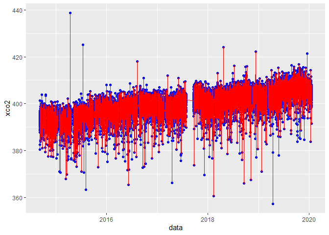

Aprendizado de Máquina: Emissão de CO<sub>2</sub> e CO<sub>2</sub>
Atmosférico
================

<!-- README.md is generated from README.Rmd. Please edit that file -->

##### *Panosso AR; Costa LM; Lima LR; Crispim, VS*

##### Financiamento: Fapesp (202102487-0); CNPq-PIBIC (Nº 2517 - EDITAL 4/2021)

# Resumo do Projeto

## Aquisição dos dados de CO<sub>2</sub> atmosférico (xCO2)

A aquisição de dados e o processamento inicial destes pode ser
encontrada no link:

#### <https://arpanosso.github.io/oco2/>

Para facilitar o acesso, os dodos poderão ser adquiridos por meio da
instalação do pacote `{fco2}`.

``` r
## Instalando pacotes (se necessário)
# install.packages("devtools")
# Sys.getenv("GITHUB_PAT")
# Sys.unsetenv("GITHUB_PAT")
# Sys.getenv("GITHUB_PAT")
# devtools::install_github("arpanosso/fco2r")

library(tidyverse)
library(geobr)
library(fco2r) 
```

### Conhecendo a base de dados

``` r
help(oco2_br)
#> starting httpd help server ... done
glimpse(oco2_br)
#> Rows: 146,646
#> Columns: 11
#> $ longitude                              <dbl> -70.33963, -70.33963, -70.33963~
#> $ longitude_bnds                         <chr> "-70.4644097222:-70.21484375", ~
#> $ latitude                               <dbl> -5.806417, -5.557240, -5.058887~
#> $ latitude_bnds                          <chr> "-5.93100534001:-5.68182872924"~
#> $ time_yyyymmddhhmmss                    <dbl> 2.014092e+13, 2.014092e+13, 2.0~
#> $ time_bnds_yyyymmddhhmmss               <chr> "20140915000000:20140916000000"~
#> $ altitude_km                            <dbl> 3307.8, 3307.8, 3307.8, 3307.8,~
#> $ alt_bnds_km                            <chr> "0.0:6615.59960938", "0.0:6615.~
#> $ fluorescence_offset_relative_771nm_idp <dbl> 0.0167236, 0.0187703, 0.0167454~
#> $ fluorescence_offset_relative_757nm_idp <dbl> 0.01495360, 0.01348060, 0.01151~
#> $ xco2_moles_mole_1                      <dbl> 0.000391583, 0.000394184, 0.000~
```

### Alguns gráficos

``` r
oco2_br %>% 
  sample_n(1000) %>% 
  ggplot(aes(x = longitude, y = latitude)) + 
  geom_point(color = "blue")
```

<!-- -->

### Carregando o contorno do território

``` r
br <- geobr::read_country(showProgress = FALSE)
#> Using year 2010
```

### Construindo o mapa com os pontos

``` r
br %>% 
  ggplot() +
  geom_sf(fill = "white") +
    geom_point(data=oco2_br %>% 
                 sample_n(1000),
             aes(x=longitude,y=latitude),
             shape=3,
             col="red",
             alpha=0.2)
```

<!-- -->

Observe que utilizamos `dplyr::sample_n()` para retirar apenas 1000
amostras do total do banco de dados 146, 646.
