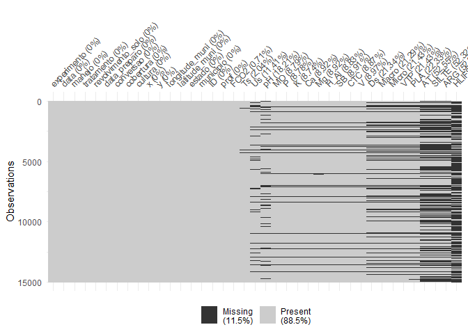
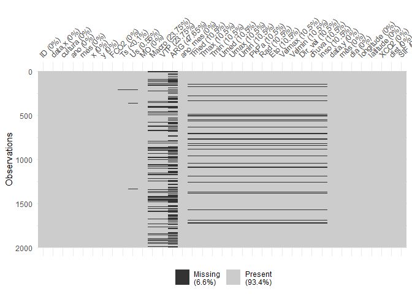
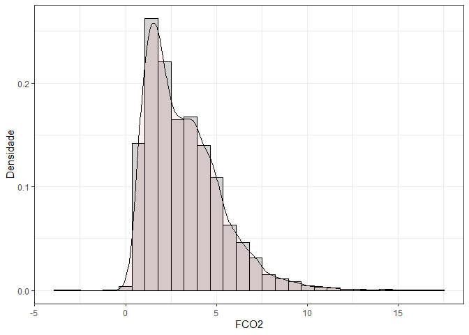
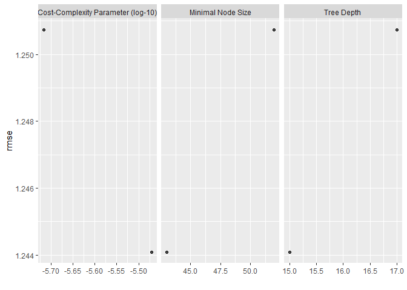

Aprendizado de Máquina: Emissão de CO<sub>2</sub> e CO<sub>2</sub>
Atmosférico e SIF
================

<!-- README.md is generated from README.Rmd. Please edit that file -->

##### *Panosso AR; Costa LM; Lima LR; Crispim, VS*

##### Financiamento: Fapesp (202102487-0); CNPq-PIBIC (Nº 2517 - EDITAL 4/2021)

# Resumo do Projeto

## Aquisição dos dados de CO<sub>2</sub> atmosférico (xCO2)

A aquisição de dados e o processamento inicial destes pode ser
encontrada no link:

#### <https://arpanosso.github.io/oco2/>

Para facilitar o acesso, os dodos foram adquiridos por meio do pacote
`{fco2}`.

``` r
## Instalando pacotes (se necessário)
# install.packages("devtools")
# Sys.getenv("GITHUB_PAT")
# Sys.unsetenv("GITHUB_PAT")
# Sys.getenv("GITHUB_PAT")
# devtools::install_github("arpanosso/fco2r")
library(readxl)
library(tidyverse)
library(geobr)
library(fco2r)
library(skimr)
library(tidymodels)
library(ISLR)
library(modeldata)
library(vip)
library(ggpubr)
source("R/my_fun.R")
```

### Carregando os dados meteorológicos

``` r
dados_estacao <- read_excel("data-raw/xlsx/estacao_meteorologia_ilha_solteira.xlsx", na = "NA") 
  # dplyr::mutate_if(is.character, as.numeric)
dplyr::glimpse(dados_estacao)
#> Rows: 1,826
#> Columns: 16
#> $ data    <dttm> 2015-01-01, 2015-01-02, 2015-01-03, 2015-01-04, 2015-01-05, 2~
#> $ Tmed    <dbl> 30.5, 30.0, 26.8, 27.1, 27.0, 27.6, 30.2, 28.2, 28.5, 29.9, 30~
#> $ Tmax    <dbl> 36.5, 36.7, 35.7, 34.3, 33.2, 36.4, 37.2, 32.4, 37.1, 38.1, 38~
#> $ Tmin    <dbl> 24.6, 24.5, 22.9, 22.7, 22.3, 22.8, 22.7, 24.0, 23.0, 23.3, 24~
#> $ Umed    <dbl> 66.6, 70.4, 82.7, 76.8, 81.6, 75.5, 65.8, 70.0, 72.9, 67.6, 66~
#> $ Umax    <dbl> 89.6, 93.6, 99.7, 95.0, 98.3, 96.1, 99.2, 83.4, 90.7, 97.4, 90~
#> $ Umin    <dbl> 42.0, 44.2, 52.9, 43.8, 57.1, 47.5, 34.1, 57.4, 42.7, 38.3, 37~
#> $ PkPa    <dbl> 97.2, 97.3, 97.4, 97.5, 97.4, 97.5, 97.4, 97.4, 97.4, 97.4, 97~
#> $ Rad     <dbl> 23.6, 24.6, 20.2, 21.4, 17.8, 19.2, 27.0, 15.2, 21.6, 24.3, 24~
#> $ PAR     <dbl> 496.6, 513.3, 430.5, 454.0, 378.2, 405.4, 565.7, 317.2, 467.5,~
#> $ Eto     <dbl> 5.7, 5.8, 4.9, 5.1, 4.1, 4.8, 6.2, 4.1, 5.5, 5.7, 5.9, 6.1, 6.~
#> $ Velmax  <dbl> 6.1, 4.8, 12.1, 6.2, 5.1, 4.5, 4.6, 5.7, 5.8, 5.2, 5.2, 4.7, 6~
#> $ Velmin  <dbl> 1.0, 1.0, 1.2, 1.0, 0.8, 0.9, 0.9, 1.5, 1.2, 0.8, 0.8, 1.2, 1.~
#> $ Dir_vel <dbl> 17.4, 261.9, 222.0, 25.0, 56.9, 74.9, 53.4, 89.0, 144.8, 303.9~
#> $ chuva   <dbl> 0.0, 0.0, 3.3, 0.0, 0.0, 0.0, 0.0, 0.0, 0.0, 0.0, 0.0, 0.0, 0.~
#> $ inso    <dbl> 7.9, 8.7, 5.2, 6.2, 3.4, 4.5, 10.5, 1.3, 6.3, 8.4, 8.6, 7.9, 1~
```

### Conhecendo a base de dados de CO<sub>2</sub> atmosférico

``` r
# help(oco2_br)
# glimpse(oco2_br)
```

### Alguns gráficos

``` r
oco2_br %>% 
  sample_n(1000) %>% 
  ggplot(aes(x = longitude, y = latitude)) + 
  geom_point(color = "blue")
```

<!-- -->

### Carregando o contorno do território

``` r
br <- geobr::read_country(showProgress = FALSE)
```

### Construindo o mapa com os pontos

``` r
br %>% 
  ggplot() +
  geom_sf(fill = "white") +
    geom_point(data=oco2_br %>% 
                 sample_n(1000),
             aes(x=longitude,y=latitude),
             shape=3,
             col="red",
             alpha=0.2)
```

<!-- -->

Observe que utilizamos `dplyr::sample_n()` para retirar apenas

amostras do total do banco de dados
.

#### Estatísticas descritivas

``` r
# skim(oco2_br)
```

``` r
oco2 <- oco2_br
```

### Conhecendo a base de dados de emissão de CO<sub>2</sub> do solo

``` r
# help(data_fco2)
glimpse(data_fco2)
#> Rows: 15,397
#> Columns: 39
#> $ experimento       <chr> "Espacial", "Espacial", "Espacial", "Espacial", "Esp~
#> $ data              <date> 2001-07-10, 2001-07-10, 2001-07-10, 2001-07-10, 200~
#> $ manejo            <chr> "convencional", "convencional", "convencional", "con~
#> $ tratamento        <chr> "AD_GN", "AD_GN", "AD_GN", "AD_GN", "AD_GN", "AD_GN"~
#> $ revolvimento_solo <lgl> FALSE, FALSE, FALSE, FALSE, FALSE, FALSE, FALSE, FAL~
#> $ data_preparo      <date> 2001-07-01, 2001-07-01, 2001-07-01, 2001-07-01, 200~
#> $ conversao         <date> 1970-01-01, 1970-01-01, 1970-01-01, 1970-01-01, 197~
#> $ cobertura         <lgl> TRUE, TRUE, TRUE, TRUE, TRUE, TRUE, TRUE, TRUE, TRUE~
#> $ cultura           <chr> "milho_soja", "milho_soja", "milho_soja", "milho_soj~
#> $ x                 <dbl> 0, 40, 80, 10, 25, 40, 55, 70, 20, 40, 60, 10, 70, 3~
#> $ y                 <dbl> 0, 0, 0, 10, 10, 10, 10, 10, 20, 20, 20, 25, 25, 30,~
#> $ longitude_muni    <dbl> 782062.7, 782062.7, 782062.7, 782062.7, 782062.7, 78~
#> $ latitude_muni     <dbl> 7647674, 7647674, 7647674, 7647674, 7647674, 7647674~
#> $ estado            <chr> "SP", "SP", "SP", "SP", "SP", "SP", "SP", "SP", "SP"~
#> $ municipio         <chr> "Jaboticabal", "Jaboticabal", "Jaboticabal", "Jaboti~
#> $ ID                <int> 1, 2, 3, 4, 5, 6, 7, 8, 9, 10, 11, 12, 13, 14, 15, 1~
#> $ prof              <chr> "0-0.1", "0-0.1", "0-0.1", "0-0.1", "0-0.1", "0-0.1"~
#> $ FCO2              <dbl> 1.080, 0.825, 1.950, 0.534, 0.893, 0.840, 1.110, 1.8~
#> $ Ts                <dbl> 18.73, 18.40, 19.20, 18.28, 18.35, 18.47, 19.10, 18.~
#> $ Us                <dbl> NA, NA, NA, NA, NA, NA, NA, NA, NA, NA, NA, NA, NA, ~
#> $ pH                <dbl> 5.1, 5.1, 5.8, 5.3, 5.5, 5.7, 5.6, 6.4, 5.3, 5.8, 5.~
#> $ MO                <dbl> 20, 24, 25, 23, 23, 21, 26, 23, 25, 24, 26, 20, 25, ~
#> $ P                 <dbl> 46, 26, 46, 78, 60, 46, 55, 92, 55, 60, 48, 71, 125,~
#> $ K                 <dbl> 2.4, 2.2, 5.3, 3.6, 3.4, 2.9, 4.0, 2.3, 3.3, 3.6, 4.~
#> $ Ca                <dbl> 25, 30, 41, 27, 33, 38, 35, 94, 29, 36, 37, 29, 50, ~
#> $ Mg                <dbl> 11, 11, 25, 11, 15, 20, 16, 65, 11, 17, 15, 11, 30, ~
#> $ H_Al              <dbl> 31, 31, 22, 28, 27, 22, 22, 12, 31, 28, 28, 31, 18, ~
#> $ SB                <dbl> 38.4, 43.2, 71.3, 41.6, 50.6, 60.9, 55.0, 161.3, 43.~
#> $ CTC               <dbl> 69.4, 74.2, 93.3, 69.6, 77.9, 82.9, 77.0, 173.3, 74.~
#> $ V                 <dbl> 55, 58, 76, 60, 65, 73, 71, 93, 58, 67, 67, 58, 82, ~
#> $ Ds                <dbl> NA, NA, NA, NA, NA, NA, NA, NA, NA, NA, NA, NA, NA, ~
#> $ Macro             <dbl> NA, NA, NA, NA, NA, NA, NA, NA, NA, NA, NA, NA, NA, ~
#> $ Micro             <dbl> NA, NA, NA, NA, NA, NA, NA, NA, NA, NA, NA, NA, NA, ~
#> $ VTP               <dbl> NA, NA, NA, NA, NA, NA, NA, NA, NA, NA, NA, NA, NA, ~
#> $ PLA               <dbl> NA, NA, NA, NA, NA, NA, NA, NA, NA, NA, NA, NA, NA, ~
#> $ AT                <dbl> NA, NA, NA, NA, NA, NA, NA, NA, NA, NA, NA, NA, NA, ~
#> $ SILTE             <dbl> NA, NA, NA, NA, NA, NA, NA, NA, NA, NA, NA, NA, NA, ~
#> $ ARG               <dbl> NA, NA, NA, NA, NA, NA, NA, NA, NA, NA, NA, NA, NA, ~
#> $ HLIFS             <dbl> NA, NA, NA, NA, NA, NA, NA, NA, NA, NA, NA, NA, NA, ~
```

### Visualização de dados

``` r
data_fco2 %>% 
  group_by(experimento, cultura, data) %>% 
  summarise(FCO2 = mean(FCO2, na.rm=TRUE)) %>% 
  ggplot(aes(y=FCO2, x=data)) +
  geom_line() +
   facet_wrap(~experimento + cultura, scale="free")
```

<!-- -->

### Construindo o mapa com os pontos

``` r
br %>% 
  ggplot() +
  geom_sf(fill = "white") +
    geom_point(data=oco2 %>% sample_n(1000),
             aes(x=longitude,y=latitude),
             shape=3,
             col="red",
             alpha=0.2)
```

<!-- -->

Observe que utilizamos `dplyr::sample_n()` para retirar apenas

amostras do total do banco de dados
.

#### Estatísticas descritivas

``` r
# skim(data_fco2)
```

``` r
visdat::vis_miss(data_fco2 %>% 
                   sample_n(15000))
```

<!-- -->

#### Estatísticas descritivas

``` r
# skim(dados_estacao)
```

``` r
dados_estacao <- dados_estacao %>% 
                   drop_na()
visdat::vis_miss(dados_estacao)
```

<!-- -->

``` r
# Lista do xCO2
# 01 passar as datas que estão em ano-mes-dia-horas-min-segundos
# para uma outra coluna denominada 'data' como ano-mes-dia
# Fazer em pipeline, usar o mutate do pacote dplyr e provavelmente
# a funçoes do pacote lubridate
oco2 <- oco2  %>% 
  mutate (
    ano = time_yyyymmddhhmmss%/%1e10,
    mês = time_yyyymmddhhmmss%/%1e8 %%100,
    dia = time_yyyymmddhhmmss%/%1e6 %%100,
    data = as.Date(stringr::str_c(ano,mês,dia,sep="-"))
  ) %>% 
  glimpse()
#> Rows: 37,387
#> Columns: 22
#> $ longitude                                                     <dbl> -70.5, -~
#> $ longitude_bnds                                                <chr> "-71.0:-~
#> $ latitude                                                      <dbl> -5.5, -4~
#> $ latitude_bnds                                                 <chr> "-6.0:-5~
#> $ time_yyyymmddhhmmss                                           <dbl> 2.014091~
#> $ time_bnds_yyyymmddhhmmss                                      <chr> "2014090~
#> $ altitude_km                                                   <dbl> 3307.8, ~
#> $ alt_bnds_km                                                   <chr> "0.0:661~
#> $ fluorescence_radiance_757nm_uncert_idp_ph_sec_1_m_2_sr_1_um_1 <dbl> 7.272876~
#> $ fluorescence_radiance_757nm_idp_ph_sec_1_m_2_sr_1_um_1        <dbl> 2.537127~
#> $ xco2_moles_mole_1                                             <dbl> 0.000394~
#> $ aerosol_total_aod                                             <dbl> 0.148579~
#> $ fluorescence_offset_relative_771nm_idp                        <dbl> 0.016753~
#> $ fluorescence_at_reference_ph_sec_1_m_2_sr_1_um_1              <dbl> 2.615319~
#> $ fluorescence_radiance_771nm_idp_ph_sec_1_m_2_sr_1_um_1        <dbl> 3.088582~
#> $ fluorescence_offset_relative_757nm_idp                        <dbl> 0.013969~
#> $ fluorescence_radiance_771nm_uncert_idp_ph_sec_1_m_2_sr_1_um_1 <dbl> 5.577878~
#> $ XCO2                                                          <dbl> 387.2781~
#> $ ano                                                           <dbl> 2014, 20~
#> $ mês                                                           <dbl> 9, 9, 9,~
#> $ dia                                                           <dbl> 6, 6, 6,~
#> $ data                                                          <date> 2014-09~
```

``` r
dados_estacao <- dados_estacao %>% 
  mutate(
    ano = lubridate::year(data),
    mês = lubridate::month(data),
    dia = lubridate::day(data),
    data = as.Date(stringr::str_c(ano,mês,dia,sep="-"))
)
```

## Manipulação dos bancos de dados Fco2 e de estação.

``` r
# atributos <- data_fco2
atributos <- left_join(data_fco2, dados_estacao, by = "data")
```

#### Listando as datas em ambos os bancos de dados

``` r
# Lista das datas de FCO2 
lista_data_fco2 <- unique(atributos$data)
lista_data_oco2 <- unique(oco2$data)
lista_data_estacao <- unique(dados_estacao$data)
datas_fco2 <- paste0(lubridate::year(lista_data_fco2),"-",lubridate::month(lista_data_fco2)) %>% unique()

datas_oco2 <- paste0(lubridate::year(lista_data_oco2),"-",lubridate::month(lista_data_oco2)) %>% unique()
datas <- datas_fco2[datas_fco2 %in% datas_oco2]
```

Criação as listas de datas, que é chave para a mesclagem dos arquivos.

``` r
fco2 <- atributos %>% 
  mutate(ano_mes = paste0(lubridate::year(data),"-",lubridate::month(data))) %>% 
  dplyr::filter(ano_mes %in% datas)

xco2 <- oco2 %>%   
  mutate(ano_mes=paste0(ano,"-",mês)) %>% 
  dplyr::filter(ano_mes %in% datas)
```

Coordenadas das cidades

``` r
unique(xco2$ano_mes)[unique(xco2$ano_mes) %>% order()] == 
unique(fco2$ano_mes)[unique(fco2$ano_mes) %>% order()]
#>  [1] TRUE TRUE TRUE TRUE TRUE TRUE TRUE TRUE TRUE TRUE TRUE TRUE TRUE TRUE TRUE
#> [16] TRUE TRUE TRUE TRUE TRUE TRUE TRUE TRUE TRUE TRUE TRUE TRUE TRUE TRUE
```

Abordagem usando o join do `{dplyr}`

``` r
memory.limit(size=10001)
#> [1] 10001
data_set <- left_join(fco2 %>% 
            mutate(ano = lubridate::year(data),
                   mes = lubridate::month(data)
                   ) %>% 
            select(ID, data, cultura, ano, mes, x,y, FCO2, Ts,
                   Us, MO, Macro, VTP, ARG, ano_mes,Tmed,Tmax, Tmin, Umed,
                   Umax, Umin, PkPa, Rad, Eto, Velmax, Velmin, Dir_vel,
                   chuva, inso), 
          xco2 %>% 
            select(data,mês,dia,longitude,latitude,XCO2,fluorescence_radiance_757nm_idp_ph_sec_1_m_2_sr_1_um_1,fluorescence_radiance_771nm_idp_ph_sec_1_m_2_sr_1_um_1, ano_mes), by = "ano_mes") %>% 
  mutate(dist = sqrt((longitude-(-51.423519))^2+(latitude-(-20.362911))^2),
         SIF = (fluorescence_radiance_757nm_idp_ph_sec_1_m_2_sr_1_um_1*2.6250912*10^(-19)  + 1.5*fluorescence_radiance_771nm_idp_ph_sec_1_m_2_sr_1_um_1* 2.57743*10^(-19))/2)

data_set<-data_set %>%
  select(-fluorescence_radiance_757nm_idp_ph_sec_1_m_2_sr_1_um_1, -fluorescence_radiance_771nm_idp_ph_sec_1_m_2_sr_1_um_1 )  %>% 
  filter(dist <= .16, FCO2 <= 20 ) 

visdat::vis_miss(data_set %>% 
                   sample_n(2000)
                 )
```

<!-- -->

``` r
# head(data_set)
# fco2$ano_mes %>% unique()
# xco2$ano_mes %>% unique()
# data_set$ano_mes %>% unique()
```

``` r
tab_medias <- data_set %>% 
  mutate(SIF = ifelse(SIF <=0, mean(data_set$SIF, na.rm=TRUE),SIF)) %>% 
  group_by(ano_mes, cultura) %>% 
  summarise(FCO2 = mean(FCO2, na.rm=TRUE),
            XCO2 = mean(XCO2, na.rm=TRUE),
            SIF = mean(SIF, na.rm=TRUE))

tab_medias %>% 
  ggplot(aes(x=XCO2, y=SIF)) +
  geom_point()+
  geom_smooth(method = "lm")+
  theme_bw()
```

<!-- -->

``` r

tab_medias %>% 
  ggplot(aes(x=XCO2, y=FCO2)) +
  geom_point()+
  geom_smooth(method = "lm")+
  theme_bw()
```

<!-- -->

``` r

tab_medias %>% 
  ggplot(aes(x=FCO2, y=SIF)) +
  geom_point()+
  geom_smooth(method = "lm") +
  theme_bw()
```

<!-- -->

## Estatística Descritiva

Completar posteriormente.

# Abordagem de Parendizado de Máquina

## Definindo a base de treino e a base de teste

Definindo a semente aleatória mais o conjunto de dados para teste e
treino dos modelos

``` r
data_set_ml <- data_set #%>%
#   select(cultura, FCO2, Ts,
#                    Us, MO, Tmed,Tmax, Tmin, Umed,
#                    Umax, Umin, PkPa, Rad, Eto, Velmax, Velmin, Dir_vel,
#                    chuva, inso, SIF, xco2) %>% 
#   drop_na(FCO2, Ts,Us,Tmed:inso)
# visdat::vis_miss(data_set_ml)
# set.seed(1235)
fco2_initial_split <- initial_split(data_set_ml, prop = 0.75)
```

``` r
fco2_train <- training(fco2_initial_split)
# fco2_test <- testing(fco2_initial_split)
# visdat::vis_miss(fco2_test)
fco2_train  %>% 
  ggplot(aes(x=FCO2, y=..density..))+
  geom_histogram(bins = 30, color="black",  fill="lightgray")+
  geom_density(alpha=.05,fill="red")+
  theme_bw() +
  labs(x="FCO2", y = "Densidade")
```

<!-- -->

``` r
fco2_train  %>% 
  ggplot(aes(x=SIF, y=..density..))+
  geom_histogram(bins = 11, color="black",  fill="lightgray")+
  geom_density(alpha=.05,fill="green")+
  theme_bw() +
  labs(x="SIF", y = "Densidade")
```

<!-- -->

``` r
fco2_train  %>% 
  ggplot(aes(x=XCO2, y=..density..))+
  geom_histogram(bins = 15, color="black",  fill="lightgray")+
  geom_density(alpha=.05,fill="blue")+
  theme_bw() +
  labs(x="XCO2", y = "Densidade")
```

<!-- -->

## Correlação

``` r
glimpse(fco2_train)
#> Rows: 6,103
#> Columns: 37
#> $ ID        <int> 13, 81, 19, 70, 15, 11, 15, 14, 45, 42, 23, 61, 2, 39, 67, 6~
#> $ data.x    <date> 2018-10-16, 2018-06-16, 2018-07-09, 2017-06-03, 2018-06-26,~
#> $ cultura   <chr> "silvipastoril", "silvipastoril", "silvipastoril", "eucalipt~
#> $ ano       <dbl> 2018, 2018, 2018, 2017, 2018, 2017, 2019, 2018, 2016, 2015, ~
#> $ mes       <dbl> 10, 6, 7, 6, 6, 7, 7, 5, 1, 10, 5, 2, 5, 6, 3, 6, 10, 3, 5, ~
#> $ x         <dbl> 7749399, 7749420, 7749399, 70, 7747952, 0, 7747952, 7748006,~
#> $ y         <dbl> 457163.2, 457260.7, 457163.2, 70.0, 456878.7, 0.0, 456878.7,~
#> $ FCO2      <dbl> 4.39, 3.47, 1.55, 2.84, 1.28, 1.54, 2.46, 2.43, 5.85, 2.35, ~
#> $ Ts        <dbl> 28.80000, 17.50000, 22.10000, 21.10000, 23.10000, 7.00000, 1~
#> $ Us        <dbl> 13.300000, 19.275866, 27.630000, 15.429020, 3.410000, 19.100~
#> $ MO        <dbl> 6, 31, 7, 26, 16, 11, 28, 23, 36, 34, 15, 34, 15, 34, 34, 14~
#> $ Macro     <dbl> 16.50000000, 17.84000000, 14.09000000, NA, 0.13000000, 19.01~
#> $ VTP       <dbl> 57.02000, 54.26000, 54.36000, NA, 0.36000, 51.76000, 0.41000~
#> $ ARG       <dbl> NA, 618.0000, NA, NA, 149.5000, NA, 149.5000, 114.1100, 282.~
#> $ ano_mes   <chr> "2018-10", "2018-6", "2018-7", "2017-6", "2018-6", "2017-7",~
#> $ Tmed      <dbl> 29.4, 18.9, 17.7, 22.0, 25.4, 19.4, 23.2, 24.6, 26.4, 30.5, ~
#> $ Tmax      <dbl> 37.6, 27.0, 21.1, 30.0, 34.6, 26.0, 33.4, 30.9, 31.1, 37.4, ~
#> $ Tmin      <dbl> 23.5, 12.7, 14.8, 15.4, 17.4, 14.1, 14.7, 19.5, 20.8, 23.4, ~
#> $ Umed      <dbl> 76.0, 77.2, 82.8, 74.7, 54.6, 59.4, 61.2, 57.0, 78.6, 60.0, ~
#> $ Umax      <dbl> 98.0, 91.2, 96.7, 90.8, 91.8, 73.5, 95.5, 74.0, 94.6, 84.7, ~
#> $ Umin      <dbl> 44.0, 55.2, 63.7, 54.7, 27.2, 43.7, 27.0, 36.2, 63.2, 37.7, ~
#> $ PkPa      <dbl> 97.0, 98.3, 98.1, 97.8, 97.5, 98.3, 97.7, 97.6, 97.0, 97.1, ~
#> $ Rad       <dbl> 16.5, 11.0, 3.9, 13.8, 12.4, 13.3, 10.1, 12.7, 14.9, 19.8, 1~
#> $ Eto       <dbl> 4.1, 2.2, 1.6, 2.8, 3.0, 3.2, 2.4, 3.4, 3.5, 5.2, 2.9, NA, 2~
#> $ Velmax    <dbl> 4.8, 4.9, 6.1, 4.6, 4.2, 7.3, 4.0, 4.9, 4.5, 6.4, 5.5, NA, 5~
#> $ Velmin    <dbl> 0.7, 1.0, 2.1, 1.2, 0.9, 2.0, 0.6, 1.5, 0.9, 1.3, 1.1, NA, 1~
#> $ Dir_vel   <dbl> 92.8, 243.6, 237.1, 93.0, 50.1, 89.8, 117.6, 80.7, 154.2, 27~
#> $ chuva     <dbl> 4.3, 0.0, 0.0, 0.0, 0.0, 0.0, 0.0, 0.0, 0.0, 0.0, 0.0, NA, 0~
#> $ inso      <dbl> 4.5, 5.4, 0.0, 8.2, 6.8, 6.2, 3.0, 7.1, 1.1, 6.5, 5.3, NA, 5~
#> $ data.y    <date> 2018-10-13, 2018-06-16, 2018-07-18, 2017-06-29, 2018-06-16,~
#> $ mês       <dbl> 10, 6, 7, 6, 6, 7, 7, 5, 1, 10, 5, 2, 5, 6, 3, 6, 10, 3, 5, ~
#> $ dia       <dbl> 13, 16, 18, 29, 16, 22, 5, 6, 25, 21, 6, 26, 15, 16, 25, 16,~
#> $ longitude <dbl> -51.5, -51.5, -51.5, -51.5, -51.5, -51.5, -51.5, -51.5, -51.~
#> $ latitude  <dbl> -20.5, -20.5, -20.5, -20.5, -20.5, -20.5, -20.5, -20.5, -20.~
#> $ XCO2      <dbl> 387.6034, 388.7977, 388.2893, 386.6562, 388.7977, 387.4659, ~
#> $ dist      <dbl> 0.1569801, 0.1569801, 0.1569801, 0.1569801, 0.1569801, 0.156~
#> $ SIF       <dbl> 1.22255676, -0.26169899, 0.17194793, -0.08236333, -0.2616989~
fco2_train   %>%    select(-c(ID,ano,mes,x,y,latitude,longitude,dist,mês,dia)) %>% 
  select(where(is.numeric)) %>%
  drop_na() %>% 
  cor()  %>%  
  corrplot::corrplot()
```

<!-- -->

## Data-prep

``` r
fco2_recipe <- recipe(FCO2 ~ ., data = fco2_train %>% 
                        select(-c(data.x,data.y,ID,ano,mes,x,y,latitude,longitude,dist,mês,dia,ano_mes))
) %>%  
  step_normalize(all_numeric_predictors())  %>% 
  step_novel(all_nominal_predictors()) %>% 
  step_zv(all_predictors()) %>%
  #step_naomit(c(Ts, Us)) %>% 
  #step_poly(c(Ts, Us), degree = 3)  %>%  
  step_dummy(all_nominal_predictors())
bake(prep(fco2_recipe), new_data = NULL)
#> # A tibble: 6,103 x 29
#>         Ts      Us      MO  Macro    VTP    ARG   Tmed    Tmax   Tmin   Umed
#>      <dbl>   <dbl>   <dbl>  <dbl>  <dbl>  <dbl>  <dbl>   <dbl>  <dbl>  <dbl>
#>  1  1.05   -0.0984 -1.61    1.97   1.04  NA      1.24   1.31    1.24   0.617
#>  2 -0.892   0.720   0.871   2.19   0.913  1.54  -1.13  -0.921  -1.16   0.741
#>  3 -0.0996  1.87   -1.51    1.57   0.917 NA     -1.40  -2.16   -0.692  1.32 
#>  4 -0.272   0.193   0.375  NA     NA     NA     -0.430 -0.289  -0.558  0.482
#>  5  0.0727 -1.45   -0.617  -0.739 -1.57  -0.901  0.338  0.681  -0.113 -1.60 
#>  6 -2.70    0.696  -1.11    2.39   0.798 NA     -1.02  -1.13   -0.847 -1.11 
#>  7 -0.892  -1.44    0.573  -0.744 -1.57  -0.901 -0.159  0.428  -0.714 -0.918
#>  8  0.383  -0.471   0.0773 -0.734 -1.57  -1.09   0.158 -0.0988  0.354 -1.35 
#>  9  0.538  -0.414   1.37   -0.747  0.361 -0.210  0.564 -0.0567  0.643  0.887
#> 10  0.738  -1.10    1.17   -0.745  0.291 NA      1.49   1.27    1.22  -1.04 
#> # ... with 6,093 more rows, and 19 more variables: Umax <dbl>, Umin <dbl>,
#> #   PkPa <dbl>, Rad <dbl>, Eto <dbl>, Velmax <dbl>, Velmin <dbl>,
#> #   Dir_vel <dbl>, chuva <dbl>, inso <dbl>, XCO2 <dbl>, SIF <dbl>, FCO2 <dbl>,
#> #   cultura_eucalipto <dbl>, cultura_mata.ciliar <dbl>, cultura_pasto <dbl>,
#> #   cultura_pinus <dbl>, cultura_silvipastoril <dbl>, cultura_new <dbl>
#> # i Use `print(n = ...)` to see more rows, and `colnames()` to see all variable names
```

``` r
visdat::vis_miss(bake(prep(fco2_recipe), new_data = NULL))
```

<!-- --> \## TUNAGEM

``` r
fco2_resamples <- vfold_cv(fco2_train, v = 5)
grid <- grid_regular(
  penalty(range = c(-4, -2)),
  levels = 20
)
```

## ÁRVORE DE DECISÃO (decision tree - dt)

``` r
fco2_dt_model <- decision_tree(
  cost_complexity = tune(),
  tree_depth = tune(),
  min_n = tune()
)  %>%  
  set_mode("regression")  %>%  
  set_engine("rpart")
```

### Workflow

``` r
fco2_dt_wf <- workflow()   %>%  
  add_model(fco2_dt_model) %>% 
  add_recipe(fco2_recipe)
```

### Criando a matriz (grid) com os valores de hiperparâmetros a serem testados

``` r
grid_dt <- grid_random(
  cost_complexity(c(-6, -4)),
  tree_depth(range = c(8, 18)),
  min_n(range = c(42, 52)),
  size = 20 #20
)
glimpse(grid_dt)
#> Rows: 20
#> Columns: 3
#> $ cost_complexity <dbl> 5.226904e-05, 4.510574e-05, 2.210226e-06, 3.102727e-05~
#> $ tree_depth      <int> 12, 13, 8, 12, 10, 11, 9, 11, 13, 14, 14, 16, 18, 11, ~
#> $ min_n           <int> 45, 50, 50, 49, 47, 50, 47, 46, 47, 50, 46, 51, 43, 44~
```

``` r
fco2_dt_tune_grid <- tune_grid(
  fco2_dt_wf,
  resamples = fco2_resamples,
  grid = grid_dt,
  metrics = metric_set(rmse)
)
```

``` r
autoplot(fco2_dt_tune_grid)
```

<!-- -->

``` r
collect_metrics(fco2_dt_tune_grid)
#> # A tibble: 20 x 9
#>    cost_complexity tree_depth min_n .metric .estim~1  mean     n std_err .config
#>              <dbl>      <int> <int> <chr>   <chr>    <dbl> <int>   <dbl> <chr>  
#>  1      0.0000523          12    45 rmse    standard  1.31     5  0.0360 Prepro~
#>  2      0.0000451          13    50 rmse    standard  1.30     5  0.0397 Prepro~
#>  3      0.00000221          8    50 rmse    standard  1.33     5  0.0405 Prepro~
#>  4      0.0000310          12    49 rmse    standard  1.31     5  0.0355 Prepro~
#>  5      0.00000150         10    47 rmse    standard  1.32     5  0.0378 Prepro~
#>  6      0.0000373          11    50 rmse    standard  1.31     5  0.0397 Prepro~
#>  7      0.00000205          9    47 rmse    standard  1.33     5  0.0408 Prepro~
#>  8      0.0000217          11    46 rmse    standard  1.32     5  0.0380 Prepro~
#>  9      0.00000185         13    47 rmse    standard  1.31     5  0.0343 Prepro~
#> 10      0.00000310         14    50 rmse    standard  1.30     5  0.0412 Prepro~
#> 11      0.0000741          14    46 rmse    standard  1.31     5  0.0361 Prepro~
#> 12      0.0000107          16    51 rmse    standard  1.30     5  0.0411 Prepro~
#> 13      0.00000461         18    43 rmse    standard  1.31     5  0.0369 Prepro~
#> 14      0.0000953          11    44 rmse    standard  1.32     5  0.0377 Prepro~
#> 15      0.00000113         17    51 rmse    standard  1.30     5  0.0411 Prepro~
#> 16      0.0000190          14    51 rmse    standard  1.30     5  0.0410 Prepro~
#> 17      0.00000565         10    51 rmse    standard  1.31     5  0.0405 Prepro~
#> 18      0.0000823          10    48 rmse    standard  1.32     5  0.0370 Prepro~
#> 19      0.00000445         11    52 rmse    standard  1.31     5  0.0392 Prepro~
#> 20      0.00000161         11    43 rmse    standard  1.31     5  0.0398 Prepro~
#> # ... with abbreviated variable name 1: .estimator
```

## Desempenho dos modelos finais

``` r
fco2_dt_best_params <- select_best(fco2_dt_tune_grid, "rmse")
fco2_dt_wf <- fco2_dt_wf %>% finalize_workflow(fco2_dt_best_params)
fco2_dt_last_fit <- last_fit(fco2_dt_wf, fco2_initial_split)
```

## Criar os preditos

``` r
fco2_test_preds <- bind_rows(
  collect_predictions(fco2_dt_last_fit)  %>%   mutate(modelo = "dt")
)

fco2_test <- testing(fco2_initial_split)
visdat::vis_miss(fco2_test)
```

<!-- -->

``` r
fco2_test_preds %>% 
  ggplot(aes(x=.pred, y=FCO2)) +
  geom_point()+
  theme_bw() +
  geom_smooth(method = "lm") +
  stat_regline_equation(ggplot2::aes(
  label =  paste(..eq.label.., ..rr.label.., sep = "*plain(\",\")~~"))) 
```

<!-- -->

## Variáveis importantes

``` r
fco2_dt_last_fit_model <-fco2_dt_last_fit$.workflow[[1]]$fit$fit
vip(fco2_dt_last_fit_model)
```

<!-- -->

# Random Forest (rf)

Corrigindo os NAs no teste

``` r
visdat::vis_miss(fco2_test)
```

<!-- -->

``` r
data_set_ml <- data_set_ml %>%
  select(cultura, FCO2, Ts, XCO2, SIF, 
                   Us, MO, Tmed,Tmax, Tmin, Umed,
                   Umax, Umin, PkPa, Rad, Eto, Velmax, Velmin, Dir_vel,
                   chuva, inso) %>%
  drop_na(FCO2, Ts,Us,Tmed:inso)
visdat::vis_miss(data_set_ml)
```

<!-- -->

``` r
fco2_initial_split <- initial_split(data_set_ml, prop = 0.75)
fco2_test <- testing(fco2_initial_split)
visdat::vis_miss(fco2_test)
```

<!-- -->

``` r
fco2_train <- training(fco2_initial_split)
visdat::vis_miss(fco2_train)
```

<!-- -->

``` r


fco2_resamples_rf <- vfold_cv(fco2_train, v = 5)
```

## Data prep

``` r
fco2_rf_recipe <- recipe(FCO2 ~ ., data = fco2_train) %>% 
  step_string2factor(all_nominal(), skip = TRUE) %>% 
  step_normalize(all_numeric_predictors())  %>% 
  step_novel(all_nominal_predictors()) %>% 
  # step_zv(all_predictors()) %>%
  # step_naomit(all_predictors()) #%>% 
  #step_poly(c(Ts, Us), degree = 3)  %>%  
  step_dummy(all_nominal_predictors())
bake(prep(fco2_rf_recipe), new_data = NULL)
#> # A tibble: 5,459 x 26
#>         Ts    XCO2    SIF      Us     MO     Tmed     Tmax   Tmin   Umed   Umax
#>      <dbl>   <dbl>  <dbl>   <dbl>  <dbl>    <dbl>    <dbl>  <dbl>  <dbl>  <dbl>
#>  1  0.646  -0.618   2.02   0.507   0.879  0.778    0.311    1.44   1.51   0.982
#>  2  0.210  -0.847   0.486  2.08    0.495  0.437    0.481    0.967  1.71   1.01 
#>  3 -0.880   0.292  -0.911  0.953   0.398 -0.0393   0.0355  -0.128 -0.252  0.278
#>  4 -0.192   0.0989  0.119 -0.558   1.36  -2.31    -2.26    -2.21   0.258  0.407
#>  5  1.10   -1.10   -0.338  0.237   0.591  0.437    0.290    1.06   2.22   1.03 
#>  6  1.18   -0.169   2.27  -0.439   1.46   0.732    0.651    0.587  0.550  0.896
#>  7 -0.0582 -0.192  -0.521 -0.0188 -0.467 -0.198   -0.00696 -0.531 -0.293 -0.297
#>  8  0.915  -0.847   0.486 -0.505   1.65   1.03     0.587    1.06   0.331  0.350
#>  9  0.344   1.03   -0.433 -0.399  -0.467  0.00607  0.439   -0.419 -1.04   0.824
#> 10 -0.410   0.508  -0.187 -1.53   -0.371 -0.198   -0.219   -0.173 -1.42  -1.95 
#> # ... with 5,449 more rows, and 16 more variables: Umin <dbl>, PkPa <dbl>,
#> #   Rad <dbl>, Eto <dbl>, Velmax <dbl>, Velmin <dbl>, Dir_vel <dbl>,
#> #   chuva <dbl>, inso <dbl>, FCO2 <dbl>, cultura_eucalipto <dbl>,
#> #   cultura_mata.ciliar <dbl>, cultura_pasto <dbl>, cultura_pinus <dbl>,
#> #   cultura_silvipastoril <dbl>, cultura_new <dbl>
#> # i Use `print(n = ...)` to see more rows, and `colnames()` to see all variable names
visdat::vis_miss(bake(prep(fco2_rf_recipe), new_data = NULL))
```

<!-- -->

## Modelo

``` r
fco2_rf_model <- rand_forest(
  min_n = tune(),
  mtry = tune(),
  trees = tune()
)   %>%  
  set_mode("regression")  %>% 
  set_engine("randomForest")
```

## Workflow

``` r
fco2_rf_wf <- workflow()   %>%  
  add_model(fco2_rf_model) %>%  
  add_recipe(fco2_rf_recipe)
```

## Tune

mtry trees min_n .config 10 769 21 Preprocessor1_Model39

``` r
grid_rf <- grid_random(
  min_n(range = c(20, 30)),
  mtry(range = c(10,20)),
  trees(range = c(769,1500) ),
  size = 20
)
```

``` r
fco2_rf_tune_grid <- tune_grid(
 fco2_rf_wf,
  resamples = fco2_resamples_rf,
  grid = grid_rf,
  metrics = metric_set(rmse)
) 

autoplot(fco2_rf_tune_grid)
```

<!-- -->

``` r
collect_metrics(fco2_rf_tune_grid)
#> # A tibble: 20 x 9
#>     mtry trees min_n .metric .estimator  mean     n std_err .config             
#>    <int> <int> <int> <chr>   <chr>      <dbl> <int>   <dbl> <chr>               
#>  1    11  1416    27 rmse    standard    1.17     5  0.0301 Preprocessor1_Model~
#>  2    18  1394    25 rmse    standard    1.16     5  0.0305 Preprocessor1_Model~
#>  3    19  1190    26 rmse    standard    1.16     5  0.0304 Preprocessor1_Model~
#>  4    18   798    22 rmse    standard    1.16     5  0.0312 Preprocessor1_Model~
#>  5    13   819    22 rmse    standard    1.17     5  0.0313 Preprocessor1_Model~
#>  6    18  1258    25 rmse    standard    1.16     5  0.0307 Preprocessor1_Model~
#>  7    20   957    21 rmse    standard    1.16     5  0.0311 Preprocessor1_Model~
#>  8    11  1129    28 rmse    standard    1.17     5  0.0299 Preprocessor1_Model~
#>  9    15   902    22 rmse    standard    1.16     5  0.0312 Preprocessor1_Model~
#> 10    15  1061    22 rmse    standard    1.16     5  0.0308 Preprocessor1_Model~
#> 11    15   868    21 rmse    standard    1.16     5  0.0304 Preprocessor1_Model~
#> 12    15   773    21 rmse    standard    1.16     5  0.0311 Preprocessor1_Model~
#> 13    20  1308    27 rmse    standard    1.16     5  0.0302 Preprocessor1_Model~
#> 14    13  1280    20 rmse    standard    1.16     5  0.0309 Preprocessor1_Model~
#> 15    17  1122    28 rmse    standard    1.16     5  0.0305 Preprocessor1_Model~
#> 16    15  1460    29 rmse    standard    1.17     5  0.0304 Preprocessor1_Model~
#> 17    16  1008    22 rmse    standard    1.16     5  0.0307 Preprocessor1_Model~
#> 18    15   879    22 rmse    standard    1.16     5  0.0307 Preprocessor1_Model~
#> 19    17  1030    25 rmse    standard    1.16     5  0.0307 Preprocessor1_Model~
#> 20    14   881    29 rmse    standard    1.17     5  0.0306 Preprocessor1_Model~
```

## Desempenho dos modelos finais

``` r
fco2_rf_best_params <- select_best(fco2_rf_tune_grid, "rmse")
fco2_rf_wf <- fco2_rf_wf %>% finalize_workflow(fco2_rf_best_params)
fco2_rf_last_fit <- last_fit(fco2_rf_wf, fco2_initial_split)
```

## Criar os preditos

``` r
fco2_test_preds <- bind_rows(
  collect_predictions(fco2_rf_last_fit)  %>%   mutate(modelo = "rf")
)
```

``` r
fco2_test_preds %>% 
  ggplot(aes(x=.pred, y=FCO2)) +
  geom_point()+
  theme_bw() +
  geom_smooth(method = "lm") +
  stat_regline_equation(ggplot2::aes(
  label =  paste(..eq.label.., ..rr.label.., sep = "*plain(\",\")~~"))) 
```

<!-- -->

## Variáveis importantes

``` r
fco2_rf_last_fit_model <-fco2_dt_last_fit$.workflow[[1]]$fit$fit
vip(fco2_rf_last_fit_model)
```

<!-- -->
