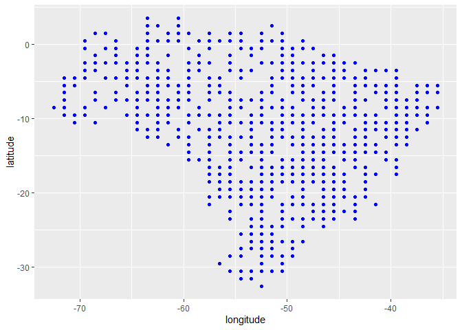

Aprendizado de Máquina: Emissão de CO<sub>2</sub> e CO<sub>2</sub>
Atmosférico
================

<!-- README.md is generated from README.Rmd. Please edit that file -->

##### *Panosso AR; Costa LM; Lima LR; Crispim, VS*

##### Financiamento: Fapesp (202102487-0); CNPq-PIBIC (Nº 2517 - EDITAL 4/2021)

# Resumo do Projeto

## Aquisição dos dados de CO<sub>2</sub> atmosférico (xCO2)

A aquisição de dados e o processamento inicial destes pode ser
encontrada no link:

#### <https://arpanosso.github.io/oco2/>

Para facilitar o acesso, os dodos foram adquiridos por meio do pacote
`{fco2}`.

``` r
## Instalando pacotes (se necessário)
# install.packages("devtools")
# Sys.getenv("GITHUB_PAT")
# Sys.unsetenv("GITHUB_PAT")
# Sys.getenv("GITHUB_PAT")
# devtools::install_github("arpanosso/fco2r")
library(readxl)
library(tidyverse)
library(geobr)
library(fco2r)
library(skimr)
library(tidymodels)
library(ISLR)
library(modeldata)
library(vip)
source("R/my_fun.R")
```

### Carregando os dados meteorológicos

``` r
dados_estacao <- read_excel("data-raw/xlsx/estacao_meteorologia_ilha_solteira.xlsx", na = "NA") 
  # dplyr::mutate_if(is.character, as.numeric)
dplyr::glimpse(dados_estacao)
#> Rows: 1,826
#> Columns: 16
#> $ data    <dttm> 2015-01-01, 2015-01-02, 2015-01-03, 2015-01-04, 2015-01-05, 2~
#> $ Tmed    <dbl> 30.5, 30.0, 26.8, 27.1, 27.0, 27.6, 30.2, 28.2, 28.5, 29.9, 30~
#> $ Tmax    <dbl> 36.5, 36.7, 35.7, 34.3, 33.2, 36.4, 37.2, 32.4, 37.1, 38.1, 38~
#> $ Tmin    <dbl> 24.6, 24.5, 22.9, 22.7, 22.3, 22.8, 22.7, 24.0, 23.0, 23.3, 24~
#> $ Umed    <dbl> 66.6, 70.4, 82.7, 76.8, 81.6, 75.5, 65.8, 70.0, 72.9, 67.6, 66~
#> $ Umax    <dbl> 89.6, 93.6, 99.7, 95.0, 98.3, 96.1, 99.2, 83.4, 90.7, 97.4, 90~
#> $ Umin    <dbl> 42.0, 44.2, 52.9, 43.8, 57.1, 47.5, 34.1, 57.4, 42.7, 38.3, 37~
#> $ PkPa    <dbl> 97.2, 97.3, 97.4, 97.5, 97.4, 97.5, 97.4, 97.4, 97.4, 97.4, 97~
#> $ Rad     <dbl> 23.6, 24.6, 20.2, 21.4, 17.8, 19.2, 27.0, 15.2, 21.6, 24.3, 24~
#> $ PAR     <dbl> 496.6, 513.3, 430.5, 454.0, 378.2, 405.4, 565.7, 317.2, 467.5,~
#> $ Eto     <dbl> 5.7, 5.8, 4.9, 5.1, 4.1, 4.8, 6.2, 4.1, 5.5, 5.7, 5.9, 6.1, 6.~
#> $ Velmax  <dbl> 6.1, 4.8, 12.1, 6.2, 5.1, 4.5, 4.6, 5.7, 5.8, 5.2, 5.2, 4.7, 6~
#> $ Velmin  <dbl> 1.0, 1.0, 1.2, 1.0, 0.8, 0.9, 0.9, 1.5, 1.2, 0.8, 0.8, 1.2, 1.~
#> $ Dir_vel <dbl> 17.4, 261.9, 222.0, 25.0, 56.9, 74.9, 53.4, 89.0, 144.8, 303.9~
#> $ chuva   <dbl> 0.0, 0.0, 3.3, 0.0, 0.0, 0.0, 0.0, 0.0, 0.0, 0.0, 0.0, 0.0, 0.~
#> $ inso    <dbl> 7.9, 8.7, 5.2, 6.2, 3.4, 4.5, 10.5, 1.3, 6.3, 8.4, 8.6, 7.9, 1~
```

### Conhecendo a base de dados de CO<sub>2</sub> atmosférico

``` r
# help(oco2_br)
glimpse(oco2_br)
#> Rows: 37,387
#> Columns: 32
#> $ longitude                                                     <dbl> -70.5, -~
#> $ longitude_bnds                                                <chr> "-71.0:-~
#> $ latitude                                                      <dbl> -5.5, -4~
#> $ latitude_bnds                                                 <chr> "-6.0:-5~
#> $ time_yyyymmddhhmmss                                           <dbl> 2.014091~
#> $ time_bnds_yyyymmddhhmmss                                      <chr> "2014090~
#> $ altitude_km                                                   <dbl> 3307.8, ~
#> $ alt_bnds_km                                                   <chr> "0.0:661~
#> $ fluorescence_radiance_757nm_uncert_idp_ph_sec_1_m_2_sr_1_um_1 <dbl> 7.272876~
#> $ fluorescence_radiance_757nm_idp_ph_sec_1_m_2_sr_1_um_1        <dbl> 2.537127~
#> $ xco2_moles_mole_1                                             <dbl> 0.000394~
#> $ aerosol_total_aod                                             <dbl> 0.148579~
#> $ fluorescence_offset_relative_771nm_idp                        <dbl> 0.016753~
#> $ fluorescence_at_reference_ph_sec_1_m_2_sr_1_um_1              <dbl> 2.615319~
#> $ fluorescence_radiance_771nm_idp_ph_sec_1_m_2_sr_1_um_1        <dbl> 3.088582~
#> $ fluorescence_offset_relative_757nm_idp                        <dbl> 0.013969~
#> $ fluorescence_radiance_771nm_uncert_idp_ph_sec_1_m_2_sr_1_um_1 <dbl> 5.577878~
#> $ xco2                                                          <dbl> 394.3686~
#> $ data                                                          <dttm> 2014-09~
#> $ ano                                                           <dbl> 2014, 20~
#> $ mes                                                           <dbl> 9, 9, 9,~
#> $ dia                                                           <int> 6, 6, 6,~
#> $ dia_semana                                                    <dbl> 7, 7, 7,~
#> $ x                                                             <int> 7, 8, 11~
#> $ xco2_est                                                      <dbl> 392.7080~
#> $ delta                                                         <dbl> -1.66062~
#> $ XCO2                                                          <dbl> 387.2781~
#> $ flag_norte                                                    <lgl> TRUE, TR~
#> $ flag_nordeste                                                 <lgl> FALSE, F~
#> $ flag_sul                                                      <lgl> FALSE, F~
#> $ flag_sudeste                                                  <lgl> FALSE, F~
#> $ flag_centroeste                                               <lgl> FALSE, F~
```

### Alguns gráficos

``` r
oco2_br %>% 
  sample_n(1000) %>% 
  ggplot(aes(x = longitude, y = latitude)) + 
  geom_point(color = "blue")
```

<!-- -->

### Carregando o contorno do território

``` r
br <- geobr::read_country(showProgress = FALSE)
#> Using year 2010
```

### Construindo o mapa com os pontos

``` r
br %>% 
  ggplot() +
  geom_sf(fill = "white") +
    geom_point(data=oco2_br %>% 
                 sample_n(2000),
             aes(x=longitude,y=latitude),
             shape=3,
             col="red",
             alpha=0.2)
```

<!-- -->

Observe que utilizamos `dplyr::sample_n()` para retirar apenas

amostras do total do banco de dados
.

#### Estatísticas descritivas

``` r
skim(oco2_br)
```

|                                                  |         |
|:-------------------------------------------------|:--------|
| Name                                             | oco2_br |
| Number of rows                                   | 37387   |
| Number of columns                                | 32      |
| \_\_\_\_\_\_\_\_\_\_\_\_\_\_\_\_\_\_\_\_\_\_\_   |         |
| Column type frequency:                           |         |
| character                                        | 4       |
| logical                                          | 5       |
| numeric                                          | 22      |
| POSIXct                                          | 1       |
| \_\_\_\_\_\_\_\_\_\_\_\_\_\_\_\_\_\_\_\_\_\_\_\_ |         |
| Group variables                                  | None    |

Data summary

**Variable type: character**

| skim_variable            | n_missing | complete_rate | min | max | empty | n_unique | whitespace |
|:-------------------------|----------:|--------------:|----:|----:|------:|---------:|-----------:|
| longitude_bnds           |         0 |             1 |  11 |  11 |     0 |       39 |          0 |
| latitude_bnds            |         0 |             1 |   7 |  11 |     0 |       38 |          0 |
| time_bnds_yyyymmddhhmmss |         0 |             1 |  29 |  29 |     0 |     1765 |          0 |
| alt_bnds_km              |         0 |             1 |  11 |  20 |     0 |       64 |          0 |

**Variable type: logical**

| skim_variable   | n_missing | complete_rate | mean | count                  |
|:----------------|----------:|--------------:|-----:|:-----------------------|
| flag_norte      |         0 |             1 | 0.34 | FAL: 24511, TRU: 12876 |
| flag_nordeste   |         0 |             1 | 0.23 | FAL: 28765, TRU: 8622  |
| flag_sul        |         0 |             1 | 0.08 | FAL: 34531, TRU: 2856  |
| flag_sudeste    |         0 |             1 | 0.12 | FAL: 32834, TRU: 4553  |
| flag_centroeste |         0 |             1 | 0.21 | FAL: 29612, TRU: 7775  |

**Variable type: numeric**

| skim_variable                                                    | n_missing | complete_rate |          mean |           sd |            p0 |           p25 |           p50 |           p75 |          p100 | hist  |
|:-----------------------------------------------------------------|----------:|--------------:|--------------:|-------------:|--------------:|--------------:|--------------:|--------------:|--------------:|:------|
| longitude                                                        |         0 |             1 | -5.120000e+01 | 8.280000e+00 | -7.350000e+01 | -5.650000e+01 | -5.050000e+01 | -4.450000e+01 | -3.550000e+01 | ▂▃▇▇▅ |
| latitude                                                         |         0 |             1 | -1.179000e+01 | 7.850000e+00 | -3.250000e+01 | -1.750000e+01 | -1.050000e+01 | -5.500000e+00 |  4.500000e+00 | ▂▃▇▇▃ |
| time_yyyymmddhhmmss                                              |         0 |             1 |  2.016952e+13 | 1.564571e+10 |  2.014091e+13 |  2.016020e+13 |  2.017052e+13 |  2.018092e+13 |  2.020012e+13 | ▇▇▅▆▇ |
| altitude_km                                                      |         0 |             1 |  3.123200e+03 | 1.108800e+02 |  2.555700e+03 |  3.056350e+03 |  3.126310e+03 |  3.196250e+03 |  3.307800e+03 | ▁▁▂▇▇ |
| fluorescence_radiance_757nm_uncert_idp_ph_sec_1\_m_2\_sr_1\_um_1 |         0 |             1 |  8.520719e+17 | 5.599367e+18 | -9.999990e+05 |  6.323256e+17 |  6.951592e+17 |  7.671609e+17 |  9.365539e+20 | ▇▁▁▁▁ |
| fluorescence_radiance_757nm_idp_ph_sec_1\_m_2\_sr_1\_um_1        |         0 |             1 | -1.358150e+18 | 1.946775e+20 | -3.400736e+22 |  7.735159e+17 |  1.676353e+18 |  2.566089e+18 |  2.316112e+20 | ▁▁▁▁▇ |
| xco2_moles_mole_1                                                |         0 |             1 |  0.000000e+00 | 0.000000e+00 |  0.000000e+00 |  0.000000e+00 |  0.000000e+00 |  0.000000e+00 |  0.000000e+00 | ▁▁▇▁▁ |
| aerosol_total_aod                                                |         0 |             1 |  4.828100e+02 | 7.848572e+04 |  2.000000e-02 |  1.100000e-01 |  1.700000e-01 |  2.600000e-01 |  1.487623e+07 | ▇▁▁▁▁ |
| fluorescence_offset_relative_771nm_idp                           |         0 |             1 | -4.814400e+02 | 2.193698e+04 | -9.999990e+05 |  1.000000e-02 |  1.000000e-02 |  2.000000e-02 |  1.230000e+00 | ▁▁▁▁▇ |
| fluorescence_at_reference_ph_sec_1\_m_2\_sr_1\_um_1              |         0 |             1 |  1.296932e+18 | 2.245185e+18 | -8.394901e+19 |  2.014560e+17 |  1.268715e+18 |  2.395217e+18 |  8.610756e+19 | ▁▁▇▁▁ |
| fluorescence_radiance_771nm_idp_ph_sec_1\_m_2\_sr_1\_um_1        |         0 |             1 |  1.904438e+18 | 2.236381e+18 | -8.453983e+19 |  9.694709e+17 |  1.987682e+18 |  2.918792e+18 |  4.338306e+19 | ▁▁▁▇▁ |
| fluorescence_offset_relative_757nm_idp                           |         0 |             1 | -3.744400e+02 | 1.934763e+04 | -9.999990e+05 |  1.000000e-02 |  1.000000e-02 |  2.000000e-02 |  2.086000e+01 | ▁▁▁▁▇ |
| fluorescence_radiance_771nm_uncert_idp_ph_sec_1\_m_2\_sr_1\_um_1 |         0 |             1 |  5.235574e+17 | 7.580471e+16 | -9.999990e+05 |  4.695467e+17 |  5.216793e+17 |  5.736367e+17 |  1.143215e+18 | ▁▂▇▁▁ |
| xco2                                                             |         0 |             1 |  4.000400e+02 | 5.090000e+00 |  3.573800e+02 |  3.966000e+02 |  4.003200e+02 |  4.037000e+02 |  4.386500e+02 | ▁▁▇▁▁ |
| ano                                                              |         0 |             1 |  2.016880e+03 | 1.570000e+00 |  2.014000e+03 |  2.016000e+03 |  2.017000e+03 |  2.018000e+03 |  2.020000e+03 | ▇▇▅▆▇ |
| mes                                                              |         0 |             1 |  6.820000e+00 | 3.170000e+00 |  1.000000e+00 |  4.000000e+00 |  7.000000e+00 |  9.000000e+00 |  1.200000e+01 | ▆▆▇▆▇ |
| dia                                                              |         0 |             1 |  1.572000e+01 | 8.680000e+00 |  1.000000e+00 |  8.000000e+00 |  1.600000e+01 |  2.300000e+01 |  3.100000e+01 | ▇▇▇▇▆ |
| dia_semana                                                       |         0 |             1 |  3.980000e+00 | 2.020000e+00 |  1.000000e+00 |  2.000000e+00 |  4.000000e+00 |  6.000000e+00 |  7.000000e+00 | ▇▃▃▃▇ |
| x                                                                |         0 |             1 |  5.566068e+04 | 3.223617e+04 |  7.000000e+00 |  2.811250e+04 |  5.606800e+04 |  8.290750e+04 |  1.117280e+05 | ▇▇▇▇▇ |
| xco2_est                                                         |         0 |             1 |  3.997700e+02 | 4.090000e+00 |  3.927100e+02 |  3.962700e+02 |  3.998200e+02 |  4.032300e+02 |  4.068800e+02 | ▇▇▇▇▇ |
| delta                                                            |         0 |             1 | -2.700000e-01 | 3.120000e+00 | -4.452000e+01 | -2.190000e+00 | -6.800000e-01 |  1.210000e+00 |  4.728000e+01 | ▁▁▇▁▁ |
| XCO2                                                             |         0 |             1 |  3.858900e+02 | 3.120000e+00 |  3.383400e+02 |  3.844100e+02 |  3.862900e+02 |  3.878000e+02 |  4.301400e+02 | ▁▁▇▁▁ |

**Variable type: POSIXct**

| skim_variable | n_missing | complete_rate | min                 | max                 | median              | n_unique |
|:--------------|----------:|--------------:|:--------------------|:--------------------|:--------------------|---------:|
| data          |         0 |             1 | 2014-09-06 12:00:00 | 2020-01-20 12:00:00 | 2017-05-18 12:00:00 |     1765 |

``` r
visdat::vis_miss(oco2_br %>% 
                   sample_n(10000))
#> Warning: `gather_()` was deprecated in tidyr 1.2.0.
#> Please use `gather()` instead.
#> This warning is displayed once every 8 hours.
#> Call `lifecycle::last_lifecycle_warnings()` to see where this warning was generated.
```

<!-- -->

``` r
oco2 <- oco2_br
```

### Conhecendo a base de dados de emissão de CO<sub>2</sub> do solo

``` r
# help(data_fco2)
glimpse(data_fco2)
#> Rows: 15,397
#> Columns: 39
#> $ experimento       <chr> "Espacial", "Espacial", "Espacial", "Espacial", "Esp~
#> $ data              <date> 2001-07-10, 2001-07-10, 2001-07-10, 2001-07-10, 200~
#> $ manejo            <chr> "convencional", "convencional", "convencional", "con~
#> $ tratamento        <chr> "AD_GN", "AD_GN", "AD_GN", "AD_GN", "AD_GN", "AD_GN"~
#> $ revolvimento_solo <lgl> FALSE, FALSE, FALSE, FALSE, FALSE, FALSE, FALSE, FAL~
#> $ data_preparo      <date> 2001-07-01, 2001-07-01, 2001-07-01, 2001-07-01, 200~
#> $ conversao         <date> 1970-01-01, 1970-01-01, 1970-01-01, 1970-01-01, 197~
#> $ cobertura         <lgl> TRUE, TRUE, TRUE, TRUE, TRUE, TRUE, TRUE, TRUE, TRUE~
#> $ cultura           <chr> "milho_soja", "milho_soja", "milho_soja", "milho_soj~
#> $ x                 <dbl> 0, 40, 80, 10, 25, 40, 55, 70, 20, 40, 60, 10, 70, 3~
#> $ y                 <dbl> 0, 0, 0, 10, 10, 10, 10, 10, 20, 20, 20, 25, 25, 30,~
#> $ longitude_muni    <dbl> 782062.7, 782062.7, 782062.7, 782062.7, 782062.7, 78~
#> $ latitude_muni     <dbl> 7647674, 7647674, 7647674, 7647674, 7647674, 7647674~
#> $ estado            <chr> "SP", "SP", "SP", "SP", "SP", "SP", "SP", "SP", "SP"~
#> $ municipio         <chr> "Jaboticabal", "Jaboticabal", "Jaboticabal", "Jaboti~
#> $ ID                <int> 1, 2, 3, 4, 5, 6, 7, 8, 9, 10, 11, 12, 13, 14, 15, 1~
#> $ prof              <chr> "0-0.1", "0-0.1", "0-0.1", "0-0.1", "0-0.1", "0-0.1"~
#> $ FCO2              <dbl> 1.080, 0.825, 1.950, 0.534, 0.893, 0.840, 1.110, 1.8~
#> $ Ts                <dbl> 18.73, 18.40, 19.20, 18.28, 18.35, 18.47, 19.10, 18.~
#> $ Us                <dbl> NA, NA, NA, NA, NA, NA, NA, NA, NA, NA, NA, NA, NA, ~
#> $ pH                <dbl> 5.1, 5.1, 5.8, 5.3, 5.5, 5.7, 5.6, 6.4, 5.3, 5.8, 5.~
#> $ MO                <dbl> 20, 24, 25, 23, 23, 21, 26, 23, 25, 24, 26, 20, 25, ~
#> $ P                 <dbl> 46, 26, 46, 78, 60, 46, 55, 92, 55, 60, 48, 71, 125,~
#> $ K                 <dbl> 2.4, 2.2, 5.3, 3.6, 3.4, 2.9, 4.0, 2.3, 3.3, 3.6, 4.~
#> $ Ca                <dbl> 25, 30, 41, 27, 33, 38, 35, 94, 29, 36, 37, 29, 50, ~
#> $ Mg                <dbl> 11, 11, 25, 11, 15, 20, 16, 65, 11, 17, 15, 11, 30, ~
#> $ H_Al              <dbl> 31, 31, 22, 28, 27, 22, 22, 12, 31, 28, 28, 31, 18, ~
#> $ SB                <dbl> 38.4, 43.2, 71.3, 41.6, 50.6, 60.9, 55.0, 161.3, 43.~
#> $ CTC               <dbl> 69.4, 74.2, 93.3, 69.6, 77.9, 82.9, 77.0, 173.3, 74.~
#> $ V                 <dbl> 55, 58, 76, 60, 65, 73, 71, 93, 58, 67, 67, 58, 82, ~
#> $ Ds                <dbl> NA, NA, NA, NA, NA, NA, NA, NA, NA, NA, NA, NA, NA, ~
#> $ Macro             <dbl> NA, NA, NA, NA, NA, NA, NA, NA, NA, NA, NA, NA, NA, ~
#> $ Micro             <dbl> NA, NA, NA, NA, NA, NA, NA, NA, NA, NA, NA, NA, NA, ~
#> $ VTP               <dbl> NA, NA, NA, NA, NA, NA, NA, NA, NA, NA, NA, NA, NA, ~
#> $ PLA               <dbl> NA, NA, NA, NA, NA, NA, NA, NA, NA, NA, NA, NA, NA, ~
#> $ AT                <dbl> NA, NA, NA, NA, NA, NA, NA, NA, NA, NA, NA, NA, NA, ~
#> $ SILTE             <dbl> NA, NA, NA, NA, NA, NA, NA, NA, NA, NA, NA, NA, NA, ~
#> $ ARG               <dbl> NA, NA, NA, NA, NA, NA, NA, NA, NA, NA, NA, NA, NA, ~
#> $ HLIFS             <dbl> NA, NA, NA, NA, NA, NA, NA, NA, NA, NA, NA, NA, NA, ~
```

### Visualização de dados

``` r
data_fco2 %>% 
  group_by(experimento, cultura, data) %>% 
  summarise(FCO2 = mean(FCO2, na.rm=TRUE)) %>% 
  ggplot(aes(y=FCO2, x=data)) +
  geom_line() +
   facet_wrap(~experimento+ cultura, scale="free")
#> `summarise()` has grouped output by 'experimento', 'cultura'. You can override
#> using the `.groups` argument.
```

<!-- -->

### Construindo o mapa com os pontos

``` r
br %>% 
  ggplot() +
  geom_sf(fill = "white") +
    geom_point(data=oco2 %>% sample_n(1000),
             aes(x=longitude,y=latitude),
             shape=3,
             col="red",
             alpha=0.2)
```

<!-- -->

Observe que utilizamos `dplyr::sample_n()` para retirar apenas

amostras do total do banco de dados
.

#### Estatísticas descritivas

``` r
skim(data_fco2)
```

|                                                  |           |
|:-------------------------------------------------|:----------|
| Name                                             | data_fco2 |
| Number of rows                                   | 15397     |
| Number of columns                                | 39        |
| \_\_\_\_\_\_\_\_\_\_\_\_\_\_\_\_\_\_\_\_\_\_\_   |           |
| Column type frequency:                           |           |
| character                                        | 7         |
| Date                                             | 3         |
| logical                                          | 2         |
| numeric                                          | 27        |
| \_\_\_\_\_\_\_\_\_\_\_\_\_\_\_\_\_\_\_\_\_\_\_\_ |           |
| Group variables                                  | None      |

Data summary

**Variable type: character**

| skim_variable | n_missing | complete_rate | min | max | empty | n_unique | whitespace |
|:--------------|----------:|--------------:|----:|----:|------:|---------:|-----------:|
| experimento   |         0 |             1 |   8 |   8 |     0 |        2 |          0 |
| manejo        |         0 |             1 |   6 |  15 |     0 |       10 |          0 |
| tratamento    |         0 |             1 |   2 |  10 |     0 |       21 |          0 |
| cultura       |         0 |             1 |   4 |  14 |     0 |       11 |          0 |
| estado        |         0 |             1 |   2 |   2 |     0 |        2 |          0 |
| municipio     |         0 |             1 |   7 |  20 |     0 |        6 |          0 |
| prof          |         0 |             1 |   5 |   7 |     0 |        2 |          0 |

**Variable type: Date**

| skim_variable | n_missing | complete_rate | min        | max        | median     | n_unique |
|:--------------|----------:|--------------:|:-----------|:-----------|:-----------|---------:|
| data          |         0 |             1 | 2001-07-10 | 2019-12-01 | 2014-07-12 |      205 |
| data_preparo  |         0 |             1 | 1986-03-01 | 2019-04-01 | 2002-01-01 |       14 |
| conversao     |         0 |             1 | 1970-01-01 | 2009-07-03 | 1986-03-01 |       11 |

**Variable type: logical**

| skim_variable     | n_missing | complete_rate | mean | count      |
|:------------------|----------:|--------------:|-----:|:-----------|
| revolvimento_solo |         0 |             1 |    0 | FAL: 15397 |
| cobertura         |         0 |             1 |    1 | TRU: 15397 |

**Variable type: numeric**

| skim_variable  | n_missing | complete_rate |       mean |         sd |        p0 |        p25 |        p50 |        p75 |       p100 | hist  |
|:---------------|----------:|--------------:|-----------:|-----------:|----------:|-----------:|-----------:|-----------:|-----------:|:------|
| x              |         0 |          1.00 | 1392083.56 | 2923710.70 |      0.00 |       0.00 |      30.00 |     100.00 | 7749472.16 | ▇▁▁▁▂ |
| y              |         0 |          1.00 |  495854.97 | 1722529.75 |      0.00 |       0.00 |      27.00 |      80.00 | 7630525.47 | ▇▁▁▁▁ |
| longitude_muni |         0 |          1.00 | 1067926.05 | 1796771.47 | 456798.63 |  458447.46 |  458447.46 |  792043.56 | 7638196.06 | ▇▁▁▁▁ |
| latitude_muni  |         0 |          1.00 | 7231328.21 | 1754220.76 | 795907.06 | 7635356.70 | 7749398.84 | 7749821.85 | 7758831.37 | ▁▁▁▁▇ |
| ID             |         0 |          1.00 |      40.52 |      31.52 |      1.00 |      13.00 |      35.00 |      60.00 |     141.00 | ▇▅▃▁▁ |
| FCO2           |       110 |          0.99 |       2.78 |       2.08 |     -3.42 |       1.30 |       2.16 |       3.75 |      46.93 | ▇▁▁▁▁ |
| Ts             |       317 |          0.98 |      21.84 |       6.76 |      1.00 |      19.33 |      22.50 |      26.15 |     195.63 | ▇▁▁▁▁ |
| Us             |      1754 |          0.89 |      16.31 |       8.93 |      0.00 |      10.00 |      14.06 |      22.00 |      89.00 | ▇▅▁▁▁ |
| pH             |      2802 |          0.82 |       4.64 |       1.13 |      3.50 |       4.00 |       4.50 |       5.15 |      52.00 | ▇▁▁▁▁ |
| MO             |      1355 |          0.91 |      21.59 |      12.60 |      1.35 |      12.00 |      23.00 |      29.00 |      61.26 | ▆▇▇▂▁ |
| P              |      1355 |          0.91 |      20.95 |      24.74 |      1.00 |       6.00 |      15.48 |      27.36 |     253.00 | ▇▁▁▁▁ |
| K              |      1348 |          0.91 |       2.40 |       2.21 |      0.03 |       0.90 |       1.70 |       3.40 |      34.00 | ▇▁▁▁▁ |
| Ca             |      1376 |          0.91 |      17.20 |      14.57 |      1.10 |       6.00 |      11.00 |      26.00 |      94.00 | ▇▃▁▁▁ |
| Mg             |      1376 |          0.91 |      10.13 |       5.65 |      0.32 |       7.00 |      10.00 |      13.00 |      65.00 | ▇▂▁▁▁ |
| H_Al           |      1362 |          0.91 |      46.89 |      29.38 |      0.00 |      26.00 |      42.29 |      72.00 |     121.00 | ▅▇▆▂▂ |
| SB             |      1376 |          0.91 |      29.69 |      20.10 |      1.54 |      15.60 |      23.80 |      42.00 |     161.30 | ▇▃▁▁▁ |
| CTC            |      1369 |          0.91 |      77.10 |      32.99 |      4.62 |      59.23 |      83.40 |     103.20 |     173.30 | ▂▃▇▃▁ |
| V              |      1383 |          0.91 |      41.68 |      20.05 |      4.96 |      22.00 |      43.00 |      58.00 |     100.00 | ▆▆▇▅▁ |
| Ds             |      3284 |          0.79 |       1.38 |       0.17 |      0.88 |       1.24 |       1.38 |       1.52 |       1.86 | ▁▆▇▇▁ |
| Macro          |      3277 |          0.79 |       8.55 |       7.85 |    -45.30 |       0.15 |       8.13 |      13.64 |      49.77 | ▁▁▇▃▁ |
| Micro          |      3298 |          0.79 |      25.30 |      17.13 |      0.07 |       0.37 |      33.86 |      38.30 |      52.42 | ▅▁▂▇▁ |
| VTP            |      3298 |          0.79 |      42.34 |      15.65 |     -4.68 |      40.81 |      46.25 |      51.32 |      87.80 | ▂▁▇▃▁ |
| PLA            |      3438 |          0.78 |      29.57 |      11.80 |    -47.30 |      21.27 |      32.41 |      38.15 |      79.80 | ▁▁▅▇▁ |
| AT             |      8083 |          0.48 |    1013.33 |    1358.81 |     11.72 |     236.00 |     593.62 |     816.00 |    4542.73 | ▇▁▁▁▂ |
| SILTE          |      8048 |          0.48 |     229.26 |     336.37 |      1.26 |      50.87 |      73.65 |     188.00 |    1395.00 | ▇▁▁▁▁ |
| ARG            |      8055 |          0.48 |     995.41 |    1560.32 |     27.19 |     173.27 |     403.69 |     609.50 |    5244.76 | ▇▁▁▁▂ |
| HLIFS          |     10872 |          0.29 |   14590.11 |   17253.55 |    158.39 |    1110.15 |    2409.80 |   29707.78 |   84692.90 | ▇▃▁▁▁ |

``` r
visdat::vis_miss(data_fco2 %>% 
                   sample_n(15000))
```

<!-- -->

``` r
atributos <- data_fco2
```

#### Estatísticas descritivas

``` r
skim(dados_estacao)
```

|                                                  |               |
|:-------------------------------------------------|:--------------|
| Name                                             | dados_estacao |
| Number of rows                                   | 1826          |
| Number of columns                                | 16            |
| \_\_\_\_\_\_\_\_\_\_\_\_\_\_\_\_\_\_\_\_\_\_\_   |               |
| Column type frequency:                           |               |
| numeric                                          | 15            |
| POSIXct                                          | 1             |
| \_\_\_\_\_\_\_\_\_\_\_\_\_\_\_\_\_\_\_\_\_\_\_\_ |               |
| Group variables                                  | None          |

Data summary

**Variable type: numeric**

| skim_variable | n_missing | complete_rate |   mean |    sd |   p0 |    p25 |    p50 |    p75 |  p100 | hist  |
|:--------------|----------:|--------------:|-------:|------:|-----:|-------:|-------:|-------:|------:|:------|
| Tmed          |         8 |          1.00 |  25.38 |  3.17 | 11.3 |  23.72 |  25.90 |  27.50 |  32.0 | ▁▁▃▇▃ |
| Tmax          |         8 |          1.00 |  32.45 |  3.82 | 15.9 |  30.42 |  33.00 |  35.00 |  41.6 | ▁▁▃▇▂ |
| Tmin          |         8 |          1.00 |  19.89 |  3.40 |  5.1 |  17.70 |  20.90 |  22.40 |  28.4 | ▁▁▃▇▁ |
| Umed          |         8 |          1.00 |  74.28 | 13.17 | 34.3 |  65.50 |  75.80 |  84.50 | 100.0 | ▁▃▆▇▅ |
| Umax          |         8 |          1.00 |  94.57 |  7.79 | 52.1 |  91.30 |  98.50 | 100.00 | 100.0 | ▁▁▁▂▇ |
| Umin          |         8 |          1.00 |  49.14 | 14.43 | 14.9 |  38.23 |  49.25 |  58.90 | 100.0 | ▂▇▇▂▁ |
| PkPa          |         8 |          1.00 |  97.47 |  0.33 | 96.2 |  97.20 |  97.40 |  97.70 |  98.6 | ▁▂▇▃▁ |
| Rad           |         9 |          1.00 |  15.32 |  4.76 |  1.8 |  12.30 |  15.20 |  18.90 |  27.0 | ▁▃▇▆▂ |
| PAR           |        62 |          0.97 | 325.61 | 99.10 | 34.8 | 264.85 | 322.00 | 395.92 | 785.2 | ▂▇▇▁▁ |
| Eto           |         0 |          1.00 |   3.73 |  1.19 |  0.7 |   2.90 |   3.70 |   4.70 |   7.2 | ▂▇▇▆▁ |
| Velmax        |         8 |          1.00 |   5.77 |  1.71 |  2.2 |   4.60 |   5.50 |   6.60 |  16.6 | ▆▇▁▁▁ |
| Velmin        |         8 |          1.00 |   1.14 |  0.50 |  0.1 |   0.80 |   1.10 |   1.40 |   3.0 | ▃▇▅▂▁ |
| Dir_vel       |         8 |          1.00 | 131.47 | 89.22 |  0.1 |  67.93 | 100.45 | 187.52 | 359.4 | ▆▇▂▃▂ |
| chuva         |         0 |          1.00 |   3.61 |  9.99 |  0.0 |   0.00 |   0.00 |   0.80 |  93.2 | ▇▁▁▁▁ |
| inso          |        10 |          0.99 |   5.03 |  2.78 |  0.0 |   3.20 |   5.50 |   7.20 |  11.2 | ▅▅▇▇▁ |

**Variable type: POSIXct**

| skim_variable | n_missing | complete_rate | min        | max        | median              | n_unique |
|:--------------|----------:|--------------:|:-----------|:-----------|:--------------------|---------:|
| data          |         0 |             1 | 2015-01-01 | 2019-12-31 | 2017-07-01 12:00:00 |     1826 |

``` r
dados_estacao <- dados_estacao %>% 
                   drop_na()
visdat::vis_miss(dados_estacao)
```

<!-- -->

``` r
# Lista do xCO2
# 01 passar as datas que estão em ano-mes-dia-horas-min-segundos
# para uma outra coluna denominada 'data' como ano-mes-dia
# Fazer em pipeline, usar o mutate do pacote dplyr e provavelmente
# a funçoes do pacote lubridate
oco2 <- oco2  %>% 
  dplyr::mutate (
    ano = time_yyyymmddhhmmss%/%1e10,
    mês = time_yyyymmddhhmmss%/%1e8 %%100,
    dia = time_yyyymmddhhmmss%/%1e6 %%100,
    data = as.Date(stringr::str_c(ano,mês,dia,sep="-"))
    ) %>% 
  dplyr::glimpse()
#> Rows: 37,387
#> Columns: 33
#> $ longitude                                                     <dbl> -70.5, -~
#> $ longitude_bnds                                                <chr> "-71.0:-~
#> $ latitude                                                      <dbl> -5.5, -4~
#> $ latitude_bnds                                                 <chr> "-6.0:-5~
#> $ time_yyyymmddhhmmss                                           <dbl> 2.014091~
#> $ time_bnds_yyyymmddhhmmss                                      <chr> "2014090~
#> $ altitude_km                                                   <dbl> 3307.8, ~
#> $ alt_bnds_km                                                   <chr> "0.0:661~
#> $ fluorescence_radiance_757nm_uncert_idp_ph_sec_1_m_2_sr_1_um_1 <dbl> 7.272876~
#> $ fluorescence_radiance_757nm_idp_ph_sec_1_m_2_sr_1_um_1        <dbl> 2.537127~
#> $ xco2_moles_mole_1                                             <dbl> 0.000394~
#> $ aerosol_total_aod                                             <dbl> 0.148579~
#> $ fluorescence_offset_relative_771nm_idp                        <dbl> 0.016753~
#> $ fluorescence_at_reference_ph_sec_1_m_2_sr_1_um_1              <dbl> 2.615319~
#> $ fluorescence_radiance_771nm_idp_ph_sec_1_m_2_sr_1_um_1        <dbl> 3.088582~
#> $ fluorescence_offset_relative_757nm_idp                        <dbl> 0.013969~
#> $ fluorescence_radiance_771nm_uncert_idp_ph_sec_1_m_2_sr_1_um_1 <dbl> 5.577878~
#> $ xco2                                                          <dbl> 394.3686~
#> $ data                                                          <date> 2014-09~
#> $ ano                                                           <dbl> 2014, 20~
#> $ mes                                                           <dbl> 9, 9, 9,~
#> $ dia                                                           <dbl> 6, 6, 6,~
#> $ dia_semana                                                    <dbl> 7, 7, 7,~
#> $ x                                                             <int> 7, 8, 11~
#> $ xco2_est                                                      <dbl> 392.7080~
#> $ delta                                                         <dbl> -1.66062~
#> $ XCO2                                                          <dbl> 387.2781~
#> $ flag_norte                                                    <lgl> TRUE, TR~
#> $ flag_nordeste                                                 <lgl> FALSE, F~
#> $ flag_sul                                                      <lgl> FALSE, F~
#> $ flag_sudeste                                                  <lgl> FALSE, F~
#> $ flag_centroeste                                               <lgl> FALSE, F~
#> $ mês                                                           <dbl> 9, 9, 9,~


dados_estacao <- dados_estacao %>% 
  mutate(
    ano = lubridate::year(data),
    mês = lubridate::month(data),
    dia = lubridate::day(data),
    data = as.Date(stringr::str_c(ano,mês,dia,sep="-"))
)
```

## Manipulação dos bancos de dados Fco2 e de estação.

``` r
dim(atributos)
#> [1] 15397    39
atributos <- left_join(atributos, dados_estacao, by = "data")
```

#### Listando as datas em ambos os bancos de dados

``` r
# Lista das datas de FCO2 
lista_data_fco2 <- unique(atributos$data)
lista_data_oco2 <- unique(oco2$data)
lista_data_estacao <- unique(dados_estacao$data)
datas_fco2 <- paste0(lubridate::year(lista_data_fco2),"-",lubridate::month(lista_data_fco2)) %>% unique()

datas_oco2 <- paste0(lubridate::year(lista_data_oco2),"-",lubridate::month(lista_data_oco2)) %>% unique()
datas <- datas_fco2[datas_fco2 %in% datas_oco2]
```

Criação as listas de datas, que é chave para a mesclagem dos arquivos.

``` r
fco2 <- atributos %>% 
  mutate(ano_mes = paste0(lubridate::year(data),"-",lubridate::month(data))) %>% 
  dplyr::filter(ano_mes %in% datas)

xco2 <- oco2 %>%   
  mutate(ano_mes=paste0(ano,"-",mês)) %>% 
  dplyr::filter(ano_mes %in% datas)
```

Coordenadas das cidades

``` r
unique(xco2$ano_mes)[unique(xco2$ano_mes) %>% order()] == 
unique(fco2$ano_mes)[unique(fco2$ano_mes) %>% order()]
#>  [1] TRUE TRUE TRUE TRUE TRUE TRUE TRUE TRUE TRUE TRUE TRUE TRUE TRUE TRUE TRUE
#> [16] TRUE TRUE TRUE TRUE TRUE TRUE TRUE TRUE TRUE TRUE TRUE TRUE TRUE TRUE
```

Abordagem usando o join do `{dplyr}`

``` r
memory.limit(size=10001)
#> [1] 10001
data_set <- left_join(fco2 %>% 
            mutate(ano = lubridate::year(data),
                   mes = lubridate::month(data)
                   ) %>% 
            select(ID, data, cultura, ano, mes, x,y, FCO2, Ts,
                   Us, MO, Macro, VTP, ARG, ano_mes,Tmed,Tmax, Tmin, Umed,
                   Umax, Umin, PkPa, Rad, Eto, Velmax, Velmin, Dir_vel,
                   chuva, inso), 
          xco2 %>% 
            select(data,mês,dia,longitude,latitude,xco2,fluorescence_radiance_757nm_idp_ph_sec_1_m_2_sr_1_um_1,fluorescence_radiance_771nm_idp_ph_sec_1_m_2_sr_1_um_1, ano_mes), by = "ano_mes") %>% 
  mutate(dist = sqrt((longitude-(-51.423519))^2+(latitude-(-20.362911))^2),
         SIF = (fluorescence_radiance_757nm_idp_ph_sec_1_m_2_sr_1_um_1*2.6250912*10^(-19)  + 1.5*fluorescence_radiance_771nm_idp_ph_sec_1_m_2_sr_1_um_1* 2.57743*10^(-19))/2) #

data_set<-data_set %>%
  select(-fluorescence_radiance_757nm_idp_ph_sec_1_m_2_sr_1_um_1, -fluorescence_radiance_771nm_idp_ph_sec_1_m_2_sr_1_um_1 ) %>% 
  filter(dist <= .16) 
visdat::vis_miss(data_set %>% sample_n(2000))
```

<!-- -->

``` r
# head(data_set)
# fco2$ano_mes %>% unique()
# xco2$ano_mes %>% unique()
# data_set$ano_mes %>% unique()
```

``` r
tab_medias <- data_set %>% 
  mutate(SIF = ifelse(SIF <=0, mean(data_set$SIF, na.rm=TRUE),SIF)) %>% 
  group_by(ano_mes, cultura) %>% 
  summarise(FCO2 = mean(FCO2, na.rm=TRUE),
            XCO2 = mean(xco2, na.rm=TRUE),
            SIF = mean(SIF, na.rm=TRUE))

tab_medias %>% 
  ggplot(aes(x=XCO2, y=SIF)) +
  geom_point()+
  geom_smooth(method = "lm")
```

<!-- -->

``` r

tab_medias %>% 
  ggplot(aes(x=XCO2, y=FCO2)) +
  geom_point()+
  geom_smooth(method = "lm")
```

<!-- -->

``` r

tab_medias %>% 
  ggplot(aes(x=FCO2, y=SIF)) +
  geom_point()+
  geom_smooth(method = "lm")
```

<!-- -->

## Estatística Descritiva

Completar posteriormente.

## Definindo a base de treino e a base de teste

Definindo a semente aleatória mais o conjunto de dados para teste e
treino dos modelos

``` r
set.seed(1235)
fco2_initial_split <- initial_split(data_set, prop = 0.75)
```

``` r
fco2_train <- training(fco2_initial_split)
fco2_train  %>% 
  ggplot(aes(x=FCO2, y=..density..))+
  geom_histogram(bins = 30, color="black",  fill="lightgray")+
  geom_density(alpha=.05,fill="red")+
  theme_bw() +
  labs(x="FCO2", y = "Densidade")
```

<!-- -->

``` r
fco2_train  %>% 
  ggplot(aes(x=SIF, y=..density..))+
  geom_histogram(bins = 11, color="black",  fill="lightgray")+
  geom_density(alpha=.05,fill="green")+
  theme_bw() +
  labs(x="SIF", y = "Densidade")
```

<!-- -->

``` r
fco2_train  %>% 
  ggplot(aes(x=xco2, y=..density..))+
  geom_histogram(bins = 15, color="black",  fill="lightgray")+
  geom_density(alpha=.05,fill="blue")+
  theme_bw() +
  labs(x="XCO2", y = "Densidade")
```

<!-- -->

## Correlação

``` r
glimpse(fco2_train)
#> Rows: 6,141
#> Columns: 37
#> $ ID        <int> 64, 72, 31, 14, 66, 6, 42, 63, 74, 49, 17, 76, 14, 42, 66, 4~
#> $ data.x    <date> 2019-05-26, 2016-02-16, 2018-06-21, 2016-04-15, 2018-06-04,~
#> $ cultura   <chr> "pasto", "eucalipto", "silvipastoril", "mata ciliar", "silvi~
#> $ ano       <dbl> 2019, 2016, 2018, 2016, 2018, 2017, 2017, 2019, 2017, 2018, ~
#> $ mes       <dbl> 5, 2, 6, 4, 6, 2, 6, 8, 6, 6, 7, 6, 3, 10, 7, 10, 3, 8, 2, 7~
#> $ x         <dbl> 7747952, 0, 7749399, 0, 7749428, 100, 115, 7747952, 80, 7749~
#> $ y         <dbl> 456878.7, 0.0, 457163.2, 0.0, 457254.1, 0.0, 20.0, 456878.7,~
#> $ FCO2      <dbl> 2.80, 8.92, 0.94, 5.98, 3.08, 7.02, 2.54, 1.59, 2.21, 1.16, ~
#> $ Ts        <dbl> 18.00000, 27.90000, 17.60000, 27.30000, 23.20000, 28.10000, ~
#> $ Us        <dbl> 2.10000, 9.00000, 13.96000, 12.00000, 12.58123, 11.00000, 18~
#> $ MO        <dbl> 23, 34, 4, 23, 30, 31, 30, 21, 28, 25, 16, 24, 23, 34, 26, 3~
#> $ Macro     <dbl> 0.10000000, 0.07565281, 11.45000000, 0.04698687, 12.82000000~
#> $ VTP       <dbl> 0.42000, 37.24987, 57.11000, 42.38546, 51.28000, NA, NA, 0.3~
#> $ ARG       <dbl> 137.0000, 255.2497, NA, 403.6876, 667.9900, NA, NA, 135.2100~
#> $ ano_mes   <chr> "2019-5", "2016-2", "2018-6", "2016-4", "2018-6", "2017-2", ~
#> $ Tmed      <dbl> 20.7, NA, 24.5, NA, 20.7, 27.1, 13.7, 25.8, 13.7, 23.8, 23.9~
#> $ Tmax      <dbl> 28.6, NA, 32.3, NA, 28.1, 34.4, 20.7, 34.0, 20.7, 30.5, 33.4~
#> $ Tmin      <dbl> 13.0, NA, 16.8, NA, 16.1, 20.5, 8.0, 18.2, 8.0, 19.0, 16.0, ~
#> $ Umed      <dbl> 67.1, NA, 58.5, NA, 81.8, 75.4, 72.6, 49.9, 72.6, 67.4, 60.1~
#> $ Umax      <dbl> 89.1, NA, 85.1, NA, 100.0, 99.1, 95.7, 75.4, 95.7, 89.6, 98.~
#> $ Umin      <dbl> 43.1, NA, 38.7, NA, 56.9, 47.3, 40.8, 30.3, 40.8, 45.7, 27.7~
#> $ PkPa      <dbl> 97.7, NA, 97.9, NA, 98.1, 97.5, 98.1, 97.6, 98.1, 97.5, 97.6~
#> $ Rad       <dbl> 11.4, NA, 11.5, NA, 10.7, 22.3, 14.8, 13.4, 14.8, 7.3, 12.5,~
#> $ Eto       <dbl> 2.7, NA, 2.7, NA, 2.1, 4.8, 2.2, 4.7, 2.2, 2.1, 2.8, 2.8, NA~
#> $ Velmax    <dbl> 4.6, NA, 5.4, NA, 4.3, 4.9, 4.6, 7.3, 4.6, 4.3, 4.3, 4.6, NA~
#> $ Velmin    <dbl> 1.2, NA, 0.9, NA, 0.7, 0.7, 1.0, 2.1, 1.0, 0.8, 0.8, 1.2, NA~
#> $ Dir_vel   <dbl> 98.0, NA, 61.1, NA, 171.7, 33.8, 213.8, 77.7, 213.8, 55.2, 8~
#> $ chuva     <dbl> 0.0, NA, 0.0, NA, 0.0, 0.0, 0.3, 0.0, 0.3, 0.0, 0.0, 0.0, NA~
#> $ inso      <dbl> 4.1, NA, 5.9, NA, 5.1, 7.2, 9.0, 5.1, 9.0, 1.8, 5.5, 8.2, NA~
#> $ data.y    <date> 2019-05-25, 2016-02-26, 2018-06-16, 2016-04-30, 2018-06-16,~
#> $ mês       <dbl> 5, 2, 6, 4, 6, 2, 6, 8, 6, 6, 7, 6, 3, 10, 7, 10, 3, 8, 2, 7~
#> $ dia       <dbl> 25, 26, 16, 30, 16, 12, 29, 29, 20, 16, 18, 20, 6, 21, 5, 21~
#> $ longitude <dbl> -51.5, -51.5, -51.5, -51.5, -51.5, -51.5, -51.5, -51.5, -51.~
#> $ latitude  <dbl> -20.5, -20.5, -20.5, -20.5, -20.5, -20.5, -20.5, -20.5, -20.~
#> $ xco2      <dbl> 405.7114, 394.3991, 405.5445, 398.5355, 405.5445, 399.1649, ~
#> $ dist      <dbl> 0.1569801, 0.1569801, 0.1569801, 0.1569801, 0.1569801, 0.156~
#> $ SIF       <dbl> 0.34747084, 1.12135961, -0.26169899, 0.58374462, -0.26169899~
fco2_train   %>%  
  select(where(is.numeric)) %>%
  select(-c(ID,ano,mes,x,y,latitude,longitude,dist,mês,dia)) %>% 
  drop_na() %>% 
  cor()  %>%  
  corrplot::corrplot()
```

<!-- -->

## Data-prep

``` r
fco2_recipe <- recipe(FCO2 ~ ., data = fco2_train %>% 
                    select(-c(data.x,data.y,ID,ano,mes,x,y,latitude,longitude,dist,mês,dia,ano_mes))
                      ) %>%  
  step_normalize(all_numeric_predictors())  %>% 
  step_novel(all_nominal_predictors()) %>% 
  step_zv(all_predictors()) %>%
  # step_poly(c(n_vacas, prod_diaria), degree = 9)  |> 
  step_dummy(all_nominal_predictors())

bake(prep(fco2_recipe), new_data = NULL)
#> # A tibble: 6,141 x 29
#>         Ts       Us      MO  Macro    VTP    ARG    Tmed   Tmax    Tmin   Umed
#>      <dbl>    <dbl>   <dbl>  <dbl>  <dbl>  <dbl>   <dbl>  <dbl>   <dbl>  <dbl>
#>  1 -0.794  -1.64     0.0860 -0.755 -1.56  -0.966 -0.706  -0.565 -1.08   -0.314
#>  2  0.901  -0.689    1.17   -0.759  0.130 -0.347 NA      NA     NA      NA    
#>  3 -0.862  -0.00807 -1.78    1.14   1.04  NA      0.147   0.208 -0.234  -1.21 
#>  4  0.799  -0.277    0.0860 -0.764  0.366  0.429 NA      NA     NA      NA    
#>  5  0.0966 -0.197    0.775   1.36   0.775  1.81  -0.706  -0.669 -0.389   1.22 
#>  6  0.936  -0.414    0.874  NA     NA     NA      0.731   0.647  0.587   0.550
#>  7 -0.623   0.642    0.775  NA     NA     NA     -2.28   -2.22  -2.19    0.258
#>  8 -0.383  -1.46    -0.111  -0.762 -1.56  -0.975  0.439   0.563  0.0769 -2.10 
#>  9 -0.794   0.615    0.578  NA     NA     NA     -2.28   -2.22  -2.19    0.258
#> 10  0.268  -0.358    0.283   0.582  0.544  1.57  -0.0101 -0.168  0.254  -0.283
#> # ... with 6,131 more rows, and 19 more variables: Umax <dbl>, Umin <dbl>,
#> #   PkPa <dbl>, Rad <dbl>, Eto <dbl>, Velmax <dbl>, Velmin <dbl>,
#> #   Dir_vel <dbl>, chuva <dbl>, inso <dbl>, xco2 <dbl>, SIF <dbl>, FCO2 <dbl>,
#> #   cultura_eucalipto <dbl>, cultura_mata.ciliar <dbl>, cultura_pasto <dbl>,
#> #   cultura_pinus <dbl>, cultura_silvipastoril <dbl>, cultura_new <dbl>
```

``` r
visdat::vis_miss(bake(prep(fco2_recipe), new_data = NULL))
```

<!-- --> \## TUNAGEM

``` r
fco2_resamples <- vfold_cv(fco2_train, v = 5)
grid <- grid_regular(
  penalty(range = c(-4, -2)),
  levels = 20
)
```

## ÁRVORE DE DECISÃO (decision tree - dt)

``` r
fco2_dt_model <- decision_tree(
  cost_complexity = tune(),
  tree_depth = tune(),
  min_n = tune()
)  %>%  
  set_mode("regression")  %>%  
  set_engine("rpart")
```

### Workflow

``` r
fco2_dt_wf <- workflow()   %>%  
  add_model(fco2_dt_model) %>% 
  add_recipe(fco2_recipe)
```

### Criando a matriz (grid) com os valores de hiperparâmetros a serem testados

``` r
grid_dt <- grid_random(
  cost_complexity(c(-6, -4)),
  tree_depth(range = c(8, 18)),
  min_n(range = c(42, 52)),
  size = 20
)
glimpse(grid_dt)
#> Rows: 20
#> Columns: 3
#> $ cost_complexity <dbl> 1.335198e-06, 2.145548e-06, 5.823121e-05, 8.188277e-05~
#> $ tree_depth      <int> 10, 17, 18, 9, 8, 17, 10, 18, 8, 13, 8, 10, 18, 9, 10,~
#> $ min_n           <int> 52, 50, 42, 48, 47, 45, 42, 51, 43, 47, 42, 48, 48, 47~
```

``` r
fco2_dt_tune_grid <- tune_grid(
  fco2_dt_wf,
  resamples = fco2_resamples,
  grid = grid_dt,
  metrics = metric_set(rmse)
)
```

``` r
autoplot(fco2_dt_tune_grid)
```

<!-- -->

``` r
collect_metrics(fco2_dt_tune_grid)
#> # A tibble: 20 x 9
#>    cost_complexity tree_depth min_n .metric .estimator  mean     n std_err
#>              <dbl>      <int> <int> <chr>   <chr>      <dbl> <int>   <dbl>
#>  1      0.00000134         10    52 rmse    standard    1.44     5   0.115
#>  2      0.00000215         17    50 rmse    standard    1.44     5   0.110
#>  3      0.0000582          18    42 rmse    standard    1.44     5   0.114
#>  4      0.0000819           9    48 rmse    standard    1.44     5   0.113
#>  5      0.0000491           8    47 rmse    standard    1.45     5   0.114
#>  6      0.0000428          17    45 rmse    standard    1.44     5   0.112
#>  7      0.0000163          10    42 rmse    standard    1.44     5   0.114
#>  8      0.00000554         18    51 rmse    standard    1.44     5   0.110
#>  9      0.0000165           8    43 rmse    standard    1.45     5   0.115
#> 10      0.0000165          13    47 rmse    standard    1.44     5   0.108
#> 11      0.0000202           8    42 rmse    standard    1.45     5   0.115
#> 12      0.00000235         10    48 rmse    standard    1.44     5   0.112
#> 13      0.00000435         18    48 rmse    standard    1.44     5   0.109
#> 14      0.0000132           9    47 rmse    standard    1.44     5   0.113
#> 15      0.00000265         10    50 rmse    standard    1.43     5   0.114
#> 16      0.00000399         11    47 rmse    standard    1.44     5   0.109
#> 17      0.00000231         10    48 rmse    standard    1.44     5   0.112
#> 18      0.0000892          14    49 rmse    standard    1.44     5   0.108
#> 19      0.00000275          8    44 rmse    standard    1.45     5   0.115
#> 20      0.0000805           8    46 rmse    standard    1.45     5   0.115
#> # ... with 1 more variable: .config <chr>
```

## Desempenho dos modelos finais

``` r
fco2_dt_best_params <- select_best(fco2_dt_tune_grid, "rmse")
fco2_dt_wf <- fco2_dt_wf %>% finalize_workflow(fco2_dt_best_params)
fco2_dt_last_fit <- last_fit(fco2_dt_wf, fco2_initial_split)
```

## Criar os preditos

``` r
fco2_test_preds <- bind_rows(
  collect_predictions(fco2_dt_last_fit)  %>%   mutate(modelo = "dt")
)
```

``` r
fco2_test_preds %>% 
  ggplot(aes(x=.pred, y=FCO2)) +
  geom_point()
#> Warning: Removed 12 rows containing missing values (geom_point).
```

<!-- -->

## Variáveis importantes

``` r
fco2_dt_last_fit_model <-fco2_dt_last_fit$.workflow[[1]]$fit$fit
vip(fco2_dt_last_fit_model)
```

<!-- -->
