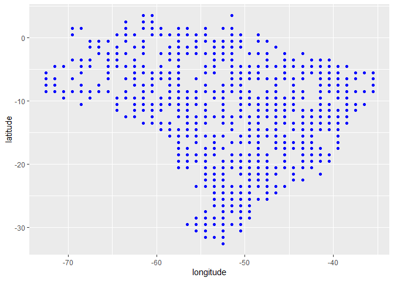

Aprendizado de Máquina: Emissão de CO<sub>2</sub> e CO<sub>2</sub>
Atmosférico
================

<!-- README.md is generated from README.Rmd. Please edit that file -->

##### *Panosso AR; Costa LM; Lima LR; Crispim, VS*

##### Financiamento: Fapesp (202102487-0); CNPq-PIBIC (Nº 2517 - EDITAL 4/2021)

# Resumo do Projeto

## Aquisição dos dados de CO<sub>2</sub> atmosférico (xCO2)

A aquisição de dados e o processamento inicial destes pode ser
encontrada no link:

#### <https://arpanosso.github.io/oco2/>

Para facilitar o acesso, os dodos foram adquiridos por meio do pacote
`{fco2}`.

``` r
## Instalando pacotes (se necessário)
# install.packages("devtools")
# Sys.getenv("GITHUB_PAT")
# Sys.unsetenv("GITHUB_PAT")
# Sys.getenv("GITHUB_PAT")
# devtools::install_github("arpanosso/fco2r")

library(tidyverse)
library(geobr)
library(fco2r)
library(skimr)
source("R/my_fun.R")
```

### Conhecendo a base de dados de CO<sub>2</sub> atmosférico

``` r
help(oco2_br)
#> starting httpd help server ... done
glimpse(oco2_br)
#> Rows: 146,646
#> Columns: 11
#> $ longitude                              <dbl> -70.33963, -70.33963, -70.33963~
#> $ longitude_bnds                         <chr> "-70.4644097222:-70.21484375", ~
#> $ latitude                               <dbl> -5.806417, -5.557240, -5.058887~
#> $ latitude_bnds                          <chr> "-5.93100534001:-5.68182872924"~
#> $ time_yyyymmddhhmmss                    <dbl> 2.014092e+13, 2.014092e+13, 2.0~
#> $ time_bnds_yyyymmddhhmmss               <chr> "20140915000000:20140916000000"~
#> $ altitude_km                            <dbl> 3307.8, 3307.8, 3307.8, 3307.8,~
#> $ alt_bnds_km                            <chr> "0.0:6615.59960938", "0.0:6615.~
#> $ fluorescence_offset_relative_771nm_idp <dbl> 0.0167236, 0.0187703, 0.0167454~
#> $ fluorescence_offset_relative_757nm_idp <dbl> 0.01495360, 0.01348060, 0.01151~
#> $ xco2_moles_mole_1                      <dbl> 0.000391583, 0.000394184, 0.000~
```

### Alguns gráficos

``` r
oco2_br %>% 
  sample_n(1000) %>% 
  ggplot(aes(x = longitude, y = latitude)) + 
  geom_point(color = "blue")
```

<!-- -->

### Carregando o contorno do território

``` r
br <- geobr::read_country(showProgress = FALSE)
#> Using year 2010
```

### Construindo o mapa com os pontos

``` r
br %>% 
  ggplot() +
  geom_sf(fill = "white") +
    geom_point(data=oco2_br %>% 
                 sample_n(2000),
             aes(x=longitude,y=latitude),
             shape=3,
             col="red",
             alpha=0.2)
```

<!-- -->

Observe que utilizamos `dplyr::sample_n()` para retirar apenas 1000
amostras do total do banco de dados 146, 646.

#### Estatísticas descritivas

``` r
skim(oco2_br)
```

|                                                  |          |
|:-------------------------------------------------|:---------|
| Name                                             | oco2\_br |
| Number of rows                                   | 146646   |
| Number of columns                                | 11       |
| \_\_\_\_\_\_\_\_\_\_\_\_\_\_\_\_\_\_\_\_\_\_\_   |          |
| Column type frequency:                           |          |
| character                                        | 4        |
| numeric                                          | 7        |
| \_\_\_\_\_\_\_\_\_\_\_\_\_\_\_\_\_\_\_\_\_\_\_\_ |          |
| Group variables                                  | None     |

Data summary

**Variable type: character**

| skim\_variable             | n\_missing | complete\_rate | min | max | empty | n\_unique | whitespace |
|:---------------------------|-----------:|---------------:|----:|----:|------:|----------:|-----------:|
| longitude\_bnds            |          0 |              1 |  20 |  29 |     0 |       157 |          0 |
| latitude\_bnds             |          0 |              1 |  27 |  31 |     0 |       157 |          0 |
| time\_bnds\_yyyymmddhhmmss |          0 |              1 |  29 |  29 |     0 |      2033 |          0 |
| alt\_bnds\_km              |          0 |              1 |  11 |  17 |     0 |        73 |          0 |

**Variable type: numeric**

| skim\_variable                             | n\_missing | complete\_rate |          mean |           sd |            p0 |           p25 |           p50 |           p75 |          p100 | hist  |
|:-------------------------------------------|-----------:|---------------:|--------------:|-------------:|--------------:|--------------:|--------------:|--------------:|--------------:|:------|
| longitude                                  |          0 |              1 | -5.062000e+01 | 7.950000e+00 | -7.383000e+01 | -5.562000e+01 | -5.037000e+01 | -4.463000e+01 | -3.490000e+01 | ▁▃▇▇▅ |
| latitude                                   |          0 |              1 | -1.243000e+01 | 7.780000e+00 | -3.371000e+01 | -1.777000e+01 | -1.154000e+01 | -6.800000e+00 |  5.160000e+00 | ▂▅▇▇▂ |
| time\_yyyymmddhhmmss                       |          0 |              1 |  2.017376e+13 | 1.785733e+10 |  2.014091e+13 |  2.016051e+13 |  2.017111e+13 |  2.019061e+13 |  2.020103e+13 | ▅▅▃▅▇ |
| altitude\_km                               |          0 |              1 |  3.103830e+03 | 1.164900e+02 |  2.555700e+03 |  3.026300e+03 |  3.118260e+03 |  3.180210e+03 |  3.307800e+03 | ▁▁▃▇▆ |
| fluorescence\_offset\_relative\_771nm\_idp |          0 |              1 | -1.077410e+03 | 3.280654e+04 | -9.999990e+05 |  1.000000e-02 |  1.000000e-02 |  2.000000e-02 |  3.070000e+00 | ▁▁▁▁▇ |
| fluorescence\_offset\_relative\_757nm\_idp |          0 |              1 | -5.796100e+02 | 2.406853e+04 | -9.999990e+05 |  0.000000e+00 |  1.000000e-02 |  2.000000e-02 |  2.380000e+01 | ▁▁▁▁▇ |
| xco2\_moles\_mole\_1                       |          0 |              1 |  0.000000e+00 | 0.000000e+00 |  0.000000e+00 |  0.000000e+00 |  0.000000e+00 |  0.000000e+00 |  0.000000e+00 | ▁▁▇▁▁ |

``` r
visdat::vis_miss(oco2_br %>% 
                   sample_n(10000))
```

<!-- -->

### Conhecendo a base de dados de emissão de CO<sub>2</sub> do solo

``` r
help(data_fco2)
glimpse(data_fco2)
#> Rows: 15,397
#> Columns: 39
#> $ experimento       <chr> "Espacial", "Espacial", "Espacial", "Espacial", "Esp~
#> $ data              <date> 2001-07-10, 2001-07-10, 2001-07-10, 2001-07-10, 200~
#> $ manejo            <chr> "convencional", "convencional", "convencional", "con~
#> $ tratamento        <chr> "AD_GN", "AD_GN", "AD_GN", "AD_GN", "AD_GN", "AD_GN"~
#> $ revolvimento_solo <lgl> FALSE, FALSE, FALSE, FALSE, FALSE, FALSE, FALSE, FAL~
#> $ data_preparo      <date> 2001-07-01, 2001-07-01, 2001-07-01, 2001-07-01, 200~
#> $ conversao         <date> 1970-01-01, 1970-01-01, 1970-01-01, 1970-01-01, 197~
#> $ cobertura         <lgl> TRUE, TRUE, TRUE, TRUE, TRUE, TRUE, TRUE, TRUE, TRUE~
#> $ cultura           <chr> "milho_soja", "milho_soja", "milho_soja", "milho_soj~
#> $ x                 <dbl> 0, 40, 80, 10, 25, 40, 55, 70, 20, 40, 60, 10, 70, 3~
#> $ y                 <dbl> 0, 0, 0, 10, 10, 10, 10, 10, 20, 20, 20, 25, 25, 30,~
#> $ longitude_muni    <dbl> 782062.7, 782062.7, 782062.7, 782062.7, 782062.7, 78~
#> $ latitude_muni     <dbl> 7647674, 7647674, 7647674, 7647674, 7647674, 7647674~
#> $ estado            <chr> "SP", "SP", "SP", "SP", "SP", "SP", "SP", "SP", "SP"~
#> $ municipio         <chr> "Jaboticabal", "Jaboticabal", "Jaboticabal", "Jaboti~
#> $ ID                <int> 1, 2, 3, 4, 5, 6, 7, 8, 9, 10, 11, 12, 13, 14, 15, 1~
#> $ prof              <chr> "0-0.1", "0-0.1", "0-0.1", "0-0.1", "0-0.1", "0-0.1"~
#> $ FCO2              <dbl> 1.080, 0.825, 1.950, 0.534, 0.893, 0.840, 1.110, 1.8~
#> $ Ts                <dbl> 18.73, 18.40, 19.20, 18.28, 18.35, 18.47, 19.10, 18.~
#> $ Us                <dbl> NA, NA, NA, NA, NA, NA, NA, NA, NA, NA, NA, NA, NA, ~
#> $ pH                <dbl> 5.1, 5.1, 5.8, 5.3, 5.5, 5.7, 5.6, 6.4, 5.3, 5.8, 5.~
#> $ MO                <dbl> 20, 24, 25, 23, 23, 21, 26, 23, 25, 24, 26, 20, 25, ~
#> $ P                 <dbl> 46, 26, 46, 78, 60, 46, 55, 92, 55, 60, 48, 71, 125,~
#> $ K                 <dbl> 2.4, 2.2, 5.3, 3.6, 3.4, 2.9, 4.0, 2.3, 3.3, 3.6, 4.~
#> $ Ca                <dbl> 25, 30, 41, 27, 33, 38, 35, 94, 29, 36, 37, 29, 50, ~
#> $ Mg                <dbl> 11, 11, 25, 11, 15, 20, 16, 65, 11, 17, 15, 11, 30, ~
#> $ H_Al              <dbl> 31, 31, 22, 28, 27, 22, 22, 12, 31, 28, 28, 31, 18, ~
#> $ SB                <dbl> 38.4, 43.2, 71.3, 41.6, 50.6, 60.9, 55.0, 161.3, 43.~
#> $ CTC               <dbl> 69.4, 74.2, 93.3, 69.6, 77.9, 82.9, 77.0, 173.3, 74.~
#> $ V                 <dbl> 55, 58, 76, 60, 65, 73, 71, 93, 58, 67, 67, 58, 82, ~
#> $ Ds                <dbl> NA, NA, NA, NA, NA, NA, NA, NA, NA, NA, NA, NA, NA, ~
#> $ Macro             <dbl> NA, NA, NA, NA, NA, NA, NA, NA, NA, NA, NA, NA, NA, ~
#> $ Micro             <dbl> NA, NA, NA, NA, NA, NA, NA, NA, NA, NA, NA, NA, NA, ~
#> $ VTP               <dbl> NA, NA, NA, NA, NA, NA, NA, NA, NA, NA, NA, NA, NA, ~
#> $ PLA               <dbl> NA, NA, NA, NA, NA, NA, NA, NA, NA, NA, NA, NA, NA, ~
#> $ AT                <dbl> NA, NA, NA, NA, NA, NA, NA, NA, NA, NA, NA, NA, NA, ~
#> $ SILTE             <dbl> NA, NA, NA, NA, NA, NA, NA, NA, NA, NA, NA, NA, NA, ~
#> $ ARG               <dbl> NA, NA, NA, NA, NA, NA, NA, NA, NA, NA, NA, NA, NA, ~
#> $ HLIFS             <dbl> NA, NA, NA, NA, NA, NA, NA, NA, NA, NA, NA, NA, NA, ~
```

### Visualização de dados

``` r
data_fco2 %>% 
  group_by(experimento, cultura, data) %>% 
  summarise(FCO2 = mean(FCO2, na.rm=TRUE)) %>% 
  ggplot(aes(y=FCO2, x=data)) +
  geom_line() +
   facet_wrap(~experimento+ cultura, scale="free")
#> `summarise()` has grouped output by 'experimento', 'cultura'. You can override
#> using the `.groups` argument.
```

<!-- -->

### Construindo o mapa com os pontos

``` r
br %>% 
  ggplot() +
  geom_sf(fill = "white") +
    geom_point(data=oco2_br %>% 
                 sample_n(2000),
             aes(x=longitude,y=latitude),
             shape=3,
             col="red",
             alpha=0.2)
```

<!-- -->

Observe que utilizamos `dplyr::sample_n()` para retirar apenas 1000
amostras do total do banco de dados 146, 646.

#### Estatísticas descritivas

``` r
skim(data_fco2)
```

|                                                  |            |
|:-------------------------------------------------|:-----------|
| Name                                             | data\_fco2 |
| Number of rows                                   | 15397      |
| Number of columns                                | 39         |
| \_\_\_\_\_\_\_\_\_\_\_\_\_\_\_\_\_\_\_\_\_\_\_   |            |
| Column type frequency:                           |            |
| character                                        | 7          |
| Date                                             | 3          |
| logical                                          | 2          |
| numeric                                          | 27         |
| \_\_\_\_\_\_\_\_\_\_\_\_\_\_\_\_\_\_\_\_\_\_\_\_ |            |
| Group variables                                  | None       |

Data summary

**Variable type: character**

| skim\_variable | n\_missing | complete\_rate | min | max | empty | n\_unique | whitespace |
|:---------------|-----------:|---------------:|----:|----:|------:|----------:|-----------:|
| experimento    |          0 |              1 |   8 |   8 |     0 |         2 |          0 |
| manejo         |          0 |              1 |   6 |  15 |     0 |        10 |          0 |
| tratamento     |          0 |              1 |   2 |  10 |     0 |        21 |          0 |
| cultura        |          0 |              1 |   4 |  14 |     0 |        11 |          0 |
| estado         |          0 |              1 |   2 |   2 |     0 |         2 |          0 |
| municipio      |          0 |              1 |   7 |  20 |     0 |         6 |          0 |
| prof           |          0 |              1 |   5 |   7 |     0 |         2 |          0 |

**Variable type: Date**

| skim\_variable | n\_missing | complete\_rate | min        | max        | median     | n\_unique |
|:---------------|-----------:|---------------:|:-----------|:-----------|:-----------|----------:|
| data           |          0 |              1 | 2001-07-10 | 2019-12-01 | 2014-07-12 |       205 |
| data\_preparo  |          0 |              1 | 1986-03-01 | 2019-04-01 | 2002-01-01 |        14 |
| conversao      |          0 |              1 | 1970-01-01 | 2009-07-03 | 1986-03-01 |        11 |

**Variable type: logical**

| skim\_variable     | n\_missing | complete\_rate | mean | count      |
|:-------------------|-----------:|---------------:|-----:|:-----------|
| revolvimento\_solo |          0 |              1 |    0 | FAL: 15397 |
| cobertura          |          0 |              1 |    1 | TRU: 15397 |

**Variable type: numeric**

| skim\_variable  | n\_missing | complete\_rate |       mean |         sd |        p0 |        p25 |        p50 |        p75 |       p100 | hist  |
|:----------------|-----------:|---------------:|-----------:|-----------:|----------:|-----------:|-----------:|-----------:|-----------:|:------|
| x               |          0 |           1.00 | 1392083.56 | 2923710.70 |      0.00 |       0.00 |      30.00 |     100.00 | 7749472.16 | ▇▁▁▁▂ |
| y               |          0 |           1.00 |  495854.97 | 1722529.75 |      0.00 |       0.00 |      27.00 |      80.00 | 7630525.47 | ▇▁▁▁▁ |
| longitude\_muni |          0 |           1.00 | 1067926.05 | 1796771.47 | 456798.63 |  458447.46 |  458447.46 |  792043.56 | 7638196.06 | ▇▁▁▁▁ |
| latitude\_muni  |          0 |           1.00 | 7231328.21 | 1754220.76 | 795907.06 | 7635356.70 | 7749398.84 | 7749821.85 | 7758831.37 | ▁▁▁▁▇ |
| ID              |          0 |           1.00 |      40.52 |      31.52 |      1.00 |      13.00 |      35.00 |      60.00 |     141.00 | ▇▅▃▁▁ |
| FCO2            |        110 |           0.99 |       2.78 |       2.08 |     -3.42 |       1.30 |       2.16 |       3.75 |      46.93 | ▇▁▁▁▁ |
| Ts              |        317 |           0.98 |      21.84 |       6.76 |      1.00 |      19.33 |      22.50 |      26.15 |     195.63 | ▇▁▁▁▁ |
| Us              |       1754 |           0.89 |      16.31 |       8.93 |      0.00 |      10.00 |      14.06 |      22.00 |      89.00 | ▇▅▁▁▁ |
| pH              |       2802 |           0.82 |       4.64 |       1.13 |      3.50 |       4.00 |       4.50 |       5.15 |      52.00 | ▇▁▁▁▁ |
| MO              |       1355 |           0.91 |      21.59 |      12.60 |      1.35 |      12.00 |      23.00 |      29.00 |      61.26 | ▆▇▇▂▁ |
| P               |       1355 |           0.91 |      20.95 |      24.74 |      1.00 |       6.00 |      15.48 |      27.36 |     253.00 | ▇▁▁▁▁ |
| K               |       1348 |           0.91 |       2.40 |       2.21 |      0.03 |       0.90 |       1.70 |       3.40 |      34.00 | ▇▁▁▁▁ |
| Ca              |       1376 |           0.91 |      17.20 |      14.57 |      1.10 |       6.00 |      11.00 |      26.00 |      94.00 | ▇▃▁▁▁ |
| Mg              |       1376 |           0.91 |      10.13 |       5.65 |      0.32 |       7.00 |      10.00 |      13.00 |      65.00 | ▇▂▁▁▁ |
| H\_Al           |       1362 |           0.91 |      46.89 |      29.38 |      0.00 |      26.00 |      42.29 |      72.00 |     121.00 | ▅▇▆▂▂ |
| SB              |       1376 |           0.91 |      29.69 |      20.10 |      1.54 |      15.60 |      23.80 |      42.00 |     161.30 | ▇▃▁▁▁ |
| CTC             |       1369 |           0.91 |      77.10 |      32.99 |      4.62 |      59.23 |      83.40 |     103.20 |     173.30 | ▂▃▇▃▁ |
| V               |       1383 |           0.91 |      41.68 |      20.05 |      4.96 |      22.00 |      43.00 |      58.00 |     100.00 | ▆▆▇▅▁ |
| Ds              |       3284 |           0.79 |       1.38 |       0.17 |      0.88 |       1.24 |       1.38 |       1.52 |       1.86 | ▁▆▇▇▁ |
| Macro           |       3277 |           0.79 |       8.55 |       7.85 |    -45.30 |       0.15 |       8.13 |      13.64 |      49.77 | ▁▁▇▃▁ |
| Micro           |       3298 |           0.79 |      25.30 |      17.13 |      0.07 |       0.37 |      33.86 |      38.30 |      52.42 | ▅▁▂▇▁ |
| VTP             |       3298 |           0.79 |      42.34 |      15.65 |     -4.68 |      40.81 |      46.25 |      51.32 |      87.80 | ▂▁▇▃▁ |
| PLA             |       3438 |           0.78 |      29.57 |      11.80 |    -47.30 |      21.27 |      32.41 |      38.15 |      79.80 | ▁▁▅▇▁ |
| AT              |       8083 |           0.48 |    1013.33 |    1358.81 |     11.72 |     236.00 |     593.62 |     816.00 |    4542.73 | ▇▁▁▁▂ |
| SILTE           |       8048 |           0.48 |     229.26 |     336.37 |      1.26 |      50.87 |      73.65 |     188.00 |    1395.00 | ▇▁▁▁▁ |
| ARG             |       8055 |           0.48 |     995.41 |    1560.32 |     27.19 |     173.27 |     403.69 |     609.50 |    5244.76 | ▇▁▁▁▂ |
| HLIFS           |      10872 |           0.29 |   14590.11 |   17253.55 |    158.39 |    1110.15 |    2409.80 |   29707.78 |   84692.90 | ▇▃▁▁▁ |

``` r
visdat::vis_miss(data_fco2 %>% 
                   sample_n(10000))
```

<!-- -->

``` r
# Lista do xCO2
# 01 passar as datas que estão em ano-mes-dia-horas-min-segundos
# para uma outra coluna denominada 'data' como ano-mes-dia
# Fazer em pipeline, usar o mutate do pacote dplyr e provavelmente
# a funçoes do pacote lubridate

oco2_br <- oco2_br |>
  dplyr::mutate (
    ano = time_yyyymmddhhmmss%/%1e10,
    mês = time_yyyymmddhhmmss%/%1e8 %%100,
    dia = time_yyyymmddhhmmss%/%1e6 %%100,
    data = as.Date(stringr::str_c(ano,mês,dia,sep="-"))
    )|>
  dplyr::glimpse()
#> Rows: 146,646
#> Columns: 15
#> $ longitude                              <dbl> -70.33963, -70.33963, -70.33963~
#> $ longitude_bnds                         <chr> "-70.4644097222:-70.21484375", ~
#> $ latitude                               <dbl> -5.806417, -5.557240, -5.058887~
#> $ latitude_bnds                          <chr> "-5.93100534001:-5.68182872924"~
#> $ time_yyyymmddhhmmss                    <dbl> 2.014092e+13, 2.014092e+13, 2.0~
#> $ time_bnds_yyyymmddhhmmss               <chr> "20140915000000:20140916000000"~
#> $ altitude_km                            <dbl> 3307.8, 3307.8, 3307.8, 3307.8,~
#> $ alt_bnds_km                            <chr> "0.0:6615.59960938", "0.0:6615.~
#> $ fluorescence_offset_relative_771nm_idp <dbl> 0.0167236, 0.0187703, 0.0167454~
#> $ fluorescence_offset_relative_757nm_idp <dbl> 0.01495360, 0.01348060, 0.01151~
#> $ xco2_moles_mole_1                      <dbl> 0.000391583, 0.000394184, 0.000~
#> $ ano                                    <dbl> 2014, 2014, 2014, 2014, 2014, 2~
#> $ mês                                    <dbl> 9, 9, 9, 9, 9, 9, 9, 9, 9, 9, 9~
#> $ dia                                    <dbl> 15, 15, 6, 6, 6, 6, 15, 6, 6, 6~
#> $ data                                   <date> 2014-09-15, 2014-09-15, 2014-0~
```

Listando as datas em ambos os bancos de dados

``` r
# Lista das datas de FCO2 
lista_data_fco2 <- unique(data_fco2$data)
lista_data_xco2 <- unique(oco2_br$data)
length(lista_data_fco2)
#> [1] 205
length(lista_data_xco2)
#> [1] 2033
datas <- lista_data_fco2[lista_data_fco2 %in% lista_data_xco2]
```

Criação as listas de datas, que é chave para a mesclagem dos arquivos.

``` r
fco2 <- data_fco2 |> 
  dplyr::filter(data %in% datas)

xco2 <- oco2_br |> 
  dplyr::filter(data %in% datas)
```

Coordenadas das cidades

``` r
unique(fco2$municipio)
#> [1] "Selv?ria"
```

Abordagem usando o join do `{dplyr}`

``` r
dados <- left_join(fco2 %>% 
            mutate(ano = lubridate::year(data),
                   mes = lubridate::month(data)) %>% 
            select(data, ano, mes,ID, x,y, FCO2, Ts, Us,
                   MO, Ds, Macro, Micro, VTP, ARG, HLIFS), 
          xco2 %>% 
            select(data,mês,dia,longitude,latitude,xco2_moles_mole_1)) %>% 
  mutate(dist = sqrt((longitude-(-51.423519))^2+(latitude-(-20.362911))^2)) 
#> Joining, by = "data"
```

``` r
# Us,MO, Ds, Macro, Micro, VTP, ARG, HLIFS
dados %>% 
  filter(dist<=1.75) %>% 
  group_by(ano, mes, ID) %>% 
  summarise(FCO2 = mean(FCO2, na.rm=TRUE),
            Ts = mean(Ts, na.rm=TRUE),
            Us = mean(Us, na.rm=TRUE),
            MO = mean(MO, na.rm=TRUE),
            Ds = mean(Ds, na.rm=TRUE),
            Macro = mean(Macro, na.rm=TRUE),
            Micro = mean(Micro, na.rm=TRUE),
            VTP = mean(VTP, na.rm=TRUE),
            ARG = mean(ARG, na.rm=TRUE),
            HLIFS = mean(HLIFS, na.rm=TRUE),
            xco2_moles_mole_1= mean(xco2_moles_mole_1, na.rm=TRUE)) %>% 
  drop_na()
#> `summarise()` has grouped output by 'ano', 'mes'. You can override using the
#> `.groups` argument.
#> # A tibble: 296 x 14
#> # Groups:   ano, mes [7]
#>      ano   mes    ID  FCO2    Ts    Us    MO    Ds Macro Micro   VTP   ARG
#>    <dbl> <dbl> <int> <dbl> <dbl> <dbl> <dbl> <dbl> <dbl> <dbl> <dbl> <dbl>
#>  1  2017     4     1  4.22  5.5   24.4   6.5  1.37 10.5   32.7  43.2  277.
#>  2  2017     4     2  6.07  6.5   24.4   6    1.5   7.41  34.2  41.6  260.
#>  3  2017     4     3  7.66  5.5   24.2   8    1.36  9.28  31.8  41.0  267.
#>  4  2017     4     4  4.28  5.5   24.0   6    1.38 11.8   31.2  43.0  324.
#>  5  2017     4     6  2.84  5.5   24     7.5  1.49  7.97  36.3  44.3  282.
#>  6  2017     4     7  4.82  5.5   24.6   5.5  1.35 13.7   33.7  47.4  334.
#>  7  2017     4     8  4.32  6     24.2   7    1.41  6.60  40.4  47.0  351.
#>  8  2017     4     9  4.73  6.67  24.3   6    1.37 12.5   32.8  45.3  330.
#>  9  2017     4    10  4.81  4.5   24.5   6.5  1.31 12.4   34.3  46.7  325.
#> 10  2017     4    11  4.15  7.5   24.3   8.5  1.38 12.5   34.9  47.4  334.
#> # ... with 286 more rows, and 2 more variables: HLIFS <dbl>,
#> #   xco2_moles_mole_1 <dbl>
```

``` r
br |>
   ggplot2::ggplot() +
   ggplot2::geom_sf(fill="#2D3E50", color="#FEBF57",
           size=.15, show.legend = FALSE) +
   ggplot2::geom_point(data=dados %>% sample_n(200) ,
              ggplot2::aes(x=longitude, y=latitude),
              shape=17,
              col="red",
              alpha=0.2)
```

<!-- -->
