# CO2 Virtual Science Data Environment

O objetivo desse material é apresentar os procedimentos básicos para aquisição de dados do satélite OCO-2 e processamento inicial em R.

## Aquisição de dados

**1)** Acesse o endereço <https://co2.jpl.nasa.gov/>
  
```{r echo=FALSE, fig.cap="",fig.align='center',out.width = "600px"}

```
**2)** Acesse o Browse *OCO-2 Data* em *Level 2 Data Set OCO-2*.

```{r echo=FALSE, fig.cap="",fig.align='center',out.width = "600px"}
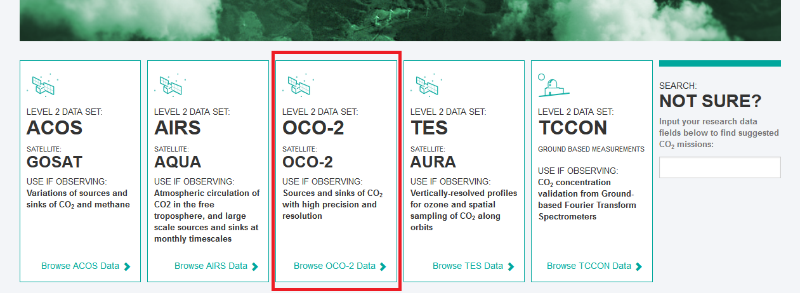
```

**3)** Role a página para baixo e acesse *CUSTOMIZE PRODUCT ON BUILD PAGE*.

```{r echo=FALSE, fig.cap="",fig.align='center',out.width = "600px"}
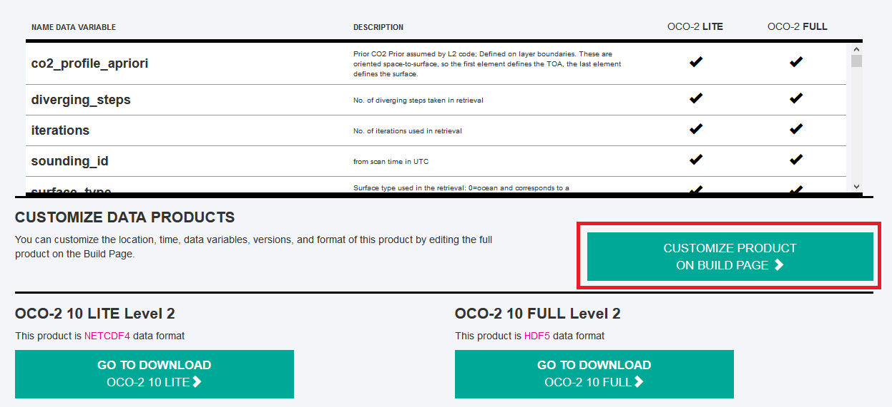
```

**4)** No menu à esquerda estarão as 9 categorias para personalizar o banco de dados.

```{r echo=FALSE, fig.cap="",fig.align='center',out.width = "600px"}
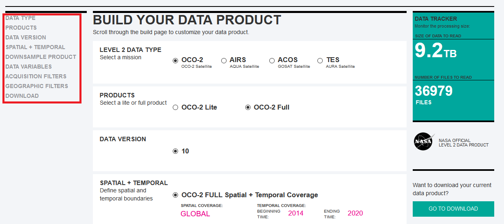
```

**5)** Em *DATA TYPE* selecione **OCO-2 Satellite**.

```{r echo=FALSE, fig.cap="",fig.align='center',out.width = "600px"}
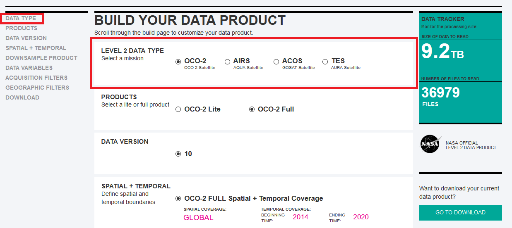
```

**6)** Em *PRODUCTS* selecione **OCO-2 Full**.

```{r echo=FALSE, fig.cap="",fig.align='center',out.width = "600px"}
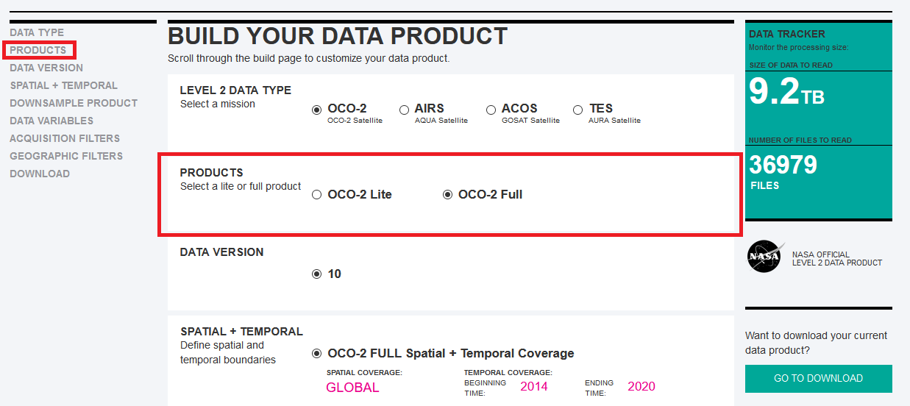
```

**7)** Em *DATA VERSION* selecione **10**.

```{r echo=FALSE, fig.cap="",fig.align='center',out.width = "600px"}
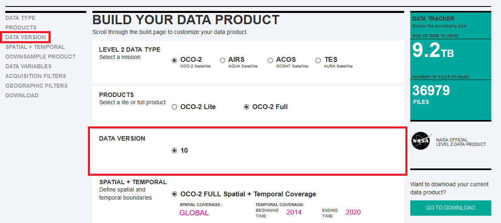
```

**8)** Em *SPATIAL + TEMPORAL* selecione **Customize Your Spatial + Temporal Coverage**.

```{r echo=FALSE, fig.cap="",fig.align='center',out.width = "600px"}
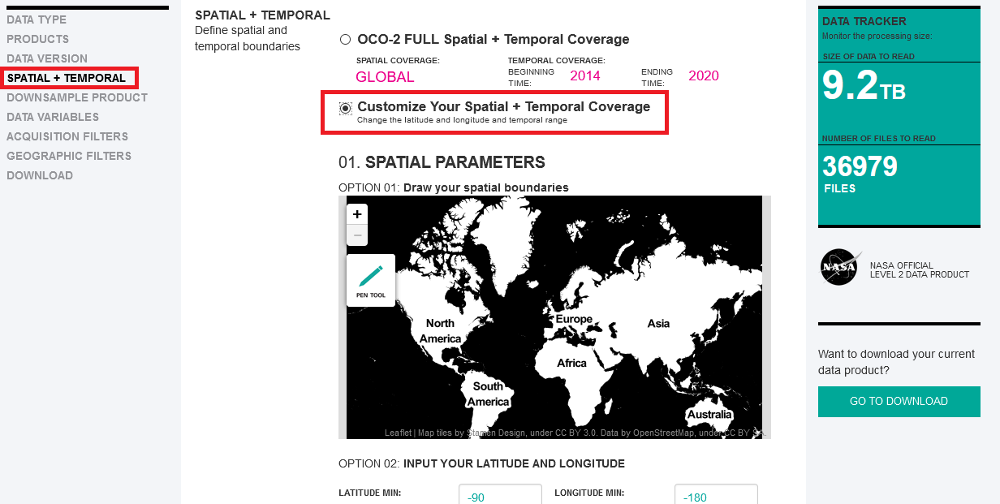
```

**OPTION 01** Utilize para selecionar a área para aquisição dos dados.

```{r echo=FALSE, fig.cap="",fig.align='center',out.width = "600px"}
knitr::include_graphics("../inst/jpl_09.png")
```

**OPTION 02** Utilize para selecionar o período para aquisição dos dados.

```{r echo=FALSE, fig.cap="",fig.align='center',out.width = "600px"}
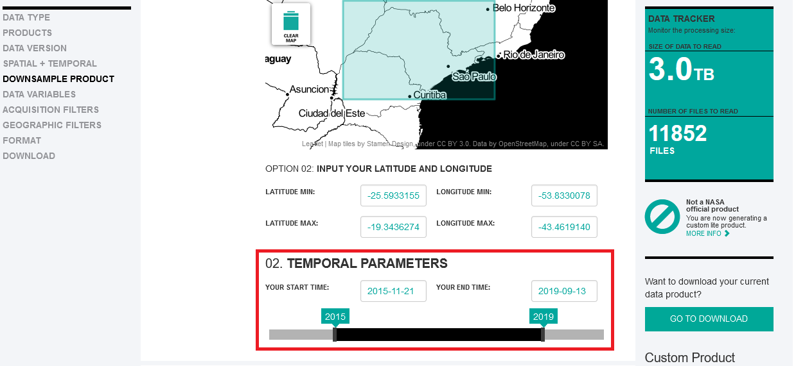
```

**9)** Em *DOWN SAMPLE PRODUCT* selecione **Yes, I want a Level 3 data product**. Altere os valores das células e o passo temporal desejado.

```{r echo=FALSE, fig.cap="",fig.align='center',out.width = "600px"}
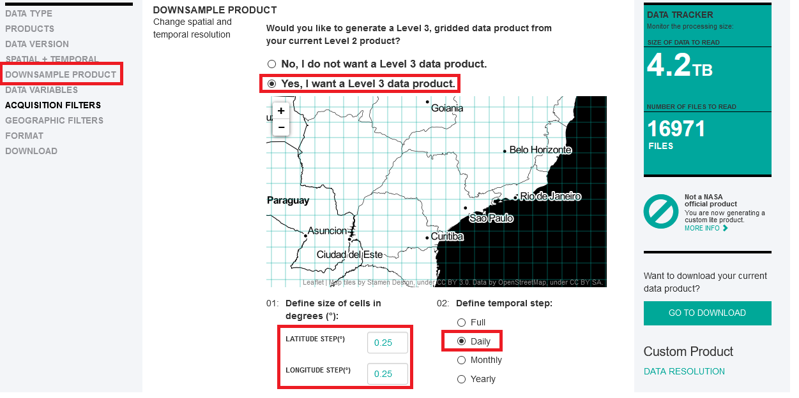
```

**10)** Em *DATA VARIABLES* selecione as variáveis desejadas.

```{r echo=FALSE, fig.cap="",fig.align='center',out.width = "600px"}
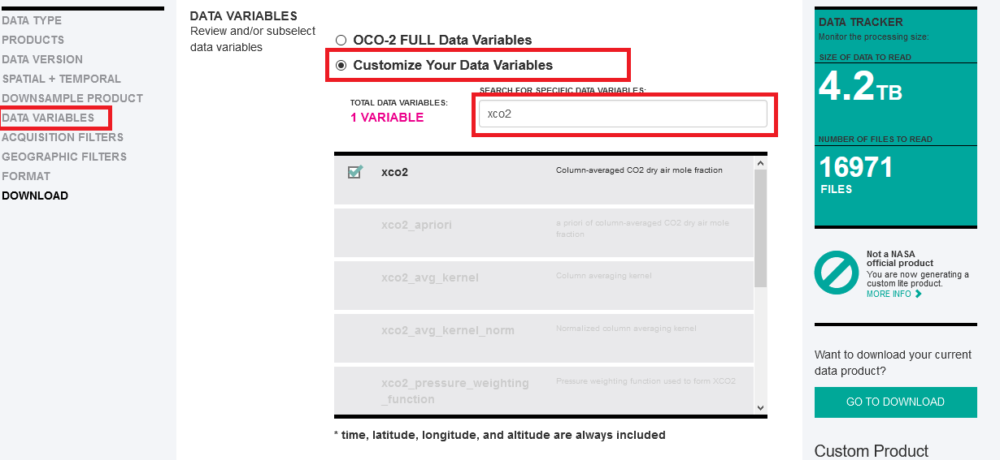
```


**11)** Abaixo são apresentadas as opções para os filtros e o tipo de arquivo, selecione **CSV FILE**.

```{r echo=FALSE, fig.cap="",fig.align='center',out.width = "600px"}
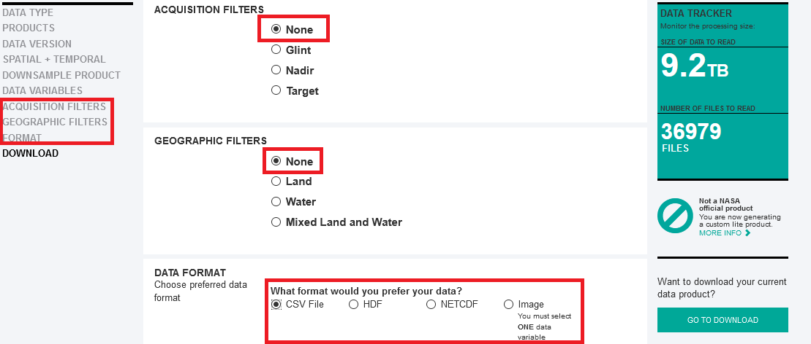
```

**12)** Forneça um endereço de e-mail para onde os links serão direcionados.

```{r echo=FALSE, fig.cap="",fig.align='center',out.width = "600px"}
knitr::include_graphics("../inst/jpl_12.png")
```
**13)** Acesse o seu e-mail, será enviado uma mensagem com o endereço dos arquivos onde você poderá acompanhar o progresso do processamento de seus dados. Ao final dessa etapa um novo e-mail é enviado informando que os dados estão disponíveis.

```{r echo=FALSE, fig.cap="",fig.align='center',out.width = "600px"}

```

**14)** Acesse o link enviado em seu e-mail e você será direcionado a página.

```{r echo=FALSE, fig.cap="",fig.align='center',out.width = "600px"}
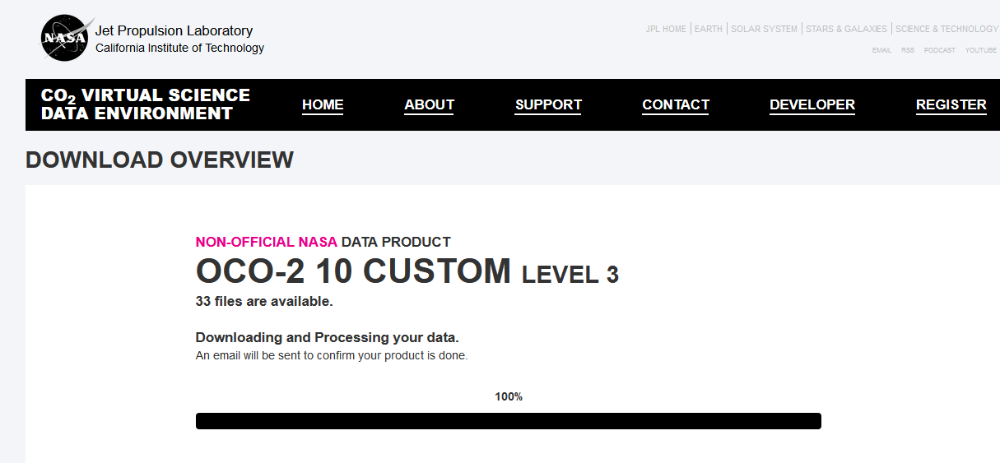
```

**15)** Role a página para baixo e selecione a opção **WGET File List**.

```{r echo=FALSE, fig.cap="",fig.align='center',out.width = "800px"}

```


**16)** Salve o arquivo .txt na pasta `data-raw`.

```{r echo=FALSE, fig.cap="",fig.align='center',out.width = "300px"}
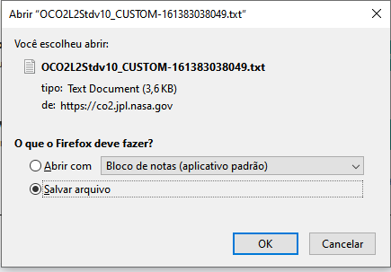
```

## Download e processamento dos dados no R.

### Carregando os pacotes no ambiente de trabalho

```{r, message=FALSE, error=FALSE}
library(tidyverse)
library(ggpubr)
library(geobr)
library(sp)
```

### Baixando os dados solicitados em CO2 Virtual Science Data Environment

Antes de realizar a leitura, recomendamos a criação da estrutra de diretórios como apresentado abaixo: 

  * pasta **data-raw/CVS** que receberá o download dos arquivos CSV; 

  * pasta **data-raw/txt** que receberá os arquivos TXT após a faxina inicial; 

  * pasta **data** que receberá o arquivos tratados em RDS; 

```{r, eval=FALSE}
# Download dos dados
# buscar o nome do arquivo contendo o termo CUSTON
%>%` <- magrittr::`%>%`
nome <- dir("data-raw/", pattern = "CUSTOM")

# ler os endereços armazenados no arquivo
enderecos<-read.table(paste0("data-raw/", nome))
n_links <- nrow(enderecos)
n_split <- length(stringr::str_split(enderecos[1,1],"/",simplify = TRUE))
nomes_arquivos_csv <- stringr::str_split_fixed(enderecos[,1],"/",n=Inf)[,n_split]
nomes_arquivos_txt<-sub(".csv",".txt",nomes_arquivos_csv)

### download dos arquivos - aproximadamente 2 GB ao todo
# for(i in 1:n_links){
#  download.file(enderecos[i,1], 
#                paste0("data-raw/CSV",nomes_arquivos_csv[i]), 
#                mode="wb")
# }
```

Aguarde até todos os arquivos serem baixados. Verifique os arquivos na pasta **data-raw/CSV**. No repositório do GitHub esses arquivos não serão fornecidos por serem muito grandes.

```{r echo=FALSE, fig.cap="",fig.align='center',out.width = "600px"}
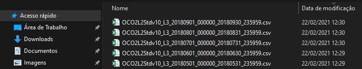
```

Pronto, agora temos todos os arquivos na pasta **data-raw** aguardando a faxina.


### Faxina dos arquivos

Os arquivos `.csv` são, de maneira geral, maiores que 120 $MB$, portanto, vamos abrir cada arquivo individualmente, filtrar valores faltantes (`NA`) para a coluna de $CO_2$ atmosférico (`xco2`), e salvar em novos arquivos txt na pasta  **data-raw/txt**. Os valos de concentração não observados têm como marcação `-999999`.


```{r,eval=FALSE}
for(i in 1:n_links){
   da<-read.csv(paste0("data-raw/CSV/", nomes_arquivos_csv[i]), sep=",")
     da <- da %>%
     filter(xco2..Moles.Mole...1.. != -999999)
     write.table(da,
                paste0("data/TXT/",nomes_arquivos_txt[i]),
                quote = FALSE,
                sep="\t",row.names = FALSE)
}
```

Vamos agora juntar todos os arquivos em um único denominado `XCO2_20142020.rds` para posterior processamento.

```{r, eval=FALSE}
# Lendo os arquivo totais
for(i in 1:n_links){
  if(i == 1){
    tab<-read.table(paste0("data-raw/TXT/",nomes_arquivos_txt[i]),h=TRUE,sep="\t")
  }else{
    da<-read.table(paste0("data-raw/TXT/",nomes_arquivos_txt[i]),h=TRUE,sep="\t")
    tab<-rbind(tab,da)
  }
}
dplyr::glimpse(tab)
readr::write_rds(tab,"data/XCO2_20142020.rds")
```

## Processamento 

Verificar o banco de dados com a função `glimpse()` do pacote `dplyr`.


### Carregando os pacotes requeridos
```{r, warning=FALSE,message=FALSE}
library(magrittr)
library(ggplot2)
library(dplyr)
library(tidyr)
source("../r/graficos.R")
source("../r/my_fun.R")
```


```{r}
xco2 <- readr::read_rds("../data/XCO2_20142020.rds")
glimpse(xco2)
```


 
Selecionar somente as variáveis necessárias para a sua análise, para isso, vamos criar um outro denominado `oco_2`, a partir da seleção de longitude, latitude, tempo e a concentração de $CO_2$ atmosférico:
 
```{r}
oco_2<-xco2 %>% 
        select(longitude,
               latitude,
               time..YYYYMMDDHHMMSS.,
               xco2..Moles.Mole...1..) %>% 
View()
```


Agora precisamos transformar os dados de $CO_2$ para $ppm$, e criar uma coluna para da data, o dia mês e ano de cada observação, a partir da coluna `time..YYYYMMDDHHMMSS`.

```{r}
oco_2 <- oco_2 %>% 
  mutate(
    xco2_obs = xco2..Moles.Mole...1.. *1e06,
    ano = time..YYYYMMDDHHMMSS.%/%1e10,
    mês = time..YYYYMMDDHHMMSS.%/%1e8 %%100,
    dia = time..YYYYMMDDHHMMSS.%/%1e6 %%100,
    data = as.Date(stringr::str_c(ano,mês,dia,sep="-"))
  ) %>% 
  glimpse()
```

Vamos filtrar os dados que estão dentro de uma área desejada, para isso vamos utlizar os polígonos e funções dos pacotes `geobr` e `sp`.
 
Inicialmente, devemos plotar o mapa do Brasil, e ler os polígonos dos municípios de um estado (SP por exmplo), cada estado, cada regiões e do país como um todo.

```{r,message=FALSE,error=FALSE}
muni <- geobr::read_municipality(code_muni = "SP",showProgress = FALSE)
estados <- geobr::read_state(code_state = "all",showProgress = FALSE)
regiao <- geobr::read_region(showProgress = FALSE)
br <- geobr::read_country(showProgress = FALSE)
sp <- geobr::read_state(code_state = "SP",showProgress = FALSE)
ms <- geobr::read_state(code_state = "MS",showProgress = FALSE)
```

Plotando as delimitações do país.

```{r,message=FALSE,warning=FALSE}
br %>% 
  ggplot() + 
  geom_sf(fill="#2D3E50", color="#FEBF57", 
          size=.15, show.legend = FALSE) +
  tema_mapa()
```
Plotando as regiões.

```{r, message=FALSE}
regiao %>% 
  ggplot() + 
  geom_sf(fill="#2D3E50", color="#FEBF57", 
          size=.15, show.legend = FALSE)+
  tema_mapa()
```

Plotando as delimitações do país com os estados.

```{r, message=FALSE}
estados %>% 
  ggplot() + 
  geom_sf(fill="#2D3E50", color="#FEBF57", 
          size=.15, show.legend = FALSE)+
  tema_mapa()
```

Plotando as delimitações do país com os estados específicos.

```{r, message=FALSE}
# plotar os estados
br %>% 
  ggplot() + 
  geom_sf(fill="#2D3E50", color="#FEBF57", 
          size=.15, show.legend = FALSE)+
  geom_sf(data=sp,fill="#2D3E50", color="#FEBF57")+ 
  geom_sf(data=ms,fill="#2D3E50", color="#FEBF57")+
  tema_mapa()
```
Todos os munícipios de um estados.

```{r,message=FALSE}
# Fazer o plot
muni %>% 
  ggplot() + 
  geom_sf(fill="#2D3E50", color="#FEBF57", 
          size=.15, show.legend = FALSE)+
  tema_mapa()
```

A partir do mapa base, vamos sobrepor os registros do objeto `oco_2`.

```{r,message=FALSE}
br %>% 
  ggplot() + 
  geom_sf(fill="#2D3E50", color="#FEBF57", 
          size=.15, show.legend = FALSE)+
  tema_mapa() +
  geom_point(data=oco_2 %>% filter(ano == 2014) ,
             aes(x=longitude,y=latitude),
             shape=3,
             col="red",
             alpha=0.2)
```

É necessário selecionar somente aqueles pontos dentro do polígono da área. Inicialmente devemos extrair o polígono de cada shape do pacote `geobr`.

```{r}
pol_sp <- as.matrix(sp$geom[[1]]) # pol estado de são paulo
pol_ms <- as.matrix(ms$geom[[1]]) # pol estado de ms
pol_br <- as.matrix(br$geom[[1]]) # pol do brasil
pol_br <- pol_br[pol_br[,1]<=-34,] # CORREÇÃO do polígono
pol_br <- pol_br[!((pol_br[,1]>=-38.8 & pol_br[,1]<=-38.6) &
                              (pol_br[,2]>= -19 & pol_br[,2]<= -16)),]
pol_norte <- as.matrix(regiao$geom[[1]]) # pol região norte
pol_sudeste <- as.matrix(regiao$geom[[3]]) # pol região sudeste
pol_sudeste <- pol_sudeste[pol_sudeste[,1]<=-34,] # CORREÇÃO do polígono
pol_sul <- as.matrix(regiao$geom[[4]]) # pol região sul
pol_centro_oeste <- as.matrix(regiao$geom[[5]]) # pol centro oeste
pol_nordeste <- as.matrix(regiao$geom[[2]]) # pol nordeste
pol_nordeste <- pol_nordeste[pol_nordeste[,1]<=-34,]# CORREÇÃO do polígono
pol_nordeste <- pol_nordeste[!((pol_nordeste[,1]>=-38.7 & pol_nordeste[,1]<=-38.6) &
                              pol_nordeste[,2]<= -15),]# CORREÇÃO do polígono
```

Selecionamos os pontos que estão dentro do polígono do estado de São Paulo e Mato Grosso do Sul, no nosso exemplo. Utilizaremos a função `point.in.polygon()` do pacote `sp`.


```{r}
oco_2 <- oco_2 %>% 
  mutate(
    point_in_pol = as.logical(sp::point.in.polygon(point.x = longitude, 
                                    point.y = latitude,
                                    pol.x = pol_sp[,1],
                                    pol.y = pol_sp[,2]) 
                              |
                              sp::point.in.polygon(point.x = longitude, 
                                    point.y = latitude,
                                    pol.x = pol_ms[,1],
                                    pol.y = pol_ms[,2]))
  )
```

Vamos refazer o mapa anterior com os dados dentro do polígono.

```{r,message=FALSE}
br %>% 
  ggplot() + 
  geom_sf(fill="#2D3E50", color="#FEBF57", 
          size=.15, show.legend = FALSE)+
  tema_mapa() +
  geom_point(data=oco_2 %>% filter(point_in_pol),
             aes(x=longitude,y=latitude),
             shape=3,
             col="red",
             alpha=0.2)
```

Selecionamos os pontos que estão dentro do Brasil.


```{r}
oco_2 <- oco_2 %>% 
  mutate(
    point_in_pol = as.logical(sp::point.in.polygon(point.x = longitude, 
                                    point.y = latitude,
                                    pol.x = pol_br[,1],
                                    pol.y = pol_br[,2])))
```

Vamos refazer o mapa anterior com os dados dentro do polígono.

```{r,message=FALSE}
br %>% 
  ggplot() + 
  geom_sf(fill="#2D3E50", color="#FEBF57", 
          size=.15, show.legend = FALSE)+
  tema_mapa() +
  geom_point(data=oco_2 %>% filter(ano==2014, point_in_pol),
             aes(x=longitude,y=latitude),
             shape=3,
             col="red",
             alpha=0.2)
```

Observa-se um problema na região nordeste, pontos não alocados, então vamos adicionar a esse mapa os pontos dessa região.


```{r}
oco_2 <- oco_2 %>% 
  mutate(
    point_in_pol = as.logical(sp::point.in.polygon(point.x = longitude, 
                                    point.y = latitude,
                                    pol.x = pol_br[,1],
                                    pol.y = pol_br[,2]) 
                              |
                              sp::point.in.polygon(point.x = longitude, 
                                    point.y = latitude,
                                    pol.x = pol_nordeste[,1],
                                    pol.y = pol_nordeste[,2]))
  )
```

Vamos refazer o mapa anterior com os dados dentro do polígono.

```{r,message=FALSE}
br %>% 
  ggplot() + 
  geom_sf(fill="#2D3E50", color="#FEBF57", 
          size=.15, show.legend = FALSE)+
  tema_mapa() +
  geom_point(data=oco_2 %>% filter(point_in_pol),
             aes(x=longitude,y=latitude),
             shape=3,
             col="red",
             alpha=0.2)
```


Vamos olhar os outliers.

```{r}
oco_2 %>% 
  filter(point_in_pol) %>% 
  ggplot(aes(y=xco2..Moles.Mole...1..))+
  geom_boxplot(fill="orange",outlier.colour = "red")+
  coord_cartesian(xlim=c(-1,1))+
  theme_classic()
```

O padrão de `coef` é 1,5 e define o comprimento dos bigodes com base no coeficiente e na distância interquartil, com todos os pontos fora dos bigodes considerados outliers.


filtrando os outliers.

```{r}
oco_2 %>% 
  filter(point_in_pol, xco2..Moles.Mole...1.. > limites_outlier(oco_2$xco2..Moles.Mole...1..)[1] &
           xco2..Moles.Mole...1.. < limites_outlier(oco_2$xco2..Moles.Mole...1..)[2]) %>% 
  ggplot(aes(y=xco2..Moles.Mole...1..))+
  geom_boxplot(fill="orange",outlier.colour = "red")+
  coord_cartesian(xlim=c(-1,1))+
  theme_classic()
```


```{r}
oco_2 %>%
  mutate(ano_mes = paste0(ano,mês)) %>%  
  group_by(ano,mês) %>% 
  ggplot(aes(y=xco2_obs,x=as.factor(mês),
             fill=as.factor(mês)))+
  geom_violin(trim = FALSE) +
  theme(legend.position = "none")+
  facet_wrap(~ano,scales = "free")+
  labs(x="Mês",y="XCO2 (ppm)")+
  theme_bw()
```


Observe a emissão de $CO_2$ ao longo do tempo para esses dados.

```{r}
oco_2 %>% 
  filter(point_in_pol) %>% 
  ggplot(aes(x=data,y=xco2_obs)) +
  geom_point(color="blue") +
  geom_line(color="red")
```

Agora devemos retirar a tendência ao longo do tempo, para isso, dentro do período específico, faremos a retirada por meio de um ajuste linear:

```{r, error=FALSE, message=FALSE}
oco_2 %>% 
  arrange(data) %>%
  mutate(x= 1:nrow(oco_2)) %>% 
  ggplot(aes(x=x,y=xco2_obs)) +
  geom_point(shape=21,color="black",fill="gray") +
  geom_smooth(method = "lm") +
  ggpubr::stat_regline_equation(aes(
  label =  paste(..eq.label.., ..rr.label.., sep = "*plain(\",\")~~")))
```

Extrair os coeficientes $a$ e $b$ da análise de regressão linear ($y = a + bX$).

```{r}
d_aux<-oco_2 %>% 
  arrange(data) %>%
  mutate(x= 1:nrow(oco_2)) %>%                  
  filter(point_in_pol) %>% 
  select(x,xco2_obs)
mod <- lm(d_aux$xco2_obs~d_aux$x)
summary.lm(mod)
a<-mod$coefficients[1]
b<-mod$coefficients[2]
```
Criando a variável `xco2_est` a partir da retirada da tendência.

```{r}
oco_2 <- oco_2 %>% 
  arrange(data) %>%
  mutate(
    xco2_est = a + b * as.numeric(data),
    delta = xco2_est - xco2_obs,
    XCO2 = (a-delta) - (mean(xco2_obs) - a)
  ) %>% 
  glimpse()
```


```{r, error=FALSE, message=FALSE}
oco_2 %>% 
  # filter(point_in_pol) %>% 
  ggplot(aes(x=data,y=XCO2)) +
  geom_point(shape=21,color="black",fill="gray")
```

Buscando os dados de duas regiões.

```{r}
# Criando o filtro
oco_2 <- oco_2 %>% 
  mutate(
    point_in_pol_sp_ms = as.logical(sp::point.in.polygon(point.x = longitude, 
                                      point.y = latitude,
                                      pol.x = pol_sp[,1],
                                      pol.y = pol_sp[,2]) 
                                    |
                                    sp::point.in.polygon(point.x = longitude, 
                                      point.y = latitude,
                                      pol.x = pol_ms[,1],
                                      pol.y = pol_ms[,2]))
    )

# Plotando os dados
ggplot(sp) + 
  geom_sf(fill="#2D3E50", color="#FEBF57", 
          size=.15, show.legend = FALSE)+
  geom_sf(data=ms,fill="#2D3E50", color="#FEBF57", 
          size=.15, show.legend = FALSE)+
  tema_mapa() +
    geom_point(data=oco_2 %>% filter(point_in_pol_sp_ms),
             aes(x=longitude,y=latitude,color=xco2_est))
```

Pronto, agora seu projeto pode continuar...